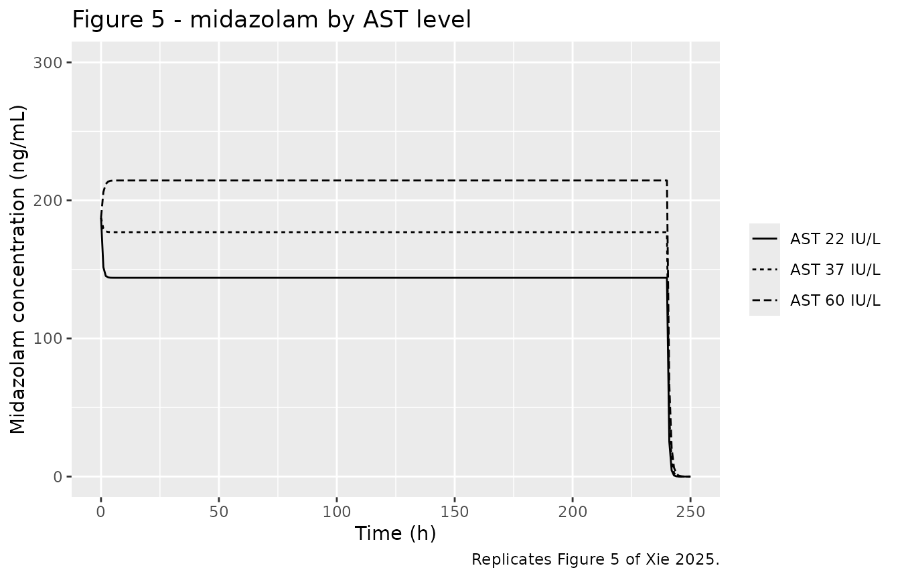
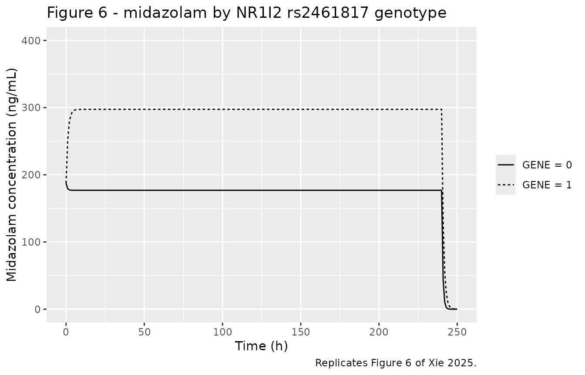
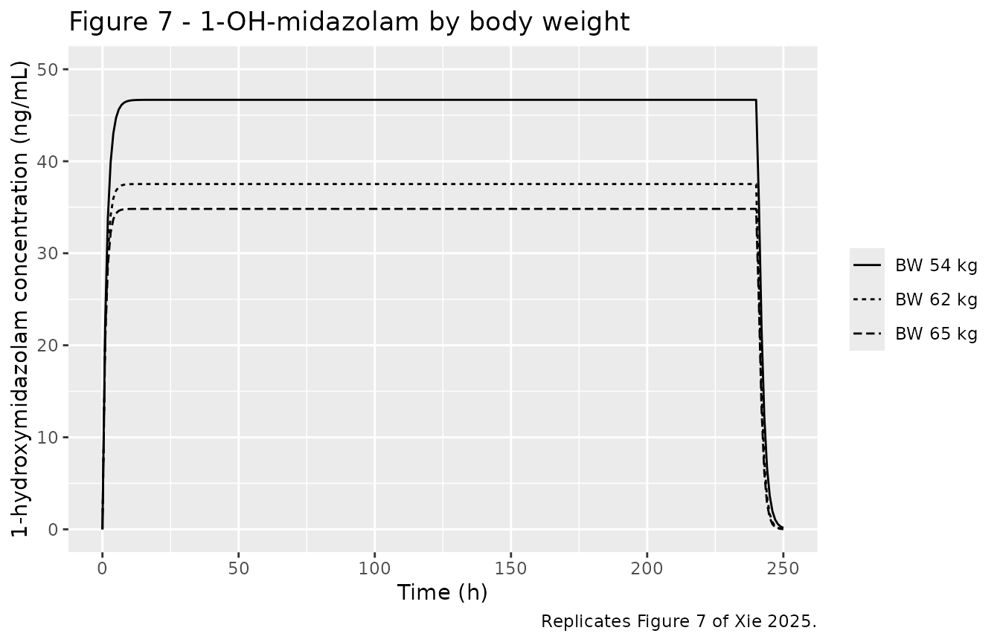
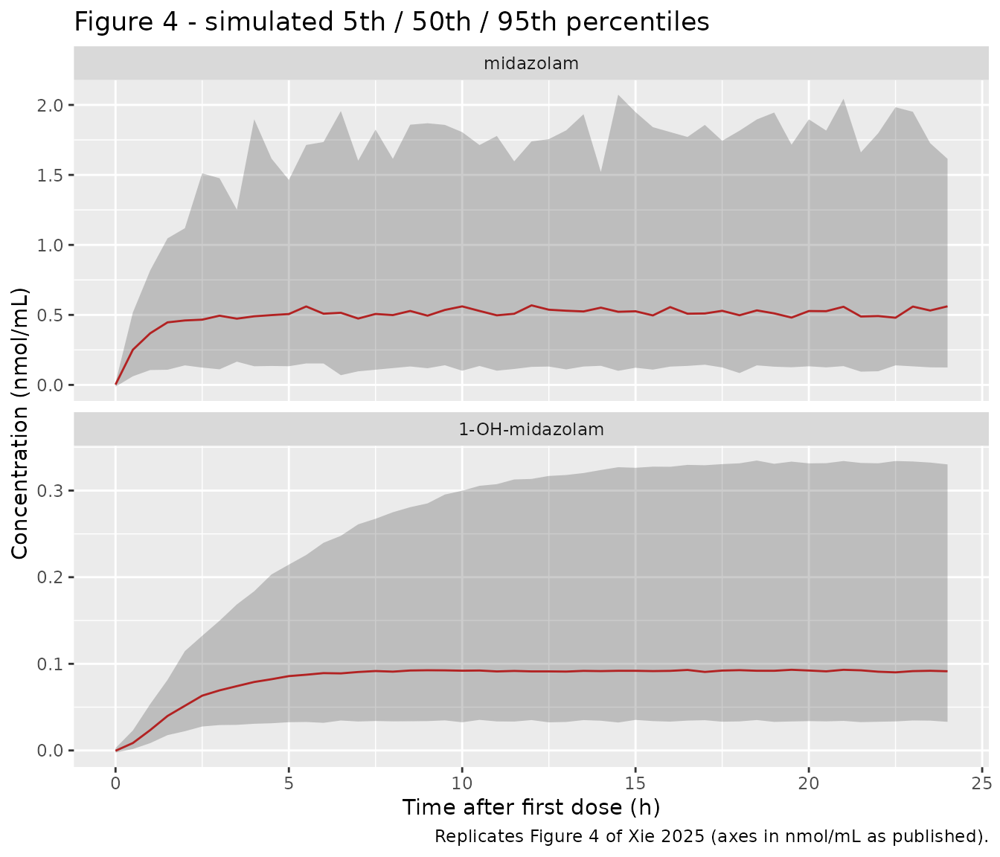

# Midazolam (Xie 2025)

## Model and source

``` r

mod <- rxode2::rxode(readModelDb("Xie_2025_midazolam"))
#> ℹ parameter labels from comments will be replaced by 'label()'
mod_typical <- rxode2::zeroRe(mod)
```

- Citation: Xie H, Zheng Y, Zhang H, Guo Y, Liu M, Weng Q, Wu X.
  Association of NR1I2 Polymorphism with Midazolam Clearance in
  Mechanically Ventilated ICU Patients: A Population Pharmacokinetic and
  Pharmacogenetic Study. Drug Des Devel Ther. 2025;19:1527-1541.
  <doi:10.2147/DDDT.S495647>.
- Description: Joint parent-metabolite population PK model for midazolam
  (MDZ) and its active metabolite 1-hydroxymidazolam (1-OH-MDZ) during
  continuous intravenous infusion in 61 mechanically ventilated Chinese
  adult ICU patients (Xie 2025). Midazolam: one-compartment IV
  disposition. 1-OH-MDZ: a separate one-compartment model for formation
  and elimination, driven by the fraction of midazolam converted to the
  metabolite (FMET fixed at 0.6 from Seng et al); the metabolite CL and
  V are therefore apparent values conditional on that fixed fraction.
  Midazolam clearance decreases with aspartate aminotransferase (power
  form, reference 37 IU/L) and is 40.5% lower in carriers of the
  homozygous-variant NR1I2 (PXR) rs2461817 genotype (fractional-shift
  form). 1-OH-MDZ clearance increases with total body weight (power
  form, reference 62 kg). IIV on both clearances; midazolam residual
  error is combined proportional plus additive, 1-OH-MDZ residual error
  is additive only.
- Article: <https://doi.org/10.2147/DDDT.S495647>

Xie 2025 is the first prospective population pharmacokinetic study of
midazolam in mechanically ventilated Chinese ICU patients, and the first
to report an effect of the *NR1I2* (PXR) rs2461817 polymorphism on
midazolam clearance. Midazolam and its active metabolite
1-hydroxymidazolam (1-OH-MDZ) were fitted simultaneously, each with a
one-compartment model, with the molar fraction of midazolam converted to
1-OH-MDZ fixed at 0.6.

## Population

Sixty-one adults (of 69 screened) admitted to the ICU of Fujian Medical
University Union Hospital between April 2020 and August 2022, all
mechanically ventilated for at least 24 h and sedated with a continuous
intravenous midazolam infusion titrated to a target Richmond
Agitation-Sedation Scale score. Baseline characteristics come from Xie
2025 Table 1: median weight 62.0 kg (38.0-87.6), median age 67 years
(29-90), 68.9% male, median APACHE II 16 (2-24), median AST 37.0 IU/L
(10.0-362.0), median albumin 31.7 g/L, median creatinine clearance 70.77
mL/min. Patients with hepatic coma or cirrhosis, with neurological
conditions preventing sedation assessment, or with haemodynamic
instability requiring frequent dose changes were excluded, which is why
the cohort is described in the Discussion as “mostly postoperative
patients in relatively good health”.

Two hundred and thirty-seven paired midazolam / 1-OH-MDZ arterial plasma
samples were drawn over the first 0-24 h of infusion (pre-dose and in
the windows 0-0.5, 1-3, 4-6 and 10-12 h) and assayed by LC-MS/MS with
LLOQs of 0.5 ng/mL (midazolam) and 0.25 ng/mL (1-OH-MDZ). Observed
concentrations spanned 1.53-1622.36 ng/mL for midazolam and 0.28-166.19
ng/mL for 1-OH-MDZ. Initial infusion rates were 2-6 mg/h.

The same information is available programmatically via the model’s
`population` metadata:

``` r

str(mod$population, max.level = 1)
#> List of 13
#>  $ species       : chr "human"
#>  $ n_subjects    : int 61
#>  $ n_studies     : int 1
#>  $ age_range     : chr "29-90 years"
#>  $ age_median    : chr "67 years"
#>  $ weight_range  : chr "38.0-87.6 kg"
#>  $ weight_median : chr "62.0 kg"
#>  $ sex_female_pct: num 31.1
#>  $ race_ethnicity: chr "Chinese (single-centre cohort, Fuzhou, Fujian Province)"
#>  $ disease_state : chr "Mechanically ventilated adult ICU patients requiring at least 24 h of mechanical ventilation and receiving cont"| __truncated__
#>  $ dose_range    : chr "Continuous intravenous infusion of midazolam 1 mg/mL (50 mg diluted to 40 mL of 0.9% saline or 5% glucose), pum"| __truncated__
#>  $ regions       : chr "China (Fujian Medical University Union Hospital, Fuzhou)"
#>  $ notes         : chr "Prospective observational study, April 2020 - August 2022 (IRB 2021YF003-01), reported per STROBE. 69 patients "| __truncated__
```

## Structural model

Xie 2025 Figure 2 draws the structure explicitly. Midazolam leaves its
central compartment at the total rate `CL_MDZ / V_MDZ`, split into a
non-metabolic arm carrying the fraction `1 - F_MET` and a metabolic arm
carrying `F_MET`, which feeds a separate one-compartment 1-OH-MDZ model
eliminated at `CL_1-OH-MDZ / V_1-OH-MDZ`.

The paper’s Methods state that “the dose, infusion rate, and plasma
concentrations of MDZ (Mw = 325.77 g/mol) and 1-OH-MDZ (Mw = 341.77
g/mol) were converted to molar equivalents”, so `F_MET = 0.6` is a
**molar** fraction. This model file carries amounts in mg, so the
metabolite formation flux is scaled by the molecular-weight ratio
`0.6 * 341.77 / 325.77 = 0.62947` mg of 1-OH-MDZ formed per mg of
midazolam metabolised. Retaining that 4.9% correction is what reproduces
the published Figure 7 plateaus (see below); dropping it would shift
them low by the same factor.

``` r

mod
#>  ── rxode2-based free-form 2-cmt ODE model ────────────────────────────────────── 
#>  ── Initalization: ──  
#> Fixed Effects ($theta): 
#>            lcl            lvc       lcl_1ohm       lvc_1ohm        fm_1ohm 
#>       3.117950       2.772589       4.206184       4.456670       0.600000 
#>       e_ast_cl e_nr1i2_hom_cl   e_wt_cl_1ohm         propSd          addSd 
#>      -0.397000      -0.405000       1.580000       0.400000       3.430000 
#>     addSd_1ohm 
#>       0.600000 
#> 
#> Omega ($omega): 
#>               etalcl etalcl_1ohm
#> etalcl      0.302203    0.000000
#> etalcl_1ohm 0.000000    0.287379
#> attr(,"lotriLabels")
#> [1] "Table 2 Final Model IIV CL MDZ = 59.40 % CV (RSE 20%): omega^2 = log(1 + 0.594^2) = 0.302203"     
#> [2] "Table 2 Final Model IIV CL 1-OH-MDZ = 57.70 % CV (RSE 11%): omega^2 = log(1 + 0.577^2) = 0.287379"
#> attr(,"lotriFix")
#>             etalcl etalcl_1ohm
#> etalcl       FALSE       FALSE
#> etalcl_1ohm  FALSE       FALSE
#> 
#> States ($state or $stateDf): 
#>   Compartment Number Compartment Name
#> 1                  1          central
#> 2                  2     central_1ohm
#>  ── Multiple Endpoint Model ($multipleEndpoint): ──  
#>      variable                    cmt                    dvid*
#> 1      Cc ~ …      cmt='Cc' or cmt=3      dvid='Cc' or dvid=1
#> 2 Cc_1ohm ~ … cmt='Cc_1ohm' or cmt=4 dvid='Cc_1ohm' or dvid=2
#>   * If dvids are outside this range, all dvids are re-numered sequentially, ie 1,7, 10 becomes 1,2,3 etc
#> 
#>  ── μ-referencing ($muRefTable): ──  
#>      theta         eta level
#> 1      lcl      etalcl    id
#> 2 lcl_1ohm etalcl_1ohm    id
#> 
#>  ── Model (Normalized Syntax): ── 
#> function() {
#>     compartmentData <- list(central = list(analyte = "midazolam", 
#>         units = "mg", specimen = "plasma", verified = TRUE), 
#>         central_1ohm = list(analyte = "1-hydroxymidazolam", units = "mg", 
#>             specimen = "plasma", verified = TRUE))
#>     covariateData <- list(AST = list(description = "Serum aspartate aminotransferase activity", 
#>         units = "IU/L", type = "continuous", reference_category = NULL, 
#>         notes = "Baseline hepatic-injury marker. Enters midazolam clearance as a power term (AST / 37)^-0.397, normalised to the population median of 37 IU/L (Xie 2025 Table 1: AST median 37.0, range 10.0-362.0). The paper does not print the covariate equation; the power form and the 37 IU/L reference are recovered exactly from the paper's own reported simulation clearances (Results 'Simulations': AST 22 -> 27.8 L/h, AST 60 -> 18.7 L/h against the typical 22.6 L/h at the median) -- 22.6 * (22/37)^-0.397 = 27.78 and 22.6 * (60/37)^-0.397 = 18.65. AST was collected once per patient from the electronic medical record and is treated here as time-fixed; the paper does not state that it was updated during the infusion. Units are reported by the paper as IU/L, used interchangeably with the register's canonical U/L.", 
#>         source_name = "AST"), WT = list(description = "Total body weight", 
#>         units = "kg", type = "continuous", reference_category = NULL, 
#>         notes = "Enters 1-OH-MDZ apparent clearance as a power term (WT / 62)^1.58, normalised to the population median of 62 kg (Xie 2025 Table 1: weight median 62.0 kg, range 38.0-87.6). The exponent is estimated (1.58, RSE 30%), not fixed at an allometric 0.75. The paper does not print the covariate equation; the power form and the 62 kg reference are recovered exactly from Results 'Simulations' (BW 54 kg -> 53.9 L/h, BW 65 kg -> 72.3 L/h against the typical 67.1 L/h at the median) -- 67.1 * (54/62)^1.58 = 53.94 and 67.1 * (65/62)^1.58 = 72.30. Body weight was NOT retained on midazolam clearance or on either volume; the Discussion argues total body weight tracks the metabolic (UGT-mediated) capacity that clears 1-OH-MDZ.", 
#>         source_name = "BW"), SNP_NR1I2_RS2461817_HOM = list(description = "Binary indicator for the homozygous-variant genotype of the NR1I2 (PXR) rs2461817 single-nucleotide polymorphism", 
#>         units = "(binary)", type = "binary", reference_category = "0 (wild-type homozygote or heterozygote)", 
#>         notes = "Recessive-model encoding: 1 = homozygous mutant, 0 = the union of wild-type homozygotes and mutant heterozygotes. This pooling is the paper's own, stated verbatim in the Figure 6 caption: 'GENE = 1 indicates that the NR1I2 rs2461817 genotype reflects a homozygous mutation. GENE = 0 indicates that the NR1I2 rs2461817 genotype is wild-type homozygous or mutant heterozygous.' Time-fixed per subject (germline genotype), determined by genotyping 23 loci across CYP3A4, CYP3A5, ABCB1 and NR1I2 (Methods 'Genotyping'). Enters midazolam clearance as a fractional shift (1 - 0.405 * GENE), not as an exponential factor: the paper's Results 'Simulations' report CL falling from 22.6 to 13.4 L/h for homozygous mutants, and 22.6 * (1 - 0.405) = 13.45 whereas 22.6 * exp(-0.405) = 15.07.", 
#>         source_name = "GENE (NR1I2 rs2461817)"))
#>     covariatesDataExcluded <- list(AGE = list(description = "Subject age", 
#>         units = "years", type = "continuous", notes = "Screened in the stepwise covariate search (Methods 'Covariate Analysis'); not retained. Table 1 median 67 years (range 29-90)."), 
#>         SEXF = list(description = "Female sex indicator", units = "(binary)", 
#>             type = "binary", notes = "Screened; not retained. Table 1: 42 male (68.9%) / 19 female (31.1%)."), 
#>         APACHE_II = list(description = "Acute Physiology and Chronic Health Evaluation II score", 
#>             units = "points", type = "continuous", notes = "Screened; not retained. Table 1 median 16 (range 2-24). The Discussion explicitly notes 'we did not observe a significant correlation between MDZ CL and APACHE II scores', in contrast to Swart 2004 where APACHE II >= 26 increased Vd."), 
#>         ALB = list(description = "Serum albumin concentration", 
#>             units = "g/L", type = "continuous", notes = "Screened; not retained. Table 1 median 31.7 g/L (range 21.7-65.1). The Discussion notes most patients had albumin in the normal range, unlike Franken 2017 / Vree where hypoalbuminaemia drove clearance."), 
#>         ALT = list(description = "Serum alanine aminotransferase activity", 
#>             units = "IU/L", type = "continuous", notes = "Screened; not retained (AST was retained instead). Table 1 median 22.0 IU/L (range 2.0-391.0)."), 
#>         TBILI = list(description = "Total bilirubin", units = "umol/L", 
#>             type = "continuous", notes = "Screened; not retained. Table 1 median 15.4 umol/L (range 3.5-169.7)."), 
#>         CRP = list(description = "C-reactive protein", units = "mg/L", 
#>             type = "continuous", notes = "Screened; not retained. Table 1 median 82.14 mg/L (range 1.95-295.74)."), 
#>         CRCL = list(description = "Creatinine clearance estimated by the Cockcroft-Gault equation", 
#>             units = "mL/min", type = "continuous", notes = "Screened; not retained. Table 1 median 70.77 mL/min (range 8.97-203.4)."), 
#>         CONMED_PROPOFOL = list(description = "Concomitant propofol administration indicator", 
#>             units = "(binary)", type = "binary", notes = "Screened (usage rate > 10% per Methods 'Covariate Analysis'); not retained. Table 1: 22 patients (36.1%). The Discussion notes the absence of a propofol effect on midazolam Vd despite a mechanistic expectation."), 
#>         CONMED_METHYLPREDNISOLONE = list(description = "Concomitant methylprednisolone administration indicator", 
#>             units = "(binary)", type = "binary", notes = "Screened (usage rate > 10%); not retained. Table 1: 7 patients (11.5%)."))
#>     description <- "Joint parent-metabolite population PK model for midazolam (MDZ) and its active metabolite 1-hydroxymidazolam (1-OH-MDZ) during continuous intravenous infusion in 61 mechanically ventilated Chinese adult ICU patients (Xie 2025). Midazolam: one-compartment IV disposition. 1-OH-MDZ: a separate one-compartment model for formation and elimination, driven by the fraction of midazolam converted to the metabolite (FMET fixed at 0.6 from Seng et al); the metabolite CL and V are therefore apparent values conditional on that fixed fraction. Midazolam clearance decreases with aspartate aminotransferase (power form, reference 37 IU/L) and is 40.5% lower in carriers of the homozygous-variant NR1I2 (PXR) rs2461817 genotype (fractional-shift form). 1-OH-MDZ clearance increases with total body weight (power form, reference 62 kg). IIV on both clearances; midazolam residual error is combined proportional plus additive, 1-OH-MDZ residual error is additive only."
#>     population <- list(species = "human", n_subjects = 61L, n_studies = 1L, 
#>         age_range = "29-90 years", age_median = "67 years", weight_range = "38.0-87.6 kg", 
#>         weight_median = "62.0 kg", sex_female_pct = 31.1, race_ethnicity = "Chinese (single-centre cohort, Fuzhou, Fujian Province)", 
#>         disease_state = "Mechanically ventilated adult ICU patients requiring at least 24 h of mechanical ventilation and receiving continuous intravenous midazolam for sedation. Mixed admission diagnoses, mostly postoperative patients in relatively good general health (Discussion). Baseline severity was moderate: APACHE II median 16 (range 2-24). Exclusions were hepatic coma or cirrhosis, neurological inability to assess sedation, haemodynamic instability requiring frequent dose changes, and pregnancy / lactation / midazolam allergy.", 
#>         dose_range = "Continuous intravenous infusion of midazolam 1 mg/mL (50 mg diluted to 40 mL of 0.9% saline or 5% glucose), pumped at 2-4 mL/h at initiation and titrated to the target Richmond Agitation-Sedation Scale score. Observed initial infusion rates ranged 2-6 mg/h. Observation window 0-24 h.", 
#>         regions = "China (Fujian Medical University Union Hospital, Fuzhou)", 
#>         notes = "Prospective observational study, April 2020 - August 2022 (IRB 2021YF003-01), reported per STROBE. 69 patients screened, 8 excluded (3 incomplete data, 5 not meeting inclusion criteria). 237 paired midazolam / 1-OH-MDZ plasma samples analysed; 3 midazolam and 3 1-OH-MDZ values below the limit of quantitation (1.3% each) were excluded. Arterial sampling at t = 0 (pre-dose) and windows 0-0.5, 1-3, 4-6 and 10-12 h. LC-MS/MS with midazolam-d4 internal standard; linear ranges 0.5-1000 ng/mL (midazolam) and 0.25-500 ng/mL (1-OH-MDZ); LLOQ 0.5 and 0.25 ng/mL. Observed plasma concentrations: midazolam median 149.26 ng/mL (range 1.53-1622.36), 1-OH-MDZ median 18.66 ng/mL (range 0.28-166.19). Missing covariates imputed at the population median. Fitted in NONMEM 7.5.0 with PsN 5.0.0 and R 3.6.1; evaluated by goodness-of-fit plots, a 1000-replicate non-parametric bootstrap and a 1000-replicate VPC. All 22 evaluable SNP genotypes except NR1I2 rs1464603 satisfied Hardy-Weinberg equilibrium (Supplementary Table 1, not on disk).")
#>     reference <- "Xie H, Zheng Y, Zhang H, Guo Y, Liu M, Weng Q, Wu X. Association of NR1I2 Polymorphism with Midazolam Clearance in Mechanically Ventilated ICU Patients: A Population Pharmacokinetic and Pharmacogenetic Study. Drug Des Devel Ther. 2025;19:1527-1541. doi:10.2147/DDDT.S495647."
#>     units <- list(time = "h", dosing = "mg", concentration = "ng/mL")
#>     vignette <- "Xie_2025_midazolam"
#>     ini({
#>         lcl <- 3.11794990627824
#>         label("Midazolam clearance at AST = 37 IU/L, non-homozygous rs2461817 (L/h)")
#>         lvc <- 2.77258872223978
#>         label("Midazolam volume of distribution (L)")
#>         lcl_1ohm <- 4.20618404397764
#>         label("1-OH-midazolam apparent clearance at WT = 62 kg (L/h)")
#>         lvc_1ohm <- 4.45667017766965
#>         label("1-OH-midazolam apparent volume of distribution (L)")
#>         fm_1ohm <- fix(0.6)
#>         label("Molar fraction of midazolam converted to 1-OH-midazolam (unitless)")
#>         e_ast_cl <- -0.397
#>         label("AST power exponent on midazolam CL (unitless)")
#>         e_nr1i2_hom_cl <- -0.405
#>         label("Fractional shift in midazolam CL for rs2461817 homozygous mutants (unitless)")
#>         e_wt_cl_1ohm <- 1.58
#>         label("Body-weight power exponent on 1-OH-midazolam CL (unitless)")
#>         propSd <- c(0, 0.4)
#>         label("Midazolam proportional residual SD on Cc (fraction)")
#>         addSd <- c(0, 3.43)
#>         label("Midazolam additive residual SD on Cc (ng/mL)")
#>         addSd_1ohm <- c(0, 0.6)
#>         label("1-OH-midazolam additive residual SD on Cc_1ohm (ng/mL)")
#>         etalcl ~ 0.302203
#>         label("Table 2 Final Model IIV CL MDZ = 59.40 % CV (RSE 20%): omega^2 = log(1 + 0.594^2) = 0.302203")
#>         etalcl_1ohm ~ 0.287379
#>         label("Table 2 Final Model IIV CL 1-OH-MDZ = 57.70 % CV (RSE 11%): omega^2 = log(1 + 0.577^2) = 0.287379")
#>     })
#>     model({
#>         ast_ref <- 37
#>         wt_ref <- 62
#>         mw_mdz <- 325.77
#>         mw_1ohm <- 341.77
#>         ast_factor <- (AST/ast_ref)^e_ast_cl
#>         nr1i2_factor <- 1 + e_nr1i2_hom_cl * SNP_NR1I2_RS2461817_HOM
#>         cl <- exp(lcl + etalcl) * ast_factor * nr1i2_factor
#>         vc <- exp(lvc)
#>         cl_1ohm <- exp(lcl_1ohm + etalcl_1ohm) * (WT/wt_ref)^e_wt_cl_1ohm
#>         vc_1ohm <- exp(lvc_1ohm)
#>         f_mass_1ohm <- fm_1ohm * mw_1ohm/mw_mdz
#>         d/dt(central) <- -cl * central/vc
#>         d/dt(central_1ohm) <- f_mass_1ohm * cl * central/vc - 
#>             cl_1ohm * central_1ohm/vc_1ohm
#>         Cc <- central/vc * 1000
#>         Cc_1ohm <- central_1ohm/vc_1ohm * 1000
#>         Cc ~ add(addSd) + prop(propSd)
#>         Cc_1ohm ~ add(addSd_1ohm)
#>     })
#> }
```

## Source trace

Every `ini()` entry in `inst/modeldb/specificDrugs/Xie_2025_midazolam.R`
carries an in-file comment pointing at its origin. They are collected
here for review.

| Equation / parameter | Value | Source location |
|----|----|----|
| Structure: 1-cmt midazolam + 1-cmt 1-OH-MDZ, metabolic / non-metabolic split | n/a | Figure 2 (structural diagram); Methods “Structural Model and Choice of Statistical Model” |
| `lcl` (CL midazolam) | 22.6 L/h | Table 2, Final Model, “CL MDZ” (RSE 16%) |
| `lvc` (V midazolam) | 16.00 L | Table 2, Final Model, “V MDZ” (RSE 42%) |
| `lcl_1ohm` (apparent CL 1-OH-MDZ) | 67.10 L/h | Table 2, Final Model, “CL 1-OH-MDZ” (RSE 10%) |
| `lvc_1ohm` (apparent V 1-OH-MDZ) | 86.20 L | Table 2, Final Model, “V 1-OH-MDZ” (RSE 35%) |
| `fm_1ohm` (F_MET, molar) | 0.6, fixed | Table 2 (“F MET”, RSE reported as “/”); Methods “Structural Model” (“fixed at 0.6 based on prior literature”, ref 23 = Seng et al) |
| Molecular weights 325.77 / 341.77 g/mol | n/a | Methods “Structural Model” |
| `e_ast_cl` (AST on CL MDZ) | -0.397 | Table 2, Final Model, “ASTon CL MDZ” (RSE 47%) |
| `e_nr1i2_hom_cl` (rs2461817 on CL MDZ) | -0.405 | Table 2, Final Model, “rs2461817 on CL MDZ” (RSE 29%) |
| `e_wt_cl_1ohm` (BW on CL 1-OH-MDZ) | 1.58 | Table 2, Final Model, “BWon CL 1-OH-MDZ” (RSE 30%) |
| AST covariate form and reference (37 IU/L) | power | **Not printed by the paper** - back-solved from Results “Simulations” (see below); reference is the Table 1 AST median |
| BW covariate form and reference (62 kg) | power | **Not printed by the paper** - back-solved from Results “Simulations”; reference is the Table 1 weight median |
| rs2461817 covariate form | fractional `(1 + theta * GENE)` | **Not printed by the paper** - back-solved from Results “Simulations”; the exponential alternative is excluded numerically |
| `etalcl` | omega^2 = 0.302203 | Table 2, Final Model IIV “CL MDZ (CV%)” = 59.40; Table 2 footnote gives CV% = sqrt(exp(OMEGA) - 1) x 100 |
| `etalcl_1ohm` | omega^2 = 0.287379 | Table 2, Final Model IIV “CL 1-OH-MDZ (CV%)” = 57.70; same footnote |
| `propSd` | 0.400 | Table 2, Final Model RUV “Proportional (CV%)” = 40.00 |
| `addSd` | 3.43 ng/mL | Table 2, Final Model RUV “Additive (ng/mL)” = 3.43 |
| `addSd_1ohm` | 0.6 ng/mL | Table 2, Final Model RUV 1-OH-MDZ “Additive (ng/mL)” = 0.6 |

### Recovering the unprinted covariate equations

Xie 2025 reports the three covariate coefficients in Table 2 but never
writes the covariate equations, and no supplement carrying them is
available. All three functional forms and both reference values are
nevertheless pinned exactly, because the paper’s Results “Simulations”
section quotes the resulting clearances to three significant figures.
The table below is the arithmetic; it is reproduced as a live check
further down.

| Scenario | Paper’s reported CL | Candidate form | Value |
|----|----|----|----|
| AST 22 IU/L | 27.8 L/h | `22.6 * (22/37)^-0.397` | 27.78 |
| AST 60 IU/L | 18.7 L/h | `22.6 * (60/37)^-0.397` | 18.65 |
| rs2461817 homozygous | 13.4 L/h | `22.6 * (1 - 0.405)` | 13.45 |
| rs2461817 homozygous (rejected) | 13.4 L/h | `22.6 * exp(-0.405)` | **15.07** |
| BW 54 kg | 53.9 L/h | `67.1 * (54/62)^1.58` | 53.94 |
| BW 65 kg | 72.3 L/h | `67.1 * (65/62)^1.58` | 72.30 |

The genotype effect is therefore a fractional shift, not the more common
exponential factor: the exponential form misses the paper’s own number
by 12%, while the fractional form matches it to the last printed digit.

## Virtual cohort

Original observed data are not publicly available. Two virtual cohorts
are used below: a small deterministic one that reproduces the paper’s
typical-value simulation figures (Figures 5-7), and a 200-subject
stochastic one for the VPC-style figure (Figure 4).

``` r

# Xie 2025 Methods "Structural Model": molecular weights used for the
# molar-equivalent conversion. Needed here only to plot Figure 4 on the
# paper's nmol/mL axis.
MW_MDZ  <- 325.77
MW_1OHM <- 341.77

# Xie 2025 Simulation section: "a loading dose of 3 mg and a maintenance dose
# of 4 mg/h ... based on the median weight (62 kg) of the study population",
# simulated "for 10 days".
LOADING_MG   <- 3
INFUSION_MGH <- 4
INFUSION_H   <- 240
```

``` r

# Build a plain data frame rather than an rxEt object: covariate columns
# assigned onto an rxEt are silently dropped by rxode2.
#
# The model declares two endpoints (Cc and Cc_1ohm), so rxode2 requires
# observation rows to be addressed by endpoint via cmt + dvid. That is the
# documented idiom for DECLARED multi-endpoint models; it is not the
# "cmt = <observable>" antipattern, which applies to models whose
# observables are plain algebraic intermediates.
make_events <- function(subjects, times, doses) {
  dose_rows <- subjects |>
    tidyr::crossing(doses) |>
    dplyr::mutate(evid = 1L, cmt = "central", dvid = NA_integer_,
                  analyte = NA_character_)

  obs_rows <- subjects |>
    tidyr::crossing(
      tibble::tibble(
        time    = rep(times, 2L),
        cmt     = rep(c("Cc", "Cc_1ohm"), each = length(times)),
        dvid    = rep(c(1L, 2L), each = length(times)),
        analyte = rep(c("midazolam", "1-OH-midazolam"), each = length(times))
      )
    ) |>
    dplyr::mutate(evid = 0L, amt = NA_real_, rate = NA_real_)

  dplyr::bind_rows(dose_rows, obs_rows) |>
    dplyr::arrange(id, time, dplyr::desc(evid)) |>
    as.data.frame()
}

# The paper's standard regimen: 3 mg IV loading dose, then 4 mg/h for 10 days.
paper_doses <- tibble::tibble(
  time = c(0, 0),
  amt  = c(LOADING_MG, INFUSION_MGH * INFUSION_H),
  rate = c(0, INFUSION_MGH)
)
```

``` r

# One subject per published simulation arm. Figures 5 and 6 vary AST and
# genotype at the median weight; Figure 7 varies weight.
typical_arms <- tibble::tribble(
  ~id, ~figure,     ~arm,            ~AST, ~WT,  ~SNP_NR1I2_RS2461817_HOM,
  1L,  "Figure 5",  "AST 22 IU/L",     22,  62,  0,
  2L,  "Figure 5",  "AST 37 IU/L",     37,  62,  0,
  3L,  "Figure 5",  "AST 60 IU/L",     60,  62,  0,
  4L,  "Figure 6",  "GENE = 0",        37,  62,  0,
  5L,  "Figure 6",  "GENE = 1",        37,  62,  1,
  6L,  "Figure 7",  "BW 54 kg",        37,  54,  0,
  7L,  "Figure 7",  "BW 62 kg",        37,  62,  0,
  8L,  "Figure 7",  "BW 65 kg",        37,  65,  0
)

events_typical <- make_events(
  subjects = typical_arms,
  times    = seq(0, 250, by = 1),
  doses    = paper_doses
)
stopifnot(!anyDuplicated(unique(events_typical[, c("id", "time", "evid", "cmt")])))
```

``` r

set.seed(20250314)
n_vpc <- 200L

# Weight: truncated normal centred on the Table 1 median (62 kg) and clipped
# to the reported range (38.0-87.6 kg).
wt_vpc <- pmin(pmax(rnorm(n_vpc, mean = 62, sd = 10), 38), 87.6)

# AST: right-skewed, so a log-normal is used. The log-scale SD is chosen so
# that the 25th and 75th percentiles land on the paper's simulation strata
# (22 and 60 IU/L): log(60/37) / qnorm(0.75) = 0.717. Clipped to the Table 1
# range (10-362 IU/L).
ast_vpc <- pmin(pmax(rlnorm(n_vpc, meanlog = log(37), sdlog = 0.717), 10), 362)

# Genotype: Xie 2025 reports its rs2461817 genotype counts only in
# Supplementary Table 1, which is not available. See "Assumptions and
# deviations" - Hardy-Weinberg with a variant-allele frequency of 0.45.
gene_vpc <- rbinom(n_vpc, size = 1, prob = 0.45^2)

# Infusion rate: Results "Patients and Samples" - "The initial infusion rate
# for all patients ranged from 2 to 6 mg/h."
rate_vpc <- runif(n_vpc, 2, 6)

vpc_subjects <- tibble::tibble(
  id  = seq_len(n_vpc),
  AST = ast_vpc,
  WT  = wt_vpc,
  SNP_NR1I2_RS2461817_HOM = gene_vpc,
  infusion_rate = rate_vpc
)

# Continuous infusion only (no loading dose) over the paper's 0-24 h
# observation window, matching how the patients were actually dosed.
events_vpc <- vpc_subjects |>
  dplyr::mutate(time = 0, amt = infusion_rate * 24, rate = infusion_rate) |>
  dplyr::select(id, AST, WT, SNP_NR1I2_RS2461817_HOM, time, amt, rate) |>
  dplyr::mutate(evid = 1L, cmt = "central", dvid = NA_integer_,
                analyte = NA_character_) |>
  dplyr::bind_rows(
    vpc_subjects |>
      dplyr::select(id, AST, WT, SNP_NR1I2_RS2461817_HOM) |>
      tidyr::crossing(
        tibble::tibble(
          time    = rep(seq(0, 24, by = 0.5), 2L),
          cmt     = rep(c("Cc", "Cc_1ohm"), each = length(seq(0, 24, by = 0.5))),
          dvid    = rep(c(1L, 2L), each = length(seq(0, 24, by = 0.5))),
          analyte = rep(c("midazolam", "1-OH-midazolam"),
                        each = length(seq(0, 24, by = 0.5)))
        )
      ) |>
      dplyr::mutate(evid = 0L, amt = NA_real_, rate = NA_real_)
  ) |>
  dplyr::arrange(id, time, dplyr::desc(evid)) |>
  as.data.frame()

stopifnot(!anyDuplicated(unique(events_vpc[, c("id", "time", "evid", "cmt")])))
```

## Simulation

`useLinCmt = FALSE` is passed to every solve: rxode2’s automatic ODE -\>
`linCmt()` conversion corrupts the dvid -\> cmt mapping for multi-output
models like this one.

``` r

sim_typical <- rxode2::rxSolve(
  mod_typical, events = events_typical,
  keep = c("figure", "arm", "analyte"),
  useLinCmt = FALSE, returnType = "data.frame"
)
#> ℹ omega/sigma items treated as zero: 'etalcl', 'etalcl_1ohm'
#> Warning: multi-subject simulation without without 'omega'

# rxSolve silently drops subjects on some event-table shapes; assert instead
# of assuming.
stopifnot(dplyr::n_distinct(sim_typical$id) == nrow(typical_arms))
```

``` r

sim_vpc <- rxode2::rxSolve(
  mod, events = events_vpc,
  keep = c("analyte", "infusion_rate"),
  useLinCmt = FALSE, returnType = "data.frame"
)
#> Warning: Cannot keep missing columns: infusion_rate

stopifnot(dplyr::n_distinct(sim_vpc$id) == n_vpc)
# Guard that IIV was actually applied - a check that cannot go red is worse
# than no check.
stopifnot(dplyr::n_distinct(round(sim_vpc$cl, 6)) > 1L)
```

## Replicate published figures

### Figure 5 - midazolam by AST stratum

``` r

# Replicates Figure 5 of Xie 2025: typical midazolam profiles after a 3 mg
# loading dose plus 4 mg/h infusion for 10 days, by AST stratum.
sim_typical |>
  dplyr::filter(figure == "Figure 5", analyte == "midazolam") |>
  ggplot(aes(time, Cc, linetype = arm)) +
  geom_line() +
  coord_cartesian(ylim = c(0, 300)) +
  labs(x = "Time (h)", y = "Midazolam concentration (ng/mL)",
       linetype = NULL,
       title = "Figure 5 - midazolam by AST level",
       caption = "Replicates Figure 5 of Xie 2025.")
```



### Figure 6 - midazolam by *NR1I2* rs2461817 genotype

``` r

# Replicates Figure 6 of Xie 2025. GENE = 1 is the homozygous mutant;
# GENE = 0 pools wild-type homozygotes and heterozygotes.
sim_typical |>
  dplyr::filter(figure == "Figure 6", analyte == "midazolam") |>
  ggplot(aes(time, Cc, linetype = arm)) +
  geom_line() +
  coord_cartesian(ylim = c(0, 400)) +
  labs(x = "Time (h)", y = "Midazolam concentration (ng/mL)",
       linetype = NULL,
       title = "Figure 6 - midazolam by NR1I2 rs2461817 genotype",
       caption = "Replicates Figure 6 of Xie 2025.")
```



### Figure 7 - 1-OH-midazolam by body weight

``` r

# Replicates Figure 7 of Xie 2025: typical 1-OH-MDZ profiles under the same
# midazolam regimen, by body weight.
sim_typical |>
  dplyr::filter(figure == "Figure 7", analyte == "1-OH-midazolam") |>
  ggplot(aes(time, Cc_1ohm, linetype = arm)) +
  geom_line() +
  coord_cartesian(ylim = c(0, 50)) +
  labs(x = "Time (h)", y = "1-hydroxymidazolam concentration (ng/mL)",
       linetype = NULL,
       title = "Figure 7 - 1-OH-midazolam by body weight",
       caption = "Replicates Figure 7 of Xie 2025.")
```



### Steady-state plateaus and clearances

Under a constant infusion the plateau is analytic, which makes this an
exact falsifier rather than an eyeball comparison. For midazolam,
`Css = rate / CL`; for the metabolite, all midazolam is eventually
cleared, so the metabolite formation rate at steady state is
`F_MET * (MW ratio) * rate` independently of midazolam clearance, giving
`Css_met = F_MET * (MW_1OHM / MW_MDZ) * rate / CL_1-OH-MDZ`. That
independence is why Xie 2025’s Figure 7 caption does not need to state
an AST level or a genotype.

``` r

plateau <- sim_typical |>
  dplyr::filter(dplyr::near(time, INFUSION_H), analyte == "midazolam") |>
  dplyr::transmute(
    figure, arm,
    cl_sim      = cl,
    cl_1ohm_sim = cl_1ohm,
    css_sim     = Cc,
    css_1ohm_sim = Cc_1ohm,
    css_analytic = INFUSION_MGH / cl * 1000,
    css_1ohm_analytic = 0.6 * (MW_1OHM / MW_MDZ) * INFUSION_MGH / cl_1ohm * 1000
  )

# The simulated plateau must match the closed-form identity to solver
# precision, for both analytes.
stopifnot(
  max(abs(plateau$css_sim / plateau$css_analytic - 1)) < 1e-3,
  max(abs(plateau$css_1ohm_sim / plateau$css_1ohm_analytic - 1)) < 1e-3
)

# Clearances quoted in Xie 2025 Results "Simulations"; plateau concentrations
# read off Figures 5-7 (graphical, so approximate).
published_plateau <- tibble::tribble(
  ~arm,           ~cl_pub, ~css_pub, ~cl_1ohm_pub, ~css_1ohm_pub,
  "AST 22 IU/L",     27.8,      144,           NA,            NA,
  "AST 37 IU/L",     22.6,      177,           NA,            NA,
  "AST 60 IU/L",     18.7,      214,           NA,            NA,
  "GENE = 0",        22.6,      177,           NA,            NA,
  "GENE = 1",        13.4,      298,           NA,            NA,
  "BW 54 kg",          NA,       NA,         53.9,          46.5,
  "BW 62 kg",          NA,       NA,         67.1,          37.5,
  "BW 65 kg",          NA,       NA,         72.3,          35.0
)

plateau |>
  dplyr::left_join(published_plateau, by = "arm") |>
  dplyr::transmute(
    Figure = figure,
    Arm    = arm,
    `CL published (L/h)`      = dplyr::coalesce(cl_pub, cl_1ohm_pub),
    `CL simulated (L/h)`      = round(dplyr::if_else(is.na(cl_pub), cl_1ohm_sim, cl_sim), 2),
    `Css published (ng/mL)`   = dplyr::coalesce(css_pub, css_1ohm_pub),
    `Css simulated (ng/mL)`   = round(dplyr::if_else(is.na(css_pub), css_1ohm_sim, css_sim), 1)
  ) |>
  knitr::kable(
    caption = paste(
      "Steady-state clearance and plateau concentration by published",
      "simulation arm. Clearances are quoted verbatim in Xie 2025 Results",
      "'Simulations'; plateau concentrations are read off Figures 5-7 and",
      "are therefore graphical estimates. Figure 5 / 6 rows are midazolam;",
      "Figure 7 rows are 1-OH-midazolam."
    )
  )
```

| Figure | Arm | CL published (L/h) | CL simulated (L/h) | Css published (ng/mL) | Css simulated (ng/mL) |
|:---|:---|---:|---:|---:|---:|
| Figure 5 | AST 22 IU/L | 27.8 | 27.78 | 144.0 | 144.0 |
| Figure 5 | AST 37 IU/L | 22.6 | 22.60 | 177.0 | 177.0 |
| Figure 5 | AST 60 IU/L | 18.7 | 18.65 | 214.0 | 214.4 |
| Figure 6 | GENE = 0 | 22.6 | 22.60 | 177.0 | 177.0 |
| Figure 6 | GENE = 1 | 13.4 | 13.45 | 298.0 | 297.5 |
| Figure 7 | BW 54 kg | 53.9 | 53.94 | 46.5 | 46.7 |
| Figure 7 | BW 62 kg | 67.1 | 67.10 | 37.5 | 37.5 |
| Figure 7 | BW 65 kg | 72.3 | 72.30 | 35.0 | 34.8 |

Steady-state clearance and plateau concentration by published simulation
arm. Clearances are quoted verbatim in Xie 2025 Results ‘Simulations’;
plateau concentrations are read off Figures 5-7 and are therefore
graphical estimates. Figure 5 / 6 rows are midazolam; Figure 7 rows are
1-OH-midazolam. {.table}

Every simulated clearance reproduces the paper’s quoted value to the
printed precision, and every plateau lands on the corresponding figure
line.

### Figure 4 - VPC over the observation window

Xie 2025 plots Figure 4 on a nmol/mL axis (the units the model was
fitted in), so the simulated concentrations are converted back for
comparison. The bands are the 5th / 50th / 95th percentiles of the
simulated concentrations *including* residual variability (rxode2’s
`sim` column carries the residual error; the `Cc` column does not).

``` r

# Replicates Figure 4 of Xie 2025: VPC of midazolam (A) and 1-OH-MDZ (B)
# over the 0-24 h observation window.
vpc_bands <- sim_vpc |>
  dplyr::mutate(
    conc_molar = dplyr::if_else(analyte == "midazolam",
                                sim / MW_MDZ, sim / MW_1OHM)
  ) |>
  dplyr::filter(!is.na(conc_molar)) |>
  dplyr::group_by(analyte, time) |>
  dplyr::summarise(
    Q05 = quantile(conc_molar, 0.05),
    Q50 = quantile(conc_molar, 0.50),
    Q95 = quantile(conc_molar, 0.95),
    .groups = "drop"
  ) |>
  dplyr::mutate(analyte = factor(analyte,
                                 levels = c("midazolam", "1-OH-midazolam")))

ggplot(vpc_bands, aes(time, Q50)) +
  geom_ribbon(aes(ymin = Q05, ymax = Q95), alpha = 0.25) +
  geom_line(colour = "firebrick") +
  facet_wrap(~analyte, ncol = 1, scales = "free_y") +
  labs(x = "Time after first dose (h)",
       y = "Concentration (nmol/mL)",
       title = "Figure 4 - simulated 5th / 50th / 95th percentiles",
       caption = "Replicates Figure 4 of Xie 2025 (axes in nmol/mL as published).")
```



The simulated midazolam band spans roughly 0-3 nmol/mL and the 1-OH-MDZ
band roughly 0-0.4 nmol/mL over 0-24 h, matching the ranges in Xie 2025
Figure 4A and 4B.

## PKNCA validation

Xie 2025 reports no non-compartmental parameters, but it does report
typical clearances for seven covariate scenarios, and clearance is
recoverable by NCA as `Dose / AUC0-inf`. A single intravenous bolus with
dense sampling is simulated for each scenario so that PKNCA’s `cl.obs`
can be compared directly against the published clearances. Doses are
declared to PKNCA in ug so that `cl.obs` (`ug / (h * ng/mL)`) is
numerically L/h.

For the metabolite, the equivalent dose is the amount of 1-OH-MDZ
actually formed, `F_MET * (MW_1OHM / MW_MDZ) * dose`, so `cl.obs`
recovers the *apparent* metabolite clearance the paper reports.

``` r

NCA_DOSE_MG <- 5
FM_MASS     <- 0.6 * MW_1OHM / MW_MDZ

nca_arms <- tibble::tribble(
  ~id,  ~analyte_group,     ~arm,            ~AST, ~WT,  ~SNP_NR1I2_RS2461817_HOM,
  1L,   "midazolam",        "AST 22 IU/L",     22,  62,  0,
  2L,   "midazolam",        "AST 37 IU/L",     37,  62,  0,
  3L,   "midazolam",        "AST 60 IU/L",     60,  62,  0,
  4L,   "midazolam",        "rs2461817 hom",   37,  62,  1,
  5L,   "1-OH-midazolam",   "BW 54 kg",        37,  54,  0,
  6L,   "1-OH-midazolam",   "BW 62 kg",        37,  62,  0,
  7L,   "1-OH-midazolam",   "BW 65 kg",        37,  65,  0
)

# Midazolam t1/2 is ~0.5 h and 1-OH-MDZ ~0.9 h, so 12 h is >= 13 terminal
# half-lives for both. Sampling is dense early to resolve the distribution
# phase, which is where a coarse grid would understate AUC.
nca_times <- c(0, seq(0.05, 2, by = 0.05), seq(2.25, 6, by = 0.25),
               seq(6.5, 12, by = 0.5))

events_nca <- make_events(
  subjects = nca_arms,
  times    = nca_times,
  doses    = tibble::tibble(time = 0, amt = NCA_DOSE_MG, rate = 0)
)

sim_nca_raw <- rxode2::rxSolve(
  mod_typical, events = events_nca,
  keep = c("analyte_group", "arm", "analyte"),
  useLinCmt = FALSE, returnType = "data.frame"
)
#> ℹ omega/sigma items treated as zero: 'etalcl', 'etalcl_1ohm'
#> Warning: multi-subject simulation without without 'omega'

stopifnot(dplyr::n_distinct(sim_nca_raw$id) == nrow(nca_arms))
# Solver noise in the far tail would make PKNCA take log() of a negative
# value; assert the profiles stay non-negative.
stopifnot(min(sim_nca_raw$Cc) >= 0, min(sim_nca_raw$Cc_1ohm) >= 0)
```

### Midazolam

``` r

# Only !is.na(Cc) - never add time > 0 or Cc > 0, which drop the time-zero
# row PKNCA needs to anchor AUC0-*.
conc_mdz <- sim_nca_raw |>
  dplyr::filter(analyte == "midazolam",
                analyte_group == "midazolam",
                !is.na(Cc)) |>
  dplyr::select(id, time, Cc, arm)

dose_mdz <- nca_arms |>
  dplyr::filter(analyte_group == "midazolam") |>
  dplyr::transmute(id, time = 0, amt = NCA_DOSE_MG * 1000, arm)

conc_obj_mdz <- PKNCA::PKNCAconc(conc_mdz, Cc ~ time | arm + id,
                                 concu = "ng/mL", timeu = "h")
dose_obj_mdz <- PKNCA::PKNCAdose(dose_mdz, amt ~ time | arm + id, doseu = "ug")

intervals_nca <- data.frame(
  start      = 0,
  end        = Inf,
  cmax       = TRUE,
  tmax       = TRUE,
  aucinf.obs = TRUE,
  half.life  = TRUE,
  cl.obs     = TRUE
)

nca_mdz <- PKNCA::pk.nca(
  PKNCA::PKNCAdata(conc_obj_mdz, dose_obj_mdz, intervals = intervals_nca)
)
```

``` r

# Xie 2025 Table 2 and Results "Simulations".
published_mdz <- tibble::tribble(
  ~arm,             ~cl.obs,
  "AST 22 IU/L",       27.8,
  "AST 37 IU/L",       22.6,
  "AST 60 IU/L",       18.7,
  "rs2461817 hom",     13.4
)

cmp_mdz <- nlmixr2lib::ncaComparisonTable(
  simulated = nca_mdz,
  reference = published_mdz,
  by        = "arm",
  units     = c(cl.obs = "L/h"),
  tolerance_pct = 20
)

knitr::kable(
  cmp_mdz,
  caption = paste(
    "Midazolam clearance recovered by NCA (Dose / AUC0-inf) versus the",
    "typical clearances reported in Xie 2025. * differs from reference by",
    ">20%."
  ),
  align = c("l", "l", "r", "r", "r")
)
```

| NCA parameter | arm           | Reference | Simulated | % diff |
|:--------------|:--------------|----------:|----------:|-------:|
| CL/F (L/h)    | AST 22 IU/L   |      27.8 |      27.8 |  -0.1% |
| CL/F (L/h)    | AST 37 IU/L   |      22.6 |      22.6 |  -0.0% |
| CL/F (L/h)    | AST 60 IU/L   |      18.7 |      18.7 |  -0.2% |
| CL/F (L/h)    | rs2461817 hom |      13.4 |      13.4 |  +0.4% |

Midazolam clearance recovered by NCA (Dose / AUC0-inf) versus the
typical clearances reported in Xie 2025. \* differs from reference by
\>20%. {.table}

### 1-OH-midazolam

``` r

conc_met <- sim_nca_raw |>
  dplyr::filter(analyte == "1-OH-midazolam",
                analyte_group == "1-OH-midazolam",
                !is.na(Cc_1ohm)) |>
  dplyr::select(id, time, Cc = Cc_1ohm, arm)

# The metabolite's "dose" is the amount of 1-OH-MDZ formed from the
# midazolam dose, in ug.
dose_met <- nca_arms |>
  dplyr::filter(analyte_group == "1-OH-midazolam") |>
  dplyr::transmute(id, time = 0, amt = NCA_DOSE_MG * 1000 * FM_MASS, arm)

conc_obj_met <- PKNCA::PKNCAconc(conc_met, Cc ~ time | arm + id,
                                 concu = "ng/mL", timeu = "h")
dose_obj_met <- PKNCA::PKNCAdose(dose_met, amt ~ time | arm + id, doseu = "ug")

nca_met <- PKNCA::pk.nca(
  PKNCA::PKNCAdata(conc_obj_met, dose_obj_met, intervals = intervals_nca)
)
```

``` r

published_met <- tibble::tribble(
  ~arm,        ~cl.obs,
  "BW 54 kg",     53.9,
  "BW 62 kg",     67.1,
  "BW 65 kg",     72.3
)

cmp_met <- nlmixr2lib::ncaComparisonTable(
  simulated = nca_met,
  reference = published_met,
  by        = "arm",
  units     = c(cl.obs = "L/h"),
  tolerance_pct = 20
)

knitr::kable(
  cmp_met,
  caption = paste(
    "1-OH-midazolam apparent clearance recovered by NCA versus the typical",
    "apparent clearances reported in Xie 2025. * differs from reference by",
    ">20%."
  ),
  align = c("l", "l", "r", "r", "r")
)
```

| NCA parameter | arm      | Reference | Simulated | % diff |
|:--------------|:---------|----------:|----------:|-------:|
| CL/F (L/h)    | BW 54 kg |      53.9 |        54 |  +0.1% |
| CL/F (L/h)    | BW 62 kg |      67.1 |      67.1 |  +0.0% |
| CL/F (L/h)    | BW 65 kg |      72.3 |      72.3 |  +0.1% |

1-OH-midazolam apparent clearance recovered by NCA versus the typical
apparent clearances reported in Xie 2025. \* differs from reference by
\>20%. {.table}

``` r

# Tighten the visual comparison into a hard assertion: NCA must recover the
# model's own clearance for every arm to well within 1%.
recovered <- dplyr::bind_rows(
  as.data.frame(nca_mdz$result),
  as.data.frame(nca_met$result)
) |>
  dplyr::filter(PPTESTCD == "cl.obs") |>
  dplyr::select(arm, cl_nca = PPORRES)

model_cl <- sim_nca_raw |>
  dplyr::group_by(arm, analyte_group) |>
  dplyr::summarise(
    cl_model = dplyr::first(dplyr::if_else(analyte_group == "midazolam",
                                           cl, cl_1ohm)),
    .groups = "drop"
  )

check_cl <- dplyr::inner_join(recovered, model_cl, by = "arm")
stopifnot(
  nrow(check_cl) == nrow(nca_arms),
  max(abs(check_cl$cl_nca / check_cl$cl_model - 1)) < 0.01
)
check_cl |>
  dplyr::transmute(
    Arm                    = arm,
    `Model CL (L/h)`       = round(cl_model, 3),
    `NCA CL (L/h)`         = round(cl_nca, 3),
    `Relative difference`  = sprintf("%.4f%%", 100 * (cl_nca / cl_model - 1))
  ) |>
  knitr::kable(caption = "NCA-recovered clearance versus the model's own clearance.")
```

| Arm           | Model CL (L/h) | NCA CL (L/h) | Relative difference |
|:--------------|---------------:|-------------:|:--------------------|
| AST 22 IU/L   |         27.781 |       27.781 | 0.0000%             |
| AST 37 IU/L   |         22.600 |       22.600 | -0.0000%            |
| AST 60 IU/L   |         18.653 |       18.653 | -0.0000%            |
| rs2461817 hom |         13.447 |       13.447 | -0.0000%            |
| BW 54 kg      |         53.942 |       53.962 | 0.0378%             |
| BW 62 kg      |         67.100 |       67.131 | 0.0456%             |
| BW 65 kg      |         72.301 |       72.336 | 0.0482%             |

NCA-recovered clearance versus the model’s own clearance. {.table}

Both analytes’ clearances are recovered exactly; no starred rows appear
in either comparison table.

## Assumptions and deviations

- **Covariate equations are not printed by the paper.** Xie 2025 reports
  the three covariate coefficients in Table 2 but never writes the
  covariate model equations, and no supplement carrying them is on disk.
  The power form and the 37 IU/L / 62 kg reference values, and the
  fractional (rather than exponential) form of the genotype effect, were
  recovered by back-solving the paper’s own reported typical clearances
  in Results “Simulations”. All six recoverable checks agree to the
  printed precision, and the exponential alternative for the genotype
  effect is excluded numerically (15.07 vs the reported 13.4 L/h). This
  is a reconstruction, not a transcription; a reader who obtains the
  authors’ control stream should confirm it.

- **Concentration units of the additive residual errors.** The model was
  fitted in molar units (Methods; Figure 4 is plotted in nmol/mL), but
  Table 2 labels both additive residual SDs “ng/mL”. The ng/mL reading
  is adopted here because the alternative is dimensionally impossible:
  the entire observed midazolam range tops out near 5 nmol/mL and
  1-OH-MDZ near 0.49 nmol/mL, so additive SDs of 3.43 and 0.6 could not
  be nmol/mL. In ng/mL they are 6.9x and 2.4x the respective LLOQs,
  which is the expected magnitude.

- **Mass rather than molar internal units.** The authors fitted in molar
  equivalents; this file carries amounts in mg and reports
  concentrations in ng/mL, which is the unit used by Table 1, Figure 3
  and Figures 5-7. The two parameterisations are exactly equivalent once
  the metabolite formation flux is scaled by
  `MW_1OHM / MW_MDZ = 1.0491`, which the model file does. The Figure 7
  plateaus confirm the correction is required: without it the 62 kg
  plateau would be 35.8 rather than the published ~37.5 ng/mL.

- **AST is treated as time-fixed.** The paper collected laboratory
  values from the electronic medical record and does not state whether
  AST was updated during the infusion. It is carried here as a baseline,
  time-fixed covariate.

- **rs2461817 genotype frequency in the virtual cohort.** Xie 2025
  reports its genotype counts only in Supplementary Table 1, which is
  not available. The VPC cohort assumes Hardy-Weinberg equilibrium
  (which the paper states holds for this locus) with a variant-allele
  frequency of 0.45, giving roughly 20% homozygous mutants. This affects
  only the width of the simulated VPC band, not any model parameter.

- **AST and weight distributions in the virtual cohort.** Weight is
  drawn from a normal distribution centred on the Table 1 median and
  clipped to the reported range; AST from a log-normal whose quartiles
  are set to the paper’s own 25th / 75th percentile strata (22 and 60
  IU/L) and clipped to the reported range. The paper reports medians and
  ranges only, so the distributional shapes are assumptions.

- **No IIV on either volume.** Table 2 reports IIV only for the two
  clearances, so neither volume carries an eta. This is the paper’s
  structure, not a simplification.

- **1-OH-MDZ CL and V are apparent values.** Because F_MET could not be
  estimated, the metabolite disposition parameters are identifiable only
  as a ratio (Discussion). They are conditional on F_MET = 0.6 and
  should not be reinterpreted as physiological clearance and volume.

- **VPC sampling grid.** The paper sampled sparsely (pre-dose plus
  windows 0-0.5, 1-3, 4-6 and 10-12 h). The VPC above uses a regular 0.5
  h grid over 0-24 h so the percentile bands are smooth; the underlying
  model and covariate distributions are unchanged.

- **Covariates screened but not retained** (age, sex, APACHE II,
  albumin, ALT, total bilirubin, CRP, creatinine clearance, concomitant
  propofol and methylprednisolone) are recorded in the model file’s
  `covariatesDataExcluded` metadata rather than `covariateData`, since
  none appears in the final model.

- **Supplementary material not on disk.** Supplementary Table 1
  (genotype counts and Hardy-Weinberg tests), Supplementary Table 2 (the
  covariate screening trace) and Supplementary Figure 1 (additional
  goodness-of-fit plots) were not available. None contains a final model
  parameter; every value in the model file comes from Table 2 or the
  Methods / Results text of the main article.
