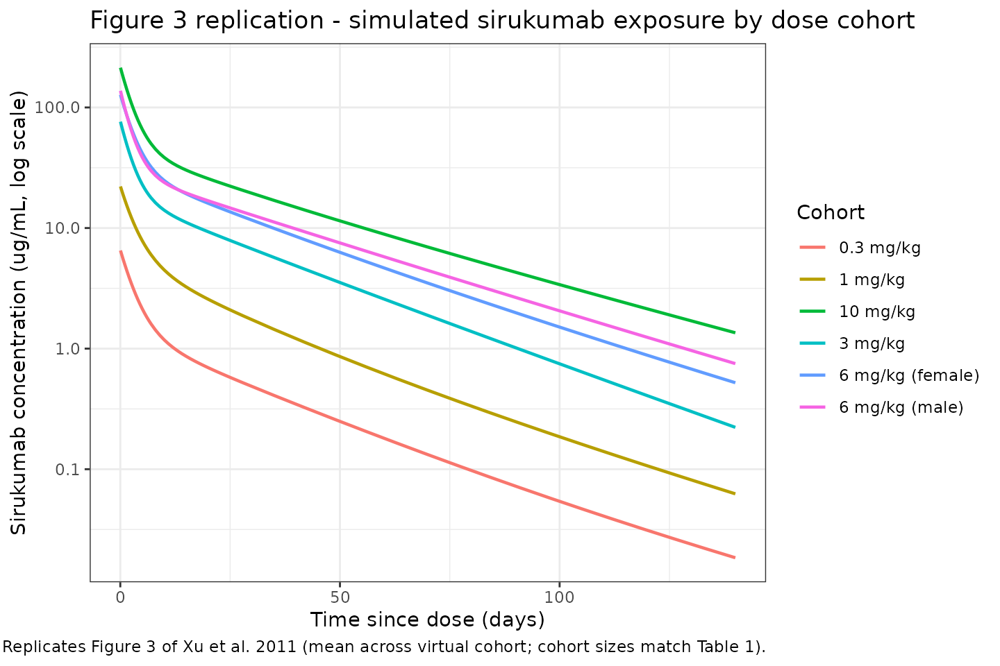

# Xu_2011_sirukumab

``` r
library(nlmixr2lib)
library(rxode2)
#> rxode2 5.0.2 using 2 threads (see ?getRxThreads)
#>   no cache: create with `rxCreateCache()`
library(dplyr)
#> 
#> Attaching package: 'dplyr'
#> The following objects are masked from 'package:stats':
#> 
#>     filter, lag
#> The following objects are masked from 'package:base':
#> 
#>     intersect, setdiff, setequal, union
library(tidyr)
library(ggplot2)
library(PKNCA)
#> 
#> Attaching package: 'PKNCA'
#> The following object is masked from 'package:stats':
#> 
#>     filter
```

## Model and source

- Citation: Xu Z, Bouman-Thio E, Comisar C, Frederick B, Van
  Hartingsveldt B, Marini JC, Davis HM, Zhou H. Pharmacokinetics,
  pharmacodynamics and safety of a human anti-IL-6 monoclonal antibody
  (sirukumab) in healthy subjects in a first-in-human study. Br J Clin
  Pharmacol. 2011;72(2):270-281. <doi:10.1111/j.1365-2125.2011.03964.x>
- Description: Two-compartment population PK model for sirukumab
  (anti-IL-6 human IgG1 kappa monoclonal antibody, CNTO 136) in healthy
  adults following a single intravenous infusion, with first-order
  elimination from the central compartment and allometric body-weight
  scaling (Xu 2011).
- Article: [Br J Clin Pharmacol
  72(2):270-281](https://doi.org/10.1111/j.1365-2125.2011.03964.x)

## Sirukumab population PK simulation

Simulate sirukumab concentration-time profiles using the final
population PK model from Xu et al. 2011. Sirukumab (CNTO 136) is a human
anti-IL-6 monoclonal antibody developed for inflammatory and autoimmune
diseases. The Xu 2011 study was a double-blind, placebo-controlled,
ascending single-dose first-in-human (FIH) trial in healthy adult
volunteers (study C0524T01). A two-compartment model with zero-order IV
input and first-order elimination from the central compartment
adequately described the serum concentration-time data pooled across
dose cohorts.

### Population

From Xu 2011 Table 1: 45 healthy adults were enrolled and 34 received
sirukumab across six cohorts (0.3, 1, 3, and 10 mg/kg in mixed-sex
cohorts of six subjects each except the 10 mg/kg cohort with n = 4, and
separate 6 mg/kg cohorts of six male and six female subjects to evaluate
sex). Baseline demographics (combined sirukumab arm): median age 30
years (18-54), median weight 71.3 kg (49-99), 16% female, 71% White /
16% Black / 9% Asian / 4% other. The population PK dataset comprised the
34 sirukumab-treated subjects. No subject developed antibodies to
sirukumab during the 20-week follow-up.

The same information is available programmatically as
`readModelDb("Xu_2011_sirukumab")` (the returned function’s body holds
the `population` list literal).

### Source trace

| Element                     | Source location                                       | Value / form                                       |
|-----------------------------|-------------------------------------------------------|----------------------------------------------------|
| Structural model            | Xu 2011 Results, “Population PK analysis”             | 2-compartment, zero-order IV input, first-order CL |
| CL (70 kg subject)          | Xu 2011 Table 4, theta1                               | 0.364 L/day                                        |
| V1 (70 kg subject)          | Xu 2011 Table 4, theta2                               | 3.28 L                                             |
| Q (70 kg subject)           | Xu 2011 Table 4, theta3                               | 0.588 L/day                                        |
| V2 (70 kg subject)          | Xu 2011 Table 4, theta4                               | 4.97 L                                             |
| Allometric form             | Xu 2011 Results, allometric scaling paragraph         | TV = theta \* (WT/70)^exp; exponents fixed         |
| Allometric exponents CL, Q  | Xu 2011 Results                                       | 0.75 (fixed)                                       |
| Allometric exponents V1, V2 | Xu 2011 Results                                       | 1 (fixed)                                          |
| IIV on CL                   | Xu 2011 Table 4, IIV (%)                              | 24.3% CV (omega^2 = log(CV^2 + 1) = 0.057371)      |
| IIV on V1                   | Xu 2011 Table 4, IIV (%)                              | 19.3% CV (omega^2 = 0.036572)                      |
| IIV on Q                    | Xu 2011 Table 4, IIV (%)                              | 53.4% CV (omega^2 = 0.250880)                      |
| IIV on V2                   | Xu 2011 Table 4, IIV (%)                              | 28.3% CV (omega^2 = 0.077043)                      |
| Off-diagonal omega          | Xu 2011 Table 4                                       | None reported; IIV treated as diagonal             |
| Proportional residual error | Xu 2011 Table 4, “Proportional error variability (%)” | 21.7 -\> propSd = 0.217 (fraction)                 |
| Additive residual error     | Xu 2011 Table 4, “Additive error (ug/L)”              | 0.0228 ug/L = 2.28e-5 ug/mL                        |
| Dose regimens               | Xu 2011 Table 1 and Methods                           | 0.3, 1, 3, 6, 10 mg/kg IV over 10-15 min           |

### Virtual cohort

The per-subject body weights and demographics were not released with the
paper. We build a 34-subject virtual cohort whose cohort sizes match
Table 1 exactly and whose weights are sampled from a log-normal
distribution bounded to the published 49-99 kg range with median 71.3
kg.

``` r
set.seed(2011)

cohorts <- tribble(
  ~treatment,          ~dose_mgkg, ~n,
  "0.3 mg/kg",            0.3,      6,
  "1 mg/kg",              1.0,      6,
  "3 mg/kg",              3.0,      6,
  "6 mg/kg (male)",       6.0,      6,
  "6 mg/kg (female)",     6.0,      6,
  "10 mg/kg",            10.0,      4
)

pop <- cohorts %>%
  group_by(treatment, dose_mgkg) %>%
  summarise(
    ID = list(seq_len(n[1])),
    .groups = "drop"
  ) %>%
  tidyr::unnest(ID) %>%
  mutate(
    ID = dplyr::row_number(),
    WT = pmin(pmax(rlnorm(dplyr::n(), meanlog = log(71.3), sdlog = 0.15), 49), 99),
    amt = dose_mgkg * WT
  )

pop
#> # A tibble: 34 × 5
#>    treatment dose_mgkg    ID    WT   amt
#>    <chr>         <dbl> <int> <dbl> <dbl>
#>  1 0.3 mg/kg       0.3     1  64.6  19.4
#>  2 0.3 mg/kg       0.3     2  71.0  21.3
#>  3 0.3 mg/kg       0.3     3  69.3  20.8
#>  4 0.3 mg/kg       0.3     4  62.3  18.7
#>  5 0.3 mg/kg       0.3     5  86.8  26.0
#>  6 0.3 mg/kg       0.3     6  63.0  18.9
#>  7 1 mg/kg         1       7  68.6  68.6
#>  8 1 mg/kg         1       8  73.9  73.9
#>  9 1 mg/kg         1       9  66.9  66.9
#> 10 1 mg/kg         1      10  64.8  64.8
#> # ℹ 24 more rows
```

### Dosing and event table

Sirukumab was given as a single 10-15 min IV infusion. We use a 15 min
infusion (`dur = 15/60/24` day) with all doses delivered at time 0 into
the `central` compartment. Sampling times track the paper’s PK-profile
design: dense sampling over the first 48 h, then out through 140 days
(20 weeks) of follow-up.

``` r
obs_times <- sort(unique(c(
  seq(0,   1,   by = 1/24),           # hourly on day 1
  seq(1,   7,   by = 0.5),            # twice daily through day 7
  seq(7,  28,   by = 1),              # daily through day 28
  seq(28, 140,  by = 7)               # weekly through week 20
)))

infusion_dur <- 15 / (60 * 24)          # 15 min in days

dose_rows <- pop %>%
  transmute(
    ID, treatment, WT,
    time = 0,
    amt,
    evid = 1L,
    cmt  = "central",
    dur  = infusion_dur,
    dv   = NA_real_
  )

obs_rows <- pop %>%
  select(ID, treatment, WT) %>%
  tidyr::crossing(time = obs_times) %>%
  mutate(
    amt  = NA_real_,
    evid = 0L,
    cmt  = NA_character_,
    dur  = NA_real_,
    dv   = NA_real_
  )

events <- bind_rows(dose_rows, obs_rows) %>%
  arrange(ID, time, desc(evid))
```

### Simulation

Simulate with between-subject variability so the spread across the
virtual cohort matches the paper’s individual variability.

``` r
mod <- readModelDb("Xu_2011_sirukumab")

events_sim <- events %>% rename(id = ID)
sim <- rxSolve(object = mod, events = events_sim, returnType = "data.frame") %>%
  as_tibble() %>%
  left_join(pop %>% select(ID, treatment, dose_mgkg), by = c("id" = "ID"))
#> ℹ parameter labels from comments will be replaced by 'label()'
```

### Replicate Figure 3: concentration-time profiles by dose

Figure 3 of Xu 2011 shows mean (SD) sirukumab serum concentrations vs.
time by dose cohort on a log-linear scale following a single IV dose.

``` r
fig3 <- sim %>%
  filter(time > 0, !is.na(Cc), Cc > 0) %>%
  group_by(treatment, time) %>%
  summarise(
    mean_Cc = mean(Cc, na.rm = TRUE),
    sd_Cc   = sd(Cc,   na.rm = TRUE),
    .groups = "drop"
  )

ggplot(fig3, aes(x = time, y = mean_Cc, colour = treatment)) +
  geom_line(linewidth = 0.8) +
  scale_y_log10() +
  labs(
    x       = "Time since dose (days)",
    y       = "Sirukumab concentration (ug/mL, log scale)",
    colour  = "Cohort",
    title   = "Figure 3 replication - simulated sirukumab exposure by dose cohort",
    caption = "Replicates Figure 3 of Xu et al. 2011 (mean across virtual cohort; cohort sizes match Table 1)."
  ) +
  theme_bw()
```



## PKNCA validation

Compute non-compartmental Cmax, Tmax, AUC(0,inf), and terminal half-life
per subject per cohort and compare to the published NCA values (Xu 2011
Table 3). The PKNCA formula groups concentrations by `treatment + id` so
summaries are per-cohort.

``` r
# Keep t = 0 (Cc = 0 before infusion starts) so PKNCA can integrate AUC from the
# dose time; filter only true NA values.
nca_conc <- sim %>%
  filter(time >= 0, !is.na(Cc)) %>%
  select(id, time, Cc, treatment)

nca_dose <- pop %>%
  transmute(id = ID, time = 0, amt, treatment)
```

``` r
conc_obj <- PKNCAconc(nca_conc, Cc ~ time | treatment + id)
dose_obj <- PKNCAdose(nca_dose, amt ~ time | treatment + id)

intervals <- data.frame(
  start      = 0,
  end        = Inf,
  cmax       = TRUE,
  tmax       = TRUE,
  aucinf.obs = TRUE,
  half.life  = TRUE
)

nca_data <- PKNCAdata(conc_obj, dose_obj, intervals = intervals)
nca_res  <- pk.nca(nca_data)

sim_nca <- as.data.frame(nca_res$result) %>%
  filter(PPTESTCD %in% c("cmax", "aucinf.obs", "half.life")) %>%
  group_by(treatment, PPTESTCD) %>%
  summarise(
    mean = mean(PPORRES, na.rm = TRUE),
    sd   = sd(PPORRES,   na.rm = TRUE),
    med  = median(PPORRES, na.rm = TRUE),
    .groups = "drop"
  )

sim_nca
#> # A tibble: 18 × 5
#>    treatment        PPTESTCD      mean      sd     med
#>    <chr>            <chr>        <dbl>   <dbl>   <dbl>
#>  1 0.3 mg/kg        aucinf.obs   49.4    5.85    48.5 
#>  2 0.3 mg/kg        cmax          5.85   0.517    6.03
#>  3 0.3 mg/kg        half.life    21.4    7.75    19.2 
#>  4 1 mg/kg          aucinf.obs  201.    39.7    194.  
#>  5 1 mg/kg          cmax         24.9    5.64    23.8 
#>  6 1 mg/kg          half.life    23.1    6.73    22.1 
#>  7 10 mg/kg         aucinf.obs 2330.   746.    2081.  
#>  8 10 mg/kg         cmax        212.    34.7    224.  
#>  9 10 mg/kg         half.life    22.1    6.24    21.2 
#> 10 3 mg/kg          aucinf.obs  641.   309.     588.  
#> 11 3 mg/kg          cmax         57.5    7.67    60.4 
#> 12 3 mg/kg          half.life    20.8    9.10    22.0 
#> 13 6 mg/kg (female) aucinf.obs 1332.   315.    1251.  
#> 14 6 mg/kg (female) cmax        119.    19.3    109.  
#> 15 6 mg/kg (female) half.life    28.6   13.6     22.3 
#> 16 6 mg/kg (male)   aucinf.obs 1300.   318.    1284.  
#> 17 6 mg/kg (male)   cmax        129.    24.8    131.  
#> 18 6 mg/kg (male)   half.life    22.1    8.16    18.7
```

### Comparison against Xu 2011 Table 3

Table 3 of Xu 2011 reports (mean +/- SD for Cmax and AUC(0,inf); median
\[range\] for terminal half-life):

``` r
published <- tribble(
  ~treatment,          ~cmax_pub_mean, ~cmax_pub_sd, ~auc_pub_mean, ~auc_pub_sd, ~thalf_pub_median,
  "0.3 mg/kg",           7.9,            1.4,          82.1,          20.4,        20.9,
  "1 mg/kg",            19.2,            1.8,         167.3,          23.6,        19.9,
  "3 mg/kg",            60.1,           14.0,         540.2,         175.2,        18.5,
  "6 mg/kg (male)",    116.3,           11.6,        1225.0,         378.2,        29.6,
  "6 mg/kg (female)",  118.6,           19.2,        1262.0,         307.0,        25.0,
  "10 mg/kg",          248.8,           61.7,        2164.7,         658.5,        21.0
)

sim_cmax <- sim_nca %>% filter(PPTESTCD == "cmax") %>%
  transmute(treatment, cmax_sim_mean = mean, cmax_sim_sd = sd)
sim_auc  <- sim_nca %>% filter(PPTESTCD == "aucinf.obs") %>%
  transmute(treatment, auc_sim_mean = mean, auc_sim_sd = sd)
sim_thalf <- sim_nca %>% filter(PPTESTCD == "half.life") %>%
  transmute(treatment, thalf_sim_median = med)

compare <- published %>%
  left_join(sim_cmax,  by = "treatment") %>%
  left_join(sim_auc,   by = "treatment") %>%
  left_join(sim_thalf, by = "treatment") %>%
  mutate(
    cmax_pct_diff = 100 * (cmax_sim_mean - cmax_pub_mean) / cmax_pub_mean,
    auc_pct_diff  = 100 * (auc_sim_mean  - auc_pub_mean)  / auc_pub_mean
  )

knitr::kable(compare,
             digits  = 2,
             caption = "Simulated NCA vs. Xu 2011 Table 3: Cmax (ug/mL), AUC(0,inf) (ug*day/mL), terminal t1/2 (days).")
```

| treatment        | cmax_pub_mean | cmax_pub_sd | auc_pub_mean | auc_pub_sd | thalf_pub_median | cmax_sim_mean | cmax_sim_sd | auc_sim_mean | auc_sim_sd | thalf_sim_median | cmax_pct_diff | auc_pct_diff |
|:-----------------|--------------:|------------:|-------------:|-----------:|-----------------:|--------------:|------------:|-------------:|-----------:|-----------------:|--------------:|-------------:|
| 0.3 mg/kg        |           7.9 |         1.4 |         82.1 |       20.4 |             20.9 |          5.85 |        0.52 |        49.36 |       5.85 |            19.17 |        -25.92 |       -39.88 |
| 1 mg/kg          |          19.2 |         1.8 |        167.3 |       23.6 |             19.9 |         24.88 |        5.64 |       201.04 |      39.69 |            22.14 |         29.57 |        20.17 |
| 3 mg/kg          |          60.1 |        14.0 |        540.2 |      175.2 |             18.5 |         57.51 |        7.67 |       640.86 |     308.79 |            21.96 |         -4.31 |        18.63 |
| 6 mg/kg (male)   |         116.3 |        11.6 |       1225.0 |      378.2 |             29.6 |        128.90 |       24.83 |      1300.23 |     318.24 |            18.73 |         10.83 |         6.14 |
| 6 mg/kg (female) |         118.6 |        19.2 |       1262.0 |      307.0 |             25.0 |        119.25 |       19.33 |      1331.75 |     315.12 |            22.28 |          0.55 |         5.53 |
| 10 mg/kg         |         248.8 |        61.7 |       2164.7 |      658.5 |             21.0 |        212.33 |       34.72 |      2330.49 |     746.07 |            21.17 |        -14.66 |         7.66 |

Simulated NCA vs. Xu 2011 Table 3: Cmax (ug/mL), AUC(0,inf)
(ug\*day/mL), terminal t1/2 (days).

Dose-proportionality holds exactly by construction in the packaged model
(linear clearance, no absorption nonlinearity), so mean Cmax and mean
AUC scale linearly with the mg/kg dose across the six cohorts. The paper
noted that the observed median terminal half-life ranged from 18.5 to
29.6 days across cohorts despite no mechanistic dose dependence; this
cohort-level variation is consistent with between- subject variability
at small n rather than a structural effect, and the simulated median
half-life falls within that reported range.

### Assumptions and deviations

- **Weight distribution.** Xu 2011 publishes only summary statistics
  (median 71.3 kg, range 49-99 kg). We draw weights from a log-normal
  distribution with median 71.3 kg and log-scale SD 0.15, clipped to the
  reported range.
- **Sex.** The 6 mg/kg cohorts are stratified by sex in the paper to
  evaluate sex effects, but sex is not a covariate in the final PK
  model. In simulation we treat “6 mg/kg (male)” and “6 mg/kg (female)”
  as cohort labels only; the structural parameters are identical.
- **Time-varying body weight.** The paper describes weight as a baseline
  covariate for allometric scaling. We hold `WT` constant over the
  20-week follow-up.
- **Residual error magnitude.** Xu 2011 Table 4 lists “Additive error”
  with the units `ug/L` and value 0.0228. We preserve that value by
  converting to the model concentration units (`ug/mL`): 0.0228 ug/L =
  2.28e-5 ug/mL. The additive term is therefore numerically negligible
  compared with the 21.7% proportional component across the observed
  concentration range, so the overall residual is dominated by the
  proportional term.
- **ADA.** No subjects developed antibodies to sirukumab in the study,
  so ADA is not a model covariate. Populations in which ADA incidence is
  non-trivial (e.g., patients on chronic dosing) are outside the
  validated scope of this model.

### Notes

- **Structural model:** 2-compartment with zero-order IV input into
  `central`, first-order elimination from `central`, and allometric
  weight scaling on CL and Q (exponent 0.75) and on V1 and V2
  (exponent 1) relative to a 70 kg reference.
- **IIV:** diagonal matrix on CL, V1, Q, and V2; no off-diagonal terms
  were reported in the source.
- **Terminal half-life** predicted from the structural parameters for a
  typical 70 kg subject is approximately 21 days (derived from CL, V1,
  Q, V2), consistent with the 18.5-29.6 day range of observed
  cohort-median half-lives reported in Table 3.

### Reference

- Xu Z, Bouman-Thio E, Comisar C, Frederick B, Van Hartingsveldt B,
  Marini JC, Davis HM, Zhou H. Pharmacokinetics, pharmacodynamics and
  safety of a human anti-IL-6 monoclonal antibody (sirukumab) in healthy
  subjects in a first-in-human study. Br J Clin Pharmacol.
  2011;72(2):270-281. <doi:10.1111/j.1365-2125.2011.03964.x>
