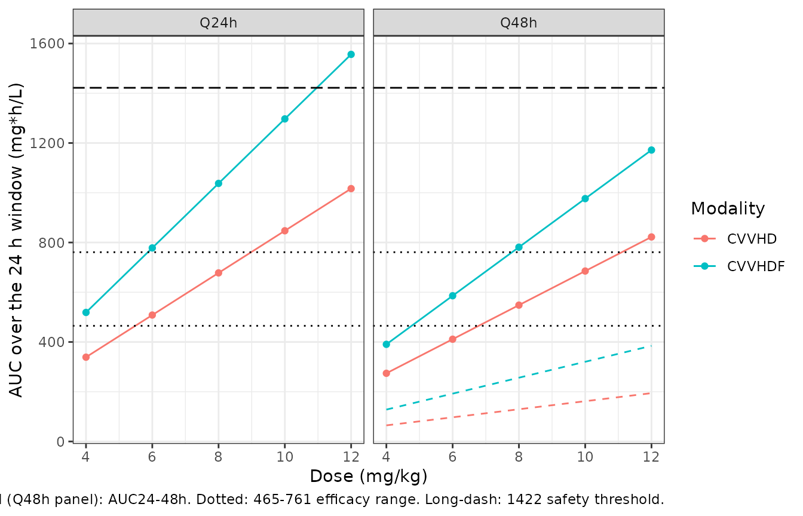

# Daptomycin (Xu 2017)

## Model and source

- Citation: Xu X, Khadzhynov D, Peters H, Chaves RL, Hamed K, Levi M,
  Corti N (2017). Population pharmacokinetics of daptomycin in adult
  patients undergoing continuous renal replacement therapy. Br J Clin
  Pharmacol 83(3):498-509. <doi:10.1111/bcp.13131>
- Description: Two-compartment intravenous population pharmacokinetic
  model for daptomycin in adults spanning normal-to-impaired renal
  function and four dialysis modalities, updated from the Chaves 2014
  renal-impairment model with patients on continuous veno-venous
  haemodialysis (CVVHD, n = 9) and continuous veno-venous
  haemodiafiltration (CVVHDF, n = 8) (Xu 2017). Drug input is a
  zero-order infusion of estimated duration D1 = 0.41 h. Clearance
  follows two separate equations: not-on-dialysis patients (Eq 6) carry
  a power effect of baseline creatinine clearance referenced to 80
  mL/min, while dialysis patients (Eq 1) instead take a
  modality-specific clearance (haemodialysis, CAPD, CVVHD or CVVHDF)
  multiplied by a dialysis-membrane flux factor. Both equations share a
  body-temperature power term referenced to 37 degC, a female
  multiplier, and five adjudicated-diagnosis multipliers. CVVHD and
  CVVHDF additionally take their own central volume, peripheral volume
  and inter-compartmental clearance; body weight scales Q2 and Vp
  allometrically at estimated exponents referenced to 70 kg, and a
  confirmed Gram-positive infection raises Vp 1.75-fold.
  Inter-individual variability is a 2x2 block on CL and Vc plus diagonal
  terms on Q2 and Vp; the additive residual error switches between the
  LC-MS/MS and the non-LC-MS/MS bioanalytical assay.
- Article: <https://doi.org/10.1111/bcp.13131>
- PubMed Central:
  <https://www.ncbi.nlm.nih.gov/pmc/articles/PMC5306496/>
- Supplement (Tables S1-S3):
  <http://onlinelibrary.wiley.com/doi/10.1111/bcp.13131/suppinfo>

## Population

Xu 2017 pooled the population-PK database of the Chaves 2014 daptomycin
renal-impairment model – itself an update of the Dvorchik 2004 model –
with daptomycin concentrations from 17 further adults receiving
continuous renal replacement therapy: 9 on continuous veno-venous
haemodialysis (CVVHD) and 8 on continuous veno-venous haemodiafiltration
(CVVHDF), reported by Corti and by Khadzhynov. The pooled dataset
tabulated in Table 1 has 459 adults with a median body weight of 75 kg
(range 42.0-152.8), 272 male (59%) and 187 female (41%), a median body
temperature of 37.1 degC (35.1-40.1) and a confirmed Gram-positive
infection in 273 (59%); the remaining 41% are healthy volunteers and
subjects only suspected of infection. By renal-replacement stratum, 385
had creatinine clearance at or above 30 mL/min, 40 were on intermittent
haemodialysis, 14 on continuous ambulatory peritoneal dialysis and 17 on
CRRT. Three subjects whose dialysis status was unknown were excluded
from the analysis, leaving 456 analysed.

The adjudicated final diagnosis (IEAC) was left-sided infective
endocarditis in 9 (2%), complicated right-sided infective endocarditis
in 13 (3%), uncomplicated right-sided infective endocarditis in 5 (1%),
complicated bacteraemia in 58 (13%) and uncomplicated bacteraemia in 37
(8%); it was not available for 337 (73%), and that unadjudicated stratum
is the reference level of the five diagnosis indicators. The dialysis
membrane was recorded as low flux in 7 (2%) and high flux in 28 (6%),
and was not available for 424 (92%).

Estimation used NONMEM 7.2.0 with FOCEI. Reported eta shrinkage was
10.0% on CL, 7.52% on Vc, 28.5% on Q2 and 40.9% on Vp.

The same information is available programmatically via the model’s
`population` metadata
(`readModelDb("Xu_2017_daptomycin")()$population`).

## Source trace

Every value below is reproduced from the in-file `ini()` comments in
`inst/modeldb/specificDrugs/Xu_2017_daptomycin.R`. The parameter
estimates all come from supplementary Table S2 (“All population model
parameter estimates of the final model”); main-paper Table 2 prints the
same values rounded to two or three significant figures.

| Model element | Value | Source location |
|----|----|----|
| Structure: 2-compartment IV disposition, CL / Vc / Q2 / Vp | – | Methods, “Population PK model” |
| Eq 1 – dialysis CL | modality CL x (TEMP/37)^th9 x th8^Female x th13^LowFlux x th14^HighFlux x th15..th19^IEAC x exp(eta) | Eq 1, p. 500 |
| Eq 2 – central volume | Vc = th_Vc x exp(eta) | Eq 2, p. 500 |
| Eq 3 – inter-compartmental clearance | Q2 = th_Q2 x (WT/70)^th10 x exp(eta) | Eq 3, p. 500 |
| Eq 4 – peripheral volume | Vp = th_Vp x (WT/70)^th11 x th12^INFN x exp(eta) | Eq 4, p. 500 |
| Eq 5 – zero-order input duration | D1 = th5 | Eq 5, p. 500 |
| Eq 6 – not-on-dialysis CL | th6 x (CLC0/80)^th7 x (TEMP/37)^th9 x th8^Female x th15..th19^IEAC x exp(eta) | Eq 6, p. 501 |
| Eq 7 – observation | Cp = A1 / Vc | Eq 7, p. 501 |
| `lcl` | 0.751 L/h | Table S2, `CL NOT-ON-DIALYSIS (L/h) = theta 6` (3% RSE); Table 2 row Not-on-dialysis 0.75 |
| `e_crcl_cl` | 0.540 | Table S2, `*(CLC0/80)^theta 7` (7% RSE) |
| `lcl_hemodialysis` | 0.219 L/h | Table S2, `CL HD (L/h) = theta 20` (6% RSE); Table 2 row HD 0.22 |
| `lcl_capd` | 0.237 L/h | Table S2, `CL CAPD (L/h) = theta 21` (8% RSE); Table 2 row CAPD 0.24 |
| `lcl_cvvhd` | 0.936 L/h | Table S2, `CL CVVHD (L/h) = theta 22` (6% RSE); Table 2 row CVVHD 0.94 |
| `lcl_cvvhdf` | 0.528 L/h | Table S2, `CL CVVHDF (L/h) = theta 23` (14% RSE); Table 2 row CVVHDF 0.53 |
| `e_bodytemp_cl` | 2.28 | Table S2, `*(TEMP/37)^theta 9` (60% RSE) |
| `e_sexf_cl` | 0.867 | Table S2, `*theta 8 SEX [Female]` (3% RSE) |
| `e_filt_flux_low_cl` | 0.96 | Table S2, `*theta 13 DIAM [Low Flux]` (14% RSE) |
| `e_filt_flux_high_cl` | 1.36 | Table S2, `*theta 14 DIAM [High Flux]` (8% RSE) |
| `e_ieac_left_cl` | 1.16 | Table S2, `*theta 15 IEAC [LIE]` (12% RSE) |
| `e_ieac_right_comp_cl` | 1.3 | Table S2, `*theta 16 IEAC [Complicated RIE]` (9% RSE) |
| `e_ieac_right_uncomp_cl` | 1.3 | Table S2, `*theta 17 IEAC [Uncomplicated RIE]` (10% RSE) |
| `e_bacteremia_comp_cl` | 1.10 | Table S2, `*theta 18 IEAC [Complicated Bacteraemia]` (4% RSE) |
| `e_bacteremia_uncomp_cl` | 1.13 | Table S2, `*theta 19 IEAC [Uncomplicated Bacteraemia]` (5% RSE) |
| `lvc` | 4.86 L | Table S2, `V1 other (L) = theta 2` (4% RSE) |
| `lvc_cvvhd` | 5.736 L | Table S2, `V1 CVVHD (L) = theta 24` (8% RSE); Table 2 prints 5.74 |
| `lvc_cvvhdf` | 6.526 L | Table S2, `V1 CVVHDF (L) = theta 25` (6% RSE); Table 2 prints 6.53 |
| `lq` | 3.69 L/h | Table S2, `Q other (L/h) = theta 3` (6% RSE) |
| `lq_cvvhd` | 7.111 L/h | Table S2, `Q CVVHD (L/h) = theta 26` (15% RSE); Table 2 prints 7.11 |
| `lq_cvvhdf` | 2.879 L/h | Table S2, `Q CVVHDF (L/h) = theta 27` (35% RSE); Table 2 prints 2.88 |
| `e_wt_q` | 0.797 | Table S2, `*(WT/70)^theta 10` (28% RSE) |
| `lvp` | 3.2 L | Table S2, `V2 other (L) = theta 4` (3% RSE) |
| `lvp_cvvhd` | 4.891 L | Table S2, `V2 CVVHD (L) = theta 28` (7% RSE); Table 2 prints 4.89 |
| `lvp_cvvhdf` | 3.846 L | Table S2, `V2 CVVHDF (L) = theta 29` (16% RSE); Table 2 prints 3.85 |
| `e_wt_vp` | 0.764 | Table S2, `*(WT/70)^theta 11` (14% RSE) |
| `e_infect_active_vp` | 1.75 | Table S2, `*theta 12 INFN [INFN1]` (6% RSE) |
| `ld1` | 0.41 h | Table S2, `D1 (h) = theta 5` (0.2% RSE) |
| `etalcl` variance | 0.296 | Table S2, `omega^2 CL` |
| `etalcl`-`etalvc` covariance | 0.2288 | Derived: Table S2 prints only the correlation `COV CL-V1 ... r = 0.52`, so 0.52 x sqrt(0.296 x 0.654) |
| `etalvc` variance | 0.654 | Table S2, `omega^2 V1` |
| `etalq` variance | 0.669 | Table S2, `omega^2 Q` |
| `etalvp` variance | 0.267 | Table S2, `omega^2 V2` |
| `addSd_lcmsms` | 1.4387 mg/L | Table S2, `sigma^2 add[ASSY1]` = 2.07; SD = sqrt(2.07) |
| `addSd_other` | 2.3043 mg/L | Table S2, `sigma^2 add[ASSY0]` = 5.31; SD = sqrt(5.31) |

### Reading the supplementary Table S2 variance cells

The four inter-individual cells of Table S2 are printed in the form
`0.296 (5%) CV=17%`, and the heading of that block is “Inter-individual
variance %SE”. Two readings are possible – the leading number is the
variance, or the trailing `CV=` is the log-normal coefficient of
variation from which the variance would be `log(1 + CV^2)`. They differ
by more than an order of magnitude, so the choice is load-bearing. Three
independent checks settle it on the variance reading:

1.  **Internal arithmetic.** In all four cells the trailing `CV=` equals
    the parenthetical divided by the estimate, taken as a fraction:
    0.05/0.296 = 17%, 0.10/0.654 = 15%, 0.12/0.669 = 18%, 0.10/0.267 =
    37%. The `CV=` column is therefore a relative standard error of the
    estimate, not a property of the random effect.
2.  **Main-paper cross-check.** Table 2 prints the same standard errors
    as bare fractions under a “(SE)” heading – 0.08 where Table S2
    prints 8%, 0.35 where Table S2 prints 35%, and so on for all ten
    shared cells – confirming that the percent / fraction confusion runs
    through both tables.
3.  **Figure 4.** The boxplot of model-predicted individual clearance in
    the not-on-dialysis stratum spans roughly 0.28 to 1.63 L/h between
    the 5th and 95th percentiles. For a log-normal that implies
    `omega = log(1.63/0.28) / (2 x 1.645) = 0.54`, i.e. a variance of
    about 0.29 – the printed 0.296. The `CV = 17%` reading would give a
    5th-95th span of only 0.61-1.07 L/h.

The residual cells are printed as `2.07 (12%) SD=12` and
`5.31 (7%) SD=7`, where the trailing `SD=` simply repeats the
parenthetical and cannot be a standard deviation (the larger variance
carries the smaller “SD”). The heading “Residual variance %SE” is taken
literally, so the additive residual SDs are sqrt(2.07) = 1.44 mg/L and
sqrt(5.31) = 2.30 mg/L.

## Load the model

``` r

mod <- modellib("Xu_2017_daptomycin")
modTypical <- rxode2::zeroRe(mod)
#> ℹ parameter labels from comments will be replaced by 'label()'
#> Warning: No sigma parameters in the model
```

The model carries 17 covariate columns. A helper builds a covariate row
at the model’s reference state (70 kg male, CrCl 80 mL/min, 37 degC, no
dialysis, no recorded membrane, no adjudicated diagnosis, no confirmed
infection) which can then be overridden per scenario.

``` r

refCov <- list(
  WT = 70, CRCL = 80, SEXF = 0, BODYTEMP = 37,
  RRT_HEMODIAL_STATUS = 0, PERIT_DIAL = 0,
  RRT_CVVHD_STATUS = 0, RRT_CVVHDF_STATUS = 0,
  FILT_FLUX_LOW = 0, FILT_FLUX_HIGH = 0,
  DIS_IEAC_LEFT = 0, DIS_IEAC_RIGHT_COMP = 0, DIS_IEAC_RIGHT_UNCOMP = 0,
  DIS_BACTEREMIA_COMP = 0, DIS_BACTEREMIA_UNCOMP = 0,
  DIS_INFECT_ACTIVE = 0, ASSAY_LCMSMS = 1
)

withCov <- function(events, ...) {
  cov <- utils::modifyList(refCov, list(...))
  d <- as.data.frame(events)
  for (nm in names(cov)) d[[nm]] <- cov[[nm]]
  d
}
```

## Validation 1 – typical PK parameters by dialysis type (Table 2)

Xu 2017 Table 2 prints the typical CL, Vc, Q2 and Vp for a 70 kg male
with CrCl at or above 30 mL/min in each of the five renal-replacement
strata. With the random effects zeroed and the covariates at their
reference state, the model must return those numbers exactly; every
entry is a bare `ini()` value because all covariate terms collapse to 1.

``` r

strata <- list(
  `Not-on-dialysis` = list(),
  HD = list(RRT_HEMODIAL_STATUS = 1),
  CAPD = list(PERIT_DIAL = 1),
  CVVHD = list(RRT_CVVHD_STATUS = 1),
  CVVHDF = list(RRT_CVVHDF_STATUS = 1)
)
evRef <- rxode2::et(amt = 100, cmt = "central", rate = -2) |> rxode2::et(0.5)

typicalPk <-
  lapply(names(strata), function(s) {
    d <- do.call(withCov, c(list(evRef), strata[[s]]))
    r <- rxode2::rxSolve(modTypical, d, returnType = "data.frame")
    data.frame(
      `Dialysis type` = s, CL = r$cl[1], Vc = r$vc[1], Q2 = r$q[1], Vp = r$vp[1],
      check.names = FALSE
    )
  }) |>
  dplyr::bind_rows()
#> ℹ omega/sigma items treated as zero: 'etalcl', 'etalvc', 'etalq', 'etalvp'
#> ℹ omega/sigma items treated as zero: 'etalcl', 'etalvc', 'etalq', 'etalvp'
#> ℹ omega/sigma items treated as zero: 'etalcl', 'etalvc', 'etalq', 'etalvp'
#> ℹ omega/sigma items treated as zero: 'etalcl', 'etalvc', 'etalq', 'etalvp'
#> ℹ omega/sigma items treated as zero: 'etalcl', 'etalvc', 'etalq', 'etalvp'

published <- data.frame(
  `Dialysis type` = c("Not-on-dialysis", "HD", "CAPD", "CVVHD", "CVVHDF"),
  CL = c(0.75, 0.22, 0.24, 0.94, 0.53),
  Vc = c(4.86, 4.86, 4.86, 5.74, 6.53),
  Q2 = c(3.69, 3.69, 3.69, 7.11, 2.88),
  Vp = c(3.20, 3.20, 3.20, 4.89, 3.85),
  check.names = FALSE
)

knitr::kable(
  typicalPk, digits = 3,
  caption = "Simulated typical PK parameters; reproduces Xu 2017 Table 2."
)
```

| Dialysis type   |    CL |    Vc |    Q2 |    Vp |
|:----------------|------:|------:|------:|------:|
| Not-on-dialysis | 0.751 | 4.860 | 3.690 | 3.200 |
| HD              | 0.219 | 4.860 | 3.690 | 3.200 |
| CAPD            | 0.237 | 4.860 | 3.690 | 3.200 |
| CVVHD           | 0.936 | 5.736 | 7.111 | 4.891 |
| CVVHDF          | 0.528 | 6.526 | 2.879 | 3.846 |

Simulated typical PK parameters; reproduces Xu 2017 Table 2. {.table}

Table 2 rounds Vc, Q2 and Vp to three significant figures and CL to two,
so the gate compares against the rounded published values at the
corresponding precision.

``` r

chk <- merge(typicalPk, published, by = "Dialysis type", suffixes = c("_sim", "_pub"))
stopifnot(
  nrow(chk) == 5L,
  all(abs(round(chk$CL_sim, 2) - chk$CL_pub) < 1e-8),
  all(abs(round(chk$Vc_sim, 2) - chk$Vc_pub) < 1e-8),
  all(abs(round(chk$Q2_sim, 2) - chk$Q2_pub) < 1e-8),
  all(abs(round(chk$Vp_sim, 2) - chk$Vp_pub) < 1e-8)
)
```

### Figure 4 – typical clearance across the renal-replacement strata

``` r

ggplot2::ggplot(
  typicalPk,
  ggplot2::aes(
    x = factor(`Dialysis type`, levels = published$`Dialysis type`),
    y = CL
  )
) +
  ggplot2::geom_col(fill = "grey70", width = 0.6) +
  ggplot2::geom_text(ggplot2::aes(label = sprintf("%.2f", CL)), vjust = -0.4) +
  ggplot2::labs(x = "Dialysis type", y = "Typical daptomycin clearance (L/h)") +
  ggplot2::expand_limits(y = 1.05) +
  ggplot2::theme_bw()
```


Typical daptomycin clearance by dialysis type. Replicates the central
tendency of Figure 4 of Xu 2017 (that figure additionally shows the
individual spread).

## Validation 2 – structural check against the closed-form solution

A two-compartment model whose `model()` block defines `cl`, `vc`, `q`
and `vp` can be silently rerouted by `rxode2` through its analytic
solver, so the explicit ODE system is checked against the closed-form
biexponential solution for a constant-rate infusion of duration `d1` at
steady state. This is a pure numerical comparison of two expressions of
the same parameters, so a tight absolute bound is the right gate.

``` r

cvvhdPars <- typicalPk[typicalPk$`Dialysis type` == "CVVHD", ]
CL <- cvvhdPars$CL; VC <- cvvhdPars$Vc; Q <- cvvhdPars$Q2; VP <- cvvhdPars$Vp
D1 <- 0.41
dose <- 500

k10 <- CL / VC; k12 <- Q / VC; k21 <- Q / VP
bsum <- k10 + k12 + k21
alpha <- (bsum + sqrt(bsum^2 - 4 * k10 * k21)) / 2
beta <- (bsum - sqrt(bsum^2 - 4 * k10 * k21)) / 2
rate <- dose / D1
A <- rate / VC * (k21 - alpha) / (alpha * (beta - alpha))
B <- rate / VC * (k21 - beta) / (beta * (alpha - beta))

# Single-dose infusion concentration, on and after the infusion.
ccClosed <- function(tt) {
  ifelse(
    tt <= D1,
    A * (1 - exp(-alpha * tt)) + B * (1 - exp(-beta * tt)),
    A * (1 - exp(-alpha * D1)) * exp(-alpha * (tt - D1)) +
      B * (1 - exp(-beta * D1)) * exp(-beta * (tt - D1))
  )
}

tGrid <- c(0.1, 0.25, 0.41, 0.5, 1, 2, 4, 8, 12, 18, 24)
evCf <- rxode2::et(amt = dose, cmt = "central", rate = -2) |> rxode2::et(tGrid)
# Tight tolerances: the identity is checked to 1e-6 mg/L on a ~60 mg/L peak,
# and the ODE solve at the default rtol leaves ~3e-5 mg/L.
solCf <- rxode2::rxSolve(
  modTypical, withCov(evCf, RRT_CVVHD_STATUS = 1), returnType = "data.frame",
  rtol = 1e-10, atol = 1e-12
)
#> ℹ omega/sigma items treated as zero: 'etalcl', 'etalvc', 'etalq', 'etalvp'
solCf <- solCf[!is.na(solCf$Cc) & solCf$time > 0, ]
solCf$closed <- ccClosed(solCf$time)

stopifnot(
  nrow(solCf) == length(tGrid),
  max(abs(solCf$Cc - solCf$closed)) < 1e-6
)
knitr::kable(
  solCf[, c("time", "Cc", "closed")], digits = 5, row.names = FALSE,
  caption = "ODE solve vs closed-form two-compartment infusion solution (CVVHD typical subject, 500 mg)."
)
```

|  time |       Cc |   closed |
|------:|---------:|---------:|
|  0.10 | 19.89420 | 19.89420 |
|  0.25 | 45.60209 | 45.60209 |
|  0.41 | 69.19212 | 69.19212 |
|  0.50 | 63.21723 | 63.21723 |
|  1.00 | 46.47317 | 46.47317 |
|  2.00 | 38.39937 | 38.39937 |
|  4.00 | 32.09508 | 32.09508 |
|  8.00 | 22.78759 | 22.78759 |
| 12.00 | 16.17986 | 16.17986 |
| 18.00 |  9.68031 |  9.68031 |
| 24.00 |  5.79167 |  5.79167 |

ODE solve vs closed-form two-compartment infusion solution (CVVHD
typical subject, 500 mg). {.table}

## Validation 3 – dose recovery

For an intravenous drug the area under the curve to infinity times
clearance must return the delivered dose. The two sides here use the
same drawn parameters, so the difference is pure numerical error and a
tight bound is appropriate.

``` r

evLong <- rxode2::et(amt = dose, cmt = "central", rate = -2) |>
  rxode2::et(seq(0, 240, by = 0.05))
solLong <- rxode2::rxSolve(
  modTypical, withCov(evLong, RRT_CVVHD_STATUS = 1), returnType = "data.frame"
)
#> ℹ omega/sigma items treated as zero: 'etalcl', 'etalvc', 'etalq', 'etalvp'
solLong <- solLong[!is.na(solLong$Cc), ]
aucObs <- sum(diff(solLong$time) *
  (utils::head(solLong$Cc, -1) + utils::tail(solLong$Cc, -1)) / 2)
aucExtrap <- utils::tail(solLong$Cc, 1) / beta
doseRecovered <- CL * (aucObs + aucExtrap)

c(dose = dose, recovered = doseRecovered, pct_diff = 100 * (doseRecovered / dose - 1))
#>          dose     recovered      pct_diff 
#> 500.000000000 499.960494907  -0.007901019
stopifnot(abs(doseRecovered / dose - 1) < 0.005)
```

## Virtual cohort – the 17 CRRT subjects of Xu 2017

Supplementary Table S1 lists every CRRT subject’s body weight, sex and
dialysis modality, and main-paper Table 1 gives the subgroup medians for
body temperature, the membrane flux distribution and the infection
status. That is enough to rebuild the exact cohort the paper simulated,
so the virtual population below is the published cohort rather than a
resampled one – 9 CVVHD and 8 CVVHDF subjects, well inside the
200-per-arm cap.

Two covariates cannot be resolved at the individual level and are set to
their reference (all-zero) state: the per-subject adjudicated diagnosis,
and the membrane flux for the CVVHD subgroup (Table 1 records 1 low
flux, 2 high flux and 6 not available, without saying which subject is
which). All 8 CVVHDF subjects were on a high-flux membrane, so that
factor is applied there; it matters, because it raises the realised
CVVHDF clearance from 0.528 to 0.72 L/h. See Assumptions and deviations.

``` r

subjects <- data.frame(
  id = c(5001, 5002, 5003, 5004, 5005, 5006, 5007, 5008, 5009,
         6001, 6002, 6003, 6004, 6005, 6007, 6008, 6009),
  WT = c(95, 73, 87, 65, 83, 87, 100, 85, 42,
         82, 63, 117, 95, 70, 120, 75, 85),
  SEXF = c(0, 0, 0, 0, 0, 0, 0, 0, 1,
           0, 0, 0, 0, 1, 1, 0, 0),
  modality = c(rep("CVVHD", 9), rep("CVVHDF", 8)),
  stringsAsFactors = FALSE
)
subjects <- subjects |>
  dplyr::mutate(
    RRT_CVVHD_STATUS = as.integer(modality == "CVVHD"),
    RRT_CVVHDF_STATUS = as.integer(modality == "CVVHDF"),
    BODYTEMP = ifelse(modality == "CVVHD", 37.2, 36.8),
    FILT_FLUX_HIGH = as.integer(modality == "CVVHDF"),
    DIS_INFECT_ACTIVE = 1L
  )
knitr::kable(
  subjects, caption = "Xu 2017 supplementary Table S1 (weight, sex, modality) plus the Table 1 subgroup covariates."
)
```

| id | WT | SEXF | modality | RRT_CVVHD_STATUS | RRT_CVVHDF_STATUS | BODYTEMP | FILT_FLUX_HIGH | DIS_INFECT_ACTIVE |
|---:|---:|---:|:---|---:|---:|---:|---:|---:|
| 5001 | 95 | 0 | CVVHD | 1 | 0 | 37.2 | 0 | 1 |
| 5002 | 73 | 0 | CVVHD | 1 | 0 | 37.2 | 0 | 1 |
| 5003 | 87 | 0 | CVVHD | 1 | 0 | 37.2 | 0 | 1 |
| 5004 | 65 | 0 | CVVHD | 1 | 0 | 37.2 | 0 | 1 |
| 5005 | 83 | 0 | CVVHD | 1 | 0 | 37.2 | 0 | 1 |
| 5006 | 87 | 0 | CVVHD | 1 | 0 | 37.2 | 0 | 1 |
| 5007 | 100 | 0 | CVVHD | 1 | 0 | 37.2 | 0 | 1 |
| 5008 | 85 | 0 | CVVHD | 1 | 0 | 37.2 | 0 | 1 |
| 5009 | 42 | 1 | CVVHD | 1 | 0 | 37.2 | 0 | 1 |
| 6001 | 82 | 0 | CVVHDF | 0 | 1 | 36.8 | 1 | 1 |
| 6002 | 63 | 0 | CVVHDF | 0 | 1 | 36.8 | 1 | 1 |
| 6003 | 117 | 0 | CVVHDF | 0 | 1 | 36.8 | 1 | 1 |
| 6004 | 95 | 0 | CVVHDF | 0 | 1 | 36.8 | 1 | 1 |
| 6005 | 70 | 1 | CVVHDF | 0 | 1 | 36.8 | 1 | 1 |
| 6007 | 120 | 1 | CVVHDF | 0 | 1 | 36.8 | 1 | 1 |
| 6008 | 75 | 0 | CVVHDF | 0 | 1 | 36.8 | 1 | 1 |
| 6009 | 85 | 0 | CVVHDF | 0 | 1 | 36.8 | 1 | 1 |

Xu 2017 supplementary Table S1 (weight, sex, modality) plus the Table 1
subgroup covariates. {.table}

``` r

tau24 <- 24
tau48 <- 48
doses <- c(4, 6, 8, 10, 12)

simulateRegimen <- function(dosePerKg, tau) {
  nDose <- ceiling(240 / tau)
  tStart <- (nDose - 1) * tau
  obsGrid <- sort(unique(c(
    seq(tStart, tStart + tau, by = 0.5),
    tStart + c(0.41, 0.75, 1, 1.5, 2, 3), tStart + tau
  )))
  out <- lapply(seq_len(nrow(subjects)), function(i) {
    s <- subjects[i, ]
    ev <- rxode2::et(
      amt = dosePerKg * s$WT, cmt = "central", rate = -2,
      ii = tau, until = tStart
    ) |>
      rxode2::et(obsGrid)
    d <- withCov(
      ev,
      WT = s$WT, SEXF = s$SEXF, BODYTEMP = s$BODYTEMP,
      RRT_CVVHD_STATUS = s$RRT_CVVHD_STATUS,
      RRT_CVVHDF_STATUS = s$RRT_CVVHDF_STATUS,
      FILT_FLUX_HIGH = s$FILT_FLUX_HIGH,
      DIS_INFECT_ACTIVE = s$DIS_INFECT_ACTIVE
    )
    r <- rxode2::rxSolve(modTypical, d, returnType = "data.frame")
    r <- r[!is.na(r$Cc), c("time", "Cc")]
    r$time <- r$time - tStart
    r$id <- s$id
    r$modality <- s$modality
    r$dose_mgkg <- dosePerKg
    r$tau <- tau
    r$amt <- dosePerKg * s$WT
    r[order(r$time), ]
  })
  dplyr::bind_rows(out)
}

conc <- dplyr::bind_rows(c(
  lapply(doses, simulateRegimen, tau = tau24),
  lapply(doses, simulateRegimen, tau = tau48)
)) |>
  dplyr::mutate(
    treatment = sprintf("%s %g mg/kg Q%gh", modality, dose_mgkg, tau)
  )
#> ℹ omega/sigma items treated as zero: 'etalcl', 'etalvc', 'etalq', 'etalvp'
#> ℹ omega/sigma items treated as zero: 'etalcl', 'etalvc', 'etalq', 'etalvp'
#> ℹ omega/sigma items treated as zero: 'etalcl', 'etalvc', 'etalq', 'etalvp'
#> ℹ omega/sigma items treated as zero: 'etalcl', 'etalvc', 'etalq', 'etalvp'
#> ℹ omega/sigma items treated as zero: 'etalcl', 'etalvc', 'etalq', 'etalvp'
#> ℹ omega/sigma items treated as zero: 'etalcl', 'etalvc', 'etalq', 'etalvp'
#> ℹ omega/sigma items treated as zero: 'etalcl', 'etalvc', 'etalq', 'etalvp'
#> ℹ omega/sigma items treated as zero: 'etalcl', 'etalvc', 'etalq', 'etalvp'
#> ℹ omega/sigma items treated as zero: 'etalcl', 'etalvc', 'etalq', 'etalvp'
#> ℹ omega/sigma items treated as zero: 'etalcl', 'etalvc', 'etalq', 'etalvp'
#> ℹ omega/sigma items treated as zero: 'etalcl', 'etalvc', 'etalq', 'etalvp'
#> ℹ omega/sigma items treated as zero: 'etalcl', 'etalvc', 'etalq', 'etalvp'
#> ℹ omega/sigma items treated as zero: 'etalcl', 'etalvc', 'etalq', 'etalvp'
#> ℹ omega/sigma items treated as zero: 'etalcl', 'etalvc', 'etalq', 'etalvp'
#> ℹ omega/sigma items treated as zero: 'etalcl', 'etalvc', 'etalq', 'etalvp'
#> ℹ omega/sigma items treated as zero: 'etalcl', 'etalvc', 'etalq', 'etalvp'
#> ℹ omega/sigma items treated as zero: 'etalcl', 'etalvc', 'etalq', 'etalvp'
#> ℹ omega/sigma items treated as zero: 'etalcl', 'etalvc', 'etalq', 'etalvp'
#> ℹ omega/sigma items treated as zero: 'etalcl', 'etalvc', 'etalq', 'etalvp'
#> ℹ omega/sigma items treated as zero: 'etalcl', 'etalvc', 'etalq', 'etalvp'
#> ℹ omega/sigma items treated as zero: 'etalcl', 'etalvc', 'etalq', 'etalvp'
#> ℹ omega/sigma items treated as zero: 'etalcl', 'etalvc', 'etalq', 'etalvp'
#> ℹ omega/sigma items treated as zero: 'etalcl', 'etalvc', 'etalq', 'etalvp'
#> ℹ omega/sigma items treated as zero: 'etalcl', 'etalvc', 'etalq', 'etalvp'
#> ℹ omega/sigma items treated as zero: 'etalcl', 'etalvc', 'etalq', 'etalvp'
#> ℹ omega/sigma items treated as zero: 'etalcl', 'etalvc', 'etalq', 'etalvp'
#> ℹ omega/sigma items treated as zero: 'etalcl', 'etalvc', 'etalq', 'etalvp'
#> ℹ omega/sigma items treated as zero: 'etalcl', 'etalvc', 'etalq', 'etalvp'
#> ℹ omega/sigma items treated as zero: 'etalcl', 'etalvc', 'etalq', 'etalvp'
#> ℹ omega/sigma items treated as zero: 'etalcl', 'etalvc', 'etalq', 'etalvp'
#> ℹ omega/sigma items treated as zero: 'etalcl', 'etalvc', 'etalq', 'etalvp'
#> ℹ omega/sigma items treated as zero: 'etalcl', 'etalvc', 'etalq', 'etalvp'
#> ℹ omega/sigma items treated as zero: 'etalcl', 'etalvc', 'etalq', 'etalvp'
#> ℹ omega/sigma items treated as zero: 'etalcl', 'etalvc', 'etalq', 'etalvp'
#> ℹ omega/sigma items treated as zero: 'etalcl', 'etalvc', 'etalq', 'etalvp'
#> ℹ omega/sigma items treated as zero: 'etalcl', 'etalvc', 'etalq', 'etalvp'
#> ℹ omega/sigma items treated as zero: 'etalcl', 'etalvc', 'etalq', 'etalvp'
#> ℹ omega/sigma items treated as zero: 'etalcl', 'etalvc', 'etalq', 'etalvp'
#> ℹ omega/sigma items treated as zero: 'etalcl', 'etalvc', 'etalq', 'etalvp'
#> ℹ omega/sigma items treated as zero: 'etalcl', 'etalvc', 'etalq', 'etalvp'
#> ℹ omega/sigma items treated as zero: 'etalcl', 'etalvc', 'etalq', 'etalvp'
#> ℹ omega/sigma items treated as zero: 'etalcl', 'etalvc', 'etalq', 'etalvp'
#> ℹ omega/sigma items treated as zero: 'etalcl', 'etalvc', 'etalq', 'etalvp'
#> ℹ omega/sigma items treated as zero: 'etalcl', 'etalvc', 'etalq', 'etalvp'
#> ℹ omega/sigma items treated as zero: 'etalcl', 'etalvc', 'etalq', 'etalvp'
#> ℹ omega/sigma items treated as zero: 'etalcl', 'etalvc', 'etalq', 'etalvp'
#> ℹ omega/sigma items treated as zero: 'etalcl', 'etalvc', 'etalq', 'etalvp'
#> ℹ omega/sigma items treated as zero: 'etalcl', 'etalvc', 'etalq', 'etalvp'
#> ℹ omega/sigma items treated as zero: 'etalcl', 'etalvc', 'etalq', 'etalvp'
#> ℹ omega/sigma items treated as zero: 'etalcl', 'etalvc', 'etalq', 'etalvp'
#> ℹ omega/sigma items treated as zero: 'etalcl', 'etalvc', 'etalq', 'etalvp'
#> ℹ omega/sigma items treated as zero: 'etalcl', 'etalvc', 'etalq', 'etalvp'
#> ℹ omega/sigma items treated as zero: 'etalcl', 'etalvc', 'etalq', 'etalvp'
#> ℹ omega/sigma items treated as zero: 'etalcl', 'etalvc', 'etalq', 'etalvp'
#> ℹ omega/sigma items treated as zero: 'etalcl', 'etalvc', 'etalq', 'etalvp'
#> ℹ omega/sigma items treated as zero: 'etalcl', 'etalvc', 'etalq', 'etalvp'
#> ℹ omega/sigma items treated as zero: 'etalcl', 'etalvc', 'etalq', 'etalvp'
#> ℹ omega/sigma items treated as zero: 'etalcl', 'etalvc', 'etalq', 'etalvp'
#> ℹ omega/sigma items treated as zero: 'etalcl', 'etalvc', 'etalq', 'etalvp'
#> ℹ omega/sigma items treated as zero: 'etalcl', 'etalvc', 'etalq', 'etalvp'
#> ℹ omega/sigma items treated as zero: 'etalcl', 'etalvc', 'etalq', 'etalvp'
#> ℹ omega/sigma items treated as zero: 'etalcl', 'etalvc', 'etalq', 'etalvp'
#> ℹ omega/sigma items treated as zero: 'etalcl', 'etalvc', 'etalq', 'etalvp'
#> ℹ omega/sigma items treated as zero: 'etalcl', 'etalvc', 'etalq', 'etalvp'
#> ℹ omega/sigma items treated as zero: 'etalcl', 'etalvc', 'etalq', 'etalvp'
#> ℹ omega/sigma items treated as zero: 'etalcl', 'etalvc', 'etalq', 'etalvp'
#> ℹ omega/sigma items treated as zero: 'etalcl', 'etalvc', 'etalq', 'etalvp'
#> ℹ omega/sigma items treated as zero: 'etalcl', 'etalvc', 'etalq', 'etalvp'
#> ℹ omega/sigma items treated as zero: 'etalcl', 'etalvc', 'etalq', 'etalvp'
#> ℹ omega/sigma items treated as zero: 'etalcl', 'etalvc', 'etalq', 'etalvp'
#> ℹ omega/sigma items treated as zero: 'etalcl', 'etalvc', 'etalq', 'etalvp'
#> ℹ omega/sigma items treated as zero: 'etalcl', 'etalvc', 'etalq', 'etalvp'
#> ℹ omega/sigma items treated as zero: 'etalcl', 'etalvc', 'etalq', 'etalvp'
#> ℹ omega/sigma items treated as zero: 'etalcl', 'etalvc', 'etalq', 'etalvp'
#> ℹ omega/sigma items treated as zero: 'etalcl', 'etalvc', 'etalq', 'etalvp'
#> ℹ omega/sigma items treated as zero: 'etalcl', 'etalvc', 'etalq', 'etalvp'
#> ℹ omega/sigma items treated as zero: 'etalcl', 'etalvc', 'etalq', 'etalvp'
#> ℹ omega/sigma items treated as zero: 'etalcl', 'etalvc', 'etalq', 'etalvp'
#> ℹ omega/sigma items treated as zero: 'etalcl', 'etalvc', 'etalq', 'etalvp'
#> ℹ omega/sigma items treated as zero: 'etalcl', 'etalvc', 'etalq', 'etalvp'
#> ℹ omega/sigma items treated as zero: 'etalcl', 'etalvc', 'etalq', 'etalvp'
#> ℹ omega/sigma items treated as zero: 'etalcl', 'etalvc', 'etalq', 'etalvp'
#> ℹ omega/sigma items treated as zero: 'etalcl', 'etalvc', 'etalq', 'etalvp'
#> ℹ omega/sigma items treated as zero: 'etalcl', 'etalvc', 'etalq', 'etalvp'
#> ℹ omega/sigma items treated as zero: 'etalcl', 'etalvc', 'etalq', 'etalvp'
#> ℹ omega/sigma items treated as zero: 'etalcl', 'etalvc', 'etalq', 'etalvp'
#> ℹ omega/sigma items treated as zero: 'etalcl', 'etalvc', 'etalq', 'etalvp'
#> ℹ omega/sigma items treated as zero: 'etalcl', 'etalvc', 'etalq', 'etalvp'
#> ℹ omega/sigma items treated as zero: 'etalcl', 'etalvc', 'etalq', 'etalvp'
#> ℹ omega/sigma items treated as zero: 'etalcl', 'etalvc', 'etalq', 'etalvp'
#> ℹ omega/sigma items treated as zero: 'etalcl', 'etalvc', 'etalq', 'etalvp'
#> ℹ omega/sigma items treated as zero: 'etalcl', 'etalvc', 'etalq', 'etalvp'
#> ℹ omega/sigma items treated as zero: 'etalcl', 'etalvc', 'etalq', 'etalvp'
#> ℹ omega/sigma items treated as zero: 'etalcl', 'etalvc', 'etalq', 'etalvp'
#> ℹ omega/sigma items treated as zero: 'etalcl', 'etalvc', 'etalq', 'etalvp'
#> ℹ omega/sigma items treated as zero: 'etalcl', 'etalvc', 'etalq', 'etalvp'
#> ℹ omega/sigma items treated as zero: 'etalcl', 'etalvc', 'etalq', 'etalvp'
#> ℹ omega/sigma items treated as zero: 'etalcl', 'etalvc', 'etalq', 'etalvp'
#> ℹ omega/sigma items treated as zero: 'etalcl', 'etalvc', 'etalq', 'etalvp'
#> ℹ omega/sigma items treated as zero: 'etalcl', 'etalvc', 'etalq', 'etalvp'
#> ℹ omega/sigma items treated as zero: 'etalcl', 'etalvc', 'etalq', 'etalvp'
#> ℹ omega/sigma items treated as zero: 'etalcl', 'etalvc', 'etalq', 'etalvp'
#> ℹ omega/sigma items treated as zero: 'etalcl', 'etalvc', 'etalq', 'etalvp'
#> ℹ omega/sigma items treated as zero: 'etalcl', 'etalvc', 'etalq', 'etalvp'
#> ℹ omega/sigma items treated as zero: 'etalcl', 'etalvc', 'etalq', 'etalvp'
#> ℹ omega/sigma items treated as zero: 'etalcl', 'etalvc', 'etalq', 'etalvp'
#> ℹ omega/sigma items treated as zero: 'etalcl', 'etalvc', 'etalq', 'etalvp'
#> ℹ omega/sigma items treated as zero: 'etalcl', 'etalvc', 'etalq', 'etalvp'
#> ℹ omega/sigma items treated as zero: 'etalcl', 'etalvc', 'etalq', 'etalvp'
#> ℹ omega/sigma items treated as zero: 'etalcl', 'etalvc', 'etalq', 'etalvp'
#> ℹ omega/sigma items treated as zero: 'etalcl', 'etalvc', 'etalq', 'etalvp'
#> ℹ omega/sigma items treated as zero: 'etalcl', 'etalvc', 'etalq', 'etalvp'
#> ℹ omega/sigma items treated as zero: 'etalcl', 'etalvc', 'etalq', 'etalvp'
#> ℹ omega/sigma items treated as zero: 'etalcl', 'etalvc', 'etalq', 'etalvp'
#> ℹ omega/sigma items treated as zero: 'etalcl', 'etalvc', 'etalq', 'etalvp'
#> ℹ omega/sigma items treated as zero: 'etalcl', 'etalvc', 'etalq', 'etalvp'
#> ℹ omega/sigma items treated as zero: 'etalcl', 'etalvc', 'etalq', 'etalvp'
#> ℹ omega/sigma items treated as zero: 'etalcl', 'etalvc', 'etalq', 'etalvp'
#> ℹ omega/sigma items treated as zero: 'etalcl', 'etalvc', 'etalq', 'etalvp'
#> ℹ omega/sigma items treated as zero: 'etalcl', 'etalvc', 'etalq', 'etalvp'
#> ℹ omega/sigma items treated as zero: 'etalcl', 'etalvc', 'etalq', 'etalvp'
#> ℹ omega/sigma items treated as zero: 'etalcl', 'etalvc', 'etalq', 'etalvp'
#> ℹ omega/sigma items treated as zero: 'etalcl', 'etalvc', 'etalq', 'etalvp'
#> ℹ omega/sigma items treated as zero: 'etalcl', 'etalvc', 'etalq', 'etalvp'
#> ℹ omega/sigma items treated as zero: 'etalcl', 'etalvc', 'etalq', 'etalvp'
#> ℹ omega/sigma items treated as zero: 'etalcl', 'etalvc', 'etalq', 'etalvp'
#> ℹ omega/sigma items treated as zero: 'etalcl', 'etalvc', 'etalq', 'etalvp'
#> ℹ omega/sigma items treated as zero: 'etalcl', 'etalvc', 'etalq', 'etalvp'
#> ℹ omega/sigma items treated as zero: 'etalcl', 'etalvc', 'etalq', 'etalvp'
#> ℹ omega/sigma items treated as zero: 'etalcl', 'etalvc', 'etalq', 'etalvp'
#> ℹ omega/sigma items treated as zero: 'etalcl', 'etalvc', 'etalq', 'etalvp'
#> ℹ omega/sigma items treated as zero: 'etalcl', 'etalvc', 'etalq', 'etalvp'
#> ℹ omega/sigma items treated as zero: 'etalcl', 'etalvc', 'etalq', 'etalvp'
#> ℹ omega/sigma items treated as zero: 'etalcl', 'etalvc', 'etalq', 'etalvp'
#> ℹ omega/sigma items treated as zero: 'etalcl', 'etalvc', 'etalq', 'etalvp'
#> ℹ omega/sigma items treated as zero: 'etalcl', 'etalvc', 'etalq', 'etalvp'
#> ℹ omega/sigma items treated as zero: 'etalcl', 'etalvc', 'etalq', 'etalvp'
#> ℹ omega/sigma items treated as zero: 'etalcl', 'etalvc', 'etalq', 'etalvp'
#> ℹ omega/sigma items treated as zero: 'etalcl', 'etalvc', 'etalq', 'etalvp'
#> ℹ omega/sigma items treated as zero: 'etalcl', 'etalvc', 'etalq', 'etalvp'
#> ℹ omega/sigma items treated as zero: 'etalcl', 'etalvc', 'etalq', 'etalvp'
#> ℹ omega/sigma items treated as zero: 'etalcl', 'etalvc', 'etalq', 'etalvp'
#> ℹ omega/sigma items treated as zero: 'etalcl', 'etalvc', 'etalq', 'etalvp'
#> ℹ omega/sigma items treated as zero: 'etalcl', 'etalvc', 'etalq', 'etalvp'
#> ℹ omega/sigma items treated as zero: 'etalcl', 'etalvc', 'etalq', 'etalvp'
#> ℹ omega/sigma items treated as zero: 'etalcl', 'etalvc', 'etalq', 'etalvp'
#> ℹ omega/sigma items treated as zero: 'etalcl', 'etalvc', 'etalq', 'etalvp'
#> ℹ omega/sigma items treated as zero: 'etalcl', 'etalvc', 'etalq', 'etalvp'
#> ℹ omega/sigma items treated as zero: 'etalcl', 'etalvc', 'etalq', 'etalvp'
#> ℹ omega/sigma items treated as zero: 'etalcl', 'etalvc', 'etalq', 'etalvp'
#> ℹ omega/sigma items treated as zero: 'etalcl', 'etalvc', 'etalq', 'etalvp'
#> ℹ omega/sigma items treated as zero: 'etalcl', 'etalvc', 'etalq', 'etalvp'
#> ℹ omega/sigma items treated as zero: 'etalcl', 'etalvc', 'etalq', 'etalvp'
#> ℹ omega/sigma items treated as zero: 'etalcl', 'etalvc', 'etalq', 'etalvp'
#> ℹ omega/sigma items treated as zero: 'etalcl', 'etalvc', 'etalq', 'etalvp'
#> ℹ omega/sigma items treated as zero: 'etalcl', 'etalvc', 'etalq', 'etalvp'
#> ℹ omega/sigma items treated as zero: 'etalcl', 'etalvc', 'etalq', 'etalvp'
#> ℹ omega/sigma items treated as zero: 'etalcl', 'etalvc', 'etalq', 'etalvp'
#> ℹ omega/sigma items treated as zero: 'etalcl', 'etalvc', 'etalq', 'etalvp'
#> ℹ omega/sigma items treated as zero: 'etalcl', 'etalvc', 'etalq', 'etalvp'
#> ℹ omega/sigma items treated as zero: 'etalcl', 'etalvc', 'etalq', 'etalvp'
#> ℹ omega/sigma items treated as zero: 'etalcl', 'etalvc', 'etalq', 'etalvp'
#> ℹ omega/sigma items treated as zero: 'etalcl', 'etalvc', 'etalq', 'etalvp'
#> ℹ omega/sigma items treated as zero: 'etalcl', 'etalvc', 'etalq', 'etalvp'
#> ℹ omega/sigma items treated as zero: 'etalcl', 'etalvc', 'etalq', 'etalvp'
#> ℹ omega/sigma items treated as zero: 'etalcl', 'etalvc', 'etalq', 'etalvp'
#> ℹ omega/sigma items treated as zero: 'etalcl', 'etalvc', 'etalq', 'etalvp'
#> ℹ omega/sigma items treated as zero: 'etalcl', 'etalvc', 'etalq', 'etalvp'
#> ℹ omega/sigma items treated as zero: 'etalcl', 'etalvc', 'etalq', 'etalvp'
#> ℹ omega/sigma items treated as zero: 'etalcl', 'etalvc', 'etalq', 'etalvp'
nrow(conc)
#> [1] 12750
```

``` r

conc |>
  dplyr::filter(dose_mgkg == 6) |>
  ggplot2::ggplot(ggplot2::aes(time, Cc, group = id, colour = modality)) +
  ggplot2::geom_line(alpha = 0.8) +
  ggplot2::facet_wrap(~ sprintf("Q%gh", tau), scales = "free_x") +
  ggplot2::labs(
    x = "Time since dose (h)", y = "Daptomycin concentration (mg/L)",
    colour = "Modality"
  ) +
  ggplot2::theme_bw()
```


Steady-state daptomycin concentration-time profiles for the 17 CRRT
subjects at 6 mg/kg. The left panel covers the Q24h interval and the
right panel the Q48h interval, reproducing the shape of Figure 1 of Xu
2017.

## PKNCA validation

Non-compartmental analysis is run with PKNCA over the final dosing
interval of each regimen. The concentration frame is filtered only on
`!is.na(Cc)` so the time-zero record is preserved and the interval-end
record is present for `cmin`.

``` r

concData <- conc |>
  dplyr::filter(!is.na(Cc)) |>
  dplyr::mutate(id = as.character(id))

doseData <- concData |>
  dplyr::group_by(id, treatment) |>
  dplyr::summarise(time = 0, amt = dplyr::first(amt), .groups = "drop") |>
  as.data.frame()

concObj <- PKNCA::PKNCAconc(
  as.data.frame(concData), Cc ~ time | id / treatment
)
doseObj <- PKNCA::PKNCAdose(
  doseData, amt ~ time | id + treatment, route = "intravascular"
)

intervals <- dplyr::bind_rows(
  data.frame(start = 0, end = 24, auclast = TRUE, cmax = TRUE, cmin = TRUE, tmax = TRUE),
  data.frame(start = 24, end = 48, auclast = TRUE, cmax = FALSE, cmin = FALSE, tmax = FALSE)
)

ncaRes <- PKNCA::pk.nca(
  PKNCA::PKNCAdata(concObj, doseObj, intervals = intervals),
  verbose = FALSE
)
ncaTab <- as.data.frame(ncaRes) |>
  dplyr::mutate(
    PPTESTCD = dplyr::case_when(
      PPTESTCD == "auclast" & start == 0 ~ "AUC0-24h",
      PPTESTCD == "auclast" & start == 24 ~ "AUC24-48h",
      TRUE ~ PPTESTCD
    )
  ) |>
  dplyr::filter(!is.na(PPORRES))
head(ncaTab)
#> # A tibble: 6 × 7
#>   id    treatment           start   end PPTESTCD  PPORRES exclude
#>   <chr> <chr>               <dbl> <dbl> <chr>       <dbl> <chr>  
#> 1 5001  CVVHD 10 mg/kg Q24h     0    24 AUC0-24h 1001.    <NA>   
#> 2 5001  CVVHD 10 mg/kg Q24h     0    24 cmax      141.    <NA>   
#> 3 5001  CVVHD 10 mg/kg Q24h     0    24 cmin       19.5   <NA>   
#> 4 5001  CVVHD 10 mg/kg Q24h     0    24 tmax        0.410 <NA>   
#> 5 5001  CVVHD 10 mg/kg Q48h     0    24 AUC0-24h  796.    <NA>   
#> 6 5001  CVVHD 10 mg/kg Q48h     0    24 cmax      126.    <NA>
```

The Q24h regimens have no 24-48 h window, so the second interval is
dropped for those treatments before summarising.

``` r

ncaSummary <- ncaTab |>
  dplyr::left_join(
    dplyr::distinct(conc, treatment, modality, dose_mgkg, tau), by = "treatment"
  ) |>
  dplyr::filter(!(tau == 24 & PPTESTCD == "AUC24-48h")) |>
  dplyr::group_by(treatment, modality, dose_mgkg, tau, PPTESTCD) |>
  dplyr::summarise(PPORRES = mean(PPORRES), .groups = "drop")

stopifnot(
  all(c("cmax", "cmin", "AUC0-24h") %in% ncaSummary$PPTESTCD),
  !anyNA(ncaSummary$PPORRES)
)
```

## Comparison against the published Xu 2017 Table 3

Table 3 of Xu 2017 reports the mean AUC, Cmax and Cmin over 100
parametric bootstrap resamples of the individual MAP-Bayes parameter
sets. The reproduction here instead uses the published typical
parameters conditioned on each subject’s known covariates, so the two
sides differ by the individual random effects and by the covariates
Table 1 does not resolve per subject; the tolerance is set to 20%, the
package’s default.

For the Q24h regimens the paper’s `AUCss` is the steady-state AUC over
the 24 h interval, compared with the simulated `auc0_24`. For Q48h the
paper prints `AUC0-24h` and `AUC24-48h` separately.

``` r

ref24 <- data.frame(
  modality = rep(c("CVVHD", "CVVHDF"), each = 5),
  dose_mgkg = rep(doses, 2),
  `AUC0-24h` = c(335, 498, 673, 839, 999, 508, 712, 1000, 1203, 1475),
  cmax = c(46, 69, 92, 115, 137, 57, 82, 113, 139, 169),
  cmin = c(6.2, 9.0, 12.0, 15.4, 18.0, 11.0, 15.4, 21.7, 26.5, 32.2),
  check.names = FALSE
) |>
  dplyr::mutate(treatment = sprintf("%s %g mg/kg Q24h", modality, dose_mgkg))

ref48 <- data.frame(
  modality = rep(c("CVVHD", "CVVHDF"), each = 5),
  dose_mgkg = rep(doses, 2),
  `AUC0-24h` = c(272, 404, 542, 684, 799, 383, 558, 759, 936, 1129),
  `AUC24-48h` = c(63, 93, 126, 158, 182, 126, 180, 244, 304, 361),
  cmax = c(42, 62, 82, 104, 124, 49, 73, 98, 121, 147),
  cmin = c(1.2, 1.8, 2.4, 3.1, 3.5, 3.1, 4.5, 6.1, 7.8, 8.8),
  check.names = FALSE
) |>
  dplyr::mutate(treatment = sprintf("%s %g mg/kg Q48h", modality, dose_mgkg))

reference <- dplyr::bind_rows(
  dplyr::select(ref24, treatment, `AUC0-24h`, cmax, cmin),
  dplyr::select(ref48, treatment, `AUC0-24h`, `AUC24-48h`, cmax, cmin)
) |>
  # Long form, dropping the auc24_48 cells that the Q24h regimens do not have.
  tidyr::pivot_longer(
    -treatment, names_to = "PPTESTCD", values_to = "PPORRES", values_drop_na = TRUE
  ) |>
  as.data.frame()
nrow(reference)
#> [1] 70
```

``` r

comparison <- nlmixr2lib::ncaComparisonTable(
  simulated = dplyr::select(ncaSummary, treatment, PPTESTCD, PPORRES),
  reference = reference,
  by = "treatment",
  units = c(
    `AUC0-24h` = "mg*h/L", `AUC24-48h` = "mg*h/L",
    cmax = "mg/L", cmin = "mg/L"
  ),
  tolerance_pct = 20
)
#> Warning: ncaParamLabel(): unknown PKNCA code(s) returned as-is: 'AUC0-24h',
#> 'AUC24-48h'
knitr::kable(
  comparison,
  caption = "Simulated vs published Xu 2017 Table 3 exposures in CVVHD and CVVHDF subjects."
)
```

| NCA parameter       | treatment            | Reference | Simulated | % diff |
|:--------------------|:---------------------|:----------|:----------|:-------|
| Cmax (mg/L)         | CVVHD 4 mg/kg Q24h   | 46        | 48.3      | +4.9%  |
| Cmax (mg/L)         | CVVHD 6 mg/kg Q24h   | 69        | 72.4      | +4.9%  |
| Cmax (mg/L)         | CVVHD 8 mg/kg Q24h   | 92        | 96.5      | +4.9%  |
| Cmax (mg/L)         | CVVHD 10 mg/kg Q24h  | 115       | 121       | +4.9%  |
| Cmax (mg/L)         | CVVHD 12 mg/kg Q24h  | 137       | 145       | +5.7%  |
| Cmax (mg/L)         | CVVHDF 4 mg/kg Q24h  | 57        | 59.2      | +3.9%  |
| Cmax (mg/L)         | CVVHDF 6 mg/kg Q24h  | 82        | 88.9      | +8.4%  |
| Cmax (mg/L)         | CVVHDF 8 mg/kg Q24h  | 113       | 118       | +4.9%  |
| Cmax (mg/L)         | CVVHDF 10 mg/kg Q24h | 139       | 148       | +6.6%  |
| Cmax (mg/L)         | CVVHDF 12 mg/kg Q24h | 169       | 178       | +5.2%  |
| Cmax (mg/L)         | CVVHD 4 mg/kg Q48h   | 42        | 43.4      | +3.3%  |
| Cmax (mg/L)         | CVVHD 6 mg/kg Q48h   | 62        | 65.1      | +4.9%  |
| Cmax (mg/L)         | CVVHD 8 mg/kg Q48h   | 82        | 86.7      | +5.8%  |
| Cmax (mg/L)         | CVVHD 10 mg/kg Q48h  | 104       | 108       | +4.3%  |
| Cmax (mg/L)         | CVVHD 12 mg/kg Q48h  | 124       | 130       | +4.9%  |
| Cmax (mg/L)         | CVVHDF 4 mg/kg Q48h  | 49        | 50.8      | +3.7%  |
| Cmax (mg/L)         | CVVHDF 6 mg/kg Q48h  | 73        | 76.2      | +4.4%  |
| Cmax (mg/L)         | CVVHDF 8 mg/kg Q48h  | 98        | 102       | +3.7%  |
| Cmax (mg/L)         | CVVHDF 10 mg/kg Q48h | 121       | 127       | +5.0%  |
| Cmax (mg/L)         | CVVHDF 12 mg/kg Q48h | 147       | 152       | +3.7%  |
| Cmin (mg/L)         | CVVHD 4 mg/kg Q24h   | 6.2       | 6.25      | +0.8%  |
| Cmin (mg/L)         | CVVHD 6 mg/kg Q24h   | 9         | 9.38      | +4.2%  |
| Cmin (mg/L)         | CVVHD 8 mg/kg Q24h   | 12        | 12.5      | +4.2%  |
| Cmin (mg/L)         | CVVHD 10 mg/kg Q24h  | 15.4      | 15.6      | +1.5%  |
| Cmin (mg/L)         | CVVHD 12 mg/kg Q24h  | 18        | 18.8      | +4.2%  |
| Cmin (mg/L)         | CVVHDF 4 mg/kg Q24h  | 11        | 11.6      | +5.7%  |
| Cmin (mg/L)         | CVVHDF 6 mg/kg Q24h  | 15.4      | 17.4      | +13.3% |
| Cmin (mg/L)         | CVVHDF 8 mg/kg Q24h  | 21.7      | 23.3      | +7.2%  |
| Cmin (mg/L)         | CVVHDF 10 mg/kg Q24h | 26.5      | 29.1      | +9.7%  |
| Cmin (mg/L)         | CVVHDF 12 mg/kg Q24h | 32.2      | 34.9      | +8.3%  |
| Cmin (mg/L)         | CVVHD 4 mg/kg Q48h   | 1.2       | 1.24      | +3.4%  |
| Cmin (mg/L)         | CVVHD 6 mg/kg Q48h   | 1.8       | 1.86      | +3.4%  |
| Cmin (mg/L)         | CVVHD 8 mg/kg Q48h   | 2.4       | 2.48      | +3.4%  |
| Cmin (mg/L)         | CVVHD 10 mg/kg Q48h  | 3.1       | 3.1       | +0.1%  |
| Cmin (mg/L)         | CVVHD 12 mg/kg Q48h  | 3.5       | 3.72      | +6.4%  |
| Cmin (mg/L)         | CVVHDF 4 mg/kg Q48h  | 3.1       | 3.05      | -1.5%  |
| Cmin (mg/L)         | CVVHDF 6 mg/kg Q48h  | 4.5       | 4.58      | +1.7%  |
| Cmin (mg/L)         | CVVHDF 8 mg/kg Q48h  | 6.1       | 6.1       | +0.1%  |
| Cmin (mg/L)         | CVVHDF 10 mg/kg Q48h | 7.8       | 7.63      | -2.2%  |
| Cmin (mg/L)         | CVVHDF 12 mg/kg Q48h | 8.8       | 9.16      | +4.1%  |
| AUC0-24h (mg\*h/L)  | CVVHD 4 mg/kg Q24h   | 335       | 339       | +1.2%  |
| AUC0-24h (mg\*h/L)  | CVVHD 6 mg/kg Q24h   | 498       | 508       | +2.1%  |
| AUC0-24h (mg\*h/L)  | CVVHD 8 mg/kg Q24h   | 673       | 678       | +0.7%  |
| AUC0-24h (mg\*h/L)  | CVVHD 10 mg/kg Q24h  | 839       | 847       | +1.0%  |
| AUC0-24h (mg\*h/L)  | CVVHD 12 mg/kg Q24h  | 999       | 1020      | +1.8%  |
| AUC0-24h (mg\*h/L)  | CVVHDF 4 mg/kg Q24h  | 508       | 519       | +2.1%  |
| AUC0-24h (mg\*h/L)  | CVVHDF 6 mg/kg Q24h  | 712       | 778       | +9.3%  |
| AUC0-24h (mg\*h/L)  | CVVHDF 8 mg/kg Q24h  | 1000      | 1040      | +3.8%  |
| AUC0-24h (mg\*h/L)  | CVVHDF 10 mg/kg Q24h | 1200      | 1300      | +7.8%  |
| AUC0-24h (mg\*h/L)  | CVVHDF 12 mg/kg Q24h | 1480      | 1560      | +5.5%  |
| AUC0-24h (mg\*h/L)  | CVVHD 4 mg/kg Q48h   | 272       | 274       | +0.8%  |
| AUC0-24h (mg\*h/L)  | CVVHD 6 mg/kg Q48h   | 404       | 411       | +1.8%  |
| AUC0-24h (mg\*h/L)  | CVVHD 8 mg/kg Q48h   | 542       | 548       | +1.1%  |
| AUC0-24h (mg\*h/L)  | CVVHD 10 mg/kg Q48h  | 684       | 685       | +0.2%  |
| AUC0-24h (mg\*h/L)  | CVVHD 12 mg/kg Q48h  | 799       | 822       | +2.9%  |
| AUC0-24h (mg\*h/L)  | CVVHDF 4 mg/kg Q48h  | 383       | 391       | +2.0%  |
| AUC0-24h (mg\*h/L)  | CVVHDF 6 mg/kg Q48h  | 558       | 586       | +5.0%  |
| AUC0-24h (mg\*h/L)  | CVVHDF 8 mg/kg Q48h  | 759       | 781       | +2.9%  |
| AUC0-24h (mg\*h/L)  | CVVHDF 10 mg/kg Q48h | 936       | 976       | +4.3%  |
| AUC0-24h (mg\*h/L)  | CVVHDF 12 mg/kg Q48h | 1130      | 1170      | +3.8%  |
| AUC24-48h (mg\*h/L) | CVVHD 4 mg/kg Q48h   | 63        | 64.8      | +2.8%  |
| AUC24-48h (mg\*h/L) | CVVHD 6 mg/kg Q48h   | 93        | 97.2      | +4.5%  |
| AUC24-48h (mg\*h/L) | CVVHD 8 mg/kg Q48h   | 126       | 130       | +2.8%  |
| AUC24-48h (mg\*h/L) | CVVHD 10 mg/kg Q48h  | 158       | 162       | +2.5%  |
| AUC24-48h (mg\*h/L) | CVVHD 12 mg/kg Q48h  | 182       | 194       | +6.8%  |
| AUC24-48h (mg\*h/L) | CVVHDF 4 mg/kg Q48h  | 126       | 128       | +1.7%  |
| AUC24-48h (mg\*h/L) | CVVHDF 6 mg/kg Q48h  | 180       | 192       | +6.8%  |
| AUC24-48h (mg\*h/L) | CVVHDF 8 mg/kg Q48h  | 244       | 256       | +5.1%  |
| AUC24-48h (mg\*h/L) | CVVHDF 10 mg/kg Q48h | 304       | 320       | +5.4%  |
| AUC24-48h (mg\*h/L) | CVVHDF 12 mg/kg Q48h | 361       | 385       | +6.5%  |

Simulated vs published Xu 2017 Table 3 exposures in CVVHD and CVVHDF
subjects. {.table style="width:100%;"}

``` r

attr(comparison, "footnote")
#> NULL
```

``` r

# ncaComparisonTable() returns the percent-difference column as formatted
# character ("+4.9%"), so strip the sign and unit before comparing.
pctDiff <- as.numeric(sub("%$", "", sub("^\\+", "", comparison[["% diff"]])))
stopifnot(
  # Every published cell of Table 3 is represented.
  nrow(comparison) == 70L,
  !anyNA(pctDiff),
  # Structural: a mis-transcribed clearance, volume, dose or infusion duration
  # moves the whole distribution by tens of percent and blows this instantly.
  abs(median(pctDiff)) < 5,
  # Envelope: bounds the subjects whose unresolved covariates matter most.
  # The cohort is the published one and the random effects are zeroed, so
  # these numbers are deterministic and the bounds can be tight.
  stats::quantile(abs(pctDiff), 0.9) < 8,
  max(abs(pctDiff)) < 15,
  # The model must not systematically UNDER-predict: every simulated cell
  # should sit at or above the paper's mean, because the covariates that
  # could not be resolved per subject all act to raise clearance.
  min(pctDiff) > -5
)
```

## Dosing-interval conclusion of Xu 2017

The paper’s clinical conclusion is that Q24h dosing keeps steady-state
exposure inside the efficacy-to-safety window in CRRT patients, whereas
Q48h dosing drops below the lower efficacy boundary on the second day at
every dose from 4 to 12 mg/kg. The efficacy reference is an AUC0-24h of
465-761 mg*h/L and the safety threshold an AUC0-24h of 1422 mg*h/L
(Methods, “Simulations and references for drug exposure”). The simulated
exposures reproduce that conclusion.

``` r

auc <- ncaSummary |>
  dplyr::filter(PPTESTCD %in% c("AUC0-24h", "AUC24-48h")) |>
  dplyr::select(modality, dose_mgkg, tau, PPTESTCD, PPORRES) |>
  tidyr::pivot_wider(names_from = PPTESTCD, values_from = PPORRES) |>
  dplyr::rename(auc0_24 = `AUC0-24h`, auc24_48 = `AUC24-48h`)

day2 <- auc |> dplyr::filter(tau == 48)
stopifnot(
  # Q48h day 2 falls below the lower efficacy boundary at EVERY dose level.
  nrow(day2) == 10L,
  all(day2$auc24_48 < 465)
)

q24 <- auc |> dplyr::filter(tau == 24)
stopifnot(
  # Q24h keeps CVVHD inside the efficacy-to-safety window from 6 mg/kg up.
  all(q24$auc0_24[q24$modality == "CVVHD" & q24$dose_mgkg >= 6] > 465),
  all(q24$auc0_24[q24$modality == "CVVHD"] < 1422)
)

ggplot2::ggplot(auc, ggplot2::aes(dose_mgkg, auc0_24, colour = modality)) +
  ggplot2::geom_line() +
  ggplot2::geom_point() +
  ggplot2::geom_line(
    data = day2, ggplot2::aes(y = auc24_48, colour = modality), linetype = "dashed"
  ) +
  ggplot2::geom_hline(yintercept = c(465, 761), linetype = "dotted") +
  ggplot2::geom_hline(yintercept = 1422, linetype = "longdash") +
  ggplot2::facet_wrap(~ sprintf("Q%gh", tau)) +
  ggplot2::labs(
    x = "Dose (mg/kg)", y = "AUC over the 24 h window (mg*h/L)",
    colour = "Modality",
    caption = paste(
      "Solid: AUC0-24h. Dashed (Q48h panel): AUC24-48h.",
      "Dotted: 465-761 efficacy range. Long-dash: 1422 safety threshold."
    )
  ) +
  ggplot2::theme_bw()
```



## Assumptions and deviations

- **Unknown-dialysis-status stratum omitted.** Xu 2017 Eq 1 lists a
  fifth clearance level, `theta 1` = 0.599 L/h, for “patients on unknown
  dialysis”. The Results state that the three subjects with unknown
  dialysis status were **excluded** from this analysis, so no subject in
  the fitted dataset occupies that stratum, and its 74% relative
  standard error reflects that. It is therefore not encoded as a
  covariate column; adding a column no analysed subject carries would
  fail the registry’s structural-cleanliness check. Users needing that
  level should treat the value as inherited from the Chaves 2014 base
  model.
- **Inter-individual variance scale.** Supplementary Table S2’s variance
  cells are ambiguous as printed; the variance reading is adopted after
  the three checks set out under “Reading the supplementary Table S2
  variance cells” above. The `CV=` and `SD=` annotations in those cells
  are arithmetic artefacts of the estimate’s standard error and are not
  used.
- **CL-Vc covariance derived, not printed.** Table S2 prints the
  correlation (r = 0.52) for the CL-V1 covariance but the estimate cell
  is blank, so the covariance is recovered as
  `0.52 * sqrt(0.296 * 0.654)` = 0.2288. The correlation and the two
  variances over-determine the covariance, so this is a solve rather
  than an assumption.
- **Residual SDs derived from printed variances.** Table S2 reports
  `sigma^2 add` rather than SDs; the model takes sqrt(2.07) and
  sqrt(5.31).
- **Per-subject diagnosis and CVVHD membrane flux not resolvable.**
  Table 1 gives the IEAC-diagnosis and membrane-flux distributions per
  subgroup but not per subject, so the cohort simulation sets all five
  diagnosis indicators to 0 (the unadjudicated reference level, which
  covers 73% of the pooled dataset) and leaves the CVVHD membrane at
  “not available”. The CVVHDF subgroup is set to high flux because Table
  1 records 8 of 8. This is the main reason the reproduction of Table 3
  is not exact.
- **Body temperature taken as the subgroup median.** Table S1 does not
  list per-subject temperature, so the CVVHD and CVVHDF medians from
  Table 1 (37.2 and 36.8 degC) are used. Across the observed 35.1-40.1
  degC range the term moves clearance by under 20%, and within the CRRT
  subgroups by under 5%.
- **Paper’s simulation method differs.** Xu 2017 simulated from 100
  parametric bootstrap resamples of the individual MAP-Bayes parameter
  sets, which the model file cannot reproduce because those individual
  estimates are a property of the fit rather than of the model. The
  comparison here uses the published typical parameters conditioned on
  each subject’s known covariates.
- **Creatinine-clearance assay not named.** The source writes only
  “creatinine clearance at baseline (CLC0)” in mL/min with a reference
  of 80 mL/min and does not identify the estimating equation. The `CRCL`
  column is therefore raw, un-normalised mL/min.
- **No errata found.** A search of the journal’s article landing page
  and PubMed returned no correction, erratum or author notice for
  <doi:10.1111/bcp.13131>.
- **Non-linear PD, bacterial-kill and target-attainment layers are out
  of scope.** Xu 2017 compares simulated exposures to fixed efficacy and
  safety reference values taken from earlier publications; it fits no PD
  model, so none is encoded.
