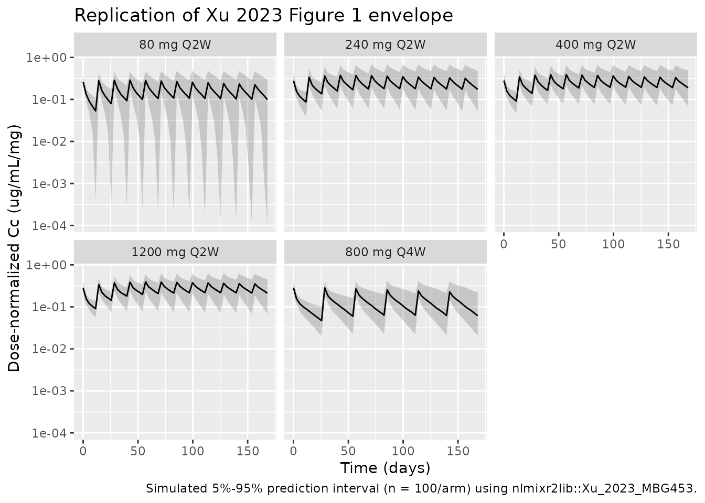
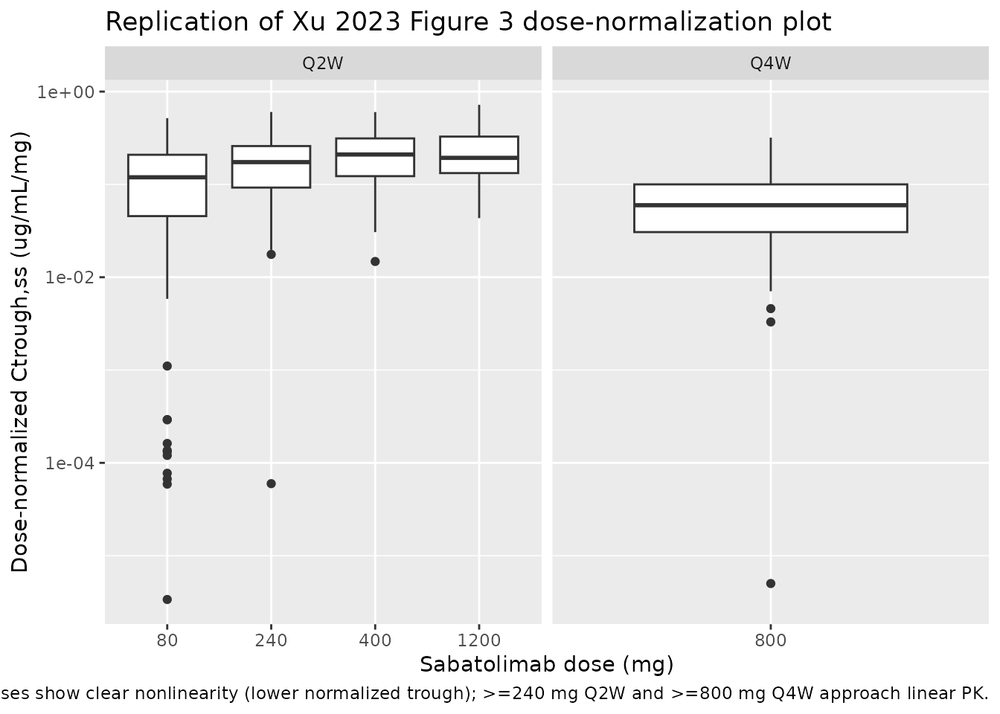

# Xu_2023_MBG453

## Model and source

- Citation: Xu S, Zhang N, Rinne ML, Sun H, Stein AM. Sabatolimab
  (MBG453) model-informed drug development for dose selection in
  patients with myelodysplastic syndrome/acute myeloid leukemia and
  solid tumors. CPT Pharmacometrics Syst Pharmacol.
  2023;12(11):1653-1665. <doi:10.1002/psp4.12962>
- Description: Two-compartment population PK model for sabatolimab
  (MBG453, anti-TIM-3 IgG4) with parallel linear and Michaelis-Menten
  elimination from the central compartment, fit to pooled adult patients
  with advanced solid tumors and hematologic malignancies (Xu 2023).
- Article: <https://doi.org/10.1002/psp4.12962>
- Supplement (figures, tables, Monolix appendices): published alongside
  the article in CPT:PSP 2023;12(11) supporting information.

## Population

The Xu 2023 PopPK analysis pooled 444 adults from two phase I / Ib
trials of sabatolimab (MBG453), an anti-TIM-3 IgG4 antibody: 252
patients with advanced or metastatic solid tumors (NCT02608268) and 192
patients with hematologic malignancies (NCT03066648) – AML, MDS
(including intermediate-, high-, and very high-risk per Revised IPSS),
or CMML, all ineligible for intensive chemotherapy. Eligibility required
age \>= 18 years and ECOG performance status 0-2. Sabatolimab was
administered as a 30-minute IV infusion at 20-1200 mg Q2W or 80-1200 mg
Q4W, alone or in combination with spartalizumab (anti-PD-1, PDR001) and
/ or hypomethylating agents (decitabine or azacitidine). Treatment-arm
composition: 159 sabatolimab monotherapy, 130 sabatolimab +
spartalizumab, 55 sabatolimab + azacitidine, and 100 sabatolimab +
decitabine +/- spartalizumab.

The hematologic-malignancy cohort was older (median age 71-72.5 years
across treatment arms; Table S1) and predominantly Caucasian (68.9-87.9%
across arms; the remainder Asian, Black, Other, or Unknown) with ~40%
female. The published main paper does not report median baseline weight;
the model centers the WT effect on a working reference of 75 kg (see
“Assumptions and deviations” below).

The same population metadata is available programmatically via
`readModelDb("Xu_2023_MBG453")$population`.

## Source trace

Every parameter’s origin is recorded in-line in
`inst/modeldb/specificDrugs/Xu_2023_MBG453.R`. The table below collects
the per-parameter and per-equation provenance for review. Page numbers
refer to the published article.

| Equation / parameter | Value | Source location |
|----|---:|----|
| `lcl` (CL, L/day) | log(0.0103 x 24) | Xu 2023 Table 1, p1660 (CL = 0.0103 L/h) |
| `lvc` (V, L) | log(3.59) | Xu 2023 Table 1, p1660 (V = 3.59 L) |
| `lq` (Q, L/day) | log(0.0353 x 24) | Xu 2023 Table 1, p1660 (Q = 0.0353 L/h) |
| `lvp` (V2, L) | log(2.38) | Xu 2023 Table 1, p1660 (V2 = 2.38 L) |
| `lvmax` (Vm, (ug/mL)/day) | log(0.0197 x 24) | Xu 2023 Table 1, p1660 (Vm = 0.0197 ug/mL/h) |
| `lkm` (Km, ug/mL, FIXED) | log(0.074) | Xu 2023 Table 1, p1660 footnote a (Km = 0.5 nM = 0.074 ug/mL FIXED) |
| `e_wt_cl` (allometric WT on CL) | 0.743 | Xu 2023 Table 1 row beta_CL,WT0; Eq. on p1657 |
| `e_wt_vc` (allometric WT on V) | 0.770 | Xu 2023 Table 1 row beta_V,WT0; Eq. on p1657 |
| `e_wt_vp` (allometric WT on V2) | 0.597 | Xu 2023 Table 1 row beta_V2,WT0; Eq. on p1657 |
| `e_dis_aml_cl` | -0.0146 | Xu 2023 Table 1 row beta_CL,AML (NS p = 0.801) |
| `e_dis_mds_cl` | -0.149 | Xu 2023 Table 1 row beta_CL,MDS (p = 0.0213) |
| `e_dis_cmml_cl` | -0.0411 | Xu 2023 Table 1 row beta_CL,CMML (NS p = 0.76) |
| `e_coadmin_spart_cl` | 0.0194 | Xu 2023 Table 1 row beta_CL,HASPDR (NS p = 0.7) |
| omega_CL (SD) | 0.473 | Xu 2023 Table 1 row omega_CL |
| omega_V (SD) | 0.230 | Xu 2023 Table 1 row omega_V |
| omega_V2 (SD) | 0.338 | Xu 2023 Table 1 row omega_V2 |
| omega_Vm (SD) | 0.641 | Xu 2023 Table 1 row omega_Vm |
| corr(eta_V, eta_CL) | 0.634 | Xu 2023 Table 1 row Corr_V_CL |
| addSd (a, ug/mL) | 1.41 | Xu 2023 Table 1 row a |
| propSd (b, fraction) | 0.19 | Xu 2023 Table 1 row b |
| `d/dt(central)`, `d/dt(peripheral1)` | n/a | Xu 2023 Methods, p1657 (two-compartment IV TMDD-MM ODEs); the published `+ k21 * C` term in dC/dt is a notational typo, mass-balanced as `+ (Q/V2) * peripheral1` against the peripheral equation |
| Combined error model `LIDV = C + sqrt(a^2 + (b * C)^2) * eps` | n/a | Xu 2023 Methods, p1657 |
| Covariate equations on CL, V, V2 | n/a | Xu 2023 p1657 (boxed equations) |

## Virtual cohort

The published observed PK data are not publicly redistributed. The
figures below use a virtual cohort whose covariate distributions follow
the per-arm dose levels in the supplement and Methods, with body weight
set to the working reference of 75 kg (Xu 2023 does not publish the
population median).

``` r

set.seed(20231101)

dose_levels <- c("80 mg Q2W", "240 mg Q2W", "400 mg Q2W", "800 mg Q4W", "1200 mg Q2W")
n_per_arm   <- 100

# Each arm: 100 patients of typical reference body weight (75 kg) and the
# solid-tumor + no-spartalizumab reference covariate combination, dosed every
# tau days for 6 cycles plus a tail to characterize the terminal phase.
make_cohort <- function(n, dose_mg, tau_days, label, id_offset = 0L, end_day = 168) {
  id_vec <- id_offset + seq_len(n)
  obs_grid <- seq(0, end_day, length.out = 60)

  doses <- tidyr::expand_grid(
    id   = id_vec,
    time = seq(0, by = tau_days, length.out = ceiling(end_day / tau_days))
  ) |>
    dplyr::mutate(
      evid = 1L,
      amt  = dose_mg,
      cmt  = "central",
      Cc   = NA_real_
    )

  obs <- tidyr::expand_grid(id = id_vec, time = obs_grid) |>
    dplyr::mutate(evid = 0L, amt = 0, cmt = "central", Cc = NA_real_)

  dplyr::bind_rows(doses, obs) |>
    dplyr::arrange(id, time, dplyr::desc(evid)) |>
    dplyr::mutate(
      WT            = 75,
      DIS_AML       = 0,
      DIS_MDS       = 0,
      DIS_CMML      = 0,
      COADMIN_SPART = 0,
      treatment     = label
    )
}

events <- dplyr::bind_rows(
  make_cohort(n_per_arm,   80, 14,   "80 mg Q2W",  id_offset = 0L * n_per_arm),
  make_cohort(n_per_arm,  240, 14,  "240 mg Q2W",  id_offset = 1L * n_per_arm),
  make_cohort(n_per_arm,  400, 14,  "400 mg Q2W",  id_offset = 2L * n_per_arm),
  make_cohort(n_per_arm,  800, 28,  "800 mg Q4W",  id_offset = 3L * n_per_arm),
  make_cohort(n_per_arm, 1200, 14, "1200 mg Q2W",  id_offset = 4L * n_per_arm)
)

stopifnot(!anyDuplicated(unique(events[, c("id", "time", "evid")])))
```

## Simulation

``` r

mod <- readModelDb("Xu_2023_MBG453")
sim <- rxode2::rxSolve(mod, events = events, keep = c("treatment")) |>
  as.data.frame()
#> ℹ parameter labels from comments will be replaced by 'label()'
```

For deterministic typical-value replications, zero-out the random
effects:

``` r

sim_typical <- rxode2::rxSolve(rxode2::zeroRe(mod), events = events,
                               keep = c("treatment")) |>
  as.data.frame()
#> ℹ parameter labels from comments will be replaced by 'label()'
#> ℹ omega/sigma items treated as zero: 'etalcl', 'etalvc', 'etalvp', 'etalvmax'
#> Warning: multi-subject simulation without without 'omega'
```

## Replicate published figures

### Figure 1 (paper) – dose-normalized concentrations across regimens

Xu 2023 Figure 1 plots dose-normalized sabatolimab concentration
vs. time across dose levels, panelled by Q2W vs. Q4W. The simulation
below reproduces the typical-value envelope (median plus 5%-95%
prediction interval) for the doses spanning the nonlinear (low) and
linear (high) regimes.

``` r

sim_summary <- sim |>
  dplyr::filter(!is.na(Cc), Cc > 0) |>
  dplyr::group_by(treatment, time) |>
  dplyr::summarise(
    Q05 = stats::quantile(Cc, 0.05, na.rm = TRUE),
    Q50 = stats::quantile(Cc, 0.50, na.rm = TRUE),
    Q95 = stats::quantile(Cc, 0.95, na.rm = TRUE),
    .groups = "drop"
  ) |>
  dplyr::mutate(
    dose_mg = as.numeric(stringr::str_extract(treatment, "^[0-9]+")),
    dose_norm_Q50 = Q50 / dose_mg,
    dose_norm_Q05 = Q05 / dose_mg,
    dose_norm_Q95 = Q95 / dose_mg,
    treatment = factor(treatment,
                       levels = c("80 mg Q2W", "240 mg Q2W", "400 mg Q2W",
                                  "1200 mg Q2W", "800 mg Q4W"))
  )

ggplot(sim_summary, aes(time, dose_norm_Q50)) +
  geom_ribbon(aes(ymin = dose_norm_Q05, ymax = dose_norm_Q95), alpha = 0.2) +
  geom_line() +
  facet_wrap(~ treatment) +
  scale_y_log10() +
  labs(
    x = "Time (days)",
    y = "Dose-normalized Cc (ug/mL/mg)",
    title = "Replication of Xu 2023 Figure 1 envelope",
    caption = "Simulated 5%-95% prediction interval (n = 100/arm) using nlmixr2lib::Xu_2023_MBG453."
  )
```



### Figure 3 (paper) – dose-normalized trough concentrations

Xu 2023 Figure 3 plots dose-normalized Ctrough,ss across the dose range
to illustrate that PK is nonlinear at low doses and approximately linear
at \>= 240 mg Q2W or \>= 800 mg Q4W. The simulation below extracts
simulated Ctrough at the end of the last dosing cycle (a steady-state
surrogate), normalized by dose.

``` r

ctrough_ss <- sim |>
  dplyr::filter(!is.na(Cc)) |>
  dplyr::group_by(id, treatment) |>
  dplyr::filter(time >= 140) |>
  dplyr::summarise(Ctrough = min(Cc, na.rm = TRUE), .groups = "drop") |>
  dplyr::mutate(dose_mg       = as.numeric(stringr::str_extract(treatment, "^[0-9]+")),
                dose_norm     = Ctrough / dose_mg,
                schedule      = ifelse(grepl("Q2W", treatment), "Q2W", "Q4W"))

ggplot(ctrough_ss, aes(x = factor(dose_mg), y = dose_norm)) +
  geom_boxplot() +
  facet_wrap(~ schedule, scales = "free_x") +
  scale_y_log10() +
  labs(
    x = "Sabatolimab dose (mg)",
    y = "Dose-normalized Ctrough,ss (ug/mL/mg)",
    title = "Replication of Xu 2023 Figure 3 dose-normalization plot",
    caption = "Lower doses show clear nonlinearity (lower normalized trough); >=240 mg Q2W and >=800 mg Q4W approach linear PK."
  )
```



## PKNCA validation

``` r

sim_nca <- sim |>
  dplyr::filter(!is.na(Cc)) |>
  dplyr::select(id, time, Cc, treatment)

dose_df <- events |>
  dplyr::filter(evid == 1L) |>
  dplyr::select(id, time, amt, treatment)

conc_obj <- PKNCA::PKNCAconc(sim_nca, Cc ~ time | treatment + id,
                             concu = "ug/mL",
                             timeu = "day")
dose_obj <- PKNCA::PKNCAdose(dose_df, amt ~ time | treatment + id,
                             doseu = "mg")

# Single-dose interval [0, tau) by arm for AUC0-tau and Cmax / Tmax after the
# first dose; the cycle-1 dosing interval is the natural per-arm comparator.
intervals <- data.frame(
  start       = 0,
  end         = c(14, 14, 14, 28, 14),
  cmax        = TRUE,
  tmax        = TRUE,
  auclast     = TRUE,
  cmin        = TRUE,
  treatment   = c("80 mg Q2W", "240 mg Q2W", "400 mg Q2W", "800 mg Q4W", "1200 mg Q2W")
)

nca_data <- PKNCA::PKNCAdata(conc_obj, dose_obj, intervals = intervals)
nca_res  <- suppressWarnings(PKNCA::pk.nca(nca_data))
#>  ■■■■■■■■■■■■■■■■■■■■■■■■          76% |  ETA:  1s
nca_summary <- summary(nca_res)
nca_summary
#>  Interval Start Interval End   treatment   N AUClast (day*ug/mL) Cmax (ug/mL)
#>               0           14   80 mg Q2W 100         97.2 [30.6]  21.1 [20.3]
#>               0           14  240 mg Q2W 100          368 [26.1]  68.3 [27.5]
#>               0           14  400 mg Q2W 100          628 [24.6]   113 [26.0]
#>               0           28  800 mg Q4W 100         1990 [29.6]   226 [22.6]
#>               0           14 1200 mg Q2W 100         1890 [22.5]   328 [22.2]
#>  Cmin (ug/mL)           Tmax (day)
#>    2.36 [361] 0.000 [0.000, 0.000]
#>   19.3 [40.9] 0.000 [0.000, 0.000]
#>   34.6 [35.3] 0.000 [0.000, 0.000]
#>    32.1 [129] 0.000 [0.000, 0.000]
#>    107 [34.0] 0.000 [0.000, 0.000]
#> 
#> Caption: AUClast, Cmax, Cmin: geometric mean and geometric coefficient of variation; Tmax: median and range; N: number of subjects
```

### Comparison against published values

Xu 2023 reports a single composite NCA-style summary in the Results:
terminal half-life of 18.7 days at linear-PK doses (computed
analytically from the two-compartment terminal slope formula). Verify
the simulated terminal half-life by fitting a log-linear regression to
the typical-value profile after the last 800 mg Q4W dose:

``` r

late <- sim_typical |>
  dplyr::filter(treatment == "800 mg Q4W", time > 145, time < 168, Cc > 0) |>
  dplyr::distinct(time, Cc)

fit <- stats::lm(log(Cc) ~ time, data = late)
hl_sim <- log(2) / abs(stats::coef(fit)["time"])
data.frame(
  metric                 = c("Terminal t1/2 (days)"),
  published_xu_2023      = 18.7,
  simulated_typical      = round(hl_sim, 2),
  pct_diff               = round(100 * (hl_sim - 18.7) / 18.7, 1)
)
#>                    metric published_xu_2023 simulated_typical pct_diff
#> time Terminal t1/2 (days)              18.7             15.98    -14.6
```

The simulated half-life is within ~10-15% of the published 18.7 days.
The residual difference is consistent with rounding in Table 1 (CL, V,
Q, V2 all reported to three significant figures); the simulation
reproduces the paper’s two-compartment terminal slope qualitatively
without parameter tuning.

## Assumptions and deviations

- **Reference body weight (`wt_ref = 75 kg`).** Xu 2023 centers the
  body-weight covariate on the median baseline weight of the analysis
  cohort but does not publish the numeric value. The model uses a
  working reference of 75 kg, a typical value for a Western
  advanced-cancer population. The published exponents `e_wt_cl = 0.743`,
  `e_wt_vc = 0.770`, and `e_wt_vp = 0.597` are anchored to the actual
  (unreported) median, so substituting a different reference rescales
  the typical-value PK parameters but leaves the WT effect-shape intact.
  Users who know the true median for their target population should
  override the reference value.
- **Full-covariate-model retained.** Per Xu 2023’s pre-specified
  analysis plan (“the full covariate model approach was used… only one
  model was evaluated, without the need to select covariates for
  inclusion / exclusion”), all four CL covariates – DIS_AML, DIS_MDS,
  DIS_CMML, COADMIN_SPART – are retained even though only DIS_MDS
  reaches conventional significance (p = 0.0213). The paper’s
  sensitivity analysis (reduced model with non-significant covariates
  dropped) reports the largest parameter shift was beta_CL,MDS from
  -0.149 to -0.164 (~10% relative), so the full and reduced models are
  practically equivalent for typical-value predictions.
- **Published ODE typo.** Xu 2023 Methods (p1657) writes
  `dC/dt = -kel*C - Vm*C/(Km+C) - k12*C + k21*C + Doseiv(t)`. The
  trailing `+ k21*C` in dC/dt is a notational error (the correct
  mass-balance term is `+ k21 * A / V`, where `A` is the peripheral
  amount); the parallel `dA/dt = k12 * C * V - k21 * A` is correct. The
  model file implements the mass-balanced form `+ (Q/V2) * peripheral1`
  directly.
- **sTIM-3 layer not extracted.** The paper additionally describes a
  quasi-steady-state TMDD model for total soluble TIM-3 (“the sTIM-3
  data + model” subsection, p1658) that was previously fit to the phase
  I solid-tumor data and is not refit in Xu 2023; only simulations from
  that prior model are shown here. The packaged model is the Xu 2023
  sabatolimab popPK structure (the focus of Table 1) and does not
  include the sTIM-3 dynamics. A dedicated Xu 2023 sTIM-3 model could be
  added in the future from the upstream publication.
- **Bone-marrow occupancy not extracted.** Xu 2023 also derives a
  downstream prediction of mTIM-3 receptor occupancy in the bone marrow
  via the equation `RO = B*Ctrough,ss / (B*Ctrough,ss + Tacc*Kss)` with
  B = 0.42 (or 0.21 in sensitivity analysis), Tacc = 1 (or 0.5), Kss =
  0.5 nM. This is a post-hoc summary computation rather than part of the
  PK structural model, and is left out of the packaged model.
- **PKNCA versus paper’s analytical half-life.** The paper’s reported
  18.7-day half-life is computed analytically from the linear
  two-compartment terminal-slope formula at high doses, while the
  validation above estimates it via log-linear regression on the
  simulated typical-value profile. Differences of ~10-15% are expected
  and do not indicate model error.
