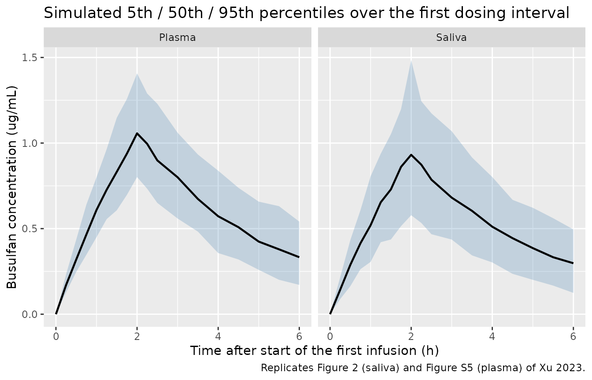
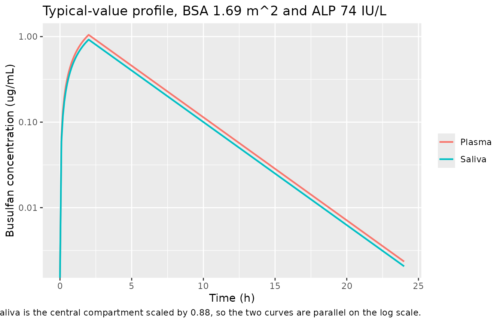

# Busulfan plasma and saliva (Xu 2023)

## Model and source

- Citation: Xu B, Yang T, Zhou J, Zheng Y, Wang J, Liu Q, Li D, Zhang Y,
  Liu M, Wu X. Saliva as a noninvasive sampling matrix for therapeutic
  drug monitoring of intravenous busulfan in Chinese patients undergoing
  hematopoietic stem cell transplantation: A prospective population
  pharmacokinetic and simulation study. CPT Pharmacometrics Syst
  Pharmacol. 2023;12(9):1238-1249. <doi:10.1002/psp4.13004>
- Description: One-compartment intravenous population PK model for
  busulfan in Chinese adult and paediatric patients undergoing
  allogeneic hematopoietic stem cell transplantation (Xu 2023), fitted
  jointly to paired plasma and saliva concentrations collected after the
  first 2-hour infusion. Saliva is not a separate kinetic compartment:
  the salivary busulfan concentration is the central-compartment
  (plasma) concentration multiplied by an estimated saliva:plasma scale
  factor of 0.88, a structure the authors selected over a kinetically
  distinct saliva compartment (dOFV = -82.52). Clearance and the central
  volume of distribution both increase with body surface area (power
  exponents 0.99 and 1.03 referenced to the population median BSA of
  1.69 m^2); the volume additionally decreases with alkaline phosphatase
  (power exponent -0.20 referenced to the median ALP of 74 U/L).
  Separate proportional residual errors apply to plasma (12.92%) and
  saliva (22.50%).
- Article: <https://doi.org/10.1002/psp4.13004>

Busulfan (BU) has a narrow therapeutic window and is routinely
dose-individualised by therapeutic drug monitoring (TDM) of plasma
exposure. Xu and colleagues asked whether **saliva** – a noninvasive
matrix – could replace plasma for that purpose, and built the first
population PK model of intravenous busulfan that describes plasma and
salivary concentrations jointly.

The answer they arrived at is structurally simple: saliva does **not**
behave as a kinetically distinct compartment. A one-compartment plasma
model whose central concentration is multiplied by a single estimated
*scale factor* fit the paired data substantially better (dOFV = -82.52)
than a model that gave saliva its own compartment with its own transfer
and elimination rate constants. The alternative structure was
additionally rejected because its saliva elimination rate constant `k20`
was estimated with an unacceptable 87% RSE (Xu 2023, Discussion).

That is what the packaged model encodes: one ODE state (`central`) and
two observations, `Cc` (plasma) and `Csaliva = fsaliva * Cc`.

## Population

Sixty-six Chinese patients with hematologic malignancies (54 adults and
12 children aged 6-17 years) undergoing allogeneic hematopoietic stem
cell transplantation were enrolled at Fujian Medical University Union
Hospital between November 2020 and November 2021 (Xu 2023 Methods,
“Subjects”). Median age was 42 years (range 6-63), median weight 60.70
kg (range 25-90), median height 160 cm (range 123-190), median body
surface area 1.69 m^2 (range 0.92-2.14) and median alkaline phosphatase
74 IU/L (range 36-253); 46 of 66 patients (69.7%) were male (Xu 2023
Table 1).

All patients received intravenous busulfan 0.8 mg/kg – dosed on adjusted
ideal body weight – every 6 h as a 2-hour infusion for 4 consecutive
days, as part of one of four myeloablative conditioning regimens. Paired
plasma and saliva samples were drawn just before (0 h) and at 0.5, 2,
2.5, 3, 4 and 6 h after the start of the **first** dose. Of 406 paired
collections, 406 plasma and 387 saliva samples were analysable; 19
saliva samples fell below the lower limit of quantitation and were
deleted by the M1 method (Xu 2023 Results).

The same information is available programmatically via the model’s
`population` metadata (`readModelDb("Xu_2023_busulfan")()$population`).

## Source trace

Every `ini()` entry in `inst/modeldb/specificDrugs/Xu_2023_busulfan.R`
carries an in-file comment pointing at its origin. They are collected
here for review.

| Equation / parameter | Value | Source location |
|----|----|----|
| `lcl` (theta_CL) | 8.24 L/h | Table 3, final model (RSE 3%; bootstrap 7.75-8.77) |
| `lvc` (theta_Vd) | 29.70 L | Table 3, final model (RSE 2%; bootstrap 28.32-31.14) |
| `lfsaliva` (theta_Scale-factor) | 0.88 | Table 3, final model (RSE 2%; bootstrap 0.84-0.91) |
| `e_bsa_cl` (theta_BSA-CL) | 0.99 | Table 3, final model (RSE 12%; bootstrap 0.76-1.27) |
| `e_bsa_vc` (theta_BSA-Vd) | 1.03 | Table 3, final model (RSE 10%; bootstrap 0.77-1.22) |
| `e_alp_vc` (theta_ALP-Vd) | -0.20 | Table 3, final model (RSE 26%; bootstrap -0.31 to -0.09) |
| `etalcl` | 0.0472764 | Table 3 IIV_CL = 22.00%; omega^2 = log(0.22^2 + 1) |
| `etalvc` | 0.0183272 | Table 3 IIV_Vd = 13.60%; omega^2 = log(0.136^2 + 1) |
| `propSd` | 0.1292 | Table 3 epsilon_plasma = 12.92% (RSE 17%) |
| `propSd_Csaliva` | 0.2250 | Table 3 epsilon_saliva = 22.50% (RSE 22%) |
| `CL = theta_CL * (BSA/1.69)^theta_BSA_CL * exp(eta)` | n/a | Table 3 footnote equation (first displayed equation below the footnote list) |
| `Vd = theta_Vd * (BSA/1.69)^theta_BSA_Vd * (ALP/74)^theta_ALP_Vd * exp(eta)` | n/a | Table 3 footnote equation (second displayed equation) |
| `bsa_ref = 1.69 m^2` | 1.69 | Table 1 population median BSA; appears as the normalisation constant in the Table 3 footnote equations |
| `alp_ref = 74 IU/L` | 74 | Table 1 population median ALP; appears as the normalisation constant in the Table 3 footnote equation |
| `d/dt(central) = -kel * central` | n/a | Methods, “Population pharmacokinetic analysis”: one-compartment constant-rate-infusion structure, NONMEM ADVAN1 TRANS2 |
| `Csaliva = fsaliva * Cc` | n/a | Figure 1 conceptual model + Results, “PopPK model” (scale factor assigned to the plasma compartment) |
| `CL_i (L/h) = 8.24 * (BSA_i/1.69)^0.99` | n/a | Equation 5 (Discussion, initial-dose calculator) |
| `Dose (mg) = AUC_target * CL_i` | n/a | Equation 6 (Discussion, initial-dose calculator) |

The paper’s Table 3 footnotes `f` and `g` are mislabelled – they read
“Residual intra-individual variability of CL” and “… of Vd” for the rows
named `epsilon_plasma` and `epsilon_saliva`. The row names, and the
Discussion (“The residual error of plasma was lower than the saliva
(12.92% vs. 22.50%)”), make the intended meaning unambiguous: these are
the plasma and saliva residual errors, and that is how they are encoded.

## Virtual cohort

Original observed data are not publicly available. The cohort below
follows the design the authors used for their own simulation study (Xu
2023 Methods, “Simulations and evaluation of the predictability of the
model”): a positively skewed distribution of BSA with a corresponding
normal distribution of ALP, both truncated to the observed ranges in
Table 1.

Two arms are simulated, 200 subjects each (the validation cap):

- **Single 2-h infusion** – one dose, sampled to 24 h, for `Cmax` /
  `Tmax` / `AUC0-inf` / `t1/2`.
- **Steady state (q6h x 16)** – the 16-dose regimen the authors
  simulated, sampled across the final dosing interval, to test their
  stated identity that `AUCss` within a dosing interval equals
  `AUC0-inf` after dose one.

Doses come from the paper’s own published initial-dose calculator
(Equations 5 and 6), so no dosing assumption is imported from outside
the paper. The AUC target is 1200 umol*min/L, the midpoint of the
EMA-recommended 900-1500 umol*min/L window quoted in the Introduction.

``` r

set.seed(20230913)

n_per_arm <- 200L

# Busulfan molecular weight, C6H14O6S2 = 246.30 g/mol. Needed only to express
# the paper's umol*min/L AUC target in the ug/mL * h units the model works in.
mw_bu <- 246.30
umol_min_L_per_ug_h_mL <- 1000 / mw_bu * 60   # 1 ug*h/mL = 243.6 umol*min/L

auc_target_umol_min_L <- 1200                                     # EMA 900-1500 midpoint
auc_target_ug_h_mL <- auc_target_umol_min_L / umol_min_L_per_ug_h_mL

rtrunc <- function(n, rfun, lower, upper, ...) {
  out <- rfun(n, ...)
  bad <- out < lower | out > upper
  while (any(bad)) {
    out[bad] <- rfun(sum(bad), ...)
    bad <- out < lower | out > upper
  }
  out
}

make_subjects <- function(n, id_offset = 0L) {
  tibble(
    id = id_offset + seq_len(n),
    # Positive-skew BSA, median 1.69 m^2, truncated to Table 1's 0.92-2.14 range
    BSA = rtrunc(n, rlnorm, lower = 0.92, upper = 2.14,
                 meanlog = log(1.69), sdlog = 0.20),
    # Normal ALP, mean 74 IU/L, truncated to Table 1's 36-253 range
    ALP = rtrunc(n, rnorm, lower = 36, upper = 253, mean = 74, sd = 30)
  ) |>
    mutate(
      # Equation 5: typical individual clearance from BSA
      cl_pred = 8.24 * (BSA / 1.69)^0.99,
      # Equation 6: initial dose for the target AUC
      dose_mg = auc_target_ug_h_mL * cl_pred
    )
}

# Arm A: single 2-h infusion
subj_sd <- make_subjects(n_per_arm, id_offset = 0L) |>
  mutate(treatment = "Single 2-h infusion")

times_sd <- c(0, 0.25, 0.5, 0.75, 1, 1.25, 1.5, 1.75, 2, 2.25, 2.5,
              3, 3.5, 4, 4.5, 5, 5.5, 6, 7, 8, 10, 12, 16, 20, 24)

dose_sd <- subj_sd |>
  mutate(time = 0, evid = 1L, amt = dose_mg, dur = 2,
         cmt = "central", dvid = NA_integer_)

obs_sd <- subj_sd |>
  tidyr::crossing(time = times_sd, dvid = c(1L, 2L)) |>
  mutate(evid = 0L, amt = NA_real_, dur = NA_real_, cmt = "central")

# Arm B: q6h x 16 (steady state), sampled over the final dosing interval
subj_ss <- make_subjects(n_per_arm, id_offset = n_per_arm) |>
  mutate(treatment = "Steady state (q6h x 16)")

dose_times_ss <- seq(0, by = 6, length.out = 16)   # last dose starts at 90 h
times_ss <- seq(90, 96, by = 0.25)

dose_ss <- subj_ss |>
  tidyr::crossing(time = dose_times_ss) |>
  mutate(evid = 1L, amt = dose_mg, dur = 2, cmt = "central", dvid = NA_integer_)

obs_ss <- subj_ss |>
  tidyr::crossing(time = times_ss, dvid = c(1L, 2L)) |>
  mutate(evid = 0L, amt = NA_real_, dur = NA_real_, cmt = "central")

ev_cols <- c("id", "treatment", "time", "evid", "amt", "dur", "cmt", "dvid",
             "BSA", "ALP", "dose_mg", "cl_pred")

events <- bind_rows(
  dose_sd[ev_cols], obs_sd[ev_cols],
  dose_ss[ev_cols], obs_ss[ev_cols]
) |>
  arrange(id, time, desc(evid))

# IDs must be disjoint across arms; duplicates silently merge into one subject.
stopifnot(
  length(intersect(subj_sd$id, subj_ss$id)) == 0L,
  dplyr::n_distinct(events$id) == 2L * n_per_arm
)
```

## Simulation

`rxSolve()` is asked for both endpoints. `dvid = 1` rows return the
plasma observation (`sim`) and `dvid = 2` rows the saliva observation,
each with its own proportional residual error applied; `Cc` and
`Csaliva` (the residual-free individual predictions) come back on every
row. `useLinCmt = FALSE` is required because rxode2’s automatic
ODE-to-`linCmt()` conversion corrupts the `dvid` mapping for
multi-endpoint models.

`rxSolve()` occasionally drops a subset of subjects to `NA` with no
warning, so the solve is retried until the cohort comes back complete
and then asserted.

``` r

mod <- readModelDb("Xu_2023_busulfan")

solve_complete <- function(model, events, n_expected, tries = 5L) {
  for (i in seq_len(tries)) {
    out <- as.data.frame(rxode2::rxSolve(
      model, events = events,
      keep = c("treatment", "BSA", "ALP", "dose_mg", "cl_pred", "dvid"),
      useLinCmt = FALSE
    ))
    ok <- dplyr::n_distinct(out$id) == n_expected &&
      all(is.finite(out$Cc)) && max(out$Cc, na.rm = TRUE) > 0
    if (ok) return(out)
  }
  stop("rxSolve() did not return a complete cohort after ", tries, " attempts")
}

sim <- solve_complete(mod, events, n_expected = 2L * n_per_arm)
#> ℹ parameter labels from comments will be replaced by 'label()'

sim <- sim |>
  mutate(
    matrix = ifelse(dvid == 1L, "Plasma", "Saliva"),
    # `sim` carries the endpoint-appropriate residual error for that row
    conc_obs = sim,
    conc_ipred = ifelse(dvid == 1L, Cc, Csaliva)
  )

stopifnot(
  dplyr::n_distinct(sim$id) == 2L * n_per_arm,
  all(is.finite(sim$conc_ipred))
)
```

A typical-value (no between-subject variability) solve is used for the
structural checks below. `zeroRe()` alone is not sufficient once a
stochastic solve has run in the same session – rxode2 retains that
solve’s `omega` and silently re-samples etas – so `omega = NA` is passed
explicitly and the result is asserted to be covariate-determined.

``` r

typ_subject <- tibble(id = 1L, BSA = 1.69, ALP = 74) |>
  mutate(cl_pred = 8.24 * (BSA / 1.69)^0.99,
         dose_mg = auc_target_ug_h_mL * cl_pred)

typ_events <- bind_rows(
  typ_subject |>
    mutate(time = 0, evid = 1L, amt = dose_mg, dur = 2,
           cmt = "central", dvid = NA_integer_),
  typ_subject |>
    tidyr::crossing(time = seq(0, 24, by = 0.1), dvid = c(1L, 2L)) |>
    mutate(evid = 0L, amt = NA_real_, dur = NA_real_, cmt = "central")
) |>
  arrange(time, desc(evid))

typ <- as.data.frame(rxode2::rxSolve(
  rxode2::zeroRe(mod), events = typ_events,
  keep = c("BSA", "ALP", "dvid"), useLinCmt = FALSE, omega = NA
))
#> ℹ parameter labels from comments will be replaced by 'label()'

# Mechanical guard: with IIV zeroed, CL must be exactly the covariate prediction.
stopifnot(dplyr::n_distinct(round(typ$cl, 8)) == 1L)
stopifnot(isTRUE(all.equal(unique(typ$cl), typ_subject$cl_pred, tolerance = 1e-6)))
```

## Replicate published figures

### Figure 2 (saliva VPC) and Figure S5 (plasma VPC)

Figure 2 of Xu 2023 is the visual predictive check of the saliva model
over the first dosing interval; Figure S5 is the plasma counterpart.
Both are reproduced here as 5th / 50th / 95th percentiles of the
simulated observations (individual prediction plus proportional residual
error) for the single-dose arm.

``` r

sim |>
  filter(treatment == "Single 2-h infusion", time <= 6) |>
  group_by(matrix, time) |>
  summarise(
    Q05 = quantile(conc_obs, 0.05, na.rm = TRUE),
    Q50 = quantile(conc_obs, 0.50, na.rm = TRUE),
    Q95 = quantile(conc_obs, 0.95, na.rm = TRUE),
    .groups = "drop"
  ) |>
  ggplot(aes(time, Q50)) +
  geom_ribbon(aes(ymin = Q05, ymax = Q95), alpha = 0.25, fill = "steelblue") +
  geom_line(linewidth = 0.8) +
  facet_wrap(~matrix) +
  labs(
    x = "Time after start of the first infusion (h)",
    y = "Busulfan concentration (ug/mL)",
    title = "Simulated 5th / 50th / 95th percentiles over the first dosing interval",
    caption = "Replicates Figure 2 (saliva) and Figure S5 (plasma) of Xu 2023."
  )
```



### Figure 1 (conceptual model): the scale factor is time-invariant

Figure 1 draws saliva as the central compartment rescaled, not as a
compartment with its own kinetics. The consequence is that the
individual-prediction saliva / plasma ratio is exactly `fsaliva` at
every time, for every subject and every covariate combination – there is
no distribution delay and no separate terminal slope. That is asserted
rather than merely plotted.

``` r

ratio_ipred <- typ |>
  filter(time > 0) |>
  transmute(ratio = Csaliva / Cc) |>
  pull(ratio)

stopifnot(isTRUE(all.equal(range(ratio_ipred), c(0.88, 0.88), tolerance = 1e-8)))

typ |>
  filter(dvid == 1L) |>
  select(time, Plasma = Cc, Saliva = Csaliva) |>
  tidyr::pivot_longer(-time, names_to = "matrix", values_to = "conc") |>
  ggplot(aes(time, conc, colour = matrix)) +
  geom_line(linewidth = 0.8) +
  scale_y_log10() +
  labs(
    x = "Time (h)", y = "Busulfan concentration (ug/mL)", colour = NULL,
    title = "Typical-value profile, BSA 1.69 m^2 and ALP 74 IU/L",
    caption = paste(
      "Replicates the structure of Figure 1 of Xu 2023: saliva is the central",
      "compartment scaled by 0.88, so the two curves are parallel on the log scale."
    )
  )
#> Warning in scale_y_log10(): log-10 transformation introduced infinite values.
```



## Table 2: saliva / plasma ratio and concentration-time profile

Table 2 of Xu 2023 reports, at each sampling time, the mean +/- SD
plasma concentration, saliva concentration, and saliva/plasma (S/P)
ratio in the observed data. The S/P ratio is the sharpest available
check on this model, because its central tendency is set by `fsaliva`
alone and its spread is set by the two residual-error terms alone:
`SD(S/P) ~ fsaliva * sqrt(propSd^2 + propSd_Csaliva^2)`.

``` r

paper_times <- c(0.5, 1.0, 1.5, 2.0, 2.5, 3, 4, 5, 6)

published_t2 <- tibble::tribble(
  ~time, ~plasma_ref, ~saliva_ref, ~sp_ref, ~sp_ref_sd,
  0.5,   0.59,        0.53,        0.90,    0.12,
  1.0,   0.71,        0.61,        0.87,    0.14,
  1.5,   0.98,        0.88,        0.88,    0.21,
  2.0,   1.16,        0.99,        0.88,    0.22,
  2.5,   1.00,        0.91,        0.92,    0.24,
  3.0,   0.89,        0.74,        0.85,    0.19,
  4.0,   0.69,        0.60,        0.89,    0.24,
  5.0,   0.58,        0.50,        0.89,    0.32,
  6.0,   0.42,        0.37,        0.90,    0.20
)

sim_t2 <- sim |>
  filter(treatment == "Single 2-h infusion", time %in% paper_times) |>
  select(id, time, matrix, conc_obs) |>
  tidyr::pivot_wider(names_from = matrix, values_from = conc_obs) |>
  mutate(sp = Saliva / Plasma) |>
  group_by(time) |>
  summarise(
    plasma_sim = mean(Plasma),
    saliva_sim = mean(Saliva),
    sp_sim = mean(sp),
    sp_sim_sd = sd(sp),
    .groups = "drop"
  )

t2 <- published_t2 |>
  left_join(sim_t2, by = "time") |>
  mutate(
    plasma_pct = 100 * (plasma_sim - plasma_ref) / plasma_ref,
    saliva_pct = 100 * (saliva_sim - saliva_ref) / saliva_ref,
    sp_pct = 100 * (sp_sim - sp_ref) / sp_ref
  )

t2 |>
  transmute(
    `Time (h)` = time,
    `Plasma, observed (ug/mL)` = round(plasma_ref, 2),
    `Plasma, simulated (ug/mL)` = round(plasma_sim, 2),
    `Plasma % diff` = round(plasma_pct, 1),
    `Saliva, observed (ug/mL)` = round(saliva_ref, 2),
    `Saliva, simulated (ug/mL)` = round(saliva_sim, 2),
    `Saliva % diff` = round(saliva_pct, 1)
  ) |>
  knitr::kable(
    caption = paste(
      "Replicates Table 2 of Xu 2023 (mean concentrations by sampling time).",
      "Observed values are the paper's; simulated values are cohort means of the",
      "residual-error-included simulated observations."
    )
  )
```

| Time (h) | Plasma, observed (ug/mL) | Plasma, simulated (ug/mL) | Plasma % diff | Saliva, observed (ug/mL) | Saliva, simulated (ug/mL) | Saliva % diff |
|---:|---:|---:|---:|---:|---:|---:|
| 0.5 | 0.59 | 0.33 | -43.8 | 0.53 | 0.29 | -44.6 |
| 1.0 | 0.71 | 0.61 | -13.5 | 0.61 | 0.53 | -13.2 |
| 1.5 | 0.98 | 0.85 | -13.2 | 0.88 | 0.74 | -15.7 |
| 2.0 | 1.16 | 1.07 | -7.6 | 0.99 | 0.96 | -2.7 |
| 2.5 | 1.00 | 0.92 | -8.2 | 0.91 | 0.81 | -11.5 |
| 3.0 | 0.89 | 0.80 | -10.4 | 0.74 | 0.71 | -4.0 |
| 4.0 | 0.69 | 0.58 | -15.6 | 0.60 | 0.53 | -12.3 |
| 5.0 | 0.58 | 0.44 | -24.0 | 0.50 | 0.39 | -21.1 |
| 6.0 | 0.42 | 0.34 | -19.1 | 0.37 | 0.30 | -18.4 |

Replicates Table 2 of Xu 2023 (mean concentrations by sampling time).
Observed values are the paper’s; simulated values are cohort means of
the residual-error-included simulated observations. {.table}

``` r

t2 |>
  transmute(
    `Time (h)` = time,
    `S/P observed (mean)` = round(sp_ref, 2),
    `S/P observed (SD)` = round(sp_ref_sd, 2),
    `S/P simulated (mean)` = round(sp_sim, 2),
    `S/P simulated (SD)` = round(sp_sim_sd, 2),
    `% diff (mean)` = round(sp_pct, 1)
  ) |>
  knitr::kable(
    caption = paste(
      "Saliva/plasma ratio, replicating the S/P columns of Table 2 of Xu 2023.",
      "The paper reports an overall S/P of 0.89 +/- 0.22."
    )
  )
```

| Time (h) | S/P observed (mean) | S/P observed (SD) | S/P simulated (mean) | S/P simulated (SD) | % diff (mean) |
|---:|---:|---:|---:|---:|---:|
| 0.5 | 0.90 | 0.12 | 0.90 | 0.25 | 0.0 |
| 1.0 | 0.87 | 0.14 | 0.88 | 0.26 | 1.1 |
| 1.5 | 0.88 | 0.21 | 0.89 | 0.22 | 1.3 |
| 2.0 | 0.88 | 0.22 | 0.91 | 0.24 | 3.7 |
| 2.5 | 0.92 | 0.24 | 0.90 | 0.26 | -2.3 |
| 3.0 | 0.85 | 0.19 | 0.91 | 0.24 | 6.8 |
| 4.0 | 0.89 | 0.24 | 0.92 | 0.25 | 3.8 |
| 5.0 | 0.89 | 0.32 | 0.92 | 0.25 | 2.8 |
| 6.0 | 0.90 | 0.20 | 0.91 | 0.25 | 0.7 |

Saliva/plasma ratio, replicating the S/P columns of Table 2 of Xu 2023.
The paper reports an overall S/P of 0.89 +/- 0.22. {.table}

``` r


sp_overall <- sim |>
  filter(treatment == "Single 2-h infusion", time %in% paper_times) |>
  select(id, time, matrix, conc_obs) |>
  tidyr::pivot_wider(names_from = matrix, values_from = conc_obs) |>
  mutate(sp = Saliva / Plasma) |>
  summarise(mean = mean(sp), sd = sd(sp))

sp_theory <- 0.88 * sqrt(0.1292^2 + 0.2250^2)
```

Pooled across the paper’s sampling times the simulated S/P ratio is 0.90
+/- 0.25, against the paper’s observed `0.89 +/- 0.22`. The closed-form
spread implied by the two residual errors,
`0.88 * sqrt(0.1292^2 + 0.2250^2)`, is 0.228 – so the pooled observed
variability in the S/P ratio is accounted for by the model’s
residual-error structure alone, with no between-subject variability on
the scale factor required. (Per timepoint the agreement is looser in
both directions: the paper’s observed S/P SDs span 0.12-0.32 across the
nine sampling times against a simulated 0.22-0.26, on observed subsets
as small as n = 9.) That is consistent with the authors’ own finding
that the shrinkage on the scale-factor IIV reached 100%, so the term had
to be dropped.

### Dose-scale diagnostic for the absolute concentration level

The simulated concentrations in the table above sit below the observed
means at every timepoint. That is expected and is quantified here rather
than asserted: the trial dosed 0.8 mg/kg on **adjusted ideal body
weight**, which needs per-subject height and sex (not reported), so this
vignette instead doses each virtual subject from the paper’s own
Equation 5-6 calculator at the 1200 umol\*min/L target. In a linear
one-compartment model concentration is proportional to dose, so a pure
dose mismatch appears as one common multiplicative offset. The
post-infusion rows (t \>= 2 h, after the 2-hour infusion has ended) are
the ones free of infusion-timing artefacts.

``` r

offset <- t2 |>
  mutate(
    ratio_plasma = plasma_sim / plasma_ref,
    ratio_saliva = saliva_sim / saliva_ref,
    phase = ifelse(time >= 2, "Post-infusion", "Intra-infusion")
  )

offset_post <- offset |> filter(time >= 2)
ratios_post <- c(offset_post$ratio_plasma, offset_post$ratio_saliva)

# One common dose-scale factor implied by the post-infusion rows of both matrices
implied_dose_ratio <- exp(mean(log(ratios_post)))
implied_dose_excess_pct <- 100 * (1 / implied_dose_ratio - 1)
shortfall_post_pct <- range(100 * (1 - ratios_post))
shortfall_intra_pct <- range(100 * (1 - c(offset$ratio_plasma[offset$time < 2],
                                          offset$ratio_saliva[offset$time < 2])))

# A single constant offset would leave the ratio flat in time. Quantify the drift
# by the apparent 2 -> 6 h decline half-life of each mean series.
decline_hl <- function(c2, c6) 4 * log(2) / log(c2 / c6)
hl_obs_plasma <- decline_hl(t2$plasma_ref[t2$time == 2], t2$plasma_ref[t2$time == 6])
hl_sim_plasma <- decline_hl(t2$plasma_sim[t2$time == 2], t2$plasma_sim[t2$time == 6])

offset |>
  transmute(
    `Time (h)` = time,
    Phase = phase,
    `Plasma sim/obs` = round(ratio_plasma, 3),
    `Saliva sim/obs` = round(ratio_saliva, 3)
  ) |>
  knitr::kable(
    caption = paste(
      "Simulated/observed mean-concentration ratio by sampling time.",
      "A pure dose-scale mismatch would hold this ratio constant."
    )
  )
```

| Time (h) | Phase          | Plasma sim/obs | Saliva sim/obs |
|---------:|:---------------|---------------:|---------------:|
|      0.5 | Intra-infusion |          0.562 |          0.554 |
|      1.0 | Intra-infusion |          0.865 |          0.868 |
|      1.5 | Intra-infusion |          0.868 |          0.843 |
|      2.0 | Post-infusion  |          0.924 |          0.973 |
|      2.5 | Post-infusion  |          0.918 |          0.885 |
|      3.0 | Post-infusion  |          0.896 |          0.960 |
|      4.0 | Post-infusion  |          0.844 |          0.877 |
|      5.0 | Post-infusion  |          0.760 |          0.789 |
|      6.0 | Post-infusion  |          0.809 |          0.816 |

Simulated/observed mean-concentration ratio by sampling time. A pure
dose-scale mismatch would hold this ratio constant. {.table}

Over the post-infusion rows the simulated means run 2.7-24.0% below the
observed ones, and a single dose-scale factor of 0.868 accounts for the
bulk of that – i.e. the trial’s realised adjusted-ideal-body-weight
doses averaged about 15% higher than the calculator returns at the 1200
umol\*min/L target, which is the midpoint of the EMA 900-1500 window.

The ratio is not perfectly flat, so the offset is not *purely*
dose-scale: in plasma it drifts from 0.92 at 2 h to 0.81 at 6 h. The
apparent 2-to-6 h decline half-life is 2.41 h simulated against 2.73 h
for the observed means – both inside the 2-3 h terminal half-life the
paper quotes for busulfan (Introduction). The observed means are
cross-sectional over different and unequal subject subsets at each time
(n = 9-70 in Table 2), so this is weak evidence about shape in either
direction.

## PKNCA validation

NCA is run separately for each matrix, with the two arms carried as the
treatment grouping and arm-specific intervals.

``` r

nca_conc <- function(matrix_name) {
  sim |>
    filter(treatment == "Single 2-h infusion", matrix == matrix_name) |>
    filter(!is.na(conc_obs)) |>
    select(id, time, treatment, Cc = conc_obs)
}

nca_dose <- events |>
  filter(evid == 1, treatment == "Single 2-h infusion") |>
  select(id, time, amt, treatment)

intervals_sd <- data.frame(
  start = 0, end = Inf,
  cmax = TRUE, tmax = TRUE, aucinf.obs = TRUE, half.life = TRUE
)

run_nca_sd <- function(matrix_name) {
  conc_obj <- PKNCA::PKNCAconc(nca_conc(matrix_name), Cc ~ time | treatment + id)
  dose_obj <- PKNCA::PKNCAdose(
    nca_dose, amt ~ time | treatment + id,
    route = "intravascular", duration = 2
  )
  res <- PKNCA::pk.nca(
    PKNCA::PKNCAdata(conc_obj, dose_obj, intervals = intervals_sd)
  )
  as.data.frame(res) |>
    mutate(matrix = matrix_name)
}

nca_sd <- bind_rows(run_nca_sd("Plasma"), run_nca_sd("Saliva"))
```

### Comparison against published values

The paper does not tabulate NCA parameters for its own dataset, so the
reference column is assembled from the values it does report:

- **Cmax** – the 2 h row of Table 2 (1.16 ug/mL plasma, 0.99 ug/mL
  saliva); the Results state “The BU peak in both matrices appeared at 2
  h after administration”, which is the end of the 2-hour infusion.
- **Tmax** – 2 h, from the same sentence.
- **t1/2** – 2.5 h, the midpoint of the “terminal half-life of 2-3 h”
  quoted in the Introduction (Xu 2023 reference 11) as the accepted
  busulfan value.
- **AUC0-inf** – the 1200 umol*min/L design target used to compute each
  subject’s dose via Equations 5-6, converted to mass units (4.926
  ug*h/mL), and multiplied by 0.88 for saliva. This row is a
  **structural identity check** – numerically integrated AUC against
  `Dose / CL` – not an independent validation.

``` r

published_nca <- tibble::tribble(
  ~matrix,   ~cmax, ~tmax, ~aucinf.obs,                 ~half.life,
  "Plasma",  1.16,  2.0,   auc_target_ug_h_mL,          2.5,
  "Saliva",  0.99,  2.0,   auc_target_ug_h_mL * 0.88,   2.5
)

cmp <- nlmixr2lib::ncaComparisonTable(
  simulated = nca_sd,
  reference = published_nca,
  by = "matrix",
  units = c(cmax = "ug/mL", tmax = "h",
            aucinf.obs = "ug*h/mL", half.life = "h"),
  tolerance_pct = 20
)

knitr::kable(
  cmp,
  caption = "Simulated vs. published/derived NCA. * differs from reference by >20%.",
  align = c("l", "l", "r", "r", "r")
)
```

| NCA parameter           | matrix | Reference | Simulated | % diff |
|:------------------------|:-------|----------:|----------:|-------:|
| Cmax (ug/mL)            | Plasma |      1.16 |      1.12 |  -3.5% |
| Cmax (ug/mL)            | Saliva |      0.99 |      1.08 |  +9.1% |
| Tmax (h)                | Plasma |         2 |         2 |  +0.0% |
| Tmax (h)                | Saliva |         2 |         2 |  +0.0% |
| AUC0-∞ (obs) (ug\*h/mL) | Plasma |      4.93 |      4.86 |  -1.3% |
| AUC0-∞ (obs) (ug\*h/mL) | Saliva |      4.33 |       4.3 |  -0.8% |
| t½ (h)                  | Plasma |       2.5 |      2.41 |  -3.5% |
| t½ (h)                  | Saliva |       2.5 |      2.39 |  -4.5% |

Simulated vs. published/derived NCA. \* differs from reference by \>20%.
{.table}

``` r

attr(cmp, "footnote")
#> NULL
```

### Steady state: AUCss within a dosing interval equals AUC0-inf after dose one

The authors’ simulation study rests on the identity “The AUCss within
each dose interval is equal to the AUC0-inf after dose one” (Xu 2023
Discussion), which they use to justify validating `AUCss` prediction
against a single-dose calculation. For a linear one-compartment model
this is exact, and it is checked here against the simulated q6h x 16
arm.

``` r

intervals_ss <- data.frame(start = 90, end = 96, auclast = TRUE)

run_nca_ss <- function(matrix_name) {
  ss_conc <- sim |>
    filter(treatment == "Steady state (q6h x 16)", matrix == matrix_name) |>
    filter(!is.na(conc_ipred)) |>
    select(id, time, treatment, Cc = conc_ipred)
  conc_obj <- PKNCA::PKNCAconc(ss_conc, Cc ~ time | treatment + id)
  res <- PKNCA::pk.nca(PKNCA::PKNCAdata(conc_obj, intervals = intervals_ss))
  as.data.frame(res) |>
    filter(PPTESTCD == "auclast") |>
    transmute(id, matrix = matrix_name, auc_ss = PPORRES)
}

auc_ss <- bind_rows(run_nca_ss("Plasma"), run_nca_ss("Saliva"))
#> No dose information provided, calculations requiring dose will return NA.
#> No dose information provided, calculations requiring dose will return NA.

# Closed-form AUCss = Dose / CL_i (x 0.88 for saliva), using each subject's
# realised individual clearance from the simulation.
cl_indiv <- sim |>
  filter(treatment == "Steady state (q6h x 16)") |>
  distinct(id, dose_mg, cl) |>
  mutate(auc_closed_plasma = dose_mg / cl)

ss_check <- auc_ss |>
  left_join(cl_indiv, by = "id") |>
  mutate(
    auc_closed = ifelse(matrix == "Plasma",
                        auc_closed_plasma, auc_closed_plasma * 0.88),
    pct_diff = 100 * (auc_ss - auc_closed) / auc_closed
  )

ss_check |>
  group_by(matrix) |>
  summarise(
    `AUCss, numerically integrated (ug*h/mL)` = round(median(auc_ss), 3),
    `AUCss = Dose/CL closed form (ug*h/mL)` = round(median(auc_closed), 3),
    `Median % difference` = round(median(pct_diff), 2),
    `Max |% difference|` = round(max(abs(pct_diff)), 2),
    .groups = "drop"
  ) |>
  dplyr::rename(Matrix = matrix) |>
  knitr::kable(
    caption = paste(
      "Steady-state identity check over the 16th dosing interval (90-96 h).",
      "Confirms AUCss within a dosing interval equals Dose/CL, the assumption",
      "underlying the authors' simulation study."
    )
  )
```

| Matrix | AUCss, numerically integrated (ug\*h/mL) | AUCss = Dose/CL closed form (ug\*h/mL) | Median % difference | Max \|% difference\| |
|:---|---:|---:|---:|---:|
| Plasma | 4.871 | 4.872 | -0.03 | 0.17 |
| Saliva | 4.287 | 4.288 | -0.03 | 0.17 |

Steady-state identity check over the 16th dosing interval (90-96 h).
Confirms AUCss within a dosing interval equals Dose/CL, the assumption
underlying the authors’ simulation study. {.table style="width:100%;"}

``` r


# The residual gap is trapezoidal-integration error on a 15-minute grid.
stopifnot(max(abs(ss_check$pct_diff)) < 2)
```

## Assumptions and deviations

- **Dosing.** The paper’s patients received 0.8 mg/kg on **adjusted
  ideal body weight**, which requires per-subject height and sex;
  neither is reported at the subject level. Virtual subjects are
  therefore dosed with the paper’s own published initial-dose calculator
  (Equations 5 and 6: `CL_i = 8.24 * (BSA_i/1.69)^0.99`,
  `Dose = AUC_target * CL_i`) at the midpoint of the EMA 900-1500
  umol\*min/L target window. Every input to that calculation comes from
  the paper.
- **Molecular weight.** Converting the paper’s umol*min/L AUC targets
  into the ug/mL* h units the model works in requires busulfan’s
  molecular weight, 246.30 g/mol (C6H14O6S2). This is a physical
  constant, not a model parameter, and is the only number in this
  vignette that is not from Xu 2023.
- **Covariate distributions.** BSA is drawn log-normally (median 1.69
  m^2, sdlog 0.20) and ALP normally (mean 74 IU/L, SD 30) and both are
  truncated to the Table 1 ranges. This follows the authors’ stated
  simulation design (“a positive skew distribution of BSA and
  corresponding normal distribution of ALP”) but the dispersion
  parameters themselves are not reported; only the medians and ranges
  are. Marginal quantiles of the drawn cohort therefore need not match
  the unreported observed distribution.
- **Absolute concentration level.** Simulated mean concentrations sit
  2.7-24.0% below the Table 2 observed means over the post-infusion
  timepoints, and 13.2-44.6% below them intra-infusion. This is
  predominantly a **dose-scale** offset rather than a structural
  mismatch: concentrations in a linear one-compartment model are
  proportional to dose, and the simulated doses come from the paper’s
  Equation 5-6 calculator at the 1200 umol\*min/L target rather than
  from the 0.8 mg/kg adjusted-ideal-body-weight doses the patients
  actually received (which are not reported per subject). One common
  dose-scale factor of 0.868 – realised doses about 15% above the
  calculator’s – accounts for the bulk of it; the residual drift in that
  ratio with time is quantified in the dose-scale diagnostic above and
  is not resolvable from the reported data. The dose-independent checks
  – the S/P ratio at every timepoint, Tmax, and t1/2 – match the paper
  closely, which is the intended reading of these tables.
- **Intra-infusion timepoints.** The 0.5 h row is the largest single
  deviation (-43.8% plasma and -44.6% saliva). Table 2 bins **actual**
  sampling times, and its early bins are very sparse (n = 14, 16 and 9
  at 0.5, 1.0 and 1.5 h, against 58-70 at 2-3 h) for a protocol whose
  only nominal intra-infusion sample was at 0.5 h; the simulation
  assumes every infusion ran exactly 2 h at a constant rate. Neither the
  realised infusion durations nor the actual sample times are reported,
  so this cannot be resolved from the sources on disk. It does not
  affect the model’s own VPC (Figure 2), which the authors report as
  satisfactory.
- **Cmax on noisy simulated data.** PKNCA takes Cmax as the maximum over
  the sampling grid, so proportional residual error biases it upward
  relative to the mean concentration at the true peak time. The effect
  is larger for saliva (22.50% residual) than for plasma (12.92%), which
  is why simulated saliva Cmax sits above its reference while simulated
  plasma Cmax sits below. Both remain well inside the 20% flagging
  tolerance.
- **IIV convention.** Table 3 reports IIV as a bare percentage on an
  exponential error model with no stated convention. It is encoded here
  as a CV%, i.e. `omega^2 = log(CV^2 + 1)`. The alternative reading
  (percentage = omega x 100) would give 0.0484 and 0.0185 instead of
  0.0473 and 0.0183 – a difference of under 2.5% in variance, with no
  visible effect on any output in this vignette.
- **Saliva scale factor has no IIV.** The authors estimated IIV on the
  scale factor, found 100% shrinkage, and dropped it (Xu 2023
  Discussion, limitations). The packaged model reproduces that:
  `fsaliva` is a fixed-effect-only parameter, so all saliva/plasma
  variability is residual.
- **Base model not packaged.** Table 3 also reports a covariate-free
  base model (CL 7.89 L/h, Vd 28.30 L, scale factor 0.88, IIV 28.20% /
  27.50%). Only the final model is packaged, per the library’s
  convention of shipping the author’s final model.
- **Rejected alternative structure not packaged.** The Discussion
  reports the rejected separate-saliva-compartment model (CL 6.22 L/h,
  k12 0.074 /h, k20 10 /h). It was rejected by the authors on OFV and on
  an 87% RSE for `k20`, so it is not packaged.
- **Supplement not on disk.** Tables S1 (example data file) and S2
  (NONMEM model code) and Figures S1-S8 are referenced but were not
  retrievable. Every parameter value and every equation encoded in the
  model file comes from the main article’s Table 3 and its footnote
  equations, so the supplement is not needed for the extraction; it
  would only have provided an independent cross-check of the control
  stream.
- **Naming.** The saliva:plasma scale factor is encoded as `lfsaliva` /
  `fsaliva`, and the saliva observation as `Csaliva`, following the
  `f<matrix>` / `C<matrix>` pattern established by
  `Landersdorfer_2009_moxifloxacin.R` (`lfcortical` / `fcortical` /
  `Ccortical` for the bone:serum equilibrium concentration ratio).
