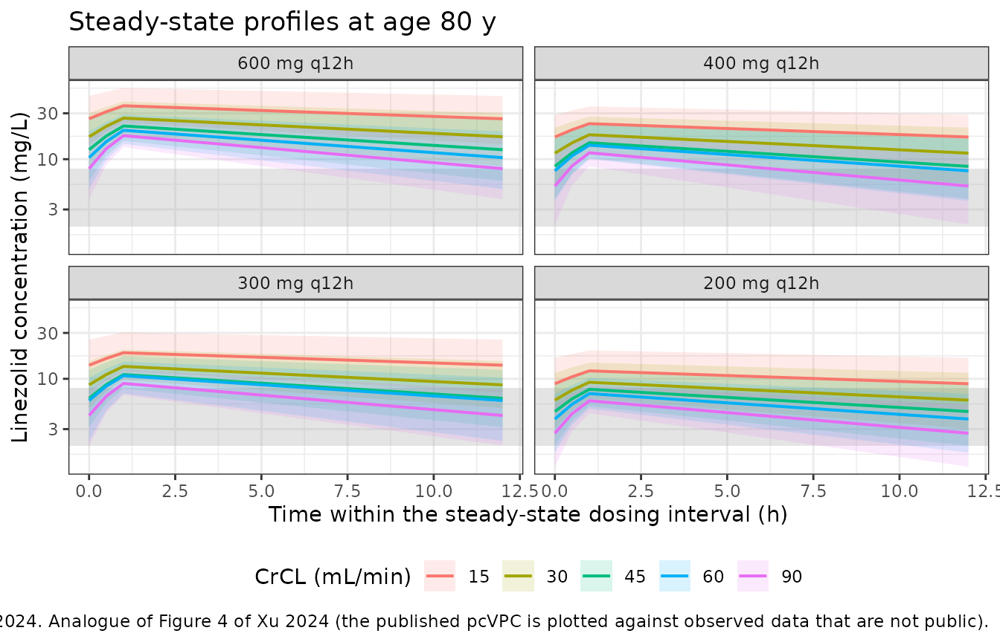
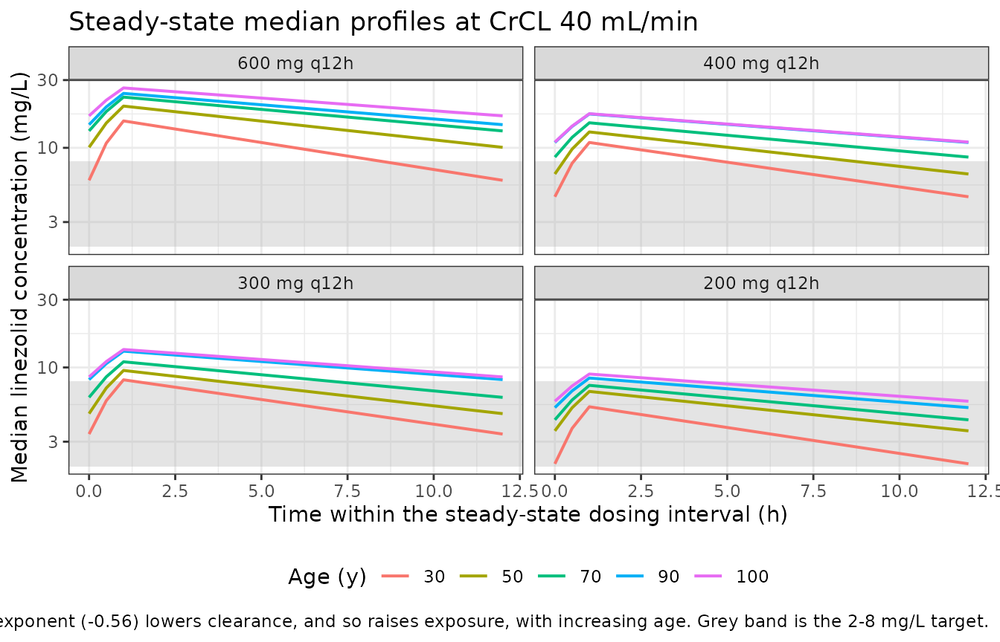
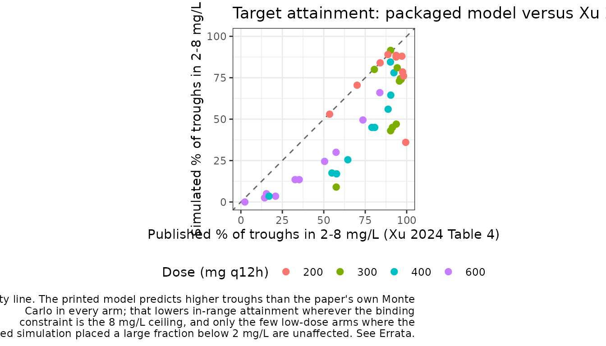

# Linezolid (Xu 2024)

## Model and source

- Citation: Xu J, Chen X, Zhang Q, Zhuang Z, Yuan Y, Duan L, Shi L, Zhu
  C, Li J, Lu J, Yu Y, Tang L. (2024). Population
  Pharmacokinetic/Pharmacodynamic Study of Linezolid in
  Hospital-Acquired Pneumonia Patients with Renal Insufficiency. Drug
  Design, Development and Therapy 18:5073-5086.
  <doi:10.2147/DDDT.S474470>
- Description: Population PK model for intravenous linezolid in
  hospital-acquired pneumonia patients with renal insufficiency (Xu
  2024). One-compartment disposition with linear elimination; clearance
  carries power-model effects of age (exponent -0.56, reference 82
  years) and Cockcroft-Gault creatinine clearance (exponent 0.50,
  reference 42 mL/min). Volume of distribution is a typical value with
  no inter-individual variability; inter-individual variability was
  estimated on clearance only, and residual variability is additive.
- Article: <https://doi.org/10.2147/DDDT.S474470>

Xu 2024 is a two-part retrospective study at a single Chinese centre.
The first part is a comparative *pharmacodynamic* analysis (clinical and
microbiological efficacy, safety, and trough-target attainment) of
linezolid versus teicoplanin; it is a statistical comparison of clinical
outcomes and contains no pharmacodynamic model, so nothing from it is
packaged here. The second part is the population PK analysis that this
vignette validates: a one-compartment model with linear elimination fit
to 207 linezolid serum concentrations from 166 patients with
hospital-acquired pneumonia and renal insufficiency.

## Population

The PK analysis used 207 linezolid serum concentrations from 166 adults
with hospital-acquired pneumonia (2016 ATS/IDSA criteria) and renal
insufficiency, defined per the 2010 FDA guidance as a Cockcroft-Gault
creatinine clearance below 90 mL/min. Patients on renal replacement
therapy, with a baseline platelet count below 75000/uL, with severe
hepatic impairment, or with known bleeding disorders were excluded.
Linezolid was given as 600 mg every 12 h by intravenous infusion per the
package label, with clinicians free to adjust the regimen on the basis
of steady-state troughs. Samples were predominantly steady-state troughs
drawn 30 min or immediately before the next dose and at least 48 h after
therapy started; the authors note (Discussion, limitation four) that
this limits resolution of the distribution phase. Concentrations were
measured by HPLC-MS/MS over a 0.5-50.0 mg/L linear range.

The PPK cohort’s own baseline characteristics are in supplementary Table
S1 (n = 166): 73.5% male; age median (IQR) 82.0 (75.0, 89.0) years;
weight 60.0 (55.0, 65.0) kg; serum creatinine 106.2 (70.2, 181.7)
umol/L; CrCL 42.0 (29.2, 54.0) mL/min; albumin 31.8 (28.2, 34.5) g/L;
treatment duration 9.0 (8.0, 12.0) days; respiratory failure 47.6%,
septic shock 29.5%, MODS 14.5%. Table S1 also tabulates the companion
pharmacodynamic study’s linezolid arm (n = 81) side by side and finds no
significant difference on any characteristic (all P \>= 0.105).

**The two centering values printed in the final CL equation are exactly
the PPK cohort’s own medians** – 82 years against a Table S1 median age
of 82.0 years, and 42.0 mL/min against a Table S1 median CrCL of 42.0
mL/min. Since Table S1 and the equation are separate objects in separate
files, that coincidence is an independent check that the equation has
been transcribed correctly here.

In the main text, MRSA was the most frequent respiratory isolate (69/87
samples, 79.3%) and 27.6% of patients had a mixed
Gram-positive/Gram-negative respiratory infection.

The same information is available programmatically via the model’s
`population` metadata (`readModelDb("Xu_2024_linezolid")()$population`).

## Source trace

The per-parameter origin is recorded as an in-file comment next to each
`ini()` entry in `inst/modeldb/specificDrugs/Xu_2024_linezolid.R`. The
table below collects them in one place for review. All page numbers
refer to Drug Des Devel Ther 2024;18:5073-5086.

| Equation / parameter | Value | Source location |
|----|----|----|
| Structural model: one compartment, linear elimination | n/a | Results, “PPK Study” (p. 5077): “Linezolid pharmacokinetics was adequately described by one compartment disposition model with linear elimination.” |
| Intravenous infusion into `central`, 1 h | n/a | Methods, “Dosing Regimen” (p. 5075) and “PPK Study” (p. 5076): “The infusion time was set to 1 h.” |
| `lcl` = log(2.7) | CL = 2.7 L/h | Table 3 (p. 5078), TVCL; final-model equation p. 5078 |
| `lvc` = log(57.1) | V = 57.1 L | Table 3 (p. 5078), TVv; final-model equation p. 5078 |
| `e_age_cl` | -0.56 | Final-model equation p. 5078, `(age/82)^-0.56`. Table 3 reports theta_Age = -0.6, i.e. the same value rounded to one decimal place. |
| `e_crcl_cl` | 0.50 | Final-model equation p. 5078, `(CrCL/42.0)^0.50`. Table 3 reports theta_CrCL = 0.5. |
| Age centering value | 82 years | Final-model equation p. 5078; equals the PPK-cohort median age of 82.0 (75.0, 89.0) y in supplementary Table S1 |
| CrCL centering value | 42.0 mL/min | Final-model equation p. 5078; equals the PPK-cohort median CrCL of 42.0 (29.2, 54.0) mL/min in supplementary Table S1 |
| PPK-cohort demographics | n = 166 | Supplementary Table S1 |
| Covariate model-building path | CL-CrCL, CL-age only | Supplementary Table S2 (basic model OFV 1327.8; full covariate model 1266.5; backward elimination +6.9 removing CL-age, +50.7 removing CL-CrCL) |
| `etalcl` (variance) | 0.1 | Table 3 (p. 5078), `omega^2 CL`; table footnote defines it as “variance of inter-individual variability of clearance”. Eta shrinkage 23.3%. |
| No IIV on V | n/a | Final-model equation p. 5078 carries `exp(eta_CL)` on CL only; `V (L) = 57.1` has no random-effect term, and Table 3 reports no `omega^2 V`. |
| `addSd` | 3.4 mg/L | Table 3 (p. 5078), `sigma`; table footnote defines sigma as “square root of residual variability”. Results, “PPK Study”: “The additive error model was found to best fit the data.” |
| `AGE` covariate on CL | power model | Final-model equation p. 5078 |
| `CRCL` covariate on CL | power model | Final-model equation p. 5078; Cockcroft-Gault per Methods, “Study Design and Patients” (p. 5074) |
| `WT` screened, not retained | n/a | Discussion (p. 5082): “Body weight was not identified as a significant covariate affecting linezolid clearance in our study” |
| Published PTA reference values | Table 4 | Table 4 (p. 5080), “Simulated Probability of Attaining Linezolid Cmin Stratified by Renal Function and Age” |
| Cmin target range | 2-8 mg/L | Methods, “PPK Study” (p. 5076) and “Comparative Pharmacodynamic Study” (p. 5075) |

## Virtual cohort

Original observed data are not publicly available. The cohort below
reproduces the covariate grid of the paper’s own Monte Carlo analysis
(Table 4): a renal sweep at the cohort-median age (CrCL 90, 60, 45, 30
and 15 mL/min at age 80 y) and an age sweep at the cohort-median renal
function (age 100, 90, 70, 50 and 30 y at CrCL 40 mL/min), each crossed
with the four simulated regimens (600, 400, 300 and 200 mg every 12 h as
1 h infusions).

That is 40 arms. The paper simulated 1000 virtual individuals; this
vignette uses 200 per arm, which is the per-arm cap for nlmixr2lib
validation vignettes and gives a Monte Carlo standard error of roughly
3.5 percentage points on each attainment probability.

``` r

set.seed(20241108)

n_per_arm <- 200L
tau <- 12 # dosing interval (h)
t_inf <- 1 # infusion duration (h), Xu 2024 Methods

# The 10 covariate scenarios of Xu 2024 Table 4: rows flagged "a" use the
# approximate median age (80 y) and sweep CrCL; rows flagged "b" use the
# approximate median CrCL (40 mL/min) and sweep age.
scenarios <- dplyr::bind_rows(
  tibble::tibble(sweep = "Renal function (age 80 y)", AGE = 80, CRCL = c(90, 60, 45, 30, 15)),
  tibble::tibble(sweep = "Age (CrCL 40 mL/min)", AGE = c(100, 90, 70, 50, 30), CRCL = 40)
)

doses <- c(600, 400, 300, 200)

arms <- tidyr::crossing(scenarios, dose_mg = doses) |>
  dplyr::mutate(
    arm = sprintf("%d mg q12h | age %g y | CrCL %g mL/min", dose_mg, AGE, CRCL),
    id_offset = (dplyr::row_number() - 1L) * n_per_arm
  )

# Helper: one arm's event table. Steady state is requested directly with
# ss = 1 / ii = tau rather than by dosing forward for many half-lives; the
# terminal half-life reaches ~50 h in the low-CrCL / low-eta corner of this
# cohort, so an explicit multiple-dose run-in would have to be very long.
make_arm <- function(dose_mg, AGE, CRCL, arm, id_offset, sweep) {
  ids <- id_offset + seq_len(n_per_arm)
  subj <- tibble::tibble(
    id = ids, AGE = AGE, CRCL = CRCL, dose_mg = dose_mg, arm = arm, sweep = sweep
  )
  dose_rows <- subj |>
    dplyr::mutate(
      time = 0, evid = 1L, cmt = "central",
      amt = dose_mg, rate = dose_mg / t_inf,
      ii = tau, ss = 1L
    )
  obs_rows <- subj |>
    tidyr::crossing(time = seq(0, tau, by = 0.5)) |>
    dplyr::mutate(
      evid = 0L, cmt = "central",
      amt = NA_real_, rate = NA_real_, ii = 0, ss = 0L
    )
  dplyr::bind_rows(dose_rows, obs_rows) |>
    dplyr::arrange(id, time, dplyr::desc(evid))
}

events <- do.call(
  dplyr::bind_rows,
  Map(
    make_arm,
    arms$dose_mg, arms$AGE, arms$CRCL, arms$arm, arms$id_offset, arms$sweep
  )
)

# Cheap regression guard: cohort IDs must be disjoint across arms, otherwise
# rxSolve silently merges subjects and sums their doses.
stopifnot(!anyDuplicated(unique(events[, c("id", "time", "evid")])))
stopifnot(dplyr::n_distinct(events$id) == nrow(arms) * n_per_arm)
nrow(events)
#> [1] 208000
```

## Simulation

``` r

mod <- readModelDb("Xu_2024_linezolid")

sim <- rxode2::rxSolve(
  mod,
  events = events,
  keep = c("arm", "sweep", "dose_mg", "AGE", "CRCL")
) |>
  as.data.frame()
#> ℹ parameter labels from comments will be replaced by 'label()'

str(sim[, c("id", "time", "central", "Cc", "cl", "arm")], max.level = 1)
#> 'data.frame':    200000 obs. of  6 variables:
#>  $ id     : int  1 1 1 1 1 1 1 1 1 1 ...
#>  $ time   : num  0 0.5 1 1.5 2 2.5 3 3.5 4 4.5 ...
#>  $ central: num  106 199 288 275 263 ...
#>  $ Cc     : num  1.85 3.48 5.04 4.82 4.6 ...
#>  $ cl     : num  5.19 5.19 5.19 5.19 5.19 ...
#>  $ arm    : chr  "200 mg q12h | age 30 y | CrCL 40 mL/min" "200 mg q12h | age 30 y | CrCL 40 mL/min" "200 mg q12h | age 30 y | CrCL 40 mL/min" "200 mg q12h | age 30 y | CrCL 40 mL/min" ...
```

### Typical-value check against the printed clearance equation

Before any distributional comparison, confirm that the packaged model
reproduces the printed equation
`CL = 2.7 * (age/82)^-0.56 * (CrCL/42.0)^0.50` exactly at the typical
value. `zeroRe()` is applied to a *fresh*
[`readModelDb()`](https://nlmixr2.github.io/nlmixr2lib/reference/readModelDb.md)
result so the stochastic model object above is left untouched.

``` r

mod_typical <- rxode2::zeroRe(readModelDb("Xu_2024_linezolid"))
#> ℹ parameter labels from comments will be replaced by 'label()'

sim_typical <- rxode2::rxSolve(
  mod_typical,
  events = events |> dplyr::filter(id %in% (arms$id_offset + 1L)),
  keep = c("arm", "sweep", "dose_mg", "AGE", "CRCL")
) |>
  as.data.frame()
#> ℹ omega/sigma items treated as zero: 'etalcl'
#> Warning: multi-subject simulation without without 'omega'

cl_check <- sim_typical |>
  dplyr::group_by(AGE, CRCL) |>
  dplyr::summarise(cl_model = mean(cl), vc_model = mean(vc), .groups = "drop") |>
  dplyr::mutate(
    cl_equation = 2.7 * (AGE / 82)^-0.56 * (CRCL / 42.0)^0.50,
    abs_pct_diff = 100 * abs(cl_model - cl_equation) / cl_equation
  )

stopifnot(max(cl_check$abs_pct_diff) < 1e-6)
stopifnot(all(abs(cl_check$vc_model - 57.1) < 1e-9))

cl_check |>
  dplyr::arrange(AGE, CRCL) |>
  dplyr::rename(
    "Age (y)" = AGE, "CrCL (mL/min)" = CRCL,
    "CL from model (L/h)" = cl_model, "V from model (L)" = vc_model,
    "CL from Xu 2024 equation (L/h)" = cl_equation,
    "|% diff|" = abs_pct_diff
  ) |>
  knitr::kable(
    digits = 4,
    caption = paste(
      "Typical-value clearance and volume from the packaged model versus the",
      "final-model equation printed on p. 5078 of Xu 2024. Agreement is exact",
      "to machine precision at all 10 covariate scenarios."
    )
  )
```

| Age (y) | CrCL (mL/min) | CL from model (L/h) | V from model (L) | CL from Xu 2024 equation (L/h) | \|% diff\| |
|---:|---:|---:|---:|---:|---:|
| 30 | 40 | 4.6272 | 57.1 | 4.6272 | 0 |
| 50 | 40 | 3.4760 | 57.1 | 3.4760 | 0 |
| 70 | 40 | 2.8791 | 57.1 | 2.8791 | 0 |
| 80 | 15 | 1.6360 | 57.1 | 1.6360 | 0 |
| 80 | 30 | 2.3137 | 57.1 | 2.3137 | 0 |
| 80 | 45 | 2.8337 | 57.1 | 2.8337 | 0 |
| 80 | 60 | 3.2721 | 57.1 | 3.2721 | 0 |
| 80 | 90 | 4.0074 | 57.1 | 4.0074 | 0 |
| 90 | 40 | 2.5011 | 57.1 | 2.5011 | 0 |
| 100 | 40 | 2.3578 | 57.1 | 2.3578 | 0 |

Typical-value clearance and volume from the packaged model versus the
final-model equation printed on p. 5078 of Xu 2024. Agreement is exact
to machine precision at all 10 covariate scenarios. {.table
style="width:100%;"}

## Replicate published figures

Xu 2024’s model-diagnostic figures (Figures 2 and 3, goodness-of-fit;
Figure 4, prediction-corrected VPC) are all plotted against the observed
concentrations, which are not public, so they cannot be reproduced
directly. The panel below is the closest available analogue: the
simulated steady-state concentration-time profile over one dosing
interval, with the paper’s 2-8 mg/L trough target band overlaid, for the
renal sweep at the cohort-median age.

``` r

sim |>
  dplyr::filter(sweep == "Renal function (age 80 y)") |>
  dplyr::group_by(time, dose_mg, CRCL) |>
  dplyr::summarise(
    Q05 = quantile(Cc, 0.05, na.rm = TRUE),
    Q50 = quantile(Cc, 0.50, na.rm = TRUE),
    Q95 = quantile(Cc, 0.95, na.rm = TRUE),
    .groups = "drop"
  ) |>
  dplyr::mutate(dose_lab = factor(paste0(dose_mg, " mg q12h"),
    levels = paste0(doses, " mg q12h")
  )) |>
  ggplot(aes(time, Q50, colour = factor(CRCL), fill = factor(CRCL))) +
  annotate("rect",
    xmin = -Inf, xmax = Inf, ymin = 2, ymax = 8,
    fill = "grey70", alpha = 0.35
  ) +
  geom_ribbon(aes(ymin = Q05, ymax = Q95), alpha = 0.15, colour = NA) +
  geom_line(linewidth = 0.7) +
  facet_wrap(~dose_lab) +
  scale_y_log10() +
  labs(
    x = "Time within the steady-state dosing interval (h)",
    y = "Linezolid concentration (mg/L)",
    colour = "CrCL (mL/min)", fill = "CrCL (mL/min)",
    title = "Steady-state profiles at age 80 y",
    caption = paste(
      "Median with 5th-95th percentile band, 200 subjects per arm.",
      "Grey band is the 2-8 mg/L trough target of Xu 2024.",
      "Analogue of Figure 4 of Xu 2024 (the published pcVPC is plotted",
      "against observed data that are not public)."
    )
  ) +
  theme_bw() +
  theme(legend.position = "bottom")
```



``` r

sim |>
  dplyr::filter(sweep == "Age (CrCL 40 mL/min)") |>
  dplyr::group_by(time, dose_mg, AGE) |>
  dplyr::summarise(
    Q50 = quantile(Cc, 0.50, na.rm = TRUE),
    .groups = "drop"
  ) |>
  dplyr::mutate(dose_lab = factor(paste0(dose_mg, " mg q12h"),
    levels = paste0(doses, " mg q12h")
  )) |>
  ggplot(aes(time, Q50, colour = factor(AGE))) +
  annotate("rect",
    xmin = -Inf, xmax = Inf, ymin = 2, ymax = 8,
    fill = "grey70", alpha = 0.35
  ) +
  geom_line(linewidth = 0.7) +
  facet_wrap(~dose_lab) +
  scale_y_log10() +
  labs(
    x = "Time within the steady-state dosing interval (h)",
    y = "Median linezolid concentration (mg/L)",
    colour = "Age (y)",
    title = "Steady-state median profiles at CrCL 40 mL/min",
    caption = paste(
      "The negative age exponent (-0.56) lowers clearance, and so raises",
      "exposure, with increasing age. Grey band is the 2-8 mg/L target."
    )
  ) +
  theme_bw() +
  theme(legend.position = "bottom")
```



## PKNCA validation

The paper’s samples were steady-state troughs, and its quantitative
simulation result (Table 4) is expressed entirely in terms of the
steady-state trough `Cmin`. PKNCA is therefore used with the
steady-state recipe over the final dosing interval: it supplies
`ctrough` (the concentration at the end of the interval, which is the
paper’s `Cmin` definition of “30 min or immediately prior to the next
dose”), `cmin`, `cmax`, `cav` and `auclast` over `tau`.

``` r

sim_nca <- sim |>
  dplyr::filter(!is.na(Cc)) |>
  dplyr::select(id, time, Cc, arm)

sim_nca <- sim_nca |>
  dplyr::distinct(id, arm, time, .keep_all = TRUE) |>
  dplyr::arrange(id, arm, time)

# A missing time-zero row is the most common PKNCA defect in this repo (it
# triggers "Requesting an AUC range starting (0) before the first measurement"
# once per subject). The steady-state event table observes at time 0 by
# construction, and at steady state that row is the genuine pre-dose trough --
# NOT zero -- so it must not be synthesised. Assert it is present instead.
stopifnot(
  nrow(dplyr::filter(sim_nca, time == 0)) == dplyr::n_distinct(sim_nca$id),
  all(dplyr::filter(sim_nca, time == 0)$Cc > 0)
)

conc_obj <- PKNCA::PKNCAconc(
  sim_nca, Cc ~ time | arm + id,
  concu = "mg/L", timeu = "h"
)

dose_df <- events |>
  dplyr::filter(evid == 1) |>
  dplyr::select(id, time, amt, arm)

dose_obj <- PKNCA::PKNCAdose(
  dose_df, amt ~ time | arm + id,
  doseu = "mg"
)

intervals <- data.frame(
  start = 0,
  end = tau,
  cmax = TRUE,
  tmax = TRUE,
  cmin = TRUE,
  ctrough = TRUE,
  cav = TRUE,
  auclast = TRUE
)

nca_res <- PKNCA::pk.nca(
  PKNCA::PKNCAdata(conc_obj, dose_obj, intervals = intervals)
)

nca_tbl <- as.data.frame(nca_res$result)
head(nca_tbl)
#>                                        arm   id start end PPTESTCD   PPORRES
#> 1 200 mg q12h | age 100 y | CrCL 40 mL/min 3201     0  12  auclast 86.572940
#> 2 200 mg q12h | age 100 y | CrCL 40 mL/min 3201     0  12     cmax  8.925339
#> 3 200 mg q12h | age 100 y | CrCL 40 mL/min 3201     0  12     cmin  5.719393
#> 4 200 mg q12h | age 100 y | CrCL 40 mL/min 3201     0  12     tmax  1.000000
#> 5 200 mg q12h | age 100 y | CrCL 40 mL/min 3201     0  12      cav  7.214412
#> 6 200 mg q12h | age 100 y | CrCL 40 mL/min 3201     0  12  ctrough  5.719393
#>   exclude PPORRESU
#> 1    <NA>   h*mg/L
#> 2    <NA>     mg/L
#> 3    <NA>     mg/L
#> 4    <NA>        h
#> 5    <NA>     mg/L
#> 6    <NA>     mg/L
```

### Steady-state closed-form gate

Xu 2024 publishes no NCA table, so there is no set of published Cmax /
Tmax / AUC / half-life values to compare against. The available
independent check is a closed-form one: for a one-compartment model at
steady state, the average concentration over a dosing interval must
equal `Dose / (tau * CL)` exactly, regardless of volume or infusion
duration. This gates the PKNCA setup, the event table, and the model’s
clearance parameterisation together.

``` r

cav_sim <- nca_tbl |>
  dplyr::filter(PPTESTCD == "cav") |>
  dplyr::left_join(
    sim |> dplyr::distinct(id, arm, dose_mg, AGE, CRCL),
    by = c("id", "arm")
  ) |>
  dplyr::left_join(
    sim |> dplyr::distinct(id, cl),
    by = "id"
  ) |>
  dplyr::mutate(cav_closed_form = dose_mg / (tau * cl))

cav_gate <- cav_sim |>
  dplyr::mutate(pct_diff = 100 * (PPORRES - cav_closed_form) / cav_closed_form) |>
  dplyr::group_by(dose_mg) |>
  dplyr::summarise(
    n = dplyr::n(),
    median_pct_diff = median(pct_diff),
    max_abs_pct_diff = max(abs(pct_diff)),
    .groups = "drop"
  )

# PKNCA's cav comes from a linear-up/log-down trapezoidal AUC on a 0.5 h grid,
# so a small positive bias against the exact closed form is expected; anything
# beyond a couple of percent would indicate a real defect.
stopifnot(max(cav_gate$max_abs_pct_diff) < 2)

cav_gate |>
  dplyr::rename(
    "Dose (mg q12h)" = dose_mg,
    "n subjects" = n,
    "Median % diff vs Dose/(tau*CL)" = median_pct_diff,
    "Max |% diff|" = max_abs_pct_diff
  ) |>
  knitr::kable(
    digits = 3,
    caption = paste(
      "Closed-form gate: PKNCA's steady-state average concentration versus the",
      "exact one-compartment identity Cav,ss = Dose / (tau * CL), per subject,",
      "summarised by regimen. Residual bias is trapezoidal-integration error on",
      "the 0.5 h observation grid."
    )
  )
```

| Dose (mg q12h) | n subjects | Median % diff vs Dose/(tau\*CL) | Max \|% diff\| |
|---------------:|-----------:|--------------------------------:|---------------:|
|            200 |       2000 |                          -0.005 |          0.118 |
|            300 |       2000 |                          -0.005 |          0.093 |
|            400 |       2000 |                          -0.005 |          0.067 |
|            600 |       2000 |                          -0.005 |          0.118 |

Closed-form gate: PKNCA’s steady-state average concentration versus the
exact one-compartment identity Cav,ss = Dose / (tau \* CL), per subject,
summarised by regimen. Residual bias is trapezoidal-integration error on
the 0.5 h observation grid. {.table}

The half-life implied by the typical values is also worth recording,
since the paper discusses its clearance and volume estimates but never
states a half-life:

``` r

tibble::tibble(
  `CL (L/h)` = 2.7,
  `V (L)` = 57.1,
  `t1/2 = ln(2) * V / CL (h)` = log(2) * 57.1 / 2.7
) |>
  knitr::kable(
    digits = 2,
    caption = paste(
      "Terminal half-life implied by the Xu 2024 typical values at the",
      "reference covariates (age 82 y, CrCL 42.0 mL/min). Xu 2024 does not",
      "report a half-life; this is a derived quantity."
    )
  )
```

| CL (L/h) | V (L) | t1/2 = ln(2) \* V / CL (h) |
|---------:|------:|---------------------------:|
|      2.7 |  57.1 |                      14.66 |

Terminal half-life implied by the Xu 2024 typical values at the
reference covariates (age 82 y, CrCL 42.0 mL/min). Xu 2024 does not
report a half-life; this is a derived quantity. {.table}

### Comparison against the published probability of target attainment

Table 4 of Xu 2024 is the paper’s headline quantitative simulation
result: the probability that the steady-state trough falls below 2 mg/L,
within the 2-8 mg/L target, or above 8 mg/L, for each of the 40
regimen-by-covariate arms. It is transcribed verbatim below and compared
against the same probabilities computed from PKNCA’s `ctrough` (the
concentration at the end of the dosing interval; note that `ctau` is not
a PKNCA parameter name).

``` r

published_pta <- tibble::tribble(
  ~dose_mg, ~AGE, ~CRCL, ~pub_in, ~pub_below, ~pub_above,
  600, 80, 90, 73.6, 0.9, 25.5,
  600, 80, 60, 50.5, 0.3, 49.2,
  600, 80, 45, 32.7, 0.0, 67.3,
  600, 80, 30, 14.3, 0.0, 85.7,
  600, 80, 15, 2.4, 0.0, 97.6,
  600, 100, 40, 15.4, 0.0, 84.6,
  600, 90, 40, 20.9, 0.0, 79.1,
  600, 70, 40, 35.2, 0.1, 64.7,
  600, 50, 40, 57.4, 0.3, 42.3,
  600, 30, 40, 83.8, 3.2, 13.0,
  400, 80, 90, 92.3, 4.9, 2.8,
  400, 80, 60, 88.8, 0.9, 10.3,
  400, 80, 45, 79.0, 0.3, 20.7,
  400, 80, 30, 54.9, 0.0, 45.1,
  400, 80, 15, 17.0, 0.0, 83.0,
  400, 100, 40, 57.7, 0.0, 42.3,
  400, 90, 40, 64.5, 0.2, 35.3,
  400, 70, 40, 80.7, 0.3, 19.0,
  400, 50, 40, 90.4, 1.8, 7.8,
  400, 30, 40, 90.2, 8.9, 0.9,
  300, 80, 90, 90.3, 9.6, 0.1,
  300, 80, 60, 95.6, 3.7, 0.7,
  300, 80, 45, 96.2, 1.2, 2.6,
  300, 80, 30, 90.3, 0.3, 9.4,
  300, 80, 15, 57.5, 0.0, 42.5,
  300, 100, 40, 91.4, 0.3, 8.3,
  300, 90, 40, 93.7, 0.3, 6.0,
  300, 70, 40, 96.7, 1.2, 2.1,
  300, 50, 40, 94.3, 5.3, 0.4,
  300, 30, 40, 80.5, 19.4, 0.1,
  200, 80, 90, 70.1, 29.9, 0.0,
  200, 80, 60, 88.7, 11.3, 0.0,
  200, 80, 45, 93.6, 6.3, 0.1,
  200, 80, 30, 98.1, 1.8, 0.1,
  200, 80, 15, 99.4, 0.2, 0.4,
  200, 100, 40, 97.5, 2.4, 0.1,
  200, 90, 40, 97.1, 2.8, 0.1,
  200, 70, 40, 93.6, 6.3, 0.1,
  200, 50, 40, 84.0, 16.0, 0.0,
  200, 30, 40, 53.5, 46.5, 0.0
)
stopifnot(nrow(published_pta) == 40)
```

``` r

cmin_sim <- nca_tbl |>
  dplyr::filter(PPTESTCD == "ctrough") |>
  dplyr::left_join(
    sim |> dplyr::distinct(id, arm, dose_mg, AGE, CRCL, sweep),
    by = c("id", "arm")
  )

pta_sim <- cmin_sim |>
  dplyr::group_by(sweep, dose_mg, AGE, CRCL) |>
  dplyr::summarise(
    sim_below = 100 * mean(PPORRES < 2),
    sim_in = 100 * mean(PPORRES >= 2 & PPORRES <= 8),
    sim_above = 100 * mean(PPORRES > 8),
    sim_median_cmin = median(PPORRES),
    .groups = "drop"
  )

pta_cmp <- pta_sim |>
  dplyr::left_join(published_pta, by = c("dose_mg", "AGE", "CRCL")) |>
  dplyr::mutate(diff_in = sim_in - pub_in) |>
  dplyr::arrange(dplyr::desc(dose_mg), sweep, dplyr::desc(CRCL), dplyr::desc(AGE))

pta_cmp |>
  dplyr::select(
    dose_mg, AGE, CRCL, sim_median_cmin,
    pub_in, sim_in, diff_in, pub_below, sim_below, pub_above, sim_above
  ) |>
  dplyr::rename(
    "Dose (mg q12h)" = dose_mg,
    "Age (y)" = AGE,
    "CrCL (mL/min)" = CRCL,
    "Simulated median Cmin (mg/L)" = sim_median_cmin,
    "Published % in 2-8" = pub_in,
    "Simulated % in 2-8" = sim_in,
    "Difference (pp)" = diff_in,
    "Published % <2" = pub_below,
    "Simulated % <2" = sim_below,
    "Published % >8" = pub_above,
    "Simulated % >8" = sim_above
  ) |>
  knitr::kable(
    digits = 1,
    caption = paste(
      "Probability of attaining a steady-state linezolid trough below 2 mg/L,",
      "within 2-8 mg/L, or above 8 mg/L. Published values are Table 4 of",
      "Xu 2024 (1000 virtual individuals); simulated values come from the",
      "packaged model via PKNCA ctrough (200 subjects per arm). See Errata: the",
      "published table is not reproducible from the published model."
    )
  )
```

| Dose (mg q12h) | Age (y) | CrCL (mL/min) | Simulated median Cmin (mg/L) | Published % in 2-8 | Simulated % in 2-8 | Difference (pp) | Published % \<2 | Simulated % \<2 | Published % \>8 | Simulated % \>8 |
|---:|---:|---:|---:|---:|---:|---:|---:|---:|---:|---:|
| 600 | 100 | 40 | 16.8 | 15.4 | 5.0 | -10.4 | 0.0 | 0.0 | 84.6 | 95.0 |
| 600 | 90 | 40 | 14.6 | 20.9 | 3.5 | -17.4 | 0.0 | 0.0 | 79.1 | 96.5 |
| 600 | 70 | 40 | 13.2 | 35.2 | 13.5 | -21.7 | 0.1 | 0.0 | 64.7 | 86.5 |
| 600 | 50 | 40 | 10.1 | 57.4 | 30.0 | -27.4 | 0.3 | 0.0 | 42.3 | 70.0 |
| 600 | 30 | 40 | 5.9 | 83.8 | 66.0 | -17.8 | 3.2 | 4.0 | 13.0 | 30.0 |
| 600 | 80 | 90 | 8.0 | 73.6 | 49.5 | -24.1 | 0.9 | 0.5 | 25.5 | 50.0 |
| 600 | 80 | 60 | 10.4 | 50.5 | 24.5 | -26.0 | 0.3 | 0.0 | 49.2 | 75.5 |
| 600 | 80 | 45 | 12.5 | 32.7 | 13.5 | -19.2 | 0.0 | 0.0 | 67.3 | 86.5 |
| 600 | 80 | 30 | 17.1 | 14.3 | 2.5 | -11.8 | 0.0 | 0.0 | 85.7 | 97.5 |
| 600 | 80 | 15 | 26.3 | 2.4 | 0.0 | -2.4 | 0.0 | 0.0 | 97.6 | 100.0 |
| 400 | 100 | 40 | 11.0 | 57.7 | 17.0 | -40.7 | 0.0 | 0.0 | 42.3 | 83.0 |
| 400 | 90 | 40 | 10.9 | 64.5 | 25.5 | -39.0 | 0.2 | 0.0 | 35.3 | 74.5 |
| 400 | 70 | 40 | 8.6 | 80.7 | 45.0 | -35.7 | 0.3 | 0.0 | 19.0 | 55.0 |
| 400 | 50 | 40 | 6.5 | 90.4 | 64.5 | -25.9 | 1.8 | 0.0 | 7.8 | 35.5 |
| 400 | 30 | 40 | 4.5 | 90.2 | 84.5 | -5.7 | 8.9 | 5.5 | 0.9 | 10.0 |
| 400 | 80 | 90 | 5.3 | 92.3 | 78.0 | -14.3 | 4.9 | 4.0 | 2.8 | 18.0 |
| 400 | 80 | 60 | 7.6 | 88.8 | 56.0 | -32.8 | 0.9 | 1.5 | 10.3 | 42.5 |
| 400 | 80 | 45 | 8.4 | 79.0 | 45.0 | -34.0 | 0.3 | 0.0 | 20.7 | 55.0 |
| 400 | 80 | 30 | 11.5 | 54.9 | 17.5 | -37.4 | 0.0 | 0.0 | 45.1 | 82.5 |
| 400 | 80 | 15 | 17.0 | 17.0 | 3.5 | -13.5 | 0.0 | 0.0 | 83.0 | 96.5 |
| 300 | 100 | 40 | 8.6 | 91.4 | 45.0 | -46.4 | 0.3 | 0.0 | 8.3 | 55.0 |
| 300 | 90 | 40 | 8.2 | 93.7 | 47.0 | -46.7 | 0.3 | 1.0 | 6.0 | 52.0 |
| 300 | 70 | 40 | 6.2 | 96.7 | 74.0 | -22.7 | 1.2 | 0.0 | 2.1 | 26.0 |
| 300 | 50 | 40 | 4.7 | 94.3 | 81.0 | -13.3 | 5.3 | 3.5 | 0.4 | 15.5 |
| 300 | 30 | 40 | 3.4 | 80.5 | 80.0 | -0.5 | 19.4 | 17.5 | 0.1 | 2.5 |
| 300 | 80 | 90 | 4.2 | 90.3 | 91.5 | 1.2 | 9.6 | 5.0 | 0.1 | 3.5 |
| 300 | 80 | 60 | 6.0 | 95.6 | 73.0 | -22.6 | 3.7 | 3.0 | 0.7 | 24.0 |
| 300 | 80 | 45 | 6.3 | 96.2 | 74.5 | -21.7 | 1.2 | 0.0 | 2.6 | 25.5 |
| 300 | 80 | 30 | 8.6 | 90.3 | 43.0 | -47.3 | 0.3 | 0.5 | 9.4 | 56.5 |
| 300 | 80 | 15 | 13.9 | 57.5 | 9.0 | -48.5 | 0.0 | 0.0 | 42.5 | 91.0 |
| 200 | 100 | 40 | 5.8 | 97.5 | 78.5 | -19.0 | 2.4 | 1.0 | 0.1 | 20.5 |
| 200 | 90 | 40 | 5.2 | 97.1 | 88.0 | -9.1 | 2.8 | 2.0 | 0.1 | 10.0 |
| 200 | 70 | 40 | 4.3 | 93.6 | 88.5 | -5.1 | 6.3 | 4.0 | 0.1 | 7.5 |
| 200 | 50 | 40 | 3.6 | 84.0 | 84.0 | 0.0 | 16.0 | 14.5 | 0.0 | 1.5 |
| 200 | 30 | 40 | 2.1 | 53.5 | 53.0 | -0.5 | 46.5 | 47.0 | 0.0 | 0.0 |
| 200 | 80 | 90 | 2.7 | 70.1 | 70.5 | 0.4 | 29.9 | 28.5 | 0.0 | 1.0 |
| 200 | 80 | 60 | 3.8 | 88.7 | 89.0 | 0.3 | 11.3 | 8.5 | 0.0 | 2.5 |
| 200 | 80 | 45 | 4.6 | 93.6 | 87.5 | -6.1 | 6.3 | 5.0 | 0.1 | 7.5 |
| 200 | 80 | 30 | 6.0 | 98.1 | 76.0 | -22.1 | 1.8 | 0.0 | 0.1 | 24.0 |
| 200 | 80 | 15 | 8.9 | 99.4 | 36.0 | -63.4 | 0.2 | 0.0 | 0.4 | 64.0 |

Probability of attaining a steady-state linezolid trough below 2 mg/L,
within 2-8 mg/L, or above 8 mg/L. Published values are Table 4 of Xu
2024 (1000 virtual individuals); simulated values come from the packaged
model via PKNCA ctrough (200 subjects per arm). See Errata: the
published table is not reproducible from the published model. {.table
style="width:100%;"}

The simulated attainment probabilities are systematically shifted toward
higher exposure than Table 4 reports: the packaged model, which
reproduces the printed clearance equation to machine precision (see the
typical-value check above), predicts higher troughs than the paper’s own
simulation. This is not a transcription error in this extraction; it is
an internal inconsistency in the paper, quantified in the Errata section
below. No parameter was tuned to close the gap.

``` r

pta_cmp |>
  ggplot(aes(pub_in, sim_in, colour = factor(dose_mg))) +
  geom_abline(slope = 1, intercept = 0, linetype = "dashed", colour = "grey40") +
  geom_point(size = 2.2) +
  coord_equal(xlim = c(0, 100), ylim = c(0, 100)) +
  labs(
    x = "Published % of troughs in 2-8 mg/L (Xu 2024 Table 4)",
    y = "Simulated % of troughs in 2-8 mg/L",
    colour = "Dose (mg q12h)",
    title = "Target attainment: packaged model versus Xu 2024 Table 4",
    caption = paste0(
      sprintf(
        "%d of %d arms fall on or below the identity line. ",
        sum(pta_cmp$diff_in <= 0.5), nrow(pta_cmp)
      ),
      "The printed model predicts higher troughs than the paper's own Monte\n",
      "Carlo in every arm; that lowers in-range attainment wherever the ",
      "binding\nconstraint is the 8 mg/L ceiling, and only the few low-dose ",
      "arms where the\npublished simulation placed a large fraction below ",
      "2 mg/L are unaffected. See Errata."
    )
  ) +
  theme_bw() +
  theme(legend.position = "bottom")
```



## Assumptions and deviations

- **Structural model, parameters and covariate model are taken verbatim
  from the paper** and reproduce the printed final-model equation to
  machine precision. Nothing was tuned toward Table 4.
- **`e_age_cl = -0.56` and `e_crcl_cl = 0.50` come from the final-model
  equation on p. 5078, not from Table 3.** Table 3 reports the same two
  coefficients rounded to one decimal place (-0.6 and 0.5); the equation
  carries two decimal places and is the more precise form. The two are
  consistent.
- **`omega^2 CL = 0.1` is read as a variance**, per the Table 3 footnote
  (“variance of inter-individual variability of clearance”), giving
  `omega` = 0.316, i.e. roughly 32% CV on clearance. The stray “(%)” in
  that row’s label is inconsistent with the footnote and is read as a
  table-template artefact.
- **`sigma = 3.4` is read as an additive residual SD in mg/L.** The
  Results text states that “the additive error model was found to best
  fit the data” and the Table 3 footnote defines sigma as the “square
  root of residual variability”, so the value sits on the concentration
  scale. As with `omega^2 CL`, the “(%)” in the row label contradicts
  both statements and is treated as an artefact. A proportional reading
  of 3.4% would be implausibly precise for retrospective
  therapeutic-drug-monitoring data.
- **No inter-individual variability on volume of distribution.** The
  printed equation carries `exp(eta_CL)` on clearance only and
  `V (L) = 57.1` has no random-effect term; Table 3 reports no
  `omega^2 V`. This is encoded faithfully rather than adding an eta the
  paper did not estimate.
- **`CRCL` is carried as the raw Cockcroft-Gault value in mL/min**, not
  the register’s canonical BSA-normalized mL/min/1.73 m^2 form, because
  the paper’s Methods specify Cockcroft-Gault with no BSA step. This is
  the same documented deviation as `Tsuji_2017_linezolid.R`,
  `Delattre_2010_amikacin.R` and `Wada_2023_sparsentan.R`.
- **`WT` is documented in `covariatesDataExcluded`, not
  `covariateData`.** The paper screened body weight as a covariate on
  clearance and rejected it, so it is preserved as provenance without
  being referenced in `model()`.
- **Steady state is requested with `ss = 1` / `ii = 12` rather than by
  dosing forward.** In the low-CrCL, low-eta corner of this cohort the
  terminal half-life approaches 50 h, so an explicit multiple-dose
  run-in would need to be several hundred hours long to be within a
  percent of steady state. The paper does not state how long its own
  simulated regimens ran before the trough was read.
- **The virtual cohort is the paper’s Monte Carlo covariate grid, not a
  resampled patient population.** Xu 2024’s Table 4 fixes age and CrCL
  at discrete values per arm rather than sampling them, so age and CrCL
  carry no distribution here and clearance varies only through `eta_CL`.
  Cohort size is 200 per arm versus the paper’s 1000 virtual
  individuals, giving a Monte Carlo standard error of roughly 3.5
  percentage points on each probability. That is far smaller than the
  discrepancy documented below.
- **Population metadata is the PPK cohort’s own.** Every demographic
  figure in `population` comes from supplementary Table S1 (n = 166),
  not from the companion pharmacodynamic study’s n = 81 arm.
- **No published NCA table exists to compare against.** Xu 2024 reports
  no Cmax / Tmax / AUC / half-life values, so the PKNCA section is gated
  against the exact one-compartment identity
  `Cav,ss = Dose / (tau * CL)` instead of against published NCA numbers,
  and the Table 4 attainment probabilities carry the published-value
  comparison.

### Quantifying the Table 4 discrepancy

The comparison above shows Table 4 is not reproducible from the paper’s
own printed model. The chunk below characterises the discrepancy, so
that every number quoted in the Errata that follows is *computed here*
rather than asserted in prose. Each candidate explanation is tested and
either quantified or ruled out.

``` r

# Closed-form steady-state trough for a 1-compartment model with a constant-rate
# infusion. Agreement with rxode2 is asserted below, so this can be used to
# explore counterfactuals cheaply without re-solving the ODE model.
cmin_ss_cf <- function(dose, Tinf, tau, CL, V) {
  kel <- CL / V
  rate <- dose / Tinf
  cend <- (rate / (V * kel)) * (1 - exp(-kel * Tinf)) / (1 - exp(-kel * tau))
  cend * exp(-kel * (tau - Tinf))
}
cl_printed <- function(age, crcl) 2.7 * (age / 82)^-0.56 * (crcl / 42.0)^0.50

# Trough after the nth dose (not yet at steady state), by superposition.
trough_dose_n <- function(dose, Tinf, tau, CL, V, n) {
  kel <- CL / V
  rate <- dose / Tinf
  cend1 <- (rate / (V * kel)) * (1 - exp(-kel * Tinf))
  cend1 * (1 - exp(-n * kel * tau)) / (1 - exp(-kel * tau)) *
    exp(-kel * (tau - Tinf))
}

arms600 <- published_pta |>
  dplyr::filter(dose_mg == 600) |>
  dplyr::mutate(
    CL           = cl_printed(AGE, CRCL),
    cmin_printed = cmin_ss_cf(600, t_inf, tau, CL, 57.1),
    p_below      = pub_below / 100,
    p_below8     = (pub_below + pub_in) / 100
  )

# Gate the closed form against the rxode2 solution of the packaged model: the
# end-of-interval concentration of the typical-value (eta = 0) simulation must
# equal cmin_ss_cf() for the same covariates and dose.
cf_gate <- sim_typical |>
  dplyr::filter(time == tau) |>
  dplyr::mutate(
    cmin_rxode2 = Cc,
    cmin_closed = cmin_ss_cf(dose_mg, t_inf, tau, cl_printed(AGE, CRCL), 57.1)
  )
stopifnot(
  nrow(cf_gate) == nrow(arms),
  max(abs(cf_gate$cmin_rxode2 - cf_gate$cmin_closed)) < 1e-8
)

# Table 4 prints "0.0%" for the below-2 cell in half of the 600 mg arms, so a
# per-arm two-point (mu, sigma) solve is only identified where that cell is
# non-zero. The claim under test -- a UNIFORM offset with a COMMON dispersion --
# is therefore fitted globally: two parameters (a trough ratio k applied to every
# arm's printed trough, and one log-scale sigma) against all 20 independent
# published probabilities of the ten 600 mg arms.
ln_objective <- function(par, dat) {
  mu <- log(exp(par[1]) * dat$cmin_printed)
  s <- exp(par[2])
  sum((pnorm((log(2) - mu) / s) - dat$p_below)^2 +
        (pnorm((log(8) - mu) / s) - dat$p_below8)^2)
}
ln_fit <- optim(
  c(log(0.73), log(0.44)), ln_objective, dat = arms600,
  method = "Nelder-Mead", control = list(reltol = 1e-14, maxit = 1e5)
)
err_k <- exp(ln_fit$par[1])
err_sigma <- exp(ln_fit$par[2])

# How well does that two-parameter description reproduce Table 4?
mu_fit <- log(err_k * arms600$cmin_printed)
pred_in <- 100 * (pnorm((log(8) - mu_fit) / err_sigma) -
                    pnorm((log(2) - mu_fit) / err_sigma))
err_max_fit <- max(abs(pred_in - arms600$pub_in))
err_rmse_fit <- sqrt(mean((pred_in - arms600$pub_in)^2))

# Per-arm exact two-point solve, where the below-2 cell is informative.
informative <- arms600 |> dplyr::filter(pub_below >= 0.1)
sig_arm <- (log(8) - log(2)) /
  (qnorm(informative$p_below8) - qnorm(informative$p_below))
mu_arm <- log(2) - qnorm(informative$p_below) * sig_arm
err_ratio_arm <- exp(mu_arm) / informative$cmin_printed

# Candidate 1: a higher clearance. Because tau is close to one half-life here,
# the trough is MORE than reciprocally sensitive to CL, so the naive 1/k reading
# overstates the implied clearance change.
err_cl_mult <- uniroot(
  function(m) {
    mean(cmin_ss_cf(600, t_inf, tau, arms600$CL * m, 57.1) / arms600$cmin_printed) - err_k
  },
  c(1, 4)
)$root
err_cl_mult_naive <- 1 / err_k

# Candidate 2: a different volume of distribution. Ruled out if the V required
# to hit the fitted median varies across arms.
err_v_needed <- vapply(
  seq_len(nrow(arms600)),
  function(i) {
    uniroot(
      function(V) cmin_ss_cf(600, t_inf, tau, arms600$CL[i], V) - err_k * arms600$cmin_printed[i],
      c(1, 400)
    )$root
  },
  numeric(1)
)

# Candidate 3: the trough read before steady state. Ruled out if the dose number
# required to hit the fitted ratio varies across arms.
err_n_needed <- vapply(
  seq_len(nrow(arms600)),
  function(i) {
    uniroot(
      function(n) {
        trough_dose_n(600, t_inf, tau, arms600$CL[i], 57.1, n) /
          arms600$cmin_printed[i] - err_k
      },
      c(0.2, 60)
    )$root
  },
  numeric(1)
)

# Candidate 4: Table 4 reports simulated observations rather than individual
# predictions, i.e. the additive residual error is layered on.
set.seed(20241108)
cl_draws <- arms600$CL[1] * exp(rnorm(2e5, 0, sqrt(0.1)))
ipred_draws <- cmin_ss_cf(600, t_inf, tau, cl_draws, 57.1)
err_ipred_below2 <- 100 * mean(ipred_draws < 2)
err_obs_below2 <- 100 * mean(ipred_draws + rnorm(length(ipred_draws), 0, 3.4) < 2)

tibble::tibble(
  Quantity = c(
    "Fitted uniform trough ratio k (published / printed)",
    "Fitted common log-scale sigma",
    "Table 3 sigma for comparison, sqrt(0.1)",
    "Implied IIV variance, sigma^2",
    "Max |error| of the 2-parameter fit to Table 4 % in 2-8 (pp)",
    "RMSE of the 2-parameter fit (pp)",
    "Per-arm ratio, range over identified arms",
    "Per-arm sigma, range over identified arms",
    "CL multiplier consistent with ratio k",
    "CL multiplier under a naive 1/k reading",
    "V (L) required per arm to explain the offset instead",
    "Dose number required per arm to explain the offset instead",
    "% below 2 mg/L, CrCL 90 arm, individual predictions",
    "% below 2 mg/L, CrCL 90 arm, with additive SD 3.4 mg/L",
    "% below 2 mg/L, CrCL 90 arm, Table 4"
  ),
  Value = c(
    sprintf("%.3f", err_k),
    sprintf("%.3f", err_sigma),
    sprintf("%.3f", sqrt(0.1)),
    sprintf("%.3f", err_sigma^2),
    sprintf("%.1f", err_max_fit),
    sprintf("%.1f", err_rmse_fit),
    sprintf("%.3f - %.3f", min(err_ratio_arm), max(err_ratio_arm)),
    sprintf("%.3f - %.3f", min(sig_arm), max(sig_arm)),
    sprintf("x %.3f (+%.0f%%)", err_cl_mult, 100 * (err_cl_mult - 1)),
    sprintf("x %.3f (+%.0f%%)", err_cl_mult_naive, 100 * (err_cl_mult_naive - 1)),
    sprintf("%.0f - %.0f (not constant)", min(err_v_needed), max(err_v_needed)),
    sprintf("%.2f - %.2f (not constant, non-integer)", min(err_n_needed), max(err_n_needed)),
    sprintf("%.1f", err_ipred_below2),
    sprintf("%.1f", err_obs_below2),
    "0.9"
  )
) |>
  knitr::kable(
    caption = paste(
      "Characterisation of the discrepancy between Xu 2024 Table 4 and the",
      "paper's own printed final model, over the ten 600 mg q12h arms.",
      "A single trough ratio plus a single log-scale sigma reproduces the",
      "published table closely; no alternative reading of the printed model",
      "does."
    )
  )
```

| Quantity | Value |
|:---|:---|
| Fitted uniform trough ratio k (published / printed) | 0.731 |
| Fitted common log-scale sigma | 0.431 |
| Table 3 sigma for comparison, sqrt(0.1) | 0.316 |
| Implied IIV variance, sigma^2 | 0.186 |
| Max \|error\| of the 2-parameter fit to Table 4 % in 2-8 (pp) | 1.8 |
| RMSE of the 2-parameter fit (pp) | 0.7 |
| Per-arm ratio, range over identified arms | 0.712 - 0.748 |
| Per-arm sigma, range over identified arms | 0.458 - 0.511 |
| CL multiplier consistent with ratio k | x 1.258 (+26%) |
| CL multiplier under a naive 1/k reading | x 1.368 (+37%) |
| V (L) required per arm to explain the offset instead | 21 - 36 (not constant) |
| Dose number required per arm to explain the offset instead | 1.35 - 3.82 (not constant, non-integer) |
| % below 2 mg/L, CrCL 90 arm, individual predictions | 0.5 |
| % below 2 mg/L, CrCL 90 arm, with additive SD 3.4 mg/L | 8.2 |
| % below 2 mg/L, CrCL 90 arm, Table 4 | 0.9 |

Characterisation of the discrepancy between Xu 2024 Table 4 and the
paper’s own printed final model, over the ten 600 mg q12h arms. A single
trough ratio plus a single log-scale sigma reproduces the published
table closely; no alternative reading of the printed model does.
{.table}

### Errata and unresolved source issues

- **Table 4 is not reproducible from the paper’s own final model.** This
  is the substantive finding of this validation; the figures quoted here
  come from the chunk above. Working from the printed model (one
  compartment, `CL = 2.7 * (age/82)^-0.56 * (CrCL/42.0)^0.50`,
  `V = 57.1 L`, 1 h infusion, `tau = 12 h`), the typical steady-state
  trough at age 80 and CrCL 90 mL/min is 8.2 mg/L and at age 80 and CrCL
  15 mL/min it is 26.0 mg/L; the simulated medians in the attainment
  table above (8.0 and 26.3 mg/L) agree with those closed-form values.
  Table 4 reports 73.6% and 2.4% of troughs inside 2-8 mg/L for those
  two arms, far more exposure-favourable than the printed model gives.
  Describing Table 4’s ten 600 mg arms with just two parameters – one
  trough ratio applied to every arm, and one common log-scale `sigma` –
  reproduces every published in-range probability to within 1.8
  percentage points (RMSE 0.7 pp). That fit is the substance of the
  finding: the arm-to-arm *spacing* of the published probabilities
  matches the printed covariate model closely, so the covariate
  exponents and centering values are right, but the whole distribution
  sits at a uniform 0.73 of the printed model’s predicted trough, with a
  dispersion of `sigma` = 0.43 on the log scale rather than the
  `sqrt(0.1)` = 0.316 Table 3 reports. Read as a clearance difference,
  that offset corresponds to a clearance 26% higher than the printed 2.7
  L/h, and to an IIV variance nearer 0.19 than 0.10. Note that the
  offset is **not** simply the reciprocal of the trough ratio, which
  would suggest 37%: with `tau` close to one half-life the trough falls
  faster than reciprocally in clearance, so the naive reading overstates
  the implied change. No alternative reading of the printed model
  recovers Table 4 – a different volume of distribution cannot produce a
  uniform trough offset (it would require `V` to range from 21 to 36 L
  across the arms), and neither can a pre-steady-state read time (it
  would require a different, non-integer dose number per arm, ranging
  from 1.3 to 3.8). The consistency of a single offset and a single
  `sigma` across all ten arms indicates the paper’s simulation used the
  right structure with different numbers, not that the printed equation
  is mis-transcribed here. The printed model is what is packaged, per
  the standing rule against tuning parameters to match a validation
  target.
- **The residual error is not carried into the published PTA.** Table
  4’s spread is consistent with a purely lognormal, IIV-driven trough
  distribution. Layering the additive residual SD of 3.4 mg/L on top of
  the individual predictions would put 8.2% of the CrCL 90 / 600 mg arm
  below 2 mg/L, against the 0.9% Table 4 reports; the individual
  predictions alone give 0.5%, much closer to the published figure.
  Table 4 therefore reports individual predicted troughs, not simulated
  observations. The comparison in this vignette follows that convention
  and uses `Cc` (the individual prediction) rather than a
  residual-error-perturbed simulated observation. Note that this makes
  the published table *even harder* to reconcile: residual error would
  widen the distribution toward the fitted `sigma` of 0.43, but it moves
  the below-2 tail the wrong way.
- **`sigma` and `omega^2 CL` row labels in Table 3 carry a spurious
  “(%)”** that contradicts the table’s own footnote definitions and the
  Results text. Resolved as described under Assumptions above.
- **The supplement was retrieved and contains no final-model
  parameter.** The supplement
  (`get_supplementary_file.php?f=474470.docx` from the Dovepress landing
  page; the EuropePMC `supplementaryFiles` endpoint for PMC11561734
  returns HTTP 200 with 447 kB of the article’s *own* figure renderings
  `DDDT-18-5073-g0001..g0004` and no supplement, so a 200 with real
  bytes is not evidence a supplement was found) holds the bioanalytical
  methods, Table S1 and Table S2. Every final estimate, covariate
  coefficient and centering value remains in Table 3 or the p. 5078
  equation. Table S1 supplies the PPK cohort’s own baseline
  characteristics, used throughout above. Table S2 is the covariate
  hypothesis-testing path, and it is **narrower than the Methods
  describe**: the Methods specify stepwise forward inclusion followed by
  backward elimination over a set of “potential covariates”, but Table
  S2 tabulates only a basic model (OFV 1327.8), a full covariate model
  carrying CL-CrCL and CL-age (1266.5), and the two backward-elimination
  steps (+6.9 removing CL-age, +50.7 removing CL-CrCL, both P \< 0.01).
  No forward-inclusion step and no rejected candidate is tabulated, so
  the rejection of body weight – the one screened covariate the paper
  names – rests on the Discussion prose alone and cannot be checked
  against an OFV. The covariates that were screened and rejected besides
  weight are not recoverable from any source on disk.
- **The paper’s Discussion misstates the clearance unit** as “The
  estimated linezolid clearance was 2.7 L” (p. 5082); Table 3 and the
  final-model equation both give L/h. Read as a typographical slip.
- **No erratum or corrigendum was located** for this article.
