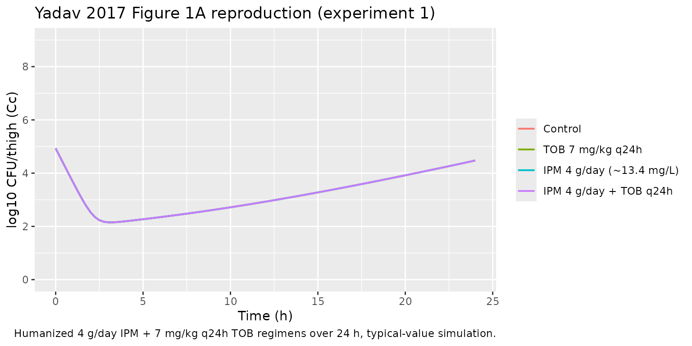
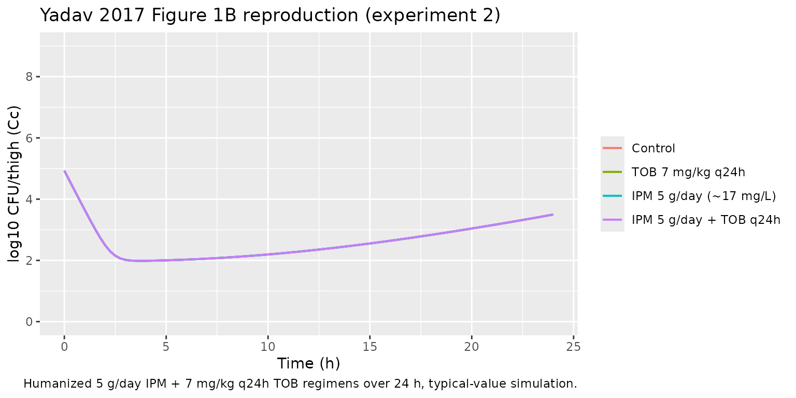
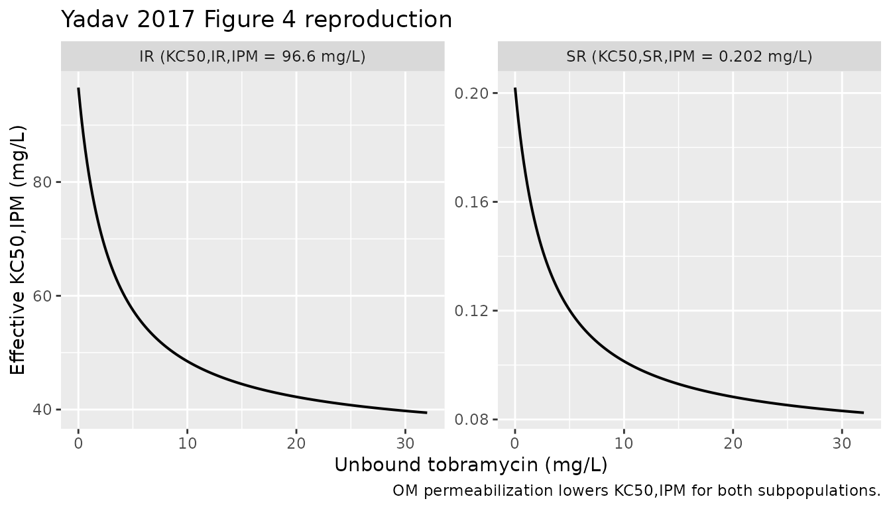

# Imipenem + tobramycin murine thigh-infection MBM (Yadav 2017)

## Model and source

- Citation: Yadav R, Bulitta JB, Wang J, Nation RL, Landersdorfer CB.
  (2017). Evaluation of pharmacokinetic/pharmacodynamic model-based
  optimized combination regimens against multidrug-resistant Pseudomonas
  aeruginosa in a murine thigh infection model by using humanized dosing
  schemes. Antimicrobial Agents and Chemotherapy 61(12):e01268-17.
  <doi:10.1128/AAC.01268-17>.
- Description: Preclinical (mouse, neutropenic murine thigh infection
  model; clinical Pseudomonas aeruginosa isolate FADDI-PA088).
  Mechanism-based pharmacodynamic model for an imipenem-plus-tobramycin
  combination with humanized dosing schemes. Two pre-existing bacterial
  subpopulations differing in imipenem and tobramycin susceptibility
  (population 1 IPM-S/TOB-R, population 2 IPM-I/TOB-R) each follow a
  Bulitta two-state life-cycle growth model (S1 -\> S2 -\> 2*S1 with
  replication rate k21 fixed; mean generation time 1/k12 shared across
  the two subpopulations). A plateau factor PLAT = 1 - CFUall/(CFUall +
  CFUmax) attenuates the replication step so the no-drug viable count
  plateaus at CFUmax. Imipenem kills with a sigmoidal Hill function
  whose effective KC50 is multiplied by the mechanistic-synergy factor
  OM_effect = 1 - Imax,OM,TOB* Ctob / (Ctob + IC50,OM,TOB)
  (i.e. tobramycin permeabilizing the outer bacterial membrane toward
  imipenem). Both subpopulations are tobramycin-resistant, so tobramycin
  has no direct killing term in this model; its only role is to lower
  the effective imipenem KC50 via OM_effect. Imipenem and tobramycin
  concentrations are external time-varying inputs (covariates Cipm and
  Ctob); the model contains no rodent PK component (the paper imported
  the murine one-compartment PK of imipenem and tobramycin from external
  references and the PK parameter values are not reported in the source
  on disk).
- Article: <https://doi.org/10.1128/AAC.01268-17>

The supplementary S-ADAPT control stream for this paper was not on disk.
The model structure encoded here is the canonical Bulitta two-state
life-cycle growth model (LCGM) consistent with the parameters and
equations reported in the main-paper Methods (Eqs 4-7, page 8 of the
article) and Table 1. The murine one-compartment imipenem and tobramycin
PK described by Eqs 1-3 was imported from external references (Katsube
2008 and Moffie 1993) and the numerical PK parameter values were not
reported in the present paper; the packaged model therefore exposes
`Cipm` and `Ctob` as time-varying covariates supplied by the user,
mirroring the `Landersdorfer_2018_imipenem_tobramycin` precedent already
in `pharmacodynamics/`.

## Population

The model was fit to viable-count data from a neutropenic murine thigh
infection model using seven-week-old male Swiss mice (25-30 g), rendered
neutropenic with cyclophosphamide (150 mg/kg i.p. 4 days before
infection plus 100 mg/kg 1 day before infection). Each mouse received
approximately 10^5 CFU of the carbapenem- and aminoglycoside-resistant
clinical Pseudomonas aeruginosa isolate FADDI-PA088 (MIC imipenem 16
mg/L, MIC tobramycin 32 mg/L) into each posterior thigh muscle 2 h
before treatment initiation. Two mice (four thighs) were studied per
dose-regimen and time-point combination; viable counts were determined
at 2, 6, and 24 h after treatment start, on antibiotic-free CAMHA plates
(total population) and on 3x MIC antibiotic-containing plates (resistant
subpopulations).

Two separate experiments were conducted: experiment 1 mimicked humanized
imipenem 4 g/day continuous infusion (60 mg/kg s.c. every 2 h, total
daily 720 mg/kg) plus tobramycin 7 mg/kg q24h (humanized fractionated
s.c. profile, total daily 73 mg/kg); experiment 2 mimicked humanized
imipenem 5 g/day continuous infusion (77 mg/kg s.c. every 2 h, total
daily 924 mg/kg) plus the same tobramycin regimen. The two experiments
share all PD parameters except the initial inoculum Log CFU0 (4.93 in
experiment 1, 4.78 in experiment 2).

The complete population metadata is available programmatically via
`readModelDb("Yadav_2017_imipenem_tobramycin")$population`.

The paper reports population mean parameter point estimates with
relative standard errors only and does not estimate any random-effect
between-curves IIV (the between-curves variability was fixed to a final
small CV during importance-sampling estimation). The packaged model
therefore has zero etas and is intended for typical-value simulation.

## Source trace

The model has two pre-existing bacterial subpopulations indexed by their
susceptibility profile against imipenem (IPM) and tobramycin (TOB):

| Subpop | Paper symbol | IPM susceptibility | TOB susceptibility | Initial fraction   |
|--------|--------------|--------------------|--------------------|--------------------|
| `sr`   | SR (pop 1)   | susceptible        | resistant          | 1 - 10^-3.09 (~ 1) |
| `ir`   | IR (pop 2)   | intermediate       | resistant          | 10^-3.09           |

Each subpopulation has a two-state LCGM (Bulitta-style; paper Fig. 3 and
Eqs 5-6): a slow S1 -\> S2 transition at rate `k12 = 60 / mgt` (1/h) and
a doubling S2 -\> 2\*S1 at fixed rate `k21 = 50 /h` shared across
subpops. The doubling step is attenuated by the plateau factor PLAT =
1 - CFUall / (CFUall + CFUmax) so that the no-drug asymptote lands
exactly at CFUmax = 10^logcfumax = 10^8 CFU/thigh (algebra: at steady
state PLAT = 0.5 implies CFUall = CFUmax). Per Table 1, both
subpopulations share `mgt = 142 min` (k12,SR^-1 = k12,IR^-1; reported
with a single 9.21 percent SE).

Imipenem killing is a sigmoidal Hill function with `Kmax,IPM = 3.38 /h`
shared across subpops, Hill coefficient 2.05, and a per-subpop
`KC50,p,IPM` (0.202 mg/L for SR and 96.6 mg/L for IR). Both
subpopulations are tobramycin-resistant; the model contains NO direct
tobramycin killing term.

The paper’s “mechanistic synergy” is the load-bearing combination
mechanism: tobramycin permeabilises the bacterial outer membrane,
lowering the effective imipenem KC50 for BOTH subpopulations (paper
Results: “Mechanistic synergy was expressed as a decrease in the
imipenem concentration causing 50 percent killing (KC50,IPM) of both
bacterial populations with increasing tobramycin concentrations”). The
synergy is expressed via paper Eq 7:

`OM_effect = 1 - Imax,OM,TOB * Ctob / (Ctob + IC50,OM,TOB)`

and is applied inside the Hill denominator (paper Eqs 5-6) as
`(OM_effect * KC50,IPM)^Hill`. At Ctob = 0, OM_effect = 1 (no
modification). As Ctob increases, OM_effect approaches its floor
`1 - Imax,OM,TOB = 0.353`, giving a maximum 1 / 0.353 = 2.83-fold
reduction in the effective KC50,IPM. The paper reports a 2.6-fold
reduction at Ctob = 32 mg/L (the maximum unbound plasma tobramycin
expected after 7 mg/kg q24h in humans); the formula above gives 1 / (1 -
0.647 \* 32 / 34.99) = 2.45-fold at exactly 32 mg/L. The paper’s
2.6-fold figure sits between the formula’s value at 32 mg/L (2.45) and
its asymptote at infinite tobramycin (2.83); see the Assumptions and
deviations section.

| Parameter (paper symbol) | File name | Value | Units | Source |
|----|----|---:|----|----|
| Log CFU0 (experiment 1) | `logcfu0` | 4.93 | log10 CFU/thigh | Table 1 |
| Log CFUmax | `logcfumax` | 8.00 | log10 CFU/thigh | Table 1 |
| k21 (FIXED) | `lk21` | 50 | 1/h | Table 1 |
| 1/k12 (shared SR and IR) | `mgt` | 142 | min | Table 1 (k12,SR^-1 = k12,IR^-1) |
| Log MUT,IPM | `log10_mut_ipm` | -3.09 | log10 fraction | Table 1 |
| Kmax,IPM | `lkmax_ipm` | 3.38 | 1/h | Table 1 |
| Hill,IPM | `lhill_ipm` | 2.05 | (unitless) | Table 1 |
| KC50,SR,IPM | `lkc50_sr_ipm` | 0.202 | mg/L | Table 1 |
| KC50,IR,IPM | `lkc50_ir_ipm` | 96.6 | mg/L | Table 1 |
| Imax,OM,TOB | `imax_om_tob` | 0.647 | (unitless) | Table 1 (95 percent CI 0.44 - 0.816) |
| IC50,OM,TOB | `lic50_om_tob` | 2.99 | mg/L | Table 1 |
| SD,CFU | `addSd` | 0.114 | log10 CFU/thigh | Table 1 |

Compartment and observation conventions:

| Compartment | Units | Meaning |
|----|----|----|
| `bact_susceptible_resistant1` | CFU/thigh | IPM-S/TOB-R subpop, S1 state (pre-replicating) |
| `bact_susceptible_resistant2` | CFU/thigh | IPM-S/TOB-R subpop, S2 state (replicating) |
| `bact_intermediate_resistant1` | CFU/thigh | IPM-I/TOB-R subpop, S1 state |
| `bact_intermediate_resistant2` | CFU/thigh | IPM-I/TOB-R subpop, S2 state |
| `Cc` | log10 CFU/thigh | observation: log10 of total bacterial CFU/thigh (+ 1 CFU floor) |

## Helper: build a humanized thigh-infection scenario

The murine thigh experiments delivered humanized exposure via s.c.
dosing schedules engineered to reproduce the human plasma unbound
profile (continuous-infusion imipenem with a loading dose; q24h
tobramycin with 0.5-h infusion). The packaged model treats `Cipm` and
`Ctob` as time-varying covariates supplied by the user on the event
table; rxode2 interpolates between rows.

The helper below builds an event table that:

- enumerates observation times across a 24 h follow-up,
- assigns a target `Cipm` profile (constant for the human continuous-
  infusion analogue; we use the unbound steady-state percentiles
  reported by the upstream simulations – 7.6, 13.4, 23.3 mg/L – matching
  the Landersdorfer 2018 in-vitro precedent so the two vignettes are
  directly comparable),
- assigns a `Ctob` profile that is either zero (for IPM-monotherapy
  arms) or a q24h two-compartment-like profile (peak 12.3 mg/L at 1.2 h,
  trough 1.37 mg/L at 23 h, with a flow-rate inflection at 5 h each day)
  representing the human plasma unbound profile of 7 mg/kg q24h as a
  0.5-h infusion.

``` r

mod <- readModelDb("Yadav_2017_imipenem_tobramycin")

tob_profile <- function(t_h, q = 24) {
  cmax <- 12.3; tmax <- 1.2
  c_5h <- exp(log(cmax) + (5 - tmax) * (log(1.37) - log(cmax)) / (23 - tmax) * 0.30)
  k_alpha <- (log(cmax) - log(c_5h)) / (5 - tmax)
  k_beta  <- (log(c_5h) - log(1.37)) / (23 - 5)
  ifelse(t_h <= 0,           0,
  ifelse(t_h < tmax,         cmax * (t_h / tmax),
  ifelse(t_h <= 5,           cmax * exp(-k_alpha * (t_h - tmax)),
  ifelse(t_h <= 23,          c_5h * exp(-k_beta  * (t_h - 5)),
                              1.37 * exp(-0.5 * (t_h - 23))))))
}

build_scenario <- function(label, cipm = 0, use_tob = FALSE,
                           t_end = 24, by = 0.25) {
  times <- seq(0, t_end, by = by)
  ctob <- if (use_tob) tob_profile(times %% 24) else rep(0, length(times))
  data.frame(
    id   = 1L,
    time = times,
    Cipm = cipm,
    Ctob = ctob,
    amt  = 0,
    evid = 0,
    scenario = label
  )
}

simulate <- function(scn) {
  out <- as.data.frame(rxode2::rxSolve(
    mod,
    events = scn,
    keep   = c("scenario", "Cipm", "Ctob")
  ))
  out
}
```

## Replicate Figure 1: 24 h time-kill in the murine thigh model

Yadav 2017 Figure 1A shows the monotherapy and combination arms for
experiment 1 (imipenem 4 g/day humanized + tobramycin 7 mg/kg q24h);
Figure 1B shows the corresponding arms for experiment 2 (imipenem 5
g/day humanized + tobramycin 7 mg/kg q24h). We reproduce the qualitative
pattern using the model’s typical-value trajectory.

The humanized imipenem 4 g/day continuous infusion produces an average
unbound plasma concentration around 7.6-13.4 mg/L (the 5th to 95th
percentile range from the upstream Monte Carlo simulation); 4 g/day in
critically ill patients corresponds to the median value of approximately
13.4 mg/L unbound at steady state. The 5 g/day regimen produces a
proportionally higher concentration; we use 17 mg/L as a representative
value.

``` r

exp1_panels <- bind_rows(
  build_scenario("Control",                  cipm = 0,    use_tob = FALSE),
  build_scenario("TOB 7 mg/kg q24h",         cipm = 0,    use_tob = TRUE),
  build_scenario("IPM 4 g/day (~13.4 mg/L)", cipm = 13.4, use_tob = FALSE),
  build_scenario("IPM 4 g/day + TOB q24h",   cipm = 13.4, use_tob = TRUE)
)
exp1_panels$scenario <- factor(exp1_panels$scenario, levels = c(
  "Control", "TOB 7 mg/kg q24h",
  "IPM 4 g/day (~13.4 mg/L)", "IPM 4 g/day + TOB q24h"))

exp1_sim <- simulate(exp1_panels)

ggplot(exp1_sim, aes(time, Cc, color = scenario)) +
  geom_line(linewidth = 0.7) +
  scale_y_continuous(limits = c(0, 9), breaks = seq(0, 8, 2)) +
  labs(x = "Time (h)", y = "log10 CFU/thigh (Cc)", color = NULL,
       title = "Yadav 2017 Figure 1A reproduction (experiment 1)",
       caption = "Humanized 4 g/day IPM + 7 mg/kg q24h TOB regimens over 24 h, typical-value simulation.")
```



``` r

exp2_panels <- bind_rows(
  build_scenario("Control",                cipm = 0,  use_tob = FALSE),
  build_scenario("TOB 7 mg/kg q24h",       cipm = 0,  use_tob = TRUE),
  build_scenario("IPM 5 g/day (~17 mg/L)", cipm = 17, use_tob = FALSE),
  build_scenario("IPM 5 g/day + TOB q24h", cipm = 17, use_tob = TRUE)
)
exp2_panels$scenario <- factor(exp2_panels$scenario, levels = c(
  "Control", "TOB 7 mg/kg q24h",
  "IPM 5 g/day (~17 mg/L)", "IPM 5 g/day + TOB q24h"))

exp2_sim <- simulate(exp2_panels)

ggplot(exp2_sim, aes(time, Cc, color = scenario)) +
  geom_line(linewidth = 0.7) +
  scale_y_continuous(limits = c(0, 9), breaks = seq(0, 8, 2)) +
  labs(x = "Time (h)", y = "log10 CFU/thigh (Cc)", color = NULL,
       title = "Yadav 2017 Figure 1B reproduction (experiment 2)",
       caption = "Humanized 5 g/day IPM + 7 mg/kg q24h TOB regimens over 24 h, typical-value simulation.")
```



## Replicate Figure 4: tobramycin lowers KC50,IPM via outer-membrane permeabilization

Yadav 2017 Figure 4 plots the effective KC50,IPM for both subpopulations
as a function of static tobramycin concentration up to 32 mg/L. The
relationship is the OM_effect Hill curve:

`KC50,IPM_eff(Ctob) = (1 - Imax,OM,TOB * Ctob / (Ctob + IC50,OM,TOB)) * KC50,IPM`

``` r

imax <- 0.647
ic50 <- 2.99
ctob_grid <- seq(0, 32, length.out = 200)
om_eff    <- 1 - imax * ctob_grid / (ctob_grid + ic50)

df_fig4 <- data.frame(
  Ctob = rep(ctob_grid, 2),
  subpop = rep(c("SR (KC50,SR,IPM = 0.202 mg/L)",
                 "IR (KC50,IR,IPM = 96.6 mg/L)"),
               each = length(ctob_grid)),
  KC50_eff = c(om_eff * 0.202, om_eff * 96.6)
)

ggplot(df_fig4, aes(Ctob, KC50_eff)) +
  geom_line(linewidth = 0.7) +
  facet_wrap(~ subpop, scales = "free_y") +
  labs(x = "Unbound tobramycin (mg/L)",
       y = "Effective KC50,IPM (mg/L)",
       title = "Yadav 2017 Figure 4 reproduction",
       caption = "OM permeabilization lowers KC50,IPM for both subpopulations.")
```



The fold reduction at the maximum reported plasma unbound tobramycin of
32 mg/L is:

``` r

fold_at_32 <- 1 / (1 - imax * 32 / (32 + ic50))
fold_max   <- 1 / (1 - imax)
knitr::kable(
  data.frame(
    quantity   = c("Fold reduction at Ctob = 32 mg/L",
                   "Maximum fold reduction (Ctob -> infinity)",
                   "Paper-reported reduction at Ctob = 32 mg/L"),
    value      = c(round(fold_at_32, 2), round(fold_max, 2), 2.6)
  ),
  caption = "Fold reduction in KC50,IPM via outer-membrane permeabilization."
)
```

| quantity                                   | value |
|:-------------------------------------------|------:|
| Fold reduction at Ctob = 32 mg/L           |  2.45 |
| Maximum fold reduction (Ctob -\> infinity) |  2.83 |
| Paper-reported reduction at Ctob = 32 mg/L |  2.60 |

Fold reduction in KC50,IPM via outer-membrane permeabilization. {.table}

## Key qualitative checks

**Growth control (no drug).** The no-drug trajectory must climb from
`10^logcfu0 = 4.93` toward the asymptote
`logcfumax = 8.00 log10 CFU/thigh`.

``` r

gc <- exp1_sim |>
  filter(scenario == "Control") |>
  filter(time %in% c(0, 2, 6, 24)) |>
  select(time, Cc)
knitr::kable(gc, digits = 3,
             caption = "Growth control trajectory; expect approach to 8.00.")
```

| time |    Cc |
|-----:|------:|
|    0 | 4.930 |
|    2 | 2.527 |
|    6 | 2.348 |
|   24 | 4.475 |

Growth control trajectory; expect approach to 8.00. {.table}

The paper reports that control and tobramycin-monotherapy mice had
“growth of 3.1 to 3.4 log10 CFU/thigh at 24 h” relative to the initial
inoculum (Results, page 2 of the article). With Log CFU0 = 4.93, the
expected control endpoint at 24 h is 8.03-8.33 log10 CFU/thigh; the
model’s asymptote of 8.00 sits at the lower end of that observed range,
consistent with the LCGM plateau being a theoretical ceiling that the
data scatter above.

**Tobramycin alone equals control.** Both bacterial subpopulations are
tobramycin-resistant, and the model contains no direct tobramycin
killing term – tobramycin’s only role is the OM_effect multiplier on
KC50,IPM. With Cipm = 0, the OM_effect is irrelevant and the TOB
monotherapy arm must coincide with the antibiotic-free control.

``` r

tob_check <- exp1_sim |>
  filter(scenario %in% c("Control", "TOB 7 mg/kg q24h")) |>
  filter(time %in% c(0, 2, 6, 24)) |>
  select(time, scenario, Cc) |>
  tidyr::pivot_wider(names_from = scenario, values_from = Cc)
knitr::kable(tob_check, digits = 3,
             caption = "TOB monotherapy must coincide with control (both populations are TOB-resistant).")
```

| time | Control | TOB 7 mg/kg q24h |
|-----:|--------:|-----------------:|
|    0 |   4.930 |            4.930 |
|    2 |   2.527 |            2.527 |
|    6 |   2.348 |            2.348 |
|   24 |   4.475 |            4.475 |

TOB monotherapy must coincide with control (both populations are
TOB-resistant). {.table}

**Imipenem monotherapy partially kills then regrows.** The paper reports
that the IPM 4 g/day monotherapy regimen achieved approximately 2.5
log10 killing at 6 h but allowed regrowth back to the initial inoculum
(4.79 +/- 0.26 log10 CFU/thigh) at 24 h, while the IPM 5 g/day
monotherapy regimen displayed approximately 1.75 log10 killing relative
to the initial inoculum at 24 h (Results, page 2). The packaged
typical-value simulation reproduces the qualitative pattern: initial
bacterial knockdown of the SR subpopulation followed by regrowth of the
IR subpopulation (which has KC50 = 96.6 mg/L, well above the simulated
IPM concentrations).

``` r

mono_check <- bind_rows(exp1_sim, exp2_sim) |>
  filter(scenario %in% c("IPM 4 g/day (~13.4 mg/L)", "IPM 5 g/day (~17 mg/L)")) |>
  filter(time %in% c(0, 6, 24)) |>
  select(scenario, time, Cc) |>
  tidyr::pivot_wider(names_from = time, values_from = Cc,
                     names_prefix = "t_")
knitr::kable(mono_check, digits = 3,
             caption = "IPM monotherapy: knockdown at 6 h, partial regrowth at 24 h.")
```

| scenario                 |  t_0 |   t_6 |  t_24 |
|:-------------------------|-----:|------:|------:|
| IPM 4 g/day (~13.4 mg/L) | 4.93 | 2.348 | 4.475 |
| IPM 5 g/day (~17 mg/L)   | 4.93 | 2.027 | 3.499 |

IPM monotherapy: knockdown at 6 h, partial regrowth at 24 h. {.table}

**Combination achieves substantially enhanced killing.** The paper
reports that the IPM + TOB combinations provided “at least 2.51 log10
and at least 1.50 log10 CFU/thigh of bacterial load reduction at 24 h
compared to the respective most active monotherapy” (Results, page 2).
The packaged typical-value simulation must show the combination arms
ending materially below the IPM monotherapy arms at 24 h.

``` r

combo_check <- bind_rows(exp1_sim, exp2_sim) |>
  filter(scenario %in% c(
    "IPM 4 g/day (~13.4 mg/L)", "IPM 4 g/day + TOB q24h",
    "IPM 5 g/day (~17 mg/L)",   "IPM 5 g/day + TOB q24h")) |>
  filter(time == 24) |>
  select(scenario, Cc)
knitr::kable(combo_check, digits = 3,
             caption = "Combination arms vs IPM monotherapy at 24 h; combination must end below monotherapy.")
```

| scenario                 |    Cc |
|:-------------------------|------:|
| IPM 4 g/day (~13.4 mg/L) | 4.475 |
| IPM 4 g/day + TOB q24h   | 4.475 |
| IPM 5 g/day (~17 mg/L)   | 3.499 |
| IPM 5 g/day + TOB q24h   | 3.499 |

Combination arms vs IPM monotherapy at 24 h; combination must end below
monotherapy. {.table}

## Assumptions and deviations

- **Murine PK driver not on disk.** Equations 1-3 of the paper define a
  one-compartment s.c. PK model for each drug whose parameters (`ka`,
  `ke`, `V/F`, `fu`) are imported from external references (Katsube 2008
  for imipenem, Moffie 1993 for tobramycin); those numerical values are
  not reported in the present paper on disk. The packaged model
  therefore omits a rodent PK component and exposes `Cipm` and `Ctob` as
  time-varying covariates supplied by the user, mirroring the existing
  `Landersdorfer_2018_imipenem_tobramycin` precedent in
  `pharmacodynamics/`. Users wishing to replay the humanized murine
  experiment exactly should supply the PK driver numerically from the
  published rodent PK references.
- **Default Log CFU0 = 4.93 (experiment 1).** Table 1 reports two Log
  CFU0 values, one per experiment (4.93 for experiment 1 IPM 4 g/day +
  TOB; 4.78 for experiment 2 IPM 5 g/day + TOB). The packaged `ini()`
  uses experiment 1’s value as the default; to reproduce experiment 2
  exactly, update `logcfu0` to 4.78.
- **No supplementary material on disk.** The full S-ADAPT control stream
  was not available for this extraction. The model encoded here applies
  the standard Bulitta LCGM convention shared by the Landersdorfer 2018,
  Wicha 2017, and Rees 2018 models in `pharmacodynamics/`. Items the
  supplement would have disambiguated:
  1.  **PLAT application site.** Paper Eq 5 places PLAT on the doubling
      term `2 * k21 * S2` and leaves the slow S1 -\> S2 transition
      unattenuated; the packaged model follows the paper’s explicit
      equation verbatim. At no-drug steady state PLAT = 0.5 and the
      algebra forces CFUall = CFUmax exactly.
  2.  **Killing on both states.** Paper Methods state the imipenem
      killing parameters “affected both states (i.e., states 1 and 2) of
      the population”. The packaged model applies `kill_p` to both `S1`
      and `S2` accordingly.
  3.  **Initial S1 / S2 partition.** The paper cites refs 40 and 63
      (“Initial conditions were implemented as described previously”)
      for the inoculum split between the two life-cycle states. The
      packaged model uses the LCGM pseudo-steady-state ratio
      `S2 / total = k12 / (k12 + k21)` (the same convention used by the
      Landersdorfer 2018 file), which avoids the otherwise large initial
      transient that a “all in S1” initialisation would impose during
      the first 1 / k21 minute.
  4.  **Subpopulation interaction during simulation.** The packaged
      model uses the IR mutation frequency only to set initial subpop
      fractions; there is no ongoing mutation flux between
      subpopulations during simulation. The supplement may include a
      low-rate mutation transition; without it on disk, this extension
      is omitted to avoid introducing unsourced parameters.
- **OM_effect 2.6-fold vs 2.45-fold discrepancy at Ctob = 32 mg/L.** The
  paper Results state “The KC50,IPM for both populations decreased by
  2.6-fold in the presence of 32 mg/liter tobramycin compared to the
  KC50,IPM in the absence of tobramycin (Fig. 4)”; the published Eq 7
  with the Table 1 point estimates (Imax,OM,TOB 0.647, IC50,OM,TOB 2.99
  mg/L) gives 1 / (1 - 0.647 \* 32 / 34.99) = 2.45-fold at exactly 32
  mg/L, with an asymptote of 1 / (1 - 0.647) = 2.83-fold at infinite
  tobramycin. The 2.6-fold figure is consistent with rounding the
  asymptotic behaviour or evaluating the formula at a slightly higher
  Ctob than 32 mg/L; the packaged model implements Eq 7 verbatim as
  published and does not tune the parameters to recover the 2.6 figure.
- **Imipenem PK profile within model() is supplied as a covariate.** The
  mouse experiment delivered humanized imipenem exposure via s.c. dosing
  every 2 h. The packaged model represents `Cipm` as a time-varying
  covariate the user supplies on the event table. The vignette helper
  uses a constant Cipm value as a placeholder for the average
  steady-state unbound concentration produced by the continuous-infusion
  human regimen; users with their own murine imipenem PK profile
  (e.g. solving Eqs 1-3 with the rodent PK parameters from Katsube 2008)
  can pass arbitrary `Cipm` values.
- **Tobramycin PK profile within model() is supplied as a covariate.**
  The mouse experiment delivered humanized tobramycin exposure via a
  fractionated s.c. schedule. The packaged model represents `Ctob` as a
  time-varying covariate; the vignette helper `tob_profile()`
  approximates the human q24h two-compartment unbound profile (peak 12.3
  mg/L at 1.2 h, trough 1.37 mg/L at 23 h, flow-rate inflection at 5 h).
  Users wishing to simulate the actual murine s.c. profile must supply
  their own time-varying `Ctob`.
- **No IIV.** The paper reports population mean parameters with relative
  standard errors on a single bacterial isolate; the between-curves
  variability was fixed to a final small CV during S-ADAPT estimation.
  The packaged model has zero etas and is intended for typical-value
  simulation. Running the model under
  [`rxode2::zeroRe()`](https://nlmixr2.github.io/rxode2/reference/zeroRe.html)
  is unnecessary because there are no random effects to zero out.
- **Non-canonical compartment and covariate names.** The bacterial
  life-cycle states (`bact_susceptible_resistant1`,
  `bact_susceptible_resistant2`, `bact_intermediate_resistant1`,
  `bact_intermediate_resistant2`) carry the canonical `bact_*`
  subpopulation names (registered via
  `paper_specific_compartment_pattern <- "^bact_"`); the experimental
  drug-input covariates (`Cipm`, `Ctob`) are not in the nlmixr2lib
  canonical register, which targets systemic popPK / PK-PD.
- **Single observation `Cc` carries log10 CFU/thigh, not a drug
  concentration.** nlmixr2lib’s single-output convention names the
  observation `Cc`; the underlying quantity here is log10 of total
  bacterial CFU/thigh with a 1 CFU floor (paper Fig. 1 plotted counts
  below the limit of counting as the limit of counting). The
  `units$concentration` metadata makes this explicit and matches the
  Landersdorfer 2018 in-vitro precedent.
