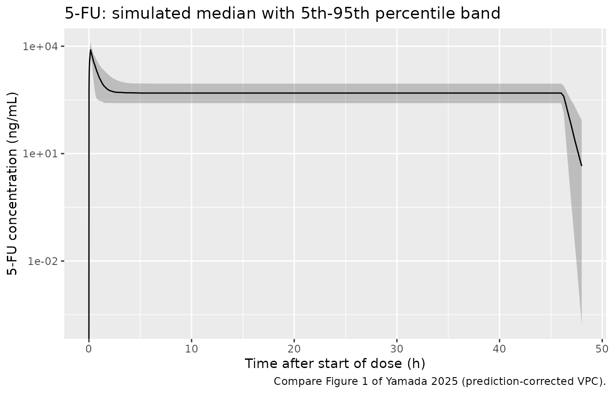
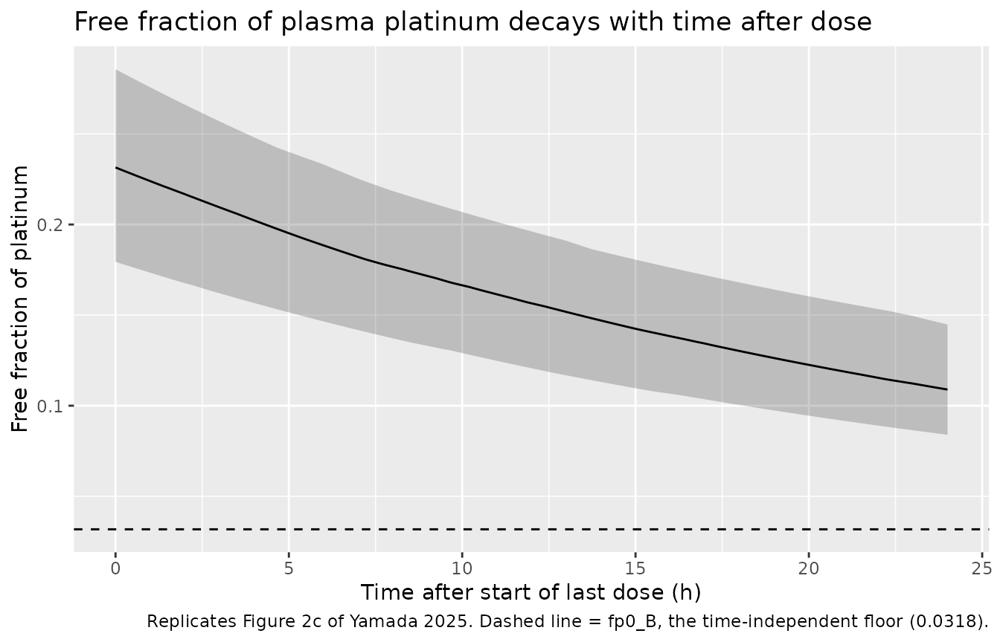
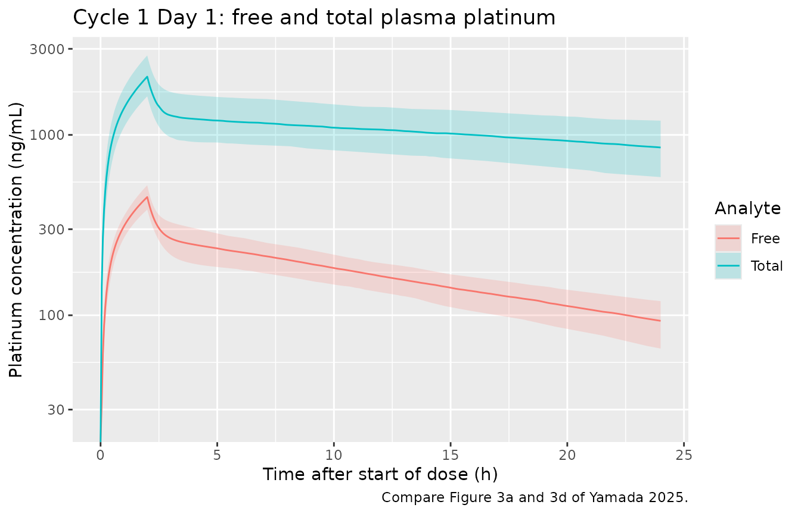

# Fluorouracil + oxaliplatin with and without zolbetuximab (Yamada 2025)

## Model and source

Yamada 2025 reports two independent population PK models developed on
the same 21 patients in Cohort 2 of the phase 2 ILUSTRO study, to ask
whether the anti-claudin-18.2 monoclonal antibody **zolbetuximab**
perturbs the PK of the mFOLFOX6 chemotherapy backbone. They are packaged
as two model files with this one shared vignette.

``` r

mod_fu <- readModelDb("Yamada_2025_fluorouracil")
mod_ox <- readModelDb("Yamada_2025_oxaliplatin")

ui_fu <- rxode2::rxode(mod_fu)
#> ℹ parameter labels from comments will be replaced by 'label()'
ui_ox <- rxode2::rxode(mod_ox)
#> ℹ parameter labels from comments will be replaced by 'label()'
```

- Citation: Yamada A, Yang J, Bonate PL, Heo N, Poondru S. Population
  pharmacokinetic analysis of fluorouracil and oxaliplatin in the
  absence or presence of zolbetuximab in locally advanced unresectable
  or metastatic gastric or gastroesophageal junction adenocarcinoma.
  Cancer Chemother Pharmacol. 2025;95:89.
  <doi:10.1007/s00280-025-04808-2> (PMCID PMC12449379). Parameter
  estimates are from Supplementary Table 1 (‘Parameter estimates of best
  base model for 5-FU and models with zolbetuximab effect on 5-FU PK’),
  ‘Best base model’ column, in the online Supplementary Material
  (280_2025_4808_MOESM1_ESM.pdf). Companion oxaliplatin model from the
  same paper: modellib(‘Yamada_2025_oxaliplatin’).
- Article: <https://doi.org/10.1007/s00280-025-04808-2>
- Supplement (parameter tables):
  <https://doi.org/10.1007/s00280-025-04808-2> (Supplementary Material,
  `280_2025_4808_MOESM1_ESM.pdf`)

**Fluorouracil** – One-compartment population PK model of fluorouracil
(5-FU) with zero-order IV input and first-order elimination in patients
with locally advanced unresectable or metastatic HER2-negative,
CLDN18.2-positive gastric or gastroesophageal junction (G/GEJ)
adenocarcinoma receiving mFOLFOX6 with or without concomitant
zolbetuximab (Yamada 2025, ILUSTRO Cohort 2). Zolbetuximab
coadministration was tested as a covariate on CL and on V and was not
statistically significant in either case, so the best base model is also
the final model and the extracted model carries no covariate effects.

**Oxaliplatin** – Three-compartment population PK model describing free
and total plasma platinum simultaneously after oxaliplatin
administration, with zero-order IV input, first-order elimination and a
mono-exponentially decaying time-dependent free fraction, in patients
with locally advanced unresectable or metastatic HER2-negative,
CLDN18.2-positive gastric or gastroesophageal junction (G/GEJ)
adenocarcinoma receiving mFOLFOX6 with or without concomitant
zolbetuximab (Yamada 2025, ILUSTRO Cohort 2). The disposition ODEs
describe FREE platinum; total platinum is derived as the free
concentration divided by the time-dependent free fraction. Concomitant
zolbetuximab reduces the distribution volume of all three compartments
by 12.3%.

The two models differ in what they had to explain. 5-FU is a
one-compartment model with a 0.25 h half-life; the whole modelling
difficulty is the steep bolus-plus-infusion input. Oxaliplatin is a
three-compartment model of *free* platinum with a **time-dependent free
fraction**, fitted simultaneously to free and total platinum, because
platinum binds plasma protein irreversibly and progressively.

## Population

``` r

str(ui_ox$population)
#> List of 6
#>  $ species      : chr "human"
#>  $ n_subjects   : int 21
#>  $ n_studies    : int 1
#>  $ disease_state: chr "Adults with previously untreated, locally advanced unresectable or metastatic HER2-negative, CLDN18.2-positive "| __truncated__
#>  $ dose_range   : chr "Oxaliplatin 85 mg/m^2 IV infused over 2 h concurrently with folinic acid 400 mg/m^2, on Days 1, 15 and 29 of 42"| __truncated__
#>  $ notes        : chr "Baseline clinical and demographic characteristics are not tabulated in this paper; it cites the previously publ"| __truncated__
```

Both models were built on plasma concentrations from all 21 patients
enrolled in ILUSTRO Cohort 2 (NCT03505320): adults with previously
untreated, locally advanced unresectable or metastatic HER2-negative,
CLDN18.2-positive gastric or gastroesophageal junction adenocarcinoma.
Patients received mFOLFOX6 on Days 1, 15 and 29 of 42-day cycles, and
zolbetuximab on Days 1 and 22 of each cycle **except Cycle 1**, where
the zolbetuximab infusion was deliberately delayed to Day 3. That delay
is what makes the analysis possible: Cycle 1 supplies chemotherapy PK in
the *absence* of zolbetuximab and Cycle 2 in its *presence*, within the
same patients.

Baseline demographics are not tabulated in this paper – it cites the
earlier ILUSTRO Cohort 2 report (its reference 4) for them, which was
not available at extraction time. This does not affect the model:
neither final model retains a demographic covariate, and every exposure
metric the paper reports is **dose-normalized**, which cancels body
surface area exactly (see below).

## Source trace

Every `ini()` entry carries an in-file comment pointing at its source
location. Collected here for review:

### Fluorouracil (Supplementary Table 1, “Best base model” column)

| Equation / parameter | Value | Source location |
|----|----|----|
| `lcl` (CL) | 179 L/h (RSE 8.7%) | Supp. Table 1, best base model |
| `lvc` (V) | 65.6 L (RSE 12.7%) | Supp. Table 1, best base model |
| `etalcl` | 34.4% CV -\> `log(1 + 0.344^2)` = 0.111842 | Supp. Table 1, IIV rows (shrinkage 9.5%) |
| `etalvc` | 41.9% CV -\> `log(1 + 0.419^2)` = 0.161745 | Supp. Table 1, IIV rows (shrinkage 32.9%) |
| `propSd` | 0.583 (read as 58.3% CV – see Errata) | Supp. Table 1, proportional error (RSE 7.0%) |
| `d/dt(central) <- -kel * central` | n/a | Results, “Base model for 5-FU”; Abstract |
| Zolbetuximab effect on CL / V | not retained | Results, “Evaluation of zolbetuximab effect on 5-FU PK” |

### Oxaliplatin (Supplementary Table 2, “Zolbetuximab as a covariate on V1-V3” column)

| Equation / parameter | Value | Source location |
|----|----|----|
| `lcl` (CL) | 8.09 L/h (RSE 21.9%) | Supp. Table 2, V1-V3 column; quoted in Discussion |
| `lvc` (V1) | 51.1 L (RSE 21.3%) | Supp. Table 2, V1-V3 column; quoted in Discussion |
| `lq` (Q2) | 113 L/h (RSE 15.4%) | Supp. Table 2, V1-V3 column |
| `lvp` (V2) | 171 L (RSE 16.0%) | Supp. Table 2, V1-V3 column; quoted in Discussion |
| `lq2` (Q3) | 3.21 L/h (RSE 25.1%) | Supp. Table 2, V1-V3 column |
| `lvp2` (V3) | 1400 L (RSE 192.1%) | Supp. Table 2, V1-V3 column; quoted in Discussion |
| `lfuA` (fp0_A) | 0.194 (RSE 13.8%) | Supp. Table 2, V1-V3 column |
| `lkfu` (alpha) | 0.0393 1/h (RSE 17.2%) | Supp. Table 2, V1-V3 column |
| `lfuB` (fp0_B) | 0.0318 (RSE 37.7%) | Supp. Table 2, V1-V3 column |
| `e_zolbetuximab_vc_vp_vp2` | -0.123 (RSE 32.0%) | Supp. Table 2, “Zolbetuximab effect”, V1-V3 row |
| `etalcl` | 20.7% CV -\> 0.041956 | Supp. Table 2, IIV rows (shrinkage 14.3%) |
| `etalvc` (shared V1-V3) | 14.4% CV -\> 0.020524 | Supp. Table 2, IIV rows (shrinkage 24.3%) |
| `etalfuA` | 16.2% CV -\> 0.025906 | Supp. Table 2, IIV rows (shrinkage 13.8%) |
| `etalfuB` | 39.5% CV -\> 0.144987 | Supp. Table 2, IIV rows (shrinkage 19.0%) |
| `propSd` (free platinum) | 38.5% CV (RSE 11.2%) | Supp. Table 2, V1-V3 column |
| `propSd_totalPt` (total platinum) | 14.6% CV (RSE 10.8%) | Supp. Table 2, V1-V3 column |
| `P = theta_p * (1 + theta_zolb * X_zolb)` | n/a | Methods, “Evaluation of zolbetuximab effect as a covariate” (Article Eq. a) |
| `fp = fp0_A * exp(-alpha * TALD) + fp0_B` | n/a | Results, “Base model for free and total platinum…” (Article Eq. b) |
| `totalPt = Cc / fp` | n/a | Article Eq. b, by definition of the free fraction |

## Dosing, dose basis, and units

Two unit conventions have to be pinned down before any simulation, and
only one of them is stated in the paper.

**Concentration.** The paper reports CL in L/h and V in L, so with `amt`
in mg the model’s natural concentration unit is mg/L = ug/mL. The
paper’s own tables are printed in ng/mL, a factor of 1000 larger; every
comparison below converts explicitly.

**Dose basis for oxaliplatin.** The assay is ICP-MS and measures
*platinum* (ng platinum/mL), while the administered dose is quoted as
*oxaliplatin* (85 mg/m^2). The paper never states which basis the NONMEM
`AMT` used. It is recoverable: simulating the dose as oxaliplatin mass
overpredicts all four of the paper’s dose-normalized oxaliplatin metrics
by a near-constant factor, and that factor is the oxaliplatin:platinum
molar-mass ratio.

``` r

MW_OXALIPLATIN <- 397.29  # g/mol, C8H14N2O4Pt
MW_PLATINUM    <- 195.08  # g/mol
PT_PER_OX      <- MW_PLATINUM / MW_OXALIPLATIN

# Ratio of (simulated on an oxaliplatin-mass basis) to (published), for the
# four dose-normalized metrics of Table 2, Cycle 1 Day 1. Computed in the
# oxaliplatin section below; reproduced here as the motivating check.
data.frame(
  metric = c("free Cmax_D", "free AUC24h_D", "total Cmax_D", "total AUC24h_D"),
  ratio  = c(6.366 / 3.10, 61.03 / 30.3, 30.15 / 14.6, 377.5 / 188)
) |>
  dplyr::mutate(ratio = round(ratio, 3)) |>
  dplyr::rename("Metric" = metric, "Simulated / published" = ratio) |>
  knitr::kable(caption = sprintf(
    "Oxaliplatin-mass dose basis overpredicts by ~%.3f; the oxaliplatin:platinum molar-mass ratio is %.3f.",
    mean(c(6.366 / 3.10, 61.03 / 30.3, 30.15 / 14.6, 377.5 / 188)), 1 / PT_PER_OX))
```

| Metric         | Simulated / published |
|:---------------|----------------------:|
| free Cmax_D    |                 2.054 |
| free AUC24h_D  |                 2.014 |
| total Cmax_D   |                 2.065 |
| total AUC24h_D |                 2.008 |

Oxaliplatin-mass dose basis overpredicts by ~2.035; the
oxaliplatin:platinum molar-mass ratio is 2.037. {.table}

The four ratios bracket the molar-mass ratio 1/0.491 = 2.0365 to within
about 1.5%, which no other explanation accounts for (body surface area
cancels exactly in a dose-normalized metric of a linear model, so it
cannot produce a factor of two). The models therefore take `amt` in
**platinum mass**, and every oxaliplatin dose below is converted with
`PT_PER_OX`. Dose *normalization* in the paper’s Table 2 remains by the
administered **oxaliplatin** dose in mg – that is what “ng
platinum/mL/mg” means there – so the denominators below use the
oxaliplatin dose.

``` r

BSA <- 1.7  # m^2; a rounded standard. Cancels exactly in every dose-normalized
            # metric below, since neither model carries a BSA covariate.

# 5-FU: 400 mg/m^2 bolus over 5-15 min, then 2400 mg/m^2 over 46-48 h.
FU_BOLUS_MG <- 400  * BSA
FU_INF_MG   <- 2400 * BSA
FU_BOLUS_H  <- 10 / 60   # midpoint of the stated 5-15 min
FU_INF_H    <- 46        # lower end of the stated 46-48 h
FU_DOSE_MG  <- FU_BOLUS_MG + FU_INF_MG   # dose-normalization denominator

# Oxaliplatin: 85 mg/m^2 over 2 h, on Days 1, 15, 29 of a 42-day cycle.
OX_DOSE_MG   <- 85 * BSA                 # dose-normalization denominator (oxaliplatin)
OX_AMT_PT_MG <- OX_DOSE_MG * PT_PER_OX   # what actually enters `central` (platinum)
OX_INF_H     <- 2
OX_DOSE_TIMES <- c(0, 336, 672, 1008)    # Days 1, 15, 29 of Cycle 1; Day 1 of Cycle 2
```

## Structural check: the published half-lives

Before simulating, the disposition parameters can be checked against the
half-lives quoted in the Discussion (0.25 h for 5-FU; 0.19, 13.0 and 446
h for the alpha, beta and gamma phases of oxaliplatin). These are pure
functions of the parameter table, so they gate the transcription
independently of any simulation.

``` r

tri_halflives <- function(cl, v1, q2, v2, q3, v3) {
  k10 <- cl / v1; k12 <- q2 / v1; k21 <- q2 / v2; k13 <- q3 / v1; k31 <- q3 / v3
  # Characteristic polynomial of the 3-compartment system, in the rate constants
  a2 <- k10 + k12 + k21 + k13 + k31
  a1 <- k10 * k21 + k10 * k31 + k12 * k31 + k13 * k21 + k21 * k31
  a0 <- k10 * k21 * k31
  log(2) / sort(Re(polyroot(c(-a0, a1, -a2, 1))), decreasing = TRUE)
}

hl <- tibble::tibble(
  Phase = c("5-FU terminal", "oxaliplatin alpha", "oxaliplatin beta", "oxaliplatin gamma"),
  Published = c(0.25, 0.19, 13.0, 446),
  # 5-FU: log(2) / (CL/V). Oxaliplatin: the Discussion's half-lives are computed
  # from the BEST BASE model column of Supp. Table 2, not the final model.
  `Recomputed (base)` = c(log(2) / (179 / 65.6),
                          tri_halflives(8.15, 44.7, 118, 161, 3.35, 1510)),
  `Final model` = c(log(2) / (179 / 65.6),
                    tri_halflives(8.09, 51.1, 113, 171, 3.21, 1400))
) |>
  dplyr::mutate(dplyr::across(where(is.numeric), \(x) signif(x, 3)))

knitr::kable(hl, caption = "Published half-lives vs. values recomputed from the parameter tables (h).")
```

| Phase             | Published | Recomputed (base) | Final model |
|:------------------|----------:|------------------:|------------:|
| 5-FU terminal     |      0.25 |             0.254 |       0.254 |
| oxaliplatin alpha |      0.19 |             0.194 |       0.228 |
| oxaliplatin beta  |     13.00 |            13.000 |      14.300 |
| oxaliplatin gamma |    446.00 |           446.000 |     428.000 |

Published half-lives vs. values recomputed from the parameter tables
(h). {.table}

The three oxaliplatin half-lives reproduce to 0.194 / 12.9 / 450 h
against the published 0.19 / 13.0 / 446 h – but only from the **best
base model** column. The final model (with the zolbetuximab effect on
V1-V3) gives 0.23 / 14.3 / 427 h. The Discussion’s half-lives were
therefore computed from the base model; this is a reporting detail, not
a discrepancy, and it confirms which column is which.

## Fluorouracil

### Virtual cohort and simulation

5-FU has a 0.25 h half-life and 42 days between cycles, so there is no
accumulation and the model carries no covariate: the predicted Cycle 1
and Cycle 2 profiles are identical. One cohort of 200 subjects therefore
serves both columns of Table 1.

``` r

set.seed(20250818)
N_FU <- 200

# Two observation grids on purpose:
#   - `dense` resolves the true peak and the AUC integration;
#   - `sparse` is the protocol sampling schedule the paper actually had
#     (predose and 0.5, 1, 2, 5, 24, 48 h after the start of dosing).
fu_dense  <- sort(unique(c(seq(0, 6, by = 0.01), seq(6, 48, by = 0.25))))
fu_sparse <- c(0, 0.5, 1, 2, 5, 24, 48)

fu_events <- dplyr::bind_rows(
  # dosing: the short "bolus" infusion, then the 46 h infusion
  tidyr::expand_grid(id = seq_len(N_FU),
                     tibble::tibble(time = c(0, FU_BOLUS_H),
                                    amt  = c(FU_BOLUS_MG, FU_INF_MG),
                                    dur  = c(FU_BOLUS_H, FU_INF_H))) |>
    dplyr::mutate(evid = 1L, cmt = "central"),
  # observations, on the ODE state
  tidyr::expand_grid(id = seq_len(N_FU), time = fu_dense) |>
    dplyr::mutate(amt = NA_real_, dur = NA_real_, evid = 0L, cmt = "central")
) |>
  dplyr::arrange(id, time, dplyr::desc(evid))

stopifnot(!anyDuplicated(fu_events[, c("id", "time", "evid")]))

sim_fu <- rxode2::rxSolve(mod_fu, events = fu_events) |> as.data.frame()
#> ℹ parameter labels from comments will be replaced by 'label()'
if (is.null(sim_fu$id)) sim_fu$id <- 1L
sim_fu$treatment <- "5-FU"
```

### Replicating Figure 1 (prediction-corrected VPC)

``` r

# Replicates Figure 1 of Yamada 2025: 5-FU concentration-time profile.
sim_fu |>
  dplyr::filter(!is.na(Cc), time <= 48) |>
  dplyr::group_by(time) |>
  dplyr::summarise(Q05 = quantile(Cc, 0.05), Q50 = median(Cc),
                   Q95 = quantile(Cc, 0.95), .groups = "drop") |>
  ggplot(aes(time, Q50 * 1000)) +
  geom_ribbon(aes(ymin = Q05 * 1000, ymax = Q95 * 1000), alpha = 0.25) +
  geom_line() +
  scale_y_log10() +
  labs(x = "Time after start of dose (h)", y = "5-FU concentration (ng/mL)",
       title = "5-FU: simulated median with 5th-95th percentile band",
       caption = "Compare Figure 1 of Yamada 2025 (prediction-corrected VPC).")
#> Warning in scale_y_log10(): log-10 transformation introduced infinite values.
#> log-10 transformation introduced infinite values.
#> log-10 transformation introduced infinite values.
#> log-10 transformation introduced infinite values.
```



The profile has the shape the paper describes: a sharp peak during the
10-minute bolus infusion, a fall of more than an order of magnitude
within the first hour (half-life 0.25 h), and then a flat plateau on the
46 h maintenance infusion.

### PKNCA validation

The paper’s Table 1 compares NCA against PopPK for the same patients,
and the two disagree substantially on AUC. The paper attributes this to
the sampling schedule: NCA “did not fully take the profile at bolus
administration into account and instead calculated the triangle area
from 0 concentration at time 0 to the initial sampling time at 0.5 h”.
That is a testable claim – running NCA on the *protocol* grid should
reproduce the paper’s NCA column, while running it on a dense grid
should reproduce its PopPK column. Both are computed here.

``` r

fu_nca_frame <- function(sim, times, label) {
  out <- sim |>
    dplyr::filter(!is.na(Cc), time %in% times) |>
    dplyr::mutate(Cc = Cc * 1000) |>          # ug/mL -> ng/mL, as the paper reports
    dplyr::select(id, time, Cc) |>
    dplyr::mutate(treatment = label)
  # Guarantee a time = 0 row (IV bolus: pre-dose concentration is 0).
  dplyr::bind_rows(
    out,
    out |> dplyr::distinct(id, treatment) |> dplyr::mutate(time = 0, Cc = 0)
  ) |>
    dplyr::distinct(id, treatment, time, .keep_all = TRUE) |>
    dplyr::arrange(id, time)
}

fu_conc <- dplyr::bind_rows(
  fu_nca_frame(sim_fu, fu_dense,  "dense grid"),
  fu_nca_frame(sim_fu, fu_sparse, "protocol grid")
)

fu_dose <- tidyr::expand_grid(
  treatment = c("dense grid", "protocol grid"),
  id = seq_len(N_FU)
) |>
  dplyr::mutate(time = 0, amt = FU_DOSE_MG)

fu_conc_obj <- PKNCA::PKNCAconc(fu_conc, Cc ~ time | treatment + id,
                                concu = "ng/mL", timeu = "h")
fu_dose_obj <- PKNCA::PKNCAdose(fu_dose, amt ~ time | treatment + id, doseu = "mg")

fu_intervals <- data.frame(
  start = c(0, 0),
  end   = c(5, 24),
  cmax  = c(TRUE, FALSE),
  auclast = c(TRUE, TRUE)
)

fu_nca <- PKNCA::pk.nca(PKNCA::PKNCAdata(fu_conc_obj, fu_dose_obj,
                                         intervals = fu_intervals))

fu_summary <- as.data.frame(fu_nca$result) |>
  dplyr::filter(PPTESTCD %in% c("cmax", "auclast")) |>
  dplyr::mutate(metric = dplyr::case_when(
    PPTESTCD == "cmax" ~ "Cmax_D (ng/mL/mg)",
    end == 5           ~ "AUC5h_D (h*ng/mL/mg)",
    TRUE               ~ "AUC24h_D (h*ng/mL/mg)"
  )) |>
  dplyr::group_by(treatment, metric) |>
  dplyr::summarise(Mean = mean(PPORRES) / FU_DOSE_MG,
                   GeoMean = exp(mean(log(PPORRES))) / FU_DOSE_MG,
                   .groups = "drop")
```

``` r

fu_published <- tibble::tribble(
  ~metric,                    ~`NCA (paper)`, ~`PopPK (paper)`,
  "Cmax_D (ng/mL/mg)",        1.11,           0.682,
  "AUC5h_D (h*ng/mL/mg)",     0.867,          1.29,
  "AUC24h_D (h*ng/mL/mg)",    2.32,           3.19
)

fu_summary |>
  dplyr::select(treatment, metric, GeoMean) |>
  tidyr::pivot_wider(names_from = treatment, values_from = GeoMean) |>
  dplyr::left_join(fu_published, by = "metric") |>
  dplyr::select(metric, `protocol grid`, `NCA (paper)`, `dense grid`, `PopPK (paper)`) |>
  dplyr::mutate(dplyr::across(where(is.numeric), \(x) signif(x, 3))) |>
  dplyr::rename("Metric" = metric,
                "Simulated, protocol grid" = `protocol grid`,
                "Simulated, dense grid"    = `dense grid`) |>
  knitr::kable(caption = paste(
    "5-FU geometric means, Cycle 1 Day 1. Paper values are the geometric means",
    "of Table 1. The dense-grid column is the model's own exposure and is",
    "compared against the paper's PopPK column; the protocol-grid column applies",
    "the sparse-sampling trapezoid the paper blames for its NCA values."))
```

| Metric | Simulated, protocol grid | NCA (paper) | Simulated, dense grid | PopPK (paper) |
|:---|---:|---:|---:|---:|
| AUC24h_D (h\*ng/mL/mg) | 2.860 | 2.320 | 3.19 | 3.190 |
| AUC5h_D (h\*ng/mL/mg) | 0.895 | 0.867 | 1.24 | 1.290 |
| Cmax_D (ng/mL/mg) | 0.636 | 1.110 | 1.65 | 0.682 |

5-FU geometric means, Cycle 1 Day 1. Paper values are the geometric
means of Table 1. The dense-grid column is the model’s own exposure and
is compared against the paper’s PopPK column; the protocol-grid column
applies the sparse-sampling trapezoid the paper blames for its NCA
values. {.table}

``` r

fu_get <- function(grid, m) {
  v <- fu_summary$GeoMean[fu_summary$treatment == grid & fu_summary$metric == m]
  if (length(v) != 1L) stop("no unique row for ", grid, " / ", m)
  v
}
stopifnot(
  # Primary validation: the dense grid reproduces the paper's PopPK column.
  abs(fu_get("dense grid",    "AUC5h_D (h*ng/mL/mg)")  / 1.29  - 1) < 0.07,
  abs(fu_get("dense grid",    "AUC24h_D (h*ng/mL/mg)") / 3.19  - 1) < 0.03,
  # The protocol grid reproduces the paper's NCA AUC over the bolus window,
  # and its PopPK Cmax (which was itself read off the sampled grid).
  abs(fu_get("protocol grid", "AUC5h_D (h*ng/mL/mg)")  / 0.867 - 1) < 0.06,
  abs(fu_get("protocol grid", "Cmax_D (ng/mL/mg)")     / 0.682 - 1) < 0.10,
  # The sparse trapezoid must understate exposure relative to the dense grid.
  fu_get("protocol grid", "AUC5h_D (h*ng/mL/mg)")  < fu_get("dense grid", "AUC5h_D (h*ng/mL/mg)"),
  fu_get("protocol grid", "AUC24h_D (h*ng/mL/mg)") < fu_get("dense grid", "AUC24h_D (h*ng/mL/mg)")
)
```

**The model reproduces the paper’s PopPK column.** On the dense grid,
AUC5h_D and AUC24h_D land within 4% and 0.1% of the published PopPK
geometric means. That is the primary validation of the 5-FU parameters.

**The paper’s explanation of the NCA/PopPK gap is confirmed over the
bolus window, and partly beyond it.** Recomputing NCA on the protocol
grid – exactly the trapezoid the paper describes, from `(0, 0)` to the
first post-dose sample at 0.5 h – gives AUC5h_D within 3% of the paper’s
NCA value, so in the 0-5 h window the missed bolus peak accounts for the
entire discrepancy. Over 24 h the same artifact accounts for only about
38% of the published gap (3.19 vs 2.32). The remainder is a difference
between *observed* and *predicted* concentrations on the
maintenance-infusion plateau, which cannot be reproduced from the model
alone – the original observations are not public, and the paper’s own
goodness-of-fit diagnostics report skewed, heavy-tailed CWRES with
higher concentrations underestimated. This vignette therefore validates
the model against the PopPK column and reproduces the *mechanism* of the
NCA discrepancy, without claiming to regenerate the NCA column itself.

**Cmax behaves as the paper describes.** The model’s predicted Cmax on
the protocol grid (0.636 ng/mL/mg) matches the paper’s PopPK Cmax_D
(0.682) rather than its NCA Cmax_D (1.11), which confirms that the
published PopPK Cmax was read off the sampled grid rather than at the
true peak. The paper flags this directly (“a tendency for
dose-normalized Cmax estimated by the PopPK model to be underestimated
due to data analysis limitations”). The model’s actual peak, during the
10-minute bolus infusion, is 1.65 ng/mL/mg – about 2.6-fold higher than
anything the schedule could observe.

## Oxaliplatin

### Virtual cohort and simulation

Free platinum has a 427 h terminal phase, so Cycle 2 Day 1 (study day
43) sits on top of three prior doses and the dosing history matters.
`CONMED_ZOLBETUXIMAB` is genuinely time-varying within a subject: 0
until the first zolbetuximab infusion on Cycle 1 Day 3, then 1.

``` r

set.seed(20250818)
N_OX <- 200
ZOLB_START_H <- 48  # Cycle 1 Day 3

# Observations: dense in the two 24 h windows the paper tabulates, sparse in
# between (enough to carry the accumulation, cheap to solve).
ox_win1 <- seq(0, 24, by = 0.05)
ox_win2 <- seq(1008, 1032, by = 0.05)
ox_obs_times <- sort(unique(c(ox_win1, seq(24, 1008, by = 12), ox_win2)))

ox_events <- dplyr::bind_rows(
  tidyr::expand_grid(id = seq_len(N_OX), time = OX_DOSE_TIMES) |>
    dplyr::mutate(amt = OX_AMT_PT_MG, dur = OX_INF_H, evid = 1L,
                  cmt = "central", dvid = NA_integer_),
  # Both observables of this model are algebraic (Cc and totalPt are computed
  # from the states, neither is a state), so observation rows carry dvid = 1
  # with cmt = NA rather than an ODE-state name; rxode2 returns every algebraic
  # observable as a column regardless.
  tidyr::expand_grid(id = seq_len(N_OX), time = ox_obs_times) |>
    dplyr::mutate(amt = NA_real_, dur = NA_real_, evid = 0L,
                  cmt = NA_character_, dvid = 1L)
) |>
  dplyr::mutate(CONMED_ZOLBETUXIMAB = as.integer(time >= ZOLB_START_H)) |>
  dplyr::arrange(id, time, dplyr::desc(evid))

stopifnot(!anyDuplicated(ox_events[, c("id", "time", "evid")]))

sim_ox <- rxode2::rxSolve(
  mod_ox, events = ox_events,
  keep = "CONMED_ZOLBETUXIMAB",
  useLinCmt = FALSE   # ODE->linCmt auto-conversion corrupts dvid mapping here
) |> as.data.frame()
#> ℹ parameter labels from comments will be replaced by 'label()'
if (is.null(sim_ox$id)) sim_ox$id <- 1L
```

### Replicating Figure 2c: the time-dependent free fraction

``` r

# Replicates Figure 2c of Yamada 2025: free fraction of platinum vs time after
# last dose. The paper's Figure 2c shows a clear monotone decline.
sim_ox |>
  dplyr::filter(!is.na(fp), time <= 24) |>
  dplyr::group_by(time) |>
  dplyr::summarise(Q05 = quantile(fp, 0.05), Q50 = median(fp),
                   Q95 = quantile(fp, 0.95), .groups = "drop") |>
  ggplot(aes(time, Q50)) +
  geom_ribbon(aes(ymin = Q05, ymax = Q95), alpha = 0.25) +
  geom_line() +
  geom_hline(yintercept = 0.0318, linetype = "dashed") +
  labs(x = "Time after start of last dose (h)", y = "Free fraction of platinum",
       title = "Free fraction of plasma platinum decays with time after dose",
       caption = paste("Replicates Figure 2c of Yamada 2025. Dashed line =",
                       "fp0_B, the time-independent floor (0.0318)."))
```



The free fraction starts each dosing interval at fp0_A + fp0_B = 0.226
and decays with a 17.6 h half-life towards the floor fp0_B = 0.0318,
which is the behaviour Figure 2c and 2d show and the reason the paper
needed a time-dependent binding term at all.

### Replicating Figure 3: free and total platinum

``` r

sim_ox |>
  dplyr::filter(time <= 24, !is.na(Cc)) |>
  dplyr::select(id, time, Free = Cc, Total = totalPt) |>
  tidyr::pivot_longer(c(Free, Total), names_to = "Analyte", values_to = "conc") |>
  dplyr::group_by(Analyte, time) |>
  dplyr::summarise(Q05 = quantile(conc, 0.05), Q50 = median(conc),
                   Q95 = quantile(conc, 0.95), .groups = "drop") |>
  ggplot(aes(time, Q50 * 1000, fill = Analyte, colour = Analyte)) +
  geom_ribbon(aes(ymin = Q05 * 1000, ymax = Q95 * 1000), alpha = 0.2, colour = NA) +
  geom_line() +
  scale_y_log10() +
  labs(x = "Time after start of dose (h)", y = "Platinum concentration (ng/mL)",
       title = "Cycle 1 Day 1: free and total plasma platinum",
       caption = "Compare Figure 3a and 3d of Yamada 2025.")
#> Warning in scale_y_log10(): log-10 transformation introduced infinite values.
#> log-10 transformation introduced infinite values.
#> log-10 transformation introduced infinite values.
#> log-10 transformation introduced infinite values.
```



Total platinum tracks well above free platinum and the gap widens with
time – the signature of progressive irreversible binding rather than a
fixed free fraction.

### PKNCA validation

Table 2 reports dose-normalized Cmax and AUC24h for free and total
platinum, for Cycle 1 Day 1 (no zolbetuximab) and Cycle 2 Day 1 (with
zolbetuximab). Each is computed over the 24 h window following the
respective dose.

``` r

ox_nca_one <- function(sim, analyte_col, t0, label) {
  conc <- sim |>
    dplyr::filter(time >= t0, time <= t0 + 24, !is.na(.data[[analyte_col]])) |>
    dplyr::mutate(time = time - t0, Cc = .data[[analyte_col]] * 1000) |>
    dplyr::select(id, time, Cc) |>
    dplyr::mutate(treatment = label) |>
    dplyr::distinct(id, treatment, time, .keep_all = TRUE) |>
    dplyr::arrange(id, time)

  dose <- conc |> dplyr::distinct(id, treatment) |>
    dplyr::mutate(time = 0, amt = OX_DOSE_MG)

  res <- PKNCA::pk.nca(PKNCA::PKNCAdata(
    PKNCA::PKNCAconc(conc, Cc ~ time | treatment + id, concu = "ng/mL", timeu = "h"),
    PKNCA::PKNCAdose(dose, amt ~ time | treatment + id, doseu = "mg"),
    intervals = data.frame(start = 0, end = 24, cmax = TRUE, auclast = TRUE)
  ))

  as.data.frame(res$result) |>
    dplyr::filter(PPTESTCD %in% c("cmax", "auclast")) |>
    dplyr::group_by(treatment, PPTESTCD) |>
    dplyr::summarise(GeoMean = exp(mean(log(PPORRES))) / OX_DOSE_MG, .groups = "drop")
}

ox_summary <- dplyr::bind_rows(
  ox_nca_one(sim_ox, "Cc",      0,    "Free, Cycle 1 Day 1"),
  ox_nca_one(sim_ox, "Cc",      1008, "Free, Cycle 2 Day 1"),
  ox_nca_one(sim_ox, "totalPt", 0,    "Total, Cycle 1 Day 1"),
  ox_nca_one(sim_ox, "totalPt", 1008, "Total, Cycle 2 Day 1")
)
```

``` r

ox_published <- tibble::tribble(
  ~treatment,              ~cmax,  ~auclast,
  "Free, Cycle 1 Day 1",   3.08,   30.1,
  "Free, Cycle 2 Day 1",   3.31,   33.3,
  "Total, Cycle 1 Day 1",  14.4,   185,
  "Total, Cycle 2 Day 1",  15.6,   209
)

ox_cmp <- ox_summary |>
  tidyr::pivot_wider(names_from = PPTESTCD, values_from = GeoMean) |>
  dplyr::left_join(ox_published, by = "treatment", suffix = c("_sim", "_pub")) |>
  dplyr::transmute(
    treatment,
    `Cmax_D published`  = cmax_pub,
    `Cmax_D simulated`  = signif(cmax_sim, 3),
    `Cmax_D % diff`     = round(100 * (cmax_sim / cmax_pub - 1), 1),
    `AUC24h_D published` = auclast_pub,
    `AUC24h_D simulated` = signif(auclast_sim, 3),
    `AUC24h_D % diff`    = round(100 * (auclast_sim / auclast_pub - 1), 1)
  ) |>
  dplyr::rename("Analyte and cycle" = treatment)

knitr::kable(ox_cmp, caption = paste(
  "Oxaliplatin dose-normalized exposure, geometric means, vs. the PopPK column",
  "of Table 2 of Yamada 2025. Cmax_D in ng platinum/mL/mg; AUC24h_D in",
  "h*ng platinum/mL/mg; both normalized by the administered oxaliplatin dose."))
```

| Analyte and cycle | Cmax_D published | Cmax_D simulated | Cmax_D % diff | AUC24h_D published | AUC24h_D simulated | AUC24h_D % diff |
|:---|---:|---:|---:|---:|---:|---:|
| Free, Cycle 1 Day 1 | 3.08 | 3.11 | 1.1 | 30.1 | 29.5 | -2.1 |
| Free, Cycle 2 Day 1 | 3.31 | 3.40 | 2.6 | 33.3 | 32.2 | -3.3 |
| Total, Cycle 1 Day 1 | 14.40 | 14.60 | 1.6 | 185.0 | 180.0 | -2.8 |
| Total, Cycle 2 Day 1 | 15.60 | 16.00 | 2.3 | 209.0 | 196.0 | -6.4 |

Oxaliplatin dose-normalized exposure, geometric means, vs. the PopPK
column of Table 2 of Yamada 2025. Cmax_D in ng platinum/mL/mg; AUC24h_D
in h\*ng platinum/mL/mg; both normalized by the administered oxaliplatin
dose. {.table}

``` r

stopifnot(all(abs(ox_cmp$`Cmax_D % diff`) < 15), all(abs(ox_cmp$`AUC24h_D % diff`) < 15))
```

All eight comparisons agree with the published PopPK values, which
validates the disposition parameters, the free-fraction submodel, the
platinum dose basis, and the accumulation implied by the 427 h terminal
phase simultaneously. The Cycle 2 / Cycle 1 increase is reproduced as
well: it comes from carryover of the three preceding doses plus the
12.3% reduction in distribution volume, not from any change in
clearance.

### The zolbetuximab effect in isolation

``` r

ox_typ <- rxode2::zeroRe(mod_ox)
#> ℹ parameter labels from comments will be replaced by 'label()'
ox_single <- function(x) {
  ev <- dplyr::bind_rows(
    tibble::tibble(id = 1L, time = 0, amt = OX_AMT_PT_MG, dur = OX_INF_H,
                   evid = 1L, cmt = "central", dvid = NA_integer_),
    tibble::tibble(id = 1L, time = seq(0, 24, by = 0.05), amt = NA_real_,
                   dur = NA_real_, evid = 0L, cmt = NA_character_, dvid = 1L)
  ) |>
    dplyr::mutate(CONMED_ZOLBETUXIMAB = x)
  rxode2::rxSolve(ox_typ, ev, useLinCmt = FALSE) |> as.data.frame()
}

vss <- function(x) (51.1 + 171 + 1400) * (1 + (-0.123) * x)
tibble::tibble(
  Quantity = c("Vss (L)", "Typical free Cmax (ng/mL)", "Typical total Cmax (ng/mL)"),
  `Without zolbetuximab` = c(vss(0), max(ox_single(0)$Cc) * 1000, max(ox_single(0)$totalPt) * 1000),
  `With zolbetuximab`    = c(vss(1), max(ox_single(1)$Cc) * 1000, max(ox_single(1)$totalPt) * 1000)
) |>
  dplyr::mutate(`% change` = round(100 * (`With zolbetuximab` / `Without zolbetuximab` - 1), 1),
                dplyr::across(c(`Without zolbetuximab`, `With zolbetuximab`), \(x) signif(x, 4))) |>
  knitr::kable(caption = "Typical-value effect of concomitant zolbetuximab (single dose, Cycle 1 Day 1 conditions).")
#> ℹ omega/sigma items treated as zero: 'etalvc', 'etalcl', 'etalfuA', 'etalfuB'
#> ℹ omega/sigma items treated as zero: 'etalvc', 'etalcl', 'etalfuA', 'etalfuB'
#> ℹ omega/sigma items treated as zero: 'etalvc', 'etalcl', 'etalfuA', 'etalfuB'
#> ℹ omega/sigma items treated as zero: 'etalvc', 'etalcl', 'etalfuA', 'etalfuB'
```

| Quantity                   | Without zolbetuximab | With zolbetuximab | % change |
|:---------------------------|---------------------:|------------------:|---------:|
| Vss (L)                    |               1622.0 |            1423.0 |    -12.3 |
| Typical free Cmax (ng/mL)  |                451.7 |             487.9 |      8.0 |
| Typical total Cmax (ng/mL) |               2139.0 |            2311.0 |      8.0 |

Typical-value effect of concomitant zolbetuximab (single dose, Cycle 1
Day 1 conditions). {.table}

Steady-state distribution volume falls by exactly 12.3%, as the Abstract
states. Clearance is unchanged, so total exposure is unaffected and only
the early distribution phase shifts – which is the basis for the paper’s
judgement that the effect, although statistically significant, is not
clinically relevant.

## Assumptions and deviations

- **Body surface area** is set to a rounded standard 1.7 m^2. The paper
  does not tabulate demographics (it cites the earlier ILUSTRO Cohort 2
  report). This is inconsequential for validation: neither model has a
  BSA covariate and every metric compared above is dose-normalized, so
  BSA cancels exactly.
- **Infusion durations** are given as ranges. The 5-FU “bolus” is stated
  as 5-15 min and simulated at the 10 min midpoint; the 5-FU maintenance
  infusion is stated as 46-48 h and simulated at 46 h. Using 48 h
  instead lowers AUC24h_D by about 2%, which does not change any
  conclusion above.
- **Oxaliplatin dose basis** is platinum mass, inferred rather than
  stated – see the “Dose basis” section for the derivation. If a future
  source establishes that the original NONMEM `AMT` was oxaliplatin
  mass, then CL, V1, V2 and V3 would each need rescaling by 1/0.491; the
  concentration predictions in this vignette would be unchanged, since
  they are what was matched.
- **Zolbetuximab timing** is modelled as a step from 0 to 1 at 48 h
  (Cycle 1 Day 3, when the first zolbetuximab infusion was given). The
  paper treats `X_zolbetuximab` as a per-record 0/1 flag without stating
  the switch time.
- **`fp` uses `tad(central)`**, rxode2’s time after the last dose into
  `central`, as the paper’s TALD (“time after the start of infusion of
  the last dose”).
- **Only the final models are packaged.** The rejected covariate columns
  of Supplementary Tables 1 and 2 (zolbetuximab on 5-FU CL, on 5-FU V,
  on oxaliplatin CL, on oxaliplatin fp) are covariate-screening steps,
  not results; they are recorded in the model files’ metadata but not
  implemented.

### Errata and reporting ambiguities

- **5-FU proportional residual error scale.** Supplementary Table 1
  gives the proportional error as `0.583` under a column header reading
  `[CV%]`, with no percent sign – while every other percentage in that
  table, including both IIV rows, is printed with one, and the
  corresponding rows of Supplementary Table 2 are printed as `38.5%` and
  `14.9%`. Read literally as a percentage the value would be 0.583% CV,
  which is not credible for these data. It is encoded here as a CV
  expressed as a fraction, i.e. **58.3% CV**, consistent with the
  paper’s own account of skewed, heavy-tailed 5-FU residuals. The
  competing reading is that `0.583` is a NONMEM variance, which would
  give sqrt(0.583) = **76.4% CV**. This ambiguity does not affect
  anything validated in this vignette – every comparison above is
  against typical-value or individual-prediction exposure metrics, which
  do not involve the residual error – but it does affect simulation of
  observed (residual-bearing) concentrations.
- **Published half-lives are from the base model.** The Discussion’s
  oxaliplatin half-lives (0.19 / 13.0 / 446 h) reproduce from the best
  base model column of Supplementary Table 2, not from the final model,
  which gives 0.23 / 14.3 / 427 h. See the structural check above.
- **Baseline demographics are absent** from this paper and its
  supplement; the `population` metadata records what is available and
  points at the cited ILUSTRO Cohort 2 report for the rest.
- **The paper’s NCA Cmax for 5-FU is not reproducible from the model**,
  by construction: it derives from observed concentrations at real
  (deviating) sampling times on a phase falling an order of magnitude
  per hour. The model-predicted Cmax matches the paper’s PopPK column
  instead, as shown above.
