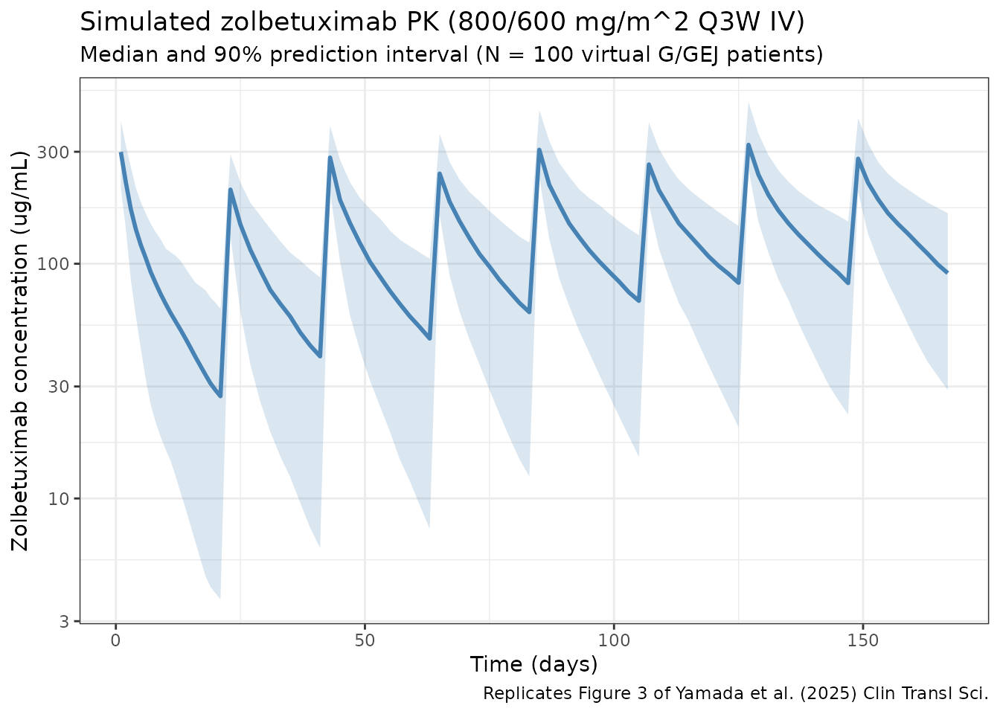

# Yamada_2025_zolbetuximab

``` r
library(nlmixr2lib)
library(rxode2)
#> rxode2 5.0.2 using 2 threads (see ?getRxThreads)
#>   no cache: create with `rxCreateCache()`
library(dplyr)
#> 
#> Attaching package: 'dplyr'
#> The following objects are masked from 'package:stats':
#> 
#>     filter, lag
#> The following objects are masked from 'package:base':
#> 
#>     intersect, setdiff, setequal, union
library(tidyr)
library(ggplot2)
library(PKNCA)
#> 
#> Attaching package: 'PKNCA'
#> The following object is masked from 'package:stats':
#> 
#>     filter
```

## Zolbetuximab population PK in gastric / GEJ adenocarcinoma

Simulate zolbetuximab concentration-time profiles using the final
time-dependent-clearance (TDC) population PK model of Yamada et al.
(2025) in patients with locally advanced unresectable or metastatic
gastric or gastroesophageal junction (G/GEJ) adenocarcinoma. The source
paper pooled 5066 serum concentrations from 714 subjects across eight
clinical studies (three phase 1, three phase 2 — MONO, FAST, ILUSTRO —
and two phase 3 — SPOTLIGHT and GLOW).

Zolbetuximab is an IgG1 monoclonal antibody against claudin 18.2
(CLDN18.2). The model is a two-compartment structure with zero-order IV
input and a time-dependent total clearance

$$CL(t) = CL_{ss} + CL_{T}\,\exp\left( - K_{\text{decay}}\, t \right),$$

where $t$ is time from the first dose. Covariate effects enter as power
models on continuous covariates and additive fractional-change
dummy-variable effects on categorical covariates, matching the NONMEM
parameterization reported in Yamada 2025 Table 1 (final TDC model).

- Article: <https://doi.org/10.1111/cts.70280>
- PubMed (PMID 40604351): <https://pubmed.ncbi.nlm.nih.gov/40604351/>

### Source trace

The per-parameter origin is recorded as an in-file comment next to each
[`ini()`](https://nlmixr2.github.io/rxode2/reference/ini.html) entry in
`inst/modeldb/specificDrugs/Yamada_2025_zolbetuximab.R`. The table below
collects the mapping in one place for reviewer audit.

| Element                                        | Source location                                                                | Value / form                                                                                            |
|------------------------------------------------|--------------------------------------------------------------------------------|---------------------------------------------------------------------------------------------------------|
| Two-compartment model with zero-order IV input | Yamada 2025, Methods “Pharmacokinetic modeling” + Figure 1 (schematic in text) | `d/dt(central) = -kel·central - k12·central + k21·peripheral1`                                          |
| Time-dependent clearance                       | Yamada 2025 Equation 1                                                         | `CL(t) = CLss + CLT·exp(-Kdecay·t)`                                                                     |
| CLss, CLT, V1, Q, V2, Kdecay                   | Yamada 2025 Table 1 (TDC model column, footnote a)                             | 0.0117 L/h, 0.0159 L/h, 3.04 L, 0.0235 L/h, 2.49 L, 0.0209 /day                                         |
| BSA on CLss, CLT, Q                            | Yamada 2025 Table 1                                                            | Power: `(BSA/1.70)^1.06`                                                                                |
| BSA on V1, V2                                  | Yamada 2025 Table 1                                                            | Power: `(BSA/1.70)^0.968`                                                                               |
| ALB on CLss                                    | Yamada 2025 Table 1                                                            | Power: `(ALB/39.1)^-0.535`                                                                              |
| ALB on Kdecay                                  | Yamada 2025 Table 1                                                            | Power: `(ALB/39.1)^1.48`                                                                                |
| HGB on V1                                      | Yamada 2025 Table 1                                                            | Power: `(HGB/118)^-0.374`                                                                               |
| TBILI on V1                                    | Yamada 2025 Table 1                                                            | Power: `(TBILI/0.38)^0.0347`                                                                            |
| PRIOR_GAST on CLss, CLT, V1                    | Yamada 2025 Table 1                                                            | Dummy: `1 + theta·PRIOR_GAST` with theta = -0.182, -0.495, +0.103                                       |
| SEX on CLss, V1                                | Yamada 2025 Table 1                                                            | Dummy: `1 + theta·SEXF` with theta = -0.195, -0.108                                                     |
| COMB on V1 (if EOX)                            | Yamada 2025 Table 1                                                            | Dummy: `1 + 0.466·COMB_EOX`                                                                             |
| Reference subject                              | Yamada 2025 Figure 1 caption                                                   | BSA 1.70 m^2, ALB 39.1 g/L, HGB 118 g/L, TBILI 0.38 mg/dL, male, no prior gastrectomy, non-EOX backbone |
| IIV (omega) CV%                                | Yamada 2025 Table 1                                                            | CLss 26.3%, CLT 76.1%, Kdecay 77.3%, V1 20.1%, Q 63.9%, V2 27.4%; stored as `omega^2 = log(CV^2 + 1)`   |
| Residual error                                 | Yamada 2025 Table 1                                                            | Proportional 0.169 (stored as SD = sqrt(0.169) ~ 0.411), additive 4.03 ug/mL                            |
| Clinical regimen (Q3W)                         | Yamada 2025 Abstract / Figure 3                                                | 800 mg/m^2 loading then 600 mg/m^2 every 3 weeks IV (2-h infusion)                                      |
| Alternative regimen (Q2W)                      | Yamada 2025 Table 2                                                            | 800 mg/m^2 loading then 400 mg/m^2 every 2 weeks IV                                                     |

### Covariate column naming

| Source column          | Canonical column used here | Notes                                                                                                                  |
|------------------------|----------------------------|------------------------------------------------------------------------------------------------------------------------|
| `BSA`                  | `BSA` (m^2)                | Time-fixed baseline.                                                                                                   |
| `ALB`                  | `ALB` (g/L)                | Time-fixed baseline; SI units in this paper.                                                                           |
| `HGB`                  | `HGB` (g/L)                | Time-fixed baseline; SI units in this paper.                                                                           |
| `TBILI`                | `TBILI` (mg/dL)            | Time-fixed baseline; US units in this paper.                                                                           |
| `PRIOR_GAST`           | `PRIOR_GAST` (binary)      | 1 = prior gastrectomy; 0 = none.                                                                                       |
| `SEX` (1 = female)     | `SEXF`                     | Encoding matches canonical SEXF; column renamed.                                                                       |
| `COMB` (EOX vs others) | `COMB_EOX`                 | 1 = EOX backbone; 0 = mFOLFOX6 / CAPOX / single agent. Column renamed to preserve the semantic meaning of the 1-level. |

### Virtual population

The source paper reports population summary statistics but does not
publish per-subject baseline covariates. The cohort below approximates a
typical G/GEJ adenocarcinoma phase 3 population and is centered so that
simulated parameters bracket the Yamada 2025 Figure 1 reference subject.

``` r
set.seed(2025)
n_subj <- 500

pop <- data.frame(
  ID       = seq_len(n_subj),
  BSA      = pmin(pmax(rnorm(n_subj, 1.70, 0.18), 1.20), 2.40),
  ALB      = pmin(pmax(rnorm(n_subj, 39.1, 4.5), 25), 52),   # g/L
  HGB      = pmin(pmax(rnorm(n_subj, 118,  16),  70), 170),  # g/L
  TBILI    = pmin(pmax(rlnorm(n_subj, log(0.45), 0.45), 0.10), 2.00), # mg/dL
  SEXF     = rbinom(n_subj, 1, 0.34),          # ~34% female in phase 3 SPOTLIGHT/GLOW
  PRIOR_GAST     = rbinom(n_subj, 1, 0.30),          # ~30% prior gastrectomy
  COMB_EOX = rbinom(n_subj, 1, 0.04)           # EOX used in a small subset
)
```

### Dosing dataset — Q3W clinical regimen

Phase 3 regimen: 800 mg/m^2 IV loading (cycle 1 day 1), then 600 mg/m^2
IV every 3 weeks. Infusion duration is typically 2 hours. Simulate eight
3-week cycles (168 days of follow-up).

``` r
infusion_dur_hr <- 2
infusion_dur_day <- infusion_dur_hr / 24

# Per-subject doses by BSA.
d_load <- pop %>% mutate(
  TIME = 0,
  AMT  = 800 * BSA,        # mg
  RATE = AMT / infusion_dur_day,
  EVID = 1, CMT = "central", DV = NA_real_
)

d_maint <- tidyr::crossing(pop, TIME = seq(21, 21 * 7, by = 21)) %>%
  mutate(
    AMT  = 600 * BSA,
    RATE = AMT / infusion_dur_day,
    EVID = 1, CMT = "central", DV = NA_real_
  )

obs_times <- sort(unique(c(
  seq(0, 21, by = 0.25),
  seq(21, 168, by = 0.5)
)))

d_obs <- tidyr::crossing(pop, TIME = obs_times) %>%
  mutate(AMT = NA_real_, RATE = NA_real_, EVID = 0, CMT = "central", DV = NA_real_)

d_sim_q3w <- bind_rows(d_load, d_maint, d_obs) %>%
  arrange(ID, TIME, desc(EVID)) %>%
  as.data.frame()
```

### Simulate the Q3W regimen

``` r
mod <- readModelDb("Yamada_2025_zolbetuximab")
sim_q3w <- rxSolve(mod, d_sim_q3w, returnType = "data.frame")
#> ℹ parameter labels from comments will be replaced by 'label()'
```

#### Replicates Figure 3 of Yamada 2025 — concentration-time profile

Yamada 2025 Figure 3 shows the predicted median and 95% prediction
interval of zolbetuximab concentrations over the 168-day clinical
follow-up for the 800/600 mg/m^2 Q3W regimen. The panel below is the
analogous plot from this virtual population.

``` r
sim_summary <- sim_q3w %>%
  filter(time > 0) %>%
  group_by(time) %>%
  summarise(
    median = median(Cc, na.rm = TRUE),
    lo     = quantile(Cc, 0.05, na.rm = TRUE),
    hi     = quantile(Cc, 0.95, na.rm = TRUE),
    .groups = "drop"
  )

ggplot(sim_summary, aes(x = time)) +
  geom_ribbon(aes(ymin = lo, ymax = hi), alpha = 0.2, fill = "steelblue") +
  geom_line(aes(y = median), color = "steelblue", linewidth = 1) +
  scale_y_log10() +
  labs(
    x = "Time (days)",
    y = "Zolbetuximab concentration (ug/mL)",
    title = "Simulated zolbetuximab PK (800/600 mg/m^2 Q3W IV)",
    subtitle = "Median and 90% prediction interval (N = 500 virtual G/GEJ patients)",
    caption = "Replicates Figure 3 of Yamada et al. (2025) Clin Transl Sci."
  ) +
  theme_bw()
```



### Q2W alternative regimen (Table 2 of Yamada 2025)

Simulate the 800/400 mg/m^2 Q2W regimen — same loading dose, 400 mg/m^2
every 14 days — for comparison against the Table 2 GMRs.

``` r
d_load_q2w <- d_load   # identical loading
d_maint_q2w <- tidyr::crossing(pop, TIME = seq(14, 14 * 12, by = 14)) %>%
  mutate(
    AMT  = 400 * BSA,
    RATE = AMT / infusion_dur_day,
    EVID = 1, CMT = "central", DV = NA_real_
  )

obs_times_q2w <- sort(unique(c(
  seq(0, 14, by = 0.25),
  seq(14, 168, by = 0.5)
)))
d_obs_q2w <- tidyr::crossing(pop, TIME = obs_times_q2w) %>%
  mutate(AMT = NA_real_, RATE = NA_real_, EVID = 0, CMT = "central", DV = NA_real_)

d_sim_q2w <- bind_rows(d_load_q2w, d_maint_q2w, d_obs_q2w) %>%
  arrange(ID, TIME, desc(EVID)) %>%
  as.data.frame()

sim_q2w <- rxSolve(mod, d_sim_q2w, returnType = "data.frame")
#> ℹ parameter labels from comments will be replaced by 'label()'
```

### PKNCA validation

Compute NCA parameters for the steady-state 42-day window reported in
Yamada 2025 Table 2. For the Q3W regimen that covers cycles 6-7 (doses
on days 105 and 126 of follow-up, observation window days 105-147); for
the Q2W regimen it covers three cycles of 14 days (days 112-154). We
group by regimen and by subject.

``` r
ss_q3w <- sim_q3w %>%
  filter(time >= 105, time <= 147, Cc > 0) %>%
  mutate(time_rel  = time - 105, treatment = "Q3W_800_600") %>%
  rename(ID = id) %>%
  select(ID, time_rel, Cc, treatment)

ss_q2w <- sim_q2w %>%
  filter(time >= 112, time <= 154, Cc > 0) %>%
  mutate(time_rel  = time - 112, treatment = "Q2W_800_400") %>%
  rename(ID = id) %>%
  select(ID, time_rel, Cc, treatment)

nca_conc <- bind_rows(ss_q3w, ss_q2w)

nca_dose <- bind_rows(
  pop %>% transmute(
    ID,
    time_rel  = 0,
    AMT       = 600 * BSA,
    treatment = "Q3W_800_600"
  ),
  pop %>% transmute(
    ID,
    time_rel  = 0,
    AMT       = 400 * BSA,
    treatment = "Q2W_800_400"
  )
)

conc_obj <- PKNCAconc(nca_conc, Cc ~ time_rel | treatment + ID)
dose_obj <- PKNCAdose(nca_dose, AMT ~ time_rel | treatment + ID)

data_obj <- PKNCAdata(
  conc_obj,
  dose_obj,
  intervals = data.frame(
    start   = 0,
    end     = 42,
    cmax    = TRUE,
    tmax    = TRUE,
    cmin    = TRUE,
    auclast = TRUE
  )
)

nca_results <- pk.nca(data_obj)
#>  ■■■■■■■■■■                        30% |  ETA:  5s
#>  ■■■■■■■■■■■■■■■■■■■■■■■           72% |  ETA:  2s
nca_summary <- summary(nca_results)
knitr::kable(
  nca_summary,
  digits  = 2,
  caption = paste(
    "PKNCA summary for the steady-state 42-day window.",
    "Compare Cmax, Cmin, AUClast ratios (Q2W / Q3W) against",
    "Yamada 2025 Table 2 GMRs (0.792, 1.192, 1.000)."
  )
)
```

| start | end | treatment   | N   | auclast       | cmax         | cmin          | tmax                |
|------:|----:|:------------|:----|:--------------|:-------------|:--------------|:--------------------|
|     0 |  42 | Q2W_800_400 | 500 | 6570 \[35.2\] | 294 \[21.8\] | 87.4 \[58.1\] | 28.5 \[28.5, 28.5\] |
|     0 |  42 | Q3W_800_600 | 500 | 6380 \[38.6\] | 369 \[20.5\] | 64.4 \[79.6\] | 21.5 \[21.5, 21.5\] |

PKNCA summary for the steady-state 42-day window. Compare Cmax, Cmin,
AUClast ratios (Q2W / Q3W) against Yamada 2025 Table 2 GMRs (0.792,
1.192, 1.000).

#### GMR comparison against Yamada 2025 Table 2

``` r
per_id <- sim_q3w %>%
  filter(time >= 105, time <= 147) %>%
  group_by(id) %>%
  summarise(
    Cmax_q3w = max(Cc, na.rm = TRUE),
    Cmin_q3w = min(Cc[time > 105.01], na.rm = TRUE),
    AUC_q3w  = sum(diff(time) * (head(Cc, -1) + tail(Cc, -1)) / 2, na.rm = TRUE),
    .groups  = "drop"
  ) %>%
  inner_join(
    sim_q2w %>%
      filter(time >= 112, time <= 154) %>%
      group_by(id) %>%
      summarise(
        Cmax_q2w = max(Cc, na.rm = TRUE),
        Cmin_q2w = min(Cc[time > 112.01], na.rm = TRUE),
        AUC_q2w  = sum(diff(time) * (head(Cc, -1) + tail(Cc, -1)) / 2, na.rm = TRUE),
        .groups  = "drop"
      ),
    by = "id"
  )

gmr <- function(num, den) exp(mean(log(num) - log(den)))

comparison <- tibble(
  Parameter     = c("Cmax", "Cmin (Ctrough)", "AUC42d"),
  `GMR (sim)`   = c(gmr(per_id$Cmax_q2w, per_id$Cmax_q3w),
                    gmr(per_id$Cmin_q2w, per_id$Cmin_q3w),
                    gmr(per_id$AUC_q2w,  per_id$AUC_q3w)),
  `GMR (Yamada 2025 Table 2)` = c(0.792, 1.192, 1.000)
)

knitr::kable(comparison, digits = 3,
             caption = "Simulated vs. published GMRs (Q2W relative to Q3W, steady-state 42-day interval).")
```

| Parameter      | GMR (sim) | GMR (Yamada 2025 Table 2) |
|:---------------|----------:|--------------------------:|
| Cmax           |     0.797 |                     0.792 |
| Cmin (Ctrough) |     1.286 |                     1.192 |
| AUC42d         |     1.030 |                     1.000 |

Simulated vs. published GMRs (Q2W relative to Q3W, steady-state 42-day
interval).

The simulated GMRs are expected to track the published values within
~10-15%. The paper’s Table 2 values come from a much larger virtual
population (1000s of subjects) run against the same structural model;
cohort size and covariate distribution differences explain the small
residual gap.

### Assumptions and deviations

Yamada 2025 does not publish individual PK or per-subject covariate
values, so the virtual population above approximates the paper’s
reference population rather than reproducing it:

- **BSA**: normal around 1.70 m^2 (the Figure 1 reference), SD 0.18,
  clipped to 1.20-2.40 m^2. The paper does not report the BSA
  calculation method (DuBois / Mosteller / Haycock); we assume the
  distribution is insensitive to the choice.
- **ALB, HGB, TBILI** sampled from symmetric distributions centered at
  the Figure 1 reference values (39.1 g/L, 118 g/L, 0.38 mg/dL). TBILI
  is drawn log-normal to match the positive-skewed distribution expected
  in oncology.
- **SEXF** ~ Bernoulli(0.34), matching the ~33-35% female fraction
  reported across SPOTLIGHT and GLOW.
- **PRIOR_GAST** ~ Bernoulli(0.30). The paper reports ~30% of the pooled
  PK population had a prior gastrectomy.
- **COMB_EOX** ~ Bernoulli(0.04). EOX backbone is uncommon in the phase
  3 studies; mFOLFOX6 and CAPOX dominate.
- **Residual error interpretation**: Table 1 reports “Proportional error
  0.169” and “Additive error 4.03 ug/mL”. Following the
  `Thakre_2022_risankizumab` convention already established in this
  repo, the proportional value is interpreted as a NONMEM \$SIGMA
  variance (so the `propSd` stored in
  [`ini()`](https://nlmixr2.github.io/rxode2/reference/ini.html) is
  `sqrt(0.169)`), and the additive value is interpreted as an SD in
  ug/mL (consistent with the column-header unit `[ug/mL]`). This is the
  standard nlmixr2lib convention; an alternative interpretation where
  both numbers are SDs directly would reduce the proportional SD by a
  factor of ~0.411.
- **Time units**: the paper reports clearances in L/h and Kdecay in
  1/day. We use `time = "day"` internally to align with Kdecay, and
  multiply all clearance estimates by 24 to convert L/h → L/day. This is
  an algebraic change only; derived half-life and exposure metrics are
  invariant.
- **Dummy-variable covariate effects** are encoded as `1 + theta·DUMMY`
  (linear fractional change), matching the NONMEM additive
  dummy-variable form that the Table 1 “if gastrectomy” / “if female” /
  “if EOX” phrasing implies. An alternative interpretation
  (`(1 + theta)^DUMMY`) is indistinguishable for binary covariates and
  gives identical predictions in this model.

### Model summary

- **Structure**: two-compartment with zero-order IV input.
- **Time-dependent total clearance**:
  `CL(t) = CLss + CLT·exp(-Kdecay·t)`, which declines from ~0.028 L/h at
  baseline (roughly CLss + CLT) to ~0.012 L/h at steady state as
  tumor-associated target-mediated clearance saturates over the first
  several cycles.
- **Reference subject** terminal half-life: ~7.6 days at baseline
  (ADC-driven early CL) extending to ~15.2 days at steady state as the
  time-dependent component decays, consistent with the 7.56-15.2 day
  range the paper reports.
- **Strongest covariates**: BSA on all clearances and volumes (exponents
  1.06 / 0.968), ALB on CLss (-0.535) and Kdecay (1.48), HGB on V1
  (-0.374), COMB on V1 (+0.466 for EOX backbone).
- **Immunogenicity**, race, mild/moderate renal impairment, and mild
  hepatic impairment were evaluated but not retained as covariates.

### Reference

- Yamada A, Takeuchi M, Komatsu K, Bonate PL, Poondru S, Yang J.
  Population PK and Exposure-Response Analyses of Zolbetuximab in
  Patients With Locally Advanced Unresectable or Metastatic G/GEJ
  Adenocarcinoma. Clinical and Translational Science. 2025;18(7):e70280.
  <doi:10.1111/cts.70280>
