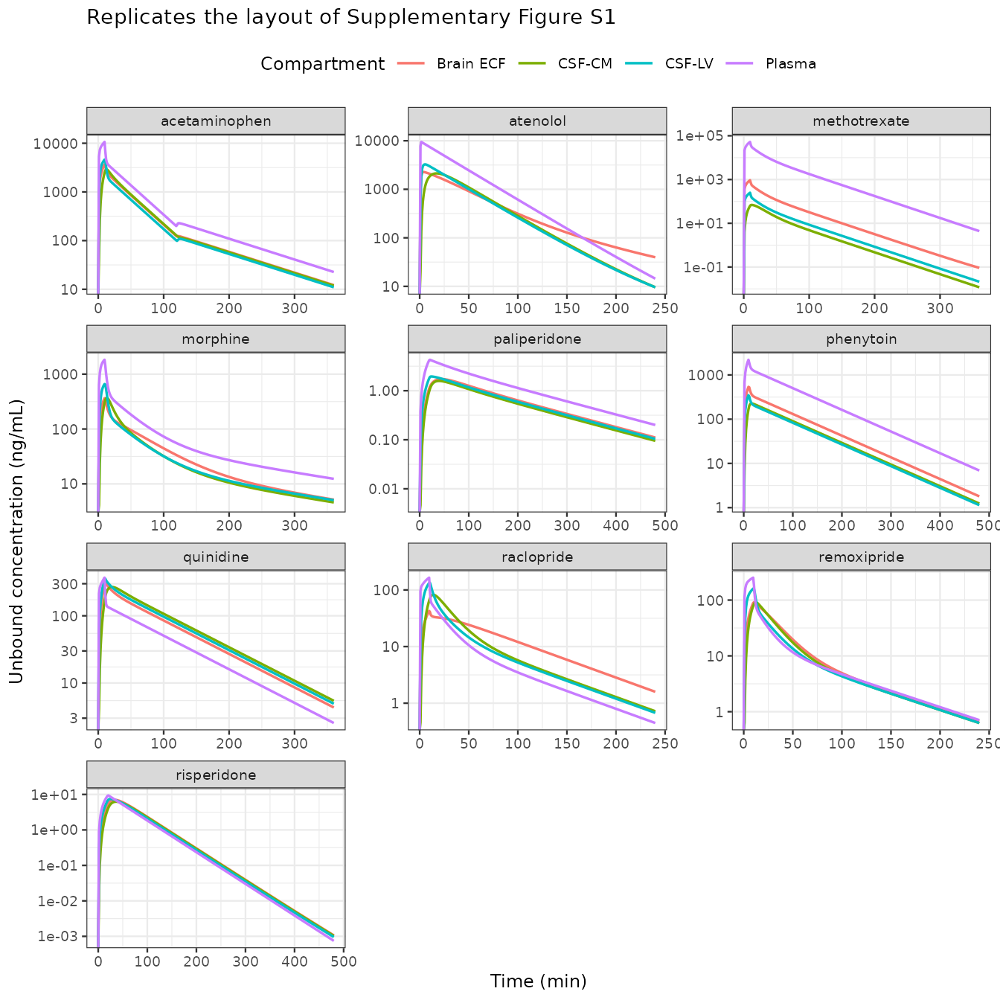
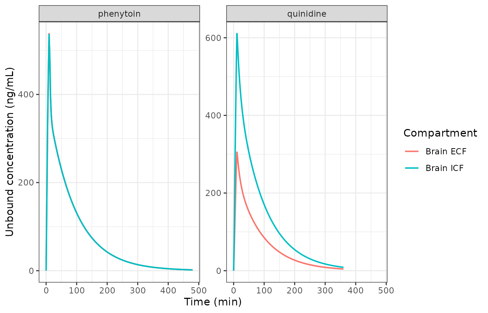
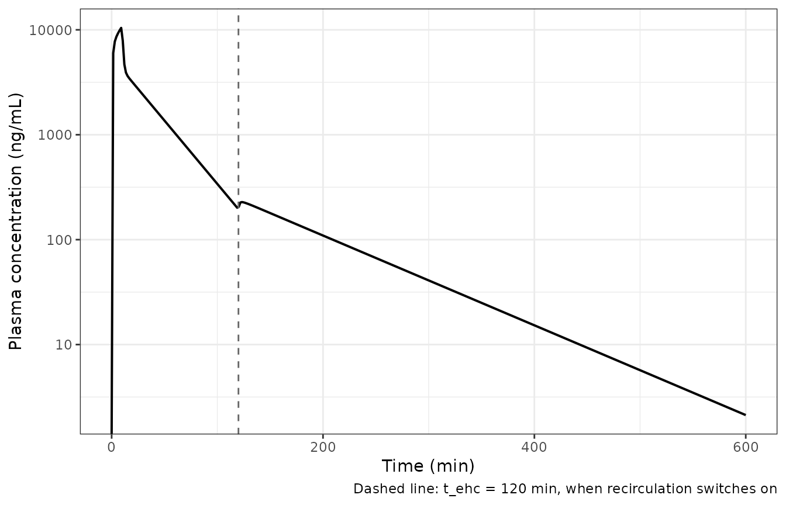
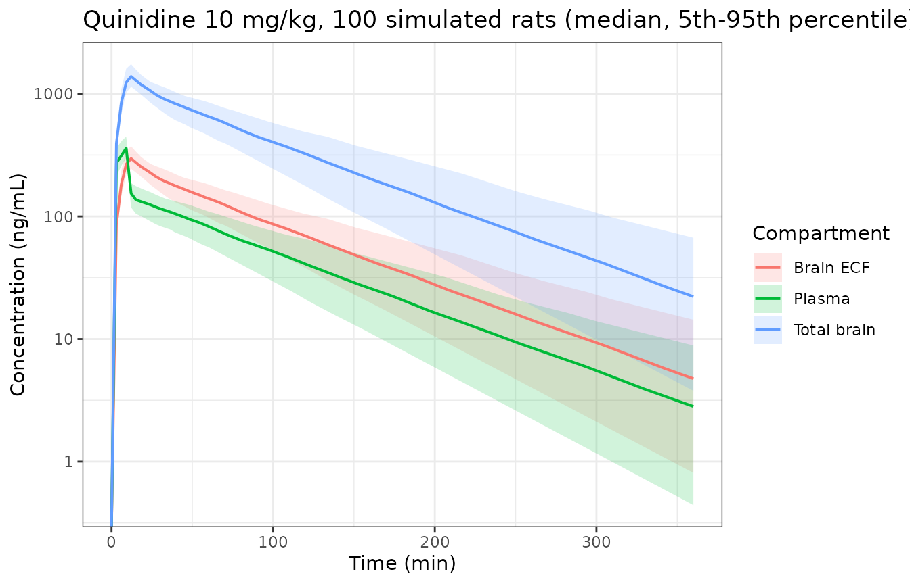

# Rat CNS PBPK for ten drugs (Yamamoto 2017)

``` r

library(nlmixr2lib)
library(rxode2)
library(PKNCA)
library(dplyr)
library(tidyr)
library(ggplot2)
```

## The paper

Yamamoto and colleagues built a generic, physiologically based model of
drug distribution into the rat central nervous system (CNS) and then,
without fitting anything to the CNS data, used it to *predict*
concentration-time profiles for ten structurally diverse small molecules
in brain extracellular fluid (brain ECF), two cerebrospinal-fluid (CSF)
sites and total brain tissue.

> Yamamoto Y, Valitalo PA, Huntjens DR, Proost JH, Vermeulen A,
> Krauwinkel W, Beukers MW, van den Berg DJ, Hartman R, Wong YC, Danhof
> M, van Hasselt JGC, de Lange ECM. Predicting Drug Concentration-Time
> Profiles in Multiple CNS Compartments Using a Comprehensive
> Physiologically-Based Pharmacokinetic Model. *CPT Pharmacometrics Syst
> Pharmacol.* 2017;6(11):765-777.
> [doi:10.1002/psp4.12250](https://doi.org/10.1002/psp4.12250)

The model is the first release of what the same Leiden group later
called LeiCNS-PK; the mouse successor is already in this package as the
`Saleh_2023_*_mouse_pbpk` family.

What makes the paper unusually reproducible is that **every CNS
parameter is either a rat physiological constant (Table 3) or an
in-silico prediction from the compound’s molecular weight, logP and pKa
(Table 4)**. Nothing in the CNS half of the model was estimated. Only
the plasma side – an empirical one-, two- or three-compartment model per
drug – was fitted, in NONMEM 7.3 (Table 2). The eleven NONMEM control
streams are published verbatim as Supplementary Material S3-S13, which
is what this extraction is transcribed from.

## Model structure

Nine CNS states sit downstream of the plasma model:

| State            | Compartment                   | Rat volume (Table 3) |
|------------------|-------------------------------|----------------------|
| `brain_vascular` | brain microvasculature        | 60 uL                |
| `brain_ecf`      | brain extracellular fluid     | 290 uL               |
| `brain_icf`      | brain intracellular fluid     | 1440 uL              |
| `brain_lysosome` | lysosomes                     | 18 uL                |
| `brain_csf_lv`   | CSF, lateral ventricle        | 50 uL                |
| `brain_csf_tfv`  | CSF, third + fourth ventricle | 50 uL                |
| `brain_csf_cm`   | CSF, cisterna magna           | 17 uL                |
| `brain_csf_sas`  | CSF, subarachnoid space       | 180 uL               |

Plasma exchanges with `brain_vascular` at cerebral blood flow (1.2
mL/min). `brain_vascular` is the donor compartment for **both**
barriers: the blood-brain barrier into `brain_ecf`, and the blood-CSF
barrier into `brain_csf_lv` and `brain_csf_tfv`. The CSF then flows in
series (LV -\> TFV -\> CM -\> SAS) and returns to `brain_vascular`, so
the CNS subsystem is closed – no drug is eliminated inside the brain.

Each barrier clearance is the sum of two routes (Eqs. 3-5):

- **paracellular**, `Qp = (Daq / width) * SA_para`, open only on the
  0.006 % (BBB) or 0.016 % (BCSFB) of surface area that tight junctions
  leave free;
- **transcellular**, `Qt = 0.5 * P0 * SA_trans`, on the remaining 99.8
  %, with the factor 0.5 correcting for passage across two membranes.

Net active transport is folded into *asymmetry factors* (`AFin1-3`,
`AFout1-3`) that multiply the transcellular term only, and pH
partitioning into *pH-dependent factors* (`PHF1-7`) that scale each
efflux clearance by the ratio of uncharged fractions.

## The ten models

Each drug is a separate model file, because each carries its own plasma
model and its own set of drug-specific CNS parameters.

``` r

drugs <- c(
  "acetaminophen", "atenolol", "methotrexate", "morphine", "paliperidone",
  "phenytoin", "quinidine", "raclopride", "remoxipride", "risperidone"
)
model_names <- paste0("Yamamoto_2017_", drugs, "_rat_pbpk")
# modellib() returns the model function; rxode2() parses it into the rxUi
# object that rxSolve() and the $theta / $state accessors need.
models <- lapply(model_names, function(nm) suppressWarnings(rxode2(modellib(nm))))
#> ℹ parameter labels from comments will be replaced by 'label()'
#> ℹ parameter labels from comments will be replaced by 'label()'
#> ℹ parameter labels from comments will be replaced by 'label()'
#> ℹ parameter labels from comments will be replaced by 'label()'
#> ℹ parameter labels from comments will be replaced by 'label()'
#> ℹ parameter labels from comments will be replaced by 'label()'
#> ℹ parameter labels from comments will be replaced by 'label()'
#> ℹ parameter labels from comments will be replaced by 'label()'
#> ℹ parameter labels from comments will be replaced by 'label()'
names(models) <- drugs
data.frame(
  Drug = drugs,
  `Model file` = paste0(model_names, ".R"),
  `ODE states` = vapply(models, function(m) length(m$state), integer(1)),
  check.names = FALSE
) |>
  knitr::kable(row.names = FALSE)
```

| Drug          | Model file                             | ODE states |
|:--------------|:---------------------------------------|-----------:|
| acetaminophen | Yamamoto_2017_acetaminophen_rat_pbpk.R |         11 |
| atenolol      | Yamamoto_2017_atenolol_rat_pbpk.R      |          9 |
| methotrexate  | Yamamoto_2017_methotrexate_rat_pbpk.R  |         11 |
| morphine      | Yamamoto_2017_morphine_rat_pbpk.R      |         11 |
| paliperidone  | Yamamoto_2017_paliperidone_rat_pbpk.R  |         10 |
| phenytoin     | Yamamoto_2017_phenytoin_rat_pbpk.R     |         10 |
| quinidine     | Yamamoto_2017_quinidine_rat_pbpk.R     |         10 |
| raclopride    | Yamamoto_2017_raclopride_rat_pbpk.R    |         11 |
| remoxipride   | Yamamoto_2017_remoxipride_rat_pbpk.R   |         11 |
| risperidone   | Yamamoto_2017_risperidone_rat_pbpk.R   |          9 |

`quinidine` is shown in full:

``` r

models$quinidine
#>  ── rxode2-based free-form 10-cmt ODE model ───────────────────────────────────── 
#>  ── Initalization: ──  
#> Fixed Effects ($theta): 
#>          lcl          lvc           lq          lvp       propSd           P0 
#>     5.087596     6.507278     6.720220     9.332558     0.245000     0.058000 
#>          Daq        AFin1        AFin2        AFin3       AFout1       AFout2 
#>     0.000320     1.200000     1.400000     1.400000     1.000000     1.000000 
#>       AFout3         PHF1         PHF2         PHF3         PHF4         PHF5 
#>     1.000000     0.800000     0.800000     0.800000     0.800000     0.400000 
#>         PHF6         PHF7           BF        V_TOT        V_ECF        V_ICF 
#>     0.400000     0.004100     7.200000     1.880000     0.290000     1.440000 
#>        V_LYS         V_LV        V_TFV         V_CM        V_SAS         V_MV 
#>     0.018000     0.050000     0.050000     0.017000     0.180000     0.060000 
#>        Q_CBF        Q_ECF        Q_CSF       SA_BBB    SA_BCSFB1    SA_BCSFB2 
#>     1.200000     0.000200     0.002200   263.000000    12.500000    12.500000 
#>       SA_BCM      SA_LYSO      f_trans   f_para_BBB f_para_BCSFB        w_BBB 
#>  3000.000000  1440.000000     0.998000     0.000060     0.000160     0.000050 
#> 
#> Omega ($omega): 
#>        etalcl etalq etalvp
#> etalcl 0.0571 0.000 0.0000
#> etalq  0.0000 0.059 0.0000
#> etalvp 0.0000 0.000 0.0164
#> attr(,"lotriLabels")
#> [1] "Table 2 CV 23.9 percent" "Table 2 CV 24.3 percent"
#> [3] "Table 2 CV 12.8 percent"
#> attr(,"lotriFix")
#>        etalcl etalq etalvp
#> etalcl  FALSE FALSE  FALSE
#> etalq   FALSE FALSE  FALSE
#> etalvp  FALSE FALSE  FALSE
#> 
#> States ($state or $stateDf): 
#>    Compartment Number Compartment Name
#> 1                   1          central
#> 2                   2      peripheral1
#> 3                   3   brain_vascular
#> 4                   4        brain_ecf
#> 5                   5        brain_icf
#> 6                   6   brain_lysosome
#> 7                   7     brain_csf_lv
#> 8                   8    brain_csf_tfv
#> 9                   9     brain_csf_cm
#> 10                 10    brain_csf_sas
#>  ── μ-referencing ($muRefTable): ──  
#>   theta    eta level covariates
#> 1   lcl etalcl    id           
#> 2    lq  etalq    id           
#> 3   lvp etalvp    id           
#> 
#>  ── Model (Normalized Syntax): ── 
#> function() {
#>     compartmentData <- list(central = list(analyte = "quinidine", 
#>         units = "ng", specimen = "plasma", verified = TRUE), 
#>         peripheral1 = list(analyte = "quinidine", units = "ng", 
#>             specimen = "tissue", verified = TRUE), brain_vascular = list(analyte = "quinidine", 
#>             units = "ng", specimen = "plasma", verified = TRUE), 
#>         brain_ecf = list(analyte = "quinidine", units = "ng", 
#>             specimen = "brain ISF", verified = TRUE), brain_icf = list(analyte = "quinidine", 
#>             units = "ng", specimen = "tissue", verified = TRUE), 
#>         brain_lysosome = list(analyte = "quinidine", units = "ng", 
#>             specimen = "tissue", verified = TRUE), brain_csf_lv = list(analyte = "quinidine", 
#>             units = "ng", specimen = "CSF", verified = TRUE), 
#>         brain_csf_tfv = list(analyte = "quinidine", units = "ng", 
#>             specimen = "CSF", verified = TRUE), brain_csf_cm = list(analyte = "quinidine", 
#>             units = "ng", specimen = "CSF", verified = TRUE), 
#>         brain_csf_sas = list(analyte = "quinidine", units = "ng", 
#>             specimen = "CSF", verified = TRUE))
#>     description <- "PBPK (LeiCNS-PK1.0 comprehensive CNS physiologically-based model). Preclinical (rat, male Wistar). Quinidine disposition in plasma and nine CNS compartments: brain microvasculature, brain extracellular fluid, brain intracellular fluid, lysosomes, and the four cerebrospinal-fluid spaces (lateral ventricle, third + fourth ventricle, cisterna magna, subarachnoid space) draining in series back to the brain microvasculature. Transport across the blood-brain barrier and the blood-CSF barrier is the sum of a paracellular clearance (aqueous diffusivity over barrier width, on the 0.006-0.016 percent of surface area left open by tight junctions) and a transcellular clearance (transmembrane permeability on the remaining 99.8 percent), with net active transport carried by asymmetry factors and pH partitioning by pH-dependent factors. The plasma side is the empirical two-compartment model of Table 2, fitted by the authors in NONMEM 7.3; every CNS parameter is fixed to rat physiology (Table 3) or to the compound's physicochemical properties (Tables 4 and 5) and none was fitted to the CNS data, so the CNS profiles are genuine predictions. The most lipophilic compound in the set and the one the paper uses to illustrate cerebral-blood-flow-limited transport: its BBB clearances exceed Q_CBF = 1.2 mL/min, so brain uptake is perfusion- rather than permeability-limited. The only compound with net active influx (Kp,uu > 1), so its asymmetry factors sit on the influx side."
#>     population <- list(species = "rat (male Wistar)", n_subjects = 41, 
#>         weight_range = "225-275 g (Supplementary Material S2)", 
#>         disease_state = "healthy", dose_range = "10 and 20 mg/kg (10 min infusion), intravenous", 
#>         notes = "Study design from Table 1: 41 animals, 10 and 20 mg/kg (10 min infusion), data from reference 28 (Westerhout 2013). Plasma and brain microdialysis (brain extracellular fluid and CSF) samples were collected after femoral-vein administration; see Supplementary Material S2 for surgery and bioanalysis. Concentrations in the CNS compartments are unbound concentrations.")
#>     reference <- "Yamamoto Y, Valitalo PA, Huntjens DR, Proost JH, Vermeulen A, Krauwinkel W, Beukers MW, van den Berg DJ, Hartman R, Wong YC, Danhof M, van Hasselt JGC, de Lange ECM. Predicting Drug Concentration-Time Profiles in Multiple CNS Compartments Using a Comprehensive Physiologically-Based Pharmacokinetic Model. CPT Pharmacometrics Syst Pharmacol. 2017;6(11):765-777. doi:10.1002/psp4.12250. Model structure and all parameter values are from the main text (Tables 1-5) and the supplementary NONMEM control streams (Supplementary Material S3-S13); the asymmetry-factor and binding-factor closed forms are Supplementary Material S1."
#>     units <- list(time = "min", dosing = "ng", concentration = "ng/mL")
#>     vignette <- "Yamamoto_2017_cns_pbpk_rat"
#>     ini({
#>         lcl <- 5.08759633523238
#>         label("Plasma clearance (mL/min)")
#>         lvc <- 6.50727771238501
#>         label("Central volume of distribution (mL)")
#>         lq <- 6.7202201551353
#>         label("Intercompartmental clearance to peripheral 1 (mL/min)")
#>         lvp <- 9.33255800470043
#>         label("Peripheral 1 volume of distribution (mL)")
#>         propSd <- c(0, 0.245)
#>         label("Proportional residual error (fraction)")
#>         P0 <- fix(0.058)
#>         label("Transmembrane permeability (cm/min)")
#>         Daq <- fix(0.00032)
#>         label("Aqueous diffusivity coefficient (cm^2/min)")
#>         AFin1 <- fix(1.2)
#>         label("Asymmetry factor into brain extracellular fluid (unitless)")
#>         AFin2 <- fix(1.4)
#>         label("Asymmetry factor into lateral-ventricle CSF (unitless)")
#>         AFin3 <- fix(1.4)
#>         label("Asymmetry factor into third + fourth ventricle CSF (unitless)")
#>         AFout1 <- fix(1)
#>         label("Asymmetry factor out of brain extracellular fluid (unitless)")
#>         AFout2 <- fix(1)
#>         label("Asymmetry factor out of lateral-ventricle CSF (unitless)")
#>         AFout3 <- fix(1)
#>         label("Asymmetry factor out of third + fourth ventricle CSF (unitless)")
#>         PHF1 <- fix(0.8)
#>         label("pH-dependent factor, brain extracellular fluid to microvasculature (unitless)")
#>         PHF2 <- fix(0.8)
#>         label("pH-dependent factor, lateral-ventricle CSF to microvasculature (unitless)")
#>         PHF3 <- fix(0.8)
#>         label("pH-dependent factor, third + fourth ventricle CSF to microvasculature (unitless)")
#>         PHF4 <- fix(0.8)
#>         label("pH-dependent factor, brain extracellular to intracellular fluid (unitless)")
#>         PHF5 <- fix(0.4)
#>         label("pH-dependent factor, brain intracellular to extracellular fluid (unitless)")
#>         PHF6 <- fix(0.4)
#>         label("pH-dependent factor, brain intracellular fluid to lysosome (unitless)")
#>         PHF7 <- fix(0.0041)
#>         label("pH-dependent factor, lysosome to brain intracellular fluid (unitless)")
#>         BF <- fix(7.2)
#>         label("Brain-tissue binding factor (unitless)")
#>         V_TOT <- fix(1.88)
#>         label("Total brain volume (mL)")
#>         V_ECF <- fix(0.29)
#>         label("Brain extracellular fluid volume (mL)")
#>         V_ICF <- fix(1.44)
#>         label("Brain intracellular fluid volume (mL)")
#>         V_LYS <- fix(0.018)
#>         label("Total lysosomal volume (mL)")
#>         V_LV <- fix(0.05)
#>         label("Lateral-ventricle CSF volume (mL)")
#>         V_TFV <- fix(0.05)
#>         label("Third + fourth ventricle CSF volume (mL)")
#>         V_CM <- fix(0.017)
#>         label("Cisterna-magna CSF volume (mL)")
#>         V_SAS <- fix(0.18)
#>         label("Subarachnoid-space CSF volume (mL)")
#>         V_MV <- fix(0.06)
#>         label("Brain microvascular volume (mL)")
#>         Q_CBF <- fix(1.2)
#>         label("Cerebral blood flow (mL/min)")
#>         Q_ECF <- fix(2e-04)
#>         label("Brain extracellular-fluid bulk flow (mL/min)")
#>         Q_CSF <- fix(0.0022)
#>         label("Cerebrospinal-fluid flow (mL/min)")
#>         SA_BBB <- fix(263)
#>         label("Blood-brain barrier surface area (cm^2)")
#>         SA_BCSFB1 <- fix(12.5)
#>         label("BCSFB surface area around the lateral ventricle (cm^2)")
#>         SA_BCSFB2 <- fix(12.5)
#>         label("BCSFB surface area around the third + fourth ventricle (cm^2)")
#>         SA_BCM <- fix(3000)
#>         label("Total brain cell-membrane surface area (cm^2)")
#>         SA_LYSO <- fix(1440)
#>         label("Total lysosomal membrane surface area (cm^2)")
#>         f_trans <- fix(0.998)
#>         label("Transcellular effective surface-area fraction (unitless)")
#>         f_para_BBB <- fix(6e-05)
#>         label("Paracellular effective surface-area fraction, BBB (unitless)")
#>         f_para_BCSFB <- fix(0.00016)
#>         label("Paracellular effective surface-area fraction, BCSFB (unitless)")
#>         w_BBB <- fix(5e-05)
#>         label("Barrier width (cm)")
#>         etalcl ~ 0.0571
#>         label("Table 2 CV 23.9 percent")
#>         etalq ~ 0.059
#>         label("Table 2 CV 24.3 percent")
#>         etalvp ~ 0.0164
#>         label("Table 2 CV 12.8 percent")
#>     })
#>     model({
#>         cl <- exp(lcl + etalcl)
#>         vc <- exp(lvc)
#>         q <- exp(lq + etalq)
#>         vp <- exp(lvp + etalvp)
#>         Qp_BBB <- (Daq/w_BBB) * SA_BBB * f_para_BBB
#>         Qt_BBB <- 0.5 * P0 * SA_BBB * f_trans
#>         Qp_BCSFB1 <- (Daq/w_BBB) * SA_BCSFB1 * f_para_BCSFB
#>         Qt_BCSFB1 <- 0.5 * P0 * SA_BCSFB1 * f_trans
#>         Qp_BCSFB2 <- (Daq/w_BBB) * SA_BCSFB2 * f_para_BCSFB
#>         Qt_BCSFB2 <- 0.5 * P0 * SA_BCSFB2 * f_trans
#>         Q_BCM <- P0 * SA_BCM
#>         Q_LYSO <- P0 * SA_LYSO
#>         Q_BBB_in <- Qp_BBB + Qt_BBB * AFin1
#>         Q_BBB_out <- (Qp_BBB + Qt_BBB * AFout1) * PHF1
#>         Q_BCSFB1_in <- Qp_BCSFB1 + Qt_BCSFB1 * AFin2
#>         Q_BCSFB1_out <- (Qp_BCSFB1 + Qt_BCSFB1 * AFout2) * PHF2
#>         Q_BCSFB2_in <- Qp_BCSFB2 + Qt_BCSFB2 * AFin3
#>         Q_BCSFB2_out <- (Qp_BCSFB2 + Qt_BCSFB2 * AFout3) * PHF3
#>         C_PL <- central/vc
#>         C_MV <- brain_vascular/V_MV
#>         C_ECF <- brain_ecf/V_ECF
#>         C_ICF <- brain_icf/V_ICF
#>         C_LYS <- brain_lysosome/V_LYS
#>         C_LV <- brain_csf_lv/V_LV
#>         C_TFV <- brain_csf_tfv/V_TFV
#>         C_CM <- brain_csf_cm/V_CM
#>         C_SAS <- brain_csf_sas/V_SAS
#>         d/dt(central) <- -(cl/vc) * central - (q/vc) * central + 
#>             (q/vp) * peripheral1 - Q_CBF * C_PL + Q_CBF * C_MV
#>         d/dt(peripheral1) <- (q/vc) * central - (q/vp) * peripheral1
#>         d/dt(brain_vascular) <- Q_CBF * C_PL - Q_CBF * C_MV - 
#>             Q_BBB_in * C_MV + Q_BBB_out * C_ECF - Q_BCSFB1_in * 
#>             C_MV + Q_BCSFB1_out * C_LV - Q_BCSFB2_in * C_MV + 
#>             Q_BCSFB2_out * C_TFV + Q_CSF * C_SAS
#>         d/dt(brain_ecf) <- Q_BBB_in * C_MV - Q_BBB_out * C_ECF - 
#>             Q_BCM * PHF4 * C_ECF + Q_BCM * PHF5 * C_ICF - Q_ECF * 
#>             C_ECF
#>         d/dt(brain_icf) <- Q_BCM * PHF4 * C_ECF - Q_BCM * PHF5 * 
#>             C_ICF - Q_LYSO * PHF6 * C_ICF + Q_LYSO * PHF7 * C_LYS
#>         d/dt(brain_lysosome) <- Q_LYSO * PHF6 * C_ICF - Q_LYSO * 
#>             PHF7 * C_LYS
#>         d/dt(brain_csf_lv) <- Q_BCSFB1_in * C_MV - Q_BCSFB1_out * 
#>             C_LV + Q_ECF * C_ECF - Q_CSF * C_LV
#>         d/dt(brain_csf_tfv) <- Q_BCSFB2_in * C_MV - Q_BCSFB2_out * 
#>             C_TFV + Q_CSF * C_LV - Q_CSF * C_TFV
#>         d/dt(brain_csf_cm) <- Q_CSF * C_TFV - Q_CSF * C_CM
#>         d/dt(brain_csf_sas) <- Q_CSF * C_CM - Q_CSF * C_SAS
#>         Cc <- C_PL
#>         Cbrain_ecf <- C_ECF
#>         Cbrain_icf <- C_ICF
#>         Cbrain_csf_lv <- C_LV
#>         Cbrain_csf_cm <- C_CM
#>         Cbrain_total <- (brain_ecf * BF + brain_ecf + brain_icf + 
#>             brain_lysosome)/V_TOT
#>         Cc ~ prop(propSd)
#>     })
#> }
```

## Population

All ten datasets are male Wistar rats, 225-275 g, with femoral-artery
sampling and intracerebral / intraventricular microdialysis probes
(Supplementary Material S2). Table 1 of the paper gives the design per
drug.

``` r

tab1 <- tibble::tribble(
  ~Drug,            ~n,  ~`Dose (mg/kg)`,              ~`Infusion (min)`, ~`CNS sites sampled`,
  "Acetaminophen",  16L, "15",                         "10",  "ECF, CSF-LV, CSF-CM",
  "Atenolol",        5L, "10",                          "1",  "ECF",
  "Methotrexate",   23L, "40, 80",                     "10",  "ECF, CSF-LV, CSF-CM",
  "Morphine",       83L, "4, 10, 40",                  "10",  "ECF",
  "Paliperidone",   21L, "0.5",                        "20",  "ECF, CSF-CM",
  "Phenytoin",      14L, "20, 30, 40",                 "10",  "ECF",
  "Quinidine",      41L, "10, 20",                     "10",  "ECF, CSF-LV, CSF-CM, total brain",
  "Raclopride",     19L, "0.56",                       "10",  "ECF, total brain",
  "Remoxipride",    94L, "0.7, 4, 5.2, 8, 14, 16",     "10 or 30", "ECF, CSF-LV, CSF-CM, total brain",
  "Risperidone",    16L, "2",                          "20",  "ECF, CSF-CM"
)
knitr::kable(tab1)
```

| Drug | n | Dose (mg/kg) | Infusion (min) | CNS sites sampled |
|:---|---:|:---|:---|:---|
| Acetaminophen | 16 | 15 | 10 | ECF, CSF-LV, CSF-CM |
| Atenolol | 5 | 10 | 1 | ECF |
| Methotrexate | 23 | 40, 80 | 10 | ECF, CSF-LV, CSF-CM |
| Morphine | 83 | 4, 10, 40 | 10 | ECF |
| Paliperidone | 21 | 0.5 | 20 | ECF, CSF-CM |
| Phenytoin | 14 | 20, 30, 40 | 10 | ECF |
| Quinidine | 41 | 10, 20 | 10 | ECF, CSF-LV, CSF-CM, total brain |
| Raclopride | 19 | 0.56 | 10 | ECF, total brain |
| Remoxipride | 94 | 0.7, 4, 5.2, 8, 14, 16 | 10 or 30 | ECF, CSF-LV, CSF-CM, total brain |
| Risperidone | 16 | 2 | 20 | ECF, CSF-CM |

## Source trace

| Model element | Source |
|----|----|
| Nine CNS ODEs, plasma ODEs, total-brain output | Supplementary Material S3-S13, `$DES` and `$ERROR` blocks; Figure 1 |
| `lcl`, `lvc`, `lq`, `lvp`, `lq2`, `lvp2` | Table 2 (CL_PL, V_PL, Q_PL_PER1, V_PER1, Q_PL_PER2, V_PER2) |
| `etalcl`, `etalvc`, `etalq`, `etalvp`, `etalq2` | Table 2 interindividual variability rows, reported as CV; variance = CV^2 |
| `etaiov_1`, `etaiov_2` (morphine) | Table 2 interoccasional variability rows |
| `propSd`, `addSd` | Table 2 residual-error rows |
| `f_ehc`, `t_ehc` (acetaminophen) | Table 2 `Fraction` row (0.693); the 120 min switch is from control stream S3 `$PK` |
| `P0`, `Daq` | Table 4 (transmembrane permeability; aqueous diffusivity coefficient) |
| `AFin1-3`, `AFout1-3` | Table 4; closed forms in Supplementary Material S1 |
| `PHF1-7` | Table 5; Henderson-Hasselbalch Eqs. 10-17 |
| `BF` | Table 5; closed form in Supplementary Material S1 |
| `V_*`, `Q_*`, `SA_*`, `w_BBB` | Table 3 |
| `f_trans`, `f_para_BBB`, `f_para_BCSFB` | Table 3 footnotes b and c (99.8 %, 0.006 %, 0.016 %) |

## Validation 1 – the combined clearances of Table 5

Table 5 publishes 16 derived clearances per drug. They are not model
inputs here: the model files carry only the *primitives* (`P0`, `Daq`,
surface areas, asymmetry factors, pH factors), so recomputing Table 5
from the encoded primitives is a genuine end-to-end check of the
parameter block and of Eqs. 3-9.

``` r

t5 <- tibble::tribble(
  ~drug, ~QBBB_in, ~QBBB_out, ~QtBBB, ~QpBBB,
  ~QBCSFB1_in, ~QBCSFB1_out, ~QtBCSFB1, ~QpBCSFB1,
  ~QBCSFB2_in, ~QBCSFB2_out, ~QtBCSFB2, ~QpBCSFB2,
  ~QBCM_in, ~QBCM_out, ~QLYSO_in, ~QLYSO_out,
  "acetaminophen", 0.16, 0.31, 0.014, 0.14, 0.019, 0.038, 6.8e-4, 0.018, 0.019, 0.040, 6.8e-4, 0.018, 0.33, 0.33, 0.16, 0.16,
  "atenolol", 0.12, 0.33, 0.0075, 0.11, 0.014, 0.034, 3.6e-4, 0.014, 0.014, 0.042, 3.6e-4, 0.014, 0.14, 0.068, 0.033, 0.00033,
  "methotrexate", 0.087, 4.8, 8.0e-5, 0.087, 0.011, 2.2, 3.8e-6, 0.011, 0.011, 4.9, 3.8e-6, 0.011, 0.0023, 0.0046, 0.0022, 0.21,
  "morphine", 0.14, 0.38, 0.033, 0.11, 0.015, 0.036, 0.0016, 0.014, 0.015, 0.044, 0.0016, 0.014, 0.61, 0.31, 0.15, 0.0015,
  "paliperidone", 0.33, 0.65, 0.24, 0.090, 0.023, 0.042, 0.011, 0.011, 0.023, 0.052, 0.011, 0.011, 4.4, 2.2, 1.1, 0.011,
  "phenytoin", 1.1, 4.4, 1.0, 0.11, 0.063, 0.38, 0.048, 0.014, 0.063, 0.38, 0.048, 0.014, 23, 23, 11, 11,
  "quinidine", 9.1, 5.1, 7.6, 0.10, 0.52, 0.21, 0.36, 0.013, 0.52, 0.21, 0.36, 0.013, 140, 70, 33, 0.34,
  "raclopride", 0.18, 0.18, 0.086, 0.099, 0.020, 0.013, 0.0041, 0.012, 0.017, 0.016, 0.0041, 0.012, 1.6, 0.80, 0.38, 0.0039,
  "remoxipride", 0.55, 0.69, 0.46, 0.096, 0.034, 0.040, 0.022, 0.012, 0.034, 0.047, 0.022, 0.012, 8.4, 4.4, 2.1, 0.022,
  "risperidone", 1.2, 1.2, 1.1, 0.091, 0.063, 0.063, 0.051, 0.012, 0.063, 0.073, 0.051, 0.012, 20, 10, 4.8, 0.049
)

derived <- function(m) {
  p <- as.list(m$theta)
  QpB <- (p$Daq / p$w_BBB) * p$SA_BBB * p$f_para_BBB
  QtB <- 0.5 * p$P0 * p$SA_BBB * p$f_trans
  Qp1 <- (p$Daq / p$w_BBB) * p$SA_BCSFB1 * p$f_para_BCSFB
  Qt1 <- 0.5 * p$P0 * p$SA_BCSFB1 * p$f_trans
  Qp2 <- (p$Daq / p$w_BBB) * p$SA_BCSFB2 * p$f_para_BCSFB
  Qt2 <- 0.5 * p$P0 * p$SA_BCSFB2 * p$f_trans
  c(
    QBBB_in = QpB + QtB * p$AFin1, QBBB_out = (QpB + QtB * p$AFout1) * p$PHF1,
    QtBBB = QtB, QpBBB = QpB,
    QBCSFB1_in = Qp1 + Qt1 * p$AFin2, QBCSFB1_out = (Qp1 + Qt1 * p$AFout2) * p$PHF2,
    QtBCSFB1 = Qt1, QpBCSFB1 = Qp1,
    QBCSFB2_in = Qp2 + Qt2 * p$AFin3, QBCSFB2_out = (Qp2 + Qt2 * p$AFout3) * p$PHF3,
    QtBCSFB2 = Qt2, QpBCSFB2 = Qp2,
    QBCM_in = p$P0 * p$SA_BCM * p$PHF4, QBCM_out = p$P0 * p$SA_BCM * p$PHF5,
    QLYSO_in = p$P0 * p$SA_LYSO * p$PHF6, QLYSO_out = p$P0 * p$SA_LYSO * p$PHF7
  )
}

chk5 <- lapply(drugs, function(d) {
  pr <- derived(models[[d]])
  pu <- unlist(t5[t5$drug == d, names(pr)])
  tibble::tibble(drug = d, param = names(pr), predicted = unname(pr),
                 published = unname(pu),
                 pct_diff = 100 * (unname(pr) - unname(pu)) / unname(pu))
}) |> bind_rows()

chk5 |>
  group_by(drug) |>
  summarise(
    `n compared` = n(),
    `n within 12%` = sum(abs(pct_diff) < 12),
    `median |% diff|` = round(median(abs(pct_diff)), 1),
    .groups = "drop"
  ) |>
  knitr::kable()
```

| drug          | n compared | n within 12% | median \|% diff\| |
|:--------------|-----------:|-------------:|------------------:|
| acetaminophen |         16 |           16 |               0.9 |
| atenolol      |         16 |           16 |               0.9 |
| methotrexate  |         16 |           16 |               1.8 |
| morphine      |         16 |           16 |               1.6 |
| paliperidone  |         16 |           16 |               1.8 |
| phenytoin     |         16 |           16 |               0.9 |
| quinidine     |         16 |           13 |               0.9 |
| raclopride    |         16 |           15 |               1.1 |
| remoxipride   |         16 |           16 |               0.6 |
| risperidone   |         16 |           16 |               0.9 |

``` r

chk5 |>
  filter(abs(pct_diff) >= 12) |>
  mutate(across(c(predicted, published), ~ signif(.x, 3)),
         pct_diff = round(pct_diff)) |>
  dplyr::rename("Drug" = drug, "Clearance" = param, "Predicted (mL/min)" = predicted,
                "Table 5 (mL/min)" = published, "% diff" = pct_diff) |>
  knitr::kable()
```

| Drug       | Clearance   | Predicted (mL/min) | Table 5 (mL/min) | % diff |
|:-----------|:------------|-------------------:|-----------------:|-------:|
| quinidine  | QBBB_out    |             6.1700 |             5.10 |     21 |
| quinidine  | QBCSFB1_out |             0.3000 |             0.21 |     43 |
| quinidine  | QBCSFB2_out |             0.3000 |             0.21 |     43 |
| raclopride | QBCSFB1_in  |             0.0165 |             0.02 |    -17 |

``` r

stopifnot(
  # 156 of the 160 published values must reproduce.
  sum(abs(chk5$pct_diff) < 12) >= 156,
  # and the centre of the whole comparison must be tight
  median(abs(chk5$pct_diff)) < 3
)
```

The four survivors are all cells that **Table 5’s own neighbouring
columns contradict**, so they are typographical rather than structural:

- Quinidine `QBBB_out` is printed as 5.1, but Table 5 also prints
  `QpBBB` = 0.10, `QtBBB` = 7.6, `PHF1` = 0.80 and Table 4 prints
  `AFout1` = 1.0; its own footnote formula
  `(QpBBB + QtBBB * AFout1) * PHF1` then gives
  `(0.10 + 7.6) * 0.80 = 6.2`, which is what this implementation
  produces.
- Quinidine `QBCSFB1_out` and `QBCSFB2_out` are both printed as 0.21,
  against `(0.013 + 0.36) * 0.80 = 0.30` from the same row.
- Raclopride `QBCSFB1_in` is printed as 0.020, against
  `QpBCSFB1 + QtBCSFB1 = 0.012 + 0.0041 = 0.016` from the same row – and
  the structurally identical `QBCSFB2_in` in the same row *is* printed
  as 0.017.

## Validation 2 – steady-state Kp,uu against Table 4

This is the stronger gate. The asymmetry factors were *back-solved* by
the authors (Supplementary Material S1) so that the model reproduces the
measured unbound brain-to-plasma ratios at steady state. Those ratios
(Table 4) are therefore an answer key for the whole ODE system: the
plasma-to-microvascular exchange, both barriers, the surface-area
fractions, the two-membrane factor, and the closure of the CSF loop all
have to be right for them to come back.

``` r

kpuu_pub <- tibble::tribble(
  ~drug, ~ecf, ~lv, ~cm,
  "acetaminophen", 0.51, 0.51, 0.51,
  "atenolol", 0.37, 0.37, 0.37,
  "methotrexate", 0.018, 0.0066, 0.0024,
  "morphine", 0.38, 0.38, 0.38,
  "paliperidone", 0.50, 0.50, 0.50,
  "phenytoin", 0.26, 0.26, 0.26,
  "quinidine", 1.5, 1.5, 1.5,
  "raclopride", 1.1, 1.1, 1.1,
  "remoxipride", 0.80, 0.80, 0.80,
  "risperidone", 0.97, 0.97, 0.97
)

steady_state <- function(m, pars = NULL) {
  ev <- et(amt = 1e12, rate = 1e6, cmt = "central")
  ev <- add.sampling(ev, c(3e4, 6e4))
  s <- suppressWarnings(rxSolve(zeroRe(m), ev, params = pars,
                                returnType = "data.frame",
                                atol = 1e-12, rtol = 1e-12))
  s[nrow(s), ]
}

kpuu <- lapply(drugs, function(d) {
  pars <- if (d == "morphine") c(DOSE_HIGH = 0, OCC = 1) else NULL
  s <- steady_state(models[[d]], pars)
  tibble::tibble(drug = d,
                 ecf = s$Cbrain_ecf / s$Cc,
                 lv = s$Cbrain_csf_lv / s$Cc,
                 cm = s$Cbrain_csf_cm / s$Cc)
}) |> bind_rows()
#> ℹ omega/sigma items treated as zero: 'etalvp'
#> ℹ omega/sigma items treated as zero: 'etalcl', 'etalq2', 'etalvc'
#> ℹ omega/sigma items treated as zero: 'etalcl', 'etalq', 'etalq2', 'etalvc', 'etalvp', 'etaiov_1', 'etaiov_2'
#> ℹ omega/sigma items treated as zero: 'etalcl', 'etalvc'
#> ℹ omega/sigma items treated as zero: 'etalcl', 'etalvc'
#> ℹ omega/sigma items treated as zero: 'etalcl', 'etalq', 'etalvp'
#> ℹ omega/sigma items treated as zero: 'etalcl'
#> ℹ omega/sigma items treated as zero: 'etalcl', 'etalq', 'etalq2', 'etalvc'
#> ℹ omega/sigma items treated as zero: 'etalcl', 'etalvc'

kpuu |>
  left_join(kpuu_pub, by = "drug", suffix = c("_pred", "_pub")) |>
  mutate(across(where(is.numeric), ~ signif(.x, 3))) |>
  dplyr::rename("Drug" = drug,
                "brainECF pred" = ecf_pred, "brainECF Table 4" = ecf_pub,
                "CSF-LV pred" = lv_pred, "CSF-LV Table 4" = lv_pub,
                "CSF-CM pred" = cm_pred, "CSF-CM Table 4" = cm_pub) |>
  knitr::kable()
```

| Drug | brainECF pred | CSF-LV pred | CSF-CM pred | brainECF Table 4 | CSF-LV Table 4 | CSF-CM Table 4 |
|:---|---:|---:|---:|---:|---:|---:|
| acetaminophen | 0.5010 | 0.47400 | 0.4730 | 0.510 | 0.5100 | 0.5100 |
| atenolol | 0.3600 | 0.39300 | 0.3410 | 0.370 | 0.3700 | 0.3700 |
| methotrexate | 0.0179 | 0.00479 | 0.0022 | 0.018 | 0.0066 | 0.0024 |
| morphine | 0.3740 | 0.40100 | 0.3520 | 0.380 | 0.3800 | 0.3800 |
| paliperidone | 0.5090 | 0.50700 | 0.4410 | 0.500 | 0.5000 | 0.5000 |
| phenytoin | 0.2580 | 0.16400 | 0.1620 | 0.260 | 0.2600 | 0.2600 |
| quinidine | 1.5000 | 1.72000 | 1.7300 | 1.500 | 1.5000 | 1.5000 |
| raclopride | 1.0500 | 1.06000 | 1.0300 | 1.100 | 1.1000 | 1.1000 |
| remoxipride | 0.7810 | 0.81000 | 0.7260 | 0.800 | 0.8000 | 0.8000 |
| risperidone | 0.9790 | 0.97300 | 0.8910 | 0.970 | 0.9700 | 0.9700 |

``` r

ecf_err <- 100 * abs(kpuu$ecf - kpuu_pub$ecf) / kpuu_pub$ecf
stopifnot(
  # Every drug's brain-ECF Kp,uu reproduces. This is the structural gate:
  # any error in the BBB clearances, the surface-area fractions, the 0.5
  # two-membrane factor or the plasma / microvascular mass balance breaks it.
  max(ecf_err) < 6,
  median(ecf_err) < 3
)
round(ecf_err, 1)
#>  [1] 1.8 2.8 0.7 1.6 1.8 0.8 0.2 4.4 2.4 0.9
```

All ten brain-ECF ratios return within a few percent – the residual is
rounding in the two-significant-figure permeabilities and asymmetry
factors that Table 4 publishes. The CSF ratios are looser; see Errata.

## Concentration-time profiles

Typical-value profiles for every drug at its lowest Table 1 dose, in a
250 g rat (dose in ng = mg/kg x 0.25 kg x 1e6).

``` r

dose_tab <- tibble::tribble(
  ~drug, ~mgkg, ~inf_min, ~tmax_min,
  "acetaminophen", 15, 10, 360,
  "atenolol", 10, 1, 240,
  "methotrexate", 40, 10, 360,
  "morphine", 4, 10, 360,
  "paliperidone", 0.5, 20, 480,
  "phenytoin", 20, 10, 480,
  "quinidine", 10, 10, 360,
  "raclopride", 0.56, 10, 240,
  "remoxipride", 0.7, 10, 240,
  "risperidone", 2, 20, 480
)
BW <- 0.25

profile_one <- function(d) {
  row <- dose_tab[dose_tab$drug == d, ]
  amt <- row$mgkg * BW * 1e6
  ev <- et(amt = amt, rate = amt / row$inf_min, cmt = "central")
  ev <- add.sampling(ev, seq(0, row$tmax_min, length.out = 300))
  pars <- if (d == "morphine") c(DOSE_HIGH = 0, OCC = 1) else NULL
  s <- suppressWarnings(rxSolve(zeroRe(models[[d]]), ev, params = pars,
                                returnType = "data.frame"))
  s |>
    select(time, Plasma = Cc, `Brain ECF` = Cbrain_ecf,
           `CSF-LV` = Cbrain_csf_lv, `CSF-CM` = Cbrain_csf_cm) |>
    pivot_longer(-time, names_to = "Compartment", values_to = "conc") |>
    mutate(drug = d)
}

prof <- bind_rows(lapply(drugs, profile_one))
#> ℹ omega/sigma items treated as zero: 'etalvp'
#> ℹ omega/sigma items treated as zero: 'etalcl', 'etalq2', 'etalvc'
#> ℹ omega/sigma items treated as zero: 'etalcl', 'etalq', 'etalq2', 'etalvc', 'etalvp', 'etaiov_1', 'etaiov_2'
#> ℹ omega/sigma items treated as zero: 'etalcl', 'etalvc'
#> ℹ omega/sigma items treated as zero: 'etalcl', 'etalvc'
#> ℹ omega/sigma items treated as zero: 'etalcl', 'etalq', 'etalvp'
#> ℹ omega/sigma items treated as zero: 'etalcl'
#> ℹ omega/sigma items treated as zero: 'etalcl', 'etalq', 'etalq2', 'etalvc'
#> ℹ omega/sigma items treated as zero: 'etalcl', 'etalvc'

ggplot(prof, aes(time, conc, colour = Compartment)) +
  geom_line(linewidth = 0.6) +
  facet_wrap(~drug, scales = "free", ncol = 3) +
  scale_y_log10() +
  labs(x = "Time (min)", y = "Unbound concentration (ng/mL)",
       title = "Replicates the layout of Supplementary Figure S1") +
  theme_bw(base_size = 9) +
  theme(legend.position = "top")
#> Warning in scale_y_log10(): log-10 transformation introduced infinite values.
```



The ordering the paper emphasises is visible: for the efflux-transported
compounds (atenolol, methotrexate, phenytoin) brain ECF sits well below
plasma, while quinidine – the one compound with net active influx – sits
above it.

### Lysosomal trapping

The paper adds lysosomes specifically to capture trapping of basic
compounds. Because `PHF7` is the uncharged fraction at lysosomal pH 5.0
relative to plasma pH 7.4, a strong base accumulates and a neutral
compound does not.

``` r

lyso <- lapply(c("quinidine", "phenytoin"), function(d) {
  row <- dose_tab[dose_tab$drug == d, ]
  amt <- row$mgkg * BW * 1e6
  ev <- et(amt = amt, rate = amt / row$inf_min, cmt = "central")
  ev <- add.sampling(ev, seq(0, row$tmax_min, length.out = 200))
  s <- suppressWarnings(rxSolve(zeroRe(models[[d]]), ev, returnType = "data.frame"))
  tibble::tibble(time = s$time, drug = d,
                 `Brain ICF` = s$Cbrain_icf, `Brain ECF` = s$Cbrain_ecf)
}) |> bind_rows() |>
  pivot_longer(c(`Brain ICF`, `Brain ECF`), names_to = "Compartment", values_to = "conc")
#> ℹ omega/sigma items treated as zero: 'etalcl', 'etalq', 'etalvp'
#> ℹ omega/sigma items treated as zero: 'etalcl', 'etalvc'

ggplot(lyso, aes(time, conc, colour = Compartment)) +
  geom_line(linewidth = 0.7) +
  facet_wrap(~drug, scales = "free_y") +
  labs(x = "Time (min)", y = "Unbound concentration (ng/mL)") +
  theme_bw()
```



``` r

# Quinidine (base, pKa 9.1) concentrates intracellularly relative to ECF;
# phenytoin (neutral, PHF4 = PHF5 = 1) equilibrates 1:1. Structural, not
# stochastic -- a tight bound is correct here.
ratio <- lyso |>
  pivot_wider(names_from = Compartment, values_from = conc) |>
  filter(time > 120) |>
  group_by(drug) |>
  summarise(r = median(`Brain ICF` / `Brain ECF`), .groups = "drop")
stopifnot(
  ratio$r[ratio$drug == "phenytoin"] > 0.98,
  ratio$r[ratio$drug == "phenytoin"] < 1.02,
  # PHF4 / PHF5 = 0.80 / 0.40 = 2 for quinidine
  abs(ratio$r[ratio$drug == "quinidine"] - 2) < 0.05
)
ratio
#> # A tibble: 2 × 2
#>   drug          r
#>   <chr>     <dbl>
#> 1 phenytoin  1.00
#> 2 quinidine  2.00
```

### Enterohepatic recirculation (acetaminophen)

Acetaminophen is the one drug with a thirteenth compartment: control
stream S3 returns a fraction 0.693 of eliminated drug to plasma,
switched on 120 min after the dose.

``` r

amt <- 15 * BW * 1e6
ev <- et(amt = amt, rate = amt / 10, cmt = "central")
ev <- add.sampling(ev, seq(0, 600, length.out = 400))
ehc <- suppressWarnings(rxSolve(zeroRe(models$acetaminophen), ev,
                                returnType = "data.frame"))
#> ℹ omega/sigma items treated as zero: 'etalvp'
ggplot(ehc, aes(time, Cc)) +
  geom_line(linewidth = 0.7) +
  geom_vline(xintercept = 120, linetype = 2, colour = "grey40") +
  scale_y_log10() +
  labs(x = "Time (min)", y = "Plasma concentration (ng/mL)",
       caption = "Dashed line: t_ehc = 120 min, when recirculation switches on") +
  theme_bw()
#> Warning in scale_y_log10(): log-10 transformation introduced infinite values.
```



``` r

# The recirculation term must actually bend the terminal slope. Compare the
# log-linear decay rate just before and just after the switch.
slope <- function(lo, hi) {
  d <- ehc[ehc$time > lo & ehc$time < hi, ]
  unname(coef(lm(log(Cc) ~ time, d))[2])
}
stopifnot(slope(130, 300) > slope(30, 110))
```

## PKNCA validation

Plasma non-compartmental analysis on the simulated typical-value
profiles. Because the CNS subsystem is closed – every molecule that
crosses either barrier eventually returns to plasma through the
subarachnoid space – plasma `AUC(0-inf)` must equal `Dose / CL` exactly.
That is a real test of the transcription: a sign error or a dropped
return term anywhere in the nine CNS ODEs would leak mass and break it.

Acetaminophen is the deliberate exception. Its enterohepatic compartment
gives the drug a second pass through plasma, so integrating the mass
balance gives `AUC = Dose / (CL * (1 - F_ehc))` once recirculation is
active. Its AUC must therefore come out *above* `Dose / CL`, and that
excess is itself a check that the recirculation term is wired up.

``` r

nca_one <- function(d) {
  row <- dose_tab[dose_tab$drug == d, ]
  amt <- row$mgkg * BW * 1e6
  ev <- et(amt = amt, rate = amt / row$inf_min, cmt = "central")
  # The tail runs to 3 x the plotting window, which is 10-20 terminal
  # half-lives for every drug here: far enough that the extrapolation to
  # infinity is negligible, but not so far that the solver's absolute
  # tolerance starts producing tiny negative concentrations (which make
  # PKNCA's log-trapezoidal rule return NaN).
  ev <- add.sampling(ev, sort(unique(c(
    0, seq(0, row$inf_min, length.out = 10),
    exp(seq(log(1), log(row$tmax_min * 3), length.out = 160))
  ))))
  pars <- if (d == "morphine") c(DOSE_HIGH = 0, OCC = 1) else NULL
  s <- suppressWarnings(rxSolve(zeroRe(models[[d]]), ev, params = pars,
                                returnType = "data.frame"))
  conc <- s |>
    filter(!is.na(Cc)) |>
    transmute(id = 1L, treatment = d, time = time, Cc = Cc)
  dosing <- data.frame(id = 1L, treatment = d, time = 0, dose = amt,
                       duration = row$inf_min)
  o_conc <- PKNCAconc(conc, Cc ~ time | treatment + id,
                      concu = "ng/mL", timeu = "min")
  o_dose <- PKNCAdose(dosing, dose ~ time | treatment + id,
                      duration = "duration", doseu = "ng")
  res <- pk.nca(PKNCAdata(
    o_conc, o_dose,
    intervals = data.frame(start = 0, end = Inf, auclast = TRUE,
                           aucinf.obs = TRUE, cmax = TRUE, tmax = TRUE,
                           half.life = TRUE)
  ))
  as.data.frame(res) |> mutate(treatment = d)
}

nca <- suppressWarnings(bind_rows(lapply(drugs, nca_one)))
#> ℹ omega/sigma items treated as zero: 'etalvp'
#> ℹ omega/sigma items treated as zero: 'etalcl', 'etalq2', 'etalvc'
#> ℹ omega/sigma items treated as zero: 'etalcl', 'etalq', 'etalq2', 'etalvc', 'etalvp', 'etaiov_1', 'etaiov_2'
#> ℹ omega/sigma items treated as zero: 'etalcl', 'etalvc'
#> ℹ omega/sigma items treated as zero: 'etalcl', 'etalvc'
#> ℹ omega/sigma items treated as zero: 'etalcl', 'etalq', 'etalvp'
#> ℹ omega/sigma items treated as zero: 'etalcl'
#> ℹ omega/sigma items treated as zero: 'etalcl', 'etalq', 'etalq2', 'etalvc'
#> ℹ omega/sigma items treated as zero: 'etalcl', 'etalvc'

nca_tab <- nca |>
  filter(PPTESTCD %in% c("cmax", "tmax", "aucinf.obs", "half.life")) |>
  select(treatment, PPTESTCD, PPORRES) |>
  pivot_wider(names_from = PPTESTCD, values_from = PPORRES) |>
  left_join(
    tibble::tibble(
      treatment = drugs,
      cl = vapply(models, function(m) exp(unname(m$theta["lcl"])), numeric(1)),
      dose = dose_tab$mgkg[match(drugs, dose_tab$drug)] * BW * 1e6
    ),
    by = "treatment"
  ) |>
  mutate(
    `Dose/CL` = dose / cl,
    `% diff` = 100 * (aucinf.obs - `Dose/CL`) / `Dose/CL`
  )

nca_tab |>
  mutate(across(c(cmax, tmax, aucinf.obs, half.life, `Dose/CL`), ~ signif(.x, 4)),
         `% diff` = round(`% diff`, 2)) |>
  select(treatment, cmax, tmax, half.life, aucinf.obs, `Dose/CL`, `% diff`) |>
  dplyr::rename("Drug" = treatment, "Cmax (ng/mL)" = cmax, "Tmax (min)" = tmax,
                "t1/2 (min)" = half.life,
                "AUC0-inf, NCA (ng*min/mL)" = aucinf.obs,
                "Dose/CL (ng*min/mL)" = `Dose/CL`) |>
  knitr::kable()
```

| Drug | Cmax (ng/mL) | Tmax (min) | t1/2 (min) | AUC0-inf, NCA (ng\*min/mL) | Dose/CL (ng\*min/mL) | % diff |
|:---|---:|---:|---:|---:|---:|---:|
| acetaminophen | 10790.000 | 10 | 70.48 | 254300.0 | 237300.0 | 7.16 |
| atenolol | 9627.000 | 1 | 74.26 | 350600.0 | 350600.0 | 0.00 |
| methotrexate | 53350.000 | 10 | 214.60 | 1242000.0 | 1244000.0 | -0.13 |
| morphine | 1847.000 | 10 | 157.20 | 44240.0 | 44250.0 | -0.02 |
| paliperidone | 4.312 | 20 | 112.20 | 637.8 | 637.8 | 0.00 |
| phenytoin | 2254.000 | 10 | 61.29 | 138900.0 | 138900.0 | 0.00 |
| quinidine | 374.600 | 10 | 60.20 | 15410.0 | 15430.0 | -0.12 |
| raclopride | 166.800 | 10 | 47.83 | 3000.0 | 3017.0 | -0.57 |
| remoxipride | 254.700 | 10 | 51.36 | 4138.0 | 4147.0 | -0.23 |
| risperidone | 9.511 | 20 | 34.09 | 564.3 | 564.3 | 0.00 |

``` r

closed <- nca_tab[nca_tab$treatment != "acetaminophen", ]
ehc_row <- nca_tab[nca_tab$treatment == "acetaminophen", ]
stopifnot(
  # The nine drugs with a single elimination path: AUC must equal Dose / CL.
  # Trapezoidal AUC on a log-spaced grid, so allow a little numerical slack,
  # but no drug may leak out of the CNS subsystem.
  max(abs(closed$`% diff`)) < 2,
  median(abs(closed$`% diff`)) < 1,
  # Acetaminophen must sit above Dose / CL because 69.3 % of eliminated drug is
  # returned to plasma after 120 min, and below the 226 % excess that would
  # result if recirculation were active from time zero.
  ehc_row$`% diff` > 2,
  ehc_row$`% diff` < 226
)
```

The paper reports no non-compartmental summaries of its own, so there is
no published NCA table to compare against; the comparison above is the
internal mass-balance check.

## A stochastic cohort

Quinidine carries interindividual variability on clearance,
intercompartmental clearance and peripheral volume (Table 2). 100
animals, well inside the 200-per-arm cap.

``` r

rxSetSeed(20171011)
amt <- 10 * BW * 1e6
ev <- et(amt = amt, rate = amt / 10, cmt = "central")
ev <- add.sampling(ev, seq(0, 360, length.out = 120))
sim <- suppressWarnings(rxSolve(models$quinidine, ev, nSub = 100,
                                returnType = "data.frame"))

sim |>
  select(sim.id, time, Plasma = Cc, `Brain ECF` = Cbrain_ecf,
         `Total brain` = Cbrain_total) |>
  pivot_longer(-c(sim.id, time), names_to = "Compartment", values_to = "conc") |>
  group_by(Compartment, time) |>
  summarise(med = median(conc), lo = quantile(conc, 0.05),
            hi = quantile(conc, 0.95), .groups = "drop") |>
  ggplot(aes(time, med, colour = Compartment, fill = Compartment)) +
  geom_ribbon(aes(ymin = lo, ymax = hi), alpha = 0.18, colour = NA) +
  geom_line(linewidth = 0.7) +
  scale_y_log10() +
  labs(x = "Time (min)", y = "Concentration (ng/mL)",
       title = "Quinidine 10 mg/kg, 100 simulated rats (median, 5th-95th percentile)") +
  theme_bw()
#> Warning in scale_y_log10(): log-10 transformation introduced infinite values.
#> log-10 transformation introduced infinite values.
#> log-10 transformation introduced infinite values.
#> log-10 transformation introduced infinite values.
```



``` r

# Structural ordering that must hold for every animal at every time after the
# infusion: total brain > brain ECF for quinidine, because the binding factor
# (7.2) and the lysosomal / intracellular pools all add to the total.
late <- sim[sim$time > 60, ]
stopifnot(all(late$Cbrain_total > late$Cbrain_ecf))
```

## Assumptions and deviations

- **Ten files, one structure.** The authors published one generic CNS
  model and eleven control streams. Each drug becomes one model file,
  following the same shape as the `Saleh_2023_*_mouse_pbpk` family.
  Morphine’s two control streams (S6 for 4 mg/kg, S7 for 10 and 40
  mg/kg) are a single file with a `DOSE_HIGH` covariate, because Table 4
  presents them as one drug with dose-stratified footnotes a and b.

- **Plasma parameters are taken from Table 2, not from the control
  streams.** The two agree exactly for nine of the ten drugs – including
  which parameters carry interindividual variability, and with `$OMEGA`
  equal to the square of the tabulated coefficient of variation in every
  case. See Errata for atenolol.

- **The binding factor `BF` does not affect the ODE solution.** The
  control streams define `C4 = A(4)/V4*BF` and then use `C4/BF` at every
  occurrence in `$DES`, so `BF` cancels; it survives only in the
  total-brain output. This implementation uses the unbound concentration
  directly in the ODEs and applies `BF` only in `Cbrain_total`, which is
  algebraically identical and makes the cancellation explicit.

- **`Cbrain_total` is provided for nine drugs, not three.** The authors
  coded the total-brain output only in the three control streams that
  had total-brain data to compare against (quinidine, raclopride,
  remoxipride). Because `BF` is published in Table 5 for nine drugs, the
  same expression is emitted for all nine; methotrexate has `Kp` = NA
  and `BF` = NA and gets no total-brain output. Only the three the
  authors plotted were validated against data.

- **Rat body weight.** Table 1 gives doses in mg/kg while every volume
  and flow in Table 3 is absolute. This vignette uses 0.25 kg, the
  midpoint of the 225-275 g range in Supplementary Material S2, to
  convert. The model files themselves take an absolute amount in ng and
  are weight-agnostic.

- **`Kp,uu` is relative to total plasma concentration.** The model
  drives barrier transport from the microvascular concentration, which
  equals the total plasma concentration at steady state – unbound
  fraction in plasma never enters the ODEs. Table 4’s `Kp,uu` values are
  reproduced on that basis (Validation 2), so the paper’s `fu,p` column
  is descriptive only and is not encoded.

- **Equations 1 and 2 are not re-derived.** The molecular-weight and
  logP regressions for `Daq` and `P0` are reproduced verbatim only in
  references 16 and 17, which are not on disk. The tabulated per-drug
  values of Table 4 are encoded directly instead. (They are
  self-consistent: evaluating
  `Daq = 10^(-4.113 - 0.4609*log10(MW)) * 60` and
  `P0 = 10^(0.939*logP - 6.21) * 60`, the forms the sibling LeiCNS mouse
  papers publish, returns every tabulated value for all ten drugs.)

## Errata and unresolved inconsistencies in the source

1.  **Atenolol, Table 2 versus control stream S4.** Table 2 reports
    `V_PL` = 256 mL and no interindividual variability at all; S4
    carries `THETA(10)` = 259 and `$OMEGA` = 0.02 (a 14.1 % coefficient
    of variation) on `V1`. Table 2 is used here, because it is the
    paper’s reported final parameter table and it agrees exactly with
    the control stream for the other nine drugs, and because an `$OMEGA`
    of exactly 0.02 has the signature of a leftover initial estimate –
    two sibling streams still carry explicit `; initial estimates`
    comments. Atenolol is therefore a typical-value-only plasma model
    here.

2.  **Methotrexate `AFout2`.** Control stream S5 sets `AF22` = 46353.1.
    That is contradicted by three independent readings in the paper:
    Table 4 prints `AFout2` = 4.7 x 10^5, Table 5 prints `QBCSFB1_out` =
    2.2 mL/min (which requires `AFout2` near 4.4 x 10^5), and the
    reported `Kp,uu,CSFLV` = 0.0066 requires roughly 3.4 x 10^5. The
    control-stream value would give `QBCSFB1_out` = 0.24 mL/min, an
    order of magnitude out. It reads as a misplaced decimal point, so
    Table 4’s 4.7 x 10^5 is used. The two other methotrexate efflux
    factors, `AFout1` and `AFout3`, are taken from the control stream
    because they agree with Table 4.

3.  **Table 5 cells contradicted by their own row.** Four of the 160
    published combined clearances do not follow from Table 5’s own
    components via Table 5’s own footnote formulas: quinidine
    `QBBB_out`, `QBCSFB1_out` and `QBCSFB2_out`, and raclopride
    `QBCSFB1_in`. Details under Validation 1. The primitives are
    encoded, so this implementation follows the formulas.

4.  **CSF `Kp,uu` does not close as tightly as brain-ECF `Kp,uu`.**
    Running the published model to steady state returns Table 4’s
    `Kp,uu,brainECF` within 6 % for all ten drugs, but the CSF ratios
    within 10 % for only eight of ten: phenytoin (0.16 predicted versus
    0.26 published), quinidine (1.72 versus 1.5) and methotrexate CSF-LV
    (0.0048 versus 0.0066) deviate. The asymmetry factors are *inputs*
    to the simulation and were reproduced from Table 4, and the derived
    clearances reproduce Table 5 (Validation 1), so this is a property
    of the paper’s own back-solution of `AFin2/AFout2` and
    `AFin3/AFout3` rather than of the transcription. The size of the
    deviation tracks how transcellular the blood-CSF barrier clearance
    is for that compound, which is what an error in a transcellular-only
    asymmetry factor would do. The closed forms in Supplementary
    Material S1 could not be evaluated independently: the supplement is
    a Word document whose equation rendering has lost its fraction
    structure, so numerator and denominator terms are run together.
    Anyone depending on absolute CSF predictions for these three
    compounds should treat them accordingly.

5.  **The binding factor does not reproduce Table 4’s `Kp`.** Solving
    the coded total-brain expression at steady state implies `Kp` near
    7.0 for quinidine, 5.4 for raclopride and 3.4 for remoxipride,
    against the 13, 11 and 5.5 printed in Table 4. `BF` is nonetheless
    unambiguous – Table 5 and the control streams give the same values
    (7.2, 8.5, 5.3) – so it is encoded as published. The same
    Supplementary Material S1 rendering problem prevents checking the
    authors’ `BF` derivation.

6.  **An undocumented morphine covariate is left at its reference
    level.** Control streams S6 and S7 multiply plasma clearance by
    `THETA(13)` = 1.08 when a data column `BLOCK` equals 1. `BLOCK` is
    defined nowhere in the paper, its supplement or Table 2, and Table 2
    does not report the coefficient. The extraction uses the reference
    level (`BLOCK` = 0, factor 1), which is what Table 2 describes.

7.  **Author-line correction.** The article carries a publisher notice:
    it was published online 13 October 2017, an error in the author line
    was identified, and the corrected version was posted 27
    October 2017. The correction does not touch any model value.
