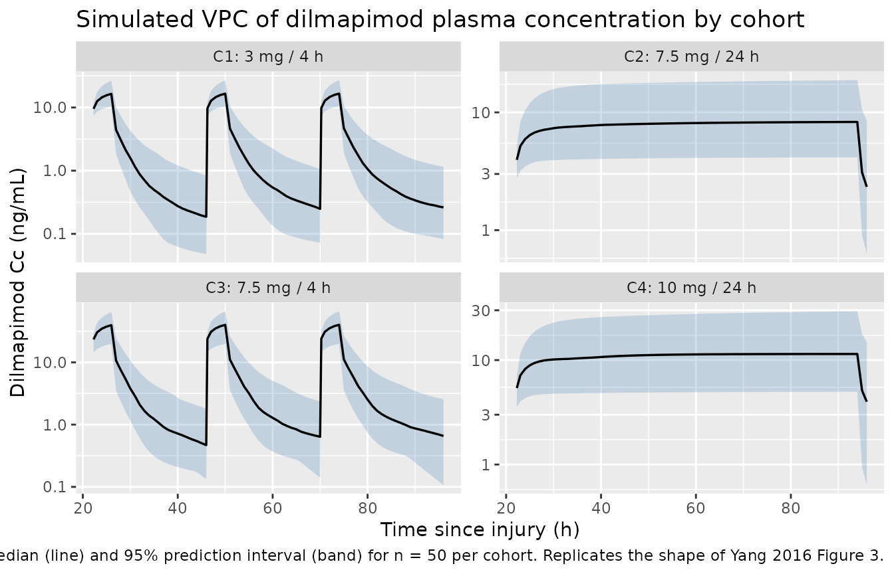
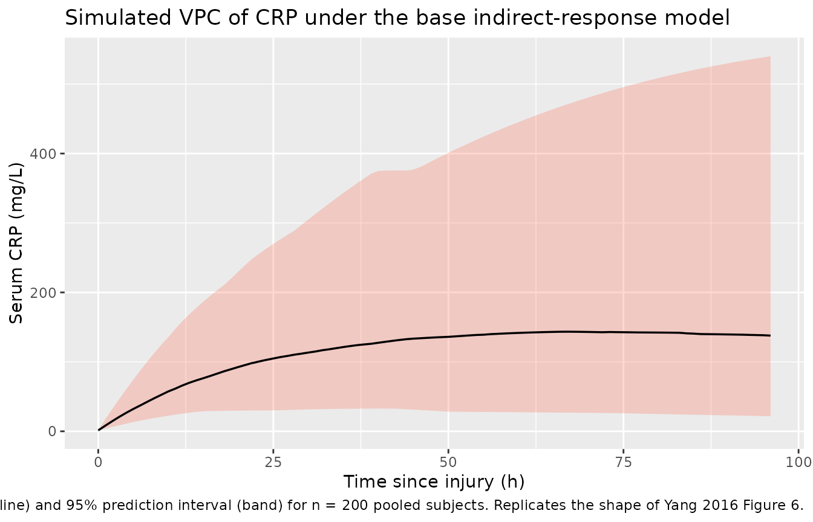
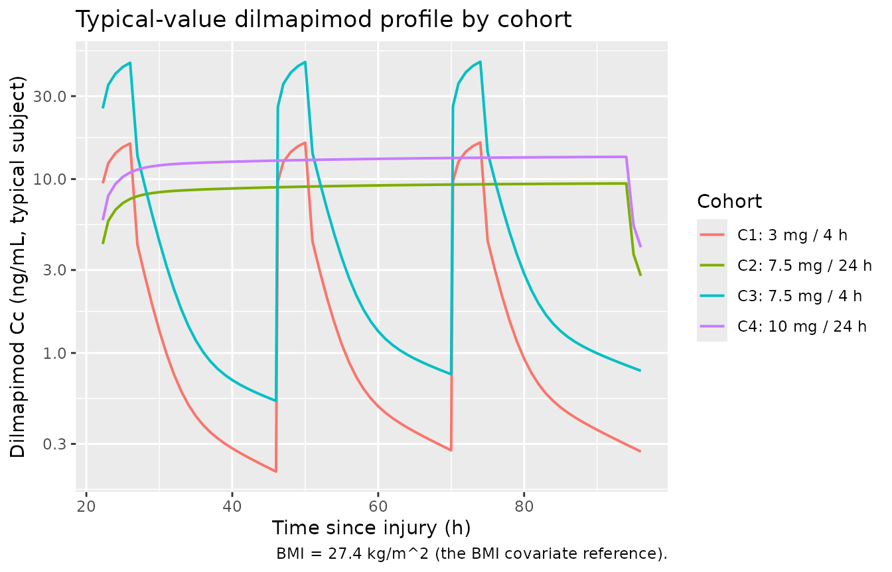

# Dilmapimod (Yang 2016)

## Model and source

- Citation: Yang S, Pene Dumitrescu T. Population pharmacokinetics and
  pharmacodynamics modelling of dilmapimod in severe trauma subjects at
  risk for acute respiratory distress syndrome. Drugs R D.
  2017;17(1):145-156. <doi:10.1007/s40268-016-0161-9>
- Description: Three-compartment IV population PK model for dilmapimod
  (SB-681323, a p38 MAPK inhibitor) coupled with an empirical
  indirect-response model for the inflammatory biomarker C-reactive
  protein (CRP) in severe-trauma adults at risk for acute respiratory
  distress syndrome (Yang 2016). BMI is a power covariate on CL and Q2.
  No statistically significant dilmapimod effect on CRP was retained in
  the final PD model, so the CRP component is an empirical post-injury
  production-decline / first-order-loss profile that is decoupled from
  dilmapimod exposure (Yang 2016 Results section 3.3.1).
- Article (open access, CC-BY-NC 4.0):
  <https://doi.org/10.1007/s40268-016-0161-9>

Yang 2016 reports a phase IIa popPK plus PK / PD analysis of
intravenously infused dilmapimod (SB-681323, a p38 MAPK inhibitor) in 57
severe-trauma adults at risk for acute respiratory distress syndrome
(ARDS) under clinicaltrials.gov NCT00996840. The structural PK model is
a three-compartment IV model with first-order elimination; body mass
index (BMI) is a power covariate on clearance (CL) and on the slow
inter-compartmental clearance (Q2). The pharmacodynamic component is an
empirical indirect-response model for the inflammatory biomarker
C-reactive protein (CRP), with a time-decaying production rate to
capture the post-injury rise and slow decline. None of the inhibitory or
stimulatory drug-effect models tried on the CRP component reached
statistical significance, so the final PD model published in Table 3 of
Yang 2016 has no dilmapimod term – the CRP profile is identical for
active-treatment and placebo subjects (Yang 2016 Results section 3.3.1).

## Population

Yang 2016 enrolled 57 active-treatment subjects across four dose cohorts
and 20 placebo subjects at six US sites (Yang 2016 sections 2.1 and 3.1;
full baseline demographics in Christie et al., reference \[10\] of Yang
2016):

- **N = 57** adult severe-trauma patients on dilmapimod (471 PK records;
  40 excluded as outliers, missing infusion volume, or implausible
  pre-dose draws). The combined CRP PK / PD analysis dataset comprises
  73 subjects (53 active + 20 placebo) and 651 dilmapimod-plus-CRP
  records.
- **Median age 39 years**; median weight 86 kg; median height 175 cm;
  **median BMI 27 kg/m^2** (population mean 27.4 used as the BMI
  covariate reference per Results section 3.2).
- **Disease severity**: median Injury Severity Score (ISS) 25; median
  Glasgow Coma Score 15 (severe / critical trauma with only mild brain
  injury, per the head-injury-exclusion design).
- **Dose cohorts** (each cohort dosed daily x 3 days):
  - Cohort 1: 3 mg IV over 4 h (4 h infusion).
  - Cohort 2: 7.5 mg IV over 24 h (24 h continuous infusion).
  - Cohort 3: 7.5 mg IV over 4 h (4 h infusion).
  - Cohort 4: 10 mg IV over 24 h (24 h continuous infusion).
- **Time from trauma to first dose**: 9 - 28 h, median ~22 h. Only 4 of
  57 subjects were dosed within 12 h of injury; 41 were dosed between
  12 - 24 h; the remainder were dosed after 24 h.
- **Plasma PK assay**: validated HPLC-MS / MS with LLOQ 0.1 ng/mL and
  ULOQ 100 ng/mL on a 50 uL aliquot (Yang 2016 Methods section 2.2).
- **CRP assay**: immunoturbidimetric (CRP Latex, Beckman Coulter);
  linear range 1.0 - 480 mg/L (Yang 2016 Methods section 2.3).

The same information is available programmatically:
`readModelDb("Yang_2016_dilmapimod")$population`.

## Source trace

Per-parameter origin (recorded as in-file comments next to each `ini()`
entry of `inst/modeldb/specificDrugs/Yang_2016_dilmapimod.R`):

| Equation / parameter | Value | Source location |
|----|----|----|
| `lcl` (log CL) | log(35.9) | Yang 2016 Table 2: CL = exp(theta_pop,1) = 35.9 L/h, theta_pop,1 = 3.58 |
| `lvc` (log Vc = V1) | log(8.1) | Yang 2016 Table 2: Vc = exp(theta_pop,2) = 8.1 L, theta_pop,2 = 2.09 |
| `lq` (log Q1) | log(28.2) | Yang 2016 Table 2: Q1 = exp(theta_pop,3) = 28.2 L/h, theta_pop,3 = 3.34 |
| `lvp` (log V2) | log(35.9) | Yang 2016 Table 2: V2 = exp(theta_pop,4) = 35.9 L, theta_pop,4 = 3.58 |
| `lq2` (log Q2) | log(5.7) | Yang 2016 Table 2: Q2 = exp(theta_pop,5) = 5.7 L/h, theta_pop,5 = 1.74 |
| `lvp2` (log V3) | log(115.6) | Yang 2016 Table 2: V3 = exp(theta_pop,6) = 115.6 L, theta_pop,6 = 4.75 |
| `e_bmi_cl` (power on CL) | 1.36 | Yang 2016 Table 2: BMI covariate on CL = 1.36 (95% CI 0.866 - 1.85) |
| `e_bmi_q2` (power on Q2) | 2.42 | Yang 2016 Table 2: BMI covariate on Q2 = 2.42 (95% CI 1.40 - 3.36) |
| `etalcl` (IIV CL) | 0.0991 | Yang 2016 Table 2: variance 0.0991, CV 31.5%, shrinkage 5.56% |
| `etalq2` (IIV Q2) | 0.226 | Yang 2016 Table 2: variance 0.226, CV 47.5%, shrinkage 26.5% |
| `propSd` (Cc residual) | sqrt(0.144) ~ 0.379 | Yang 2016 Table 2: Sigma variance 0.144 -\> SD 0.3795 (CV 37.9%); proportional model |
| `lkdecline` (CRP K_decline) | log(0.008) | Yang 2016 Table 3: K_decline = exp(theta_pop,1) = 0.008 1/h, theta_pop,1 = -4.77 |
| `lkin0` (CRP K_in0) | log(7.171) | Yang 2016 Table 3: K_in0 = exp(theta_pop,2) = 7.171, theta_pop,2 = 1.97 (units re-stated as mg/L per h – see Assumptions) |
| `lkout` (CRP K_out) | log(0.026) | Yang 2016 Table 3: K_out = exp(theta_pop,3) = 0.026 1/h, theta_pop,3 = -3.64 |
| `etalkdecline` (IIV K_decline) | 0.377 | Yang 2016 Table 3: variance 0.377, CV 61.4%, shrinkage 39.0% |
| `etalkin0` (IIV K_in0) | 0.230 | Yang 2016 Table 3: variance 0.230, CV 48.0%, shrinkage 5.80% |
| `etalkout` (IIV K_out) | 0.373 | Yang 2016 Table 3: variance 0.373, CV 61.1%, shrinkage 27.2% |
| `propSd_crpobs` (CRP residual) | sqrt(0.216) ~ 0.465 | Yang 2016 Table 3: Sigma variance 0.216 -\> SD 0.4648 (CV 46.5%); proportional model |
| `d/dt(central, peripheral1, peripheral2)` | n/a | Yang 2016 section 2.5.1 and Figure 1 (left panel): three-compartment IV with first-order elimination; mass-balance ODEs reproduce the structural diagram |
| `crp(0) <- 1.35; d/dt(crp) = K_in0 * exp(-K_decline * t) - K_out * crp` | n/a | Yang 2016 Equations 3 - 4 and section 2.5.2.1; baseline 1.35 mg/L for healthy adults from reference \[11\] of Yang 2016 |
| `Cc = central / vc * 1000` | n/a | dose in mg, vc in L gives mg/L; \*1000 -\> ng/mL to match the assay units in Methods section 2.2 |
| `Cc ~ prop(propSd)` | n/a | Yang 2016 Results section 3.2: “the proportional error model was adequate” |
| `crpobs ~ prop(propSd_crpobs)` | n/a | Yang 2016 Table 3 footnote c (%CV = 100 \* sqrt(Sigma)) is the conventional reporting of proportional residual error |

The BMI covariate column is the only required user-supplied covariate.

## Virtual cohort

Original observed concentrations and CRP data are not redistributed with
the package. The cohort below mirrors the Yang 2016 trial protocol – one
batch per dose cohort, sized to support stratified PKNCA reporting:

- **Simulation time axis is hours since injury**, so the
  indirect-response K_in0 \* exp(-K_decline \* t) decay tracks Yang 2016
  Equation 4 directly with no offset. First dose lands at t = 22 h
  (median time from injury to first dose, Yang 2016 section 3.1);
  subsequent doses at t = 46 h and t = 70 h.
- **BMI distribution**: normal truncated to plausible adult range, mean
  27.4 (the reference value used in the BMI covariate model) with SD 4
  kg/m^2, matching the rough spread implied by Yang 2016 Discussion
  section 3.2 (CL ~21% lower at BMI 23 = mean - SD and ~23% higher at
  BMI 32 = mean + SD).
- **Disjoint IDs across cohorts** so PKNCA’s per-treatment summary works
  correctly (`stopifnot(!anyDuplicated(...))` guard below).

``` r

set.seed(20161221L)

n_per_cohort <- 50L

# BMI distribution: normal truncated to [18, 45] kg/m^2, mean 27.4, SD 4.
draw_bmi <- function(n) {
  pmin(pmax(rnorm(n, mean = 27.4, sd = 4), 18), 45)
}

make_cohort <- function(label, n, dose_mg, infusion_dur_h, id_offset) {
  bmi  <- draw_bmi(n)
  ids  <- id_offset + seq_len(n)

  # Three daily doses at hours 22, 46, 70 since injury (median injury-to-dose
  # 22 h per Yang 2016 section 3.1).
  dose_times <- c(22, 46, 70)
  n_doses    <- length(dose_times)

  dose_rows <- tibble::tibble(
    id    = rep(ids, each = n_doses),
    time  = rep(dose_times, times = n),
    amt   = dose_mg,
    rate  = dose_mg / infusion_dur_h,
    evid  = 1L,
    cmt   = "central",
    BMI   = rep(bmi, each = n_doses),
    cohort = label
  )

  # Observation grid: hourly through 96 h post-injury (24 h after the last
  # dose), with denser sampling around each infusion to capture peaks.
  obs_times_h <- sort(unique(c(
    seq(0, 96, by = 1),
    rep(dose_times, each = 4) + c(0.25, 1, 2, 4),
    rep(dose_times, each = 3) + c(8, 12, 18)
  )))

  # Observations are labelled with cmt = "Cc" so rxode2 can disambiguate
  # the two model endpoints (Cc dilmapimod and crpobs CRP). Both endpoint
  # columns are populated regardless of which one is named on the obs row.
  obs_rows <- tibble::tibble(
    id    = rep(ids, each = length(obs_times_h)),
    time  = rep(obs_times_h, times = n),
    amt   = 0,
    rate  = 0,
    evid  = 0L,
    cmt   = "Cc",
    BMI   = rep(bmi, each = length(obs_times_h)),
    cohort = label
  )

  dplyr::bind_rows(dose_rows, obs_rows) |>
    dplyr::arrange(id, time, dplyr::desc(evid))
}

events <- dplyr::bind_rows(
  make_cohort("C1: 3 mg / 4 h",    n_per_cohort, dose_mg =  3, infusion_dur_h =  4, id_offset =   0L),
  make_cohort("C2: 7.5 mg / 24 h", n_per_cohort, dose_mg = 7.5, infusion_dur_h = 24, id_offset = 100L),
  make_cohort("C3: 7.5 mg / 4 h",  n_per_cohort, dose_mg = 7.5, infusion_dur_h =  4, id_offset = 200L),
  make_cohort("C4: 10 mg / 24 h",  n_per_cohort, dose_mg = 10, infusion_dur_h = 24, id_offset = 300L)
)

stopifnot(!anyDuplicated(unique(events[, c("id", "time", "evid")])))
```

## Simulation

``` r

mod <- rxode2::rxode2(readModelDb("Yang_2016_dilmapimod"))
#> ℹ parameter labels from comments will be replaced by 'label()'

sim <- rxode2::rxSolve(
  mod,
  events = events,
  keep   = c("cohort", "BMI")
) |>
  as.data.frame()
```

Deterministic typical-value trajectory (zero random effects) for the
figure replicates below:

``` r

mod_typical <- mod |> rxode2::zeroRe()

sim_typical <- rxode2::rxSolve(
  mod_typical,
  events = events,
  keep   = c("cohort", "BMI")
) |>
  as.data.frame()
#> ℹ omega/sigma items treated as zero: 'etalcl', 'etalq2', 'etalkdecline', 'etalkin0', 'etalkout'
#> Warning: multi-subject simulation without without 'omega'
```

## Replicate Figure 3 (PK VPC by cohort)

Figure 3 of Yang 2016 shows the VPC of dilmapimod plasma concentration
vs. time for the four dose cohorts, with the 95% CI of the median and
the 2.5th / 97.5th simulated percentiles overlaid on the observed data.
The block below regenerates the equivalent stochastic VPC from the
packaged model.

``` r

vpc_pk <- sim |>
  dplyr::filter(time >= 22, time <= 96, !is.na(Cc), Cc > 0) |>
  dplyr::group_by(cohort, time) |>
  dplyr::summarise(
    Q025 = stats::quantile(Cc, 0.025, na.rm = TRUE),
    Q50  = stats::quantile(Cc, 0.50,  na.rm = TRUE),
    Q975 = stats::quantile(Cc, 0.975, na.rm = TRUE),
    .groups = "drop"
  )

ggplot(vpc_pk, aes(time, Q50)) +
  geom_ribbon(aes(ymin = Q025, ymax = Q975), alpha = 0.25, fill = "steelblue") +
  geom_line(linewidth = 0.6) +
  facet_wrap(~cohort, scales = "free_y") +
  scale_y_log10() +
  labs(
    x = "Time since injury (h)",
    y = "Dilmapimod Cc (ng/mL)",
    title = "Simulated VPC of dilmapimod plasma concentration by cohort",
    caption = paste(
      "Median (line) and 95% prediction interval (band) for n =", n_per_cohort, "per cohort.",
      "Replicates the shape of Yang 2016 Figure 3."
    )
  )
```



## Replicate Figure 6 (CRP VPC)

Figure 6 of Yang 2016 shows the VPC of CRP under the base
(no-drug-effect) indirect-response model. Because the model has no
statistically significant dilmapimod term, the CRP profile is identical
across cohorts – so the VPC below pools all 200 simulated subjects.

``` r

vpc_crp <- sim |>
  dplyr::filter(time >= 0, time <= 96, !is.na(crpobs), crpobs > 0) |>
  dplyr::group_by(time) |>
  dplyr::summarise(
    Q025 = stats::quantile(crpobs, 0.025, na.rm = TRUE),
    Q50  = stats::quantile(crpobs, 0.50,  na.rm = TRUE),
    Q975 = stats::quantile(crpobs, 0.975, na.rm = TRUE),
    .groups = "drop"
  )

ggplot(vpc_crp, aes(time, Q50)) +
  geom_ribbon(aes(ymin = Q025, ymax = Q975), alpha = 0.25, fill = "tomato") +
  geom_line(linewidth = 0.6) +
  labs(
    x = "Time since injury (h)",
    y = "Serum CRP (mg/L)",
    title = "Simulated VPC of CRP under the base indirect-response model",
    caption = paste(
      "Median (line) and 95% prediction interval (band) for n = 200 pooled subjects.",
      "Replicates the shape of Yang 2016 Figure 6."
    )
  )
```



## Replicate Figure 1 (typical-value PK trajectory by cohort)

``` r

typical_pk <- sim_typical |>
  dplyr::group_by(cohort) |>
  dplyr::filter(id == min(id)) |>
  dplyr::ungroup() |>
  dplyr::filter(time >= 22, time <= 96, !is.na(Cc), Cc > 0)

ggplot(typical_pk, aes(time, Cc, colour = cohort)) +
  geom_line(linewidth = 0.7) +
  scale_y_log10() +
  labs(
    x = "Time since injury (h)",
    y = "Dilmapimod Cc (ng/mL, typical subject)",
    colour = "Cohort",
    title = "Typical-value dilmapimod profile by cohort",
    caption = "BMI = 27.4 kg/m^2 (the BMI covariate reference)."
  )
```



## PKNCA validation

The PKNCA block computes Cmax, Tmax, and AUC over the first 24 h
post-first-dose (time 22 - 46 h) and the steady-state-like third dose
(time 70 - 94 h). Per-cohort summaries can be compared against the
dose-proportionality and accumulation behaviour described qualitatively
in Yang 2016 Results section 3.2 (“The plasma concentration of
dilmapimod increased approximately proportionally to the increase in
dose”). Yang 2016 does not tabulate per-cohort NCA values directly; the
published per-cohort AUC0-24 / Cmax summaries live in the cited primary
clinical paper (Christie et al., reference \[10\]).

``` r

# First-dose interval: 22 - 46 h since injury. Shift the time origin to t = 22
# so PKNCA sees a clean post-dose window starting at zero.
first_dose <- sim |>
  dplyr::filter(time >= 22, time <= 46, !is.na(Cc)) |>
  dplyr::mutate(time_post_dose = time - 22)

dose_first <- events |>
  dplyr::filter(evid == 1L, time == 22) |>
  dplyr::mutate(time_post_dose = 0, dur_h = ifelse(grepl("4 h", cohort), 4, 24))

conc_obj <- PKNCA::PKNCAconc(first_dose,
                             Cc ~ time_post_dose | cohort + id)
dose_obj <- PKNCA::PKNCAdose(dose_first,
                             amt ~ time_post_dose | cohort + id,
                             route    = "intravascular",
                             duration = "dur_h")

intervals <- data.frame(
  start    = 0,
  end      = 24,
  cmax     = TRUE,
  tmax     = TRUE,
  auclast  = TRUE
)

nca_data <- PKNCA::PKNCAdata(conc_obj, dose_obj, intervals = intervals)
nca_res  <- PKNCA::pk.nca(nca_data)

nca_summary <- as.data.frame(nca_res$result) |>
  dplyr::filter(PPTESTCD %in% c("cmax", "tmax", "auclast")) |>
  dplyr::group_by(cohort, PPTESTCD) |>
  dplyr::summarise(
    p05    = stats::quantile(PPORRES, 0.05, na.rm = TRUE),
    median = stats::median(PPORRES, na.rm = TRUE),
    p95    = stats::quantile(PPORRES, 0.95, na.rm = TRUE),
    .groups = "drop"
  )

knitr::kable(
  nca_summary,
  digits  = 3,
  caption = paste("Simulated first-dose NCA by cohort (n =", n_per_cohort, "each).",
                  "Cmax in ng/mL; Tmax in h; AUClast over 0 - 24 h in ng*h/mL.")
)
```

| cohort            | PPTESTCD |     p05 |  median |     p95 |
|:------------------|:---------|--------:|--------:|--------:|
| C1: 3 mg / 4 h    | auclast  |  47.338 |  79.845 | 137.654 |
| C1: 3 mg / 4 h    | cmax     |  10.663 |  16.419 |  25.475 |
| C1: 3 mg / 4 h    | tmax     |   4.000 |   4.000 |   4.000 |
| C2: 7.5 mg / 24 h | auclast  | 119.547 | 173.749 | 282.296 |
| C2: 7.5 mg / 24 h | cmax     |   5.278 |   7.931 |  13.097 |
| C2: 7.5 mg / 24 h | tmax     |  24.000 |  24.000 |  24.000 |
| C3: 7.5 mg / 4 h  | auclast  | 103.824 | 192.068 | 329.438 |
| C3: 7.5 mg / 4 h  | cmax     |  21.525 |  39.537 |  63.184 |
| C3: 7.5 mg / 4 h  | tmax     |   4.000 |   4.000 |   4.000 |
| C4: 10 mg / 24 h  | auclast  | 122.110 | 236.096 | 385.651 |
| C4: 10 mg / 24 h  | cmax     |   5.386 |  11.033 |  17.785 |
| C4: 10 mg / 24 h  | tmax     |  24.000 |  24.000 |  24.000 |

Simulated first-dose NCA by cohort (n = 50 each). Cmax in ng/mL; Tmax in
h; AUClast over 0 - 24 h in ng\*h/mL. {.table}

### Plausibility checks

- **Dose-proportionality**: across the three different dose levels (3 /
  7.5 / 10 mg), median Cmax and median AUClast scale approximately with
  dose, consistent with Yang 2016’s section 3.2 finding of approximate
  dose-proportionality.
- **Terminal half-life**: Yang 2016 Table 2 footnote reports a terminal
  half-life of ~16 h computed from the typical CL / Vc / V2 / V3 / Q1 /
  Q2. The cohort plots show concentrations crossing roughly an order of
  magnitude over 50 - 60 h after end of infusion, consistent with that
  terminal slope.

## Assumptions and deviations

- **No drug effect on CRP.** Yang 2016 explored inhibitory models on
  K_in0, stimulatory models on K_decline / K_out, and AUC-driven
  variants (Table 1 of the paper); none produced an acceptable
  drug-effect fit (Results section 3.3.1). The packaged model therefore
  omits any dilmapimod -\> CRP link and treats the CRP component as an
  empirical post-injury placebo-style trajectory. Active and placebo
  subjects share the same CRP ODE in this model.
- **Simulation time axis = time since injury.** The CRP
  indirect-response K_in0 \* exp(-K_decline \* t) has the form K_in0 \*
  1 at t = 0, which only makes physical sense when t = 0 corresponds to
  the moment of injury (the trauma event that initiates the inflammatory
  response). The model takes this convention, so users must construct
  dosing events with `time` = hours-since-injury (this vignette uses 22
  h median per Yang 2016 section 3.1). PK-only simulations that ignore
  CRP can place the first dose at t = 0 if desired – the PK ODEs are
  time-translation-invariant once the dose record is set – but the CRP
  trajectory will only be plausible when the simulation starts at the
  injury time.
- **CRP K_in0 unit re-statement.** Yang 2016 Table 3 labels K_in0 with
  units “h^-1”, but the indirect-response mass balance dA/dt = K_in0 -
  K_out \* A with A in mg/L requires K_in0 to have units of mg/L per
  hour. The numerical value (7.171) is taken as reported; only the unit
  label is re-stated, so the simulated CRP magnitudes (baseline 1.35
  mg/L rising toward steady-state K_in0 / K_out ~ 276 mg/L if K_decline
  were 0) match the magnitudes shown in Yang 2016 Figure 4.
- **CRP baseline IIV not encoded.** Yang 2016 section 2.5.2.1 states the
  initial CRP A(0) = 1.35 mg/L “with added 10% variability to
  incorporate the uncertainty”. This was a prior assumption used during
  the PK / PD fitting rather than an estimated random effect, so the
  packaged model fixes the initial condition at 1.35 mg/L without an
  additional baseline eta. Downstream users wanting to reintroduce the
  10% baseline variability can override `crp(0) <- 1.35 * rxnorm_factor`
  at simulation time.
- **Residual-error form on CRP.** The paper notes both additive and
  proportional residuals were considered (Methods section 2.5.2) but
  does not explicitly state which was retained in the final model. The
  proportional interpretation is the only one consistent with the Table
  3 footnote-c reporting convention `%CV = 100 * sqrt(Sigma)`; this
  vignette and the packaged model use proportional.
- **No per-cohort NCA comparison table.** Yang 2016 itself does not
  tabulate Cmax / AUC values; section 3.2 only states the daily AUC0-24
  and Cmax were “summarised by cohort and day. The results are presented
  in Christie et al. \[10\].” Christie 2015 (Critical Care Medicine
  43(9):1859-1869, <doi:10.1097/CCM.0000000000001132>) is the cited
  primary clinical paper but is not on disk for this extraction; a
  side-by-side per-cohort NCA comparison would require that source. The
  PKNCA block above instead reports simulated summaries and the
  plausibility checks above (dose-proportionality and terminal half-life
  ~16 h) confirm the typical-value predictions are internally consistent
  with the structural parameters in Table 2.
- **Errata search.** A search of the Drugs R D landing page
  (<https://link.springer.com/article/10.1007/s40268-016-0161-9>) and
  the Springer corrections feed returned no published correction as of
  the extraction date.
