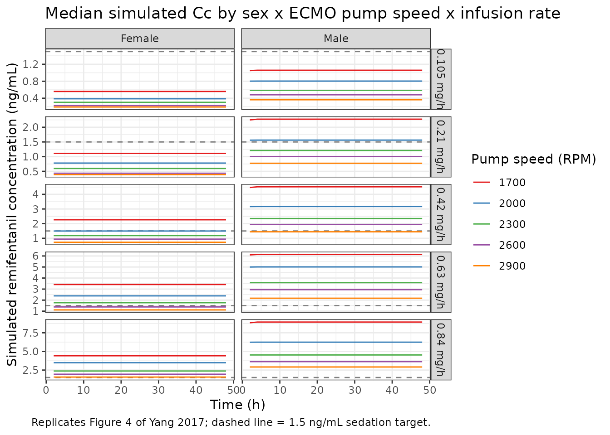

# Remifentanil (Yang 2017)

## Model and source

- Citation: Yang S, Noh H, Hahn J, Jin BH, Min KL, Bae SK, Kim J, Park
  MS, Hong T, Wi J, Chang MJ. Population pharmacokinetics of
  remifentanil in critically ill patients receiving extracorporeal
  membrane oxygenation. Sci Rep 2017;7(1):16275.
  <doi:10.1038/s41598-017-16358-6>.
- Description: One-compartment population PK model for continuous
  intravenous remifentanil infusion in critically ill adults receiving
  venoarterial extracorporeal membrane oxygenation (VA-ECMO), with sex
  and centrifugal-pump rotational speed as covariates on clearance (Yang
  2017).
- Article: <https://doi.org/10.1038/s41598-017-16358-6> (open access in
  Scientific Reports 2017;7:16275)

## Population

Yang et al. enrolled 15 critically ill adults (median age 57 years, IQR
45-69; 67% male; median weight 65.4 kg, IQR 54.5-70.0; median BMI 23.8
kg/m^2) receiving continuous-infusion remifentanil sedation during
venoarterial extracorporeal membrane oxygenation (VA-ECMO) at Severance
Cardiovascular Hospital, Yonsei University (Seoul, South Korea), between
January 2015 and December 2016 (ClinicalTrials.gov NCT02581280;
single-center prospective cohort). Indications for VA-ECMO were
predominantly acute coronary syndromes (acute MI n = 5, NSTEMI n = 4,
STEMI n = 1, ischemic cardiomyopathy n = 1) with several other
cardiopulmonary failures (pulmonary embolism, coronary artery occlusive
disease, myocarditis, atrial fibrillation with bronchiolitis, angina
pectoris). Median ECMO support duration was 143 h (IQR 96-250). Median
centrifugal-pump rotational speed was 2350 RPM (IQR 2302-2532). Ten of
the 15 patients (67%) received concomitant CRRT during ECMO support;
CRRT was tested as a covariate during model development but not retained
in the final model. Baseline characteristics are listed in Table 1 of
the source paper. The same information is available programmatically via
`readModelDb("Yang_2017_remifentanil")()$meta$population`.

## Source trace

Per-parameter origin is recorded as an in-file comment next to each
`ini()` entry in `inst/modeldb/specificDrugs/Yang_2017_remifentanil.R`.
The table below collects the equations and parameter values in one place
for review.

| Equation / parameter | Value | Source location |
|----|----|----|
| One-compartment model with zero-order input and first-order elimination | n/a | Results, paragraph 2; Methods, Structural and model development |
| Final CL model: CL (L/h) = 366 x 0.502^SEX x (ECMO pump speed / 2350)^2.04, with SEX = 0 (female), 1 (male) | n/a | Results, Population PK analysis (final-model equation) |
| `lcl` (typical female CL at 2350 RPM) | 366 L/h | Table 2 (theta_CL) |
| `lvc` (typical V) | 41 L | Table 2 (theta_V) |
| `e_sex_cl` (log(0.502); applied via (1 - SEXF) to preserve female reference) | -0.6892 | Table 2 (theta_sex on CL = 0.502) |
| `e_pumpspeed_cl` (power exponent on ECMO pump speed / 2350) | 2.04 | Table 2 (theta_ECMOpumpspeed on CL) |
| `etalcl` (IIV variance on log CL; stored as SD^2 = 0.124^2) | 0.01538 | Table 2 (omega_CL = 0.124, SD on log scale) |
| `propSd` (proportional residual SD, fraction) | 0.387 | Table 2 (sigma_proportional = 0.387) |
| `addSd` (additive residual SD, ng/mL) | 0.111 ng/mL | Table 2 (sigma_additive = 0.111 ng/mL) |
| Reference pump speed (median of cohort) | 2350 RPM | Results, Patient characteristics; Table 1 |

## Virtual cohort

Original observed concentrations are not publicly available. The figures
below use a virtual cohort that mirrors the simulation grid used in the
source paper (Methods, Simulations; Results, Predicted concentration
profiles; Figure 4):

- Sex: female (`SEXF = 1`) and male (`SEXF = 0`).
- ECMO pump speed: 1700, 2000, 2300, 2600, and 2900 RPM (Yang 2017
  Methods, Simulations).
- Remifentanil infusion rates: 0.105, 0.21, 0.42, 0.63, and 0.84 mg/h (=
  105, 210, 420, 630, 840 ug/h). The infusion is continuous over 48 h,
  matching the paper’s two-day simulation horizon.

``` r

set.seed(2017)

pump_speeds_rpm <- c(1700, 2000, 2300, 2600, 2900)
infusion_rates_mg_h <- c(0.105, 0.21, 0.42, 0.63, 0.84)
sexes <- c(Female = 1L, Male = 0L)

n_per_group <- 25L             # virtual subjects per (sex, pump speed, dose) group
inf_duration_h <- 48           # 2-day continuous infusion (Methods, Simulations)
obs_times <- seq(0, 48, by = 2)

make_cohort <- function(n, sex_label, sexf_val, pump_rpm, dose_mg_h, id_offset) {
  rate_ug_h <- dose_mg_h * 1000  # mg/h -> ug/h (model dose units are ug)
  amt_ug <- rate_ug_h * inf_duration_h

  per_subject <- function(sid) {
    dplyr::bind_rows(
      data.frame(id = sid, time = 0, amt = amt_ug, rate = rate_ug_h,
                 evid = 1L, cmt = "central",
                 SEXF = sexf_val,
                 ECMO_PUMP_SPEED = pump_rpm,
                 sex_label = sex_label,
                 pump_rpm = pump_rpm,
                 dose_mg_h = dose_mg_h),
      data.frame(id = sid, time = obs_times, amt = NA_real_, rate = NA_real_,
                 evid = 0L, cmt = NA_character_,
                 SEXF = sexf_val,
                 ECMO_PUMP_SPEED = pump_rpm,
                 sex_label = sex_label,
                 pump_rpm = pump_rpm,
                 dose_mg_h = dose_mg_h)
    )
  }

  ids <- id_offset + seq_len(n)
  do.call(rbind, lapply(ids, per_subject))
}

# Build a grid: 2 sex x 5 pump speeds x 5 doses = 50 groups
grid <- tidyr::expand_grid(
  sex_label = names(sexes),
  pump_rpm = pump_speeds_rpm,
  dose_mg_h = infusion_rates_mg_h
)
grid$id_offset <- (seq_len(nrow(grid)) - 1L) * n_per_group

events <- do.call(rbind, lapply(seq_len(nrow(grid)), function(i) {
  row <- grid[i, ]
  make_cohort(
    n = n_per_group,
    sex_label = row$sex_label,
    sexf_val = sexes[[row$sex_label]],
    pump_rpm = row$pump_rpm,
    dose_mg_h = row$dose_mg_h,
    id_offset = row$id_offset
  )
}))

stopifnot(!anyDuplicated(unique(events[, c("id", "time", "evid")])))
events$cohort <- paste0(events$sex_label,
                        " / ", events$pump_rpm, " RPM / ",
                        events$dose_mg_h, " mg/h")
```

## Simulation

``` r

mod <- readModelDb("Yang_2017_remifentanil")()

sim <- rxode2::rxSolve(
  mod, events = events, addCov = TRUE,
  keep = c("sex_label", "pump_rpm", "dose_mg_h", "cohort")
)
sim <- as.data.frame(sim)
```

## Replicate Figure 4 – simulated remifentanil concentrations by sex x pump speed x dose

The paper’s Figure 4 shows simulated mean remifentanil concentrations in
female and male patients across the 5 pump speeds (1700, 2000, 2300,
2600, 2900 RPM) for 5 infusion rates (0.84, 0.63, 0.42, 0.21, 0.105
mg/h). The horizontal reference line at 1.5 ng/mL is the sedation target
referenced in the paper (Discussion; “a target concentration \>= 1.5
ng/mL”).

``` r

fig4 <- sim |>
  dplyr::filter(!is.na(Cc), time > 0) |>
  dplyr::group_by(sex_label, pump_rpm, dose_mg_h, time) |>
  dplyr::summarise(
    median_Cc = median(Cc, na.rm = TRUE),
    p05 = quantile(Cc, 0.05, na.rm = TRUE),
    p95 = quantile(Cc, 0.95, na.rm = TRUE),
    .groups = "drop"
  )

ggplot(fig4, aes(time, median_Cc, colour = factor(pump_rpm))) +
  geom_hline(yintercept = 1.5, linetype = "dashed", colour = "grey50") +
  geom_line() +
  facet_grid(dose_mg_h ~ sex_label, scales = "free_y",
             labeller = labeller(dose_mg_h = function(x) paste0(x, " mg/h"))) +
  scale_colour_brewer("Pump speed (RPM)", palette = "Set1") +
  labs(
    x = "Time (h)",
    y = "Simulated remifentanil concentration (ng/mL)",
    title = "Median simulated Cc by sex x ECMO pump speed x infusion rate",
    caption = "Replicates Figure 4 of Yang 2017; dashed line = 1.5 ng/mL sedation target."
  ) +
  theme_bw()
```



## Comparison against the published dosing recommendation

Yang 2017 reports (Results, Predicted concentration profiles):

- For female patients: pump speed 1700-2000 RPM, \>= 0.42 mg/h; pump
  speed 2000-2900 RPM, \>= 0.63 mg/h achieves 95% of subjects
  maintaining Cc \>= 1.5 ng/mL.
- For male patients: pump speed 1700-2000 RPM, \>= 0.21 mg/h; pump speed
  2000-2900 RPM, \>= 0.42 mg/h.

Reproduce the same threshold check from the simulated cohort by
computing, per (sex, pump speed, dose) cell, the fraction of subjects
whose steady-state Cc (taken at t = 48 h) meets or exceeds 1.5 ng/mL.

``` r

target_check <- sim |>
  dplyr::filter(!is.na(Cc), time == 48) |>
  dplyr::group_by(sex_label, pump_rpm, dose_mg_h) |>
  dplyr::summarise(
    pct_at_target = mean(Cc >= 1.5, na.rm = TRUE) * 100,
    median_Cc_48h = median(Cc, na.rm = TRUE),
    .groups = "drop"
  )

knitr::kable(
  target_check |>
    dplyr::mutate(
      pct_at_target = sprintf("%.0f%%", pct_at_target),
      median_Cc_48h = sprintf("%.2f ng/mL", median_Cc_48h)
    ) |>
    tidyr::pivot_wider(
      names_from = pump_rpm,
      values_from = c(pct_at_target, median_Cc_48h)
    ),
  caption = "Per-cell percentage of virtual subjects at or above 1.5 ng/mL at t = 48 h, and median Cc at t = 48 h. Compare with Yang 2017 dosing recommendation (Results, Predicted concentration profiles)."
)
```

| sex_label | dose_mg_h | pct_at_target_1700 | pct_at_target_2000 | pct_at_target_2300 | pct_at_target_2600 | pct_at_target_2900 | median_Cc_48h_1700 | median_Cc_48h_2000 | median_Cc_48h_2300 | median_Cc_48h_2600 | median_Cc_48h_2900 |
|:---|---:|:---|:---|:---|:---|:---|:---|:---|:---|:---|:---|
| Female | 0.105 | 0% | 0% | 0% | 0% | 0% | 0.56 ng/mL | 0.39 ng/mL | 0.30 ng/mL | 0.23 ng/mL | 0.19 ng/mL |
| Female | 0.210 | 0% | 0% | 0% | 0% | 0% | 1.11 ng/mL | 0.78 ng/mL | 0.60 ng/mL | 0.43 ng/mL | 0.39 ng/mL |
| Female | 0.420 | 100% | 48% | 0% | 0% | 0% | 2.26 ng/mL | 1.50 ng/mL | 1.18 ng/mL | 0.94 ng/mL | 0.73 ng/mL |
| Female | 0.630 | 100% | 100% | 88% | 28% | 0% | 3.41 ng/mL | 2.39 ng/mL | 1.76 ng/mL | 1.38 ng/mL | 1.11 ng/mL |
| Female | 0.840 | 100% | 100% | 100% | 96% | 60% | 4.42 ng/mL | 3.48 ng/mL | 2.37 ng/mL | 1.94 ng/mL | 1.56 ng/mL |
| Male | 0.105 | 0% | 0% | 0% | 0% | 0% | 1.06 ng/mL | 0.80 ng/mL | 0.59 ng/mL | 0.48 ng/mL | 0.36 ng/mL |
| Male | 0.210 | 100% | 56% | 4% | 0% | 0% | 2.28 ng/mL | 1.56 ng/mL | 1.21 ng/mL | 1.00 ng/mL | 0.77 ng/mL |
| Male | 0.420 | 100% | 100% | 100% | 96% | 44% | 4.51 ng/mL | 3.17 ng/mL | 2.35 ng/mL | 1.94 ng/mL | 1.44 ng/mL |
| Male | 0.630 | 100% | 100% | 100% | 100% | 100% | 6.14 ng/mL | 5.01 ng/mL | 3.58 ng/mL | 2.95 ng/mL | 2.17 ng/mL |
| Male | 0.840 | 100% | 100% | 100% | 100% | 100% | 8.94 ng/mL | 6.24 ng/mL | 4.53 ng/mL | 3.63 ng/mL | 2.91 ng/mL |

Per-cell percentage of virtual subjects at or above 1.5 ng/mL at t = 48
h, and median Cc at t = 48 h. Compare with Yang 2017 dosing
recommendation (Results, Predicted concentration profiles). {.table}

## PKNCA validation

PKNCA NCA on the 0-48 h continuous-infusion profile, grouped by sex,
pump speed, and dose. The treatment grouping comes before `id` per
project convention.

For closed-form sanity-checks at steady state (typical-value, no IIV):

- Steady-state concentration: Css = (infusion rate) / CL_i, where CL_i =
  366 x 0.502^SEX x (ECMO_PUMP_SPEED / 2350)^2.04 L/h.
- Elimination half-life: t\_(1/2) = ln(2) x V / CL_i. With V = 41 L:

``` r

closed_form <- tidyr::expand_grid(
  sex_label = names(sexes),
  pump_rpm = pump_speeds_rpm,
  dose_mg_h = infusion_rates_mg_h
) |>
  dplyr::mutate(
    sex_male_indicator = ifelse(sex_label == "Male", 1, 0),
    CL_Lh = 366 * 0.502^sex_male_indicator * (pump_rpm / 2350)^2.04,
    Css_ng_mL = (dose_mg_h * 1000) / CL_Lh,
    t_half_min = log(2) * 41 / CL_Lh * 60
  )

knitr::kable(
  closed_form |>
    dplyr::filter(dose_mg_h == 0.35) |>
    dplyr::transmute(
      Sex = sex_label,
      `Pump speed (RPM)` = pump_rpm,
      `CL (L/h)` = round(CL_Lh, 1),
      `Css at 0.35 mg/h (ng/mL)` = round(Css_ng_mL, 2),
      `t_(1/2) (min)` = round(t_half_min, 2)
    ),
  caption = "Closed-form typical-value CL, Css, and t_(1/2) for the cohort-median infusion rate (0.35 mg/h)."
)
```

| Sex | Pump speed (RPM) | CL (L/h) | Css at 0.35 mg/h (ng/mL) | t\_(1/2) (min) |
|-----|------------------|----------|--------------------------|----------------|

Closed-form typical-value CL, Css, and t\_(1/2) for the cohort-median
infusion rate (0.35 mg/h). {.table}

PKNCA on a manageable subset of the simulation – female / male at the
cohort-median pump speed (2300 RPM, nearest grid point to the cohort
median of 2350 RPM) and a representative subset of doses:

``` r

sim_for_nca <- sim |>
  dplyr::filter(pump_rpm == 2300, dose_mg_h %in% c(0.21, 0.42, 0.84),
                !is.na(Cc), time > 0) |>
  dplyr::mutate(
    treatment = paste0(sex_label, "/", dose_mg_h, "mg/h")
  )

sim_nca <- sim_for_nca |>
  dplyr::select(id, time, Cc, treatment)

dose_df <- events |>
  dplyr::filter(evid == 1, pump_rpm == 2300,
                dose_mg_h %in% c(0.21, 0.42, 0.84)) |>
  dplyr::transmute(
    id = id, time = time, amt = amt,
    treatment = paste0(sex_label, "/", dose_mg_h, "mg/h"),
    rate = rate, duration = amt / rate
  )

conc_obj <- PKNCA::PKNCAconc(sim_nca, Cc ~ time | treatment + id)
dose_obj <- PKNCA::PKNCAdose(
  dose_df,
  amt ~ time | treatment + id,
  duration = "duration"
)

intervals <- data.frame(
  start    = 0,
  end      = 48,
  cmax     = TRUE,
  tmax     = TRUE,
  auclast  = TRUE,
  cav      = TRUE
)

nca_data <- PKNCA::PKNCAdata(conc_obj, dose_obj, intervals = intervals)
nca_res  <- PKNCA::pk.nca(nca_data)
#> Warning: Requesting an AUC range starting (0) before the first measurement (2) is not allowed
#> Requesting an AUC range starting (0) before the first measurement (2) is not allowed
#> Requesting an AUC range starting (0) before the first measurement (2) is not allowed
#> Requesting an AUC range starting (0) before the first measurement (2) is not allowed
#> Requesting an AUC range starting (0) before the first measurement (2) is not allowed
#> Requesting an AUC range starting (0) before the first measurement (2) is not allowed
#> Requesting an AUC range starting (0) before the first measurement (2) is not allowed
#> Requesting an AUC range starting (0) before the first measurement (2) is not allowed
#> Requesting an AUC range starting (0) before the first measurement (2) is not allowed
#> Requesting an AUC range starting (0) before the first measurement (2) is not allowed
#> Requesting an AUC range starting (0) before the first measurement (2) is not allowed
#> Requesting an AUC range starting (0) before the first measurement (2) is not allowed
#> Requesting an AUC range starting (0) before the first measurement (2) is not allowed
#> Requesting an AUC range starting (0) before the first measurement (2) is not allowed
#> Requesting an AUC range starting (0) before the first measurement (2) is not allowed
#> Requesting an AUC range starting (0) before the first measurement (2) is not allowed
#> Requesting an AUC range starting (0) before the first measurement (2) is not allowed
#> Requesting an AUC range starting (0) before the first measurement (2) is not allowed
#> Requesting an AUC range starting (0) before the first measurement (2) is not allowed
#> Requesting an AUC range starting (0) before the first measurement (2) is not allowed
#> Requesting an AUC range starting (0) before the first measurement (2) is not allowed
#> Requesting an AUC range starting (0) before the first measurement (2) is not allowed
#> Requesting an AUC range starting (0) before the first measurement (2) is not allowed
#> Requesting an AUC range starting (0) before the first measurement (2) is not allowed
#> Requesting an AUC range starting (0) before the first measurement (2) is not allowed
#> Requesting an AUC range starting (0) before the first measurement (2) is not allowed
#> Requesting an AUC range starting (0) before the first measurement (2) is not allowed
#> Requesting an AUC range starting (0) before the first measurement (2) is not allowed
#> Requesting an AUC range starting (0) before the first measurement (2) is not allowed
#> Requesting an AUC range starting (0) before the first measurement (2) is not allowed
#> Requesting an AUC range starting (0) before the first measurement (2) is not allowed
#> Requesting an AUC range starting (0) before the first measurement (2) is not allowed
#> Requesting an AUC range starting (0) before the first measurement (2) is not allowed
#> Requesting an AUC range starting (0) before the first measurement (2) is not allowed
#> Requesting an AUC range starting (0) before the first measurement (2) is not allowed
#> Requesting an AUC range starting (0) before the first measurement (2) is not allowed
#> Requesting an AUC range starting (0) before the first measurement (2) is not allowed
#> Requesting an AUC range starting (0) before the first measurement (2) is not allowed
#> Requesting an AUC range starting (0) before the first measurement (2) is not allowed
#> Requesting an AUC range starting (0) before the first measurement (2) is not allowed
#> Requesting an AUC range starting (0) before the first measurement (2) is not allowed
#> Requesting an AUC range starting (0) before the first measurement (2) is not allowed
#> Requesting an AUC range starting (0) before the first measurement (2) is not allowed
#> Requesting an AUC range starting (0) before the first measurement (2) is not allowed
#> Requesting an AUC range starting (0) before the first measurement (2) is not allowed
#> Requesting an AUC range starting (0) before the first measurement (2) is not allowed
#> Requesting an AUC range starting (0) before the first measurement (2) is not allowed
#> Requesting an AUC range starting (0) before the first measurement (2) is not allowed
#> Requesting an AUC range starting (0) before the first measurement (2) is not allowed
#> Requesting an AUC range starting (0) before the first measurement (2) is not allowed
#> Requesting an AUC range starting (0) before the first measurement (2) is not allowed
#> Requesting an AUC range starting (0) before the first measurement (2) is not allowed
#> Requesting an AUC range starting (0) before the first measurement (2) is not allowed
#> Requesting an AUC range starting (0) before the first measurement (2) is not allowed
#> Requesting an AUC range starting (0) before the first measurement (2) is not allowed
#> Requesting an AUC range starting (0) before the first measurement (2) is not allowed
#> Requesting an AUC range starting (0) before the first measurement (2) is not allowed
#> Requesting an AUC range starting (0) before the first measurement (2) is not allowed
#> Requesting an AUC range starting (0) before the first measurement (2) is not allowed
#> Requesting an AUC range starting (0) before the first measurement (2) is not allowed
#> Requesting an AUC range starting (0) before the first measurement (2) is not allowed
#> Requesting an AUC range starting (0) before the first measurement (2) is not allowed
#> Requesting an AUC range starting (0) before the first measurement (2) is not allowed
#> Requesting an AUC range starting (0) before the first measurement (2) is not allowed
#> Requesting an AUC range starting (0) before the first measurement (2) is not allowed
#> Requesting an AUC range starting (0) before the first measurement (2) is not allowed
#> Requesting an AUC range starting (0) before the first measurement (2) is not allowed
#> Requesting an AUC range starting (0) before the first measurement (2) is not allowed
#> Requesting an AUC range starting (0) before the first measurement (2) is not allowed
#> Requesting an AUC range starting (0) before the first measurement (2) is not allowed
#> Requesting an AUC range starting (0) before the first measurement (2) is not allowed
#> Requesting an AUC range starting (0) before the first measurement (2) is not allowed
#> Requesting an AUC range starting (0) before the first measurement (2) is not allowed
#> Requesting an AUC range starting (0) before the first measurement (2) is not allowed
#> Requesting an AUC range starting (0) before the first measurement (2) is not allowed
#> Requesting an AUC range starting (0) before the first measurement (2) is not allowed
#> Requesting an AUC range starting (0) before the first measurement (2) is not allowed
#> Requesting an AUC range starting (0) before the first measurement (2) is not allowed
#> Requesting an AUC range starting (0) before the first measurement (2) is not allowed
#> Requesting an AUC range starting (0) before the first measurement (2) is not allowed
#> Requesting an AUC range starting (0) before the first measurement (2) is not allowed
#> Requesting an AUC range starting (0) before the first measurement (2) is not allowed
#> Requesting an AUC range starting (0) before the first measurement (2) is not allowed
#> Requesting an AUC range starting (0) before the first measurement (2) is not allowed
#> Requesting an AUC range starting (0) before the first measurement (2) is not allowed
#> Requesting an AUC range starting (0) before the first measurement (2) is not allowed
#> Requesting an AUC range starting (0) before the first measurement (2) is not allowed
#> Requesting an AUC range starting (0) before the first measurement (2) is not allowed
#> Requesting an AUC range starting (0) before the first measurement (2) is not allowed
#> Requesting an AUC range starting (0) before the first measurement (2) is not allowed
#> Requesting an AUC range starting (0) before the first measurement (2) is not allowed
#> Requesting an AUC range starting (0) before the first measurement (2) is not allowed
#> Requesting an AUC range starting (0) before the first measurement (2) is not allowed
#> Requesting an AUC range starting (0) before the first measurement (2) is not allowed
#> Requesting an AUC range starting (0) before the first measurement (2) is not allowed
#> Requesting an AUC range starting (0) before the first measurement (2) is not allowed
#> Requesting an AUC range starting (0) before the first measurement (2) is not allowed
#> Requesting an AUC range starting (0) before the first measurement (2) is not allowed
#> Requesting an AUC range starting (0) before the first measurement (2) is not allowed
#> Requesting an AUC range starting (0) before the first measurement (2) is not allowed
#> Requesting an AUC range starting (0) before the first measurement (2) is not allowed
#> Requesting an AUC range starting (0) before the first measurement (2) is not allowed
#> Requesting an AUC range starting (0) before the first measurement (2) is not allowed
#> Requesting an AUC range starting (0) before the first measurement (2) is not allowed
#> Requesting an AUC range starting (0) before the first measurement (2) is not allowed
#> Requesting an AUC range starting (0) before the first measurement (2) is not allowed
#> Requesting an AUC range starting (0) before the first measurement (2) is not allowed
#> Requesting an AUC range starting (0) before the first measurement (2) is not allowed
#> Requesting an AUC range starting (0) before the first measurement (2) is not allowed
#> Requesting an AUC range starting (0) before the first measurement (2) is not allowed
#> Requesting an AUC range starting (0) before the first measurement (2) is not allowed
#> Requesting an AUC range starting (0) before the first measurement (2) is not allowed
#> Requesting an AUC range starting (0) before the first measurement (2) is not allowed
#> Requesting an AUC range starting (0) before the first measurement (2) is not allowed
#> Requesting an AUC range starting (0) before the first measurement (2) is not allowed
#> Requesting an AUC range starting (0) before the first measurement (2) is not allowed
#> Requesting an AUC range starting (0) before the first measurement (2) is not allowed
#> Requesting an AUC range starting (0) before the first measurement (2) is not allowed
#> Requesting an AUC range starting (0) before the first measurement (2) is not allowed
#> Requesting an AUC range starting (0) before the first measurement (2) is not allowed
#> Requesting an AUC range starting (0) before the first measurement (2) is not allowed
#> Requesting an AUC range starting (0) before the first measurement (2) is not allowed
#> Requesting an AUC range starting (0) before the first measurement (2) is not allowed
#> Requesting an AUC range starting (0) before the first measurement (2) is not allowed
#> Requesting an AUC range starting (0) before the first measurement (2) is not allowed
#> Requesting an AUC range starting (0) before the first measurement (2) is not allowed
#> Requesting an AUC range starting (0) before the first measurement (2) is not allowed
#> Requesting an AUC range starting (0) before the first measurement (2) is not allowed
#> Requesting an AUC range starting (0) before the first measurement (2) is not allowed
#> Requesting an AUC range starting (0) before the first measurement (2) is not allowed
#> Requesting an AUC range starting (0) before the first measurement (2) is not allowed
#> Requesting an AUC range starting (0) before the first measurement (2) is not allowed
#> Requesting an AUC range starting (0) before the first measurement (2) is not allowed
#> Requesting an AUC range starting (0) before the first measurement (2) is not allowed
#> Requesting an AUC range starting (0) before the first measurement (2) is not allowed
#> Requesting an AUC range starting (0) before the first measurement (2) is not allowed
#> Requesting an AUC range starting (0) before the first measurement (2) is not allowed
#> Requesting an AUC range starting (0) before the first measurement (2) is not allowed
#> Requesting an AUC range starting (0) before the first measurement (2) is not allowed
#> Requesting an AUC range starting (0) before the first measurement (2) is not allowed
#> Requesting an AUC range starting (0) before the first measurement (2) is not allowed
#> Requesting an AUC range starting (0) before the first measurement (2) is not allowed
#> Requesting an AUC range starting (0) before the first measurement (2) is not allowed
#> Requesting an AUC range starting (0) before the first measurement (2) is not allowed
#> Requesting an AUC range starting (0) before the first measurement (2) is not allowed
#> Requesting an AUC range starting (0) before the first measurement (2) is not allowed
#> Requesting an AUC range starting (0) before the first measurement (2) is not allowed
#> Requesting an AUC range starting (0) before the first measurement (2) is not allowed
#> Requesting an AUC range starting (0) before the first measurement (2) is not allowed
#> Requesting an AUC range starting (0) before the first measurement (2) is not allowed
knitr::kable(summary(nca_res),
  caption = "NCA over the 0-48 h continuous-infusion window for female and male subjects at 2300 RPM and three infusion rates. Cav at steady state equals the closed-form Css = (infusion rate) / CL_i."
)
```

| start | end | treatment       | N   | auclast | cmax           | tmax                | cav |
|------:|----:|:----------------|:----|:--------|:---------------|:--------------------|:----|
|     0 |  48 | Female/0.21mg/h | 25  | NC      | 0.591 \[10.2\] | 4.00 \[2.00, 4.00\] | NC  |
|     0 |  48 | Female/0.42mg/h | 25  | NC      | 1.18 \[11.8\]  | 4.00 \[2.00, 4.00\] | NC  |
|     0 |  48 | Female/0.84mg/h | 25  | NC      | 2.34 \[11.0\]  | 4.00 \[2.00, 4.00\] | NC  |
|     0 |  48 | Male/0.21mg/h   | 25  | NC      | 1.23 \[8.67\]  | 6.00 \[4.00, 6.00\] | NC  |
|     0 |  48 | Male/0.42mg/h   | 25  | NC      | 2.33 \[12.1\]  | 6.00 \[4.00, 6.00\] | NC  |
|     0 |  48 | Male/0.84mg/h   | 25  | NC      | 4.52 \[9.14\]  | 6.00 \[4.00, 6.00\] | NC  |

NCA over the 0-48 h continuous-infusion window for female and male
subjects at 2300 RPM and three infusion rates. Cav at steady state
equals the closed-form Css = (infusion rate) / CL_i. {.table}

## Assumptions and deviations

- **Variance-vs-SD reporting in Table 2.** Yang 2017 Methods defines the
  inter-individual variance as omega^2 and the residual variance as
  sigma^2, while Table 2 column headers report `omega CL`,
  `sigma proportional`, and `sigma additive` without superscripts. The
  numeric values are interpreted here as the SDs (i.e. the square root
  of the variances defined in Methods), based on three pieces of
  evidence: (1) the Greek letter without a `^2` superscript is the
  standard mathematical convention for the SD; (2) Table 2 lists
  `sigma additive = 0.111 ng/mL` in linear concentration units, whereas
  a variance would carry concentration-squared units (the additive
  variance interpretation 0.111 (ng/mL)^2 would correspond to SD = 0.333
  ng/mL ~= 6.6 x the assay LLOQ of 0.05 ng/mL, larger than expected for
  a validated LC-MS/MS assay); and (3) this matches the convention used
  in the `Abboud_2009_epinephrine` model file, whose source paper has an
  analogous “variance is omega^2, table reports the SD” structure. The
  `ini()` block accordingly stores `etalcl ~ 0.124^2 = 0.01538`
  (variance, derived from SD = 0.124) and the residual error parameters
  `propSd = 0.387` and `addSd = 0.111 ng/mL` as SDs. If a future reading
  of the original NONMEM control stream shows the Table 2 values were
  the variances themselves, the encoding would change to
  `etalcl ~ 0.124` (variance), `propSd = sqrt(0.387) = 0.622`, and
  `addSd = sqrt(0.111) = 0.333 ng/mL`.
- **Sex encoded under canonical SEXF with an inverted reference.** Yang
  2017 uses the male-indicator convention (SEX = 0 female, SEX = 1 male)
  with female as the structural reference (the published equation
  `CL = 366 x 0.502^SEX` yields CL = 366 L/h for SEX = 0 / female). To
  store under the canonical SEXF (1 = female, 0 = male) while preserving
  the paper’s female-reference CL of 366 L/h, the effect is applied in
  `model()` as `exp(e_sex_cl * (1 - SEXF))` with
  `e_sex_cl = log(0.502)`. This is the same convention as
  `Bajaj_2017_nivolumab`.
- **Sex effect should be re-interpreted cautiously.** The original paper
  concludes (Discussion) that “there is no conclusive information
  indicating that true sex differences exist in the PK of remifentanil
  due to small sample size and uneven sex ratio in the present study”,
  with 10 male and 5 female patients in the cohort. The covariate is
  preserved here because it is part of the published final model, but
  downstream users should interpret simulated male vs female differences
  with the same caveat as the paper authors.
- **ECMO pump speed as a continuous covariate.** Tested as continuous in
  the source paper (Methods, Covariate model) using power, exponential,
  and linear forms, with the power form retained. The simulation grid
  here spans 1700-2900 RPM (Methods, Simulations); extrapolating outside
  this range is not supported by the source data.
- **CRRT tested but not retained.** The source paper tested CRRT
  presence/absence (10/15 patients on CRRT during ECMO support) as a
  covariate and did not retain it in the final model. The library model
  therefore does not include CRRT_STATUS as an effect; the population
  metadata records the cohort CRRT prevalence (67%) for reference.
- **No bolus dosing.** The source cohort received remifentanil
  exclusively by continuous infusion (Methods, Study procedures: “no
  patients required the bolus injection of remifentanil during the
  study”). The library model has no depot / first-order absorption
  compartment; the event table dosing convention is to drive the central
  compartment with `evid = 1`, `amt = rate x duration`, and `rate > 0`.
- **No IIV on V.** The source paper estimated IIV on V as near zero due
  to the narrow weight range in the 15-patient cohort (Results,
  Population PK analysis), so the final model retains IIV only on CL.
  The library model follows the same convention; `vc <- exp(lvc)` has no
  associated eta.
- **Pump speed treated as time-fixed.** Yang 2017 reports a per- patient
  ECMO pump speed (the median over the PK sampling window) and does not
  resolve session-level pump-speed changes. The simulation event table
  accordingly carries `ECMO_PUMP_SPEED` as a per-subject covariate. For
  prospective designs that resolve session-level pump-speed adjustments,
  the covariate is naturally time-varying and the event table would
  carry one row per time point.
