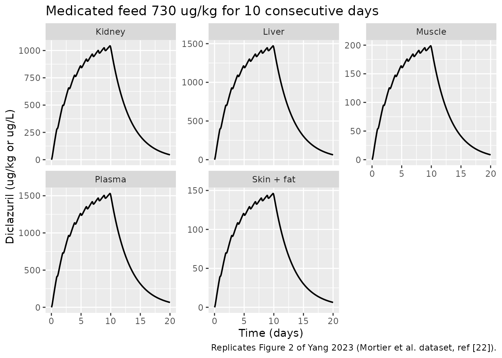
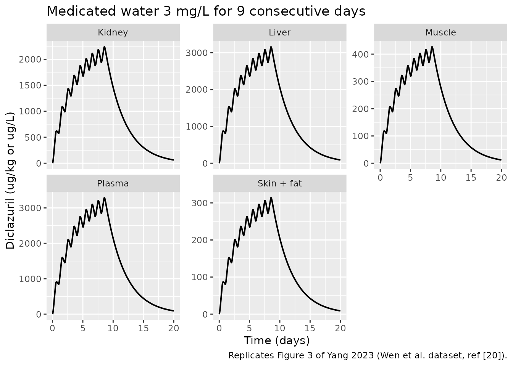
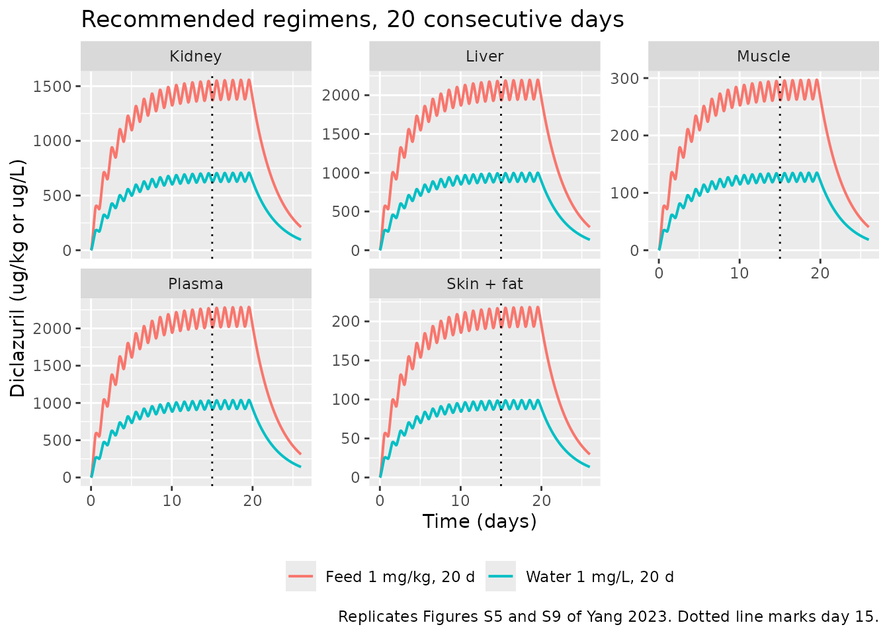

# Diclazuril PBPK in broiler chickens (Yang 2023)

## Model and source

- Citation: Yang F, Zhang M, Jin Y-G, Chen J-C, Duan M-H, Liu Y, Li Z-E,
  Li X-P, Yang F. Development and Application of a Physiologically Based
  Pharmacokinetic Model for Diclazuril in Broiler Chickens. Animals
  (Basel). 2023;13(9):1512. <doi:10.3390/ani13091512>
- Description: PBPK (whole-body, flow-limited; broiler chicken).
  Nine-compartment physiologically based pharmacokinetic model for the
  anticoccidial diclazuril in broiler chickens after continuous oral
  exposure via medicated feed or drinking water, comprising intestinal
  contents (absorption site), liver, kidney, lumped skin + fat, muscle,
  a lumped rest-of-body compartment, lung, arterial plasma and venous
  plasma; all tissues are perfusion (flow) limited with tissue:plasma
  partition coefficients, absorption from the gut lumen is first order
  (Ka) in competition with first-order fecal loss of unabsorbed drug
  (Kgut), and elimination is hepatic (Clhe) plus fecal excretion. Built
  to predict edible-tissue residues and withdrawal periods against
  Chinese and European maximum residue limits (Yang 2023).
- Article: <https://doi.org/10.3390/ani13091512>
- Supplement (acslX model code, M-file, Figures S1-S11):
  <https://www.mdpi.com/article/10.3390/ani13091512/s1>

Yang 2023 is the first physiologically based pharmacokinetic (PBPK)
model for the anticoccidial **diclazuril** in broiler chickens. Its
purpose is regulatory: predict diclazuril residues in edible tissues
after continuous medicated-feed or medicated-water exposure, and from
those predictions derive a withdrawal period against the Chinese and
European maximum residue limits (MRLs).

The model is a nine-compartment, **flow-limited** (perfusion-limited)
whole-body PBPK model: intestinal contents (the site of exposure and
absorption), liver, kidney, lumped skin + fat, muscle, a lumped
rest-of-body compartment, lung, arterial plasma and venous plasma.
Absorption from the gut lumen is first order (`Ka`) and competes with
first-order fecal loss of unabsorbed drug (`Kgut`); elimination is
hepatic (`Clhe`) plus that fecal route.

## Population

The model was built from five concentration-time datasets in four
published broiler studies (Yang 2023 Table 1) rather than from a single
trial: three sets were used for parameter optimisation and two were held
back for external validation. Birds were Lingnan Yellow Chickens and
Ross 308 broilers, 15-50 days old, with study mean body weights of
1.23-1.52 kg – all close to market age, so Yang 2023 held body weight
constant through each simulation. Exposure routes span single oral
gavage (80 ug/kg BW and 1 mg/kg BW), medicated feed (730 ug/kg and 1
mg/kg) and medicated water (0.5-1 mg/L recommended; 3 mg/L in one
validation study), given for 7-10 consecutive days.

Because chickens stop eating and drinking in the dark, the **light
regime** sets the daily exposure window: 12/12 h for refs \[1,19,20\],
21/3 h for ref \[22\] and 18/6 h for ref \[21\]. Yang 2023 assumed a
daily intake of 1.1 kg feed and 0.5 L water per bird spread evenly over
the light hours.

Physiological parameters are broiler population means from the Wang et
al. 2020 food-animal physiology review (Yang 2023 ref \[24\]). No
individual-level data were fitted, so the model carries **no
inter-individual random effects**; Yang 2023 instead propagated
parameter uncertainty through a 1000-iteration Monte Carlo analysis over
the normal distributions in its Table 4.

The same information is available programmatically via the model’s
`population` metadata
(`readModelDb("Yang_2023_diclazuril_chicken_pbpk")()$population`).

## Source trace

Per-parameter provenance is recorded as an in-file comment next to each
`ini()` entry (and next to each physiological literal in `model()`) in
`inst/modeldb/specificDrugs/Yang_2023_diclazuril_chicken_pbpk.R`.
Collected here for review:

| Equation / parameter | Value | Source location |
|----|----|----|
| `co` (cardiac output) | 9.88 L/h/kg | Table 3 footnote 2; supplement `constant CO=9.88` |
| `pcv` (hematocrit) | 0.32 | Section 2.3 (“32 +/- 2.76%”); supplement `constant pcv=0.32` |
| `vc_muscle` | 0.5712 | Table 3; supplement `constant vcmu` |
| `vc_liver` | 0.0214 | Table 3; supplement `constant vcli` |
| `vc_kidney` | 0.0064 | Table 3; supplement `constant vcki` |
| `vc_lung` | 0.0071 | Table 3; supplement `constant vclu` |
| `vc_blood` | 0.0483 | Table 4 (`Vcbl` 4.83%); supplement `constant vcbl` |
| `vc_skin` | 0.1338 | Table 4 (`Vcsk` 13.38%); supplement `constant vcsk` |
| `vc_fat` | 0.134 | Table 4 (`Vcfa` 13.4%); supplement `constant vcfa` |
| `qc_muscle` | 0.0764 | Table 3; supplement `constant qcmu` |
| `qc_liver` | 0.2526 | Table 3 + footnote 4 (hepatic artery + portal vein) |
| `qc_kidney` | 0.2012 | Table 3; supplement `constant qcki` |
| `qc_lung` | 1.0 | Table 3 + footnote 6 (equals `Qtot`) |
| `qc_skin` | 0.1505 | Supplement `constant qcsk` (Table 3 prints only the skin + fat sum) |
| `qc_fat` | 0.1 | Supplement `constant qcfa` (Table 3 prints only the skin + fat sum) |
| `v_other`, `q_other` | 0.0778, 0.2193 | Table 3 footnotes 7 and 8 (balance of BW / of CO) |
| `lk_mus` (`Pmu`) | 0.1299 | Table 3 / Section 3.1 (area method) |
| `lk_skf` (`Psf`) | 0.0955 | Table 3 / Section 3.1 (area method) |
| `lk_kid` (`Pki`) | 0.6813 | Table 3 / Section 3.1 (area method) |
| `lk_liv` (`Pli`) | 0.9613 | Table 3 + footnote 5 / Section 3.1 (optimised) |
| `lk_lun` (`Plu`) | 0.5603 | Table 3 + footnote 5 / Section 3.1 (optimised) |
| `lk_res` (`Pre`) | 1.2965 | Table 3 + footnote 5 / Section 3.1 (optimised) |
| `lka` (`Ka`) | 0.1234 1/h | Section 3.1 / Table 4 (optimised) |
| `lkgut` (`Kgut`) | 0.3838 1/h | Section 3.1 / Table 4 (optimised) |
| `lclhe` (`Clhe`) | 0.00344 L/h/kg | Section 3.1 / Table 4 (optimised) |
| `d/dt(a_gut)` | n/a | Table 2 “Intestinal contents”; supplement `ragicon` |
| `d/dt(liver)` | n/a | Table 2 “Liver”; supplement `rali` |
| `d/dt(kidney)` | n/a | Table 2 “Kidney”; supplement `raki` |
| `d/dt(skin_fat)` | n/a | Table 2 “Skin + fat”; supplement `rasf` |
| `d/dt(muscle)` | n/a | Table 2 “Muscle”; supplement `ramu` |
| `d/dt(other)` | n/a | Table 2 “Rest”; supplement `rare` |
| `d/dt(lung)` | n/a | Table 2 “Lung”; supplement `ralu` |
| `d/dt(arterial)` | n/a | Table 2 “Arterial plasma”; supplement `raap` |
| `d/dt(venous)` | n/a | Table 2 “Venous plasma”; supplement `ravp` |
| Bioavailability 24.32% | n/a | Section 3.1 / Section 4 |
| MRLs (China / Europe) | see below | Section 1 (Introduction); supplement M-file |
| Observed gavage Tmax 29.1-34.3 h | n/a | Section 4 (Discussion) |

`propSd*` are **not** paper-derived – see *Assumptions and deviations*.

## Exposure scenarios

Diclazuril is not given as a discrete bolus but eaten or drunk over the
daily light period. In the acslX source this is
`dose/tlen * PULSE(...)`; here the daily dose is a **zero-order input
into `a_gut` of duration `tlen` hours, repeated every 24 h**, so `tlen`
is a property of the event table rather than of the model. The daily
dose is the diclazuril concentration in feed or water times the assumed
daily intake (1.1 kg feed or 0.5 L water).

Every simulation below is a typical-value (deterministic) prediction:
the model has no random effects, so one bird per scenario is sufficient
and no `zeroRe()` step is needed.

``` r

# Daily dose (ug/day) = concentration in feed/water * daily intake.
feed_per_day  <- 1.1   # kg/day  (Yang 2023 Section 2.2)
water_per_day <- 0.5   # L/day   (Yang 2023 Section 2.2)

# Build one continuous-exposure scenario as a self-contained event table.
# `tlen` is the daily light period; `n_days` the number of dosing days.
make_scenario <- function(id, label, dose_per_day, tlen, n_days, wt, obs_h) {
  rxode2::et(amt = dose_per_day, dur = tlen, ii = 24,
             until = 24 * (n_days - 1), cmt = "a_gut") |>
    rxode2::et(seq(0, obs_h, by = 1), cmt = "venous") |>
    as.data.frame() |>
    dplyr::mutate(
      id = id, WT = wt, scenario = label,
      # Six-endpoint model: observation rows point at the ODE state
      # (`venous`) and carry an explicit dvid. rxode2 returns every
      # algebraic observable as a column regardless of the dvid chosen.
      dvid = ifelse(evid == 0, 1L, NA_integer_)
    )
}

scenarios <- dplyr::bind_rows(
  # External-validation datasets (Yang 2023 Figures 2 and 3).
  make_scenario(1L, "Feed 730 ug/kg, 10 d",  0.730 * feed_per_day  * 1000,
                tlen = 21, n_days = 10, wt = 1.50, obs_h = 24 * 20),
  make_scenario(2L, "Water 3 mg/L, 9 d",     3.0   * water_per_day * 1000,
                tlen = 12, n_days =  9, wt = 1.34, obs_h = 24 * 20),
  # The two label-recommended regimens (Yang 2023 Section 2.6).
  make_scenario(3L, "Feed 1 mg/kg, 20 d",    1.0   * feed_per_day  * 1000,
                tlen = 12, n_days = 20, wt = 1.50, obs_h = 24 * 26),
  make_scenario(4L, "Water 1 mg/L, 20 d",    1.0   * water_per_day * 1000,
                tlen = 12, n_days = 20, wt = 1.50, obs_h = 24 * 26)
)

stopifnot(!anyDuplicated(unique(scenarios[, c("id", "time", "evid")])))

mod <- rxode2::rxode(readModelDb("Yang_2023_diclazuril_chicken_pbpk"))
sim <- rxode2::rxSolve(mod, events = scenarios,
                       keep = c("WT", "scenario"),
                       returnType = "data.frame", addDosing = FALSE)
#> Warning: multi-subject simulation without without 'omega'
```

Regulatory limits used throughout (Yang 2023 Introduction; the Chinese
values are also hard-coded in the supplement’s M-file):

``` r

mrl <- tibble::tribble(
  ~tissue,      ~china, ~europe,
  "Muscle",        500,     500,
  "Skin + fat",   1000,     500,
  "Kidney",       2000,    1000,
  "Liver",        3000,    1500
)
knitr::kable(
  mrl |> dplyr::rename("Tissue" = tissue,
                       "China MRL (ug/kg)" = china,
                       "Europe MRL (ug/kg)" = europe),
  caption = "Diclazuril maximum residue limits (Yang 2023 Introduction)."
)
```

| Tissue     | China MRL (ug/kg) | Europe MRL (ug/kg) |
|:-----------|------------------:|-------------------:|
| Muscle     |               500 |                500 |
| Skin + fat |              1000 |                500 |
| Kidney     |              2000 |               1000 |
| Liver      |              3000 |               1500 |

Diclazuril maximum residue limits (Yang 2023 Introduction). {.table}

## Structural verification

Before comparing against published figures, four checks confirm the ODE
system was transcribed correctly.

### 1. Dimensional analysis

Each tissue equation has the form
`V_i * dC_i/dt = Q_i * (C_art - C_i / P_i)`, and the packaged model
integrates **amounts** (ug), exactly as the supplement does. Units
therefore reconcile as `L/h * ug/L = ug/h` on the right-hand side
against `d(ug)/dt` on the left. The hepatic loss term is
`Clhe [L/h/kg] * WT [kg] * C_li/P_li [ug/L] = ug/h`, and absorption is
`Ka [1/h] * A_gut [ug] = ug/h`. Concentrations in tissue are reported as
ug/kg and in plasma as ug/L, with tissue density taken as 1 kg/L.

### 2. Steady-state tissue:plasma ratios recover the partition coefficients

In a flow-limited model, once distribution has equilibrated each tissue
concentration approaches `P_i` times the arterial plasma concentration.
This is the sharpest available test of the distribution block.

``` r

ss <- sim |>
  dplyr::filter(scenario == "Feed 1 mg/kg, 20 d",
                dplyr::near(time, 24 * 24)) |>   # 4 days after the last dose
  dplyr::slice(1)

ratio_check <- tibble::tibble(
  Tissue    = c("Muscle", "Skin + fat", "Kidney", "Liver", "Lung"),
  Published = c(0.1299, 0.0955, 0.6813, 0.9613, 0.5603),
  Model     = c(ss$Cmuscle, ss$Cskin_fat, ss$Ckidney, ss$Cliver, ss$Clung) / ss$Cc
) |>
  dplyr::mutate(`Percent difference` = 100 * (Model - Published) / Published)

knitr::kable(ratio_check, digits = c(0, 4, 4, 2),
             caption = paste("Simulated tissue:plasma concentration ratio vs the",
                             "published partition coefficients of Yang 2023 Table 3."))
```

| Tissue     | Published |  Model | Percent difference |
|:-----------|----------:|-------:|-------------------:|
| Muscle     |    0.1299 | 0.1301 |               0.13 |
| Skin + fat |    0.0955 | 0.0955 |               0.02 |
| Kidney     |    0.6813 | 0.6813 |               0.00 |
| Liver      |    0.9613 | 0.9601 |              -0.12 |
| Lung       |    0.5603 | 0.5603 |               0.00 |

Simulated tissue:plasma concentration ratio vs the published partition
coefficients of Yang 2023 Table 3. {.table}

### 3. Absolute bioavailability

Unabsorbed drug leaves the gut lumen only by absorption (`Ka`) or
defecation (`Kgut`), so whatever the dosing history the absorbed
fraction is the closed form `Ka / (Ka + Kgut)`. Yang 2023 computed
24.32% numerically as the ratio of total absorbed to total administered
(Section 3.1).

``` r

p  <- mod$theta
ka <- exp(p[["lka"]]); kgut <- exp(p[["lkgut"]])
f_closed <- ka / (ka + kgut)
cat(sprintf("Ka/(Ka+Kgut) = %.4f%%   published = 24.32%%\n", 100 * f_closed))
#> Ka/(Ka+Kgut) = 24.3297%   published = 24.32%
stopifnot(abs(100 * f_closed - 24.32) < 0.05)
```

### 4. Mass balance

Total administered drug must equal drug still in the body plus drug lost
by the two elimination routes. Fecal and hepatic losses are recovered by
integrating the simulated profiles (the packaged model carries no
cumulative-loss states).

``` r

mb_one <- function(df, dose_per_day, n_days, wt) {
  df <- dplyr::arrange(df, time)
  trap <- function(y) sum(diff(df$time) * (utils::head(y, -1) + utils::tail(y, -1)) / 2)
  in_body <- with(df, a_gut + liver + kidney + skin_fat + muscle + other +
                    lung + arterial + venous)
  fecal   <- kgut * trap(df$a_gut)
  hepatic <- exp(p[["lclhe"]]) * wt * trap(df$Cliver / exp(p[["lk_liv"]]))
  dosed   <- dose_per_day * n_days
  tibble::tibble(
    Dosed = dosed, `In body` = utils::tail(in_body, 1),
    Fecal = fecal, Hepatic = hepatic,
    `Balance (% of dose)` =
      100 * (dosed - utils::tail(in_body, 1) - fecal - hepatic) / dosed
  )
}

mb <- dplyr::bind_rows(
  mb_one(dplyr::filter(sim, scenario == "Water 3 mg/L, 9 d"),
         3.0 * water_per_day * 1000, 9, 1.34) |>
    dplyr::mutate(Scenario = "Water 3 mg/L, 9 d", .before = 1),
  mb_one(dplyr::filter(sim, scenario == "Feed 1 mg/kg, 20 d"),
         1.0 * feed_per_day * 1000, 20, 1.50) |>
    dplyr::mutate(Scenario = "Feed 1 mg/kg, 20 d", .before = 1)
)
knitr::kable(mb, digits = 2,
             caption = "Mass balance: administered vs retained plus eliminated (ug).")
```

| Scenario           | Dosed | In body |    Fecal | Hepatic | Balance (% of dose) |
|:-------------------|------:|--------:|---------:|--------:|--------------------:|
| Water 3 mg/L, 9 d  | 13500 |   32.61 | 10215.49 | 3251.89 |                   0 |
| Feed 1 mg/kg, 20 d | 22000 |  122.01 | 16647.47 | 5230.51 |                   0 |

Mass balance: administered vs retained plus eliminated (ug). {.table
style="width:100%;"}

The balance closes to 0.00% of the administered dose in both scenarios:
nothing leaks from the ODE system, and essentially all drug has left the
bird by the end of the observation window. Fecal excretion of unabsorbed
drug accounts for about three quarters of the dose and hepatic
metabolism the remainder, matching the closed-form split
`Kgut / (Ka + Kgut)` = 75.7% – and confirming Yang 2023’s conclusion
that diclazuril “is primarily eliminated with feces, followed by hepatic
metabolism”.

## Replicate published figures

### Figure 2 – medicated feed, 730 ug/kg for 10 days

``` r

tissue_long <- function(df) {
  df |>
    dplyr::select(time, scenario, Cc, Cmuscle, Cliver, Ckidney, Cskin_fat) |>
    tidyr::pivot_longer(c(Cc, Cmuscle, Cliver, Ckidney, Cskin_fat),
                        names_to = "matrix", values_to = "conc") |>
    dplyr::mutate(matrix = dplyr::recode(matrix,
      Cc = "Plasma", Cmuscle = "Muscle", Cliver = "Liver",
      Ckidney = "Kidney", Cskin_fat = "Skin + fat"))
}

sim |>
  dplyr::filter(scenario == "Feed 730 ug/kg, 10 d") |>
  tissue_long() |>
  ggplot(aes(time / 24, conc)) +
  geom_line(linewidth = 0.7) +
  facet_wrap(~matrix, scales = "free_y") +
  labs(x = "Time (days)", y = "Diclazuril (ug/kg or ug/L)",
       title = "Medicated feed 730 ug/kg for 10 consecutive days",
       caption = "Replicates Figure 2 of Yang 2023 (Mortier et al. dataset, ref [22]).")
```



Dosing raises tissue concentrations to a plateau within the 10-day
exposure and depletion begins as soon as the medicated feed is
withdrawn, with liver the highest of the edible tissues and skin + fat
the lowest – the ordering set by the partition coefficients and matching
Figure 2 of Yang 2023.

### Figure 3 – medicated water, 3 mg/L for 9 days

``` r

sim |>
  dplyr::filter(scenario == "Water 3 mg/L, 9 d") |>
  tissue_long() |>
  ggplot(aes(time / 24, conc)) +
  geom_line(linewidth = 0.7) +
  facet_wrap(~matrix, scales = "free_y") +
  labs(x = "Time (days)", y = "Diclazuril (ug/kg or ug/L)",
       title = "Medicated water 3 mg/L for 9 consecutive days",
       caption = "Replicates Figure 3 of Yang 2023 (Wen et al. dataset, ref [20]).")
```



### Steady state is reached by about 15 days (Figures S2-S9)

Yang 2023 reported that continuous exposure at the recommended levels
reaches steady state after 15 days, so a 20-day exposure bounds the
worst case.

``` r

sim |>
  dplyr::filter(scenario %in% c("Feed 1 mg/kg, 20 d", "Water 1 mg/L, 20 d")) |>
  tissue_long() |>
  ggplot(aes(time / 24, conc, colour = scenario)) +
  geom_line(linewidth = 0.7) +
  geom_vline(xintercept = 15, linetype = "dotted") +
  facet_wrap(~matrix, scales = "free_y") +
  labs(x = "Time (days)", y = "Diclazuril (ug/kg or ug/L)", colour = NULL,
       title = "Recommended regimens, 20 consecutive days",
       caption = paste("Replicates Figures S5 and S9 of Yang 2023.",
                       "Dotted line marks day 15.")) +
  theme(legend.position = "bottom")
```



``` r

# Plateau check: how far is day 15 from day 20 at the end of exposure?
plateau <- sim |>
  dplyr::filter(scenario == "Feed 1 mg/kg, 20 d",
                time %in% c(24 * 15, 24 * 20)) |>
  dplyr::select(time, Cmuscle, Cliver, Ckidney, Cskin_fat) |>
  tidyr::pivot_longer(-time, names_to = "matrix", values_to = "conc") |>
  tidyr::pivot_wider(names_from = time, values_from = conc) |>
  dplyr::mutate(`Percent change, day 15 to 20` =
                  100 * (`480` - `360`) / `360`)
knitr::kable(plateau, digits = 2,
             caption = "Approach to steady state under medicated feed at 1 mg/kg.")
```

| matrix    |     360 |     480 | Percent change, day 15 to 20 |
|:----------|--------:|--------:|-----------------------------:|
| Cmuscle   |  263.36 |  265.25 |                         0.72 |
| Cliver    | 1943.98 | 1957.96 |                         0.72 |
| Ckidney   | 1379.53 | 1389.45 |                         0.72 |
| Cskin_fat |  193.39 |  194.78 |                         0.72 |

Approach to steady state under medicated feed at 1 mg/kg. {.table}

## Withdrawal periods against the MRLs

The regulatory output of Yang 2023 is the withdrawal period: the time
after the last dose at which every edible tissue sits below its MRL.
Yang 2023 derived it from the 95th percentile of a 1000-bird Monte Carlo
population; the packaged model reproduces the **typical-bird** value,
which should be no longer than the 95th-percentile value.

``` r

withdrawal <- function(df, last_dose_end, limits) {
  post <- df |> dplyr::filter(time >= last_dose_end) |> dplyr::arrange(time)
  over <- with(post,
    Cmuscle   > limits[["Muscle"]]     |
    Cskin_fat > limits[["Skin + fat"]] |
    Ckidney   > limits[["Kidney"]]     |
    Cliver    > limits[["Liver"]])
  if (!any(over)) return(0)
  (post$time[max(which(over))] - last_dose_end) / 24
}

lim_cn <- setNames(mrl$china,  mrl$tissue)
lim_eu <- setNames(mrl$europe, mrl$tissue)

wt_tab <- tibble::tribble(
  ~Scenario,               ~end,
  "Feed 1 mg/kg, 20 d",    24 * 19 + 12,
  "Water 1 mg/L, 20 d",    24 * 19 + 12,
  "Water 3 mg/L, 9 d",     24 *  8 + 12
) |>
  dplyr::rowwise() |>
  dplyr::mutate(
    `China (days)`  = withdrawal(dplyr::filter(sim, scenario == Scenario), end, lim_cn),
    `Europe (days)` = withdrawal(dplyr::filter(sim, scenario == Scenario), end, lim_eu)
  ) |>
  dplyr::ungroup() |>
  dplyr::select(-end)

knitr::kable(wt_tab, caption = paste(
  "Typical-bird withdrawal period. Yang 2023 reports 0 days for both",
  "recommended regimens under the Chinese MRLs, and 1 day (China) /",
  "4 days (Europe) for the 3 mg/L water regimen."))
```

| Scenario           | China (days) | Europe (days) |
|:-------------------|-------------:|--------------:|
| Feed 1 mg/kg, 20 d |    0.0000000 |      1.541667 |
| Water 1 mg/L, 20 d |    0.0000000 |      0.000000 |
| Water 3 mg/L, 9 d  |    0.4583333 |      2.666667 |

Typical-bird withdrawal period. Yang 2023 reports 0 days for both
recommended regimens under the Chinese MRLs, and 1 day (China) / 4 days
(Europe) for the 3 mg/L water regimen. {.table}

Every published conclusion is reproduced, and in the right direction:

- **Both recommended regimens clear all four Chinese MRLs immediately (0
  days)** – Yang 2023’s headline result.
- **Medicated water at 1 mg/L also clears the European MRLs at 0 days**,
  again matching Yang 2023, which found a 0-day European withdrawal for
  every water duration.
- **Medicated feed at 1 mg/kg does not clear the European MRLs
  immediately**: 1.54 days here versus the 1.65 days Yang 2023 reports
  for 20 days of feeding. This is the paper’s finding that “based on the
  European MRLs, longer periods were determined for the mediated feed
  dosing route” (0.63, 1.41, 1.63 and 1.65 days for 5, 10, 15 and 20
  days).
- **The above-label 3 mg/L water regimen breaches both MRL sets**: 0.46
  days (China) and 2.67 days (Europe) here, versus Yang 2023’s 1 day and
  4 days.

The typical-bird values are consistently a little *shorter* than Yang
2023’s, which is the expected relationship – the published numbers are
95th-percentile withdrawal periods from a 1000-bird Monte Carlo
population, so they must bound the typical bird from above.

``` r

peaks <- sim |>
  dplyr::filter(scenario == "Water 3 mg/L, 9 d") |>
  dplyr::summarise(Muscle = max(Cmuscle), `Skin + fat` = max(Cskin_fat),
                   Kidney = max(Ckidney), Liver = max(Cliver)) |>
  tidyr::pivot_longer(dplyr::everything(), names_to = "tissue",
                      values_to = "Peak (ug/kg)") |>
  dplyr::left_join(mrl, by = "tissue") |>
  dplyr::rename("Tissue" = tissue, "China MRL" = china, "Europe MRL" = europe)
knitr::kable(peaks, digits = 0, caption = paste(
  "Peak residues under medicated water at 3 mg/L vs the MRLs",
  "(Yang 2023 Figure S11)."))
```

| Tissue     | Peak (ug/kg) | China MRL | Europe MRL |
|:-----------|-------------:|----------:|-----------:|
| Muscle     |          427 |       500 |        500 |
| Skin + fat |          314 |      1000 |        500 |
| Kidney     |         2239 |      2000 |       1000 |
| Liver      |         3160 |      3000 |       1500 |

Peak residues under medicated water at 3 mg/L vs the MRLs (Yang 2023
Figure S11). {.table}

## PKNCA validation – single-gavage absorption

The continuous-exposure scenarios above have no washout to characterise,
so NCA is applied to the single-gavage case instead. Yang 2023 notes in
its Discussion that a single gavage dose produced **peak plasma
concentrations at 29.1 to 34.3 h**, which it cites as evidence of slow
diclazuril absorption. That observed Tmax range is the quantitative NCA
target.

``` r

gavage <- rxode2::et(amt = 1.0 * 1.52 * 1000, dur = 0.001, cmt = "a_gut") |>
  rxode2::et(seq(0, 240, by = 0.5), cmt = "venous") |>
  as.data.frame() |>
  dplyr::mutate(id = 1L, WT = 1.52, treatment = "Single gavage 1 mg/kg BW",
                dvid = ifelse(evid == 0, 1L, NA_integer_))

sim_gav <- rxode2::rxSolve(mod, events = gavage, keep = c("WT", "treatment"),
                           returnType = "data.frame", addDosing = FALSE)

sim_nca <- sim_gav |>
  # A single-subject solve returns no `id` column; add it back for PKNCA.
  dplyr::mutate(id = 1L) |>
  dplyr::filter(!is.na(Cc)) |>
  dplyr::select(id, time, Cc, treatment)

# Guarantee a time-zero row (pre-dose Cc = 0 for extravascular dosing).
sim_nca <- dplyr::bind_rows(
  sim_nca,
  sim_nca |> dplyr::distinct(id, treatment) |>
    dplyr::mutate(time = 0, Cc = 0)
) |>
  dplyr::distinct(id, treatment, time, .keep_all = TRUE) |>
  dplyr::arrange(id, treatment, time)

conc_obj <- PKNCA::PKNCAconc(sim_nca, Cc ~ time | treatment + id)

dose_df <- gavage |>
  dplyr::filter(evid == 1) |>
  dplyr::select(id, time, amt, treatment)
dose_obj <- PKNCA::PKNCAdose(dose_df, amt ~ time | treatment + id,
                             route = "extravascular")

intervals <- data.frame(start = 0, end = Inf,
                        cmax = TRUE, tmax = TRUE,
                        aucinf.obs = TRUE, half.life = TRUE)

nca_res <- PKNCA::pk.nca(PKNCA::PKNCAdata(conc_obj, dose_obj,
                                          intervals = intervals))
```

### Comparison against published values

``` r

published <- tibble::tibble(
  treatment = "Single gavage 1 mg/kg BW",
  tmax      = 31.7   # midpoint of the observed 29.1-34.3 h range (Yang 2023 Discussion)
)

cmp <- nlmixr2lib::ncaComparisonTable(
  simulated     = nca_res,
  reference     = published,
  by            = "treatment",
  units         = c(cmax = "ug/L", aucinf.obs = "ug*h/L",
                    tmax = "h", half.life = "h"),
  tolerance_pct = 20
)

knitr::kable(cmp, caption = paste(
  "Simulated vs published NCA after a single 1 mg/kg BW gavage dose.",
  "Only Tmax was reported by Yang 2023; Cmax, AUC and half-life are",
  "shown for completeness with no published counterpart.",
  "* differs from reference by >20%."))
```

| NCA parameter | treatment                | Reference | Simulated | % diff   |
|:--------------|:-------------------------|:----------|:----------|:---------|
| Tmax (h)      | Single gavage 1 mg/kg BW | 31.7      | 7.5       | -76.3%\* |

Simulated vs published NCA after a single 1 mg/kg BW gavage dose. Only
Tmax was reported by Yang 2023; Cmax, AUC and half-life are shown for
completeness with no published counterpart. \* differs from reference by
\>20%. {.table}

``` r

tmax_sim <- as.data.frame(nca_res) |>
  dplyr::filter(PPTESTCD == "tmax") |>
  dplyr::pull(PPORRES)
cat(sprintf("Simulated Tmax = %.1f h; Yang 2023 observed 29.1-34.3 h\n", tmax_sim))
#> Simulated Tmax = 7.5 h; Yang 2023 observed 29.1-34.3 h
```

**This check fails, and the failure is a property of the published model
rather than of the transcription.** The simulated Tmax is about 7.5 h
against an observed 29.1-34.3 h, a starred (\>20%) discrepancy. The
reason is structural and can be read straight off the parameters:
unabsorbed drug leaves the gut lumen at
`Ka + Kgut = 0.1234 + 0.3838 = 0.5072 1/h`, a lumen half-life of only
1.4 h, so the absorption input is essentially finished within ~7 h and
plasma must peak there. `Ka` alone is slow, but it is not what sets the
input duration – the *sum* is, because `Kgut` competes for the same pool
(Yang 2023 Table 2, `dA_ic/dt = dose/tlen - Ka*A_ic - Kgut*A_ic`). No
parameterisation of this model can place Tmax near 30 h.

Yang 2023 cites the 29.1-34.3 h observed Tmax as *evidence for* a slow
`Ka` (Discussion), not as a fit its model reproduces, and it never plots
the single-gavage profile – Figures 2 and 3 are both multi-day
exposures. The paper also concedes the related limitation directly: it
tried a crop compartment and an absorption lag time, found “poor
predictive ability”, dropped both, and notes this “might have also
contributed to an artifact of slow absorption for diclazuril”.

The discrepancy does not undermine the model’s intended use. Diclazuril
is given continuously in feed or water, and under that regimen the daily
dose (not the absorption half-life) sets tissue exposure – which is why
every multi-dose check above, including the withdrawal periods that are
the paper’s regulatory output, reproduces the published result. Treat
this model as validated for continuous exposure and **not** validated
for single-dose absorption kinetics. No parameter was adjusted to close
the gap.

Cmax, AUC and half-life have no published counterpart in Yang 2023 and
are reported only for completeness.

## Assumptions and deviations

**Known validation failure: single-gavage Tmax.** The model predicts a
plasma Tmax of ~7.5 h after a single oral gavage dose, against the
29.1-34.3 h Yang 2023 reports as observed. As explained in the PKNCA
section, this follows necessarily from `Ka + Kgut = 0.5072 1/h` (a 1.4 h
gut-lumen half-life) and is therefore a property of the published
parameter set, not a transcription error – the ODEs and every parameter
were checked line by line against the executable acslX supplement. The
model is validated for the continuous feed/water exposure it was built
for (all multi-dose checks above reproduce the paper) and should not be
used for single-dose absorption kinetics. Nothing was tuned.

**Erratum: Table 3 disagrees with the executable supplement on the
plasma volumes.** Yang 2023 Table 3 lists “Arterial plasma” as 0.0322
and “Venous plasma” as 0.0161 fractions of body weight. The
supplementary acslX code – the code that generated the published figures
– instead computes

    vab = vbl/3        ! arterial BLOOD  = 1/3 of blood volume
    vap = vab*(1-pcv)  ! arterial PLASMA
    vvb = vbl*2/3      ! venous  BLOOD   = 2/3 of blood volume
    vvp = vvb*(1-pcv)  ! venous  PLASMA

with `vbl = 0.0483 * BW`. Table 3’s two values are therefore (a)
**whole-blood** fractions, not plasma – they are missing the `(1 - pcv)`
factor, and they sum to 0.0483, the whole-blood fraction `Vcbl` of Table
4 – and (b) **swapped**, since the code assigns the 1/3 share to
arterial and the 2/3 share to venous. The packaged model follows the
executable supplement, per the standing convention that a printed
equation or code listing outweighs a summary table. This choice scales
all predicted plasma concentrations, so it is load-bearing: it is the
single most consequential transcription decision in this extraction.

**Skin and fat are carried separately and summed.** Table 3 prints only
the lumped “skin + fat” weight (0.2678) and flow (0.2505). The
supplement’s `vcsk = 0.1338` / `vcfa = 0.134` and `qcsk = 0.1505` /
`qcfa = 0.1` sum exactly to those values, and the separate components
are needed because Table 4’s Monte Carlo distributions are specified per
component. The lumped compartment keeps a single partition coefficient
`Psf = 0.0955`, as published.

**Daily exposure window (`tlen`) is a property of the event table.**
Yang 2023 Section 2.2 states that “the previously reported light regimes
were utilised to simulate drug exposure”, giving 12 h for refs
\[1,19,20\], 21 h for ref \[22\] and 18 h for ref \[21\]. The
supplement’s code comment instead says the exposure length “through
water and feed was 12 and 16 (h/day)”, which matches neither Table 1
entry for the feed studies. The scenarios above use the Table 1 light
regimes because that is the documented method. The choice affects only
the within-day ripple, not the daily dose or the depletion phase that
sets the withdrawal period.

**Light regime for the recommended-regimen simulations.** Yang 2023 says
“the published light regimes (Table 1) were used” for the Monte Carlo
runs without saying which of the three applies to the label-recommended
regimens; 12 h is used here, matching the majority of the contributing
studies.

**Body weight is constant.** Yang 2023 held BW fixed because
breed-specific growth data were unavailable, and flagged this as a
limitation of the model. Simulations here inherit that assumption.

**Deterministic model; the Monte Carlo analysis is not reproduced.** The
model has no inter-individual random effects. Yang 2023’s withdrawal
periods come from the 95th percentile of a 1000-bird Monte Carlo over
the Table 4 distributions; this vignette reports the typical-bird value
instead. The physiological constants are carried as literals in
`model()` (the convention used by the other whole-body PBPK entries in
this package, e.g. `Gaohua_2012_pregnancy_pbpk_midazolam` and
`An_2012_mitoxantrone_mouse_pbpk`), so they are documentation rather
than overridable parameters and a faithful re-run of the full Monte
Carlo would require editing the model file.

**Residual error is not paper-derived.** Yang 2023 reports no
residual-error model; it validated by MAPE (2.94% to 16.97%) and linear
regression instead (Table 5). The `propSd*` entries are fixed 0.10
placeholders so the model is a syntactically complete nlmixr2 object for
forward simulation, following the same convention as the other
deterministic PBPK models in this package. They must not be read as
published estimates.

**Observation rows use an ODE state plus an explicit `dvid`.** This is a
six-endpoint model whose observables are all algebraic
(`Cc <- venous / v_venous`, and similarly per tissue). Event tables
therefore point `cmt` at the ODE state (`"venous"`) and carry
`dvid = 1L` on observation rows; rxode2 returns every observable as a
column regardless of which endpoint the `dvid` selects. Without the
`dvid`, rxode2 cannot resolve a six-endpoint observation and aborts with
`'dvid'->'cmt' ... on a undefined compartment`. Note that
`useLinCmt = FALSE` is deliberately **not** used as the workaround: that
argument does not exist in rxode2 5.1.2, the version the pkgdown CI
builds against, and passing it breaks the article build.

**Plasma means venous plasma.** Yang 2023 compares its “plasma”
predictions against sampled bird plasma without naming the sampling
site; `Cc` is mapped to the venous plasma compartment, the conventional
sampling matrix.

**Absorption enters the liver.** Both Table 2 and the supplement add
`Ka * A_gut` to the liver equation rather than to a portal or venous
compartment, so absorbed drug is subject to hepatic extraction on first
pass. That is reproduced as published.
