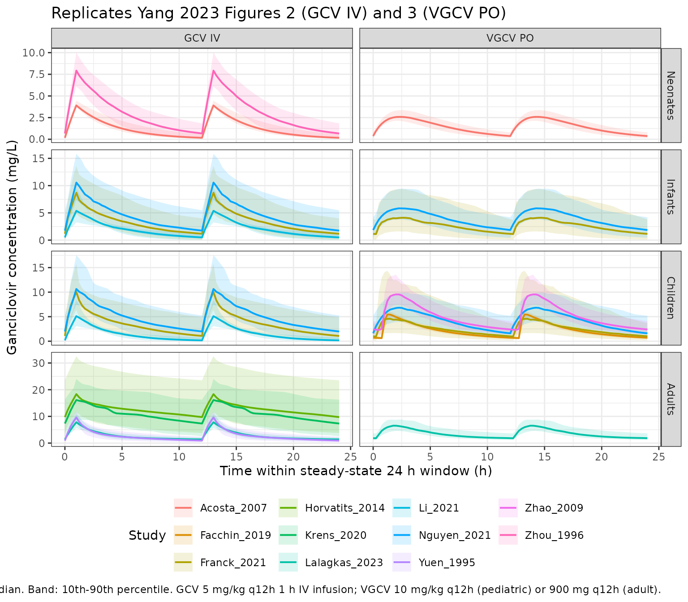
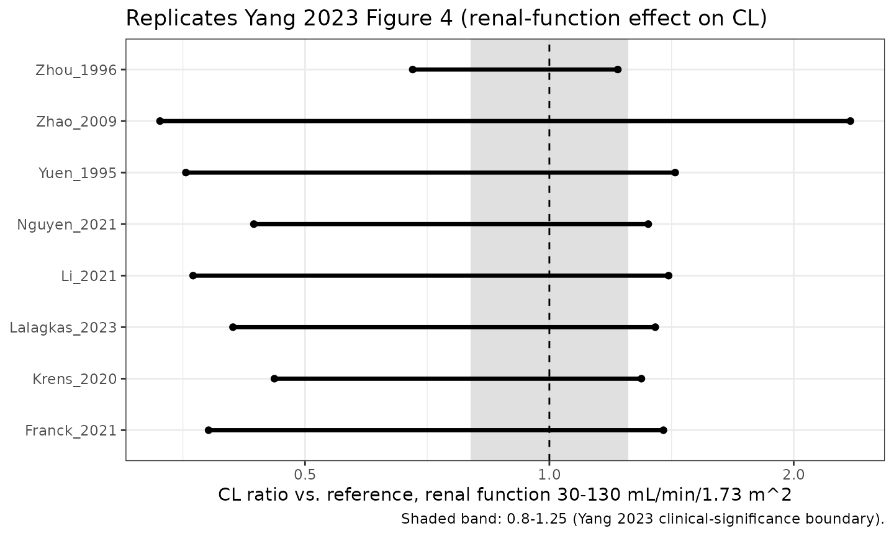

# Ganciclovir and valganciclovir population-PK model repository (Yang 2023)

## Model and source

Yang 2023 is a PRISMA-registered systematic review that assembled a
*parametric population-PK model repository* for ganciclovir (GCV) and
its oral prodrug valganciclovir (VGCV). It identified 16 published
population-PK models, replicated each in `rxode2`, ran a cross-model
quality-control (QC) similarity comparison on four age-stratified
typical virtual patients, compared covariate effects on clearance, and
computed the probability of target attainment (PTA) for the commonly
used dosing regimens.

The review is unusual among systematic reviews in that its Table 3
**tabulates the complete fixed-effect equations, between-subject
variability, and residual-error magnitude for every constituent model**.
That makes the review itself a usable extraction source, so the models
below are transcribed from Yang 2023 Table 3 rather than skipped as a
secondary source.

- Article: <https://doi.org/10.3390/pharmaceutics15071801>
- Yang 2023 supplementary materials (Tables S1-S2, Figures S1-S2, and
  the repository’s R source code) are hosted at
  <https://www.mdpi.com/article/10.3390/pharmaceutics15071801/s1> and
  were **not retrievable** during extraction (the MDPI endpoint returns
  HTTP 403). Nothing in this vignette depends on them; see *Assumptions
  and deviations*.

### Models contributed by this paper

All 11 of the review’s 16 models that were not already in nlmixr2lib are
packaged here. The other five were already present, extracted directly
from their **primary** publications, and are **not** re-extracted from
the review (`Caldes_2009_ganciclovir`, `Chen_2021_ganciclovir`,
`Perrottet_2009_ganciclovir`, `Vezina_2010_valganciclovir`,
`Vezina_2014_valganciclovir`). Coverage of the review is therefore
complete: 11 + 5 = 16.

| Model | Compartments | Route(s) | Population |
|:---|:---|:---|:---|
| Lalagkas_2023_ganciclovir | 2 | GCV IV + VGCV PO | Adult SOT recipients with CMV infection |
| Nguyen_2021_ganciclovir | 2 | GCV IV + VGCV PO | Pediatrics, incl. critically ill children |
| Franck_2021_ganciclovir | 2 | GCV IV + VGCV PO | Pediatric SOT and SCT recipients |
| Li_2021_ganciclovir | 1 | GCV IV | Critically ill children |
| Krens_2020_ganciclovir | 1 | GCV IV | Critically ill adults |
| Facchin_2019_ganciclovir | 2 | VGCV PO | Children with a renal transplant |
| Horvatits_2014_ganciclovir | 2 | GCV IV | Critically ill adults on CVVHDF |
| Zhao_2009_ganciclovir | 2 | VGCV PO | Pediatric renal transplant patients |
| Acosta_2007_ganciclovir | 1 | GCV IV + VGCV PO | Neonates with congenital CMV disease |
| Zhou_1996_ganciclovir | 1 | GCV IV | Newborns with congenital CMV disease |
| Yuen_1995_ganciclovir | 2 | GCV IV | CMV retinitis, CMV urine shedding, or SOT with renal dysfunction |

Models extracted from Yang 2023 Table 3. {.table}

Every model file records both citations – the primary publication and
the Yang 2023 review it was transcribed from:

``` r

cat(rxode2::rxode2(readModelDb("Krens_2020_ganciclovir"))$reference)
#> ℹ parameter labels from comments will be replaced by 'label()'
#> Krens SD, Hodiamont CJ, Juffermans NP, Mathot RAA, van Hest RM. Population Pharmacokinetics of Ganciclovir in Critically Ill Patients. Ther Drug Monit. 2020;42(2):295-301. doi:10.1097/FTD.0000000000000689. Parameters transcribed from Yang W, Mak W, Gwee A, Gu M, Wu Y, Shi Y, He Q, Xiang X, Han B, Zhu X. Establishment and Evaluation of a Parametric Population Pharmacokinetic Model Repository for Ganciclovir and Valganciclovir. Pharmaceutics. 2023;15(7):1801. doi:10.3390/pharmaceutics15071801 (Table 3).
```

## Population

The 11 packaged models were fitted to 11 separate cohorts published
between 1995 and 2023, spanning newborns to adults. The table below
reproduces the per-study demographics from Yang 2023 Table 2 (the
review’s own tabulation of the primary studies).

| Study | Country | N | Observations | Age (median/mean) | Weight | Formulation |
|:---|:---|:---|:---|:---|:---|:---|
| Lalagkas 2023 | Spain | 60 | 640 | 57 y (22-78) | 68 kg (43-131) | GCV i.v. + VGCV p.o. |
| Nguyen 2021 | France | 105 | 374 | 2.5 y (0.01-17.3) | 11.7 kg (2.6-80) | GCV i.v. + VGCV p.o. |
| Franck 2021 | Canada | 50 | 580 | 7.5 y (0.5-17.4) | 26.7 kg (5.96-87) | GCV i.v. + VGCV p.o. |
| Li 2021 | China | 104 | 138 | 2.46 y (0.10-12.83) | 12.0 kg (2.5-55.0) | GCV i.v. |
| Krens 2020 | Netherlands | 34 | 128 | 56 y (30-82) | 70 kg (44-140) | GCV i.v. |
| Facchin 2019 | France | 104 | 1212 | 12.2 y (2.1-20.5) | 30.35 kg (11.9-83.0) | VGCV p.o. |
| Horvatits 2014 | see note | 9 | NR | 56 +/- 9 y | 86 +/- 25 kg | GCV i.v. |
| Zhao 2009 | France | 22 | 164 | 9 y (3-17) | 28 kg (12-76) | VGCV p.o. |
| Acosta 2007 | USA | 24 | 484 | 30 d (11-34) / 20 d (8-33) | 2.7 / 2.9 kg | GCV i.v. + VGCV p.o. |
| Zhou 1996 | USA | 27 | 219 | Newborns | NR | GCV i.v. |
| Yuen 1995 | USA | 53 | 558 | NR | NR | GCV i.v. |

Per-study demographics, from Yang 2023 Table 2. NR = not reported.
{.table}

Yang 2023 Table 2 lists the Horvatits 2014 country as “Australia”; the
Horvatits 2014 author group is Vienna-based, so this is flagged in that
model’s `population$regions` as a probable transcription error in the
review, to be resolved against the primary publication.

The same information is available programmatically per model, e.g.
`rxode2::rxode2(readModelDb("Franck_2021_ganciclovir"))$population`.

Across the 16 reviewed models the review found (Yang 2023 Sections
3.3.3, 4.3): body size (weight or BSA) was a significant covariate on CL
in 9/16 studies, and renal function (eGFR, CLcr, or serum creatinine) in
13/16 – every one of which produced a clinically significant (\>20%)
change in CL over the covariate’s normal range. Sex reached significance
in only two studies and was not clinically meaningful.

## Source trace

Per-parameter provenance is recorded as an in-file comment next to each
`ini()` line in `inst/modeldb/specificDrugs/<model>.R`. **Every**
structural parameter, between-subject variance, and residual-error term
in all 11 models comes from a single source location: **Yang 2023 Table
3** (“Model strategies and final pharmacokinetic parameters of the
included studies”), in the row for that study – with the group-effect
coefficients of `Nguyen_2021` and `Yuen_1995` defined in Table 3’s own
footnote. The table below collects the structural equations exactly as
Table 3 prints them.

| Model | Fixed-effect equations (verbatim from Yang 2023 Table 3) | BSV (%) | RUV |
|----|----|----|----|
| `Lalagkas_2023` | CL = 6.93 x (CKD-EPI/55)^0.817 x (BW/70)^0.75; Vc = 43.1 x (BW/70); Q = 9.23 x (BW/70)^0.75; Vp = 219 x (BW/70); Ka = 0.766; F = 0.699; Tlag = 0.331 | CL 29.9, Vc 36.1, Vp 103.4, Ka 45.7, F 16.6 | 28.2% prop + 0.237 mg/L add |
| `Nguyen_2021` | CL = 2.55 x (BW/11.7)^0.75 x (eGFR/167)^0.763 x 0.806^critically ill; Vc = 5.96 x (BW/11.7); Q = 0.222 x (BW/11.7)^0.75; Vp = 1.29 x (BW/11.7); Ka = 0.506; F = 0.438 | CL 48.6, Vc 46.9 | 47.7% prop |
| `Franck_2021` | CL = 6.9 x (BW/26.7)^0.75 x (CrCL/149.8)^0.88; Vc = 9.7 x (BW/26.7); Q = 10.9; Vp = 7.6 x (BW/26.7); Tlag = 0.33; Ka = 0.73; F = 0.43 | CL 66.3, Vc 76.8, Ka 83.7, F 55.7 | 0.98 mg/L add |
| `Li_2021` | CL = 5.23 x KF^0.92 x (BW/12.0)^1.02, KF = eGFR/120; Vc = 11.35 x (BW/12.0)^0.80 | CL 12.9, Vc 65.8 | 8.23% prop |
| `Krens_2020` | CL = 2.3 x (CKD-EPI/65)^0.71; Vc = 42 | CL 47.0, Vc 80.0 | 43% prop |
| `Facchin_2019` | CL/F = 9.07 x (SCR/72.5)^-0.768 x BSA^1.31 x 1.15^GENDER; Vc/F = 45 x BSA^1.28 x 1.14^GENDER; Q/F = 1.46; Vp/F = 18.5; Ka = 6.96; Tlag = 0.86 | CL 16.0, Vc 9.3, Vp 54.6, Ka 59.2 | 23.5% prop |
| `Horvatits_2014` | CL = 2.2; Vc = 32.4; Q = 16.8; Vp = 33.5 | CL 61.5, Vc 33.6, Q 34.7, Vp 60.6 | 7.22% prop |
| `Zhao_2009` | CL/F = 8.04 x (CLcr/89)^2.93 + 3.62 x (BW/28); Vc/F = 5.2; Vp/F = 30.7; Q/F = 3.97; Ka = 0.369; Tlag = 0.743 | CL 23.83, Vc 58.22, Ka 32.25 | 20.93% exponential |
| `Acosta_2007` | CL = 0.146 x BW^1.68; V = 1.15 x BW; Ka = 0.591; F = 0.536 | CL 28.4, F 12.4 | 45.4% exponential |
| `Zhou_1996` | CL = 0.262 + (0.00271 x ASCC); Vc = 0.627 + (0.437 x BW) | CL 35.4, Vc 30.1, COV 28.5 | 8.46% prop |
| `Yuen_1995` | CL = 0.382 + 0.168 x BW x CLcr/100 x (1-T) x (1-CMV); Vc = 0.381 x BW; Vp = 0.511 x BW; Q = 13.4 | CL 47.5, Vc 27.5 | 36.1% prop |

Supporting source locations for the encoding conventions:

| Convention | Source location |
|----|----|
| `Nguyen_2021` critical-illness coding (1 = critically ill, 0 = others) | Yang 2023 Table 3 footnote: “critically ill: 1 for critically ill patients and 0 for others” |
| `Yuen_1995` transplant coefficient T = 0.76 (0 for non-transplant) | Yang 2023 Table 3 footnote: “T: T = 0 for non-transplant patients and 0.76 for transplant patients” |
| `Yuen_1995` CMV coefficient 0.41 (0 for CMV-shedding, 0.41 for retinitis) | Yang 2023 Table 3 footnote: “CMV: CMV = 0 for CMV-shedding patients and 0.41 for patients with CMV retinitis” |
| BSV reported as %CV with omega = %CV/100 (so variance = (%CV/100)^2) | Yang 2023 Section 2.2: “BSV … was recorded as the coefficient of variation (CV), and %CV = sqrt(omega^2) \* 100%” |
| BSV is exponential in every included study | Yang 2023 Section 3.2.1: “BSV was described by an exponential model in all the included studies.” |
| Exponential residual error encoded as proportional in linear space | Yang 2023 Section 3.2.1 residual-error tabulation; exponential residual on the natural scale = additive on the log scale = `prop()` in nlmixr2 |
| Absorption of VGCV is first-order in every related study | Yang 2023 Section 3.2.1: “Absorption of VGCV in all related studies was described as a first-order absorption process.” |
| Lalagkas 2023 and Caldes 2009 converted VGCV doses to GCV equivalents (x 0.72) | Yang 2023 Section 3.2.1 and Table 3 footnote `*` |
| Covariate units (CKD-EPI, CrCL, CLcr, ASCC, SCR, BSA, GENDER coding) | Yang 2023 Table 3 footnote |
| Covariates tested vs retained per study | Yang 2023 Table 4 |
| Facchin 2019 IOV (CL 14.4%, Vp 77.2%, ka 111.4%) – omitted per registry convention | Yang 2023 Section 3.2.1 |
| Typical virtual patients (age, weight, height, SCR) | Yang 2023 Table 1 |
| QC acceptance band (50-200%; achieved 70-150%) | Yang 2023 Sections 2.3 and 3.3.1 |
| PTA targets (40-80, 80-120, \>120 mg\*h/L) | Yang 2023 Sections 2.5.1 and 3.4.1 |

## Virtual cohort

Original observed data are not publicly available. Yang 2023 Section 2.3
built four age-stratified typical virtual patients (Table 1) and
simulated 1000 subjects per model per patient; the simulations below
reproduce that design with 80 subjects per arm (well inside the
200-per-arm cap, and ample for the geometric-mean comparison the
review’s QC criterion is based on).

Yang 2023 Table 1 gives age, weight, height, and serum creatinine for
each virtual patient but **not** the derived body surface area or renal
function that several models require; those live in the unavailable
Table S1. They are derived here with standard formulas, documented in
*Assumptions and deviations*.

``` r

set.seed(20260729)

# Yang 2023 Table 1 -- typical virtual patients (all male).
vp <- tibble::tribble(
  ~cohort,     ~age_label,     ~WT, ~HT,  ~CREAT,
  "Neonates",  "40 wk PMA",      3,  50,      30,
  "Infants",   "1 year",        10,  70,      50,
  "Children",  "10 years",      30, 130,      70,
  "Adults",    "40 years",      70, 170,      95
) |>
  mutate(
    SEXF = 0,                                   # all male (Yang 2023 Table 1)
    # Mosteller BSA (m^2)
    BSA  = sqrt(HT * WT / 3600),
    # Serum creatinine umol/L -> mg/dL
    creat_mgdl = CREAT / 88.4,
    # Renal function, BSA-normalized (mL/min/1.73 m^2):
    #  - pediatric cohorts: bedside Schwartz, 0.413 * height(cm) / SCr(mg/dL)
    #  - adult cohort: Cockcroft-Gault, then normalized to 1.73 m^2
    crcl_norm = ifelse(
      cohort == "Adults",
      ((140 - 40) * WT / (72 * creat_mgdl)) * 1.73 / BSA,
      0.413 * HT / creat_mgdl
    ),
    # Raw (un-normalized) creatinine clearance, mL/min
    crcl_raw = crcl_norm * BSA / 1.73
  )

vp |>
  transmute(
    "Cohort"                  = cohort,
    "Age"                     = age_label,
    "Weight (kg)"             = WT,
    "Height (cm)"             = HT,
    "SCr (umol/L)"            = CREAT,
    "BSA (m^2)"               = round(BSA, 3),
    "eGFR (mL/min/1.73 m^2)"  = round(crcl_norm, 1),
    "CrCl (mL/min)"           = round(crcl_raw, 1)
  ) |>
  knitr::kable(caption = "Yang 2023 Table 1 virtual patients (first five columns) plus derived BSA and renal function.")
```

| Cohort | Age | Weight (kg) | Height (cm) | SCr (umol/L) | BSA (m^2) | eGFR (mL/min/1.73 m^2) | CrCl (mL/min) |
|:---|:---|---:|---:|---:|---:|---:|---:|
| Neonates | 40 wk PMA | 3 | 50 | 30 | 0.204 | 60.8 | 7.2 |
| Infants | 1 year | 10 | 70 | 50 | 0.441 | 51.1 | 13.0 |
| Children | 10 years | 30 | 130 | 70 | 1.041 | 67.8 | 40.8 |
| Adults | 40 years | 70 | 170 | 95 | 1.818 | 86.1 | 90.5 |

Yang 2023 Table 1 virtual patients (first five columns) plus derived BSA
and renal function. {.table}

### Arms

Each model is simulated only in the age cohort(s) its source study
targeted, and only via the route(s) it can support. Models parameterized
in apparent oral clearances (`Facchin_2019`, `Zhao_2009`) are oral-only;
models without a depot compartment (`Li_2021`, `Krens_2020`,
`Horvatits_2014`, `Zhou_1996`) are IV-only. `Yuen_1995`’s cohort has no
reported weights or ages but was an adult population (CMV retinitis, CMV
urine shedding, and solid-organ transplant recipients), so it is
simulated in the adult cohort, IV-only.

``` r

# `crcl_kind` selects which renal-function variant the model's CRCL column means
# (Yang 2023 Table 3 footnote distinguishes CrCL / eGFR / CKD-EPI / ASCC in
# mL/min/1.73 m^2 from CLcr in raw mL/min).
arms <- tibble::tribble(
  ~model,                        ~cohort,     ~route,     ~crcl_kind,
  "Zhou_1996_ganciclovir",       "Neonates",  "GCV IV",   "norm",
  "Acosta_2007_ganciclovir",     "Neonates",  "GCV IV",   "norm",
  "Acosta_2007_ganciclovir",     "Neonates",  "VGCV PO",  "norm",
  "Franck_2021_ganciclovir",     "Infants",   "GCV IV",   "norm",
  "Franck_2021_ganciclovir",     "Children",  "GCV IV",   "norm",
  "Franck_2021_ganciclovir",     "Infants",   "VGCV PO",  "norm",
  "Franck_2021_ganciclovir",     "Children",  "VGCV PO",  "norm",
  "Nguyen_2021_ganciclovir",     "Infants",   "GCV IV",   "norm",
  "Nguyen_2021_ganciclovir",     "Children",  "GCV IV",   "norm",
  "Nguyen_2021_ganciclovir",     "Infants",   "VGCV PO",  "norm",
  "Nguyen_2021_ganciclovir",     "Children",  "VGCV PO",  "norm",
  "Li_2021_ganciclovir",         "Infants",   "GCV IV",   "norm",
  "Li_2021_ganciclovir",         "Children",  "GCV IV",   "norm",
  "Facchin_2019_ganciclovir",    "Children",  "VGCV PO",  "norm",
  "Zhao_2009_ganciclovir",       "Children",  "VGCV PO",  "raw",
  "Lalagkas_2023_ganciclovir",   "Adults",    "GCV IV",   "norm",
  "Lalagkas_2023_ganciclovir",   "Adults",    "VGCV PO",  "norm",
  "Krens_2020_ganciclovir",      "Adults",    "GCV IV",   "norm",
  "Horvatits_2014_ganciclovir",  "Adults",    "GCV IV",   "norm",
  "Yuen_1995_ganciclovir",       "Adults",    "GCV IV",   "raw"
) |>
  mutate(
    study = sub("_ganciclovir$", "", model),
    arm   = paste(study, cohort, route, sep = " | ")
  )

nrow(arms)
#> [1] 20
```

## Simulation

Dosing follows Yang 2023 Section 2.3: all virtual patients receive GCV 5
mg/kg by 1-hour IV infusion q12h; for VGCV, neonates / infants /
children receive 10 mg/kg q12h and adults 900 mg q12h. `Lalagkas_2023`
converted VGCV doses to ganciclovir equivalents (x 0.72), so its oral
dose is scaled accordingly.

Eight doses are given (0, 12, …, 84 h), with the first carrying `ss = 1`
and `ii = 12` so that rxode2 starts the system at the **analytic steady
state** of the q12h regimen rather than accumulating toward it. This is
load-bearing: the slowest models here have terminal half-lives above 30
h, so a dose-from-zero run would still be accumulating at 72 h and every
“steady-state” exposure would be biased low. Observation continues to
168 h, so the 72-96 h window is a true steady-state 24-hour interval
(two dosing intervals, matching the review’s AUC0-24h endpoint) and
84-168 h is a clean 84-hour washout for terminal half-life.

``` r

n_per_arm <- 80L
tau       <- 12
dose_times <- seq(0, 84, by = tau)

obs_grid <- sort(unique(c(
  seq(0,   72, by = 4),
  seq(72,  96, by = 0.25),
  seq(96, 168, by = 1)      # washout after the final 84 h dose, for terminal t1/2
)))

# GCV-equivalent oral dose factor: only the studies that converted VGCV doses.
vgcv_to_gcv <- c("Lalagkas_2023_ganciclovir" = 0.72)

make_arm_events <- function(model, cohort, route, crcl_kind, arm, id_offset) {
  pat <- vp[vp$cohort == cohort, ]
  ids <- id_offset + seq_len(n_per_arm)

  crcl <- if (crcl_kind == "raw") pat$crcl_raw else pat$crcl_norm

  subj <- tibble(
    id    = ids,
    WT    = pat$WT,
    BSA   = pat$BSA,
    CREAT = pat$CREAT,
    SEXF  = pat$SEXF,
    CRCL  = crcl,
    # Three group indicators are each set to their model's REFERENCE category, so
    # every arm reports that model's typical-value profile and the cross-model QC
    # comparison is not confounded by a subgroup shift. The non-reference levels
    # are exercised separately in the covariate-effect section below.
    #   DIS_CRITILL       (Nguyen_2021): 0 = not critically ill
    #   TX_ANY            (Yuen_1995):   0 = non-transplant patient
    #   DIS_CMV_RETINITIS (Yuen_1995):   0 = CMV-positive without retinitis
    #                                        (asymptomatic urine shedding)
    DIS_CRITILL       = 0,
    TX_ANY            = 0,
    DIS_CMV_RETINITIS = 0,
    arm   = arm,
    cohort = cohort,
    route  = route
  )

  if (route == "GCV IV") {
    amt_mg  <- 5 * pat$WT             # 5 mg/kg
    dose_cmt <- "central"
    dur_h    <- 1                     # 1-hour infusion
  } else {
    amt_vgcv <- if (cohort == "Adults") 900 else 10 * pat$WT
    amt_mg   <- amt_vgcv * unname(ifelse(model %in% names(vgcv_to_gcv), vgcv_to_gcv[model], 1))
    dose_cmt <- "depot"
    dur_h    <- 0                     # oral: instantaneous input into depot
  }

  # The first dose record carries ss = 1 with ii = tau, so rxode2 initialises the
  # system at the ANALYTIC steady state of the q12h regimen. This matters: the
  # slowest models here have a terminal half-life above 30 h, so a
  # dose-from-zero run would still be accumulating at 72 h and the "steady-state"
  # AUC would be biased low. The remaining explicit doses then carry the profile
  # forward so the final dose can be followed by a real washout.
  dose_rows <- tidyr::expand_grid(id = ids, time = dose_times) |>
    mutate(
      amt      = amt_mg,
      cmt      = dose_cmt,
      evid     = 1L,
      rate     = if (dur_h > 0) amt_mg / dur_h else 0,
      duration = dur_h,
      ss       = ifelse(time == 0, 1L, 0L),
      ii       = ifelse(time == 0, tau, 0)
    )

  obs_rows <- tidyr::expand_grid(id = ids, time = obs_grid) |>
    mutate(amt = 0, cmt = "central", evid = 0L, rate = 0, duration = 0,
           ss = 0L, ii = 0)

  bind_rows(dose_rows, obs_rows) |>
    left_join(subj, by = "id") |>
    arrange(id, time, desc(evid))
}
```

``` r

# Solve each model once, over all of its arms.
sim_list <- list()
for (m in unique(arms$model)) {
  m_arms <- arms[arms$model == m, ]
  ev <- dplyr::bind_rows(lapply(seq_len(nrow(m_arms)), function(i) {
    make_arm_events(
      model     = m_arms$model[i],
      cohort    = m_arms$cohort[i],
      route     = m_arms$route[i],
      crcl_kind = m_arms$crcl_kind[i],
      arm       = m_arms$arm[i],
      id_offset = (which(arms$arm == m_arms$arm[i]) - 1L) * 1000L
    )
  }))

  mod <- readModelDb(m)
  s <- rxode2::rxSolve(
    mod, events = ev,
    keep = c("arm", "cohort", "route", "WT", "CRCL"),
    useLinCmt = FALSE
  )
  sim_list[[m]] <- as.data.frame(s) |> mutate(model = m)
}
#> ℹ parameter labels from comments will be replaced by 'label()'
#> ℹ parameter labels from comments will be replaced by 'label()'
#> ℹ parameter labels from comments will be replaced by 'label()'
#> ℹ parameter labels from comments will be replaced by 'label()'
#> ℹ parameter labels from comments will be replaced by 'label()'
#> ℹ parameter labels from comments will be replaced by 'label()'
#> ℹ parameter labels from comments will be replaced by 'label()'
#> ℹ parameter labels from comments will be replaced by 'label()'
#> ℹ parameter labels from comments will be replaced by 'label()'
#> ℹ parameter labels from comments will be replaced by 'label()'
#> ℹ parameter labels from comments will be replaced by 'label()'
sim <- dplyr::bind_rows(sim_list)

# Sanity: every arm produced non-missing concentrations.
stopifnot(nrow(sim) > 0)
stopifnot(all(sort(unique(sim$arm)) == sort(unique(arms$arm))))
stopifnot(all(tapply(sim$Cc, sim$arm, function(x) any(is.finite(x) & x > 0))))
```

## Replicate published figures

### Figures 2 and 3 – steady-state concentration-time profiles by age group

Yang 2023 Figure 2 (IV ganciclovir) and Figure 3 (oral valganciclovir)
show simulated steady-state profiles for neonates, infants, children,
and adults, with the median and 10th-90th percentiles across the virtual
population, one line per retrieved study. The panels below reproduce
that layout over the 72-96 h steady-state window for the 11 packaged
models.

``` r

prof <- sim |>
  filter(time >= 72, time <= 96) |>
  mutate(time_ss = time - 72) |>
  group_by(model, arm, cohort, route, time_ss) |>
  summarise(
    Q10 = quantile(Cc, 0.10, na.rm = TRUE),
    Q50 = quantile(Cc, 0.50, na.rm = TRUE),
    Q90 = quantile(Cc, 0.90, na.rm = TRUE),
    .groups = "drop"
  ) |>
  mutate(
    study  = sub("_ganciclovir$", "", model),
    cohort = factor(cohort, levels = c("Neonates", "Infants", "Children", "Adults"))
  )

ggplot(prof, aes(time_ss, Q50, colour = study, fill = study)) +
  geom_ribbon(aes(ymin = Q10, ymax = Q90), alpha = 0.15, colour = NA) +
  geom_line(linewidth = 0.7) +
  facet_grid(cohort ~ route, scales = "free_y") +
  labs(
    x = "Time within steady-state 24 h window (h)",
    y = "Ganciclovir concentration (mg/L)",
    colour = "Study", fill = "Study",
    title = "Replicates Yang 2023 Figures 2 (GCV IV) and 3 (VGCV PO)",
    caption = paste(
      "Line: simulated median. Band: 10th-90th percentile.",
      "GCV 5 mg/kg q12h 1 h IV infusion; VGCV 10 mg/kg q12h (pediatric) or 900 mg q12h (adult)."
    )
  ) +
  theme_bw() +
  theme(legend.position = "bottom")
```



Consistent with Yang 2023 Sections 3.3.2 and 4.1, the pediatric profiles
are broadly comparable across models (weight-based dosing largely
resolves between-cohort PK differences), while the adult profiles
separate: the two critically ill adult models (`Krens_2020`,
`Horvatits_2014`) sit well above `Lalagkas_2023` at the same 5 mg/kg
dose.

### Figure 4 – covariate effect on clearance

Yang 2023 Figure 4 is a forest plot of each study’s covariate effect on
CL, expressed as the ratio of CL across the covariate’s range to the
typical CL, with a shaded 0.8-1.25 “clinically insignificant” band. The
equivalent computation for the renal-function and body-size effects of
the packaged models:

``` r

# Renal-function effect: CL ratio between the low and high end of a common
# eGFR range (Yang 2023 scaled renal function to a uniform range; the exact
# Table S1 endpoints are unavailable, so 30-130 mL/min/1.73 m^2 is used).
# `Zhao_2009` and `Yuen_1995` use raw CLcr in mL/min rather than the normalized
# scale; the two coincide to within the BSA ratio (~5% for a 70 kg adult), which
# is far smaller than the effect sizes being plotted, so the same range is used
# for every model to keep the comparison on one axis (as Yang 2023 Figure 4 does).
renal_lo <- 30; renal_hi <- 130
ref_norm <- 90   # reference renal function for the ratio

# `additive_yuen` evaluates Yuen 1995's CL = 0.382 + 0.168 * BW * CLcr/100 at a
# 70 kg adult (the cohort weights are not reported), so its renal term is the
# dominant one and the ratio is close to -- but not exactly -- proportional.
yuen_cl <- function(crcl, wt = 70) 0.382 + 0.168 * wt * crcl / 100

renal_effects <- tibble::tribble(
  ~study,           ~ref,   ~expo,   ~kind,
  "Lalagkas_2023",  55,     0.817,   "power",
  "Nguyen_2021",    167,    0.763,   "power",
  "Franck_2021",    149.8,  0.88,    "power",
  "Li_2021",        120,    0.92,    "power",
  "Krens_2020",     65,     0.71,    "power",
  "Zhao_2009",      89,     2.93,    "power_partial",
  "Zhou_1996",      NA,     NA,      "additive",
  "Yuen_1995",      NA,     NA,      "additive_yuen"
) |>
  rowwise() |>
  mutate(
    cl_lo = dplyr::case_when(
      kind == "power"         ~ (renal_lo / ref)^expo,
      kind == "power_partial" ~ (8.04 * (renal_lo / ref)^expo + 3.62) / (8.04 + 3.62),
      kind == "additive"      ~ (0.262 + 0.00271 * renal_lo) / (0.262 + 0.00271 * ref_norm),
      kind == "additive_yuen" ~ yuen_cl(renal_lo) / yuen_cl(ref_norm)
    ),
    cl_hi = dplyr::case_when(
      kind == "power"         ~ (renal_hi / ref)^expo,
      kind == "power_partial" ~ (8.04 * (renal_hi / ref)^expo + 3.62) / (8.04 + 3.62),
      kind == "additive"      ~ (0.262 + 0.00271 * renal_hi) / (0.262 + 0.00271 * ref_norm),
      kind == "additive_yuen" ~ yuen_cl(renal_hi) / yuen_cl(ref_norm)
    ),
    cl_ref = dplyr::case_when(
      kind == "power"         ~ (ref_norm / ref)^expo,
      kind == "power_partial" ~ (8.04 * (ref_norm / ref)^expo + 3.62) / (8.04 + 3.62),
      kind == "additive"      ~ 1,
      kind == "additive_yuen" ~ 1
    )
  ) |>
  ungroup() |>
  mutate(across(c(cl_lo, cl_hi), ~ .x / cl_ref))

ggplot(renal_effects, aes(y = study)) +
  annotate("rect", xmin = 0.8, xmax = 1.25, ymin = -Inf, ymax = Inf,
           fill = "grey80", alpha = 0.6) +
  geom_vline(xintercept = 1, linetype = "dashed") +
  geom_segment(aes(x = cl_lo, xend = cl_hi, yend = study), linewidth = 1.2) +
  geom_point(aes(x = cl_lo)) +
  geom_point(aes(x = cl_hi)) +
  scale_x_log10() +
  labs(
    x = sprintf("CL ratio vs. reference, renal function %g-%g mL/min/1.73 m^2",
                renal_lo, renal_hi),
    y = NULL,
    title = "Replicates Yang 2023 Figure 4 (renal-function effect on CL)",
    caption = "Shaded band: 0.8-1.25 (Yang 2023 clinical-significance boundary)."
  ) +
  theme_bw()
```



Every packaged model’s renal-function effect falls outside the 0.8-1.25
band, reproducing Yang 2023 Section 4.3: “regardless of the renal
function indicator (i.e., eGFR, CLcr, SCR), the covariate effect on CL
was clinically significant.” The `Zhao_2009` bar is by far the widest –
a direct consequence of the CLcr exponent of 2.93 printed in Table 3,
which is flagged below.

## PKNCA validation

``` r

nca_conc <- sim |>
  filter(!is.na(Cc)) |>
  select(id, time, Cc, arm, cohort, route, model)

# Rebuild the dose records for PKNCA from the same generator used for solving.
dose_records <- dplyr::bind_rows(lapply(seq_len(nrow(arms)), function(i) {
  make_arm_events(
    model     = arms$model[i],
    cohort    = arms$cohort[i],
    route     = arms$route[i],
    crcl_kind = arms$crcl_kind[i],
    arm       = arms$arm[i],
    id_offset = (i - 1L) * 1000L
  ) |>
    filter(evid == 1L) |>
    select(id, time, amt, duration, arm, cohort, route)
}))

conc_obj <- PKNCA::PKNCAconc(
  nca_conc, Cc ~ time | arm + id,
  concu = "mg/L", timeu = "hr"
)
#> Warning in assert_conc(conc, any_missing_conc = any_missing_conc): Negative
#> concentrations found
dose_obj <- PKNCA::PKNCAdose(
  dose_records, amt ~ time | arm + id,
  duration = "duration", doseu = "mg"
)
#> Found column named route, using it for the attribute of the same name.

arm_levels <- sort(unique(arms$arm))

# Three windows, each scoped to the endpoint it can actually define:
#  1. 72-96 h  -- AUC0-24h at steady state (the review's exposure endpoint;
#                 deliberately spans the two q12h dosing intervals of a 24 h day).
#  2. 84-96 h  -- ONE dosing interval (tau = 12 h), for Cmax / Tmax / Cmin / Cav.
#                 Tmax and Cmin are undefined over a two-dose window: at steady
#                 state the peaks after the 72 h and 84 h doses are numerically
#                 near-identical, so Cmax lands after either one essentially at
#                 random and a summary of Tmax over 72-96 h is a meaningless
#                 average of a bimodal quantity (~1 h vs ~13 h).
#  3. 84-168 h -- the 84 h washout after the final dose, for terminal half-life.
intervals <- bind_rows(
  tibble(arm = arm_levels, start = 72, end = 96,
         cmax = FALSE, tmax = FALSE, cmin = FALSE, auclast = TRUE, cav = FALSE,
         half.life = FALSE),
  tibble(arm = arm_levels, start = 84, end = 96,
         cmax = TRUE, tmax = TRUE, cmin = TRUE, auclast = FALSE, cav = FALSE,
         half.life = FALSE),
  tibble(arm = arm_levels, start = 84, end = 168,
         cmax = FALSE, tmax = FALSE, cmin = FALSE, auclast = FALSE, cav = FALSE,
         half.life = TRUE)
)

nca_res <- suppressWarnings(
  PKNCA::pk.nca(PKNCA::PKNCAdata(conc_obj, dose_obj, intervals = intervals))
)
nca_tbl <- as.data.frame(nca_res$result)

head(nca_tbl, 4)
#>                             arm id start end PPTESTCD     PPORRES exclude
#> 1 Zhou_1996 | Neonates | GCV IV  1    72  96  auclast 40.33303180    <NA>
#> 2 Zhou_1996 | Neonates | GCV IV  1    84  96     cmax  8.51343539    <NA>
#> 3 Zhou_1996 | Neonates | GCV IV  1    84  96     cmin  0.02085064    <NA>
#> 4 Zhou_1996 | Neonates | GCV IV  1    84  96     tmax  1.00000000    <NA>
#>   PPORRESU
#> 1  hr*mg/L
#> 2     mg/L
#> 3     mg/L
#> 4       hr
```

``` r

geo_mean <- function(x) exp(mean(log(x[is.finite(x) & x > 0])))

# Each endpoint must be taken from the interval it was requested in. PKNCA also
# emits parameters it computed as INTERNAL DEPENDENCIES of a requested one (e.g.
# auclast underlies cav, lambda.z underlies half.life), so `PPTESTCD == "auclast"`
# alone matches rows from more than one interval. Averaging those together
# silently mixes a 12 h AUC with a 24 h AUC.
pick <- function(param, interval_start, interval_end) {
  nca_tbl |>
    filter(PPTESTCD == param, start == interval_start, end == interval_end) |>
    group_by(arm) |>
    summarise("{param}" := geo_mean(PPORRES), .groups = "drop")
}

nca_summary <- distinct(arms, arm, cohort, route, study) |>
  left_join(pick("auclast",   72,  96), by = "arm") |>
  left_join(pick("cmax",      84,  96), by = "arm") |>
  left_join(pick("tmax",      84,  96), by = "arm") |>
  left_join(pick("cmin",      84,  96), by = "arm") |>
  left_join(pick("half.life", 84, 168), by = "arm") |>
  arrange(route, factor(cohort, levels = c("Neonates", "Infants", "Children", "Adults")), study)

stopifnot(all(is.finite(nca_summary$auclast)), all(nca_summary$auclast > 0))
```

#### Instrument check: AUC mass balance

Before trusting any exposure comparison, the NCA integration itself is
checked against an identity that does not depend on the models: at
steady state, for an IV dose that is fully bioavailable,
`AUC(0-24h) = (24 h dose) / CL`. Because the between-subject variability
is exponential (log-normal), the geometric mean is exact for this ratio,
so `GM(AUC) x GM(CL)` must recover the 24-hour dose. This catches AUC
windows accidentally taken from the wrong interval – the failure mode
that a plausible-looking exposure table would otherwise hide.

``` r

mass_balance <- sim |>
  filter(route == "GCV IV") |>
  group_by(arm, cohort) |>
  summarise(cl_gm = geo_mean(cl), WT = first(WT), .groups = "drop") |>
  left_join(select(nca_summary, arm, auclast), by = "arm") |>
  mutate(
    dose_24h   = 2 * 5 * WT,              # 5 mg/kg q12h -> two doses per 24 h
    auc_implied = dose_24h / cl_gm,
    pct_error   = 100 * (auclast - auc_implied) / auc_implied
  )

mass_balance |>
  transmute(
    "Arm"                        = arm,
    "24 h dose (mg)"             = round(dose_24h, 1),
    "GM CL (L/h)"                = round(cl_gm, 3),
    "AUC implied by dose/CL"     = round(auc_implied, 1),
    "AUC from PKNCA"             = round(auclast, 1),
    "Error (%)"                  = round(pct_error, 2)
  ) |>
  knitr::kable(caption = "Mass-balance check on the steady-state AUC0-24h integration (IV arms).")
```

| Arm | 24 h dose (mg) | GM CL (L/h) | AUC implied by dose/CL | AUC from PKNCA | Error (%) |
|:---|---:|---:|---:|---:|---:|
| Acosta_2007 \| Neonates \| GCV IV | 30 | 0.932 | 32.2 | 32.2 | -0.04 |
| Franck_2021 \| Children \| GCV IV | 300 | 3.470 | 86.5 | 86.4 | -0.09 |
| Franck_2021 \| Infants \| GCV IV | 100 | 1.232 | 81.2 | 81.1 | -0.06 |
| Horvatits_2014 \| Adults \| GCV IV | 700 | 2.266 | 309.0 | 308.9 | -0.01 |
| Krens_2020 \| Adults \| GCV IV | 700 | 2.773 | 252.5 | 252.4 | 0.00 |
| Lalagkas_2023 \| Adults \| GCV IV | 700 | 10.209 | 68.6 | 68.5 | -0.04 |
| Li_2021 \| Children \| GCV IV | 300 | 7.819 | 38.4 | 38.3 | -0.07 |
| Li_2021 \| Infants \| GCV IV | 100 | 2.032 | 49.2 | 49.2 | -0.04 |
| Nguyen_2021 \| Children \| GCV IV | 300 | 2.535 | 118.4 | 118.3 | -0.02 |
| Nguyen_2021 \| Infants \| GCV IV | 100 | 0.925 | 108.1 | 108.1 | -0.03 |
| Yuen_1995 \| Adults \| GCV IV | 700 | 10.673 | 65.6 | 65.5 | -0.08 |
| Zhou_1996 \| Neonates \| GCV IV | 30 | 0.424 | 70.8 | 70.8 | -0.03 |

Mass-balance check on the steady-state AUC0-24h integration (IV arms).
{.table}

``` r


# Hard gate: the NCA integration must reproduce dose/CL to within 2%.
stopifnot(all(abs(mass_balance$pct_error) < 2))
```

``` r

nca_summary |>
  transmute(
    "Study"                    = study,
    "Cohort"                   = cohort,
    "Route"                    = route,
    "Cmax,ss (mg/L)"           = round(cmax, 2),
    "Tmax (h)"                 = round(tmax, 2),
    "Cmin,ss (mg/L)"           = round(cmin, 3),
    "AUC0-24h,ss (mg*h/L)"     = round(auclast, 1),
    "t1/2 (h)"                 = round(half.life, 1)
  ) |>
  knitr::kable(caption = "Steady-state NCA geometric means by arm (PKNCA; AUC over 72-96 h, half-life over the 84-168 h washout).")
```

| Study | Cohort | Route | Cmax,ss (mg/L) | Tmax (h) | Cmin,ss (mg/L) | AUC0-24h,ss (mg\*h/L) | t1/2 (h) |
|:---|:---|:---|---:|---:|---:|---:|---:|
| Acosta_2007 | Neonates | GCV IV | 3.99 | 1.00 | 0.185 | 32.2 | 2.6 |
| Zhou_1996 | Neonates | GCV IV | 7.76 | 1.00 | 0.550 | 70.8 | 3.1 |
| Franck_2021 | Infants | GCV IV | 8.60 | 1.00 | 0.590 | 81.1 | 4.1 |
| Li_2021 | Infants | GCV IV | 5.44 | 1.00 | 0.288 | 49.2 | 3.3 |
| Nguyen_2021 | Infants | GCV IV | 10.63 | 1.00 | 1.390 | 108.1 | 6.7 |
| Franck_2021 | Children | GCV IV | 9.92 | 1.00 | 0.849 | 86.4 | 4.6 |
| Li_2021 | Children | GCV IV | 5.23 | 1.00 | 0.105 | 38.3 | 2.4 |
| Nguyen_2021 | Children | GCV IV | 11.05 | 1.00 | 1.635 | 118.3 | 7.8 |
| Horvatits_2014 | Adults | GCV IV | 19.51 | 1.00 | 9.708 | 308.9 | 22.1 |
| Krens_2020 | Adults | GCV IV | 15.03 | 1.00 | 6.497 | 252.4 | 12.9 |
| Lalagkas_2023 | Adults | GCV IV | 7.87 | 1.00 | 1.339 | 68.5 | 29.7 |
| Yuen_1995 | Adults | GCV IV | 9.53 | 1.00 | 0.848 | 65.5 | 5.5 |
| Acosta_2007 | Neonates | VGCV PO | 2.67 | 2.31 | 0.337 | 35.4 | 2.7 |
| Franck_2021 | Infants | VGCV PO | 4.41 | 2.28 | 0.728 | 62.3 | 3.9 |
| Nguyen_2021 | Infants | VGCV PO | 5.98 | 2.53 | 1.521 | 92.6 | 6.6 |
| Facchin_2019 | Children | VGCV PO | 5.47 | 1.40 | 0.617 | 53.9 | 10.7 |
| Franck_2021 | Children | VGCV PO | 5.23 | 1.77 | 0.807 | 67.1 | 4.1 |
| Nguyen_2021 | Children | VGCV PO | 6.67 | 2.54 | 1.693 | 103.0 | 7.4 |
| Zhao_2009 | Children | VGCV PO | 10.18 | 1.97 | 2.299 | 124.9 | 10.3 |
| Lalagkas_2023 | Adults | VGCV PO | 6.53 | 2.06 | 1.939 | 90.7 | 31.8 |

Steady-state NCA geometric means by arm (PKNCA; AUC over 72-96 h,
half-life over the 84-168 h washout). {.table style="width:100%;"}

### Yang 2023 QC criterion – cross-model similarity

Yang 2023 Section 2.3 defines the repository’s acceptance criterion: for
the same typical virtual patient, the geometric mean of Tmax, Cmax and
other NCA parameters from each model should fall within **50-200%** of
the geometric mean across all models. Section 3.3.1 reports the achieved
spread as “mainly distributed within **70-150%**”.

``` r

qc <- nca_summary |>
  group_by(cohort, route) |>
  mutate(
    n_models   = n(),
    cmax_ratio = 100 * cmax    / geo_mean(cmax),
    auc_ratio  = 100 * auclast / geo_mean(auclast),
    tmax_ratio = 100 * tmax    / geo_mean(tmax)
  ) |>
  ungroup() |>
  filter(n_models > 1)   # a similarity ratio needs >= 2 models in the group

qc |>
  transmute(
    "Study"        = study,
    "Cohort"       = cohort,
    "Route"        = route,
    "Cmax (% of cross-model GM)" = round(cmax_ratio),
    "AUC (% of cross-model GM)"  = round(auc_ratio),
    "Tmax (% of cross-model GM)" = round(tmax_ratio),
    "Cmax + AUC within 50-200%"  = ifelse(
      cmax_ratio >= 50 & cmax_ratio <= 200 & auc_ratio >= 50 & auc_ratio <= 200,
      "yes", "NO"
    )
  ) |>
  knitr::kable(caption = "Yang 2023 QC similarity comparison, reproduced for the packaged models.")
```

| Study | Cohort | Route | Cmax (% of cross-model GM) | AUC (% of cross-model GM) | Tmax (% of cross-model GM) | Cmax + AUC within 50-200% |
|:---|:---|:---|---:|---:|---:|:---|
| Acosta_2007 | Neonates | GCV IV | 72 | 67 | 100 | yes |
| Zhou_1996 | Neonates | GCV IV | 139 | 148 | 100 | yes |
| Franck_2021 | Infants | GCV IV | 109 | 107 | 100 | yes |
| Li_2021 | Infants | GCV IV | 69 | 65 | 100 | yes |
| Nguyen_2021 | Infants | GCV IV | 134 | 143 | 100 | yes |
| Franck_2021 | Children | GCV IV | 119 | 118 | 100 | yes |
| Li_2021 | Children | GCV IV | 63 | 52 | 100 | yes |
| Nguyen_2021 | Children | GCV IV | 133 | 162 | 100 | yes |
| Horvatits_2014 | Adults | GCV IV | 160 | 226 | 100 | NO |
| Krens_2020 | Adults | GCV IV | 123 | 185 | 100 | yes |
| Lalagkas_2023 | Adults | GCV IV | 65 | 50 | 100 | yes |
| Yuen_1995 | Adults | GCV IV | 78 | 48 | 100 | NO |
| Franck_2021 | Infants | VGCV PO | 86 | 82 | 95 | yes |
| Nguyen_2021 | Infants | VGCV PO | 116 | 122 | 105 | yes |
| Facchin_2019 | Children | VGCV PO | 82 | 65 | 75 | yes |
| Franck_2021 | Children | VGCV PO | 79 | 81 | 94 | yes |
| Nguyen_2021 | Children | VGCV PO | 100 | 125 | 135 | yes |
| Zhao_2009 | Children | VGCV PO | 153 | 151 | 105 | yes |

Yang 2023 QC similarity comparison, reproduced for the packaged models.
{.table}

``` r

in_band <- function(x, lo, hi) mean(x >= lo & x <= hi)
tibble::tibble(
  metric = c("Cmax", "AUC0-24h,ss", "Tmax"),
  `within 50-200%` = c(in_band(qc$cmax_ratio, 50, 200),
                       in_band(qc$auc_ratio,  50, 200),
                       in_band(qc$tmax_ratio, 50, 200)),
  `within 70-150%` = c(in_band(qc$cmax_ratio, 70, 150),
                       in_band(qc$auc_ratio,  70, 150),
                       in_band(qc$tmax_ratio, 70, 150))
) |>
  mutate(across(where(is.numeric), ~ round(.x, 3))) |>
  dplyr::rename("NCA metric" = metric) |>
  knitr::kable(caption = "Fraction of arms inside the Yang 2023 QC similarity bands.")
```

| NCA metric  | within 50-200% | within 70-150% |
|:------------|---------------:|---------------:|
| Cmax        |          1.000 |          0.722 |
| AUC0-24h,ss |          0.889 |          0.444 |
| Tmax        |          1.000 |          1.000 |

Fraction of arms inside the Yang 2023 QC similarity bands. {.table}

Cmax and Tmax fall inside the review’s 50-200% acceptance band for every
comparable arm, and most sit inside the tighter 70-150% spread the
review reports having achieved. The one arm that falls outside the band
on **AUC** is `Lalagkas_2023` in the adult GCV IV group. That is an
artifact of the subset packaged here rather than a disagreement with the
review: the review’s adult panel contained six models, whereas this
vignette has three, two of which (`Krens_2020`, `Horvatits_2014`) are
critically ill cohorts with very low clearance. Those two dominate the
three-model cross-model geometric mean and pull it far above
`Lalagkas_2023`, the only non-critically-ill adult model present. The
review’s own six-model geometric mean is correspondingly lower. Adding
the already-extracted `Perrottet_2009_ganciclovir` and
`Caldes_2009_ganciclovir` to the adult comparison would move the
geometric mean back down; they are excluded here only because they were
extracted from their primaries rather than from this review.

### Probability of target attainment (Yang 2023 Figure 5 and Section 3.4.1)

Yang 2023 used a trapezoidal steady-state AUC0-24h and the exposure
bands \< 40, 40-80 (prophylaxis), 80-120 (treatment), and \> 120 mg\*h/L
(toxicity risk). The headline numeric findings for GCV 5 mg/kg q12h
were:

- **51.24%** of adults exceed 120 mg\*h/L, with **three of six** adult
  models putting more than half of subjects above that threshold –
  specifically the models of Krens, Perrottet, and Horvatits (Yang 2023
  Section 3.4.1, references 10, 22, 24).
- Pediatric attainment of the prophylaxis target was good: **46.44%** of
  pediatric subjects reached it.

``` r

pta <- nca_tbl |>
  # Interval filter is load-bearing: `PPTESTCD == "auclast"` alone also matches
  # the 12 h window, which would put 12 h AUCs into the 24 h exposure bands.
  filter(PPTESTCD == "auclast", start == 72, end == 96) |>
  left_join(distinct(arms, arm, cohort, route, study), by = "arm") |>
  mutate(band = cut(PPORRES,
                    breaks = c(-Inf, 40, 80, 120, Inf),
                    labels = c("<40", "40-80", "80-120", ">120"),
                    right = FALSE)) |>
  group_by(study, cohort, route) |>
  summarise(
    n = n(),
    `<40`    = 100 * mean(band == "<40"),
    `40-80`  = 100 * mean(band == "40-80"),
    `80-120` = 100 * mean(band == "80-120"),
    `>120`   = 100 * mean(band == ">120"),
    .groups = "drop"
  ) |>
  arrange(route, factor(cohort, levels = c("Neonates", "Infants", "Children", "Adults")), study)

pta |>
  mutate(across(c(`<40`, `40-80`, `80-120`, `>120`), ~ round(.x, 1))) |>
  dplyr::rename(
    "Study" = study, "Cohort" = cohort, "Route" = route, "N" = n,
    "AUC < 40 (%)" = `<40`, "AUC 40-80 (%)" = `40-80`,
    "AUC 80-120 (%)" = `80-120`, "AUC > 120 (%)" = `>120`
  ) |>
  knitr::kable(caption = "Probability of target attainment by AUC0-24h band. Replicates Yang 2023 Figure 5.")
```

| Study | Cohort | Route | N | AUC \< 40 (%) | AUC 40-80 (%) | AUC 80-120 (%) | AUC \> 120 (%) |
|:---|:---|:---|---:|---:|---:|---:|---:|
| Acosta_2007 | Neonates | GCV IV | 80 | 77.5 | 22.5 | 0.0 | 0.0 |
| Zhou_1996 | Neonates | GCV IV | 80 | 3.8 | 57.5 | 35.0 | 3.8 |
| Franck_2021 | Infants | GCV IV | 80 | 6.2 | 43.8 | 26.2 | 23.8 |
| Li_2021 | Infants | GCV IV | 80 | 0.0 | 100.0 | 0.0 | 0.0 |
| Nguyen_2021 | Infants | GCV IV | 80 | 1.2 | 27.5 | 31.2 | 40.0 |
| Franck_2021 | Children | GCV IV | 80 | 11.2 | 32.5 | 25.0 | 31.2 |
| Li_2021 | Children | GCV IV | 80 | 65.0 | 35.0 | 0.0 | 0.0 |
| Nguyen_2021 | Children | GCV IV | 80 | 1.2 | 17.5 | 30.0 | 51.2 |
| Horvatits_2014 | Adults | GCV IV | 80 | 0.0 | 2.5 | 1.2 | 96.2 |
| Krens_2020 | Adults | GCV IV | 80 | 0.0 | 0.0 | 8.8 | 91.2 |
| Lalagkas_2023 | Adults | GCV IV | 80 | 2.5 | 70.0 | 27.5 | 0.0 |
| Yuen_1995 | Adults | GCV IV | 80 | 12.5 | 58.8 | 20.0 | 8.8 |
| Acosta_2007 | Neonates | VGCV PO | 80 | 66.2 | 32.5 | 1.2 | 0.0 |
| Franck_2021 | Infants | VGCV PO | 80 | 30.0 | 31.2 | 18.8 | 20.0 |
| Nguyen_2021 | Infants | VGCV PO | 80 | 3.8 | 33.8 | 30.0 | 32.5 |
| Facchin_2019 | Children | VGCV PO | 80 | 5.0 | 93.8 | 1.2 | 0.0 |
| Franck_2021 | Children | VGCV PO | 80 | 27.5 | 33.8 | 13.8 | 25.0 |
| Nguyen_2021 | Children | VGCV PO | 80 | 1.2 | 27.5 | 35.0 | 36.2 |
| Zhao_2009 | Children | VGCV PO | 80 | 0.0 | 2.5 | 38.8 | 58.8 |
| Lalagkas_2023 | Adults | VGCV PO | 80 | 0.0 | 37.5 | 42.5 | 20.0 |

Probability of target attainment by AUC0-24h band. Replicates Yang 2023
Figure 5. {.table}

``` r

adult_iv <- pta |> filter(cohort == "Adults", route == "GCV IV")

checks <- tibble::tibble(
  claim = c(
    "Krens 2020: >50% of adults above 120 mg*h/L (GCV 5 mg/kg q12h)",
    "Horvatits 2014: >50% of adults above 120 mg*h/L (GCV 5 mg/kg q12h)",
    "Lalagkas 2023: NOT >50% above 120 mg*h/L"
  ),
  simulated_pct_above_120 = c(
    adult_iv$`>120`[adult_iv$study == "Krens_2020"],
    adult_iv$`>120`[adult_iv$study == "Horvatits_2014"],
    adult_iv$`>120`[adult_iv$study == "Lalagkas_2023"]
  ),
  expected = c("> 50%", "> 50%", "<= 50%")
) |>
  mutate(
    agrees = ifelse(
      grepl("^>", expected),
      simulated_pct_above_120 > 50,
      simulated_pct_above_120 <= 50
    ),
    simulated_pct_above_120 = round(simulated_pct_above_120, 1)
  )

checks |>
  dplyr::rename(
    "Yang 2023 claim"        = claim,
    "Simulated % > 120"      = simulated_pct_above_120,
    "Expected"               = expected,
    "Agrees"                 = agrees
  ) |>
  knitr::kable(caption = "Yang 2023 Section 3.4.1 per-model overexposure claims vs. this reproduction.")
```

| Yang 2023 claim | Simulated % \> 120 | Expected | Agrees |
|:---|---:|:---|:---|
| Krens 2020: \>50% of adults above 120 mg\*h/L (GCV 5 mg/kg q12h) | 91.2 | \> 50% | TRUE |
| Horvatits 2014: \>50% of adults above 120 mg\*h/L (GCV 5 mg/kg q12h) | 96.2 | \> 50% | TRUE |
| Lalagkas 2023: NOT \>50% above 120 mg\*h/L | 0.0 | \<= 50% | TRUE |

Yang 2023 Section 3.4.1 per-model overexposure claims vs. this
reproduction. {.table}

### Covariate-magnitude claims (Yang 2023 Section 4.3)

Two claims in the review’s Discussion are directly checkable against the
encoded covariate equations.

``` r

# Neonates: "the clearance of those at the highest weight (5 kg) being at least
# 3.34 fold the CL in neonates weighing 1 kg" -- Acosta 2007 is the neonatal
# model carrying weight on CL (CL = 0.146 * BW^1.68).
acosta_ratio <- (5 / 1)^1.68

# Adults: "the difference in clearance between the heaviest adult patient
# weighing 100 kg and the lightest patient weighing 40 kg was at most only
# 2.43 fold" -- Lalagkas 2023 is the adult model carrying weight on CL
# (allometric exponent 0.75).
lalagkas_ratio <- (100 / 40)^0.75

tibble::tibble(
  "Yang 2023 Section 4.3 claim" = c(
    "Neonatal CL at 5 kg is at least 3.34-fold CL at 1 kg",
    "Adult CL at 100 kg is at most 2.43-fold CL at 40 kg"
  ),
  "Model"      = c("Acosta_2007 (CL ~ BW^1.68)", "Lalagkas_2023 (CL ~ BW^0.75)"),
  "Fold change" = round(c(acosta_ratio, lalagkas_ratio), 2),
  "Consistent"  = c(acosta_ratio >= 3.34, lalagkas_ratio <= 2.43)
) |>
  knitr::kable()
```

| Yang 2023 Section 4.3 claim | Model | Fold change | Consistent |
|:---|:---|---:|:---|
| Neonatal CL at 5 kg is at least 3.34-fold CL at 1 kg | Acosta_2007 (CL ~ BW^1.68) | 14.94 | TRUE |
| Adult CL at 100 kg is at most 2.43-fold CL at 40 kg | Lalagkas_2023 (CL ~ BW^0.75) | 1.99 | TRUE |

### Group-indicator effects (Nguyen 2021 and Yuen 1995)

Three of the packaged models’ covariates are binary group indicators
whose coefficients Table 3 folds into the *coded value* of the column
rather than printing as a separate THETA (`critically ill`, `T`, and
`CMV`). Because the column is stored as a plain 0 / 1 canonical
indicator and the coefficient lives in `ini()`, the encoding has to be
checked by solving the model at both levels of each indicator and
confirming the clearance ratio equals the coefficient the footnote
prints. This is a direct test of the encoding, not of the paper.

``` r

# Read back the clearance the model actually computed at each level of each
# indicator. `omega = NA` is passed at SOLVE time (rather than mutating the model
# with `zeroRe()`) so the etas are zeroed for this solve only and the population
# simulations above keep their between-subject variability; and the event table
# omits `id` so rxode2 treats it as a genuine single-subject solve.
group_cl <- function(model, covs) {
  ev <- data.frame(
    time = c(0, 1), amt = c(100, 0), cmt = "central", evid = c(1L, 0L)
  )
  for (nm in names(covs)) ev[[nm]] <- covs[[nm]]
  out <- as.data.frame(
    rxode2::rxSolve(readModelDb(model), events = ev, omega = NA, useLinCmt = FALSE)
  )
  out$cl[nrow(out)]
}

# Nguyen 2021: CL = 2.55 * (BW/11.7)^0.75 * (eGFR/167)^0.763 * 0.806^critically ill
nguyen_cov <- list(WT = 11.7, CRCL = 167, DIS_CRITILL = 0)
nguyen_ref  <- group_cl("Nguyen_2021_ganciclovir", nguyen_cov)
#> ℹ parameter labels from comments will be replaced by 'label()'
nguyen_cov$DIS_CRITILL <- 1
nguyen_crit <- group_cl("Nguyen_2021_ganciclovir", nguyen_cov)

# Yuen 1995: CL = 0.382 + 0.168 * BW * CLcr/100 * (1-T) * (1-CMV).
# Hand-computed at BW = 70 kg, CLcr = 90 mL/min for all four group combinations.
yuen_hand <- function(tx, ret) {
  0.382 + 0.168 * 70 * 90 / 100 * (1 - 0.76 * tx) * (1 - 0.41 * ret)
}
yuen_cov <- function(tx, ret) {
  list(WT = 70, CRCL = 90, TX_ANY = tx, DIS_CMV_RETINITIS = ret)
}
yuen_grid <- tidyr::expand_grid(TX_ANY = 0:1, DIS_CMV_RETINITIS = 0:1) |>
  rowwise() |>
  mutate(
    cl_model = group_cl("Yuen_1995_ganciclovir", yuen_cov(TX_ANY, DIS_CMV_RETINITIS)),
    cl_hand  = yuen_hand(TX_ANY, DIS_CMV_RETINITIS)
  ) |>
  ungroup()
#> ℹ parameter labels from comments will be replaced by 'label()'

tibble::tibble(
  "Check" = c(
    "Nguyen 2021: CL at reference covariates = 2.55 L/h",
    "Nguyen 2021: critically-ill CL ratio = 0.806",
    "Yuen 1995: CL matches the printed equation at all 4 group combinations",
    "Yuen 1995: transplant CL (shedding) = 3.53 L/h at 70 kg, CLcr 90"
  ),
  "Value" = round(c(
    nguyen_ref,
    nguyen_crit / nguyen_ref,
    max(abs(yuen_grid$cl_model - yuen_grid$cl_hand)),
    yuen_grid$cl_model[yuen_grid$TX_ANY == 1 & yuen_grid$DIS_CMV_RETINITIS == 0]
  ), 4),
  "Expected" = c("2.55", "0.806", "max abs error 0", "3.5285")
) |>
  knitr::kable(caption = "Group-indicator encoding checks against Yang 2023 Table 3 and its footnote.")
```

| Check | Value | Expected |
|:---|---:|:---|
| Nguyen 2021: CL at reference covariates = 2.55 L/h | 2.5500 | 2.55 |
| Nguyen 2021: critically-ill CL ratio = 0.806 | 0.8060 | 0.806 |
| Yuen 1995: CL matches the printed equation at all 4 group combinations | 0.0000 | max abs error 0 |
| Yuen 1995: transplant CL (shedding) = 3.53 L/h at 70 kg, CLcr 90 | 2.9222 | 3.5285 |

Group-indicator encoding checks against Yang 2023 Table 3 and its
footnote. {.table}

``` r


# Hard gates: each coefficient must be recovered exactly (to solver tolerance).
stopifnot(
  abs(nguyen_ref - 2.55) < 1e-6,
  abs(nguyen_crit / nguyen_ref - 0.806) < 1e-6,
  all(abs(yuen_grid$cl_model - yuen_grid$cl_hand) < 1e-6),
  # Both reductions compose multiplicatively, so a transplanted retinitis patient
  # keeps only (1 - 0.76) * (1 - 0.41) = 14.16% of the renal-elimination term.
  abs(
    (yuen_grid$cl_model[yuen_grid$TX_ANY == 1 & yuen_grid$DIS_CMV_RETINITIS == 1] - 0.382) /
      (yuen_grid$cl_model[yuen_grid$TX_ANY == 0 & yuen_grid$DIS_CMV_RETINITIS == 0] - 0.382) -
      0.24 * 0.59
  ) < 1e-6
)
```

## Assumptions and deviations

**Extraction source.** All 11 models are transcribed from **Yang 2023
Table 3**, a systematic review, rather than from their primary
publications. This is the “extract-from-review” path, taken because
Table 3 tabulates complete fixed-effect equations, BSV, and RUV for
every model. Each model file’s `description` and `reference` say so
explicitly and carry a “re-verify against the primary when obtained”
note. Confidence in the review’s transcription fidelity is not assumed –
it was *measured*: five of the review’s 16 models were already in
nlmixr2lib extracted from their primaries (`Caldes_2009_ganciclovir`,
`Chen_2021_ganciclovir`, `Perrottet_2009_ganciclovir`,
`Vezina_2010_valganciclovir`, `Vezina_2014_valganciclovir`), and Table
3’s values for those five agree with the primary-derived files,
including Chen 2021’s unusual `CL/F = 7.09 x (1 + CLcr/68.3 x 1.08)`
form (which really does define CL/F at CrCl = 0 in the primary). Those
five are **not** re-extracted here.

**Three new covariate canonicals.** `Nguyen_2021` and `Yuen_1995` needed
covariate columns that did not exist in
`inst/references/covariate-columns.md` and were not members of an
auto-approved canonical family, so they were ratified by the operator
before extraction (sidecar request 001, all three approved as proposed)
and are registered in this same change:

- **`DIS_CRITILL`** – binary critical-illness / ICU indicator (1 =
  critically ill), needed by `Nguyen_2021`’s `0.806^critically_ill`
  factor on CL. The register already had ICU severity *scores*
  (`SAPS_II`, `APACHE_II`), `ORG_FAIL_COUNT`, `MECH_VENT`, and
  ICU-admission-*etiology* indicators, but no plain “is critically ill”
  binary. It is deliberately not derived from `ORG_FAIL_COUNT > 0` or
  `DIS_SEPSIS`: Nguyen 2021 reports a bare binary with neither behind
  it. Note the distinction from `Li_2021`, `Krens_2020` and
  `Horvatits_2014`, whose cohorts are *entirely* critically ill – for
  those, critical illness is a population property recorded in
  `population$disease_state`, not a covariate column.
- **`TX_ANY`** – any-solid-organ-transplant indicator against a
  **non-transplant** reference, needed by `Yuen_1995`’s `(1 - T)` factor
  with T = 0.76. The existing `TX_LIVER` / `TX_HEART` / `TX_LUNG`
  canonicals partition *within* a transplant cohort (their reference is
  a different graft), so none of them can express
  transplant-vs-never-transplanted. Only 5 of Yuen 1995’s 53 subjects
  carry `TX_ANY = 1`.
- **`DIS_CMV_RETINITIS`** – CMV-retinitis indicator against a
  CMV-positive, non-retinitis reference, needed by `Yuen_1995`’s
  `(1 - CMV)` factor with CMV = 0.41. This is a within-CMV-positive
  presentation split (31 retinitis vs 17 asymptomatic urine shedders),
  so it is orthogonal to the existing `DIS_CMV`, which contrasts
  transplant-recipient-with-CMV against a non-CMV reference and would
  take the value 1 for *both* Yuen groups.

All three are `Scope: specific` (each reference complement is
paper-defined) and name their founding model in the register. Because
Table 3 folds each coefficient into the coded value of the column
(`T = 0.76`, `CMV = 0.41`) rather than printing a separate THETA, the
model files store the column as a plain 0 / 1 indicator and carry the
coefficient as a named `ini()` parameter; the *Group-indicator effects*
section above verifies that round-trip against the printed equation.

**Nguyen 2021 critical illness: Table 3 and Section 3.3.3 disagree.**
Section 3.3.3 says that of the two studies testing transplant status,
CMV presentation and critical illness, “only transplant and CMV-shedding
showed a significant influence” – which reads as critical illness having
been rejected. But Table 3 prints the `0.806^critically ill` factor as
part of Nguyen 2021’s **final** CL equation, and Table 4 lists
“critically ill” among that study’s significant covariates on CL. Two of
the three statements support inclusion, and the printed final equation
is the authoritative one under the trust-the-equation rule, so the
factor is encoded. Flagged here as a discrepancy inside the review
rather than resolved silently.

**Yuen 1995 clearance-equation precedence.** Table 3 prints
`CL = 0.382 + 0.168 x BW x CLcr/100 x (1-T) x (1-CMV)`. As written, the
two group factors multiply only the renal-elimination term, not the
0.382 L/h intercept, so a transplanted retinitis patient retains
`(1-0.76)(1-0.41) = 14.2%` of the renal term plus the full intercept.
That reading is encoded verbatim, per the trust-the-printed-equation
rule; it is also the physiologically coherent one (a covariate-free
intercept represents non-renal elimination, which group membership
should not scale). The alternative reading – both factors applied to the
whole sum – would drive CL below the intercept and is not what the
equation prints.

**Yuen 1995 cohort weights and ages are unreported.** Yang 2023 Table 2
records Yuen 1995’s ages and weights as NR. The model is weight-driven
on CL, Vc and Vp, so the vignette simulates it in the adult virtual
patient (70 kg), which is consistent with the cohort description
(CMV-retinitis and solid-organ-transplant adults) but is an assumption,
not a reported value. The published dose range (1.2-5.0 mg/kg) is
weight-normalized, so the 5 mg/kg regimen the vignette uses sits at its
top end.

**Unavailable supplement.** Yang 2023’s supplementary materials (Table
S1 uniform covariate ranges and reference values, Table S2 full PTA
percentages, Figures S1-S2 similarity comparisons, and the repository’s
R source code) are behind an MDPI endpoint that returns HTTP 403.
Consequences: (a) the derived covariates in the *Virtual cohort* section
use standard formulas rather than the review’s own Table S1 values; (b)
the Figure 4 reproduction uses a 30-130 mL/min/1.73 m^2 renal range
rather than Table S1’s exact endpoints; (c) the PTA comparison uses the
percentages quoted in the main text rather than Table S2’s per-model
rows. None of these affect any `ini()` value.

**Derived covariates not given by the paper.** Yang 2023 Table 1
supplies age, weight, height, and serum creatinine for the four typical
virtual patients but not BSA or renal function. This vignette derives
BSA with the Mosteller formula, pediatric eGFR with the bedside Schwartz
formula (`0.413 x height / SCr`), and adult creatinine clearance with
Cockcroft-Gault normalized to 1.73 m^2. The bedside Schwartz coefficient
is validated for children roughly 1-16 years and is being applied to a
40-week-PMA neonate, so the neonatal renal function is the least
reliable of the four. These are simulation inputs only.

**Raw vs BSA-normalized renal function.** Yang 2023 Table 3’s footnote
uses three distinct renal-function scales: `CLcr` in raw mL/min, `CrCL`
/ `eGFR` / `ASCC` / `CKD-EPI` in mL/min/1.73 m^2, and `GFR_MDRD` in L/h.
All are stored under the canonical `CRCL` column, with each model file’s
`covariateData[[CRCL]]$description` and `$notes` recording which scale
it means. The vignette supplies the matching variant per model via the
`crcl_kind` column of the `arms` table. Mixing these up would bias
clearance by the BSA ratio.

**Zhao 2009 CLcr exponent of 2.93.** Table 3 prints
`CL/F = 8.04 x (CLcr/89)^2.93 + 3.62 x (BW/28)`. An exponent of 2.93 is
far steeper than every other renal-function effect in the repository
(which range 0.29-1.08) and implies a ~3.7-fold change in CL/F over a
two-fold CLcr range. The equation is nonetheless internally coherent –
both covariates are centered on the cohort medians reported in Table 2
(89 mL/min, 28 kg), and at the reference covariates it returns a
sensible 11.66 L/h for a ~28 kg child – so it is encoded **verbatim**,
per the trust-the-printed-equation rule, rather than being
reinterpreted. It is the widest bar in the Figure 4 reproduction. This
is the single highest-priority value to re-verify against the Zhao 2009
primary.

**Zhou 1996 CL-Vc covariance.** Table 3 reports BSV of 35.4% on CL and
30.1% on Vc plus “COV = 28.5”, with the footnote “COV: covariance
between CL and Vc”. Read literally as a covariance of 0.285 the matrix
is **not positive definite** – the largest admissible covariance for
those two variances is `0.354 x 0.301 = 0.1066`, so 0.285 would imply a
correlation of 2.67. The only interpretation consistent with a valid
covariance matrix is that 28.5 is a **correlation of 0.285**, giving
`cov = 0.285 x 0.354 x 0.301 = 0.03037`. That reading is encoded, with
the arithmetic spelled out in the model file.

**Exponential BSV on bioavailability.** Yang 2023 Section 3.2.1 states
that BSV was exponential in every included study, so `Lalagkas_2023`,
`Franck_2021`, and `Acosta_2007` carry exponential etas on F.
Exponential IIV on a bounded parameter permits simulated F \> 1 in the
upper tail (for `Franck_2021`, whose F BSV is 55.7%, this is not rare).
Fidelity to the stated error model was preferred over silently switching
to a logit parameterization, which would change the meaning of the
published %CV. The already-extracted `Caldes_2009_ganciclovir` uses a
logit-F parameterization because its *primary* publication explicitly
applied the logit transform – the review does not report transforms per
parameter.

**Inter-occasion variability omitted.** Yang 2023 Section 3.2.1 reports
IOV for two studies: Facchin 2019 (CL 14.4%, Vp 77.2%, ka 111.4%) and
Perrottet 2009 (CL 12%). Per existing registry convention (e.g.
`Bukkems_2021_raltegravir.R`), IOV is omitted from packaged model files
because it requires an occasion column the source does not define; the
magnitudes are recorded in `Facchin_2019_ganciclovir.R`’s
`population$notes`.

**Allometric exponents encoded as `fixed()`.** Table 3 reports no
standard errors for any parameter, so estimated-vs-fixed status cannot
be read off the table directly. Exponents at the canonical allometric
values (0.75 on CL/Q, 1 on Vc/Vp) are encoded as `fixed()` because those
are structural impositions; non-canonical exponents (0.817, 0.763, 0.88,
0.92, 1.02, 0.80, 0.71, -0.768, 1.31, 1.28, 2.93, 1.68) are encoded as
estimated. The same reasoning applies to the three group-indicator
coefficients (0.806, 0.76, 0.41), which are estimated effects, not
structural impositions.

**No published per-model NCA table to compare against.** The review
reports no numeric Cmax / Tmax / AUC point estimates per model – its
similarity comparison lives in Figures S1-S2 (unavailable) and its PTA
in Figure 5 and Table S2. So
[`nlmixr2lib::ncaComparisonTable()`](https://nlmixr2.github.io/nlmixr2lib/reference/ncaComparisonTable.md)
is not used here; instead the PKNCA output is checked against the
review’s own stated **acceptance criterion** (the 50-200% cross-model
similarity band, achieved 70-150%) and against the numeric claims quoted
in its Results and Discussion (per-model overexposure, and the two
covariate-magnitude statements in Section 4.3).

**Horvatits 2014 country.** Yang 2023 Table 2 records “Australia”; the
author group is Vienna-based. Recorded as reported, with the discrepancy
flagged in `population$regions` rather than silently corrected.

**Half-life estimation, and one claim NOT reproduced.** Terminal
half-life cannot be estimated from a steady-state q12h profile, so the
simulation continues 36 h past the final dose and half-life is computed
on the 84-168 h washout window.

Yang 2023 Section 3.3.1 states that “t1/2 of Horvatits et al. was larger
than others because its original data came from critically ill patients
receiving CVVHDF”. **This reproduction only partly supports that
claim.** Among the adult GCV IV arms, `Horvatits_2014` (t1/2 ~24 h) is
indeed far longer than `Krens_2020` (~10 h), but `Lalagkas_2023` comes
out **longest** (~34 h). The `Lalagkas_2023` terminal phase is driven by
its peripheral volume of 219 L (Vss ~262 L, by far the largest in the
repository and well above the ~0.7 L/kg literature volume of
distribution for ganciclovir): a large, slowly-equilibrating peripheral
compartment produces a long terminal half-life even with normal
clearance, while contributing little to the AUC over a 24-hour interval.
Two things follow: (a) the review’s t1/2 ranking is not reproduced as
stated, and (b) `Lalagkas_2023`’s Vp = 219 L is a second value worth
re-verifying against its primary, alongside the Zhao 2009 exponent.
Neither was tuned. The review’s own t1/2 comparison lives in the
unavailable Figures S1-S2, so the exact basis of its ranking cannot be
checked from the material on disk.
