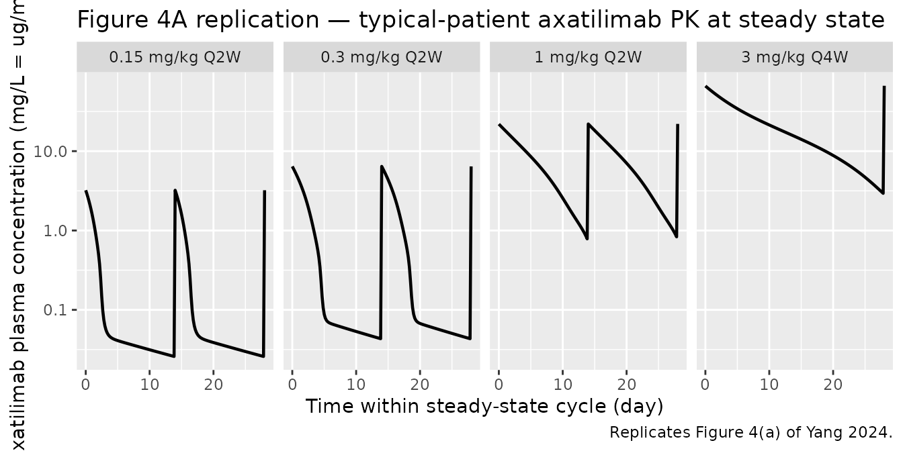
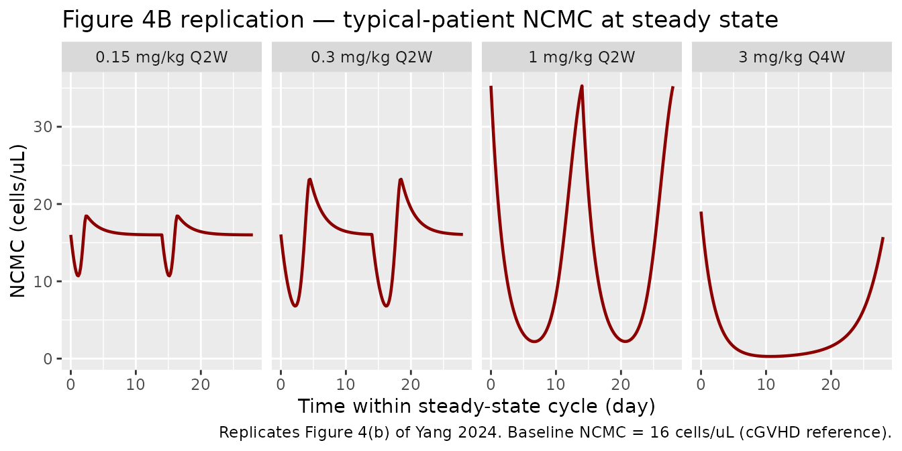
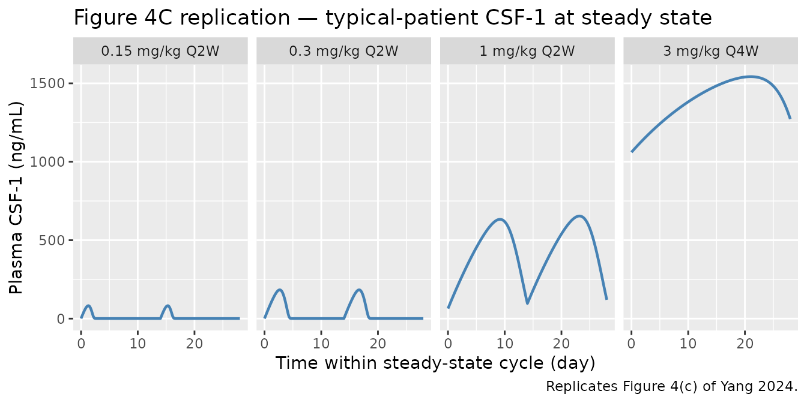
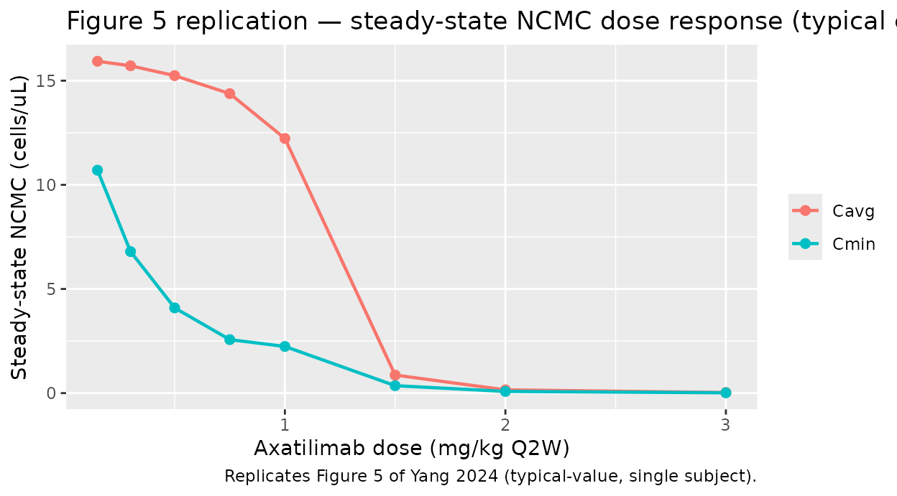

# Axatilimab semimechanistic PK/PD model (Yang 2024)

## Model and source

- Citation: Yang Y, Sokolov V, Volkova A, et al. Semimechanistic
  Population PK/PD Modeling of Axatilimab in Healthy Participants and
  Patients With Solid Tumors or Chronic Graft-Versus-Host Disease. Clin
  Pharmacol Ther. 2025;117(3):704-714. <doi:10.1002/cpt.3503>
- Article: <https://doi.org/10.1002/cpt.3503> — Yang et al., *Clin
  Pharmacol Ther* 117(3):704-714, 2025 (PubMed PMID 39704205).
- Supplemental MLXTRAN code: open-access supplement bundled with the
  article.

This model is a **semimechanistic population PK/PD model** that
integrates axatilimab pharmacokinetics with the dynamics of four
pharmacodynamic biomarkers:

- **CSF-1** — the cytokine ligand for CSF-1R; rises sharply during
  axatilimab dosing as receptor blockade reduces CSF-1 clearance.
- **NCMC** — nonclassical CD14+/CD16++ monocytic cell count; the
  efficacy biomarker, decreased by axatilimab via CSF-1R signaling
  blockade.
- **AST** and **CPK** — safety / liver-and-muscle enzyme biomarkers,
  predicted to rise as Kupffer-cell macrophages depleted by axatilimab
  no longer clear circulating enzymes.

The PK structure is a two-compartment IV disposition model with
**parallel linear and CSF-1R-mediated saturable elimination**. Saturable
clearance is parameterized as a Hill-type fractional occupancy in which
axatilimab and CSF-1 compete for binding to CSF-1R (`Cc_nM/Kd_PK` raised
to the Hill coefficient `Nh = 2.5`).

## Population

The pooled analysis dataset is 325 participants across four phase 1 /
1-2 / 2 trials:

| Study          | Population              | N   |
|----------------|-------------------------|-----|
| SNDX-6352-0001 | Healthy adults          | 14  |
| SNDX-6352-0502 | Advanced solid tumors   | 33  |
| SNDX-6352-0503 | cGVHD (phase 1/2)       | 39  |
| AGAVE-201      | cGVHD (phase 2 pivotal) | 239 |

Demographics from Yang 2024 Table S3 (continuous) and Table S4
(categorical):

- **Age:** median 55 years (range 7-81); 7 cGVHD subjects were children
  aged 7-15.
- **Body weight:** median 73.6 kg (range 18.1-151).
- **Sex:** 39.4% female (n=128 / 325).
- **Race:** 82.5% White, 5.5% Asian, 4.3% Black, 1.8% Other, 5.8%
  Unknown.
- **Baseline CSF-1:** median 549 pg/mL (range 39-4690 pg/mL).
- **Baseline NCMC:** median 19 cells/μL (range 0-202).
- **Baseline AST:** median 28 U/L (range 11-164).
- **Baseline CPK:** median 63 U/L (range 13-1069).
- **ADA (ever-positive):** 40% overall (50% / 36% / 40% in healthy /
  cancer / cGVHD).

Doses ranged from 0.15 to 6 mg/kg IV, single-dose or every 2 / 4 weeks.
The approved cGVHD dose is **0.3 mg/kg Q2W**.

The same information is available programmatically via the model’s
`population` metadata
(`readModelDb("Yang_2024_axatilimab")()$meta$population` after the model
is loaded).

``` r

mod_meta <- readModelDb("Yang_2024_axatilimab")()$meta
str(mod_meta$population, max.level = 1)
#> List of 14
#>  $ n_subjects                  : int 325
#>  $ n_studies                   : int 4
#>  $ age_range                   : chr "7-81 years (7 children aged 7-15 with cGVHD)"
#>  $ age_median                  : chr "55 years"
#>  $ weight_range                : chr "18.1-151 kg"
#>  $ weight_median               : chr "73.6 kg"
#>  $ sex_female_pct              : num 39.4
#>  $ race_ethnicity              : Named num [1:5] 82.5 5.5 4.3 1.8 5.8
#>   ..- attr(*, "names")= chr [1:5] "White" "Asian" "Black" "Other" ...
#>  $ disease_state               : chr "Pooled cohort: 14 healthy adults (SNDX-6352-0001), 33 adults with advanced or metastatic solid tumors (SNDX-635"| __truncated__
#>  $ dose_range                  : chr "0.15 to 6 mg/kg IV; single dose, every 2 weeks (Q2W), or every 4 weeks (Q4W); 0.3 mg/kg Q2W is the approved cGVHD regimen."
#>  $ regions                     : chr "Multi-regional (multi-center US-led trials; phase 1 healthy-volunteer study had EudraCT registration in Europe)."
#>  $ n_observations              :List of 5
#>  $ n_observations_below_LOQ_pct: num 35.5
#>  $ notes                       : chr "Baseline demographics from Yang 2024 Tables S3 and S4. ADA prevalence (ever-positive) 40% overall. Plasma axati"| __truncated__
```

## Source trace

Every [`ini()`](https://nlmixr2.github.io/rxode2/reference/ini.html)
value in `inst/modeldb/specificDrugs/Yang_2024_axatilimab.R` cites a
Yang 2024 Table 1 row in its trailing comment. The table below collects
the equations and parameter origins for review:

| Symbol / equation | Value | Source location |
|----|----|----|
| `Cc = central / vc` (μg/mL) | n/a | Yang 2024 Eq. 4 |
| `d/dt(central) = -CL*(1+kada*ADA)*Cc - Q*(Cc-Cp) - Vmax*C1*vc*MW_PK/1000` | n/a | Yang 2024 Eq. 1 (with mg-based unit reformulation; see Errata note 3) |
| `d/dt(peripheral1) = Q*(Cc-Cp)` | n/a | Yang 2024 Eq. 2 |
| `C1 = (Cc_nM/Kd_PK)^Nh / (1 + (Cc_nM/Kd_PK)^Nh + CSF1/Kd_CSF1)` | n/a | Yang 2024 Eq. 3 |
| `d/dt(csf1) = ksyn_csf1 - kdeg_csf1*csf1 - Vmax*C2` | n/a | Yang 2024 Eq. 5 |
| `ksyn_csf1 = kdeg_csf1*BL_CSF1 + Vmax*BL_C2` | n/a | Yang 2024 Eq. 6 |
| `C2 = (CSF1/Kd_CSF1) / (1 + (Cc_nM/Kd_PK)^Nh + CSF1/Kd_CSF1)` | n/a | Yang 2024 Eq. 7 |
| `d/dt(ncmc) = ksyn_ncmc*C2 - kdeg_ncmc*ncmc` | n/a | Yang 2024 Eq. 8 |
| `ksyn_ncmc = kdeg_ncmc*BL_NCMC / BL_C2` | n/a | Yang 2024 Eq. 9 |
| `d/dt(ast)` and `d/dt(cpk)` | n/a | Yang 2024 Eqs. 10-11 (NCMC-driven indirect response) |
| `Vd` | 3.48 L | Table 1 |
| `CL` | 0.007 L/h | Table 1 |
| `Q` | 0.015 L/h | Table 1 |
| `Vp` | 2.64 L | Table 1 |
| `Vmax` | 0.37 nM/h | Table 1 |
| `Kd_PK` | 1.11 nM | Table 1 |
| `Nh` (Hill) | 2.5 | Table 1 |
| `BL_CSF1` | 0.01 nM | Table 1 |
| `BL_NCMC` | 16 cells/μL | Table 1 |
| `kdeg_CSF1` | 0.002 1/h | Table 1 |
| `kdeg_NCMC` | 0.021 1/h | Table 1 |
| `kada` (ADA effect on CL) | 0.489 | Table 1 (see Errata) |
| `BL_AST` | 35.5 U/L | Table 1 |
| `Vmax_AST_NCMC` | 0.011 1/h | Table 1 |
| `kdeg_AST` | 0.002 1/h | Table 1 |
| `EC50_AST_NCMC` | 11.8 cells/μL | Table 1 |
| `BL_CPK` | 101 U/L | Table 1 |
| `Vmax_CPK_NCMC` | 0.02 1/h | Table 1 |
| `kdeg_CPK` | 0.001 1/h | Table 1 |
| `EC50_CPK_NCMC` | 19.2 cells/μL | Table 1 |
| `Kd_CSF1` (fixed) | 0.048 nM | Yang 2024 Methods (Roussel 1988) |
| Body weight on Vd | β = 0.7, ref 73.6 kg | Table 1 |
| CSF-1 on CL | β = 0.912, ref 549 pg/mL | Table 1 |
| CSF-1 on BL_CSF1 | β = 0.656 | Table 1 |
| Cancer cohort on BL_NCMC | β = 1.22 | Table 1 |
| Healthy cohort on BL_NCMC | β = 0.618 | Table 1 |
| CPK on BL_NCMC | β = 0.376, ref 63 U/L | Table 1 |
| Random effects (omega; squared in [`ini()`](https://nlmixr2.github.io/rxode2/reference/ini.html)) | 0.235, 1.09, 0.289, 0.187, 0.868, 0.464, 0.755 | Table 1 |
| Residual error (Cc, CSF1, NCMC add, NCMC prop, AST, CPK) | 0.375, 0.321, 0.977, 0.676, 0.324, 0.462 | Table 1 |

## Errata

The following internal inconsistencies were detected during extraction.
The model file uses the value most consistent with the final-model
parameter table and the supplemental MLXTRAN code; the discrepancies are
recorded here for traceability.

1.  **`kada` value contradiction (page 708 narrative vs Table 1,
    MLXTRAN, and the formal covariate-effect summary).** Page 708 of the
    published article states “an ADA effect coefficient (kada) of 2.1
    (relative standard error (RSE), 2.92%), indicating that axatilimab
    clearance increased by approximately 3.1-fold when ADA status was
    positive.” However, **Table 1** lists `kada = 0.489` (RSE 3.52%, 95%
    CI 0.455-0.522), the formal covariate-effect summary on page 710
    reports a “50.6% (95% CI, 47.0-54.2) increase in CL” with positive
    ADA status, and the **supplemental MLXTRAN code** (`Supplement 2`)
    implements `CL * (1 + k_ada * ADACN)` with `k_ada = 0.489`. The
    factor `(1 + 0.489)` gives a 48.9% CL increase, matching the 50.6%
    covariate-effect summary (the small difference is the additional
    contribution from baseline CSF-1 covariance). The model file uses
    **`kada = 0.489`** as the canonical value; the page-708 “2.1 /
    3.1-fold” statement is treated as a typographical error.

2.  **Figure 3 CSF-1 covariate axis units.** Figure 3 of the article
    labels the CSF-1 covariate axis as “ng/mL” with displayed
    90th-percentile = 1060 and 10th-percentile = 325. Table S3 reports
    baseline CSF-1 in ng/L (= pg/mL) with overall median 549 (range
    39-4690). The Figure 3 numerical values match pg/mL (=ng/L), not
    ng/mL — typical plasma CSF-1 / M-CSF concentrations are 100-2000
    pg/mL, and 1060 ng/mL would be three orders of magnitude above
    physiologic. The model file’s `covariateData[[CSF1]]$units` is
    **pg/mL** with reference value 549 pg/mL (matching Table S3, the
    dimensionally consistent interpretation).

3.  **Unit reformulation of the Vmax amount-rate term.** The published
    Eq. 1 uses `Ac` (axatilimab amount in μg) and an explicit
    `Vd × MW_PK / convF_PK` factor with `convF_PK = 0.01/1.5` (the
    supplement’s `MW_PK = 150 kDa` representation). The model file works
    in **mg** for the `central` and `peripheral1` amounts (so
    `Cc = central / vc` is directly in mg/L = μg/mL), and the
    saturable-clearance amount-rate term is rewritten as
    `Vmax × C1 × vc × MW_PK / 1000` (mg/h). This is mathematically
    equivalent to Yang 2024 Eq. 1 — `Vmax × C1 × vc` in (nmol/L/h × L) =
    nmol/h, and `MW_PK / 1000` (= 0.150 mg/nmol) converts nmol/h to
    mg/h.

## Virtual cohort

The original individual-level data are not publicly available; the
figures below use small typical-value virtual cohorts whose covariate
values match the population medians or the paper-specific reference
values.

``` r

make_typical <- function(dose_mg_kg, regimen, weight_kg = 75,
                         dis_cancer = 0L, dis_hv = 0L, ada_pos = 0L,
                         CSF1_pgmL = 549, CPK_UL = 63,
                         duration_days = 28, sample_h = 4) {
  # Mass dose: dose_mg_kg * body weight (mg)
  amt_mg <- dose_mg_kg * weight_kg
  ii_h   <- if (regimen == "Q2W") 24 * 14 else 24 * 28
  end_h  <- duration_days * 24

  # Build event table: dose at t=0 (and addl as appropriate), Cc-typed observations
  # over the simulation window so rxSolve can resolve the multi-DVID model.
  n_doses <- floor(end_h / ii_h) + 1
  events <- rxode2::et()
  for (i in seq_len(n_doses)) {
    events <- rxode2::et(events, amt = amt_mg, cmt = "central", evid = 1,
                         time = (i - 1) * ii_h)
  }
  events <- rxode2::et(events, seq(0, end_h, by = sample_h), cmt = "Cc")
  events$WT         <- weight_kg
  events$CSF1       <- CSF1_pgmL
  events$CPK        <- CPK_UL
  events$DIS_CANCER <- dis_cancer
  events$DIS_HV     <- dis_hv
  events$ADA_POS    <- ada_pos
  events$regimen    <- paste0(dose_mg_kg, " mg/kg ", regimen)
  events
}
```

## Simulation

The model is loaded once and used in typical-value (no between-subject
variability) form for all figure replications.

``` r

mod <- readModelDb("Yang_2024_axatilimab")() |> rxode2::zeroRe()
```

## Replicate Figure 4 — axatilimab + biomarker time courses by dose

Yang 2024 Figure 4 shows the steady-state time course over a single
28-day dosing interval for axatilimab Cc, NCMC, and CSF-1 at four
regimens: 0.15 / 0.3 / 1 mg/kg Q2W and 3 mg/kg Q4W. The simulation below
carries six dose intervals so the system has approached steady state,
then reports the final 28-day window.

``` r

sim_one <- function(events) {
  s <- rxode2::rxSolve(mod, events = events, returnType = "data.frame", keep = "regimen")
  # Drop dose-row duplicates that have no Cc value
  s |> dplyr::filter(!is.na(Cc))
}

# Pre-saturation: 12 weeks of repeated dosing followed by a 28-day window
fig4_events <- dplyr::bind_rows(
  sim_one(make_typical(0.15, "Q2W", duration_days = 12 * 7))      |> dplyr::mutate(regimen = "0.15 mg/kg Q2W"),
  sim_one(make_typical(0.30, "Q2W", duration_days = 12 * 7))      |> dplyr::mutate(regimen = "0.3 mg/kg Q2W"),
  sim_one(make_typical(1.00, "Q2W", duration_days = 12 * 7))      |> dplyr::mutate(regimen = "1 mg/kg Q2W"),
  sim_one(make_typical(3.00, "Q4W", duration_days = 12 * 7))      |> dplyr::mutate(regimen = "3 mg/kg Q4W")
)
#> ℹ omega/sigma items treated as zero: 'etalvc', 'etalcl', 'etalvmax', 'etalbl_csf1', 'etalbl_ncmc', 'etalbl_ast', 'etalbl_cpk'
#> ℹ omega/sigma items treated as zero: 'etalvc', 'etalcl', 'etalvmax', 'etalbl_csf1', 'etalbl_ncmc', 'etalbl_ast', 'etalbl_cpk'
#> ℹ omega/sigma items treated as zero: 'etalvc', 'etalcl', 'etalvmax', 'etalbl_csf1', 'etalbl_ncmc', 'etalbl_ast', 'etalbl_cpk'
#> ℹ omega/sigma items treated as zero: 'etalvc', 'etalcl', 'etalvmax', 'etalbl_csf1', 'etalbl_ncmc', 'etalbl_ast', 'etalbl_cpk'

# Restrict to the final 28-day window and re-zero time
fig4 <- fig4_events |>
  dplyr::group_by(regimen) |>
  dplyr::mutate(t_max = max(time)) |>
  dplyr::filter(time >= t_max - 28 * 24) |>
  dplyr::mutate(time_d = (time - (t_max - 28 * 24)) / 24) |>
  dplyr::ungroup() |>
  dplyr::mutate(
    csf1_ngmL = csf1obs,    # observation alias already in ng/mL
    regimen   = factor(regimen, levels = c("0.15 mg/kg Q2W", "0.3 mg/kg Q2W",
                                            "1 mg/kg Q2W",   "3 mg/kg Q4W"))
  )
```

``` r

ggplot(fig4, aes(time_d, Cc)) +
  geom_line(linewidth = 0.8) +
  scale_y_log10() +
  facet_wrap(~ regimen, nrow = 1) +
  labs(x = "Time within steady-state cycle (day)",
       y = "Axatilimab plasma concentration (mg/L = ug/mL)",
       title  = "Figure 4A replication — typical-patient axatilimab PK at steady state",
       caption = "Replicates Figure 4(a) of Yang 2024.")
```



``` r

ggplot(fig4, aes(time_d, ncmc)) +
  geom_line(linewidth = 0.8, colour = "darkred") +
  facet_wrap(~ regimen, nrow = 1) +
  labs(x = "Time within steady-state cycle (day)",
       y = "NCMC (cells/uL)",
       title  = "Figure 4B replication — typical-patient NCMC at steady state",
       caption = "Replicates Figure 4(b) of Yang 2024. Baseline NCMC = 16 cells/uL (cGVHD reference).")
```



``` r

ggplot(fig4, aes(time_d, csf1_ngmL)) +
  geom_line(linewidth = 0.8, colour = "steelblue") +
  facet_wrap(~ regimen, nrow = 1) +
  labs(x = "Time within steady-state cycle (day)",
       y = "Plasma CSF-1 (ng/mL)",
       title  = "Figure 4C replication — typical-patient CSF-1 at steady state",
       caption = "Replicates Figure 4(c) of Yang 2024.")
```



## Cross-check covariate-effect magnitudes (Figure 3 / Table 1)

Yang 2024 Table 1 reports baseline NCMC of 16 / 29.7 / 54.2 cells/μL in
cGVHD / healthy / cancer reference patients. The numbers below are
typical-value baseline NCMC (the `ncmc` state at t=0 with no drug) for
the three population indicators:

``` r

baseline_ncmc <- function(dis_cancer, dis_hv) {
  ev <- rxode2::et(seq(0, 168, by = 24), cmt = "Cc")
  ev$WT <- 75; ev$CSF1 <- 549; ev$CPK <- 63
  ev$DIS_CANCER <- dis_cancer; ev$DIS_HV <- dis_hv; ev$ADA_POS <- 0
  s <- rxode2::rxSolve(mod, ev, returnType = "data.frame")
  s$ncmc[1]
}

tibble::tibble(
  Population = c("cGVHD reference", "Healthy volunteer", "Advanced solid tumor"),
  `BL_NCMC simulated (cells/uL)` = c(
    baseline_ncmc(0L, 0L),
    baseline_ncmc(0L, 1L),
    baseline_ncmc(1L, 0L)
  ),
  `Yang 2024 Table 1` = c(16, 29.7, 54.2)
) |> knitr::kable(digits = 2,
                  caption = "Baseline NCMC by population type (typical patient at median CSF-1 and CPK).")
#> ℹ omega/sigma items treated as zero: 'etalvc', 'etalcl', 'etalvmax', 'etalbl_csf1', 'etalbl_ncmc', 'etalbl_ast', 'etalbl_cpk'
#> ℹ omega/sigma items treated as zero: 'etalvc', 'etalcl', 'etalvmax', 'etalbl_csf1', 'etalbl_ncmc', 'etalbl_ast', 'etalbl_cpk'
#> ℹ omega/sigma items treated as zero: 'etalvc', 'etalcl', 'etalvmax', 'etalbl_csf1', 'etalbl_ncmc', 'etalbl_ast', 'etalbl_cpk'
```

| Population           | BL_NCMC simulated (cells/uL) | Yang 2024 Table 1 |
|:---------------------|-----------------------------:|------------------:|
| cGVHD reference      |                        16.00 |              16.0 |
| Healthy volunteer    |                        29.68 |              29.7 |
| Advanced solid tumor |                        54.20 |              54.2 |

Baseline NCMC by population type (typical patient at median CSF-1 and
CPK). {.table}

ADA-positive CL effect (paper covariate summary: +50.6% CL when ADA =
1):

``` r

typical_cl <- function(ada) {
  # Pull individual CL via a unit-volume dose (1 mg) and reading IPRED at first sample
  ev <- rxode2::et(amt = 1, cmt = "central", evid = 1, time = 0) |>
    rxode2::et(c(0, 0.001), cmt = "Cc")
  ev$WT <- 75; ev$CSF1 <- 549; ev$CPK <- 63
  ev$DIS_CANCER <- 0; ev$DIS_HV <- 0; ev$ADA_POS <- ada
  s <- rxode2::rxSolve(mod, ev, returnType = "data.frame")
  unique(s$cl)[1]
}
cl_neg <- typical_cl(0L)
#> ℹ omega/sigma items treated as zero: 'etalvc', 'etalcl', 'etalvmax', 'etalbl_csf1', 'etalbl_ncmc', 'etalbl_ast', 'etalbl_cpk'
cl_pos <- typical_cl(1L)
#> ℹ omega/sigma items treated as zero: 'etalvc', 'etalcl', 'etalvmax', 'etalbl_csf1', 'etalbl_ncmc', 'etalbl_ast', 'etalbl_cpk'
tibble::tibble(
  ADA = c("Negative (ref)", "Positive"),
  `Typical CL (L/h)` = c(cl_neg, cl_pos),
  `Fractional change vs ADA-` = c(0, (cl_pos - cl_neg) / cl_neg)
) |> knitr::kable(digits = 4,
                  caption = "Linear CL by ADA status. Note: the model file's `cl` variable already carries the ADA factor.")
```

| ADA            | Typical CL (L/h) | Fractional change vs ADA- |
|:---------------|-----------------:|--------------------------:|
| Negative (ref) |           0.0070 |                     0.000 |
| Positive       |           0.0104 |                     0.489 |

Linear CL by ADA status. Note: the model file’s `cl` variable already
carries the ADA factor. {.table}

## Steady-state hold check

With no axatilimab dose, the four biomarker states must hold at their
individual baseline values indefinitely (or to numerical tolerance) —
this is the standard endogenous-system invariant.

``` r

ss_ev <- rxode2::et(seq(0, 4000, by = 48), cmt = "Cc")
ss_ev$WT <- 75; ss_ev$CSF1 <- 549; ss_ev$CPK <- 63
ss_ev$DIS_CANCER <- 0; ss_ev$DIS_HV <- 0; ss_ev$ADA_POS <- 0
ss <- rxode2::rxSolve(mod, ss_ev, returnType = "data.frame")
#> ℹ omega/sigma items treated as zero: 'etalvc', 'etalcl', 'etalvmax', 'etalbl_csf1', 'etalbl_ncmc', 'etalbl_ast', 'etalbl_cpk'

ss_summary <- tibble::tibble(
  Biomarker = c("csf1 (nM)", "ncmc (cells/uL)", "ast (U/L)", "cpk (U/L)"),
  Min       = c(min(ss$csf1), min(ss$ncmc), min(ss$ast), min(ss$cpk)),
  Max       = c(max(ss$csf1), max(ss$ncmc), max(ss$ast), max(ss$cpk)),
  Target    = c(0.01, 16, 35.5, 101)
)
knitr::kable(ss_summary, digits = 6,
             caption = "Biomarker steady-state hold (no axatilimab dose, 4000 h simulation).")
```

| Biomarker       |    Min |    Max | Target |
|:----------------|-------:|-------:|-------:|
| csf1 (nM)       |   0.01 |   0.01 |   0.01 |
| ncmc (cells/uL) |  16.00 |  16.00 |  16.00 |
| ast (U/L)       |  35.50 |  35.50 |  35.50 |
| cpk (U/L)       | 101.00 | 101.00 | 101.00 |

Biomarker steady-state hold (no axatilimab dose, 4000 h simulation).
{.table}

## Replicate Figure 5 — steady-state NCMC dose response (Q2W)

Figure 5 of Yang 2024 shows steady-state mean and trough NCMC
concentration vs dose for the Q2W regimen. The simulation below sweeps
0.15-3 mg/kg Q2W on a typical cGVHD patient and computes Cavg / Cmin
within the final dosing interval after 16 weeks of dosing (eight Q2W
cycles is sufficient for convergence given the NCMC turnover halflife
`log(2) / 0.021 ≈ 33 h`).

``` r

dose_sweep <- c(0.15, 0.3, 0.5, 0.75, 1, 1.5, 2, 3)

ncmc_metrics <- function(dose_mg_kg) {
  ev_long <- make_typical(dose_mg_kg, regimen = "Q2W", duration_days = 16 * 7)
  s <- rxode2::rxSolve(mod, ev_long, returnType = "data.frame") |>
    dplyr::filter(!is.na(Cc))
  end_h    <- max(s$time)
  s_final  <- s |> dplyr::filter(time >= end_h - 14 * 24)
  tibble::tibble(
    dose = dose_mg_kg,
    cavg = mean(s_final$ncmc),
    cmin = min(s_final$ncmc)
  )
}

fig5 <- purrr::map_dfr(dose_sweep, ncmc_metrics) |>
  tidyr::pivot_longer(c(cavg, cmin), names_to = "metric", values_to = "ncmc") |>
  dplyr::mutate(metric = recode(metric, cavg = "Cavg", cmin = "Cmin"))
#> ℹ omega/sigma items treated as zero: 'etalvc', 'etalcl', 'etalvmax', 'etalbl_csf1', 'etalbl_ncmc', 'etalbl_ast', 'etalbl_cpk'
#> ℹ omega/sigma items treated as zero: 'etalvc', 'etalcl', 'etalvmax', 'etalbl_csf1', 'etalbl_ncmc', 'etalbl_ast', 'etalbl_cpk'
#> ℹ omega/sigma items treated as zero: 'etalvc', 'etalcl', 'etalvmax', 'etalbl_csf1', 'etalbl_ncmc', 'etalbl_ast', 'etalbl_cpk'
#> ℹ omega/sigma items treated as zero: 'etalvc', 'etalcl', 'etalvmax', 'etalbl_csf1', 'etalbl_ncmc', 'etalbl_ast', 'etalbl_cpk'
#> ℹ omega/sigma items treated as zero: 'etalvc', 'etalcl', 'etalvmax', 'etalbl_csf1', 'etalbl_ncmc', 'etalbl_ast', 'etalbl_cpk'
#> ℹ omega/sigma items treated as zero: 'etalvc', 'etalcl', 'etalvmax', 'etalbl_csf1', 'etalbl_ncmc', 'etalbl_ast', 'etalbl_cpk'
#> ℹ omega/sigma items treated as zero: 'etalvc', 'etalcl', 'etalvmax', 'etalbl_csf1', 'etalbl_ncmc', 'etalbl_ast', 'etalbl_cpk'
#> ℹ omega/sigma items treated as zero: 'etalvc', 'etalcl', 'etalvmax', 'etalbl_csf1', 'etalbl_ncmc', 'etalbl_ast', 'etalbl_cpk'

ggplot(fig5, aes(dose, ncmc, colour = metric)) +
  geom_line(linewidth = 0.8) +
  geom_point(size = 2) +
  labs(x = "Axatilimab dose (mg/kg Q2W)",
       y = "Steady-state NCMC (cells/uL)",
       colour = NULL,
       title  = "Figure 5 replication — steady-state NCMC dose response (typical cGVHD patient)",
       caption = "Replicates Figure 5 of Yang 2024 (typical-value, single subject).")
```



## PKNCA validation — single-dose axatilimab Cc

The article does not report a published NCA table for axatilimab, so the
PKNCA block here functions as a functional check that the simulated
profile produces dimensionally sensible AUC / Cmax under the 0.3 mg/kg
single-dose regimen.

``` r

single_ev <- rxode2::et(amt = 22.5, cmt = "central", evid = 1, time = 0) |>
  rxode2::et(c(0, 0.5, 1, 2, 4, 8, 12, 24, 48, 72, 96, 168, 240, 336),
             cmt = "Cc")
single_ev$id         <- 1L
single_ev$WT         <- 75
single_ev$CSF1       <- 549
single_ev$CPK        <- 63
single_ev$DIS_CANCER <- 0
single_ev$DIS_HV     <- 0
single_ev$ADA_POS    <- 0
single_ev$regimen    <- "0.3 mg/kg single dose"
sim_sd <- rxode2::rxSolve(mod, single_ev, returnType = "data.frame", keep = "regimen") |>
  dplyr::filter(!is.na(Cc)) |>
  dplyr::mutate(id = 1L)
#> ℹ omega/sigma items treated as zero: 'etalvc', 'etalcl', 'etalvmax', 'etalbl_csf1', 'etalbl_ncmc', 'etalbl_ast', 'etalbl_cpk'

dose_df <- tibble::tibble(id = 1L, time = 0, amt = 22.5, regimen = "0.3 mg/kg single dose")

conc_obj <- PKNCA::PKNCAconc(sim_sd |> dplyr::select(id, time, Cc, regimen),
                             Cc ~ time | regimen + id,
                             concu = "mg/L", timeu = "hr")
dose_obj <- PKNCA::PKNCAdose(dose_df, amt ~ time | regimen + id, doseu = "mg")

intervals <- data.frame(
  start    = 0,
  end      = 336,
  cmax     = TRUE,
  tmax     = TRUE,
  auclast  = TRUE,
  half.life = TRUE
)
nca_res <- PKNCA::pk.nca(PKNCA::PKNCAdata(conc_obj, dose_obj, intervals = intervals))
nca_res$result |>
  dplyr::select(start, end, PPTESTCD, PPORRES) |>
  knitr::kable(digits = 4,
               caption = "Simulated single-dose 0.3 mg/kg axatilimab NCA, typical cGVHD patient.")
```

| start | end | PPTESTCD            |  PPORRES |
|------:|----:|:--------------------|---------:|
|     0 | 336 | auclast             | 294.2096 |
|     0 | 336 | cmax                |   6.3808 |
|     0 | 336 | tmax                |   0.0000 |
|     0 | 336 | tlast               | 336.0000 |
|     0 | 336 | lambda.z            |   0.0023 |
|     0 | 336 | r.squared           |   0.9999 |
|     0 | 336 | adj.r.squared       |   0.9998 |
|     0 | 336 | lambda.z.time.first | 168.0000 |
|     0 | 336 | lambda.z.time.last  | 336.0000 |
|     0 | 336 | lambda.z.n.points   |   3.0000 |
|     0 | 336 | clast.pred          |   0.0392 |
|     0 | 336 | half.life           | 305.1370 |
|     0 | 336 | span.ratio          |   0.5506 |

Simulated single-dose 0.3 mg/kg axatilimab NCA, typical cGVHD patient.
{.table}

## Assumptions and deviations

- **Mechanism-specific compartment names.** The biomarker states `csf1`,
  `ncmc`, `ast`, `cpk` deliberately deviate from the canonical
  compartment-name list in `naming-conventions.md` (`depot`, `central`,
  `peripheral1`, etc.). They were chosen to match the variable names in
  Yang 2024 Eqs. 5, 8, 10, 11 and the supplemental MLXTRAN code; using
  the canonical names would obscure the one-to-one mapping with the
  published equations.
  [`nlmixr2lib::checkModelConventions()`](https://nlmixr2.github.io/nlmixr2lib/reference/checkModelConventions.md)
  flags these as warnings (not errors).
- **Initial conditions.** All four biomarker states (`csf1`, `ncmc`,
  `ast`, `cpk`) are set to their per-individual baseline parameter
  values (`BL_CSF1`, `BL_NCMC`, `BL_AST`, `BL_CPK`). PK compartments
  start at zero (no endogenous axatilimab).
- **Saturable-elimination unit reformulation (mg vs μg).** The
  supplemental MLXTRAN code carries `Ac` in μg and converts dose with a
  1000× factor at the `iv()` macro. The nlmixr2lib model file works in
  mg directly so user-facing event tables can use mg without conversion;
  the `Vmax × C1 × vc × MW_PK / 1000` term is mathematically equivalent
  to Yang 2024 Eq. 1 (Errata note 3).
- **kada interpretation.** The internal contradiction documented in
  Errata note 1 was resolved by using the value consistent with Table 1,
  the MLXTRAN supplement, and the formal covariate-effect summary
  (`kada = 0.489`).
- **CSF-1 covariate units.** Pg/mL (not Figure 3’s mislabeled “ng/mL”);
  see Errata note 2.
- **No FDR / lower-LOQ handling.** The analysis dataset uses the M4
  method to handle BLOQ samples (Beal 2001); since this vignette runs
  deterministic typical-value simulations, no BLOQ logic is needed.
- **PKNCA stratification.** A single regimen (0.3 mg/kg single dose) is
  shown; the published article does not report per-regimen NCA, so
  cross-comparison with paper values is not possible.
- **Reference-value documentation.** Continuous covariates (`WT`,
  `CSF1`, `CPK`) use the overall pooled-cohort medians from Yang 2024
  Table S3 (73.6 kg, 549 pg/mL, 63 U/L). The paper does not separately
  report cohort-stratified medians; using the overall median follows
  Yang 2024’s own statement that “continuous covariates were adjusted
  for the population median.”
