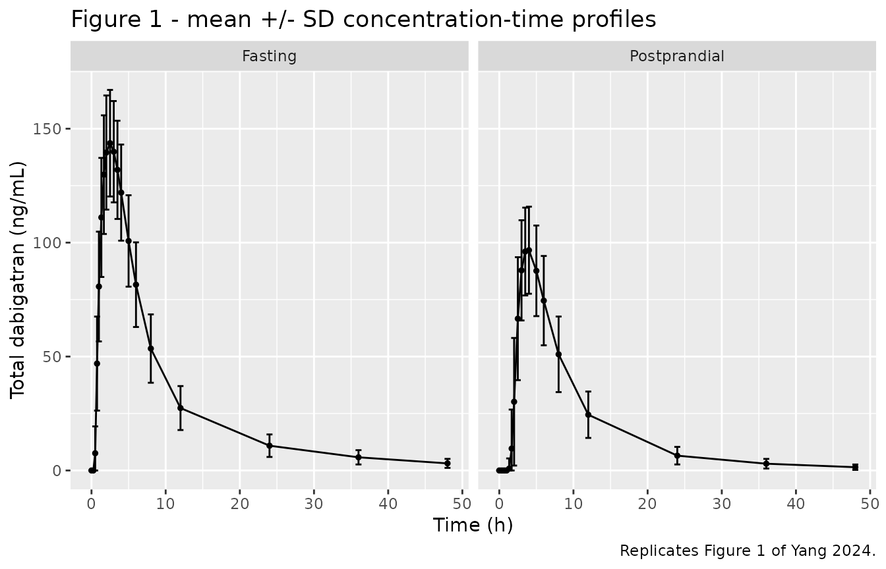
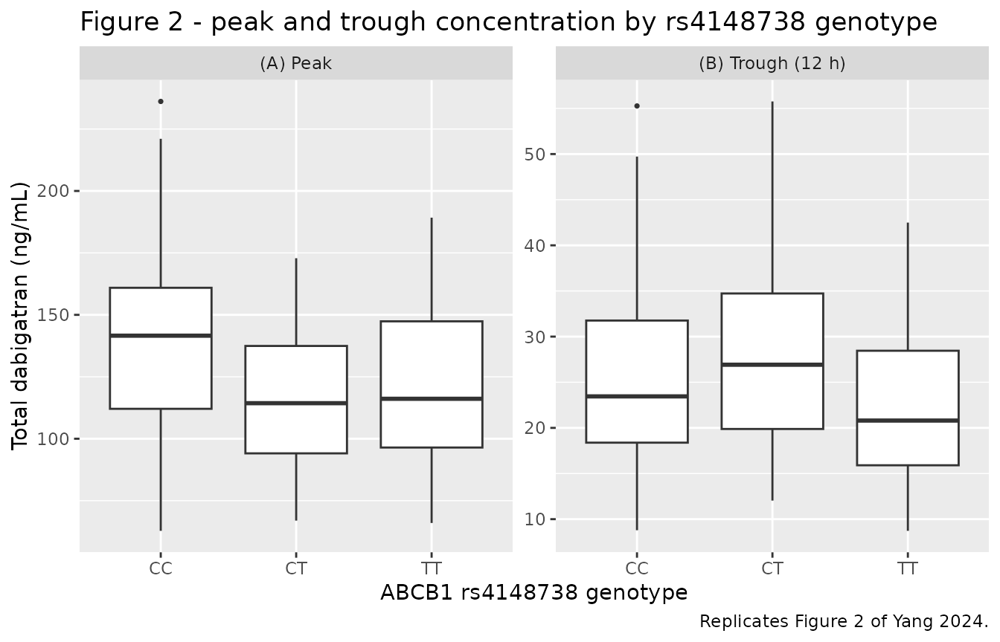

# Dabigatran (Yang 2024)

## Model and source

- Citation: Yang Z, Tan WR, Li Q, Wang Y, Liu S, Chen L, Zhou Y, Zeng C,
  Zeng Y, Xiong Y, Zhang Q, Li N, Du P, Liu L, Chen J, He Y. Population
  pharmacokinetic study of the effect of polymorphisms in the ABCB1 and
  CES1 genes on the pharmacokinetics of dabigatran. Front Pharmacol.
  2024;15:1454612. <doi:10.3389/fphar.2024.1454612>
- Description: Two-compartment population PK model with first-order
  absorption and an absorption lag time for total dabigatran after a
  single oral 150 mg dose of dabigatran etexilate in healthy Chinese
  adults, with a high-fat-meal (postprandial) effect on the absorption
  rate constant, the absorption lag time and apparent clearance, and an
  ABCB1 rs4148738 heterozygote (CT) effect on the apparent central
  volume of distribution (Yang 2024).
- Article: <https://doi.org/10.3389/fphar.2024.1454612>
- Supplement (NONMEM control stream of the final model):
  <https://www.frontiersin.org/articles/10.3389/fphar.2024.1454612/full#supplementary-material>

Yang 2024 fit a two-compartment model with first-order absorption and an
absorption lag time to total dabigatran concentrations from the
reference-formulation arm of a dabigatran etexilate bioequivalence study
in healthy Chinese adults. Two covariates survived stepwise covariate
modelling: dosing after a standard high-fat meal (which slows
absorption, lengthens the absorption lag, and raises apparent clearance)
and the *ABCB1* rs4148738 heterozygous (CT) genotype (which enlarges the
apparent central volume of distribution). The other three genotyped SNPs
– *ABCB1* rs1045642 and *CES1* rs2244613 / rs8192935 – and all of the
demographic covariates were screened and dropped.

## Population

The analysis dataset comprised 1,926 plasma concentrations from 123
healthy Chinese adults (94 men, 29 women; 23.6% female) enrolled at a
single centre in Guiyang, China, and registered as NCT06387407 (Yang
2024 Methods 2.1). Each subject received one oral 150 mg dose of
dabigatran etexilate (Pradaxa) with 240 mL of warm water, either fasted
(n = 61) or within 30 min of a standard high-fat meal (n = 62), and was
sampled at 19 times from predose to 48 h (Methods 2.2). Subjects were 18
to 43 years old (mean 25.2 years fasting, 24.9 postprandial), weighed
45.2 to 82.0 kg (mean 58.8 and 59.7 kg by arm), were 145.5 to 182.5 cm
tall, and had body mass indices of 19.2 to 25.9 kg/m^2 (Table 1).
Because the cohort was healthy volunteers, the two covariates that
dominate dabigatran pharmacokinetics in atrial fibrillation – renal
impairment and co-medication – were excluded by design, which the
Discussion gives as the reason for isolating the genetic signal.

Ninety-nine of the 123 subjects were genotyped for the four candidate
SNPs (Table 2). For *ABCB1* rs4148738, the modelled locus, the
distribution was CC 20, CT 48, TT 31, with a minor (C) allele frequency
of 44.44%.

The same information is available programmatically via the model’s
`population` metadata
(`readModelDb("Yang_2024_dabigatran")()$population`).

## Source trace

The per-parameter origin is recorded as an in-file comment next to each
`ini()` entry in `inst/modeldb/specificDrugs/Yang_2024_dabigatran.R`.
The table below collects them in one place for review.

| Equation / parameter | Value | Source location |
|----|----|----|
| `lka` (ka, fasting) | 0.38 1/h | Table 4, row `KA(h-1)` (RSE 16.2%) |
| `ltlag` (ALAG, fasting) | 0.48 h | Table 4, row `ALAG(h)` (RSE 5%) |
| `lcl` (CL/F, fasting) | 122 L/h | Table 4, row `CL(L/h-1)` (RSE 5.6%) |
| `lvc` (V2/F, non-CT) | 245 L | Table 4, row `V2(L)` (RSE 14.1%) |
| `lq` (Q/F) | 70.80 L/h | Table 4, row `Q(L/h-1)` (RSE 7.9%) |
| `lvp` (V3/F) | 756 L | Table 4, row `V3(L)` (RSE 10.6%) |
| `e_fed_highfat_ka` | -0.24 | Table 4, row `Postprandial on KA` (RSE 30%) |
| `e_fed_highfat_tlag` | 2.65 | Table 4, row `Postprandial on ALAG` (RSE 8.7%) |
| `e_fed_highfat_cl` | 0.51 | Table 4, row `Postprandial on CL` (RSE 25.5%) |
| `e_abcb1_het_vc` | 0.38 | Table 4, row `rs4148738 on V2` (RSE 45.5%) |
| `etalcl` | 0.31 -\> 0.0961 | Table 4, row `IIVCL` (shrinkage 7.2%); see Assumptions |
| `etalvc` | 0.27 -\> 0.0729 | Table 4, row `IIVV2` (shrinkage 0.1%); see Assumptions |
| `etaltlag` | 0.19 -\> 0.0361 | Table 4, row `IIV ALAG` (shrinkage 14.6%); see Assumptions |
| `propSd` | 0.08 | Table 4, row `Exponential error` (RSE 24.9%) |
| `addSd` | 6.31 ng/mL | Table 4, row `Additive error` (RSE 14.7%) |
| Two-compartment ODE system | n/a | Supplementary Material `$DES` (`K = CL/V2`, `K23 = Q/V2`, `K32 = Q/V3`); Results 3.5 |
| Covariate form `(1 + theta * COV)` | n/a | Supplementary Material `$PK` covariate blocks; Methods 2.6 Equation 4 |
| Exponential IIV `theta_tv * exp(eta)` | n/a | Supplementary Material `$PK`; Methods 2.5 Equation 1 |
| Combined residual error | n/a | Supplementary Material `$ERROR` (`W = SQRT(TH6^2*IPRED^2 + TH7^2)`, `$SIGMA 1 FIX`); Methods 2.5 Equation 2 |
| `Cc = 1000 * central / vc` | n/a | Supplementary Material `$PK` (`S2 = V2/1000`); dose in mg, V in L, concentration in ng/mL |
| `alag(depot)` | n/a | Supplementary Material `$PK` (`ALAG1` on `COMP1`, the `DEFDOSE` compartment) |

## Virtual cohort

The original observed data are not publicly available, so the figures
below use a virtual population whose covariate distribution approximates
the published trial. The design is parallel: each subject is dosed once,
either fasted or after a high-fat meal. *ABCB1* rs4148738 genotype is
drawn independently of meal condition at the Table 2 frequencies (CC
20/99, CT 48/99, TT 31/99), so the genotype strata below are balanced
across meal conditions in the same way the pooled Table 3 genotype rows
are.

Cohort size is 150 subjects per meal arm (300 total), below the
200-per-arm cap.

``` r

set.seed(20241115)

n_per_arm <- 150L

# Yang 2024 Methods 2.2 sampling schedule (19 points per subject).
sample_times <- c(0, 0.25, 0.5, 0.75, 1, 1.33, 1.67, 2, 2.5, 3, 3.5, 4,
                  5, 6, 8, 12, 24, 36, 48)

# Yang 2024 Table 2 ABCB1 rs4148738 genotype counts among the 99 genotyped
# subjects.
genotype_levels <- c("CC", "CT", "TT")
genotype_probs  <- c(20, 48, 31) / 99

make_cohort <- function(n, arm, fed, id_offset = 0L) {
  subj <- tibble(
    id       = id_offset + seq_len(n),
    arm      = arm,
    genotype = sample(genotype_levels, size = n, replace = TRUE,
                      prob = genotype_probs)
  ) |>
    mutate(
      FED_HIGHFAT             = fed,
      SNP_ABCB1_RS4148738_HET = as.numeric(genotype == "CT")
    )

  doses <- subj |>
    mutate(time = 0, amt = 150, evid = 1L, cmt = "depot")

  obs <- subj |>
    tidyr::crossing(time = sample_times) |>
    mutate(amt = NA_real_, evid = 0L, cmt = "central")

  bind_rows(doses, obs) |>
    arrange(id, time, desc(evid))
}

events <- bind_rows(
  make_cohort(n_per_arm, arm = "Fasting",      fed = 0, id_offset = 0L),
  make_cohort(n_per_arm, arm = "Postprandial", fed = 1, id_offset = n_per_arm)
)

stopifnot(!anyDuplicated(unique(events[, c("id", "time", "evid")])))
```

## Simulation

``` r

mod <- readModelDb("Yang_2024_dabigatran")
sim <- rxode2::rxSolve(
  mod,
  events = as.data.frame(events),
  keep   = c("arm", "genotype"),
  returnType = "data.frame"
) |>
  dplyr::filter(!is.na(Cc))
#> ℹ parameter labels from comments will be replaced by 'label()'
```

`Cc` carries between-subject variability (the `etalcl` / `etalvc` /
`etaltlag` random effects) but not the residual error, so it is the
individual-predicted concentration. The comparisons below therefore test
the structural and between-subject parts of the published model against
the paper’s non-compartmental summaries.

## Replicate published figures

``` r

# Replicates Figure 1 of Yang 2024: mean +/- SD plasma total dabigatran
# concentration-time profiles, fasting (A) and postprandial (B).
sim |>
  group_by(arm, time) |>
  summarise(mean = mean(Cc), sd = stats::sd(Cc), .groups = "drop") |>
  ggplot(aes(time, mean)) +
  geom_errorbar(aes(ymin = pmax(mean - sd, 0), ymax = mean + sd), width = 0.8) +
  geom_line() +
  geom_point(size = 1) +
  facet_wrap(~arm) +
  labs(x = "Time (h)", y = "Total dabigatran (ng/mL)",
       title = "Figure 1 - mean +/- SD concentration-time profiles",
       caption = "Replicates Figure 1 of Yang 2024.")
```



The simulated postprandial profile reproduces the two features the paper
draws from Figure 1: a markedly lower peak after the high-fat meal, and
a later peak.

``` r

# Replicates Figure 2 of Yang 2024 (panel a): peak (A) and 12 h trough (B)
# plasma dabigatran concentrations by ABCB1 rs4148738 genotype. Yang 2024
# Results 3.4 defines the 12 h concentration as the trough.
peaks <- sim |>
  group_by(id, genotype) |>
  summarise(Peak = max(Cc), .groups = "drop")

troughs <- sim |>
  filter(time == 12) |>
  select(id, genotype, Trough = Cc)

peaks |>
  left_join(troughs, by = c("id", "genotype")) |>
  tidyr::pivot_longer(c(Peak, Trough), names_to = "measure",
                      values_to = "conc") |>
  mutate(measure = factor(measure, levels = c("Peak", "Trough"),
                          labels = c("(A) Peak", "(B) Trough (12 h)"))) |>
  ggplot(aes(genotype, conc)) +
  geom_boxplot(outlier.size = 0.6) +
  facet_wrap(~measure, scales = "free_y") +
  labs(x = "ABCB1 rs4148738 genotype", y = "Total dabigatran (ng/mL)",
       title = "Figure 2 - peak and trough concentration by rs4148738 genotype",
       caption = "Replicates Figure 2 of Yang 2024.")
```



The model resolves only a CT-versus-non-CT contrast, so the CC and TT
strata are structurally identical here; the paper’s own Figure 2A
likewise reports no significant peak-concentration difference across
genotypes, while Figure 2B singles out CT as the stratum with the lowest
median trough.

## PKNCA validation

``` r

sim_nca <- sim |>
  dplyr::filter(!is.na(Cc)) |>
  dplyr::select(id, time, Cc, arm, genotype)

# Guarantee a time = 0 row per subject; predose Cc = 0 for an extravascular
# single dose.
sim_nca <- dplyr::bind_rows(
  sim_nca,
  sim_nca |>
    dplyr::distinct(id, arm, genotype) |>
    dplyr::mutate(time = 0, Cc = 0)
) |>
  dplyr::distinct(id, time, .keep_all = TRUE) |>
  dplyr::arrange(id, time)

conc_obj <- PKNCA::PKNCAconc(sim_nca, Cc ~ time | arm + genotype + id)

dose_df <- events |>
  dplyr::filter(evid == 1) |>
  dplyr::select(id, time, amt, arm, genotype)

dose_obj <- PKNCA::PKNCAdose(dose_df, amt ~ time | arm + genotype + id)

intervals <- data.frame(
  start      = 0,
  end        = Inf,
  cmax       = TRUE,
  tmax       = TRUE,
  auclast    = TRUE,
  aucinf.obs = TRUE,
  half.life  = TRUE
)

nca_res <- PKNCA::pk.nca(PKNCA::PKNCAdata(conc_obj, dose_obj,
                                          intervals = intervals))
```

### Comparison against published NCA

Yang 2024 Table 3 reports arithmetic means, so the simulated results are
aggregated with [`mean()`](https://rdrr.io/r/base/mean.html) rather than
the median
[`ncaComparisonTable()`](https://nlmixr2.github.io/nlmixr2lib/reference/ncaComparisonTable.md)
would apply by default. The food-effect rows use all 123-equivalent
simulated subjects; the genotype rows pool both meal conditions,
matching the construction of Table 3.

``` r

nca_long <- as.data.frame(nca_res) |>
  dplyr::filter(PPTESTCD %in% c("cmax", "tmax", "auclast", "aucinf.obs",
                                "half.life"),
                !is.na(PPORRES))

simulated <- dplyr::bind_rows(
  nca_long |>
    dplyr::mutate(stratum = arm),
  nca_long |>
    dplyr::mutate(stratum = paste("rs4148738", genotype))
) |>
  dplyr::group_by(stratum, PPTESTCD) |>
  dplyr::summarise(PPORRES = mean(PPORRES), .groups = "drop")
```

``` r

# Yang 2024 Table 3, "Food effect (N = 123)" and "ABCB1 SNP rs4148738 (N = 99)"
# blocks; values are arithmetic means.
published <- tibble::tribble(
  ~stratum,             ~cmax,  ~tmax, ~auclast, ~aucinf.obs, ~half.life,
  "Fasting",            159.56, 2.39,  1352.14,  1395.65,     10.07,
  "Postprandial",       114.89, 4.44,  1049.14,  1071.37,      9.24,
  "rs4148738 CC",       149.52, 3.40,  1312.07,  1321.88,      9.10,
  "rs4148738 CT",       126.45, 3.73,  1145.77,  1192.18,      9.87,
  "rs4148738 TT",       144.10, 3.11,  1201.09,  1236.92,      9.27
)

cmp <- nlmixr2lib::ncaComparisonTable(
  simulated     = simulated,
  reference     = published,
  by            = "stratum",
  units         = c(cmax = "ng/mL", auclast = "ng*h/mL",
                    aucinf.obs = "ng*h/mL", tmax = "h", half.life = "h"),
  tolerance_pct = 20
)

knitr::kable(
  cmp,
  digits  = c(NA, NA, 1, 1, 1),
  caption = "Simulated vs. published NCA (Yang 2024 Table 3). * differs from reference by >20%."
)
```

| NCA parameter           | stratum      | Reference | Simulated | % diff   |
|:------------------------|:-------------|:----------|:----------|:---------|
| Cmax (ng/mL)            | Fasting      | 160       | 146       | -8.4%    |
| Cmax (ng/mL)            | Postprandial | 115       | 101       | -12.4%   |
| Cmax (ng/mL)            | rs4148738 CC | 150       | 138       | -7.7%    |
| Cmax (ng/mL)            | rs4148738 CT | 126       | 116       | -8.0%    |
| Cmax (ng/mL)            | rs4148738 TT | 144       | 122       | -15.0%   |
| Tmax (h)                | Fasting      | 2.39      | 2.55      | +6.8%    |
| Tmax (h)                | Postprandial | 4.44      | 3.77      | -15.2%   |
| Tmax (h)                | rs4148738 CC | 3.4       | 2.86      | -15.9%   |
| Tmax (h)                | rs4148738 CT | 3.73      | 3.4       | -8.9%    |
| Tmax (h)                | rs4148738 TT | 3.11      | 3.06      | -1.7%    |
| AUC0-∞ (obs) (ng\*h/mL) | Fasting      | 1400      | 1330      | -4.8%    |
| AUC0-∞ (obs) (ng\*h/mL) | Postprandial | 1070      | 872       | -18.6%   |
| AUC0-∞ (obs) (ng\*h/mL) | rs4148738 CC | 1320      | 1180      | -10.8%   |
| AUC0-∞ (obs) (ng\*h/mL) | rs4148738 CT | 1190      | 1140      | -4.5%    |
| AUC0-∞ (obs) (ng\*h/mL) | rs4148738 TT | 1240      | 994       | -19.7%   |
| AUClast (ng\*h/mL)      | Fasting      | 1350      | 1270      | -6.3%    |
| AUClast (ng\*h/mL)      | Postprandial | 1050      | 848       | -19.1%   |
| AUClast (ng\*h/mL)      | rs4148738 CC | 1310      | 1130      | -13.8%   |
| AUClast (ng\*h/mL)      | rs4148738 CT | 1150      | 1090      | -4.8%    |
| AUClast (ng\*h/mL)      | rs4148738 TT | 1200      | 963       | -19.8%   |
| t½ (h)                  | Fasting      | 10.1      | 12.7      | +25.8%\* |
| t½ (h)                  | Postprandial | 9.24      | 10.4      | +12.1%   |
| t½ (h)                  | rs4148738 CC | 9.1       | 11.8      | +29.3%\* |
| t½ (h)                  | rs4148738 CT | 9.87      | 11.8      | +19.5%   |
| t½ (h)                  | rs4148738 TT | 9.27      | 11        | +18.3%   |

Simulated vs. published NCA (Yang 2024 Table 3). \* differs from
reference by \>20%. {.table}

- differs from reference by more than ±20%.

Reading the table. Every exposure row falls inside the 20% tolerance;
the starred rows are all half-life.

- **Fasting exposures agree well.** This is the arm in which the
  structural parameters were reported, so it is the tightest check
  available: simulated AUC0-inf is 4.8% below the published mean,
  AUClast 6.3% below, Cmax 8.4% below, and Tmax 6.8% above. The
  consistent small negative bias on exposure is expected, because the
  published values are arithmetic means of a right-skewed distribution
  reported against a typical-value model.
- **Terminal half-life is over-predicted by about 20-25%, and this is a
  property of the published parameters themselves.** The disposition
  estimates in Table 4 give an analytic terminal rate constant of
  `beta = 0.0566 1/h` fasting (`t1/2 = 12.2 h`) and `0.0659 1/h`
  postprandial (`t1/2 = 10.5 h`), against the Table 3 non-compartmental
  means of 10.07 h and 9.24 h from the same data. PKNCA’s lambda-z on
  the simulated profiles returns 12.7 h and 10.4 h, i.e. it recovers the
  model’s own analytic half-life, so the gap is between the paper’s
  compartmental model and the paper’s own non-compartmental analysis,
  not a transcription error here. A plausible explanation is that a 48 h
  sampling window truncates the true terminal phase of a model whose
  peripheral compartment is large (V3/F = 756 L), so the WinNonlin
  lambda-z fit is biased short. Nothing was tuned to close the gap.
- **Postprandial AUC is under-predicted by about 19%.** The published
  `Postprandial on CL` coefficient of 0.51 raises apparent clearance to
  122 x 1.51 = 184 L/h, which implies AUC0-inf = 150 mg / 184 L/h = 814
  ng*h/mL, against an observed mean of 1071 ng*h/mL. The discrepancy is
  internal to the published model: the coefficient is the least
  precisely estimated of the four (RSE 25.5%, 95% CI 0.26 to 0.77) and
  the bootstrap mean is lower still, 0.39, which would close roughly a
  third of the gap.
- **Postprandial Tmax is under-predicted by 15%.** The simulated mean
  Tmax is 3.8 h against a published mean of 4.44 h. The published value
  is an arithmetic mean of individual Tmax values with a standard
  deviation of 2.08 h, read off a sampling grid that jumps from 4 h to 5
  h, so a mean above the model’s modal Tmax is expected.
- **Genotype strata.** The model reproduces the ordering of Table 3 for
  Cmax, with CT the lowest stratum (simulated 116 ng/mL vs CC 138 and TT
  122). CC and TT are structurally identical in the model (see
  Assumptions), so the gap between their simulated values is Monte Carlo
  noise: genotype is drawn independently of meal condition, so the
  fasting/postprandial split within each genotype stratum differs by
  chance from run to run.

## Assumptions and deviations

- **Scale of the reported inter-individual variability.** Yang 2024
  Table 4 reports IIV as 0.31 (CL), 0.27 (V2) and 0.19 (ALAG) without
  stating whether these are variances or standard deviations, and the
  paper’s prose (“the interindividual variation for CL, V2, and ALAG was
  12%, 8% and 10%”) quotes the parenthetical RSE column instead of the
  estimates. They are encoded here as omega on the
  **standard-deviation** scale, so the model’s variances are
  `0.31^2 = 0.0961`, `0.27^2 = 0.0729` and `0.19^2 = 0.0361`.

  The paper’s own data settle this. For this model AUC0-inf = Dose /
  (CL/F) exactly, so the observed between-subject CV of AUC0-inf is an
  upper bound on the CL/F IIV CV. Table 3 gives AUC0-inf CVs of 33.5%
  (fasting) and 29.3% (postprandial), and Cmax CVs of 35.9% and 32.2%.
  Reading 0.31 as a standard deviation implies a CL/F IIV CV of 31.8%,
  which matches; reading it as a variance implies 60.3%, roughly double
  the observed spread and therefore incompatible with Table 3. The same
  comparison rules out the variance reading for V2 (27.5% vs 55.7%,
  against an observed Cmax CV of 35.9%).

  For completeness: the Supplementary Material `$OMEGA` block holds
  larger numbers (0.2584, 0.4350, 0.1392), which are on the NONMEM
  variance scale. Those are the run’s **initial** estimates carried from
  an earlier fit, not the final estimates – the structural `$THETA`
  initials differ from the Table 4 finals in the same way (KA 0.273 vs
  0.38, CL 160.3 vs 122, V2 191.0 vs 245, ALAG1 1.056 vs 0.48) – so they
  do not fix the scale of Table 4.

- **Covariate coefficients are fractions, not percentages.** The
  Abstract and Results describe the effects as “increased ALAG and CL by
  2.65% and 0.51% … decreased KA by 0.24%”. The Supplementary Material
  `$PK` blocks write each covariate as
  `IF(COV.EQ.1) X = ( 1 + THETA(n) )`, so the tabulated values are
  fractional deviations. Reading them as percentages is also
  arithmetically impossible: a 2.65% increase in the absorption lag
  (0.48 to 0.49 h) cannot produce the 2.05 h postprandial Tmax delay in
  Table 3, whereas a 3.65-fold increase (0.48 to 1.75 h) reproduces it.

- **Sign assignment of the two food-on-disposition coefficients.** Table
  4, the Abstract, the Results and the Discussion all assign -0.24 to KA
  and +0.51 to

  150. The Supplementary Material `$THETA` initial-estimate block
       carries the opposite pairing (`CLYS1` = -0.2359, `KAYS1` =
       +0.2276). Table 4 is used here, because it is the only source
       that reports **final** estimates, it is stated consistently in
       three places in the text, and it is the only reading consistent
       with Table 3: a high-fat meal delayed Tmax and lowered AUC, which
       requires a lower ka and a higher CL/F.

- **`ABCB1` rs4148738 reference category.** The source dataset carried
  three genotype dummies (`ABCB1C`, `ABCB1CT`, `ABCB1T`) and only the CT
  dummy entered the final model, so the reference group is the pooled
  CC + TT homozygote population rather than the CC wild-type homozygote
  alone. The model therefore predicts identical exposures for CC and TT,
  which the genotype rows of the NCA comparison table reflect.

- **Genotype distribution.** Only 99 of the 123 subjects were genotyped,
  and the paper does not report the joint distribution of genotype and
  meal condition. The virtual cohort draws genotype independently of
  meal condition at the Table 2 marginal frequencies (CC 20/99, CT
  48/99, TT 31/99).

- **Meal composition.** The paper specifies only “a standard high-fat
  meal” (Methods 2.2) with no caloric or fat content, so `FED_HIGHFAT`
  is used with the register’s default semantic.

- **Relative bioavailability.** The source `$PK` block has no `F1`
  statement, so bioavailability is implicitly 1 and every clearance and
  volume in the model is an apparent (`/F`) quantity.

- **No covariate on Q or V3, and no IIV on ka, Q or V3.** This mirrors
  the source control stream, in which `Q` and `V3` are typical values
  with no random effect and `KA` carries a covariate but no eta.

- **Screened-but-unretained covariates.** Age, weight, height, BMI, sex,
  and the other three genotyped SNPs (`ABCB1` rs1045642, `CES1`
  rs2244613 and rs8192935) were tested by stepwise covariate modelling
  and dropped. They are recorded in the model file’s
  `covariatesDataExcluded` list rather than `covariateData`, because the
  paper reports no point estimates for them.

- **No non-paper-derived parameter values.** Every value in `ini()`
  comes from Yang 2024 Table 4; the structural equations, the covariate
  form, the IIV form and the residual-error form come from the
  Supplementary Material NONMEM control stream.
