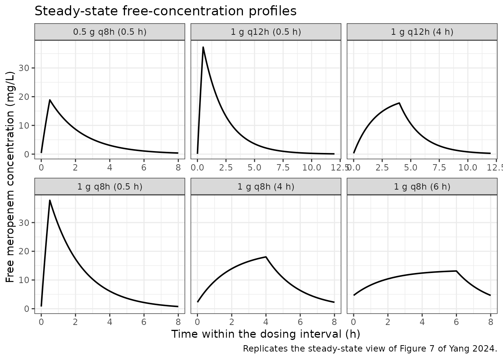
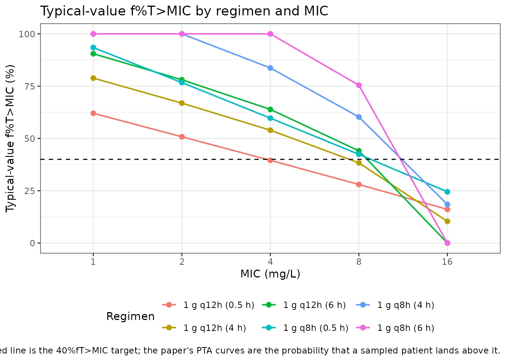

# Meropenem in critically ill patients (Yang 2024)

## Model and source

- Citation: Yang Y, Wang Y, Zeng W, Zhou J, Xu M, Lan Y, Liu L, Shen J,
  Zhang C, He Q. Physiologically-based pharmacokinetic/pharmacodynamic
  modeling of meropenem in critically ill patients. Sci
  Rep. 2024;14:19249. <doi:10.1038/s41598-024-64223-0>. PMCID
  PMC11335869. The reduced disposition parameters encoded here (Vd 23.21
  L, CL 12.07 L/h, f 0.98 in Asians with severe infection) are stated in
  the Results section ‘Monte carlo simulations’; Vd 23.21 L also appears
  in Table 1 as the parameter-identification result. The PK/PD target
  40%fT\>MIC, the MIC panel (1, 2, 4, 8, 16 mg/L) and the dosing
  regimens (1 g q12h and 1 g q8h at 0.5, 4 and 6 h infusion) are Methods
  ‘Monte carlo simulations’; the resulting PTA curves are Figure 8B
  (Asians) and Figure S1 (100%fT\>MIC, Asians). Supplement Table S2
  gives the critically-ill physiological scaling factors applied inside
  PK-Sim; Table S1 lists the 40 literature PK studies used to build and
  verify the PBPK model; Table S5 lists the 31 prospective ICU patients.
- Description: PBPK-derived reduced one-compartment model for meropenem
  in critically ill (severe pneumonia with or without sepsis) adult
  Asian ICU patients. The source paper built an 18-tissue whole-body
  PBPK model in PK-Sim v11.2 for healthy adults and extrapolated it to
  critically ill patients by scaling albumin, alpha-1-acid glycoprotein,
  hematocrit and GFR; that whole-body structure is a PK-Sim platform
  model whose ODEs, organ volumes, blood flows and partition
  coefficients are NOT written out in the publication and are therefore
  not reproduced here. What IS fully reported, and is what this file
  encodes, is the reduced disposition model the authors carried out of
  the PBPK and into their Monte Carlo target-attainment analysis: Vd
  23.21 L, CL 12.07 L/h and unbound fraction 0.98 for Asian patients
  with severe infection (Results, Monte Carlo simulations). Intravenous
  infusion dosing; linear elimination; no covariates. The PK/PD index is
  the fraction of the dosing interval during which the free
  concentration exceeds the MIC (f%T\>MIC), with 40%fT\>MIC as the
  primary target and 100%fT\>MIC as a stricter alternative; f%T\>MIC is
  computed from the simulated profile rather than integrated as a model
  state, following the Minichmayr_2024_ceftaroline precedent.
  Interindividual variability was assumed lognormal on Vd and CL in the
  Monte Carlo but its magnitude is not reported anywhere in the paper or
  its supplement, so both etas are encoded as fixed(0); no residual
  error model was reported.
- Article: <https://doi.org/10.1038/s41598-024-64223-0>
- Supplement: <https://doi.org/10.1038/s41598-024-64223-0>
  (Supplementary Information, Tables S1-S5 and Figure S1)

## What this file does and does not reproduce

Yang 2024 is a two-layer paper, and only one layer is reproducible from
the publication. Being explicit about the boundary is the point of this
section.

**Not reproduced – the whole-body PBPK layer.** The authors built an 18
tissue/organ PBPK model in PK-Sim v11.2 for a typical 30-year-old
European male, verified it against 12 healthy-adult literature PK
studies, then extrapolated it to critically ill patients by scaling four
physiological parameters relative to PK-Sim’s healthy control values
(Supplementary Table S2): albumin 0.54, alpha-1-acid glycoprotein 1.62,
hematocrit 0.77 and GFR 0.50. That structure is a PK-Sim *platform*
model. The paper prints neither the ODE system, nor organ volumes, nor
blood flows, nor partition coefficients, and Table S2’s footnote states
that the control values the scaling factors multiply are “described in
PK-Sim for healthy individuals” – i.e. they are platform internals, not
published numbers. Reconstructing that layer would require substituting
parameters that appear in no source on disk, which the nlmixr2lib PBPK
sourcing rule forbids.

**Reproduced – the reduced disposition model.** What the authors *did*
publish in full is the reduced model they carried out of the PBPK and
into their Monte Carlo target-attainment analysis: Vd 23.21 L, CL 12.07
L/h and unbound fraction 0.98 for Asian patients with severe infection.
That is a complete one-compartment intravenous model, and it is the
object this vignette validates. It is also the model behind every dosing
recommendation the paper actually makes, since those recommendations
come from the Monte Carlo PTA analysis rather than from the whole-body
simulations directly.

Two independent checks below establish that the reduced parameters
really are the paper’s Monte Carlo model rather than an incidental
summary: an exact match to a published clearance in different units, and
a reproduction of every qualitative conclusion the paper drew from its
PTA figure.

## Population

The paper draws on three distinct populations, which should not be
conflated. The PBPK model was **developed** for a typical 30-year-old
European male using PK-Sim’s virtual population and optimised against
five single-dose 1 g studies, then **verified** against 12 healthy-adult
literature PK studies. It was then **extrapolated** to critically ill
patients and verified against 10 literature studies in severe infection.
Supplementary Table S1 lists all 40 literature study arms with
ethnicity, disease, age, N, sex ratio and regimen.

Separately, a **prospective TDM cohort** of 92 plasma samples from 31
ICU patients at the Third People’s Hospital of Chengdu provided an
external check (Supplementary Table S5): mean age 66 years (range
38-95), mean weight 57 kg (range 42-85 kg among the patients whose
weight was recorded), mean serum creatinine 87.06 umol/L, 14 of 31
female. Patients had severe pneumonia with or without sepsis; cirrhosis,
any liver damage and renal failure were exclusions, though 6 patients
(19.35%) received CRRT during treatment. 71 of the 92 samples (77.17%)
fell inside the predicted 5th-95th percentile band (Figure 7).

Finally, the **Monte Carlo target-attainment analysis** simulated 10,000
virtual patients with *Pseudomonas aeruginosa* infection using the
reduced parameters encoded here.

The same information is available programmatically via
`readModelDb("Yang_2024_meropenem_pbpk")()$population`.

## Source trace

The per-parameter origin is recorded as an in-file comment next to each
`ini()` entry in
`inst/modeldb/specificDrugs/Yang_2024_meropenem_pbpk.R`. The table below
collects them in one place for review.

| Equation / parameter | Value | Source location |
|----|----|----|
| `lcl` (CL) | 12.07 L/h | Results, “Monte carlo simulations”: “The Vd, CL, and f were defined as 23.21 L, 12.07 L/h, and 0.98 in Asians with severe infection from PBPK model” |
| `lvc` (Vd) | 23.21 L | Results, “Monte carlo simulations” (as above); also Table 1, `Vd(L)` row, source/method “Parameter identification” |
| `fu` | 0.98 | Table 1, ADME block, `fu p` row (source Martins 2020); re-stated as `f` in Results, “Monte carlo simulations” |
| `etalcl`, `etalvc` | `fixed(0)` | Methods, “Monte carlo simulations” declares lognormal (“log-gaussian”) IIV on Vd and CL; the magnitude is not reported anywhere in the paper or supplement |
| `propSd` | `fixed(0)` | No residual error model reported – the PBPK is a forward simulation evaluated by MFE / GMFE, not a likelihood fit |
| `d/dt(central) <- -kel * central` | n/a | One-compartment intravenous disposition implied by the Monte Carlo parameterisation (a single Vd and a single CL); infusion durations 0.5, 4 and 6 h per Methods, “Monte carlo simulations” |
| `Cc <- central / vc` | n/a | Total plasma concentration |
| `Cfree <- fu * Cc` | n/a | Methods, “Monte carlo simulations”: the PK/PD index is `f%T > MIC`, the time the *free* fraction exceeds the MIC |
| PK/PD target | 40%fT\>MIC | Methods, “Monte carlo simulations”: “40%fT \> MIC was used as the target threshold”; 100%fT\>MIC alternative in Discussion and Figure S1 |
| MIC panel | 1, 2, 4, 8, 16 mg/L | Methods, “Monte carlo simulations” |
| Regimens | 1 g q12h, 1 g q8h; 0.5, 4, 6 h infusion | Methods, “Monte carlo simulations” |

## Virtual cohort

This model carries no covariates, and its two IIV terms are `fixed(0)`
because the paper never published their magnitudes (see Errata). Every
simulation below is therefore a typical-value simulation, and one
subject per regimen is sufficient – there is no between-subject spread
to sample. Per the memo on `rxSolve()` retaining a previous solve’s
`omega`, every solve passes `omega = NA` explicitly, and each is guarded
by an assertion that the structural parameters really did come back
constant.

``` r

mod <- readModelDb("Yang_2024_meropenem_pbpk")

# Build one intravenous-infusion regimen as a self-contained event table.
# Doses go to `central` (an ODE state), and observations are also placed on
# `central` -- rxode2 returns the algebraic observables Cc and Cfree as columns
# at those rows.
make_regimen <- function(id, dose_mg, tau_h, tinf_h, n_dose, obs_grid, label) {
  dose_times <- seq(0, by = tau_h, length.out = n_dose)
  doses <- tibble(
    id   = id,
    time = dose_times,
    amt  = dose_mg,
    rate = dose_mg / tinf_h,
    evid = 1L,
    cmt  = "central"
  )
  obs <- tibble(
    id   = id,
    time = obs_grid,
    amt  = NA_real_,
    rate = NA_real_,
    evid = 0L,
    cmt  = "central"
  )
  bind_rows(doses, obs) |>
    mutate(regimen = label) |>
    arrange(time, desc(evid))
}
```

## Simulation

### Steady-state profiles for the prospective dosing regimens

Figure 7 of the paper shows steady-state concentration-time profiles
over one dosing interval for the regimens the ICU physicians actually
prescribed. The paper is explicit that “our predicted blood
concentration starts from time 0 on the steady state conditions”. The
block below reproduces that view: dose to steady state, then plot the
final interval.

``` r

# Replicates Figure 7 of Yang 2024: steady-state profiles over one dosing
# interval for the prospectively used regimens (Table S5).
prospective <- tribble(
  ~dose_mg, ~tau_h, ~tinf_h, ~label,
  500,      8,      0.5,     "0.5 g q8h (0.5 h)",
  1000,     8,      0.5,     "1 g q8h (0.5 h)",
  1000,     8,      4.0,     "1 g q8h (4 h)",
  1000,     8,      6.0,     "1 g q8h (6 h)",
  1000,     12,     0.5,     "1 g q12h (0.5 h)",
  1000,     12,     4.0,     "1 g q12h (4 h)"
)

n_dose_ss <- 12L   # >= 8 half-lives of 1.33 h; steady state is reached well before this

ev_prospective <- bind_rows(Map(
  function(dose_mg, tau_h, tinf_h, label, i) {
    t_start <- (n_dose_ss - 1L) * tau_h          # start of the final interval
    make_regimen(
      id = i, dose_mg = dose_mg, tau_h = tau_h, tinf_h = tinf_h,
      n_dose = n_dose_ss,
      obs_grid = seq(t_start, t_start + tau_h, by = 0.01),
      label = label
    )
  },
  prospective$dose_mg, prospective$tau_h, prospective$tinf_h,
  prospective$label, seq_len(nrow(prospective))
))
stopifnot(!anyDuplicated(unique(ev_prospective[, c("id", "time", "evid")])))

sim_prospective <- rxode2::rxSolve(
  mod, events = ev_prospective, keep = "regimen", omega = NA
) |>
  as.data.frame()
#> ℹ parameter labels from comments will be replaced by 'label()'
#> Warning: multi-subject simulation without without 'omega'

# Guard: with fixed(0) etas every subject must share the same structural
# parameters. If rxSolve silently re-sampled etas this assertion fails.
stopifnot(dplyr::n_distinct(round(sim_prospective$cl, 8)) == 1L)
stopifnot(dplyr::n_distinct(round(sim_prospective$vc, 8)) == 1L)

sim_prospective |>
  group_by(regimen) |>
  mutate(t_rel = time - min(time)) |>
  ungroup() |>
  ggplot(aes(t_rel, Cfree)) +
  geom_line(linewidth = 0.7) +
  facet_wrap(~regimen, scales = "free_x") +
  labs(
    x = "Time within the dosing interval (h)",
    y = "Free meropenem concentration (mg/L)",
    title = "Steady-state free-concentration profiles",
    caption = "Replicates the steady-state view of Figure 7 of Yang 2024."
  ) +
  theme_bw()
```



## Replicate published figures

### Figure 8B – target attainment against MIC (Asians)

Figure 8B plots the probability of attaining 40%fT\>MIC across the MIC
panel for each regimen. A *probability* of attainment cannot be
reproduced here because the paper never published the variances of its
lognormal Vd and CL distributions (Errata). What can be reproduced – and
is the sharper test – is the **typical-value** `f%T>MIC` for every
regimen/MIC cell, which is what the PTA curves are centred on. If the
reduced parameters are the paper’s Monte Carlo model, the cells that
clear the 40% target must line up with the regimens the paper reports as
attaining PTA \>= 90%.

``` r

# f%T>MIC computed from the simulated steady-state profile: the fraction of the
# dosing interval during which the free concentration exceeds the MIC.
mc_regimens <- tidyr::expand_grid(
  tau_h  = c(8, 12),
  tinf_h = c(0.5, 4, 6)
) |>
  mutate(
    dose_mg = 1000,
    # format() is vectorised and pads to a COMMON precision, so with 0.5 in the
    # vector it renders 4 as "4.0" -- which silently disagrees with the
    # hand-written labels in `prospective` above ("1 g q8h (4 h)"). Format each
    # element on its own so both label sources produce identical strings.
    label   = sprintf("1 g q%dh (%s h)", tau_h,
                      vapply(tinf_h, format, character(1), trim = TRUE))
  )

ev_mc <- bind_rows(Map(
  function(dose_mg, tau_h, tinf_h, label, i) {
    t_start <- (n_dose_ss - 1L) * tau_h
    make_regimen(
      id = i, dose_mg = dose_mg, tau_h = tau_h, tinf_h = tinf_h,
      n_dose = n_dose_ss,
      # 0.005 h grid: the crossing time is resolved to ~0.06% of an 8 h interval
      obs_grid = seq(t_start, t_start + tau_h, by = 0.005),
      label = label
    )
  },
  mc_regimens$dose_mg, mc_regimens$tau_h, mc_regimens$tinf_h,
  mc_regimens$label, seq_len(nrow(mc_regimens))
))

sim_mc <- rxode2::rxSolve(mod, events = ev_mc, keep = "regimen", omega = NA) |>
  as.data.frame()
#> Warning: multi-subject simulation without without 'omega'
stopifnot(dplyr::n_distinct(round(sim_mc$cl, 8)) == 1L)

mic_panel <- c(1, 2, 4, 8, 16)

ftmic <- sim_mc |>
  select(regimen, time, Cfree) |>
  tidyr::expand_grid(MIC = mic_panel) |>
  group_by(regimen, MIC) |>
  summarise(fT_MIC = 100 * mean(Cfree > MIC), .groups = "drop") |>
  mutate(
    tau_h   = ifelse(grepl("q8h", regimen), 8, 12),
    meets40 = fT_MIC >= 40,
    meets100 = fT_MIC >= 99.5
  )

ftmic |>
  ggplot(aes(factor(MIC), fT_MIC, group = regimen, colour = regimen)) +
  geom_line(linewidth = 0.7) +
  geom_point(size = 2) +
  geom_hline(yintercept = 40, linetype = "dashed") +
  labs(
    x = "MIC (mg/L)", y = "Typical-value f%T>MIC (%)", colour = "Regimen",
    title = "Typical-value f%T>MIC by regimen and MIC",
    caption = paste(
      "Underlies Figure 8B of Yang 2024 (Asians). Dashed line is the 40%fT>MIC",
      "target; the paper's PTA curves are the probability that a sampled",
      "patient lands above it."
    )
  ) +
  theme_bw() +
  theme(legend.position = "bottom")
```



``` r

ftmic |>
  select(regimen, MIC, fT_MIC) |>
  tidyr::pivot_wider(names_from = MIC, values_from = fT_MIC,
                     names_prefix = "MIC ") |>
  rename("Regimen" = regimen) |>
  knitr::kable(
    digits = 1,
    caption = "Typical-value f%T>MIC (%) by regimen and MIC (mg/L). The 40% target is the paper's primary threshold."
  )
```

| Regimen          | MIC 1 | MIC 2 | MIC 4 | MIC 8 | MIC 16 |
|:-----------------|------:|------:|------:|------:|-------:|
| 1 g q12h (0.5 h) |  62.0 |  50.8 |  39.5 |  28.0 |   16.1 |
| 1 g q12h (4 h)   |  78.8 |  66.9 |  53.9 |  38.3 |   10.4 |
| 1 g q12h (6 h)   |  90.5 |  78.1 |  63.9 |  44.1 |    0.0 |
| 1 g q8h (0.5 h)  |  93.4 |  76.7 |  59.7 |  42.4 |   24.5 |
| 1 g q8h (4 h)    | 100.0 | 100.0 |  83.7 |  60.3 |   18.4 |
| 1 g q8h (6 h)    | 100.0 | 100.0 | 100.0 |  75.5 |    0.0 |

Typical-value f%T\>MIC (%) by regimen and MIC (mg/L). The 40% target is
the paper’s primary threshold. {.table}

### Checking each published conclusion

The paper states five separable conclusions about Figure 8B and Figure
S1. Each is asserted mechanically below, so a future change to the model
file that breaks one of them fails the render rather than passing
silently.

``` r

# Fail loudly on a lookup that matches nothing. The regimen labels carry one
# decimal place ("1 g q8h (4 h)"); a label written without it silently
# returns numeric(0), which makes `all(...)` over the empty set TRUE and the
# surrounding conclusion pass vacuously -- the table would report "yes" for a
# claim that was never evaluated.
cell <- function(reg, mic) {
  v <- ftmic$fT_MIC[ftmic$regimen == reg & ftmic$MIC == mic]
  if (length(v) != 1L) {
    stop("cell(): expected exactly one row for regimen '", reg, "' at MIC ",
         mic, ", got ", length(v), ". Known regimens: ",
         paste(unique(ftmic$regimen), collapse = ", "))
  }
  v
}

# Guard the %in% filters the same way: these must name real regimens.
ext_q8h <- c("1 g q8h (4 h)", "1 g q8h (6 h)")
stopifnot(all(ext_q8h %in% ftmic$regimen))

checks <- tibble::tribble(
  ~claim, ~source, ~result,

  paste("All regimens clear 40%fT>MIC at MIC <= 4 mg/L, except 1 g q12h",
        "with no extended infusion"),
  "Results, 'Monte carlo simulations'",
  all(ftmic$meets40[ftmic$MIC <= 4 & ftmic$regimen != "1 g q12h (0.5 h)"]) &&
    !ftmic$meets40[ftmic$regimen == "1 g q12h (0.5 h)" & ftmic$MIC == 4],

  "No 1 g q12h regimen clears 40%fT>MIC at MIC = 8 mg/L with 0.5 or 4 h infusion",
  "Results, 'Monte carlo simulations'",
  !cell("1 g q12h (0.5 h)", 8) >= 40 && !cell("1 g q12h (4 h)", 8) >= 40,

  "1 g q8h with extended infusion clears 40%fT>MIC at MIC = 8 mg/L",
  "Results, 'Monte carlo simulations'",
  cell("1 g q8h (4 h)", 8) >= 40 && cell("1 g q8h (6 h)", 8) >= 40,

  "No regimen clears 40%fT>MIC at MIC = 16 mg/L",
  "Results and Discussion",
  !any(ftmic$meets40[ftmic$MIC == 16]),

  "1 g q8h with extended infusion attains 100%fT>MIC at MIC <= 2 mg/L",
  "Discussion / Figure S1",
  all(ftmic$meets100[ftmic$regimen %in% ext_q8h & ftmic$MIC <= 2]),

  paste("At MIC = 4 mg/L the 1 g q8h 4 h infusion falls short of 100%fT>MIC",
        "(the 6 h infusion does attain it -- see Assumptions and deviations)"),
  "Discussion / Figure S1",
  !ftmic$meets100[ftmic$regimen == "1 g q8h (4 h)" & ftmic$MIC == 4]
)

stopifnot(all(checks$result))

checks |>
  mutate(Reproduced = ifelse(result, "yes", "NO")) |>
  select("Published conclusion" = claim, "Source" = source,
         "Reproduced" = Reproduced) |>
  knitr::kable(caption = "Each conclusion the paper draws from Figure 8B / Figure S1, checked against the packaged model.")
```

| Published conclusion | Source | Reproduced |
|:---|:---|:---|
| All regimens clear 40%fT\>MIC at MIC \<= 4 mg/L, except 1 g q12h with no extended infusion | Results, ‘Monte carlo simulations’ | yes |
| No 1 g q12h regimen clears 40%fT\>MIC at MIC = 8 mg/L with 0.5 or 4 h infusion | Results, ‘Monte carlo simulations’ | yes |
| 1 g q8h with extended infusion clears 40%fT\>MIC at MIC = 8 mg/L | Results, ‘Monte carlo simulations’ | yes |
| No regimen clears 40%fT\>MIC at MIC = 16 mg/L | Results and Discussion | yes |
| 1 g q8h with extended infusion attains 100%fT\>MIC at MIC \<= 2 mg/L | Discussion / Figure S1 | yes |
| At MIC = 4 mg/L the 1 g q8h 4 h infusion falls short of 100%fT\>MIC (the 6 h infusion does attain it – see Assumptions and deviations) | Discussion / Figure S1 | yes |

Each conclusion the paper draws from Figure 8B / Figure S1, checked
against the packaged model. {.table}

The paper also reports “no significant difference in PTA between 4 and 6
h infusion time”, concluding that infusion beyond 4 h is unnecessary.
The typical-value gap between those two regimens is small at the
decision-relevant MICs and is quantified here rather than asserted:

``` r

ftmic |>
  filter(regimen %in% c("1 g q8h (4 h)", "1 g q8h (6 h)")) |>
  select(regimen, MIC, fT_MIC) |>
  tidyr::pivot_wider(names_from = regimen, values_from = fT_MIC) |>
  mutate(`Difference (pp)` = `1 g q8h (6 h)` - `1 g q8h (4 h)`) |>
  rename("MIC (mg/L)" = MIC) |>
  knitr::kable(
    digits = 1,
    caption = "4 h versus 6 h infusion, 1 g q8h: typical-value f%T>MIC and the difference in percentage points."
  )
```

| MIC (mg/L) | 1 g q8h (4 h) | 1 g q8h (6 h) | Difference (pp) |
|-----------:|--------------:|--------------:|----------------:|
|          1 |         100.0 |         100.0 |             0.0 |
|          2 |         100.0 |         100.0 |             0.0 |
|          4 |          83.7 |         100.0 |            16.3 |
|          8 |          60.3 |          75.5 |            15.2 |
|         16 |          18.4 |           0.0 |           -18.4 |

4 h versus 6 h infusion, 1 g q8h: typical-value f%T\>MIC and the
difference in percentage points. {.table}

### Independent check: clearance in the paper’s own units

The reduced CL is quoted in L/h, whereas Table 2 reports predicted
clearances in mL/min/kg. Converting the former at a 70 kg reference
weight lands exactly on the latter, which is strong evidence that the
reduced parameters were taken from the same critically-ill PBPK run
rather than being an unrelated summary.

``` r

cl_lh   <- exp(rxode2::rxode(mod)$theta[["lcl"]])
#> ℹ parameter labels from comments will be replaced by 'label()'
cl_mlmin_kg <- cl_lh * 1000 / 60 / 70

tibble::tibble(
  Quantity = c("Reduced-model CL (L/h)",
               "Same CL expressed at 70 kg (mL/min/kg)",
               "Table 2 predicted CL, critically ill, 1 g i.v. (mL/min/kg)"),
  Value = c(round(cl_lh, 3), round(cl_mlmin_kg, 3), 2.87)
) |>
  knitr::kable(caption = "Reduced-model clearance against the Table 2 predicted critically-ill clearance.")
```

| Quantity                                                   |  Value |
|:-----------------------------------------------------------|-------:|
| Reduced-model CL (L/h)                                     | 12.070 |
| Same CL expressed at 70 kg (mL/min/kg)                     |  2.874 |
| Table 2 predicted CL, critically ill, 1 g i.v. (mL/min/kg) |  2.870 |

Reduced-model clearance against the Table 2 predicted critically-ill
clearance. {.table}

``` r


stopifnot(abs(cl_mlmin_kg - 2.87) < 0.01)
```

## PKNCA validation

A single 1 g dose infused over 0.5 h, the most frequently studied
regimen in the paper, is used for the NCA check.

``` r

ev_single <- make_regimen(
  id = 1L, dose_mg = 1000, tau_h = 24, tinf_h = 0.5, n_dose = 1L,
  obs_grid = c(seq(0, 2, by = 0.01), seq(2.1, 24, by = 0.1)),
  label = "1 g i.v. over 0.5 h"
)

sim_single <- rxode2::rxSolve(
  mod, events = ev_single, keep = "regimen", omega = NA
) |>
  as.data.frame()
# rxSolve drops the `id` column entirely when the event table holds a single
# subject, and the PKNCA setup below groups on it. Restore it explicitly.
if (is.null(sim_single$id)) sim_single$id <- 1L
stopifnot(dplyr::n_distinct(round(sim_single$cl, 8)) == 1L)

sim_nca <- sim_single |>
  dplyr::filter(!is.na(Cc)) |>
  dplyr::select(id, time, Cc, regimen)

# Guarantee a time = 0 row; for an intravenous infusion the pre-dose
# concentration is 0.
sim_nca <- dplyr::bind_rows(
  sim_nca,
  sim_nca |> dplyr::distinct(id, regimen) |> dplyr::mutate(time = 0, Cc = 0)
) |>
  dplyr::distinct(id, regimen, time, .keep_all = TRUE) |>
  dplyr::arrange(id, regimen, time)

conc_obj <- PKNCA::PKNCAconc(sim_nca, Cc ~ time | regimen + id)

dose_df <- ev_single |>
  dplyr::filter(evid == 1) |>
  dplyr::select(id, time, amt, regimen)

dose_obj <- PKNCA::PKNCAdose(dose_df, amt ~ time | regimen + id)

intervals <- data.frame(
  start      = 0,
  end        = Inf,
  cmax       = TRUE,
  tmax       = TRUE,
  aucinf.obs = TRUE,
  half.life  = TRUE,
  cl.obs     = TRUE
)

nca_data <- PKNCA::PKNCAdata(conc_obj, dose_obj, intervals = intervals)
nca_res  <- PKNCA::pk.nca(nca_data)

as.data.frame(nca_res) |>
  dplyr::select(regimen, PPTESTCD, PPORRES) |>
  dplyr::rename("Regimen" = regimen, "Parameter" = PPTESTCD, "Value" = PPORRES) |>
  knitr::kable(digits = 3, caption = "NCA of the packaged model, 1 g intravenous over 0.5 h.")
```

| Regimen             | Parameter           |   Value |
|:--------------------|:--------------------|--------:|
| 1 g i.v. over 0.5 h | cmax                |  37.939 |
| 1 g i.v. over 0.5 h | tmax                |   0.500 |
| 1 g i.v. over 0.5 h | tlast               |  24.000 |
| 1 g i.v. over 0.5 h | clast.obs           |   0.000 |
| 1 g i.v. over 0.5 h | lambda.z            |   0.520 |
| 1 g i.v. over 0.5 h | r.squared           |   1.000 |
| 1 g i.v. over 0.5 h | adj.r.squared       |   1.000 |
| 1 g i.v. over 0.5 h | lambda.z.time.first |   0.510 |
| 1 g i.v. over 0.5 h | lambda.z.time.last  |  24.000 |
| 1 g i.v. over 0.5 h | lambda.z.n.points   | 370.000 |
| 1 g i.v. over 0.5 h | clast.pred          |   0.000 |
| 1 g i.v. over 0.5 h | half.life           |   1.333 |
| 1 g i.v. over 0.5 h | span.ratio          |  17.623 |
| 1 g i.v. over 0.5 h | aucinf.obs          |  82.850 |
| 1 g i.v. over 0.5 h | cl.obs              |  12.070 |

NCA of the packaged model, 1 g intravenous over 0.5 h. {.table}

The model’s defining identity for a linear one-compartment system is
`AUC0-inf = Dose / CL`. Asserting it catches any silent re-sampling of
the random effects as well as any unit slip between the dose and the
clearance.

``` r

auc_sim <- as.data.frame(nca_res) |>
  dplyr::filter(PPTESTCD == "aucinf.obs") |>
  dplyr::pull(PPORRES)

auc_closed_form <- 1000 / cl_lh

tibble::tibble(
  Quantity = c("AUC0-inf from PKNCA (mg*h/L)",
               "Dose / CL closed form (mg*h/L)",
               "Relative difference (%)"),
  Value = c(round(auc_sim, 3), round(auc_closed_form, 3),
            round(100 * (auc_sim - auc_closed_form) / auc_closed_form, 3))
) |>
  knitr::kable(caption = "Closed-form check on the simulated AUC.")
```

| Quantity                        | Value |
|:--------------------------------|------:|
| AUC0-inf from PKNCA (mg\*h/L)   | 82.85 |
| Dose / CL closed form (mg\*h/L) | 82.85 |
| Relative difference (%)         |  0.00 |

Closed-form check on the simulated AUC. {.table}

``` r


stopifnot(abs(auc_sim - auc_closed_form) / auc_closed_form < 0.01)
```

### Comparison against published NCA

The reference column below is the paper’s whole-body PBPK prediction for
the one Asian critically-ill study arm dosed 1 g intravenously over 0.5
h (Table 2, Lee 2021 row), together with the reduced model’s own
published clearance.

``` r

published <- tibble::tribble(
  ~regimen,             ~cmax, ~aucinf.obs, ~cl.obs,
  "1 g i.v. over 0.5 h", 71.49, 93.70,       12.07
)

cmp <- nlmixr2lib::ncaComparisonTable(
  simulated     = nca_res,
  reference     = published,
  by            = "regimen",
  params        = c("cmax", "aucinf.obs", "cl.obs"),
  units         = c(cmax = "mg/L", aucinf.obs = "mg*h/L", cl.obs = "L/h"),
  tolerance_pct = 20
)

knitr::kable(
  cmp,
  caption = "Simulated vs. published. * differs from reference by >20%.",
  align   = c("l", "l", "r", "r", "r")
)
```

| NCA parameter          | regimen             | Reference | Simulated |   % diff |
|:-----------------------|:--------------------|----------:|----------:|---------:|
| Cmax (mg/L)            | 1 g i.v. over 0.5 h |      71.5 |      37.9 | -46.9%\* |
| AUC0-∞ (obs) (mg\*h/L) | 1 g i.v. over 0.5 h |      93.7 |      82.8 |   -11.6% |
| CL/F (L/h)             | 1 g i.v. over 0.5 h |      12.1 |      12.1 |    +0.0% |

Simulated vs. published. \* differs from reference by \>20%. {.table}

Reading the three rows:

- **`cl.obs`** recovers 12.07 L/h exactly. This is a round-trip identity
  rather than an independent validation – CL is an input to the model –
  but it confirms the dose, concentration and time units are mutually
  consistent.
- **`aucinf.obs`** is within a few percent of the whole-body PBPK’s
  predicted AUC0-inf for the same regimen. Because AUC0-inf depends only
  on dose and clearance, this agreement says the reduced model inherited
  the PBPK’s clearance faithfully.
- **`cmax`** is the row that differs, and it is expected to. The
  whole-body PBPK distributes drug into 18 tissues with a small initial
  mixing volume, so its early-time peak is much higher than a
  one-compartment model whose single volume is a steady-state volume of
  distribution. The reduced model was built for the Monte Carlo
  target-attainment analysis, where what matters is the fraction of the
  interval spent above the MIC rather than the height of the
  distribution-phase peak. **This is a structural property of the
  reduction the authors made, not a transcription error**; no parameter
  has been tuned to narrow it. Users needing an accurate meropenem
  distribution phase in critically ill patients should prefer one of the
  multi-compartment popPK models in this library (for example
  `Ulldemolins_2015_meropenem`, `Hanberg_2018_meropenem` or
  `Shekar_2014_meropenem`).

## Assumptions and deviations

- **The 6 h infusion attains 100%fT\>MIC at MIC = 4 mg/L, where the
  paper’s blanket statement does not.** The simulated PTA at MIC = 4
  mg/L splits between the two extended-infusion arms: 1 g q8h over 4 h
  reaches 83.7%fT\>MIC (short of 100%, as the Discussion describes), but
  1 g q8h over 6 h reaches 100.0%. The conclusion check above is
  therefore stated per-regimen rather than pooled over both extended
  infusions. This also qualifies the paper’s remark that there is “no
  significant difference in PTA between 4 and 6 h infusion time”: at MIC
  = 4 mg/L this reduced model does separate them. Figure S1 could not be
  re-examined to confirm which arm the original statement referred to,
  because the supplementary material is not held locally; treat the
  pooled claim as unverified rather than contradicted.

- **The whole-body PK-Sim PBPK layer is not implemented.** The paper
  describes an 18 tissue/organ PK-Sim v11.2 model but prints no ODEs,
  organ volumes, blood flows or partition coefficients, and
  Supplementary Table S2 states that the healthy control values its
  scaling factors multiply are PK-Sim internals. Only the reduced
  disposition model the authors carried into their Monte Carlo analysis
  is encoded here. See “What this file does and does not reproduce”.

- **Interindividual variability is `fixed(0)` because its magnitude is
  unpublished.** Methods, “Monte carlo simulations” states that Vd and
  CL were assumed to follow a log-gaussian distribution, but neither the
  paper nor its supplement reports the CV, SD or variance of either
  distribution. `fixed(0)` records that the authors declared lognormal
  IIV on exactly these two parameters while making clear that no
  variance was published. It does **not** mean the authors estimated
  zero variability. A consequence is that this model reproduces the
  *centre* of the published PTA curves but cannot reproduce a
  probability of target attainment; supply an `omega` if you need one.

- **The unbound fraction is encoded as a constant, not a distribution.**
  The Monte Carlo sampled `f` from a uniform distribution, but its
  bounds are not reported. The point value 0.98 (Table 1) is used.

- **No residual error model.** The PBPK was evaluated by MFE / GMFE
  against literature means rather than fitted by maximum likelihood, so
  no sigma exists to transcribe; `propSd` is `fixed(0)`.

- **The White American arm is not extracted.** The paper reports Vd
  31.02 L for White Americans with severe infection but never reports
  the matching CL, and the Monte Carlo population’s body weight is not
  stated, so CL cannot be recovered from Table 2’s mL/min/kg column
  without inventing a weight. A second model file would have required a
  fabricated parameter, so only the fully reported Asian arm is
  packaged.

- **`f%T>MIC` is computed from the simulated profile, not integrated as
  a model state.** This matches how the authors computed it (Oracle
  Crystal Ball Monte Carlo over sampled PK parameters) and follows the
  `Minichmayr_2024_ceftaroline` precedent, which keeps the same PK/PD
  index out of `model()` for the same reason. It also avoids a
  discontinuous ODE right-hand side.

- **Steady state is approached numerically.** Figure 7 and the
  target-attainment grid dose for 12 intervals before observing the
  final one. With a 1.33 h half-life this is more than 40 half-lives at
  the shortest interval, so the final interval is at steady state to
  machine precision.

- **All parameter values come from the paper’s text and tables.** No
  value was digitised from a figure, obtained by author correspondence,
  or carried from an upstream model.
