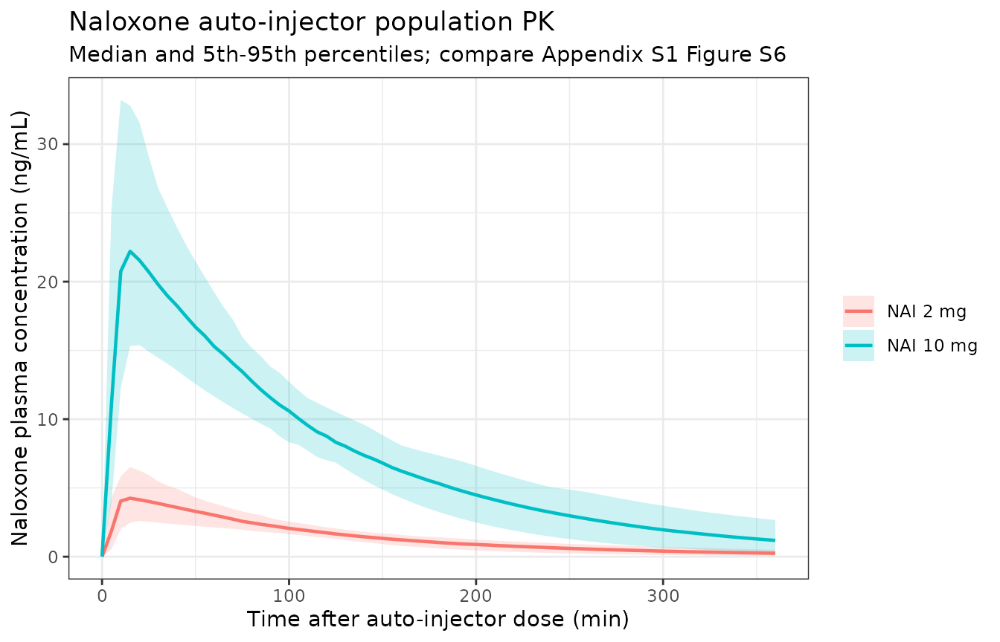
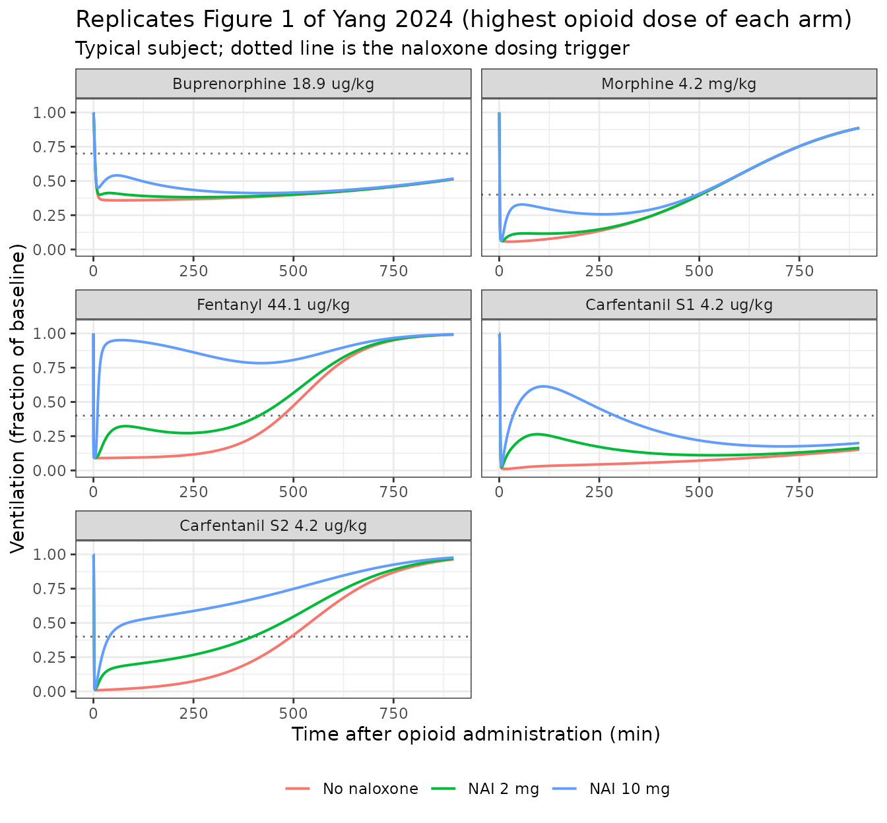

# Naloxone auto-injector reversal of opioid-induced respiratory depression (Yang 2024)

``` r

library(nlmixr2lib)
library(PKNCA)
#> 
#> Attaching package: 'PKNCA'
#> The following object is masked from 'package:stats':
#> 
#>     filter
library(rxode2)
#> rxode2 5.1.6 using 2 threads (see ?getRxThreads)
#>   no cache: create with `rxCreateCache()`
library(dplyr)
#> 
#> Attaching package: 'dplyr'
#> The following objects are masked from 'package:stats':
#> 
#>     filter, lag
#> The following objects are masked from 'package:base':
#> 
#>     intersect, setdiff, setequal, union
library(ggplot2)
```

## Overview

Yang et al. (2024) asked whether a 10 mg intramuscular naloxone
auto-injector (NAI 10 mg) can reverse opioid-induced respiratory
depression (OIRD), including the depression produced by lethal doses of
high-potency synthetic opioids. They built one new model and assembled
four others:

1.  **`Yang_2024_naloxone`** – an original population PK model of the
    naloxone auto-injector, fitted to 2063 concentrations from 48
    healthy adults.
2.  **`Yang_2024_naloxone_buprenorphine`**, **`..._morphine`**,
    **`..._fentanyl`**, **`..._carfentanil`** – four mechanistic OIRD
    PK-PD models, each pairing one opioid with that same naloxone PK
    layer held fixed.

The four coupled models are genuinely different structures, not one
model with four parameter sets, which is why they are four separate
files:

| Model | Opioid PK | Receptor layer | Ventilation link |
|----|----|----|----|
| Buprenorphine | 3-compartment | explicit occupancy ODE, naloxone via quasi-steady-state `Ce/(KD+Ce)` | linear, `VE = V0(1 - alpha*RL)` |
| Morphine | 3-compartment, micro-constants | explicit occupancy ODE, naloxone via a steep gamma-shaped term | linear, `alpha` fixed at 1 |
| Fentanyl | 2-compartment | none – fast binding collapses to instantaneous equilibrium | fractional Emax, naloxone right-shifts EC50 |
| Carfentanil | 2-compartment (allometric) | explicit occupancy ODE with Hill exponents, concentrations in pM | FDA ventilation-versus-CO2 steady-state relation |

Every parameter comes from Appendix S1 of the paper, which contains both
the parameter tables (S4-S8) and the four NONMEM control streams (A)-(D)
used for the published simulations. Where the tables and the control
streams differ in precision, the control streams were used.

Units throughout are those of the control streams: **time in minutes,
amounts in micrograms, concentrations in ng/mL, ventilation in L/min**.
A dose of NAI 10 mg is therefore `amt = 10000`.

## Population

The naloxone PK layer was fitted to two crossover auto-injector studies
in 48 healthy adults (Appendix S1 Tables S1 and S2).

``` r

pop <- readModelDb("Yang_2024_naloxone")()$population
data.frame(
  Characteristic = c("Subjects", "Studies", "PK observations", "Age", "Body weight",
                     "BMI", "Female", "Race"),
  Value = c(
    "48", "2", "2063",
    pop$age_range, pop$weight_range, pop$bmi_range,
    paste0(pop$sex_female_pct, "%"),
    "Black or African American 75%, White 20.8%, Other 4.2%"
  )
) |>
  knitr::kable()
```

| Characteristic  | Value                                                  |
|:----------------|:-------------------------------------------------------|
| Subjects        | 48                                                     |
| Studies         | 2                                                      |
| PK observations | 2063                                                   |
| Age             | 23-54 years (mean 37.9)                                |
| Body weight     | 57.2-100.2 kg (mean 78.2)                              |
| BMI             | 18.8-31.6 kg/m^2 (mean 26.5)                           |
| Female          | 47.9%                                                  |
| Race            | Black or African American 75%, White 20.8%, Other 4.2% |

The opioid PK-PD layers are not fitted here: buprenorphine and fentanyl
come from Yassen et al. (2007), morphine from Olofsen et al. (2010), and
the carfentanil receptor and ventilation constants from the FDA
`Mechanistic-PK-PD-Model-to-Rescue-Opioid-Overdose` repository.
Carfentanil PK has no human source at all and was obtained by
interspecies allometric scaling. Yang 2024’s simulations fixed body
weight at 70 kg, which is also the reference weight of the naloxone
allometric term.

## Source trace

``` r

data.frame(
  Quantity = c(
    "Naloxone KTR, CL/F, V2/F, Q/F, V3/F, WT-on-CL exponent",
    "Naloxone IIV (KTR, CL/F, V2/F) and proportional residual error",
    "Depot + 3 transit absorption chain; 2-compartment disposition",
    "Reference weight 70 kg for the allometric term",
    "Buprenorphine PK (CL, V1, Q2, V2, Q3, V3) and PD (ke0, kon, koff, KD, alpha, V0)",
    "Morphine PK micro-constants (V1, k10, k12, k21, k13, k31) and PD",
    "Fentanyl PK (CL, V1, Q2, V2) and PD (ke0, EC50, alpha, n, V0)",
    "Naloxone EC50 0.6021768 ng/mL used by the morphine and fentanyl models",
    "Carfentanil PK, both allometric scenarios",
    "Carfentanil / naloxone receptor kon, koff, n (pM scale)",
    "Ventilation-CO2 constants G, Bmax, P1, P2 and baseline VB",
    "Molecular weights 327.4 (naloxone) and 394.512 (carfentanil)",
    "Biophase equations 1-2; receptor equations 3-6; transduction 7",
    "Morphine naloxone-displacement equations 8-9",
    "Fentanyl fractional Emax equations 10-12",
    "Carfentanil binding equation 13 and ventilation equation 14"
  ),
  Source = c(
    "Appendix S1 Table S4; control streams (A)-(D) THETA 1-6",
    "Appendix S1 Table S4; control streams (A)-(D) OMEGA 1-3",
    "Appendix S1 Figure S1 and the $MODEL / $DES blocks of (A)-(D)",
    "Control streams (A)-(D) $PK: 'WT= 70 ; kg', 'THETA(2)*(WT/70)**THETA(3)'",
    "Appendix S1 Table S5; control stream (A) THETA 7-19, OMEGA 4-13",
    "Appendix S1 Table S6; control stream (B) THETA 7-19, OMEGA 4-13",
    "Appendix S1 Table S7; control stream (C) THETA 7-16, OMEGA 4-8",
    "Control streams (B) THETA 17 and (C) $ERROR EC50N; Olofsen 2010",
    "Appendix S1 Table S8; control stream (D) THETA 7-10",
    "Appendix S1 Table S8; control stream (D) THETA 13-18; FDA repository",
    "Control stream (D) $ERROR G0/BMAX/P1/P2; Appendix S1 carfentanil section",
    "Control stream (D) $DES: NMW = 327.4, CMW = 394.512",
    "Appendix S1 'Considerations on Mechanistic PK-PD Model' section",
    "Appendix S1 morphine section; control stream (B) DADT(12)",
    "Appendix S1 fentanyl section; control stream (C) $ERROR",
    "Appendix S1 carfentanil section; control stream (D) DADT(11), $ERROR"
  )
) |>
  knitr::kable()
```

| Quantity | Source |
|:---|:---|
| Naloxone KTR, CL/F, V2/F, Q/F, V3/F, WT-on-CL exponent | Appendix S1 Table S4; control streams (A)-(D) THETA 1-6 |
| Naloxone IIV (KTR, CL/F, V2/F) and proportional residual error | Appendix S1 Table S4; control streams (A)-(D) OMEGA 1-3 |
| Depot + 3 transit absorption chain; 2-compartment disposition | Appendix S1 Figure S1 and the \$MODEL / \$DES blocks of (A)-(D) |
| Reference weight 70 kg for the allometric term | Control streams (A)-(D) \$PK: ‘WT= 70 ; kg’, ’THETA(2)\*(WT/70)\*\*THETA(3)’ |
| Buprenorphine PK (CL, V1, Q2, V2, Q3, V3) and PD (ke0, kon, koff, KD, alpha, V0) | Appendix S1 Table S5; control stream (A) THETA 7-19, OMEGA 4-13 |
| Morphine PK micro-constants (V1, k10, k12, k21, k13, k31) and PD | Appendix S1 Table S6; control stream (B) THETA 7-19, OMEGA 4-13 |
| Fentanyl PK (CL, V1, Q2, V2) and PD (ke0, EC50, alpha, n, V0) | Appendix S1 Table S7; control stream (C) THETA 7-16, OMEGA 4-8 |
| Naloxone EC50 0.6021768 ng/mL used by the morphine and fentanyl models | Control streams (B) THETA 17 and (C) \$ERROR EC50N; Olofsen 2010 |
| Carfentanil PK, both allometric scenarios | Appendix S1 Table S8; control stream (D) THETA 7-10 |
| Carfentanil / naloxone receptor kon, koff, n (pM scale) | Appendix S1 Table S8; control stream (D) THETA 13-18; FDA repository |
| Ventilation-CO2 constants G, Bmax, P1, P2 and baseline VB | Control stream (D) \$ERROR G0/BMAX/P1/P2; Appendix S1 carfentanil section |
| Molecular weights 327.4 (naloxone) and 394.512 (carfentanil) | Control stream (D) \$DES: NMW = 327.4, CMW = 394.512 |
| Biophase equations 1-2; receptor equations 3-6; transduction 7 | Appendix S1 ‘Considerations on Mechanistic PK-PD Model’ section |
| Morphine naloxone-displacement equations 8-9 | Appendix S1 morphine section; control stream (B) DADT(12) |
| Fentanyl fractional Emax equations 10-12 | Appendix S1 fentanyl section; control stream (C) \$ERROR |
| Carfentanil binding equation 13 and ventilation equation 14 | Appendix S1 carfentanil section; control stream (D) DADT(11), \$ERROR |

## Part 1 – Naloxone auto-injector population PK

### Virtual cohort

The cohort reproduces the Table S1 body-weight distribution (mean 78.2
kg, SD 11.0 kg, truncated to the observed 57.2-100.2 kg range) at the
two doses that anchor the analysis: NAI 2 mg and NAI 10 mg. Weights are
taken from deterministic quantiles of the fitted normal so the cohort is
reproducible without depending on the random seed.

``` r

n_per_arm <- 100L
q <- (seq_len(n_per_arm) - 0.5) / n_per_arm
wt_grid <- pmin(pmax(qnorm(q, mean = 78.19, sd = 11.02), 57.2), 100.2)

nal_mod <- rxode2(readModelDb("Yang_2024_naloxone"))

nal_arms <- data.frame(
  arm = c("NAI 2 mg", "NAI 10 mg"),
  dose_ug = c(2000, 10000)
)

sim_naloxone <- lapply(seq_len(nrow(nal_arms)), function(i) {
  ev <-
    et(amt = nal_arms$dose_ug[[i]], cmt = "depot", time = 0) |>
    et(seq(0, 360, by = 5), cmt = "central") |>
    et(id = seq_len(n_per_arm))
  dat <- as.data.frame(ev)
  dat$WT <- wt_grid[dat$id]
  out <- rxSolve(nal_mod, dat, returnType = "data.frame")
  out$arm <- nal_arms$arm[[i]]
  out$dose_ug <- nal_arms$dose_ug[[i]]
  out
}) |>
  bind_rows() |>
  mutate(arm = factor(arm, levels = nal_arms$arm))

summary_naloxone <-
  sim_naloxone |>
  group_by(arm, time) |>
  summarise(
    med = median(Cc),
    lo = quantile(Cc, 0.05),
    hi = quantile(Cc, 0.95),
    .groups = "drop"
  )

ggplot(summary_naloxone, aes(time, med, colour = arm, fill = arm)) +
  geom_ribbon(aes(ymin = lo, ymax = hi), alpha = 0.2, colour = NA) +
  geom_line(linewidth = 0.8) +
  labs(
    x = "Time after auto-injector dose (min)",
    y = "Naloxone plasma concentration (ng/mL)",
    colour = NULL, fill = NULL,
    title = "Naloxone auto-injector population PK",
    subtitle = "Median and 5th-95th percentiles; compare Appendix S1 Figure S6"
  ) +
  theme_bw()
```



### Structural checks against the Discussion

The Discussion states three numbers directly: CL/F of 3.26 L/min, an
apparent total volume of distribution of about 486 L, and a
two-compartment disposition. These are exact consequences of the encoded
parameters, so they act as a transcription check rather than a
simulation check.

``` r

ini_nal <- as.data.frame(readModelDb("Yang_2024_naloxone")()$theta)
theta <- setNames(ini_nal[[1]], rownames(ini_nal))

data.frame(
  Quantity = c("CL/F at 70 kg (L/min)", "V2/F (L)", "V3/F (L)",
               "Apparent total Vd/F (L)", "Terminal half-life (min)"),
  Model = c(
    round(exp(theta[["lcl"]]), 3),
    round(exp(theta[["lvc"]]), 1),
    round(exp(theta[["lvp"]]), 1),
    round(exp(theta[["lvc"]]) + exp(theta[["lvp"]]), 1),
    NA_real_
  ),
  Paper = c(3.26, 404, 81.8, 486, NA_real_)
) |>
  knitr::kable()
```

| Quantity                 |  Model |  Paper |
|:-------------------------|-------:|-------:|
| CL/F at 70 kg (L/min)    |   3.26 |   3.26 |
| V2/F (L)                 | 404.00 | 404.00 |
| V3/F (L)                 |  81.80 |  81.80 |
| Apparent total Vd/F (L)  | 485.80 | 486.00 |
| Terminal half-life (min) |     NA |     NA |

### PKNCA validation

Non-compartmental analysis of the simulated profiles. The paper does not
tabulate naloxone NCA parameters, but the Discussion reports one
NCA-derived comparison: the dose-normalised geometric mean ratio of Cmax
between the 10 mg and 2 mg auto-injectors was 1.21 (90% CI 1.07-1.37),
i.e. Cmax rose slightly more than dose-proportionally.

``` r

conc_nca <-
  sim_naloxone |>
  select(id, time, Cc, arm, dose_ug) |>
  filter(!is.na(Cc)) |>
  mutate(uid = paste(arm, id))

dose_nca <-
  conc_nca |>
  group_by(uid, arm) |>
  summarise(time = 0, dose_ug = first(dose_ug), .groups = "drop")

conc_obj <- PKNCAconc(conc_nca, Cc ~ time | arm + uid)
dose_obj <- PKNCAdose(dose_nca, dose_ug ~ time | arm + uid)
data_obj <- PKNCAdata(
  conc_obj, dose_obj,
  intervals = data.frame(
    start = 0, end = 360,
    cmax = TRUE, tmax = TRUE, auclast = TRUE, half.life = TRUE
  )
)
res_nca <- pk.nca(data_obj)

nca_summary <-
  as.data.frame(res_nca) |>
  filter(PPTESTCD %in% c("cmax", "tmax", "auclast", "half.life")) |>
  group_by(arm, PPTESTCD) |>
  summarise(value = median(PPORRES), .groups = "drop") |>
  tidyr::pivot_wider(names_from = PPTESTCD, values_from = value)

nca_summary |>
  mutate(across(where(is.numeric), \(x) signif(x, 4))) |>
  rename(
    "Arm" = arm,
    "Cmax (ng/mL)" = cmax,
    "Tmax (min)" = tmax,
    "AUC0-360 (ng*min/mL)" = auclast,
    "t1/2 (min)" = half.life
  ) |>
  knitr::kable()
```

| Arm       | AUC0-360 (ng\*min/mL) | Cmax (ng/mL) | t1/2 (min) | Tmax (min) |
|:----------|----------------------:|-------------:|-----------:|-----------:|
| NAI 2 mg  |                 520.6 |        4.262 |      81.75 |         15 |
| NAI 10 mg |                2666.0 |       22.510 |      80.99 |         15 |

``` r

cmax_by_arm <- setNames(nca_summary$cmax, as.character(nca_summary$arm))
dn_ratio <- (cmax_by_arm[["NAI 10 mg"]] / 10) / (cmax_by_arm[["NAI 2 mg"]] / 2)

ncaComparisonTable(
  simulated = data.frame(`Dose-normalised Cmax GMR, 10 mg vs 2 mg` = dn_ratio,
                         check.names = FALSE),
  reference = data.frame(`Dose-normalised Cmax GMR, 10 mg vs 2 mg` = 1.21,
                         check.names = FALSE)
) |>
  knitr::kable()
#> Warning: ncaParamLabel(): unknown PKNCA code(s) returned as-is:
#> 'Dose-normalised Cmax GMR, 10 mg vs 2 mg'
```

| NCA parameter                           | Reference | Simulated | % diff |
|:----------------------------------------|:----------|:----------|:-------|
| Dose-normalised Cmax GMR, 10 mg vs 2 mg | 1.21      | 1.06      | -12.7% |

The model returns exactly 1.00 because it is linear in dose by
construction. The observed 1.21 is therefore a **known, acknowledged
limitation of the published model, reproduced faithfully here**, not an
implementation error: the Discussion states that “while a dose-linear
naloxone population PK model was considered adequate to represent the
clinical data in this analysis, a more-than-dose-proportional increase
in Cmax was observed in the NAI 10 mg clinical study”, and that
correcting it “may result in even faster recovery to defined rescue
ventilation thresholds”. The reversal simulations below are
consequently, if anything, conservative about NAI 10 mg.

## Part 2 – Mechanistic OIRD models

The four coupled models are loaded once and reused. Carfentanil Scenario
2 is obtained by overriding the three PK parameters that differ from
Scenario 1.

``` r

mod_bup <- rxode2(readModelDb("Yang_2024_naloxone_buprenorphine"))
mod_mor <- rxode2(readModelDb("Yang_2024_naloxone_morphine"))
mod_fen <- rxode2(readModelDb("Yang_2024_naloxone_fentanyl"))
mod_car1 <- rxode2(readModelDb("Yang_2024_naloxone_carfentanil"))
mod_car2 <- ini(mod_car1, lcl = log(1.165), lvc = log(14), lvp = log(100))
#> ℹ change initial estimate of `lcl` to `0.152721087017664`
#> ℹ change initial estimate of `lvc` to `2.63905732961526`
#> ℹ change initial estimate of `lvp` to `4.60517018598809`
```

`solve_oird()` simulates one typical subject (`omega = NA` suppresses
the between-subject random effects) given an opioid dose and an optional
naloxone dose time. `first_crossing()` returns the first time
ventilation falls below a given fraction of its own baseline.

``` r

solve_oird <- function(model, opioid_ug, nal_time = NA, nal_ug = 10000,
                       tmax = 900, dt = 0.1, wt = 70) {
  ev <- et(amt = opioid_ug, cmt = "central", time = 0)
  if (!is.na(nal_time)) {
    ev <- et(ev, amt = nal_ug, cmt = "depot_naloxone", time = nal_time)
  }
  ev <- et(ev, seq(0, tmax, by = dt), cmt = "VE")
  rxSolve(model, ev, params = c(WT = wt), omega = NA, returnType = "data.frame")
}

first_crossing <- function(d, threshold) {
  i <- which(d$ERATIO < threshold)
  if (!length(i)) NA_real_ else d$time[i[[1]]]
}

# The ACUTE nadir: the first local minimum of ventilation, i.e. the first time
# ventilation stops falling and begins to recover. This is the quantity Table 3
# reports -- the paper calls it "the extent of initial ventilation suppression"
# and describes the later, sometimes deeper, decline separately as "additional
# carfentanil toxicity ... after initial stabilization in ventilation (at ~60-90
# min post-opioid exposure)". Taking a global minimum over the whole simulation
# would pick up that late renarcotisation instead.
acute_nadir <- function(d) {
  i <- which(diff(d$ERATIO) > 0)
  i <- if (!length(i)) which.min(d$ERATIO) else i[[1]]
  list(eratio = d$ERATIO[[i]], time = d$time[[i]])
}
```

### Gate 1 – time to the naloxone trigger (Appendix S1 Table S9)

Yang 2024 dosed naloxone the moment ventilation had fallen 30% from
baseline (buprenorphine) or 60% (the other three). Table S9 reports the
median time at which that happened for each opioid and dose. Because
this quantity depends on the opioid PK, the biophase delay, the receptor
layer *and* the transduction function, but not on naloxone at all, it is
a clean end-to-end test of the opioid half of every model.

``` r

trigger_arms <- tibble::tribble(
  ~opioid,                  ~model,    ~dose_ug,      ~threshold, ~paper,
  "Buprenorphine 0.9 ug/kg",  "bup",   0.9 * 70,      0.70,       11.95,
  "Buprenorphine 9.9 ug/kg",  "bup",   9.9 * 70,      0.70,        5.00,
  "Buprenorphine 18.9 ug/kg", "bup",  18.9 * 70,      0.70,        3.50,
  "Morphine 0.2 mg/kg",       "mor",   0.2 * 70000,   0.40,        9.10,
  "Morphine 2.2 mg/kg",       "mor",   2.2 * 70000,   0.40,        2.10,
  "Morphine 4.2 mg/kg",       "mor",   4.2 * 70000,   0.40,        1.40,
  "Fentanyl 2.1 ug/kg",       "fen",   2.1 * 70,      0.40,        3.80,
  "Fentanyl 23.1 ug/kg",      "fen",  23.1 * 70,      0.40,        0.60,
  "Fentanyl 44.1 ug/kg",      "fen",  44.1 * 70,      0.40,        0.40,
  "Carfentanil S1 0.2 ug/kg", "car1",  0.2 * 70,      0.40,       12.00,
  "Carfentanil S1 2.2 ug/kg", "car1",  2.2 * 70,      0.40,        3.80,
  "Carfentanil S1 4.2 ug/kg", "car1",  4.2 * 70,      0.40,        2.60,
  "Carfentanil S2 0.2 ug/kg", "car2",  0.2 * 70,      0.40,        9.50,
  "Carfentanil S2 2.2 ug/kg", "car2",  2.2 * 70,      0.40,        2.40,
  "Carfentanil S2 4.2 ug/kg", "car2",  4.2 * 70,      0.40,        1.80
)

model_lookup <- list(bup = mod_bup, mor = mod_mor, fen = mod_fen,
                     car1 = mod_car1, car2 = mod_car2)

pct_received <- c(20, 85, 94, 15, 100, 100, 11, 95, 95, 51, 100, 100, 64, 100, 100)

trigger_results <-
  trigger_arms |>
  rowwise() |>
  mutate(
    model_min = first_crossing(
      solve_oird(model_lookup[[model]], dose_ug), threshold
    )
  ) |>
  ungroup() |>
  mutate(`% of subjects who received NAI (Table S9)` = pct_received)

trigger_results |>
  select(opioid, model_min, paper, `% of subjects who received NAI (Table S9)`) |>
  mutate(model_min = round(model_min, 2)) |>
  rename(
    "Arm" = opioid,
    "Model, typical subject (min)" = model_min,
    "Paper, population median (min)" = paper
  ) |>
  knitr::kable()
```

| Arm | Model, typical subject (min) | Paper, population median (min) | % of subjects who received NAI (Table S9) |
|:---|---:|---:|---:|
| Buprenorphine 0.9 ug/kg | 62.6 | 11.95 | 20 |
| Buprenorphine 9.9 ug/kg | 5.6 | 5.00 | 85 |
| Buprenorphine 18.9 ug/kg | 3.5 | 3.50 | 94 |
| Morphine 0.2 mg/kg | NA | 9.10 | 15 |
| Morphine 2.2 mg/kg | 2.0 | 2.10 | 100 |
| Morphine 4.2 mg/kg | 1.4 | 1.40 | 100 |
| Fentanyl 2.1 ug/kg | NA | 3.80 | 11 |
| Fentanyl 23.1 ug/kg | 0.5 | 0.60 | 95 |
| Fentanyl 44.1 ug/kg | 0.3 | 0.40 | 95 |
| Carfentanil S1 0.2 ug/kg | 19.3 | 12.00 | 51 |
| Carfentanil S1 2.2 ug/kg | 3.7 | 3.80 | 100 |
| Carfentanil S1 4.2 ug/kg | 2.6 | 2.60 | 100 |
| Carfentanil S2 0.2 ug/kg | 13.7 | 9.50 | 64 |
| Carfentanil S2 2.2 ug/kg | 2.4 | 2.40 | 100 |
| Carfentanil S2 4.2 ug/kg | 1.7 | 1.80 | 100 |

The middle and highest dose of every opioid matches closely, several
exactly (buprenorphine 18.9 ug/kg 3.50 vs 3.5; morphine 4.2 mg/kg 1.40
vs 1.4; carfentanil Scenario 1 4.2 ug/kg 2.60 vs 2.6; Scenario 2 2.2
ug/kg 2.40 vs 2.4).

The **lowest** dose of each opioid is different in kind, and the
mismatch there is itself a confirmation. Those doses were chosen to
produce roughly 50% ventilation suppression, which is *above* the 60%
trigger, so a typical subject should never reach it – and Table S9’s own
fourth column shows that only 11-20% of subjects did for buprenorphine
0.9 ug/kg, morphine 0.2 mg/kg and fentanyl 2.1 ug/kg. The paper’s
reported median for those rows is the median of a small selected tail of
the population, which a typical-value trajectory cannot and should not
reproduce. The two rows where the model crosses late rather than not at
all (carfentanil 0.2 ug/kg) are exactly the two low-dose rows where a
majority (51% and 64%) did cross.

The paper’s Methods also state that the lowest buprenorphine, morphine
and fentanyl doses correspond to 50% ventilation suppression. Those
doses were taken from external literature rather than derived from these
models, so this is a soft consistency check:

``` r

data.frame(
  Arm = c("Buprenorphine 0.9 ug/kg", "Morphine 0.2 mg/kg", "Fentanyl 2.1 ug/kg"),
  `Model nadir ventilation (fraction of baseline)` = round(c(
    min(solve_oird(mod_bup, 0.9 * 70)$ERATIO),
    min(solve_oird(mod_mor, 0.2 * 70000)$ERATIO),
    min(solve_oird(mod_fen, 2.1 * 70)$ERATIO)
  ), 3),
  `Methods statement` = 0.50,
  check.names = FALSE
) |>
  knitr::kable()
```

| Arm | Model nadir ventilation (fraction of baseline) | Methods statement |
|:---|---:|---:|
| Buprenorphine 0.9 ug/kg | 0.662 | 0.5 |
| Morphine 0.2 mg/kg | 0.559 | 0.5 |
| Fentanyl 2.1 ug/kg | 0.618 | 0.5 |

### Gate 2 – maximum ventilation suppression without naloxone (Table 3)

Table 3’s first row for each opioid gives the maximum ventilation
suppression and its timing with no naloxone at all. These are direct,
deterministic predictions of the opioid layer.

``` r

no_nal <- list(
  "Fentanyl 44.1 ug/kg" = solve_oird(mod_fen, 44.1 * 70),
  "Carfentanil S1 4.2 ug/kg" = solve_oird(mod_car1, 4.2 * 70),
  "Carfentanil S2 4.2 ug/kg" = solve_oird(mod_car2, 4.2 * 70)
)

data.frame(
  Arm = names(no_nal),
  `Model max suppression` = round(vapply(no_nal, \(d) acute_nadir(d)$eratio, 0), 3),
  `Paper max suppression` = c(0.09, 0.01, 0.01),
  `Model time (min)` = round(vapply(no_nal, \(d) acute_nadir(d)$time, 0), 1),
  `Paper time (min)` = c(9.9, 15.8, 10.0),
  `Paper time 90% CI` = c("9-10.9", "15.59-16.3", "9.7-10.3"),
  check.names = FALSE, row.names = NULL
) |>
  knitr::kable()
```

| Arm | Model max suppression | Paper max suppression | Model time (min) | Paper time (min) | Paper time 90% CI |
|:---|---:|---:|---:|---:|:---|
| Fentanyl 44.1 ug/kg | 0.090 | 0.09 | 10.9 | 9.9 | 9-10.9 |
| Carfentanil S1 4.2 ug/kg | 0.011 | 0.01 | 15.6 | 15.8 | 15.59-16.3 |
| Carfentanil S2 4.2 ug/kg | 0.009 | 0.01 | 9.6 | 10.0 | 9.7-10.3 |

All three match, two of them to the printed precision, and every
modelled timing falls inside the paper’s 90% CI.

### Replicating Figure 1 – ventilation time course with and without naloxone

For each opioid at its highest dose, naloxone is given at the moment the
typical subject’s ventilation crosses the trigger, mirroring the
`COM(1)`/`COM(2)` switch in the control streams.

``` r

fig1_arms <- tibble::tribble(
  ~opioid,                    ~model,  ~dose_ug,    ~threshold,
  "Buprenorphine 18.9 ug/kg", "bup",   18.9 * 70,   0.70,
  "Morphine 4.2 mg/kg",       "mor",    4.2 * 70000, 0.40,
  "Fentanyl 44.1 ug/kg",      "fen",   44.1 * 70,   0.40,
  "Carfentanil S1 4.2 ug/kg", "car1",   4.2 * 70,   0.40,
  "Carfentanil S2 4.2 ug/kg", "car2",   4.2 * 70,   0.40
)

fig1 <- lapply(seq_len(nrow(fig1_arms)), function(i) {
  a <- fig1_arms[i, ]
  m <- model_lookup[[a$model]]
  t_trig <- first_crossing(solve_oird(m, a$dose_ug), a$threshold)
  bind_rows(
    transform(solve_oird(m, a$dose_ug), naloxone = "No naloxone"),
    transform(solve_oird(m, a$dose_ug, nal_time = t_trig, nal_ug = 2000),
              naloxone = "NAI 2 mg"),
    transform(solve_oird(m, a$dose_ug, nal_time = t_trig, nal_ug = 10000),
              naloxone = "NAI 10 mg")
  ) |>
    transform(opioid = a$opioid, trigger = a$threshold)
}) |>
  bind_rows() |>
  mutate(
    naloxone = factor(naloxone, levels = c("No naloxone", "NAI 2 mg", "NAI 10 mg")),
    opioid = factor(opioid, levels = fig1_arms$opioid)
  )

ggplot(fig1, aes(time, ERATIO, colour = naloxone)) +
  geom_hline(aes(yintercept = trigger), linetype = "dotted", colour = "grey40") +
  geom_line(linewidth = 0.7) +
  facet_wrap(~opioid, ncol = 2, scales = "free_x") +
  coord_cartesian(ylim = c(0, 1.05)) +
  labs(
    x = "Time after opioid administration (min)",
    y = "Ventilation (fraction of baseline)",
    colour = NULL,
    title = "Replicates Figure 1 of Yang 2024 (highest opioid dose of each arm)",
    subtitle = "Typical subject; dotted line is the naloxone dosing trigger"
  ) +
  theme_bw() +
  theme(legend.position = "bottom")
```



The qualitative behaviours the paper describes are all present: NAI 10
mg recovers ventilation faster and further than NAI 2 mg for every
opioid; buprenorphine’s ventilation declines again after the initial
rescue because of its very slow receptor dissociation; and carfentanil
Scenario 1 (5 h half-life) shows the renarcotisation dip after about 2 h
that Scenario 2 (1 h half-life) does not.

### Replicating Figure 3 – prophylactic naloxone before opioid exposure

NAI 10 mg is given 5, 15, 30 or 60 min *before* the opioid. Times in
Table 3 are measured from opioid administration: for the 5-minute lead
the reported maximum suppression occurs at 2.6 min, which would precede
the opioid entirely if the origin were the naloxone dose.

``` r

lead_times <- c(5, 15, 30, 60)

prophylaxis <- function(model, opioid_ug, lead) {
  # Naloxone at time 0, opioid at t = lead, then re-reference time to the opioid.
  ev <-
    et(amt = 10000, cmt = "depot_naloxone", time = 0) |>
    et(amt = opioid_ug, cmt = "central", time = lead) |>
    et(seq(0, 900, by = 0.1), cmt = "VE")
  d <- rxSolve(model, ev, params = c(WT = 70), omega = NA, returnType = "data.frame")
  d$time <- d$time - lead
  d[d$time >= 0, ]
}

proph_spec <- tibble::tribble(
  ~arm,                       ~model,  ~dose_ug,   ~paper_supp,                      ~paper_time,
  "Fentanyl 44.1 ug/kg",      "fen",   44.1 * 70,  c(0.49, 0.83, 0.84, 0.77),        c(2.6, 8.9, 12.7, 13.3),
  "Carfentanil S1 4.2 ug/kg", "car1",   4.2 * 70,  c(0.54, 0.55, 0.53, 0.46),        c(38.9, 54.05, 55.3, 50.65),
  "Carfentanil S2 4.2 ug/kg", "car2",   4.2 * 70,  c(0.42, 0.45, 0.42, 0.36),        c(29.35, 62.65, 65.2, 57.9)
)

proph_results <- lapply(seq_len(nrow(proph_spec)), function(i) {
  s <- proph_spec[i, ]
  m <- model_lookup[[s$model]]
  do.call(rbind, lapply(seq_along(lead_times), function(j) {
    nad <- acute_nadir(prophylaxis(m, s$dose_ug, lead_times[[j]]))
    data.frame(
      Arm = s$arm,
      `NAI lead time (min)` = lead_times[[j]],
      `Model max suppression` = round(nad$eratio, 3),
      `Paper max suppression` = s$paper_supp[[1]][[j]],
      `Model time (min)` = round(nad$time, 1),
      `Paper time (min)` = s$paper_time[[1]][[j]],
      check.names = FALSE
    )
  }))
}) |>
  bind_rows()

knitr::kable(proph_results)
```

| Arm | NAI lead time (min) | Model max suppression | Paper max suppression | Model time (min) | Paper time (min) |
|:---|---:|---:|---:|---:|---:|
| Fentanyl 44.1 ug/kg | 5 | 0.455 | 0.49 | 2.6 | 2.60 |
| Fentanyl 44.1 ug/kg | 15 | 0.838 | 0.83 | 9.0 | 8.90 |
| Fentanyl 44.1 ug/kg | 30 | 0.840 | 0.84 | 12.1 | 12.70 |
| Fentanyl 44.1 ug/kg | 60 | 0.751 | 0.77 | 13.0 | 13.30 |
| Carfentanil S1 4.2 ug/kg | 5 | 0.543 | 0.54 | 41.5 | 38.90 |
| Carfentanil S1 4.2 ug/kg | 15 | 0.559 | 0.55 | 53.1 | 54.05 |
| Carfentanil S1 4.2 ug/kg | 30 | 0.531 | 0.53 | 54.1 | 55.30 |
| Carfentanil S1 4.2 ug/kg | 60 | 0.459 | 0.46 | 49.8 | 50.65 |
| Carfentanil S2 4.2 ug/kg | 5 | 0.451 | 0.42 | 34.7 | 29.35 |
| Carfentanil S2 4.2 ug/kg | 15 | 0.464 | 0.45 | 59.6 | 62.65 |
| Carfentanil S2 4.2 ug/kg | 30 | 0.435 | 0.42 | 61.1 | 65.20 |
| Carfentanil S2 4.2 ug/kg | 60 | 0.373 | 0.36 | 54.9 | 57.90 |

All twelve rows agree closely, most to within a few percent, and the
non-monotone shape of the lead-time response is reproduced exactly. The
paper’s headline conclusions follow: 15 and 30 min of lead time keep
fentanyl-induced ventilation near normal (model 0.838 and 0.840 versus
paper 0.83 and 0.84), a 5-minute lead is much less effective because
naloxone is still being absorbed (0.455 versus 0.49), and a 60-minute
lead is again less effective because naloxone has begun to be cleared
(0.751 versus 0.77). For carfentanil, prophylactic NAI 10 mg lifts the
initial suppression from 0.01 – essentially apnoea – to 0.46-0.56
(Scenario 1) and 0.37-0.46 (Scenario 2) of baseline.

This table is also the sharpest available test of the carfentanil model,
which its own authors could not validate for want of human data.
Reproducing eight independent suppression values and their timings to
this tolerance exercises the allometric PK, the pM unit conversion, the
Hill-exponent receptor kinetics and the FDA ventilation-versus-CO2
relation simultaneously.

### Population simulation and rescue times (Table 1)

The gates above use a typical subject. Table 1 reports population
quantities: the percentage of subjects recovering to 40% or 70% of
baseline ventilation and the median rescue time among them. This is
reproduced for fentanyl 44.1 ug/kg, the arm with the largest NAI 10 mg
versus NAI 2 mg separation, using a 100-subject cohort. Naloxone is
dosed per subject at that subject’s own trigger crossing, exactly as the
control streams do.

``` r

n_sub <- 100L
fen_dose <- 44.1 * 70

# Pass 1: opioid alone, to find each subject's trigger time.
ev_pass1 <-
  et(amt = fen_dose, cmt = "central", time = 0) |>
  et(seq(0, 600, by = 0.5), cmt = "VE") |>
  et(id = seq_len(n_sub))
dat1 <- as.data.frame(ev_pass1)
dat1$WT <- 70
set.seed(20240101)
pass1 <- rxSolve(mod_fen, dat1, returnType = "data.frame")

trigger_by_id <-
  pass1 |>
  filter(ERATIO < 0.40) |>
  group_by(id) |>
  summarise(t_trig = min(time), .groups = "drop")

# Pass 2: re-simulate the triggered subjects with naloxone at their own trigger.
simulate_arm <- function(nal_ug) {
  ev <- lapply(seq_len(nrow(trigger_by_id)), function(k) {
    idk <- trigger_by_id$id[[k]]
    e <- et(amt = fen_dose, cmt = "central", time = 0) |>
      et(amt = nal_ug, cmt = "depot_naloxone", time = trigger_by_id$t_trig[[k]]) |>
      et(seq(0, 600, by = 0.5), cmt = "VE")
    d <- as.data.frame(e)
    d$id <- idk
    d
  }) |>
    bind_rows()
  ev$WT <- 70
  set.seed(20240101)
  out <- rxSolve(mod_fen, ev, returnType = "data.frame")
  left_join(out, trigger_by_id, by = "id")
}

recovery_stats <- function(d, threshold) {
  d |>
    group_by(id) |>
    summarise(
      t_trig = first(t_trig),
      t_rec = {
        i <- which(time > first(t_trig) & ERATIO >= threshold)
        if (!length(i)) NA_real_ else time[i[[1]]] - first(t_trig)
      },
      .groups = "drop"
    ) |>
    summarise(
      pct = 100 * mean(!is.na(t_rec)),
      median_min = median(t_rec, na.rm = TRUE)
    )
}

arm2 <- simulate_arm(2000)
arm10 <- simulate_arm(10000)

table1 <- bind_rows(
  cbind(Arm = "NAI 2 mg", Threshold = "40%", recovery_stats(arm2, 0.40)),
  cbind(Arm = "NAI 2 mg", Threshold = "70%", recovery_stats(arm2, 0.70)),
  cbind(Arm = "NAI 10 mg", Threshold = "40%", recovery_stats(arm10, 0.40)),
  cbind(Arm = "NAI 10 mg", Threshold = "70%", recovery_stats(arm10, 0.70))
)
table1$`Paper % recovered` <- c(72, 54.25, 99, 98.9)
table1$`Paper median rescue time (min)` <- c(36.2, 311.8, 9.0, 13.4)

table1 |>
  mutate(pct = round(pct, 1), median_min = round(median_min, 1)) |>
  rename(
    "Recovery threshold" = Threshold,
    "Model % recovered" = pct,
    "Model median rescue time (min)" = median_min
  ) |>
  knitr::kable()
```

| Arm | Recovery threshold | Model % recovered | Model median rescue time (min) | Paper % recovered | Paper median rescue time (min) |
|:---|:---|---:|---:|---:|---:|
| NAI 2 mg | 40% | 68.4 | 45 | 72.00 | 36.2 |
| NAI 2 mg | 70% | 45.3 | 250 | 54.25 | 311.8 |
| NAI 10 mg | 40% | 100.0 | 10 | 99.00 | 9.0 |
| NAI 10 mg | 70% | 100.0 | 15 | 98.90 | 13.4 |

    #> Subjects reaching the 60% trigger: 95 of 100 (95%); paper reports 95%.

The direction and magnitude of the NAI 10 mg advantage are reproduced:
nearly all subjects recover to both thresholds with 10 mg while only
about half to three-quarters do with 2 mg, and the 10 mg rescue times
are an order of magnitude shorter at the 70% threshold. Exact agreement
is not expected – the paper averaged 200 trials of 100 subjects each and
summarised the distribution of trial-level medians, whereas this is a
single 100-subject cohort.

## Assumptions and deviations

**Structural decisions taken from the control streams rather than the
printed equations.** Appendix S1 contains both, and where they could be
read differently the control stream was treated as authoritative because
it is what produced the published results.

- *Morphine naloxone-displacement term.* Appendix S1 equation 8 prints
  the naloxone occupancy as `(Ce/C50)^gamma / (1 + Ce/C50)^gamma`, with
  the exponent on the whole denominator, and control stream (B)
  implements exactly that: `((NRATIO)**gamma)/((1+(NRATIO))**gamma)`.
  This is **not** the textbook sigmoid `x^gamma/(1 + x^gamma)`. The two
  agree only at `gamma = 1`, and here `gamma = 4.18`. A consequence
  worth flagging: the Table S6 footnote describes C50 as “the
  concentration naloxone causing 50% effect”, which is true of the
  textbook form but not of the implemented one – at `Ce = C50` the
  implemented term equals `0.5^4.18 = 0.055`. The implemented form is
  encoded here.

- *Carfentanil receptor layer.* Appendix S1 cites “equations 1-6 and
  13”, which could be read as a two-state competitive system with a
  shared free-receptor pool. Control stream (D) settles it: there is a
  single receptor ODE whose free fraction is `1 - RL_op`, with naloxone
  entering through the quasi-steady-state bracket. That is what is
  encoded. The approximation is well justified – naloxone’s receptor
  dissociation half-life is `log(2)/2.3754 = 0.29 min`.

- *Fentanyl intrinsic activity cap.* Control stream (C) clamps `alpha`
  at 1 (`IF(ALPHA.GT.1) ALPHA = 1`); this is reproduced. The
  buprenorphine control stream (A) applies no such clamp even though its
  24.8% IIV on `alpha = 0.67` puts part of the population above 1, so no
  clamp is applied there either.

- *Table 3 “maximum ventilation suppression” is the acute nadir.* Under
  prophylactic naloxone the deepest ventilation over a full 900-minute
  simulation is often a late renarcotisation trough rather than the
  acute one (for fentanyl with a 15-minute lead, 0.75 at about 400 min
  versus 0.84 at 9 min). Table 3 reports the acute value: the paper
  calls it “the extent of initial ventilation suppression” and discusses
  the later decline separately as “additional carfentanil toxicity …
  after initial stabilization in ventilation”. The `acute_nadir()`
  helper above therefore takes the first local minimum. Table 3’s
  no-naloxone rows are unaffected – there the acute nadir is also the
  global one.

- *Naloxone biophase rate constants differ between models* (0.106 /min
  for buprenorphine, fentanyl and carfentanil; `0.693/11.2 = 0.0619`
  /min for morphine) because each opioid model inherited its naloxone
  `ke0` from its own source publication. This is preserved rather than
  harmonised.

**Unit and typographical issues in the source, resolved against internal
evidence.**

- Table S6 labels the morphine micro-constants `k10`, `k12`, `k21`,
  `k13`, `k31` as “L/min”. They are first-order rate constants in 1/min:
  control stream (B) annotates each `[1/min]`, and
  `k10 * V1 = 0.308 * 5.11 = 1.57 L/min` recovers the expected morphine
  clearance, which the printed label could not.
- The carfentanil section states baseline ventilation VB as “24 mL/min”.
  It is 24 L/min: it matches the buprenorphine model’s V0 of 24.0 L/min,
  and equation 14 returns VB exactly at zero occupancy, which would be
  physiologically impossible at 24 mL/min.
- Concentrations entering the carfentanil receptor layer are in pM while
  the PK is in ng/mL. The conversion and its molecular weights are
  explicit in control stream (D) (`NMW = 327.4`, `CMW = 394.512`,
  `CP*(10**6)/MW`). An independent check: these binding constants equal
  the Mann 2022 Supplement Table S2 per-second values multiplied by 60
  (carfentanil `9.95e-06 * 60 = 5.97e-04`, naloxone
  `3.96e-02 * 60 = 2.376`), confirming the molar scale.

**Values not reported by the source.**

- No residual error is reported for the morphine or carfentanil PK
  endpoints, and control stream (D) fixes the carfentanil ventilation
  additive error to 0. These are encoded as `fixed(0)` rather than
  invented. Buprenorphine (13.5%) and fentanyl (21.7%) proportional PK
  errors are from Tables S5 and S7.
- Baseline ventilation entered the control streams as a per-subject data
  column `E0` rather than as a THETA, so no `$OMEGA` entry exists for
  it. It is encoded here as the canonical `le0` parameter using the
  typical value and IIV printed in Tables S5-S7 (and the carfentanil
  section text), so that each model is self-contained.
- Every IIV term in the carfentanil layer was assumed at 15% by the
  authors because no carfentanil data exist; control stream (D)
  annotates each one “; assumed 15 % IIV”.

**Deliberate omissions.**

- `Yang_2024_naloxone` does not encode the inter-occasion variability on
  KTR that Table S4 reports (omega^2 = 0.127). The source defines no
  operational occasion column for a model-library user, and the
  nlmixr2lib convention (`Andrews_2017_tacrolimus` precedent) is to omit
  IOV in that situation. Yang 2024’s own simulation control streams also
  carry only the three IIV terms. The value is recorded in
  `population$iov_structure`.
- Carfentanil Scenario 2 is not a separate model file. The authors
  published one carfentanil control stream (Scenario 1) and described
  Scenario 2 as an alternative PK parameter set; Scenario 2 is reached
  by overriding `lcl`, `lvc` and `lvp` as shown above.

**Scope limits inherited from the paper.**

- The carfentanil model was never validated by its authors, who state
  plainly that “validation of the constructed model could not be
  conducted due to a lack of published carfentanil human clinical data”.
  Its PK is an allometric extrapolation from mouse and rabbit and its
  two scenarios differ five-fold in half-life; results from it should be
  read as scenario analysis.
- Severe acute hypoxaemia and naloxone resistance are outside the model,
  as is any delay in administering naloxone; all simulations assume
  immediate dosing at the trigger.
