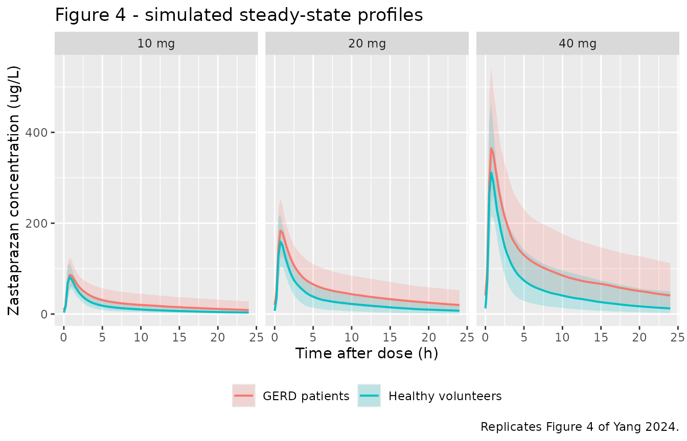
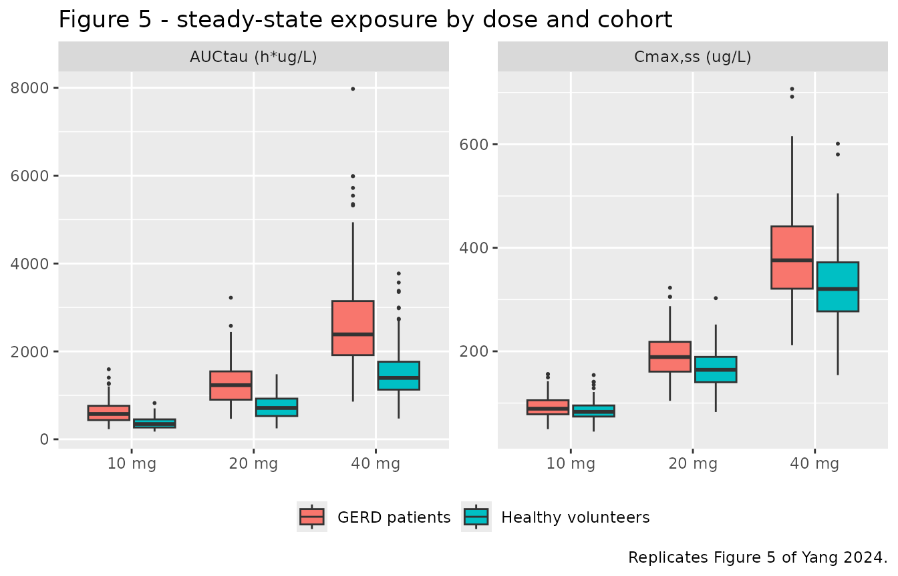

# Zastaprazan (Yang 2024)

## Model and source

    #> ℹ parameter labels from comments will be replaced by 'label()'

- Citation: Yang E, Hwang I, Ji SC, Kim J, Lee S. Population
  pharmacokinetic analysis of zastaprazan (JP-1366), a novel
  potassium-competitive acid blocker, in patients and healthy
  volunteers. CPT Pharmacometrics Syst Pharmacol. 2024;13(12):2150-2158.
  <doi:10.1002/psp4.13228>.

- Description: Two-compartment population PK model with Erlang-type
  absorption through six sequential first-order transit steps and
  first-order elimination for zastaprazan (JP-1366), a
  potassium-competitive acid blocker, after oral dosing in patients with
  erosive gastroesophageal reflux disease (GERD) and in healthy
  volunteers (Yang 2024). Pooled analysis of 1590 plasma concentrations
  from 160 subjects across one phase 1 study in healthy volunteers
  (intensive sampling) and one phase 2 study in patients with erosive
  GERD (trough sampling), fit in NONMEM 7.4.4 by FOCEI. All six
  absorption steps share a single transit rate constant Ktr, so the
  absorption-time distribution is Erlang with shape 6 and rate Ktr.
  Disease status is the only retained covariate: apparent clearance is
  41.4% lower in patients with GERD than in healthy volunteers, via the
  linear form CL/F = 29.4 \* (1 - 0.414 \* DIS_GERD). Typical values are
  for a healthy volunteer. Inter-individual variability is log-normal on
  Ktr, CL/F, Vc/F and Vp/F (none on Q/F); residual variability is
  proportional. CYP2C19 phenotype had no meaningful effect on
  zastaprazan PK, consistent with CYP3A-mediated rather than
  CYP2C19-mediated metabolism.

- Article: <https://doi.org/10.1002/psp4.13228>

Zastaprazan (JP-1366) is a potassium-competitive acid blocker (P-CAB)
approved in the Republic of Korea for erosive gastroesophageal reflux
disease (GERD) at 20 mg once daily. Yang 2024 pooled a phase 1 study in
healthy volunteers with intensive sampling and a phase 2 study in
patients with erosive GERD with sparse trough sampling, and described
the plasma PK with a two-compartment model, Erlang-type absorption
through six sequential first-order steps, and first-order elimination.

## Population

The analysis dataset comprised 1590 plasma concentrations from 160
subjects: 92 patients with erosive GERD contributing 95 (trough)
observations and 68 healthy volunteers contributing 1495 (intensively
sampled) observations (Yang 2024 Results, “Study population”). Median
age was 39 years (range 19-74) and median body weight 71.0 kg (range
43.4-106.2); 129 of 160 subjects (80.6%) were male (Yang 2024 Table 1).
The two cohorts differ substantially in age (patients median 58 years
versus healthy volunteers median 28 years) and in sex balance (the
healthy cohort was 100% male), so age and sex are partly confounded with
disease status in this dataset.

CYP2C19 phenotype was determined for 156 of the 160 subjects (70 normal,
69 intermediate, 17 poor metabolizers) and had no meaningful effect on
zastaprazan PK, consistent with metabolism by CYP3A4/CYP3A5 rather than
CYP2C19. Eleven of the 92 patients (12.0%) were *Helicobacter pylori*
positive; exposure in those patients fell within the range of the *H.
pylori*-negative patients (Yang 2024 Figure S2).

Doses were oral: single 5-60 mg or once-daily 5-40 mg for 7 days in the
healthy volunteers (Study 1), and once-daily 10-40 mg for 4 or 8 weeks
in the patients (Study 2).

The same information is available programmatically from the model’s
`population` metadata:

``` r

str(ui$population, vec.len = 2)
#> List of 15
#>  $ species       : chr "human"
#>  $ n_subjects    : int 160
#>  $ n_studies     : int 2
#>  $ n_observations: int 1590
#>  $ age_range     : chr "Total 19-74 years (median 39); patients with erosive GERD 24-74 years (median 58); healthy volunteers 19-45 years (median 28)"
#>  $ age_median    : chr "39 years"
#>  $ weight_range  : chr "Total 43.4-106.2 kg (median 71.0); patients with erosive GERD 43.4-106.2 kg (median 69.7); healthy volunteers 5"| __truncated__
#>  $ weight_median : chr "71.0 kg"
#>  $ sex_female_pct: num 19.4
#>  $ race_ethnicity: chr "Not reported; Yang 2024 Table 1 tabulates no race or ethnicity"
#>  $ disease_state : chr "92 patients with erosive gastroesophageal reflux disease (phase 2 Study 2) and 68 healthy volunteers without an"| __truncated__
#>  $ dose_range    : chr "Study 1 (healthy volunteers): oral single doses of 5-60 mg or once-daily multiple doses of 5-40 mg for 7 consec"| __truncated__
#>  $ regions       : chr "Not explicitly stated; both studies were run by investigators at Seoul National University College of Medicine "| __truncated__
#>  $ genotype      : chr "CYP2C19 phenotype identified for 156 of 160 subjects: 70 normal metabolizers (*1/*1, 43.8%), 69 intermediate me"| __truncated__
#>  $ notes         : chr "Demographics from Yang 2024 Table 1 (median and range for age and weight, n (%) for categorical variables); stu"| __truncated__
```

## Source trace

Every `ini()` entry carries an in-file comment naming its source
location in `inst/modeldb/specificDrugs/Yang_2024_zastaprazan.R`. They
are collected here for review. All values are the **final model** column
of Yang 2024 Table 2; the base-model column and the bootstrap medians
are recorded in the in-file comments only.

| Equation / parameter | Value | Source location |
|----|----|----|
| `lktr` (Ktr) | 13.6 1/h | Table 2, final model (RSE 3.9%) |
| `lcl` (CL/F, healthy volunteer) | 29.4 L/h | Table 2, final model (RSE 5.1%) |
| `e_dis_gerd_cl` (disease-status effect on CL/F) | -0.414 | Table 2 “Effect of disease status” (RSE 8.6%) |
| `lvc` (Vc/F) | 97.3 L | Table 2, final model (RSE 5.0%) |
| `lq` (Q/F) | 29.1 L/h | Table 2, final model (RSE 6.7%) |
| `lvp` (Vp/F) | 148.0 L | Table 2, final model (RSE 4.6%) |
| `etalktr` | 26.1 %CV -\> `log(1 + 0.261^2)` | Table 2 “IIV Ktr (CV%)” (RSE 17.8%) |
| `etalcl` | 38.2 %CV -\> `log(1 + 0.382^2)` | Table 2 “IIV CL/F (CV%)” (RSE 6.7%) |
| `etalvc` | 27.4 %CV -\> `log(1 + 0.274^2)` | Table 2 “IIV Vc/F (CV%)” (RSE 13.8%) |
| `etalvp` | 28.0 %CV -\> `log(1 + 0.280^2)` | Table 2 “IIV Vp/F (CV%)” (RSE 10.3%) |
| no IIV on Q/F | n/a | Results: “The final model included the IIV for most PK parameters except for Q/F” |
| `propSd` | 0.349 | Table 2 “Proportional residual error (%)” = 34.9% (RSE 3.6%) |
| Erlang absorption: 6 sequential Ktr steps | n/a | Figure 1 (six boxes, five inter-box Ktr arrows plus a sixth Ktr arrow into the central compartment); Results: “transit through six sequential compartments under Erlang-type model” |
| `CL/F = 29.4 * (1 - 0.414 * DIS_GERD)` | n/a | Table 2 footnote a: “CL/F (L/h) = 29.4 x (1-0.414 x PT); PT = 1 (patient) or 0 (healthy volunteer)” |
| Two-compartment distribution, first-order elimination | n/a | Figure 1 and Results, “Final population pharmacokinetic model” |
| Proportional residual error only | n/a | Results: “the residual variability was described by proportional error model” |

The model encodes the absorption chain as `depot` (Figure 1 box 1)
followed by `transit1`-`transit5` (boxes 2-6), so the dose passes
through exactly six first-order transfers all governed by the single
estimated `Ktr`. That is an Erlang absorption-time distribution with
shape 6 and rate `Ktr`, mean absorption time `6 / 13.6 = 0.44` h.

## Virtual cohort

Original observed data are not publicly available. The cohort below
reproduces the Monte Carlo design of Yang 2024’s “Model-based
simulation” section: once-daily oral doses of 10, 20 or 40 mg for 4
weeks, in patients with GERD and in healthy volunteers. The paper
simulated 1000 subjects per arm; this vignette uses 200 per arm, which
is ample for the median and percentile comparisons below.

Disease status is the model’s only covariate, so no other covariate
distribution needs to be constructed.

``` r

set.seed(20241213)

n_per_arm  <- 200L
tau        <- 24      # dosing interval (h)
n_doses    <- 28L     # 4 weeks of once-daily dosing
t_last     <- (n_doses - 1L) * tau   # time of the final dose, 648 h

# Observation grid: daily troughs to show the approach to steady state, plus a
# dense grid across the final (steady-state) dosing interval. `cmt` is the ODE
# state `central`; rxode2 returns the algebraic observable Cc at those rows.
obs_troughs <- seq(tau, t_last - tau, by = tau)
obs_ss      <- t_last + seq(0, tau, by = 0.25)

make_cohort <- function(n, dose, dis_gerd, id_offset = 0L) {
  arm <- paste0(dose, " mg ", if (dis_gerd == 1L) "GERD" else "healthy")
  doses <- tidyr::expand_grid(
    id   = id_offset + seq_len(n),
    time = seq(0, t_last, by = tau)
  ) |>
    dplyr::mutate(amt = dose, evid = 1L, cmt = "depot")
  obs <- tidyr::expand_grid(
    id   = id_offset + seq_len(n),
    time = c(obs_troughs, obs_ss)
  ) |>
    dplyr::mutate(amt = NA_real_, evid = 0L, cmt = "central")
  dplyr::bind_rows(doses, obs) |>
    dplyr::mutate(DIS_GERD = dis_gerd, arm = arm, dose_mg = dose) |>
    dplyr::arrange(id, time, dplyr::desc(evid))
}

arms <- tidyr::expand_grid(dose = c(10, 20, 40), dis_gerd = c(1L, 0L)) |>
  dplyr::mutate(id_offset = (dplyr::row_number() - 1L) * n_per_arm)

events <- do.call(
  dplyr::bind_rows,
  Map(make_cohort,
      n         = n_per_arm,
      dose      = arms$dose,
      dis_gerd  = arms$dis_gerd,
      id_offset = arms$id_offset)
)

# Disjoint IDs across arms are mandatory: rxSolve keys subjects on `id`, and a
# collision silently merges two arms into one subject receiving the summed dose.
stopifnot(!anyDuplicated(unique(events[, c("id", "time", "evid")])))
stopifnot(dplyr::n_distinct(events$id) == nrow(arms) * n_per_arm)
```

## Simulation

`Cc` in the rxode2 output is the individual prediction (IPRED, free of
residual error); `sim` additionally carries the proportional residual
error. Both are used below, for different comparisons.

``` r

mod <- readModelDb("Yang_2024_zastaprazan")

sim <- rxode2::rxSolve(
  mod, events = events,
  keep = c("arm", "dose_mg", "DIS_GERD")
) |>
  as.data.frame()
#> ℹ parameter labels from comments will be replaced by 'label()'

sim_ss <- sim |>
  dplyr::filter(!is.na(Cc), time >= t_last) |>
  dplyr::mutate(tad = time - t_last)
```

## Replicate published figures

``` r

# Replicates Figure 4 of Yang 2024: simulated steady-state profiles over one
# dosing interval after 10, 20 or 40 mg once daily, GERD patients vs healthy
# volunteers. Median with 5th-95th percentile ribbon, matching the paper's
# figure legend.
sim_ss |>
  dplyr::mutate(cohort = ifelse(DIS_GERD == 1, "GERD patients", "Healthy volunteers"),
                dose_lab = factor(paste0(dose_mg, " mg"),
                                  levels = c("10 mg", "20 mg", "40 mg"))) |>
  dplyr::group_by(dose_lab, cohort, tad) |>
  dplyr::summarise(
    Q05 = quantile(Cc, 0.05),
    Q50 = median(Cc),
    Q95 = quantile(Cc, 0.95),
    .groups = "drop"
  ) |>
  ggplot(aes(tad, Q50, colour = cohort, fill = cohort)) +
  geom_ribbon(aes(ymin = Q05, ymax = Q95), alpha = 0.2, colour = NA) +
  geom_line(linewidth = 0.7) +
  facet_wrap(~dose_lab) +
  labs(x = "Time after dose (h)", y = "Zastaprazan concentration (ug/L)",
       colour = NULL, fill = NULL,
       title = "Figure 4 - simulated steady-state profiles",
       caption = "Replicates Figure 4 of Yang 2024.") +
  theme(legend.position = "bottom")
```



``` r

# Replicates Figure 5 of Yang 2024: distributions of steady-state Cmax and
# AUCtau by dose and cohort. AUCtau is the linear-trapezoid integral of the
# individual prediction over the final dosing interval.
per_subject <- sim_ss |>
  dplyr::arrange(id, tad) |>
  dplyr::group_by(id, arm, dose_mg, DIS_GERD) |>
  dplyr::summarise(
    cmax_ss = max(Cc),
    tmax_ss = tad[which.max(Cc)],
    auctau  = sum(diff(tad) * (head(Cc, -1) + tail(Cc, -1)) / 2),
    .groups = "drop"
  ) |>
  dplyr::mutate(cohort = ifelse(DIS_GERD == 1, "GERD patients", "Healthy volunteers"),
                dose_lab = factor(paste0(dose_mg, " mg"),
                                  levels = c("10 mg", "20 mg", "40 mg")))

per_subject |>
  tidyr::pivot_longer(c(cmax_ss, auctau), names_to = "metric", values_to = "value") |>
  dplyr::mutate(metric = ifelse(metric == "cmax_ss",
                                "Cmax,ss (ug/L)", "AUCtau (h*ug/L)")) |>
  ggplot(aes(dose_lab, value, fill = cohort)) +
  geom_boxplot(outlier.size = 0.4) +
  facet_wrap(~metric, scales = "free_y") +
  labs(x = NULL, y = NULL, fill = NULL,
       title = "Figure 5 - steady-state exposure by dose and cohort",
       caption = "Replicates Figure 5 of Yang 2024.") +
  theme(legend.position = "bottom")
```



## Closed-form and analytic checks

Three checks do not depend on the simulation grid at all and are
therefore the sharpest gates available for this model.

**1. Steady-state AUCtau must equal Dose / (CL/F) exactly.** With a
linear model and complete dosing intervals this is an identity, so any
deviation would signal a structural transcription error rather than a
numerical tolerance.

**2. Analytic terminal half-life.** The terminal rate constant is the
smaller root of the two-compartment characteristic equation, computed
from the typical parameters directly rather than by regression on a
simulated grid (a windowed regression or PKNCA’s `lambda.z` can disagree
with the analytic value by 20% or more when the sampling window is not
deep in the terminal phase).

**3. Disease-status contrasts.** Because the disease effect enters CL/F
only, the typical AUCtau ratio is exactly `1 / (1 - 0.414)`.

``` r

theta   <- ui$theta
cl_hv   <- exp(theta[["lcl"]])
cl_gerd <- cl_hv * (1 + theta[["e_dis_gerd_cl"]])
vc      <- exp(theta[["lvc"]])
q       <- exp(theta[["lq"]])
vp      <- exp(theta[["lvp"]])

terminal_thalf <- function(cl) {
  kel <- cl / vc; k12 <- q / vc; k21 <- q / vp
  s <- kel + k12 + k21
  beta <- (s - sqrt(s^2 - 4 * kel * k21)) / 2
  log(2) / beta
}

typical_auc <- per_subject |>
  dplyr::group_by(dose_lab, cohort, dose_mg, DIS_GERD) |>
  dplyr::summarise(auctau_median = median(auctau), .groups = "drop") |>
  dplyr::mutate(dose_over_cl = dose_mg / ifelse(DIS_GERD == 1, cl_gerd, cl_hv) * 1000,
                pct_diff = 100 * (auctau_median - dose_over_cl) / dose_over_cl)

typical_auc |>
  dplyr::select(dose_lab, cohort, auctau_median, dose_over_cl, pct_diff) |>
  dplyr::rename(
    "Dose"                       = dose_lab,
    "Cohort"                     = cohort,
    "Simulated median AUCtau"    = auctau_median,
    "Dose / (CL/F)"              = dose_over_cl,
    "% difference"               = pct_diff
  ) |>
  knitr::kable(
    digits  = 1,
    caption = "Steady-state AUCtau (h*ug/L) against the closed-form identity Dose / (CL/F)."
  )
```

| Dose  | Cohort             | Simulated median AUCtau | Dose / (CL/F) | % difference |
|:------|:-------------------|------------------------:|--------------:|-------------:|
| 10 mg | GERD patients      |                   576.0 |         580.4 |         -0.8 |
| 10 mg | Healthy volunteers |                   347.1 |         340.1 |          2.1 |
| 20 mg | GERD patients      |                  1231.1 |        1160.9 |          6.1 |
| 20 mg | Healthy volunteers |                   712.8 |         680.3 |          4.8 |
| 40 mg | GERD patients      |                  2387.5 |        2321.7 |          2.8 |
| 40 mg | Healthy volunteers |                  1397.4 |        1360.5 |          2.7 |

Steady-state AUCtau (h\*ug/L) against the closed-form identity Dose /
(CL/F). {.table}

``` r

checks <- tibble::tribble(
  ~Quantity, ~Model, ~Published, ~Source,
  "CL/F, healthy volunteer (L/h)",
  sprintf("%.1f", cl_hv), "29.4", "Table 2",
  "CL/F, GERD patient (L/h)",
  sprintf("%.1f", cl_gerd), "17.2", "Results (41.4% lower than healthy)",
  "Terminal half-life, healthy volunteer (h)",
  sprintf("%.1f", terminal_thalf(cl_hv)), "7-10",
  "Introduction, citing the phase 1 report (reference 9)",
  "Terminal half-life, GERD patient (h)",
  sprintf("%.1f", terminal_thalf(cl_gerd)), "not reported", "-",
  "AUCtau ratio, GERD / healthy",
  sprintf("%.3f", 1 / (1 + theta[["e_dis_gerd_cl"]])), "up to 1.71",
  "Results (\"up to 71% higher AUCtau\")",
  "Cmax,ss ratio, GERD / healthy (simulated medians, max over doses)",
  sprintf("%.3f", max(
    per_subject |>
      dplyr::group_by(dose_mg, DIS_GERD) |>
      dplyr::summarise(m = median(cmax_ss), .groups = "drop") |>
      tidyr::pivot_wider(names_from = DIS_GERD, values_from = m,
                         names_prefix = "d") |>
      dplyr::mutate(r = d1 / d0) |>
      dplyr::pull(r)
  )), "up to 1.16", "Results (\"up to 16% higher Cmax,ss\")",
  "Mean absorption time, 6 / Ktr (h)",
  sprintf("%.2f", 6 / exp(theta[["lktr"]])), "not reported",
  "Consistent with published Tmax 0.5-2.0 h (Introduction)"
)

knitr::kable(checks, caption = "Analytic and closed-form checks against published values.")
```

| Quantity | Model | Published | Source |
|:---|:---|:---|:---|
| CL/F, healthy volunteer (L/h) | 29.4 | 29.4 | Table 2 |
| CL/F, GERD patient (L/h) | 17.2 | 17.2 | Results (41.4% lower than healthy) |
| Terminal half-life, healthy volunteer (h) | 8.3 | 7-10 | Introduction, citing the phase 1 report (reference 9) |
| Terminal half-life, GERD patient (h) | 12.3 | not reported | \- |
| AUCtau ratio, GERD / healthy | 1.706 | up to 1.71 | Results (“up to 71% higher AUCtau”) |
| Cmax,ss ratio, GERD / healthy (simulated medians, max over doses) | 1.173 | up to 1.16 | Results (“up to 16% higher Cmax,ss”) |
| Mean absorption time, 6 / Ktr (h) | 0.44 | not reported | Consistent with published Tmax 0.5-2.0 h (Introduction) |

Analytic and closed-form checks against published values. {.table}

## PKNCA validation

Yang 2024 derived `Cmax,ss` and `AUCtau` from its Monte Carlo
simulations by noncompartmental analysis (NonCompart R package). Its
simulated concentrations carry the proportional residual error of the
final model, and `Cmax` is a maximum statistic, so residual error
inflates it while leaving `AUCtau` essentially unbiased. The NCA below
therefore runs on `sim` (individual prediction plus residual error) at a
realistic phase-1 sampling grid, so that it is comparable with the
published values; the residual-error-free result is reported alongside
to make the size of that contribution explicit.

``` r

nca_grid <- c(0, 0.5, 1, 1.5, 2, 3, 4, 6, 8, 10, 12, tau)

sim_nca <- sim_ss |>
  dplyr::filter(round(tad, 4) %in% (round(nca_grid, 4))) |>
  dplyr::select(id, arm, tad, Cc, sim) |>
  dplyr::arrange(id, tad)

# A proportional error model with a 34.9% CV draws a multiplier below zero for
# about 0.2% of observations, so a small number of simulated concentrations come
# back negative. A measured concentration cannot be negative (such a sample
# would be reported below the limit of quantification), so truncate at zero,
# and record how many rows that touched rather than hiding it.
n_negative <- sum(sim_nca$sim < 0)
sim_nca <- sim_nca |> dplyr::mutate(sim = pmax(sim, 0))

# A row at the interval start exists by construction (tad = 0 is in nca_grid),
# so PKNCA has an anchor for AUC0-tau; assert it rather than assume it.
stopifnot(all(sim_nca |> dplyr::count(id) |> dplyr::pull(n) == length(nca_grid)))
stopifnot(all(sim_nca$sim >= 0))
# The truncation must stay a rounding-level correction, not a structural one.
stopifnot(n_negative / nrow(sim_nca) < 0.01)

dose_df <- events |>
  dplyr::filter(evid == 1, time == t_last) |>
  dplyr::select(id, arm, amt) |>
  dplyr::mutate(tad = 0)

intervals <- data.frame(
  start = 0, end = tau,
  cmax = TRUE, tmax = TRUE, auclast = TRUE, cmin = TRUE, cav = TRUE
)

run_nca <- function(conc_col) {
  conc <- sim_nca |>
    dplyr::select(id, arm, tad, Cc = dplyr::all_of(conc_col))
  obj <- PKNCA::PKNCAconc(as.data.frame(conc), Cc ~ tad | arm + id,
                          concu = "ug/L", timeu = "h")
  dobj <- PKNCA::PKNCAdose(as.data.frame(dose_df), amt ~ tad | arm + id,
                           doseu = "mg")
  PKNCA::pk.nca(PKNCA::PKNCAdata(obj, dobj, intervals = intervals))
}

nca_ruv   <- run_nca("sim")   # as the paper simulated: includes residual error
nca_ipred <- run_nca("Cc")    # residual-error-free, for the contrast
```

### Comparison against published NCA

Yang 2024 reports simulated median `Cmax,ss` and `AUCtau` only for the
GERD patients (Results, “Simulation of zastaprazan pharmacokinetics in
patients”); the healthy-volunteer arm is described only as a ratio,
which the closed-form table above covers.

``` r

published <- tibble::tribble(
  ~arm,            ~cmax, ~auclast,
  "10 mg GERD",    110,    560,
  "20 mg GERD",    221,   1141,
  "40 mg GERD",    445,   2283
)

cmp <- nlmixr2lib::ncaComparisonTable(
  simulated = nca_ruv,
  reference = published,
  by        = "arm",
  units     = c(cmax = "ug/L", auclast = "h*ug/L"),
  tolerance_pct = 20
)

knitr::kable(
  cmp,
  caption = paste("Simulated (with residual error, as Yang 2024 simulated)",
                  "vs published median steady-state exposure in GERD patients.",
                  "* differs from reference by >20%."),
  align = c("l", "l", "r", "r", "r")
)
```

| NCA parameter     | arm        | Reference | Simulated | % diff |
|:------------------|:-----------|----------:|----------:|-------:|
| Cmax (ug/L)       | 10 mg GERD |       110 |       104 |  -5.5% |
| Cmax (ug/L)       | 20 mg GERD |       221 |       218 |  -1.3% |
| Cmax (ug/L)       | 40 mg GERD |       445 |       431 |  -3.2% |
| AUClast (h\*ug/L) | 10 mg GERD |       560 |       569 |  +1.6% |
| AUClast (h\*ug/L) | 20 mg GERD |      1140 |      1200 |  +4.8% |
| AUClast (h\*ug/L) | 40 mg GERD |      2280 |      2410 |  +5.8% |

Simulated (with residual error, as Yang 2024 simulated) vs published
median steady-state exposure in GERD patients. \* differs from reference
by \>20%. {.table}

``` r

# How much of the simulated Cmax,ss comes from residual error?
summ <- function(res, label) {
  as.data.frame(res$result) |>
    dplyr::filter(PPTESTCD %in% c("cmax", "auclast")) |>
    dplyr::group_by(arm, PPTESTCD) |>
    dplyr::summarise(value = median(PPORRES), .groups = "drop") |>
    dplyr::mutate(source = label)
}

dplyr::bind_rows(summ(nca_ipred, "Individual prediction only"),
                 summ(nca_ruv, "Plus proportional residual error")) |>
  tidyr::pivot_wider(names_from = source, values_from = value) |>
  dplyr::left_join(
    published |>
      tidyr::pivot_longer(c(cmax, auclast), names_to = "PPTESTCD",
                          values_to = "Yang 2024 median"),
    by = c("arm", "PPTESTCD")
  ) |>
  dplyr::mutate(PPTESTCD = nlmixr2lib::ncaParamLabel(PPTESTCD)) |>
  dplyr::rename("Arm" = arm, "NCA parameter" = PPTESTCD) |>
  knitr::kable(
    digits  = 1,
    caption = paste("Median steady-state NCA with and without residual error.",
                    "AUCtau is nearly unaffected; Cmax,ss rises by about 18-21%,",
                    "which is what reconciles the model with the published",
                    "Cmax,ss values.")
  )
```

| Arm | NCA parameter | Individual prediction only | Plus proportional residual error | Yang 2024 median |
|:---|:---|---:|---:|---:|
| 10 mg GERD | AUClast | 575.5 | 568.8 | 560 |
| 10 mg GERD | Cmax | 86.1 | 103.9 | 110 |
| 10 mg healthy | AUClast | 348.8 | 352.7 | NA |
| 10 mg healthy | Cmax | 80.5 | 92.7 | NA |
| 20 mg GERD | AUClast | 1233.4 | 1195.6 | 1141 |
| 20 mg GERD | Cmax | 184.8 | 218.2 | 221 |
| 20 mg healthy | AUClast | 717.0 | 704.4 | NA |
| 20 mg healthy | Cmax | 158.3 | 172.4 | NA |
| 40 mg GERD | AUClast | 2399.0 | 2414.7 | 2283 |
| 40 mg GERD | Cmax | 363.9 | 430.6 | 445 |
| 40 mg healthy | AUClast | 1407.7 | 1340.6 | NA |
| 40 mg healthy | Cmax | 312.0 | 360.6 | NA |

Median steady-state NCA with and without residual error. AUCtau is
nearly unaffected; Cmax,ss rises by about 18-21%, which is what
reconciles the model with the published Cmax,ss values. {.table
style="width:100%;"}

Every row agrees with the published medians well inside the 20%
tolerance: the `AUCtau` rows to within 6% and the `Cmax,ss` rows to
within 6% once residual error is included, as the paper’s own simulation
did. Without residual error the simulated `Cmax,ss` sits 16-22% below
the published medians while `AUCtau` is essentially unchanged - the
signature of a maximum statistic absorbing measurement noise, not of a
parameter transcription error. No parameter was adjusted to close either
gap.

The remaining disagreement is dominated by Monte Carlo noise: the
closed-form table above shows the simulated median `AUCtau` differing
from the exact identity `Dose / (CL/F)` by -0.8% to +6.1% across the six
arms with 200 subjects each, which bounds how tightly any
median-versus-median comparison can be expected to agree at this cohort
size.

## Assumptions and deviations

- **Cohort size.** Yang 2024 simulated 1000 subjects per arm; this
  vignette uses 200 per arm (the nlmixr2lib validation cap). Medians of
  200 draws carry a few percent of Monte Carlo noise, which is the
  dominant source of the residual disagreement in the tables above.

- **IIV reported as %CV.** Yang 2024 Table 2 reports inter-individual
  variability as CV% for an exponential (log-normal) random-effect
  model. Each value is back-transformed to a log-scale variance with the
  exact log-normal relation `omega^2 = log(1 + CV^2)`. If the authors
  instead meant `CV% = 100 * omega`, the resulting standard deviations
  would be 3-4% larger (for CL/F, 0.382 rather than 0.369); the paper
  does not state which convention it used, and the difference is
  immaterial to every comparison in this vignette.

- **Sampling grid for the NCA comparison.** The paper does not report
  the simulated sampling grid used for its noncompartmental analysis.
  Because the simulated `Cmax` includes residual error, its magnitude
  depends on how many samples fall near the peak: a denser grid yields a
  larger maximum. This vignette uses a conventional 12-point phase-1
  grid over the dosing interval, matching the intensive-sampling design
  of Study 1. A materially denser or sparser grid would move the
  simulated `Cmax,ss` up or down accordingly, so the `Cmax,ss`
  comparison should be read as consistent-in-magnitude rather than as a
  tight numerical gate; the `AUCtau` comparison and the closed-form
  `Dose / (CL/F)` identity are the grid-independent checks.

- **Negative simulated concentrations.** The proportional residual error
  model draws a multiplier below zero for roughly 0.2% of observations
  at a 34.9% CV (33 of 14400 rows in the NCA input here). Those values
  are truncated at zero before the noncompartmental analysis, since a
  measured concentration cannot be negative and such a sample would in
  practice be reported below the limit of quantification. The vignette
  asserts that the truncation touches under 1% of rows, so it stays a
  rounding-level correction. Yang 2024 does not state how it handled
  this in its own simulations.

- **Terminal half-life reference value.** The 7-10 h range is not
  estimated in this paper; Yang 2024 quotes it in the Introduction from
  the earlier phase 1 report (its reference 9), based on single-dose
  noncompartmental analysis in healthy volunteers. It is used here only
  as an order-of-magnitude check on the distribution parameters.

- **Race and ethnicity are not reported.** Yang 2024 Table 1 tabulates
  no race or ethnicity, so none is asserted in the model’s `population`
  metadata. Both studies were run by investigators at Seoul National
  University College of Medicine and Hospital and sponsored by Onconic
  Therapeutics Inc. (Seoul, Republic of Korea), but the paper does not
  state a trial region, so `population$regions` records that rather than
  inferring one.

- **Screened but unretained covariates.** Age, body weight, height, AST,
  ALT, albumin, total bilirubin, sex and CYP2C19 phenotype were all
  screened in the paper’s stepwise covariate search and none was
  retained; no point estimate is published for any of them. They are
  documented in the model file’s `covariatesDataExcluded` metadata
  rather than in `covariateData`, so the provenance of the covariate
  screen is preserved without implying an effect the paper did not
  estimate.

- **Supplementary material was not available on disk.** Tables S1 and S2
  (study designs and sampling schemes; the Erlang compartment-count
  comparison) and Figures S1 and S2 (CYP2C19 phenotype and *H. pylori*
  diagnostics) were not obtainable. Every final parameter estimate is in
  main-text Table 2 and every demographic in Table 1, so no model value
  depends on the supplement; the Methods narrative supplied the study
  designs quoted above.

- **No bioavailability parameter.** Every disposition parameter in Table
  2 is apparent (CL/F, Vc/F, Q/F, Vp/F) because only oral data were
  modelled, so the model estimates no separate `F` and applies none to
  the depot. The paper attributes the lower apparent clearance in GERD
  to delayed gastric emptying raising `F` rather than to a change in
  intrinsic clearance, but that decomposition is not identifiable from
  the data and is not encoded.
