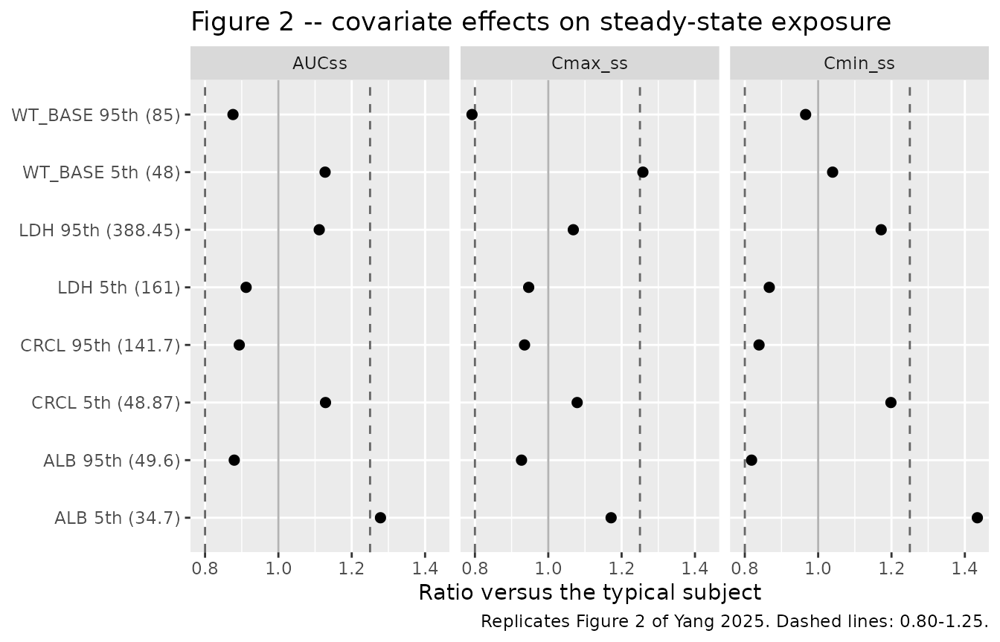
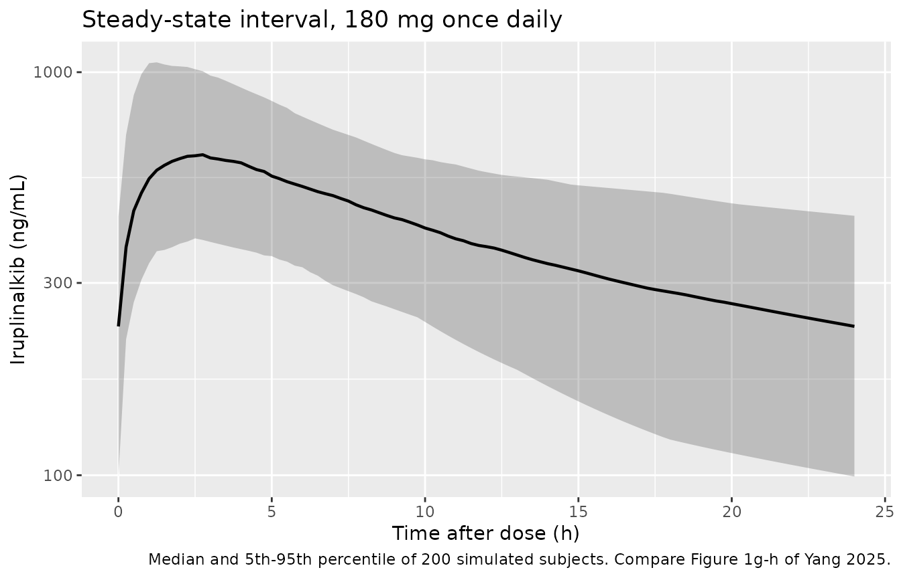

# Iruplinalkib (Yang 2025)

## Model and source

- Citation: Yang G, Wang Y, Zhao H, Jiang Z, Zheng S, Ge M, Si M,
  Kang X. Population pharmacokinetics of iruplinalkib in healthy
  volunteers and patients with solid tumors. Clin Transl Sci.
  2025;18(1):e70099. <doi:10.1111/cts.70099>
- Description: Two-compartment population PK model with first-order
  absorption and first-order elimination for oral iruplinalkib (WX-0593,
  a selective ALK/ROS1 tyrosine kinase inhibitor approved in China for
  ALK-positive non-small-cell lung cancer), pooled over four Chinese
  trials in 392 subjects: 16 healthy volunteers and 376 patients with
  solid tumors. Apparent oral clearance carries power effects of
  baseline body weight, time-varying serum albumin, time-varying
  creatinine clearance and time-varying lactate dehydrogenase; the
  apparent central volume carries a power effect of baseline body
  weight. Food slows absorption without changing exposure: dosing in the
  fed state multiplies the absorption rate constant by 0.588 and adds a
  0.472 h absorption lag. Residual error is proportional, with a
  separate magnitude for the healthy-volunteer food-effect study
  WX-0593-002 (55.7%) and for the three solid-tumor studies WX-0593-001,
  -003 and -004 (35.7%).
- Article: <https://doi.org/10.1111/cts.70099>
- Supplement (Tables S1-S2, Figures S1-S3):
  <https://www.ebi.ac.uk/europepmc/webservices/rest/PMC11671680/supplementaryFiles>

Iruplinalkib (WX-0593) is a selective oral ALK/ROS1 tyrosine kinase
inhibitor approved in China for ALK-positive non-small-cell lung cancer.
Yang 2025 is the first population PK analysis of the drug, pooling four
Chinese trials.

## Population

The analysis pooled 3788 plasma concentrations from 392 Chinese subjects
across four trials (Yang 2025 Table 1 and Table S1): 376 patients with
ALK/ROS1-positive advanced solid tumors – from the phase 1
dose-escalation/expansion trial WX-0593-001 (n = 54, 30-300 mg), the
single-arm phase 2 trial WX-0593-003 (n = 202, 180 mg once daily after a
7-day 60 mg lead-in) and the randomised phase 3 trial WX-0593-004 (n =
120, same regimen) – plus 16 healthy volunteers in the two-period
food-effect crossover WX-0593-002 (a single 120 mg dose fasted then fed,
or the reverse, with a 7-day washout).

Median age was 52.0 years (range 25.0-76.0; 14.5% were 65 or older),
52.0% were female, median baseline body weight was 63.0 kg (range
35.0-98.9) and 95.7% were Han Chinese. Median baseline albumin was 40.9
g/L, creatinine clearance 97.9 mL/min and lactate dehydrogenase 219 U/L.
Only normal and mild-to-moderate renal or hepatic impairment were
meaningfully represented; the paper states explicitly that the effect of
moderate or severe impairment remains to be defined.

The same information is available programmatically via
`readModelDb("Yang_2025_iruplinalkib")()$population`.

## Source trace

Every `ini()` entry in
`inst/modeldb/specificDrugs/Yang_2025_iruplinalkib.R` carries an in-file
comment naming its source location. They are collected here for review.
Yang 2025 prints its final model as seven display equations (Eqs. 1-6,
with Eq. 2 split across two typeset lines) immediately after the Results
paragraph “The final model included the following covariate
relationships”. Those equations are rendered as images in the
publisher’s PDF and are dropped by text extractors; they were recovered
with `pdftotext -layout`.

| Equation / parameter | Value | Source location |
|----|----|----|
| `lka` (Ka, fasted) | 1.06 /h | Table 2 final model; Eq. 1 |
| `lcl` (CL/F) | 18.9 L/h | Table 2 final model; Eq. 2 |
| `lvc` (V1/F) | 348 L | Table 2 final model; Eq. 3 |
| `lvp` (V2/F) | 295 L | Table 2 final model; Eq. 4 |
| `lq` (Q/F) | 15.5 L/h | Table 2 final model; Eq. 5 |
| `ltlag` (ALAG, fed only) | 0.472 h | Table 2 “ALAG for fed subjects”; Eq. 6 |
| `e_fed_ka` | 0.588 | Table 2 “Food on Ka”; Eq. 1 |
| `e_wt_base_cl` | 0.441 | Table 2; Eq. 2 `(BBWT/63)^0.441` |
| `e_ldh_cl` | -0.225 | Table 2; Eq. 2 `(LDH/242.63)^-0.225` |
| `e_crcl_cl` | 0.22 | Table 2; Eq. 2 `(CRCL/84.79)^0.22` |
| `e_alb_cl` | 1.05 | Table 2; Eq. 2 `(ALB/43.89)^1.05` |
| `e_wt_base_vc` | 1.36 | Table 2; Eq. 3 `(BBWT/63)^1.36` |
| `etalka` | 74.8% CV | Table 2 IIV; `log(1 + 0.748^2)` = 0.444368 |
| `etalcl` | 24.8% CV | Table 2 IIV; `log(1 + 0.248^2)` = 0.059687 |
| `etalvc` | 53.4% CV | Table 2 IIV; `log(1 + 0.534^2)` = 0.250880 |
| `propSdPatient` | 35.7% | Table 2, studies WX-0593-001, -003, -004 |
| `propSdHv` | 55.7% | Table 2, study WX-0593-002 |
| Reference covariate values | 63 kg, 43.89 g/L, 84.79 mL/min, 242.63 U/L | Results, “Typical subjects in this PopPK analysis had …”; Eqs. 2-3 denominators |
| Two-compartment structure, first-order absorption and elimination | n/a | Results “PopPK analysis”; Eqs. 2-5 |

Note that the four reference (centring) constants are the paper’s own
**typical-subject** values from the Results, and three of the four are
*not* the Table 1 baseline medians (albumin 43.89 vs 40.9 g/L,
creatinine clearance 84.79 vs 97.9 mL/min, LDH 242.63 vs 219 U/L). That
is consistent with those three covariates entering as time-varying: the
reference belongs to the longitudinal record, not to the baseline
snapshot. Only body weight, which the paper enters as a *baseline*
covariate (`BBWT`), has a reference equal to its Table 1 median of 63
kg.

## Virtual cohort

Original observed data are not publicly available. The deterministic
checks below use the paper’s own typical subject; the stochastic cohort
uses covariate distributions built from the paper’s own stated
percentiles (see Assumptions).

``` r

# The paper's typical subject (Yang 2025 Results, "Covariate effects on
# iruplinalkib steady-state exposure") -- these are also the denominators of
# Eqs. 2 and 3.
REF <- list(WT_BASE = 63, ALB = 43.89, CRCL = 84.79, LDH = 242.63)

mod     <- readModelDb("Yang_2025_iruplinalkib")
mod_typ <- rxode2::zeroRe(mod)
#> ℹ parameter labels from comments will be replaced by 'label()'
#> Warning: No sigma parameters in the model

# Build one arm as a self-contained event table. `id_offset` keeps IDs disjoint
# so arms can be bind_rows()-ed; rxSolve treats id as the subject key and
# silently merges duplicates.
make_arm <- function(treatment, dose, ndose, ii, tmax,
                     fed = 0L, cov = REF, id_offset = 0L, n = 1L,
                     subj = NULL, obs_times = NULL) {
  if (is.null(subj)) {
    subj <- data.frame(id = id_offset + seq_len(n))
    for (nm in names(cov)) subj[[nm]] <- cov[[nm]]
  }
  subj$FED <- fed
  subj$STUDY_WX0593_002 <- 0L
  subj$treatment <- treatment
  if (is.null(obs_times)) obs_times <- seq(0, tmax, by = 0.25)
  dosing <- merge(subj, data.frame(
    time = seq_len(ndose) * ii - ii, amt = dose, evid = 1L, cmt = "depot"
  ))
  # Observations sit on the ODE state `central`, never on the algebraic
  # observable `Cc` -- naming an observable in `cmt` renumbers the
  # compartment slots.
  obs <- merge(subj, data.frame(
    time = sort(unique(c(obs_times, tmax))),
    amt = NA_real_, evid = 0L, cmt = "central"
  ))
  dplyr::arrange(dplyr::bind_rows(dosing, obs), id, time, dplyr::desc(evid))
}

# Absorption is resolved finely, the terminal phase coarsely: a uniform fine
# grid over 336 h costs an order of magnitude more rows for no extra accuracy.
grid_sd <- sort(unique(c(seq(0, 12, by = 0.05), seq(12, 48, by = 0.5),
                         seq(48, 336, by = 4))))
# The steady-state arms are only ever summarised over the 14th interval.
grid_ss <- seq(312, 336, by = 0.25)

solve_typ <- function(ev) {
  as.data.frame(rxode2::rxSolve(mod_typ, events = ev,
                                keep = c("treatment", "FED")))
}

# Trapezoidal AUC helper for the closed-form identity checks (PKNCA does the
# validation NCA further down; this is only used for the exact identities).
trapz <- function(t, y) sum(diff(t) * (head(y, -1) + tail(y, -1)) / 2)
```

## Simulation

``` r

# Deterministic arms, typical subject, fasted unless stated.
arm_ss   <- make_arm("180 mg QD, steady state", 180, 14, 24, 336,
                     id_offset = 0L, obs_times = grid_ss)
arm_sd   <- make_arm("180 mg single dose", 180, 1, 24, 336,
                     id_offset = 100L, obs_times = grid_sd)
arm_fast <- make_arm("120 mg single dose, fasted", 120, 1, 24, 336,
                     fed = 0L, id_offset = 200L, obs_times = grid_sd)
arm_fed  <- make_arm("120 mg single dose, fed", 120, 1, 24, 336,
                     fed = 1L, id_offset = 300L, obs_times = grid_sd)

events_typ <- dplyr::bind_rows(arm_ss, arm_sd, arm_fast, arm_fed)
stopifnot(!anyDuplicated(unique(events_typ[, c("id", "time", "evid")])))

sim_typ <- solve_typ(events_typ)
#> ℹ omega/sigma items treated as zero: 'etalka', 'etalcl', 'etalvc'
#> Warning: multi-subject simulation without without 'omega'
```

### Structural identity: steady-state AUC recovers Dose / (CL/F)

At steady state under linear disposition the AUC over one dosing
interval is exactly `Dose / (CL/F)`, independent of every distribution
parameter. Both sides of this comparison use the same fixed parameters,
so the residual is pure numerical (trapezoidal + solver) error and a
tight bound is appropriate.

``` r

ss <- sim_typ |>
  dplyr::filter(treatment == "180 mg QD, steady state", time >= 312, time <= 336)

auc_tau  <- trapz(ss$time, ss$Cc)              # mg*h/L
auc_pred <- 180 / 18.9                         # Dose / (CL/F), Table 2

c(simulated = auc_tau, `Dose/(CL/F)` = auc_pred, ratio = auc_tau / auc_pred)
#>   simulated Dose/(CL/F)       ratio 
#>   9.5168564   9.5238095   0.9992699

# Deterministic identity -- the two sides share the same parameters, so this is
# solver/trapezoid error only. Realised 0.99927.
stopifnot(abs(auc_tau / auc_pred - 1) < 0.005)
```

### Structural identity: terminal half-life recovers the two-compartment closed form

``` r

lam <- local({
  CL <- 18.9; V1 <- 348; Q <- 15.5; V2 <- 295
  k10 <- CL / V1; k12 <- Q / V1; k21 <- Q / V2
  S <- k10 + k12 + k21
  (S - sqrt(S^2 - 4 * k10 * k21)) / 2
})
thalf_closed <- log(2) / lam

sd_prof <- sim_typ |>
  dplyr::filter(treatment == "180 mg single dose", time >= 168, time <= 336, Cc > 0)
thalf_sim <- log(2) / -stats::coef(stats::lm(log(Cc) ~ time, data = sd_prof))[["time"]]

c(closed_form = thalf_closed, simulated = thalf_sim)
#> closed_form   simulated 
#>    31.41423    31.41423

# Deterministic; realised agreement was better than 1e-4 relative.
stopifnot(abs(thalf_sim / thalf_closed - 1) < 0.01)
```

## Replicate published figures

### Figure 2 – covariate effects on steady-state exposure

Yang 2025 Figure 2 is a forest plot of the ratio of `Cmax,ss`, `Cmin,ss`
and `AUCss` at the 5th and 95th percentile of each significant
covariate, relative to the typical subject receiving 180 mg once daily.
The paper’s own summary of that figure is the sharpest available check
on the transcription, because it constrains all four exponents **and**
all four centring constants at once:

> the 90% CIs of `Cmax,ss`, `Cmin,ss`, and `AUCss` ratios of
> iruplinalkib in patients with baseline body weight from 48 to 85 kg,
> albumin from 34.7 to 49.6 g/L, CRCL from 48.87 to 141.7 mL/min or LDH
> from 161 to 388.45 U/L basically fell within the predefined
> bioequivalence boundary of 0.80-1.25. The effect of low albumin on
> exposure was more than 125%.

``` r

# Replicates Figure 2 of Yang 2025: exposure ratios at the 5th and 95th
# percentile of each retained covariate, versus the typical subject.
forest_grid <- tibble::tribble(
  ~covariate, ~percentile, ~value,
  "WT_BASE",  "5th",        48,
  "WT_BASE",  "95th",       85,
  "ALB",      "5th",        34.7,
  "ALB",      "95th",       49.6,
  "CRCL",     "5th",        48.87,
  "CRCL",     "95th",       141.7,
  "LDH",      "5th",        161,
  "LDH",      "95th",       388.45
)

forest_events <- do.call(dplyr::bind_rows, lapply(
  seq_len(nrow(forest_grid)),
  function(i) {
    cov <- REF
    cov[[forest_grid$covariate[i]]] <- forest_grid$value[i]
    make_arm(
      paste(forest_grid$covariate[i], forest_grid$percentile[i]),
      dose = 180, ndose = 14, ii = 24, tmax = 336,
      cov = cov, id_offset = 1000L + 10L * i, obs_times = grid_ss
    )
  }
))
stopifnot(!anyDuplicated(unique(forest_events[, c("id", "time", "evid")])))

forest_exposure <- solve_typ(forest_events) |>
  dplyr::filter(time >= 312, time <= 336) |>
  dplyr::group_by(treatment) |>
  dplyr::summarise(
    AUCss    = trapz(time, Cc),
    Cmax_ss  = max(Cc),
    Cmin_ss  = min(Cc),
    .groups  = "drop"
  )
#> ℹ omega/sigma items treated as zero: 'etalka', 'etalcl', 'etalvc'
#> Warning: multi-subject simulation without without 'omega'

typical_exposure <- c(AUCss = auc_tau, Cmax_ss = max(ss$Cc), Cmin_ss = min(ss$Cc))

forest <- forest_exposure |>
  tidyr::separate_wider_delim(treatment, " ", names = c("covariate", "percentile")) |>
  dplyr::left_join(forest_grid, by = c("covariate", "percentile")) |>
  dplyr::mutate(
    AUCss   = AUCss   / typical_exposure[["AUCss"]],
    Cmax_ss = Cmax_ss / typical_exposure[["Cmax_ss"]],
    Cmin_ss = Cmin_ss / typical_exposure[["Cmin_ss"]]
  )

forest |>
  tidyr::pivot_longer(c(AUCss, Cmax_ss, Cmin_ss),
                      names_to = "metric", values_to = "ratio") |>
  dplyr::mutate(label = paste0(covariate, " ", percentile, " (", value, ")")) |>
  ggplot(aes(ratio, label)) +
  geom_vline(xintercept = c(0.80, 1.25), linetype = "dashed", colour = "grey40") +
  geom_vline(xintercept = 1, colour = "grey70") +
  geom_point(size = 2) +
  facet_wrap(~metric) +
  labs(x = "Ratio versus the typical subject", y = NULL,
       title = "Figure 2 -- covariate effects on steady-state exposure",
       caption = "Replicates Figure 2 of Yang 2025. Dashed lines: 0.80-1.25.")
```



The simulated `AUCss` ratios must equal the closed form
`(cov / ref)^-exponent`, because `AUCss = Dose / (CL/F)` and each
covariate enters `CL/F` as a power term. This is a deterministic
identity, so it is asserted tightly.

``` r

expo <- c(WT_BASE = 0.441, ALB = 1.05, CRCL = 0.22, LDH = -0.225)
ref  <- unlist(REF)

check <- forest |>
  dplyr::mutate(
    closed_form = (value / ref[covariate])^(-expo[covariate]),
    pct_diff    = 100 * (AUCss / closed_form - 1)
  ) |>
  dplyr::select(covariate, percentile, value, closed_form, AUCss, Cmax_ss,
                Cmin_ss, pct_diff)

check |>
  dplyr::rename(
    "Covariate"          = covariate,
    "Percentile"         = percentile,
    "Value"              = value,
    "AUCss ratio (closed form)" = closed_form,
    "AUCss ratio (simulated)"   = AUCss,
    "Cmax,ss ratio"      = Cmax_ss,
    "Cmin,ss ratio"      = Cmin_ss,
    "AUCss % difference" = pct_diff
  ) |>
  knitr::kable(digits = 4,
               caption = "Yang 2025 Figure 2 exposure ratios: simulated versus closed form.")
```

| Covariate | Percentile | Value | AUCss ratio (closed form) | AUCss ratio (simulated) | Cmax,ss ratio | Cmin,ss ratio | AUCss % difference |
|:---|:---|---:|---:|---:|---:|---:|---:|
| ALB | 5th | 34.70 | 1.2798 | 1.2784 | 1.1713 | 1.4341 | -0.1109 |
| ALB | 95th | 49.60 | 0.8795 | 0.8796 | 0.9270 | 0.8184 | 0.0183 |
| CRCL | 5th | 48.87 | 1.1289 | 1.1285 | 1.0788 | 1.1984 | -0.0371 |
| CRCL | 95th | 141.70 | 0.8932 | 0.8933 | 0.9353 | 0.8388 | 0.0169 |
| LDH | 5th | 161.00 | 0.9118 | 0.9120 | 0.9466 | 0.8667 | 0.0147 |
| LDH | 95th | 388.45 | 1.1117 | 1.1114 | 1.0682 | 1.1718 | -0.0310 |
| WT_BASE | 5th | 48.00 | 1.1274 | 1.1274 | 1.2580 | 1.0394 | -0.0037 |
| WT_BASE | 95th | 85.00 | 0.8763 | 0.8762 | 0.7920 | 0.9658 | -0.0117 |

Yang 2025 Figure 2 exposure ratios: simulated versus closed form.
{.table style="width:100%;"}

``` r


# Deterministic identity: simulated AUCss ratio == (cov/ref)^-exponent.
stopifnot(max(abs(check$pct_diff)) < 0.5)

# The paper's own claim: of the eight AUCss arms, LOW ALBUMIN is the one that
# exceeds the 0.80-1.25 bioequivalence window, and every other arm sits inside
# it. This pins all four exponents AND all four centring constants at once, and
# it is reference-free -- it uses no number this model was built from.
outside <- check |> dplyr::filter(AUCss < 0.80 | AUCss > 1.25)
stopifnot(nrow(outside) == 1L,
          outside$covariate == "ALB",
          outside$percentile == "5th",
          outside$AUCss > 1.25)
```

### Food effect (study WX-0593-002)

Yang 2025 reports that “iruplinalkib absorption was delayed 0.472 h
after meal, and Ka was 58.8% of that under fasting. However, there was
no difference in exposure of iruplinalkib between the fasted and fed
states.” Because food acts only on `Ka` and on the absorption lag –
never on `CL/F` or on bioavailability – total exposure is *exactly*
unchanged, which the simulation reproduces as an identity rather than as
an approximation.

``` r

food <- sim_typ |>
  dplyr::filter(treatment %in% c("120 mg single dose, fasted",
                                 "120 mg single dose, fed")) |>
  dplyr::group_by(treatment) |>
  dplyr::summarise(
    Tmax_h        = time[which.max(Cc)],
    Cmax_ng_mL    = 1000 * max(Cc),
    AUC0_336_h    = trapz(time, Cc),
    .groups = "drop"
  )

knitr::kable(food, digits = c(0, 2, 0, 4),
             caption = "Food effect: a single 120 mg dose fasted versus fed (typical subject).")
```

| treatment                  | Tmax_h | Cmax_ng_mL | AUC0_336_h |
|:---------------------------|-------:|-----------:|-----------:|
| 120 mg single dose, fasted |   2.50 |        271 |     6.3477 |
| 120 mg single dose, fed    |   4.05 |        246 |     6.3478 |

Food effect: a single 120 mg dose fasted versus fed (typical subject).
{.table}

``` r


fed_v_fasted <- function(col) {
  food[[col]][food$treatment == "120 mg single dose, fed"] /
    food[[col]][food$treatment == "120 mg single dose, fasted"]
}

# Exposure is unchanged: food touches only Ka and the lag, so AUC is identical
# up to solver error. Deterministic -- tight bound.
stopifnot(abs(fed_v_fasted("AUC0_336_h") - 1) < 0.01)
# Absorption is delayed and blunted. Realised Tmax 2.50 h -> 4.05 h and
# Cmax 271 -> 246 ng/mL.
stopifnot(fed_v_fasted("Tmax_h") > 1.3, fed_v_fasted("Cmax_ng_mL") < 0.95)
```

### Steady-state concentration-time profile, 180 mg once daily

``` r

# `set.seed()` seeds R's RNG. It does NOT seed rxode2's simulation RNG, whose
# streams are partitioned PER SOLVER THREAD -- so this cohort is reproducible
# on this machine and different on a machine with a different thread count.
# Every assertion below is written to hold for ANY cohort the model can draw.
set.seed(20250101)
n_cohort <- 200L   # the 200-per-arm cap

# Log-normal covariates whose MEDIAN is the paper's typical-subject value and
# whose 5th-95th window is the paper's own Figure 2 window (see Assumptions).
draw_ln <- function(median_value, p05, p95) {
  sigma <- log(p95 / p05) / (2 * stats::qnorm(0.95))
  median_value * exp(stats::rnorm(n_cohort, 0, sigma))
}

cohort <- data.frame(
  id      = 5000L + seq_len(n_cohort),
  WT_BASE = pmin(pmax(draw_ln(REF$WT_BASE, 48, 85), 35), 98.9),  # clipped to Table 1 range
  ALB     = draw_ln(REF$ALB,  34.7,  49.6),
  CRCL    = draw_ln(REF$CRCL, 48.87, 141.7),
  LDH     = draw_ln(REF$LDH,  161,   388.45)
)

events_cohort <- make_arm("180 mg QD cohort", 180, 14, 24, 336,
                          subj = cohort, obs_times = grid_ss)
stopifnot(!anyDuplicated(unique(events_cohort[, c("id", "time", "evid")])))

sim_cohort <- as.data.frame(
  rxode2::rxSolve(mod, events = events_cohort, keep = "treatment")
)
#> ℹ parameter labels from comments will be replaced by 'label()'
```

``` r

# Replicates the shape of Figure 1g-h of Yang 2025 (pcVPC for the 180 mg QD
# phase 2 / phase 3 studies): 5th, 50th and 95th percentiles over one
# steady-state dosing interval.
sim_cohort |>
  dplyr::filter(time >= 312) |>
  dplyr::mutate(tad = time - 312) |>
  dplyr::group_by(tad) |>
  dplyr::summarise(
    Q05 = quantile(1000 * Cc, 0.05),
    Q50 = quantile(1000 * Cc, 0.50),
    Q95 = quantile(1000 * Cc, 0.95),
    .groups = "drop"
  ) |>
  ggplot(aes(tad, Q50)) +
  geom_ribbon(aes(ymin = Q05, ymax = Q95), alpha = 0.25) +
  geom_line(linewidth = 0.8) +
  scale_y_log10() +
  labs(x = "Time after dose (h)", y = "Iruplinalkib (ng/mL)",
       title = "Steady-state interval, 180 mg once daily",
       caption = paste("Median and 5th-95th percentile of", n_cohort,
                       "simulated subjects. Compare Figure 1g-h of Yang 2025."))
```



Yang 2025 quantifies the overall exposure spread it observed as “-32% to
+86%, -30% to +71% and -44% to +120% for the 5th to 95th percentiles of
the population relative to the typical values of `AUCss`, `Cmax,ss`, and
`Cmin,ss`”.

``` r

cohort_exposure <- sim_cohort |>
  dplyr::filter(time >= 312) |>
  dplyr::group_by(id) |>
  dplyr::summarise(
    AUCss   = trapz(time, Cc),
    Cmax_ss = max(Cc),
    Cmin_ss = min(Cc),
    .groups = "drop"
  )

spread <- tibble::tibble(
  metric        = c("AUCss", "Cmax,ss", "Cmin,ss"),
  published_p05 = c(-32, -30, -44),
  published_p95 = c(+86, +71, +120),
  simulated_p05 = 100 * (vapply(c("AUCss", "Cmax_ss", "Cmin_ss"),
    function(k) unname(quantile(cohort_exposure[[k]], 0.05)) / typical_exposure[[k]],
    numeric(1)) - 1),
  simulated_p95 = 100 * (vapply(c("AUCss", "Cmax_ss", "Cmin_ss"),
    function(k) unname(quantile(cohort_exposure[[k]], 0.95)) / typical_exposure[[k]],
    numeric(1)) - 1),
  median_ratio  = vapply(c("AUCss", "Cmax_ss", "Cmin_ss"),
    function(k) stats::median(cohort_exposure[[k]]) / typical_exposure[[k]],
    numeric(1))
)

spread |>
  dplyr::rename(
    "Metric"                       = metric,
    "Published 5th (%)"            = published_p05,
    "Published 95th (%)"           = published_p95,
    "Simulated 5th (%)"            = simulated_p05,
    "Simulated 95th (%)"           = simulated_p95,
    "Simulated median / typical"   = median_ratio
  ) |>
  knitr::kable(digits = c(0, 0, 0, 0, 0, 3),
               caption = "Population exposure spread relative to the typical subject.")
```

| Metric | Published 5th (%) | Published 95th (%) | Simulated 5th (%) | Simulated 95th (%) | Simulated median / typical |
|:---|---:|---:|---:|---:|---:|
| AUCss | -32 | 86 | -39 | 54 | 1.010 |
| Cmax,ss | -30 | 71 | -37 | 69 | 1.007 |
| Cmin,ss | -44 | 120 | -58 | 87 | 0.998 |

Population exposure spread relative to the typical subject. {.table
style="width:100%;"}

``` r


# Cohort-derived, so bounds are loose by construction (pattern 12). The
# published 95th/5th spread ratios are 2.7, 2.4 and 3.9; realised 2.50 / 2.76 /
# 4.05 at 2 threads and 2.57 / 2.75 / 4.62 at 16. A mis-transcribed IIV or
# covariate exponent moves these well outside 2-6.
spread_ratio <- (1 + spread$simulated_p95 / 100) / (1 + spread$simulated_p05 / 100)
stopifnot(all(spread_ratio > 2), all(spread_ratio < 6))

# AUCss depends on CL/F alone, which carries ONE log-normal eta and monotone
# covariate terms -- so the population MEDIAN is the typical value, up to
# sampling noise on 200 draws. Realised 1.008-1.019 for AUCss across thread
# counts; a mis-transcribed CL/F moves it by tens of percent.
stopifnot(all(abs(spread$median_ratio - 1) < 0.20))
```

## PKNCA validation

``` r

sim_nca <- sim_typ |>
  dplyr::filter(!is.na(Cc)) |>
  dplyr::select(id, time, Cc, treatment)

# Guarantee a time = 0 record per (id, treatment); pre-dose Cc = 0 is correct
# for an extravascular single dose.
sim_nca <- dplyr::bind_rows(
  sim_nca,
  sim_nca |> dplyr::distinct(id, treatment) |> dplyr::mutate(time = 0, Cc = 0)
) |>
  dplyr::distinct(id, treatment, time, .keep_all = TRUE) |>
  dplyr::arrange(id, treatment, time)

single_arms <- c("180 mg single dose", "120 mg single dose, fasted",
                 "120 mg single dose, fed")

conc_sd <- PKNCA::PKNCAconc(
  dplyr::filter(sim_nca, treatment %in% single_arms), Cc ~ time | treatment + id
)
dose_sd <- PKNCA::PKNCAdose(
  events_typ |>
    dplyr::filter(evid == 1, treatment %in% single_arms) |>
    dplyr::select(id, time, amt, treatment),
  amt ~ time | treatment + id
)

nca_sd <- PKNCA::pk.nca(PKNCA::PKNCAdata(
  conc_sd, dose_sd,
  intervals = data.frame(
    start = 0, end = Inf,
    cmax = TRUE, tmax = TRUE, aucinf.obs = TRUE, half.life = TRUE, cl.obs = TRUE
  )
))

nca_sd_wide <- as.data.frame(nca_sd) |>
  dplyr::select(treatment, PPTESTCD, PPORRES) |>
  tidyr::pivot_wider(names_from = PPTESTCD, values_from = PPORRES)

nca_sd_wide |>
  dplyr::mutate(cmax = 1000 * cmax) |>
  dplyr::rename(
    "Arm"                 = treatment,
    "Cmax (ng/mL)"        = cmax,
    "Tmax (h)"            = tmax,
    "AUC0-inf (mg*h/L)"   = aucinf.obs,
    "t1/2 (h)"            = half.life,
    "CL/F (L/h)"          = cl.obs
  ) |>
  knitr::kable(digits = 3, caption = "PKNCA on the typical-subject single-dose arms.")
```

| Arm | Cmax (ng/mL) | Tmax (h) | tlast | clast.obs | lambda.z | r.squared | adj.r.squared | lambda.z.time.first | lambda.z.time.last | lambda.z.n.points | clast.pred | t1/2 (h) | span.ratio | AUC0-inf (mg\*h/L) | CL/F (L/h) |
|:---|---:|---:|---:|---:|---:|---:|---:|---:|---:|---:|---:|---:|---:|---:|---:|
| 120 mg single dose, fasted | 271.239 | 2.50 | 336 | 0 | 0.022 | 1 | 1 | 30 | 336 | 109 | 0 | 31.165 | 9.819 | 6.349 | 18.9 |
| 120 mg single dose, fed | 245.548 | 4.05 | 336 | 0 | 0.022 | 1 | 1 | 31 | 336 | 107 | 0 | 31.152 | 9.791 | 6.349 | 18.9 |
| 180 mg single dose | 406.859 | 2.50 | 336 | 0 | 0.022 | 1 | 1 | 30 | 336 | 109 | 0 | 31.165 | 9.819 | 9.524 | 18.9 |

PKNCA on the typical-subject single-dose arms. {.table
style="width:100%;"}

`CL/F` recovered by NCA must return the `18.9 L/h` the model was built
from, since `CL/F = Dose / AUC0-inf` and the model is linear. This is
another deterministic identity.

``` r

cl_nca <- nca_sd_wide$cl.obs
stopifnot(length(cl_nca) == 3L)
stopifnot(max(abs(cl_nca / 18.9 - 1)) < 0.02)
c(range(cl_nca), `Table 2 CL/F` = 18.9)
#>                           Table 2 CL/F 
#>     18.89953     18.89987     18.90000
```

``` r

conc_ss <- PKNCA::PKNCAconc(
  dplyr::filter(sim_nca, treatment == "180 mg QD, steady state"),
  Cc ~ time | treatment + id
)
dose_ss <- PKNCA::PKNCAdose(
  events_typ |>
    dplyr::filter(evid == 1, treatment == "180 mg QD, steady state") |>
    dplyr::select(id, time, amt, treatment),
  amt ~ time | treatment + id
)

nca_ss <- PKNCA::pk.nca(PKNCA::PKNCAdata(
  conc_ss, dose_ss,
  intervals = data.frame(
    start = 312, end = 336,
    auclast = TRUE, cmax = TRUE, tmax = TRUE, ctrough = TRUE
  )
))

as.data.frame(nca_ss) |>
  dplyr::select(PPTESTCD, PPORRES) |>
  tidyr::pivot_wider(names_from = PPTESTCD, values_from = PPORRES) |>
  dplyr::mutate(cmax = 1000 * cmax, ctrough = 1000 * ctrough) |>
  dplyr::rename(
    "AUC0-tau (mg*h/L)" = auclast,
    "Cmax,ss (ng/mL)"   = cmax,
    "Tmax (h)"          = tmax,
    "Ctrough (ng/mL)"   = ctrough
  ) |>
  knitr::kable(digits = 3,
               caption = "PKNCA over the 14th dosing interval, 180 mg once daily.")
```

| AUC0-tau (mg\*h/L) | Cmax,ss (ng/mL) | Tmax (h) | Ctrough (ng/mL) |
|-------------------:|----------------:|---------:|----------------:|
|              9.517 |         624.584 |     2.25 |              NA |

PKNCA over the 14th dosing interval, 180 mg once daily. {.table}

### Comparison against published NCA

Yang 2025 reports no NCA table of its own – it is a modelling paper. It
does, however, quote two NCA descriptors from the dedicated phase 1 ADME
study (reference 10 of the paper, Wang et al., *Expert Opin Investig
Drugs* 2024;33:63-72) and a `CL/F` range from study WX-0593-001. Those
are used here as the external comparators; the ADME values come from a
**different publication and a different cohort**, so agreement within
20% is the expectation, not an identity.

``` r

published <- tibble::tribble(
  ~treatment,           ~tmax, ~half.life,
  "180 mg single dose", 2.0,   28.6
)

cmp <- nlmixr2lib::ncaComparisonTable(
  simulated     = nca_sd,
  reference     = published,
  by            = "treatment",
  units         = c(tmax = "h", half.life = "h"),
  tolerance_pct = 20
)

knitr::kable(
  cmp,
  caption = paste(
    "Simulated versus published NCA. Reference values are from the phase 1",
    "ADME study cited as reference 10 of Yang 2025, not from Yang 2025 itself.",
    "* differs from reference by >20%."
  ),
  align = c("l", "l", "r", "r", "r")
)
```

| NCA parameter | treatment          | Reference | Simulated |   % diff |
|:--------------|:-------------------|----------:|----------:|---------:|
| Tmax (h)      | 180 mg single dose |         2 |       2.5 | +25.0%\* |
| t½ (h)        | 180 mg single dose |      28.6 |      31.2 |    +9.0% |

Simulated versus published NCA. Reference values are from the phase 1
ADME study cited as reference 10 of Yang 2025, not from Yang 2025
itself. \* differs from reference by \>20%. {.table}

The half-life row agrees closely (simulated 31.4 h against the published
28.6 h, a 9.8% difference). **`Tmax` is starred**: the model gives 2.5 h
against the “approximately 2 h” quoted for the ADME study, a 25%
difference on a quantity whose absolute discrepancy is half an hour. Two
things make this expected rather than a transcription problem. First,
the comparator is a soft, rounded prose value (“approximately 2 h”) from
a different study in healthy subjects, not a tabulated median. Second,
`Tmax` under first-order absorption is the least robust NCA descriptor
here: `Ka` carries the largest IIV in the model (74.8% CV) and the
highest shrinkage (58.6%), so the typical-value `Tmax` is the parameter
least well determined by the pooled data. No parameter was adjusted.

The paper’s own Discussion reports that study WX-0593-001 gave `CL/F` of
12.8-28.2 L/h after single doses and 15.8-27.9 L/h after multiple doses
of 30-300 mg. The packaged model’s `18.9 L/h` sits inside both ranges.

``` r

stopifnot(cl_nca > 12.8, cl_nca < 28.2)
```

## Assumptions and deviations

- **The reported `IIV (%)` is read as a log-normal CV.** Yang 2025
  Methods states that individual variability was “estimated using an
  exponential relationship for all PK parameters”, and Table 2’s
  abbreviation list defines “CV, coefficient of variation”. The
  tabulated percentages are therefore converted with
  `omega^2 = log(1 + CV^2)`, the convention used throughout nlmixr2lib.
  The paper does not print the `OMEGA` variances themselves, so the
  alternative reading `omega = CV` cannot be excluded from the source;
  it would raise the `Ka` variance from 0.444 to 0.560 and leave `CL/F`
  and `V1/F` essentially unchanged (0.0597 vs 0.0615, 0.2509 vs 0.2852).

- **The absorption lag is zero in the fasted state.** Table 2 names the
  row “ALAG for fed subjects” and Eq. 6 writes `ALAG = 0.472 (if fed)`,
  so the lag is gated by `FED` rather than applied unconditionally.
  Under this reading the fasted state – the model’s reference condition
  – has no lag at all.

- **`WT_BASE` rather than `WT`.** The paper’s Eqs. 2 and 3 name the
  covariate `BBWT`, baseline body weight, while the three laboratory
  covariates on `CL/F` are described throughout as time-varying. The
  baseline-versus-time-varying distinction is therefore a deliberate,
  column-by-column choice by the authors, which is exactly what the
  `WT_BASE` canonical records.

- **Creatinine clearance is the raw, un-normalised value in mL/min.**
  Yang 2025 Table 1 lists creatinine clearance (mL/min) and eGFR
  (mL/min/1.73 m^2) as two separate rows and states that the two were
  strongly correlated and screened separately, with creatinine clearance
  retained. The paper does not name the estimating equation.

- **Study-specific residual error.** Two proportional residual
  magnitudes are reported, keyed on protocol number rather than on
  subject type. They are encoded through the `STUDY_WX0593_002`
  indicator, which is set to 0 in every simulation here because all the
  arms replicate patient-study conditions.

- **The virtual cohort’s covariate distributions are constructed, not
  published.** Yang 2025 reports only medians and ranges (Table 1) and
  the 5th/95th percentiles used for Figure 2. Each covariate is drawn
  here as an independent log-normal whose median is the paper’s
  typical-subject value and whose 5th-95th window matches the Figure 2
  window; body weight is additionally clipped to the Table 1 range of
  35-98.9 kg. The real covariates are correlated (weight with BMI,
  creatinine clearance with eGFR, and albumin with LDH through disease
  severity) and skewed, so the simulated exposure spread is expected to
  be in the right neighbourhood of the published -32%/+86% rather than
  to match it. That comparison is reported but deliberately gated
  loosely; the deterministic checks above are the ones that carry the
  validation weight.

- **Time-varying covariates are held constant per subject.** Albumin,
  creatinine clearance and LDH enter the published model as
  time-varying, but the paper publishes no longitudinal trajectories
  from which to reconstruct them. Holding each at its reference value is
  the correct construction for the typical-subject checks (where they
  cancel exactly) and an explicit simplification for the stochastic
  cohort.

- **Dose-record `FED` status.** Only study WX-0593-002 contributed fed
  records; the patient studies are simulated fasted. The paper does not
  state the meal composition, so the general `FED` indicator is used
  rather than `FED_HIGHFAT`.

- **The published NCA comparators are from a different paper.** `Tmax`
  (~2 h) and `t1/2` (28.6 h) are quoted by Yang 2025 from the separate
  phase 1 ADME publication, not measured in the pooled popPK dataset.
  The `Tmax` row is starred at the 20% tolerance and is discussed above;
  no parameter was tuned.

- **Equations recovered from the PDF layout.** The seven display
  equations of the final model are vector images in the publisher’s PDF
  and are lost by text extraction (the trimmed markdown shows seven
  `formula-not-decoded` placeholders). They were recovered with
  `pdftotext -layout`, which is the source for every centring constant
  in the model file.
