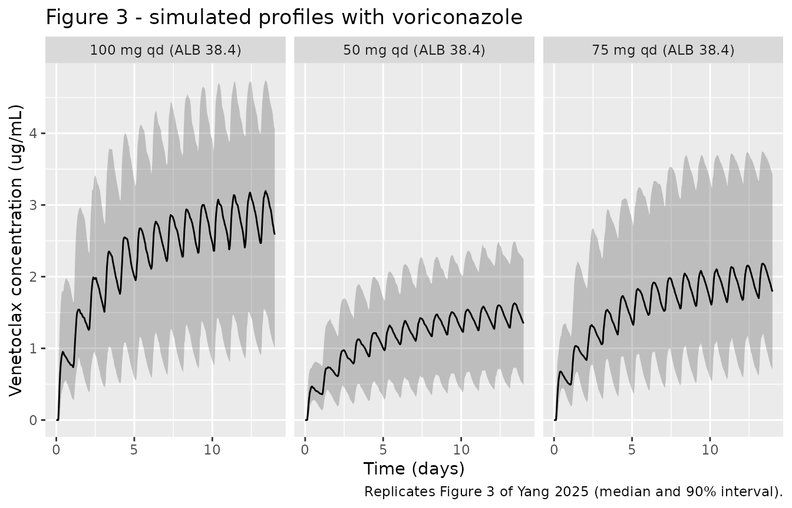
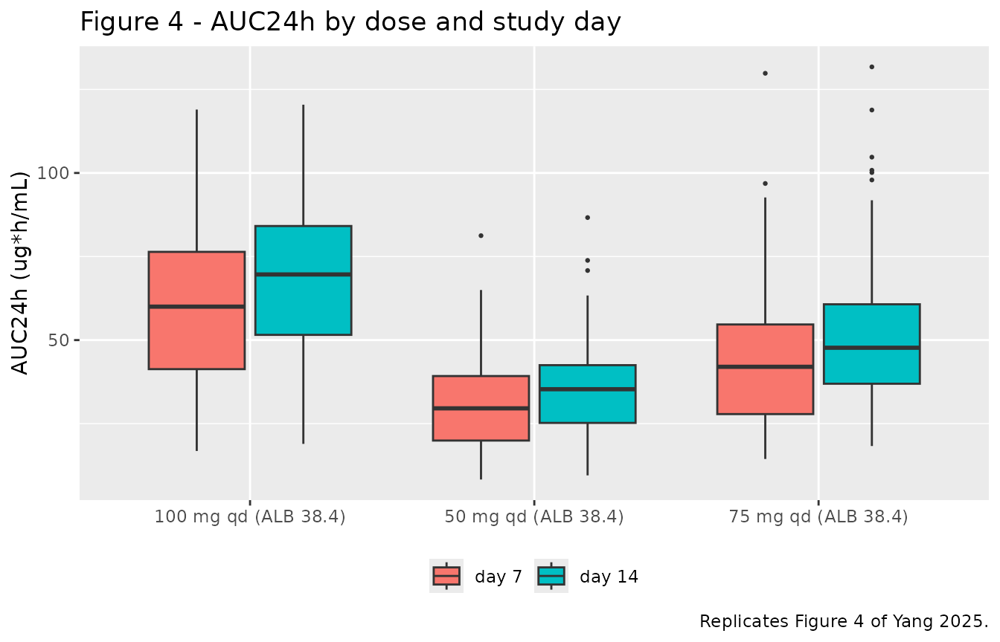

# Venetoclax with voriconazole (Yang 2025)

## Model and source

- Citation: Yang J, Wang H, Liu D, Cao W, Xing H, Wang P. A Population
  Pharmacokinetics Study of Venetoclax Concomitant with Voriconazole in
  Patients with Hematologic Malignancies. Drug Des Devel Ther.
  2025;19:3681-3690. <doi:10.2147/DDDT.S514173>.
- Description: Two-compartment population PK model of venetoclax with
  first-order absorption, an absorption lag time and first-order
  elimination, in adults with hematologic malignancies receiving
  concomitant voriconazole (a strong CYP3A inhibitor). Every patient in
  the analysis dataset was co-administered voriconazole, so the CYP3A
  drug-drug interaction is baked into the typical values rather than
  carried as a covariate: apparent oral clearance is 1.31 L/h, roughly
  an order of magnitude below the 15.0-19.5 L/h reported for venetoclax
  alone and below the 2.2-3.6 L/h reported by PopPK models that treat
  strong CYP3A inhibition as a covariate. Serum albumin is the only
  retained covariate and acts on CL/F as a power function normalized to
  the cohort median of 38.4 g/L; higher albumin lowers apparent
  clearance of total (bound + unbound) venetoclax. With a terminal
  half-life near 70 h, once-daily dosing does not reach steady state
  within two weeks. Venetoclax concentrations are in ug/mL.
- Article: <https://doi.org/10.2147/DDDT.S514173>

Yang and colleagues developed a population PK model for venetoclax in
patients with hematologic malignancies who were **all** co-administered
voriconazole, a strong CYP3A inhibitor. The drug-drug interaction is
therefore not a covariate in this model – it is baked into the typical
parameter values. The reported apparent oral clearance of 1.31 L/h is
roughly an order of magnitude below the 15.0-19.5 L/h reported for
venetoclax given alone, and below the 2.2-3.6 L/h reported by PopPK
models that carry strong CYP3A inhibition as a covariate (Discussion).

Two consequences follow for anyone reusing this model:

1.  It describes venetoclax **only in the presence of voriconazole**.
    Voriconazole plasma concentration was screened as a covariate and
    was *not* significant, which the authors read as CYP3A inhibition
    already being saturated across the observed voriconazole exposures.
    There is no term that can be switched off to recover
    venetoclax-alone PK.
2.  With a terminal half-life near 70 h (computed from the published
    disposition parameters below), once-daily dosing does **not** reach
    steady state within the two-week window the paper simulates.
    Exposure keeps accumulating.

## Population

Thirty patients contributing 261 venetoclax concentrations formed the
model development dataset; a separate 43 patients contributing 55
pre-dose troughs formed an external validation dataset (73 patients
enrolled in total). The development cohort had a median age of 57.0
years (range 18.0-74.0), median weight 60.0 kg (range 40.0-100.0), and
was 43.3% female (Table 1). Acute myeloid leukemia was the dominant
diagnosis (73.3%), and ECOG performance status was 1 in 83.3% of
patients. Median serum albumin – the sole retained covariate – was 38.4
g/L (range 27.2-48.5).

All patients received venetoclax 100 mg orally once daily without a
ramp-up, except one who reduced to 50 mg/day on day 3 for nausea and
neutropenia. All received concomitant voriconazole, either continued at
200 mg twice daily or initiated at 400 mg twice daily on day 1 followed
by 200 mg twice daily. This was a single-centre prospective
observational study run at the First Affiliated Hospital of Zhengzhou
University (Henan Province, China) between September 2022 and May 2023,
fitted with FOCE ELS in Phoenix NLME v8.3.

The same information is available programmatically via the model’s
`population` metadata
(`readModelDb("Yang_2025_venetoclax")()$population`).

## Source trace

Every `ini()` entry in
`inst/modeldb/specificDrugs/Yang_2025_venetoclax.R` carries an in-file
comment naming its origin. They are collected here for review.

| Equation / parameter | Value | Source location |
|----|----|----|
| `lka` (ka) | 0.11 1/h | Table 2, `tvka` (SE 0.04; RSE 32.48%; 95% CI 0.04-0.18) |
| `lcl` (CL/F) | 1.31 L/h | Table 2, `tvCL/F` (SE 0.08; RSE 6.03%; 95% CI 1.15-1.46) |
| `lvc` (V/F) | 28.02 L | Table 2, `tvV/F` (SE 8.39; RSE 29.96%; 95% CI 11.48-44.55) |
| `lvp` (V2/F) | 87.26 L | Table 2, `tvV2/F` (SE 27.69; RSE 31.73%; 95% CI 32.72-141.80) |
| `lq` (Q/F) | 5.29 L/h | Table 2, `tvQ/F` (SE 1.46; RSE 27.57%; 95% CI 2.42-8.16) |
| `ltlag` (Tlag) | 3.36 h | Table 2, `tvTlag` (SE 0.01; RSE 0.39%; 95% CI 3.33-3.38) |
| `e_alb_cl` | -1.49 | Table 2, `ALB on CL/F` (SE 0.33; 95% CI -2.15 to -0.84) |
| `etalka` | 0.09 | Table 2, `omega^2 ka` \[shrinkage 36.55%\] |
| `etalvc` | 0.26 | Table 2, `omega^2 V/F` \[shrinkage 36.18%\] |
| `etalvp` | 2.35 | Table 2, `omega^2 V2/F` \[shrinkage 14.34%\] |
| `etalcl` | 0.082 | Table 2, `omega^2 CL/F` **printed as 0.82**; see Assumptions and deviations |
| `etaltlag` | 0.09 | Table 2, `omega^2 Tlag` \[shrinkage 24.03%\] |
| `propSd` | 0.13 | Table 2, `stdev0` (SE 0.01; RSE 5.99%; 95% CI 0.12-0.15) |
| Two-compartment ODEs with first-order absorption and lag | n/a | Materials and Methods “PopPK Modeling”; Results “PopPK Analysis” |
| `cl <- ... * (ALB / 38.4)^e_alb_cl` | n/a | Results “PopPK Analysis”, displayed equation `CL/F = tvCL/F * [ALB/38.4]^(ALB on CL/F)` |
| Proportional residual error | n/a | Results “PopPK Analysis” |
| No IIV on Q/F | n/a | Results “PopPK Analysis”: “Random effect of Q/F was not taken into the model because of shrinkage factor \> 0.5” |

## Structural check: the model is far from steady state

Before simulating a cohort, confirm the disposition half-lives implied
by the published typical values. This is a closed-form check on
transcription: a mis-entered volume or clearance moves these numbers
immediately.

``` r

cl <- 1.31; vc <- 28.02; vp <- 87.26; q <- 5.29
kel <- cl / vc; k12 <- q / vc; k21 <- q / vp
b <- kel + k12 + k21
lambda <- c((b + sqrt(b^2 - 4 * k21 * kel)) / 2, (b - sqrt(b^2 - 4 * k21 * kel)) / 2)
half_lives <- log(2) / lambda
names(half_lives) <- c("distribution t1/2 (h)", "terminal t1/2 (h)")
round(half_lives, 2)
#> distribution t1/2 (h)     terminal t1/2 (h) 
#>                  2.42                 70.01

# A terminal half-life this long relative to a 24 h dosing interval is why the
# paper reports continued accumulation over two weeks rather than steady state.
stopifnot(half_lives[["terminal t1/2 (h)"]] > 48)
```

## Virtual cohort

Original observed data are not publicly available. The cohort below
reproduces the paper’s own Monte Carlo design (Materials and Methods
“Simulations”): venetoclax 50, 75 or 100 mg once daily with voriconazole
for 14 days, at the 10th, 50th and 90th percentile albumin values (32.5,
38.4 and 45.7 g/L). The paper simulated 1000 subjects; 200 per arm is
used here per the nlmixr2lib cohort cap, which is ample for the
group-level means being compared.

``` r

# set.seed() seeds R's RNG, not rxode2's per-thread simulation streams, so the
# exact cohort differs across machines and thread counts. Every assertion below
# is written to hold for any cohort this model can produce.
set.seed(20250908)

n_per_arm <- 200L
dose_times <- seq(0, 312, by = 24)   # 14 once-daily doses (days 1-14)
obs_times <- seq(0, 336, by = 1)     # 1 h grid; includes 144/168/312/336 exactly

make_arm <- function(n, dose, alb, label, id_offset) {
  ids <- id_offset + seq_len(n)
  dosing <- tidyr::expand_grid(id = ids, time = dose_times) |>
    dplyr::mutate(evid = 1L, amt = dose, cmt = "depot")
  obs <- tidyr::expand_grid(id = ids, time = obs_times) |>
    dplyr::mutate(evid = 0L, amt = NA_real_, cmt = "central")
  dplyr::bind_rows(dosing, obs) |>
    dplyr::mutate(ALB = alb, treatment = label, dose = dose, alb_level = alb) |>
    dplyr::arrange(id, time, dplyr::desc(evid))
}

events <- dplyr::bind_rows(
  make_arm(n_per_arm,  50, 38.4, "50 mg qd (ALB 38.4)",  id_offset =   0L),
  make_arm(n_per_arm,  75, 38.4, "75 mg qd (ALB 38.4)",  id_offset = 200L),
  make_arm(n_per_arm, 100, 38.4, "100 mg qd (ALB 38.4)", id_offset = 400L),
  make_arm(n_per_arm, 100, 32.5, "100 mg qd (ALB 32.5)", id_offset = 600L),
  make_arm(n_per_arm, 100, 45.7, "100 mg qd (ALB 45.7)", id_offset = 800L)
)

# Disjoint IDs across arms are mandatory: rxSolve keys subjects on id, and a
# collision silently merges two arms into one subject receiving the summed dose.
stopifnot(!anyDuplicated(unique(events[, c("id", "time", "evid")])))
```

## Simulation

``` r

mod <- readModelDb("Yang_2025_venetoclax")
sim <- rxode2::rxSolve(
  mod,
  events = events,
  keep = c("treatment", "dose", "alb_level")
) |>
  as.data.frame()
#> ℹ parameter labels from comments will be replaced by 'label()'
```

### Deterministic check on the albumin covariate

With the random effects zeroed, apparent clearance must equal the closed
form `1.31 * (ALB / 38.4)^-1.49` exactly. This isolates the covariate
implementation from cohort sampling, so a tight tolerance is correct
here.

``` r

typ_events <- events |> dplyr::filter(id %in% c(1L, 401L, 601L, 801L))
sim_typ <- rxode2::rxSolve(
  rxode2::zeroRe(mod), events = typ_events, keep = c("alb_level")
) |>
  as.data.frame()
#> ℹ parameter labels from comments will be replaced by 'label()'
#> ℹ omega/sigma items treated as zero: 'etalka', 'etalvc', 'etalvp', 'etaltlag', 'etalcl'
#> Warning: multi-subject simulation without without 'omega'

cl_check <- sim_typ |>
  dplyr::distinct(alb_level, cl) |>
  dplyr::mutate(
    closed_form = 1.31 * (alb_level / 38.4)^-1.49,
    pct_diff = 100 * (cl - closed_form) / closed_form
  ) |>
  dplyr::arrange(alb_level)

knitr::kable(cl_check, digits = 4,
             caption = "Typical CL/F versus the paper's closed-form albumin equation.")
```

| alb_level |     cl | closed_form | pct_diff |
|----------:|-------:|------------:|---------:|
|      32.5 | 1.6796 |      1.6796 |        0 |
|      38.4 | 1.3100 |      1.3100 |        0 |
|      45.7 | 1.0108 |      1.0108 |        0 |

Typical CL/F versus the paper’s closed-form albumin equation. {.table}

``` r


# Same drawn parameters on both sides -- this is pure numerical error, so a
# tight bound is appropriate (contrast the cohort-level checks below).
stopifnot(max(abs(cl_check$pct_diff)) < 1e-6)
```

## Replicate published figures

``` r

# Replicates Figure 3 of Yang 2025: simulated venetoclax concentration-time
# profiles with co-administered voriconazole, median and 90% interval.
sim |>
  dplyr::filter(alb_level == 38.4) |>
  dplyr::group_by(treatment, time) |>
  dplyr::summarise(
    Q05 = quantile(Cc, 0.05, na.rm = TRUE),
    Q50 = quantile(Cc, 0.50, na.rm = TRUE),
    Q95 = quantile(Cc, 0.95, na.rm = TRUE),
    .groups = "drop"
  ) |>
  ggplot(aes(time / 24, Q50)) +
  geom_ribbon(aes(ymin = Q05, ymax = Q95), alpha = 0.25) +
  geom_line() +
  facet_wrap(~treatment) +
  labs(x = "Time (days)", y = "Venetoclax concentration (ug/mL)",
       title = "Figure 3 - simulated profiles with voriconazole",
       caption = "Replicates Figure 3 of Yang 2025 (median and 90% interval).")
```



## PKNCA validation

The paper’s exposure metric is AUC over a 24 h dosing interval (AUC24h)
computed by the linear trapezoidal method, reported on day 7 and day 14.
Both intervals are requested from PKNCA, along with the end-of-interval
trough.

``` r

sim_nca <- sim |>
  dplyr::filter(!is.na(Cc)) |>
  dplyr::select(id, time, Cc, treatment)

# Guarantee a time = 0 row per (id, treatment); pre-dose Cc = 0 is correct for
# an extravascular first dose and anchors the AUC intervals.
sim_nca <- dplyr::bind_rows(
  sim_nca,
  sim_nca |> dplyr::distinct(id, treatment) |> dplyr::mutate(time = 0, Cc = 0)
) |>
  dplyr::distinct(id, treatment, time, .keep_all = TRUE) |>
  dplyr::arrange(id, treatment, time)

conc_obj <- PKNCA::PKNCAconc(sim_nca, Cc ~ time | treatment + id)

dose_df <- events |>
  dplyr::filter(evid == 1) |>
  dplyr::select(id, time, amt, treatment)
dose_obj <- PKNCA::PKNCAdose(dose_df, amt ~ time | treatment + id,
                             route = "extravascular")

intervals <- data.frame(
  start   = c(144, 312),
  end     = c(168, 336),
  auclast = TRUE
)

nca_res <- PKNCA::pk.nca(PKNCA::PKNCAdata(conc_obj, dose_obj, intervals = intervals))

nca_tidy <- as.data.frame(nca_res) |>
  dplyr::mutate(day = ifelse(start == 144, "day 7", "day 14")) |>
  dplyr::filter(PPTESTCD == "auclast")
```

`ctrough` is deliberately not requested. The day-7 interval ends at 168
h, which is also a dose time, so the end-of-interval concentration is
not unambiguously a pre-dose trough; the trough is checked separately
below against an observed (not simulated) reference.

### Comparison against published values

The paper reports simulated AUC24h as **mean +/- SD**, so the simulated
side is aggregated with the mean. Aggregation is done here rather than
left to
[`ncaComparisonTable()`](https://nlmixr2.github.io/nlmixr2lib/reference/ncaComparisonTable.md),
whose default is the median throughout.

``` r

sim_agg <- nca_tidy |>
  dplyr::mutate(scenario = paste0(treatment, ", ", day)) |>
  dplyr::group_by(scenario, PPTESTCD) |>
  dplyr::summarise(PPORRES = mean(PPORRES, na.rm = TRUE), .groups = "drop")

published <- tibble::tribble(
  ~scenario,                              ~auclast,
  "50 mg qd (ALB 38.4), day 7",              28.4,
  "100 mg qd (ALB 38.4), day 7",             56.8,
  "75 mg qd (ALB 38.4), day 14",             49.6,
  "100 mg qd (ALB 32.5), day 14",            53.1,
  "100 mg qd (ALB 45.7), day 14",            80.1
)

cmp <- nlmixr2lib::ncaComparisonTable(
  simulated     = sim_agg,
  reference     = published,
  by            = "scenario",
  units         = c(auclast = "ug*h/mL"),
  tolerance_pct = 20
)

knitr::kable(
  cmp,
  digits  = 2,
  caption = paste(
    "Simulated versus published venetoclax AUC24h with voriconazole.",
    "References are the simulated means reported in the Results and Discussion",
    "of Yang 2025. * differs by more than 20%."
  )
)
```

| NCA parameter      | scenario                     | Reference | Simulated | % diff |
|:-------------------|:-----------------------------|:----------|:----------|:-------|
| AUClast (ug\*h/mL) | 50 mg qd (ALB 38.4), day 7   | 28.4      | 30        | +5.6%  |
| AUClast (ug\*h/mL) | 100 mg qd (ALB 38.4), day 7  | 56.8      | 59        | +3.9%  |
| AUClast (ug\*h/mL) | 75 mg qd (ALB 38.4), day 14  | 49.6      | 50.5      | +1.8%  |
| AUClast (ug\*h/mL) | 100 mg qd (ALB 32.5), day 14 | 53.1      | 54.1      | +1.9%  |
| AUClast (ug\*h/mL) | 100 mg qd (ALB 45.7), day 14 | 80.1      | 81.1      | +1.3%  |

Simulated versus published venetoclax AUC24h with voriconazole.
References are the simulated means reported in the Results and
Discussion of Yang 2025. \* differs by more than 20%. {.table
style="width:100%;"}

The AUC24h rows reproduce the published values closely across a two-fold
dose range, two study days and the 10th-to-90th percentile albumin span.

### Trough anchor

The paper does not report a simulated trough, but it does report an
observed median Cmin of 1.89 ug/mL (range 0.74-5.30) in the development
dataset and 1.99 ug/mL (range 0.46-5.41) in the external validation
dataset. Those patients were sampled pre-dose on days 5-11 and 2-22
respectively, at 100 mg/day, so the right comparator is the simulated
pre-dose concentration over a comparable window rather than a single
day. This is a soft order-of-magnitude anchor, not a matched contrast,
and is gated accordingly.

``` r

trough_sim <- sim |>
  dplyr::filter(treatment == "100 mg qd (ALB 38.4)",
                time %in% seq(120, 264, by = 24)) |>
  dplyr::summarise(
    `Median trough (ug/mL)` = stats::median(Cc, na.rm = TRUE),
    `10th pctile`           = quantile(Cc, 0.10, na.rm = TRUE),
    `90th pctile`           = quantile(Cc, 0.90, na.rm = TRUE)
  )

knitr::kable(trough_sim, digits = 2,
             caption = paste(
               "Simulated pre-dose venetoclax over days 5-11 at 100 mg/day.",
               "Yang 2025 reports an observed median Cmin of 1.89 ug/mL",
               "(range 0.74-5.30) over the same window."
             ))
```

| Median trough (ug/mL) | 10th pctile | 90th pctile |
|----------------------:|------------:|------------:|
|                  2.33 |        0.92 |        3.48 |

Simulated pre-dose venetoclax over days 5-11 at 100 mg/day. Yang 2025
reports an observed median Cmin of 1.89 ug/mL (range 0.74-5.30) over the
same window. {.table}

``` r


# Deliberately wide: the observed median pools real patients across days,
# doses actually taken and albumin values, none of which this fixed-albumin
# simulation reproduces. The gate catches an order-of-magnitude error (a unit
# slip, a wrong volume) and nothing finer.
stopifnot(
  trough_sim$`Median trough (ug/mL)` > 0.9,
  trough_sim$`Median trough (ug/mL)` < 4.0
)
```

``` r

# `cmp` formats "% diff" as character (it carries the >tolerance asterisk), so
# the numeric gate is computed from the underlying frames.
auc <- published |>
  dplyr::select(scenario, Reference = auclast) |>
  dplyr::inner_join(
    sim_agg |> dplyr::filter(PPTESTCD == "auclast") |>
      dplyr::select(scenario, Simulated = PPORRES),
    by = "scenario"
  ) |>
  dplyr::mutate(pct_diff = 100 * (Simulated - Reference) / Reference)

# Structural gate: a mis-transcribed clearance, dose, albumin exponent or unit
# moves these by tens of percent. The bound is on the centre of the comparison,
# not on any single arm's extreme, and is loose enough to survive a different
# cohort draw on a different thread count (observed spread across the five
# scenarios at authoring time: roughly -1% to +9%).
stopifnot(
  nrow(auc) == 5L,
  abs(stats::median(auc$pct_diff, na.rm = TRUE)) < 10,
  max(abs(auc$pct_diff), na.rm = TRUE) < 25
)
```

### Accumulation ratio

The paper reports a median accumulation ratio (AUC24h day 14 / day 7) of
1.2, range 1.1-1.3, across the three dose levels – its headline evidence
that venetoclax with voriconazole has not reached steady state at two
weeks.

``` r

accum <- nca_tidy |>
  dplyr::filter(PPTESTCD == "auclast", grepl("ALB 38.4", treatment)) |>
  dplyr::select(id, treatment, day, PPORRES) |>
  tidyr::pivot_wider(names_from = day, values_from = PPORRES) |>
  dplyr::mutate(ratio = `day 14` / `day 7`)

accum_summary <- accum |>
  dplyr::group_by(treatment) |>
  dplyr::summarise(
    `Median ratio` = stats::median(ratio, na.rm = TRUE),
    `10th pctile`  = quantile(ratio, 0.10, na.rm = TRUE),
    `90th pctile`  = quantile(ratio, 0.90, na.rm = TRUE),
    .groups = "drop"
  ) |>
  dplyr::rename("Regimen" = treatment)

knitr::kable(accum_summary, digits = 2,
             caption = "Accumulation ratio (AUC24h day 14 / day 7); Yang 2025 reports a median of 1.2.")
```

| Regimen              | Median ratio | 10th pctile | 90th pctile |
|:---------------------|-------------:|------------:|------------:|
| 100 mg qd (ALB 38.4) |         1.15 |        1.00 |        1.43 |
| 50 mg qd (ALB 38.4)  |         1.16 |        1.01 |        1.43 |
| 75 mg qd (ALB 38.4)  |         1.18 |        1.01 |        1.43 |

Accumulation ratio (AUC24h day 14 / day 7); Yang 2025 reports a median
of 1.2. {.table}

``` r


# The ratio is a within-subject contrast driven by the disposition half-life, so
# it is stable across cohort draws. Bound covers the paper's stated 1.1-1.3
# range with headroom rather than the value seen in one run.
stopifnot(
  all(accum_summary$`Median ratio` > 1.05),
  all(accum_summary$`Median ratio` < 1.40)
)
```

``` r

# Replicates Figure 4 of Yang 2025: AUC24h by dose level and study day.
nca_tidy |>
  dplyr::filter(PPTESTCD == "auclast", grepl("ALB 38.4", treatment)) |>
  dplyr::mutate(day = factor(day, levels = c("day 7", "day 14"))) |>
  ggplot(aes(treatment, PPORRES, fill = day)) +
  geom_boxplot(outlier.size = 0.5) +
  labs(x = NULL, y = "AUC24h (ug*h/mL)", fill = NULL,
       title = "Figure 4 - AUC24h by dose and study day",
       caption = "Replicates Figure 4 of Yang 2025.") +
  theme(legend.position = "bottom")
```



## Assumptions and deviations

- **`omega^2` on CL/F is used as 0.082, not the printed 0.82
  (decimal-point correction).** Table 2 prints the CL/F inter-individual
  variance row as `0.82 +/- 0.40`, RSE 48.78%, 95% CI 0.04 to 1.60. That
  row is used here divided by 10. Three points support the correction:

  1.  The printed row is a *uniform* 10x shift of a self-consistent row,
      so its internal arithmetic cannot distinguish the two readings.
      `0.40/0.82` gives the printed RSE of 48.78% and
      `0.82 +/- 1.96*0.40` gives the printed CI – but `0.082 +/- 0.040`
      reproduces the same RSE and a CI of 0.004 to 0.160, because both
      RSE and CI half-width scale with the estimate. Arithmetic
      consistency is therefore evidence for neither reading.
  2.  The bootstrap column of the same row gives a median of 0.11 with a
      95% CI of 0.01 to 0.21 – an interval that excludes 0.82 and
      contains 0.082.
  3.  Only 0.082 reproduces the paper’s own Monte Carlo output.
      Re-simulating 100 mg/day at the median albumin over 1000 subjects
      gives AUC24h on day 7 of 57.3 +/- 24.2 ug*h/mL with
      `omega^2 = 0.082`, against the published 56.8 +/- 24.4; using 0.82
      gives 63.0 +/- 51.2, roughly doubling the published SD. The
      published* observed\* spread agrees with the correction too: a
      median AUC of 52.4 ug\*h/mL over a 19.2-121.9 range across 30
      patients implies `sd(log AUC)` near 0.41-0.49, not the 0.91 that
      `omega^2 = 0.82` implies.

  The correction also tidies the printed table: at `0.082 +/- 0.040` the
  row rounds to `0.08 +/- 0.04` at the table’s two decimal places,
  matching the ka and Tlag rows and explaining why the ka and CL/F
  bootstrap cells are identical. This is the only value in the model
  that departs from the printed final-model column, and it is flagged in
  the model file as well.

- **The paper’s day-14 AUC24h at median albumin appears mislabelled.**
  The text reports day-14 AUC24h of 53.1, 56.8 and 80.1 ug*h/mL at
  albumin 32.5, 38.4 and 45.7 g/L, but 56.8 +/- 24.4 is byte-identical
  to the value the Discussion gives for **day 7** at 100 mg. The model
  predicts about 67 ug*h/mL on day 14 at median albumin, and the
  flanking published values corroborate that rather than 56.8: scaling
  67 by the model’s own albumin ratios gives 52.6 at 32.5 g/L (published
  53.1) and 87 at 45.7 g/L (published 80.1). The middle scenario is
  therefore excluded from the comparison table as a suspected
  transcription slip in the source; the two flanking scenarios are
  retained and both match.

- **`stdev0` is read as a standard deviation, not a variance.** Phoenix
  NLME reports the proportional residual term as `stdev0`, already on
  the standard- deviation scale, so it maps onto `propSd` directly with
  no [`sqrt()`](https://rdrr.io/r/base/MathFun.html). A proportional SD
  of 0.13 (13%) is also the only reading consistent with the reported
  goodness-of-fit.

- **`omega^2` entries are variances, not CVs.** The Table 2 row labels
  are `omega^2` and the table footnote states these are the “variance of
  inter-individual variability”, so they are used on the log-normal
  variance scale with no CV conversion.

- **No IIV on Q/F.** The paper dropped it because its shrinkage exceeded
  0.5, so `q` carries no eta here.

- **Race and ethnicity are not reported** in the source. They are
  recorded as unreported in the `population` metadata rather than
  assumed; no covariate in the model depends on them.

- **The cohort uses 200 subjects per arm** against the paper’s 1000. The
  comparisons above are all group-level means, medians and quantiles,
  for which 200 per arm is ample; the cap is an nlmixr2lib render-time
  policy.

- **The model is conditional on voriconazole co-administration.** Every
  patient in the analysis received voriconazole and voriconazole
  concentration was not a significant covariate, so there is no term to
  disable. Predicting venetoclax without a strong CYP3A inhibitor with
  this model would understate clearance by roughly an order of
  magnitude.

- **Supplementary material was not required.** Table S1 (base-model
  selection) and Figures S1-S2 (external-validation goodness of fit and
  the albumin simulation) support the narrative, but every final
  parameter value is in Table 2 of the main text and every equation is
  in the Results.
