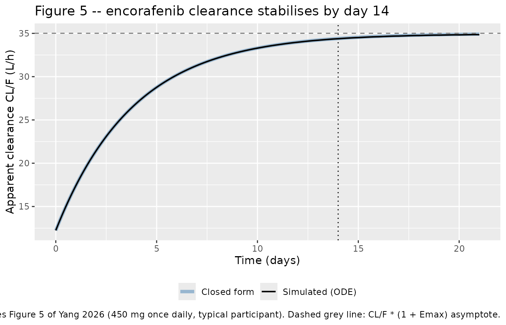
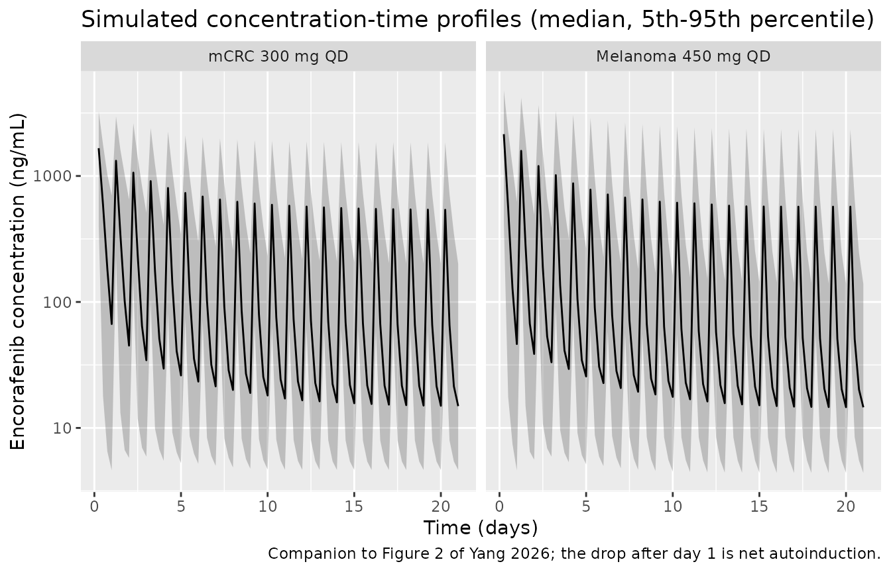
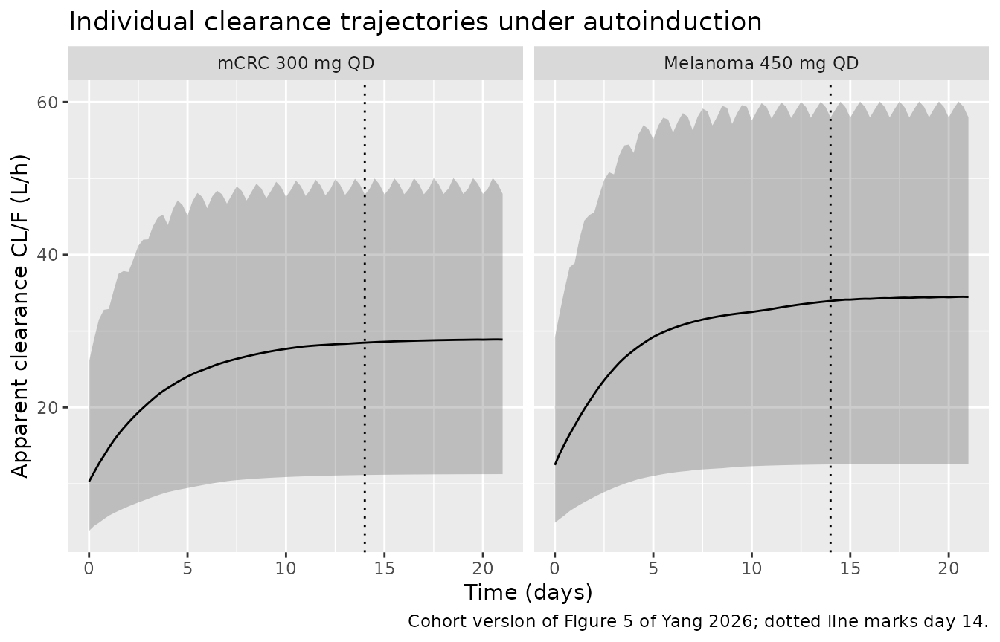

# Encorafenib (Yang 2026)

## Model and source

    #> ℹ parameter labels from comments will be replaced by 'label()'

- Citation: Yang D. Z., Hahn E. M., Piscitelli J., Pithavala Y. K.,
  Hibma J. E. (2026). Population pharmacokinetic modeling of encorafenib
  in healthy participants and patients with BRAF V600-mutant solid
  tumors: a semi-mechanistic autoinduction model. Clinical
  Pharmacokinetics 65(5):693-707. <doi:10.1007/s40262-025-01608-y>. The
  enzyme-turnover autoinduction structure follows the same
  unitary-baseline enzyme-pool idiom used by
  modellib(‘Smythe_2012_rifampicin’) and
  modellib(‘Clewe_2015_rifampicin’), with the addition of a Hill
  exponent on the Emax induction term.

- Description: Semi-mechanistic global population PK model for
  encorafenib in healthy participants and patients with BRAF V600-mutant
  melanoma, metastatic colorectal cancer, non-small cell lung cancer,
  and other solid tumors: a two-compartment model with first-order oral
  absorption whose apparent clearance is multiplied by a
  unitary-baseline enzyme pool (CL/F \* ENZ), the pool being driven by a
  concentration-dependent sigmoid Emax autoinduction of the enzyme
  production rate (Emax 1.861, EC50 9.097 ng/mL, Hill exponent fixed at
  10, turnover half-life 64.3 h); CL/F therefore rises from 12.2 L/h on
  day 1 to 35 L/h at steady state (a 186% increase) within about 14 days
  of once-daily dosing. Age (power) and tumor type (metastatic CRC and a
  pooled other-tumor group versus a melanoma reference) act on CL/F day
  1, and baseline body weight (power) acts on Vc/F.

- Article: <https://doi.org/10.1007/s40262-025-01608-y>

- Supplement (Table S1 and Figures S1-S5):
  <https://static-content.springer.com/esm/art%3A10.1007%2Fs40262-025-01608-y/MediaObjects/40262_2025_1608_MOESM1_ESM.docx>

Encorafenib is a BRAF V600-mutant kinase inhibitor that is both a
substrate and, at steady state, a strong inducer of CYP3A4. Yang 2026
replaces the time-`Emax` clearance model used for the original New Drug
Application with a semi-mechanistic enzyme-turnover model in which the
*concentration* of encorafenib drives an increase in the enzyme
production rate. The clearance consumed by the central compartment is
therefore `CL/F * ENZ`, where `ENZ` is a pool normalised to unity in the
absence of drug (Yang 2026 Fig. 1).

## Population

The analysis pooled nine phase 1, 2 and 3 studies: one
healthy-participant study (ARRAY-162-105 part 1), four melanoma studies
(COLUMBUS, POLARIS, C4221010, LOGIC 2), two metastatic colorectal cancer
studies (C4221001, BEACON), one NSCLC study (PHAROS) and one
other-solid-tumor study (C4221005). A total of 1310 participants
received encorafenib as monotherapy or in combination with binimetinib
or cetuximab; 1299 of them contributed 8651 evaluable observations after
the M1 exclusion of 263 values below the limit of quantification or
missing (Yang 2026 Results 3.1).

Baseline characteristics (Yang 2026 Table 1): median age 58 years (range
19-94), median body weight 76 kg (range 34-168), 45% female, 90% White.
Tumor types were melanoma 892 (68%), metastatic CRC 240 (18%), lung 98
(7%), other solid tumors 65 (5%) and healthy participants 15 (1%). Doses
spanned 50-800 mg once daily, with most data from the approved 450 mg
once daily (melanoma / NSCLC, with binimetinib) and 300 mg once daily
(metastatic CRC, with cetuximab) regimens.

The same information is available programmatically from the model’s
`population` metadata:

``` r

str(ui$population)
#> List of 13
#>  $ species       : chr "human"
#>  $ n_subjects    : int 1310
#>  $ n_studies     : int 9
#>  $ age_range     : chr "19-94 years"
#>  $ age_median    : chr "58 years"
#>  $ weight_range  : chr "34-168 kg"
#>  $ weight_median : chr "76 kg"
#>  $ sex_female_pct: num 45
#>  $ race_ethnicity: Named num [1:4] 90 1 6 3
#>   ..- attr(*, "names")= chr [1:4] "White" "Black" "Asian" "Other"
#>  $ disease_state : chr "BRAF V600-mutant solid tumors plus healthy participants: melanoma n = 892 (68%), metastatic colorectal cancer n"| __truncated__
#>  $ dose_range    : chr "Oral encorafenib 50-800 mg once daily (dose-escalation studies spanned 50-700 mg after a single dose), as monot"| __truncated__
#>  $ regions       : chr "Global; nine phase 1, 2, and 3 studies (ARRAY-162-105 part 1, COLUMBUS, POLARIS, C4221010, LOGIC 2, C4221001, B"| __truncated__
#>  $ notes         : chr "1310 participants enrolled; 1299 participants contributed 8651 evaluable observations after excluding 263 value"| __truncated__
```

## Source trace

Every `ini()` entry in
`inst/modeldb/specificDrugs/Yang_2026_encorafenib.R` carries an in-file
comment naming its source location. They are collected here for review.

| Equation / parameter | Value | Source location |
|----|----|----|
| `lka` (Ka) | 0.954 /h | Table 2, `theta_Ka` |
| `lcl` (CL/F day 1) | 12.238 L/h | Table 2, `theta_CL/F day 1` |
| `lvc` (Vc/F) | 61.73 L | Table 2, `theta_Vc/F` |
| `lq` (Q/F) | 1.045 L/h | Table 2, `theta_Q/F` |
| `lvp` (Vp/F) | 54.549 L | Table 2, `theta_Vp/F` |
| `lkenz` (kENZ) | log(2)/64.279 = 0.010784 /h | Table 2 `theta_Turnover HL` = 64.279 h; Results 3.3 prints K_ENZ = 0.0108 /h |
| `lemax` (Emax) | 1.861 | Table 2, `theta_Emax`; Results 3.3 gives the corresponding 186% rise in CL/F |
| `lec50` (EC50) | 9.097 ng/mL | Table 2, `theta_EC50`; Results 3.3 rounds to 9 ng/mL |
| `lhill` (gamma) | 10, fixed | Table 2, `theta_Gamma` (no RSE, no CI, no bootstrap) |
| `lfdepot` (F) | 1, fixed | Structural anchor; Fig. 1 doses with `F * Dose` and Table 2 reports apparent (/F) parameters |
| `e_age_cl` | -0.326 | Table 2 `theta_Age on CL/F day 1`; Eq. 6 with the 58-year centering value |
| `e_wt_vc` | 0.588 | Table 2 `theta_BWT on Vc/F`; Eq. 7 with the 76-kg centering value |
| `e_tumtp_crc_cl` | -0.175 | Table 2 `theta_mCRC tumor on CL/F day 1`; Eq. 6 factor `(1 - 0.175 * mCRC)` |
| `e_tumtp_other_cl` | -0.0938 | Eq. 6 factor `(1 - 0.0938 * other tumor)`; Table 2 rounds the same theta to -0.094 |
| `etalcl` | 0.319 (56.48% CV) | Table 2 IIV on `theta_CL/F`; Eq. 4 defines %CV = sqrt(omega^2) \* 100 |
| `etalvc` | 0.25 (50% CV) | Table 2 IIV on `theta_Vc/F` |
| `etalka` | fixed 0.25 (50% CV) | Table 2 IIV on `theta_Ka`; Results 3.2 states it was fixed to 50% |
| `etalq`, `etalvp`, `etalkenz`, `etalemax`, `etalec50`, `etalhill` | fixed 0.025 (15.81% CV) each | Table 2 IIV rows; Methods 2.2 gives the fixed variance 0.025 |
| `addSd`, `propSd` | 0.589 each | Table 2 `theta_Prop err` = `W`; Eq. 5 uses the same `W` in both terms |
| `d/dt(enz_pool) = kENZ * (1 + EFF) - kENZ * enz_pool`, `enz_pool(0) = 1` | n/a | Eq. 1 with `kin = kout`; Fig. 1 |
| `EFF = Emax * Cp^gamma / (EC50^gamma + Cp^gamma)` | n/a | Eq. 2 |
| `cl = CL/F * enz_pool` | n/a | Fig. 1 elimination flux label `CL/F * ENZ` |
| `TV(CL/F) = 12.2 * (AGE/58)^-0.326 * (1 - 0.175*mCRC) * (1 - 0.0938*other)` | n/a | Eq. 6 |
| `TV(Vc/F) = 61.7 * (BWT/76)^0.588` | n/a | Eq. 7 |
| `Cc ~ add(addSd) + prop(propSd) + combined1()` | n/a | Eq. 5 (see Assumptions and deviations) |

``` r

mod <- readModelDb("Yang_2026_encorafenib")
mod_typ <- rxode2::zeroRe(mod)
#> ℹ parameter labels from comments will be replaced by 'label()'

kenz_pub  <- log(2) / 64.279   # 1/h, from the published 64.279 h turnover half-life
cl_day1   <- 12.238            # L/h
emax_pub  <- 1.861
cl_ss_max <- cl_day1 * (1 + emax_pub)   # L/h, full-induction asymptote
signif(c(kenz = kenz_pub, cl_ss_asymptote = cl_ss_max), 6)
#>            kenz cl_ss_asymptote 
#>       0.0107834      35.0129000
```

The asymptote `CL/F * (1 + Emax)` = 35.013 L/h reproduces the “increased
by 186% to 35 L/h” statement in Yang 2026 Results 3.3, and `kENZ` =
0.01078 /h reproduces the printed `0.0108` /h.

## Structural check 1: the linear backbone

With the Hill exponent fixed at 10 and `EC50` = 9.097 ng/mL, a dose
small enough to keep the plasma concentration far below `EC50` leaves
`EFF` at essentially zero, so `enz_pool` stays at 1 and the model
collapses to an ordinary linear two-compartment model with first-order
absorption. That regime has a closed form, which validates the
disposition backbone independently of the autoinduction layer. This
comparison is deterministic (typical values, no random effects), so a
tight tolerance is appropriate.

``` r

ev_micro <- rxode2::et(amt = 0.05, cmt = "depot") |>
  rxode2::et(seq(0, 96, by = 0.25), cmt = "central") |>
  as.data.frame() |>
  mutate(AGE = 58, WT = 76, TUMTP_CRC = 0, TUMTP_OTHER = 0)

sim_micro <- rxode2::rxSolve(mod_typ, ev_micro, omega = NA, sigma = NA,
                             returnType = "data.frame")

# Analytic two-compartment first-order-absorption solution, typical values.
ka <- 0.954; cl <- 12.238; vc <- 61.73; q <- 1.045; vp <- 54.549
k10 <- cl / vc; k12 <- q / vc; k21 <- q / vp
bsum  <- k10 + k12 + k21
alpha <- (bsum + sqrt(bsum^2 - 4 * k21 * k10)) / 2
beta  <- (bsum - sqrt(bsum^2 - 4 * k21 * k10)) / 2
tt <- sim_micro$time
cf <- 0.05 * 1000 * (ka / vc) * (
  (k21 - alpha) / ((ka - alpha) * (beta - alpha)) * exp(-alpha * tt) +
  (k21 - beta)  / ((ka - beta)  * (alpha - beta)) * exp(-beta  * tt) +
  (k21 - ka)    / ((alpha - ka) * (beta - ka))    * exp(-ka    * tt)
)

pos <- tt > 0
enz_dev <- max(abs(sim_micro$enz_pool - 1))
rel_err <- max(abs(sim_micro$Cc[pos] - cf[pos]) / cf[pos])
c(max_Cc_ng_per_mL = max(sim_micro$Cc), enz_pool_deviation = enz_dev,
  max_relative_error = rel_err)
#>   max_Cc_ng_per_mL enz_pool_deviation max_relative_error 
#>       5.251013e-01       1.443290e-14       1.444592e-06

stopifnot(
  # Sub-EC50 exposure must leave the enzyme pool untouched.
  enz_dev < 1e-8,
  # Solver-vs-closed-form agreement; realised 1.4e-6.
  rel_err < 1e-4
)
```

## Replicating Figure 5: clearance stabilises by day 14

Figure 5 of Yang 2026 plots typical-value clearance against time on
daily dosing, rising from about 12 L/h to about 34.4 L/h by day 14
(dashed line). At the approved 450 mg once-daily dose the plasma
concentration stays above the 9.097 ng/mL `EC50` throughout the dosing
interval, so with `gamma` = 10 the induction driver `EFF` sits
essentially at `Emax` and the enzyme pool follows the closed-form step
response

    ENZ(t) = 1 + Emax * (1 - exp(-kENZ * t)),   cl(t) = CL/F_day1 * ENZ(t).

``` r

ndays <- 21; tau <- 24
ev_typ <- rxode2::et(amt = 450, ii = tau, until = (ndays - 1) * tau, cmt = "depot") |>
  rxode2::et(seq(0, ndays * tau, by = 1), cmt = "central") |>
  as.data.frame() |>
  mutate(AGE = 58, WT = 76, TUMTP_CRC = 0, TUMTP_OTHER = 0)

sim_typ <- rxode2::rxSolve(mod_typ, ev_typ, omega = NA, sigma = NA,
                           returnType = "data.frame") |>
  filter(!is.na(Cc)) |>
  mutate(cl_closed_form = cl_day1 * (1 + emax_pub * (1 - exp(-kenz_pub * time))))

ggplot(sim_typ, aes(time / 24)) +
  geom_line(aes(y = cl_closed_form, colour = "Closed form"), linewidth = 1.6, alpha = 0.5) +
  geom_line(aes(y = cl, colour = "Simulated (ODE)"), linewidth = 0.7) +
  geom_vline(xintercept = 14, linetype = "dotted") +
  geom_hline(yintercept = cl_ss_max, linetype = "dashed", colour = "grey50") +
  scale_colour_manual(values = c("Closed form" = "steelblue", "Simulated (ODE)" = "black")) +
  labs(x = "Time (days)", y = "Apparent clearance CL/F (L/h)", colour = NULL,
       title = "Figure 5 -- encorafenib clearance stabilises by day 14",
       caption = paste("Replicates Figure 5 of Yang 2026 (450 mg once daily, typical participant).",
                       "Dashed grey line: CL/F * (1 + Emax) asymptote.")) +
  theme(legend.position = "bottom")
```



``` r

pick <- function(day) sim_typ$cl[which.min(abs(sim_typ$time - day * 24))]
cl_day7  <- pick(7)
cl_day14 <- pick(14)

# Time at which clearance crosses the midpoint of its rise; for the closed-form
# step response this is exactly the published turnover half-life of 64.279 h.
mid <- (cl_day1 + cl_ss_max) / 2
t_half_induction <- approx(x = sim_typ$cl, y = sim_typ$time, xout = mid)$y

max_pct_vs_closed <- max(abs(100 * (sim_typ$cl - sim_typ$cl_closed_form) /
                               sim_typ$cl_closed_form))

fig5 <- tibble::tibble(
  Quantity = c("CL/F at t = 0 (L/h)", "CL/F on day 7 (L/h)", "CL/F on day 14 (L/h)",
               "CL/F plateau (L/h)", "Induction half-life (h)"),
  Simulated = c(sim_typ$cl[1], cl_day7, cl_day14, max(sim_typ$cl), t_half_induction),
  `Yang 2026` = c(12.2, NA, NA, 35.0, 64.3),
  Source = c("Results 3.3 / Table 2", "Figure 5 (reads about 31.3)",
             "Figure 5 (reads about 34.4)", "Results 3.3 (186% rise to 35 L/h)",
             "Table 2 turnover half-life")
)
knitr::kable(fig5, digits = 3,
             caption = "Typical-value clearance trajectory versus Yang 2026.")
```

| Quantity | Simulated | Yang 2026 | Source |
|:---|---:|---:|:---|
| CL/F at t = 0 (L/h) | 12.238 | 12.2 | Results 3.3 / Table 2 |
| CL/F on day 7 (L/h) | 31.291 | NA | Figure 5 (reads about 31.3) |
| CL/F on day 14 (L/h) | 34.382 | NA | Figure 5 (reads about 34.4) |
| CL/F plateau (L/h) | 34.861 | 35.0 | Results 3.3 (186% rise to 35 L/h) |
| Induction half-life (h) | 64.281 | 64.3 | Table 2 turnover half-life |

Typical-value clearance trajectory versus Yang 2026. {.table}

``` r


stopifnot(
  # Deterministic typical-value solve: the ODE must track its own closed form.
  # Realised 0.17%; the small gap is the trough dip of EFF below Emax once
  # Ctrough approaches EC50 late in the course.
  max_pct_vs_closed < 0.5,
  # Fig. 5 read-offs.
  cl_day7  > 30.5 && cl_day7  < 32.0,
  cl_day14 > 33.8 && cl_day14 < 35.0,
  # Plateau within 1% of CL/F * (1 + Emax).
  abs(max(sim_typ$cl) - cl_ss_max) / cl_ss_max < 0.01,
  # Induction half-life recovers the published 64.279 h.
  abs(t_half_induction - 64.279) < 3
)
```

## Replicating the reported covariate effects

Yang 2026 Results 3.4 quantifies the retained covariate effects at the
10th and 90th percentiles of the analysis population. These are pure
arithmetic on Eqs. 6 and 7, so they are checked exactly.

``` r

tv_cl <- function(age, crc = 0, other = 0) {
  12.238 * (age / 58)^-0.326 * (1 - 0.175 * crc) * (1 - 0.0938 * other)
}
tv_vc <- function(wt) 61.73 * (wt / 76)^0.588

cov_tab <- tibble::tibble(
  Scenario = c("CL/F at age 38 years", "CL/F at age 73 years",
               "Vc/F at 56 kg", "Vc/F at 100 kg",
               "CL/F melanoma vs mCRC (ratio)", "CL/F melanoma vs other tumor (ratio)"),
  Model = c(tv_cl(38), tv_cl(73), tv_vc(56), tv_vc(100),
            tv_cl(58) / tv_cl(58, crc = 1), tv_cl(58) / tv_cl(58, other = 1)),
  `Yang 2026` = c(14.0, 11.3, 51.6, 72.5, NA, NA),
  Units = c("L/h", "L/h", "L", "L", "unitless", "unitless")
)
knitr::kable(cov_tab, digits = 3,
             caption = "Covariate effects reproduced from Yang 2026 Results 3.4.")
```

| Scenario                             |  Model | Yang 2026 | Units    |
|:-------------------------------------|-------:|----------:|:---------|
| CL/F at age 38 years                 | 14.047 |      14.0 | L/h      |
| CL/F at age 73 years                 | 11.354 |      11.3 | L/h      |
| Vc/F at 56 kg                        | 51.584 |      51.6 | L        |
| Vc/F at 100 kg                       | 72.540 |      72.5 | L        |
| CL/F melanoma vs mCRC (ratio)        |  1.212 |        NA | unitless |
| CL/F melanoma vs other tumor (ratio) |  1.104 |        NA | unitless |

Covariate effects reproduced from Yang 2026 Results 3.4. {.table}

``` r


stopifnot(
  abs(tv_cl(38) - 14.0) < 0.15,
  abs(tv_cl(73) - 11.3) < 0.15,
  abs(tv_vc(56) - 51.6) < 0.15,
  abs(tv_vc(100) - 72.5) < 0.15
)
```

## Virtual cohort

Individual data are not publicly available, so a virtual cohort is drawn
to match the Table 1 marginal distributions: age from N(57.10, 13.48)
truncated to 19-94 years, body weight from N(77.79, 18.79) truncated to
34-168 kg. Two arms are simulated, each at 200 participants (the per-arm
cap for this package’s validation vignettes):

- melanoma, 450 mg once daily (the approved dose with binimetinib);
- metastatic CRC, 300 mg once daily (the approved dose with cetuximab).

``` r

# set.seed() seeds R's RNG (the covariate draws below). It does NOT seed
# rxode2's simulation RNG, whose streams are partitioned per solver thread --
# so the eta draws differ between a 16-thread workstation and a 2-core CI
# runner. Every assertion downstream is written to hold for any cohort this
# model can produce.
set.seed(20260901)

n_arm <- 200

make_cohort <- function(n, dose_mg, crc, other, arm, id_offset = 0L) {
  subj <- tibble::tibble(
    id          = id_offset + seq_len(n),
    arm         = arm,
    dose_mg     = dose_mg,
    AGE         = pmin(94, pmax(19, rnorm(n, 57.10, 13.48))),
    WT          = pmin(168, pmax(34, rnorm(n, 77.79, 18.79))),
    TUMTP_CRC   = crc,
    TUMTP_OTHER = other
  )
  obs_times <- sort(unique(c(
    seq(0, tau, by = 0.25),                                  # first dosing interval
    seq((ndays - 1) * tau, ndays * tau, by = 0.25),          # last (steady-state) interval
    seq(0, ndays * tau, by = 6)                              # coarse grid for the profile plot
  )))
  doses <- subj |>
    tidyr::crossing(time = seq(0, (ndays - 1) * tau, by = tau)) |>
    mutate(amt = dose_mg, evid = 1L, cmt = "depot")
  obs <- subj |>
    tidyr::crossing(time = obs_times) |>
    mutate(amt = NA_real_, evid = 0L, cmt = "central")
  bind_rows(doses, obs) |> arrange(id, time, desc(evid))
}

events <- bind_rows(
  make_cohort(n_arm, 450, crc = 0, other = 0, arm = "Melanoma 450 mg QD", id_offset = 0L),
  make_cohort(n_arm, 300, crc = 1, other = 0, arm = "mCRC 300 mg QD",     id_offset = 1000L)
)
stopifnot(!anyDuplicated(unique(events[, c("id", "time", "evid")])))
```

## Simulation

``` r

sim <- rxode2::rxSolve(
  mod, events = events,
  keep = c("arm", "dose_mg", "AGE", "WT")
) |>
  as.data.frame() |>
  filter(!is.na(Cc))
#> ℹ parameter labels from comments will be replaced by 'label()'

stopifnot(nrow(sim) > 0, all(sim$Cc >= 0))
```

``` r

# Companion to Figure 2 of Yang 2026 (observed concentration versus time by
# study and dose level): the simulated median with a 5th-95th percentile band.
sim |>
  filter(time %% 6 == 0, time > 0) |>   # drop the pre-dose zero: it has no log scale
  group_by(arm, time) |>
  summarise(Q05 = quantile(Cc, 0.05), Q50 = median(Cc), Q95 = quantile(Cc, 0.95),
            .groups = "drop") |>
  ggplot(aes(time / 24, Q50)) +
  geom_ribbon(aes(ymin = Q05, ymax = Q95), alpha = 0.25) +
  geom_line() +
  facet_wrap(~arm) +
  scale_y_log10() +
  labs(x = "Time (days)", y = "Encorafenib concentration (ng/mL)",
       title = "Simulated concentration-time profiles (median, 5th-95th percentile)",
       caption = "Companion to Figure 2 of Yang 2026; the drop after day 1 is net autoinduction.")
```



``` r

sim |>
  filter(time %% 6 == 0) |>
  group_by(arm, time) |>
  summarise(Q50 = median(cl), Q05 = quantile(cl, 0.05), Q95 = quantile(cl, 0.95),
            .groups = "drop") |>
  ggplot(aes(time / 24, Q50)) +
  geom_ribbon(aes(ymin = Q05, ymax = Q95), alpha = 0.25) +
  geom_line() +
  geom_vline(xintercept = 14, linetype = "dotted") +
  facet_wrap(~arm) +
  labs(x = "Time (days)", y = "Apparent clearance CL/F (L/h)",
       title = "Individual clearance trajectories under autoinduction",
       caption = "Cohort version of Figure 5 of Yang 2026; dotted line marks day 14.")
```



## PKNCA validation

NCA is run over two intervals per participant: the first dosing interval
(0-24 h, pre-induction) and the final dosing interval at steady state
(480-504 h, day 20 to day 21, by which point the enzyme pool has reached
more than 99% of its asymptote).

``` r

sim_nca <- sim |> select(id, time, Cc, arm)

# Guarantee a pre-dose row per (id, arm); Cc = 0 is correct for an
# extravascular model.
sim_nca <- bind_rows(
  sim_nca,
  sim_nca |> distinct(id, arm) |> mutate(time = 0, Cc = 0)
) |>
  distinct(id, arm, time, .keep_all = TRUE) |>
  arrange(id, time)

conc_obj <- PKNCA::PKNCAconc(sim_nca, Cc ~ time | arm + id,
                             concu = "ng/mL", timeu = "h")

dose_df <- events |>
  filter(evid == 1) |>
  select(id, time, amt, arm)
dose_obj <- PKNCA::PKNCAdose(as.data.frame(dose_df), amt ~ time | arm + id,
                             doseu = "mg")

intervals <- data.frame(
  start   = c(0, (ndays - 1) * tau),
  end     = c(tau, ndays * tau),
  cmax    = TRUE,
  tmax    = TRUE,
  cmin    = TRUE,
  auclast = TRUE,
  cav     = TRUE
)

nca_res <- suppressWarnings(
  PKNCA::pk.nca(PKNCA::PKNCAdata(conc_obj, dose_obj, intervals = intervals))
)

nca_wide <- as.data.frame(nca_res$result) |>
  filter(PPTESTCD %in% c("cmax", "tmax", "cmin", "auclast", "cav")) |>
  tidyr::pivot_wider(id_cols = c(arm, id, start, end),
                     names_from = PPTESTCD, values_from = PPORRES) |>
  mutate(Interval = ifelse(start == 0, "Day 1 (0-24 h)", "Steady state (480-504 h)"))

nca_wide |>
  group_by(arm, Interval) |>
  summarise(cmax = median(cmax), tmax = median(tmax), cmin = median(cmin),
            auclast = median(auclast), cav = median(cav), .groups = "drop") |>
  rename(
    "Arm"                    = arm,
    "Cmax (ng/mL)"           = cmax,
    "Tmax (h)"               = tmax,
    "Cmin (ng/mL)"           = cmin,
    "AUC0-tau (ng*h/mL)"     = auclast,
    "Cavg (ng/mL)"           = cav
  ) |>
  knitr::kable(digits = c(0, 0, 1, 2, 1, 0, 1),
               caption = "Median simulated NCA parameters by arm and interval.")
```

| Arm | Interval | Cmax (ng/mL) | Tmax (h) | Cmin (ng/mL) | AUC0-tau (ng\*h/mL) | Cavg (ng/mL) |
|:---|:---|---:|---:|---:|---:|---:|
| Melanoma 450 mg QD | Day 1 (0-24 h) | 4598.9 | 2.00 | 0.0 | 30791 | 1283.0 |
| Melanoma 450 mg QD | Steady state (480-504 h) | 3260.0 | 1.25 | 14.6 | 13017 | 542.4 |
| mCRC 300 mg QD | Day 1 (0-24 h) | 3202.1 | 2.00 | 0.0 | 23602 | 983.4 |
| mCRC 300 mg QD | Steady state (480-504 h) | 2451.1 | 1.50 | 14.9 | 10356 | 431.5 |

Median simulated NCA parameters by arm and interval. {.table}

`Cmin` over the first interval is 0 by construction: the interval starts
at the pre-dose sample, where the concentration is zero for an
extravascular first dose. Only the steady-state `Cmin` is a trough in
the usual sense.

Yang 2026 reports no NCA table of its own, so there is nothing to feed
[`nlmixr2lib::ncaComparisonTable()`](https://nlmixr2.github.io/nlmixr2lib/reference/ncaComparisonTable.md).
The NCA output is instead used for two model-implied identities and one
published claim.

``` r

d1 <- nca_wide |> filter(start == 0) |>
  select(arm, id, auc_day1 = auclast, cmax_day1 = cmax)
ss <- nca_wide |> filter(start == (ndays - 1) * tau) |>
  select(arm, id, auc_ss = auclast, cmax_ss = cmax)

# Model clearance at the end of the final dosing interval, per subject.
cl_end <- sim |> filter(time == ndays * tau) |> select(id, cl_model = cl)

chk <- d1 |>
  inner_join(ss, by = c("arm", "id")) |>
  inner_join(cl_end, by = "id") |>
  inner_join(distinct(events, id, dose_mg), by = "id") |>
  mutate(
    accum_ratio = auc_ss / auc_day1,
    # AUC0-tau is in ng*h/mL; 1 ng/mL = 1e-3 mg/L, so CL (L/h) = 1000 * dose / AUC.
    cl_from_nca = 1000 * dose_mg / auc_ss,
    pct_diff    = 100 * (cl_from_nca - cl_model) / cl_model
  )

chk_summary <- chk |>
  group_by(arm) |>
  summarise(
    `Median AUC0-tau SS / AUC0-tau day 1` = median(accum_ratio),
    `Median CL from dose/AUC (L/h)`       = median(cl_from_nca),
    `Median model CL at 504 h (L/h)`      = median(cl_model),
    `Median absolute difference (%)`      = median(abs(pct_diff)),
    `90th percentile absolute difference (%)` = quantile(abs(pct_diff), 0.9),
    .groups = "drop"
  ) |>
  rename("Arm" = arm)
knitr::kable(chk_summary, digits = 3,
             caption = "Dose/AUC0-tau at steady state versus the model's own clearance.")
```

| Arm | Median AUC0-tau SS / AUC0-tau day 1 | Median CL from dose/AUC (L/h) | Median model CL at 504 h (L/h) | Median absolute difference (%) | 90th percentile absolute difference (%) |
|:---|---:|---:|---:|---:|---:|
| Melanoma 450 mg QD | 0.452 | 34.571 | 34.467 | 0.331 | 1.616 |
| mCRC 300 mg QD | 0.474 | 28.968 | 28.893 | 0.250 | 1.808 |

Dose/AUC0-tau at steady state versus the model’s own clearance. {.table}

``` r


cv_cl_day1 <- sim |>
  filter(time == 0) |>
  summarise(cv = 100 * sd(cl) / mean(cl)) |>
  pull(cv)
signif(cv_cl_day1, 4)
#> [1] 59.21

stopifnot(
  # Identity: at steady state, dose / AUC0-tau recovers the model's own
  # clearance. Not exact, because clearance varies slightly within the
  # interval as Ctrough approaches EC50, so this is asserted on the centre
  # and on a robust quantile rather than on the extreme (realised medians
  # 0.33% / 0.24%, 90th percentiles 1.6% / 1.8%).
  all(chk_summary$`Median absolute difference (%)` < 3),
  all(chk_summary$`90th percentile absolute difference (%)` < 6),
  # Yang 2026 Introduction (from the product label): steady-state exposure is
  # about 50% lower than after the first dose. Realised medians 0.45 / 0.47.
  all(chk_summary$`Median AUC0-tau SS / AUC0-tau day 1` > 0.30),
  all(chk_summary$`Median AUC0-tau SS / AUC0-tau day 1` < 0.70),
  # Day-1 clearance spread: the 56.48% CV IIV on CL/F plus the age covariate
  # spread. Realised about 59%.
  cv_cl_day1 > 40, cv_cl_day1 < 85
)
```

The model reproduces the paper’s central quantitative claim about net
autoinduction: steady-state exposure over a dosing interval is roughly
half of the first-dose exposure, and the dose/AUC0-tau clearance at
steady state agrees with the model’s own time-varying clearance to well
under a percent at the median.

## Assumptions and deviations

- **The residual error is `combined1()`, and both of its components take
  the one published value.** Yang 2026 Eq. 5 is typeset as
  `Y_ij = F_ij * (1 + W * eps_ij) + W * eps_ij` with `sigma^2` fixed
  to 1. The *same* unsubscripted `W` appears in both terms – this was
  verified against the typeset equation in the PDF, not only against a
  text extraction, because symbol-font extraction routinely drops
  subscripts. Collecting the single `eps_ij` gives a residual standard
  deviation of `W * (1 + F_ij)`, a linear sum of an additive and a
  proportional term. In nlmixr2 that is
  `add(addSd) + prop(propSd) + combined1()`, and it is **not** the same
  as `add() + prop()` on its own, which draws two independent epsilons
  and combines them in quadrature (`W * sqrt(1 + F^2)`). Table 2
  publishes one error theta (`theta_Prop err` = 0.589), which is `W`, so
  both components are set to that value and nothing is invented. Two
  caveats are recorded here rather than silently resolved: the Methods
  sentence introducing Eq. 5 calls it “a proportional model”, and the
  following sentence says `W` “was estimated as two of the thetas”. If
  the authors did in fact estimate two distinct thetas, only one of them
  is published anywhere in the article or in the online supplement
  (which contains Table S1 and Figures S1-S5 only, no parameter values).
  The printed equation is followed, per the standing rule that an
  equation outranks narrative text. Practically the choice only matters
  below about 50 ng/mL: an additive standard deviation of 0.589 ng/mL
  sits at the floor of the observed concentration range in Yang 2026
  Fig. 2, which extends down to about 1 ng/mL.
- **The narrative percentages for tumor type restate the coefficients,
  not the ratios.** Results 3.4 says melanoma CL/F is “approximately
  17.5% higher than in those with metastatic CRC” and “approximately 9%
  higher” than in the other tumor group. Those are the magnitudes of the
  Eq. 6 coefficients, which *lower* CL/F in the non-reference groups;
  the implied melanoma-to-mCRC ratio is `1 / (1 - 0.175)` = 1.212 (21.2%
  higher) and the melanoma-to-other ratio is `1 / (1 - 0.0938)` = 1.104
  (10.4% higher). The model encodes the coefficients as printed in Eq. 6
  and Table 2; the covariate table above reports both ratios so the
  difference is visible.
- **`e_tumtp_other_cl` uses the equation’s precision.** Eq. 6 prints
  -0.0938; Table 2 rounds the same theta to -0.094. The equation value
  is used.
- **The enzyme turnover parameter is entered as `kENZ`, not as the
  half-life.** Table 2 reports `theta_Turnover HL` = 64.279 h with an
  IIV of 15.81% CV; the model stores `lkenz = log(log(2) / 64.279)` =
  log(0.010784) with `etalkenz ~ fixed(0.025)`. On the log scale an eta
  on `kENZ` is exactly the negative of an eta on the half-life with the
  same variance, so the two encodings are distributionally identical.
  This follows the enzyme-pool idiom already used by
  `modellib("Smythe_2012_rifampicin")` and
  `modellib("Clewe_2015_rifampicin")`, and reproduces the `K_ENZ` =
  0.0108 /h printed in Results 3.3.
- **IIV variances follow the paper’s own %CV definition.** Eq. 4 defines
  the reported %CV as `sqrt(omega^2) * 100`, so `omega^2 = (CV / 100)^2`
  rather than the more usual `log(1 + CV^2)`. This is confirmed
  internally: the 15.81% CV entries correspond to `omega^2` = 0.025,
  exactly the small positive variance that Methods 2.2 says was assigned
  to random effects estimated near zero under SAEM-IMP with
  mu-referencing.
- **The Hill exponent is fixed with an IIV retained.** Table 2 gives
  `theta_Gamma` = 10 with no RSE, no confidence interval and no
  bootstrap interval (so it is encoded as `fixed()`), but also lists a
  15.81% CV IIV on it. Both are replicated as published rather than
  simplified away. With `gamma` = 10 the induction driver behaves almost
  as a switch at `EC50` = 9.097 ng/mL, which is why the simulated
  clearance tracks the closed-form step response so closely at clinical
  doses.
- **Concentration units.** Amounts are in mg and `Vc/F` is in L, so the
  model applies an explicit factor of 1000 in
  `Cc <- 1000 * central / vc` to put the observation on the ng/mL scale
  used by `EC50` and by the paper’s figures.
- **Screened but unretained covariates are documented, not modelled.**
  Sex, albumin, total protein, bilirubin, AST, LDH, eGFR, ECOG
  performance status and concomitant moderate/strong CYP3A inhibitor use
  were all tested and not retained; ALT was not tested because of its
  correlation with AST (\>0.6), race was not tested because 90% of
  participants were White, and concomitant CYP3A *inducer* was not
  tested because 99% of participants had absent or only weak inducer
  use. These are recorded in the model file’s `covariatesDataExcluded`
  list so the provenance of the covariate screen survives, without
  declaring covariates the model body never references.
- **The virtual cohort’s covariate distributions are an assumption.**
  Table 1 reports only means, standard deviations, medians and
  interquartile ranges, so age and weight are drawn from normal
  distributions matched to the reported mean and SD and truncated to the
  reported ranges. The paper’s actual distributions (Supplementary Fig.
  S5) are right-skewed for several laboratory covariates, but none of
  those enter the final model.
- **Food effect is not modelled.** Yang 2026 states this as a limitation
  of the analysis itself: fed/fasted status was not consistently
  collected across the nine studies, so `Ka` carries a fixed 50% IIV
  rather than an estimated one and no food covariate exists to encode.
- **Combination partners are not modelled.** Binimetinib and cetuximab
  co-administration were tested as a treatment-type covariate on CL/F
  and not retained, so the model describes encorafenib disposition
  irrespective of the combination partner.
