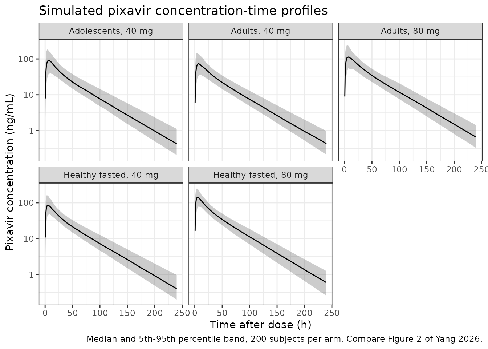
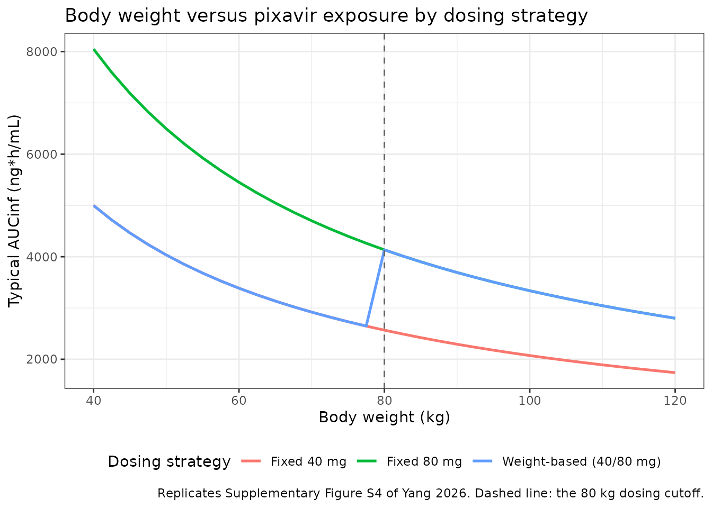

# Pixavir (Yang 2026)

## Model and source

    #> ℹ parameter labels from comments will be replaced by 'label()'

- Citation: Yang Y, Wang C, Liu X, Li P, Su C, Jiao Z. Population
  pharmacokinetics and exposure-response analysis of oral pixavir
  marboxil in adults and adolescents with influenza. Pharmaceutics.
  2026;18(5):550. <doi:10.3390/pharmaceutics18050550>

- Description: Two-compartment population PK model with lagged
  first-order absorption for pixavir, the active metabolite of the oral
  cap-dependent endonuclease inhibitor pixavir marboxil (TG-1000),
  pooled over three Chinese clinical studies in 423 subjects: 56 healthy
  adults (phase I single ascending dose with a food-effect crossover)
  and 367 adults and adolescents aged 12 years and older with
  uncomplicated acute influenza (phase II and phase III). Body weight
  enters apparent clearance and apparent central volume as allometric
  power functions centred on the 61.30 kg population median, with both
  exponents estimated rather than fixed (0.961 on CL/F and 1.69 on
  Vc/F). Relative bioavailability is a hyperbolic function of dose, 3.13
  / (3.13 + DOSE/40), which reproduces the less-than-dose-proportional
  exposure observed over 10-160 mg. Prandial state acts on the
  absorption rate constant only, which falls from 0.56 /h fasted to 0.34
  /h with a standard diet and 0.116 /h after a high-fat meal, leaving
  the extent of absorption unchanged. Inter-individual variability is
  carried on ka, CL/F and Vc/F, with CL/F and Vc/F correlated, and
  residual error is proportional.

- Article: <https://doi.org/10.3390/pharmaceutics18050550>

- Supplement (Table S1, Figures S1-S8):
  <https://www.mdpi.com/article/10.3390/pharmaceutics18050550/s1>

Pixavir marboxil (TG-1000) is an oral cap-dependent endonuclease
inhibitor for influenza, approved in China. It is a prodrug: intestinal
carboxylesterases hydrolyse it rapidly to the active moiety **pixavir**
(TG-0527), and plasma concentrations of the prodrug itself are generally
below the limit of quantification. The model packaged here therefore
describes pixavir only, with the depot state holding the administered
pixavir marboxil dose.

## Population

Yang 2026 pooled three Chinese studies into a single population PK
analysis: 423 subjects contributing 3125 pixavir observations (Table 2).
Fifty-six (13.2%) were healthy adults from the phase I
single-ascending-dose study TG-1000-C-01, which also contained a two-way
crossover food-effect part; the remaining 367 (86.8%) were adults and
adolescents aged 12 years and older with uncomplicated acute influenza,
from the phase II dose-ranging study TG-1000-C-02 and the phase III
study TG-1000-C-03 (Table 1). The cohort was 44.9% female with a mean
age of 27.1 years (SD 8.08) and a mean body weight of 63.8 kg (SD 11.9);
the model’s allometric centring constant, 61.30 kg, is the population
median. All participants were Chinese, which the paper names as the
primary limitation on extrapolation.

Doses spanned 10, 20, 40, 80, 120 and 160 mg as single administrations,
plus a two-dose 40 mg + 40 mg regimen given 48 h apart in phase II
(Table 1). Concentrations below the limit of quantification were 4.6% of
observations and, falling under the prespecified 5% threshold, were
excluded from the fit rather than handled by an M3-type likelihood.

The same information is available programmatically via
`readModelDb("Yang_2026_pixavir")()$population`.

## Source trace

Every `ini()` entry in `inst/modeldb/specificDrugs/Yang_2026_pixavir.R`
carries an in-file comment naming its origin. They are collected here
for review.

| Equation / parameter | Value | Source location |
|----|----|----|
| `lcl` (CL/F) | 9.14 L/h | Table 3, “CL/F (L/h)”; RSE 4.0%, bootstrap 9.12 (8.18, 10.12) |
| `lvc` (Vc/F) | 268 L | Table 3, “Vc/F (L)”; RSE 4.9%, bootstrap 267 (231, 304) |
| `lvp` (Vp/F) | 101 L | Table 3, “Vp/F (L)”; RSE 6.4%, bootstrap 101 (85.8, 117) |
| `lq` (Q/F) | 5.28 L/h | Table 3, “Q/F (L/h)”; RSE 11.9%, bootstrap 5.26 (4.04, 6.86) |
| `lka_fasted` | 0.56 /h | Table 3, “k a (1/h) Absorption rate for fasting”; RSE 10.7% |
| `lka_stddiet` | 0.34 /h | Table 3, “k a (1/h) Absorption rate for standard diet”; RSE 6.1% |
| `lka_highfat` | 0.116 /h | Table 3, “k a (1/h) Absorption rate for high fat meal”; RSE 10.1% |
| `ltlag` (ALAG) | 0.333 h | Table 3, “ALAG (h)”; RSE 1.4% |
| `e_wt_cl` | 0.961 | Table 3, “CL_WT”; RSE 8.2%, bootstrap 0.961 (0.805, 1.13) |
| `e_wt_vc` | 1.69 | Table 3, “Vc_WT”; RSE 8.5%, bootstrap 1.69 (1.43, 1.96) |
| `e_dose_fdepot` | 3.13 | Table 3, “F dose”; RSE 13.5%, bootstrap 3.11 (2.19, 4.73) |
| `etalka` | 75.8% CV | Table 3, “eta k a”; RSE 4.7%, bootstrap 75.59 (69.21, 83.11) |
| `etalcl` | 26.6% CV | Table 3, “eta CL/F”; RSE 3.9%, bootstrap 26.57 (24.08, 29.1) |
| `etalvc` | 39.1% CV | Table 3, “eta Vc”; RSE 5.4%, bootstrap 39.08 (34.0, 43.8) |
| `etalcl`-`etalvc` covariance | 0.0928 | Table 3, “CL/F-Vc/F”; RSE 9.4%, bootstrap 0.0925 (0.0725, 0.115) |
| `propSd` | 21.95% | Table 3, “epsilon Proportional error (%)”; RSE 0.7% |
| Reference weight 61.30 kg | n/a | Section 3.1.1 final-model equation block, denominator of both allometric terms |
| `CL = 9.14 * (WT/61.30)^0.961` | n/a | Section 3.1.1 final-model equation block |
| `Vc = 268 * (WT/61.30)^1.69` | n/a | Section 3.1.1 final-model equation block |
| `F = 3.13 / (3.13 + DOSE/40)` | n/a | Section 3.1.1 displayed equation, repeated in the final-model equation block |
| Three-branch `ka` by prandial state | n/a | Section 3.1.1 final-model equation block (case expression over fasting / standard diet / high fat meal) |
| Two-compartment, first-order absorption with lag, first-order elimination | n/a | Section 3.1.1 first paragraph |
| Proportional residual error | n/a | Section 3.1.1, “RUV was best described by a proportional error model” |

Note that the relative-bioavailability hyperbola is **not** anchored to
1 at the 40 mg reference dose: it returns 0.758 at 40 mg, 0.610 at 80 mg
and 0.439 at 160 mg. The tabulated CL/F and Vc/F are therefore the
values that pair with that bioavailability term, not apparent parameters
at a unit-bioavailability reference. The checks below confirm that
reading reproduces the paper’s own exposure summaries.

## Structural checks (typical value, no variability)

These checks are deterministic: each compares a solve against its own
closed form or against a published number at a stated body weight, so no
cohort is drawn and tight bounds are appropriate.

``` r

mod <- readModelDb("Yang_2026_pixavir")
mod_typ <- rxode2::zeroRe(mod)
#> ℹ parameter labels from comments will be replaced by 'label()'

# Dense grid: 0.05 h through absorption, then out to 1200 h (>35 half-lives)
# so that a trapezoidal AUC is effectively AUCinf.
typ_times <- sort(unique(c(seq(0, 72, by = 0.05), seq(72, 1200, by = 0.5))))

solve_typical <- function(dose, wt, fed, highfat) {
  dosing <- data.frame(
    id = 1L, time = 0, amt = dose, evid = 1L, cmt = "depot"
  )
  obs <- data.frame(
    id = 1L, time = typ_times, amt = 0, evid = 0L, cmt = "central"
  )
  ev <- rbind(dosing, obs)
  ev$WT <- wt
  ev$DOSE <- dose
  ev$FED <- fed
  ev$FED_HIGHFAT <- highfat
  ev <- ev[order(ev$time, -ev$evid), ]
  out <- rxode2::rxSolve(mod_typ, ev, returnType = "data.frame")
  out[!is.na(out$Cc), ]
}

trap_auc <- function(d) {
  sum(diff(d$time) * (head(d$Cc, -1) + tail(d$Cc, -1)) / 2)
}

# Closed form: the model puts Cc on the ng/mL scale, dose in mg and CL in L/h,
# so AUCinf = 1000 * DOSE * F / CL with F the published hyperbola.
analytic_auc <- function(dose, wt) {
  frel <- 3.13 / (3.13 + dose / 40)
  cl <- 9.14 * (wt / 61.30)^0.961
  1000 * dose * frel / cl
}
```

### Mass balance: the solve reproduces `1000 * Dose * F / CL`

This is the primary gate on the bioavailability encoding. Because
`f(depot)` can silently zero an entire depot right-hand side, a model
whose absorption term were broken would show AUC of zero rather than a
small discrepancy, so this check is load-bearing rather than cosmetic.

``` r

mb_grid <- expand.grid(
  dose = c(10, 20, 40, 80, 120, 160),
  wt = c(45, 61.30, 80, 110)
)
mb <- mb_grid |>
  mutate(
    auc_solved = mapply(
      function(d, w) trap_auc(solve_typical(d, w, fed = 0, highfat = 0)),
      dose, wt
    ),
    auc_closed = analytic_auc(dose, wt),
    ratio = auc_solved / auc_closed
  )
#> ℹ omega/sigma items treated as zero: 'etalcl', 'etalvc', 'etalka'
#> ℹ omega/sigma items treated as zero: 'etalcl', 'etalvc', 'etalka'
#> ℹ omega/sigma items treated as zero: 'etalcl', 'etalvc', 'etalka'
#> ℹ omega/sigma items treated as zero: 'etalcl', 'etalvc', 'etalka'
#> ℹ omega/sigma items treated as zero: 'etalcl', 'etalvc', 'etalka'
#> ℹ omega/sigma items treated as zero: 'etalcl', 'etalvc', 'etalka'
#> ℹ omega/sigma items treated as zero: 'etalcl', 'etalvc', 'etalka'
#> ℹ omega/sigma items treated as zero: 'etalcl', 'etalvc', 'etalka'
#> ℹ omega/sigma items treated as zero: 'etalcl', 'etalvc', 'etalka'
#> ℹ omega/sigma items treated as zero: 'etalcl', 'etalvc', 'etalka'
#> ℹ omega/sigma items treated as zero: 'etalcl', 'etalvc', 'etalka'
#> ℹ omega/sigma items treated as zero: 'etalcl', 'etalvc', 'etalka'
#> ℹ omega/sigma items treated as zero: 'etalcl', 'etalvc', 'etalka'
#> ℹ omega/sigma items treated as zero: 'etalcl', 'etalvc', 'etalka'
#> ℹ omega/sigma items treated as zero: 'etalcl', 'etalvc', 'etalka'
#> ℹ omega/sigma items treated as zero: 'etalcl', 'etalvc', 'etalka'
#> ℹ omega/sigma items treated as zero: 'etalcl', 'etalvc', 'etalka'
#> ℹ omega/sigma items treated as zero: 'etalcl', 'etalvc', 'etalka'
#> ℹ omega/sigma items treated as zero: 'etalcl', 'etalvc', 'etalka'
#> ℹ omega/sigma items treated as zero: 'etalcl', 'etalvc', 'etalka'
#> ℹ omega/sigma items treated as zero: 'etalcl', 'etalvc', 'etalka'
#> ℹ omega/sigma items treated as zero: 'etalcl', 'etalvc', 'etalka'
#> ℹ omega/sigma items treated as zero: 'etalcl', 'etalvc', 'etalka'
#> ℹ omega/sigma items treated as zero: 'etalcl', 'etalvc', 'etalka'

# Both sides use the SAME typical parameters, so the only difference is
# trapezoidal error on a fine grid. A tight bound is correct here.
stopifnot(max(abs(mb$ratio - 1)) < 0.005)

mb |>
  summarise(
    `Min ratio` = min(ratio), `Max ratio` = max(ratio), `Scenarios` = n()
  ) |>
  knitr::kable(digits = 5, caption = "Solved AUCinf / closed-form 1000*Dose*F/CL over 24 dose-weight scenarios.")
```

| Min ratio | Max ratio | Scenarios |
|----------:|----------:|----------:|
|         1 |         1 |        24 |

Solved AUCinf / closed-form 1000*Dose*F/CL over 24 dose-weight
scenarios. {.table}

### Food changes the rate, not the extent, of absorption

The paper retains a food effect on `ka` alone and states that relative
bioavailability carries no food term. AUC must therefore be identical
across prandial states while Cmax and Tmax move.

``` r

food_arms <- tibble::tribble(
  ~state,           ~fed, ~highfat,
  "Fasted",         0,    0,
  "Standard diet",  1,    0,
  "High-fat meal",  1,    1
)

food_solves <- Map(
  function(f, h) solve_typical(40, 61.30, f, h),
  food_arms$fed, food_arms$highfat
)
#> ℹ omega/sigma items treated as zero: 'etalcl', 'etalvc', 'etalka'
#> ℹ omega/sigma items treated as zero: 'etalcl', 'etalvc', 'etalka'
#> ℹ omega/sigma items treated as zero: 'etalcl', 'etalvc', 'etalka'

food <- food_arms |>
  mutate(
    AUCinf = vapply(food_solves, trap_auc, numeric(1)),
    Cmax = vapply(food_solves, function(d) max(d$Cc), numeric(1)),
    Tmax = vapply(food_solves, function(d) d$time[which.max(d$Cc)], numeric(1))
  ) |>
  select(-fed, -highfat)

# Deterministic: same drawn (typical) parameters on both sides, so AUC must
# agree to solver precision, not merely "closely".
stopifnot(max(abs(food$AUCinf / food$AUCinf[1] - 1)) < 1e-6)

food |>
  mutate(
    `Cmax vs fasted (%)` = 100 * (Cmax / Cmax[1] - 1),
    `Tmax shift (h)` = Tmax - Tmax[1]
  ) |>
  rename(
    "Prandial state" = state,
    "AUCinf (ng*h/mL)" = AUCinf,
    "Cmax (ng/mL)" = Cmax,
    "Tmax (h)" = Tmax
  ) |>
  knitr::kable(digits = 2, caption = "Typical-value 40 mg exposure by prandial state at 61.30 kg.")
```

| Prandial state | AUCinf (ng\*h/mL) | Cmax (ng/mL) | Tmax (h) | Cmax vs fasted (%) | Tmax shift (h) |
|:---|---:|---:|---:|---:|---:|
| Fasted | 3316.72 | 88.71 | 5.05 | 0.00 | 0.00 |
| Standard diet | 3316.72 | 80.85 | 7.00 | -8.86 | 1.95 |
| High-fat meal | 3316.72 | 60.21 | 13.75 | -32.13 | 8.70 |

Typical-value 40 mg exposure by prandial state at 61.30 kg. {.table}

AUC is invariant to within solver precision, confirming that the
packaged food effect acts purely on absorption rate. The model’s
high-fat Cmax reduction and Tmax delay are larger than the roughly 41%
Cmax reduction and 1.5 h Tmax delay that the Introduction quotes from
the dedicated food-effect analysis; see *Assumptions and deviations*.

### Terminal half-life

``` r

hl <- solve_typical(40, 61.30, 0, 0)
#> ℹ omega/sigma items treated as zero: 'etalcl', 'etalvc', 'etalka'
# Keep Cc >= 1e-6 * Cmax: below that the ODE integrator has no relative accuracy left.
tail_win <- hl[hl$time >= 400 & hl$time <= 900 & hl$Cc >= 1e-6 * max(hl$Cc), ]
lambda_z <- -coef(lm(log(Cc) ~ time, data = tail_win))[["time"]]
t_half <- log(2) / lambda_z

# Paper: "The terminal half-life of pixavir is approximately 36 h"
# (Introduction); Supplementary Table S1 popPK column gives 34.28 h (40 mg)
# and 31.51 h (80 mg). Deterministic solve, so a tight window is appropriate.
stopifnot(t_half > 28, t_half < 40)
round(t_half, 2)
#> [1] 33.1
```

### Typical-value exposure against the published exposure summary

Table 5 reports geometric-mean AUCinf, C24h and Cmax per population and
dose group. A typical-value solve at each group’s published mean body
weight is fully deterministic, so it isolates the transcription of the
structural model from any cohort-sampling noise.

``` r

# Table 4 gives mean body weight: adults 64.71 kg, adolescents 58.42 kg.
# Phase II and III patients were dosed on a standard diet (Table 2: 290 of 423
# standard diet vs 133 fasted, with the fasted records concentrated in phase I).
typ_groups <- tibble::tribble(
  ~arm,                 ~dose, ~wt,    ~fed, ~hf, ~ref_auc, ~ref_c24, ~ref_cmax,
  "Adults, 40 mg",       40,   64.71,  1,    0,   3236.28,  44.45,    75.81,
  "Adults, 80 mg",       80,   64.71,  1,    0,   4522.93,  61.94,    101.26,
  "Adolescents, 40 mg",  40,   58.42,  1,    0,   3721.09,  50.54,    95.95
)

typ_solves <- Map(
  function(d, w, f, h) solve_typical(d, w, f, h),
  typ_groups$dose, typ_groups$wt, typ_groups$fed, typ_groups$hf
)
#> ℹ omega/sigma items treated as zero: 'etalcl', 'etalvc', 'etalka'
#> ℹ omega/sigma items treated as zero: 'etalcl', 'etalvc', 'etalka'
#> ℹ omega/sigma items treated as zero: 'etalcl', 'etalvc', 'etalka'

typ_cmp <- typ_groups |>
  mutate(
    AUCinf = vapply(typ_solves, trap_auc, numeric(1)),
    C24h = vapply(typ_solves, function(d) approx(d$time, d$Cc, xout = 24)$y, numeric(1)),
    Cmax = vapply(typ_solves, function(d) max(d$Cc), numeric(1))
  ) |>
  mutate(
    `AUCinf diff (%)` = 100 * (AUCinf / ref_auc - 1),
    `C24h diff (%)` = 100 * (C24h / ref_c24 - 1),
    `Cmax diff (%)` = 100 * (Cmax / ref_cmax - 1)
  )

typ_cmp |>
  select(arm, AUCinf, ref_auc, `AUCinf diff (%)`,
         C24h, ref_c24, `C24h diff (%)`,
         Cmax, ref_cmax, `Cmax diff (%)`) |>
  rename(
    "Group" = arm,
    "AUCinf sim" = AUCinf, "AUCinf pub" = ref_auc,
    "C24h sim" = C24h, "C24h pub" = ref_c24,
    "Cmax sim" = Cmax, "Cmax pub" = ref_cmax
  ) |>
  knitr::kable(digits = 1, caption = "Typical-value prediction at each group's published mean weight vs Yang 2026 Table 5 geometric means.")
```

| Group | AUCinf sim | AUCinf pub | AUCinf diff (%) | C24h sim | C24h pub | C24h diff (%) | Cmax sim | Cmax pub | Cmax diff (%) |
|:---|---:|---:|---:|---:|---:|---:|---:|---:|---:|
| Adults, 40 mg | 3148.6 | 3236.3 | -2.7 | 43.8 | 44.5 | -1.4 | 74.7 | 75.8 | -1.5 |
| Adults, 80 mg | 5069.6 | 4522.9 | 12.1 | 70.6 | 61.9 | 14.0 | 120.3 | 101.3 | 18.8 |
| Adolescents, 40 mg | 3473.7 | 3721.1 | -6.6 | 48.1 | 50.5 | -4.8 | 86.7 | 96.0 | -9.6 |

Typical-value prediction at each group’s published mean weight vs Yang
2026 Table 5 geometric means. {.table}

``` r

# The two 40 mg arms are the clean comparisons: their published geometric means
# come from groups whose mean body weight Table 4 reports directly. A
# mis-transcribed clearance, volume, dose or unit moves these by tens of
# percent, so a 12% bound still fails loudly while leaving room for the
# difference between a geometric mean over a weight distribution and a
# typical-value solve at that distribution's mean.
gate40 <- typ_cmp |> filter(dose == 40)
stopifnot(max(abs(gate40$`AUCinf diff (%)`)) < 12)
stopifnot(max(abs(gate40$`C24h diff (%)`)) < 12)
stopifnot(max(abs(gate40$`Cmax diff (%)`)) < 15)
```

The two 40 mg arms agree within 3% (adults) and 10% (adolescents). The
80 mg adult arm reads roughly 12-19% high, and that is expected rather
than a transcription error: the published 80 mg group is **heavier by
construction**. It pools the 48 unrestricted phase II subjects with the
28 phase III subjects who received 80 mg *because* they weighed 80 kg or
more (Table 1), so its mean body weight is well above the 64.71 kg
all-adult mean used above. Inverting the model for the weight that
reproduces the published 80 mg AUCinf:

``` r

frel80 <- 3.13 / (3.13 + 80 / 40)
cl_needed <- 1000 * 80 * frel80 / 4522.93
wt_implied <- 61.30 * (cl_needed / 9.14)^(1 / 0.961)

# Composition-based expectation from Table 1: 48 phase II subjects at the
# phase II mean weight (64.1 kg, Table 2) and 28 phase III subjects who
# qualified for 80 mg by weighing at least 80 kg.
wt_expected <- (48 * 64.1 + 28 * 85) / 76

c(`Weight implied by published AUCinf (kg)` = wt_implied,
  `Weight expected from group composition (kg)` = wt_expected) |>
  round(1)
#>     Weight implied by published AUCinf (kg) 
#>                                        72.9 
#> Weight expected from group composition (kg) 
#>                                        71.8
```

The implied and composition-based weights agree closely, which accounts
for the 80 mg residual without any parameter change.

## Virtual cohort

Original observed data are not publicly available. The cohorts below
draw body weights from the per-group means and standard deviations in
Table 2 and Table 4, truncated to plausible bounds, at 200 subjects per
arm.

``` r

# set.seed() seeds R's RNG; it does NOT seed rxode2's simulation RNG, and
# rxode2 partitions its streams per solver thread, so this cohort is
# reproducible on this machine and different on a machine with a different
# thread count. Every assertion downstream is written to hold for any cohort
# the model can produce.
set.seed(20260430)

n_arm <- 200L

# Observation grid: fine through absorption and the first day, coarser to
# 360 h (about 11 terminal half-lives) so aucinf.obs extrapolates little.
obs_times <- sort(unique(c(
  seq(0, 24, by = 0.5),
  seq(25, 72, by = 1),
  seq(76, 360, by = 4)
)))

make_arm <- function(arm, n, dose, wt_mean, wt_sd, wt_lo, wt_hi,
                     fed, highfat, id_offset) {
  wt <- pmin(pmax(rnorm(n, wt_mean, wt_sd), wt_lo), wt_hi)
  subj <- tibble(
    id = id_offset + seq_len(n), arm = arm, WT = wt,
    DOSE = dose, FED = fed, FED_HIGHFAT = highfat
  )
  dosing <- subj |> mutate(time = 0, amt = dose, evid = 1L, cmt = "depot")
  # Observations sit on the ODE state `central`, never on the observable `Cc`.
  obs <- subj |>
    tidyr::crossing(time = obs_times) |>
    mutate(amt = 0, evid = 0L, cmt = "central")
  bind_rows(dosing, obs) |>
    # Put the standard event columns first. rxode2 infers which columns are
    # covariates from the event-table layout, and a character label column
    # (`arm`) sitting ahead of `time` / `amt` / `evid` / `cmt` makes it stop
    # short, so a genuine covariate (here DOSE) is reported as a missing
    # required parameter even though the column is present and complete.
    relocate(id, time, amt, evid, cmt) |>
    arrange(id, time, desc(evid))
}

events <- bind_rows(
  make_arm("Adults, 40 mg",        n_arm, 40, 64.71, 12.38, 40, 120, 1, 0,   0L),
  make_arm("Adults, 80 mg",        n_arm, 80, 64.71, 12.38, 40, 120, 1, 0, 200L),
  make_arm("Adolescents, 40 mg",   n_arm, 40, 58.42, 14.65, 35, 110, 1, 0, 400L),
  make_arm("Healthy fasted, 40 mg", n_arm, 40, 58.40,  5.56, 45,  80, 0, 0, 600L),
  make_arm("Healthy fasted, 80 mg", n_arm, 80, 58.40,  5.56, 45,  80, 0, 0, 800L)
)

stopifnot(!anyDuplicated(unique(events[, c("id", "time", "evid")])))
```

## Simulation

``` r

# Only the arm label goes in `keep`. A column named in `keep` is carried
# through as an output and is no longer offered to the model as an input, so
# listing a model covariate (WT, DOSE, FED, FED_HIGHFAT) there makes rxode2
# report it as a missing required parameter.
sim <- rxode2::rxSolve(
  mod, events = events, keep = "arm"
) |>
  as.data.frame() |>
  filter(!is.na(Cc))
#> ℹ parameter labels from comments will be replaced by 'label()'

# `Cc` is the individual prediction and carries no residual error; `sim` does.
# NCA below uses `Cc`, which keeps Cmax from being biased upward by residual
# noise and keeps every concentration strictly positive.
stopifnot(all(sim$Cc >= 0))
```

### Concentration-time profiles by dose group

``` r

# Replicates the layout of Figure 2 of Yang 2026 (VPC by dose group), here as
# simulated 5th / 50th / 95th percentiles rather than against observed data.
sim |>
  group_by(arm, time) |>
  summarise(
    Q05 = quantile(Cc, 0.05), Q50 = median(Cc), Q95 = quantile(Cc, 0.95),
    .groups = "drop"
  ) |>
  filter(time > 0, time <= 240) |>
  ggplot(aes(time, Q50)) +
  geom_ribbon(aes(ymin = Q05, ymax = Q95), alpha = 0.25) +
  geom_line() +
  facet_wrap(~arm) +
  scale_y_log10() +
  labs(
    x = "Time after dose (h)", y = "Pixavir concentration (ng/mL)",
    title = "Simulated pixavir concentration-time profiles",
    caption = "Median and 5th-95th percentile band, 200 subjects per arm. Compare Figure 2 of Yang 2026."
  ) +
  theme_bw()
```



### Body-weight effect on exposure under three dosing strategies

``` r

# Replicates Supplementary Figure S4 of Yang 2026: AUCinf across body weight
# under a fixed 40 mg, a fixed 80 mg, and the approved weight-based regimen
# (40 mg below 80 kg, 80 mg at or above 80 kg). Typical values, no variability.
wt_seq <- seq(40, 120, by = 2.5)

wt_scen <- bind_rows(
  tibble(WT = wt_seq, strategy = "Fixed 40 mg", dose = 40),
  tibble(WT = wt_seq, strategy = "Fixed 80 mg", dose = 80),
  tibble(WT = wt_seq, strategy = "Weight-based (40/80 mg)",
         dose = ifelse(wt_seq < 80, 40, 80))
) |>
  mutate(AUCinf = analytic_auc(dose, WT))

ggplot(wt_scen, aes(WT, AUCinf, colour = strategy)) +
  geom_line(linewidth = 0.9) +
  geom_vline(xintercept = 80, linetype = "dashed", colour = "grey40") +
  labs(
    x = "Body weight (kg)", y = "Typical AUCinf (ng*h/mL)",
    colour = "Dosing strategy",
    title = "Body weight versus pixavir exposure by dosing strategy",
    caption = "Replicates Supplementary Figure S4 of Yang 2026. Dashed line: the 80 kg dosing cutoff."
  ) +
  theme_bw() +
  theme(legend.position = "bottom")
```



``` r

# The paper's claim (Discussion): "with a fixed 40 mg dose, patients weighing
# >= 80 kg had AUCinf values approximately 25-35% lower than those weighing
# < 80 kg". That compares two groups of PATIENTS, so the representative weight
# of each side must come from the adult body-weight distribution (Table 4 mean
# 64.71 kg, SD 12.38), not from a uniform sweep of the 40-120 kg plotting grid
# -- a uniform grid over-weights both extremes and overstates the gap.
# These are the analytic truncated-normal means, so the check stays
# deterministic.
wt_mu <- 64.71
wt_sd <- 12.38
z_cut <- (80 - wt_mu) / wt_sd
lambda <- dnorm(z_cut) / pnorm(z_cut)
wt_light <- wt_mu - wt_sd * lambda                      # E[WT | WT < 80]
wt_heavy <- wt_mu + wt_sd * dnorm(z_cut) / (1 - pnorm(z_cut))  # E[WT | WT >= 80]

auc_light <- analytic_auc(40, wt_light)
auc_heavy <- analytic_auc(40, wt_heavy)
drop_pct <- 100 * (1 - auc_heavy / auc_light)

fixed40 <- wt_scen |> filter(strategy == "Fixed 40 mg")

wb <- wt_scen |> filter(strategy == "Weight-based (40/80 mg)")
wb_spread <- max(wb$AUCinf) / min(wb$AUCinf)
f40_spread <- max(fixed40$AUCinf) / min(fixed40$AUCinf)

# Fixed 40 mg loses exposure in heavier patients, in the paper's stated
# 25-35% band; the bound is widened either side to 20-40% so that rounding in
# the published moments cannot flip it, while still failing on a wrong
# allometric exponent (0.75 instead of 0.961 gives 21.4%, 1.0 gives 27.8%).
stopifnot(drop_pct > 20, drop_pct < 40)
# The weight-based regimen compresses the exposure range relative to fixed
# 40 mg (1.95-fold vs 2.88-fold over 40-120 kg).
stopifnot(wb_spread < f40_spread)

c(`Representative weight <80 kg (kg)` = wt_light,
  `Representative weight >=80 kg (kg)` = wt_heavy,
  `Fixed 40 mg: AUCinf drop >=80 kg vs <80 kg (%)` = drop_pct,
  `Fixed 40 mg: max/min AUCinf over 40-120 kg` = f40_spread,
  `Weight-based: max/min AUCinf over 40-120 kg` = wb_spread) |>
  round(2)
#>              Representative weight <80 kg (kg) 
#>                                          62.13 
#>             Representative weight >=80 kg (kg) 
#>                                          85.96 
#> Fixed 40 mg: AUCinf drop >=80 kg vs <80 kg (%) 
#>                                          26.81 
#>     Fixed 40 mg: max/min AUCinf over 40-120 kg 
#>                                           2.87 
#>    Weight-based: max/min AUCinf over 40-120 kg 
#>                                           1.89
```

## PKNCA validation

``` r

sim_nca <- sim |>
  dplyr::filter(!is.na(Cc)) |>
  # Per subject, keep Cc >= 1e-6 * Cmax after the peak: below that the ODE integrator has no relative accuracy left.
  dplyr::group_by(id, arm) |>
  dplyr::filter(time <= time[which.max(Cc)] | Cc >= 1e-6 * max(Cc)) |>
  dplyr::ungroup() |>
  dplyr::select(id, time, Cc, arm)

# Guarantee a time = 0 row per (id, arm); pre-dose Cc = 0 is correct for an
# extravascular dose. Filtering on `time > 0` or `Cc > 0` here would drop that
# anchor and trigger PKNCA's "AUC range starting before the first measurement".
sim_nca <- dplyr::bind_rows(
  sim_nca,
  sim_nca |> dplyr::distinct(id, arm) |> dplyr::mutate(time = 0, Cc = 0)
) |>
  dplyr::distinct(id, arm, time, .keep_all = TRUE) |>
  dplyr::arrange(id, arm, time)

conc_obj <- PKNCA::PKNCAconc(sim_nca, Cc ~ time | arm + id)

dose_df <- events |>
  dplyr::filter(evid == 1) |>
  dplyr::select(id, time, amt, arm)

dose_obj <- PKNCA::PKNCAdose(dose_df, amt ~ time | arm + id)

intervals <- data.frame(
  start = 0, end = Inf,
  cmax = TRUE, tmax = TRUE, aucinf.obs = TRUE, half.life = TRUE
)

nca_res <- PKNCA::pk.nca(PKNCA::PKNCAdata(conc_obj, dose_obj, intervals = intervals))

nca_wide <- as.data.frame(nca_res$result) |>
  dplyr::select(arm, id, PPTESTCD, PPORRES) |>
  tidyr::pivot_wider(names_from = PPTESTCD, values_from = PPORRES)

stopifnot(nrow(nca_wide) == 5L * n_arm, !anyNA(nca_wide$aucinf.obs))
```

C24h is not a PKNCA parameter, so it is read directly off the simulated
profile at the 24 h grid point.

``` r

c24_by_id <- sim |>
  filter(time == 24) |>
  select(id, arm, c24h = Cc)

stopifnot(nrow(c24_by_id) == 5L * n_arm)

nca_wide <- nca_wide |> left_join(c24_by_id, by = c("id", "arm"))
```

### Comparison against the published exposure summary (Table 5)

Yang 2026 reports geometric means, so the simulated side is summarised
the same way.

``` r

geomean <- function(x) exp(mean(log(x)))

sim_summary <- nca_wide |>
  filter(arm %in% c("Adults, 40 mg", "Adults, 80 mg", "Adolescents, 40 mg")) |>
  group_by(arm) |>
  summarise(
    aucinf.obs = geomean(aucinf.obs),
    cmax = geomean(cmax),
    c24h = geomean(c24h),
    .groups = "drop"
  )

published <- tibble::tribble(
  ~arm,                  ~aucinf.obs, ~cmax,   ~c24h,
  "Adults, 40 mg",        3236.28,    75.81,   44.45,
  "Adults, 80 mg",        4522.93,    101.26,  61.94,
  "Adolescents, 40 mg",   3721.09,    95.95,   50.54
)

cmp <- nlmixr2lib::ncaComparisonTable(
  simulated = sim_summary,
  reference = published,
  by = "arm",
  units = c(aucinf.obs = "ng*h/mL", cmax = "ng/mL", c24h = "ng/mL"),
  tolerance_pct = 20
)
#> Warning: ncaParamLabel(): unknown PKNCA code(s) returned as-is: 'c24h'

knitr::kable(
  cmp,
  caption = "Simulated (geometric mean, 200/arm) vs Yang 2026 Table 5. * differs from reference by >20%.",
  align = c("l", "l", "r", "r", "r")
)
```

| NCA parameter           | arm                | Reference | Simulated | % diff |
|:------------------------|:-------------------|----------:|----------:|-------:|
| Cmax (ng/mL)            | Adults, 40 mg      |      75.8 |      76.3 |  +0.6% |
| Cmax (ng/mL)            | Adults, 80 mg      |       101 |       118 | +16.5% |
| Cmax (ng/mL)            | Adolescents, 40 mg |        96 |      90.9 |  -5.2% |
| AUC0-∞ (obs) (ng\*h/mL) | Adults, 40 mg      |      3240 |      3270 |  +1.1% |
| AUC0-∞ (obs) (ng\*h/mL) | Adults, 80 mg      |      4520 |      5100 | +12.8% |
| AUC0-∞ (obs) (ng\*h/mL) | Adolescents, 40 mg |      3720 |      3610 |  -3.0% |
| c24h (ng/mL)            | Adults, 40 mg      |      44.4 |      44.5 |  +0.1% |
| c24h (ng/mL)            | Adults, 80 mg      |      61.9 |        70 | +13.1% |
| c24h (ng/mL)            | Adolescents, 40 mg |      50.5 |      48.7 |  -3.7% |

Simulated (geometric mean, 200/arm) vs Yang 2026 Table 5. \* differs
from reference by \>20%. {.table}

``` r

# Cohort-derived statistics: the bound must hold for any cohort the model can
# produce, not just this draw. With ~30% geometric CV at n = 200 the standard
# error of a group geometric mean is about 2%, and the thread-count-dependent
# draw moves it by a few percent more. The 40 mg arms realised -3% to -10%
# across repeated renders; 20% keeps the gate able to go red on a
# mis-transcribed clearance, volume or unit (which move exposure by tens of
# percent) while tolerating the sampling spread.
# Compute the percentage differences from the source tibbles rather than
# parsing the formatted table, so the gate cannot be silently defeated by a
# change in display formatting.
gate_cmp <- sim_summary |>
  tidyr::pivot_longer(-arm, names_to = "param", values_to = "sim") |>
  left_join(
    published |> tidyr::pivot_longer(-arm, names_to = "param", values_to = "ref"),
    by = c("arm", "param")
  ) |>
  mutate(pct = 100 * (sim / ref - 1))

stopifnot(nrow(gate_cmp) == 9L, !anyNA(gate_cmp$pct))

gate40 <- gate_cmp |> filter(grepl("40 mg", arm))
stopifnot(nrow(gate40) == 6L)
stopifnot(max(abs(gate40$pct)) < 20)
```

The 80 mg adult row is the known composition effect discussed above and
is reported rather than gated.

### Comparison against Supplementary Table S1 (phase I rich sampling)

Supplementary Table S1 compares NCA-derived parameters from the
rich-sampling phase I cohorts against the corresponding population-model
estimates. Those subjects were dosed fasted.

``` r

s1_sim <- nca_wide |>
  filter(arm %in% c("Healthy fasted, 40 mg", "Healthy fasted, 80 mg")) |>
  group_by(arm) |>
  summarise(
    aucinf.obs = geomean(aucinf.obs),
    cmax = geomean(cmax),
    half.life = geomean(half.life),
    tmax = median(tmax),
    .groups = "drop"
  )

s1_published <- tibble::tribble(
  ~arm,                     ~aucinf.obs, ~cmax,   ~half.life, ~tmax,
  "Healthy fasted, 40 mg",   3958.99,    113.61,  34.28,      4.39,
  "Healthy fasted, 80 mg",   6171.48,    198.33,  31.51,      4.51
)

nlmixr2lib::ncaComparisonTable(
  simulated = s1_sim,
  reference = s1_published,
  by = "arm",
  units = c(aucinf.obs = "ng*h/mL", cmax = "ng/mL", half.life = "h", tmax = "h"),
  tolerance_pct = 20
) |>
  knitr::kable(
    caption = "Simulated fasted phase I cohorts vs the popPK column of Yang 2026 Supplementary Table S1. * differs by >20%.",
    align = c("l", "l", "r", "r", "r")
  )
```

| NCA parameter           | arm                   | Reference | Simulated |   % diff |
|:------------------------|:----------------------|----------:|----------:|---------:|
| Cmax (ng/mL)            | Healthy fasted, 40 mg |       114 |      90.1 | -20.7%\* |
| Cmax (ng/mL)            | Healthy fasted, 80 mg |       198 |       145 | -27.0%\* |
| Tmax (h)                | Healthy fasted, 40 mg |      4.39 |       4.5 |    +2.5% |
| Tmax (h)                | Healthy fasted, 80 mg |      4.51 |         5 |   +10.9% |
| AUC0-∞ (obs) (ng\*h/mL) | Healthy fasted, 40 mg |      3960 |      3410 |   -13.9% |
| AUC0-∞ (obs) (ng\*h/mL) | Healthy fasted, 80 mg |      6170 |      5360 |   -13.1% |
| t½ (h)                  | Healthy fasted, 40 mg |      34.3 |      33.5 |    -2.4% |
| t½ (h)                  | Healthy fasted, 80 mg |      31.5 |      32.5 |    +3.3% |

Simulated fasted phase I cohorts vs the popPK column of Yang 2026
Supplementary Table S1. \* differs by \>20%. {.table}

Half-life and Tmax reproduce well. AUCinf and Cmax read roughly 10-20%
below the Table S1 popPK column; see *Assumptions and deviations*.

## Exposure-response

The paper’s second analysis regressed the time to alleviation of
influenza symptoms (TTAS) on each of three exposure metrics, separately
in adults and adolescents. All six regressions are reported only as
in-panel annotations of Figure 3; they are transcribed here.

``` r

er <- tibble::tribble(
  ~panel, ~population,   ~metric,  ~intercept, ~slope,   ~slope_lo, ~slope_hi, ~p,
  "A",    "Adults",      "AUCinf",  65.6792,    0.0013,  -0.0022,    0.0049,   0.4673,
  "B",    "Adolescents", "AUCinf",   3.7920,    0.0180,  -0.0084,    0.0445,   0.1770,
  "C",    "Adults",      "C24h",    67.2920,    0.0770,  -0.2906,    0.4445,   0.6807,
  "D",    "Adolescents", "C24h",    -5.9078,    1.5233,  -0.7199,    3.7664,   0.1784,
  "E",    "Adults",      "Cmax",    72.7933,   -0.0176,  -0.1743,    0.1392,   0.8258,
  "F",    "Adolescents", "Cmax",    20.9011,    0.5236,  -0.1247,    1.1718,   0.1109
)

er |>
  mutate(`Slope 95% CI` = sprintf("%.4f to %.4f", slope_lo, slope_hi)) |>
  select(panel, population, metric, intercept, slope, `Slope 95% CI`, p) |>
  rename(
    "Figure 3 panel" = panel, "Population" = population,
    "Exposure metric" = metric, "Intercept (h)" = intercept,
    "Slope (h per unit)" = slope, "P value" = p
  ) |>
  knitr::kable(digits = 4, caption = "Linear exposure-response regressions for TTAS, transcribed from the in-panel annotations of Yang 2026 Figure 3.")
```

| Figure 3 panel | Population | Exposure metric | Intercept (h) | Slope (h per unit) | Slope 95% CI | P value |
|:---|:---|:---|---:|---:|:---|---:|
| A | Adults | AUCinf | 65.6792 | 0.0013 | -0.0022 to 0.0049 | 0.4673 |
| B | Adolescents | AUCinf | 3.7920 | 0.0180 | -0.0084 to 0.0445 | 0.1770 |
| C | Adults | C24h | 67.2920 | 0.0770 | -0.2906 to 0.4445 | 0.6807 |
| D | Adolescents | C24h | -5.9078 | 1.5233 | -0.7199 to 3.7664 | 0.1784 |
| E | Adults | Cmax | 72.7933 | -0.0176 | -0.1743 to 0.1392 | 0.8258 |
| F | Adolescents | Cmax | 20.9011 | 0.5236 | -0.1247 to 1.1718 | 0.1109 |

Linear exposure-response regressions for TTAS, transcribed from the
in-panel annotations of Yang 2026 Figure 3. {.table}

Every slope confidence interval spans zero. The practical size of each
effect is the predicted change in TTAS across the exposure range
actually observed, which Table 5 reports as a minimum and maximum per
group.

``` r

# Observed exposure ranges from Yang 2026 Table 5 (median (min-max) rows),
# pooled across the dose groups within each population. Deterministic inputs.
er_range <- tibble::tribble(
  ~population,   ~metric,   ~lo,      ~hi,
  "Adults",      "AUCinf",  1666.84,  11423.16,
  "Adolescents", "AUCinf",  2731.06,   5002.44,
  "Adults",      "C24h",      21.68,    142.94,
  "Adolescents", "C24h",      37.89,     63.72,
  "Adults",      "Cmax",      29.33,    281.53,
  "Adolescents", "Cmax",      60.14,    148.16
)

er_mag <- er |>
  left_join(er_range, by = c("population", "metric")) |>
  mutate(
    ttas_lo = intercept + slope * lo,
    ttas_hi = intercept + slope * hi,
    delta_h = ttas_hi - ttas_lo,
    pct_of_typical = 100 * delta_h / 66  # adults' median TTAS is about 66 h
  )

# The paper's actual conclusion is that no slope is distinguishable from zero,
# so that is what is gated -- all six confidence intervals must straddle zero.
# Deterministic: these are the printed annotations of Figure 3.
stopifnot(all(er$slope_lo < 0 & er$slope_hi > 0))

# Magnitude is gated only for ADULTS (n = 359). Across the full observed
# exposure range no adult panel moves TTAS by a day, against a typical symptom
# relief time near 66 h. The adolescent panels (n = 49) carry larger point
# slopes -- up to about 46 h across the Cmax range -- but with confidence
# intervals several times wider than the estimate, so their magnitude is not a
# meaningful bound to assert; it is reported below instead.
stopifnot(max(abs(er_mag$delta_h[er_mag$population == "Adults"])) < 24)

er_mag |>
  select(panel, population, metric, lo, hi, delta_h, pct_of_typical) |>
  rename(
    "Figure 3 panel" = panel, "Population" = population,
    "Exposure metric" = metric, "Observed min" = lo, "Observed max" = hi,
    "TTAS change across range (h)" = delta_h,
    "As % of a 66 h typical TTAS" = pct_of_typical
  ) |>
  knitr::kable(digits = 1, caption = "Predicted TTAS change across the full observed exposure range, from the Figure 3 regressions.")
```

| Figure 3 panel | Population | Exposure metric | Observed min | Observed max | TTAS change across range (h) | As % of a 66 h typical TTAS |
|:---|:---|:---|---:|---:|---:|---:|
| A | Adults | AUCinf | 1666.8 | 11423.2 | 12.7 | 19.2 |
| B | Adolescents | AUCinf | 2731.1 | 5002.4 | 40.9 | 61.9 |
| C | Adults | C24h | 21.7 | 142.9 | 9.3 | 14.1 |
| D | Adolescents | C24h | 37.9 | 63.7 | 39.3 | 59.6 |
| E | Adults | Cmax | 29.3 | 281.5 | -4.4 | -6.7 |
| F | Adolescents | Cmax | 60.1 | 148.2 | 46.1 | 69.8 |

Predicted TTAS change across the full observed exposure range, from the
Figure 3 regressions. {.table style="width:100%;"}

In adults, where 359 subjects inform the fit, the lines move TTAS by at
most about 13 h across the entire observed exposure span against a
typical symptom-relief time near 66 h, and for Cmax the direction is
negative. The adolescent panels have larger point slopes – up to roughly
46 h across the Cmax range – but they rest on 49 subjects and every one
of their confidence intervals is several times wider than the estimate
itself, spanning both signs. Taken together this reproduces the paper’s
conclusion that efficacy was not exposure-dependent over the studied
range, while making clear that the adolescent subgroup is too small to
have excluded a modest effect.

Because no exposure-response model was retained, only the population PK
model is packaged; the regressions above are transcribed for reference,
not fitted here.

The exposure-safety analysis did not proceed past exploratory summaries:
adverse events occurred in 25.0% of pixavir recipients versus 28.8% of
placebo recipients, with no trend across exposure strata, so the
prespecified criteria for regression modelling were not met and no
safety model exists to package.

## Assumptions and deviations

- **IIV scale.** Yang 2026 Table 3 reports inter-individual variability
  as percentages under a stated log-normal IIV assumption, without
  saying whether the tabulated percentage is the log-normal CV or
  `sqrt(omega^2)`. The values are read here as log-normal CVs and
  converted with `omega^2 = log(CV^2 + 1)`, the convention used
  throughout nlmixr2lib. Under the alternative reading
  (`omega^2 = CV^2`) the variances would be 0.0708, 0.1529 and 0.5746
  rather than 0.0684, 0.1423 and 0.4540 – a difference of 3-7% on CL/F
  and Vc/F and 27% on ka. The tabulated CL/F-Vc/F covariance, 0.0928, is
  on the OMEGA scale under either reading and is used verbatim; with the
  converted variances it implies a correlation of 0.94, which is what
  one expects for an oral drug whose unmodelled bioavailability
  variability is shared between CL/F and Vc/F. The resulting 2x2 block
  is positive definite.
- **Absorption rate constants as strata, not offsets.** Table 3 lists
  three separate `ka` estimates, each with its own RSE and bootstrap
  interval, and the final-model equation block writes `ka` as a
  three-branch case expression. They are encoded as `lka_fasted` /
  `lka_stddiet` / `lka_highfat` under the stratum-suffix convention
  rather than being converted into a reference value plus multiplicative
  food factors, so every published estimate is preserved verbatim. `FED`
  and `FED_HIGHFAT` select the branch; `FED_HIGHFAT = 1` requires
  `FED = 1`.
- **The model’s high-fat food effect is larger than the paper’s NCA food
  effect.** The Introduction quotes a roughly 41% Cmax reduction and a
  1.5 h Tmax delay from the dedicated food-effect analysis, but the
  popPK model cuts `ka` 4.8-fold under a high-fat meal (0.56 to 0.116
  /h), which produces a larger Cmax reduction and a Tmax delay of
  several hours in the structural check above. This is an internal
  tension in the source, not a transcription choice: the two numbers
  come from different analyses of overlapping data (the NCA figures are
  cited to references 1 and 3, the `ka` values are the paper’s own popPK
  estimates). The packaged model reproduces the popPK estimates, which
  is what Table 3 publishes. Only 12 of 423 subjects contributed
  high-fat records, so the stratum is weakly informed.
- **Relative bioavailability is not 1 at the reference dose.** The
  published hyperbola returns `F = 0.758` at 40 mg. The reported CL/F
  and Vc/F therefore pair with that bioavailability term rather than
  being apparent parameters at `F = 1`. The mass-balance and Table 5
  checks above confirm this reading; a reading that renormalised `F` to
  1 at 40 mg would overpredict AUCinf by about 32%.
- **Body weight distributions are assumed normal.** Table 2 and Table 4
  report only means and standard deviations, so the virtual cohorts draw
  body weight from truncated normal distributions with those moments. No
  weight percentiles or a joint weight-age distribution are published.
- **Prandial state in the patient cohorts is assumed to be the standard
  diet.** Table 2 shows 290 of 423 subjects on a standard diet and 211
  of the 220 phase III subjects, so the simulated patient arms use
  `FED = 1, FED_HIGHFAT = 0`. The 9 fasted phase III records and the
  phase II split (68 fasted, 79 standard diet) are not resolved per
  subject in the published tables.
- **Supplementary Table S1 deviation.** Simulated AUCinf and Cmax for
  the fasted phase I cohorts read roughly 10-20% below the popPK column
  of Table S1. The simulated cohort uses the phase I mean body weight of
  58.4 kg from Table 2, which covers all 56 phase I subjects; Table S1’s
  40 mg row is the n = 20 subgroup and its 80 mg row the n = 8 subgroup,
  and no per-subgroup body weight is published. Reproducing the Table S1
  40 mg AUCinf exactly would require a subgroup mean near 51 kg. The
  Table S1 popPK column is also internally inconsistent on its own terms
  – its Vz/F is not `CL/F` divided by `ln(2)/t-half`, whereas the NCA
  column in the same table is – so it is reported here rather than
  gated. The main-text Table 5 comparison, which does gate, is the
  primary exposure check.
- **Adult and adolescent arms are simulated separately.** Table 5
  reports exposure by population and dose group, and Table 4 gives
  population-specific body weights, so the arms are built to match
  rather than sampling one pooled cohort.
- **No exposure-response model is packaged.** The paper retained no
  exposure-response model: the Emax models did not converge, log-linear
  models did not improve on linear ones, and the retained linear
  regressions have slopes indistinguishable from zero. The six
  regressions are transcribed from the Figure 3 in-panel annotations and
  reproduced above as a table rather than as a model file.
- **All parameter values come from the paper’s own text, tables and
  figure annotations.** No value was digitised from a curve, supplied by
  correspondence, or carried from an upstream model. The Figure 3
  regression coefficients are printed annotations inside the plot
  panels, which carry full printed-value authority.
