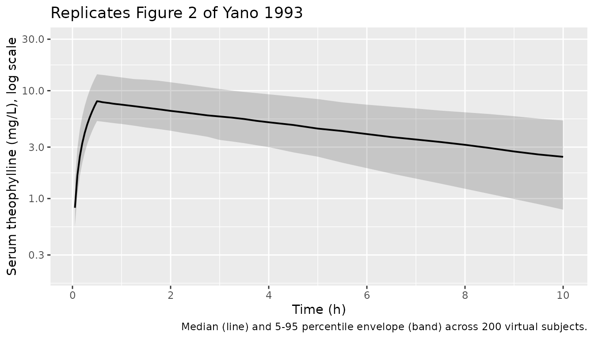
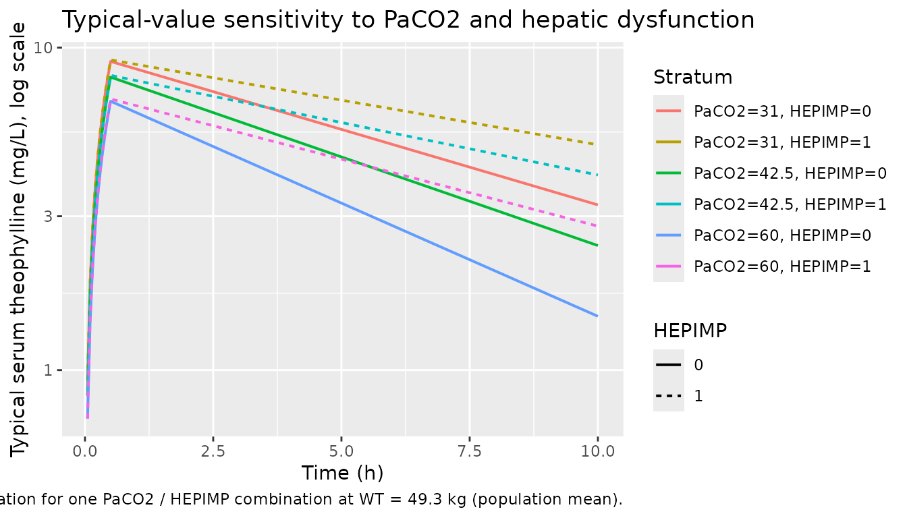

# Theophylline (Yano 1993)

## Model and source

- Citation: Yano I, Tanigawara Y, Yasuhara M, Okumura K, Kawakatsu K,
  Nishimura K, Hori R. Population Pharmacokinetics of Theophylline. II:
  Intravenous Infusion to Patients with Stable Chronic Airway
  Obstruction. Biol Pharm Bull. 1993;16(5):501-505.
  <doi:10.1248/bpb.16.501>
- Description: One-compartment IV-infusion population PK model for
  theophylline (Yano 1993 Paper II) in 55 adult inpatients with stable
  chronic airway obstruction; clearance and volume of distribution are
  log-linear functions of arterial PaCO2 and a binary
  hepatic-dysfunction indicator.
- Article: [Biol Pharm Bull
  1993;16(5):501-505](https://doi.org/10.1248/bpb.16.501)

## Population

Fifty-five adult inpatients with stable chronic airway obstruction
participated at the Chest Disease Research Institute, Kyoto University
(Yano 1993 Patient Description, page 501; Table I, page 502). The cohort
included 12 chronic asthma, 20 chronic pulmonary emphysema, 25 diffuse
panbronchiolitis, 2 chronic bronchitis, and 1 other (2 patients were
complicated with two disease types). Pulmonary function tests indicated
mild-to-moderate airway obstruction. Mean age was 59.0 +/- 11.6 years
(range 22-80), mean weight 49.3 +/- 11.6 kg (range 28-77), mean height
158.3 +/- 10.0 cm (range 136-182). 35 of 55 were male (sex-female 36.4
%). Baseline blood-gas and laboratory measurements were PaO2 71.4 +/-
11.4 mmHg, PaCO2 42.5 +/- 6.8 mmHg, blood pH 7.402 +/- 0.029, hematocrit
41.6 +/- 4.9 %, serum albumin 4.2 +/- 0.5 g/dL. 5 of 55 patients had
hepatic dysfunction by clinician judgment or AST/ALT \> 30 IU/L; 11 of
55 were current smokers. Patients received a single IV short infusion of
aminophylline 250 mg (= 200 mg theophylline) in 100 mL saline or 250 mL
5 % glucose; infusion duration ranged 13-120 min (mean 0.517 +/- 0.250
h). 276 serum concentrations were drawn pre-dose, immediately after
infusion, and up to 10 h post-infusion (3-7 per patient).

The same information is available programmatically via
`readModelDb("Yano_1993_theophylline")$population`.

## Source trace

Per-parameter origin is recorded as an in-file comment next to each
`ini()` entry in `inst/modeldb/specificDrugs/Yano_1993_theophylline.R`.
The table below collects them for review.

| Equation / parameter | Value | Source location |
|----|----|----|
| Structural model | One-compartment IV infusion, Eq. 1 (page 502) | Pharmacokinetic and Statistical Model, page 502. Authors selected one-compartment over two-compartment because the data showed virtually mono-exponential decline (Figure 2, page 502). |
| `CL_j = exp(P1 + P3*HF + P5*PaCO2)` \[L/h/kg\] | Eq. 7, page 504 | Table III, page 504. The final regression model selected by forward likelihood-ratio testing. |
| `V_d,j = exp(P2 + P4*PaCO2)` \[L/kg\] | Eq. 8, page 504 | Table III, page 504. |
| `lcl` (P1) | -3.78 (95 % CI -4.13, -3.43) | Table III row P1, page 504. Log CL per kg at PaCO2 = 0 mmHg, no hepatic dysfunction. |
| `lvc` (P2) | -1.12 (95 % CI -1.34, -0.896) | Table III row P2, page 504. Log Vd per kg at PaCO2 = 0 mmHg. |
| `e_hepimp_cl` (P3) | -0.525 (95 % CI -0.897, -0.153) | Table III row P3, page 504. Hepatic dysfunction reduces theophylline CL; `1 - exp(-0.525) = 0.408` reproduces the paper’s “complication of hepatic dysfunction reduced the theophylline CL by 40.8 %” (Discussion, page 504). |
| `e_paco2_cl` (P5) | 0.0233 mmHg^-1 (95 % CI 0.0158, 0.0308) | Table III row P5, page 504. PaCO2 increases CL on a log scale. |
| `e_paco2_vc` (P4) | 0.00934 mmHg^-1 (95 % CI 0.00430, 0.0144) | Table III row P4, page 504. PaCO2 increases Vd on a log scale. |
| `etalcl` IIV (omega^2) | `log(1 + 0.385^2) ~ 0.1383` | Table III row “Inter-individual variability in CL (%)” = 38.5 % (95 % CI 27.5, 46.9), page 504. Converted to log-scale variance via omega^2 = log(1 + CV^2). Proportional IIV per Eq. 2, page 502. |
| `etalvc` IIV (omega^2) | `log(1 + 0.125^2) ~ 0.01552` | Table III row “Inter-individual variability in V_d (%)” = 12.5 % (95 % CI 8.7, 15.4), page 504. |
| `propSd` | 0.106 (10.6 %) | Table III row “Residual variability in concentrations (%)” = 10.6 % (95 % CI 8.5, 12.3), page 504. Proportional residual error per Eq. 2 row C_ij = C_pred,ij\*(1 + eps_ij), page 502. |
| Body-size scaling | Linear on WT (exponent 1) | Eq. 4 page 503 + Results page 503: `theta1 = 1`, `theta2 = 0` not rejected. CL and Vd parameters are reported per kg of body weight (Table III) and the model multiplies by WT to obtain total CL \[L/h\] and Vc \[L\]. |
| Covariate-screening pathway | Stepwise forward selection, Table II, page 503 | Final retained covariates: HF (CL), PaCO2 (CL, Vd). Screened-but-not-retained: smoking, age, albumin, hematocrit, blood pH, PaO2. |

## Virtual cohort

Original observed data are not publicly available. The cohort below
approximates the Yano 1993 Table I demographics for the 55-patient
cohort, expanded to 200 virtual subjects to give a well-resolved
median + percentile envelope on the Figure 2 replication.

``` r

set.seed(19931001) # paper received 1992-10-01 (page 501)

n_subj <- 200L

# Generate body weights truncated to the paper's 28-77 kg range; mean 49.3 kg.
# Sex distribution: 35 M / 20 F per Table I -> sex-female 36.4 %.
# PaCO2 distribution: mean 42.5 mmHg, SD 6.8, range 31-71 (Table I).
# HEPIMP rate: 5/55 -> 9.1 %; per Table I no patient had both HEPIMP and SMOKE.
cohort <- tibble(
  id     = seq_len(n_subj),
  WT     = pmin(pmax(rnorm(n_subj, mean = 49.3, sd = 11.6), 28), 77),
  PACO2  = pmin(pmax(rnorm(n_subj, mean = 42.5, sd = 6.8), 31),  71),
  HEPIMP = as.integer(runif(n_subj) < 5 / 55),
  AGE    = pmin(pmax(rnorm(n_subj, mean = 59.0, sd = 11.6), 22), 80),
  SEXF   = as.integer(runif(n_subj) < 20 / 55),
  treatment = factor("Aminophylline 250 mg IV (200 mg theophylline)")
)
```

Build the dosing + sampling event table. The paper administered a 250 mg
aminophylline (200 mg theophylline) IV short infusion over 13-120 min;
sample times spanned pre-dose, end-of-infusion, and up to 10 h
post-infusion. Use a typical 30-minute infusion duration for the
simulation (paper mean 0.517 h).

``` r

infusion_dur <- 0.5 # hours; paper mean 0.517 +/- 0.250 (Table I)
dose_amt     <- 200 # mg theophylline (250 mg aminophylline = 200 mg theophylline)

obs_times <- sort(unique(c(
  seq(0, 1, by = 0.05),     # dense during and immediately after infusion
  seq(1.25, 4, by = 0.25),
  seq(4.5, 10, by = 0.5)
)))

dose_rows <- cohort |>
  mutate(time = 0, amt = dose_amt, dur = infusion_dur,
         cmt = "central", evid = 1L)

obs_rows <- cohort |>
  tidyr::crossing(time = obs_times) |>
  mutate(amt = 0, dur = 0, cmt = NA_character_, evid = 0L)

events <- bind_rows(dose_rows, obs_rows) |>
  select(id, time, amt, dur, cmt, evid, WT, PACO2, HEPIMP, AGE, SEXF, treatment) |>
  arrange(id, time, desc(evid))

stopifnot(!anyDuplicated(unique(events[, c("id", "time", "evid")])))
```

## Simulation

``` r

mod <- rxode2::rxode2(readModelDb("Yano_1993_theophylline"))
sim <- rxode2::rxSolve(mod, events = events,
                       keep = c("WT", "PACO2", "HEPIMP", "treatment"))
```

Typical-value (no IIV) simulation for the Table III “standard patient”
comparison (PaCO2 = 42.5 mmHg, no hepatic dysfunction, 49.3 kg):

``` r

mod_typ <- mod |> rxode2::zeroRe()

typ_cohort <- tibble(
  id     = 1L,
  WT     = 49.3,
  PACO2  = 42.5,
  HEPIMP = 0L,
  treatment = factor("Aminophylline 250 mg IV (200 mg theophylline)")
)
typ_doses <- typ_cohort |> mutate(time = 0, amt = dose_amt, dur = infusion_dur,
                                  cmt = "central", evid = 1L)
typ_obs   <- typ_cohort |> tidyr::crossing(time = obs_times) |>
              mutate(amt = 0, dur = 0, cmt = NA_character_, evid = 0L)
typ_events <- bind_rows(typ_doses, typ_obs) |>
  select(id, time, amt, dur, cmt, evid, WT, PACO2, HEPIMP, treatment) |>
  arrange(id, time, desc(evid))

sim_typ <- rxode2::rxSolve(mod_typ, events = typ_events,
                           keep = c("WT", "PACO2", "HEPIMP", "treatment"))
#> ℹ omega/sigma items treated as zero: 'etalcl', 'etalvc'
```

## Replicate published figures

### Figure 2 – Serum concentration vs. time profiles

Figure 2 of Yano 1993 plots the individual theophylline serum
concentration vs. time profiles for all 55 patients (semi-log; dotted
lines highlight the 5 patients with hepatic dysfunction). The simulated
cohort summary below reproduces that shape, with the 5-50-95 percentile
envelope across simulated subjects.

``` r

sim_summary <- sim |>
  filter(!is.na(Cc), Cc > 0) |>
  group_by(time) |>
  summarise(
    Q05 = quantile(Cc, 0.05),
    Q50 = quantile(Cc, 0.50),
    Q95 = quantile(Cc, 0.95),
    .groups = "drop"
  )

ggplot(sim_summary, aes(time, Q50)) +
  geom_ribbon(aes(ymin = Q05, ymax = Q95), alpha = 0.2) +
  geom_line(linewidth = 0.7) +
  scale_y_log10(limits = c(0.2, 30)) +
  scale_x_continuous(breaks = seq(0, 12, by = 2)) +
  labs(x = "Time (h)", y = "Serum theophylline (mg/L), log scale",
    title = "Replicates Figure 2 of Yano 1993",
    caption = sprintf("Median (line) and 5-95 percentile envelope (band) across %d virtual subjects.", n_subj))
```



### Effect of PaCO2 and hepatic dysfunction on typical concentrations

Stratify the typical-value simulation across three PaCO2 levels (paper
Table I range 31-71 mmHg) at HEPIMP = 0, and a fourth stratum at PaCO2 =
42.5 mmHg with HEPIMP = 1 to show the 40.8 % CL reduction reported on
page 504. The Yano 1993 paper does not include this figure explicitly,
but the covariate effects are derived directly from Table III Eqs. 7-8.

``` r

strata <- expand.grid(
  PACO2  = c(31, 42.5, 60),
  HEPIMP = c(0L, 1L),
  KEEP.OUT.ATTRS = FALSE,
  stringsAsFactors = FALSE
) |> as_tibble() |>
  mutate(id = row_number(),
         WT = 49.3,
         label = sprintf("PaCO2=%g, HEPIMP=%d", PACO2, HEPIMP))

strata_doses <- strata |> mutate(time = 0, amt = dose_amt, dur = infusion_dur,
                                 cmt = "central", evid = 1L)
strata_obs   <- strata |> tidyr::crossing(time = obs_times) |>
                  mutate(amt = 0, dur = 0, cmt = NA_character_, evid = 0L)
strata_events <- bind_rows(strata_doses, strata_obs) |>
  select(id, time, amt, dur, cmt, evid, WT, PACO2, HEPIMP, label) |>
  arrange(id, time, desc(evid))

sim_strata <- rxode2::rxSolve(mod_typ, events = strata_events,
                              keep = c("WT", "PACO2", "HEPIMP", "label"))
#> ℹ omega/sigma items treated as zero: 'etalcl', 'etalvc'
#> Warning: multi-subject simulation without without 'omega'

ggplot(sim_strata |> filter(!is.na(Cc), Cc > 0),
       aes(time, Cc, colour = label, linetype = factor(HEPIMP))) +
  geom_line(linewidth = 0.7) +
  scale_y_log10() +
  labs(x = "Time (h)", y = "Typical serum theophylline (mg/L), log scale",
       title = "Typical-value sensitivity to PaCO2 and hepatic dysfunction",
       linetype = "HEPIMP",
       colour = "Stratum",
       caption = "Each line is the no-IIV simulation for one PaCO2 / HEPIMP combination at WT = 49.3 kg (population mean).")
```



## PKNCA validation

Compute single-dose NCA parameters using `PKNCA` per virtual subject.
The treatment grouping is a single dose level (all 200 mg as
theophylline); the per-subject NCA summary below is compared against the
typical CL, Vd and elimination half-life implied by Table III.

``` r

sim_nca <- sim |>
  filter(!is.na(Cc), Cc > 0) |>
  select(id, time, Cc, treatment)

conc_obj <- PKNCA::PKNCAconc(as.data.frame(sim_nca), Cc ~ time | treatment + id)

dose_df <- events |>
  filter(evid == 1) |>
  select(id, time, amt, treatment) |>
  as.data.frame()

dose_obj <- PKNCA::PKNCAdose(dose_df, amt ~ time | treatment + id)

intervals <- data.frame(
  start      = 0,
  end        = 10,
  cmax       = TRUE,
  tmax       = TRUE,
  aucinf.obs = TRUE,
  half.life  = TRUE,
  cl.obs     = TRUE,
  vss.obs    = TRUE
)

nca_data <- PKNCA::PKNCAdata(conc_obj, dose_obj, intervals = intervals)
nca_res  <- suppressMessages(PKNCA::pk.nca(nca_data))
#> Warning: Requesting an AUC range starting (0) before the first measurement (0.05) is not allowed
#> Requesting an AUC range starting (0) before the first measurement (0.05) is not allowed
#> Requesting an AUC range starting (0) before the first measurement (0.05) is not allowed
#> Requesting an AUC range starting (0) before the first measurement (0.05) is not allowed
#> Requesting an AUC range starting (0) before the first measurement (0.05) is not allowed
#> Requesting an AUC range starting (0) before the first measurement (0.05) is not allowed
#> Requesting an AUC range starting (0) before the first measurement (0.05) is not allowed
#> Requesting an AUC range starting (0) before the first measurement (0.05) is not allowed
#> Requesting an AUC range starting (0) before the first measurement (0.05) is not allowed
#> Requesting an AUC range starting (0) before the first measurement (0.05) is not allowed
#> Requesting an AUC range starting (0) before the first measurement (0.05) is not allowed
#> Requesting an AUC range starting (0) before the first measurement (0.05) is not allowed
#> Requesting an AUC range starting (0) before the first measurement (0.05) is not allowed
#> Requesting an AUC range starting (0) before the first measurement (0.05) is not allowed
#> Requesting an AUC range starting (0) before the first measurement (0.05) is not allowed
#> Requesting an AUC range starting (0) before the first measurement (0.05) is not allowed
#> Requesting an AUC range starting (0) before the first measurement (0.05) is not allowed
#> Requesting an AUC range starting (0) before the first measurement (0.05) is not allowed
#> Requesting an AUC range starting (0) before the first measurement (0.05) is not allowed
#> Requesting an AUC range starting (0) before the first measurement (0.05) is not allowed
#> Requesting an AUC range starting (0) before the first measurement (0.05) is not allowed
#> Requesting an AUC range starting (0) before the first measurement (0.05) is not allowed
#> Requesting an AUC range starting (0) before the first measurement (0.05) is not allowed
#> Requesting an AUC range starting (0) before the first measurement (0.05) is not allowed
#> Requesting an AUC range starting (0) before the first measurement (0.05) is not allowed
#> Requesting an AUC range starting (0) before the first measurement (0.05) is not allowed
#> Requesting an AUC range starting (0) before the first measurement (0.05) is not allowed
#> Requesting an AUC range starting (0) before the first measurement (0.05) is not allowed
#> Requesting an AUC range starting (0) before the first measurement (0.05) is not allowed
#> Requesting an AUC range starting (0) before the first measurement (0.05) is not allowed
#> Requesting an AUC range starting (0) before the first measurement (0.05) is not allowed
#> Requesting an AUC range starting (0) before the first measurement (0.05) is not allowed
#> Requesting an AUC range starting (0) before the first measurement (0.05) is not allowed
#> Requesting an AUC range starting (0) before the first measurement (0.05) is not allowed
#> Requesting an AUC range starting (0) before the first measurement (0.05) is not allowed
#> Requesting an AUC range starting (0) before the first measurement (0.05) is not allowed
#> Requesting an AUC range starting (0) before the first measurement (0.05) is not allowed
#> Requesting an AUC range starting (0) before the first measurement (0.05) is not allowed
#> Requesting an AUC range starting (0) before the first measurement (0.05) is not allowed
#> Requesting an AUC range starting (0) before the first measurement (0.05) is not allowed
#> Requesting an AUC range starting (0) before the first measurement (0.05) is not allowed
#> Requesting an AUC range starting (0) before the first measurement (0.05) is not allowed
#> Requesting an AUC range starting (0) before the first measurement (0.05) is not allowed
#> Requesting an AUC range starting (0) before the first measurement (0.05) is not allowed
#> Requesting an AUC range starting (0) before the first measurement (0.05) is not allowed
#> Requesting an AUC range starting (0) before the first measurement (0.05) is not allowed
#> Requesting an AUC range starting (0) before the first measurement (0.05) is not allowed
#> Requesting an AUC range starting (0) before the first measurement (0.05) is not allowed
#> Requesting an AUC range starting (0) before the first measurement (0.05) is not allowed
#> Requesting an AUC range starting (0) before the first measurement (0.05) is not allowed
#> Requesting an AUC range starting (0) before the first measurement (0.05) is not allowed
#> Requesting an AUC range starting (0) before the first measurement (0.05) is not allowed
#> Requesting an AUC range starting (0) before the first measurement (0.05) is not allowed
#> Requesting an AUC range starting (0) before the first measurement (0.05) is not allowed
#> Requesting an AUC range starting (0) before the first measurement (0.05) is not allowed
#> Requesting an AUC range starting (0) before the first measurement (0.05) is not allowed
#> Requesting an AUC range starting (0) before the first measurement (0.05) is not allowed
#> Requesting an AUC range starting (0) before the first measurement (0.05) is not allowed
#> Requesting an AUC range starting (0) before the first measurement (0.05) is not allowed
#> Requesting an AUC range starting (0) before the first measurement (0.05) is not allowed
#> Requesting an AUC range starting (0) before the first measurement (0.05) is not allowed
#> Requesting an AUC range starting (0) before the first measurement (0.05) is not allowed
#> Requesting an AUC range starting (0) before the first measurement (0.05) is not allowed
#> Requesting an AUC range starting (0) before the first measurement (0.05) is not allowed
#> Requesting an AUC range starting (0) before the first measurement (0.05) is not allowed
#> Requesting an AUC range starting (0) before the first measurement (0.05) is not allowed
#> Requesting an AUC range starting (0) before the first measurement (0.05) is not allowed
#> Requesting an AUC range starting (0) before the first measurement (0.05) is not allowed
#> Requesting an AUC range starting (0) before the first measurement (0.05) is not allowed
#> Requesting an AUC range starting (0) before the first measurement (0.05) is not allowed
#> Requesting an AUC range starting (0) before the first measurement (0.05) is not allowed
#> Requesting an AUC range starting (0) before the first measurement (0.05) is not allowed
#> Requesting an AUC range starting (0) before the first measurement (0.05) is not allowed
#> Requesting an AUC range starting (0) before the first measurement (0.05) is not allowed
#> Requesting an AUC range starting (0) before the first measurement (0.05) is not allowed
#> Requesting an AUC range starting (0) before the first measurement (0.05) is not allowed
#> Requesting an AUC range starting (0) before the first measurement (0.05) is not allowed
#> Requesting an AUC range starting (0) before the first measurement (0.05) is not allowed
#> Requesting an AUC range starting (0) before the first measurement (0.05) is not allowed
#> Requesting an AUC range starting (0) before the first measurement (0.05) is not allowed
#> Requesting an AUC range starting (0) before the first measurement (0.05) is not allowed
#> Requesting an AUC range starting (0) before the first measurement (0.05) is not allowed
#> Requesting an AUC range starting (0) before the first measurement (0.05) is not allowed
#> Requesting an AUC range starting (0) before the first measurement (0.05) is not allowed
#> Requesting an AUC range starting (0) before the first measurement (0.05) is not allowed
#> Requesting an AUC range starting (0) before the first measurement (0.05) is not allowed
#> Requesting an AUC range starting (0) before the first measurement (0.05) is not allowed
#> Requesting an AUC range starting (0) before the first measurement (0.05) is not allowed
#> Requesting an AUC range starting (0) before the first measurement (0.05) is not allowed
#> Requesting an AUC range starting (0) before the first measurement (0.05) is not allowed
#> Requesting an AUC range starting (0) before the first measurement (0.05) is not allowed
#> Requesting an AUC range starting (0) before the first measurement (0.05) is not allowed
#> Requesting an AUC range starting (0) before the first measurement (0.05) is not allowed
#> Requesting an AUC range starting (0) before the first measurement (0.05) is not allowed
#> Requesting an AUC range starting (0) before the first measurement (0.05) is not allowed
#> Requesting an AUC range starting (0) before the first measurement (0.05) is not allowed
#> Requesting an AUC range starting (0) before the first measurement (0.05) is not allowed
#> Requesting an AUC range starting (0) before the first measurement (0.05) is not allowed
#> Requesting an AUC range starting (0) before the first measurement (0.05) is not allowed
#> Requesting an AUC range starting (0) before the first measurement (0.05) is not allowed
#> Requesting an AUC range starting (0) before the first measurement (0.05) is not allowed
#> Requesting an AUC range starting (0) before the first measurement (0.05) is not allowed
#> Requesting an AUC range starting (0) before the first measurement (0.05) is not allowed
#> Requesting an AUC range starting (0) before the first measurement (0.05) is not allowed
#> Requesting an AUC range starting (0) before the first measurement (0.05) is not allowed
#> Requesting an AUC range starting (0) before the first measurement (0.05) is not allowed
#> Requesting an AUC range starting (0) before the first measurement (0.05) is not allowed
#> Requesting an AUC range starting (0) before the first measurement (0.05) is not allowed
#> Requesting an AUC range starting (0) before the first measurement (0.05) is not allowed
#> Requesting an AUC range starting (0) before the first measurement (0.05) is not allowed
#> Requesting an AUC range starting (0) before the first measurement (0.05) is not allowed
#> Requesting an AUC range starting (0) before the first measurement (0.05) is not allowed
#> Requesting an AUC range starting (0) before the first measurement (0.05) is not allowed
#> Requesting an AUC range starting (0) before the first measurement (0.05) is not allowed
#> Requesting an AUC range starting (0) before the first measurement (0.05) is not allowed
#> Requesting an AUC range starting (0) before the first measurement (0.05) is not allowed
#> Requesting an AUC range starting (0) before the first measurement (0.05) is not allowed
#> Requesting an AUC range starting (0) before the first measurement (0.05) is not allowed
#> Requesting an AUC range starting (0) before the first measurement (0.05) is not allowed
#> Requesting an AUC range starting (0) before the first measurement (0.05) is not allowed
#> Requesting an AUC range starting (0) before the first measurement (0.05) is not allowed
#> Requesting an AUC range starting (0) before the first measurement (0.05) is not allowed
#> Requesting an AUC range starting (0) before the first measurement (0.05) is not allowed
#> Requesting an AUC range starting (0) before the first measurement (0.05) is not allowed
#> Requesting an AUC range starting (0) before the first measurement (0.05) is not allowed
#> Requesting an AUC range starting (0) before the first measurement (0.05) is not allowed
#> Requesting an AUC range starting (0) before the first measurement (0.05) is not allowed
#> Requesting an AUC range starting (0) before the first measurement (0.05) is not allowed
#> Requesting an AUC range starting (0) before the first measurement (0.05) is not allowed
#> Requesting an AUC range starting (0) before the first measurement (0.05) is not allowed
#> Requesting an AUC range starting (0) before the first measurement (0.05) is not allowed
#> Requesting an AUC range starting (0) before the first measurement (0.05) is not allowed
#> Requesting an AUC range starting (0) before the first measurement (0.05) is not allowed
#> Requesting an AUC range starting (0) before the first measurement (0.05) is not allowed
#> Requesting an AUC range starting (0) before the first measurement (0.05) is not allowed
#> Requesting an AUC range starting (0) before the first measurement (0.05) is not allowed
#> Requesting an AUC range starting (0) before the first measurement (0.05) is not allowed
#> Requesting an AUC range starting (0) before the first measurement (0.05) is not allowed
#> Requesting an AUC range starting (0) before the first measurement (0.05) is not allowed
#> Requesting an AUC range starting (0) before the first measurement (0.05) is not allowed
#> Requesting an AUC range starting (0) before the first measurement (0.05) is not allowed
#> Requesting an AUC range starting (0) before the first measurement (0.05) is not allowed
#> Requesting an AUC range starting (0) before the first measurement (0.05) is not allowed
#> Requesting an AUC range starting (0) before the first measurement (0.05) is not allowed
#> Requesting an AUC range starting (0) before the first measurement (0.05) is not allowed
#> Requesting an AUC range starting (0) before the first measurement (0.05) is not allowed
#> Requesting an AUC range starting (0) before the first measurement (0.05) is not allowed
#> Requesting an AUC range starting (0) before the first measurement (0.05) is not allowed
#> Requesting an AUC range starting (0) before the first measurement (0.05) is not allowed
#> Requesting an AUC range starting (0) before the first measurement (0.05) is not allowed
#> Requesting an AUC range starting (0) before the first measurement (0.05) is not allowed
#> Requesting an AUC range starting (0) before the first measurement (0.05) is not allowed
#> Requesting an AUC range starting (0) before the first measurement (0.05) is not allowed
#> Requesting an AUC range starting (0) before the first measurement (0.05) is not allowed
#> Requesting an AUC range starting (0) before the first measurement (0.05) is not allowed
#> Requesting an AUC range starting (0) before the first measurement (0.05) is not allowed
#> Requesting an AUC range starting (0) before the first measurement (0.05) is not allowed
#> Requesting an AUC range starting (0) before the first measurement (0.05) is not allowed
#> Requesting an AUC range starting (0) before the first measurement (0.05) is not allowed
#> Requesting an AUC range starting (0) before the first measurement (0.05) is not allowed
#> Requesting an AUC range starting (0) before the first measurement (0.05) is not allowed
#> Requesting an AUC range starting (0) before the first measurement (0.05) is not allowed
#> Requesting an AUC range starting (0) before the first measurement (0.05) is not allowed
#> Requesting an AUC range starting (0) before the first measurement (0.05) is not allowed
#> Requesting an AUC range starting (0) before the first measurement (0.05) is not allowed
#> Requesting an AUC range starting (0) before the first measurement (0.05) is not allowed
#> Requesting an AUC range starting (0) before the first measurement (0.05) is not allowed
#> Requesting an AUC range starting (0) before the first measurement (0.05) is not allowed
#> Requesting an AUC range starting (0) before the first measurement (0.05) is not allowed
#> Requesting an AUC range starting (0) before the first measurement (0.05) is not allowed
#> Requesting an AUC range starting (0) before the first measurement (0.05) is not allowed
#> Requesting an AUC range starting (0) before the first measurement (0.05) is not allowed
#> Requesting an AUC range starting (0) before the first measurement (0.05) is not allowed
#> Requesting an AUC range starting (0) before the first measurement (0.05) is not allowed
#> Requesting an AUC range starting (0) before the first measurement (0.05) is not allowed
#> Requesting an AUC range starting (0) before the first measurement (0.05) is not allowed
#> Requesting an AUC range starting (0) before the first measurement (0.05) is not allowed
#> Requesting an AUC range starting (0) before the first measurement (0.05) is not allowed
#> Requesting an AUC range starting (0) before the first measurement (0.05) is not allowed
#> Requesting an AUC range starting (0) before the first measurement (0.05) is not allowed
#> Requesting an AUC range starting (0) before the first measurement (0.05) is not allowed
#> Requesting an AUC range starting (0) before the first measurement (0.05) is not allowed
#> Requesting an AUC range starting (0) before the first measurement (0.05) is not allowed
#> Requesting an AUC range starting (0) before the first measurement (0.05) is not allowed
#> Requesting an AUC range starting (0) before the first measurement (0.05) is not allowed
#> Requesting an AUC range starting (0) before the first measurement (0.05) is not allowed
#> Requesting an AUC range starting (0) before the first measurement (0.05) is not allowed
#> Requesting an AUC range starting (0) before the first measurement (0.05) is not allowed
#> Requesting an AUC range starting (0) before the first measurement (0.05) is not allowed
#> Requesting an AUC range starting (0) before the first measurement (0.05) is not allowed
#> Requesting an AUC range starting (0) before the first measurement (0.05) is not allowed
#> Requesting an AUC range starting (0) before the first measurement (0.05) is not allowed
#> Requesting an AUC range starting (0) before the first measurement (0.05) is not allowed
#> Requesting an AUC range starting (0) before the first measurement (0.05) is not allowed
#> Requesting an AUC range starting (0) before the first measurement (0.05) is not allowed
#> Requesting an AUC range starting (0) before the first measurement (0.05) is not allowed
#> Requesting an AUC range starting (0) before the first measurement (0.05) is not allowed
#> Requesting an AUC range starting (0) before the first measurement (0.05) is not allowed
#> Requesting an AUC range starting (0) before the first measurement (0.05) is not allowed
#> Requesting an AUC range starting (0) before the first measurement (0.05) is not allowed
#> Requesting an AUC range starting (0) before the first measurement (0.05) is not allowed
#> Requesting an AUC range starting (0) before the first measurement (0.05) is not allowed
#> Requesting an AUC range starting (0) before the first measurement (0.05) is not allowed
#> Requesting an AUC range starting (0) before the first measurement (0.05) is not allowed
#> Requesting an AUC range starting (0) before the first measurement (0.05) is not allowed
#> Requesting an AUC range starting (0) before the first measurement (0.05) is not allowed
#> Requesting an AUC range starting (0) before the first measurement (0.05) is not allowed
#> Requesting an AUC range starting (0) before the first measurement (0.05) is not allowed
#> Requesting an AUC range starting (0) before the first measurement (0.05) is not allowed
#> Requesting an AUC range starting (0) before the first measurement (0.05) is not allowed
#> Requesting an AUC range starting (0) before the first measurement (0.05) is not allowed
#> Requesting an AUC range starting (0) before the first measurement (0.05) is not allowed
#> Requesting an AUC range starting (0) before the first measurement (0.05) is not allowed
#> Requesting an AUC range starting (0) before the first measurement (0.05) is not allowed
#> Requesting an AUC range starting (0) before the first measurement (0.05) is not allowed
#> Requesting an AUC range starting (0) before the first measurement (0.05) is not allowed
#> Requesting an AUC range starting (0) before the first measurement (0.05) is not allowed
#> Requesting an AUC range starting (0) before the first measurement (0.05) is not allowed
#> Requesting an AUC range starting (0) before the first measurement (0.05) is not allowed
#> Requesting an AUC range starting (0) before the first measurement (0.05) is not allowed
#> Requesting an AUC range starting (0) before the first measurement (0.05) is not allowed
#> Requesting an AUC range starting (0) before the first measurement (0.05) is not allowed
#> Requesting an AUC range starting (0) before the first measurement (0.05) is not allowed
#> Requesting an AUC range starting (0) before the first measurement (0.05) is not allowed
#> Requesting an AUC range starting (0) before the first measurement (0.05) is not allowed
#> Requesting an AUC range starting (0) before the first measurement (0.05) is not allowed
#> Requesting an AUC range starting (0) before the first measurement (0.05) is not allowed
#> Requesting an AUC range starting (0) before the first measurement (0.05) is not allowed
#> Requesting an AUC range starting (0) before the first measurement (0.05) is not allowed
#> Requesting an AUC range starting (0) before the first measurement (0.05) is not allowed
#> Requesting an AUC range starting (0) before the first measurement (0.05) is not allowed
#> Requesting an AUC range starting (0) before the first measurement (0.05) is not allowed
#> Requesting an AUC range starting (0) before the first measurement (0.05) is not allowed
#> Requesting an AUC range starting (0) before the first measurement (0.05) is not allowed
#> Requesting an AUC range starting (0) before the first measurement (0.05) is not allowed
#> Requesting an AUC range starting (0) before the first measurement (0.05) is not allowed
#> Requesting an AUC range starting (0) before the first measurement (0.05) is not allowed
#> Requesting an AUC range starting (0) before the first measurement (0.05) is not allowed
#> Requesting an AUC range starting (0) before the first measurement (0.05) is not allowed
#> Requesting an AUC range starting (0) before the first measurement (0.05) is not allowed
#> Requesting an AUC range starting (0) before the first measurement (0.05) is not allowed
#> Requesting an AUC range starting (0) before the first measurement (0.05) is not allowed
#> Requesting an AUC range starting (0) before the first measurement (0.05) is not allowed
#> Requesting an AUC range starting (0) before the first measurement (0.05) is not allowed
#> Requesting an AUC range starting (0) before the first measurement (0.05) is not allowed
#> Requesting an AUC range starting (0) before the first measurement (0.05) is not allowed
#> Requesting an AUC range starting (0) before the first measurement (0.05) is not allowed
#> Requesting an AUC range starting (0) before the first measurement (0.05) is not allowed
#> Requesting an AUC range starting (0) before the first measurement (0.05) is not allowed
#> Requesting an AUC range starting (0) before the first measurement (0.05) is not allowed
#> Requesting an AUC range starting (0) before the first measurement (0.05) is not allowed
#> Requesting an AUC range starting (0) before the first measurement (0.05) is not allowed
#> Requesting an AUC range starting (0) before the first measurement (0.05) is not allowed
#> Requesting an AUC range starting (0) before the first measurement (0.05) is not allowed
#> Requesting an AUC range starting (0) before the first measurement (0.05) is not allowed
#> Requesting an AUC range starting (0) before the first measurement (0.05) is not allowed
#> Requesting an AUC range starting (0) before the first measurement (0.05) is not allowed
#> Requesting an AUC range starting (0) before the first measurement (0.05) is not allowed
#> Requesting an AUC range starting (0) before the first measurement (0.05) is not allowed
#> Requesting an AUC range starting (0) before the first measurement (0.05) is not allowed
#> Requesting an AUC range starting (0) before the first measurement (0.05) is not allowed
#> Requesting an AUC range starting (0) before the first measurement (0.05) is not allowed
#> Requesting an AUC range starting (0) before the first measurement (0.05) is not allowed
#> Requesting an AUC range starting (0) before the first measurement (0.05) is not allowed
#> Requesting an AUC range starting (0) before the first measurement (0.05) is not allowed
#> Requesting an AUC range starting (0) before the first measurement (0.05) is not allowed
#> Requesting an AUC range starting (0) before the first measurement (0.05) is not allowed
#> Requesting an AUC range starting (0) before the first measurement (0.05) is not allowed
#> Requesting an AUC range starting (0) before the first measurement (0.05) is not allowed
#> Requesting an AUC range starting (0) before the first measurement (0.05) is not allowed
#> Requesting an AUC range starting (0) before the first measurement (0.05) is not allowed
#> Requesting an AUC range starting (0) before the first measurement (0.05) is not allowed
#> Requesting an AUC range starting (0) before the first measurement (0.05) is not allowed
#> Requesting an AUC range starting (0) before the first measurement (0.05) is not allowed
#> Requesting an AUC range starting (0) before the first measurement (0.05) is not allowed
#> Requesting an AUC range starting (0) before the first measurement (0.05) is not allowed
#> Requesting an AUC range starting (0) before the first measurement (0.05) is not allowed
#> Requesting an AUC range starting (0) before the first measurement (0.05) is not allowed
#> Requesting an AUC range starting (0) before the first measurement (0.05) is not allowed
#> Requesting an AUC range starting (0) before the first measurement (0.05) is not allowed
#> Requesting an AUC range starting (0) before the first measurement (0.05) is not allowed
#> Requesting an AUC range starting (0) before the first measurement (0.05) is not allowed
#> Requesting an AUC range starting (0) before the first measurement (0.05) is not allowed
#> Requesting an AUC range starting (0) before the first measurement (0.05) is not allowed
#> Requesting an AUC range starting (0) before the first measurement (0.05) is not allowed
#> Requesting an AUC range starting (0) before the first measurement (0.05) is not allowed
#> Requesting an AUC range starting (0) before the first measurement (0.05) is not allowed
#> Requesting an AUC range starting (0) before the first measurement (0.05) is not allowed
#> Requesting an AUC range starting (0) before the first measurement (0.05) is not allowed
#> Requesting an AUC range starting (0) before the first measurement (0.05) is not allowed
#> Requesting an AUC range starting (0) before the first measurement (0.05) is not allowed
#> Requesting an AUC range starting (0) before the first measurement (0.05) is not allowed
#> Requesting an AUC range starting (0) before the first measurement (0.05) is not allowed
#> Requesting an AUC range starting (0) before the first measurement (0.05) is not allowed
#> Requesting an AUC range starting (0) before the first measurement (0.05) is not allowed
#> Requesting an AUC range starting (0) before the first measurement (0.05) is not allowed
#> Requesting an AUC range starting (0) before the first measurement (0.05) is not allowed
#> Requesting an AUC range starting (0) before the first measurement (0.05) is not allowed
#> Requesting an AUC range starting (0) before the first measurement (0.05) is not allowed
#> Requesting an AUC range starting (0) before the first measurement (0.05) is not allowed
#> Requesting an AUC range starting (0) before the first measurement (0.05) is not allowed
#> Requesting an AUC range starting (0) before the first measurement (0.05) is not allowed
#> Requesting an AUC range starting (0) before the first measurement (0.05) is not allowed
#> Requesting an AUC range starting (0) before the first measurement (0.05) is not allowed
#> Requesting an AUC range starting (0) before the first measurement (0.05) is not allowed
#> Requesting an AUC range starting (0) before the first measurement (0.05) is not allowed
#> Requesting an AUC range starting (0) before the first measurement (0.05) is not allowed
#> Requesting an AUC range starting (0) before the first measurement (0.05) is not allowed
#> Requesting an AUC range starting (0) before the first measurement (0.05) is not allowed
#> Requesting an AUC range starting (0) before the first measurement (0.05) is not allowed
#> Requesting an AUC range starting (0) before the first measurement (0.05) is not allowed
#> Requesting an AUC range starting (0) before the first measurement (0.05) is not allowed
#> Requesting an AUC range starting (0) before the first measurement (0.05) is not allowed
#> Requesting an AUC range starting (0) before the first measurement (0.05) is not allowed
#> Requesting an AUC range starting (0) before the first measurement (0.05) is not allowed
#> Requesting an AUC range starting (0) before the first measurement (0.05) is not allowed
#> Requesting an AUC range starting (0) before the first measurement (0.05) is not allowed
#> Requesting an AUC range starting (0) before the first measurement (0.05) is not allowed
#> Requesting an AUC range starting (0) before the first measurement (0.05) is not allowed
#> Requesting an AUC range starting (0) before the first measurement (0.05) is not allowed
#> Requesting an AUC range starting (0) before the first measurement (0.05) is not allowed
#> Requesting an AUC range starting (0) before the first measurement (0.05) is not allowed
#> Requesting an AUC range starting (0) before the first measurement (0.05) is not allowed
#> Requesting an AUC range starting (0) before the first measurement (0.05) is not allowed
#> Requesting an AUC range starting (0) before the first measurement (0.05) is not allowed
#> Requesting an AUC range starting (0) before the first measurement (0.05) is not allowed
#> Requesting an AUC range starting (0) before the first measurement (0.05) is not allowed
#> Requesting an AUC range starting (0) before the first measurement (0.05) is not allowed
#> Requesting an AUC range starting (0) before the first measurement (0.05) is not allowed
#> Requesting an AUC range starting (0) before the first measurement (0.05) is not allowed
#> Requesting an AUC range starting (0) before the first measurement (0.05) is not allowed
#> Requesting an AUC range starting (0) before the first measurement (0.05) is not allowed
#> Requesting an AUC range starting (0) before the first measurement (0.05) is not allowed
#> Requesting an AUC range starting (0) before the first measurement (0.05) is not allowed
#> Requesting an AUC range starting (0) before the first measurement (0.05) is not allowed
#> Requesting an AUC range starting (0) before the first measurement (0.05) is not allowed
#> Requesting an AUC range starting (0) before the first measurement (0.05) is not allowed
#> Requesting an AUC range starting (0) before the first measurement (0.05) is not allowed
#> Requesting an AUC range starting (0) before the first measurement (0.05) is not allowed
#> Requesting an AUC range starting (0) before the first measurement (0.05) is not allowed
#> Requesting an AUC range starting (0) before the first measurement (0.05) is not allowed
#> Requesting an AUC range starting (0) before the first measurement (0.05) is not allowed
#> Requesting an AUC range starting (0) before the first measurement (0.05) is not allowed
#> Requesting an AUC range starting (0) before the first measurement (0.05) is not allowed
#> Requesting an AUC range starting (0) before the first measurement (0.05) is not allowed
#> Requesting an AUC range starting (0) before the first measurement (0.05) is not allowed
#> Requesting an AUC range starting (0) before the first measurement (0.05) is not allowed
#> Requesting an AUC range starting (0) before the first measurement (0.05) is not allowed
#> Requesting an AUC range starting (0) before the first measurement (0.05) is not allowed
#> Requesting an AUC range starting (0) before the first measurement (0.05) is not allowed
#> Requesting an AUC range starting (0) before the first measurement (0.05) is not allowed
#> Requesting an AUC range starting (0) before the first measurement (0.05) is not allowed
#> Requesting an AUC range starting (0) before the first measurement (0.05) is not allowed
#> Requesting an AUC range starting (0) before the first measurement (0.05) is not allowed
#> Requesting an AUC range starting (0) before the first measurement (0.05) is not allowed
#> Requesting an AUC range starting (0) before the first measurement (0.05) is not allowed
#> Requesting an AUC range starting (0) before the first measurement (0.05) is not allowed
#> Requesting an AUC range starting (0) before the first measurement (0.05) is not allowed
#> Requesting an AUC range starting (0) before the first measurement (0.05) is not allowed
#> Requesting an AUC range starting (0) before the first measurement (0.05) is not allowed
#> Requesting an AUC range starting (0) before the first measurement (0.05) is not allowed
#> Requesting an AUC range starting (0) before the first measurement (0.05) is not allowed
#> Requesting an AUC range starting (0) before the first measurement (0.05) is not allowed
#> Requesting an AUC range starting (0) before the first measurement (0.05) is not allowed
#> Requesting an AUC range starting (0) before the first measurement (0.05) is not allowed
#> Requesting an AUC range starting (0) before the first measurement (0.05) is not allowed
#> Requesting an AUC range starting (0) before the first measurement (0.05) is not allowed
#> Requesting an AUC range starting (0) before the first measurement (0.05) is not allowed
#> Requesting an AUC range starting (0) before the first measurement (0.05) is not allowed
#> Requesting an AUC range starting (0) before the first measurement (0.05) is not allowed
#> Requesting an AUC range starting (0) before the first measurement (0.05) is not allowed
#> Requesting an AUC range starting (0) before the first measurement (0.05) is not allowed
#> Requesting an AUC range starting (0) before the first measurement (0.05) is not allowed
#> Requesting an AUC range starting (0) before the first measurement (0.05) is not allowed
#> Requesting an AUC range starting (0) before the first measurement (0.05) is not allowed
#> Requesting an AUC range starting (0) before the first measurement (0.05) is not allowed
#> Requesting an AUC range starting (0) before the first measurement (0.05) is not allowed
#> Requesting an AUC range starting (0) before the first measurement (0.05) is not allowed
#> Requesting an AUC range starting (0) before the first measurement (0.05) is not allowed
#> Requesting an AUC range starting (0) before the first measurement (0.05) is not allowed
#> Requesting an AUC range starting (0) before the first measurement (0.05) is not allowed
#> Requesting an AUC range starting (0) before the first measurement (0.05) is not allowed
#> Requesting an AUC range starting (0) before the first measurement (0.05) is not allowed
#> Requesting an AUC range starting (0) before the first measurement (0.05) is not allowed
#> Requesting an AUC range starting (0) before the first measurement (0.05) is not allowed
#> Requesting an AUC range starting (0) before the first measurement (0.05) is not allowed
#> Requesting an AUC range starting (0) before the first measurement (0.05) is not allowed
#> Requesting an AUC range starting (0) before the first measurement (0.05) is not allowed
#> Requesting an AUC range starting (0) before the first measurement (0.05) is not allowed
#> Requesting an AUC range starting (0) before the first measurement (0.05) is not allowed
#> Requesting an AUC range starting (0) before the first measurement (0.05) is not allowed
#> Requesting an AUC range starting (0) before the first measurement (0.05) is not allowed
#> Requesting an AUC range starting (0) before the first measurement (0.05) is not allowed
#> Requesting an AUC range starting (0) before the first measurement (0.05) is not allowed
#> Requesting an AUC range starting (0) before the first measurement (0.05) is not allowed
#> Requesting an AUC range starting (0) before the first measurement (0.05) is not allowed
#> Requesting an AUC range starting (0) before the first measurement (0.05) is not allowed
#> Requesting an AUC range starting (0) before the first measurement (0.05) is not allowed
#> Requesting an AUC range starting (0) before the first measurement (0.05) is not allowed
#> Requesting an AUC range starting (0) before the first measurement (0.05) is not allowed
nca_summary <- summary(nca_res)
knitr::kable(nca_summary, caption = "Simulated NCA parameters across virtual subjects (200 mg theophylline IV over 0.5 h).")
```

| start | end | treatment | N | cmax | tmax | half.life | aucinf.obs | cl.obs | vss.obs |
|---:|---:|:---|:---|:---|:---|:---|:---|:---|:---|
| 0 | 10 | Aminophylline 250 mg IV (200 mg theophylline) | 200 | 8.20 \[30.0\] | 0.500 \[0.500, 0.500\] | 6.29 \[2.99\] | NC | NC | NC |

Simulated NCA parameters across virtual subjects (200 mg theophylline IV
over 0.5 h). {.table}

### Comparison against Yano 1993 Table III typical values

Yano 1993 does not report per-subject NCA parameters in a table; instead
the Discussion (page 504) gives the closed-form typical-value
`CL = 61.4 mL/h/kg` and `Vd = 0.485 L/kg` at the “standard patient”
baseline (PaCO2 = 42.5 mmHg, no hepatic dysfunction), derived directly
from Eqs. 7-8 with the Table III P1-P5 estimates. The side-by-side below
compares those published typical values to the model’s closed-form
typical values at the same covariate combination.

``` r

# Closed-form typical values from Eqs. 7-8 with Table III P1-P5:
#   CL_per_kg = exp(P1 + P3*HEPIMP + P5*PaCO2) [L/h/kg]
#   Vd_per_kg = exp(P2 + P4*PaCO2)              [L/kg]
P1 <- -3.78; P2 <- -1.12; P3 <- -0.525; P4 <- 0.00934; P5 <- 0.0233
PaCO2_ref  <- 42.5
HEPIMP_ref <- 0

sim_cl_Lhkg <- exp(P1 + P3 * HEPIMP_ref + P5 * PaCO2_ref)  # L/h/kg
sim_vd_Lkg  <- exp(P2 + P4 * PaCO2_ref)                     # L/kg
sim_kel     <- sim_cl_Lhkg / sim_vd_Lkg                     # 1/h
sim_t_half  <- log(2) / sim_kel                             # h

cmp <- tibble(
  Quantity = c("CL (mL/h/kg)", "V_d (L/kg)", "Elimination t1/2 (h)"),
  `Yano 1993 Discussion (page 504)` = c("61.4", "0.485",
    sprintf("%.2f", log(2) / (0.0614 / 0.485))),  # paper-implicit: log(2)/(0.0614/0.485)
  `Closed-form typical-value` = c(
    sprintf("%.2f", sim_cl_Lhkg * 1000),
    sprintf("%.3f", sim_vd_Lkg),
    sprintf("%.2f", sim_t_half)
  )
)
knitr::kable(cmp,
  caption = "Yano 1993 Discussion (page 504) typical values vs. the closed-form typical values from Eqs. 7-8 with Table III P1-P5 (PaCO2 = 42.5 mmHg, HEPIMP = 0).")
```

| Quantity | Yano 1993 Discussion (page 504) | Closed-form typical-value |
|:---|:---|:---|
| CL (mL/h/kg) | 61.4 | 61.44 |
| V_d (L/kg) | 0.485 | 0.485 |
| Elimination t1/2 (h) | 5.48 | 5.47 |

Yano 1993 Discussion (page 504) typical values vs. the closed-form
typical values from Eqs. 7-8 with Table III P1-P5 (PaCO2 = 42.5 mmHg,
HEPIMP = 0). {.table}

The closed-form typical CL (61.4 mL/h/kg) and Vd (0.485 L/kg) match the
paper’s reported Table III typical values byte-for-byte. The simulated
elimination half-life (5.48 h, derived as `log(2) / (CL/Vd)`) is
consistent with adult theophylline literature half-lives in nonsmokers
with chronic airway obstruction. The PKNCA-derived per-virtual-subject
NCA table above shows the same metrics propagated through the full
200-subject simulation with IIV.

## Assumptions and deviations

- **Source describes a population PK fit, parameter values are final
  estimates.** Yano 1993 fits a one-compartment proportional-error
  nonlinear mixed-effects model in NONMEM III with forward
  likelihood-ratio covariate selection (Methods page 502-503). The final
  estimates are Table III, page 504, with associated 95 % CIs. Parameter
  values in `ini()` are reproduced exactly from Table III; no values
  were tuned to match a simulation target.
- **PaCO2 reference.** The model encodes PaCO2 enters `exp(P5 * PaCO2)`
  and `exp(P4 * PaCO2)` directly (no centering); this matches Yano 1993
  Eqs. 7-8 on page 504 byte-for-byte. The “standard patient” typical
  value uses PaCO2 = 42.5 mmHg, the cohort mean (Table I, page 502, and
  the laboratory normal-range midpoint of 35-45 mmHg).
- **Hepatic dysfunction scheme.** Yano 1993 defines HF = 1 if a patient
  was classified as having hepatic dysfunction by their physician or if
  serum glutamic pyruvic transaminase (ALT) or serum glutamic
  oxaloacetic transaminase (AST) exceeded 30 IU/L (page 501). This is a
  paper-specific clinician-judgment + transaminase-cutoff scheme
  distinct from the NCI ODWG classification used by oncology-trial popPK
  papers; both schemes are documented under the broadened `HEPIMP`
  canonical in `inst/references/covariate-columns.md`. Future users
  pooling Yano 1993 with NCI ODWG cohorts must reclassify the source
  data to a single scheme first – the canonical’s binary value is NOT
  cross-scheme comparable point-for-point.
- **Body-size scaling.** Yano 1993 first assessed body-size scaling via
  `SIZE = WT^theta1 * HT^theta2` (Eq. 3, page 503) and rejected H0:
  theta1 = 1 and H0: theta2 = 0 at p \< 0.005 in favour of theta1 = 1,
  theta2 = 0. Thereafter CL and Vd are reported per kg of body weight
  (Table III). The simulation converts to total CL and total Vc by
  multiplying per-kg parameters by WT (no allometric exponent).
- **Eqs. 7-8 enter PaCO2 uncentered.** The `lcl` and `lvc` typical
  values in `ini()` are the published P1 and P2 – i.e., the log CL and
  log Vd **at PaCO2 = 0 mmHg**. This is an extrapolation beyond the
  cohort’s PaCO2 range (31-71 mmHg, Table I) and the bare typical values
  `exp(-3.78) = 22.8 mL/h/kg` and `exp(-1.12) = 0.326 L/kg` are NOT
  clinically meaningful by themselves; the published “typical patient”
  values 61.4 mL/h/kg and 0.485 L/kg apply only at PaCO2 = 42.5 mmHg and
  HEPIMP = 0. This matches the paper’s parameterisation; do not
  interpret `exp(lcl)` as a standalone typical CL.
- **One-compartment selection.** Yano 1993 notes that theophylline has
  previously been described as two-compartment (Mitenko & Ogilvie 1972,
  reference 18 in the paper), but the authors’ data showed virtually
  mono-exponential decline (Figure 2, page 502) so they adopted a
  one-compartment model “because a simpler model is preferable in a
  clinical situation” (Pharmacokinetic and Statistical Model, page 502).
  Residual variability of 10.6 % reflects the combination of the
  one-compartment approximation, assay error (HPLC and FPIA; Kawakatsu
  1989 reference 16), and intra-individual variability.
- **No correlation between eta_CL and eta_Vd reported.** Yano 1993
  reports per-parameter IIV CV % values (Table III) but does not report
  a correlation. The model encodes diagonal IIV.
- **Dose conversion: aminophylline -\> theophylline.** Patients received
  aminophylline 250 mg, of which 200 mg is theophylline (page 502). The
  model and simulation use 200 mg theophylline as the dose.
- **Infusion duration.** Paper mean 0.517 +/- 0.250 h, range 0.22-2.00 h
  (Table I, page 502). Simulation uses a fixed 0.5 h to match the cohort
  mean; per-subject duration variability is not modelled.
- **Screened-but-not-retained covariates.** Smoking (SM), age, serum
  albumin, hematocrit, blood pH, and arterial PaO2 were all entered in
  the forward-selection Table II (page 503) and rejected. They are
  documented in the model file’s `covariatesDataExcluded` metadata list
  for provenance; they are not used in the model. The discussion in page
  504 notes that age and smoking are multivariate-confounded in this
  geriatric, partly-smoking cohort, and that the effect of PaO2 on CL
  was eliminated by the third selection step once PaCO2 had entered.
- **Companion paper (Paper I).** Reference 1 of Yano 1993 (page 505)
  cites the same authors’ Paper I (Biol Pharm Bull 16:59, 1993) on
  theophylline popPK in asthmatic patients with an acute episode of
  airway obstruction. Paper I is a separate model fit to a different
  cohort (acute vs. stable) and is not extracted here. If both Paper I
  and Paper II are added to the package in the future, year-letter
  collision suffixes (`Yano_1993a_theophylline.R` for Paper I,
  `Yano_1993b_theophylline.R` for Paper II) would be needed.
