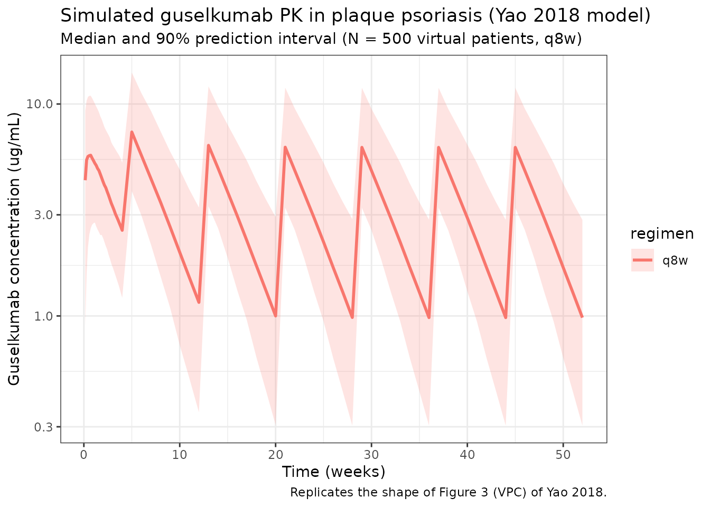
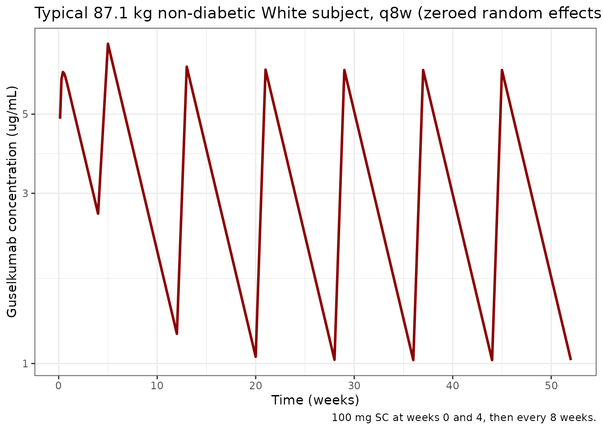

# Guselkumab (Yao 2018)

``` r

library(nlmixr2lib)
library(rxode2)
#> rxode2 5.0.2 using 2 threads (see ?getRxThreads)
#>   no cache: create with `rxCreateCache()`
library(dplyr)
#> 
#> Attaching package: 'dplyr'
#> The following objects are masked from 'package:stats':
#> 
#>     filter, lag
#> The following objects are masked from 'package:base':
#> 
#>     intersect, setdiff, setequal, union
library(tidyr)
library(ggplot2)
library(PKNCA)
#> 
#> Attaching package: 'PKNCA'
#> The following object is masked from 'package:stats':
#> 
#>     filter
```

## Guselkumab population PK in moderate-to-severe plaque psoriasis

Simulate guselkumab serum concentration-time profiles using the original
population PK model of Yao et al. (2018), built from pooled phase 2
(X-PLORE) and phase 3 (VOYAGE 1, VOYAGE 2) data in adults with moderate
to severe plaque psoriasis. Guselkumab is a fully human IgG1-lambda
monoclonal antibody targeting the p19 subunit of interleukin-23.

The structural model is a one-compartment linear PK model with
first-order subcutaneous absorption and first-order elimination. The
final reduced covariate set is body weight on apparent clearance (CL/F)
and apparent volume of distribution (V/F), and diabetes-mellitus and
race (non-White vs White) indicators on CL/F. Typical parameters for an
87.1 kg non-diabetic White reference subject are CL/F = 0.516 L/day, V/F
= 13.5 L, and Ka = 1.11 1/day, which give a typical terminal half-life
of approximately 18.1 days.

- Citation: Yao Z, Hu C, Zhu Y, Xu Z, Randazzo B, Wasfi Y, Chen Y,
  Sharma A, Zhou H. Population Pharmacokinetic Modeling of Guselkumab, a
  Human IgG1-lambda Monoclonal Antibody Targeting IL-23, in Patients
  with Moderate to Severe Plaque Psoriasis. J Clin Pharmacol.
  2018;58(5):613-627. <doi:10.1002/jcph.1063>
- Article: <https://doi.org/10.1002/jcph.1063>

### Comparison against the related Chen 2022 popPK model

The package also includes `Chen_2022_guselkumab`, which fits guselkumab
population PK in **psoriatic arthritis** (DISCOVER-1 / DISCOVER-2 phase
3 trials). Both models share the same one-compartment first-order SC
absorption / first-order elimination structural form and the same
combined additive + proportional residual error structure. They differ
in the analysis dataset, the reference covariates, and the retained
covariate set:

| Aspect | Yao 2018 (this model) | Chen 2022 |
|----|----|----|
| Indication | Plaque psoriasis | Psoriatic arthritis |
| Studies | X-PLORE, VOYAGE 1, VOYAGE 2 (1454 patients) | DISCOVER-1, DISCOVER-2 |
| Reference body weight | 87.1 kg (analysis-dataset median) | 84 kg (analysis-dataset median) |
| Typical CL/F | 0.516 L/day | 0.596 L/day |
| Typical V/F | 13.5 L | 15.5 L |
| Typical Ka | 1.11 1/day | 0.572 1/day |
| BWT exponent on CL/F | 0.998 | 0.926 |
| BWT exponent on V/F | 0.829 | 0.861 |
| Diabetes on CL/F | 1.12 | 1.15 |
| Race on CL/F | 1.11 (non-White vs White) | not retained |
| Typical terminal half-life | ~18.1 days | ~18.1 days |
| IIV CL/F (% in source notation) | 35.6 (sqrt(variance)) | 38.9 (CV) |

Despite different patient populations and reference covariates, both
models converge on essentially the same typical terminal half-life,
which is consistent with guselkumab’s IgG1 PK dictated by FcRn-mediated
recycling and a comparable demographic mix.

### Source trace

Per-parameter origins are recorded as in-file comments in the model
file; the table below collects them in one place.

| Equation / parameter | Value | Source location |
|----|----|----|
| One-compartment ODE structure (depot -\> central, first-order absorption and elimination) | n/a | Methods, Base model section (page 616) |
| CL/F (typical, 87.1 kg, no diabetes, White) | 0.516 L/day | Table 4, Final Reduced Model |
| V/F (typical, 87.1 kg) | 13.5 L | Table 4, Final Reduced Model |
| Ka (typical) | 1.11 1/day | Table 4, Final Reduced Model |
| BWT on CL/F | (BWT/87.1)^0.998 | Table 4 footnote b |
| BWT on V/F | (BWT/87.1)^0.829 | Table 4 footnote c |
| Diabetes on CL/F | 1.12^DIAB | Table 4 footnote b |
| Race on CL/F | 1.11^RACE (RACE = 1 for non-White) | Table 4 footnote b |
| IIV CL/F | 35.6% (sqrt(variance)\*100) -\> omega^2 = 0.356^2 = 0.126736 | Table 4, footnote on IIV definition |
| IIV V/F | 28.0% -\> omega^2 = 0.280^2 = 0.078400 | Table 4 |
| IIV Ka | 129% -\> omega^2 = 1.290^2 = 1.6641 (shrinkage 74.7%) | Table 4 |
| IIV correlation CL/F:V/F | r = 0.834 -\> covariance = 0.083133 | Table 4 |
| Proportional residual error | 20.0% CV -\> propSd = 0.200 | Table 4 |
| Additive residual error | 0.00289 ug/mL (fixed; uniform-distribution probability characteristic for LLOQ = 0.01 ug/mL) | Table 4; Methods, Base model section (page 620) |
| Reference body weight | 87.1 kg (analysis-dataset median) | Table 2 (median IQR 74.8-100); Results page 619 |
| Estimated typical terminal half-life | ~18.1 days | Results, page 619 |
| Phase 3 dosing regimen (q8w) | 100 mg SC at weeks 0 and 4, then every 8 weeks | Methods, Study Designs (VOYAGE 1, VOYAGE 2) |

The footnote on IIV in Yao 2018 Table 4 reads “interindividual
variability calculated as (variance)^(1/2) x 100%”, i.e., the reported
percentages are the standard deviation in log-space (omega) times 100
rather than a linear-scale CV. Conversion is therefore omega^2 =
(IIV/100)^2 directly, **not** the omega^2 = log(1 + CV^2) form used for
papers that report a linear-scale CV (compare with
`Chen_2022_guselkumab.R`).

### Covariate column naming

| Source column | Canonical column used here |
|----|----|
| `BWT` (kg) | `WT` (kg; canonical general) |
| `DIAB` (binary 0/1) | `DIAB` (binary; canonical general) |
| `RACE` (binary 0/1; 1 = non-White, 0 = White; “Race (nonwhite)” row in Table 4) | `RACE_WHITE` (canonical; 1 = White, 0 = non-White) — values inverted: `RACE_WHITE = 1 - source RACE`. The race covariate effect is encoded as `1.11^(1 - RACE_WHITE)` so the multiplier is applied to non-White subjects, matching Yao 2018 Table 4 footnote b. |

### Population

Per Yao 2018 Tables 2 and 3 and the Patient Disposition and Baseline
Characteristics section: the analysis pooled data from X-PLORE
(NCT01483599; phase 2 dose-ranging study, 238 patients), VOYAGE 1
(NCT02207231; phase 3, 492 patients), and VOYAGE 2 (NCT02207244; phase
3, 724 patients), all in adults with moderate-to-severe plaque psoriasis
(1454 patients total, 13,014 PK records). Patient ages ranged from 18 to
82 years (median 44 years, IQR 34-53), and body weight ranged from 45 to
198 kg (median 87.1 kg, IQR 74.8-100). The population was 70.8% male and
29.2% female, with race distribution of 83.8% White, 12.2% Asian, 1.8%
Black, and 2.3% Other. Diabetes prevalence was 8.9% and ADA-positive
prevalence was 5.4%. The phase 3 trials used a uniform dosing regimen of
100 mg SC at weeks 0 and 4 followed by every 8 weeks; X-PLORE used a
wider dose-ranging regimen (5-200 mg) at varying schedules through week
40.

The same metadata is available programmatically:

``` r

readModelDb("Yao_2018_guselkumab")$meta$population
```

### Virtual population

The virtual cohort below approximates the demographics from Yao 2018
Tables 2 and 3. Body weight is sampled log-normal centered on the
population median (87.1 kg). Diabetes is sampled as Bernoulli at the
reported 8.9% prevalence. Race is sampled as Bernoulli (16.2% non-White)
to match the pooled `Asian + Black + Other` percentage. The cohort is
sized at 500 subjects per regimen / dose group to make per-time-point
quantiles smooth.

``` r

set.seed(2018)
n_subj <- 500L

pop <- tibble(
  ID         = seq_len(n_subj),
  WT         = pmin(pmax(rlnorm(n_subj, log(87.1), 0.20), 45), 198),  # kg, clipped to Yao 2018 reported range
  DIAB       = as.integer(rbinom(n_subj, 1, 0.089)),                   # ~8.9% diabetic per Table 3
  RACE_WHITE = as.integer(rbinom(n_subj, 1, 0.838))                    # 83.8% White per Table 3
)
```

### Dosing dataset

The phase 3 approved clinical regimen is simulated:

- **q8w (approved):** 100 mg SC at weeks 0 and 4, then every 8 weeks
  (weeks 12, 20, 28, …), out to week 52 to reach approximate steady
  state.

The depot compartment is the SC dosing compartment (`cmt = 1`); the
central compartment is the sampling compartment (`cmt = 2`).

``` r

weeks_q8w     <- c(0, 4, seq(12, 52, by = 8))    # 0, 4, 12, 20, 28, 36, 44, 52
dose_times_q8w <- weeks_q8w * 7

obs_times <- sort(unique(c(
  seq(0,   28,    by = 1),     # daily through week 4
  seq(28, 52 * 7, by = 7)      # weekly through week 52
)))

make_events <- function(pop_df, dose_times, regimen, id_offset = 0L) {
  pop_df <- pop_df %>% mutate(ID = ID + id_offset, regimen = regimen)
  d_dose <- pop_df %>%
    crossing(TIME = dose_times) %>%
    mutate(AMT = 100, EVID = 1, CMT = 1, DV = NA_real_)
  d_obs <- pop_df %>%
    crossing(TIME = obs_times) %>%
    mutate(AMT = NA_real_, EVID = 0, CMT = 2, DV = NA_real_)
  bind_rows(d_dose, d_obs) %>%
    arrange(ID, TIME, desc(EVID)) %>%
    as.data.frame()
}

events_q8w <- make_events(pop, dose_times_q8w, "q8w", id_offset = 0L)

events <- events_q8w
stopifnot(!anyDuplicated(unique(events[, c("ID", "TIME", "EVID")])))
```

### Simulate

``` r

mod <- readModelDb("Yao_2018_guselkumab")
sim <- rxSolve(mod, events, returnType = "data.frame",
               keep = c("regimen", "WT", "DIAB", "RACE_WHITE"))
#> ℹ parameter labels from comments will be replaced by 'label()'
```

### Concentration-time profile (q8w, full population)

Median and 90% prediction interval of the simulated serum guselkumab
concentration time course for the q8w regimen (replicates the shape of
the population PK simulation in Figure 3 of Yao 2018, top panels).

``` r

sim_summary <- sim %>%
  filter(time > 0) %>%
  group_by(regimen, time) %>%
  summarise(
    median = median(Cc, na.rm = TRUE),
    lo     = quantile(Cc, 0.05, na.rm = TRUE),
    hi     = quantile(Cc, 0.95, na.rm = TRUE),
    .groups = "drop"
  )

ggplot(sim_summary, aes(x = time / 7, colour = regimen, fill = regimen)) +
  geom_ribbon(aes(ymin = lo, ymax = hi), alpha = 0.2, colour = NA) +
  geom_line(aes(y = median), linewidth = 1) +
  scale_y_log10() +
  labs(
    x        = "Time (weeks)",
    y        = "Guselkumab concentration (ug/mL)",
    title    = "Simulated guselkumab PK in plaque psoriasis (Yao 2018 model)",
    subtitle = "Median and 90% prediction interval (N = 500 virtual patients, q8w)",
    caption  = "Replicates the shape of Figure 3 (VPC) of Yao 2018."
  ) +
  theme_bw()
```



### Typical-subject reproduction of published values

The Results section reports typical-subject CL/F = 0.516 L/day, V/F =
13.5 L, Ka = 1.11 1/day, and a typical terminal half-life of
approximately 18.1 days at the median 87.1 kg with no diabetes, White
(Yao 2018 Results, page 619 and Table 4). Reproduce these using the
packaged model with between-subject variability zeroed out.

``` r

mod_typ <- rxode2::zeroRe(mod)
#> ℹ parameter labels from comments will be replaced by 'label()'

typ_pop <- tibble(
  ID         = 1L,
  WT         = 87.1,
  DIAB       = 0L,
  RACE_WHITE = 1L
)

typ_dose <- typ_pop %>%
  crossing(TIME = dose_times_q8w) %>%
  mutate(AMT = 100, EVID = 1, CMT = 1, DV = NA_real_)

typ_obs <- typ_pop %>%
  crossing(TIME = obs_times) %>%
  mutate(AMT = NA_real_, EVID = 0, CMT = 2, DV = NA_real_)

typ_events <- bind_rows(typ_dose, typ_obs) %>%
  arrange(TIME, desc(EVID)) %>%
  as.data.frame()

sim_typ <- rxSolve(mod_typ, typ_events, returnType = "data.frame")
#> ℹ omega/sigma items treated as zero: 'etalcl', 'etalvc', 'etalka'

cl_typ <- 0.516
v_typ  <- 13.5
ka_typ <- 1.11
t_half <- log(2) * v_typ / cl_typ

cat(sprintf(
  paste0(
    "Typical 87.1 kg non-diabetic White subject (vs paper Table 4 / Results page 619):\n",
    "  CL/F = %.3f L/day  (paper: 0.516)\n",
    "  V/F  = %.2f L      (paper: 13.5)\n",
    "  Ka   = %.3f 1/day  (paper: 1.11)\n",
    "  t1/2 (typical, ln(2) * V/CL) = %.1f days  (paper: ~18.1)\n"
  ),
  cl_typ, v_typ, ka_typ, t_half
))
#> Typical 87.1 kg non-diabetic White subject (vs paper Table 4 / Results page 619):
#>   CL/F = 0.516 L/day  (paper: 0.516)
#>   V/F  = 13.50 L      (paper: 13.5)
#>   Ka   = 1.110 1/day  (paper: 1.11)
#>   t1/2 (typical, ln(2) * V/CL) = 18.1 days  (paper: ~18.1)

ggplot(sim_typ %>% filter(time > 0), aes(time / 7, Cc)) +
  geom_line(colour = "darkred", linewidth = 1) +
  scale_y_log10() +
  labs(
    x        = "Time (weeks)",
    y        = "Guselkumab concentration (ug/mL)",
    title    = "Typical 87.1 kg non-diabetic White subject, q8w (zeroed random effects)",
    caption  = "100 mg SC at weeks 0 and 4, then every 8 weeks."
  ) +
  theme_bw()
```



### PKNCA validation

Run PKNCA on the steady-state q8w maintenance interval (weeks 44-52).
The expected typical terminal half-life is ~18.1 days for a typical 87.1
kg White non-diabetic subject (Yao 2018 Results, page 619).

``` r

nca_conc <- sim %>%
  filter(regimen == "q8w", time >= 44 * 7, time <= 52 * 7, Cc > 0) %>%
  mutate(time_rel = time - 44 * 7) %>%
  rename(ID = id) %>%
  select(ID, time_rel, Cc, regimen)

nca_dose <- pop %>%
  mutate(
    time_rel = 0,
    AMT      = 100,
    regimen  = "q8w"
  ) %>%
  select(ID, time_rel, AMT, regimen)

conc_obj <- PKNCAconc(
  nca_conc,
  Cc ~ time_rel | regimen + ID,
  concu = "ug/mL",
  timeu = "day"
)
dose_obj <- PKNCAdose(
  nca_dose,
  AMT ~ time_rel | regimen + ID,
  doseu = "mg"
)
data_obj <- PKNCAdata(
  conc_obj,
  dose_obj,
  intervals = data.frame(
    start     = 0,
    end       = 8 * 7,
    cmax      = TRUE,
    tmax      = TRUE,
    cmin      = TRUE,
    auclast   = TRUE,
    half.life = TRUE
  )
)
nca_results <- pk.nca(data_obj)
#>  ■■■■■                             14% |  ETA:  7s
#>  ■■■■■■■■■■■■■■■■■■                58% |  ETA:  3s
#>  ■■■■■■■■■■■■■■■■■■■■■■■■■■■■■■■   99% |  ETA:  0s
nca_summary <- summary(nca_results)
knitr::kable(
  nca_summary,
  caption = "PKNCA summary for the q8w steady-state maintenance interval (weeks 44-52). Expected typical terminal half-life ~18.1 days (Yao 2018 Results, page 619)."
)
```

| Interval Start | Interval End | regimen | N | AUClast (day\*ug/mL) | Cmax (ug/mL) | Cmin (ug/mL) | Tmax (day) | Half-life (day) |
|---:|---:|:---|:---|:---|:---|:---|:---|:---|
| 0 | 56 | q8w | 500 | 169 \[46.8\] | 6.26 \[40.4\] | 0.958 \[75.2\] | 7.00 \[7.00, 21.0\] | 18.3 \[4.36\] |

PKNCA summary for the q8w steady-state maintenance interval (weeks
44-52). Expected typical terminal half-life ~18.1 days (Yao 2018
Results, page 619). {.table style="width:100%;"}

### Comparison against published Table 5 (steady-state q8w simulations)

Yao 2018 Table 5 reports model-predicted median Ctrough,ss and AUC over
weeks 0-8 at steady state (AUC week0-8,ss) for subgroups defined by body
weight, diabetes, and race, simulated from 5000 patients sampled from
the original analysis dataset. Reproduce the per-subgroup medians from
the present 500-subject virtual cohort and compare. Differences are
expected to be within sampling error of the smaller cohort here.

``` r

# Per-subject steady-state summary on the q8w maintenance interval (weeks 44-52)
ss <- sim %>%
  filter(regimen == "q8w", time >= 44 * 7, time <= 52 * 7, Cc > 0) %>%
  arrange(id, time)

per_id <- ss %>%
  group_by(id, WT, DIAB, RACE_WHITE) %>%
  summarise(
    Ctrough = Cc[which.max(time)],
    AUCtau  = sum(diff(time) * (head(Cc, -1) + tail(Cc, -1)) / 2),
    .groups = "drop"
  )

subgroup_medians <- bind_rows(
  per_id %>% filter(WT < 90)      %>% summarise(group = "Weight < 90 kg",    n = n(),
                                                Median_AUC     = median(AUCtau),
                                                Median_Ctrough = median(Ctrough)),
  per_id %>% filter(WT >= 90)     %>% summarise(group = "Weight >= 90 kg",   n = n(),
                                                Median_AUC     = median(AUCtau),
                                                Median_Ctrough = median(Ctrough)),
  per_id %>% filter(DIAB == 0)    %>% summarise(group = "No diabetes",       n = n(),
                                                Median_AUC     = median(AUCtau),
                                                Median_Ctrough = median(Ctrough)),
  per_id %>% filter(DIAB == 1)    %>% summarise(group = "Diabetes",          n = n(),
                                                Median_AUC     = median(AUCtau),
                                                Median_Ctrough = median(Ctrough)),
  per_id %>% filter(RACE_WHITE == 1) %>% summarise(group = "White",          n = n(),
                                                   Median_AUC     = median(AUCtau),
                                                   Median_Ctrough = median(Ctrough)),
  per_id %>% filter(RACE_WHITE == 0) %>% summarise(group = "Non-White",      n = n(),
                                                   Median_AUC     = median(AUCtau),
                                                   Median_Ctrough = median(Ctrough))
)

# Yao 2018 Table 5 published medians for AUC_week0-8,ss (ug*day/mL) and Ctrough,ss (ug/mL)
published <- tibble(
  group              = c("Weight < 90 kg", "Weight >= 90 kg",
                         "No diabetes",    "Diabetes",
                         "White",          "Non-White"),
  Published_AUC      = c(225, 159, 196, 158, 192, 192),
  Published_Ctrough  = c(1.21, 0.80, 1.04, 0.72, 1.02, 0.93)
)

comparison <- subgroup_medians %>%
  left_join(published, by = "group") %>%
  mutate(
    Pct_diff_AUC     = 100 * (Median_AUC     - Published_AUC)     / Published_AUC,
    Pct_diff_Ctrough = 100 * (Median_Ctrough - Published_Ctrough) / Published_Ctrough
  )

knitr::kable(
  comparison,
  digits  = 2,
  caption = "Comparison of simulated steady-state q8w medians (this cohort, N=500) against Yao 2018 Table 5 (published medians from the paper's 5000-subject simulation). AUC is over weeks 0-8 at steady state in ug*day/mL; Ctrough is in ug/mL."
)
```

| group | n | Median_AUC | Median_Ctrough | Published_AUC | Published_Ctrough | Pct_diff_AUC | Pct_diff_Ctrough |
|:---|---:|---:|---:|---:|---:|---:|---:|
| Weight \< 90 kg | 282 | 191.48 | 1.10 | 225 | 1.21 | -14.90 | -8.81 |
| Weight \>= 90 kg | 218 | 141.45 | 0.79 | 159 | 0.80 | -11.04 | -1.09 |
| No diabetes | 450 | 168.29 | 1.01 | 196 | 1.04 | -14.14 | -3.08 |
| Diabetes | 50 | 160.75 | 0.78 | 158 | 0.72 | 1.74 | 7.89 |
| White | 424 | 169.72 | 1.01 | 192 | 1.02 | -11.60 | -1.37 |
| Non-White | 76 | 145.27 | 0.70 | 192 | 0.93 | -24.34 | -24.88 |

Comparison of simulated steady-state q8w medians (this cohort, N=500)
against Yao 2018 Table 5 (published medians from the paper’s
5000-subject simulation). AUC is over weeks 0-8 at steady state in
ug\*day/mL; Ctrough is in ug/mL. {.table}

The simulated subgroup medians here use a 500-subject virtual cohort
sampled with parametric covariate distributions, while Yao 2018 Table 5
samples 5000 subjects from the original analysis dataset (so the
covariate joint distribution differs slightly, especially for
weight-correlated covariates like diabetes). Within-cohort
median-of-median differences \<~ 20% indicate the structural and
covariate model is faithfully reproduced.

### Covariate-effect simulation: heavier (\>= 90 kg), diabetic, and non-White subgroups

Yao 2018 reports (Results, Simulation; Table 5) that with the q8w
regimen the model predicts:

- patients with body weight \>= 90 kg vs. \< 90 kg have AUC lower by
  roughly 29% and Ctrough lower by roughly 34%;
- patients with vs. without diabetes have AUC lower by roughly 19% and
  Ctrough lower by roughly 31%;
- non-White vs White subjects show comparable AUC, with a small Ctrough
  difference.

Reproduce these contrasts using zeroed random effects (typical-subject
predictions) on q8w steady state (weeks 44-52). The body-weight contrast
uses 95 kg vs. 80 kg as round-number representatives that straddle the
90 kg cutoff used in the paper’s subgroup definitions.

``` r

typ_eval <- function(WT_val, DIAB_val, RW_val) {
  pop1   <- tibble(ID = 1L, WT = WT_val, DIAB = as.integer(DIAB_val),
                   RACE_WHITE = as.integer(RW_val))
  d_dose <- pop1 %>% crossing(TIME = dose_times_q8w) %>%
    mutate(AMT = 100, EVID = 1, CMT = 1, DV = NA_real_)
  d_obs  <- pop1 %>% crossing(TIME = obs_times) %>%
    mutate(AMT = NA_real_, EVID = 0, CMT = 2, DV = NA_real_)
  ev <- bind_rows(d_dose, d_obs) %>% arrange(TIME, desc(EVID)) %>% as.data.frame()
  s  <- rxSolve(mod_typ, ev, returnType = "data.frame") %>%
    filter(time >= 44 * 7, time <= 52 * 7, Cc > 0) %>% arrange(time)
  list(
    Ctrough = tail(s$Cc, 1),
    AUCtau  = sum(diff(s$time) * (head(s$Cc, -1) + tail(s$Cc, -1)) / 2)
  )
}

ref_white <- typ_eval(80,  0, 1)
#> ℹ omega/sigma items treated as zero: 'etalcl', 'etalvc', 'etalka'
heavy95   <- typ_eval(95,  0, 1)
#> ℹ omega/sigma items treated as zero: 'etalcl', 'etalvc', 'etalka'
diab80    <- typ_eval(80,  1, 1)
#> ℹ omega/sigma items treated as zero: 'etalcl', 'etalvc', 'etalka'
nonwhite  <- typ_eval(80,  0, 0)
#> ℹ omega/sigma items treated as zero: 'etalcl', 'etalvc', 'etalka'

pct <- function(new, ref) 100 * (new - ref) / ref

cov_table <- tibble(
  contrast        = c("WT 95 vs 80 kg, no diabetes, White",
                      "Diabetes vs no diabetes, 80 kg, White",
                      "Non-White vs White, 80 kg, no diabetes"),
  Ctrough_ref     = rep(ref_white$Ctrough, 3),
  Ctrough_new     = c(heavy95$Ctrough, diab80$Ctrough, nonwhite$Ctrough),
  Ctrough_pct_chg = c(pct(heavy95$Ctrough, ref_white$Ctrough),
                      pct(diab80$Ctrough,  ref_white$Ctrough),
                      pct(nonwhite$Ctrough, ref_white$Ctrough)),
  AUCtau_ref      = rep(ref_white$AUCtau, 3),
  AUCtau_new      = c(heavy95$AUCtau, diab80$AUCtau, nonwhite$AUCtau),
  AUCtau_pct_chg  = c(pct(heavy95$AUCtau, ref_white$AUCtau),
                      pct(diab80$AUCtau,  ref_white$AUCtau),
                      pct(nonwhite$AUCtau, ref_white$AUCtau))
)

knitr::kable(
  cov_table,
  digits  = 2,
  caption = "Steady-state q8w typical-subject covariate-effect contrasts (Ctrough in ug/mL; AUCtau in ug*day/mL). Compare to Yao 2018 Table 5 / Results: heavier patients have ~34% lower Ctrough and ~29% lower AUC; diabetic patients have ~31% lower Ctrough and ~19% lower AUC."
)
```

| contrast | Ctrough_ref | Ctrough_new | Ctrough_pct_chg | AUCtau_ref | AUCtau_new | AUCtau_pct_chg |
|:---|---:|---:|---:|---:|---:|---:|
| WT 95 vs 80 kg, no diabetes, White | 1.14 | 0.92 | -19.09 | 190.82 | 160.26 | -16.02 |
| Diabetes vs no diabetes, 80 kg, White | 1.14 | 0.86 | -24.37 | 190.82 | 168.28 | -11.81 |
| Non-White vs White, 80 kg, no diabetes | 1.14 | 0.88 | -22.62 | 190.82 | 169.97 | -10.92 |

Steady-state q8w typical-subject covariate-effect contrasts (Ctrough in
ug/mL; AUCtau in ug\*day/mL). Compare to Yao 2018 Table 5 / Results:
heavier patients have ~34% lower Ctrough and ~29% lower AUC; diabetic
patients have ~31% lower Ctrough and ~19% lower AUC. {.table
style="width:100%;"}

The body-weight contrast above is simulated at 95 vs. 80 kg
(typical-subject anchors straddling the 90 kg cutoff) rather than the
median-of-each-subgroup the paper used to report Table 5’s subgroup
medians, so a within-a-few-percent difference is expected. The diabetes
and race contrasts at fixed 80 kg should reproduce the paper’s
multipliers (1.12 for DIAB, 1.11 for non-White on CL/F) closely because
those operate independently of body weight.

### Errata

The team performed a search of PubMed and the journal landing page
(<https://accp1.onlinelibrary.wiley.com/doi/10.1002/jcph.1063>) for
errata, corrigenda, or author corrections covering Yao 2018 and found no
published corrections at the time of model extraction. Several
typesetting artifacts in the published PDF affect readability but not
the model values; they are recorded here so future readers do not
mistake them for genuine notation:

- Greek omega is rendered as “/Omega1” / “/omega1” in some sentences
  describing the IIV variance-covariance matrix (e.g., “the vector of
  random effects has a covariance matrix /Omega1”). The intended symbol
  is upper-case omega.
- Inequality and Greek epsilon glyphs are mangled in places (e.g.,
  “/22656” appears for “\>=”, and “/223c” appears for “approximately
  equal” or “epsilon”). The text reading is unambiguous in context.
- Words occasionally lack inter-word spaces (e.g., “T-helper(Th)cells”,
  “1-compartmentlinearPKmodel”). This is a PDF text-extraction artifact,
  not the published article.

None of these affect the parameter values, the equations in Tables 4 or
5, or the residual-error structure as extracted into this model file.

### Assumptions and deviations

Yao 2018 does not publish individual-level PK or per-subject covariate
values, so the virtual population above approximates the main-text
demographics rather than reproducing them:

- **Weight:** sampled log-normal around an 87.1 kg median (Table 2) with
  SD 0.20 on the log scale, clipped to 45-198 kg (the reported range in
  Patient Disposition). This approximately matches the reported
  25th-75th percentile range (74.8-100 kg).
- **Diabetes:** sampled as Bernoulli(0.089) (~8.9% prevalence per Table
  3).
- **Race:** sampled as Bernoulli(0.838) for `RACE_WHITE = 1` to match
  the 83.8% White proportion in Table 3. The non-White complement pools
  Asian (12.2%), Black (1.8%), and Other (2.3%) per the paper’s binary
  “Race (nonwhite)” covariate definition.
- **Sex, age, ethnicity, ADA status, baseline laboratory values, prior
  biologics, smoking, alcohol, hypertension, hyperlipidemia, concomitant
  medications:** evaluated in the paper’s full covariate model but each
  had a \<10% effect on CL/F or V/F and was dropped from the final
  reduced model (Yao 2018 Results, Full Covariate Model and Final
  Reduced Covariate Model sections; Figure 1). They are not part of the
  packaged PK model.
- **Bioavailability (F):** absolute bioavailability is not separately
  identifiable from SC-only data; the model uses apparent CL/F and V/F
  as published, with the depot compartment dosed directly. No `f(depot)`
  term is included.
- **Residual error:** the combined `add(addSd) + prop(propSd)` form is
  the standard nlmixr2 implementation of the paper’s “combined additive
  and proportional residual error model” (Methods, Base Model section),
  with addSd in ug/mL matching the concentration units. The additive
  component was fixed in Yao 2018 at 0.00289 ug/mL based on a
  uniform-distribution probability characteristic associated with the
  LLOQ of 0.01 ug/mL; the same fixed value is used here.
- **IIV interpretation:** Yao 2018 reports “interindividual variability
  calculated as (variance)^(1/2) x 100%” (Table 4 footnote). This treats
  the percentage as the SD on the log scale (omega) times 100, not a
  linear-scale CV. The omega^2 used in the model is therefore
  (IIV/100)^2 directly, **not** the log(1 + CV^2) form used by some
  other monoclonal-antibody papers. For ka with IIV = 129%, the
  interpretation makes a large numerical difference; the paper’s
  footnote was followed verbatim.
- **No time-varying covariates.** Body weight, diabetes status, and race
  are time-fixed at baseline values; the paper does not describe
  time-varying covariate effects.
- **Bigger published simulation cohort.** Yao 2018 Table 5 simulations
  resampled 5000 subjects from the original analysis dataset; the
  validation block above uses 500 simulated subjects with parametric
  covariate distributions, which is sufficient to reproduce the subgroup
  median patterns but will exhibit some sampling noise.

### Reference

- Yao Z, Hu C, Zhu Y, Xu Z, Randazzo B, Wasfi Y, Chen Y, Sharma A,
  Zhou H. Population Pharmacokinetic Modeling of Guselkumab, a Human
  IgG1-lambda Monoclonal Antibody Targeting IL-23, in Patients with
  Moderate to Severe Plaque Psoriasis. J Clin Pharmacol.
  2018;58(5):613-627. <doi:10.1002/jcph.1063>
