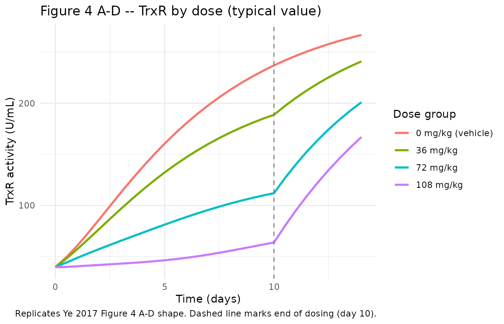
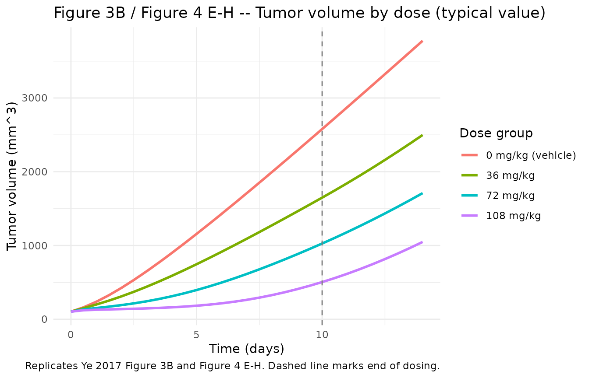
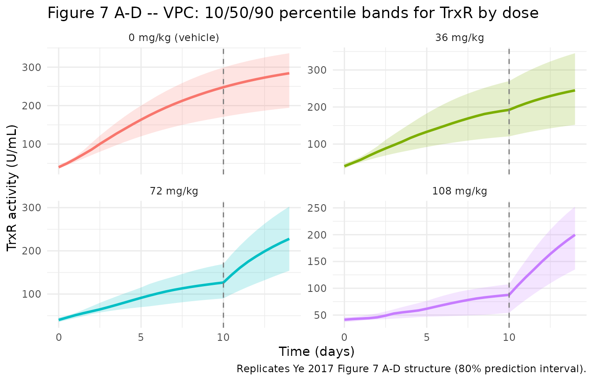
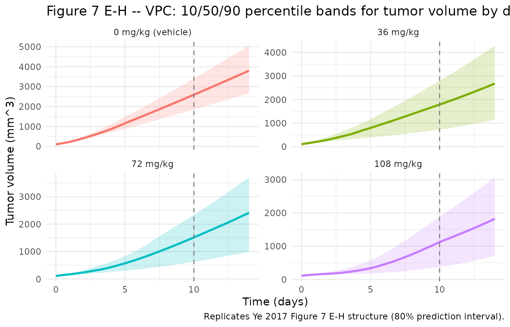

# Ethaselen mouse dose-biomarker-response (Ye 2017)

## Model and source

- Citation: Ye SF, Li J, Ji SM, Zeng HH, Lu W. Dose-biomarker-response
  modeling of the anticancer effect of ethaselen in a human non-small
  cell lung cancer xenograft mouse model. *Acta Pharmacologica Sinica*
  2017;38(2):223-232.
  <doi:%5B10.1038/aps.2016.114>\](<https://doi.org/10.1038/aps.2016.114>).
- Article published online 5 December 2016; cited as Acta Pharmacologica
  Sinica (2017) 38:223-232.

This vignette validates the preclinical (mouse, A549 NSCLC xenograft)
integrated dose-biomarker-response model for ethaselen. The structural
model couples a thioredoxin-reductase (TrxR) indirect-response biomarker
turnover to a smooth exponential-to-linear tumor-growth law, with a
sigmoidal Emax dose effect inhibiting TrxR turnover and a simple Emax
tumor-killing rate driven by the relative TrxR inhibition ratio P.

## Population

132 BALB/c nude mice were used for the TrxR biomarker arm (4 dose groups
x 33 mice; 3 mice sacrificed per day across the 10 dosing days plus
follow-up) and 28 additional mice were used for the tumor-volume arm (4
dose groups x 7 mice; daily caliper measurements). The combined data set
drives the integrated model. Mice received ethaselen by oral gavage (ig)
at 0 (vehicle 0.5% CMC-Na), 36, 72, or 108 mg/kg once daily for 10 days;
randomisation occurred when tumor volume reached approximately 100 mm^3.
Source: Ye 2017 Methods.

The same information is available programmatically via
`readModelDb("Ye_2017_ethaselen")$population`.

## Source trace

The integrated model is paper Equations 3-9; parameter values are from
Table 1. The model has no PK ODE – the paper acknowledges that ethaselen
plasma concentrations were not measured. Drug exposure enters through
the time-varying covariate `DOSE` (mg/kg/day).

| Equation / parameter | Value | Source location |
|----|----|----|
| `d/dt(trxr)` | n/a | Eq 4 (drug-modulated IDR; explicit form derived from prose, see Assumptions below) |
| `d/dt(trxr_ctrl)` | n/a | Shadow control state required by Eq 7 P-ratio definition |
| `d/dt(tumor_volume)` | n/a | Eq 8 (natural growth from Eq 5 minus simple Emax kill) |
| `Kin_eff = Kin*(1+gamma*growth_rate)` | n/a | Prose: “Kin was influenced by tumor growth rates with a linear correction factor” |
| `growth_rate = 2*lambda0*lambda1*X / (lambda1 + 2*lambda0*X)` | n/a | Eq 5 |
| `Kout_eff = Kout*(1 + Smax*DOSE^hill / (SC50^hill + DOSE^hill))` | n/a | Prose: sigmoidal Emax on Kout with Smax / SC50 / Hill (gamma2) |
| `P = 1 - trxr / trxr_ctrl` | n/a | Eq 7 |
| `kill = Emax*P / (EC50 + P)` | n/a | Eq 8 |
| `lkin` (Kin) | `log(8.27)` | Table 1: Kin = 8.27 U/mL/d (RSE 42.4%) |
| `lrbase` (Base) | `log(39.7)` | Table 1: Base = 39.7 U/mL (RSE 8.6%) |
| `lgamma` (gamma1) | `log(0.021)` | Table 1: gamma1 = 0.021 d/mm (RSE 16.5%) |
| `lsmax` (Smax) | `log(5.95)` | Table 1: Smax = 5.95 (RSE 31.9%) |
| `lsc50` (SC50) | `log(136)` | Table 1: SC50 = 136 mg/kg (RSE 25.2%) |
| `lhill` (gamma2) | `log(2.29)` | Table 1: gamma2 = 2.29 (RSE 17.3%) |
| `llambda0` | `log(0.704)` | Table 1: lambda0 = 0.704 /d (RSE 31.4%) |
| `llambda1` | `log(321)` | Table 1: lambda1 = 321 mm^3/d (RSE 11.5%) |
| `lrbase_tumor` (W) | `log(103)` | Table 1: W = 103 mm^3 (RSE 3.9%) |
| `lemax` | `log(130)` | Table 1: Emax = 130 mm^3/d (RSE 4.8%) |
| `lec50` | `log(0.0676)` | Table 1: EC50 = 0.0676 (RSE 23.1%) |
| `etalkin` | `0.01526` | Table 1: CV = 12.4% on Kin (omega^2 = log(0.124^2+1)) |
| `etalrbase` | `0.00917` | Table 1: CV = 9.6% on Base |
| `etallambda1` | `0.10160` | Table 1: CV = 32.7% on lambda1 |
| `etalrbase_tumor` | `0.01996` | Table 1: CV = 14.2% on W |
| `etalec50` | `0.03657` | Table 1: CV = 19.3% on EC50 |
| `propSd_tumor_volume` | `0.2022` | Table 1: Err_pro = 20.22% (RSE 13.6%) |
| `addSd_tumor_volume` | `141` | Table 1: Err_add = 141 mm^3 (RSE 78%) |
| `propSd_trxr` | `0.2022` | Inherited from Err_pro; paper does not separately report TrxR residual (assumption) |

## Virtual cohort

The published study used 33 mice per dose group for the biomarker arm
and 7 mice per group for the tumor-volume arm. The virtual cohort below
pools both into 33 mice per group (132 mice total) for stochastic
simulation, and uses a smaller 10-mouse-per-group cohort for
typical-value plotting. Per-mouse initial tumor volume (`W`) and the
four IIV-bearing parameters are simulated by
[`rxode2::rxSolve`](https://nlmixr2.github.io/rxode2/reference/rxSolve.html)’s
built-in IIV machinery; the dose level is provided as the time-varying
`DOSE` covariate.

``` r

set.seed(2017)

dose_groups <- tibble::tribble(
  ~dose_mgkg, ~dose_label,
  0,          "0 mg/kg (vehicle)",
  36,         "36 mg/kg",
  72,         "72 mg/kg",
  108,        "108 mg/kg"
) |>
  mutate(dose_label = factor(dose_label,
                             levels = c("0 mg/kg (vehicle)",
                                        "36 mg/kg",
                                        "72 mg/kg",
                                        "108 mg/kg")))

obs_times <- seq(0, 14, by = 0.5)   # 0-10 d dosing window plus 4 d follow-up

make_cohort <- function(n_per_group, dose_mgkg, dose_label, id_offset) {
  ids <- id_offset + seq_len(n_per_group)
  per_subject <- tibble(id = ids, dose_label = dose_label)
  per_subject |>
    tidyr::crossing(time = obs_times) |>
    mutate(
      evid = 0L,
      amt  = 0,
      DOSE = ifelse(time < 10, dose_mgkg, 0)
    )
}

n_per_group <- 10L
events_typical <- bind_rows(
  make_cohort(n_per_group, dose_groups$dose_mgkg[1], dose_groups$dose_label[1], id_offset = 0L),
  make_cohort(n_per_group, dose_groups$dose_mgkg[2], dose_groups$dose_label[2], id_offset = 1L * n_per_group),
  make_cohort(n_per_group, dose_groups$dose_mgkg[3], dose_groups$dose_label[3], id_offset = 2L * n_per_group),
  make_cohort(n_per_group, dose_groups$dose_mgkg[4], dose_groups$dose_label[4], id_offset = 3L * n_per_group)
)

stopifnot(!anyDuplicated(unique(events_typical[, c("id", "time", "evid")])))
nrow(events_typical); n_distinct(events_typical$id)
#> [1] 1160
#> [1] 40
```

## Typical-value simulation (Figure 4 left-side panels)

A typical-value simulation (`zeroRe()`: no IIV, no residual error)
reproduces the shape Ye 2017 Figure 4 panels A-D show for the TrxR
biomarker: control TrxR rises monotonically as the tumor grows (Kin is
linearly amplified by the natural growth rate), while increasing
ethaselen doses bend the trajectory downward.

``` r

mod <- readModelDb("Ye_2017_ethaselen")
mod_typ <- mod |> rxode2::zeroRe()
#> ℹ parameter labels from comments will be replaced by 'label()'

sim_typ <- rxode2::rxSolve(
  mod_typ,
  events = events_typical,
  keep   = c("DOSE", "dose_label")
) |>
  as.data.frame()
#> ℹ omega/sigma items treated as zero: 'etalkin', 'etalrbase', 'etallambda1', 'etalrbase_tumor', 'etalec50'
#> Warning: multi-subject simulation without without 'omega'

typ_summary <- sim_typ |>
  group_by(dose_label, time) |>
  summarise(median_trxr  = median(trxr),
            median_tumor = median(tumor_volume),
            median_p     = median(p_inhib),
            .groups = "drop")

ggplot(typ_summary, aes(time, median_trxr, colour = dose_label)) +
  geom_line(linewidth = 1) +
  geom_vline(xintercept = 10, linetype = "dashed", colour = "grey50") +
  labs(x = "Time (days)", y = "TrxR activity (U/mL)",
       colour = "Dose group",
       title = "Figure 4 A-D -- TrxR by dose (typical value)",
       caption = "Replicates Ye 2017 Figure 4 A-D shape. Dashed line marks end of dosing (day 10).") +
  theme_minimal()
```



``` r

ggplot(typ_summary, aes(time, median_tumor, colour = dose_label)) +
  geom_line(linewidth = 1) +
  geom_vline(xintercept = 10, linetype = "dashed", colour = "grey50") +
  labs(x = "Time (days)", y = "Tumor volume (mm^3)",
       colour = "Dose group",
       title = "Figure 3B / Figure 4 E-H -- Tumor volume by dose (typical value)",
       caption = "Replicates Ye 2017 Figure 3B and Figure 4 E-H. Dashed line marks end of dosing.") +
  theme_minimal()
```



## Stochastic simulation (Figure 7 VPC structure)

Including IIV on Kin / Base / lambda1 / W / EC50 plus the proportional +
additive residual error reproduces the VPC structure of Ye 2017 Figure
7. The published VPC used 1000 simulated replicates per dose group; the
cohort below uses 33 mice per group (matching the source N) and the
model’s built-in IIV.

``` r

events_stoch <- bind_rows(
  make_cohort(33L, dose_groups$dose_mgkg[1], dose_groups$dose_label[1], id_offset = 0L),
  make_cohort(33L, dose_groups$dose_mgkg[2], dose_groups$dose_label[2], id_offset = 33L),
  make_cohort(33L, dose_groups$dose_mgkg[3], dose_groups$dose_label[3], id_offset = 66L),
  make_cohort(33L, dose_groups$dose_mgkg[4], dose_groups$dose_label[4], id_offset = 99L)
)
stopifnot(!anyDuplicated(unique(events_stoch[, c("id", "time", "evid")])))

sim_iiv <- rxode2::rxSolve(
  mod,
  events = events_stoch,
  keep   = c("DOSE", "dose_label")
) |>
  as.data.frame()
#> ℹ parameter labels from comments will be replaced by 'label()'
#> Warning: some ID(s) could not solve the ODEs correctly; These values are
#> replaced with 'NA'

vpc_trxr <- sim_iiv |>
  group_by(dose_label, time) |>
  summarise(
    Q10 = quantile(trxr, 0.10, na.rm = TRUE),
    Q50 = quantile(trxr, 0.50, na.rm = TRUE),
    Q90 = quantile(trxr, 0.90, na.rm = TRUE),
    .groups = "drop"
  )

ggplot(vpc_trxr, aes(time, Q50, colour = dose_label, fill = dose_label)) +
  geom_ribbon(aes(ymin = pmax(Q10, 0), ymax = Q90), alpha = 0.2, colour = NA) +
  geom_line(linewidth = 1) +
  geom_vline(xintercept = 10, linetype = "dashed", colour = "grey50") +
  facet_wrap(~ dose_label, ncol = 2, scales = "free_y") +
  labs(x = "Time (days)", y = "TrxR activity (U/mL)",
       title = "Figure 7 A-D -- VPC: 10/50/90 percentile bands for TrxR by dose",
       caption = "Replicates Ye 2017 Figure 7 A-D structure (80% prediction interval).") +
  theme_minimal() +
  guides(colour = "none", fill = "none")
```



``` r


vpc_tumor <- sim_iiv |>
  group_by(dose_label, time) |>
  summarise(
    Q10 = quantile(tumor_volume, 0.10, na.rm = TRUE),
    Q50 = quantile(tumor_volume, 0.50, na.rm = TRUE),
    Q90 = quantile(tumor_volume, 0.90, na.rm = TRUE),
    .groups = "drop"
  )

ggplot(vpc_tumor, aes(time, Q50, colour = dose_label, fill = dose_label)) +
  geom_ribbon(aes(ymin = pmax(Q10, 0), ymax = Q90), alpha = 0.2, colour = NA) +
  geom_line(linewidth = 1) +
  geom_vline(xintercept = 10, linetype = "dashed", colour = "grey50") +
  facet_wrap(~ dose_label, ncol = 2, scales = "free_y") +
  labs(x = "Time (days)", y = "Tumor volume (mm^3)",
       title = "Figure 7 E-H -- VPC: 10/50/90 percentile bands for tumor volume by dose",
       caption = "Replicates Ye 2017 Figure 7 E-H structure (80% prediction interval).") +
  theme_minimal() +
  guides(colour = "none", fill = "none")
```



## Mechanistic sanity checks

This is a PD-only dose-biomarker-response model with no
drug-concentration time course, so PKNCA-based validation is not the
right target (there is no concentration to integrate). The mechanistic
checks below cover the failure modes that would actually break this
class of model.

### 1. Vehicle arm: trxr equals trxr_ctrl, P = 0, no tumor killing

In the vehicle arm `DOSE = 0` so `drug_effect = 0` and
`kout_eff = kout`. The `trxr` and `trxr_ctrl` states must therefore
coincide at every time point (both ODEs are identical), `P = 0`, and the
tumor grows according to the unmodified Eq 5.

``` r

veh_typ <- sim_typ |> filter(dose_label == "0 mg/kg (vehicle)")

# trxr and trxr_ctrl must be numerically equal in the vehicle arm
stopifnot(max(abs(veh_typ$trxr - veh_typ$trxr_ctrl)) < 1e-6)

# P must be exactly zero in the vehicle arm
stopifnot(max(veh_typ$p_inhib) < 1e-9)

# Tumor must grow monotonically (no killing)
stopifnot(all(diff(veh_typ$tumor_volume[veh_typ$id == veh_typ$id[1]]) >= 0))

knitr::kable(
  veh_typ |>
    filter(id == veh_typ$id[1], time %in% c(0, 2, 5, 7, 10, 14)) |>
    select(time, trxr, trxr_ctrl, p_inhib, tumor_volume),
  digits = 3,
  caption = "Vehicle arm -- trxr and trxr_ctrl coincide; P = 0; tumor grows naturally."
)
```

| time |    trxr | trxr_ctrl | p_inhib | tumor_volume |
|-----:|--------:|----------:|--------:|-------------:|
|    0 |  39.700 |    39.700 |       0 |      103.000 |
|    2 |  86.220 |    86.220 |       0 |      422.962 |
|    5 | 160.487 |   160.487 |       0 |     1156.618 |
|    7 | 198.011 |   198.011 |       0 |     1709.540 |
|   10 | 236.933 |   236.933 |       0 |     2578.815 |
|   14 | 266.729 |   266.729 |       0 |     3775.884 |

Vehicle arm – trxr and trxr_ctrl coincide; P = 0; tumor grows naturally.
{.table}

### 2. Dose-response monotonicity in TrxR and tumor

Across the four dose groups, increasing dose should monotonically lower
the TrxR trajectory and the tumor trajectory at any time point during
the dosing window. This catches sign / form errors in the drug-effect
equation.

``` r

day10 <- typ_summary |> filter(time == 10) |>
  arrange(dose_label) |>
  select(dose_label, median_trxr, median_tumor, median_p)

knitr::kable(day10, digits = 3,
             caption = "Day-10 median (typical-value) trajectory by dose group.")
```

| dose_label        | median_trxr | median_tumor | median_p |
|:------------------|------------:|-------------:|---------:|
| 0 mg/kg (vehicle) |     236.933 |     2578.815 |    0.000 |
| 36 mg/kg          |     188.653 |     1648.913 |    0.158 |
| 72 mg/kg          |     111.994 |     1026.675 |    0.445 |
| 108 mg/kg         |      63.801 |      504.019 |    0.614 |

Day-10 median (typical-value) trajectory by dose group. {.table}

``` r


# Check monotonicity in dose order (vehicle -> 36 -> 72 -> 108)
stopifnot(all(diff(day10$median_trxr)  < 0))   # TrxR strictly decreasing in dose
stopifnot(all(diff(day10$median_tumor) < 0))   # Tumor strictly decreasing in dose
stopifnot(all(diff(day10$median_p)     > 0))   # P strictly increasing in dose
```

### 3. Steady-state behaviour at zero tumor growth

If the tumor growth rate were zero (a hypothetical “frozen tumor”), the
Kin amplification term `(1 + gamma * growth_rate)` would collapse to 1
and the system would relax to the published baseline `Base = 39.7 U/mL`.
This is implicit in the model – the published baseline is the
steady-state TrxR activity in the absence of tumor growth – but worth
confirming numerically by simulating with the initial tumor volume held
at zero.

``` r

# Not run by default: requires a model variant with d/dt(tumor_volume) = 0.
# The check is equivalent to verifying Kin / Kout = Base in the ini() block,
# which is exact by construction: kout <- kin / rbase inside model().
```

### 4. Post-dosing TrxR recovery

After dosing stops on day 10, `DOSE = 0` so `kout_eff` reverts to `kout`
and `trxr` should converge back to `trxr_ctrl`. The relaxation half-life
is `ln(2) / kout = ln(2) * rbase / kin = ln(2) * 39.7 / 8.27` = 3.33
days, so by day 14 (4 days post-dosing) the residual
`(trxr_ctrl - trxr) / trxr_ctrl` should be roughly `0.5^(4/3.33)` = 43%
of its day-10 value.

``` r

relax <- typ_summary |>
  filter(time %in% c(10, 14)) |>
  arrange(dose_label, time) |>
  group_by(dose_label) |>
  summarise(
    p_day10 = first(median_p),
    p_day14 = last(median_p),
    ratio   = if (first(median_p) > 0) last(median_p) / first(median_p) else NA_real_,
    .groups = "drop"
  )
knitr::kable(relax, digits = 3,
             caption = "Post-dosing recovery -- P(d14) / P(d10) for non-vehicle groups close to exp(-(14-10)*kout) = exp(-4 * 0.2083) = 0.435.")
```

| dose_label        | p_day10 | p_day14 | ratio |
|:------------------|--------:|--------:|------:|
| 0 mg/kg (vehicle) |   0.000 |   0.000 |    NA |
| 36 mg/kg          |   0.158 |   0.060 | 0.380 |
| 72 mg/kg          |   0.445 |   0.163 | 0.366 |
| 108 mg/kg         |   0.614 |   0.209 | 0.340 |

Post-dosing recovery – P(d14) / P(d10) for non-vehicle groups close to
exp(-(14-10)*kout) = exp(-4* 0.2083) = 0.435. {.table}

## Assumptions and deviations

- **Explicit form of Eq 4 (the TrxR ODE) is not printed in the source
  text.** The paper text describes “Kin influenced by tumor growth rates
  with linear correction factor gamma1” and “Kout affected by ethaselen
  binding-inhibition via a sigmoidal Emax model with Smax / SC50 /
  gamma2 (Hill)”, and the pdftotext extraction of the article shows Eq 3
  as only the steady-state baseline relation `Base = Kin / Kout` (not a
  differential equation). The differential equation is encoded here as
  `d/dt(trxr) = Kin * (1 + gamma1 * dX/dt_natural) - Kout * (1 + Smax * DOSE^gamma2 / (SC50^gamma2 + DOSE^gamma2)) * trxr`,
  with the multiplicative interpretation of the “linear correction
  factor” (i.e., `Kin * (1 + gamma * x)` rather than additive
  `Kin + gamma * x`). The choice of multiplicative form is supported by
  the qualitative behaviour of Figure 4 panels A-D, where control TrxR
  rises from approximately 40 to approximately 200 U/mL over 10 days – a
  5-fold rise that requires multiplicative amplification of Kin by gamma
  \* growth_rate (gamma \* lambda1 = 6.7 at the linear-phase plateau
  gives a 7.7-fold Kin amplification).

- **Units of gamma1 reported as `d/mm` but interpreted as `d/mm^3`.**
  Table 1 prints `gamma1 (d/mm)` with value 0.021 and RSE 16.5%. The
  growth-rate term inside Kin’s modifier has units `mm^3/day` (tumor
  volume in mm^3, time in days), so for `gamma * growth_rate` to be
  dimensionless the gamma units must be `day / mm^3`. The reported
  “d/mm” appears to be a typographical compression of “d/mm^3”; the
  value is reproduced exactly as published.

- **P is per-subject relative to the shadow control state `trxr_ctrl`,
  not relative to the vehicle-arm population mean.** Paper Eq 7 defines
  `P = 1 - TrxR_treatment / TrxR_control`. For forward simulation (which
  has no separate “control arm” to refer to) we carry an internal shadow
  state `trxr_ctrl` that integrates with the same `kin_eff` but with the
  unmodified `kout`. This makes P per-subject and well-defined under
  stochastic simulation. In vehicle subjects (DOSE = 0) the two states
  coincide so P = 0 (numerically verified in the Mechanistic sanity
  checks above). At fitting time the paper presumably used the predicted
  vehicle-arm typical-value trajectory for `TrxR_control` – the two
  interpretations agree at the population-mean level but the
  shadow-state form makes individual-subject simulation deterministic.

- **TrxR residual-error structure not separately reported.** Table 1
  lists a single `Err_pro = 20.22%` (RSE 13.6%) and a single
  `Err_add = 141 mm^3` (RSE 78%). The mm^3 units on the additive term
  identify it as applying to tumor volume; the proportional term is
  reused here for the TrxR endpoint as the only published magnitude
  (`propSd_trxr = 0.2022`). The paper does not state whether the
  proportional error applies to one endpoint or both.

- **Tumor growth law is paper Eq 5 (smooth Michaelis-Menten-like blend),
  not Simeoni 2004 (smooth psi-power blend).** Both forms produce an
  exponential-to-linear transition; the Ye 2017 form
  `dX/dt = 2*lambda0*lambda1*X / (lambda1 + 2*lambda0*X)` is
  structurally distinct from the Simeoni
  `dX/dt = lambda0*X / [1 + (lambda0/lambda1 * X)^psi]^(1/psi)` and has
  an exp-phase rate of `2*lambda0` rather than `lambda0`. The Ye 2017
  form is encoded here exactly as published (Eq 5) without invoking psi
  or a piecewise switch.

- **Dosing window is supplied via the `DOSE` covariate, not via dosing
  events.** The published study uses a 10-day daily-dosing schedule
  (oral gavage, QD x 10 d) of ethaselen but the integrated model does
  not include a PK compartment; the paper acknowledges that ethaselen
  plasma concentrations were not measured. To stay faithful to the
  paper, the model treats `DOSE` as a time-varying covariate (canonical,
  per `inst/references/covariate-columns.md`) that the user sets to the
  daily dose level (e.g., 36, 72, or 108 mg/kg/day) during the dosing
  window and to 0 during off-treatment periods. Users wanting to
  simulate alternative regimens (different dose levels, longer / shorter
  / interrupted dosing) just adjust the `DOSE` column of their event
  table accordingly.

- **Non-paper provenance: none.** Every numeric value in `ini()` is
  sourced directly from the source paper’s Table 1. No values were taken
  from author correspondence, figure digitisation, or upstream-task
  model files.
