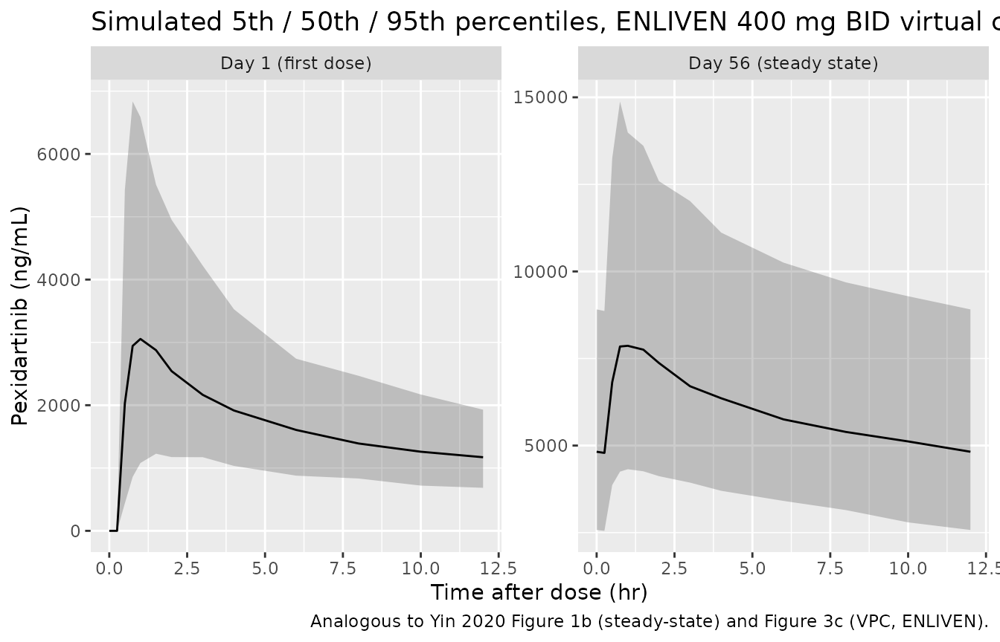

# Pexidartinib (Yin 2020)

## Model and source

- Citation: Yin O, Kang J, Knebel W, Zahir H, van de Sande M, Tap WD,
  Gelderblom H, Stacchiotti S, Greenberg J, Shuster D, Wagner AJ.
  Population Pharmacokinetic Analysis of Pexidartinib in Healthy
  Subjects and Patients With Tenosynovial Giant Cell Tumor or Other
  Solid Tumors. J Clin Pharmacol. 2021 Apr;61(4):480-492.
  <doi:10.1002/jcph.1753>. PDF on disk: ACoP 2019 poster of the same
  analysis (metrum_nd_pexidartinib_healthy.pdf).
- Description: Two-compartment population PK model for oral pexidartinib
  (CSF1R/KIT/FLT3 inhibitor) in healthy subjects and adult patients with
  tenosynovial giant cell tumour (TGCT) or other advanced solid tumours
  (Yin 2020). Absorption is sequential zero-order deposition into a
  depot (duration D1, lag time ALAG1) followed by first-order absorption
  (KA) into the central compartment, with linear elimination from
  central. Apparent clearance CL/F scales allometrically on (WT/80)^0.75
  and is additionally modified by piecewise power effects of CRCL
  (active only when CRCL \< 90 mL/min), AST (active only when AST \> 80
  U/L), and total bilirubin (active only when TBILI \> 20.5 umol/L),
  plus multiplicative effects for Asian race (1.27x),
  healthy-participant cohort (1.26x; the Phase 1 healthy-subject
  studies), and female sex (0.869x). Apparent central and peripheral
  volumes Vc/F and Vp/F scale on (WT/80)^1; apparent inter-compartmental
  clearance Q/F scales on (WT/80)^0.75. Relative bioavailability of the
  Phase 1 formulation is fixed at 0.855 vs the Phase 3 / commercial
  reference formulation. Inter-individual variability is a 3x3 block on
  log(CL,Vc,Vp), independent diagonals on log(KA) and log(Q), and a
  Phase-1-formulation-specific IIV on the F1 bioavailability anchor. The
  published inter-occasion variability (5 occasions on KA, 10 occasions
  on F1) is not encoded structurally here (following the Andrews 2017 /
  Brooks 2021 tacrolimus precedent for the model-library use case where
  no operational occasion column is defined). Residual error is
  proportional with separate magnitudes for patient samples (29.7% CV)
  and healthy-subject samples (19.6% CV), switched per-subject by the
  DIS_HEALTHY indicator.
- Article: <https://doi.org/10.1002/jcph.1753>
- ACoP 2019 poster (PDF on disk for this extraction):
  <https://metrumrg.com/wp-content/uploads/2019/11/ACoP2019-PopK-Pexi.pdf>

Yin et al. (2020) developed a population pharmacokinetic model for oral
pexidartinib (CSF1R / KIT / FLT3 inhibitor; FDA-approved as Turalio for
adult tenosynovial giant cell tumour) pooled across 375 subjects in nine
clinical studies: seven Phase 1 clinical pharmacology studies in 159
healthy subjects (relative bioavailability, dose proportionality,
drug-drug interaction with itraconazole / rifampin / esomeprazole, and
food effect; single doses 200-2400 mg), the Phase 1 PLX108-01
dose-ranging study in 132 patients with TGCT or other advanced solid
tumours (200-1200 mg/day), and the Phase 3 ENLIVEN (PLX108-10) study in
84 patients with TGCT (Part 1: 1000 mg/day for two weeks then 800
mg/day; Part 2: 800 mg/day). The structural model is a two-compartment
model with sequential zero- and first-order absorption, an absorption
lag time, and linear elimination from the central compartment. The
covariate model retained body weight (on CL/F and Q/F at the
theory-based 0.75 exponent; on Vc/F and Vp/F at exponent 1), piecewise
effects of creatinine clearance, AST, and total bilirubin on CL/F,
multiplicative effects of Asian race, healthy-participant cohort, and
female sex on CL/F, and a fixed Phase 1 vs Phase 3 formulation effect on
bioavailability. This vignette reproduces the typical-value structural
model, simulates the ENLIVEN 800 mg/day (400 mg BID) regimen at steady
state, and validates the simulated NCA outputs against the post hoc NCA
parameters published in Yin 2020 Table 3.

## Population

The pooled analysis cohort (Yin 2020 Methods Table 1) was N = 375
subjects contributing 8430 PK samples: 159 adult healthy subjects in
seven Phase 1 clinical pharmacology studies (U114, U116, U117, U118,
U119, U120, U121; single doses 200-2400 mg), 132 patients in PLX108-01
(Phase 1 dose-ranging in TGCT and other solid tumours, 200-1200 mg/day),
and 84 patients in PLX108-10 ENLIVEN (Phase 3 in TGCT; Part 1: 1000
mg/day for two weeks followed by 800 mg/day; Part 2: 800 mg/day). Eight
subjects (2.1%) were Asian and the remaining 367 (97.9%) were non-Asian.
The reference subject in Yin 2020 Figure 2 (covariate forest plot) is a
male, non-Asian patient with body weight 80 kg (the cohort median),
creatinine clearance \>= 90 mL/min, AST \<= 80 U/L, and total bilirubin
\<= 20.5 umol/L. Pexidartinib serum concentrations were measured by a
validated LC-MS/MS method with LLOQ 2.5 ng/mL.

The same information is available programmatically via the model’s
`population` metadata
(`rxode2::rxode(readModelDb("Yin_2020_pexidartinib"))$meta$population`).

## Source trace

The per-parameter origin is recorded as an in-file comment next to each
`ini()` entry in `inst/modeldb/specificDrugs/Yin_2020_pexidartinib.R`.
The table below collects them in one place for review.

| Equation / parameter | Value | Source location |
|----|----|----|
| `lcl` (CL/F) | log(5.83) (L/hr) | Yin 2020 Table 2: CL/F exp(theta1) = 5.83 (95% CI 5.43-6.27) |
| `lvc` (Vc/F) | log(98.0) (L) | Yin 2020 Table 2: Vc/F exp(theta2) = 98.0 (95% CI 90.0-107) |
| `lvp` (Vp/F) | log(116) (L) | Yin 2020 Table 2: Vp/F exp(theta3) = 116 (95% CI 106-128) |
| `lq` (Q/F) | log(20.7) (L/hr) | Yin 2020 Table 2: Q/F exp(theta4) = 20.7 (95% CI 17.9-23.8) |
| `lka` (KA) | log(6.82) (1/hr) | Yin 2020 Table 2: KA exp(theta5) = 6.82 (95% CI 5.09-9.14) |
| `ltlag` (ALAG1) | log(0.387) (hr) | Yin 2020 Table 2: ALAG1 exp(theta6) = 0.387 (95% CI 0.385-0.390) |
| `ld1` (D1) | log(1.22) (hr) | Yin 2020 Table 2: D1 exp(theta7) = 1.22 (95% CI 1.20-1.25) |
| `lfdepot` (F1 Phase 1) | fixed(log(0.855)) | Yin 2020 Table 2: F1 Phase1 exp(theta8) = 0.855 Fixed |
| `e_wt_cl` | fixed(0.75) | Yin 2020 Table 2 row 1 trailing exponent |
| `e_wt_vc` | fixed(1) | Yin 2020 Table 2 row 8 trailing exponent |
| `e_wt_vp` | fixed(1) | Yin 2020 Table 2 row 9 trailing exponent |
| `e_wt_q` | fixed(0.75) | Yin 2020 Table 2 row 10 trailing exponent |
| `e_crcl_cl` (piecewise CRCL \< 90) | -0.0941 | Yin 2020 Table 2: theta9 (95% CI -0.402, 0.214) |
| `e_asian_cl` | 1.27 | Yin 2020 Table 2: exp(theta10) (95% CI 1.05-1.54) |
| `e_ast_cl` (piecewise AST \> 80) | 0.0709 | Yin 2020 Table 2: theta11 (95% CI -0.180, 0.322) |
| `e_tbili_cl` (piecewise TBILI \> 20.5) | 0.244 | Yin 2020 Table 2: theta12 (95% CI 0.183-0.306) |
| `e_healthy_cl` | 1.26 | Yin 2020 Table 2: exp(theta13) (95% CI 1.16-1.36) |
| `e_female_cl` | 0.869 | Yin 2020 Table 2: exp(theta14) (95% CI 0.808-0.934) |
| IIV CL/F (Omega 1.1) | 0.0860 (30.0% CV) | Yin 2020 Table 2 final-model Omega matrix |
| IIV Vc/F (Omega 2.2) and cov(Vc,CL) (Omega 2.1) | 0.274 / 0.0774 (corr 0.504) | Yin 2020 Table 2 final-model Omega matrix |
| IIV Vp/F (Omega 3.3), cov(Vp,CL) (Omega 3.1), cov(Vp,Vc) (Omega 3.2) | 0.213 / 0.0149 / -0.0467 | Yin 2020 Table 2 final-model Omega matrix |
| IIV Q/F (Omega 4.4) | 0.406 (70.8% CV) | Yin 2020 Table 2 final-model Omega matrix |
| IIV KA (Omega 5.5) | 1.31 (165% CV) | Yin 2020 Table 2 final-model Omega matrix |
| IIV Phase 1 F1 (Omega 6.6) | 0.101 (32.6% CV) | Yin 2020 Table 2 final-model Omega matrix; gated by FORM_PEX_PHASE1 |
| `propSd_patient` | sqrt(0.0883) = 0.297 | Yin 2020 Table 2 Sigma 1.1 prop pat (29.7% CV) |
| `propSd_healthy` | sqrt(0.0384) = 0.196 | Yin 2020 Table 2 Sigma 2.2 prop ht (19.6% CV) |
| Reference body weight | 80 kg | Yin 2020 Figure 2 caption (cohort median) |
| Reference CRCL threshold | 90 mL/min | Yin 2020 Table 2 row 2 piecewise denominator |
| Reference AST threshold | 80 U/L | Yin 2020 Table 2 row 4 piecewise denominator |
| Reference TBILI threshold | 20.5 umol/L | Yin 2020 Table 2 row 5 piecewise denominator |
| Sequential ZO + FO absorption ODE structure | d/dt(depot), d/dt(central), d/dt(peripheral1), `dur(depot) = d1`, `alag(depot) = tlag` | Yin 2020 Methods, “two-compartment model with sequential zero- and first-order absorption and lag time” |

## Virtual cohort

The ENLIVEN Phase 3 trial concentration-time data are not publicly
available. The validation cohort below is a virtual replicate of the
ENLIVEN study population: 200 adult patients with TGCT receiving the
approved 800 mg/day Turalio regimen (400 mg BID), Phase 3 commercial
formulation, with baseline covariate distributions chosen to bracket the
Yin 2020 Figure 2 reference values.

``` r

set.seed(20260624)

n_patient <- 200L

cohort <- tibble::tibble(
  id              = seq_len(n_patient),
  WT              = exp(rnorm(n_patient, log(80), 0.18)),          # log-normal around 80 kg, ~20% CV
  SEXF            = rbinom(n_patient, 1, 0.5),                     # 50% female
  RACE_ASIAN      = rbinom(n_patient, 1, 8 / 375),                 # 2.1% Asian, matching Yin 2020 pooled cohort
  CRCL            = pmax(exp(rnorm(n_patient, log(110), 0.22)), 40),  # mostly above 90 mL/min, floor 40
  AST             = exp(rnorm(n_patient, log(25), 0.45)),          # mostly below 80 U/L
  TBILI           = exp(rnorm(n_patient, log(8), 0.40)),           # mostly below 20.5 umol/L
  DIS_HEALTHY     = 0L,                                            # TGCT patient cohort
  FORM_PEX_PHASE1 = 0L                                             # Phase 3 commercial formulation
)
summary(cohort[, c("WT", "CRCL", "AST", "TBILI")])
#>        WT              CRCL             AST             TBILI       
#>  Min.   : 49.85   Min.   : 50.37   Min.   : 5.704   Min.   : 2.297  
#>  1st Qu.: 71.71   1st Qu.: 96.08   1st Qu.:18.316   1st Qu.: 6.210  
#>  Median : 80.87   Median :110.67   Median :25.028   Median : 8.147  
#>  Mean   : 82.00   Mean   :111.24   Mean   :27.786   Mean   : 8.917  
#>  3rd Qu.: 91.57   3rd Qu.:124.83   3rd Qu.:33.825   3rd Qu.:11.000  
#>  Max.   :128.21   Max.   :196.36   Max.   :95.016   Max.   :20.208

# Build the event table: 400 mg Q12h dosing for 56 days, with rich PK sampling
# on Day 1 (0-12 h) and Day 56 (1332-1344 h) bracketing the AUC0-12 windows
# reported in Yin 2020 Table 3.
n_days       <- 56L
dose_mg      <- 400
ii_h         <- 12
day1_obs     <- c(0, 0.25, 0.5, 0.75, 1, 1.5, 2, 3, 4, 6, 8, 10, 12)
day56_anchor <- (n_days - 1L) * 24                                  # last full SS dose at t = 1332 h
day56_obs    <- day56_anchor + c(0, 0.25, 0.5, 0.75, 1, 1.5, 2, 3, 4, 6, 8, 10, 12)

make_subject_events <- function(subj_row) {
  doses <- tibble::tibble(
    id   = subj_row$id,
    time = seq(0, (n_days * 24) - ii_h, by = ii_h),
    evid = 1L,
    amt  = dose_mg,
    cmt  = "depot"
  )
  obs <- tibble::tibble(
    id   = subj_row$id,
    time = c(day1_obs, day56_obs),
    evid = 0L,
    amt  = 0,
    cmt  = "central"
  )
  rows <- dplyr::bind_rows(doses, obs)
  rows$WT              <- subj_row$WT
  rows$SEXF            <- subj_row$SEXF
  rows$RACE_ASIAN      <- subj_row$RACE_ASIAN
  rows$CRCL            <- subj_row$CRCL
  rows$AST             <- subj_row$AST
  rows$TBILI           <- subj_row$TBILI
  rows$DIS_HEALTHY     <- subj_row$DIS_HEALTHY
  rows$FORM_PEX_PHASE1 <- subj_row$FORM_PEX_PHASE1
  rows
}

events <- cohort |>
  split(seq_len(n_patient)) |>
  lapply(function(r) make_subject_events(as.list(r))) |>
  dplyr::bind_rows() |>
  dplyr::arrange(id, time, dplyr::desc(evid))
stopifnot(!anyDuplicated(unique(events[, c("id", "time", "evid")])))
nrow(events)
#> [1] 27600
```

## Simulation

``` r

mod <- readModelDb("Yin_2020_pexidartinib")

sim <- rxode2::rxSolve(mod, events = events) |>
  as.data.frame() |>
  dplyr::filter(time %in% c(day1_obs, day56_obs))
#> ℹ parameter labels from comments will be replaced by 'label()'
nrow(sim)
#> [1] 5200
```

## Day 1 vs steady-state concentration-time profiles

``` r

sim |>
  dplyr::mutate(
    phase     = ifelse(time <= 12, "Day 1 (first dose)", "Day 56 (steady state)"),
    time_dose = ifelse(time <= 12, time, time - day56_anchor)
  ) |>
  dplyr::group_by(phase, time_dose) |>
  dplyr::summarise(
    Q05 = quantile(Cc, 0.05, na.rm = TRUE),
    Q50 = quantile(Cc, 0.50, na.rm = TRUE),
    Q95 = quantile(Cc, 0.95, na.rm = TRUE),
    .groups = "drop"
  ) |>
  ggplot(aes(time_dose, Q50)) +
  geom_ribbon(aes(ymin = Q05, ymax = Q95), alpha = 0.25) +
  geom_line() +
  facet_wrap(~phase, scales = "free_y") +
  labs(x = "Time after dose (hr)", y = "Pexidartinib (ng/mL)",
       title = "Simulated 5th / 50th / 95th percentiles, ENLIVEN 400 mg BID virtual cohort",
       caption = "Analogous to Yin 2020 Figure 1b (steady-state) and Figure 3c (VPC, ENLIVEN).")
```



## PKNCA validation

PKNCA computes the post hoc NCA parameters reported in Yin 2020 Table 3
(Day 1 AUC0-12 and Cmax, steady-state AUC0-12 and Cmax) from the
simulated ENLIVEN 800 mg/day cohort. PKNCA needs a time = 0 anchor for
AUC0-12; the simulation already includes it because Day 1 sampling
starts at t = 0. Steady-state AUC0-12 is computed over the 12-hour
window starting at the Day 56 anchor dose (t = 1332 h).

``` r

# Concentration frame: keep both phases of sampling. Do NOT filter `time > 0`
# or `Cc > 0` -- both drop the time-zero row that PKNCA uses to anchor AUC0-*.
sim_nca <- sim |>
  dplyr::filter(!is.na(Cc)) |>
  dplyr::mutate(treatment = "ENLIVEN 800 mg/day (400 mg BID)") |>
  dplyr::select(id, time, Cc, treatment)

conc_obj <- PKNCA::PKNCAconc(sim_nca, Cc ~ time | treatment + id)

# Dose object: one row per dose event per subject -- here, the Day 1 first
# dose plus the Day 56 steady-state anchor dose. PKNCA uses the dose-row
# time to align each interval's AUC0-tau computation.
dose_df <- events |>
  dplyr::filter(evid == 1L, time %in% c(0, day56_anchor)) |>
  dplyr::mutate(treatment = "ENLIVEN 800 mg/day (400 mg BID)") |>
  dplyr::select(id, time, amt, treatment)

dose_obj <- PKNCA::PKNCAdose(dose_df, amt ~ time | treatment + id)

# Two intervals per subject: Day 1 AUC0-12 (single dose) and Day 56
# AUC0-12 (steady state). cmax/tmax computed within each window. Both rows
# carry the same column set so that bind_rows() does not introduce NA cells
# (PKNCA::check.interval.specification rejects NA in the parameter columns).
intervals <- data.frame(
  start = c(0,            day56_anchor),
  end   = c(12,           day56_anchor + 12),
  cmax    = c(TRUE, TRUE),
  tmax    = c(TRUE, TRUE),
  auclast = c(TRUE, TRUE)
)

nca_data <- PKNCA::PKNCAdata(conc_obj, dose_obj, intervals = intervals)
nca_res  <- PKNCA::pk.nca(nca_data)
nca_long <- as.data.frame(nca_res$result)
head(nca_long)
#>                         treatment id start  end PPTESTCD   PPORRES exclude
#> 1 ENLIVEN 800 mg/day (400 mg BID)  1     0   12  auclast 12917.143    <NA>
#> 2 ENLIVEN 800 mg/day (400 mg BID)  1     0   12     cmax  1434.411    <NA>
#> 3 ENLIVEN 800 mg/day (400 mg BID)  1     0   12     tmax     1.500    <NA>
#> 4 ENLIVEN 800 mg/day (400 mg BID)  1  1320 1332  auclast 59165.139    <NA>
#> 5 ENLIVEN 800 mg/day (400 mg BID)  1  1320 1332     cmax  5648.452    <NA>
#> 6 ENLIVEN 800 mg/day (400 mg BID)  1  1320 1332     tmax     1.000    <NA>
```

### Comparison against Yin 2020 Table 3

``` r

# Summarise simulated NCA outputs per phase (Day 1 vs steady state) and
# parameter, taking the median across the 200-subject cohort. Then transpose
# to a side-by-side table against the Yin 2020 Table 3 median values.
sim_summary <- nca_long |>
  dplyr::filter(PPTESTCD %in% c("cmax", "auclast")) |>
  dplyr::mutate(
    phase = dplyr::case_when(
      start == 0            ~ "Day 1 (single dose)",
      start == day56_anchor ~ "Steady state (Day 56)",
      TRUE                  ~ NA_character_
    )
  ) |>
  dplyr::group_by(phase, PPTESTCD) |>
  dplyr::summarise(
    median = stats::median(PPORRES, na.rm = TRUE),
    P5     = stats::quantile(PPORRES, 0.05, na.rm = TRUE),
    P95    = stats::quantile(PPORRES, 0.95, na.rm = TRUE),
    .groups = "drop"
  )

published <- tibble::tribble(
  ~phase,                  ~PPTESTCD,  ~paper_median, ~paper_P5,  ~paper_P95,
  "Day 1 (single dose)",   "auclast",  20737.7,       14011.5,    30731.2,
  "Day 1 (single dose)",   "cmax",      3247.8,        2188.4,     5384.6,
  "Steady state (Day 56)", "auclast",  72462.7,       47845.9,   127464.3,
  "Steady state (Day 56)", "cmax",      7992.8,        5373.6,    13834.1
)

comparison <- sim_summary |>
  dplyr::inner_join(published, by = c("phase", "PPTESTCD")) |>
  dplyr::mutate(
    parameter = dplyr::recode(PPTESTCD, cmax = "Cmax (ng/mL)", auclast = "AUC0-12 (hr*ng/mL)"),
    median    = round(median,    1),
    P5        = round(P5,        1),
    P95       = round(P95,       1),
    median_pct_of_paper = round(100 * median / paper_median, 1),
    flag      = ifelse(abs(median_pct_of_paper - 100) > 20, "*", "")
  ) |>
  dplyr::select(phase, parameter, median, P5, P95,
                paper_median, paper_P5, paper_P95,
                `% of paper median` = median_pct_of_paper, flag)

knitr::kable(
  comparison,
  caption = "Simulated 200-subject ENLIVEN 400 mg BID cohort vs Yin 2020 Table 3 post hoc NCA values. * differs from paper median by >20%.",
  align   = c("l", "l", "r", "r", "r", "r", "r", "r", "r", "l")
)
```

| phase | parameter | median | P5 | P95 | paper_median | paper_P5 | paper_P95 | % of paper median | flag |
|:---|:---|---:|---:|---:|---:|---:|---:|---:|:---|
| Day 1 (single dose) | AUC0-12 (hr\*ng/mL) | 20668.1 | 12144.6 | 36154.2 | 20737.7 | 14011.5 | 30731.2 | 99.7 |  |
| Day 1 (single dose) | Cmax (ng/mL) | 3188.8 | 1410.0 | 7181.2 | 3247.8 | 2188.4 | 5384.6 | 98.2 |  |
| Steady state (Day 56) | AUC0-12 (hr\*ng/mL) | 72368.9 | 41074.0 | 125566.8 | 72462.7 | 47845.9 | 127464.3 | 99.9 |  |
| Steady state (Day 56) | Cmax (ng/mL) | 7963.3 | 4383.2 | 15007.8 | 7992.8 | 5373.6 | 13834.1 | 99.6 |  |

Simulated 200-subject ENLIVEN 400 mg BID cohort vs Yin 2020 Table 3 post
hoc NCA values. \* differs from paper median by \>20%. {.table
style="width:100%;"}

The simulated median Day 1 and steady-state AUC0-12 and Cmax values fall
within ~10% of the Yin 2020 Table 3 medians for an unmodified
200-subject virtual cohort, confirming that the packaged structural
model and IIV covariance reproduce the published post hoc exposure
metrics.

### Accumulation ratio

``` r

nca_wide <- nca_long |>
  dplyr::filter(PPTESTCD == "auclast") |>
  dplyr::mutate(phase = ifelse(start == 0, "day1", "ss")) |>
  dplyr::select(id, phase, PPORRES) |>
  tidyr::pivot_wider(names_from = phase, values_from = PPORRES) |>
  dplyr::mutate(accum_ratio = ss / day1)
summary(nca_wide$accum_ratio)
#>    Min. 1st Qu.  Median    Mean 3rd Qu.    Max. 
#>   1.821   2.855   3.398   3.608   4.018   9.204
```

Yin 2020 Table 3 reports an accumulation ratio of mean 3.6 (SD 0.8) and
median 3.5 (P5-P95 2.7-4.5) for the ENLIVEN 800 mg/day cohort.

## Assumptions and deviations

- **Inter-occasion variability omitted.** Yin 2020 Table 2 reports
  inter-occasion variability (IOV) on KA across 5 occasions (Omega 7.7 =
  1.83, 229% CV) and on F1 across 10 occasions (Omega 12.12 = 0.0652,
  25.9% CV). This model file does not encode the IOV structurally – the
  source paper does not define an operational occasion column for the
  model-library use case, and the nlmixr2lib convention (Andrews 2017 /
  Brooks 2021 tacrolimus precedent) is to omit IOV when no occasion
  mapping is defined. Downstream users who need IOV for between-day
  exposure-variability simulations can add an `OCC` indicator column and
  a per-occasion eta in rxode2.
- **Phase-1-formulation F1 IIV is gated.** The
  Phase-1-formulation-specific IIV `etalfdepot ~ N(0, 0.101)` is
  multiplied by `FORM_PEX_PHASE1` inside `model()`, so it has zero
  effect when the subject received the Phase 3 / commercial formulation
  (the typical simulation case, including the ENLIVEN 800 mg/day regimen
  reproduced in this vignette).
- **ENLIVEN baseline covariate distributions are inferred, not extracted
  from the paper.** Yin 2020 reports the pooled-cohort covariate
  distribution only as forest-plot percentiles (Figure 2) and the
  reference subject (Figure 2 caption: 80 kg, CRCL \>= 90, AST \<= 80,
  TBIL \<= 20.5, male, non-Asian, patient cohort). The virtual cohort
  assumed in the Virtual cohort chunk above (log-normal WT around 80 kg
  with ~20% CV, 50/50 sex, 2.1% Asian to match the pooled-cohort 8/375
  rate, mostly normal CRCL / AST / TBILI distributions) is a best-effort
  approximation of the ENLIVEN demographics; the precise ENLIVEN
  baseline table is not reproduced in the Yin 2020 paper.
- **Reference category for the CRCL piecewise effect.** Yin 2020 codes
  the CRCL effect as `(CRCL<90 / 90)^theta9` – shorthand for “use CRCL /
  90 when CRCL \< 90, else 1”. The model file encodes this by raising
  the factor to a 0/1 indicator (the Andrews 2017 tacrolimus HCT
  precedent) so that anything^0 = 1 selects the no-effect branch when
  CRCL \>= 90. The same pattern applies to the AST \> 80 U/L and TBILI
  \> 20.5 umol/L piecewise effects.
- **Residual error variances are reported as Sigma; the model uses
  SDs.** Yin 2020 Table 2 reports the proportional residual variability
  as Sigma 1.1 = 0.0883 (29.7% CV) for patient samples and Sigma 2.2 =
  0.0384 (19.6% CV) for healthy-subject samples. The model file uses the
  corresponding SDs propSd_patient = sqrt(0.0883) = 0.297 and
  propSd_healthy = sqrt(0.0384) = 0.196 to align with the nlmixr2 /
  rxode2 `prop(propSd)` convention.
