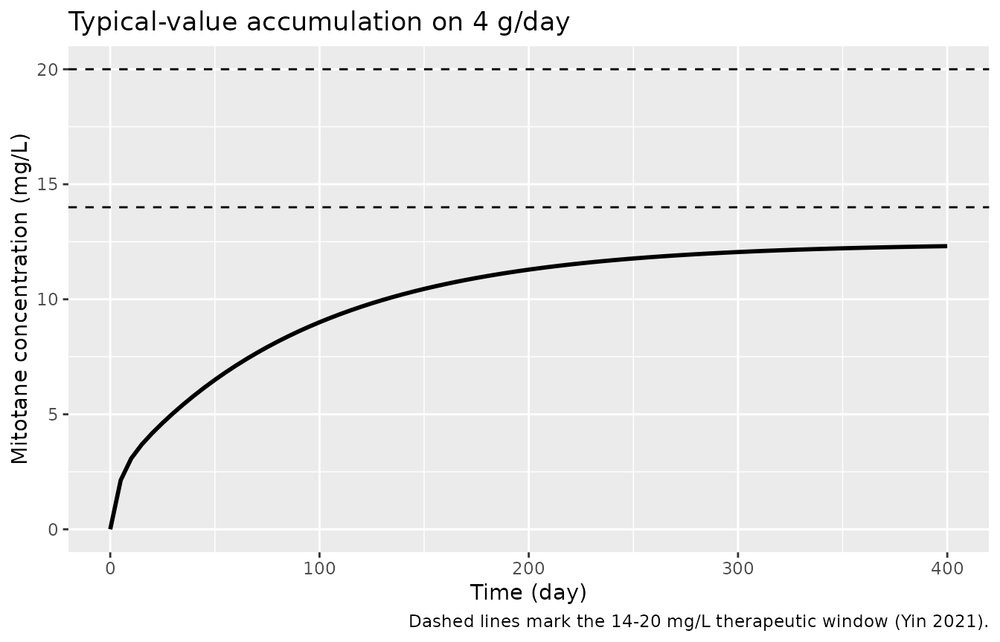

# Mitotane (Yin 2021)

## Model and source

- Citation: Yin A, Ettaieb MHT, Swen JJ, van Deun L, Kerkhofs TMA, van
  der Straaten RJHM, Corssmit EPM, Gelderblom H, Kerstens MN, Feelders
  RA, Eekhoff M, Timmers HJLM, D’Avolio A, Cusato J, Guchelaar HJ, Haak
  HR, Moes DJAR. Population pharmacokinetic and pharmacogenetic analysis
  of mitotane in patients with adrenocortical carcinoma: towards
  individualized dosing. Clin Pharmacokinet. 2021;60(1):89-102.
  <doi:10.1007/s40262-020-00913-y>. Parameter estimates from Table 2
  (final model) and its footnotes a-c; IIV / IOV / residual-error
  equations (Eqs. S1-S2) and covariate forms (Eqs. S4-S5) from Online
  Resource 1. The Boer lean-body-weight coefficients, the
  standard-deviation scale of the printed CV% values and the ODE system
  are taken from the authors’ published Shiny app script
  (github.com/AnyueYin/Shiny-app-script-for-model-simulation—Population-PK-and-PG-analysis-of-mitotane).
- Description: Two-compartment population PK model with first-order
  absorption for oral mitotane in adults with adrenocortical carcinoma
  (Yin 2021), final pharmacogenetic model. Apparent clearance carries a
  power effect of lean body weight (Boer formula, derived from weight,
  height and sex) plus multiplicative genotype effects of CYP2C19\*2
  (rs4244285) carriage, SLCO1B3 699A\>G (rs7311358) G-allele carriage
  and SLCO1B1 571T\>C (rs4149057) CC or TT genotype (TC reference);
  apparent central volume carries a power effect of fat amount (total
  body weight minus lean body weight). Log-normal interindividual
  variability on CL/F, Vc/F, Vp/F and Q/F, interoccasion variability on
  CL/F with one occasion per 200 days of treatment, and combined
  additive plus proportional residual error. The absorption rate
  constant is fixed. Time in days. Yin_2021_mitotane_nogenotype is the
  authors’ alternative model without genotype covariates, for patients
  whose genotype is unknown.
- Article: <https://doi.org/10.1007/s40262-020-00913-y>
- Supplement (Online Resources 1 and 2):
  <https://doi.org/10.1007/s40262-020-00913-y>
- Author simulation code:
  <https://github.com/AnyueYin/Shiny-app-script-for-model-simulation---Population-PK-and-PG-analysis-of-mitotane>

Yin and colleagues developed a two-compartment population
pharmacokinetic model with first-order absorption for oral mitotane in
adults with adrenocortical carcinoma (ACC), and explored the effect of
pharmacogenetic variation on apparent clearance. The package ships two
model files from this paper:

- `Yin_2021_mitotane` – the final **pharmacogenetic** model (Table 2),
  whose apparent clearance carries a lean-body-weight power effect and
  multiplicative genotype effects of CYP2C19\*2 (rs4244285), SLCO1B3
  699A\>G (rs7311358) and SLCO1B1 571T\>C (rs4149057), and whose
  apparent central volume carries a fat-amount power effect.
- `Yin_2021_mitotane_nogenotype` – the authors’ reduced model without
  genotype covariates (Online Resource 1, Table S3), built into their
  Shiny app as the alternative for patients whose genotype is unknown.
  It keeps only the fat-amount effect on the central volume.

Time is in days throughout; concentrations are in mg/L and doses in mg.

## Population

The model was developed from 914 mitotane plasma concentrations (33
below the 2 mg/L LLOQ, omitted) collected retrospectively from 48 adults
with adrenocortical carcinoma (21 male, 27 female) enrolled in the Dutch
Adrenal Network Registry and treated between 2002 and 2017 (Yin 2021,
Table 1). Baseline demographics: age mean 52.0 years (range 22.6-76.8),
weight mean 80.0 kg (range 52.5-120), height mean 172 cm (range
154-193). The median treatment duration was 713.5 days (range 90-2856)
and the median number of samples per patient was 16.5 (range 2-47). The
total daily dose ranged from 0.5 to 16 g, divided into one to four
(occasionally more) administrations; the model simplifies this to a
single daily dose equal to the total daily dose. The therapeutic target
window is 14-20 mg/L.

The same information is available programmatically via each model’s
`population` metadata,
e.g. `readModelDb("Yin_2021_mitotane")()$population`.

## Source trace

Per-parameter origins are recorded as in-file comments next to each
`ini()` entry in `inst/modeldb/specificDrugs/Yin_2021_mitotane.R` and
`inst/modeldb/specificDrugs/Yin_2021_mitotane_nogenotype.R`. The table
collects them for review.

| Equation / parameter | Value (final PG model) | Source location |
|----|----|----|
| `KA` (fixed) | 15.0 /day | Table 2, KA row (estimated on an absorption sub-dataset, then fixed) |
| `CL/F` typical | 298 L/day | Table 2, CL/F row |
| `CL_SNP1` (CYP2C19\*2 GA/AA) | 0.551 | Table 2, CL_SNP1 row |
| `CL_SNP2` (SLCO1B3 AG/GG) | 0.601 | Table 2, CL_SNP2 row |
| `CL_SNP3` (SLCO1B1 CC) | 0.753 | Table 2, CL_SNP3 (CC) row |
| `CL_SNP3` (SLCO1B1 TT) | 2.49 | Table 2, CL_SNP3 (TT) row |
| `CL_LBW` power | 1.10 (ref LBW 56.6 kg) | Table 2, CL_LBW row and footnote a |
| `Vc/F` typical | 6210 L | Table 2, Vc/F row |
| `Vc_FAT` power | 1.22 (ref FAT 23.6 kg) | Table 2, Vc_FAT row and footnote b |
| `Vp/F` typical | 18100 L | Table 2, Vp/F row |
| `Q/F` typical | 883 L/day | Table 2, Q/F row |
| IIV CL/F / Vc/F / Vp/F / Q/F | 43.0 / 47.2 / 88.8 / 97.3 % | Table 2 IIV (CV%) columns; SD scale (Shiny app) |
| IOV on CL/F | 31.6 % (one occasion / 200 days) | Table 2 IOV column and footnote c |
| Residual PRO / ADD | 16.6 % / 0.920 mg/L | Table 2 PRO / ADD rows |
| Boer LBW | male 0.407*WT+0.267*HT-19.2; female 0.252*WT+0.473*HT-48.3 | Section 2.2; Shiny app |
| CL/F, Vc/F, Q/F, Vp/F (no-genotype) | 217, 8450, 609, 15500 | Online Resource 1, Table S3 |
| `Vc_FAT` power (no-genotype) | 1.12 | Online Resource 1, Table S3 |

The IIV/IOV standard-deviation scale (the printed CV% used directly as
the standard deviation of the log-normal random effect, rather than the
`sqrt(exp(omega^2)-1)` log-normal CV) and the ODE system were confirmed
against the authors’ published Shiny app script.

## Structural validation

Mitotane PK is linear, and the covariate and genotype effects enter as
exact multipliers or power terms. The checks below run on the typical
individual (random effects zeroed with
[`rxode2::zeroRe()`](https://nlmixr2.github.io/rxode2/reference/zeroRe.html)),
so the two sides differ only by numerical error and exact bounds are
appropriate.

``` r

mod <- readModelDb("Yin_2021_mitotane") |> rxode2::zeroRe()
#> ℹ parameter labels from comments will be replaced by 'label()'
#> Warning: some etas defaulted to non-mu referenced, possible parsing error: etaiov_cl_1, etaiov_cl_2, etaiov_cl_3, etaiov_cl_4, etaiov_cl_5, etaiov_cl_6, etaiov_cl_7, etaiov_cl_8
#> as a work-around try putting the mu-referenced expression on a simple line
#> Warning: some etas defaulted to non-mu referenced, possible parsing error: etaiov_cl_1, etaiov_cl_2, etaiov_cl_3, etaiov_cl_4, etaiov_cl_5, etaiov_cl_6, etaiov_cl_7, etaiov_cl_8
#> as a work-around try putting the mu-referenced expression on a simple line

# Typical male, 80 kg, 172 cm, reference genotype (GG / AA / TC).
make_single <- function(dose, cyp = 0, slcog = 0, cc = 0, tt = 0,
                        wt = 80, ht = 172, sexf = 0, tmax = 3000, by = 2) {
  d <- as.data.frame(
    rxode2::et(amt = dose, cmt = "depot") |>
      rxode2::et(c(0, seq(1, tmax, by = by)))
  )
  d$WT <- wt; d$HT <- ht; d$SEXF <- sexf; d$OCC <- 1
  d$CYP2C19_S2_CARRIER <- cyp
  d$SNP_SLCO1B3_RS7311358_G_CARRIER <- slcog
  d$SNP_SLCO1B1_RS4149057_CC <- cc
  d$SNP_SLCO1B1_RS4149057_TT <- tt
  d
}

# The apparent-clearance output column carries the covariate/genotype model
# directly, so the exact multipliers can be read off without any NCA step.
cl_of <- function(...) rxode2::rxSolve(mod, make_single(5000, ...))$cl[1]
cl_ref <- cl_of()
#> ℹ omega/sigma items treated as zero: 'etalcl', 'etalvc', 'etalq', 'etalvp', 'etaiov_cl_1', 'etaiov_cl_2', 'etaiov_cl_3', 'etaiov_cl_4', 'etaiov_cl_5', 'etaiov_cl_6', 'etaiov_cl_7', 'etaiov_cl_8'

# Reference CL/F for this covariate set: 298 * (LBW/56.6)^1.10 with the Boer
# male LBW at 80 kg / 172 cm (59.284 kg).
lbw_ref <- 0.407 * 80 + 0.267 * 172 - 19.2
stopifnot(abs(cl_ref - 298 * (lbw_ref / 56.6)^1.10) < 1e-6)

# Genotype multipliers reproduce Table 2 exactly.
stopifnot(
  abs(cl_of(cyp = 1)   / cl_ref - 0.551) < 1e-6,
  abs(cl_of(slcog = 1) / cl_ref - 0.601) < 1e-6,
  abs(cl_of(cc = 1)    / cl_ref - 0.753) < 1e-6,
  abs(cl_of(tt = 1)    / cl_ref - 2.49)  < 1e-6
)
#> ℹ omega/sigma items treated as zero: 'etalcl', 'etalvc', 'etalq', 'etalvp', 'etaiov_cl_1', 'etaiov_cl_2', 'etaiov_cl_3', 'etaiov_cl_4', 'etaiov_cl_5', 'etaiov_cl_6', 'etaiov_cl_7', 'etaiov_cl_8'
#> ℹ omega/sigma items treated as zero: 'etalcl', 'etalvc', 'etalq', 'etalvp', 'etaiov_cl_1', 'etaiov_cl_2', 'etaiov_cl_3', 'etaiov_cl_4', 'etaiov_cl_5', 'etaiov_cl_6', 'etaiov_cl_7', 'etaiov_cl_8'
#> ℹ omega/sigma items treated as zero: 'etalcl', 'etalvc', 'etalq', 'etalvp', 'etaiov_cl_1', 'etaiov_cl_2', 'etaiov_cl_3', 'etaiov_cl_4', 'etaiov_cl_5', 'etaiov_cl_6', 'etaiov_cl_7', 'etaiov_cl_8'
#> ℹ omega/sigma items treated as zero: 'etalcl', 'etalvc', 'etalq', 'etalvp', 'etaiov_cl_1', 'etaiov_cl_2', 'etaiov_cl_3', 'etaiov_cl_4', 'etaiov_cl_5', 'etaiov_cl_6', 'etaiov_cl_7', 'etaiov_cl_8'
```

``` r

# Dose proportionality: AUC scales exactly with dose (linear PK).
auc_last <- function(...) {
  s <- rxode2::rxSolve(mod, make_single(...))
  with(s, sum(diff(time) * (utils::head(Cc, -1) + utils::tail(Cc, -1)) / 2))
}
stopifnot(abs(auc_last(6000) / auc_last(2000) - 3) < 1e-3)
#> ℹ omega/sigma items treated as zero: 'etalcl', 'etalvc', 'etalq', 'etalvp', 'etaiov_cl_1', 'etaiov_cl_2', 'etaiov_cl_3', 'etaiov_cl_4', 'etaiov_cl_5', 'etaiov_cl_6', 'etaiov_cl_7', 'etaiov_cl_8'
#> ℹ omega/sigma items treated as zero: 'etalcl', 'etalvc', 'etalq', 'etalvp', 'etaiov_cl_1', 'etaiov_cl_2', 'etaiov_cl_3', 'etaiov_cl_4', 'etaiov_cl_5', 'etaiov_cl_6', 'etaiov_cl_7', 'etaiov_cl_8'
```

The no-genotype model carries only the fat-amount power effect on the
central volume; it too reproduces exactly.

``` r

mod_ng <- readModelDb("Yin_2021_mitotane_nogenotype") |> rxode2::zeroRe()
#> ℹ parameter labels from comments will be replaced by 'label()'
#> Warning: some etas defaulted to non-mu referenced, possible parsing error: etaiov_cl_1, etaiov_cl_2, etaiov_cl_3, etaiov_cl_4, etaiov_cl_5, etaiov_cl_6, etaiov_cl_7, etaiov_cl_8
#> as a work-around try putting the mu-referenced expression on a simple line
#> Warning: some etas defaulted to non-mu referenced, possible parsing error: etaiov_cl_1, etaiov_cl_2, etaiov_cl_3, etaiov_cl_4, etaiov_cl_5, etaiov_cl_6, etaiov_cl_7, etaiov_cl_8
#> as a work-around try putting the mu-referenced expression on a simple line
vc_of <- function(wt) {
  d <- as.data.frame(rxode2::et(amt = 5000, cmt = "depot") |> rxode2::et(c(0, 1)))
  d$WT <- wt; d$HT <- 172; d$SEXF <- 0; d$OCC <- 1
  rxode2::rxSolve(mod_ng, d)$vc[1]
}
fat <- function(wt) wt - (0.407 * wt + 0.267 * 172 - 19.2)
stopifnot(abs(vc_of(110) / vc_of(60) - (fat(110) / fat(60))^1.12) < 1e-6)
#> ℹ omega/sigma items treated as zero: 'etalcl', 'etalvc', 'etalq', 'etalvp', 'etaiov_cl_1', 'etaiov_cl_2', 'etaiov_cl_3', 'etaiov_cl_4', 'etaiov_cl_5', 'etaiov_cl_6', 'etaiov_cl_7', 'etaiov_cl_8'
#> ℹ omega/sigma items treated as zero: 'etalcl', 'etalvc', 'etalq', 'etalvp', 'etaiov_cl_1', 'etaiov_cl_2', 'etaiov_cl_3', 'etaiov_cl_4', 'etaiov_cl_5', 'etaiov_cl_6', 'etaiov_cl_7', 'etaiov_cl_8'
```

## Terminal half-life across a virtual cohort

The paper reports (Discussion) an estimated terminal half-life ranging
from 16.4 to 700.6 days with a median of 101.5 days, computed from the
individual parameter estimates. We reproduce the central tendency by
simulating a virtual cohort of 200 subjects with full interindividual
variability (a single occasion, `OCC = 1`), giving each a single oral
dose and computing the terminal half-life with PKNCA. Per the caution
that the extreme of a random cohort is not reproducible across rxode2
builds or thread counts, the assertion is on the robust centre only; the
range is reported for context, not gated.

``` r

rxode2::rxSetSeed(1042)
mod_full <- readModelDb("Yin_2021_mitotane")

n <- 200
set.seed(7)
cohort <- data.frame(
  id = seq_len(n),
  WT = pmax(45, rnorm(n, 80, 15.9)),
  HT = rnorm(n, 172, 10),
  SEXF = rbinom(n, 1, 0.563),
  OCC = 1,
  CYP2C19_S2_CARRIER = rbinom(n, 1, 0.3),
  SNP_SLCO1B3_RS7311358_G_CARRIER = rbinom(n, 1, 0.3),
  SNP_SLCO1B1_RS4149057_CC = 0,
  SNP_SLCO1B1_RS4149057_TT = 0
)

grid <- c(0, seq(1, 2000, by = 5))
events <- do.call(rbind, lapply(seq_len(n), function(i) {
  e <- as.data.frame(
    rxode2::et(amt = 5000, cmt = "depot") |> rxode2::et(grid)
  )
  cbind(
    e[, c("time", "amt", "evid", "cmt")],
    cohort[rep(i, nrow(e)), setdiff(names(cohort), "id")],
    id = i
  )
}))

sim <- rxode2::rxSolve(mod_full, events, keep = c("SEXF"))
#> ℹ parameter labels from comments will be replaced by 'label()'
#> Warning: some etas defaulted to non-mu referenced, possible parsing error: etaiov_cl_1, etaiov_cl_2, etaiov_cl_3, etaiov_cl_4, etaiov_cl_5, etaiov_cl_6, etaiov_cl_7, etaiov_cl_8
#> as a work-around try putting the mu-referenced expression on a simple line

hl_conc <- as.data.frame(sim) |>
  dplyr::filter(!is.na(Cc)) |>
  dplyr::select(id, time, Cc)
hl_conc <- dplyr::bind_rows(
  hl_conc,
  hl_conc |> dplyr::distinct(id) |> dplyr::mutate(time = 0, Cc = 0)
) |>
  dplyr::distinct(id, time, .keep_all = TRUE) |>
  dplyr::arrange(id, time)

conc_obj <- PKNCA::PKNCAconc(hl_conc, Cc ~ time | id)
dose_obj <- PKNCA::PKNCAdose(
  data.frame(id = seq_len(n), time = 0, amt = 5000),
  amt ~ time | id
)
hl_res <- PKNCA::pk.nca(
  PKNCA::PKNCAdata(conc_obj, dose_obj,
                   intervals = data.frame(start = 0, end = Inf, half.life = TRUE))
)
#> Warning: id=76: No concentration data
#> Warning: id=170: No concentration data
hl <- as.data.frame(hl_res$result) |>
  dplyr::filter(PPTESTCD == "half.life")

hl_median <- median(hl$PPORRES)
hl_median
#> [1] 110.8923
range(hl$PPORRES)
#> [1]   10.75849 1536.65351

# Structural: the cohort-median terminal half-life sits near the paper's
# reported median of 101.5 days. Band is wide and centre-based so it holds for
# any cohort the model draws (see the assumptions note).
stopifnot(hl_median > 70, hl_median < 160)
```

## Accumulation to the therapeutic window

Mitotane accumulates slowly toward its 14-20 mg/L target over months of
daily dosing, the central clinical challenge the paper addresses. The
typical-value profile below shows a male, 80 kg, 172 cm,
reference-genotype patient on a constant 4 g/day regimen.

``` r

acc <- as.data.frame(
  rxode2::et(amt = 4000, cmt = "depot", ii = 1, until = 400, addl = 400) |>
    rxode2::et(seq(0, 400, by = 5))
)
acc$WT <- 80; acc$HT <- 172; acc$SEXF <- 0; acc$OCC <- 1
acc$CYP2C19_S2_CARRIER <- 0; acc$SNP_SLCO1B3_RS7311358_G_CARRIER <- 0
acc$SNP_SLCO1B1_RS4149057_CC <- 0; acc$SNP_SLCO1B1_RS4149057_TT <- 0

acc_sim <- rxode2::rxSolve(mod, acc)
#> ℹ omega/sigma items treated as zero: 'etalcl', 'etalvc', 'etalq', 'etalvp', 'etaiov_cl_1', 'etaiov_cl_2', 'etaiov_cl_3', 'etaiov_cl_4', 'etaiov_cl_5', 'etaiov_cl_6', 'etaiov_cl_7', 'etaiov_cl_8'

ggplot(as.data.frame(acc_sim), aes(time, Cc)) +
  geom_hline(yintercept = c(14, 20), linetype = "dashed") +
  geom_line(linewidth = 1) +
  labs(
    x = "Time (day)", y = "Mitotane concentration (mg/L)",
    title = "Typical-value accumulation on 4 g/day",
    caption = "Dashed lines mark the 14-20 mg/L therapeutic window (Yin 2021)."
  )
```



## Assumptions and deviations

- The paper does not report a conventional NCA table (Cmax / Tmax / AUC
  per dose group), so validation here is structural: the exact
  reproduction of the Table 2 genotype multipliers and covariate power
  terms on the typical individual, dose-proportionality of a linear
  model, and the cohort-median terminal half-life against the value
  reported in the Discussion (median 101.5 days). The maintainers judged
  these the faithful checks for a linear popPK model whose published
  evaluation was a prediction-corrected VPC and goodness-of-fit plots
  that require the original (non-public) data.
- Interindividual-variability and interoccasion-variability magnitudes
  are encoded on the **standard-deviation scale**: the CV% values
  printed in Table 2 are used directly as the standard deviation of the
  log-normal random effect, matching the authors’ Shiny app (which draws
  `rnorm(sd = CV%/100)` inside `exp(eta)`), not as the
  `sqrt(exp(omega^2)-1)` log-normal CV.
- Interoccasion variability is applied to CL/F with one occasion per 200
  days of treatment. Eight occasions (`OCC` 1-8, covering 0-1600 days)
  are provided; the occasion-1 variance is estimated and occasions 2-8
  repeat it (the analogue of NONMEM `$OMEGA BLOCK(1) SAME`). Records
  with `OCC` outside 1-8 receive no IOV. The half-life and accumulation
  checks above hold a single occasion (`OCC = 1`), matching the
  individual-parameter interpretation used for the paper’s half-life
  summary.
- Lean body weight is derived inside the model from weight, height and
  sex with the sex-specific Boer formula, and fat amount as weight minus
  lean body weight, exactly as coded in the authors’ Shiny app; weight
  and height carry no effect of their own. Two patients missing weight
  and five missing height were assigned the cohort median in the
  original analysis.
- The virtual cohort’s genotype frequencies (30% CYP2C19\*2 carriers,
  30% SLCO1B3 G carriers, all SLCO1B1 TC) are nominal illustrative
  values chosen by the maintainers to exercise the covariate model; the
  paper does not tabulate per-genotype counts, and the half-life
  assertion is centre-based so it does not depend on the exact
  frequencies.
- The cohort-median half-life assertion uses a wide, centre-based band
  (70-160 days) rather than the observed extremes, because the extreme
  of a random cohort is not reproducible across rxode2 builds or solver
  thread counts. The observed range brackets the paper’s reported range
  but is not gated.
- No correction or erratum notice was found for this article as of
  2026-09-27 (checked via the publisher landing page, PubMed, EuropePMC
  and Crossref).
