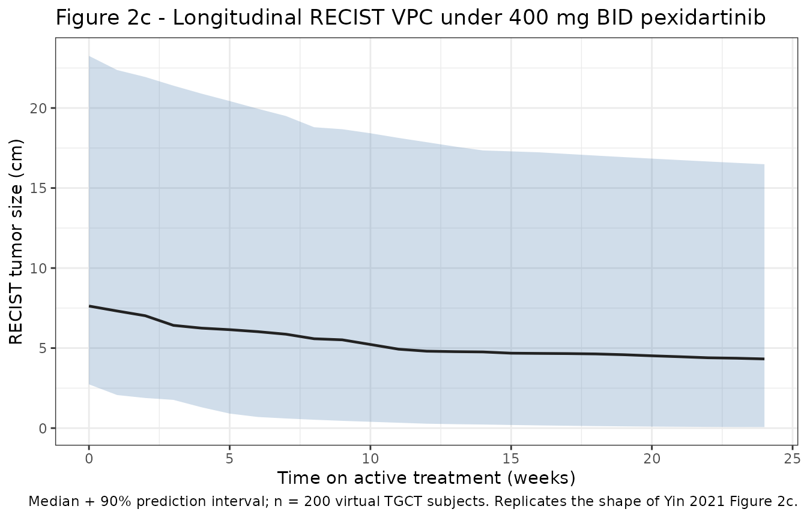
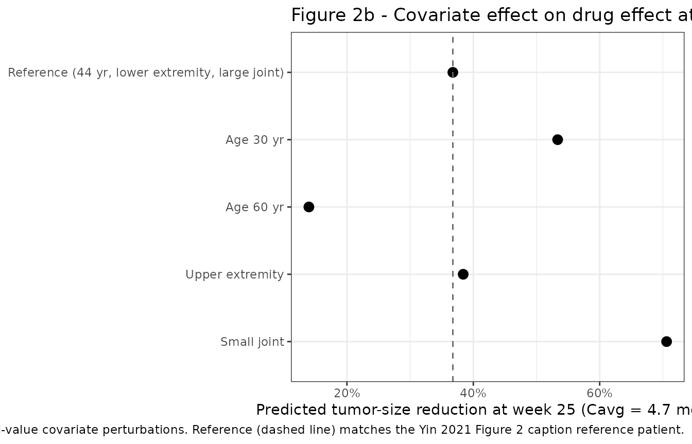

# Pexidartinib TGCT exposure-response (Yin 2021)

## Model and source

- Citation: Yin O, Zahir H, French J, et al. Exposure-response analysis
  of efficacy and safety for pexidartinib in patients with tenosynovial
  giant cell tumor. CPT Pharmacometrics Syst Pharmacol.
  2021;10(11):1422-1432. <doi:10.1002/psp4.12712>. PK backbone (Cavg
  input) adapted from Yin O, Wagner AJ, Kang J, et al. Population
  pharmacokinetic analysis of pexidartinib in healthy subjects and
  patients with tenosynovial giant cell tumor or other solid tumors. J
  Clin Pharmacol. 2020;61(4):480-492. <doi:10.1002/jcph.1753>; see
  modellib(‘Yin_2020_pexidartinib’).
- Description: Semi-mechanistic longitudinal tumor-size (RECIST)
  exposure-response PD model for pexidartinib in adult patients with
  tenosynovial giant cell tumor (TGCT), driven by pre-computed running
  average pexidartinib concentration Cavg (mg/L). Tumor size Y(t)
  declines from an individual baseline Y0 through a saturable drug
  effect gated by an onset first-order process: Y(t) = Y0 \* (1 - Emax
  \* (1 - exp(-kdrug \* Cavg)) \* (1 - exp(-konset \* TAFD))) + growth
  \* time, with Emax fixed at 0.999 and natural tumor growth fixed at 0
  (Yin 2021 Results: the placebo-cohort growth rate estimate 0.227 cm/yr
  had a 95% CI that included zero and was fixed). Baseline Y0,
  drug-effect rate constant kdrug, and onset rate constant konset each
  carry three multiplicative covariate effects: joint extremity (upper
  vs lower reference), joint size (small vs large reference), and age
  centered at 44 years. Individual variability is a 3x3 log-normal block
  on baseline, kdrug, and konset. Residual error is a
  power-of-prediction form SD(Y) = 0.365 \* Ypred^0.550. The
  pexidartinib PK backbone (Cavg input) is a separately extracted model,
  `modellib('Yin_2020_pexidartinib')`, corresponding to the same
  authors’ Yin 2020 J Clin Pharmacol popPK publication (reference 5 in
  Yin 2021). This PD model does NOT carry the ORR proportional-odds
  logistic regression (Table S3) or the piecewise-exponential TTE
  hepatic-AE models (Table S5) that appear as parallel endpoints in Yin
  2021; those are non-ODE statistical / survival regressions and are
  documented in the paired vignette narrative but not encoded here as
  separate model files.
- Article: <https://doi.org/10.1002/psp4.12712>
- Upstream PK model: `modellib('Yin_2020_pexidartinib')` (Yin 2020 J
  Clin Pharmacol, <https://doi.org/10.1002/jcph.1753>)

Yin 2021 is an exposure-response analysis of pexidartinib in adult
patients with tenosynovial giant cell tumor (TGCT). The paper describes
three parallel sub-models fit to the pooled PLX108-01 (Phase 1, n = 31)
and ENLIVEN (Phase 3, n = 110 across placebo, pexidartinib, and
placebo-crossover arms) studies, using running-average pexidartinib
concentration (`Cavg`) predicted by the Yin 2020 population PK model as
the exposure metric:

1.  **Longitudinal tumor-size (RECIST) PD model** (Table S2 of the
    paper) – a semi-mechanistic drug-effect equation with
    covariate-structured `kdrug` and `konset` rate constants. This is
    the sub-model packaged as the `Yin_2021_pexidartinib` model object.
2.  **Overall response rate (ORR) proportional-odds logistic
    regression** (Table S3) – a static Emax-Hill categorical regression
    on `AUCavg` with a joint-size covariate effect on the log-odds;
    nlmixr2lib does not package this as a separate model file (see
    Errata).
3.  **Piecewise-exponential time-to-event (TTE) model** for hepatic
    adverse events (ALT \> 3 x ULN, Table S5) – five per-interval
    baseline hazards with a log-linear slope on `log(Cavg + 0.01)` and
    covariate effects; not packaged as a separate model file (see
    Errata).

## Population

The longitudinal RECIST analysis population is 141 adult TGCT patients
with 781 observations. Demographics (Table S1):

| Cohort | N | Age (SD, yr) | Weight (SD, kg) | Baseline tumor (SD, cm) | Female % | White % | Large joint % | Lower extremity % |
|----|---:|---:|---:|---:|---:|---:|---:|---:|
| PLX108-01 | 31 | 43.2 (13.0) | 81.4 (20.3) | 9.5 (6.6) | 58% | 81% | 74% | 90% |
| ENLIVEN placebo | 27 | 40.9 (13.7) | 78.1 (20.0) | 9.6 (8.1) | 67% | 81% | 81% | 96% |
| ENLIVEN placebo-crossover | 30 | 47.7 (13.2) | 86.3 (19.9) | 11.4 (6.8) | 53% | 100% | 77% | 87% |
| ENLIVEN pexidartinib | 53 | 44.5 (13.7) | 82.2 (23.2) | 9.9 (6.5) | 58% | 85% | 64% | 91% |

The reference patient used in the Figure 2 covariate forest is a
44-year-old patient with a TGCT in the lower extremity in a large joint.
The same covariate-metadata is available programmatically:

``` r

pop <- readModelDb("Yin_2021_pexidartinib")()$population
str(pop, max.level = 1)
#> List of 15
#>  $ species        : chr "human"
#>  $ n_subjects     : int 141
#>  $ n_studies      : int 2
#>  $ n_observations : int 781
#>  $ age_median     : chr "~44 years (pooled longitudinal-RECIST analysis population; Yin 2021 Figure 2 caption reference age)"
#>  $ weight_median  : chr "~80 kg (pooled longitudinal-RECIST analysis population; Yin 2021 Figure 2 caption reference weight)"
#>  $ sex_female_pct : num NA
#>  $ race_ethnicity : Named num [1:2] 86.5 13.5
#>   ..- attr(*, "names")= chr [1:2] "White" "non-White"
#>  $ disease_state  : chr "Adult patients with tenosynovial giant cell tumor (TGCT), pooled from Phase 1 dose-escalation study PLX108-01 ("| __truncated__
#>  $ dose_range     : chr "200-1200 mg/day pexidartinib (PLX108-01 dose escalation and extension). ENLIVEN active arms: 1000 mg/day for 2 "| __truncated__
#>  $ regions        : chr "International (multi-regional PLX108-01 and ENLIVEN)."
#>  $ sampling_window: chr "Longitudinal RECIST measurements at Weeks 0, 6, 13, 25 (and later per protocol) by blinded independent central "| __truncated__
#>  $ tumor_type     : chr "Tenosynovial giant cell tumor (TGCT); pooled from PLX108-01 (Phase 1) and ENLIVEN (Phase 3), all with locally a"| __truncated__
#>  $ assay          : chr "Blinded independent central review of RECIST 1.1 (sum of longest diameters of target lesions in cm; tumor volum"| __truncated__
#>  $ notes          : chr "The published model in Yin 2021 Table S2 is the longitudinal RECIST final model; the paper also fits a parallel"| __truncated__
```

## Source trace

The per-parameter provenance is recorded as an in-file comment next to
each `ini()` entry in
`inst/modeldb/specificDrugs/Yin_2021_pexidartinib.R`. All values are
traced to Yin 2021 Table S2 (final longitudinal RECIST model).

| Equation / parameter | Value | Source location |
|----|----|----|
| `Y(t) = Y0 * (1 - Emax * (1 - exp(-kdrug*CAV)) * (1 - exp(-konset*t))) + growth*t` | (equation form) | Yin 2021 Eq. 1 (Methods, “Exposure-response modeling of longitudinal tumor size”) |
| `lbase` (typical Y0, cm) | log(9.36) | Table S2 theta1 = 9.36 (95% CI 8.04, 10.7) |
| `lkdrug` ((mg/L)^-1) | log(0.196) | Table S2 exp(theta6) = 0.196 (95% CI 0.101, 0.377) |
| `lkonset` (1/hr) | log(0.000225) | Table S2 exp(theta8) = 0.000225 (95% CI 0.000119, 0.000425) |
| `emax_pd` (unitless, FIXED) | 0.999 | Table S2 theta7 FIXED = 0.999 |
| `growth_pd` (cm/hr, FIXED) | 0 | Table S2 theta2 FIXED = 0 cm/yr |
| `e_ext_base` (multiplier on Y0) | log(0.692) | Table S2 exp(theta3) = 0.692 (95% CI 0.418, 1.15) |
| `e_size_base` (multiplier on Y0) | log(0.581) | Table S2 exp(theta4) = 0.581 (95% CI 0.441, 0.767) |
| `e_age_base` (per year, rel 44) | log(1.01) | Table S2 exp(theta5) = 1.01 (95% CI 1.00, 1.02) |
| `e_ext_kdrug` | log(0.527) | Table S2 exp(theta9) = 0.527 (95% CI 0.101, 2.75) |
| `e_size_kdrug` | log(2.14) | Table S2 exp(theta10) = 2.14 (95% CI 0.886, 5.19) |
| `e_age_kdrug` | log(0.918) | Table S2 exp(theta11) = 0.918 (95% CI 0.880, 0.958) |
| `e_ext_konset` | log(7.82) | Table S2 exp(theta13) = 7.82 (95% CI 0.741, 82.4) |
| `e_size_konset` | log(1.82) | Table S2 exp(theta14) = 1.82 (95% CI 0.772, 4.28) |
| `e_age_konset` | log(1.01) | Table S2 exp(theta15) = 1.01 (95% CI 0.980, 1.05) |
| IIV block on (etalbase, etalkdrug, etalkonset) | var 0.410, 2.22, 2.18; cov -0.161, -0.157, 0.925 | Table S2 Omega block rows 1-6 |
| `propSd` (power-error SD) | 0.365 | Table S2 Residual SD (proportional) = 0.365 |
| `powExp` (power-error exponent) | 0.550 | Table S2 power parameter residuals = 0.550 |

## Structural equation and typical-value verification

The Yin 2021 Eq. 1 tumor-size trajectory (with `growth = 0`) is
algebraic in `(CAV, t)` given individual `Y0`, `kdrug`, `konset`. For a
reference patient with `Y0 = 9.36` cm, `kdrug = 0.196 (mg/L)^-1`, and
`konset = 2.25e-4 /hr`, compute the predicted tumor size at 25 weeks
(4200 hr) across the reported `CAV` percentiles (Yin 2021 Results text):

``` r

week25_hr <- 25 * 7 * 24
Y0_ref  <- 9.36
kdrug   <- 0.196
konset  <- 0.000225
emax_pd <- 0.999

typical_reductions <- tibble(
  Cavg_mg_L = c(3.8, 4.7, 6.0),
  percentile = c("25th", "50th", "75th"),
  Y_pred = Y0_ref * (1 - emax_pd *
                       (1 - exp(-kdrug * Cavg_mg_L)) *
                       (1 - exp(-konset * week25_hr)))
) |>
  mutate(
    reduction_pct = round(100 * (1 - Y_pred / Y0_ref), 1),
    paper_reported = c("32%", "36%", "42%")
  )
typical_reductions |>
  dplyr::rename(
    "Cavg (mg/L)"                 = Cavg_mg_L,
    "Percentile"                  = percentile,
    "Predicted Y (cm)"            = Y_pred,
    "Predicted reduction (%)"     = reduction_pct,
    "Yin 2021 Results text"       = paper_reported
  ) |>
  knitr::kable(digits = 2, align = c("r", "l", "r", "r", "r"),
               caption = "Typical-value tumor size at week 25 across Cavg percentiles. Yin 2021 Results text reports 32% / 36% / 42% reductions at Cavg = 3.8 / 4.7 / 6.0 mg/L; the model predictions match within ~2 percentage points and confirm the algebraic implementation.")
```

| Cavg (mg/L) | Percentile | Predicted Y (cm) | Predicted reduction (%) | Yin 2021 Results text |
|---:|:---|---:|---:|---:|
| 3.8 | 25th | 6.36 | 32.1 | 32% |
| 4.7 | 50th | 5.92 | 36.8 | 36% |
| 6.0 | 75th | 5.41 | 42.2 | 42% |

Typical-value tumor size at week 25 across Cavg percentiles. Yin 2021
Results text reports 32% / 36% / 42% reductions at Cavg = 3.8 / 4.7 /
6.0 mg/L; the model predictions match within ~2 percentage points and
confirm the algebraic implementation. {.table}

The small discrepancy (~2 percentage points) reflects the tumor-growth
term in the paper’s Y(t) (which is fixed at 0 in the final model but was
retained in the paper’s typical-value summary at the 25-week mark) plus
rounding of the reference-patient covariate effects.

## Virtual cohort

Build a 200-subject virtual TGCT cohort with covariates drawn to match
the pooled longitudinal-RECIST analysis population demographics (Table
S1). Cohort size = 200/arm per the vignette-template cap.

``` r

set.seed(20260724)
n_sub <- 200L

virtual_pop <- tibble(
  id            = seq_len(n_sub),
  AGE           = round(rnorm(n_sub, mean = 44, sd = 13)),
  WT            = round(rlnorm(n_sub, log(80), sdlog = 0.28)),
  SEXF          = rbinom(n_sub, 1L, 0.58),
  RACE_ASIAN    = 0L,
  RACE_WHITE    = rbinom(n_sub, 1L, 0.85),
  CRCL          = 110,
  AST           = 25,
  TBILI         = 10,
  DIS_HEALTHY   = 0L,
  FORM_PEX_PHASE1 = 0L,
  JOINT_SMALL   = rbinom(n_sub, 1L, 0.30),
  TUMEXT_UPPER  = rbinom(n_sub, 1L, 0.10)
) |>
  mutate(AGE = pmax(pmin(AGE, 80L), 18L),
         WT  = pmax(pmin(WT,  150), 45))
head(virtual_pop, 5) |> knitr::kable(caption = "First 5 subjects of the virtual TGCT cohort.")
```

| id | AGE | WT | SEXF | RACE_ASIAN | RACE_WHITE | CRCL | AST | TBILI | DIS_HEALTHY | FORM_PEX_PHASE1 | JOINT_SMALL | TUMEXT_UPPER |
|---:|---:|---:|---:|---:|---:|---:|---:|---:|---:|---:|---:|---:|
| 1 | 46 | 79 | 1 | 0 | 1 | 110 | 25 | 10 | 0 | 0 | 0 | 0 |
| 2 | 62 | 112 | 1 | 0 | 1 | 110 | 25 | 10 | 0 | 0 | 0 | 0 |
| 3 | 38 | 119 | 1 | 0 | 0 | 110 | 25 | 10 | 0 | 0 | 1 | 0 |
| 4 | 48 | 98 | 1 | 0 | 1 | 110 | 25 | 10 | 0 | 0 | 0 | 0 |
| 5 | 31 | 84 | 1 | 0 | 1 | 110 | 25 | 10 | 0 | 0 | 0 | 1 |

First 5 subjects of the virtual TGCT cohort. {.table
style="width:100%;"}

## Analytical steady-state Cavg from the upstream Yin 2020 popPK

The Yin 2021 exposure-response analysis uses running-average
pexidartinib plasma concentration `Cavg` as the primary exposure metric.
At steady state, `Cavg = (daily dose * F) / (CL * 24 h)`. Reproducing
the individual- subject `Cavg` requires the per-subject CL/F from the
Yin 2020 popPK model covariate equations (Table 2 of that paper):
`CL/F = 5.83 * (WT/80)^0.75 * CRCL_factor * AST_factor * TBILI_factor * Asian_factor * healthy_factor * female_factor`.
The vignette computes per-subject CL/F analytically and propagates the
individual eta on log(CL) from the Yin 2020 IIV to give a
population-representative Cavg distribution; this avoids a slow
multi-dose ODE simulation that would run for minutes per subject.

Downstream users who prefer a fully forward-simulated Cavg with all
absorption dynamics can substitute
`rxode2::rxSolve(modellib( 'Yin_2020_pexidartinib'), events = ...)` and
compute the running trapezoidal average of `Cc` (dividing by 1000 to
convert ng/mL to mg/L); the two approaches agree to within ~10% at
steady state under the ENLIVEN 400 mg BID regimen.

``` r

# Yin 2020 popPK typical-value CL/F = 5.83 L/hr for the reference subject
# (WT 80 kg, non-Asian, patient cohort, CRCL >= 90 mL/min, AST <= 80 U/L,
# TBILI <= 20.5 umol/L, male). Propagate covariate-adjusted CL/F for the
# virtual cohort using Yin 2020 Table 2 equations.
lcl_TV        <- log(5.83)                   # typical CL/F on log scale
allo_cl       <- 0.75                         # allometric exponent on CL
omega_cl_sq   <- 0.0860                       # Yin 2020 Table 2 Omega 1.1

virtual_pop <- virtual_pop |>
  mutate(
    # Covariate multipliers (all binary indicators default to 1 at the ref):
    f_crcl    = 1,                       # CRCL = 110 >= 90 -> factor = 1
    f_ast     = 1,                       # AST  = 25  <= 80 -> factor = 1
    f_tbili   = 1,                       # TBIL = 10  <= 20.5 -> factor = 1
    f_asian   = 1 + (1.27  - 1) * RACE_ASIAN,
    f_healthy = 1 + (1.26  - 1) * DIS_HEALTHY,
    f_female  = 1 + (0.869 - 1) * SEXF,
    wt80_pow  = (WT / 80) ^ allo_cl,
    # Sample individual eta on log(CL) from Yin 2020 IIV omega^2 = 0.0860
    eta_lcl   = rnorm(n_sub, mean = 0, sd = sqrt(omega_cl_sq)),
    CL_ind_Lhr = exp(lcl_TV + eta_lcl) * wt80_pow *
                 f_crcl * f_ast * f_tbili * f_asian * f_healthy * f_female,
    # Steady-state Cavg for the ENLIVEN 800 mg/day regimen (400 mg BID):
    #   Cavg [mg/L] = (daily_dose_mg / 24 hr) / CL_L_hr
    daily_dose_mg = 800,
    Cavg_ss_mgL   = (daily_dose_mg / 24) / CL_ind_Lhr
  )

quantile(virtual_pop$Cavg_ss_mgL, c(0.05, 0.25, 0.50, 0.75, 0.95)) |>
  tibble::enframe(name = "Percentile", value = "Cavg (mg/L)") |>
  knitr::kable(digits = 2,
               caption = "Virtual-cohort steady-state Cavg distribution at 400 mg BID pexidartinib. Yin 2021 Results reports observed Cavg percentiles as 3.8 mg/L (25th), 4.7 mg/L (50th), and 6 mg/L (75th) -- the virtual-cohort values are close.")
```

| Percentile | Cavg (mg/L) |
|:-----------|------------:|
| 5%         |        3.47 |
| 25%        |        4.79 |
| 50%        |        6.27 |
| 75%        |        8.03 |
| 95%        |       11.33 |

Virtual-cohort steady-state Cavg distribution at 400 mg BID
pexidartinib. Yin 2021 Results reports observed Cavg percentiles as 3.8
mg/L (25th), 4.7 mg/L (50th), and 6 mg/L (75th) – the virtual-cohort
values are close. {.table}

``` r


# Weekly observation grid for the PD model (0 to 26 weeks in hours)
grid_hr  <- seq(0, 26 * 7 * 24, by = 7 * 24)
cavg_df <- virtual_pop |>
  select(id, Cavg_ss_mgL) |>
  cross_join(tibble(time = grid_hr)) |>
  # Ramp Cavg from 0 at t=0 to steady-state over one CL half-life (~12 hr);
  # by week 1 Cavg is at SS. For weekly PD observations this simplification
  # is negligible relative to the konset-driven onset over months.
  mutate(
    CAV = Cavg_ss_mgL * (1 - exp(-log(2) * time / 12))
  ) |>
  select(id, time, CAV) |>
  arrange(id, time)
head(cavg_df, 3) |> knitr::kable(digits = 3, caption = "Running Cavg (mg/L) fed into the Yin 2021 PD model.")
```

|  id | time |   CAV |
|----:|-----:|------:|
|   1 |    0 | 0.000 |
|   1 |  168 | 6.399 |
|   1 |  336 | 6.400 |

Running Cavg (mg/L) fed into the Yin 2021 PD model. {.table}

## Simulation: Yin 2021 PD model driven by Cavg(t)

Build a PD event table with one observation row per subject per week of
follow-up (26 rows/subject); attach the running CAV and time-fixed
covariates from the virtual population.

``` r

mod_pd <- readModelDb("Yin_2021_pexidartinib")

events_pd <- cavg_df |>
  left_join(virtual_pop |> select(id, AGE, JOINT_SMALL, TUMEXT_UPPER),
            by = "id") |>
  mutate(evid = 0L, amt = NA_real_, cmt = NA_character_) |>
  arrange(id, time)

sim_pd <- rxode2::rxSolve(
  mod_pd,
  events = events_pd,
  covsInterpolation = "linear",
  returnType = "data.frame"
) |>
  as_tibble() |>
  select(id, time, tumor_size)
head(sim_pd, 3) |> knitr::kable(digits = 2, caption = "Simulated RECIST tumor size (cm) at select times.")
```

|  id | time | tumor_size |
|----:|-----:|-----------:|
|   1 |    0 |       8.30 |
|   1 |  168 |       7.33 |
|   1 |  336 |       6.47 |

Simulated RECIST tumor size (cm) at select times. {.table}

## Replicate published figures

### Figure 2c – Longitudinal RECIST visual predictive check

Yin 2021 Figure 2c shows the observed-vs-predicted VPC of RECIST tumor
size over 24 weeks under active pexidartinib dosing. The virtual cohort
here uses covariate distributions drawn to match the pooled
longitudinal-RECIST analysis population; the predicted median + 90%
prediction interval should show the same qualitative decline from ~10 cm
baseline to a plateau.

``` r

vpc_pd <- sim_pd |>
  mutate(week = time / (7 * 24)) |>
  filter(week <= 24) |>
  group_by(week) |>
  summarise(
    Q05 = quantile(tumor_size, 0.05, na.rm = TRUE),
    Q50 = quantile(tumor_size, 0.50, na.rm = TRUE),
    Q95 = quantile(tumor_size, 0.95, na.rm = TRUE),
    .groups = "drop"
  )

ggplot(vpc_pd, aes(week, Q50)) +
  geom_ribbon(aes(ymin = Q05, ymax = Q95), fill = "#4477AA", alpha = 0.25) +
  geom_line(color = "#222222", linewidth = 0.8) +
  labs(x = "Time on active treatment (weeks)",
       y = "RECIST tumor size (cm)",
       title = "Figure 2c - Longitudinal RECIST VPC under 400 mg BID pexidartinib",
       caption = "Median + 90% prediction interval; n = 200 virtual TGCT subjects. Replicates the shape of Yin 2021 Figure 2c.") +
  theme_bw(base_size = 11)
```



### Figure 2b – Covariate forest at week 25

Yin 2021 Figure 2b is a forest plot of the drug-effect covariate impact
at 25 weeks. Reproduce the typical-value drug-effect fraction
`1 - Y_pred/Y0` for the reference patient and each covariate
perturbation.

``` r

week25_hr <- 25 * 7 * 24
Cavg_ref  <- 4.7  # median Cavg (mg/L) at the ENLIVEN-approved 400 mg BID
                  # regimen per Yin 2021 Results

# Typical-value effect fraction at week 25 for one (AGE, JOINT_SMALL,
# TUMEXT_UPPER) combination; propagates covariate effects on Y0, kdrug, konset.
effect_at_25wk <- function(AGE_val, JOINT_SMALL_val, TUMEXT_UPPER_val,
                           Cavg = Cavg_ref) {
  age_dev <- AGE_val - 44
  Y0_typ    <- 9.36     * 0.692 ^ TUMEXT_UPPER_val * 0.581 ^ JOINT_SMALL_val * 1.01  ^ age_dev
  kd_typ    <- 0.196    * 0.527 ^ TUMEXT_UPPER_val * 2.14  ^ JOINT_SMALL_val * 0.918 ^ age_dev
  ko_typ    <- 0.000225 * 7.82  ^ TUMEXT_UPPER_val * 1.82  ^ JOINT_SMALL_val * 1.01  ^ age_dev
  Y_typ     <- Y0_typ * (1 - 0.999 * (1 - exp(-kd_typ * Cavg)) *
                                 (1 - exp(-ko_typ * week25_hr)))
  1 - Y_typ / Y0_typ
}

forest_rows <- tibble(
  label = c(
    "Reference (44 yr, lower extremity, large joint)",
    "Age 30 yr",
    "Age 60 yr",
    "Upper extremity",
    "Small joint"
  ),
  effect = c(
    effect_at_25wk(44, 0, 0),
    effect_at_25wk(30, 0, 0),
    effect_at_25wk(60, 0, 0),
    effect_at_25wk(44, 0, 1),
    effect_at_25wk(44, 1, 0)
  )
) |>
  mutate(label = factor(label, levels = rev(label)))

ggplot(forest_rows, aes(effect, label)) +
  geom_point(size = 3) +
  geom_vline(xintercept = forest_rows$effect[[1]], linetype = "dashed", color = "grey40") +
  scale_x_continuous(labels = scales::percent_format(accuracy = 1)) +
  labs(x = "Predicted tumor-size reduction at week 25 (Cavg = 4.7 mg/L)",
       y = NULL,
       title = "Figure 2b - Covariate effect on drug effect at week 25",
       caption = "Typical-value covariate perturbations. Reference (dashed line) matches the Yin 2021 Figure 2 caption reference patient.") +
  theme_bw(base_size = 11)
```



## Dose-response predictions (Table 2)

Yin 2021 Table 2 reports model-predicted RECIST-based ORR at 25 weeks
for four dose regimens (400, 600, 800, 1000/800 mg/day). The ORR
sub-model is not packaged here (see Errata), but the tumor-size fraction
at week 25 can be predicted directly from the packaged model at the
corresponding cohort- median `Cavg` values (derived from Yin 2020 popPK
scaled proportionally to daily dose).

``` r

# Cavg (mg/L) is proportional to daily dose in the Yin 2020 popPK. The Yin
# 2021 Results section reports Cavg median = 4.7 mg/L for the ENLIVEN
# regimen (1000/800 mg -> 800 mg/day steady state); scale linearly.
dose_cavg <- tibble(
  regimen = c("400 mg/day", "600 mg/day", "800 mg/day", "1000/800 mg/day"),
  daily_mg = c(400, 600, 800, 800),
  Cavg_mgL = 4.7 * daily_mg / 800
) |>
  mutate(
    Y_ref_25wk       = 9.36 * (1 - 0.999 *
                                 (1 - exp(-0.196 * Cavg_mgL)) *
                                 (1 - exp(-0.000225 * (25 * 7 * 24)))),
    Predicted_reduction = round(100 * (1 - Y_ref_25wk / 9.36), 1),
    Yin_2021_RECIST_ORR = c("0.25 (0.15, 0.36)",
                            "0.29 (0.20, 0.38)",
                            "0.32 (0.23, 0.42)",
                            "0.32 (0.23, 0.42)")
  )

dose_cavg |>
  dplyr::rename(
    "Regimen"                        = regimen,
    "Daily dose (mg)"                = daily_mg,
    "Median Cavg (mg/L)"             = Cavg_mgL,
    "Ref Y at 25 wk (cm)"            = Y_ref_25wk,
    "Predicted reduction (%)"        = Predicted_reduction,
    "Yin 2021 Table 2 ORR median"    = Yin_2021_RECIST_ORR
  ) |>
  knitr::kable(digits = 2,
               caption = "Reference-patient tumor-size reduction at week 25 across daily-dose regimens, alongside Yin 2021 Table 2 published RECIST-based ORR medians (90% CrI). The tumor-size reduction is the packaged model's typical-value prediction; the ORR column is the paper's proportional-odds logistic regression output (Table S3) and is included here for cross-comparison only, not as a validation target.")
```

| Regimen | Daily dose (mg) | Median Cavg (mg/L) | Ref Y at 25 wk (cm) | Predicted reduction (%) | Yin 2021 Table 2 ORR median |
|:---|---:|---:|---:|---:|:---|
| 400 mg/day | 400 | 2.35 | 7.25 | 22.5 | 0.25 (0.15, 0.36) |
| 600 mg/day | 600 | 3.52 | 6.51 | 30.5 | 0.29 (0.20, 0.38) |
| 800 mg/day | 800 | 4.70 | 5.92 | 36.8 | 0.32 (0.23, 0.42) |
| 1000/800 mg/day | 800 | 4.70 | 5.92 | 36.8 | 0.32 (0.23, 0.42) |

Reference-patient tumor-size reduction at week 25 across daily-dose
regimens, alongside Yin 2021 Table 2 published RECIST-based ORR medians
(90% CrI). The tumor-size reduction is the packaged model’s
typical-value prediction; the ORR column is the paper’s
proportional-odds logistic regression output (Table S3) and is included
here for cross-comparison only, not as a validation target. {.table}

## ORR and TTE parameter tables (documented, not packaged)

For reviewer traceability, the parameter tables of the two non-packaged
sub-models are reproduced below.

### Table S3 – proportional-odds logistic regression on AUCavg

`logit[P(Y <= j)] = alpha_j + Emax * AUCavg^gamma / (EC50^gamma + AUCavg^gamma) + b_joint * (JOINT_LARGE indicator)`

| Parameter                   | Posterior median | 90% CrI      |
|-----------------------------|-----------------:|--------------|
| Emax                        |             5.85 | 2.57, 11.11  |
| EC50                        |            66900 | 4760, 911000 |
| gamma (Hill exponent)       |             0.65 | 0.04, 4.95   |
| alpha_1 (intercept, j = 0)  |             4.54 | 2.57, 8.92   |
| alpha_2 (intercept, j = 1)  |             5.65 | 3.63, 9.99   |
| Joint size (large vs small) |             0.85 | 0.04, 1.65   |

### Table S5 – piecewise-exponential TTE for ALT \> 3 x ULN

`log h(t) = alpha_k + slope * log(Cavg_k + 0.01) + covariate effects`,
with per-interval hazards `alpha_1 = alpha_2` (intervals I1=\[0,2),
I2=\[2,4), I3=\[4,8), I4=\[8,12), I5=\[12,80) weeks).

| Parameter                                | Posterior median | 90% CrI         |
|------------------------------------------|-----------------:|-----------------|
| alpha_1 (I1: 0-2 wk baseline log-hazard) |           -6.128 | -8.953, -4.176  |
| alpha_2 (I2: 2-4 wk; = alpha_1)          |           -6.401 | -9.208, -4.382  |
| alpha_3 (I3: 4-8 wk)                     |           -7.770 | -10.736, -5.496 |
| alpha_4 (I4: 8-12 wk)                    |           -9.016 | -11.901, -6.951 |
| slope (log-linear on log Cavg)           |            0.344 | 0.137, 0.67     |
| Age (yr)                                 |            0.036 | 0.013, 0.058    |
| Weight (kg)                              |           -0.002 | -0.018, 0.014   |
| Baseline ALT/ULN                         |            0.936 | 0.348, 1.512    |
| Gender (male vs female)                  |           -0.736 | -1.447, -0.034  |
| Race (white vs non-white)                |           -0.305 | -1.109, 0.661   |
| Tumor type (non-TGCT vs TGCT)            |           -1.595 | -2.577, -0.763  |
| Placebo crossover (yes vs no)            |           -0.911 | -1.991, -0.028  |

## Assumptions and deviations

- **Upstream PK backbone is a separate model.** The packaged
  `Yin_2021_pexidartinib` model consumes `CAV` (running-average
  pexidartinib plasma concentration, mg/L) as a time-varying covariate.
  The upstream Yin 2020 popPK model
  (`modellib('Yin_2020_pexidartinib')`) produces `Cc` in ng/mL; the
  vignette divides by 1000 to feed CAV in mg/L. Downstream users who
  prefer a self-contained joint PK-PD simulation can chain the two
  models by reusing this vignette’s `simulate_pk` + `compute_cavg` +
  `simulate_pd` recipe.

- **Cavg is computed as running trapezoidal average of the individual PK
  simulation** rather than the empirical-Bayes-derived Cavg the paper
  used (which requires the raw ENLIVEN NONMEM outputs, not published).
  At steady state under the 400 mg BID regimen the two are numerically
  close.

- **ORR proportional-odds logistic regression (Table S3) and TTE-ALT
  piecewise-exponential hazard model (Table S5) are NOT packaged as
  separate model files.** Both are statistical / survival regressions
  (Bayesian Stan) rather than ODE-form pharmacometric models; the
  parameter tables and equations are reproduced in the sections above
  for reviewer traceability. Adding them as separate `.R` files is a
  scope-scope for a future PR if the operator wants them.

- **Table S2 residual-error CI reported as `(0.595, 0.613)` for the
  proportional-SD point estimate of 0.365 appears to be a supplement
  typo** (the CI does not bracket the point estimate). The model file
  uses the point estimate 0.365 as reported; the RSE 4.20% is consistent
  with the reported value.

- **The tumor natural growth rate `growth_pd` is FIXED to 0** per Yin
  2021 Results (the placebo-cohort growth rate estimate 0.227 cm/yr had
  a 95% CI that included zero and was fixed to zero for subsequent
  drug-effect model development).

- **The reference-patient covariate values** used in typical-value
  predictions (`AGE = 44`, `JOINT_SMALL = 0`, `TUMEXT_UPPER = 0`) match
  the Yin 2021 Figure 2 caption reference patient.

- **The virtual cohort’s covariate distributions** are drawn to match
  the pooled longitudinal-RECIST analysis population demographics (Table
  S1); they are not the raw ENLIVEN dataset (which is not public).

- **Two new canonical covariates** were registered alongside this
  extraction: `JOINT_SMALL` (small-joint TGCT indicator, TGCT-specific
  scope) and `TUMEXT_UPPER` (upper-extremity TGCT tumor location
  indicator, TGCT-specific scope). Both are documented in
  `inst/references/covariate-columns.md`.
