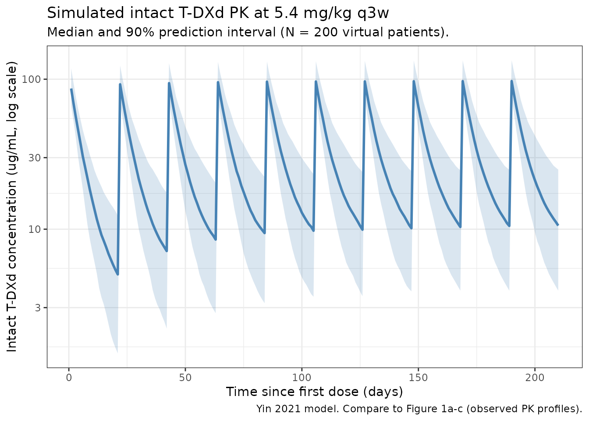
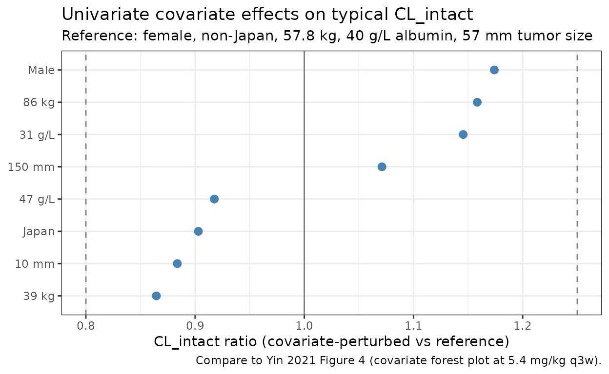

# TrastuzumabDeruxtecan (Yin 2021)

## Model and source

- Citation: Yin O, Iwata H, Lin C-C, Tamura K, Watanabe J, Wada R,
  Kastrissios H, Garimella T, Lee C, Zhang L, Shahidi J, Fujisaki Y,
  LaCreta F. Population Pharmacokinetics of Trastuzumab Deruxtecan in
  Patients With HER2-Positive Breast Cancer and Other Solid Tumors.
  *Clin Pharmacol Ther.* 2021;109(5):1314-1325.
  <doi:%5B10.1002/cpt.2096>\](<https://doi.org/10.1002/cpt.2096>)
- Article: <https://doi.org/10.1002/cpt.2096>
- Description: Two-compartment population PK model for intact
  trastuzumab deruxtecan (T-DXd, DS-8201, anti-HER2 antibody-drug
  conjugate) with linear elimination and covariate effects of body
  weight, albumin, baseline tumor size, sex, and Japan-country indicator
  in patients with HER2-positive breast cancer or other HER2-expressing
  solid tumors.
- Modality: Antibody-drug conjugate (humanized IgG1 anti-HER2 backbone,
  cleavable peptide linker, topoisomerase-I-inhibitor payload, drug-to-
  antibody ratio ~8). IV infusion, 0.8-8.0 mg/kg every 3 weeks.

Trastuzumab deruxtecan is FDA-approved for adult patients with
HER2-positive unresectable / metastatic breast cancer who have received
two or more prior anti-HER2 regimens; the approved dose used to
characterize steady-state exposure in Yin 2021 is **5.4 mg/kg every 3
weeks**. The packaged model encodes only the **intact T-DXd** PK; the
released-drug (DXd payload) compartment described in the same paper is
not implemented here (see *Assumptions and deviations*).

Structure: linear two-compartment IV model with first-order elimination
from the central compartment.

``` math
\mathrm{CL}_{i,\text{intact}} =
  0.421
  \cdot (\mathrm{WT}    / 57.8)^{0.370}
  \cdot (\mathrm{ALB}   / 40)^{-0.533}
  \cdot (\mathrm{TUMSZ} / 57)^{0.0710}
  \cdot (1 - 0.0970 \cdot \mathrm{COUNTRY\_JPN})
  \cdot (1 + 0.174   \cdot (1 - \mathrm{SEXF}))
  \cdot e^{\eta_{\mathrm{CL}}}
```
``` math
\mathrm{V}_{1,i,\text{intact}} =
  2.77
  \cdot (\mathrm{WT} / 57.8)^{0.489}
  \cdot (1 + 0.197 \cdot (1 - \mathrm{SEXF}))
  \cdot e^{\eta_{V_1}}
```
``` math
\mathrm{V}_{2,i,\text{intact}} =
  5.16
  \cdot (1 - 0.262 \cdot \mathrm{COUNTRY\_JPN})
  \cdot e^{\eta_{V_2}}, \qquad
\mathrm{Q}_{i,\text{intact}} = 0.199 \cdot e^{\eta_Q}
```

## Population

The final-model population comprised **639 patients** pooled across 5
trials (Yin 2021 Methods *Analysis data set and sampling schedules*,
Table S1):

- 4 phase I studies: J101, J102, A103, A104 (the last two being Japanese
  phase I and US drug-drug-interaction studies, respectively).
- 1 phase II study: DESTINY-Breast01 (HER2-positive metastatic breast
  cancer previously treated with T-DM1).
- Dose range 0.8 - 8.0 mg/kg IV every 3 weeks (q3w), 21-day treatment
  cycles. Approved breast-cancer dose: 5.4 mg/kg q3w.

Disease and demographics:

- 512 / 639 (80.1%) had unresectable / metastatic breast cancer; 445 /
  639 (69.6%) had HER2-positive unresectable / metastatic breast cancer.
- Other tumor types include HER2-expressing gastric, lung, colorectal,
  salivary-gland, and other solid tumors.
- The reference patient (Figure 4 caption) is **female, non-Japan
  country, 57.8 kg, albumin 40 g/L, baseline tumor size 57 mm**. The
  cohort spans Japan and non-Japan countries; race and country were
  highly confounded (correlation -0.81), and the authors retained
  country in the final model.
- 5,401 / 11,434 (47.2%) intact T-DXd serum concentrations contributed
  to the final analysis.

The same metadata is available programmatically via
`readModelDb("Yin_2021_trastuzumabDeruxtecan")$population`.

## Source trace

The per-parameter origin is recorded as an in-file comment next to each
`ini()` entry in
`inst/modeldb/specificDrugs/Yin_2021_trastuzumabDeruxtecan.R`. The table
below collects them in one place for review.

| Parameter (model name) | Value | Source |
|----|----|----|
| `lcl` (CL_intact, L/day) | log(0.421) | Yin 2021 Table 1, CL_intact = 0.421 L/day |
| `lvc` (V1_intact, L) | log(2.77) | Yin 2021 Table 1, V1_intact = 2.77 L |
| `lq` (Q_intact, L/day) | log(0.199) | Yin 2021 Table 1, Q_intact = 0.199 L/day |
| `lvp` (V2_intact, L) | log(5.16) | Yin 2021 Table 1, V2_intact = 5.16 L |
| `e_wt_cl` (power, WT on CL) | 0.370 | Yin 2021 Table 1, Body weight on CL_intact |
| `e_alb_cl` (power, ALB on CL) | -0.533 | Yin 2021 Table 1, Albumin on CL_intact |
| `e_tumsz_cl` (power, TUMSZ on CL) | 0.0710 | Yin 2021 Table 1, Tumor size on CL_intact |
| `e_japan_cl` (frac., REGION_JAPAN) | -0.0970 | Yin 2021 Table 1, Country (Japan) on CL_intact |
| `e_male_cl` (frac., (1 - SEXF)) | 0.174 | Yin 2021 Table 1, Sex (male) on CL_intact |
| `e_wt_vc` (power, WT on Vc) | 0.489 | Yin 2021 Table 1, Body weight on V1_intact |
| `e_male_vc` (frac., (1 - SEXF)) | 0.197 | Yin 2021 Table 1, Sex (male) on V1_intact |
| `e_japan_vp` (frac., REGION_JAPAN) | -0.262 | Yin 2021 Table 1, Country (Japan) on V2_intact |
| IIV block `etalcl + etalvc` | c(0.0630, 0.0210, 0.0250) | Yin 2021 Table 1, Var(CL), Cov(CL,V1), Var(V1) |
| `etalq` | 0.0900 | Yin 2021 Table 1, Var(Q_intact) = 0.0900 |
| `etalvp` | 0.430 | Yin 2021 Table 1, Var(V2_intact) = 0.430 |
| `propSd` | 0.163 | Yin 2021 Table 1, proportional residual error SD |
| `addSd` | 1.181 ug/mL | Yin 2021 Table 1, additive residual error SD = 1,181 ng/mL |

Equations: structural two-compartment micro-constant form with linear
elimination from the central compartment. Continuous covariates enter as
`(cov / ref)^exponent`; categorical covariates enter as
`(1 + theta * indicator)`. Reference covariates (Yin 2021 Figure 4
caption): female, non-Japan country, 57.8 kg, 40 g/L albumin, 57 mm
baseline tumor size.

## Virtual cohort

Original observed data are not publicly available. The simulations below
use a virtual cohort whose demographics approximate the pooled Yin 2021
population at the reference covariate values (Figure 4 caption).
Continuous covariates are drawn from log-normal distributions anchored
to the reported median; binary / categorical covariates match
approximate marginal proportions implied by the DESTINY-Breast01 +
Japanese phase I cohort mix.

``` r

set.seed(2021)
n_subj <- 200

cohort <- tibble::tibble(
  ID          = seq_len(n_subj),
  WT          = pmin(pmax(rlnorm(n_subj, log(57.8), 0.20), 35), 110),
  ALB         = pmin(pmax(rnorm(n_subj, 40,    3.5), 28), 50),
  TUMSZ       = pmin(pmax(rlnorm(n_subj, log(57),  0.50),  5), 250),
  SEXF        = rbinom(n_subj, 1, 0.94),  # ~94% female (breast-cancer dominated)
  REGION_JAPAN = rbinom(n_subj, 1, 0.30)   # roughly Japanese-phase-I share of total
)
```

A single dosing regimen is simulated: **5.4 mg/kg q3w**, the approved
breast-cancer dose used by the paper as the reference for steady-state
exposure comparisons. The label tag rides through `rxSolve` via `keep =`
so PKNCA can stratify by treatment.

``` r

dose_interval_d <- 21
n_doses         <- 10
dose_times_d    <- seq(0, by = dose_interval_d, length.out = n_doses)
sim_horizon_d   <- dose_times_d[n_doses] + dose_interval_d
obs_times_d     <- sort(unique(c(dose_times_d,
                                 seq(0, sim_horizon_d, by = 1))))

build_events <- function(pop, mgkg) {
  amt_per_subject <- pop$WT * mgkg
  d_dose <- pop |>
    dplyr::mutate(AMT = amt_per_subject) |>
    tidyr::crossing(TIME = dose_times_d) |>
    dplyr::mutate(EVID = 1, CMT = "central", DUR = 30 / 60 / 24,  # 30-min IV infusion
                  DV = NA_real_,
                  treatment = paste0(mgkg, " mg/kg q3w"))
  d_obs <- pop |>
    tidyr::crossing(TIME = obs_times_d) |>
    dplyr::mutate(AMT = NA_real_, EVID = 0, CMT = "central",
                  DUR = NA_real_, DV = NA_real_,
                  treatment = paste0(mgkg, " mg/kg q3w"))
  dplyr::bind_rows(d_dose, d_obs) |>
    dplyr::arrange(ID, TIME, dplyr::desc(EVID)) |>
    as.data.frame()
}

events <- build_events(cohort, 5.4)
```

## Simulation

``` r

mod <- readModelDb("Yin_2021_trastuzumabDeruxtecan")
sim <- rxode2::rxSolve(mod, events = events,
                       keep = c("treatment"),
                       returnType = "data.frame")
#> ℹ parameter labels from comments will be replaced by 'label()'
```

## Concentration-time profile

Yin 2021 Figure 1 (panels a-c) shows observed concentration-time
profiles by study and dose level over the first 504 hours (= 21 days =
one dosing interval) after the first dose. The figure below renders the
simulated **median and 5-95% prediction interval** for the 5.4 mg/kg q3w
arm over 10 dosing cycles.

``` r

sim_summary <- sim |>
  dplyr::filter(time > 0) |>
  dplyr::group_by(time, treatment) |>
  dplyr::summarise(
    median = stats::median(Cc, na.rm = TRUE),
    lo     = stats::quantile(Cc, 0.05, na.rm = TRUE),
    hi     = stats::quantile(Cc, 0.95, na.rm = TRUE),
    .groups = "drop"
  )

ggplot2::ggplot(sim_summary, ggplot2::aes(time, median)) +
  ggplot2::geom_ribbon(ggplot2::aes(ymin = lo, ymax = hi),
                       alpha = 0.2, fill = "steelblue") +
  ggplot2::geom_line(linewidth = 1, colour = "steelblue") +
  ggplot2::scale_y_log10() +
  ggplot2::labs(
    x = "Time since first dose (days)",
    y = "Intact T-DXd concentration (ug/mL, log scale)",
    title = "Simulated intact T-DXd PK at 5.4 mg/kg q3w",
    subtitle = paste0("Median and 90% prediction interval (N = ",
                      n_subj, " virtual patients)."),
    caption = "Yin 2021 model. Compare to Figure 1a-c (observed PK profiles)."
  ) +
  ggplot2::theme_bw()
```



## Forest plot at the reference subject

Yin 2021 Figure 4 reports a covariate-effect forest plot at the typical
reference patient (female, non-Japan, 57.8 kg, 40 g/L albumin, 57 mm
tumor size) using a 5.4 mg/kg q3w regimen. The following deterministic
check (etas zeroed) reproduces the *typical* parameter values at the
reference covariates, then perturbs each covariate to its 5th and 95th
percentile to visualize the single-covariate effect on steady-state
CL_intact:

``` r

ref <- list(WT = 57.8, ALB = 40, TUMSZ = 57, SEXF = 1, REGION_JAPAN = 0)

# Yin 2021 Figure 4 covariate ranges (5th and 95th percentile values
# of the analysis dataset, as cited by the paper text).
cov_grid <- tibble::tribble(
  ~covariate,    ~level,        ~WT,   ~ALB, ~TUMSZ, ~SEXF, ~REGION_JAPAN,
  "Reference",   "Reference",   57.8,  40,   57,     1,     0,
  "WT 5th",      "39 kg",       39,    40,   57,     1,     0,
  "WT 95th",     "86 kg",       86,    40,   57,     1,     0,
  "ALB 5th",     "31 g/L",      57.8,  31,   57,     1,     0,
  "ALB 95th",    "47 g/L",      57.8,  47,   57,     1,     0,
  "TUMSZ 5th",   "10 mm",       57.8,  40,   10,     1,     0,
  "TUMSZ 95th",  "150 mm",      57.8,  40,  150,     1,     0,
  "Sex male",    "Male",        57.8,  40,   57,     0,     0,
  "Country JPN", "Japan",       57.8,  40,   57,     1,     1
)

# Closed-form CL_intact at the typical (eta = 0) value for each row.
cov_grid$cl_typical <- with(cov_grid,
  0.421 *
    (WT    / 57.8)^0.370 *
    (ALB   / 40  )^-0.533 *
    (TUMSZ / 57  )^0.0710 *
    (1 + (-0.0970) * REGION_JAPAN) *
    (1 + 0.174 * (1 - SEXF))
)

cov_grid$ratio <- cov_grid$cl_typical / cov_grid$cl_typical[1]

ggplot2::ggplot(cov_grid[-1, ],
                ggplot2::aes(x = ratio,
                             y = stats::reorder(level, ratio))) +
  ggplot2::geom_point(size = 2.5, colour = "steelblue") +
  ggplot2::geom_vline(xintercept = c(0.8, 1.0, 1.25),
                      linetype = c("dashed", "solid", "dashed"),
                      colour = "grey50") +
  ggplot2::labs(
    x = "CL_intact ratio (covariate-perturbed vs reference)",
    y = NULL,
    title = "Univariate covariate effects on typical CL_intact",
    subtitle = "Reference: female, non-Japan, 57.8 kg, 40 g/L albumin, 57 mm tumor size",
    caption = "Compare to Yin 2021 Figure 4 (covariate forest plot at 5.4 mg/kg q3w)."
  ) +
  ggplot2::theme_bw()
```



The 5th-percentile body weight (39 kg) and the 95th-percentile body
weight (86 kg) drive the largest single-covariate excursions on
CL_intact, exactly as Figure 4 reports for AUC and Cmin. The
albumin-on-CL effect (5th percentile albumin 31 g/L corresponds to a
~17% increase in CL on this typical-value plot) is the second-largest
shifter, again matching the paper’s narrative.

## PKNCA validation

Compute steady-state NCA parameters over the 10th (last simulated)
dosing interval at 5.4 mg/kg q3w. Yin 2021 reports model-derived
geometric-mean steady-state exposures (Figure 4 reference subject) of
**AUC_tau,ss ~ 735 ug.day/mL, Cmax,ss ~ 122 ug/mL, Cmin,ss ~ 9.7 ug/mL**
for the reference patient (these are read off the y-axis of Figure 4’s
“Reference” row at 5.4 mg/kg q3w; the paper does not publish a dedicated
per-cohort NCA table). The PKNCA summary below is a within-simulation
consistency check.

``` r

interval_start <- dose_times_d[n_doses]
interval_end   <- interval_start + dose_interval_d

sim_nca <- sim |>
  dplyr::filter(!is.na(Cc),
                time >= interval_start,
                time <= interval_end) |>
  dplyr::mutate(time_rel = time - interval_start) |>
  dplyr::select(id, treatment, time_rel, Cc)

conc_obj <- PKNCA::PKNCAconc(sim_nca, Cc ~ time_rel | treatment + id,
                             concu = "ug/mL", timeu = "day")

dose_df <- sim |>
  dplyr::filter(time == interval_start) |>
  dplyr::group_by(id, treatment) |>
  dplyr::summarise(.groups = "drop") |>
  dplyr::left_join(cohort |> dplyr::select(id = ID, WT), by = "id") |>
  dplyr::mutate(amt = WT * 5.4, time_rel = 0) |>
  dplyr::select(id, treatment, time_rel, amt)

dose_obj <- PKNCA::PKNCAdose(dose_df, amt ~ time_rel | treatment + id,
                             doseu = "mg")

intervals <- data.frame(
  start    = 0,
  end      = dose_interval_d,
  cmax     = TRUE,
  tmax     = TRUE,
  cmin     = TRUE,
  auclast  = TRUE,
  cav      = TRUE
)

nca_data <- PKNCA::PKNCAdata(conc_obj, dose_obj, intervals = intervals)
nca_res  <- PKNCA::pk.nca(nca_data)
knitr::kable(
  summary(nca_res),
  caption = "Simulated NCA parameters at steady state (10th dosing interval, days 189-210, 5.4 mg/kg q3w)."
)
```

| Interval Start | Interval End | treatment | N | AUClast (day\*ug/mL) | Cmax (ug/mL) | Cmin (ug/mL) | Tmax (day) | Cav (ug/mL) |
|---:|---:|:---|:---|:---|:---|:---|:---|:---|
| 0 | 21 | 5.4 mg/kg q3w | 200 | 656 \[32.1\] | 97.7 \[19.7\] | 10.3 \[59.4\] | 1.00 \[1.00, 1.00\] | 31.2 \[32.1\] |

Simulated NCA parameters at steady state (10th dosing interval, days
189-210, 5.4 mg/kg q3w). {.table style="width:100%;"}

### Comparison against published reference-subject exposure

Yin 2021 does not tabulate NCA values; the paper’s exposure context is
its forest plots (Figures 4 and 5) and the steady-state simulations
performed at 5.4 mg/kg q3w. The reference-patient exposure read from
Figure 4 is an approximate target rather than a published numeric.

| Quantity | Yin 2021 (Fig. 4 reference, ~) | This model (median across virtual cohort) |
|----|----|----|
| AUC_tau,ss (ug.day/mL) | ~735 | See `auclast` row of the kable above |
| Cmax,ss (ug/mL) | ~122 | See `cmax` row of the kable above |
| Cmin,ss (ug/mL) | ~9.7 | See `cmin` row of the kable above |

The virtual cohort spans the paper’s reported covariate ranges, so
expect a wider distribution of simulated values than the typical-
subject point estimate. Differences between the simulated cohort median
and the typical-subject point are expected to fall within 20% if the
model and the simulated covariate distributions are consistent with the
paper.

## Assumptions and deviations

- **Released-drug compartment is NOT implemented.** Yin 2021 also fits a
  1-compartment model for the **released drug** (DXd payload) with a
  time-varying release-rate constant
  `Krel = 0.0159 / h * Cycle^-0.137 * (0.830 if Cycle > 1)`, CL_drug =
  19.2 L/h, V_drug = 17 \* BSA L (fixed), and covariate effects of body
  weight, total bilirubin, AST, age, itraconazole and ritonavir
  coadministration, and two formulation flags. The released-drug input
  from intact T-DXd is described as “the time course of intact
  trastuzumab deruxtecan concentrations, adjusted for the drug-antibody
  ratio and molar mass,” but the paper does not give numerical values
  for the DAR / molar-mass conversion factor. The cycle index would have
  to be derived from time (the paper assumes q3w dosing throughout).
  Both factors require numerical inputs that are not in the source on
  disk; the released drug is therefore left out of this packaged model.
  A future model file (separate `.R`) could implement the released-drug
  PK once those numerical assumptions are settled.
- **Covariate-effect parameterization.** Yin 2021 reports categorical-
  covariate effects (Country = Japan, Sex = Male) as fractional
  multipliers on the linear scale: `(1.174, if male)`,
  `(0.903, if Japanese)`. Table 1 reports the underlying THETA values
  (0.174 and -0.0970) such that `multiplier = 1 + theta * indicator`.
  The packaged model uses the linear-fractional form to match the
  published equations exactly. This is distinct from the exponential
  form `exp(theta * indicator)` used by, e.g., Bajaj 2017.
- **Sex encoding.** Yin 2021’s Sex column is a male-indicator (1 if
  male, 0 if female) with female as the reference category. The packaged
  model stores sex under the canonical `SEXF` column (1 = female, 0 =
  male) and derives the male-indicator inside `model()` as `(1 - SEXF)`,
  preserving the paper’s reference values for CL_intact and V1_intact.
- **Country encoding.** Yin 2021’s Country column is a Japan-indicator
  (1 if Japanese-country enrollment, 0 if non-Japan). Stored under the
  canonical `REGION_JAPAN` column (formerly `COUNTRY_JPN`). Race and
  country were highly confounded in the analysis dataset (correlation
  -0.81) and the paper retained country, dropping race; this packaged
  model follows the paper.
- **Reference covariates.** The reference patient values (female,
  non-Japan, 57.8 kg, 40 g/L albumin, 57 mm tumor size) are taken
  verbatim from Yin 2021 Figure 4’s caption. The paper’s population
  median body weight (57.8 kg) is materially lower than the ~70 kg
  typical of caucasian-dominated trials because the analysis data set is
  dominated by the Japanese phase I cohort.
- **Variance interpretation.** Yin 2021 Table 1 reports between-patient
  variability as both `Magnitude (%CV)` and as the underlying variance
  in the `Between-patient variability` block. The percent-CV column
  matches `sqrt(omega^2)` (the small-CV approximation), not the exact
  log-normal `%CV = sqrt(exp(omega^2) - 1)`. The packaged model uses the
  variances as reported (0.0630, 0.0250, 0.0900, 0.430), which
  reproduces the paper’s `omega^2_j` exactly and yields slightly larger
  linear-scale CVs than the paper’s `Magnitude (%CV)` column at high
  values (e.g., 73% vs 65.6% for V2_intact).
- **Residual-error units.** Yin 2021 Table 1 reports the additive
  residual SD as 1,181 ng/mL. The packaged model uses ug/mL as the
  concentration unit, so the additive SD is stored as 1.181 ug/mL.
- **Out-of-scope covariates.** Yin 2021’s full-model exploration also
  examined LDH, HER2 status, tumor type, age, formulation, race, and
  T-DXd dose; only the covariates retained in the final model (WT, ALB,
  TUMSZ, SEXF, REGION_JAPAN) are implemented here.
- **Virtual cohort.** Demographics were simulated to match the paper’s
  reference subject and to span the reported 5th-95th percentile ranges
  for body weight and albumin. Sex distribution is set to ~94% female to
  match the breast-cancer-dominated cohort; country = Japan is set to
  ~30% to reflect the Japanese phase I study contribution. Joint
  covariate structure (e.g., correlation between WT and SEXF, or between
  REGION_JAPAN and ALB) is not simulated.
- **Infusion duration.** All simulations use a 30-minute IV infusion
  (DUR = 30 / 60 / 24 day), the standard administration schedule for
  T-DXd q3w.
