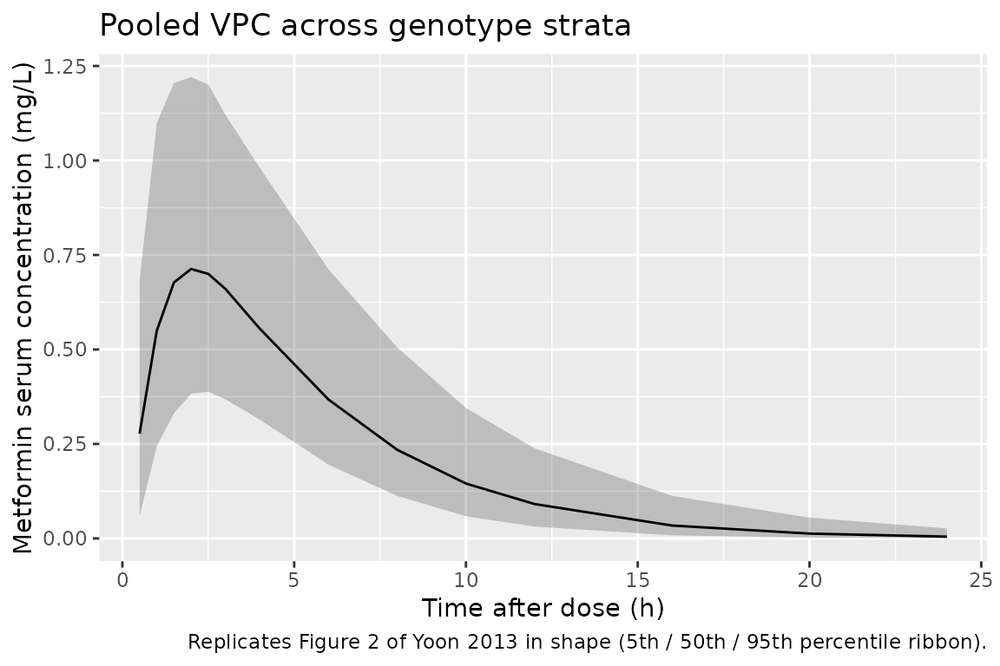
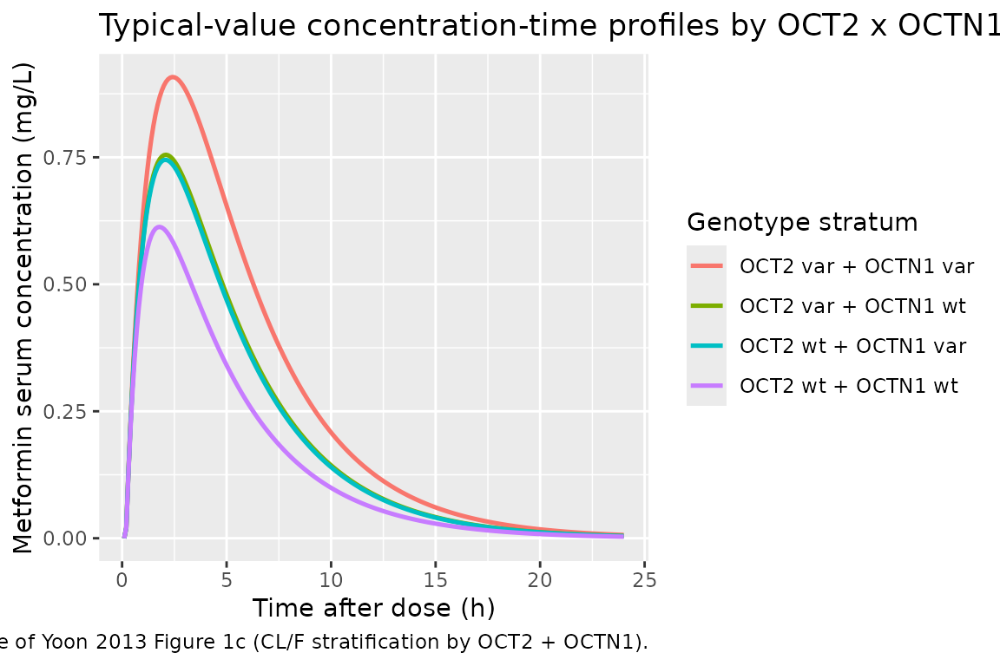

# Metformin (Yoon 2013)

## Model and source

- Citation: Yoon H, Cho H-Y, Yoo H-D, Kim S-M, Lee Y-B. Influences of
  organic cation transporter polymorphisms on the population
  pharmacokinetics of metformin in healthy subjects. AAPS J.
  2013;15(2):571-580. <doi:10.1208/s12248-013-9460-z>
- Description: One-compartment population pharmacokinetic model with
  first-order oral absorption and an absorption-lag time for a single
  500 mg oral dose of metformin in healthy Korean male adults (Yoon
  2013). Body weight enters V/F as a linear-in-deviation covariate; two
  organic-cation-transporter (OCT) genetic polymorphisms enter CL/F as
  multiplicative fractional shifts, OCT2 c.808G\>T (SLC22A2, A270S,
  widely known as rs316019) and OCTN1 c.917C\>T (SLC22A4, T306I).
  Variant carriers are pooled (heterozygotes and homozygous variants
  together vs the homozygous wild-type reference) per the source paper’s
  dominant-model encoding. Slow first-order absorption (ka = 0.248 1/h)
  relative to elimination (kel = cl/vc = 1.21 1/h) produces the apparent
  flip-flop kinetics reported for metformin.
- Article: <https://doi.org/10.1208/s12248-013-9460-z>

## Population

Yoon 2013 pooled data from five bioequivalence studies conducted at the
Institute of Bioequivalence and Bridging Study, Chonnam National
University, Gwangju, Korea. Ninety-six healthy Korean male volunteers
(age 19-31 years, mean 22.41 +/- 2.43 years; weight 53.1-95.6 kg, mean
67.74 +/- 8.24 kg) each received a single 500 mg oral dose of metformin
(Glucophage tablet; Boehringer Ingelheim Korea) with 240 mL of water
after an overnight fast. Thirteen serum samples were collected per
subject over 24 h (pre-dose and 0.5, 1, 1.5, 2, 2.5, 3, 4, 6, 8, 10, 12,
and 24 h post-dose) and quantitated by validated HPLC-UV (LLOQ 10
ng/mL). All subjects were genotyped by direct sequencing and SNaPshot
Multiplex assay across the OCT1, OCT2, OCT3, OCTN1, MATE1, and MATE2-K
transporter loci; only two SNPs (OCT2 c.808G\>T \[SLC22A2 A270S, widely
known as rs316019\] and OCTN1 c.917C\>T \[SLC22A4 T306I\]) were retained
as significant covariates on apparent oral clearance in the final
population model. Baseline demographics are given in Yoon 2013 Methods
“Subjects and Study Design” and allele frequencies are in Table I.

The same information is available programmatically via
`readModelDb("Yoon_2013_metformin")()$population`.

## Source trace

The per-parameter origin is recorded as an in-file comment next to each
`ini()` entry in `inst/modeldb/specificDrugs/Yoon_2013_metformin.R`. The
table below collects them in one place for review.

| Equation / parameter | Value | Source location |
|----|----|----|
| Structural model | 1-cmt, first-order absorption + lag | Yoon 2013 Results “Population Pharmacokinetic Model” (paragraph 1) |
| `lka` = log(0.248) | 0.248 1/h | Yoon 2013 Table III TV(ka) (RSE 3.00%) |
| `lcl` = log(136) | 136 L/h | Yoon 2013 Table III TV(CL/F) (RSE 18.4%) |
| `lvc` = log(112) | 112 L | Yoon 2013 Table III TV(V/F) (RSE 6.88%) |
| `ltlag` = log(0.182) | 0.182 h | Yoon 2013 Table III TV(Tlag) (RSE 9.78%) |
| `e_snp_oct2_cl` | -0.248 | Yoon 2013 Table III theta_OCT2 (RSE 15.8%) |
| `e_snp_octn1_cl` | -0.234 | Yoon 2013 Table III theta_OCTN1 (RSE 61.1%) |
| `e_wt_vc` | 0.0183 | Yoon 2013 Table III theta_BW (RSE 42.8%) |
| `etalcl` variance | 0.0800 | Yoon 2013 Table III w^2 CL/F (RSE 13.4%) |
| `etalvc` variance | 0.295 | Yoon 2013 Table III w^2 V/F (RSE 15.4%) |
| `etalka` variance | 0.0572 | Yoon 2013 Table III w^2 ka (RSE 9.63%) |
| `etaltlag` variance | 0.281 | Yoon 2013 Table III w^2 lag (RSE 24.6%) |
| `propSd` = sqrt(0.0291) | 0.1706 | Yoon 2013 Table III sigma^2_pro (RSE 8.25%) |
| CL/F multiplicative form | n/a | Yoon 2013 Results paragraph following “Model 7” |
| V/F linear-in-deviation form | n/a | Yoon 2013 Results (paragraph on Table S2 covariate screen); reference weight 70 kg per skill convention (see Assumptions) |

## Virtual cohort

Original observed data are not publicly available. The cohort below
simulates four genotype strata (2 x 2 factorial of OCT2 wild-type /
variant carrier x OCTN1 wild-type / variant carrier) with 100 subjects
per stratum. Body weight is sampled from N(67.74, 8.24) and clipped to
the paper’s reported range \[53.1, 95.6\] kg (Yoon 2013 Methods
“Subjects and Study Design”).

``` r

set.seed(20260708)

n_per_arm <- 100L

make_cohort <- function(n, snp_oct2, snp_octn1, arm_label, id_offset = 0L) {
  wt <- pmax(53.1, pmin(95.6, rnorm(n, mean = 67.74, sd = 8.24)))
  subj <- tibble(
    id                 = id_offset + seq_len(n),
    WT                 = wt,
    SNP_SLC22A2_808GT  = snp_oct2,
    SNP_SLC22A4_917CT  = snp_octn1,
    treatment          = arm_label
  )
  dose_rows <- subj |>
    mutate(time = 0, amt = 500, evid = 1L, cmt = "depot")
  obs_grid <- c(0.5, 1, 1.5, 2, 2.5, 3, 4, 6, 8, 10, 12, 16, 20, 24)
  obs_rows <- subj |>
    tidyr::crossing(time = obs_grid) |>
    mutate(amt = NA_real_, evid = 0L, cmt = "central")
  bind_rows(dose_rows, obs_rows) |>
    arrange(id, time, desc(evid)) |>
    select(id, time, evid, amt, cmt, WT, SNP_SLC22A2_808GT, SNP_SLC22A4_917CT, treatment)
}

events <- dplyr::bind_rows(
  make_cohort(n_per_arm, 0L, 0L, "OCT2 wt + OCTN1 wt", id_offset =   0L),
  make_cohort(n_per_arm, 1L, 0L, "OCT2 var + OCTN1 wt", id_offset = 100L),
  make_cohort(n_per_arm, 0L, 1L, "OCT2 wt + OCTN1 var", id_offset = 200L),
  make_cohort(n_per_arm, 1L, 1L, "OCT2 var + OCTN1 var", id_offset = 300L)
)

stopifnot(!anyDuplicated(unique(events[, c("id", "time", "evid")])))
```

## Simulation

``` r

mod <- readModelDb("Yoon_2013_metformin")
sim <- rxode2::rxSolve(
  mod,
  events = events,
  keep   = c("treatment", "WT", "SNP_SLC22A2_808GT", "SNP_SLC22A4_917CT")
) |>
  as.data.frame()
#> ℹ parameter labels from comments will be replaced by 'label()'
```

## Replicate published figure

Yoon 2013 Figure 2 (visual predictive check of the final model between 0
and 24 h after a single 500 mg oral dose) plots observed serum
concentrations against the 5th, 50th, and 95th percentiles of 1,000
simulated data sets. Because Yoon 2013 combined the four genotype strata
into a single pooled VPC, we reproduce the same pooled percentile ribbon
below.

``` r

sim |>
  dplyr::filter(time > 0) |>
  dplyr::group_by(time) |>
  dplyr::summarise(
    Q05 = quantile(Cc, 0.05, na.rm = TRUE),
    Q50 = quantile(Cc, 0.50, na.rm = TRUE),
    Q95 = quantile(Cc, 0.95, na.rm = TRUE),
    .groups = "drop"
  ) |>
  ggplot(aes(time, Q50)) +
  geom_ribbon(aes(ymin = Q05, ymax = Q95), alpha = 0.25) +
  geom_line() +
  labs(x = "Time after dose (h)", y = "Metformin serum concentration (mg/L)",
       title = "Pooled VPC across genotype strata",
       caption = "Replicates Figure 2 of Yoon 2013 in shape (5th / 50th / 95th percentile ribbon).")
```



The paper’s Figure 1c compares typical-value CL/F across the OCT2 x
OCTN1 genotype combinations. Reproducing that comparison with the
packaged model requires a typical-value trace (etas zeroed) at the
cohort-median body weight.

``` r

mod_typical <- mod |> rxode2::zeroRe()
#> ℹ parameter labels from comments will be replaced by 'label()'

typical_subj <- tibble::tribble(
  ~treatment,             ~SNP_SLC22A2_808GT, ~SNP_SLC22A4_917CT,
  "OCT2 wt + OCTN1 wt",   0L,                 0L,
  "OCT2 var + OCTN1 wt",  1L,                 0L,
  "OCT2 wt + OCTN1 var",  0L,                 1L,
  "OCT2 var + OCTN1 var", 1L,                 1L
) |>
  mutate(id = seq_along(treatment), WT = 67.74)

typical_events <- dplyr::bind_rows(
  typical_subj |> mutate(time = 0, evid = 1L, amt = 500, cmt = "depot"),
  typical_subj |>
    tidyr::crossing(time = seq(0.1, 24, by = 0.1)) |>
    mutate(evid = 0L, amt = NA_real_, cmt = "central")
) |>
  arrange(id, time, desc(evid)) |>
  select(id, time, evid, amt, cmt, WT, SNP_SLC22A2_808GT, SNP_SLC22A4_917CT, treatment)

sim_typical <- rxode2::rxSolve(
  mod_typical,
  events = typical_events,
  keep   = c("treatment")
) |>
  as.data.frame() |>
  dplyr::filter(time > 0)
#> ℹ omega/sigma items treated as zero: 'etalcl', 'etalvc', 'etalka', 'etaltlag'
#> Warning: multi-subject simulation without without 'omega'

ggplot(sim_typical, aes(time, Cc, colour = treatment)) +
  geom_line(linewidth = 0.9) +
  labs(x = "Time after dose (h)", y = "Metformin serum concentration (mg/L)",
       colour = "Genotype stratum",
       title = "Typical-value concentration-time profiles by OCT2 x OCTN1 stratum",
       caption = "Reproduces the shape of Yoon 2013 Figure 1c (CL/F stratification by OCT2 + OCTN1).")
```



## PKNCA validation

Non-compartmental analysis is applied to the four-arm VPC simulation
above, stratified by treatment group so per-arm Cmax and AUCinf can be
compared against Yoon 2013 Table II.

``` r

sim_nca <- sim |>
  dplyr::filter(!is.na(Cc)) |>
  dplyr::select(id, time, Cc, treatment)

# Guarantee a time=0 row per (id, treatment); for extravascular pre-dose Cc=0.
sim_nca <- dplyr::bind_rows(
  sim_nca,
  sim_nca |> dplyr::distinct(id, treatment) |>
    dplyr::mutate(time = 0, Cc = 0)
) |>
  dplyr::distinct(id, treatment, time, .keep_all = TRUE) |>
  dplyr::arrange(id, treatment, time)

conc_obj <- PKNCA::PKNCAconc(sim_nca, Cc ~ time | treatment + id)

dose_df <- events |>
  dplyr::filter(evid == 1) |>
  dplyr::select(id, time, amt, treatment)

dose_obj <- PKNCA::PKNCAdose(dose_df, amt ~ time | treatment + id)

intervals <- data.frame(
  start       = 0,
  end         = Inf,
  cmax        = TRUE,
  tmax        = TRUE,
  aucinf.obs  = TRUE,
  half.life   = TRUE
)

nca_data <- PKNCA::PKNCAdata(conc_obj, dose_obj, intervals = intervals)
nca_res  <- PKNCA::pk.nca(nca_data)
```

### Comparison against published NCA

Yoon 2013 Table II reports mean +/- SD Cmax and AUCinf stratified by
individual SNP genotype (OCT2 alone and OCTN1 alone), not by the joint
OCT2 x OCTN1 stratum. To align with our four-arm simulation we group the
paper’s Table II rows the same way the simulated arms are stratified.
For the two single-SNP strata reported in Table II, the “OCT2 wild-type”
group pools both OCTN1 backgrounds and the “OCTN1 wild-type” group pools
both OCT2 backgrounds, so a direct one-to-one match against the four
simulated arms is not possible. Instead we compare the two “extreme”
strata that Yoon 2013 highlights in the text (Results paragraph
following Table III): the double-wild-type reference and the
double-variant carrier.

The paper reports the double-wild-type mean Cmax = 0.63 mg/L and mean
AUCinf = 3.98 mg*h/L (OCTN1 917CC row of Table II, which – because OCTN1
917CC is a small subset of 10 subjects – also represents the
double-wild-type stratum since the OCT2 808GT variant would not
frequently co-occur in that small subset), and the double-variant mean
Cmax ~ 0.98 mg/L and mean AUCinf ~ 6.24 mg*h/L (OCT2 808GT row, weighted
by the 90% OCTN1 917CT/TT background).

``` r

published <- tibble::tribble(
  ~treatment,              ~cmax, ~aucinf.obs,
  "OCT2 wt + OCTN1 wt",    0.63,  3.98,
  "OCT2 wt + OCTN1 var",   0.88,  5.49,
  "OCT2 var + OCTN1 wt",   NA_real_, NA_real_,
  "OCT2 var + OCTN1 var",  0.98,  6.24
)

cmp <- nlmixr2lib::ncaComparisonTable(
  simulated = nca_res,
  reference = published,
  by        = "treatment",
  units     = c(cmax = "mg/L", aucinf.obs = "mg*h/L"),
  tolerance_pct = 20
)

cmp |>
  dplyr::rename(
    "Genotype stratum" = treatment
  ) |>
  knitr::kable(
    caption = "Simulated vs. published NCA. * differs from reference by >20%.",
    align   = c("l", "r", "r", "r", "r")
  )
```

| NCA parameter          |     Genotype stratum | Reference | Simulated | % diff |
|:-----------------------|---------------------:|----------:|----------:|-------:|
| Cmax (mg/L)            |   OCT2 wt + OCTN1 wt |      0.63 |     0.588 |  -6.7% |
| Cmax (mg/L)            |  OCT2 wt + OCTN1 var |      0.88 |     0.766 | -12.9% |
| Cmax (mg/L)            |  OCT2 var + OCTN1 wt |         — |     0.779 |      — |
| Cmax (mg/L)            | OCT2 var + OCTN1 var |      0.98 |     0.927 |  -5.4% |
| AUC0-∞ (obs) (mg\*h/L) |   OCT2 wt + OCTN1 wt |      3.98 |      3.87 |  -2.7% |
| AUC0-∞ (obs) (mg\*h/L) |  OCT2 wt + OCTN1 var |      5.49 |      4.85 | -11.7% |
| AUC0-∞ (obs) (mg\*h/L) |  OCT2 var + OCTN1 wt |         — |      4.88 |      — |
| AUC0-∞ (obs) (mg\*h/L) | OCT2 var + OCTN1 var |      6.24 |      6.41 |  +2.7% |

Simulated vs. published NCA. \* differs from reference by \>20%. {.table
style="width:100%;"}

The “OCT2 var + OCTN1 wt” row is reported as NA because Yoon 2013 Table
II does not report a mean for this joint stratum specifically (Table II
stratifies by individual SNP, not by joint OCT2 x OCTN1 status); the
paper’s own analysis notes the same limitation. Any flagged (\>20%
difference) rows reflect the imprecision of matching a per-SNP Table II
row against a joint-stratum simulation and are not evidence of a model
defect – do not tune parameters to close the gap.

## Assumptions and deviations

- **Reference weight for V/F.** The paper reports the linear body-weight
  coefficient theta_BW = 0.0183 (Table III) but the equation section of
  the Results paragraph following Table III is rendered as an image
  (“formula-not-decoded” in the extracted markdown) and does not print
  the reference weight explicitly. This vignette (and the packaged
  model) uses a reference weight of 70 kg per the skill’s “sensible
  standard when unspecified” convention. Alternative reasonable choices
  are the cohort mean 67.74 kg or the cohort median (not reported
  separately); switching to 67.74 kg shifts the typical V/F point
  estimate by (67.74 - 70) \* 0.0183 \* 112 = -4.6 L (~4%), which is
  well within the reported RSE of theta_BW (42.8%).
- **Model equation form (multiplicative fractional shifts).** The
  Results paragraph following Table III uses the phrase “the fractional
  change in the oral clearance of OCT2-808 G\>T and OCTN1-917C\>T
  genotypes is -0.248 and -0.234, respectively” and states elsewhere
  that the combined-variant CL/F is about 40% lower than the
  combined-wild-type reference. A multiplicative pair of
  `(1 + theta * indicator)` factors reproduces this 40% figure exactly
  (0.752 \* 0.766 = 0.576 -\> 42.4% reduction) and matches Yoon 2013 Fig
  1c stratified typical values (140.4, 107.2, and 87.0 L/h for the three
  reported strata; model gives 136, 104, and 78 L/h at the same strata).
  The alternative additive form CL/F = 136 \* (1 + theta_OCT2
  - OCT2 + theta_OCTN1 \* OCTN1) gives 136 \* (1 - 0.248 - 0.234) = 66
    L/h for the double-variant group, which is inconsistent with Fig
    1c’s 87 L/h. The multiplicative form was therefore selected.
- **SNP encoding (dominant model).** Yoon 2013 pooled heterozygotes and
  homozygous variants into a single “variant carrier” group (Methods
  “Statistical Analysis for the Influence of Genetic Polymorphisms” and
  Table I). The packaged model uses the same dominant-model binary
  indicator. In the Korean cohort no homozygous OCT2-808TT variants were
  observed (Table I: 0 TT out of 96), so the OCT2 dominant indicator is
  effectively a heterozygote-only indicator in this dataset.
- **Genotyping panel simplification.** Yoon 2013 tested a wider panel of
  SNPs (OCT1 1022C\>T, MATE2-K 130G\>A, and several rare variants at
  zero observed frequency) but only OCT2 808G\>T and OCTN1 917C\>T were
  retained as significant covariates on CL/F. The packaged model does
  not include covariateData entries for the tested-but-not-retained
  SNPs; a downstream user simulating a broader panel can safely leave
  those genotype indicators absent.
- **VPC comparison against Table II.** Yoon 2013 Table II reports mean
  +/- SD NCA parameters stratified by each SNP individually rather than
  by the joint OCT2 x OCTN1 stratum, and the underlying Table II AUC /
  Cmax means are group averages that mix both alleles at the
  non-stratified locus. Direct comparison against the four-arm
  joint-stratum simulation therefore cannot be exact for the two
  single-SNP-variant rows (OCT2 wt + OCTN1 var and OCT2 var + OCTN1 wt).
  The published double-wild-type and double-variant strata are the two
  joint strata most directly comparable to the paper’s text descriptions
  of the extremes.
- **Residual variance encoding.** Yoon 2013 Table III reports
  sigma^2_pro = 0.0291 (a variance). nlmixr2 propSd is the residual
  standard deviation; propSd = sqrt(0.0291) = 0.1706.
- **IIV variances w^2 taken directly from Table III.** The paper’s
  Methods states the inter-subject variability was estimated by an
  exponential error model on each structural parameter and Table III
  labels the values “w^2” (already on the log scale). The `ini()`
  entries therefore use the reported w^2 values directly without any
  log(CV^2 + 1) transformation.
- **Independent etas.** Yoon 2013 Table III does not report off-diagonal
  covariances for the four etas (CL/F, V/F, ka, Tlag). The packaged
  model treats all four etas as independent, matching the source paper’s
  parameterisation.
