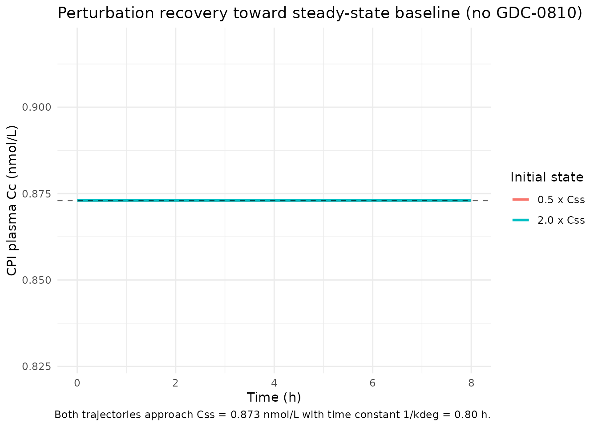
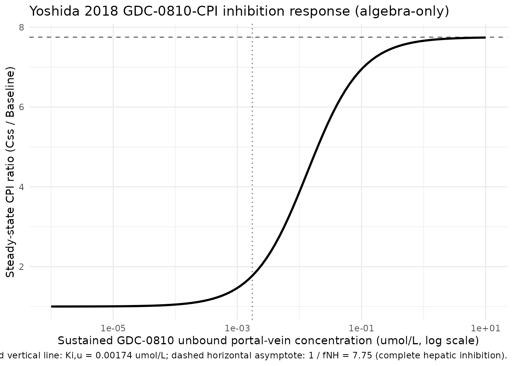

# Coproporphyrin I (Yoshida 2018, GDC-0810)

## Model and source

- Citation: Yoshida K, Guo C, Sane R. Quantitative Prediction of
  OATP-Mediated Drug-Drug Interactions With Model-Based Analysis of
  Endogenous Biomarker Kinetics. CPT Pharmacometrics Syst. Pharmacol.
  2018;7(8):517-524. <doi:10.1002/psp4.12315>. The GDC-0810-CPI
  calibration (Table 2 right column) was fit to the Liu et al. 2018
  plasma CPI profile cohort using portal-vein GDC-0810 concentrations
  from an in-house Y. Chen et al. PBPK model (cited as personal
  communication; not on disk), so users must supply CP_GDC_UM
  externally. The companion rifampin calibration is parameterised in
  modellib(‘Yoshida_2018_coproporphyrin_I_rifampin’).
- Description: One-compartment endogenous turnover model for the
  OATP1B-substrate biomarker coproporphyrin I (CPI) in healthy adults
  (Yoshida 2018, GDC-0810-CPI calibration). CPI is produced at a
  zero-order synthesis rate Ksyn = kdeg \* Baseline and eliminated as a
  single first-order pool whose overall rate constant kdeg is decomposed
  into a non-hepatic fraction fNH (held fixed at 12.9 %, unaffected by
  inhibitor) and a hepatic fraction 1 - fNH (competitively inhibited by
  the OATP1B perpetrator via Ki,u). The perpetrator portal-vein unbound
  concentration enters as a time-varying covariate CP_GDC_UM (umol/L);
  setting CP_GDC_UM = 0 collapses the model to the inhibitor-free steady
  state Baseline. This file encodes the GDC-0810-CPI calibration (Table
  2 right column) with IIV on Baseline (18.2 %CV) and Ki,u (30.1 %CV); a
  sibling file Yoshida_2018_coproporphyrin_I_rifampin encodes the
  rifampin calibration with its own Ki,u, kdeg, and no IIV. The original
  fit used a Y. Chen et al. in-house PBPK model for GDC-0810 portal-vein
  concentrations (personal communication, not on disk and not in the
  nlmixr2lib registry), so downstream users must supply CP_GDC_UM
  externally.
- Article: <https://doi.org/10.1002/psp4.12315>

## Population and biological context

Coproporphyrin I (CPI) is a heme-biosynthesis byproduct and a selective
endogenous substrate of the hepatic OATP1B1 / OATP1B3 transporters.
Yoshida 2018 proposed a simple one-compartment turnover model for plasma
CPI in which the overall first-order degradation rate constant `kdeg` is
split into a non-hepatic fraction `fNH` (unaffected by perpetrator) and
a hepatic fraction `1 - fNH` that is competitively inhibited by the
OATP1B perpetrator via the unbound inhibition constant `Ki,u`. The
synthesis rate is anchored to the steady-state identity
`Ksyn = kdeg * Baseline`.

This file encodes the GDC-0810-CPI calibration (Table 2 right column).
The underlying clinical dataset is the Liu et al. 2018 cohort (healthy
adult female subjects; GDC-0810 was administered orally as the OATP1B
perpetrator). The original fit used an in-house Y. Chen et al. PBPK
model for portal-vein unbound GDC-0810 concentrations as the forcing
function. In contrast to the rifampin-CPI calibration
(`modellib('Yoshida_2018_coproporphyrin_I_rifampin')`), this fit (i)
holds fNH FIXED at 12.9 % (the rifampin-CPI estimate) and (ii) reports
IIV on Baseline (18.2 %CV) and on Ki,u (30.1 %CV).

The same context is available programmatically via
`readModelDb("Yoshida_2018_coproporphyrin_I_GDC0810")$population`.

## Source trace

| Equation / parameter | Value | Source location |
|----|----|----|
| `lrbase` | log(0.873) | Yoshida 2018 Table 2, GDC-0810-CPI column ‘Baseline (nM)’ = 0.873 (RSE 7.47%) |
| `lkdeg` | log(1.25) | Yoshida 2018 Table 2, GDC-0810-CPI column ‘kdeg (1/h)’ = 1.25 (RSE 5.88%) |
| `logitfnh` | fixed(qlogis(0.129)) | Yoshida 2018 Table 2, GDC-0810-CPI column ‘fNH’ = 12.9 % FIXED |
| `lkiu` | log(0.00174) | Yoshida 2018 Table 2, GDC-0810-CPI column ‘Ki,u (uM)’ = 0.00174 (RSE 27.3%) |
| `etalrbase` | 0.03244 | Yoshida 2018 Table 2, GDC-0810-CPI column ‘IIV on Baseline’ = 18.2 %CV; log(1 + 0.182^2) |
| `etalkiu` | 0.08660 | Yoshida 2018 Table 2, GDC-0810-CPI column ‘IIV on Ki,u’ = 30.1 %CV; log(1 + 0.301^2) |
| `propSd` | 0.119 | Yoshida 2018 Table 2, GDC-0810-CPI column ‘Proportional residual error’ = 11.9 %CV |
| ODE form | n/a | Yoshida 2018 Methods (Model-based analysis with inhibitor kinetics) and Figure S1b |
| Steady-state baseline (analytic) | `Ksyn / kdeg = Baseline` | Derived from `d(Cc)/dt = 0` with no inhibitor: `Cc_ss = Baseline = 0.873 nmol/L` |

### Units of every ODE term (dimensional analysis)

The Yoshida 2018 parameterisation operates directly on the plasma CPI
concentration (there is no explicit volume of distribution). The state
variable `central` carries the same units as `Cc` (nmol/L); `ksyn` and
the elimination flux therefore both have units of nmol/L/h.

| Term in `d/dt(central) = ksyn - kdeg_eff * central` | Units       |
|-----------------------------------------------------|-------------|
| `central` (state) and `Cc`                          | nmol/L      |
| `kdeg` and `kdeg_eff`                               | 1/h         |
| `ksyn = kdeg * rbase`                               | nmol/L/h    |
| `kdeg_eff * central`                                | nmol/L/h    |
| `d/dt(central)`                                     | nmol/L/h ok |

## Steady-state check (no GDC-0810, deterministic typical-value)

With `CP_GDC_UM = 0` the inhibition term collapses to `kdeg_eff = kdeg`
and the analytic steady-state plasma CPI is `Baseline = 0.873 nmol/L`.
The simulator should hold this value indefinitely.

``` r

mod <- readModelDb("Yoshida_2018_coproporphyrin_I_GDC0810")
mod_typical <- rxode2::zeroRe(mod)

make_cpi_events <- function(t_end = 200, dt = 2, cgdc = 0) {
  data.frame(
    id   = 1L,
    time = seq(0, t_end, by = dt),
    evid = 0L,
    amt  = 0,
    cmt  = "Cc",
    CP_GDC_UM = cgdc
  )
}

ss_sim <- rxode2::rxSolve(mod_typical, events = make_cpi_events(t_end = 200))
#> ℹ omega/sigma items treated as zero: 'etalrbase', 'etalkiu'
cat("Yoshida 2018 (GDC-0810-CPI) typical-value baseline (no GDC-0810):\n")
#> Yoshida 2018 (GDC-0810-CPI) typical-value baseline (no GDC-0810):
cat("  Cc(t = 0)  :", round(ss_sim$Cc[1], 4), "nmol/L\n")
#>   Cc(t = 0)  : 0.873 nmol/L
cat("  Cc(t = 200):", round(tail(ss_sim$Cc, 1), 4), "nmol/L\n")
#>   Cc(t = 200): 0.873 nmol/L
cat("  Drift over 200 h:", signif(diff(range(ss_sim$Cc)), 3), "nmol/L\n")
#>   Drift over 200 h: 0 nmol/L
cat("  Analytic Css (= Baseline):", 0.873, "nmol/L\n")
#>   Analytic Css (= Baseline): 0.873 nmol/L
stopifnot(diff(range(ss_sim$Cc)) < 1e-6)
```

## Perturbation-recovery (no GDC-0810, displaced initial condition)

Displacing the central state away from the steady-state value should
give a monotone first-order recovery toward Baseline with time constant
`1 / kdeg = 1 / 1.25 = 0.80 h`.

``` r

ev <- make_cpi_events(t_end = 8, dt = 0.1, cgdc = 0)

sim_low  <- rxode2::rxSolve(mod_typical, events = ev,
                            inits = c(central = 0.5 * 0.873))
#> ℹ omega/sigma items treated as zero: 'etalrbase', 'etalkiu'
sim_high <- rxode2::rxSolve(mod_typical, events = ev,
                            inits = c(central = 2.0 * 0.873))
#> ℹ omega/sigma items treated as zero: 'etalrbase', 'etalkiu'

cat("Perturbation recovery toward Css = 0.873 nmol/L:\n")
#> Perturbation recovery toward Css = 0.873 nmol/L:
cat("  Start 0.5x :", round(sim_low$Cc[1], 4),
    "  End:", round(tail(sim_low$Cc, 1), 4), "nmol/L\n")
#>   Start 0.5x : 0.873   End: 0.873 nmol/L
cat("  Start 2.0x :", round(sim_high$Cc[1], 4),
    "  End:", round(tail(sim_high$Cc, 1), 4), "nmol/L\n")
#>   Start 2.0x : 0.873   End: 0.873 nmol/L

t_4tau <- 4 / 1.25
sim_4tau_low <- rxode2::rxSolve(mod_typical,
  events = data.frame(id = 1L, time = c(0, t_4tau), evid = 0L,
                       amt = 0, cmt = "Cc", CP_GDC_UM = 0),
  inits = c(central = 0.5 * 0.873))
#> ℹ omega/sigma items treated as zero: 'etalrbase', 'etalkiu'
cat("  After 4 / kdeg = ", round(t_4tau, 3), " h from 0.5x start: Cc =",
    round(tail(sim_4tau_low$Cc, 1), 4), "nmol/L (within 2% of Css)\n")
#>   After 4 / kdeg =  3.2  h from 0.5x start: Cc = 0.873 nmol/L (within 2% of Css)
```

``` r

recovery <- dplyr::bind_rows(
  sim_low  |> as.data.frame() |> dplyr::mutate(start = "0.5 x Css"),
  sim_high |> as.data.frame() |> dplyr::mutate(start = "2.0 x Css")
)
ggplot(recovery, aes(time, Cc, colour = start)) +
  geom_line(linewidth = 1) +
  geom_hline(yintercept = 0.873, linetype = "dashed", alpha = 0.6) +
  labs(x = "Time (h)", y = "CPI plasma Cc (nmol/L)",
       title = "Perturbation recovery toward steady-state baseline (no GDC-0810)",
       colour = "Initial state",
       caption = "Both trajectories approach Css = 0.873 nmol/L with time constant 1/kdeg = 0.80 h.") +
  theme_minimal()
```



## Inhibition response (model algebra, constant perpetrator concentration)

At a sustained constant perpetrator concentration `CP_GDC_UM = Cinh`,
the new steady-state plasma CPI is
`Css(Cinh) = Baseline / (fnh + (1 - fnh) / (1 + Cinh / Ki,u))`. This is
a property of the model algebra itself (no time-course is involved). The
encoded GDC-0810 Ki,u (0.00174 umol/L) is about 12x lower than the
rifampin Ki,u (0.0203 umol/L) on an unbound basis, consistent with
GDC-0810 being a more potent OATP1B inhibitor at equivalent unbound
concentrations. This is **not** a reproduction of the original Yoshida
2018 fit – the original used a time-varying in-house PBPK GDC-0810
portal-vein profile that is not reproducible from on-disk sources.

``` r

fnh <- 0.129
kiu <- 0.00174
baseline <- 0.873

cinh_grid <- 10 ^ seq(-6, 1, length.out = 100)
css_grid  <- baseline / (fnh + (1 - fnh) / (1 + cinh_grid / kiu))
ratio_grid <- css_grid / baseline

inhib_df <- data.frame(cinh = cinh_grid, css = css_grid, ratio = ratio_grid)
ggplot(inhib_df, aes(cinh, ratio)) +
  geom_line(linewidth = 1) +
  scale_x_log10() +
  geom_hline(yintercept = 1 / fnh, linetype = "dashed", alpha = 0.6) +
  geom_vline(xintercept = kiu, linetype = "dotted", alpha = 0.6) +
  labs(x = "Sustained GDC-0810 unbound portal-vein concentration (umol/L, log scale)",
       y = "Steady-state CPI ratio (Css / Baseline)",
       title = "Yoshida 2018 GDC-0810-CPI inhibition response (algebra-only)",
       caption = paste0(
         "Dotted vertical line: Ki,u = ", kiu, " umol/L; ",
         "dashed horizontal asymptote: 1 / fNH = ", round(1 / fnh, 2),
         " (complete hepatic inhibition).")) +
  theme_minimal()
```



The asymptotic upper bound `1 / fNH = 7.75` (identical to the
rifampin-CPI sibling because fNH is fixed at the same value) is the
maximum CPI fold-increase under complete OATP1B inhibition; any finite
Cinh produces a smaller fold-increase.

## Mass-balance check at the analytic baseline

At steady state with no inhibitor, the production rate
`ksyn = kdeg * Baseline = 1.25 * 0.873 = 1.0913 nmol/L/h` must exactly
balance the elimination rate:

``` r

kdeg <- 1.25
baseline <- 0.873
ksyn <- kdeg * baseline
elim_rate <- kdeg * baseline
cat("Production rate  :", round(ksyn, 6),      "nmol/L/h\n")
#> Production rate  : 1.09125 nmol/L/h
cat("Elimination rate :", round(elim_rate, 6), "nmol/L/h\n")
#> Elimination rate : 1.09125 nmol/L/h
stopifnot(abs(ksyn - elim_rate) < 1e-9)
```

## Stochastic IIV demonstration (no GDC-0810, steady-state Cc)

The GDC-0810-CPI fit reports IIV on Baseline (18.2 %CV) and on Ki,u
(30.1 %CV). Simulating 200 virtual subjects at `CP_GDC_UM = 0` should
reproduce the Baseline 18.2 %CV; Ki,u IIV does not influence Cc when
Cinh = 0 (the inhibition term is the identity).

``` r

set.seed(20260530)
mod_iiv <- readModelDb("Yoshida_2018_coproporphyrin_I_GDC0810")

ev_iiv <- expand.grid(id = 1:200, time = c(0, 10)) |>
  dplyr::arrange(id, time) |>
  dplyr::mutate(evid = 0L, amt = 0, cmt = "Cc", CP_GDC_UM = 0)

sim_iiv <- rxode2::rxSolve(mod_iiv, events = ev_iiv) |> as.data.frame()
css_per_id <- sim_iiv |>
  dplyr::filter(time == 10) |>
  dplyr::pull(Cc)

cv_obs <- 100 * sd(css_per_id) / mean(css_per_id)
cat("Stochastic Baseline simulation (n = 200, CP_GDC_UM = 0):\n")
#> Stochastic Baseline simulation (n = 200, CP_GDC_UM = 0):
cat("  Mean Css :", round(mean(css_per_id), 4), "nmol/L (target", 0.873, ")\n")
#>   Mean Css : 0.8892 nmol/L (target 0.873 )
cat("  CV%      :", round(cv_obs, 1), "%  (target 18.2 %)\n")
#>   CV%      : 18.7 %  (target 18.2 %)
```

## Comparison against published values

| Quantity | Yoshida 2018 reported value | Simulated typical-value |
|----|----|----|
| Baseline plasma CPI (Css) | 0.873 nmol/L (Table 2) | 0.873 nmol/L |
| Asymptotic max CPI fold-increase (1/fNH) | 7.75 (derived from fNH = 12.9 %) | 7.75 |
| Ki,u GDC-0810 | 0.00174 umol/L (Table 2) | (input parameter) |
| IIV on Baseline | 18.2 %CV (Table 2) | reproduced stochastically above |

Yoshida 2018 reports VPC plots of plasma CPI under GDC-0810 (Figure 2b)
but does not tabulate Cmax / AUC; without the in-house GDC-0810 PBPK
profile (see Assumptions and deviations) the original time-course cannot
be reproduced.

## Assumptions and deviations

- **In-house GDC-0810 PBPK profile not reproducible.** Yoshida 2018 used
  an unpublished Y. Chen et al. PBPK model for GDC-0810 (cited as
  personal communication in the paper Methods) as the forcing function
  for `CP_GDC_UM`; that PBPK output is not on disk and no GDC-0810 PK
  model is currently registered in nlmixr2lib. **Per the operator’s
  instruction for this extraction**, the vignette intentionally does
  **not** approximate the GDC-0810 PK with an analytic surrogate. Users
  wishing to reproduce the original CPI time-course must supply their
  own portal-vein unbound GDC-0810 profile.
- **fNH is FIXED at the rifampin-CPI estimate.** Table 2 fixes fNH at
  12.9 % for the GDC-0810-CPI fit (the value estimated from the
  rifampin-CPI analysis). The paper’s sensitivity analysis (Figure 3b)
  shows fNH has small influence on the other GDC-0810 parameters,
  justifying the fix. Downstream users re-fitting this model should
  consider whether to free fNH; the model file uses `fixed()` to mark
  the structural assumption.
- **Ki,u IIV partly reflects perpetrator-exposure variability.** Yoshida
  2018 Discussion notes that observed GDC-0810 plasma AUC IIV was about
  20 %CV; the encoded 30.1 %CV IIV on Ki,u therefore includes
  per-subject variability in portal-vein GDC-0810 exposure in addition
  to intrinsic Ki,u variability. Users who do supply a GDC-0810 PK
  profile with subject-level IIV may double-count this variability
  source.
- **Cohort is female-only.** The Liu et al. 2018 underlying clinical
  dataset enrolled healthy adult female subjects (consistent with
  GDC-0810 being a selective estrogen receptor downregulator).
  Per-subject demographic details are not tabulated by Yoshida 2018.
- **No explicit volume of distribution.** Yoshida 2018’s one-compartment
  parameterisation operates directly on the plasma concentration (no
  `Vc` appears), in contrast to the sibling Barnett 2018 CPI model
  (`modellib('Barnett_2018_coproporphyrin_I')`).
- **`kdeg` differs from the rifampin-CPI fit.** Table 2 reports `kdeg` =
  1.25 1/h for GDC-0810-CPI vs 2.55 1/h for RIF-CPI; the paper describes
  these as “comparable” although the values differ approximately 2-fold.
  The difference may reflect dataset / fit-specific factors (e.g.,
  differences in perpetrator-PK model identifiability between the two
  cohorts).
