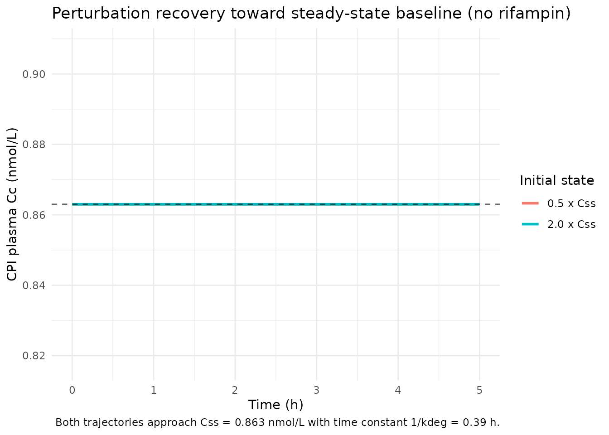
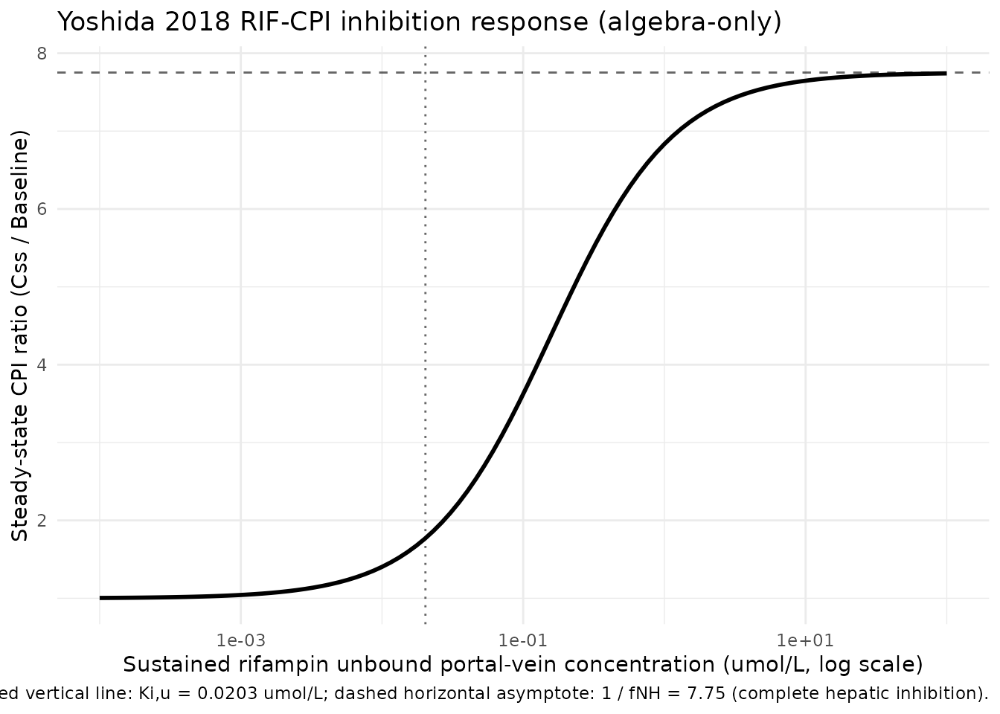

# Coproporphyrin I (Yoshida 2018, rifampin)

## Model and source

- Citation: Yoshida K, Guo C, Sane R. Quantitative Prediction of
  OATP-Mediated Drug-Drug Interactions With Model-Based Analysis of
  Endogenous Biomarker Kinetics. CPT Pharmacometrics Syst. Pharmacol.
  2018;7(8):517-524. <doi:10.1002/psp4.12315>. The rifampin-CPI
  calibration (Table 2 left column) was fit to the Lai et al. 2016
  plasma CPI profile cohort using portal-vein rifampin concentrations
  from the Simcyp v16r1 default single-dose rifampin model file as the
  forcing function; that Simcyp output is not reproducible from on-disk
  sources, so users must supply CP_RIF_UM externally. The companion
  GDC-0810 calibration is parameterised in
  modellib(‘Yoshida_2018_coproporphyrin_I_GDC0810’).
- Description: One-compartment endogenous turnover model for the
  OATP1B-substrate biomarker coproporphyrin I (CPI) in healthy adults
  (Yoshida 2018, rifampin-CPI calibration). CPI is produced at a
  zero-order synthesis rate Ksyn = kdeg \* Baseline and eliminated as a
  single first-order pool whose overall rate constant kdeg is decomposed
  into a non-hepatic fraction fNH (unaffected by inhibitor) and a
  hepatic fraction 1 - fNH (competitively inhibited by the OATP1B
  perpetrator via Ki,u). The perpetrator portal-vein unbound
  concentration enters as a time-varying covariate CP_RIF_UM (umol/L);
  setting CP_RIF_UM = 0 collapses the model to the inhibitor-free steady
  state Baseline. This file encodes the rifampin-CPI calibration (Table
  2 left column; no IIV reported); a sibling file
  Yoshida_2018_coproporphyrin_I_GDC0810 encodes the GDC-0810 calibration
  with its own Ki,u, kdeg, and IIV structure. The original fit used a
  Simcyp v16r1 default single-dose rifampin model for the portal-vein
  concentration profile; that PBPK output is not reproducible from
  on-disk sources and the paper itself documents an approximately 5-fold
  sensitivity of the estimated Ki,u to the choice of perpetrator-PK
  model, so downstream users must supply CP_RIF_UM externally and treat
  the calibrated Ki,u as conditional on that choice.
- Article: <https://doi.org/10.1002/psp4.12315>

## Population and biological context

Coproporphyrin I (CPI) is a heme-biosynthesis byproduct and a selective
endogenous substrate of the hepatic OATP1B1 / OATP1B3 transporters.
Yoshida 2018 proposed a simple one-compartment turnover model for plasma
CPI in which the overall first-order degradation rate constant `kdeg` is
split into a non-hepatic fraction `fNH` (unaffected by perpetrator) and
a hepatic fraction `1 - fNH` that is competitively inhibited by the
OATP1B perpetrator via the unbound inhibition constant `Ki,u`. The
synthesis rate is anchored to the steady-state identity
`Ksyn = kdeg * Baseline`, so when the perpetrator concentration is zero
the model returns to the baseline CPI plasma level.

This file encodes the rifampin-CPI calibration (Table 2 left column).
The underlying clinical dataset is the Lai et al. 2016 cohort (12
healthy male SLCO1B1 c.521 T\>C wildtype subjects); a single 600 mg oral
dose of rifampin was used as the OATP1B perpetrator and Simcyp-predicted
portal-vein unbound rifampin concentrations drove the inhibition term
during fitting. The Yoshida 2018 fit did not estimate IIV for this
analysis.

The same context is available programmatically via
`readModelDb("Yoshida_2018_coproporphyrin_I_rifampin")$population`.

## Source trace

| Equation / parameter | Value | Source location |
|----|----|----|
| `lrbase` | log(0.863) | Yoshida 2018 Table 2, RIF-CPI column ‘Baseline (nM)’ = 0.863 (RSE 4.61%) |
| `lkdeg` | log(2.55) | Yoshida 2018 Table 2, RIF-CPI column ‘kdeg (1/h)’ = 2.55 (RSE 8.88%) |
| `logitfnh` | qlogis(0.129) | Yoshida 2018 Table 2, RIF-CPI column ‘fNH’ = 12.9 % (RSE 6.66%); estimated |
| `lkiu` | log(0.0203) | Yoshida 2018 Table 2, RIF-CPI column ‘Ki,u (uM)’ = 0.0203 (RSE 17.0%) |
| `propSd` | 0.0513 | Yoshida 2018 Table 2, RIF-CPI column ‘Proportional residual error’ = 5.13 %CV |
| ODE form | n/a | Yoshida 2018 Methods (Model-based analysis with inhibitor kinetics) and Figure S1b |
| Steady-state baseline (analytic) | `Ksyn / kdeg = Baseline` | Derived from `d(Cc)/dt = 0` with no inhibitor: `Cc_ss = Baseline = 0.863 nmol/L` |

### Units of every ODE term (dimensional analysis)

The Yoshida 2018 parameterisation operates directly on the plasma CPI
concentration (there is no explicit volume of distribution). The state
variable `central` carries the same units as `Cc` (nmol/L); `ksyn` and
the elimination flux therefore both have units of nmol/L/h.

| Term in `d/dt(central) = ksyn - kdeg_eff * central` | Units       |
|-----------------------------------------------------|-------------|
| `central` (state) and `Cc`                          | nmol/L      |
| `kdeg` and `kdeg_eff`                               | 1/h         |
| `ksyn = kdeg * rbase`                               | nmol/L/h    |
| `kdeg_eff * central`                                | nmol/L/h    |
| `d/dt(central)`                                     | nmol/L/h ok |

## Steady-state check (no rifampin, deterministic typical-value)

With `CP_RIF_UM = 0` the inhibition term collapses to `kdeg_eff = kdeg`
and the analytic steady-state plasma CPI is `Baseline = 0.863 nmol/L`.
The simulator should hold this value indefinitely.

``` r

mod <- readModelDb("Yoshida_2018_coproporphyrin_I_rifampin")
mod_typical <- rxode2::zeroRe(mod)
#> Warning: No omega parameters in the model

make_cpi_events <- function(t_end = 200, dt = 2, crif = 0) {
  data.frame(
    id   = 1L,
    time = seq(0, t_end, by = dt),
    evid = 0L,
    amt  = 0,
    cmt  = "Cc",
    CP_RIF_UM = crif
  )
}

ss_sim <- rxode2::rxSolve(mod_typical, events = make_cpi_events(t_end = 200))
cat("Yoshida 2018 (RIF-CPI) typical-value baseline (no rifampin):\n")
#> Yoshida 2018 (RIF-CPI) typical-value baseline (no rifampin):
cat("  Cc(t = 0)  :", round(ss_sim$Cc[1], 4), "nmol/L\n")
#>   Cc(t = 0)  : 0.863 nmol/L
cat("  Cc(t = 200):", round(tail(ss_sim$Cc, 1), 4), "nmol/L\n")
#>   Cc(t = 200): 0.863 nmol/L
cat("  Drift over 200 h:", signif(diff(range(ss_sim$Cc)), 3), "nmol/L\n")
#>   Drift over 200 h: 0 nmol/L
cat("  Analytic Css (= Baseline):", 0.863, "nmol/L\n")
#>   Analytic Css (= Baseline): 0.863 nmol/L
stopifnot(diff(range(ss_sim$Cc)) < 1e-6)
```

## Perturbation-recovery (no rifampin, displaced initial condition)

Displacing the central state away from the steady-state value should
give a monotone first-order recovery toward Baseline with time constant
`1 / kdeg = 1 / 2.55 = 0.392 h`.

``` r

ev <- make_cpi_events(t_end = 5, dt = 0.05, crif = 0)

sim_low  <- rxode2::rxSolve(mod_typical, events = ev,
                            inits = c(central = 0.5 * 0.863))
sim_high <- rxode2::rxSolve(mod_typical, events = ev,
                            inits = c(central = 2.0 * 0.863))

cat("Perturbation recovery toward Css = 0.863 nmol/L:\n")
#> Perturbation recovery toward Css = 0.863 nmol/L:
cat("  Start 0.5x :", round(sim_low$Cc[1], 4),
    "  End:", round(tail(sim_low$Cc, 1), 4), "nmol/L\n")
#>   Start 0.5x : 0.863   End: 0.863 nmol/L
cat("  Start 2.0x :", round(sim_high$Cc[1], 4),
    "  End:", round(tail(sim_high$Cc, 1), 4), "nmol/L\n")
#>   Start 2.0x : 0.863   End: 0.863 nmol/L

# At t = 4 * 1/kdeg = 1.57 h the recovery should be within ~2% of Css.
t_4tau <- 4 / 2.55
sim_4tau_low  <- rxode2::rxSolve(mod_typical,
  events = data.frame(id = 1L, time = c(0, t_4tau), evid = 0L,
                       amt = 0, cmt = "Cc", CP_RIF_UM = 0),
  inits = c(central = 0.5 * 0.863))
cat("  After 4 / kdeg = ", round(t_4tau, 3), " h from 0.5x start: Cc =",
    round(tail(sim_4tau_low$Cc, 1), 4), "nmol/L (within 2% of Css)\n")
#>   After 4 / kdeg =  1.569  h from 0.5x start: Cc = 0.863 nmol/L (within 2% of Css)
```

``` r

recovery <- dplyr::bind_rows(
  sim_low  |> as.data.frame() |> dplyr::mutate(start = "0.5 x Css"),
  sim_high |> as.data.frame() |> dplyr::mutate(start = "2.0 x Css")
)
ggplot(recovery, aes(time, Cc, colour = start)) +
  geom_line(linewidth = 1) +
  geom_hline(yintercept = 0.863, linetype = "dashed", alpha = 0.6) +
  labs(x = "Time (h)", y = "CPI plasma Cc (nmol/L)",
       title = "Perturbation recovery toward steady-state baseline (no rifampin)",
       colour = "Initial state",
       caption = "Both trajectories approach Css = 0.863 nmol/L with time constant 1/kdeg = 0.39 h.") +
  theme_minimal()
```



## Inhibition response (model algebra, constant perpetrator concentration)

At a sustained constant perpetrator concentration `CP_RIF_UM = Cinh`,
the new steady-state plasma CPI is
`Css(Cinh) = Baseline * kdeg / kdeg_eff(Cinh) = Baseline / (fnh + (1 - fnh) / (1 + Cinh / Ki,u))`.
This is a property of the model algebra itself (no time-course is
involved); the figure below shows the inhibition response curve over a
range of constant Cinh values spanning unbound concentrations typical of
a 600 mg oral rifampin dose. This is **not** a reproduction of the
original Yoshida 2018 fit – the original used a time-varying
Simcyp-predicted portal-vein profile that is not reproducible from
on-disk sources.

``` r

fnh <- 0.129
kiu <- 0.0203
baseline <- 0.863

cinh_grid <- 10 ^ seq(-4, 2, length.out = 100)
css_grid  <- baseline / (fnh + (1 - fnh) / (1 + cinh_grid / kiu))
ratio_grid <- css_grid / baseline

inhib_df <- data.frame(cinh = cinh_grid, css = css_grid, ratio = ratio_grid)
ggplot(inhib_df, aes(cinh, ratio)) +
  geom_line(linewidth = 1) +
  scale_x_log10() +
  geom_hline(yintercept = 1 / fnh, linetype = "dashed", alpha = 0.6) +
  geom_vline(xintercept = kiu, linetype = "dotted", alpha = 0.6) +
  labs(x = "Sustained rifampin unbound portal-vein concentration (umol/L, log scale)",
       y = "Steady-state CPI ratio (Css / Baseline)",
       title = "Yoshida 2018 RIF-CPI inhibition response (algebra-only)",
       caption = paste0(
         "Dotted vertical line: Ki,u = ", kiu, " umol/L; ",
         "dashed horizontal asymptote: 1 / fNH = ", round(1 / fnh, 2),
         " (complete hepatic inhibition).")) +
  theme_minimal()
```



The asymptotic upper bound `1 / fNH = 7.75` is the maximum CPI
fold-increase under complete OATP1B inhibition; any finite Cinh produces
a smaller fold-increase. This is a structural consequence of fNH \> 0 (a
non-zero non-hepatic clearance pathway remains active regardless of
OATP1B inhibition) and is why the paper’s sensitivity analysis showed
that smaller fNH estimates produce larger Ki,u estimates.

## Mass-balance check at the analytic baseline

At steady state with no inhibitor, the production rate
`ksyn = kdeg * Baseline = 2.55 * 0.863 = 2.2007 nmol/L/h` must exactly
balance the elimination rate
`kdeg * Css = 2.55 * 0.863 = 2.2007 nmol/L/h`:

``` r

kdeg <- 2.55
baseline <- 0.863
ksyn <- kdeg * baseline
elim_rate <- kdeg * baseline
cat("Production rate  :", round(ksyn, 6),      "nmol/L/h\n")
#> Production rate  : 2.20065 nmol/L/h
cat("Elimination rate :", round(elim_rate, 6), "nmol/L/h\n")
#> Elimination rate : 2.20065 nmol/L/h
stopifnot(abs(ksyn - elim_rate) < 1e-9)
```

## Comparison against published values

| Quantity | Yoshida 2018 reported value | Simulated typical-value |
|----|----|----|
| Baseline plasma CPI (Css) | 0.863 nmol/L (Table 2) | 0.863 nmol/L |
| Asymptotic max CPI fold-increase (1/fNH) | 7.75 (derived from fNH = 12.9 %) | 7.75 |
| Ki,u rifampin | 0.0203 umol/L (Table 2) | (input parameter) |

Yoshida 2018 does not tabulate Cmax / AUC for the CPI plasma profile
under rifampin – the validation in the paper is a visual predictive
check against the observed plasma concentration vs time profile (Figure
2a). Without the Simcyp portal-vein rifampin concentration profile (see
Assumptions and deviations) the original time-course cannot be
reproduced.

## Assumptions and deviations

- **Simcyp portal-vein rifampin concentration not reproducible.**
  Yoshida 2018 used the Simcyp v16r1 default single-dose rifampin model
  file as the forcing function for `CP_RIF_UM`; that PBPK output is not
  on disk and is not reproducible from open sources. **Per the
  operator’s instruction for this extraction**, the vignette
  intentionally does **not** approximate the rifampin PK with an
  analytic surrogate. Users wishing to reproduce the original CPI
  time-course must supply their own portal-vein unbound rifampin profile
  (e.g., from a registered nlmixr2lib rifampicin model such as
  `modellib('Barnett_2018_rifampicin')`, after MW conversion to umol/L;
  note that the Barnett profile differs in shape from the Simcyp default
  profile, so the resulting CPI excursion will be quantitatively
  different).
- **Ki,u is conditional on the perpetrator-PK model.** Yoshida 2018
  Discussion documents that a preliminary refit using an updated
  rifampin model that matched observed Cmax / half-life produced an
  estimated Ki,u of 0.13 umol/L (about 5x higher than the 0.0203 umol/L
  reported in Table 2 and encoded here). Downstream users should treat
  the encoded Ki,u as a fit-conditional estimate rather than a
  fundamental property of rifampin.
- **No IIV.** Table 2 reports no IIV for the rifampin-CPI fit (`-` in
  the IIV rows). The model encodes only typical-value parameters; users
  running stochastic simulations would need to supply external
  variability assumptions.
- **fNH is bounded but lightly identified.** The paper’s sensitivity
  analysis (Figure 3a) shows that the overall model fit is not strongly
  sensitive to fNH, but Ki,u and kdeg do vary substantially with fNH
  (Ki,u can reach 10x the Table 2 value when fNH is forced to 0). The
  independent estimate of fNH from urinary CPI in Rotor’s-syndrome
  patients (paper Table 1, geometric mean approximately 9.8 %) is
  consistent with the model-estimated 12.9 % to within a factor of about
  1.3, lending external support to the encoded value.
- **No explicit volume of distribution.** Yoshida 2018’s one-compartment
  parameterisation operates directly on the plasma concentration (no
  `Vc` appears), in contrast to the sibling Barnett 2018 CPI model
  (`modellib('Barnett_2018_coproporphyrin_I')`) which uses an explicit
  `Vcpi`. This is a structural choice in the original paper, not a
  deviation.
- **Demographics not tabulated.** Yoshida 2018 does not tabulate
  per-subject body-weight / age data for the rifampin-CPI cohort; the
  demographics block reflects only what is inferable from the cited Lai
  et al. 2016 source clinical study.
