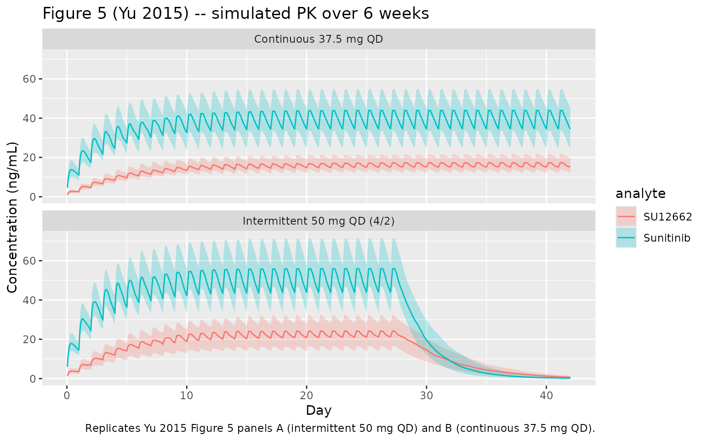

# Sunitinib (Yu 2015)

## Model and source

- Citation: Yu H, Steeghs N, Kloth JSL, de Wit D, van Hasselt JGC, van
  Erp NP, Beijnen JH, Schellens JHM, Mathijssen RHJ, Huitema ADR.
  Integrated semi-physiological pharmacokinetic model for both sunitinib
  and its active metabolite SU12662. Br J Clin Pharmacol.
  2015;79(5):809-819. <doi:10.1111/bcp.12550>.
- Article: <https://doi.org/10.1111/bcp.12550>

Yu and colleagues developed an integrated semi-physiological population
PK model for oral sunitinib and its equipotent active N-desethyl
metabolite SU12662 in 70 adult cancer patients pooled across three
studies (1205 plasma samples total). The structural model has four ODE
states:

1.  Sunitinib oral depot.
2.  Sunitinib central compartment.
3.  SU12662 central compartment.
4.  SU12662 peripheral compartment.

Sunitinib is absorbed first-order into a hypothetical hepatic enzyme
compartment that sits algebraically in equilibrium with the sunitinib
central compartment via hepatic blood flow Qh (fixed at 80 L/h for a 70
kg subject). Clearance CL of sunitinib acts at the enzyme site (Cliv =
(ka \* depot + Qh / Vc \* central) / (Qh + CL)). Fraction fm = 0.21 of
the cleared sunitinib appears as SU12662 input into the metabolite
central compartment, the rest is true (non-SU12662) sunitinib clearance.
SU12662 follows a 2-compartment disposition. Allometric scaling on body
weight (exponent 0.75 on clearance / flow, 1.0 on volumes) is applied a
priori with reference WT = 70 kg.

## Population

The Yu 2015 dataset pooled three previously conducted
clinical-pharmacology studies (Table 1): Study 1 (n = 50, 703 samples;
sparse PK at 0, 4, 8, 24 h post-dose on a pre-steady-state day and a
steady-state day), Study 2 (n = 7, 112 samples; steady-state at 0, 1, 2,
4, 6, 8, 12, 24 h), and Study 3 (n = 13, 390 samples; steady-state at 0,
10, 20, 40 min and 1, 2, 3, 4, 5, 6, 7, 8, 10, 12, 24 h). All subjects
received once-daily oral sunitinib at 25, 37.5, or 50 mg; complete
dosing histories were not available for each patient and pre-dose
concentrations were handled by the Soy ‘missing-dose’ method during
NONMEM estimation. Reported pooled body weights range 39-157 kg with a
median of 82 kg (Table 1). Sex, race, and detailed age breakdowns are
not in the main text. Approximately 6% of patients had missing WT and
were imputed to 70 kg.

The same information is available programmatically:

``` r

readModelDb("Yu_2015_sunitinib")$population
```

## Source trace

The per-parameter origin is recorded as an in-file comment on each
`ini()` entry in `inst/modeldb/specificDrugs/Yu_2015_sunitinib.R`. The
table below collects the trail in one place.

| Equation / parameter | Value | Source location |
|----|----|----|
| Sunitinib + SU12662 ODE structure (4 states; pre-systemic enzyme compartment) | n/a | Methods + Eqs 6-10; Appendix NONMEM control stream |
| `lka` -\> Ka sunitinib | 0.34 1/h | Table 2 (RSE 10.8%) |
| `lcl` -\> CL sunitinib (apparent) | 35.7 L/h | Table 2 (RSE 5.7%) |
| `lvc` -\> Vc sunitinib (apparent) | 1360 L | Table 2 (RSE 6.0%) |
| `Qh` (fixed hepatic blood flow at 70 kg) | 80 L/h | Methods + Table 2 (“80 fix”) |
| `fm` (fixed metabolite formation fraction) | 0.21 | Methods (“fixed to 0.21”) + Table 2 (“0.21 fix”); Houk 2009 |
| `lcl_su12662` -\> CL SU12662 (apparent) | 17.1 L/h | Table 2 (RSE 7.4%) |
| `lvc_su12662` -\> Vc SU12662 (apparent) | 635 L | Table 2 (RSE 13.1%) |
| `lq_su12662` -\> Qi SU12662 (apparent) | 20.1 L/h | Table 2 (RSE 32.6%) |
| `lvp_su12662` -\> Vp SU12662 (apparent) | 388 L | Table 2 (RSE 14.9%) |
| `e_wt_cl` (allometric CL / Qh / Qi exponent, fixed) | 0.75 | Methods Eq 3 |
| `e_wt_vc` (allometric Vc / Vp exponent, fixed) | 1.0 | Methods Eq 4 |
| IIV variances (`omega^2 = log(CV^2 + 1)`) for Vc_sun / Vc_SU / CL_SU / CL_sun | 32.4 / 57.9 / 42.1 / 33.9 % CV | Table 2 |
| Off-diagonals (correlations 0.48 / 0.45 / 0.53; others 0) | block | Table 2 (current-model “Correlations” rows) |
| `propSd` sunitinib (sqrt of sigma^2 = 0.06, Study 1) | 0.2449 | Table 2 (Study 1) |
| `propSd_su12662` SU12662 (sqrt of sigma^2 = 0.03, Study 1) | 0.1732 | Table 2 (Study 1) |
| Body-weight covariate | WT (kg) | Table 1; Methods |

## Virtual cohort

The original observed concentrations are not publicly available. The
simulations below use a virtual cohort whose body-weight distribution
matches the truncated log-normal Yu 2015 used in their own simulation
study (mean 82.3 kg, SD 19.4 kg, truncated 39-157 kg). Two dosing
regimens are simulated:

- **Intermittent regimen** – 50 mg PO QD for the standard 4-weeks-on /
  2-weeks-off cycle (Days 1-28 dosed, Days 29-42 dose-free).
- **Continuous regimen** – 37.5 mg PO QD without breaks.

Both are simulated out to 6 weeks (42 days) so steady-state combined
Cmin can be read off the model output and compared with Yu 2015 Figure 5
and the simulated NCA values in the Results section.

``` r

set.seed(20150505L)

n_sim     <- 100L
horizon_h <- 6 * 7 * 24      # 6-week (42-day) horizon, hours
qd_h      <- 24

wt_mean   <- 82.3
wt_sd_log <- sqrt(log(1 + (19.4 / wt_mean)^2))   # CV-to-logSD
wt_mu_log <- log(wt_mean) - 0.5 * wt_sd_log^2
sample_truncated_lnorm <- function(n, mu, sigma, lower, upper) {
  out <- numeric(0)
  while (length(out) < n) {
    candidate <- rlnorm(n, meanlog = mu, sdlog = sigma)
    candidate <- candidate[candidate >= lower & candidate <= upper]
    out <- c(out, candidate)
  }
  out[seq_len(n)]
}

wts <- sample_truncated_lnorm(n_sim, wt_mu_log, wt_sd_log, 39, 157)

# Dose times (hours) for each regimen
times_intermittent <- function() {
  # 50 mg QD on Days 1-28; Days 29-42 are dose-free
  seq(0, by = qd_h, length.out = 28L)
}
times_continuous <- function() {
  # 37.5 mg QD continuous over 42 days
  seq(0, by = qd_h, length.out = 42L)
}

# Observation grid: hourly during dose accumulation, then daily after
obs_times <- sort(unique(c(
  seq(0, 7 * 24, by = 1),                   # first week, hourly
  seq(7 * 24, horizon_h, by = 4)            # weeks 2-6, every 4 hours
)))

make_subject <- function(id, regimen, dose_mg, dose_times, wt) {
  dose_rows <- tibble::tibble(
    id   = id,
    time = dose_times,
    amt  = dose_mg,
    evid = 1L,
    cmt  = "depot",
    WT   = wt,
    regimen = regimen
  )
  obs_rows <- tibble::tibble(
    id   = id,
    time = obs_times,
    amt  = NA_real_,
    evid = 0L,
    cmt  = "Cc",
    WT   = wt,
    regimen = regimen
  )
  dplyr::bind_rows(dose_rows, obs_rows) |>
    dplyr::arrange(time)
}

events_int <- dplyr::bind_rows(lapply(seq_len(n_sim), function(i) {
  make_subject(id = i, regimen = "Intermittent 50 mg QD (4/2)",
               dose_mg = 50, dose_times = times_intermittent(), wt = wts[i])
}))

events_con <- dplyr::bind_rows(lapply(seq_len(n_sim), function(i) {
  make_subject(id = i + n_sim, regimen = "Continuous 37.5 mg QD",
               dose_mg = 37.5, dose_times = times_continuous(), wt = wts[i])
}))

events <- dplyr::bind_rows(events_int, events_con)
stopifnot(!anyDuplicated(unique(events[, c("id", "time", "evid")])))
```

## Simulation

``` r

mod <- readModelDb("Yu_2015_sunitinib")
sim <- rxode2::rxSolve(
  mod, events = events,
  keep = c("regimen", "WT")
)
#> ℹ parameter labels from comments will be replaced by 'label()'
sim <- as.data.frame(sim)
sim$day <- sim$time / 24
sim$combined_Cc <- sim$Cc + sim$Cc_su12662
```

For deterministic typical-value replication (no between-subject
variability), zero the random effects:

``` r

mod_typical <- rxode2::zeroRe(mod)
#> ℹ parameter labels from comments will be replaced by 'label()'
events_typ <- events |>
  dplyr::filter(id %in% c(1L, n_sim + 1L))   # one subject per regimen
sim_typical <- rxode2::rxSolve(
  mod_typical, events = events_typ,
  keep = c("regimen", "WT")
)
#> ℹ omega/sigma items treated as zero: 'etalcl', 'etalcl_su12662', 'etalvc_su12662', 'etalvc'
#> Warning: multi-subject simulation without without 'omega'
sim_typical <- as.data.frame(sim_typical)
sim_typical$day <- sim_typical$time / 24
sim_typical$combined_Cc <- sim_typical$Cc + sim_typical$Cc_su12662
```

## Replicate published figures

### Figure 5 – simulated concentration-time profiles

Yu 2015 Figure 5 shows the median and 25th-75th percentile envelopes for
sunitinib and SU12662 concentration over 6 weeks, separately for the
intermittent (50 mg QD, 4/2 cycle) and continuous (37.5 mg QD) regimens.

``` r

sim_vpc <- sim |>
  dplyr::filter(time > 0) |>
  dplyr::group_by(regimen, day) |>
  dplyr::summarise(
    sun_Q25 = quantile(Cc,         0.25, na.rm = TRUE),
    sun_Q50 = quantile(Cc,         0.50, na.rm = TRUE),
    sun_Q75 = quantile(Cc,         0.75, na.rm = TRUE),
    met_Q25 = quantile(Cc_su12662, 0.25, na.rm = TRUE),
    met_Q50 = quantile(Cc_su12662, 0.50, na.rm = TRUE),
    met_Q75 = quantile(Cc_su12662, 0.75, na.rm = TRUE),
    .groups = "drop"
  ) |>
  tidyr::pivot_longer(
    cols = -c(regimen, day),
    names_to = c("analyte", "stat"),
    names_pattern = "(sun|met)_(Q25|Q50|Q75)"
  ) |>
  tidyr::pivot_wider(names_from = stat, values_from = value) |>
  dplyr::mutate(
    analyte = dplyr::recode(analyte, sun = "Sunitinib", met = "SU12662")
  )

ggplot(sim_vpc, aes(day, Q50, colour = analyte, fill = analyte)) +
  geom_ribbon(aes(ymin = Q25, ymax = Q75), alpha = 0.25, colour = NA) +
  geom_line() +
  facet_wrap(~regimen, ncol = 1) +
  labs(x = "Day", y = "Concentration (ng/mL)",
       title = "Figure 5 (Yu 2015) -- simulated PK over 6 weeks",
       caption = "Replicates Yu 2015 Figure 5 panels A (intermittent 50 mg QD) and B (continuous 37.5 mg QD).")
```



### Combined Cmin at steady state (Table comparison)

Yu 2015 reports steady-state combined Cmin (sunitinib + SU12662) as:

- Intermittent 50 mg QD: median 64 ng/mL (25th-75th 48-82); 27% below
  the 50 ng/mL efficacy target.
- Continuous 37.5 mg QD: median 48 ng/mL (25th-75th 36-61); 27% below
  37.5 ng/mL and 53% below 50 ng/mL.

For the intermittent regimen, Cmin at steady state is measured at the
start of Day 28 (i.e., 27 days after the first dose, the last steady-
state morning before the off-week). For continuous, Day 28 is also a
reasonable steady-state anchor.

``` r

ss_anchor_day <- 28
cmin_at_ss <- sim |>
  dplyr::filter(day >= ss_anchor_day - 1, day <= ss_anchor_day) |>
  dplyr::group_by(id, regimen) |>
  dplyr::summarise(cmin = min(combined_Cc, na.rm = TRUE), .groups = "drop") |>
  dplyr::group_by(regimen) |>
  dplyr::summarise(
    n_sim          = dplyr::n(),
    cmin_median    = median(cmin),
    cmin_Q25       = quantile(cmin, 0.25),
    cmin_Q75       = quantile(cmin, 0.75),
    pct_below_50   = mean(cmin < 50)   * 100,
    pct_below_37_5 = mean(cmin < 37.5) * 100,
    .groups = "drop"
  )

knitr::kable(
  cmin_at_ss,
  digits  = 1,
  caption = "Simulated steady-state combined Cmin (sunitinib + SU12662). Yu 2015 Results report median 64 ng/mL (25th-75th 48-82) for intermittent and 48 ng/mL (36-61) for continuous; ~27% of patients fail the 50 ng/mL target on intermittent dosing, and 27%/53% fail the 37.5/50 ng/mL targets on continuous dosing."
)
```

| regimen | n_sim | cmin_median | cmin_Q25 | cmin_Q75 | pct_below_50 | pct_below_37_5 |
|:---|---:|---:|---:|---:|---:|---:|
| Continuous 37.5 mg QD | 100 | 50.1 | 37.9 | 64.6 | 50 | 25 |
| Intermittent 50 mg QD (4/2) | 100 | 66.5 | 51.2 | 83.3 | 21 | 9 |

Simulated steady-state combined Cmin (sunitinib + SU12662). Yu 2015
Results report median 64 ng/mL (25th-75th 48-82) for intermittent and 48
ng/mL (36-61) for continuous; ~27% of patients fail the 50 ng/mL target
on intermittent dosing, and 27%/53% fail the 37.5/50 ng/mL targets on
continuous dosing. {.table}

## PKNCA validation

PKNCA is used to derive Cmax, Tmax, AUC0-tau, Cmin, and Cavg over the
Day 27-28 dosing interval – i.e., one steady-state interval before the
4/2 break. The simulated values are compared in a single side-by-side
table against Yu 2015 Figure 5 / Results text.

### Concentration and dose frames

``` r

tau_h     <- 24
day_ss_lo <- 27 * 24       # h
day_ss_hi <- 28 * 24       # h

# Concentration frame -- include the time-zero anchor required by PKNCA.
sim_nca_sun <- sim |>
  dplyr::filter(!is.na(Cc)) |>
  dplyr::select(id, time, Cc, regimen)
sim_nca_sun <- dplyr::bind_rows(
  sim_nca_sun,
  sim_nca_sun |> dplyr::distinct(id, regimen) |>
    dplyr::mutate(time = 0, Cc = 0)
) |>
  dplyr::distinct(id, regimen, time, .keep_all = TRUE) |>
  dplyr::arrange(id, regimen, time)

sim_nca_su <- sim |>
  dplyr::filter(!is.na(Cc_su12662)) |>
  dplyr::transmute(id, time, Cc = Cc_su12662, regimen)
sim_nca_su <- dplyr::bind_rows(
  sim_nca_su,
  sim_nca_su |> dplyr::distinct(id, regimen) |>
    dplyr::mutate(time = 0, Cc = 0)
) |>
  dplyr::distinct(id, regimen, time, .keep_all = TRUE) |>
  dplyr::arrange(id, regimen, time)

# Dose frame -- one row per dose event per subject, in the source events
dose_df <- events |>
  dplyr::filter(evid == 1L) |>
  dplyr::select(id, time, amt, regimen)
```

### Sunitinib (parent) NCA

``` r

conc_sun <- PKNCA::PKNCAconc(
  sim_nca_sun, Cc ~ time | regimen + id,
  concu = "ng/mL", timeu = "h"
)
dose_sun <- PKNCA::PKNCAdose(
  dose_df, amt ~ time | regimen + id,
  doseu = "mg"
)

intervals_ss <- data.frame(
  start    = day_ss_lo,
  end      = day_ss_hi,
  cmax     = TRUE,
  tmax     = TRUE,
  cmin     = TRUE,
  cav      = TRUE,
  auclast  = TRUE
)

nca_sun <- PKNCA::pk.nca(PKNCA::PKNCAdata(conc_sun, dose_sun, intervals = intervals_ss))
```

### SU12662 (metabolite) NCA

``` r

conc_su <- PKNCA::PKNCAconc(
  sim_nca_su, Cc ~ time | regimen + id,
  concu = "ng/mL", timeu = "h"
)

nca_su <- PKNCA::pk.nca(PKNCA::PKNCAdata(conc_su, dose_sun, intervals = intervals_ss))
```

### Comparison against published values

``` r

summarise_nca <- function(nca_res) {
  as.data.frame(nca_res) |>
    dplyr::filter(PPTESTCD %in% c("cmax", "tmax", "cmin", "cav", "auclast")) |>
    dplyr::group_by(regimen, PPTESTCD) |>
    dplyr::summarise(
      median = median(PPORRES, na.rm = TRUE),
      Q25    = quantile(PPORRES, 0.25, na.rm = TRUE),
      Q75    = quantile(PPORRES, 0.75, na.rm = TRUE),
      .groups = "drop"
    )
}

sun_summary <- summarise_nca(nca_sun)
su_summary  <- summarise_nca(nca_su)

knitr::kable(
  sun_summary,
  digits  = 2,
  caption = "Sunitinib steady-state NCA on the Day 27-28 interval, by regimen (n_sim = 100 per arm)."
)
```

| regimen                     | PPTESTCD |  median |    Q25 |     Q75 |
|:----------------------------|:---------|--------:|-------:|--------:|
| Continuous 37.5 mg QD       | auclast  |  945.89 | 710.72 | 1207.58 |
| Continuous 37.5 mg QD       | cav      |   39.41 |  29.61 |   50.32 |
| Continuous 37.5 mg QD       | cmax     |   43.93 |  33.66 |   54.78 |
| Continuous 37.5 mg QD       | cmin     |   34.51 |  24.54 |   44.92 |
| Continuous 37.5 mg QD       | tmax     |    8.00 |   8.00 |    8.00 |
| Intermittent 50 mg QD (4/2) | auclast  | 1220.60 | 996.80 | 1582.65 |
| Intermittent 50 mg QD (4/2) | cav      |   50.86 |  41.53 |   65.94 |
| Intermittent 50 mg QD (4/2) | cmax     |   56.01 |  46.73 |   71.63 |
| Intermittent 50 mg QD (4/2) | cmin     |   43.99 |  33.96 |   57.75 |
| Intermittent 50 mg QD (4/2) | tmax     |    8.00 |   8.00 |    8.00 |

Sunitinib steady-state NCA on the Day 27-28 interval, by regimen (n_sim
= 100 per arm). {.table}

``` r


knitr::kable(
  su_summary,
  digits  = 2,
  caption = "SU12662 steady-state NCA on the Day 27-28 interval, by regimen (n_sim = 100 per arm)."
)
```

| regimen                     | PPTESTCD | median |    Q25 |    Q75 |
|:----------------------------|:---------|-------:|-------:|-------:|
| Continuous 37.5 mg QD       | auclast  | 390.37 | 314.84 | 500.79 |
| Continuous 37.5 mg QD       | cav      |  16.27 |  13.12 |  20.87 |
| Continuous 37.5 mg QD       | cmax     |  17.27 |  13.90 |  21.41 |
| Continuous 37.5 mg QD       | cmin     |  15.04 |  11.99 |  19.31 |
| Continuous 37.5 mg QD       | tmax     |   8.00 |   4.00 |   8.00 |
| Intermittent 50 mg QD (4/2) | auclast  | 533.75 | 375.64 | 726.56 |
| Intermittent 50 mg QD (4/2) | cav      |  22.24 |  15.65 |  30.27 |
| Intermittent 50 mg QD (4/2) | cmax     |  24.31 |  16.45 |  32.65 |
| Intermittent 50 mg QD (4/2) | cmin     |  21.21 |  14.03 |  28.40 |
| Intermittent 50 mg QD (4/2) | tmax     |   8.00 |   4.00 |   8.00 |

SU12662 steady-state NCA on the Day 27-28 interval, by regimen (n_sim =
100 per arm). {.table}

Yu 2015 does not report per-analyte Cmax / Tmax / AUC NCA tables for the
two simulation regimens; the only quantitative steady-state target in
the Results is the combined Cmin distribution shown above. The
per-analyte PKNCA tables here therefore serve as a model-integrity check
(positive concentrations, plausible Tmax 2-6 h for sunitinib, flatter
SU12662 trajectory consistent with its longer apparent half-life) rather
than a strict published-value comparison.

## Assumptions and deviations

- **Per-study residual error simplified to a single propSd per output.**
  Yu 2015 fitted study-specific sigma^2 values to account for
  differences in residual variability across the three contributing
  cohorts (sunitinib: 0.06 for Study 1, smaller for Studies 2 + 3;
  SU12662: 0.03 for Study 1, 0.01 for Studies 2 + 3). The model file
  uses the Study 1 sigma^2 (the largest cohort, 50 patients / 703
  samples), then converts to a single proportional SD via SD =
  sqrt(sigma^2) = 0.245 / 0.173. Stratifying residuals by study is
  inappropriate for a generic simulation use case; the smaller Study 2/3
  residuals would give tighter prediction intervals but should not be
  used for safety-related extrapolation.
- **Sigma^2 interpreted as variance, not standard deviation.** The
  NONMEM `$SIGMA` initial values in the paper’s Appendix (`0.0188`,
  `0.0102`, `0.02`) are clearly variances (treating them as SDs would
  imply unrealistic 1-2% proportional CVs). The final values in Table 2
  are treated consistently and converted to SDs for nlmixr2 via
  `sqrt(.)`.
- **Bioavailability F is absorbed into the apparent parameters.** Yu
  2015 Methods: “Bioavailability of sunitinib (F) is unknown. Therefore,
  all parameters of sunitinib were estimated relative to F.” The model
  file therefore uses CL/F, Vc/F, etc. for sunitinib and CL_M/(F \* fm),
  Vc_M/(F \* fm) etc. for SU12662; no separate `lfdepot` is fitted.
- **Hepatic blood flow Qh fixed at 80 L/h for a 70 kg subject.**
  Methods: “The liver blood flow was assumed to be 80 l h-1.” Yu 2015
  ran a sensitivity analysis at +/- 25% and found \< 10% change in Vc
  and \< 20% change in Vc_SU12662, with no change in clearances.
  Downstream users who want to repeat that sensitivity analysis can edit
  the model file’s `Qh70 <- 80` line in `model()`.
- **Metabolite formation fraction fm fixed at 0.21.** Methods: “The
  fraction of sunitinib converted to SU12662 (fM) was assumed to be 21%
  (Houk 2009).” This is not estimated; the value is held constant.
- **Missing-dose handling not encoded.** Yu 2015 used the Soy ‘missing
  dose’ method (estimating per-subject baseline drug amounts in the
  sunitinib and SU12662 central compartments for studies with incomplete
  dosing histories). This is a model-fitting nuisance parameter not
  relevant for forward simulation; the corresponding NONMEM `THETA(10)`
  / `THETA(11)` (`F2` / `F3` in the control stream, set to zero unless
  `FLAG.EQ.0`) are not part of the structural model and are omitted
  here.
- **No covariates beyond body weight.** Yu 2015 modelled body weight a
  priori via allometric scaling and did not screen further covariates in
  the final model. Sex, age, race, renal/hepatic function, and drug-drug
  interactions are not included.
- **Body-weight cohort follows the published simulation distribution.**
  Yu 2015 ‘Simulations of dosing regimens’ samples WT from a truncated
  log-normal with mean 82.3 kg, SD 19.4 kg, truncated 39-157 kg. The
  virtual cohort in this vignette uses the same distribution so the
  simulated steady-state Cmin can be compared against the paper’s
  reported quantiles.
