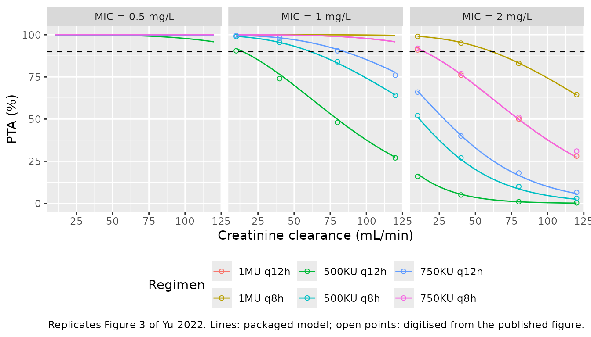
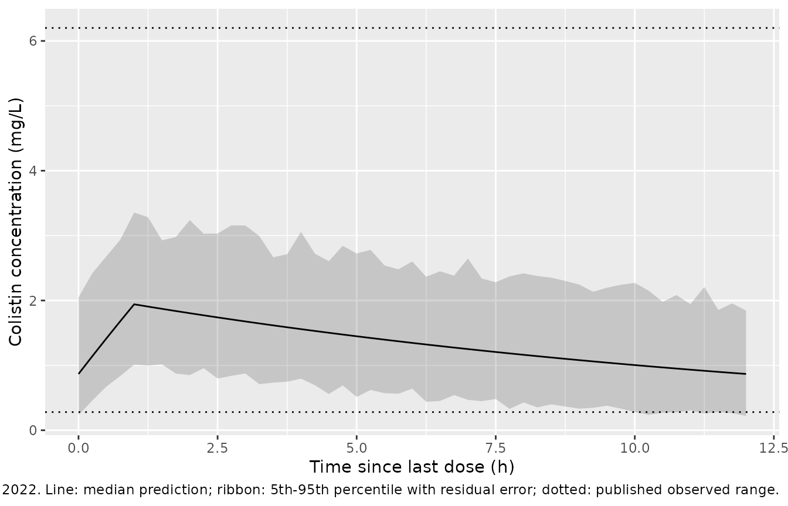

# Colistin sulfate (Yu 2022)

## Model and source

- Citation: Yu XB, Zhang XS, Wang YX, Wang YZ, Zhou HM, Xu FM, Yu JH,
  Zhang LW, Dai Y, Zhou ZY, Zhang CH, Lin GY, Pan JY (2022). Population
  pharmacokinetics of colistin sulfate in critically ill patients:
  exposure and clinical efficacy. Front Pharmacol 13:915958.
  <doi:10.3389/fphar.2022.915958>. See also the published commentary:
  Chen H, Li P (2022). Commentary: Population pharmacokinetics of
  colistin sulfate in critically ill patients: exposure and clinical
  efficacy. Front Pharmacol 13:992085. <doi:10.3389/fphar.2022.992085>.
- Description: One-compartment population PK model for intravenous
  colistin sulfate in critically ill adults with carbapenem-resistant
  organism infections (Yu 2022; n = 42 Chinese patients, 112 sparse
  steady-state therapeutic- drug-monitoring plasma concentrations
  spanning 0.28-6.20 mg/L). Linear elimination with intravenous-infusion
  input. Cockcroft-Gault creatinine clearance enters clearance as an
  additive linear term, CL = 0.994 + 0.525 \* CrCL / 66.47 L/h, with
  exponential inter-individual variability on CL only and a proportional
  residual error. Colistin sulfate is the active drug and must not be
  confused with colistimethate sodium (CMS), the inactive prodrug
  modelled in Plachouras 2009, Mohamed 2012, Jacobs 2016 and
  Karaiskos 2015. Doses are in mg; the paper reports doses only in
  international units and its stated conversion is contradicted by its
  own simulations (see the vignette).
- Article: <https://doi.org/10.3389/fphar.2022.915958>
- Commentary: Chen H, Li P (2022),
  <https://doi.org/10.3389/fphar.2022.992085>

The final model is fully specified in the main text (Eqs. 1-2 and Table
3). The supplement holds the base model (Table S1), the bootstrap (Table
S2) and the VPC (Figure S2); none of these is needed to reproduce the
final model. No erratum has been published (Europe PMC search,
2026-10-02), but a published commentary by Chen and Li (2022) disputes
the paper’s IU-to-mg conversion and its target-attainment reasoning.
Both points are taken up below.

Colistin sulfate is the **active** polymyxin E salt, given intravenously
as such. It is not colistimethate sodium (CMS), the inactive prodrug
whose PK is modelled separately in this library by
`Plachouras_2009_colistin`, `Mohamed_2012_colistin`,
`Jacobs_2016_colistin` and `Karaiskos_2015_colistin`. Other colistin
sulfate models in the library are `Sun_2025_colistinSulfate`,
`Ma_2026_colistinSulfate`, `Jin_2026_colistinSulfate` and
`Huang_2025_colistinSulfate`.

## Population

Forty-two critically ill adults (37 male, 5 female) treated with
intravenous colistin sulfate for at least 3 days for confirmed
carbapenem-resistant Gram-negative infections at the First Affiliated
Hospital of Wenzhou Medical University between January 2020 and December
2021 (Methods, “Patients and Ethics”; Table 1). Age was 67.90 +/- 13.74
years, body weight 63.47 +/- 9.64 kg, serum creatinine 116.64 +/- 105.49
umol/L and Cockcroft-Gault creatinine clearance 79.54 +/- 53.99 mL/min
(mean +/- SD). APACHE II was 17 \[14, 26\]; 76.19% were mechanically
ventilated. The respiratory tract was the most common infection site
(69.05%) and *Acinetobacter baumannii* the most common isolate (73.81%).

The label regimen is a 1 million IU loading dose followed by 1.5 million
IU per day in 2-3 divided doses; the Table 1 daily dose was 150 \[150,
200\] x 10^4 IU. Twenty-two patients also received inhaled colistin
sulfate and four received it intraventricularly or intrathecally.
Steady-state sparse samples (after at least six doses) gave 112 plasma
concentrations from 0.28 to 6.20 mg/L. Concentrations drawn during renal
replacement therapy or ECMO were excluded.

The same information is available programmatically via
`readModelDb("Yu_2022_colistinSulfate")()$population`.

## Source trace

| Equation / parameter | Value | Source location |
|----|----|----|
| `lcl` (CL intercept, L/h) | 0.994 | Table 3 `TVCL (L/h)` 0.994 (RSE 16%); Eq. 1 |
| `e_crcl_cl` (L/h per CrCL/66.47) | 0.525 | Table 3 `CrCL on CL (theta 1)` 0.525 (RSE 22%); Eq. 1 |
| CrCL divisor | 66.47 mL/min | Eq. 1 and Table 4 only; not tabulated as a cohort statistic |
| `lvc` (V, L) | 20.7 | Table 3 `TVV (L)` 20.7 (RSE 10%); Eq. 2 |
| `etalcl` | omega^2 = 0.08835 | Table 3 `BSV_CL [%CV]` 30.40% (RSE 15%, shrinkage 9%); `log(0.304^2 + 1)` |
| `propSd` | 0.251 | Table 3 `Proportional error [%CV]` 25.10% (RSE 16%, shrinkage 14%) |
| `cl <- (exp(lcl) + e_crcl_cl * CRCL / 66.47) * exp(etalcl)` | n/a | Eq. 1; Methods “exponential function” for BSV |
| `vc <- exp(lvc)` | n/a | Eq. 2 (no covariate, no IIV in the final model) |
| `d/dt(central) <- -kel * central` | n/a | Results: “one-compartmental model with linear elimination” |
| `Cc ~ prop(propSd)` | n/a | Results: “The proportional error model was selected” |

``` r

mod <- readModelDb("Yu_2022_colistinSulfate")
ui <- rxode2::rxode(mod)
#> ℹ parameter labels from comments will be replaced by 'label()'
omega_cl <- sqrt(ui$omega["etalcl", "etalcl"])
cl_typ <- function(crcl) 0.994 + 0.525 * crcl / 66.47   # Eq. 1

# The packaged typical clearance must equal Eq. 1 exactly.
crcl_grid <- seq(10, 120, by = 10)
typ <- rxode2::rxSolve(
  rxode2::zeroRe(ui),
  events = data.frame(id = seq_along(crcl_grid), time = 0, evid = 0,
                      amt = 0, cmt = "central", CRCL = crcl_grid),
  keep = "CRCL"
) |> as.data.frame()
#> ℹ omega/sigma items treated as zero: 'etalcl'
#> Warning: multi-subject simulation without without 'omega'
stopifnot(max(abs(typ$cl / cl_typ(typ$CRCL) - 1)) < 1e-10)
```

## The dose unit

The model works in mg and mg/L, as the paper’s parameters and assay do.
The paper reports every dose in international units. Three candidate
conversions are in play:

| Conversion | mg per 10^6 IU | Source |
|----|----|----|
| 17,000 IU per mg | 58.8 | Yu 2022 Introduction: “1 mg of pure colistin base = 17,000 IU of colistin” |
| about 22,300 IU per mg | 44.8 | Chinese consensus figure for colistin sulfate quoted by Chen and Li (2022), who show that 17,000 IU/mg is only the pharmacopoeial lower potency limit |
| 30,000 IU per mg | 33.3 | the colistin-base-activity convention |

The conversion used in the authors’ NONMEM dataset decides what “mg”
means for this model, and the paper’s own model-based output identifies
it. Figure 3 plots the probability of target attainment (PTA,
`fAUC/MIC >= 15`, unbound fraction 0.5) against creatinine clearance for
six regimens, each with a loading dose of twice the maintenance dose
(Methods, “Monte Carlo Simulations”).

### Which AUC Figure 3 uses

Figure 3 cannot be a steady-state AUC. At steady state a linear model
gives `AUC0-24 = daily dose / CL`, so 750 KU q12h and 500 KU q8h (both
1.5 MU/day) would have identical curves, as would 1 MU q12h and 750 KU
q8h (2.0 versus 2.25 MU/day, a fixed 12% apart). Instead Figure 3 draws
750 KU q12h well above 500 KU q8h and 1 MU q12h on top of 750 KU q8h,
and the Results say that “with the same daily dose, the dosing interval
of 12 h had higher PTA achievement than the dosing interval of 8 h”.
Chen and Li (2022) note that this “is not possible for an AUC-based
PK/PD index and a PK model with linear elimination” at steady state.
What the figure does fit is an AUC driven by the **first day’s doses
including the loading dose**: 750 KU q12h delivers 1.5 + 0.75 = 2.25 MU
in the first 24 h against 1.0 + 0.5 + 0.5 = 2.0 MU for 500 KU q8h, and 1
MU q12h and 750 KU q8h both deliver 3.0 MU. The total exposure from
those doses is `AUC = D(first 24 h) / CL`, which is log-normal in CL, so
the PTA at each creatinine clearance is a closed-form probability.

``` r

# Maintainer-digitised from Figure 3 of Yu 2022 (PTA, %, read off the fitted
# curves at CrCL 10, 40, 80 and 120 mL/min; roughly +/- 2 percentage points).
# Curves pinned at 100% (all of MIC = 0.5, and 750 KU q8h / 1 MU q12h /
# 1 MU q8h at MIC = 1) carry no information and are omitted.
fig3 <- tibble::tribble(
  ~MIC, ~regimen,     ~mu_maint, ~tau, ~c10, ~c40, ~c80, ~c120,
  1,    "500KU q12h", 0.50,      12,   90.5, 74,   48,   27,
  1,    "500KU q8h",  0.50,       8,   99,   95.5, 84,   64,
  1,    "750KU q12h", 0.75,      12,   99.5, 98,   90.5, 76,
  2,    "500KU q12h", 0.50,      12,   16,    5,    1,    0.3,
  2,    "500KU q8h",  0.50,       8,   52,   27,   10,    3,
  2,    "750KU q12h", 0.75,      12,   66,   40,   18,    6.5,
  2,    "750KU q8h",  0.75,       8,   92,   77,   51,   31,
  2,    "1MU q12h",   1.00,      12,   91,   76,   50,   28,
  2,    "1MU q8h",    1.00,       8,   99,   95,   83,   64.5
) |>
  pivot_longer(c10:c120, names_to = "crcl", values_to = "pta_pub",
               names_transform = list(crcl = function(x) as.numeric(sub("c", "", x)))) |>
  mutate(
    # MU given in the first 24 h: a 2x loading dose, then the maintenance
    # doses that fall before 24 h.
    mu_day1 = mu_maint * (2 + (24 / tau - 1)),
    # MU per day at steady state.
    mu_ss = mu_maint * 24 / tau
  )
stopifnot(nrow(fig3) == 36L)

pta_closed <- function(mu, mg_per_mu, crcl, mic) {
  # P(0.5 * mu * mg_per_mu / CL >= 15 * MIC) with CL = cl_typ * exp(eta)
  thr_cl <- 0.5 * mu * mg_per_mu / (15 * mic)
  100 * pnorm(log(thr_cl / cl_typ(crcl)) / omega_cl)
}

rmse_for <- function(mg_per_mu, which_mu) {
  pred <- pta_closed(fig3[[which_mu]], mg_per_mu, fig3$crcl, fig3$MIC)
  sqrt(mean((pred - fig3$pta_pub)^2))
}

fit_day1 <- optimize(rmse_for, c(15, 90), which_mu = "mu_day1")
fit_ss <- optimize(rmse_for, c(15, 90), which_mu = "mu_ss")
mg_per_mu <- fit_day1$minimum

scores <- tibble::tibble(
  `AUC definition` = c("First-24-h doses incl. loading / CL", "Steady-state daily dose / CL",
                       rep("First-24-h doses incl. loading / CL", 3)),
  `Conversion` = c("best fit", "best fit", "30,000 IU/mg (base activity)",
                   "22,300 IU/mg (consensus)", "17,000 IU/mg (as printed)"),
  `mg per 1e6 IU` = c(fit_day1$minimum, fit_ss$minimum, 1e6 / 30000,
                      1e6 / 22300, 1e6 / 17000)
) |>
  mutate(`RMSE vs Figure 3 (percentage points)` = c(
    fit_day1$objective, fit_ss$objective,
    vapply(`mg per 1e6 IU`[3:5], rmse_for, numeric(1), which_mu = "mu_day1")
  ))

knitr::kable(scores, digits = 2, caption = paste(
  "Figure 3 of Yu 2022 reproduced from the packaged model (typical CL from",
  "Eq. 1, omega from Table 3) under each candidate AUC definition and dose",
  "conversion. Closed-form probabilities, no simulated cohort."
))
```

| AUC definition | Conversion | mg per 1e6 IU | RMSE vs Figure 3 (percentage points) |
|:---|:---|---:|---:|
| First-24-h doses incl. loading / CL | best fit | 32.48 | 1.07 |
| Steady-state daily dose / CL | best fit | 46.27 | 4.52 |
| First-24-h doses incl. loading / CL | 30,000 IU/mg (base activity) | 33.33 | 2.49 |
| First-24-h doses incl. loading / CL | 22,300 IU/mg (consensus) | 44.84 | 25.48 |
| First-24-h doses incl. loading / CL | 17,000 IU/mg (as printed) | 58.82 | 40.66 |

Figure 3 of Yu 2022 reproduced from the packaged model (typical CL from
Eq. 1, omega from Table 3) under each candidate AUC definition and dose
conversion. Closed-form probabilities, no simulated cohort. {.table}

``` r


# Deterministic arithmetic on the packaged parameters and digitised points, so
# these bounds can be tight. The best-fit RMSE is about 1 percentage point,
# inside the digitisation error.
stopifnot(
  fit_day1$objective < 3,
  mg_per_mu > 30, mg_per_mu < 36,
  # The steady-state reading fits much worse at its own best conversion
  # (realised 4.5 vs 1.1 pp).
  fit_ss$objective > 3 * fit_day1$objective,
  # Neither printed nor consensus conversion reproduces the figure.
  scores$`RMSE vs Figure 3 (percentage points)`[4] > 10,
  scores$`RMSE vs Figure 3 (percentage points)`[5] > 10
)
```

The paper’s Figure 3 is reproduced to within 1.1 percentage points (RMSE
over 36 digitised points) with **32.5 mg per million IU**, the IIV of
Table 3 and the first-24-h AUC. The recovered value is close to the
colistin-base-activity convention (33.3 mg per million IU), and well
away from both the 17,000 IU/mg printed in the paper (58.8 mg) and the
22,300 IU/mg consensus figure (44.8 mg), each of which misses the figure
by tens of percentage points under the first-24-h AUC.

The steady-state reading deserves a fair hearing, because its own best
conversion (46.3 mg per million IU) is close to the consensus figure. It
fits 4.2 times worse (RMSE 4.5 against 1.1 percentage points), and, more
decisively, it forces regimens with the same daily dose onto one curve,
so it cannot produce the q12h-over-q8h separation that both the figure
and the Results text describe. The first-24-h reading is therefore taken
as the paper’s, and with it the milligram scale of about 32.5 mg per
million IU. The PTA depends on dose only through `mu * mg_per_mu / CL`,
so this establishes the milligram scale on which the authors’ clearance
is expressed, assuming they simulated in the same units as they fitted.
The Discussion’s simulated “Cmin” and the Table 2 AUC (both below) are
consistent with it. The rest of this article converts IU regimens to mg
with the recovered value.

### Replicating Figure 3

``` r

regs <- tibble::tribble(
  ~regimen,     ~mu_maint, ~tau,
  "500KU q12h", 0.50,      12,
  "500KU q8h",  0.50,       8,
  "750KU q12h", 0.75,      12,
  "750KU q8h",  0.75,       8,
  "1MU q12h",   1.00,      12,
  "1MU q8h",    1.00,       8
) |>
  mutate(mu_day1 = mu_maint * (2 + (24 / tau - 1)))

pta_grid <- crossing(regs, MIC = c(0.5, 1, 2), crcl = seq(10, 120, by = 5)) |>
  mutate(PTA = pta_closed(mu_day1, mg_per_mu, crcl, MIC))

ggplot(pta_grid, aes(crcl, PTA, colour = regimen)) +
  geom_line() +
  geom_point(data = fig3, aes(y = pta_pub), shape = 1) +
  geom_hline(yintercept = 90, linetype = "dashed") +
  facet_wrap(~ paste0("MIC = ", MIC, " mg/L")) +
  labs(x = "Creatinine clearance (mL/min)", y = "PTA (%)", colour = "Regimen",
       caption = paste("Replicates Figure 3 of Yu 2022. Lines: packaged model;",
                       "open points: digitised from the published figure.")) +
  theme(legend.position = "bottom")
```



``` r

cell <- function(reg, mic, crcl) {
  v <- pta_grid$PTA[pta_grid$regimen == reg & pta_grid$MIC == mic & pta_grid$crcl == crcl]
  if (length(v) != 1L) stop("no unique PTA cell for '", reg, "'")
  v
}
pta_of <- function(regs_in, mic, crcl_in) {
  v <- pta_grid$PTA[pta_grid$regimen %in% regs_in & pta_grid$MIC == mic &
                      pta_grid$crcl %in% crcl_in]
  stopifnot(length(v) == length(regs_in) * length(crcl_in))
  v
}

claims <- tibble::tribble(
  ~Claim, ~Holds,
  "MIC 0.5: 500KU q12h, 500KU q8h and 750KU q12h exceed 90% at every CrCL",
  all(pta_of(c("500KU q12h", "500KU q8h", "750KU q12h"), 0.5, seq(10, 120, 5)) > 90),
  "MIC 1: 500KU q12h is subtherapeutic (below 90% above CrCL 20)",
  all(pta_of("500KU q12h", 1, seq(20, 120, 5)) < 90),
  "MIC 1: 750KU q12h falls below 90% at CrCL > 80",
  all(pta_of("750KU q12h", 1, seq(90, 120, 5)) < 90),
  "MIC 1: 1MU q12h and 750KU q8h exceed 90% at every CrCL",
  all(pta_of(c("1MU q12h", "750KU q8h"), 1, seq(10, 120, 5)) > 90),
  "Same daily dose: q12h beats q8h (750KU q12h vs 500KU q8h, MIC 2, CrCL 40)",
  cell("750KU q12h", 2, 40) > cell("500KU q8h", 2, 40) + 5
)

knitr::kable(claims, caption = paste(
  "Target-attainment statements in the Results of Yu 2022, checked against",
  "the packaged model with the recovered dose conversion."
))
```

| Claim | Holds |
|:---|:---|
| MIC 0.5: 500KU q12h, 500KU q8h and 750KU q12h exceed 90% at every CrCL | TRUE |
| MIC 1: 500KU q12h is subtherapeutic (below 90% above CrCL 20) | TRUE |
| MIC 1: 750KU q12h falls below 90% at CrCL \> 80 | TRUE |
| MIC 1: 1MU q12h and 750KU q8h exceed 90% at every CrCL | TRUE |
| Same daily dose: q12h beats q8h (750KU q12h vs 500KU q8h, MIC 2, CrCL 40) | TRUE |

Target-attainment statements in the Results of Yu 2022, checked against
the packaged model with the recovered dose conversion. {.table}

``` r


# Deterministic closed-form probabilities.
stopifnot(nrow(claims) == 5L, all(claims$Holds))

# The Results also state that "all the simulated dose regimens could not
# achieve the PTA >= 90% for MIC >= 2". The published Figure 3 itself shows
# 1MU q8h above 90% at MIC 2 for CrCL up to about 60 mL/min, and the model
# reproduces the figure, not the sentence.
stopifnot(cell("1MU q8h", 2, 40) > 90, cell("1MU q8h", 2, 120) < 90)
```

All five checkable statements hold. One does not: the Results say no
regimen reaches 90% at MIC \>= 2 mg/L, but Figure 3 itself shows 1 MU
q8h above 90% at MIC 2 for creatinine clearance below about 60 mL/min,
and the model follows the figure (95% at 40 mL/min).

## Virtual cohort

Original observed data are not publicly available. Creatinine clearance
is drawn from a gamma distribution matched to the Table 1 mean and SD
(79.54 +/- 53.99 mL/min); the shape of the distribution is not reported.
Two arms follow the label regimen: a 1 million IU loading dose, then 1.5
million IU/day as either 750 KU q12h or 500 KU q8h, each by 1-hour
infusion (the paper says only “intravenous drip”), for 14 days. Fourteen
days is long enough for the slowest-clearing simulated subjects
(half-life above 30 h) to reach steady state.

``` r

# set.seed() seeds R's RNG, not rxode2's simulation RNG, whose streams are
# partitioned per solver thread. Every cohort assertion below is written to
# hold for any cohort the model can produce.
set.seed(20221002)
n_arm <- 200

make_arm <- function(label, mu_maint, tau, id_offset) {
  subj <- tibble::tibble(
    id = id_offset + seq_len(n_arm),
    CRCL = rgamma(n_arm, shape = (79.54 / 53.99)^2, rate = 79.54 / 53.99^2),
    regimen = label
  )
  maint_times <- seq(tau, 336 - tau, by = tau)
  doses <- bind_rows(
    subj |> mutate(time = 0, amt = 1.0 * mg_per_mu),
    subj |> crossing(time = maint_times) |> mutate(amt = mu_maint * mg_per_mu)
  ) |>
    mutate(evid = 1L, rate = amt / 1, cmt = "central")
  obs <- subj |>
    crossing(time = sort(unique(c(seq(0, 24, by = 0.5), seq(312, 336, by = 0.25))))) |>
    mutate(evid = 0L, amt = NA_real_, rate = NA_real_, cmt = "central")
  bind_rows(doses, obs) |> arrange(id, time, desc(evid))
}

events <- bind_rows(
  make_arm("750KU q12h", 0.75, 12, 0L),
  make_arm("500KU q8h", 0.50, 8, n_arm)
)
stopifnot(length(unique(events$id)) == 2 * n_arm)
```

## Simulation

``` r

sim <- rxode2::rxSolve(mod, events = events, keep = c("regimen", "CRCL")) |>
  as.data.frame()
#> ℹ parameter labels from comments will be replaced by 'label()'
stopifnot(all(c("Cc", "sim", "cl") %in% names(sim)), all(is.finite(sim$Cc)))
```

### Individual clearance against the reported EBE summary

The Results report a mean +/- SD empirical Bayes CL of 1.74 +/- 0.61 L/h
across the 42 patients (eta-shrinkage 9%, so the EBE spread is close to
the true spread).

``` r

cl_subj <- sim |> distinct(id, regimen, CRCL, cl)
knitr::kable(tibble::tibble(
  Quantity = c("Mean CL (L/h)", "SD CL (L/h)"),
  Simulated = c(mean(cl_subj$cl), sd(cl_subj$cl)),
  `Yu 2022 (Results)` = c(1.74, 0.61)
), digits = 2)
```

| Quantity      | Simulated | Yu 2022 (Results) |
|:--------------|----------:|------------------:|
| Mean CL (L/h) |      1.69 |              1.74 |
| SD CL (L/h)   |      0.65 |              0.61 |

``` r


# Structural: a mis-transcribed intercept, slope or divisor moves mean CL by
# tens of percent. The cohort mean of 400 subjects has a standard error of
# about 2%; 12% leaves room for the assumed CrCL distribution.
stopifnot(abs(mean(cl_subj$cl) / 1.74 - 1) < 0.12)
```

### Steady-state profile (Figure 1)

Figure 1 plots the 112 observed concentrations against time since the
last dose. The simulated 750 KU q12h arm on day 14 is shown against the
published observation range (0.28-6.20 mg/L).

``` r

ss <- sim |>
  filter(regimen == "750KU q12h", time >= 324) |>
  mutate(tad = time - 324) |>
  group_by(tad) |>
  summarise(Q05 = quantile(sim, 0.05), Q50 = median(Cc), Q95 = quantile(sim, 0.95),
            .groups = "drop")

ggplot(ss, aes(tad)) +
  geom_ribbon(aes(ymin = Q05, ymax = Q95), alpha = 0.2) +
  geom_line(aes(y = Q50)) +
  geom_hline(yintercept = c(0.28, 6.20), linetype = "dotted") +
  labs(x = "Time since last dose (h)", y = "Colistin concentration (mg/L)",
       caption = paste("Compare Figure 1 of Yu 2022. Line: median prediction;",
                       "ribbon: 5th-95th percentile with residual error;",
                       "dotted: published observed range."))
```



``` r


# Median profile sits inside the observed range at peak and trough.
stopifnot(
  ss$Q50[ss$tad == 1] > 0.28, ss$Q50[ss$tad == 1] < 6.20,
  ss$Q50[ss$tad == 12] > 0.28, ss$Q50[ss$tad == 12] < 6.20
)
```

## PKNCA validation

``` r

sim_nca <- sim |>
  filter(!is.na(Cc)) |>
  mutate(Cc = pmax(Cc, 0)) |>
  select(id, time, Cc, regimen)

conc_obj <- PKNCA::PKNCAconc(sim_nca, Cc ~ time | regimen + id,
                             concu = "mg/L", timeu = "h")
dose_df <- events |> filter(evid == 1) |> select(id, time, amt, regimen)
dose_obj <- PKNCA::PKNCAdose(dose_df, amt ~ time | regimen + id, doseu = "mg")

tau_of <- c("750KU q12h" = 12, "500KU q8h" = 8)
intervals <- bind_rows(
  tibble::tibble(regimen = names(tau_of), start = 336 - tau_of, end = 336,
                 cmax = TRUE, cmin = TRUE, tmax = TRUE, auclast = TRUE),
  tibble::tibble(regimen = names(tau_of), start = 312, end = 336,
                 cmax = FALSE, cmin = FALSE, tmax = FALSE, auclast = TRUE)
) |> as.data.frame()

nca_res <- PKNCA::pk.nca(PKNCA::PKNCAdata(conc_obj, dose_obj, intervals = intervals))
nca_df <- as.data.frame(nca_res)
stopifnot(nrow(nca_df) > 0)
```

### Closed-form identity

At steady state a one-compartment linear model gives
`AUC0-tau = dose / CL` exactly for the subject’s own drawn clearance, so
any difference is integration error.

``` r

auc_tau <- nca_df |>
  filter(PPTESTCD == "auclast", start > 312) |>
  select(id, regimen, auc = PPORRES) |>
  left_join(cl_subj, by = c("id", "regimen")) |>
  mutate(amt = unname(c("750KU q12h" = 0.75, "500KU q8h" = 0.50)[regimen]) * mg_per_mu,
         pct = 100 * (auc * cl / amt - 1))
stopifnot(nrow(auc_tau) == 2 * n_arm)

knitr::kable(tibble::tibble(
  Check = "AUC0-tau,ss vs dose / CL",
  `Median % difference` = median(auc_tau$pct),
  `Max abs % difference` = max(abs(auc_tau$pct))
), digits = 3)
```

| Check                    | Median % difference | Max abs % difference |
|:-------------------------|--------------------:|---------------------:|
| AUC0-tau,ss vs dose / CL |              -0.003 |                0.073 |

``` r


# Same drawn parameters on both sides; residual is trapezoidal error on a
# 0.25 h grid plus the day-14 approach to steady state for the slowest-clearing
# subjects (t1/2 above 30 h for a -4 SD eta draw). Realised max 0.07%
# at 14 days against 2.5% at 7 days.
stopifnot(max(abs(auc_tau$pct)) < 2)
```

### Comparison against the published exposure

Table 2 and the Discussion report a MAP-estimated `AUC0-24,ss` of 39.39
+/- 14.47 mg\*h/L across the 42 patients. The study’s median daily dose
was 1.5 million IU, which both simulated arms deliver.

``` r

sim_auc24 <- nca_df |>
  filter(PPTESTCD == "auclast", start == 312) |>
  group_by(regimen) |>
  summarise(auclast = mean(PPORRES), .groups = "drop") |>
  as.data.frame()

published <- data.frame(regimen = names(tau_of), auclast = 39.39)

cmp <- nlmixr2lib::ncaComparisonTable(
  simulated = sim_auc24, reference = published, by = "regimen",
  units = c(auclast = "mg*h/L"), tolerance_pct = 20
)
knitr::kable(cmp, caption = paste(
  "Mean simulated AUC0-24,ss at 1.5 million IU/day against Yu 2022 Table 2.",
  "* differs from the reference by more than 20%."
), align = c("l", "l", "r", "r", "r"))
```

| NCA parameter     | regimen    | Reference | Simulated | % diff |
|:------------------|:-----------|----------:|----------:|-------:|
| AUClast (mg\*h/L) | 750KU q12h |      39.4 |      33.3 | -15.4% |
| AUClast (mg\*h/L) | 500KU q8h  |      39.4 |        33 | -16.2% |

Mean simulated AUC0-24,ss at 1.5 million IU/day against Yu 2022 Table 2.
\* differs from the reference by more than 20%. {.table}

``` r


# Cohort-derived; a mis-transcribed CL or a 44.8 / 58.8 mg-per-MU conversion
# moves this by 30-75%. The published patients' doses ranged up to 2 MU/day
# (Table 1 IQR 150-200 x 10^4 IU), so the simulated mean at the median dose is
# expected to sit somewhat low.
stopifnot(all(abs(sim_auc24$auclast / 39.39 - 1) < 0.30))
```

The simulated mean sits below the published value. That is expected: the
simulation gives every subject the median 1.5 million IU/day, while a
quarter of the study’s patients received 2 million IU/day or more (Table
1 interquartile range 150-200 x 10^4 IU). A dose conversion of 44.8 mg
per million IU would raise the simulated value by 38%, and 58.8 mg by
81%.

### The simulated “Cmin” of 1 MU q12h

The Discussion reports that the Cmin of 1 MU q12h “in simulated virtual
patients was 2.33 +/- 1.13” mg/L, in the context of patients with
creatinine clearance above 80 mL/min. The paper does not describe that
simulation further.

``` r

ev_1mu <- tibble::tibble(id = 1:200, CRCL = seq(80, 150, length.out = 200)) |>
  crossing(time = seq(0, 156, by = 12)) |>
  mutate(evid = 1L, amt = ifelse(time == 0, 2, 1) * mg_per_mu, rate = amt,
         cmt = "central") |>
  bind_rows(tibble::tibble(id = 1:200, CRCL = seq(80, 150, length.out = 200)) |>
              crossing(time = c(157, 168)) |>
              mutate(evid = 0L, amt = NA_real_, rate = NA_real_, cmt = "central")) |>
  arrange(id, time, desc(evid))
s1 <- rxode2::rxSolve(mod, events = ev_1mu, keep = "CRCL") |> as.data.frame()

knitr::kable(tibble::tibble(
  Quantity = c("Cmax,ss (1 h)", "Cmin,ss (12 h)", "Yu 2022 'Cmin'"),
  `Mean (mg/L)` = c(mean(s1$Cc[s1$time == 157]), mean(s1$Cc[s1$time == 168]), 2.33),
  `SD (mg/L)` = c(sd(s1$Cc[s1$time == 157]), sd(s1$Cc[s1$time == 168]), 1.13)
), digits = 2)
```

| Quantity       | Mean (mg/L) | SD (mg/L) |
|:---------------|------------:|----------:|
| Cmax,ss (1 h)  |        2.33 |      0.47 |
| Cmin,ss (12 h) |        0.90 |      0.46 |
| Yu 2022 ‘Cmin’ |        2.33 |      1.13 |

``` r

cmax_ss <- mean(s1$Cc[s1$time == 157])
# Cohort mean of 200 subjects (SE about 2%). A 44.8 mg-per-MU conversion would
# put it 38% higher, a 58.8 conversion 81% higher.
stopifnot(abs(cmax_ss / 2.33 - 1) < 0.15)
```

The published mean of 2.33 mg/L matches the simulated **peak** (2.33
mg/L) under the recovered conversion, not the trough. No conversion
among the three candidates brings the trough up to 2.33 mg/L (it would
need roughly 80 mg per million IU), so the paper’s “Cmin” is most likely
a mislabelled peak. Read that way, it is a second, independent
confirmation of the recovered dose conversion: 44.8 mg per million IU
would put the peak 38% higher. The published SD (1.13 mg/L) is wider
than the simulated one, which the paper does not explain; its
virtual-patient creatinine clearance distribution is not described.

## Assumptions and deviations

- **Dose conversion is derived, not printed.** The paper states 17,000
  IU per mg, and the commentary by Chen and Li (2022) states 22,300 IU
  per mg. Neither reproduces the paper’s own Figure 3. The conversion
  used throughout this article, 32.5 mg per million IU, is recovered
  from Figure 3 with the packaged model. The Discussion’s simulated 1 MU
  q12h concentration (read as a peak) and Table 2’s MAP AUC are
  consistent with it. The model itself takes doses in mg, so this only
  matters when restating IU regimens, but it does mean that a user who
  converts IU doses at 22,300 IU/mg (44.8 mg per million IU) will
  predict about 38% more exposure than the authors’ model implies.
- **Figure 3 uses the first day’s doses.** The regimen ordering in
  Figure 3 is reproduced only by an AUC equal to the total of the first
  24 h of doses, including the loading dose, divided by CL. This is not
  a steady-state AUC, despite the clinical framing. Chen and Li (2022)
  made the same observation.
- **Figure 3 values are digitised.** The 36 PTA values were read off the
  published figure by the maintainers, to roughly +/- 2 percentage
  points.
- **IIV scale.** Table 3 gives BSV on CL as 30.40 %CV; it is converted
  with `omega^2 = log(CV^2 + 1) = 0.08835`. Reading it as
  `omega = 0.304` instead (`omega^2 = 0.0924`) changes Figure 3 by under
  0.2 percentage points RMSE, so the figure cannot separate the two
  readings.
- **CrCL divisor.** 66.47 mL/min appears only in Eq. 1 and Table 4; it
  is not the reported mean (79.54 mL/min) and no median is reported.
- **Non-intravenous routes are not modelled.** 52% of patients also
  received inhaled colistin sulfate and 10% intraventricular or
  intrathecal doses, and the model treats only the intravenous drip as
  input. As Chen and Li (2022) note, any systemic absorption from those
  routes was attributed to the intravenous doses during fitting.
- **Infusion duration.** “Intravenous drip” is not quantified; 1-hour
  infusions are assumed. The PTA analysis does not depend on it.
- **Creatinine clearance distribution.** A gamma distribution matched to
  the Table 1 mean and SD; the true shape is unknown.
- **Base model and BSV on V.** BSV on V was estimated in the base model
  (Supplementary Table S1) but is absent from the final-model table, so
  the final model carries no IIV on V.
- **No PD model.** The `fAUC/MIC >= 15` target and unbound fraction 0.5
  come from Cheah et al. (2015). The clinical efficacy and
  nephrotoxicity outcomes are descriptive; no exposure-response model
  was fitted.
