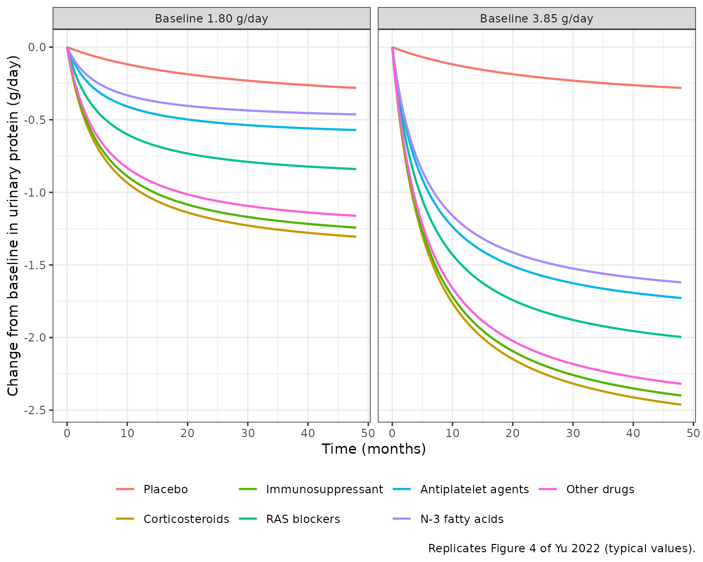
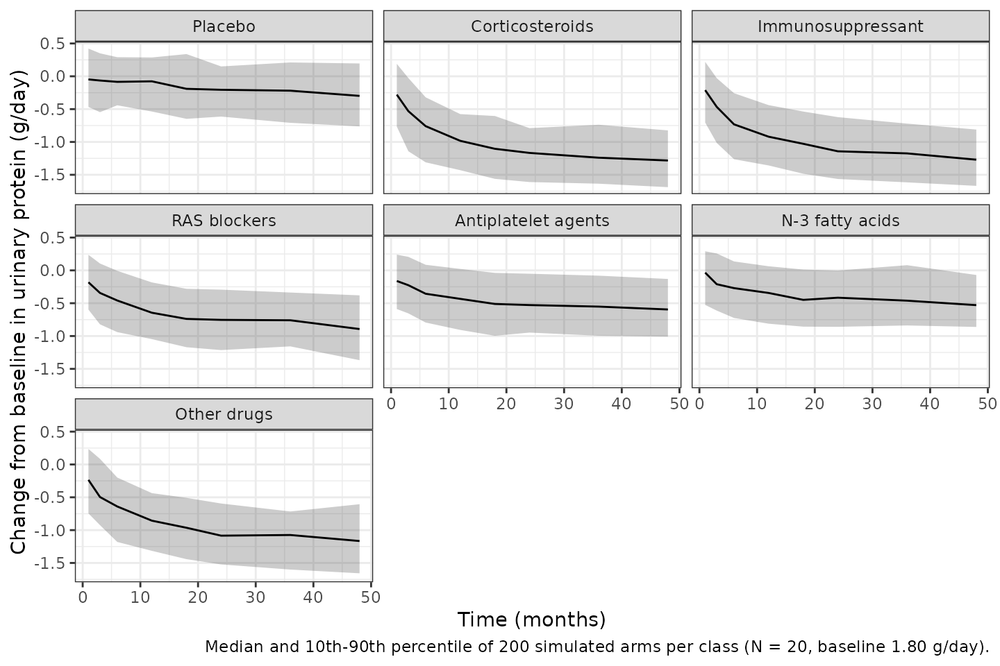

# IgA nephropathy drug classes proteinuria MBMA (Yu 2022)

## Model and source

- Citation: Yu J, Luo J, Zhu H, Sui Z, Liu H, Li L, Zheng Q.
  Quantitative Comparison of the Clinical Efficacy of 6 Classes Drugs
  for IgA Nephropathy: A Model-Based Meta-Analysis of Drugs for Clinical
  Treatments. Front Immunol. 2022;13:825677.
  <doi:10.3389/fimmu.2022.825677>.
- Description: MBMA. Model-based meta-analysis of the time course of the
  change from baseline in daily urinary protein excretion (g/day) in
  adults with IgA nephropathy, fit to study-arm-level summary data from
  40 clinical trials (83 arms, 2288 participants) comparing placebo with
  six drug classes grouped by pharmacological mechanism:
  corticosteroids, immunosuppressants, renin-angiotensin system (RAS)
  blockers, antiplatelet agents, N-3 fatty acids and ‘other drugs’
  (agents outside the first five classes and cross-class combinations).
  Every arm follows an Emax-in-time model E(t) = Emax \* t / (ET50 + t).
  Placebo arms have their own Emax (-0.44 g/day) and a slow onset (ET50
  = 27.2 months); the six drug classes have class-specific Emax values
  and share a single ET50 of 5.59 months. Arm-mean baseline urinary
  protein excretion is the only retained covariate: it acts linearly on
  the drug-arm Emax (-0.63 g/day per 1 g/day of baseline above the 1.82
  g/day centring value) and not on placebo. Between-STUDY-ARM (not
  between-subject) variability is carried on ET50 only, as the scale
  form ET50_i = ET50 \* (1 + eta); the between-arm eta on Emax was
  estimated near zero and fixed to 0. The residual is additive at unit
  study weight and the paper weights it by 1/sqrt(N) for an arm of N
  participants. Suitable simulation scope is arm-mean proteinuria time
  courses; the model is NOT suitable for individual-patient simulation.
  Parameter values are Table 2 (NONMEM 7.4).
- Article: <https://doi.org/10.3389/fimmu.2022.825677> (open access,
  PMC9000973)

## Population

Yu 2022 is a model-based meta-analysis (MBMA) of clinical trials in
adults with IgA nephropathy. PubMed and Embase were searched up to 18
November 2019 for English-language clinical trials in adult IgA
nephropathy that reported daily urinary protein excretion. The modelled
endpoint is the **change from baseline in daily urinary protein
excretion (g/day)** in each study arm. It is the plain change from
baseline, not a placebo-corrected difference: placebo arms are modelled
in their own right.

40 trials (83 arms, 2288 participants) published 1987-2017 were
included, with treatment durations of 1-48 months. Active arms were
grouped into six classes following the Japanese Society of Nephrology
2014 guideline classification (Yu 2022 Table 1):

| Arm type | Trials / arms | Participants | Baseline proteinuria, g/day, median (range) |
|----|----|----|----|
| Placebo | 14 / 14 | 419 | 1.86 (0.73-4.57) |
| Corticosteroids | 8 / 9 | 288 | 1.6 (0.57-2.14) |
| Immunosuppressants | 11 / 13 | 415 | 2.77 (1.35-5.29) |
| RAS blockers | 18 / 27 | 634 | 1.72 (0.6-2.48) |
| Antiplatelet agents | 2 / 2 | 28 | 0.83 (0.73-0.92) |
| N-3 fatty acids | 4 / 5 | 157 | 1.79 (1.31-2.55) |
| Other drugs | 10 / 13 | 347 | 2.1 (0.94-3.7) |
| Overall | 40 / 83 | 2288 | 1.9 (0.57-5.29) |

Arm-level median age ranged 24.7-52 years (overall median 37) and the
male percentage 11.11-94.12 (overall median 58.33). “Other drugs”
collects agents outside the five named classes and cross-class
combinations.

## Model structure

Every arm follows an Emax model in time (Yu 2022 Equation 1):

``` math
E_{i}(t) = \frac{E_{max,i} \, t}{ET_{50,i} + t}
```

- **Placebo arms** use their own Emax (-0.44 g/day) and ET50 (27.2
  months).
- **Drug arms** use a class-specific Emax and a single ET50 of 5.59
  months shared by all six classes.
- **Baseline proteinuria** shifts the drug-arm Emax only (Yu 2022
  Equation 7):
  $`E_{max,drug,i} = E_{max,class} - 0.63 \, (\text{Baseline} - 1.82)`$.
  A higher baseline gives a larger reduction.
- **Between-arm variability** is on ET50 only, in the scale form
  $`ET_{50,i} = ET_{50} (1 + \eta_i)`$ (Yu 2022 Equation 2). The
  between-arm eta on Emax was estimated near zero and fixed to 0.
- **Residual error** is additive and weighted by $`1/\sqrt{N}`$ for an
  arm of $`N`$ participants (Yu 2022 Equation 3).

The model reads the arm’s class from six binary indicators
(`TRT_CORTICOSTEROID`, `TRT_IMMUNOSUPPRESSANT`, `TRT_RAS_BLOCKER`,
`TRT_ANTIPLATELET`, `TRT_OMEGA3_FA`, `TRT_OTHER_IGAN`; all 0 = placebo)
and the arm’s baseline proteinuria from `UPRO_BL` (g/day). Time is in
months. The output is `uprocfb`.

## Source trace

| Element | Value | Source |
|----|----|----|
| Emax-in-time structure | $`E = E_{max} t / (ET_{50} + t)`$ | Yu 2022 Equation 1 |
| Between-arm variability, scale form | $`P_i = P (1 + \eta_i)`$ | Yu 2022 Equation 2 |
| Residual, $`1/\sqrt{N}`$ weighted | $`Y_{obs} = Y_{pred} + \epsilon / \sqrt{N}`$ | Yu 2022 Equation 3 |
| Baseline on drug Emax, centred at 1.82 g/day | linear | Yu 2022 Equation 7 |
| `emax_placebo` | -0.44 g/day | Table 2 |
| `let50_placebo` | log(27.20 month) | Table 2 |
| `e_upro_bl_emax` | -0.63 g/day per g/day | Table 2, Equation 7 |
| `emax_corticosteroid` | -1.47 g/day | Table 2 |
| `emax_immunosuppressant` | -1.40 g/day | Table 2 |
| `emax_ras_blocker` | -0.95 g/day | Table 2 |
| `emax_antiplatelet` | -0.65 g/day | Table 2 |
| `emax_omega3_fa` | -0.53 g/day | Table 2 |
| `emax_other_igan` | -1.31 g/day | Table 2 |
| `let50_drug` | log(5.59 month) | Table 2 |
| eta on Emax | 0 FIXED (omitted) | Table 2 |
| `eta_study_et50` | 0.65^2 (0.65 read as SD) | Table 2 |
| `addSd` | 1.54 g/day at unit weight | Table 2 |

## Virtual cohort

This MBMA has no dose events and no compartments: the response is
algebraic in time, and the arm’s treatment reaches `model()` through the
indicator columns. Each simulated “subject” is one study arm.

``` r

mod <- readModelDb("Yu_2022_igaNephropathy_mbma")
ui <- rxode2::rxode(mod)
#> ℹ parameter labels from comments will be replaced by 'label()'

classes <- tibble::tribble(
  ~arm, ~indicator,
  "Placebo", NA_character_,
  "Corticosteroids", "TRT_CORTICOSTEROID",
  "Immunosuppressant", "TRT_IMMUNOSUPPRESSANT",
  "RAS blockers", "TRT_RAS_BLOCKER",
  "Antiplatelet agents", "TRT_ANTIPLATELET",
  "N-3 fatty acids", "TRT_OMEGA3_FA",
  "Other drugs", "TRT_OTHER_IGAN"
)
trt_cols <- classes$indicator[!is.na(classes$indicator)]

# One row per arm x baseline, with every indicator 0 except the arm's own.
make_arms <- function(baselines) {
  arms <- tidyr::expand_grid(classes, UPRO_BL = baselines)
  for (col in trt_cols) {
    arms[[col]] <- as.integer(!is.na(arms$indicator) & arms$indicator == col)
  }
  arms$id <- seq_len(nrow(arms))
  arms
}

# Observation-only event records: evid = 0 at each time, covariates carried on
# every row. No dose records and no cmt, because the model has no ODE state.
make_events <- function(arms, times) {
  tidyr::expand_grid(arms, time = times) |>
    dplyr::mutate(evid = 0L) |>
    dplyr::arrange(id, time) |>
    as.data.frame()
}

arms_typ <- make_arms(c(1.80, 3.85))
stopifnot(all(rowSums(arms_typ[, trt_cols]) == as.integer(arms_typ$arm != "Placebo")))
```

## Replication: typical efficacy (Yu 2022 Table 3)

Yu 2022 Table 3 gives the typical change from baseline for placebo and
each class at 6-48 months, at baselines of 1.80 g/day (mild to moderate
proteinuria) and 3.85 g/day (severe proteinuria). The paper computed
these as medians of a 1000-draw Monte Carlo over parameter uncertainty,
which lands within about 0.01 g/day of the deterministic typical value.

``` r

ui_typ <- rxode2::zeroRe(ui)
ev_t3 <- make_events(arms_typ, c(6, 12, 18, 24, 36, 48))
sim_t3 <- rxode2::rxSolve(ui_typ, ev_t3, returnType = "data.frame") |>
  dplyr::select(id, time, uprocfb) |>
  dplyr::left_join(arms_typ[, c("id", "arm", "UPRO_BL")], by = "id")
#> ℹ omega/sigma items treated as zero: 'eta_study_et50'
#> Warning: multi-subject simulation without without 'omega'

# Yu 2022 Table 3 medians, g/day (rows: arm; columns: 6, 12, 18, 24, 36, 48 months).
published <- tibble::tribble(
  ~UPRO_BL, ~arm, ~m6, ~m12, ~m18, ~m24, ~m36, ~m48,
  1.80, "Placebo", -0.08, -0.14, -0.18, -0.21, -0.25, -0.28,
  1.80, "Corticosteroids", -0.75, -0.99, -1.11, -1.18, -1.26, -1.30,
  1.80, "Immunosuppressant", -0.72, -0.94, -1.06, -1.12, -1.20, -1.24,
  1.80, "RAS blockers", -0.48, -0.63, -0.71, -0.75, -0.80, -0.83,
  1.80, "Antiplatelet agents", -0.32, -0.43, -0.48, -0.51, -0.54, -0.56,
  1.80, "N-3 fatty acids", -0.27, -0.35, -0.39, -0.42, -0.44, -0.46,
  1.80, "Other drugs", -0.67, -0.88, -0.99, -1.05, -1.12, -1.16,
  3.85, "Placebo", -0.08, -0.14, -0.18, -0.21, -0.25, -0.28,
  3.85, "Corticosteroids", -1.42, -1.87, -2.09, -2.23, -2.37, -2.46,
  3.85, "Immunosuppressant", -1.38, -1.82, -2.04, -2.17, -2.31, -2.39,
  3.85, "RAS blockers", -1.15, -1.51, -1.69, -1.80, -1.92, -1.99,
  3.85, "Antiplatelet agents", -0.99, -1.31, -1.46, -1.56, -1.66, -1.72,
  3.85, "N-3 fatty acids", -0.93, -1.23, -1.38, -1.46, -1.56, -1.61,
  3.85, "Other drugs", -1.34, -1.76, -1.97, -2.10, -2.24, -2.31
) |>
  tidyr::pivot_longer(m6:m48, names_to = "time", values_to = "published") |>
  dplyr::mutate(time = as.numeric(sub("m", "", time)))

cmp_t3 <- dplyr::inner_join(sim_t3, published, by = c("UPRO_BL", "arm", "time")) |>
  dplyr::mutate(diff = uprocfb - published)
stopifnot(nrow(cmp_t3) == 84)

cmp_t3 |>
  dplyr::mutate(uprocfb = round(uprocfb, 3), diff = round(diff, 3)) |>
  dplyr::filter(time %in% c(6, 24, 48)) |>
  dplyr::select(
    "Baseline (g/day)" = UPRO_BL, Arm = arm, "Month" = time,
    "Simulated (g/day)" = uprocfb, "Yu 2022 Table 3 (g/day)" = published,
    "Difference" = diff
  ) |>
  knitr::kable()
```

| Baseline (g/day) | Arm | Month | Simulated (g/day) | Yu 2022 Table 3 (g/day) | Difference |
|---:|:---|---:|---:|---:|---:|
| 1.80 | Placebo | 6 | -0.080 | -0.08 | 0.000 |
| 1.80 | Placebo | 24 | -0.206 | -0.21 | 0.004 |
| 1.80 | Placebo | 48 | -0.281 | -0.28 | -0.001 |
| 3.85 | Placebo | 6 | -0.080 | -0.08 | 0.000 |
| 3.85 | Placebo | 24 | -0.206 | -0.21 | 0.004 |
| 3.85 | Placebo | 48 | -0.281 | -0.28 | -0.001 |
| 1.80 | Corticosteroids | 6 | -0.754 | -0.75 | -0.004 |
| 1.80 | Corticosteroids | 24 | -1.182 | -1.18 | -0.002 |
| 1.80 | Corticosteroids | 48 | -1.305 | -1.30 | -0.005 |
| 3.85 | Corticosteroids | 6 | -1.423 | -1.42 | -0.003 |
| 3.85 | Corticosteroids | 24 | -2.230 | -2.23 | 0.000 |
| 3.85 | Corticosteroids | 48 | -2.462 | -2.46 | -0.002 |
| 1.80 | Immunosuppressant | 6 | -0.718 | -0.72 | 0.002 |
| 1.80 | Immunosuppressant | 24 | -1.125 | -1.12 | -0.005 |
| 1.80 | Immunosuppressant | 48 | -1.243 | -1.24 | -0.003 |
| 3.85 | Immunosuppressant | 6 | -1.387 | -1.38 | -0.007 |
| 3.85 | Immunosuppressant | 24 | -2.173 | -2.17 | -0.003 |
| 3.85 | Immunosuppressant | 48 | -2.399 | -2.39 | -0.009 |
| 1.80 | RAS blockers | 6 | -0.485 | -0.48 | -0.005 |
| 1.80 | RAS blockers | 24 | -0.760 | -0.75 | -0.010 |
| 1.80 | RAS blockers | 48 | -0.840 | -0.83 | -0.010 |
| 3.85 | RAS blockers | 6 | -1.154 | -1.15 | -0.004 |
| 3.85 | RAS blockers | 24 | -1.808 | -1.80 | -0.008 |
| 3.85 | RAS blockers | 48 | -1.996 | -1.99 | -0.006 |
| 1.80 | Antiplatelet agents | 6 | -0.330 | -0.32 | -0.010 |
| 1.80 | Antiplatelet agents | 24 | -0.517 | -0.51 | -0.007 |
| 1.80 | Antiplatelet agents | 48 | -0.571 | -0.56 | -0.011 |
| 3.85 | Antiplatelet agents | 6 | -0.999 | -0.99 | -0.009 |
| 3.85 | Antiplatelet agents | 24 | -1.565 | -1.56 | -0.005 |
| 3.85 | Antiplatelet agents | 48 | -1.728 | -1.72 | -0.008 |
| 1.80 | N-3 fatty acids | 6 | -0.268 | -0.27 | 0.002 |
| 1.80 | N-3 fatty acids | 24 | -0.420 | -0.42 | 0.000 |
| 1.80 | N-3 fatty acids | 48 | -0.463 | -0.46 | -0.003 |
| 3.85 | N-3 fatty acids | 6 | -0.936 | -0.93 | -0.006 |
| 3.85 | N-3 fatty acids | 24 | -1.467 | -1.46 | -0.007 |
| 3.85 | N-3 fatty acids | 48 | -1.620 | -1.61 | -0.010 |
| 1.80 | Other drugs | 6 | -0.672 | -0.67 | -0.002 |
| 1.80 | Other drugs | 24 | -1.052 | -1.05 | -0.002 |
| 1.80 | Other drugs | 48 | -1.162 | -1.16 | -0.002 |
| 3.85 | Other drugs | 6 | -1.340 | -1.34 | 0.000 |
| 3.85 | Other drugs | 24 | -2.100 | -2.10 | 0.000 |
| 3.85 | Other drugs | 48 | -2.319 | -2.31 | -0.009 |

``` r


# Deterministic solve against printed Monte Carlo medians: the only differences
# are the paper's two-decimal rounding and its Monte Carlo median. A wrong Emax,
# ET50, covariate slope or centring value moves cells by 0.05 g/day or more.
stopifnot(
  max(abs(cmp_t3$diff)) < 0.015,
  abs(median(cmp_t3$diff)) < 0.01
)
```

All 84 cells of Table 3 are reproduced within 0.012 g/day. The placebo
rows are identical at both baselines, as the paper states, because the
baseline covariate acts only on the drug-arm Emax.

## Replication: typical time-effect curves (Yu 2022 Figure 4)

``` r

ev_curve <- make_events(arms_typ, seq(0, 48, by = 0.5))
sim_curve <- rxode2::rxSolve(ui_typ, ev_curve, returnType = "data.frame") |>
  dplyr::select(id, time, uprocfb) |>
  dplyr::left_join(arms_typ[, c("id", "arm", "UPRO_BL")], by = "id") |>
  dplyr::mutate(
    panel = paste0("Baseline ", sprintf("%.2f", UPRO_BL), " g/day"),
    arm = factor(arm, levels = classes$arm)
  )
#> ℹ omega/sigma items treated as zero: 'eta_study_et50'
#> Warning: multi-subject simulation without without 'omega'

ggplot(sim_curve, aes(time, uprocfb, colour = arm)) +
  geom_line(linewidth = 0.8) +
  facet_wrap(~panel) +
  labs(
    x = "Time (months)",
    y = "Change from baseline in urinary protein (g/day)",
    colour = NULL,
    caption = "Replicates Figure 4 of Yu 2022 (typical values)."
  ) +
  theme_bw() +
  theme(legend.position = "bottom")
```



## Validation: the paper’s derived onset numbers

Yu 2022 Results and Discussion quote several numbers derived from the
shared drug ET50 of 5.59 months: 15 % of the maximum effect at 1 month;
52, 68, 81, 87 and 90 % at 6, 12, 24, 36 and 48 months; and 80 % of the
maximum (the “plateau”) at 22.36 months. The fraction of Emax reached is
the same for every class and baseline, so one drug arm checks them all.

``` r

ev_onset <- make_events(
  arms_typ[arms_typ$arm == "Corticosteroids" & arms_typ$UPRO_BL == 1.80, ],
  c(1, 6, 12, 22.36, 24, 36, 48)
)
emax_cort_180 <- -1.47 - 0.63 * (1.80 - 1.82)
onset <- rxode2::rxSolve(ui_typ, ev_onset, returnType = "data.frame") |>
  dplyr::mutate(
    fraction_pct = 100 * uprocfb / emax_cort_180,
    published_pct = c(15, 52, 68, 80, 81, 87, 90)
  )
#> ℹ omega/sigma items treated as zero: 'eta_study_et50'
onset |>
  dplyr::mutate(fraction_pct = round(fraction_pct, 1)) |>
  dplyr::select(
    "Month" = time, "Simulated % of Emax" = fraction_pct,
    "Yu 2022 % of Emax" = published_pct
  ) |>
  knitr::kable()
```

| Month | Simulated % of Emax | Yu 2022 % of Emax |
|------:|--------------------:|------------------:|
|  1.00 |                15.2 |                15 |
|  6.00 |                51.8 |                52 |
| 12.00 |                68.2 |                68 |
| 22.36 |                80.0 |                80 |
| 24.00 |                81.1 |                81 |
| 36.00 |                86.6 |                87 |
| 48.00 |                89.6 |                90 |

``` r

stopifnot(all(abs(onset$fraction_pct - onset$published_pct) < 0.6))
```

The placebo onset is much slower: with ET50 = 27.2 months the placebo
effect at 4 years is 2.09 times the 1-year effect, the “approximately 2
times” of Yu 2022 Results.

## Stochastic study-arm simulation

The between-arm eta on ET50 is drawn once per arm. The scale form
$`ET_{50}(1 + \eta)`$ with $`\omega = 0.65`$ gives a non-positive ET50
whenever $`\eta < -1`$, i.e. for about 6.2 % of arms. An Emax-in-time
curve with a non-positive ET50 is not defined (it has a pole at
$`t = |ET_{50}|`$), so those arms are discarded and the remaining arms
are shown. This is a property of the published parameterisation, not of
the implementation.

``` r

rxode2::rxSetSeed(20220328)
n_draw <- 240
arms_sto <- tidyr::expand_grid(classes, UPRO_BL = 1.80, rep = seq_len(n_draw))
for (col in trt_cols) {
  arms_sto[[col]] <- as.integer(!is.na(arms_sto$indicator) & arms_sto$indicator == col)
}
arms_sto$id <- seq_len(nrow(arms_sto))
ev_sto <- make_events(arms_sto, c(1, 3, 6, 12, 18, 24, 36, 48))

sim_sto <- rxode2::rxSolve(ui, ev_sto, returnType = "data.frame") |>
  dplyr::select(id, time, uprocfb, et50_i) |>
  dplyr::left_join(arms_sto[, c("id", "arm")], by = "id")

arm_et50 <- dplyr::distinct(sim_sto, id, arm, et50_i)
frac_nonpos <- mean(arm_et50$et50_i <= 0)
frac_nonpos
#> [1] 0.05654762

# Keep the first 200 arms per class with a positive ET50.
keep <- arm_et50 |>
  dplyr::filter(et50_i > 0) |>
  dplyr::group_by(arm) |>
  dplyr::slice_head(n = 200) |>
  dplyr::ungroup()
stopifnot(all(table(keep$arm) == 200))

# Arm-level observation with the 1/sqrt(N) residual for a typical arm size of
# 20 participants (Yu 2022 Table 1 median arm size).
n_arm <- 20
addSd <- 1.54
sim_obs <- sim_sto |>
  dplyr::filter(id %in% keep$id) |>
  dplyr::mutate(obs = uprocfb + stats::rnorm(dplyr::n(), 0, addSd / sqrt(n_arm)))

band <- sim_obs |>
  dplyr::group_by(arm, time) |>
  dplyr::summarise(
    q10 = stats::quantile(obs, 0.10),
    q50 = stats::median(obs),
    q90 = stats::quantile(obs, 0.90),
    .groups = "drop"
  ) |>
  dplyr::mutate(arm = factor(arm, levels = classes$arm))

ggplot(band, aes(time, q50)) +
  geom_ribbon(aes(ymin = q10, ymax = q90), alpha = 0.25) +
  geom_line() +
  facet_wrap(~arm) +
  labs(
    x = "Time (months)", y = "Change from baseline in urinary protein (g/day)",
    caption = "Median and 10th-90th percentile of 200 simulated arms per class (N = 20, baseline 1.80 g/day)."
  ) +
  theme_bw()
```



``` r


# Structural checks on the centre of the distribution, not the tails.
# The fraction of arms with a non-positive ET50 follows the encoded omega
# (expected pnorm(-1 / 0.65) = 6.2 %, binomial SE about 0.6 % over 1680 arms);
# a variance reading of 0.65 would give pnorm(-1 / sqrt(0.65)) = 10.7 %.
stopifnot(frac_nonpos > 0.035, frac_nonpos < 0.09)
typ_24 <- cmp_t3 |>
  dplyr::filter(UPRO_BL == 1.80, time == 24) |>
  dplyr::select(arm, typical = uprocfb)
# Compared on the arm-level prediction without residual noise, whose median
# is otherwise dominated by the residual for the small placebo effect.
med_24 <- sim_obs |>
  dplyr::filter(time == 24) |>
  dplyr::group_by(arm) |>
  dplyr::summarise(median_sim = stats::median(uprocfb), .groups = "drop") |>
  dplyr::left_join(typ_24, by = "arm") |>
  dplyr::mutate(ratio = median_sim / typical)
med_24
#> # A tibble: 7 × 4
#>   arm                 median_sim typical ratio
#>   <chr>                    <dbl>   <dbl> <dbl>
#> 1 Antiplatelet agents     -0.513  -0.517 0.992
#> 2 Corticosteroids         -1.17   -1.18  0.990
#> 3 Immunosuppressant       -1.10   -1.13  0.976
#> 4 N-3 fatty acids         -0.417  -0.420 0.993
#> 5 Other drugs             -1.05   -1.05  0.993
#> 6 Placebo                 -0.204  -0.206 0.989
#> 7 RAS blockers            -0.744  -0.760 0.979
stopifnot(all(abs(med_24$ratio - 1) < 0.1))
```

## PKNCA

Non-compartmental analysis does not apply: the model has no drug
concentration, no dose events and no compartments. The output is an
arm-mean change in proteinuria driven by time since the start of
treatment. The Table 3 and onset replications above are the validation
of this MBMA.

## Assumptions and deviations, and Errata

- **Scale of the eta row.** Table 2 prints `eta (ET50)` = 0.65 without
  saying whether it is the SD or the variance. It is read as the SD
  omega (ini() variance 0.65^2 = 0.4225). With 83 arms, the relative
  standard error of a variance estimate cannot fall below sqrt(2/83) =
  15.5 %. The printed RSE is 7.4 %, and the bootstrap 95 % CI
  (0.55-0.90) implies about 13 %. Both are below that floor, so a
  variance reading is not tenable. To adopt the variance reading
  instead, set `eta_study_et50 ~ 0.65`.
- **Scale of the residual row.** `eps` = 1.54 is read as the SD,
  consistent with the eta row in the same table. The table and text give
  no independent test. Under a variance reading the unit-weight SD would
  be sqrt(1.54) = 1.24 g/day. The residual does not affect any
  typical-value replication in this article.
- **1/sqrt(N) residual weighting.** nlmixr2’s `add()` takes a constant
  SD, so `addSd` is the unit-weight value. Divide by the square root of
  the arm size downstream, as the stochastic simulation above does.
- **Zero eta on Emax.** Table 2 reports `eta (Emax)` = 0 FIXED. It is
  omitted rather than written as `fixed(0)`, because a zero diagonal
  makes the omega matrix singular for simulation. The model is otherwise
  identical.
- **eta on the placebo ET50.** Table 2 has a single `eta (ET50)` row and
  does not say whether it applies to placebo as well as drug arms. It is
  applied to both. The typical-value replications do not depend on this
  choice.
- **Non-positive ET50.** The scale form $`ET_{50}(1+\eta)`$ allows ET50
  \<= 0 for about 6 % of arms at omega = 0.65. Such arms are outside the
  model’s domain and are discarded in the stochastic simulation above.
- **Centring value.** Equation 7 centres baseline proteinuria at 1.82
  g/day. Table 1 gives an overall median of 1.9 g/day, and the Results
  call the simulation baseline of 1.80 g/day the median of the included
  studies. The equation’s 1.82 is used. It reproduces Table 3 better
  than 1.80 would: at 1.80 the corticosteroid 6-month cell would move
  from -0.754 to -0.761 g/day against a printed -0.75.
- **Arm-level covariates only.** `UPRO_BL` is an arm-level baseline and
  the `TRT_*` indicators are arm-level classes. Each class pools several
  agents and doses. The antiplatelet class rests on two small arms (28
  participants) with baselines of 0.73-0.92 g/day, so its predictions at
  high baseline are extrapolated.
- **Not placebo-corrected.** Drug-arm predictions are the total change
  from baseline in a drug arm, not the difference from a concurrent
  placebo arm. This matches Yu 2022 Table 3, where drug and placebo rows
  are computed separately.
- **Screened covariates.** Age and the male percentage were screened and
  not retained. They are recorded in `covariatesDataExcluded`.
  Covariates with more than 30 % missing values across studies were not
  investigated.

## Session info

``` r

sessionInfo()
#> R version 4.6.1 (2026-06-24)
#> Platform: x86_64-pc-linux-gnu
#> Running under: Ubuntu 24.04.5 LTS
#> 
#> Matrix products: default
#> BLAS:   /usr/lib/x86_64-linux-gnu/openblas-pthread/libblas.so.3 
#> LAPACK: /usr/lib/x86_64-linux-gnu/openblas-pthread/libopenblasp-r0.3.26.so;  LAPACK version 3.12.0
#> 
#> locale:
#>  [1] LC_CTYPE=C.UTF-8       LC_NUMERIC=C           LC_TIME=C.UTF-8       
#>  [4] LC_COLLATE=C.UTF-8     LC_MONETARY=C.UTF-8    LC_MESSAGES=C.UTF-8   
#>  [7] LC_PAPER=C.UTF-8       LC_NAME=C              LC_ADDRESS=C          
#> [10] LC_TELEPHONE=C         LC_MEASUREMENT=C.UTF-8 LC_IDENTIFICATION=C   
#> 
#> time zone: UTC
#> tzcode source: system (glibc)
#> 
#> attached base packages:
#> [1] stats     graphics  grDevices utils     datasets  methods   base     
#> 
#> other attached packages:
#> [1] ggplot2_4.0.3         tidyr_1.3.2           dplyr_1.2.1          
#> [4] rxode2_5.1.8          PKNCA_0.12.1          nlmixr2lib_0.3.2.9000
#> 
#> loaded via a namespace (and not attached):
#>  [1] gtable_0.3.6        xfun_0.61           bslib_0.12.0       
#>  [4] rxode2lincmt_0.1.0  lattice_0.22-9      vctrs_0.7.3        
#>  [7] tools_4.6.1         generics_0.1.4      parallel_4.6.1     
#> [10] tibble_3.3.1        symengine_0.2.14    pkgconfig_2.0.3    
#> [13] data.table_1.18.6.1 checkmate_2.3.4     RColorBrewer_1.1-3 
#> [16] S7_0.2.2            desc_1.4.3          lifecycle_1.0.5    
#> [19] compiler_4.6.1      farver_2.1.2        textshaping_1.0.5  
#> [22] fontawesome_0.5.3   htmltools_0.5.9     sys_3.4.3          
#> [25] sass_0.4.10         yaml_2.3.12         pillar_1.11.1      
#> [28] pkgdown_2.2.1       crayon_1.5.3        jquerylib_0.1.4    
#> [31] whisker_0.4.1       openssl_2.4.2       cachem_1.1.0       
#> [34] nlme_3.1-169        tidyselect_1.2.1    digest_0.6.39      
#> [37] lotri_1.0.5         purrr_1.2.2         labeling_0.4.3     
#> [40] rxode2ll_2.0.18     fastmap_1.2.0       grid_4.6.1         
#> [43] cli_3.6.6           dparser_1.3.1-14    magrittr_2.0.5     
#> [46] utf8_1.2.6          withr_3.0.3         scales_1.4.0       
#> [49] backports_1.5.1     rmarkdown_2.32      otel_0.2.0         
#> [52] askpass_1.2.1       ragg_1.5.2          memoise_2.0.1      
#> [55] evaluate_1.0.5      knitr_1.52          rex_1.2.2          
#> [58] PreciseSums_0.7     rlang_1.3.0         downlit_0.4.5      
#> [61] Rcpp_1.1.2          glue_1.8.1          xml2_1.6.0         
#> [64] jsonlite_2.0.0      R6_2.6.1            systemfonts_1.3.2  
#> [67] fs_2.1.0
```
