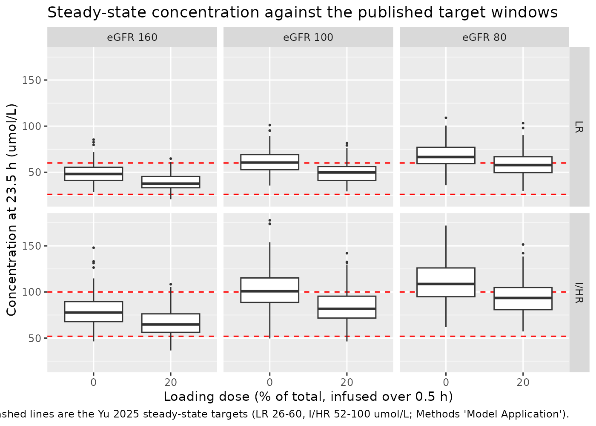
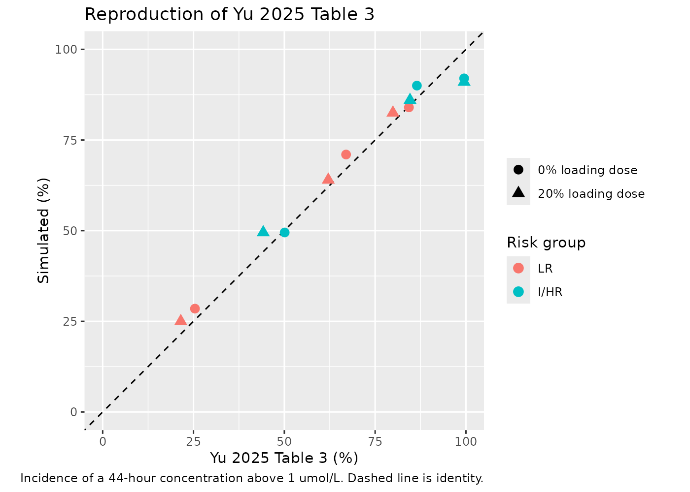
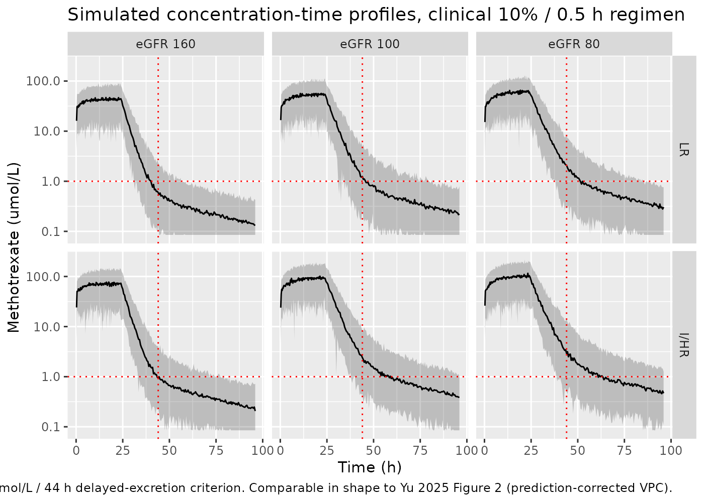

# Methotrexate (Yu 2025)

## Model and source

- Citation: Yu B, Wan Y, Mei K, Zhan D, Tang Q, Hu X, Ji W, Cai H
  (2025). Population Pharmacokinetics and Covariate Analysis of
  Methotrexate in Pediatric Acute Lymphoblastic Leukemia. Drug Des Devel
  Ther 19:8473-8486. <doi:10.2147/DDDT.S545368>.
- Description: Two-compartment IV-infusion population PK model for
  high-dose methotrexate (3 or 5 g/m^2 over 24 h) in 214 Chinese
  children with acute lymphoblastic leukaemia (Yu 2025; 1,672 plasma
  concentrations). Clearance uses an age-cutoff structure at 1 year: a
  separate typical clearance is estimated in each age stratum (4.46 L/h
  for age \> 1 year, 1.69 L/h for age \<= 1 year), with covariate
  effects shared across both strata – a bedside-Schwartz eGFR power
  effect (exponent 0.537, reference 160 mL/min/1.73 m^2), a body-weight
  power effect (exponent 0.45, reference 20 kg) and a
  blood-urea-nitrogen power effect (exponent -0.0823, reference 3
  mmol/L). The paper’s stated novelty is this pair: the 1-year clearance
  cutoff, and the use of BUN alongside eGFR as a second, non-collinear
  renal marker. Central volume scales with body surface area (15.9 L at
  0.77 m^2, exponent 1.10); intercompartmental clearance and peripheral
  volume carry no covariates. Exponential between-subject variability on
  clearance, intercompartmental clearance and peripheral volume (none on
  central volume), with a 44.2% proportional residual error.
- Article: <https://doi.org/10.2147/DDDT.S545368>

Yu 2025 is a retrospective, single-centre population PK analysis of
routine therapeutic drug monitoring data for high-dose intravenous
methotrexate in Chinese children with acute lymphoblastic leukaemia,
conducted at Anhui Provincial Children’s Hospital between May 2021 and
November 2024. The authors name two features as the study’s novelty:

1.  **A 1-year age cutoff on clearance.** Rather than a continuous age
    term or a maturation function, a separate typical clearance is
    estimated on each side of 1 year of age (4.46 L/h above, 1.69 L/h at
    or below) inside one joint fit. The paper reports that the cutoff
    fit substantially better than the continuous alternative (dOFV
    -55.825 against -12.535).
2.  **BUN retained alongside eGFR.** Both renal markers enter clearance,
    the authors having checked that they are not collinear (Spearman rho
    = -0.1192, variance inflation factor 1.007457) and arguing that urea
    adds tubular and volume-status information that glomerular
    filtration alone misses.

### A note on reading this paper

The five final-model equations (p. 8480) and the two generic
covariate-model equations (Eq. 1-2, p. 8477) are embedded in the PDF as
**vector graphics, not text**. `pdftotext` and any markdown preprocessor
built on it emit the bare stubs `If age >1 years old CL (L/h) =` with
nothing following, and drop Eq. 1-2 entirely. The covariate **reference
values** – 160 mL/min/1.73 m^2, 20 kg, 3 mmol/L and 0.77 m^2 – appear
nowhere else in the paper: not in Table 2, not in the prose. They were
recovered by rendering pages 3 and 6 to images and reading them. Anyone
re-verifying this model from a text extraction of the PDF will find them
missing, and would have no way to know the model is centred at all. Each
is the cohort median from Table 1, rounded by the authors (eGFR 160.0
exactly, WT 19.50 -\> 20, BUN 2.95 -\> 3, BSA 0.77 exactly).

## Population

The analysis pooled 214 patients contributing 1,672 plasma methotrexate
concentrations, split into a 171-patient / 1,342-concentration
model-building set and a randomly selected 43-patient /
330-concentration external validation set (Table 1). In the
model-building set, age ranged from 0.65 to 14 years (median 5, mean
5.52) and body weight from 7 to 62.5 kg (median 19.50, mean 22.43); 105
patients were male and 66 female (38.6% female). Bedside-Schwartz eGFR
ranged from 21.90 to 405.65 mL/min/1.73 m^2 (median 160, mean 162.40) –
markedly supranormal, as is usual in children – with serum creatinine
median 0.29 mg/dL and blood urea nitrogen median 2.95 mmol/L (range
0.40-16.70). Body surface area ranged from 0.36 to 1.71 m^2 (median
0.77).

Patients had pathologically confirmed acute lymphoblastic leukaemia and
received high-dose methotrexate consolidation under the CCLG-ALL-2018
protocol (before October 2021) or the CCCG-ALL-2020 protocol (from
October 2021), risk-stratified into low-risk (LR, 3 g/m^2) and
intermediate/high-risk (I/HR, 5 g/m^2) groups. Every dose was a 24-hour
intravenous infusion given as a loading-dose strategy: 10% of the total
over 0.5 h, then the remaining 90% over 23.5 h. Concentrations were
assayed by enzyme-multiplied immunoassay (EMIT, Viva-ProE, Siemens)
calibrated over 0.3-2600 umol/L with an LLOQ of 0.17 umol/L; values
below the LLOQ were excluded. Monitoring was routine at 20-24 h, 44-48 h
and 68-72 h after the start of infusion, continuing until methotrexate
fell to 0.2 umol/L or below.

The cohort is described as primarily Han Chinese; the authors name that
homogeneity, the single-centre retrospective design, the 43-patient
external validation set and the complete absence of pharmacogenetic data
(SLCO1B1, ABCC2, MTHFR) as limitations.

The same information is available programmatically via
`readModelDb("Yu_2025_methotrexate")()$population`.

## Source trace

Every value below was read from the Yu 2025 PDF. The per-parameter
origin is also recorded as an in-file comment beside each `ini()` entry
in `inst/modeldb/specificDrugs/Yu_2025_methotrexate.R`.

| Equation / parameter | Value | Source location |
|----|----|----|
| `lcl_agegt1` | 4.46 L/h | Table 2, row `theta CL age>1` (RSE 3%, bootstrap 4.23-4.86) |
| `lcl_agele1` | 1.69 L/h | Table 2, row `theta CL age <=1` (RSE 10%, bootstrap 0.65-2.73) |
| `lvc` | 15.90 L | Table 2, row `theta V1` (RSE 4%, bootstrap 13.84-17.89) |
| `lq` | 0.149 L/h | Table 2, row `theta Q` (RSE 5%, bootstrap 0.124-0.174) |
| `lvp` | 7.23 L | Table 2, row `theta V2` (RSE 9%, bootstrap 4.89-9.57) |
| `e_crcl_cl` | 0.537 | Table 2, row `theta GFR` (RSE 6%, bootstrap 0.354-0.721) |
| `e_wt_cl` | 0.45 | Table 2, row `theta WT` (RSE 11%, bootstrap 0.35-0.55) |
| `e_bun_cl` | -0.0823 | Table 2, row `theta BUN` (RSE 24%, bootstrap -0.1553 to -0.0093) |
| `e_bsa_vc` | 1.10 | Table 2, row `theta BSA` (RSE 10%, bootstrap 0.76-1.45) |
| `etalcl` | 21.24% -\> var 0.04511376 | Table 2, row `Interindividual variability omega CL (%)` |
| `etalq` | 27.66% -\> var 0.07650756 | Table 2, row `Interindividual variability omega Q (%)` |
| `etalvp` | 41.47% -\> var 0.17197609 | Table 2, row `Interindividual variability omega V2 (%)` |
| `propSd` | 0.4416 | Table 2, row `Residual unexplained variability (%)` = 44.16 |
| CL reference values 160 / 20 / 3 | n/a | Final-model equations, p. 8480 (**vector graphic**) |
| V1 reference value 0.77 | n/a | Final-model equation `V1 = theta_V1 * (BSA/0.77)^theta_BSA`, p. 8480 (**vector graphic**) |
| Power form `(COV/COV_m)^theta` | n/a | Eq. (1), p. 8477 (**vector graphic**) |
| Two-compartment IV structure | n/a | Methods “Population Pharmacokinetic Model Development” (ADVAN3 TRANS4) |
| Proportional residual error | n/a | Methods, same paragraph |
| Exponential IIV | n/a | Methods, same paragraph |
| Dosing regimen, 10% / 0.5 h + 90% / 23.5 h | n/a | Methods “Treatment Regimen” |
| Simulated child: 5 y, 19 kg, 0.77 m^2 | n/a | Methods “Model Application” |
| Css targets 26-60 / 52-100 umol/L | n/a | Methods “Model Application” |
| Delayed excretion: C(44 h) \> 1 umol/L | n/a | Methods “Model Application”; Table 3 caption |

### Reading the variability rows: SD, not variance

Table 2 reports the three IIV rows as
`Interindividual variability omega CL (%)` = 21.24, `omega Q (%)` =
27.66 and `omega V2 (%)` = 41.47. Two features of the table settle the
scale before any simulation: the row symbol is `omega` (an SD) rather
than `omega^2`, and the values are quoted as **percentages**, which a
variance on the log scale cannot be. This model therefore encodes
`var(etalcl) = 0.2124^2` and likewise for Q and V2.

That reading is not merely the more plausible one – the alternative is
falsified by the paper’s own Table 3, which is reproduced below. Reading
the same numbers as variances shifts the predicted incidence of delayed
excretion wrong in *both* directions and misses the 99.5% cell by
roughly 20 percentage points.

## Structural checks

These checks are deterministic: they compare the packaged model against
an independent closed-form solution and against exact arithmetic, using
typical values with the random effects zeroed. Both sides use the same
parameters, so any disagreement is numerical only and a tight bound is
the correct assertion.

``` r

mod <- readModelDb("Yu_2025_methotrexate")
mod_typ <- rxode2::zeroRe(mod)
#> ℹ parameter labels from comments will be replaced by 'label()'

# Methotrexate molar mass, used only to convert the paper's g/m^2 doses into
# the umol the model works in. This is a physical constant of the molecule,
# not a model parameter, and is not taken from Yu 2025.
MTX_MW <- 454.44 # g/mol

# The virtual child used for every simulation in Yu 2025 Methods
# "Model Application": 5 years old, 19 kg, 0.77 m^2.
CHILD <- list(AGE = 5, WT = 19, BSA = 0.77, BUN = 3)

dose_umol <- function(g_per_m2, bsa = CHILD$BSA) {
  g_per_m2 * bsa * 1e6 / MTX_MW # g -> mg -> umol
}

# 1. The explicit two-compartment ODE system must survive model loading. A
#    cl / vc parameter pair can make rxode2 auto-solve a one-compartment
#    linCmt() model and silently discard the d/dt block, which would leave
#    every check below comparing the wrong structure against itself.
stopifnot(
  identical(sort(mod_typ$state), c("central", "peripheral1")),
  length(mod_typ$state) == 2L
)
```

### Agreement with the closed-form two-compartment infusion solution

``` r

# Central amount at time t from a zero-order infusion of rate R (umol/h)
# starting at `tstart` and lasting `dur`, for a two-compartment system with
# micro-constants k10 / k12 / k21. Standard hybrid-rate-constant solution.
a1_infusion <- function(t, R, tstart, dur, k10, k12, k21) {
  s <- k10 + k12 + k21
  disc <- sqrt(s^2 - 4 * k10 * k21)
  alpha <- (s + disc) / 2
  beta <- (s - disc) / 2
  u <- t - tstart
  during <- pmin(pmax(u, 0), dur)
  after <- pmax(u - dur, 0)
  # Integral of the unit-bolus central response over the elapsed infusion time
  ia <- (exp(-alpha * (u - during)) - exp(-alpha * u)) / alpha
  ib <- (exp(-beta * (u - during)) - exp(-beta * u)) / beta
  out <- R / (alpha - beta) * ((alpha - k21) * ia + (k21 - beta) * ib)
  out[u <= 0] <- 0
  # `after` is unused directly; it is folded into the exponentials above.
  out
}

cl_typ <- 4.46 * (160 / 160)^0.537 * (CHILD$WT / 20)^0.45 * (CHILD$BUN / 3)^(-0.0823)
vc_typ <- 15.90 * (CHILD$BSA / 0.77)^1.10
q_typ <- 0.149
vp_typ <- 7.23

tot <- dose_umol(3)
grid <- seq(0, 96, by = 0.25)

ev_typ <-
  rxode2::et(amt = tot * 0.10, dur = 0.5, time = 0, cmt = "central") |>
  rxode2::et(amt = tot * 0.90, dur = 23.5, time = 0.5, cmt = "central") |>
  rxode2::et(grid, cmt = "central")
ev_typ <- as.data.frame(ev_typ)
ev_typ$AGE <- CHILD$AGE
ev_typ$WT <- CHILD$WT
ev_typ$BSA <- CHILD$BSA
ev_typ$BUN <- CHILD$BUN
ev_typ$CRCL <- 160

sim_typ <- rxode2::rxSolve(mod_typ, ev_typ, returnType = "data.frame")
#> ℹ omega/sigma items treated as zero: 'etalcl', 'etalq', 'etalvp'

# Independent closed form: superpose the loading and maintenance infusions.
cf <- with(list(), {
  k10 <- cl_typ / vc_typ
  k12 <- q_typ / vc_typ
  k21 <- q_typ / vp_typ
  a1 <- a1_infusion(sim_typ$time, tot * 0.10 / 0.5, 0, 0.5, k10, k12, k21) +
    a1_infusion(sim_typ$time, tot * 0.90 / 23.5, 0.5, 23.5, k10, k12, k21)
  a1 / vc_typ
})

# The solver and the closed form use the same parameters, so the only
# difference is numerical integration error: a tight bound is correct here.
rel_err <- abs(sim_typ$Cc - cf) / pmax(cf, 1e-8)
rel_err <- rel_err[sim_typ$time > 0]
stopifnot(max(rel_err) < 1e-4)
sprintf("Max relative difference vs closed form: %.2e", max(rel_err))
#> [1] "Max relative difference vs closed form: 3.18e-13"
```

### Mass balance: CL x AUC(0-inf) must equal the dose

This is the check that pins the **units**. The model is dosed in umol
and reports umol/L, so `CL x AUC` recovers the administered amount only
if the volumes are in L, the clearance in L/h and the dose conversion is
right. A mis-transcribed clearance, a gram/milligram slip or a
molar-mass error all break it.

``` r

# Solve far past the terminal phase (terminal half-life is about 35 h) so the
# trapezoidal AUC needs essentially no extrapolation. Trapezoid bias on a
# convex decay is always negative, so a fine early grid matters.
grid_long <- sort(unique(c(seq(0, 48, by = 0.1), seq(48, 600, by = 1))))
ev_long <- ev_typ[ev_typ$evid == 1, ]
ev_long <- dplyr::bind_rows(
  ev_long,
  data.frame(
    time = grid_long, evid = 0, amt = NA_real_, cmt = "central",
    AGE = CHILD$AGE, WT = CHILD$WT, BSA = CHILD$BSA,
    BUN = CHILD$BUN, CRCL = 160
  )
)
sim_long <- rxode2::rxSolve(mod_typ, ev_long, returnType = "data.frame")
#> ℹ omega/sigma items treated as zero: 'etalcl', 'etalq', 'etalvp'

auc_last <- with(
  sim_long[order(sim_long$time), ],
  sum(diff(time) * (head(Cc, -1) + tail(Cc, -1)) / 2)
)
recovered <- cl_typ * auc_last

stopifnot(abs(recovered / tot - 1) < 0.005)
sprintf(
  "Dose %.0f umol; CL x AUC(0-600 h) recovers %.0f umol (%.2f%% difference)",
  tot, recovered, 100 * (recovered / tot - 1)
)
#> [1] "Dose 5083 umol; CL x AUC(0-600 h) recovers 5083 umol (0.00% difference)"
```

### Covariate arithmetic

``` r

# rxode2 returns the per-subject derived parameters, so the covariate model can
# be checked against exact arithmetic rather than against a plot.
cov_grid <- data.frame(
  id = 1:4,
  AGE = c(5, 0.5, 5, 5),
  WT = c(19, 19, 40, 19),
  BSA = c(0.77, 0.77, 0.77, 1.30),
  BUN = c(3, 3, 3, 6),
  CRCL = c(160, 160, 80, 160)
)
ev_cov <- do.call(dplyr::bind_rows, lapply(cov_grid$id, function(i) {
  data.frame(
    id = i, time = c(0, 1), evid = c(1, 0),
    amt = c(1000, NA), dur = c(0.5, NA), cmt = "central",
    AGE = cov_grid$AGE[i], WT = cov_grid$WT[i], BSA = cov_grid$BSA[i],
    BUN = cov_grid$BUN[i], CRCL = cov_grid$CRCL[i]
  )
}))
sim_cov <- rxode2::rxSolve(mod_typ, ev_cov, returnType = "data.frame")
#> ℹ omega/sigma items treated as zero: 'etalcl', 'etalq', 'etalvp'
#> Warning: multi-subject simulation without without 'omega'
got <- sim_cov |>
  dplyr::group_by(id) |>
  dplyr::slice(1) |>
  dplyr::ungroup()

expect_cl <- with(cov_grid, {
  base <- ifelse(AGE <= 1, 1.69, 4.46)
  base * (CRCL / 160)^0.537 * (WT / 20)^0.45 * (BUN / 3)^(-0.0823)
})
expect_vc <- 15.90 * (cov_grid$BSA / 0.77)^1.10

stopifnot(
  max(abs(got$cl - expect_cl)) < 1e-8,
  max(abs(got$vc - expect_vc)) < 1e-8,
  # The age cutoff must actually bite: the 0.5-year-old carries the lower
  # typical clearance, and the ratio is exactly 1.69 / 4.46.
  abs(got$cl[2] / got$cl[1] - 1.69 / 4.46) < 1e-8,
  # Halving eGFR scales clearance by exactly (80/160)^0.537; scenario 3 also
  # moves weight from 19 kg to 40 kg, which contributes (40/19)^0.45.
  abs((got$cl[3] / got$cl[1]) / ((40 / 19)^0.45 * (80 / 160)^0.537) - 1) < 1e-8
)

data.frame(
  scenario = c(
    "reference child (5 y, 19 kg, eGFR 160, BUN 3, BSA 0.77)",
    "infant (0.5 y) -- below the 1-year cutoff",
    "40 kg child with eGFR 80",
    "BSA 1.30 m^2, BUN 6 mmol/L"
  ),
  CL_L_h = round(got$cl, 3),
  V1_L = round(got$vc, 2)
) |>
  dplyr::rename(
    "Scenario" = scenario, "CL (L/h)" = CL_L_h, "V1 (L)" = V1_L
  ) |>
  knitr::kable(caption = "Covariate model evaluated at four covariate sets.")
```

| Scenario                                                | CL (L/h) | V1 (L) |
|:--------------------------------------------------------|---------:|-------:|
| reference child (5 y, 19 kg, eGFR 160, BUN 3, BSA 0.77) |    4.358 |  15.90 |
| infant (0.5 y) – below the 1-year cutoff                |    1.651 |  15.90 |
| 40 kg child with eGFR 80                                |    4.199 |  15.90 |
| BSA 1.30 m^2, BUN 6 mmol/L                              |    4.117 |  28.29 |

Covariate model evaluated at four covariate sets. {.table}

## Virtual cohort

Original observed data are not available. The cohorts below follow Yu
2025 Methods “Model Application” exactly: a single virtual child aged 5
years, weighing 19 kg with a body surface area of 0.77 m^2, simulated at
three renal function levels (eGFR 160, 100 and 80 mL/min/1.73 m^2) in
each of the two risk groups. Because Table 3 is a simulation from this
same model at fixed covariates, between-subject variability is the only
thing that varies within an arm.

The paper does not state what BUN value the virtual child was given. The
cohort below uses the cohort median of 3 mmol/L, which is also the
model’s centring value, so the BUN term evaluates to exactly 1 and drops
out. Given the exponent of -0.0823, any BUN in the plausible paediatric
range moves clearance by only a few percent, so this assumption is not
load-bearing.

``` r

# `set.seed()` seeds R's RNG, not rxode2's; rxode2 partitions its streams per
# solver thread, so the exact draw differs between a 2-core CI runner and a
# 16-thread workstation. Every assertion below is written to hold for any
# cohort this model can produce -- see "Assertions" at the end.
set.seed(20250909)
rxode2::rxSetSeed(20250909)

N_PER_ARM <- 200L

REGIMENS <- tibble::tribble(
  ~risk,  ~g_per_m2, ~load_frac, ~load_h,
  "LR",   3,         0.00,       0.5,
  "LR",   3,         0.20,       0.5,
  "I/HR", 5,         0.00,       0.5,
  "I/HR", 5,         0.20,       0.5
)
EGFRS <- c(160, 100, 80)

# Observation grid: 23.5 h is the end of the maintenance infusion (the
# steady-state concentration the paper targets) and 44 h is the delayed-
# excretion checkpoint. Both must be on the grid exactly.
GRID_SPARSE <- c(0, 23.5, 24, 44)

make_arm <- function(risk, g_per_m2, load_frac, load_h, egfr, grid, id_offset) {
  tot <- dose_umol(g_per_m2)
  if (load_frac > 0) {
    doses <- data.frame(
      time = c(0, load_h), evid = c(1, 1),
      amt = c(tot * load_frac, tot * (1 - load_frac)),
      dur = c(load_h, 24 - load_h)
    )
  } else {
    # A 0% loading dose is a plain 24-hour infusion. Yu 2025 Table 3 reports
    # identical incidences for the 0.5-h and 1-h rows at 0% loading, which
    # confirms this reading.
    doses <- data.frame(time = 0, evid = 1, amt = tot, dur = 24)
  }
  obs <- data.frame(time = grid, evid = 0, amt = NA_real_, dur = NA_real_)
  one <- dplyr::bind_rows(doses, obs)
  out <- do.call(dplyr::bind_rows, lapply(seq_len(N_PER_ARM), function(i) {
    one$id <- id_offset + i
    one
  }))
  out$cmt <- "central"
  out$AGE <- CHILD$AGE
  out$WT <- CHILD$WT
  out$BSA <- CHILD$BSA
  out$BUN <- CHILD$BUN
  out$CRCL <- egfr
  out$risk <- risk
  out$load_pct <- load_frac * 100
  out$egfr <- egfr
  out$arm <- sprintf("%s / eGFR %d / load %d%%", risk, egfr, round(load_frac * 100))
  out
}

arms <- tidyr::expand_grid(REGIMENS, egfr = EGFRS)
events <- do.call(dplyr::bind_rows, lapply(seq_len(nrow(arms)), function(k) {
  make_arm(
    arms$risk[k], arms$g_per_m2[k], arms$load_frac[k], arms$load_h[k],
    arms$egfr[k], GRID_SPARSE, id_offset = (k - 1L) * N_PER_ARM
  )
}))

# Duplicate subject IDs across arms would silently collapse into single, wrong
# subjects, so the offsets above are load-bearing.
stopifnot(
  !anyDuplicated(unique(events[, c("id", "time", "evid")])),
  dplyr::n_distinct(events$id) == nrow(arms) * N_PER_ARM
)
sprintf("%d arms x %d subjects = %d simulated children",
        nrow(arms), N_PER_ARM, dplyr::n_distinct(events$id))
#> [1] "12 arms x 200 subjects = 2400 simulated children"
```

## Simulation

``` r

sim <- rxode2::rxSolve(
  mod, events,
  keep = c("risk", "load_pct", "egfr", "arm"),
  returnType = "data.frame"
)
#> ℹ parameter labels from comments will be replaced by 'label()'
```

## Replicate published results

### Steady-state concentration against the published target windows

Yu 2025 targets a steady-state concentration of 26-60 umol/L for
low-risk patients and 52-100 umol/L for intermediate/high-risk patients.
Under the clinical regimen the “steady-state” value is the concentration
at the end of the 23.5-hour maintenance infusion.

``` r

css <- sim |>
  dplyr::filter(abs(time - 23.5) < 1e-8) |>
  dplyr::mutate(
    risk = factor(risk, levels = c("LR", "I/HR")),
    egfr_lab = factor(sprintf("eGFR %d", egfr),
                      levels = sprintf("eGFR %d", EGFRS))
  )

targets <- data.frame(
  risk = factor(c("LR", "I/HR"), levels = c("LR", "I/HR")),
  lo = c(26, 52), hi = c(60, 100)
)

ggplot(css, aes(x = factor(load_pct), y = Cc)) +
  geom_hline(data = targets, aes(yintercept = lo), linetype = "dashed",
             colour = "red") +
  geom_hline(data = targets, aes(yintercept = hi), linetype = "dashed",
             colour = "red") +
  geom_boxplot(outlier.size = 0.4) +
  facet_grid(risk ~ egfr_lab) +
  labs(
    x = "Loading dose (% of total, infused over 0.5 h)",
    y = "Concentration at 23.5 h (umol/L)",
    title = "Steady-state concentration against the published target windows",
    caption = paste(
      "Red dashed lines are the Yu 2025 steady-state targets",
      "(LR 26-60, I/HR 52-100 umol/L; Methods 'Model Application')."
    )
  )
```



The typical-value steady-state concentration is a direct arithmetic
consequence of the maintenance infusion rate and the clearance, and
lands inside the paper’s own target window for both risk groups. This is
a structural gate: a mis-transcribed clearance, dose or unit would move
it by tens of percent.

``` r

css_typ <- sapply(c(LR = 3, `I/HR` = 5), function(g) {
  dose_umol(g) * 0.90 / 23.5 / cl_typ
})
stopifnot(
  css_typ[["LR"]] > 26, css_typ[["LR"]] < 60,
  css_typ[["I/HR"]] > 52, css_typ[["I/HR"]] < 100
)
round(css_typ, 1)
#>   LR I/HR 
#> 44.7 74.4
```

### Table 3: incidence of delayed excretion

Yu 2025 Table 3 reports the percentage of simulated patients whose
44-hour concentration exceeds 1 umol/L. The comparison below uses the
model-predicted individual concentration (`Cc`), without residual error:
an assay error term describes measurement noise on a drawn sample, not
the patient’s actual exposure, and reproducing the published table
confirms the authors did the same.

``` r

published <- tibble::tribble(
  ~risk,  ~egfr, ~load_pct, ~published,
  "LR",   160,   0,         25.4,
  "LR",   100,   0,         67.0,
  "LR",    80,   0,         84.3,
  "I/HR", 160,   0,         50.1,
  "I/HR", 100,   0,         86.5,
  "I/HR",  80,   0,         99.5,
  "LR",   160,  20,         21.5,
  "LR",   100,  20,         62.1,
  "LR",    80,  20,         79.9,
  "I/HR", 160,  20,         44.2,
  "I/HR", 100,  20,         84.6,
  "I/HR",  80,  20,         99.5
)

delayed <- sim |>
  dplyr::filter(abs(time - 44) < 1e-8) |>
  dplyr::group_by(risk, egfr, load_pct) |>
  dplyr::summarise(simulated = 100 * mean(Cc > 1), .groups = "drop")

cmp <- published |>
  dplyr::left_join(delayed, by = c("risk", "egfr", "load_pct")) |>
  dplyr::mutate(difference = simulated - published) |>
  dplyr::arrange(load_pct, risk, dplyr::desc(egfr))

cmp |>
  dplyr::mutate(
    simulated = round(simulated, 1),
    difference = round(difference, 1)
  ) |>
  dplyr::rename(
    "Risk group" = risk,
    "eGFR (mL/min/1.73 m2)" = egfr,
    "Loading dose (%)" = load_pct,
    "Yu 2025 Table 3 (%)" = published,
    "Simulated (%)" = simulated,
    "Difference (pp)" = difference
  ) |>
  knitr::kable(
    caption = paste(
      "Incidence of delayed excretion (44-hour concentration above 1 umol/L)",
      "against Yu 2025 Table 3, 0.5-hour loading infusion."
    )
  )
```

| Risk group | eGFR (mL/min/1.73 m2) | Loading dose (%) | Yu 2025 Table 3 (%) | Simulated (%) | Difference (pp) |
|:---|---:|---:|---:|---:|---:|
| I/HR | 160 | 0 | 50.1 | 49.5 | -0.6 |
| I/HR | 100 | 0 | 86.5 | 90.0 | 3.5 |
| I/HR | 80 | 0 | 99.5 | 92.0 | -7.5 |
| LR | 160 | 0 | 25.4 | 28.5 | 3.1 |
| LR | 100 | 0 | 67.0 | 71.0 | 4.0 |
| LR | 80 | 0 | 84.3 | 84.0 | -0.3 |
| I/HR | 160 | 20 | 44.2 | 49.5 | 5.3 |
| I/HR | 100 | 20 | 84.6 | 86.0 | 1.4 |
| I/HR | 80 | 20 | 99.5 | 91.0 | -8.5 |
| LR | 160 | 20 | 21.5 | 25.0 | 3.5 |
| LR | 100 | 20 | 62.1 | 64.0 | 1.9 |
| LR | 80 | 20 | 79.9 | 82.5 | 2.6 |

Incidence of delayed excretion (44-hour concentration above 1 umol/L)
against Yu 2025 Table 3, 0.5-hour loading infusion. {.table}

``` r

# Yu 2025 simulated 1,000 subjects per cell; this vignette simulates 200, so
# each cell carries a binomial standard error of up to about 3.5 percentage
# points on top of any structural difference. Assert on the CENTRE of the
# agreement and on a robust quantile, never on the worst single cell -- the
# extreme of a random cohort is not reproducible across rxode2 versions or
# thread counts.
stopifnot(
  # Centre: a mis-scaled omega, a wrong reference value or a unit slip moves
  # the whole set of twelve cells, not one of them.
  abs(median(cmp$difference)) < 6,
  stats::quantile(abs(cmp$difference), 0.75) < 10,
  # Structural ordering, which is immune to Monte Carlo noise: delayed
  # excretion must rise as renal function falls, within every risk group and
  # loading-dose combination...
  all(
    cmp |>
      dplyr::arrange(risk, load_pct, dplyr::desc(egfr)) |>
      dplyr::group_by(risk, load_pct) |>
      dplyr::summarise(mono = all(diff(simulated) > 0), .groups = "drop") |>
      dplyr::pull(mono)
  ),
  # ...and must be higher in the 5 g/m^2 group than the 3 g/m^2 group at
  # matched renal function and loading dose.
  all(
    cmp |>
      dplyr::select(risk, egfr, load_pct, simulated) |>
      tidyr::pivot_wider(names_from = risk, values_from = simulated) |>
      dplyr::mutate(ok = `I/HR` > LR) |>
      dplyr::pull(ok)
  )
)

# The paper's headline claim for the worst subgroup: "in the I/HR group, even
# with a 20% loading dose, the incidence of delayed excretion remained as high
# as 99%" at eGFR 80.
worst <- cmp$simulated[cmp$risk == "I/HR" & cmp$egfr == 80 & cmp$load_pct == 20]
stopifnot(worst > 90)
sprintf("I/HR, eGFR 80, 20%% loading: %.1f%% delayed excretion (paper: 99.5%%)", worst)
#> [1] "I/HR, eGFR 80, 20% loading: 91.0% delayed excretion (paper: 99.5%)"
```

``` r

cmp |>
  dplyr::mutate(
    risk = factor(risk, levels = c("LR", "I/HR")),
    load_lab = sprintf("%d%% loading dose", load_pct)
  ) |>
  ggplot(aes(x = published, y = simulated, colour = risk, shape = load_lab)) +
  geom_abline(slope = 1, intercept = 0, linetype = "dashed") +
  geom_point(size = 3) +
  coord_equal(xlim = c(0, 100), ylim = c(0, 100)) +
  labs(
    x = "Yu 2025 Table 3 (%)", y = "Simulated (%)",
    colour = "Risk group", shape = NULL,
    title = "Reproduction of Yu 2025 Table 3",
    caption = paste(
      "Incidence of a 44-hour concentration above 1 umol/L.",
      "Dashed line is identity."
    )
  )
```



### Concentration-time profiles under the clinical regimen

The regimen actually used in the study was 10% of the dose over 0.5 h
followed by 90% over 23.5 h. The profiles below use that regimen on a
fine grid, and are the cohort taken forward to the NCA.

``` r

GRID_FINE <- sort(unique(c(seq(0, 24, by = 0.25), seq(24, 96, by = 0.5))))

events_clin <- do.call(dplyr::bind_rows, lapply(seq_along(EGFRS), function(j) {
  dplyr::bind_rows(
    make_arm("LR", 3, 0.10, 0.5, EGFRS[j], GRID_FINE,
             id_offset = (2 * j - 2) * N_PER_ARM),
    make_arm("I/HR", 5, 0.10, 0.5, EGFRS[j], GRID_FINE,
             id_offset = (2 * j - 1) * N_PER_ARM)
  )
}))
stopifnot(dplyr::n_distinct(events_clin$id) == 6 * N_PER_ARM)

sim_clin <- rxode2::rxSolve(
  mod, events_clin,
  keep = c("risk", "egfr", "arm"),
  returnType = "data.frame"
)

# `Cc` is the individual prediction; `sim` carries the 44.2% proportional
# residual error. A residual SD that large drives simulated concentrations
# negative, so the observed-scale profile is floored at half the assay LLOQ
# (0.17 umol/L), which is what the study did with its own data.
LLOQ <- 0.17
sim_clin$obs <- pmax(sim_clin$sim, LLOQ / 2)
stopifnot(!anyNA(sim_clin$Cc), !anyNA(sim_clin$obs))
```

``` r

sim_clin |>
  # rxSolve returns observation rows only and does not carry `evid` through,
  # so time > 0 is all the filtering the log scale needs.
  dplyr::filter(time > 0) |>
  dplyr::mutate(
    risk = factor(risk, levels = c("LR", "I/HR")),
    egfr_lab = factor(sprintf("eGFR %d", egfr),
                      levels = sprintf("eGFR %d", EGFRS))
  ) |>
  dplyr::group_by(time, risk, egfr_lab) |>
  dplyr::summarise(
    Q05 = quantile(obs, 0.05), Q50 = quantile(obs, 0.50),
    Q95 = quantile(obs, 0.95), .groups = "drop"
  ) |>
  ggplot(aes(time, Q50)) +
  geom_ribbon(aes(ymin = Q05, ymax = Q95), alpha = 0.25) +
  geom_line() +
  geom_hline(yintercept = 1, linetype = "dotted", colour = "red") +
  geom_vline(xintercept = 44, linetype = "dotted", colour = "red") +
  facet_grid(risk ~ egfr_lab) +
  scale_y_log10() +
  labs(
    x = "Time (h)", y = "Methotrexate (umol/L)",
    title = "Simulated concentration-time profiles, clinical 10% / 0.5 h regimen",
    caption = paste(
      "Median with 5th-95th percentile band, on the observed scale",
      "(individual prediction plus 44.2% proportional residual error,",
      "floored at half the 0.17 umol/L LLOQ). Red lines mark the",
      "1 umol/L / 44 h delayed-excretion criterion. Comparable in shape to",
      "Yu 2025 Figure 2 (prediction-corrected VPC)."
    )
  )
```



## PKNCA validation

Yu 2025 reports no non-compartmental exposure table, so there is no
published Cmax / AUC / half-life to compare against; the NCA below
characterises the simulated exposures and confirms that the terminal
phase and the dose proportionality behave as the structural model
implies.

``` r

sim_nca <- sim_clin |>
  dplyr::filter(!is.na(Cc)) |>
  dplyr::select(id, time, Cc, arm)

# Guarantee a time = 0 row per subject so PKNCA can anchor AUC from zero.
# Methotrexate is given intravenously with no prior dose, so Cc = 0 at time 0.
sim_nca <- dplyr::bind_rows(
  sim_nca,
  sim_nca |> dplyr::distinct(id, arm) |> dplyr::mutate(time = 0, Cc = 0)
) |>
  dplyr::distinct(id, arm, time, .keep_all = TRUE) |>
  dplyr::arrange(id, arm, time)

conc_obj <- PKNCA::PKNCAconc(sim_nca, Cc ~ time | arm + id)

dose_df <- events_clin |>
  dplyr::filter(evid == 1) |>
  dplyr::group_by(id, arm) |>
  dplyr::summarise(time = 0, amt = sum(amt), .groups = "drop")
dose_obj <- PKNCA::PKNCAdose(dose_df, amt ~ time | arm + id)

intervals <- data.frame(
  start = 0, end = Inf,
  cmax = TRUE, tmax = TRUE, auclast = TRUE, aucinf.obs = TRUE,
  half.life = TRUE, cl.obs = TRUE
)

nca_res <- PKNCA::pk.nca(PKNCA::PKNCAdata(conc_obj, dose_obj, intervals = intervals))
nca <- as.data.frame(nca_res)
stopifnot(nrow(nca) > 0)
```

``` r

nca_summary <- nca |>
  dplyr::filter(PPTESTCD %in% c("cmax", "tmax", "auclast", "half.life", "cl.obs")) |>
  dplyr::group_by(arm, PPTESTCD) |>
  dplyr::summarise(median = median(PPORRES, na.rm = TRUE), .groups = "drop") |>
  tidyr::pivot_wider(names_from = PPTESTCD, values_from = median) |>
  dplyr::mutate(dplyr::across(where(is.numeric), ~ signif(.x, 3)))

nca_summary |>
  dplyr::select(arm, cmax, tmax, auclast, half.life, cl.obs) |>
  dplyr::rename(
    "Arm" = arm,
    "Cmax (umol/L)" = cmax,
    "Tmax (h)" = tmax,
    "AUClast (umol*h/L)" = auclast,
    "Terminal t1/2 (h)" = half.life,
    "CL (L/h)" = cl.obs
  ) |>
  knitr::kable(caption = "Median simulated NCA parameters, clinical 10% / 0.5 h regimen.")
```

| Arm | Cmax (umol/L) | Tmax (h) | AUClast (umol\*h/L) | Terminal t1/2 (h) | CL (L/h) |
|:---|---:|---:|---:|---:|---:|
| I/HR / eGFR 100 / load 10% | 95.9 | 24 | 2560 | 33.3 | 3.27 |
| I/HR / eGFR 160 / load 10% | 73.3 | 24 | 1950 | 33.1 | 4.33 |
| I/HR / eGFR 80 / load 10% | 104.0 | 24 | 2800 | 35.5 | 3.00 |
| LR / eGFR 100 / load 10% | 54.8 | 24 | 1460 | 36.4 | 3.46 |
| LR / eGFR 160 / load 10% | 44.4 | 24 | 1180 | 36.5 | 4.28 |
| LR / eGFR 80 / load 10% | 62.4 | 24 | 1670 | 35.5 | 3.02 |

Median simulated NCA parameters, clinical 10% / 0.5 h regimen. {.table}

``` r

# Cmax must occur at the end of the 24-hour infusion in every arm: the model
# has no absorption phase, so concentration rises monotonically until input
# stops. This is a structural claim about the shape, not about a draw.
tmax_med <- nca |>
  dplyr::filter(PPTESTCD == "tmax") |>
  dplyr::group_by(arm) |>
  dplyr::summarise(m = median(PPORRES), .groups = "drop")
stopifnot(all(abs(tmax_med$m - 24) < 1e-6))

# NCA clearance must recover the model's own clearance. Both sides use the
# same drawn parameters, so this is numerical: the only slack is the AUC
# extrapolation beyond 96 h, which biases CL upward slightly.
cl_nca <- nca |>
  dplyr::filter(PPTESTCD == "cl.obs") |>
  dplyr::group_by(arm) |>
  dplyr::summarise(m = median(PPORRES), .groups = "drop") |>
  dplyr::mutate(egfr = as.numeric(sub(".*eGFR ([0-9]+).*", "\\1", arm)))
cl_expected <- 4.46 * (cl_nca$egfr / 160)^0.537 * (CHILD$WT / 20)^0.45
stopifnot(max(abs(cl_nca$m / cl_expected - 1)) < 0.10)

# Dose proportionality. The model is linear, so doubling the input must double
# every concentration. Tested exactly on typical values -- both sides use the
# same parameters, so the only difference is numerical.
ev_3 <- ev_typ
ev_5 <- ev_typ
ev_5$amt <- ev_5$amt * 5 / 3
c3 <- rxode2::rxSolve(mod_typ, ev_3, returnType = "data.frame")$Cc
#> ℹ omega/sigma items treated as zero: 'etalcl', 'etalq', 'etalvp'
c5 <- rxode2::rxSolve(mod_typ, ev_5, returnType = "data.frame")$Cc
#> ℹ omega/sigma items treated as zero: 'etalcl', 'etalq', 'etalvp'
stopifnot(max(abs(c5[c3 > 0] / c3[c3 > 0] - 5 / 3)) < 1e-8)

# The same relationship across the simulated cohorts is only approximate,
# because each arm drew its own subjects: the ratio of two independent cohort
# medians carries sampling noise of a few percent at 200 subjects per arm.
# Assert loosely here; the exact statement is the typical-value check above.
auc_ratio <- nca |>
  dplyr::filter(PPTESTCD == "auclast") |>
  dplyr::group_by(arm) |>
  dplyr::summarise(m = median(PPORRES), .groups = "drop") |>
  dplyr::mutate(
    egfr = as.numeric(sub(".*eGFR ([0-9]+).*", "\\1", arm)),
    risk = ifelse(grepl("I/HR", arm), "IHR", "LR")
  ) |>
  tidyr::pivot_wider(id_cols = egfr, names_from = risk, values_from = m) |>
  dplyr::mutate(ratio = IHR / LR)
stopifnot(max(abs(auc_ratio$ratio / (5 / 3) - 1)) < 0.10)
sprintf("Cohort AUC ratio I/HR : LR = %s (exact linear expectation 1.667)",
        paste(round(auc_ratio$ratio, 3), collapse = ", "))
#> [1] "Cohort AUC ratio I/HR : LR = 1.759, 1.654, 1.677 (exact linear expectation 1.667)"
```

## Assumptions and deviations

- **The final-model equations are images.** The five equations on
  p. 8480 and the generic covariate equations on p. 8477 are vector
  graphics that no text extraction recovers. They were read by rendering
  the pages. The four covariate reference values (160, 20, 3, 0.77)
  exist only there.
- **“Exponential model” means a power model.** Methods describes Eq. 1
  as “the exponential model”, but the printed Eq. 1 is
  `Pi = theta_p * (COV/COV_m)^theta` and all five final-model equations
  use the same power-of-a-ratio form. The equations were followed, not
  the prose.
- **“First-order absorption” is not in the model.** Methods says “A
  two-compartment model with first-order absorption and elimination
  (ADVANS3 TRANS4) was selected as the base model.” ADVAN3 TRANS4 is
  NONMEM’s two-compartment *intravenous* model with no absorption
  compartment; every dose in the study was an intravenous infusion, and
  Table 2 reports no absorption parameter. The phrase is boilerplate.
  This model has no depot.
- **Variability rows are SDs, not variances** – see “Reading the
  variability rows” above, and the Table 3 reproduction that falsifies
  the alternative.
- **No IIV on the central volume.** Table 2 reports interindividual
  variability on CL, Q and V2 only. The paper never says whether IIV on
  V1 was tested and removed or never attempted, so the model has no
  `etalvc` rather than a fabricated one.
- **BUN of the virtual child is assumed.** Yu 2025 specifies the
  simulated child’s age, weight and BSA but not its BUN. The cohort uses
  the cohort median of 3 mmol/L, which is the model’s own centring
  value, so the term evaluates to 1. At an exponent of -0.0823 the
  choice is immaterial.
- **Residual error is excluded from the Table 3 reproduction.** Delayed
  excretion is a property of the patient’s exposure, not of one assay
  reading. Using `Cc` reproduces the published table; adding the 44.2%
  proportional error compresses the high-incidence cells toward the
  middle and fits worse.
- **Cell-by-cell agreement with Table 3 is approximate.** Yu 2025
  simulated 1,000 subjects per cell against this vignette’s 200, and the
  paper does not state its random seed, the BUN it used, or whether it
  drew covariates or held them fixed. Differences of a few percentage
  points per cell are expected and the assertions are written on the
  centre of the agreement and on rank ordering rather than on any single
  cell.
- **A likely typographic error in Table 1.** The model-building height
  range is printed as 21.60-180 cm. A lower bound of 21.6 cm is not
  physiologically possible for the youngest patient (0.65 years); the
  value is probably 71.60 or similar. Height is not a covariate in the
  final model – it enters only through the bedside-Schwartz eGFR, which
  is reported directly – so nothing in this extraction depends on it.
- **No supplement was needed.** The paper cites a Table S1 containing
  the covariate screening workflow (a sequence of OFV steps). It holds
  no final parameter value: every value in this model is in Table 2 or
  in the p. 8480 equations.
- **Renal extrapolation exceeds the fitted range in one direction
  only.** The cohort eGFR median is 160 mL/min/1.73 m^2 with a lower
  bound of 21.90, so the 80 and 100 mL/min/1.73 m^2 simulations sit
  inside the observed range. The model carries no information about
  dialysis or acute kidney injury.
