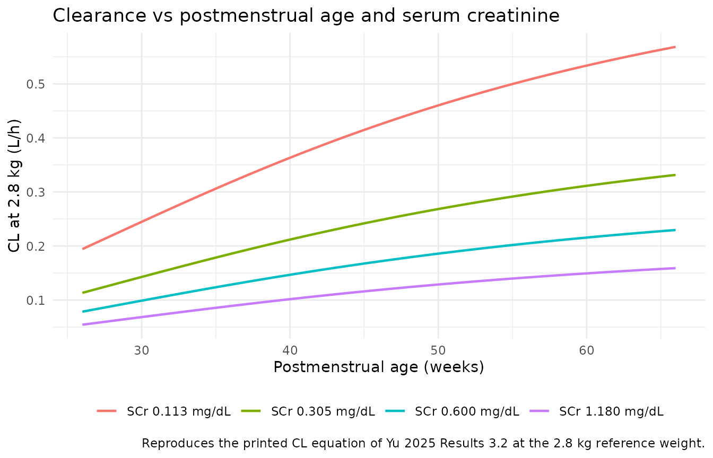
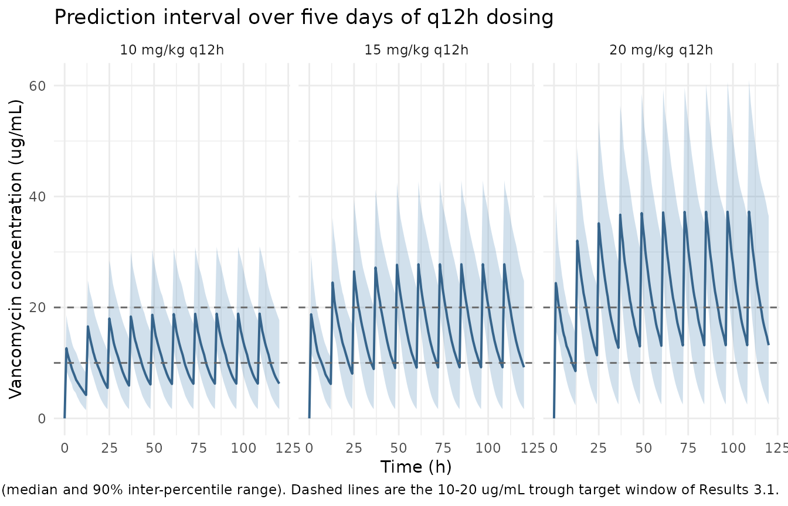

# Vancomycin in neonates and infants (Yu 2025)

## Model and source

- Citation: Yu H, Xiao J, Zhu HJ. Predicting vancomycin clearance in
  neonates and infants by integrating machine learning and metabolomics
  with population pharmacokinetics. Clin Transl Sci. 2025;18(7):e70293.
  <doi:10.1111/cts.70293>
- Description: One-compartment intravenous population PK model for
  vancomycin in 42 neonates and infants treated in a US neonatal
  intensive care unit (Yu 2025). Clearance is the product of a
  fully-mature typical value (0.46 L/h at 2.8 kg dosing weight and 0.3
  mg/dL serum creatinine), a Hill maturation fraction in postmenstrual
  age (T50 42.6 weeks, Hill coefficient 2.24), an allometric weight term
  with the exponent fixed at 0.75, and the reciprocal power term (0.3 /
  SCr)^0.543 so clearance falls as creatinine rises. Volume of
  distribution is 2.12 L at 2.8 kg and scales linearly with weight.
  Interoccasion variability was retained on clearance alongside
  interindividual variability on clearance and volume. The paper’s
  parallel machine-learning and metabolomics analysis predicts the same
  individual clearance estimates from clinical covariates and
  contributes nothing to this structural model.
- Article: <https://doi.org/10.1111/cts.70293> (open access,
  PMC12228420)

Yu 2025 has two halves. The first is a conventional population PK
analysis of vancomycin in a neonatal intensive care unit, and that is
what this model file carries. The second trains eleven machine-learning
regressors to predict the *same* individual clearance estimates the
population PK model produced, from clinical covariates and/or untargeted
plasma metabolomics. The machine-learning half has no ODE structure and
no reported coefficients, so nothing in it is extractable as an nlmixr2
model; it is summarised in the narrative below where it corroborates the
covariate model.

Note the filename. `Yu_2025_vancomycin` was already taken by an
unrelated paper – Yu B *et al.*, *Drugs R D* 2025;25:309-320
([doi:10.1007/s40268-025-00523-8](https://doi.org/10.1007/s40268-025-00523-8)),
a Chinese paediatric cohort scaled to 70 kg on Schwartz eGFR. This model
is the Michigan neonatal cohort of Yu H *et al.*, *Clin Transl Sci*, and
takes the year-letter collision suffix `2025b`.

## Population

The model was fitted to 214 serum vancomycin concentrations from 42
patients (25 neonates, 17 infants) treated in the University of Michigan
Neonatal Intensive Care Unit between 2019 and 2022 (Results 3.1). Each
patient contributed a mean of 5 concentrations (range 1-22),
predominantly steady-state troughs with some peak and random levels.
Vancomycin was given as an intermittent 60-minute intravenous infusion,
3.5-25 mg/kg per dose, every 6, 8, 12, 18 or 24 h. The assay lower limit
of quantification was 4.0 ug/mL and below-limit records were excluded.

Table 1 gives the baseline demographics as medians with 5th/95th
percentiles: dosing weight 2.80 kg (0.654-6.53), postmenstrual age 40.2
weeks (26.5-66.3), gestational age 28.3 weeks (23.9-38.3), postnatal age
8.64 weeks (0.430-37.9), birth weight 0.835 kg (0.495-3.37), serum
creatinine 0.305 mg/dL (0.113-1.18), albumin 3.00 g/dL (2.21-4.00) and
blood urea nitrogen 19.0 mg/dL (6.08-65.6). The cohort was 20/42 (47.6%)
female and 31 White / 9 Black / 2 Other. Weight and postmenstrual age
are strongly collinear in this cohort (r = 0.93, Results 3.1); serum
creatinine and blood urea nitrogen are also correlated (r = 0.71).

Eighteen of the 42 patients (43%) contributed multiple treatment
occasions, range 2 to 7, an occasion being a dosing gap of more than 4
days (Methods 2.1.1, Results 3.1). Adding interoccasion variability on
clearance dropped the objective function from 1447.63 to 1347.04, which
is why it is in the final model.

The same information is available programmatically via the model’s
`population` metadata
(`readModelDb("Yu_2025b_vancomycin")()$population`).

``` r

pop <- rxode2::rxode(readModelDb("Yu_2025b_vancomycin"))$population
#> ℹ parameter labels from comments will be replaced by 'label()'
#> Warning: some etas defaulted to non-mu referenced, possible parsing error: etaiov_cl_1, etaiov_cl_2, etaiov_cl_3, etaiov_cl_4, etaiov_cl_5, etaiov_cl_6, etaiov_cl_7
#> as a work-around try putting the mu-referenced expression on a simple line
tibble::tibble(Field = names(pop), Value = vapply(pop, as.character, character(1))) |>
  knitr::kable(caption = "Population metadata carried in the model file.")
```

| Field | Value |
|:---|:---|
| species | human |
| n_subjects | 42 |
| n_studies | 1 |
| age_range | Gestational age 23.9-38.3 weeks (5th-95th percentile; median 28.3); postnatal age 0.430-37.9 weeks (median 8.64); postmenstrual age 26.5-66.3 weeks (median 40.2). The cohort is 25 neonates and 17 infants. |
| weight_range | Current dosing weight 0.654-6.53 kg (5th-95th percentile; median 2.80); birth weight 0.495-3.37 kg (median 0.835) |
| sex_female_pct | 47.6 |
| race_ethnicity | White 31 (73.8%), Black 9 (21.4%), Other 2 (4.76%) (Table 1) |
| disease_state | Neonates and infants admitted to the University of Michigan Neonatal Intensive Care Unit between 2019 and 2022 and treated with intravenous vancomycin for suspected or confirmed Gram-positive bacterial infection. Inclusion required at least one recorded serum vancomycin concentration; no renal-function exclusion is stated. |
| dose_range | 3.5-25 mg/kg per dose, given every 6, 8, 12, 18 or 24 h as a 60-minute intravenous infusion (Results 3.1) |
| regions | United States (single centre: University of Michigan Neonatal Intensive Care Unit, Ann Arbor, MI) |
| renal_function | Serum creatinine 0.113-1.18 mg/dL (5th-95th percentile; median 0.305) and blood urea nitrogen 6.08-65.6 mg/dL (median 19.0) (Table 1). Renal replacement therapy is not mentioned as an exclusion criterion, and no renal-impairment stratum is defined, so the model’s domain of applicability is the observed creatinine range. |
| notes | Retrospective single-centre electronic-medical-record study approved by the University of Michigan IRB. 214 serum vancomycin concentrations from 42 patients, a mean of 5 per patient (range 1-22), predominantly steady-state troughs with some peak and random levels; the assay LLOQ was 4.0 ug/mL and below-LLOQ records were excluded from the population PK analysis. 18 of 42 patients (43%) contributed multiple occasions (range 2-7), an occasion being a dosing gap of more than 4 days, at a mean of 2.6 concentrations per occasion. Estimated by SAEM in Monolix 2024R1. A two-compartment model was tested and rejected: it did not lower the objective function and the R.S.E.% for V1, Q and V2 were much higher (Results 3.2). Approximately 47.7% of the analysed trough concentrations lay in the 10-20 ug/mL target range (Results 3.1). Vd is poorly informed by these largely trough-only data – its shrinkage is 52.7% versus 15.8% for CL (Table 2) – so individual Vd predictions from this model are close to the population mean. The paper’s second half compares eleven machine-learning regressors, trained on the model’s own empirical-Bayes CL estimates, using clinical covariates and/or untargeted plasma metabolomics; the best (gradient boosting on the ten clinical covariates) reached R^2 0.830, metabolomics added nothing, and none of that analysis alters the structural model carried here. |

Population metadata carried in the model file. {.table}

## Source trace

The per-parameter origin is recorded as an in-file comment next to each
`ini()` entry in `inst/modeldb/specificDrugs/Yu_2025b_vancomycin.R`. The
table below collects them in one place for review.

| Equation / parameter | Value | Source location |
|----|----|----|
| `lcl` (fully mature CL at 2.8 kg, SCr 0.3 mg/dL) | `log(0.46)` L/h | Table 2, `Cl_pop` = 0.460 (S.E. 0.0423, R.S.E. 9.21%, CI 0.384-0.550); Results 3.2 CL equation |
| `lvc` (Vd at 2.8 kg) | `log(2.12)` L | Table 2, `V_pop` = 2.12 (S.E. 0.286, R.S.E. 13.5%, CI 1.63-2.75); Results 3.2 Vd equation |
| `e_wt_cl` | `fixed(0.75)` | Results 3.2, “the power exponent fixed at 1 for Vd and 0.75 for CL” – absent from Table 2 because it was not estimated |
| `e_wt_vc` | `fixed(1)` | Results 3.2, same sentence |
| `pma_tm50` | 42.6 weeks | Table 2, `PMA_T50` = 42.6 (S.E. 3.57, R.S.E. 8.38%, CI 36.2-50.2) |
| `pma_hill` | 2.24 | Table 2, `PMA_Hill` = 2.24 (S.E. 0.0354, R.S.E. 1.58%, CI 2.17-2.31) |
| `e_creat_cl` | 0.543 | Table 2, `SCr_pop` = 0.543 (S.E. 0.0746, R.S.E. 13.7%, CI 0.417-0.708); Results 3.2 CL equation |
| `etalcl` | 0.195^2 = 0.038025 | Table 2, `omega_Cl` = 0.195 (C.V. 19.6%, R.S.E. 21.8%, CI 0.129-0.294) |
| `etalvc` | 0.284^2 = 0.080656 | Table 2, `omega_V` = 0.284 (C.V. 29.0%, R.S.E. 35.4%, CI 0.150-0.540) |
| `etaiov_cl_1..7` | 0.161^2 = 0.025921 | Table 2, `gamma_Cl` = 0.161 (C.V. 16.2%, R.S.E. 22.5%, CI 0.105-0.246); seven slots per Results 3.1 “range: 2-7” |
| `addSd` | 2.15 ug/mL | Table 2, `a` = 2.15 (S.E. 0.244, R.S.E. 11.4%, CI 1.72-2.68); Table 2 note “a: The additive error (ug/mL)” |
| `propSd` | 0.129 | Table 2, `b` = 0.129 (S.E. 0.0274, R.S.E. 21.4%, CI 0.0862-0.193); Table 2 note “b: The proportional error (unitless)” |
| CL equation (Hill x allometry x reciprocal SCr power) | n/a | Results 3.2, printed CL equation |
| Vd equation (linear allometry) | n/a | Results 3.2, printed Vd equation |
| `d/dt(central)` one compartment, first-order elimination | n/a | Results 3.2, “the one-compartment model with first-order elimination was selected” |
| Reference weight 2.8 kg | n/a | Results 3.2, “CL and Vd were standardized to a median weight of 2.8 kg”; equals the Table 1 median dosing weight |
| Reference creatinine 0.3 mg/dL | n/a | Printed inside the Results 3.2 CL equation; the Table 1 median 0.305 rounded to one significant figure |
| Occasion definition (dosing gap \> 4 days) | n/a | Methods 2.1.1 |
| 60-minute IV infusion | n/a | Results 3.1 |

### The omega scale is pinned by the printed C.V. column

Table 2’s “Standard deviation of the random effects” block prints both
the value and an apparent coefficient of variation. That settles the
variance-versus-SD question with no adjudication needed: reading the
values as log-scale standard deviations reproduces every printed C.V.
exactly.

``` r

tibble::tribble(
  ~Parameter,  ~`Table 2 value`, ~`Table 2 C.V. (%)`,
  "omega_V",   0.284,            29.0,
  "omega_Cl",  0.195,            19.6,
  "gamma_Cl",  0.161,            16.2
) |>
  dplyr::mutate(
    `sqrt(exp(omega^2) - 1) (%)` = round(100 * sqrt(exp(`Table 2 value`^2) - 1), 1),
    Agrees = abs(`sqrt(exp(omega^2) - 1) (%)` - `Table 2 C.V. (%)`) < 0.15
  ) |>
  knitr::kable(caption = "Reading the Table 2 omegas as log-scale SDs reproduces the printed C.V. column.")
```

| Parameter | Table 2 value | Table 2 C.V. (%) | sqrt(exp(omega^2) - 1) (%) | Agrees |
|:----------|--------------:|-----------------:|---------------------------:|:-------|
| omega_V   |         0.284 |             29.0 |                       29.0 | TRUE   |
| omega_Cl  |         0.195 |             19.6 |                       19.7 | TRUE   |
| gamma_Cl  |         0.161 |             16.2 |                       16.2 | TRUE   |

Reading the Table 2 omegas as log-scale SDs reproduces the printed C.V.
column. {.table}

``` r


# Deterministic arithmetic on printed values, so a tight bound is correct here.
stopifnot(all(abs(100 * sqrt(exp(c(0.284, 0.195, 0.161)^2) - 1) -
                    c(29.0, 19.6, 16.2)) < 0.15))
```

## Adjudication: what does `Cl_pop = 0.46 L/h` mean?

The maturation term printed in Results 3.2 is the **bare** Hill fraction
`PMA^2.24 / (42.6^2.24 + PMA^2.24)`, not a ratio normalised to a
reference postmenstrual age. It therefore equals 0.5 exactly at PMA =
42.6 weeks and 0.468 at the cohort median PMA of 40.2 weeks, which makes
`Cl_pop` the **fully mature** clearance – roughly twice the clearance of
a typical median subject.

That reading conflicts with the paper’s own Discussion, which states
“the estimated median vancomycin CL was 0.16 L/h/kg for this cohort”.
0.16 L/h/kg is exactly `0.46 / 2.8`, i.e. it drops both the maturation
factor and the creatinine factor. The printed equation gives 0.076
L/h/kg for the median subject instead.

The paper’s own reported exposures settle it. Every assertion in this
section is on a typical-value quantity computed in closed form, so it is
deterministic and a tight bound is appropriate.

``` r

hill_frac <- function(pma, t50 = 42.6, gamma = 2.24) pma^gamma / (t50^gamma + pma^gamma)

# Steady-state closed form for a 1-compartment model, intermittent infusion.
ss_metrics <- function(cl, v, dose_mg, tau, tinf = 1) {
  k <- cl / v
  rate <- dose_mg / tinf
  cmax <- rate / cl * (1 - exp(-k * tinf)) / (1 - exp(-k * tau))
  c(
    cmax  = cmax,
    cmin  = cmax * exp(-k * (tau - tinf)),
    auc24 = dose_mg * (24 / tau) / cl
  )
}

wt_med  <- 2.80    # Table 1 median dosing weight (kg)
pma_med <- 40.2    # Table 1 median postmenstrual age (weeks)
scr_med <- 0.305   # Table 1 median serum creatinine (mg/dL)
v_med   <- 2.12 * (wt_med / 2.8)

cl_printed    <- 0.46 * hill_frac(pma_med) * (wt_med / 2.8)^0.75 * (0.3 / scr_med)^0.543
cl_discussion <- 0.46 * (wt_med / 2.8)^0.75

m_printed    <- ss_metrics(cl_printed,    v_med, 15 * wt_med, 12)
m_discussion <- ss_metrics(cl_discussion, v_med, 15 * wt_med, 12)

dplyr::bind_rows(
  tibble::as_tibble_row(m_printed) |>
    dplyr::mutate(Reading = "Printed Results 3.2 equation (Hill retained)",
                  `CL (L/h/kg)` = cl_printed / wt_med),
  tibble::as_tibble_row(m_discussion) |>
    dplyr::mutate(Reading = "Discussion 0.16 L/h/kg (Hill dropped)",
                  `CL (L/h/kg)` = cl_discussion / wt_med)
) |>
  dplyr::select(Reading, `CL (L/h/kg)`, cmax, cmin, auc24) |>
  dplyr::rename(
    "Css,max (ug/mL)"   = cmax,
    "Css,min (ug/mL)"   = cmin,
    "AUC0-24 (ug*h/mL)" = auc24
  ) |>
  knitr::kable(digits = 3,
               caption = "Median subject (2.80 kg, PMA 40.2 wk, SCr 0.305 mg/dL) on 15 mg/kg q12h as a 1-h infusion.")
```

| Reading | CL (L/h/kg) | Css,max (ug/mL) | Css,min (ug/mL) | AUC0-24 (ug\*h/mL) |
|:---|---:|---:|---:|---:|
| Printed Results 3.2 equation (Hill retained) | 0.076 | 26.896 | 8.899 | 394.067 |
| Discussion 0.16 L/h/kg (Hill dropped) | 0.164 | 19.232 | 1.768 | 182.609 |

Median subject (2.80 kg, PMA 40.2 wk, SCr 0.305 mg/dL) on 15 mg/kg q12h
as a 1-h infusion. {.table}

The printed-equation reading puts AUC0-24 at 394 ug*h/mL, within a
couple of percent of the 400 mg*h/L target the paper’s Introduction
quotes from the 2020 vancomycin guidelines, and a trough of 8.9 ug/mL,
adjacent to the 10-20 ug/mL window in which Results 3.1 reports 47.7% of
the observed troughs fell.

The Discussion reading halves every exposure. It puts the median
subject’s trough at 1.8 ug/mL – **below the 4.0 ug/mL assay LLOQ**
stated in Methods 2.1.1. Under that reading a typical patient on a
mid-guideline regimen would contribute no quantifiable trough at all,
which cannot be reconciled with a dataset of 214 quantifiable
concentrations that were “majority … trough concentrations” with 47.7%
between 10 and 20 ug/mL. The model file uses the printed equation.

``` r

stopifnot(
  # The printed reading lands on the guideline AUC target.
  abs(m_printed[["auc24"]] - 400) < 25,
  # The Discussion reading falls below the assay LLOQ at the median subject,
  # which is the falsification.
  m_discussion[["cmin"]] < 4.0,
  # ... and is less than half the guideline AUC target.
  m_discussion[["auc24"]] < 200
)
```

## Reproducing the printed covariate equations

The clearance surface below is the Results 3.2 equation evaluated
directly. Clearance rises with postmenstrual age through the Hill term
and falls with serum creatinine through the reciprocal power term. The
paper’s Results 3.4 feature-importance analysis independently ranked PMA
and SCr as the top predictors in every ensemble machine-learning model,
while weight – retained by the population PK covariate search – did not
enter any top-10 list, which the Discussion attributes to the r = 0.93
weight/PMA collinearity.

``` r

tidyr::crossing(
  PAGE  = seq(26, 66, by = 0.5),                        # Table 1 5th-95th percentile PMA
  CREAT = c(0.113, 0.305, 0.60, 1.18)                   # Table 1 5th pctile, median, mid, 95th pctile
) |>
  dplyr::mutate(
    cl  = 0.46 * hill_frac(PAGE) * (0.3 / CREAT)^0.543, # at the 2.8 kg reference weight
    SCr = factor(sprintf("SCr %.3f mg/dL", CREAT))
  ) |>
  ggplot(aes(PAGE, cl, colour = SCr)) +
  geom_line(linewidth = 0.8) +
  labs(
    x = "Postmenstrual age (weeks)", y = "CL at 2.8 kg (L/h)", colour = NULL,
    title = "Clearance vs postmenstrual age and serum creatinine",
    caption = "Reproduces the printed CL equation of Yu 2025 Results 3.2 at the 2.8 kg reference weight."
  ) +
  theme_minimal() +
  theme(legend.position = "bottom")
```



## Virtual cohort

Original observed data are not publicly available. The cohort below
approximates Table 1: log-normal marginals whose medians match the
reported medians, with the log-scale spread taken from the reported
5th/95th percentiles, and postmenstrual age correlated with weight at
the r = 0.93 reported in Results 3.1. Draws are truncated to the Table 1
5th-95th percentile windows so no simulated subject sits outside the
model’s observed covariate domain.

The **same** covariate draw is reused across the three dose arms, so the
arms differ only in dose. Subject IDs are offset per arm because
`rxSolve` treats `id` as the subject key and duplicate IDs silently
merge into one subject receiving the summed dose.

``` r

# `set.seed()` seeds R's RNG, which is what draws the covariates below. It does
# NOT seed rxode2's simulation RNG, and rxode2's streams are partitioned per
# solver thread, so the eta draws differ between a 2-core CI runner and a
# 16-thread workstation. Every assertion downstream is written to hold for any
# cohort this model can produce (see pattern 12 of
# references/known-vignette-failure-patterns.md).
set.seed(20250618)   # Yu 2025 acceptance date

n_per_arm <- 150L    # inside the 200-per-arm cap

# Log-scale SD implied by a log-normal whose median and 5th/95th percentiles
# are the Table 1 values; the two tails imply slightly different SDs, so use
# their mean.
lnorm_sd <- function(median, p05, p95) {
  mean(c(log(p95 / median), log(median / p05))) / stats::qnorm(0.95)
}
sd_pma <- lnorm_sd(40.2,  26.5,  66.3)
sd_wt  <- lnorm_sd(2.80,  0.654, 6.53)
sd_scr <- lnorm_sd(0.305, 0.113, 1.18)

rho <- 0.93          # Results 3.1: PMA-weight correlation

z_pma <- stats::rnorm(n_per_arm)
z_wt  <- rho * z_pma + sqrt(1 - rho^2) * stats::rnorm(n_per_arm)
z_scr <- stats::rnorm(n_per_arm)

covariates <- tibble::tibble(
  PAGE  = pmin(pmax(40.2  * exp(sd_pma * z_pma), 26.5),  66.3),
  WT    = pmin(pmax(2.80  * exp(sd_wt  * z_wt),  0.654), 6.53),
  CREAT = pmin(pmax(0.305 * exp(sd_scr * z_scr), 0.113), 1.18)
)

# Yu 2025 Results 3.1 records 3.5-25 mg/kg q6-24h; the Introduction quotes the
# 2020 guideline range of 10-20 mg/kg. Three guideline arms at a common
# interval so the arms differ only in dose.
tau     <- 12                        # h
tinf    <- 1                         # h, "a 60-min IV infusion" (Results 3.1)
n_doses <- 10L                       # 5 days -> steady state (t1/2 about 7 h)
arms    <- c(`10 mg/kg q12h` = 10, `15 mg/kg q12h` = 15, `20 mg/kg q12h` = 20)

make_arm <- function(mgkg, label, id_offset) {
  subj <- covariates |>
    dplyr::mutate(
      id      = id_offset + dplyr::row_number(),
      arm     = label,
      dose_mg = mgkg * WT,
      OCC     = 1L        # a single continuous treatment course = one occasion
    )

  doses <- subj |>
    tidyr::crossing(dose_index = seq_len(n_doses)) |>
    dplyr::mutate(
      time = (dose_index - 1) * tau,
      evid = 1L, cmt = "central",
      amt  = dose_mg, rate = dose_mg / tinf
    ) |>
    dplyr::select(-dose_index)

  obs <- subj |>
    tidyr::crossing(time = seq(0, n_doses * tau, by = 0.5)) |>
    dplyr::mutate(evid = 0L, cmt = "central", amt = NA_real_, rate = NA_real_)

  dplyr::bind_rows(doses, obs) |> dplyr::arrange(id, time, dplyr::desc(evid))
}

events <- dplyr::bind_rows(
  Map(
    make_arm,
    mgkg      = as.numeric(arms),
    label     = names(arms),
    id_offset = (seq_along(arms) - 1L) * n_per_arm
  )
)

stopifnot(!anyDuplicated(unique(events[, c("id", "time", "evid")])))
stopifnot(length(unique(events$id)) == n_per_arm * length(arms))

events |>
  dplyr::distinct(id, PAGE, WT, CREAT) |>
  tidyr::pivot_longer(c(PAGE, WT, CREAT), names_to = "Covariate") |>
  dplyr::group_by(Covariate) |>
  dplyr::summarise(
    Min = min(value), P5 = quantile(value, 0.05), Median = median(value),
    P95 = quantile(value, 0.95), Max = max(value), .groups = "drop"
  ) |>
  knitr::kable(digits = 3,
               caption = "Simulated covariate distributions (compare Yu 2025 Table 1 medians 40.2 wk / 2.80 kg / 0.305 mg/dL).")
```

| Covariate |    Min |     P5 | Median |    P95 |   Max |
|:----------|-------:|-------:|-------:|-------:|------:|
| CREAT     |  0.113 |  0.113 |  0.307 |  0.925 |  1.18 |
| PAGE      | 26.500 | 26.500 | 39.922 | 58.490 | 66.30 |
| WT        |  0.654 |  0.803 |  2.692 |  6.530 |  6.53 |

Simulated covariate distributions (compare Yu 2025 Table 1 medians 40.2
wk / 2.80 kg / 0.305 mg/dL). {.table}

## Simulation

``` r

mod <- readModelDb("Yu_2025b_vancomycin")

sim <- rxode2::rxSolve(
  mod,
  events = events,
  keep   = c("arm", "dose_mg")
) |>
  as.data.frame()
#> ℹ parameter labels from comments will be replaced by 'label()'
#> Warning: some etas defaulted to non-mu referenced, possible parsing error: etaiov_cl_1, etaiov_cl_2, etaiov_cl_3, etaiov_cl_4, etaiov_cl_5, etaiov_cl_6, etaiov_cl_7
#> as a work-around try putting the mu-referenced expression on a simple line
#> Warning: some etas defaulted to non-mu referenced, possible parsing error: etaiov_cl_1, etaiov_cl_2, etaiov_cl_3, etaiov_cl_4, etaiov_cl_5, etaiov_cl_6, etaiov_cl_7
#> as a work-around try putting the mu-referenced expression on a simple line

if (is.null(sim$id)) sim$id <- 1L
stopifnot(nrow(sim) > 0, !all(is.na(sim$Cc)))
```

## Replicate published figures

Yu 2025’s three model figures are Figure 2 (goodness of fit against the
observed concentrations), Figure 3 (a visual predictive check) and
Figure 4 (machine-learning feature importance). Figures 2 and 4 cannot
be reproduced from the packaged model – the first needs the unavailable
observed data and the second belongs to the machine-learning half, which
has no ODE structure. Only Figure 3’s shape and scale are reproducible,
as the prediction interval a simulation from this model generates.

``` r

# Replicates the structure of Figure 3 of Yu 2025: median and 90%
# inter-percentile range of simulated concentrations over a dosing course.
sim |>
  dplyr::filter(!is.na(Cc)) |>
  dplyr::group_by(arm, time) |>
  dplyr::summarise(
    Q05 = quantile(Cc, 0.05), Q50 = median(Cc), Q95 = quantile(Cc, 0.95),
    .groups = "drop"
  ) |>
  ggplot(aes(time, Q50)) +
  geom_ribbon(aes(ymin = Q05, ymax = Q95), alpha = 0.25, fill = "steelblue") +
  geom_line(colour = "steelblue4", linewidth = 0.7) +
  geom_hline(yintercept = c(10, 20), linetype = "dashed", colour = "grey40") +
  facet_wrap(~arm) +
  labs(
    x = "Time (h)", y = "Vancomycin concentration (ug/mL)",
    title = "Prediction interval over five days of q12h dosing",
    caption = paste(
      "Replicates the structure of Figure 3 of Yu 2025 (median and 90%",
      "inter-percentile range). Dashed lines are the 10-20 ug/mL trough",
      "target window of Results 3.1."
    )
  ) +
  theme_minimal()
```



``` r

# Results 3.1: "Approximately 47.7% of the analyzed trough concentrations were
# within the target concentration range of 10-20 ug/mL". The observed 47.7% came
# from heterogeneous, TDM-adjusted regimens (3.5-25 mg/kg, q6-24h) that cannot
# be reconstructed, so this is a plausibility comparison, NOT a gate on 47.7%.
trough_tab <- sim |>
  dplyr::filter(!is.na(Cc), time == n_doses * tau) |>   # trough of the 10th interval
  dplyr::group_by(arm) |>
  dplyr::summarise(
    n = dplyr::n(),
    `Median trough (ug/mL)` = median(Cc),
    `% in 10-20 ug/mL`      = 100 * mean(Cc >= 10 & Cc <= 20),
    `% below 10 ug/mL`      = 100 * mean(Cc < 10),
    .groups = "drop"
  )
stopifnot(nrow(trough_tab) == length(arms), all(trough_tab$n == n_per_arm))
knitr::kable(trough_tab, digits = 1,
             caption = "Steady-state troughs at the end of the 10th dosing interval, by arm.")
```

| arm           |   n | Median trough (ug/mL) | % in 10-20 ug/mL | % below 10 ug/mL |
|:--------------|----:|----------------------:|-----------------:|-----------------:|
| 10 mg/kg q12h | 150 |                   6.3 |             22.0 |             75.3 |
| 15 mg/kg q12h | 150 |                   9.2 |             34.7 |             54.0 |
| 20 mg/kg q12h | 150 |                  13.2 |             33.3 |             40.0 |

Steady-state troughs at the end of the 10th dosing interval, by arm.
{.table}

``` r


# Robust, magnitude-based gate: across the three guideline arms the model must
# put a substantial minority -- but not nearly all -- of troughs in the target
# window, which is the qualitative content of the paper's 47.7%. The bounds are
# deliberately wide of any single draw.
stopifnot(
  max(trough_tab$`% in 10-20 ug/mL`) > 15,
  min(trough_tab$`% in 10-20 ug/mL`) < 85,
  # The median trough must be in a clinically sane band for a guideline dose.
  all(trough_tab$`Median trough (ug/mL)` > 2),
  all(trough_tab$`Median trough (ug/mL)` < 40)
)
```

## Structural verification against the closed form

The model is a one-compartment system with first-order elimination, so
an intermittent-infusion regimen has an exact superposition solution.
Comparing the ODE solve against that closed form – with the parameters
recomputed here from the Table 2 constants typed independently of the
model file – tests both the ODE and the transcription. Both sides use
the same fixed covariates and no random effects, so the residual is pure
numerical integration error and a tight bound is correct.

``` r

mod_typical <- mod |> rxode2::zeroRe()
#> ℹ parameter labels from comments will be replaced by 'label()'
#> Warning: some etas defaulted to non-mu referenced, possible parsing error: etaiov_cl_1, etaiov_cl_2, etaiov_cl_3, etaiov_cl_4, etaiov_cl_5, etaiov_cl_6, etaiov_cl_7
#> as a work-around try putting the mu-referenced expression on a simple line
#> Warning: some etas defaulted to non-mu referenced, possible parsing error: etaiov_cl_1, etaiov_cl_2, etaiov_cl_3, etaiov_cl_4, etaiov_cl_5, etaiov_cl_6, etaiov_cl_7
#> as a work-around try putting the mu-referenced expression on a simple line

# Independently typed from Yu 2025 Table 2 and the Results 3.2 equations.
cl_hand <- function(wt, pma, scr) {
  0.46 * (pma^2.24 / (42.6^2.24 + pma^2.24)) * (wt / 2.8)^0.75 * (0.3 / scr)^0.543
}
vc_hand <- function(wt) 2.12 * (wt / 2.8)

# Analytic multi-dose infusion superposition. Vectorised over t / cl / v /
# dose_mg together, because those arrive as parallel columns of probe_sim.
conc_closed_form <- function(t, cl, v, dose_mg, tau, tinf, n_doses) {
  stopifnot(length(cl) == length(t), length(v) == length(t), length(dose_mg) == length(t))
  k <- cl / v
  rate <- dose_mg / tinf
  out <- numeric(length(t))
  for (j in seq_len(n_doses) - 1L) {
    dt <- t - j * tau                                    # time since this dose
    during <- rate / cl * (1 - exp(-k * pmin(pmax(dt, 0), tinf)))
    after  <- during * exp(-k * pmax(dt - tinf, 0))
    out <- out + ifelse(dt <= 0, 0, after)
  }
  out
}

# Probe subjects: the three covariate corners of Table 1, plus the median
# subject at each of the three guideline doses so dose linearity is testable.
probes <- tibble::tribble(
  ~label,                       ~WT,   ~PAGE, ~CREAT, ~mgkg,
  "P5 corner, 15 mg/kg",        0.654, 26.5,  1.18,   15,
  "Median subject, 10 mg/kg",   2.80,  40.2,  0.305,  10,
  "Median subject, 15 mg/kg",   2.80,  40.2,  0.305,  15,
  "Median subject, 20 mg/kg",   2.80,  40.2,  0.305,  20,
  "P95 corner, 15 mg/kg",       6.53,  66.3,  0.113,  15
) |>
  dplyr::mutate(id = dplyr::row_number(), OCC = 1L, dose_mg = mgkg * WT)

probe_events <- dplyr::bind_rows(
  probes |>
    tidyr::crossing(dose_index = seq_len(n_doses)) |>
    dplyr::mutate(time = (dose_index - 1) * tau, evid = 1L, cmt = "central",
                  amt = dose_mg, rate = dose_mg / tinf) |>
    dplyr::select(-dose_index),
  probes |>
    tidyr::crossing(time = seq(0, n_doses * tau, by = 0.05)) |>
    dplyr::mutate(evid = 0L, cmt = "central", amt = NA_real_, rate = NA_real_)
) |>
  dplyr::arrange(id, time, dplyr::desc(evid))

probe_sim <- rxode2::rxSolve(
  mod_typical, events = probe_events,
  keep = c("label", "WT", "PAGE", "CREAT", "dose_mg", "mgkg")
) |>
  as.data.frame() |>
  dplyr::filter(!is.na(Cc)) |>
  dplyr::mutate(
    cl_ref = cl_hand(WT, PAGE, CREAT),
    vc_ref = vc_hand(WT),
    Cc_ref = conc_closed_form(time, cl_ref, vc_ref, dose_mg, tau, tinf, n_doses)
  )
#> Warning: some etas defaulted to non-mu referenced, possible parsing error: etaiov_cl_1, etaiov_cl_2, etaiov_cl_3, etaiov_cl_4, etaiov_cl_5, etaiov_cl_6, etaiov_cl_7
#> as a work-around try putting the mu-referenced expression on a simple line
#> ℹ omega/sigma items treated as zero: 'etalcl', 'etalvc', 'etaiov_cl_1', 'etaiov_cl_2', 'etaiov_cl_3', 'etaiov_cl_4', 'etaiov_cl_5', 'etaiov_cl_6', 'etaiov_cl_7'
#> Warning: multi-subject simulation without without 'omega'

cf_tab <- probe_sim |>
  dplyr::group_by(label) |>
  dplyr::summarise(
    `CL (L/h)`               = dplyr::first(cl_ref),
    `Vd (L)`                 = dplyr::first(vc_ref),
    `t1/2 (h)`               = log(2) / (dplyr::first(cl_ref) / dplyr::first(vc_ref)),
    `Max abs rel. error (%)` = 100 * max(abs(Cc - Cc_ref) / pmax(Cc_ref, 1e-8)),
    .groups = "drop"
  )
cf_tab |>
  dplyr::mutate(`Max abs rel. error (%)` = signif(`Max abs rel. error (%)`, 3)) |>
  knitr::kable(digits = 4,
               caption = "ODE solve vs the analytic superposition solution, typical values.")
```

| label                    | CL (L/h) | Vd (L) | t1/2 (h) | Max abs rel. error (%) |
|:-------------------------|---------:|-------:|---------:|-----------------------:|
| Median subject, 10 mg/kg |   0.2132 | 2.1200 |   6.8937 |                      0 |
| Median subject, 15 mg/kg |   0.2132 | 2.1200 |   6.8937 |                      0 |
| Median subject, 20 mg/kg |   0.2132 | 2.1200 |   6.8937 |                      0 |
| P5 corner, 15 mg/kg      |   0.0189 | 0.4952 |  18.2007 |                      0 |
| P95 corner, 15 mg/kg     |   1.0757 | 4.9441 |   3.1857 |                      0 |

ODE solve vs the analytic superposition solution, typical values.
{.table}

``` r


# Numerical-integration error only -- deterministic, so assert tightly.
# Realised 1.6e-12 % on this build. The bound below sits two decades above
# rxode2's default relative solver tolerance (rtol 1e-6, i.e. 1e-4 %), which is
# the floor a different platform could plausibly hit; a mis-transcribed
# clearance, volume, exponent or dose unit moves this by tens of percent.
stopifnot(nrow(cf_tab) == nrow(probes))
stopifnot(max(cf_tab$`Max abs rel. error (%)`) < 1e-2)

# The model is linear in dose, so typical-value AUC must be exactly
# proportional across the three median-subject doses. Deterministic: tight.
prop_tab <- probe_sim |>
  dplyr::filter(grepl("Median subject", label), time >= (n_doses - 1L) * tau) |>
  dplyr::arrange(mgkg, time) |>
  dplyr::group_by(mgkg) |>
  dplyr::summarise(
    auc_tau = sum(diff(time) * (utils::head(Cc, -1) + utils::tail(Cc, -1)) / 2),
    .groups = "drop"
  ) |>
  dplyr::mutate(`AUCtau / (mg/kg)` = auc_tau / mgkg)
stopifnot(nrow(prop_tab) == 3L)
knitr::kable(prop_tab, digits = 6,
             caption = "Dose linearity of the typical-value steady-state AUC0-tau (median subject).")
```

| mgkg |  auc_tau | AUCtau / (mg/kg) |
|-----:|---------:|-----------------:|
|   10 | 131.3549 |         13.13549 |
|   15 | 197.0324 |         13.13549 |
|   20 | 262.7099 |         13.13549 |

Dose linearity of the typical-value steady-state AUC0-tau (median
subject). {.table}

``` r

stopifnot(max(abs(prop_tab$`AUCtau / (mg/kg)` /
                    mean(prop_tab$`AUCtau / (mg/kg)`) - 1)) < 1e-6)
```

### Mass-balance identity

For any one-compartment model with clearance `CL`, the identity
`CL * AUC[0,T] = (amount infused by T) - (amount remaining at T)` holds
exactly at every `T`, with no steady-state assumption. It fails by tens
of percent if the dose units, the infusion rate or `kel` are wrong, so
it is a genuine gate on the ODE and on the unit chain (dose in mg, `vc`
in L, `Cc` in ug/mL = mg/L).

``` r

amount_infused <- function(t, dose_mg, tau, tinf, n_doses) {
  rate <- dose_mg / tinf
  sum(vapply(seq_len(n_doses) - 1L, function(j) {
    rate * min(max(t - j * tau, 0), tinf)
  }, numeric(1)))
}

mb_tab <- probe_sim |>
  dplyr::arrange(label, time) |>
  dplyr::group_by(label) |>
  dplyr::summarise(
    `Infused (mg)`  = amount_infused(max(time), dplyr::first(dose_mg), tau, tinf, n_doses),
    `Remaining (mg)` = dplyr::last(Cc) * dplyr::first(vc_ref),
    `CL * AUC (mg)` = dplyr::first(cl_ref) *
      sum(diff(time) * (utils::head(Cc, -1) + utils::tail(Cc, -1)) / 2),
    .groups = "drop"
  ) |>
  dplyr::mutate(
    `Rel. error (%)` = 100 * abs(`CL * AUC (mg)` - (`Infused (mg)` - `Remaining (mg)`)) /
      (`Infused (mg)` - `Remaining (mg)`)
  )

mb_tab |>
  dplyr::mutate(`Rel. error (%)` = signif(`Rel. error (%)`, 3)) |>
  knitr::kable(digits = 4,
               caption = "CL * AUC[0,T] vs (infused - remaining) at T = 120 h.")
```

| label | Infused (mg) | Remaining (mg) | CL \* AUC (mg) | Rel. error (%) |
|:---|---:|---:|---:|---:|
| Median subject, 10 mg/kg | 280.0 | 12.5771 | 267.4228 | 0 |
| Median subject, 15 mg/kg | 420.0 | 18.8657 | 401.1343 | 0 |
| Median subject, 20 mg/kg | 560.0 | 25.1543 | 534.8457 | 0 |
| P5 corner, 15 mg/kg | 98.1 | 17.0811 | 81.0189 | 0 |
| P95 corner, 15 mg/kg | 979.5 | 8.6762 | 970.8238 | 0 |

CL \* AUC\[0,T\] vs (infused - remaining) at T = 120 h. {.table}

``` r


# Trapezoidal error on a 0.05 h grid, deterministic. Realised 9.9e-06 % on this
# build; the bound keeps three decades of headroom for the trapezoid on a
# coarser future grid while still going red on any real unit or rate error.
stopifnot(nrow(mb_tab) == nrow(probes))
stopifnot(max(mb_tab$`Rel. error (%)`) < 1e-2)
```

### Interoccasion variability is wired up

`gamma_Cl` is implemented as seven per-occasion etas selected by the
`OCC` column, because rxode2 parses but cannot simulate the
`eta ~ var | OCC` multi-level form from an `rxUi`. The check below gives
100 replicate subjects seven occasions each and confirms clearance
really does move between occasions within a subject, at roughly the
reported 16.2% coefficient of variation.

``` r

iov_one <- tibble::tibble(OCC = 1:7) |>
  dplyr::mutate(WT = 2.80, PAGE = 40.2, CREAT = 0.305, dose_mg = 15 * 2.80) |>
  tidyr::crossing(within = c(0, 1, 6, 12)) |>
  dplyr::mutate(
    time = (OCC - 1) * 240 + within,       # occasions 10 days apart
    evid = dplyr::if_else(within == 0, 1L, 0L),
    cmt  = "central",
    amt  = dplyr::if_else(within == 0, dose_mg, NA_real_),
    rate = dplyr::if_else(within == 0, dose_mg / tinf, NA_real_)
  ) |>
  dplyr::select(-within)

iov_events <- dplyr::bind_rows(
  lapply(seq_len(100), function(i) dplyr::mutate(iov_one, id = i))
) |>
  dplyr::arrange(id, time, dplyr::desc(evid))

iov_sim <- rxode2::rxSolve(mod, events = iov_events, keep = "OCC") |>
  as.data.frame() |>
  dplyr::filter(!is.na(Cc))

iov_cv <- iov_sim |>
  dplyr::distinct(id, OCC, cl) |>
  dplyr::group_by(id) |>
  dplyr::summarise(n_occ = dplyr::n(), within_sd = stats::sd(log(cl)), .groups = "drop")

stopifnot(all(iov_cv$n_occ == 7L))
cat(sprintf(
  "Within-subject SD of log(CL) across occasions: median %.3f (target gamma_Cl = 0.161)\n",
  median(iov_cv$within_sd)
))
#> Within-subject SD of log(CL) across occasions: median 0.155 (target gamma_Cl = 0.161)
cat(sprintf("Max abs rel. error, ODE vs closed form: %.3g %%\n",
            max(cf_tab$`Max abs rel. error (%)`)))
#> Max abs rel. error, ODE vs closed form: 1.62e-12 %
cat(sprintf("Max abs rel. error, mass balance:      %.3g %%\n",
            max(mb_tab$`Rel. error (%)`)))
#> Max abs rel. error, mass balance:      9.91e-06 %

# Cohort-derived, so a magnitude band wide of the sampling noise: an SD from 7
# draws has a relative standard error of about 1/sqrt(2*6) = 29%.
stopifnot(
  median(iov_cv$within_sd) > 0.161 / 2,
  median(iov_cv$within_sd) < 0.161 * 2,
  # IOV must actually vary CL within a subject.
  all(iov_cv$within_sd > 0)
)
```

## PKNCA validation

``` r

sim_nca <- sim |>
  dplyr::filter(!is.na(Cc)) |>
  dplyr::select(id, time, Cc, arm)

# Guarantee a time = 0 record per (id, arm); pre-dose Cc = 0 is correct for an
# intravenous first dose. Without it PKNCA warns "Requesting an AUC range
# starting (0) before the first measurement".
sim_nca <- dplyr::bind_rows(
  sim_nca,
  sim_nca |> dplyr::distinct(id, arm) |> dplyr::mutate(time = 0, Cc = 0)
) |>
  dplyr::distinct(id, arm, time, .keep_all = TRUE) |>
  dplyr::arrange(id, arm, time)

conc_obj <- PKNCA::PKNCAconc(sim_nca, Cc ~ time | arm + id,
                             concu = "ug/mL", timeu = "h")

dose_df <- events |>
  dplyr::filter(evid == 1) |>
  dplyr::select(id, time, amt, arm)
dose_obj <- PKNCA::PKNCAdose(dose_df, amt ~ time | arm + id, doseu = "mg")

# Steady state: the final dosing interval (Recipe 3 of pknca-recipes.md).
start_ss <- (n_doses - 1L) * tau
intervals <- data.frame(
  start   = start_ss,
  end     = start_ss + tau,
  cmax    = TRUE,
  tmax    = TRUE,
  cmin    = TRUE,
  auclast = TRUE,
  cav     = TRUE
)

nca_res <- PKNCA::pk.nca(PKNCA::PKNCAdata(conc_obj, dose_obj, intervals = intervals))
```

### Comparison against the guideline exposure target

Yu 2025 reports no NCA table of its own, so there is nothing of the
paper’s own to compare against. The single external anchor the paper
does state is the guideline exposure target quoted in its Introduction:
“Vancomycin doses recommended by the 2020 vancomycin guidelines range
from 10 to 20 mg/kg every 8 to 48 h to achieve an AUC of 400 mg*h/L
(assuming a MIC of 1 mg/L) in neonates and infants up to 3 months old”.
The reference column below is therefore that **guideline target**, not a
published NCA result for this model, and the `Cmin` reference is the
midpoint of the 10-20 ug/mL trough window from Results 3.1. AUC0-tau
over 12 h is half a 24-hour AUC, so the reference AUC0-tau is 200
ug*h/mL.

``` r

published <- tibble::tribble(
  ~arm,              ~auclast, ~cmin,
  "10 mg/kg q12h",   200,      15,
  "15 mg/kg q12h",   200,      15,
  "20 mg/kg q12h",   200,      15
)

cmp <- nlmixr2lib::ncaComparisonTable(
  simulated     = nca_res,
  reference     = published,
  by            = "arm",
  units         = c(auclast = "ug*h/mL", cmin = "ug/mL"),
  tolerance_pct = 20
)

knitr::kable(
  cmp,
  caption = paste(
    "Simulated steady-state NCA vs the 2020-guideline exposure target quoted in",
    "Yu 2025 Introduction (AUC 400 mg*h/L per 24 h, i.e. 200 per 12-h interval)",
    "and the midpoint of the Results 3.1 10-20 ug/mL trough window.",
    "* differs from reference by >20%."
  ),
  align = c("l", "l", "r", "r", "r")
)
```

| NCA parameter      | arm           | Reference | Simulated |   % diff |
|:-------------------|:--------------|----------:|----------:|---------:|
| Cmin (ug/mL)       | 10 mg/kg q12h |        15 |      6.27 | -58.2%\* |
| Cmin (ug/mL)       | 15 mg/kg q12h |        15 |      9.22 | -38.6%\* |
| Cmin (ug/mL)       | 20 mg/kg q12h |        15 |      13.2 |   -12.0% |
| AUClast (ug\*h/mL) | 10 mg/kg q12h |       200 |       138 | -30.9%\* |
| AUClast (ug\*h/mL) | 15 mg/kg q12h |       200 |       201 |    +0.4% |
| AUClast (ug\*h/mL) | 20 mg/kg q12h |       200 |       277 | +38.6%\* |

Simulated steady-state NCA vs the 2020-guideline exposure target quoted
in Yu 2025 Introduction (AUC 400 mg*h/L per 24 h, i.e. 200 per 12-h
interval) and the midpoint of the Results 3.1 10-20 ug/mL trough
window.* differs from reference by \>20%. {.table}

Only the 15 mg/kg arm is expected to sit on the guideline target: 10 and
20 mg/kg q12h bracket it by construction, so their rows are starred and
that is the correct behaviour, not a discrepancy.

``` r

nca_wide <- as.data.frame(nca_res) |>
  dplyr::group_by(arm, PPTESTCD) |>
  dplyr::summarise(median = median(PPORRES, na.rm = TRUE), .groups = "drop") |>
  tidyr::pivot_wider(names_from = PPTESTCD, values_from = median)

nca_wide |>
  dplyr::rename(
    "Arm"                = arm,
    "Cmax,ss (ug/mL)"    = cmax,
    "Tmax,ss (h)"        = tmax,
    "Cmin,ss (ug/mL)"    = cmin,
    "AUC0-tau (ug*h/mL)" = auclast,
    "Cav,ss (ug/mL)"     = cav
  ) |>
  knitr::kable(digits = 2,
               caption = "Median simulated steady-state NCA over the 10th dosing interval.")
```

| Arm | AUC0-tau (ug\*h/mL) | Cav,ss (ug/mL) | Cmax,ss (ug/mL) | Cmin,ss (ug/mL) | Tmax,ss (h) |
|:---|---:|---:|---:|---:|---:|
| 10 mg/kg q12h | 138.26 | 11.52 | 18.88 | 6.27 | 1 |
| 15 mg/kg q12h | 200.84 | 16.74 | 27.78 | 9.22 | 1 |
| 20 mg/kg q12h | 277.14 | 23.10 | 37.26 | 13.20 | 1 |

Median simulated steady-state NCA over the 10th dosing interval.
{.table}

``` r


# The 15 mg/kg arm should land near the guideline AUC target. Cohort-derived,
# so bound the MEDIAN with generous headroom rather than any extreme. A
# mis-transcribed clearance, dose or unit moves this by tens of percent.
auc15 <- nca_wide$auclast[nca_wide$arm == "15 mg/kg q12h"]
stopifnot(length(auc15) == 1L, !is.na(auc15))
stopifnot(abs(auc15 - 200) / 200 < 0.35)
```

## Assumptions and deviations

### Errata and adjudications

- **`Cl_pop = 0.46 L/h` is the fully mature clearance, not a typical
  clearance in the studied range.** The Results 3.2 maturation term is
  the bare Hill fraction with no reference-PMA normalisation, so at the
  cohort median PMA of 40.2 weeks it multiplies `Cl_pop` by 0.468. The
  Discussion’s “the estimated median vancomycin CL was 0.16 L/h/kg” is
  exactly `0.46 / 2.8` and therefore drops both the maturation and the
  creatinine factor; the printed equation gives 0.076 L/h/kg. The model
  file follows the printed equation, which is the reading that
  reproduces the paper’s own reported exposures – see the adjudication
  section above, where the Discussion reading puts a median subject’s
  trough on a mid-guideline regimen below the 4.0 ug/mL assay LLOQ. This
  is the same text-versus-equation conflict documented for
  `Alsultan_2023_vancomycin`, resolved the same way.

- **Which combined residual error model?** Results 3.2 says only that
  “the proportional-plus-additive model was selected”, and Monolix
  offers two: `combined1` (sd = `a + b*f`) and `combined2` (sd =
  `sqrt(a^2 + (b*f)^2)`). Both print the same `a` and `b` in the
  parameter table, so the paper does not disambiguate. The model uses
  nlmixr2’s default `add() + prop()`, which is the `combined2` form;
  `combined1` would give a residual SD of 4.09 rather than 2.89 ug/mL at
  a concentration of 15 ug/mL. Only residual noise is affected – no
  structural prediction, and none of the gates in this vignette,
  changes.

- **Reference creatinine 0.3 mg/dL, not the Table 1 median 0.305.** The
  value 0.3 is what appears inside the printed Results 3.2 equation, so
  it is used verbatim; it is the cohort median rounded to one
  significant figure.

- **Seven interoccasion slots.** Results 3.1 states the observed
  occasion count range as 2-7, so seven `etaiov_cl_<k>` slots cover the
  whole observed range. Occasions after the first carry the same
  variance `fixed()`, the analogue of NONMEM’s `$OMEGA BLOCK(1) SAME`.
  Records with `OCC` outside 1-7 receive no IOV, i.e. they behave as a
  typical occasion.

- **No supplement was needed.** Yu 2025 has Supporting Information
  (Tables S1-S3, Figures S1-S6), but Table S1 holds the *base*-model
  estimates, Table S2 the covariate-selection steps and Table S3 the
  machine-learning hyperparameter grid; none contains a final-model
  value. Every parameter in this model file comes from Table 2 or the
  printed Results 3.2 equations of the main text. The EuropePMC
  supplementary-files endpoint for PMC12228420 returns only figure
  images (`CTS-18-e70293-g001.jpg`, `-g004.jpg`).

- **No erratum.** The EuropePMC record for <doi:10.1111/cts.70293>
  carries no `commentCorrectionList` entry as of 2026-09-08.

- **The printed equations were recovered with `pdftotext -layout`.** The
  preprocessed `_trimmed.md` collapses both display equations of Results
  3.2 to a `<!-- formula-not-decoded -->` marker; the layout-preserving
  text extraction recovers them in full.

### Simulation assumptions

- **Covariate distributions.** Table 1 reports medians with 5th/95th
  percentiles but no distributional family. The cohort uses log-normal
  marginals matched to those medians and percentiles, with postmenstrual
  age correlated with weight at the r = 0.93 of Results 3.1 and serum
  creatinine drawn independently (its reported correlate, blood urea
  nitrogen, is not in the model). Draws are truncated to the 5th-95th
  percentile windows so no subject sits outside the observed covariate
  domain. Gestational age, postnatal age, birth weight, sex, albumin and
  race are not simulated: they were screened and not retained, and are
  recorded in the model file’s `covariatesDataExcluded`.
- **Covariates are held constant per subject.** Weight, PMA and
  creatinine were time-varying regressors in the original fit; over the
  five-day simulation window used here they are treated as fixed at
  their drawn values.
- **Dosing regimen.** Observed dosing was heterogeneous and
  therapeutic-drug-monitoring-adjusted (3.5-25 mg/kg, q6-24h; Results
  3.1) and cannot be reconstructed. The simulation uses three fixed arms
  from the guideline range quoted in the Introduction (10, 15, 20 mg/kg
  q12h) as 60-minute infusions, one occasion per subject, so the arms
  differ only in dose.
- **The 47.7% trough-in-range figure is not gated.** Results 3.1’s 47.7%
  came from those heterogeneous adjusted regimens, so it is not a target
  a fixed-regimen simulation should hit. The trough table is a
  plausibility comparison; the gate on it is a wide magnitude band, not
  the 47.7%.
- **The guideline AUC target is an external anchor, not a published NCA
  result.** Yu 2025 reports no NCA of its own. The comparison table’s
  reference column is the 400 mg\*h/L per 24 h AUC target and the 10-20
  ug/mL trough window the paper quotes, which is the only quantitative
  exposure anchor available.
- **No non-paper-derived parameter values.** Every `ini()` value traces
  to Yu 2025 Table 2 or the printed Results 3.2 equations. Nothing was
  digitised from a figure, supplied by correspondence, or carried from
  an upstream model.
