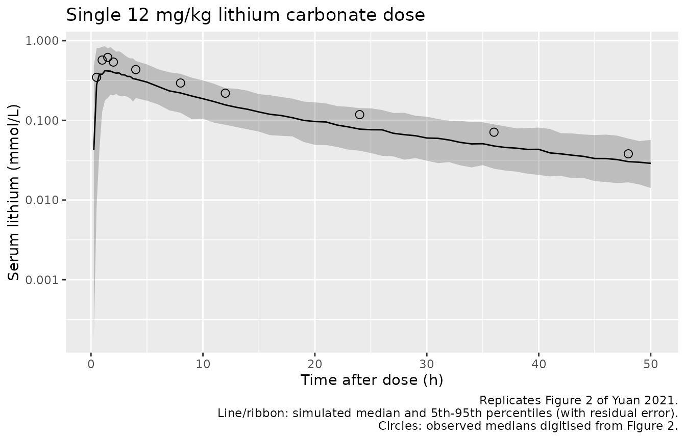
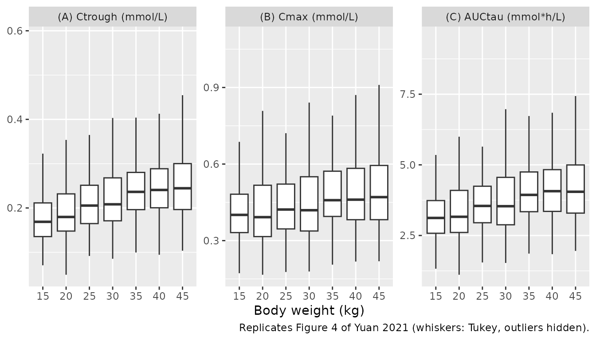

# Lithium (Yuan 2021)

## Model and source

- Citation: Yuan J, Zhang B, Xu Y, Zhang X, Song J, Zhou W, Hu K, Zhu D,
  Zhang L, Shao F, Zhang S, Ding J, Zhu C. Population Pharmacokinetics
  of Lithium in Young Pediatric Patients With Intellectual Disability.
  Front Pharmacol. 2021;12:650298. <doi:10.3389/fphar.2021.650298>.
  PMC8082156. Parameter estimates are in Table 1; the structural model
  is Figure 1; covariate equations are Methods Equations 5-7.

- Description: Two-compartment population pharmacokinetic model for
  lithium after a single oral dose of lithium carbonate (12 mg/kg) in 52
  Chinese children aged 4-10 years with intellectual disability, from
  Yuan 2021. Absorption is a chain of six transit compartments with a
  common transit rate constant ktr = (6 + 1) / MTT; relative
  bioavailability is fixed to unity with between-subject variability.
  Body weight enters as a fixed allometric function (exponent 0.75 on
  CL/F and Q/F, 1 on Vc/F and Vp/F) centred on the study-median 20 kg.
  Doses are in mmol of lithium ion (1 mg lithium carbonate = 2 / 73.89
  mmol Li) and concentrations in mmol/L; the fit was to
  baseline-subtracted (pre-dose endogenous lithium removed) serum
  concentrations.

- Article: <https://doi.org/10.3389/fphar.2021.650298> (PMC8082156, open
  access)

## Population

Yuan 2021 studied 52 Chinese children aged 4-10 years (48-128 months;
mean 84.8 +/- 21.7 months) with intellectual disability (DSM-5, IQ \<
70) and normal liver, renal and thyroid function, at the Third
Affiliated Hospital of Zhengzhou University (Results, ‘Demographics’).
Body weight was 23.0 +/- 6.2 kg (range 16-44 kg; study median 20 kg); 38
were boys and 14 girls. After a fast of at least 4 h every child
received a single oral dose of lithium carbonate of 12 mg/kg. Sixteen
children (8 boys, 8 girls) gave an intensive profile at 0.5, 1, 1.5, 2,
4, 8, 12, 24, 36 and 48 h; the other 36 gave at least three samples from
the same times, for 382 serum concentrations in total. Serum lithium was
measured by ion chromatography (LLOQ 0.00144 mmol/L) and the pre-dose
endogenous lithium concentration was subtracted before modelling.

The same information is available programmatically via
`readModelDb("Yuan_2021_lithium")()$population`.

## Source trace

Every `ini()` value carries an in-file comment in
`inst/modeldb/specificDrugs/Yuan_2021_lithium.R`. The table collects
them.

| Equation / parameter | Value | Source location |
|----|----|----|
| Structure: depot + 6 transit compartments -\> central \<-\> peripheral1 | n/a | Figure 1; Results ‘Population PK’ (two-compartment, n = 6 transit, dOFV = 261.553) |
| `ktr = (6 + 1) / mtt` | n/a | Figure 1 (common k_TR on every transfer, no separate ka); Savic 2007 convention cited in Methods |
| `lmtt` | log(0.52 h) | Table 1, MTT |
| Number of transit compartments | 6 (fixed) | Table 1 |
| `lcl` | log(0.98 L/h) | Table 1, CL/F |
| `lvc` | log(13.1 L) | Table 1, VC/F |
| `lq` | log(0.84 L/h) | Table 1, Q/F |
| `lvp` | log(8.2 L) | Table 1, Vp/F |
| `lfdepot` | fixed(log(1)) | Table 1, F = 100% fixed; Methods |
| `e_wt_cl` | fixed(0.75) | Methods Equation 5 (CL/F, Q/F), reference 20 kg |
| `e_wt_vc` | fixed(1) | Methods Equation 6 (Vc/F, Vp/F), reference 20 kg |
| `etalfdepot` | 0.0878360 (30.3% CV) | Table 1, ‘CV for IIV’ |
| `etalmtt` | 0.3524159 (65.0% CV) | Table 1, ‘CV for IIV’ |
| `etalvc` | 0.0678689 (26.5% CV) | Table 1, ‘CV for IIV’ |
| `etalvp` | 0.8791989 (118.7% CV) | Table 1, ‘CV for IIV’ |
| No IIV on CL/F, Q/F | n/a | Results ‘Population PK’ (CL IIV RSE 195%; Q IIV near zero) |
| `expSd` | 0.091 | Table 1, sigma (‘additive residue error on a log scale’); Methods Equation 2 |
| `Cc ~ lnorm(expSd)` | n/a | Methods Equation 2 (additive on log scale = exponential) |

IIV variances are converted from the Table 1 %CV as
`omega^2 = log(CV^2 + 1)`.

## Single-dose simulation (Figure 2)

The virtual cohort draws body weight from a normal distribution with the
published mean and SD (23.0 +/- 6.2 kg), redrawing any value outside the
observed 16-44 kg range, and doses 12 mg/kg lithium carbonate. The model
works in mmol of lithium ion: lithium carbonate (Li2CO3, 73.89 g/mol)
carries two lithium ions, so 1 mg lithium carbonate = 2 / 73.89 =
0.02707 mmol Li.

``` r

mg_li2co3_to_mmol_li <- function(mg) mg * 2 / 73.89

draw_weight <- function(n, mean = 23.0, sd = 6.2, lower = 16, upper = 44) {
  wt <- rnorm(n, mean, sd)
  bad <- wt < lower | wt > upper
  while (any(bad)) {
    wt[bad] <- rnorm(sum(bad), mean, sd)
    bad <- wt < lower | wt > upper
  }
  wt
}

set.seed(20210415)
n_sd <- 200
cohort_sd <- tibble(id = seq_len(n_sd), WT = draw_weight(n_sd))
stopifnot(all(cohort_sd$WT >= 16 & cohort_sd$WT <= 44))

obs_sd <- sort(unique(c(0, seq(0.25, 4, by = 0.25), seq(5, 96, by = 1))))
events_sd <- bind_rows(
  cohort_sd |>
    mutate(time = 0, evid = 1L, cmt = "depot",
           amt = mg_li2co3_to_mmol_li(12 * WT)),
  tidyr::crossing(cohort_sd, time = obs_sd) |>
    mutate(evid = 0L, cmt = "central", amt = 0)
) |>
  mutate(treatment = "12 mg/kg single dose") |>
  arrange(id, time, desc(evid))
```

``` r

mod <- readModelDb("Yuan_2021_lithium")
rxode2::rxSetSeed(20210415)
sim_sd <- rxode2::rxSolve(mod, events = events_sd, keep = c("WT", "treatment")) |>
  as.data.frame()
```

Figure 2 of Yuan 2021 is a VPC of the observed single-dose data. The
observed medians below were digitised by the maintainers from Figure 2
(log axis, approximately +/-5%).

``` r

obs_fig2 <- tibble::tribble(
  ~time, ~p50,
  0.5, 0.347,
  1, 0.571,
  1.5, 0.616,
  2, 0.539,
  4, 0.434,
  8, 0.294,
  12, 0.219,
  24, 0.118,
  36, 0.071,
  48, 0.038
)

vpc_sd <- sim_sd |>
  filter(time > 0, time <= 50) |>
  group_by(time) |>
  summarise(
    Q05 = quantile(sim, 0.05),
    Q50 = quantile(sim, 0.50),
    Q95 = quantile(sim, 0.95),
    .groups = "drop"
  )

ggplot(vpc_sd, aes(time, Q50)) +
  geom_ribbon(aes(ymin = Q05, ymax = Q95), alpha = 0.25) +
  geom_line() +
  geom_point(data = obs_fig2, aes(time, p50), shape = 21, size = 2.5) +
  scale_y_log10() +
  labs(
    x = "Time after dose (h)", y = "Serum lithium (mmol/L)",
    title = "Single 12 mg/kg lithium carbonate dose",
    caption = paste(
      "Replicates Figure 2 of Yuan 2021.",
      "Line/ribbon: simulated median and 5th-95th percentiles (with residual error).",
      "Circles: observed medians digitised from Figure 2.",
      sep = "\n"
    )
  )
```



``` r

# Typical 20-kg child (no random effects) for the comparison in the text.
typ_sd <- rxode2::rxSolve(
  rxode2::zeroRe(mod),
  events = rxode2::et(amt = mg_li2co3_to_mmol_li(12 * 20), cmt = "depot") |>
    rxode2::et(c(1.5, 12), cmt = "central"),
  params = c(WT = 20)
) |>
  as.data.frame()
#> ℹ omega/sigma items treated as zero: 'etalfdepot', 'etalmtt', 'etalvc', 'etalvp'
typ_c <- setNames(typ_sd$Cc, typ_sd$time)

sim_at_obs <- vpc_sd |>
  inner_join(obs_fig2, by = "time") |>
  mutate(ratio = Q50 / p50)
sim_at_obs |>
  select(time, p50, Q50, ratio) |>
  rename(
    "Time (h)" = time,
    "Observed median, Figure 2 (mmol/L)" = p50,
    "Simulated median (mmol/L)" = Q50,
    "Simulated / observed" = ratio
  ) |>
  knitr::kable(digits = 3)
```

| Time (h) | Observed median, Figure 2 (mmol/L) | Simulated median (mmol/L) | Simulated / observed |
|---:|---:|---:|---:|
| 0.5 | 0.347 | 0.279 | 0.805 |
| 1.0 | 0.571 | 0.379 | 0.664 |
| 1.5 | 0.616 | 0.417 | 0.676 |
| 2.0 | 0.539 | 0.400 | 0.743 |
| 4.0 | 0.434 | 0.329 | 0.758 |
| 8.0 | 0.294 | 0.221 | 0.750 |
| 12.0 | 0.219 | 0.156 | 0.714 |
| 24.0 | 0.118 | 0.078 | 0.658 |
| 36.0 | 0.071 | 0.048 | 0.672 |
| 48.0 | 0.038 | 0.030 | 0.798 |

The simulated median sits below the observed median at every time point
(ratio 0.66-0.80), and the paper’s own VPC shows the same offset: its
simulated-median confidence bands in Figure 2 lie at roughly 0.44-0.60
mmol/L over 0-3 h and 0.16-0.24 mmol/L over 10-18 h, versus the 0.43 and
0.15 mmol/L this model gives for a typical 20-kg child at 1.5 h and 12
h. The paper’s own steady-state simulation (Figure 4, next section) is
reproduced to within a few percent, so the Table 1 parameters and the
dose unit are consistent with each other; the offset against Figure 2 is
therefore attributed to the doses actually given in the study (not
printed per child; the Methods say only that the dose ‘was adjusted to
12 mg/kg’) and is recorded as a known deviation rather than gated.

## Steady-state simulation by body weight (Figure 4)

Yuan 2021 simulated a loading dose of 12 mg/kg lithium carbonate
followed by 6 mg/kg every 12 h for 10 days, in weight groups of 15-45
kg, and reported the steady-state trough, Cmax and AUC over a dosing
interval (Figure 4). The maintenance doses here start at 12 h, so the
last (20th) maintenance dose is at 240 h and the steady-state interval
is 240-252 h. 200 children per weight group.

``` r

wt_groups <- seq(15, 45, by = 5)
n_per <- 200
cohort_ss <- tibble(
  id = seq_len(n_per * length(wt_groups)),
  WT = rep(wt_groups, each = n_per)
) |>
  mutate(treatment = paste0(WT, " kg"))

dose_ss <- bind_rows(
  cohort_ss |> mutate(time = 0, amt = mg_li2co3_to_mmol_li(12 * WT)),
  tidyr::crossing(cohort_ss, time = seq(12, 240, by = 12)) |>
    mutate(amt = mg_li2co3_to_mmol_li(6 * WT))
) |>
  mutate(evid = 1L, cmt = "depot")

obs_ss <- tidyr::crossing(cohort_ss, time = c(0, seq(240, 252, by = 0.1))) |>
  mutate(evid = 0L, cmt = "central", amt = 0)

events_ss <- bind_rows(dose_ss, obs_ss) |>
  mutate(time = round(time, 6)) |>
  arrange(id, time, desc(evid))
stopifnot(!anyDuplicated(unique(events_ss[, c("id", "time", "evid")])))
```

``` r

rxode2::rxSetSeed(20210416)
sim_ss <- rxode2::rxSolve(mod, events = events_ss, keep = c("WT", "treatment")) |>
  as.data.frame()
```

Times are re-referenced to the last maintenance dose so the steady-state
interval is \[0, 12\] h; PKNCA’s `ctrough` needs a record exactly at the
interval end, which is only reliable on this relative scale.

``` r

t_dose_ss <- 240
conc_ss <- sim_ss |>
  filter(!is.na(Cc)) |>
  filter(time >= t_dose_ss) |>
  mutate(time = round(time - t_dose_ss, 6), Cc = pmax(Cc, 0)) |>
  select(id, time, Cc, treatment)
stopifnot(sum(conc_ss$time == 0) == nrow(cohort_ss))
stopifnot(sum(conc_ss$time == 12) == nrow(cohort_ss))

dose_ss_nca <- events_ss |>
  filter(evid == 1, time == t_dose_ss) |>
  mutate(time = 0) |>
  select(id, time, amt, treatment)

conc_obj_ss <- PKNCA::PKNCAconc(conc_ss, Cc ~ time | treatment + id)
dose_obj_ss <- PKNCA::PKNCAdose(dose_ss_nca, amt ~ time | treatment + id)
intervals_ss <- data.frame(
  start = 0, end = 12,
  cmax = TRUE, ctrough = TRUE, auclast = TRUE
)
nca_ss <- PKNCA::pk.nca(
  PKNCA::PKNCAdata(conc_obj_ss, dose_obj_ss, intervals = intervals_ss)
)
nca_ss_df <- as.data.frame(nca_ss)
```

``` r

nca_ss_df |>
  filter(PPTESTCD %in% c("ctrough", "cmax", "auclast")) |>
  mutate(
    WT = as.numeric(sub(" kg", "", treatment)),
    PPTESTCD = factor(
      PPTESTCD,
      levels = c("ctrough", "cmax", "auclast"),
      labels = c("(A) Ctrough (mmol/L)", "(B) Cmax (mmol/L)", "(C) AUCtau (mmol*h/L)")
    )
  ) |>
  ggplot(aes(factor(WT), PPORRES)) +
  geom_boxplot(outlier.shape = NA) +
  facet_wrap(~PPTESTCD, scales = "free_y") +
  labs(
    x = "Body weight (kg)", y = NULL,
    caption = "Replicates Figure 4 of Yuan 2021 (whiskers: Tukey, outliers hidden)."
  )
```



### Comparison against published steady-state exposures

The Figure 4 box medians were digitised by the maintainers from the
source raster by locating each box’s median bar and the panel gridlines
(pixel precision about 0.001 mmol/L for panels A-B and 0.015 mmol\*h/L
for panel C).

``` r

published_fig4 <- tibble::tibble(
  treatment = paste0(wt_groups, " kg"),
  ctrough = c(0.170, 0.186, 0.199, 0.205, 0.220, 0.230, 0.239),
  cmax = c(0.444, 0.446, 0.462, 0.464, 0.473, 0.489, 0.491),
  auclast = c(3.045, 3.318, 3.462, 3.554, 3.705, 3.918, 4.001)
)

cmp <- nlmixr2lib::ncaComparisonTable(
  simulated = nca_ss,
  reference = published_fig4,
  by = "treatment",
  units = c(ctrough = "mmol/L", cmax = "mmol/L", auclast = "mmol*h/L"),
  tolerance_pct = 20
)
knitr::kable(cmp, caption = "Simulated vs. Figure 4 medians. * differs by >20%.")
```

| NCA parameter       | treatment | Reference | Simulated | % diff |
|:--------------------|:----------|:----------|:----------|:-------|
| Cmax (mmol/L)       | 15 kg     | 0.444     | 0.401     | -9.7%  |
| Cmax (mmol/L)       | 20 kg     | 0.446     | 0.392     | -12.1% |
| Cmax (mmol/L)       | 25 kg     | 0.462     | 0.422     | -8.7%  |
| Cmax (mmol/L)       | 30 kg     | 0.464     | 0.419     | -9.7%  |
| Cmax (mmol/L)       | 35 kg     | 0.473     | 0.458     | -3.1%  |
| Cmax (mmol/L)       | 40 kg     | 0.489     | 0.461     | -5.8%  |
| Cmax (mmol/L)       | 45 kg     | 0.491     | 0.47      | -4.2%  |
| AUClast (mmol\*h/L) | 15 kg     | 3.04      | 3.12      | +2.5%  |
| AUClast (mmol\*h/L) | 20 kg     | 3.32      | 3.16      | -4.7%  |
| AUClast (mmol\*h/L) | 25 kg     | 3.46      | 3.55      | +2.4%  |
| AUClast (mmol\*h/L) | 30 kg     | 3.55      | 3.54      | -0.5%  |
| AUClast (mmol\*h/L) | 35 kg     | 3.7       | 3.94      | +6.3%  |
| AUClast (mmol\*h/L) | 40 kg     | 3.92      | 4.07      | +3.8%  |
| AUClast (mmol\*h/L) | 45 kg     | 4         | 4.05      | +1.2%  |
| Ctrough (mmol/L)    | 15 kg     | 0.17      | 0.169     | -0.7%  |
| Ctrough (mmol/L)    | 20 kg     | 0.186     | 0.18      | -3.4%  |
| Ctrough (mmol/L)    | 25 kg     | 0.199     | 0.205     | +3.2%  |
| Ctrough (mmol/L)    | 30 kg     | 0.205     | 0.208     | +1.6%  |
| Ctrough (mmol/L)    | 35 kg     | 0.22      | 0.236     | +7.4%  |
| Ctrough (mmol/L)    | 40 kg     | 0.23      | 0.241     | +4.6%  |
| Ctrough (mmol/L)    | 45 kg     | 0.239     | 0.244     | +2.3%  |

Simulated vs. Figure 4 medians. \* differs by \>20%. {.table}

``` r

sim_med <- nca_ss_df |>
  filter(PPTESTCD %in% c("ctrough", "cmax", "auclast")) |>
  group_by(treatment, PPTESTCD) |>
  summarise(sim = median(PPORRES), .groups = "drop")
chk <- published_fig4 |>
  pivot_longer(-treatment, names_to = "PPTESTCD", values_to = "ref") |>
  inner_join(sim_med, by = c("treatment", "PPTESTCD")) |>
  mutate(pct_diff = 100 * (sim / ref - 1))
stopifnot(nrow(chk) == 3 * length(wt_groups))

pct <- function(code) chk$pct_diff[chk$PPTESTCD == code]
# AUCtau and Ctrough carry the dose unit, CL/F, the allometry and the
# transit/disposition structure. A group median of 200 subjects has a
# sampling SE of about 3% (F IIV 30% CV), so 12% per group is 4 SE; a
# mis-transcribed clearance, volume or mg->mmol factor moves every group by
# tens of percent and fails the centre check at once.
stopifnot(
  abs(median(pct("auclast"))) < 5,
  max(abs(pct("auclast"))) < 12,
  abs(median(pct("ctrough"))) < 7,
  max(abs(pct("ctrough"))) < 15
)
# Cmax: the simulated value is the noise-free individual prediction on a
# 0.1-h grid; Figure 4 most likely includes the log-scale residual error,
# which raises the maximum of a set of noisy samples (see the discussion
# below). Gate the centre only, one-sided wide enough for that offset.
stopifnot(median(pct("cmax")) > -25, median(pct("cmax")) < 10)
chk |>
  group_by(PPTESTCD) |>
  summarise(
    median_pct_diff = median(pct_diff),
    max_abs_pct_diff = max(abs(pct_diff)),
    .groups = "drop"
  ) |>
  knitr::kable(digits = 1)
```

| PPTESTCD | median_pct_diff | max_abs_pct_diff |
|:---------|----------------:|-----------------:|
| auclast  |             2.4 |              6.3 |
| cmax     |            -8.7 |             12.1 |
| ctrough  |             2.3 |              7.4 |

AUC over the steady-state dosing interval and the trough reproduce
Figure 4 within a few percent in every weight group, including the
upward drift with body weight that follows from per-kg dosing against a
clearance that scales with weight^0.75. The simulated Cmax is below the
Figure 4 medians by a median of 9%. The Discussion reports a
steady-state Cmax of 0.47 mmol/L (95% interval 0.23-0.99). The simulated
noise-free Cmax pooled over all weight groups is 0.44 mmol/L
(0.23-0.76). The paper does not say whether its Cmax includes residual
error or on what time grid it was taken. Adding the Table 1 residual
error (log-scale SD 0.091) and taking the maximum of the noisy 0.1-h
profile raises the median above the published value, so the two readings
bracket it:

``` r

cmax_ruv <- sim_ss |>
  filter(time >= 240, time <= 252) |>
  group_by(id) |>
  summarise(cmax_sim = max(sim), .groups = "drop")
cmax_ipred_med <- median(nca_ss_df$PPORRES[nca_ss_df$PPTESTCD == "cmax"])
# The bracket claimed in the text. Each side sits ~6% from 0.47 against a
# pooled-median sampling SE of ~1% (1400 subjects).
stopifnot(cmax_ipred_med < 0.47, median(cmax_ruv$cmax_sim) > 0.47)
knitr::kable(
  tibble(
    Quantity = c("Cmax, individual prediction", "Cmax, with residual error (0.1-h grid)", "Published (Discussion)"),
    `Median (mmol/L)` = c(
      median(nca_ss_df$PPORRES[nca_ss_df$PPTESTCD == "cmax"]),
      median(cmax_ruv$cmax_sim),
      0.47
    )
  ),
  digits = 2
)
```

| Quantity                               | Median (mmol/L) |
|:---------------------------------------|----------------:|
| Cmax, individual prediction            |            0.44 |
| Cmax, with residual error (0.1-h grid) |            0.50 |
| Published (Discussion)                 |            0.47 |

## Single-dose NCA and half-life

``` r

conc_sd <- sim_sd |>
  filter(!is.na(Cc)) |>
  mutate(Cc = pmax(Cc, 0)) |>
  select(id, time, Cc, treatment)
dose_sd <- events_sd |>
  filter(evid == 1) |>
  select(id, time, amt, treatment)
nca_sd <- PKNCA::pk.nca(
  PKNCA::PKNCAdata(
    PKNCA::PKNCAconc(conc_sd, Cc ~ time | treatment + id),
    PKNCA::PKNCAdose(dose_sd, amt ~ time | treatment + id),
    intervals = data.frame(
      start = 0, end = Inf,
      cmax = TRUE, tmax = TRUE, aucinf.obs = TRUE, half.life = TRUE
    )
  )
)
summary(nca_sd)
#>  start end            treatment   N         cmax               tmax   half.life
#>      0 Inf 12 mg/kg single dose 200 0.452 [41.2] 1.00 [0.250, 4.00] 27.6 [22.1]
#>   aucinf.obs
#>  7.01 [30.7]
#> 
#> Caption: cmax, aucinf.obs: geometric mean and geometric coefficient of variation; tmax: median and range; half.life: arithmetic mean and standard deviation; N: number of subjects
```

The Discussion reports an ‘average half-life estimate’ of 19.1 h. The
terminal half-life of a typical 20-kg child follows in closed form from
the Table 1 disposition parameters (it lengthens with body weight as
weight^0.25, because clearances scale with weight^0.75 and volumes with
weight):

``` r

k10 <- 0.98 / 13.1
k12 <- 0.84 / 13.1
k21 <- 0.84 / 8.2
beta <- ((k10 + k12 + k21) - sqrt((k10 + k12 + k21)^2 - 4 * k10 * k21)) / 2
thalf_typical <- log(2) / beta
thalf_sim <- as.data.frame(nca_sd) |>
  filter(PPTESTCD == "half.life")
knitr::kable(
  tibble(
    Quantity = c(
      "Typical terminal half-life, 20 kg (closed form)",
      "Simulated cohort, median of PKNCA half-life",
      "Simulated cohort, mean of PKNCA half-life",
      "Published average (Discussion)"
    ),
    `Half-life (h)` = c(
      thalf_typical, median(thalf_sim$PPORRES, na.rm = TRUE),
      mean(thalf_sim$PPORRES, na.rm = TRUE), 19.1
    )
  ),
  digits = 1
)
```

| Quantity                                        | Half-life (h) |
|:------------------------------------------------|--------------:|
| Typical terminal half-life, 20 kg (closed form) |          18.4 |
| Simulated cohort, median of PKNCA half-life     |          19.6 |
| Simulated cohort, mean of PKNCA half-life       |          27.6 |
| Published average (Discussion)                  |          19.1 |

``` r

# Closed form, no simulation noise: a wrong CL, Vc, Q or Vp moves this far
# more than 10%.
stopifnot(abs(thalf_typical / 19.1 - 1) < 0.10)
```

### Typical-value mass balance

For a typical 20-kg child (no random effects), `CL/F * AUC(0-inf)` must
equal the dose because F is fixed to 1.

``` r

ev_typ <- rxode2::et(amt = mg_li2co3_to_mmol_li(12 * 20), cmt = "depot") |>
  rxode2::et(seq(0, 600, by = 0.05), cmt = "central")
typ <- rxode2::rxSolve(
  rxode2::zeroRe(mod), events = ev_typ, params = c(WT = 20),
  rtol = 1e-10, atol = 1e-12
) |>
  as.data.frame()
#> ℹ omega/sigma items treated as zero: 'etalfdepot', 'etalmtt', 'etalvc', 'etalvp'
auc_typ <- sum(diff(typ$time) * (head(typ$Cc, -1) + tail(typ$Cc, -1)) / 2)
auc_tail <- tail(typ$Cc, 1) / beta
dose_typ <- mg_li2co3_to_mmol_li(12 * 20)
mass_balance <- 0.98 * (auc_typ + auc_tail) / dose_typ
mass_balance
#> [1] 1
# Trapezoid error on a 0.05-h grid is < 0.1%; a structural error (a
# transit leak, a wrong F, a mis-scaled volume) moves this by far more.
stopifnot(abs(mass_balance - 1) < 0.002)
```

## Assumptions and deviations

- **Dose unit.** The paper doses lithium carbonate in mg/kg and reports
  concentrations in mmol/L without printing the conversion. The model
  takes doses in mmol of lithium ion, 1 mg Li2CO3 = 2 / 73.89 mmol. This
  is the conversion under which the Table 1 CL/F reproduces the Figure 4
  AUC over a dosing interval (3.31 mmol\*h/L predicted for a 20-kg
  child, 3.32 digitised).
- **Transit-rate convention.** Table 1 gives MTT and ‘Number of transit
  compartment = 6’ but no transit rate constant. Figure 1 draws the dose
  entering the chain through a k_TR arrow and every transfer, including
  the last into the central compartment, at the same k_TR, so the model
  has a dosing compartment plus six transit compartments (seven
  transfers) with `ktr = 7 / MTT`, the Savic 2007 convention the Methods
  cite. The alternative readings (dose into the first transit
  compartment with `ktr = 6 / MTT` or `7 / MTT`) change the steady-state
  Cmax by less than 1% and the trough not at all.
- **Residual error.** Table 1 prints the residual as sigma = 0.091 for
  an additive error on log-transformed concentrations; the Methods
  define the residual variance as sigma^2, so 0.091 is used as the
  log-scale SD. Read as a variance (SD 0.30), the steady-state Cmax with
  residual error would exceed the published 95% upper bound (0.99
  mmol/L).
- **IIV transform.** The Table 1 footnote prints the %CV as ‘100 x
  (e^(variance))(1/2)’, which would make every CV at least 100%; the
  standard `100 * sqrt(exp(omega^2) - 1)` is assumed, so
  `omega^2 = log(CV^2 + 1)`.
- **Bioavailability IIV.** F is fixed to 1 with exponential IIV (Methods
  Equation 1), so individual F can exceed 1, as in the source model.
- **Baseline lithium.** The model describes the dose-derived lithium
  concentration only; the paper subtracted each child’s pre-dose
  endogenous lithium before fitting, so add a measured baseline if
  comparing with total serum lithium.
- **Figure 2 offset.** Simulated single-dose medians are below the
  observed medians digitised from Figure 2 (see the table above); the
  paper’s own VPC median band shows the same offset. It is not gated.
- **Virtual cohort.** Body weights are drawn from a normal distribution
  with the published mean and SD, redrawn outside the observed 16-44 kg
  range; the paper does not give the weight distribution beyond these
  summaries. Age and sex do not enter the final model.
- **Covariates not retained.** Age-dependent maturation of clearance
  (Methods Equation 7) and sex (Equation 8) were tested and not
  retained; no coefficients are reported. They are recorded in
  `covariatesDataExcluded`.
- No erratum or correction notice for this article was found in Europe
  PMC (PMID 33935755) as of 2026-09-28, and the article has no
  supplementary material.
