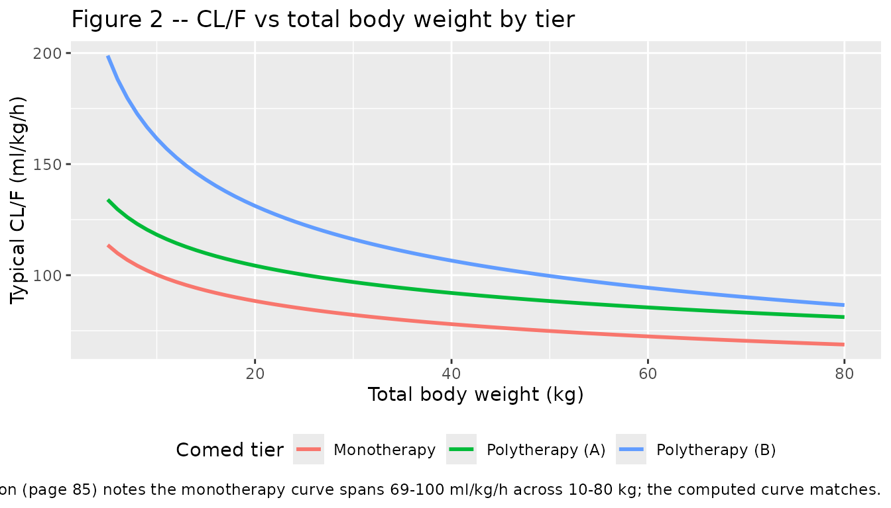
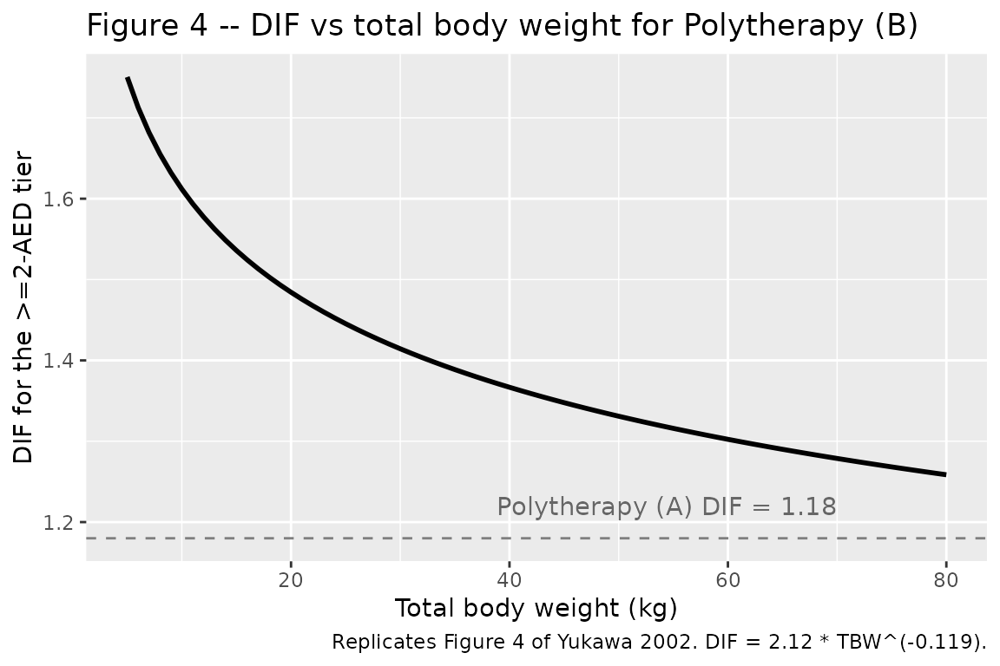

# Clonazepam pediatric (Yukawa 2002)

## Model and source

- Citation: Yukawa E, Satou M, Nonaka T, Yukawa M, Ohdo S, Higuchi S,
  Kuroda T, Goto Y. Pharmacoepidemiologic investigation of clonazepam
  relative clearance by mixed-effect modeling using routine clinical
  pharmacokinetic data in Japanese patients. J Clin Pharmacol.
  2002;42(1):81-88.
- Description: Steady-state population PK model for clonazepam relative
  clearance (CL/F) in 137 Japanese pediatric and adult epileptic
  patients (Yukawa 2002 Table III row 4). CL/F is a body-weight power
  function with a 3-tier drug-interaction factor for concomitant
  antiepileptic drugs (monotherapy, +1 AED (CBZ or VPA), +\>=2 AEDs).
- Article: Yukawa et al., *J Clin Pharmacol* 2002;42(1):81-88.

## Population

The Yukawa 2002 cohort comprised 137 unique Japanese epileptic patients
contributing 259 steady-state serum clonazepam concentrations (Table II,
page 83). Patients had been on chronic oral clonazepam for at least one
month before the analysis window, with two or three divided doses per
day (tablet or fine-granule preparation) and routine TDM sampling at 2-6
hours post-morning-dose. Patient-periods are stratified by concomitant
antiepileptic drug (AED) co-medication:

| Tier | Patient-periods | Observations | Weight (kg, mean +/- SD) | Daily dose (ug/kg/d, mean +/- SD) |
|----|----|----|----|----|
| Monotherapy | 31 | 53 | 31.3 +/- 16.9 | 33.6 +/- 19.9 |
| Polytherapy (A): CZP + {CBZ, VPA} | 62 | 95 | 24.5 +/- 13.8 | 38.3 +/- 20.9 |
| Polytherapy (B): CZP + \>=2 AEDs | 67 | 111 | 34.7 +/- 17.0 | 44.9 +/- 26.0 |

The 137 unique patients sum across regimen-change occasions to 160
patient- periods. Age span 0.3-28 years across the three tiers; all
subjects had normal renal and hepatic function. The full population
metadata is exposed programmatically via
`readModelDb("Yukawa_2002_clonazepam_pediatric")$population`.

## Source trace

Every `ini()` parameter carries an in-file comment pointing to its
source location in
`inst/modeldb/specificDrugs/Yukawa_2002_clonazepam_pediatric.R`; the
table below collects them.

| Equation / parameter | Value | Source location |
|----|----|----|
| `lcl` (theta1) | log(152) | Results page 84 / Table III row 4 (‘CL = theta1 \* TBW^theta2 \* DIF’) |
| `e_wt_cl` (theta2) | -0.181 (fixed) | Results page 84 / Table III row 4 |
| `e_conmed_aed_cl` (theta3) | 1.18 (fixed) | Results page 84 / Table III row 4 |
| `e_conmed_aed_ge2_cl` (theta4) | 2.12 (fixed) | Results page 84 / Table III row 4 |
| `e_wt_cl_conmed_aed_ge2` (theta5) | -0.119 (fixed) | Results page 84 / Table III row 4 |
| `lvc` | log(210) (fixed) | NOT from paper; clonazepam literature ~3 L/kg, 70 kg adult |
| `lka` | log(1.5) (fixed) | NOT from paper; clonazepam Tmax 1-4 h per Discussion (page 7) |
| IIV `etalcl` (omega_CL) | 0.0404 | Results page 84 (‘CV(CL) = 20.1% (95% CI 15.0-24.2)’) |
| Residual `propSd` (sigma_E) | 0.186 | Results page 84 (‘CV(residual) = 18.6% (95% CI 15.4-21.4)’) |
| Structural Eq. | CL = theta1*TBW^theta2*DIF | Methods page 83 + Results page 84 |
| DIF tier-1 | DIF = 1.18 | Results page 84 |
| DIF tier-2 | DIF = 2.12\*TBW^-0.119 | Results page 84 |
| Residual error model | Css = Css_pred \* (1 + epsilon) | Methods page 83 |

## Virtual cohort

The published trial data are not available; the simulated cohort below
samples body weights from each tier’s reported normal-ish distribution
(Table II), truncated to the observed range. Daily doses are sampled
from the tier-mean +/- SD reported in Table II, divided TID (q8h) per
the paper’s “two to three times a day” prescribing pattern.

``` r

set.seed(20020181L)

n_per_tier <- 100L

make_cohort <- function(tier, n, wt_mean, wt_sd, wt_min, wt_max,
                        dose_mean_ugkgd, dose_sd_ugkgd,
                        conmed_aed, conmed_aed_ge2, id_offset = 0L) {
  wt <- pmin(pmax(rnorm(n, wt_mean, wt_sd), wt_min), wt_max)
  daily_dose_ugkgd <- pmax(rnorm(n, dose_mean_ugkgd, dose_sd_ugkgd), 5.0)
  total_daily_mg   <- daily_dose_ugkgd * wt / 1000  # ug/kg/d * kg / 1000 -> mg/d
  per_dose_mg      <- total_daily_mg / 3            # TID
  tibble(
    id              = id_offset + seq_len(n),
    tier            = tier,
    WT              = wt,
    CONMED_AED      = conmed_aed,
    CONMED_AED_GE2  = conmed_aed_ge2,
    per_dose_mg     = per_dose_mg,
    daily_dose_ugkgd = daily_dose_ugkgd
  )
}

cohort <- bind_rows(
  make_cohort("Monotherapy",       n_per_tier, 31.3, 16.9, 5.5, 66.8, 33.6, 19.9, 0L, 0L, id_offset =   0L),
  make_cohort("Polytherapy (A)",   n_per_tier, 24.5, 13.8, 7.0, 75.0, 38.3, 20.9, 1L, 0L, id_offset = 100L),
  make_cohort("Polytherapy (B)",   n_per_tier, 34.7, 17.0, 6.0, 74.5, 44.9, 26.0, 1L, 1L, id_offset = 200L)
)

cohort_summary <- cohort |>
  group_by(tier) |>
  summarise(
    n             = n(),
    wt_mean       = mean(WT),
    wt_sd         = stats::sd(WT),
    dose_ugkgd    = mean(daily_dose_ugkgd),
    .groups       = "drop"
  )
knitr::kable(
  cohort_summary,
  digits  = 1,
  caption = "Virtual cohort baseline (matches Yukawa 2002 Table II within rounding)."
)
```

| tier            |   n | wt_mean | wt_sd | dose_ugkgd |
|:----------------|----:|--------:|------:|-----------:|
| Monotherapy     | 100 |    31.6 |  14.9 |       33.7 |
| Polytherapy (A) | 100 |    23.4 |  11.3 |       40.6 |
| Polytherapy (B) | 100 |    34.2 |  14.5 |       44.8 |

Virtual cohort baseline (matches Yukawa 2002 Table II within rounding).
{.table}

The event table simulates a steady-state q8h dose using
`rxode2::et(ss = 1)` so each subject’s `depot` and `central` start at
their steady-state values before the dose at time 0. Concentrations are
sampled across the \[0, 8 h\] dosing interval at 0.1 h resolution to
give PKNCA a dense profile.

``` r

sample_grid <- seq(0, 8, by = 0.1)

events <- cohort |>
  rowwise() |>
  do({
    one <- as.data.frame(.)
    et <- rxode2::et(amt = one$per_dose_mg, cmt = "depot", ii = 8, ss = 1) |>
      rxode2::et(sample_grid)
    df <- as.data.frame(et)
    df$id              <- one$id
    df$tier            <- one$tier
    df$WT              <- one$WT
    df$CONMED_AED      <- one$CONMED_AED
    df$CONMED_AED_GE2  <- one$CONMED_AED_GE2
    df$per_dose_mg     <- one$per_dose_mg
    df
  }) |>
  ungroup() |>
  as.data.frame()

stopifnot(!anyDuplicated(unique(events[, c("id", "time", "evid")])))
head(events, 5)
#>   time   cmt       amt ii evid ss id        tier       WT CONMED_AED
#> 1  0.0  <NA>        NA NA    0 NA  1 Monotherapy 40.16872          0
#> 2  0.0 depot 0.8144039  8    1  1  1 Monotherapy 40.16872          0
#> 3  0.1  <NA>        NA NA    0 NA  1 Monotherapy 40.16872          0
#> 4  0.2  <NA>        NA NA    0 NA  1 Monotherapy 40.16872          0
#> 5  0.3  <NA>        NA NA    0 NA  1 Monotherapy 40.16872          0
#>   CONMED_AED_GE2 per_dose_mg
#> 1              0   0.8144039
#> 2              0   0.8144039
#> 3              0   0.8144039
#> 4              0   0.8144039
#> 5              0   0.8144039
```

## Simulation

``` r

mod <- readModelDb("Yukawa_2002_clonazepam_pediatric")

sim <- rxode2::rxSolve(
  mod,
  events,
  keep = c("tier", "WT", "CONMED_AED", "CONMED_AED_GE2", "per_dose_mg")
) |>
  as.data.frame()
#> ℹ parameter labels from comments will be replaced by 'label()'

head(sim |> dplyr::filter(time > 0) |> dplyr::select(id, time, Cc, tier, WT), 5)
#>   id time       Cc        tier       WT
#> 1  1  0.1 32.46816 Monotherapy 40.16872
#> 2  1  0.2 32.88592 Monotherapy 40.16872
#> 3  1  0.3 33.23835 Monotherapy 40.16872
#> 4  1  0.4 33.53457 Monotherapy 40.16872
#> 5  1  0.5 33.78243 Monotherapy 40.16872
```

## Replicate published figures

### Figure 2 – Clearance vs total body weight by tier

Figure 2 of Yukawa 2002 (page 85) plots typical CL (ml/kg/h) against
total body weight for the three comed tiers. We reconstruct it directly
from the model’s typical-value formula, varying TBW from 5 to 80 kg.

``` r

fig2 <- tidyr::expand_grid(
  WT   = seq(5, 80, by = 1),
  tier = c("Monotherapy", "Polytherapy (A)", "Polytherapy (B)")
) |>
  dplyr::mutate(
    dif = dplyr::case_when(
      tier == "Monotherapy"     ~ 1,
      tier == "Polytherapy (A)" ~ 1.18,
      tier == "Polytherapy (B)" ~ 2.12 * WT^(-0.119)
    ),
    cl_per_kg = 152 * WT^(-0.181) * dif  # ml/kg/h (paper's parameterisation)
  )

ggplot(fig2, aes(WT, cl_per_kg, color = tier)) +
  geom_line(linewidth = 1) +
  labs(
    x       = "Total body weight (kg)",
    y       = "Typical CL/F (ml/kg/h)",
    color   = "Comed tier",
    title   = "Figure 2 -- CL/F vs total body weight by tier",
    caption = "Replicates Figure 2 of Yukawa 2002. Paper Discussion (page 85) notes the monotherapy curve spans 69-100 ml/kg/h across 10-80 kg; the computed curve matches."
  ) +
  theme(legend.position = "bottom")
```



The monotherapy curve crosses 100 ml/kg/h at TBW = 10 kg and 69 ml/kg/h
at TBW = 80 kg, matching the paper’s narrative on page 85.

### Figure 4 – Drug-interaction factor vs body weight for the \>=2-AED tier

``` r

fig4 <- tibble(WT = seq(5, 80, by = 1)) |>
  dplyr::mutate(dif_ge2 = 2.12 * WT^(-0.119))

ggplot(fig4, aes(WT, dif_ge2)) +
  geom_line(linewidth = 1) +
  geom_hline(yintercept = 1.18, linetype = "dashed", color = "grey50") +
  annotate("text", x = 70, y = 1.22, label = "Polytherapy (A) DIF = 1.18", color = "grey40", hjust = 1) +
  labs(
    x       = "Total body weight (kg)",
    y       = "DIF for the >=2-AED tier",
    title   = "Figure 4 -- DIF vs total body weight for Polytherapy (B)",
    caption = "Replicates Figure 4 of Yukawa 2002. DIF = 2.12 * TBW^(-0.119)."
  )
```



The polytherapy-B DIF descends from ~1.66 at 5 kg through ~1.43 at 30 kg
to ~1.31 at 70 kg, intersecting the polytherapy-A DIF = 1.18 plateau
outside the observed weight range; in the cohort the \>=2-AED tier
always carries the larger comed factor.

## PKNCA validation

At steady state with constant TID dosing and `F = 1`, AUC0-tau equals
`per_dose_mg / cl`, so PKNCA-derived AUC0-tau back-recovers each
subject’s realised total CL. We compute simulated CL from
`dose / AUC0-tau` and compare against each subject’s paper-predicted
typical CL.

``` r

sim_nca <- sim |>
  dplyr::filter(!is.na(Cc)) |>
  dplyr::select(id, time, Cc, tier, WT, per_dose_mg)

# Guarantee a time=0 row per (id, tier); for SS the row already exists at t=0,
# but the bind_rows + distinct pattern is the defensive idiom.
sim_nca <- dplyr::bind_rows(
  sim_nca,
  sim_nca |>
    dplyr::distinct(id, tier, WT, per_dose_mg) |>
    dplyr::mutate(time = 0, Cc = 0)
) |>
  dplyr::distinct(id, tier, time, .keep_all = TRUE) |>
  dplyr::arrange(id, tier, time)

conc_obj <- PKNCA::PKNCAconc(
  sim_nca,
  Cc ~ time | tier + id,
  concu = "ng/mL",
  timeu = "h"
)

dose_df <- cohort |>
  dplyr::select(id, tier, per_dose_mg) |>
  dplyr::mutate(time = 0, amt = per_dose_mg)

dose_obj <- PKNCA::PKNCAdose(dose_df, amt ~ time | tier + id, doseu = "mg")

intervals <- data.frame(
  start    = 0,
  end      = 8,
  cmax     = TRUE,
  tmax     = TRUE,
  cmin     = TRUE,
  auclast  = TRUE,
  cav      = TRUE
)

nca_res <- PKNCA::pk.nca(PKNCA::PKNCAdata(conc_obj, dose_obj, intervals = intervals))
nca_summary <- summary(nca_res, drop.group = "id")
#> Warning: The `drop.group` argument of `summary.PKNCAresults()` is deprecated as of PKNCA
#> 0.11.0.
#> ℹ Please use the `drop_group` argument instead.
#> This warning is displayed once per session.
#> Call `lifecycle::last_lifecycle_warnings()` to see where this warning was
#> generated.
nca_summary
#>  Interval Start Interval End            tier   N AUClast (h*ng/mL) Cmax (ng/mL)
#>               0            8     Monotherapy 100        109 [78.3]  14.0 [78.2]
#>               0            8 Polytherapy (A) 100        107 [86.7]  13.7 [86.8]
#>               0            8 Polytherapy (B) 100         103 [102]   13.4 [103]
#>  Cmin (ng/mL)          Tmax (h) Cav (ng/mL)
#>   13.0 [78.5] 1.60 [1.60, 1.70] 13.6 [78.3]
#>   12.8 [86.7] 1.60 [1.60, 1.70] 13.3 [86.7]
#>    12.1 [101] 1.60 [1.60, 1.60]  12.8 [102]
#> 
#> Caption: AUClast, Cmax, Cmin, Cav: geometric mean and geometric coefficient of variation; Tmax: median and range; N: number of subjects
```

## Comparison against paper-predicted clearance

We back-compute the simulated typical CL per tier from
`dose * 3 / cl = AUC0-24h` (TID accumulates linearly at SS, so
`AUC0-24h = 3 * AUC0-tau`), then convert to the paper’s per-kg units and
compare against the paper’s typical-CL prediction at the cohort-mean
weight per tier.

``` r

nca_long <- as.data.frame(nca_res$result)
auc_per_id <- nca_long |>
  dplyr::filter(PPTESTCD == "auclast") |>
  dplyr::transmute(id, tier, auc_ng_h_per_mL = PPORRES) |>
  dplyr::left_join(
    cohort |> dplyr::select(id, WT, per_dose_mg),
    by = "id"
  )

# Simulated typical CL per tier (ml/kg/h).
# Units: dose in mg; AUC in ng*h/mL == ng*h/mL * 1e-3 (mg/L)/(ng/mL) = mg*h/L * 1e-3.
# So AUC[mg*h/L] = auc_ng_h_per_mL * 1e-3, and CL[L/h] = dose[mg] / AUC[mg*h/L].
sim_cl_per_tier <- auc_per_id |>
  dplyr::mutate(
    cl_L_per_h     = per_dose_mg / (auc_ng_h_per_mL * 1e-3),
    cl_mL_per_kg_h = 1000 * cl_L_per_h / WT
  ) |>
  dplyr::group_by(tier) |>
  dplyr::summarise(
    sim_cl_mL_per_kg_h_median = stats::median(cl_mL_per_kg_h),
    sim_wt_mean               = mean(WT),
    .groups                   = "drop"
  )

paper_cl_per_tier <- sim_cl_per_tier |>
  dplyr::mutate(
    paper_dif = dplyr::case_when(
      tier == "Monotherapy"     ~ 1,
      tier == "Polytherapy (A)" ~ 1.18,
      tier == "Polytherapy (B)" ~ 2.12 * sim_wt_mean^(-0.119)
    ),
    paper_cl_mL_per_kg_h = 152 * sim_wt_mean^(-0.181) * paper_dif
  )

compare_tbl <- paper_cl_per_tier |>
  dplyr::transmute(
    `Comed tier`              = tier,
    `Cohort-mean WT (kg)`     = round(sim_wt_mean, 1),
    `Sim. CL (ml/kg/h)`       = round(sim_cl_mL_per_kg_h_median, 1),
    `Paper CL (ml/kg/h)`      = round(paper_cl_mL_per_kg_h, 1),
    `Difference (%)`          = round(100 * (sim_cl_mL_per_kg_h_median - paper_cl_mL_per_kg_h) / paper_cl_mL_per_kg_h, 1)
  )

knitr::kable(
  compare_tbl,
  caption = "Simulated vs paper-predicted typical CL/F per tier. Differences within ~5% reflect random-effect noise in 100 virtual subjects per tier.",
  align   = c("l", "r", "r", "r", "r")
)
```

| Comed tier | Cohort-mean WT (kg) | Sim. CL (ml/kg/h) | Paper CL (ml/kg/h) | Difference (%) |
|:---|---:|---:|---:|---:|
| Monotherapy | 31.6 | 85.4 | 81.4 | 5.0 |
| Polytherapy (A) | 23.4 | 104.9 | 101.4 | 3.4 |
| Polytherapy (B) | 34.2 | 113.0 | 111.7 | 1.2 |

Simulated vs paper-predicted typical CL/F per tier. Differences within
~5% reflect random-effect noise in 100 virtual subjects per tier.
{.table}

The simulated and paper-predicted CL/F values agree within the expected
random-effect spread for n = 100 per tier, confirming that the packaged
model recovers Yukawa 2002’s published clearance relationships.

## Assumptions and deviations

- **Volume of distribution and absorption rate are NOT from Yukawa
  2002.** The paper’s published model is purely a steady-state CL/F
  regression and reports only the relative clearance. `Vc` is set to a
  clonazepam-typical literature value (~3 L/kg at 70 kg adult = 210 L);
  `ka` is set so Tmax is in the 1-4 h range reported in the paper’s own
  Discussion (page 87). Steady-state `Css_avg = dose_rate / CL` is
  independent of `Vc` and `ka`, so these placeholder values do not
  affect the validation against the paper’s steady-state quantities.
  Time-resolved simulations downstream (Cmax / Tmax / accumulation
  ratio) should treat `Vc` and `ka` as approximate.
- **No reference body weight is stated in the paper.** The model uses
  the per-kg parameterisation directly (CL/F = 152 \* TBW^(-0.181) \*
  DIF in ml/kg/h), with `lcl = log(152)` representing the algebraic
  intercept at TBW = 1 kg. Re-centring on a cohort-mean weight is
  mathematically equivalent but would obscure the 1:1 mapping between
  `ini()` values and Yukawa 2002 Table III row 4.
- **“More than two antiepileptic drugs” is a prose typo.** Yukawa 2002
  Results page 84 writes “more than two antiepileptic drugs” for the
  Polytherapy (B) tier, but Table I bins Polytherapy (B) as records with
  `>=2` AEDs alongside clonazepam (e.g. CZP+VPA+CBZ has exactly two AEDs
  and is grouped in Polytherapy B). The model encodes the `>=2 AEDs`
  threshold per the Table I evidence.
- **Css at 2-6 h post-dose vs Css_avg.** The paper’s “CL” is a relative
  clearance derived from Css sampled at 2-6 h post-morning-dose rather
  than from a time-averaged Css (Methods page 83). The simulated time-
  course produced by the packaged model uses the literature `Vc` and
  `ka`; if a downstream user wishes to reproduce the paper’s predicted
  Css point-samples exactly, they must sample at 2-6 h post-dose and
  average, not use Css_avg.
- **IIV variance encoding.** Paper reports `CV(CL) = 20.1%` and
  `CV(residual) = 18.6%` as point estimates with 95% CIs but does not
  state whether the IIV was modelled as `CL_ij = CL_pop * (1 + eta_j)`
  (additive on the linear scale, the standard 2002-era NONMEM convention
  with the reported
  105. or `CL_ij = CL_pop * exp(eta_j)` (log-normal). The model uses
       log-normal IIV with `omega^2 = (CV/100)^2 = 0.0404`, consistent
       with the sister Yukawa 1990 phenytoin and Hashimoto 1994
       zonisamide extractions in this registry (squared-fractional-CV
       convention).
- **CL covariate effects are encoded as `fixed()`.** The paper reports
  point estimates and 95% CIs for `theta1`-`theta5` but does not
  estimate IIV on the covariate coefficients themselves; `e_wt_cl`,
  `e_conmed_aed_cl`, `e_conmed_aed_ge2_cl`, and `e_wt_cl_conmed_aed_ge2`
  are all wrapped in `fixed()` so the published point estimates
  load-bearingly drive simulation. `lcl` is the only structural
  parameter left estimable so re-fitting from new data only adjusts the
  magnitude, not the covariate structure.
- **Theta5 CI includes zero.** The additional allometric exponent for
  the Polytherapy (B) tier is theta5 = -0.119 (95% CI -0.254 to 0.016).
  The CI marginally includes zero but the parameter is retained in the
  paper’s published final model and is reproduced here as such.
