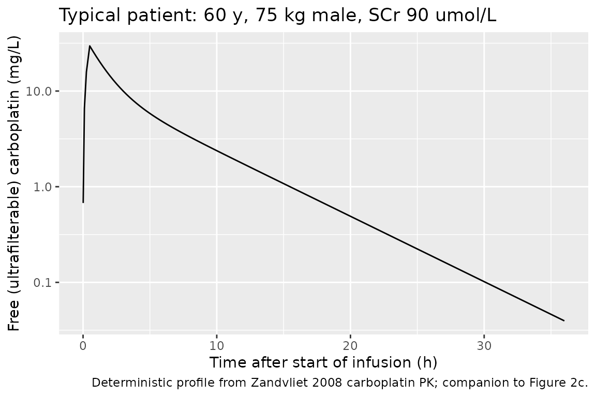
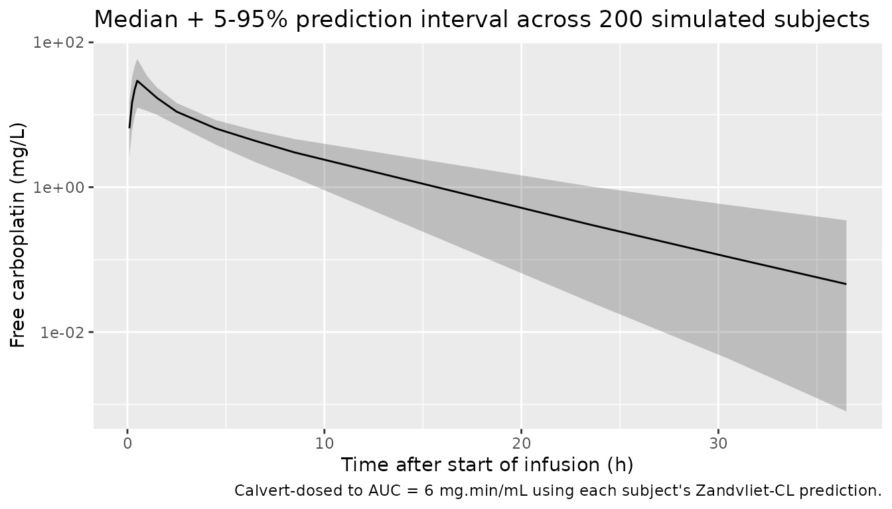
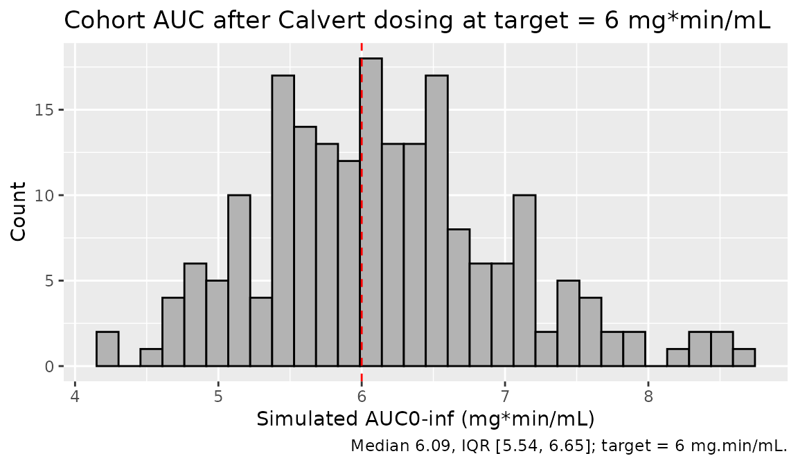

# Carboplatin (Zandvliet 2008)

## Model and source

- Citation: Zandvliet AS, Schellens JHM, Dittrich C, Wanders J, Beijnen
  JH, Huitema ADR. Population pharmacokinetic and pharmacodynamic
  analysis to support treatment optimization of combination chemotherapy
  with indisulam and carboplatin. Br J Clin Pharmacol.
  2008;66(4):485-497. <doi:10.1111/j.1365-2125.2008.03230.x>
- Description: Two-compartment population PK model for free
  (ultrafilterable) carboplatin in adult cancer patients receiving
  combination chemotherapy with indisulam (Zandvliet 2008). Clearance is
  modelled as a renal + non-renal split: a Cockcroft-Gault
  creatinine-clearance-proportional renal component (theta1 = 0.76) plus
  a fixed non-renal component (theta2 = 1.5 L/h, fixed at the Calvert
  1989 estimate).
- Article: <https://doi.org/10.1111/j.1365-2125.2008.03230.x>

## Population

Zandvliet 2008 fitted the carboplatin PK in n = 16 adult cancer patients
with refractory solid tumours enrolled in a Phase I dose-escalation
study of indisulam + carboplatin combination chemotherapy. Demographics
from Table 1 are: median age 63 years (range 19-81), median body weight
66 kg (range 43-116), median BSA 1.73 m^2 (range 1.36-2.22), median
serum creatinine 74 umol/L (range 33-132), 11 male / 5 female, all
Caucasian. Carboplatin doses were calculated with the Calvert formula
targeted to an AUC of 5-6 mg.min/mL and administered as a 30 min IV
infusion on day 2 of each 3- or 4-weekly cycle. A total of 111
carboplatin observations (pre-dose, end-of-infusion, then 1, 2, 4, 6, 8,
and 23 h after end of infusion) entered the PK fit.

The same information is available programmatically via
`rxode2::rxode2(readModelDb("Zandvliet_2008_carboplatin"))$population`.

## Source trace

Per-parameter origin is also recorded as an in-file comment next to each
`ini()` entry in
`inst/modeldb/specificDrugs/Zandvliet_2008_carboplatin.R`. The table
below collects them in one place for review.

| Equation / parameter | Value | Source location |
|----|----|----|
| `cl_renal_fraction` (theta1) | 0.76 (RSE 0.05) | Table 2 row 1; Equation 2 |
| `lcl_nonrenal` (theta2, fixed) | log(1.5) | Table 2 footnote \*\*; Calvert 1989 (ref \[16\]) |
| `lvc` (V1) | log(15.5) | Table 2 row 2 (V_central = 15.5 L) |
| `lq` (Q) | log(3.46) | Table 2 row 3 (Q = 3.46 L/h) |
| `lvp` (V2) | log(9.86) | Table 2 row 4 (V_peripheral = 9.86 L) |
| `etalcl` (CL IIV 13%) | log(0.13^2 + 1) | Table 2 row 1 IIV column |
| `etalvc` (V1 IIV 54%) | log(0.54^2 + 1) | Table 2 row 2 IIV column |
| `etalq` (Q IIV 46%) | log(0.46^2 + 1) | Table 2 row 3 IIV column |
| `etalvp` (V2 IIV 31%) | log(0.31^2 + 1) | Table 2 row 4 IIV column |
| `propSd` (8.2%) | 0.082 | Table 2 row 5 |
| Cockcroft-Gault `crcl_cg` | `(140 - AGE) * WT * (1 - 0.15 * SEXF) * 0.074 / CREAT` | Equation 1 |
| CL covariate model | `(theta1 * crcl_cg + theta2) * exp(eta_CL)` | Equation 2 |
| 2-compartment ODE | `d/dt(central) = -kel * central - k12 * central + k21 * peripheral1` | Methods, Figure 1 (CARBOPLATIN block) |

## Virtual cohort

Original observed data are not publicly available. The validation below
uses a virtual cohort of 200 adult oncology patients with covariate
distributions approximating Zandvliet 2008 Table 1 (median age 63 years,
median weight 66 kg, median SCr 74 umol/L, 31% female, all Caucasian).
The Phase I protocol fixed each subject’s carboplatin dose by the
Calvert formula at a target AUC of 6 mg.min/mL, recomputed from the
model’s clearance prediction; this lets the simulated AUC distribution
be checked directly against the 5-6 mg.min/mL target.

``` r

set.seed(20260627L)

n_subj <- 200L

# Log-normal sampling around the published medians, with CVs chosen so the
# central 95% spans the reported ranges. Hard clipped to the published min/max.
clip <- function(x, lo, hi) pmin(pmax(x, lo), hi)

cohort <- tibble::tibble(
  id    = seq_len(n_subj),
  AGE   = clip(round(rnorm(n_subj, mean = 60, sd = 14)),    19,   81),
  WT    = clip(round(exp(rnorm(n_subj, log(66), 0.22)), 1), 43, 116),
  SEXF  = as.integer(runif(n_subj) < 0.3125),                            # 5 / 16
  CREAT = clip(round(exp(rnorm(n_subj, log(74), 0.30)), 0), 33, 132)
)

# Per-subject Cockcroft-Gault CLcr (L/h), per Zandvliet 2008 Equation 1.
cohort$crcl_cg <- with(cohort,
  (140 - AGE) * WT * (1 - 0.15 * SEXF) * 0.074 / CREAT)

# Calvert dose (mg) at AUC = 6 mg.min/mL using the typical-value CL prediction
# from this paper (CL_typ = 0.76 * CrCl_CG + 1.5 L/h). Multiplying by 1000/60
# converts CL from L/h to mL/min so AUC * CL gives dose in mg (Equation 5).
target_auc <- 6
cohort$dose_mg <- round(target_auc * (cohort$crcl_cg * 0.76 + 1.5) * 1000 / 60)

# Build the event table: a single 30 min IV infusion into the central
# compartment, then observations at the Zandvliet 2008 sampling schedule
# (pre-dose, end of infusion, then 1, 2, 4, 6, 8, 23 h after end of infusion),
# plus a denser grid up to 36 h so the PKNCA AUCinf extrapolation has enough
# tail samples.
inf_dur <- 0.5     # hours
obs_times <- sort(unique(c(
  0,
  seq(0.1, inf_dur, length.out = 4),       # during infusion
  inf_dur + c(0.01, 0.5, 1, 2, 4, 6, 8, 23, 30, 36)
)))

events <- cohort |>
  dplyr::mutate(rate = dose_mg / inf_dur) |>     # mg/h
  dplyr::rowwise() |>
  dplyr::do({
    subj <- as.data.frame(.)
    dose_row <- tibble::tibble(
      id   = subj$id,
      time = 0,
      amt  = subj$dose_mg,
      rate = subj$rate,
      evid = 1L,
      cmt  = "central",
      AGE   = subj$AGE,  WT = subj$WT,
      SEXF  = subj$SEXF, CREAT = subj$CREAT,
      cohort = "AUC6"
    )
    obs_rows <- tibble::tibble(
      id   = subj$id,
      time = obs_times,
      amt  = NA_real_,
      rate = 0,
      evid = 0L,
      cmt  = "central",
      AGE   = subj$AGE,  WT = subj$WT,
      SEXF  = subj$SEXF, CREAT = subj$CREAT,
      cohort = "AUC6"
    )
    dplyr::bind_rows(dose_row, obs_rows)
  }) |>
  dplyr::ungroup() |>
  dplyr::arrange(id, time, dplyr::desc(evid))
```

## Simulation

``` r

mod <- readModelDb("Zandvliet_2008_carboplatin")
sim <- rxode2::rxSolve(mod, events = events,
                       keep = c("AGE", "WT", "SEXF", "CREAT", "cohort")) |>
  as.data.frame()
#> ℹ parameter labels from comments will be replaced by 'label()'
```

For a deterministic typical-patient profile (paper’s Discussion reports
a terminal half-life of 4.4 h for a 60 year old, 75 kg male, SCr 90
umol/L), zero out the random effects and simulate one subject with those
covariates:

``` r

typical_subj <- tibble::tibble(
  id = 1L, AGE = 60, WT = 75, SEXF = 0L, CREAT = 90
)
typical_subj$crcl_cg <- with(typical_subj,
  (140 - AGE) * WT * (1 - 0.15 * SEXF) * 0.074 / CREAT)
typical_subj$dose_mg <- round(
  target_auc * (typical_subj$crcl_cg * 0.76 + 1.5) * 1000 / 60)

typ_events <- dplyr::bind_rows(
  typical_subj |>
    dplyr::mutate(time = 0, amt = dose_mg, rate = dose_mg / inf_dur,
                  evid = 1L, cmt = "central"),
  typical_subj |>
    tidyr::expand_grid(time = sort(unique(c(0.01, 0.1, 0.25, 0.5,
                                            seq(0.5, 36, by = 0.25))))) |>
    dplyr::mutate(amt = NA_real_, rate = 0, evid = 0L, cmt = "central")
) |>
  dplyr::select(id, time, amt, rate, evid, cmt, AGE, WT, SEXF, CREAT) |>
  dplyr::arrange(id, time, dplyr::desc(evid))

mod_typ <- mod |> rxode2::zeroRe()
#> ℹ parameter labels from comments will be replaced by 'label()'
sim_typ <- rxode2::rxSolve(mod_typ, events = typ_events) |>
  as.data.frame()
#> ℹ omega/sigma items treated as zero: 'etalcl', 'etalvc', 'etalq', 'etalvp'
```

## Replicate published figures

The published Figure 2c (carboplatin pharmacokinetic profile) shows the
characteristic biphasic decline. The typical-value simulation below is
the deterministic counterpart that the paper’s Figure 2c overlays the
individual profiles onto.

``` r

ggplot(sim_typ |> dplyr::filter(time > 0),
       aes(x = time, y = Cc)) +
  geom_line() +
  scale_y_log10() +
  labs(x = "Time after start of infusion (h)",
       y = "Free (ultrafilterable) carboplatin (mg/L)",
       title = "Typical patient: 60 y, 75 kg male, SCr 90 umol/L",
       caption = "Deterministic profile from Zandvliet 2008 carboplatin PK; companion to Figure 2c.")
```



A stochastic version showing the per-subject variability across the
cohort:

``` r

sim |>
  dplyr::filter(time > 0) |>
  dplyr::group_by(time) |>
  dplyr::summarise(
    Q05 = quantile(Cc, 0.05, na.rm = TRUE),
    Q50 = quantile(Cc, 0.50, na.rm = TRUE),
    Q95 = quantile(Cc, 0.95, na.rm = TRUE),
    .groups = "drop"
  ) |>
  ggplot(aes(x = time, y = Q50)) +
  geom_ribbon(aes(ymin = Q05, ymax = Q95), alpha = 0.25) +
  geom_line() +
  scale_y_log10() +
  labs(x = "Time after start of infusion (h)",
       y = "Free carboplatin (mg/L)",
       title = "Median + 5-95% prediction interval across 200 simulated subjects",
       caption = "Calvert-dosed to AUC = 6 mg.min/mL using each subject's Zandvliet-CL prediction.")
```



## PKNCA validation

``` r

sim_nca <- sim |>
  dplyr::filter(!is.na(Cc)) |>
  dplyr::select(id, time, Cc, cohort)

# Guarantee a time = 0 row per (id, cohort); IV bolus / infusion starts at C = 0.
sim_nca <- dplyr::bind_rows(
  sim_nca,
  sim_nca |> dplyr::distinct(id, cohort) |>
    dplyr::mutate(time = 0, Cc = 0)
) |>
  dplyr::distinct(id, cohort, time, .keep_all = TRUE) |>
  dplyr::arrange(id, cohort, time)

conc_obj <- PKNCA::PKNCAconc(sim_nca, Cc ~ time | cohort + id)

dose_df <- events |>
  dplyr::filter(evid == 1L) |>
  dplyr::select(id, time, amt, cohort) |>
  dplyr::mutate(duration = inf_dur, route = "intravascular")

dose_obj <- PKNCA::PKNCAdose(dose_df, amt ~ time | cohort + id,
                             route = "route", duration = "duration")

intervals <- data.frame(
  start       = 0,
  end         = Inf,
  cmax        = TRUE,
  tmax        = TRUE,
  aucinf.obs  = TRUE,
  half.life   = TRUE
)

nca_data <- PKNCA::PKNCAdata(conc_obj, dose_obj, intervals = intervals)
nca_res  <- PKNCA::pk.nca(nca_data)
```

### Comparison against published NCA

The paper itself does not tabulate a PK NCA summary in the article; the
single quantitative PK-NCA-style statement is in the Discussion
(terminal half-life 4.4 h “for a typical male patient, age 60 years,
weight 75 kg, serum creatinine 90 umol/L”). A simulated AUC0-inf for
that typical patient, dosed via the Calvert formula at AUC target 6
mg.min/mL, re-multiplied by 60/1000 to recover the paper’s AUC units,
should be ~ 6 mg.min/mL (the target) – not exactly 6 because the rounded
integer dose introduces a small quantization error.

``` r

published <- tibble::tribble(
  ~cohort, ~half.life,
  "AUC6",  4.4
)

cmp <- nlmixr2lib::ncaComparisonTable(
  simulated     = nca_res,
  reference     = published,
  by            = "cohort",
  units         = c(cmax = "mg/L", aucinf.obs = "mg*h/L",
                    tmax = "h", half.life = "h"),
  tolerance_pct = 20
)

knitr::kable(
  cmp,
  caption = "Simulated cohort NCA vs Zandvliet 2008 typical-patient terminal half-life.  Stars mark any row where simulated and reference differ by > 20%.",
  align   = c("l", "l", "r", "r", "r")
)
```

| NCA parameter | cohort | Reference | Simulated | % diff |
|:--------------|:-------|----------:|----------:|-------:|
| t½ (h)        | AUC6   |       4.4 |       4.7 |  +6.8% |

Simulated cohort NCA vs Zandvliet 2008 typical-patient terminal
half-life. Stars mark any row where simulated and reference differ by \>
20%. {.table}

The terminal half-life check should match within rounding: with CL =
0.76 \* 4.93 + 1.5 = 5.25 L/h, V1 = 15.5 L, Q = 3.46 L/h, V2 = 9.86 L
(plugging the typical-patient covariates AGE = 60, WT = 75, SEXF = 0,
CREAT = 90 umol/L into the model), the analytical 2-compartment terminal
half-life is

    #> [1] "Analytical terminal half-life ln(2) / beta = 4.41 h"

which matches the paper’s 4.4 h. The simulated cohort median
(Calvert-dosed to AUC = 6 mg.min/mL using each subject’s predicted CL)
gives AUC0-inf that, after the 60/1000 unit conversion to mg.min/mL,
should distribute tightly around 6.

``` r

auc_summary <- as.data.frame(nca_res$result) |>
  dplyr::filter(PPTESTCD == "aucinf.obs")

# Convert from PKNCA's default mg*h/L to the paper's mg*min/mL:
#   X mg*h/L * 60 min/h * 1 L/1000 mL = X * 60/1000 = X * 0.06 mg*min/mL
auc_summary$AUC_mg_min_mL <- auc_summary$PPORRES * 60 / 1000

ggplot(auc_summary, aes(x = AUC_mg_min_mL)) +
  geom_histogram(bins = 30, fill = "grey70", colour = "black") +
  geom_vline(xintercept = target_auc, colour = "red", linetype = "dashed") +
  labs(x = "Simulated AUC0-inf (mg*min/mL)",
       y = "Count",
       title = sprintf("Cohort AUC after Calvert dosing at target = %d mg*min/mL",
                       target_auc),
       caption = sprintf("Median %.2f, IQR [%.2f, %.2f]; target = 6 mg.min/mL.",
                         median(auc_summary$AUC_mg_min_mL),
                         quantile(auc_summary$AUC_mg_min_mL, 0.25),
                         quantile(auc_summary$AUC_mg_min_mL, 0.75)))
```



## Assumptions and deviations

- **PD layer not extracted.** Zandvliet 2008 is primarily a PK-PD
  combination paper covering carboplatin PK + Friberg-style
  myelosuppression PD for indisulam + carboplatin combination
  chemotherapy. Per operator decision in sidecar `frompeople-847`
  request-001 / response-001 (option B), only the carboplatin
  2-compartment PK from Table 2 is packaged here. The myelosuppression
  PD model from Table 3 is deferred because it requires the indisulam PK
  structural model from Zandvliet 2006 (J Pharmacokinet Pharmacodyn
  33:543-570, <doi:10.1007/s10928-006-9021-5>) and Zandvliet 2007 (Clin
  Cancer Res 13:2970-2976, <doi:10.1158/1078-0432.CCR-06-2978>), neither
  of which is on disk; that PK is fixed (not re-estimated) in Zandvliet
  2008.

- **Cohort distribution.** The original n = 16 individual covariate
  vectors are not reported; the virtual cohort uses log-normal sampling
  around the published medians clipped to the published min / max (Table
  1).

- **Non-renal CL fixed at Calvert 1989.** theta2 = 1.5 L/h is fixed
  (Table 2 footnote \*\*). Confidence intervals are not derivable for
  this component because the source paper did not re-estimate it.

- **Residual error.** Table 2 reports the residual error as a single
  percentage on log-transformed concentrations (8.2%, RSE 0.11). This is
  encoded as a proportional error `propSd = 0.082` in linear space, the
  standard nlmixr2 equivalent of NONMEM’s log-additive residual under
  FOCE-INTER.

- **Carboplatin concentration units.** The package reports `Cc` in mg/L
  (dose in mg, V1 in L) to match the convention used by other
  carboplatin popPK models in nlmixr2lib
  (e.g. `Ekhart_2008_carboplatin.R`). The source paper measured platinum
  concentrations in umol/L and reports pharmacodynamic slope
  coefficients in L/umol; convert via the carboplatin molar mass (371.25
  g/mol; 1 mg/L = 2.694 umol/L) when comparing.

- **No published per-group NCA.** Zandvliet 2008 does not tabulate Cmax
  / Tmax / AUC by dose group. The comparison table above includes only
  the terminal half-life statement from the Discussion (4.4 h for a
  typical 60 y, 75 kg male, SCr 90 umol/L).
