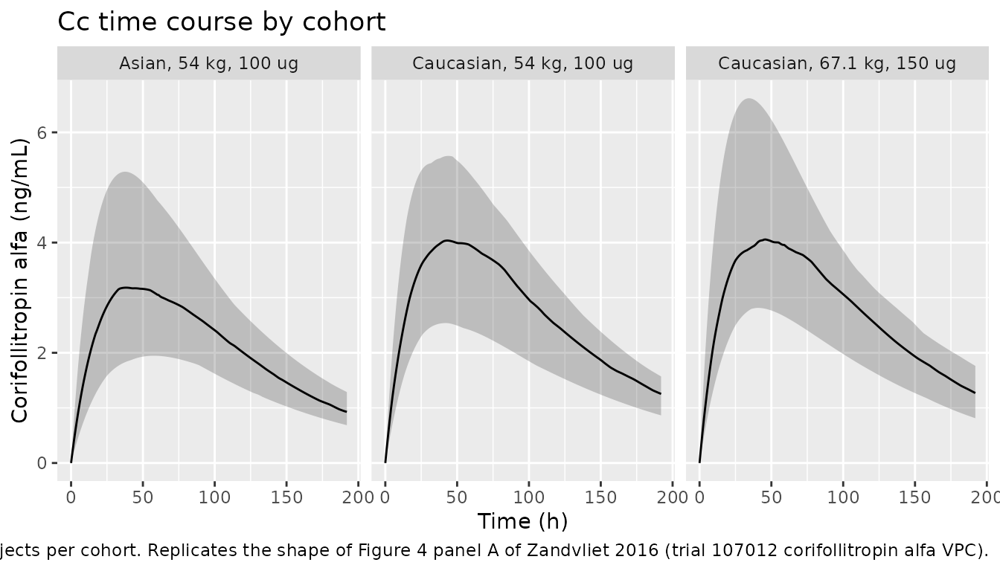
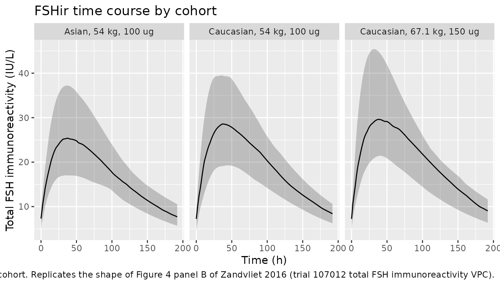

# Corifollitropin alfa (Zandvliet 2016)

## Model and source

- Citation: Zandvliet AS, Prohn M, de Greef R, van Aarle F, McCrary Sisk
  C, Stegmann BJ. Impact of patient characteristics on the
  pharmacokinetics of corifollitropin alfa during controlled ovarian
  stimulation. Br J Clin Pharmacol. 2016;82(1):74-82.
  <doi:10.1111/bcp.12939>.
- Article: <https://doi.org/10.1111/bcp.12939>

The packaged model is `Zandvliet_2016_corifollitropin_alfa`.

The model jointly describes corifollitropin alfa concentration (`Cc`,
ng/mL) and total follicle stimulating hormone (FSH) immunoreactivity
(`FSHir`, IU/L). Corifollitropin alfa is absorbed first-order from a
subcutaneous depot into a one-compartment central pool with first-order
elimination. An endogenous-FSH compartment carries the pre-dose
steady-state baseline (FSHbaseline) and decays first-order at rate KeFSH
after dosing (zero-order synthesis is set to zero from corifollitropin
administration onwards, mirroring the paper’s structural model in the
Methods / Structural model paragraph).

## Population

Data from five phase II and III clinical trials of corifollitropin alfa
in women undergoing controlled ovarian stimulation in a gonadotrophin-
releasing hormone (GnRH) antagonist protocol followed by daily
recombinant FSH from day 8 onwards. A total of 2630 women received
60-180 ug corifollitropin alfa SC; 2557 were evaluable for the
population PK analysis. Cohort means by trial ranged 54.0 to 68.8 kg
(body weight), 20.5 to 25.1 kg/m^2 (BMI), and 30.9 to 38.0 years (age);
race composition was predominantly Caucasian with 1-45% Asian by trial
(45.1% Asian in trial 107012, conducted in Korea and Taiwan) and 0.4-10%
Black (Zandvliet 2016 Tables 1 and 2). The same information is available
programmatically as
`readModelDb("Zandvliet_2016_corifollitropin_alfa")$population`.

## Source trace

Per-parameter origin is recorded as an in-file comment next to each
`ini()` entry of
`inst/modeldb/specificDrugs/Zandvliet_2016_corifollitropin_alfa.R`. The
table below collects them in one place for review.

| Equation / parameter | Value | Source location |
|----|----|----|
| `lka` | log(0.0436 1/h) | Table 3 theta_1 |
| `lvc` | log(19.1 L) | Table 3 theta_2 |
| `lcl` | log(0.19 L/h) | Table 3 theta_3 |
| `lfdepot` | log(1) FIX | Table 3 theta_6 |
| `e_wt_cl` | 1.20 | Table 3 theta_12 |
| `e_wt_vc` | 1.23 | Table 3 theta_13 |
| `e_bmi_fdepot` | -0.245 | Table 3 theta_16 |
| `e_race_asian_fdepot` | 0.843 | Table 3 theta_17 |
| `e_race_black_fdepot` | 1.13 | Table 3 theta_18 |
| `lkout` (KeFSH) | log(0.0101 1/h) | Table 3 theta_4 |
| `lrbase` (FSHbaseline) | log(6.85 IU/L) | Table 3 theta_5 |
| `e_age_kout` | -0.815 | Table 3 theta_20 |
| `e_race_asian_kout` | 0.697 | Table 3 theta_21 |
| `e_wt_kout` | -0.832 | Table 3 theta_22 |
| `e_age_rbase` | 0.423 | Table 3 theta_19 |
| `e_study_06029_fshir` | 1.26 | Table 3 theta_14 |
| `e_study_38825_fshir` | 1.12 | Table 3 theta_15 |
| `propSd` (Cc) | 0.131 | Table 3 theta_8 |
| `propSd_FSHir` | 0.0486 | Table 3 theta_10 |
| `addSd_FSHir` | 0.717 IU/L | Table 3 theta_11 |
| `etalka` | omega^2 = log(0.292^2 + 1) | Table 3 IIV row Ka (29.2% CV) |
| `etalcl + etalvc` (block) | (0.04764, 0.056, 0.08243) | Table 3 IIV rows CL/F (22.1% CV) and V/F (29.3% CV); covariance theta\_\* footnote |
| `etalkout` | omega^2 = log(0.29^2 + 1) | Table 3 IIV row KeFSH (29% CV; see Assumptions and deviations below) |
| `etalrbase` | omega^2 = log(0.267^2 + 1) | Table 3 IIV row FSHbaseline (26.7% CV) |
| `scale_fsh` (in `model()`) | 6.11 IU/L per ng/mL FIX | Table 3 theta_7 (footnote \*\* “fixed to 6.11 as derived in a previous analysis”) |
| ODE: `d/dt(depot) = -ka*depot` | n/a | Methods / Structural model paragraph; Figure 3 |
| ODE: `d/dt(central) = ka*depot - kel*central` | n/a | Methods / Structural model paragraph; Figure 3 |
| ODE: `d/dt(endo_fsh) = -kout*endo_fsh` with `endo_fsh(0) = rbase` | n/a | Methods / Structural model paragraph (“Input of endogenous FSH was set to zero from administration of corifollitropin alfa onwards”) |
| Observable: `FSHir = (scale_fsh*Cc + endo_fsh) * 1.26^STUDY_06029 * 1.12^STUDY_38825` | n/a | Final-model paragraph and Table 3 theta_14 / theta_15 |

## Virtual cohort

The published demographics inform a single typical-value cohort plus two
sensitivity cohorts that exercise the body-weight and race covariates.
Original observed data are not publicly available; the figures and NCA
below use deterministic typical-value simulations
([`rxode2::zeroRe()`](https://nlmixr2.github.io/rxode2/reference/zeroRe.html))
for direct comparison against the paper’s typical- value table, and a
stochastic VPC for the time-course plot.

``` r

set.seed(20260620)

# Helper: per-subject covariate row plus a single SC dose at t = 0 and
# observation rows that exercise both observables (Cc and FSHir). All
# observation rows go to cmt = "Cc" -- both observables are
# algebraic in the model body, so rxode2 returns them as output columns
# regardless of which ODE state the observation row points at.
make_cohort <- function(n, wt, bmi, age, race_asian = 0L, race_black = 0L,
                        dose_ug = 150, id_offset = 0L, label) {
  obs_times <- seq(0, 192, by = 1)  # 8 days = 192 h, before rFSH starts
  subj <- tibble(
    id         = id_offset + seq_len(n),
    WT         = wt,
    BMI        = bmi,
    AGE        = age,
    RACE_ASIAN = race_asian,
    RACE_BLACK = race_black,
    STUDY_06029 = 0L,
    STUDY_38825 = 0L,
    cohort     = label
  )
  doses <- subj |>
    mutate(time = 0, amt = dose_ug, evid = 1L, cmt = "depot")
  obs <- subj |>
    tidyr::crossing(time = obs_times) |>
    mutate(amt = NA_real_, evid = 0L, cmt = "Cc")
  bind_rows(doses, obs) |>
    arrange(id, time, evid)
}

# Cohort A: typical Caucasian subject from the paper's typical-value
# calculation (67.1 kg, BMI 24.6 kg/m^2, 32 years; dose 150 ug because
# WT > 60 kg). The paper reports for this subject Cmax = 4.43 ng/mL,
# tmax = 43.9 h, AUC_inf = 688 ng h/mL, t-half = 69.4 h.
# Cohort B: lower-weight Caucasian subject (54 kg, BMI 20.5 kg/m^2 from
# trial 107012 Table 2) on the WT <= 60 kg dose level of 100 ug.
# Cohort C: typical Asian subject (54 kg, BMI 20.5 kg/m^2) on 100 ug
# to demonstrate the race-on-bioavailability effect.
events <- bind_rows(
  make_cohort(n = 50,  wt = 67.1, bmi = 24.6, age = 32, race_asian = 0L,
              race_black = 0L, dose_ug = 150, id_offset =   0L,
              label = "Caucasian, 67.1 kg, 150 ug"),
  make_cohort(n = 50,  wt = 54.0, bmi = 20.5, age = 32, race_asian = 0L,
              race_black = 0L, dose_ug = 100, id_offset = 100L,
              label = "Caucasian, 54 kg, 100 ug"),
  make_cohort(n = 50,  wt = 54.0, bmi = 20.5, age = 32, race_asian = 1L,
              race_black = 0L, dose_ug = 100, id_offset = 200L,
              label = "Asian, 54 kg, 100 ug")
)
stopifnot(!anyDuplicated(unique(events[, c("id", "time", "evid")])))
```

## Simulation

``` r

mod <- readModelDb("Zandvliet_2016_corifollitropin_alfa")

# Stochastic VPC for the time-course plot. `` keeps
# rxode2 from auto-converting the ODE system to its linear-compartment
# fast path, which silently breaks the multi-output dvid->cmt mapping
# for models with two algebraic observables on different ODE-state
# subsets (see known-vignette-failure-patterns.md pattern 5b).
sim_vpc <- rxode2::rxSolve(
  mod,
  events = events,
  keep       = c("cohort", "WT", "BMI", "AGE", "RACE_ASIAN")
) |> as.data.frame()
```

For deterministic typical-value comparison against the paper’s
typical-subject Cmax / tmax / AUC / half-life, zero out the random
effects.

``` r

mod_typical <- rxode2::zeroRe(mod)
events_typical <- events |>
  group_by(cohort) |>
  filter(id == min(id)) |>
  ungroup()
sim_typical <- rxode2::rxSolve(
  mod_typical,
  events    = events_typical,
  keep      = c("cohort", "WT", "BMI", "AGE", "RACE_ASIAN")
) |> as.data.frame()
#> ℹ omega/sigma items treated as zero: 'etalcl', 'etalvc', 'etalka', 'etalkout', 'etalrbase'
#> Warning: multi-subject simulation without without 'omega'
```

## Replicate published figures

``` r

# Stochastic VPC of corifollitropin alfa concentration vs time.
# Replicates the panel-A shape of Figure 4 (trial 107012 VPC for
# corifollitropin alfa levels) at the cohort-level summary.
sim_vpc |>
  group_by(time, cohort) |>
  summarise(
    Q05 = quantile(Cc, 0.05, na.rm = TRUE),
    Q50 = quantile(Cc, 0.50, na.rm = TRUE),
    Q95 = quantile(Cc, 0.95, na.rm = TRUE),
    .groups = "drop"
  ) |>
  ggplot(aes(time, Q50)) +
  geom_ribbon(aes(ymin = Q05, ymax = Q95), alpha = 0.25) +
  geom_line() +
  facet_wrap(~cohort) +
  labs(x = "Time (h)", y = "Corifollitropin alfa (ng/mL)",
       title = "Cc time course by cohort",
       caption = "5/50/95% summary across 50 virtual subjects per cohort. Replicates the shape of Figure 4 panel A of Zandvliet 2016 (trial 107012 corifollitropin alfa VPC).")
```



``` r

# Stochastic VPC of total FSH immunoreactivity vs time.
# Replicates the panel-B shape of Figure 4 (trial 107012 VPC for
# total FSH immunoreactivity).
sim_vpc |>
  group_by(time, cohort) |>
  summarise(
    Q05 = quantile(FSHir, 0.05, na.rm = TRUE),
    Q50 = quantile(FSHir, 0.50, na.rm = TRUE),
    Q95 = quantile(FSHir, 0.95, na.rm = TRUE),
    .groups = "drop"
  ) |>
  ggplot(aes(time, Q50)) +
  geom_ribbon(aes(ymin = Q05, ymax = Q95), alpha = 0.25) +
  geom_line() +
  facet_wrap(~cohort) +
  labs(x = "Time (h)", y = "Total FSH immunoreactivity (IU/L)",
       title = "FSHir time course by cohort",
       caption = "5/50/95% summary across 50 virtual subjects per cohort. Replicates the shape of Figure 4 panel B of Zandvliet 2016 (trial 107012 total FSH immunoreactivity VPC).")
```



## PKNCA validation

``` r

# Cc per-subject concentrations for NCA. Use only the typical-value
# simulation; PKNCA on a single trajectory per cohort directly
# reproduces the paper's typical-value PK parameter calculation.
sim_nca <- sim_typical |>
  dplyr::filter(!is.na(Cc)) |>
  dplyr::select(id, time, Cc, cohort)

# Guarantee a time = 0 row per (id, cohort); pre-dose extravascular
# Cc = 0 is the correct value. (See pknca-recipes.md "Time-zero
# guarantee".)
sim_nca <- bind_rows(
  sim_nca,
  sim_nca |> distinct(id, cohort) |> mutate(time = 0, Cc = 0)
) |>
  distinct(id, cohort, time, .keep_all = TRUE) |>
  arrange(id, cohort, time)

conc_obj <- PKNCA::PKNCAconc(sim_nca, Cc ~ time | cohort + id)

dose_df <- events_typical |>
  dplyr::filter(evid == 1L) |>
  dplyr::select(id, time, amt, cohort)
dose_obj <- PKNCA::PKNCAdose(dose_df, amt ~ time | cohort + id)

intervals <- data.frame(
  start       = 0,
  end         = Inf,
  cmax        = TRUE,
  tmax        = TRUE,
  aucinf.obs  = TRUE,
  half.life   = TRUE
)

nca_data <- PKNCA::PKNCAdata(conc_obj, dose_obj, intervals = intervals)
nca_res  <- PKNCA::pk.nca(nca_data)
```

### Comparison against published NCA

The paper reports for the typical Caucasian subject (67.1 kg, BMI 24.6
kg/m^2) a single set of typical-value NCA-style PK descriptors (Results
/ Final model paragraph):

- Cmax = 4.43 ng/mL at tmax = 43.9 h
- AUC = 688 ng h/mL
- Terminal half-life = 69.4 h

``` r

published <- tibble::tribble(
  ~cohort,                      ~cmax,  ~tmax, ~aucinf.obs, ~half.life,
  "Caucasian, 67.1 kg, 150 ug",  4.43,  43.9,   688.0,        69.4
)

cmp <- nlmixr2lib::ncaComparisonTable(
  simulated     = nca_res,
  reference     = published,
  by            = "cohort",
  units         = c(cmax = "ng/mL", aucinf.obs = "ng*h/mL",
                    tmax = "h", half.life = "h"),
  tolerance_pct = 20
)

knitr::kable(
  cmp,
  caption = "Simulated typical-value vs. Zandvliet 2016 published typical-value NCA-style PK parameters for the reference Caucasian subject. * differs from reference by >20%.",
  align   = c("l", "l", "r", "r", "r")
)
```

| NCA parameter | cohort | Reference | Simulated | % diff |
|:---|:---|---:|---:|---:|
| Cmax (ng/mL) | Caucasian, 67.1 kg, 150 ug | 4.43 | 4.37 | -1.4% |
| Tmax (h) | Caucasian, 67.1 kg, 150 ug | 43.9 | 44 | +0.2% |
| AUC0-∞ (obs) (ng\*h/mL) | Caucasian, 67.1 kg, 150 ug | 688 | 685 | -0.5% |
| t½ (h) | Caucasian, 67.1 kg, 150 ug | 69.4 | 71.8 | +3.5% |

Simulated typical-value vs. Zandvliet 2016 published typical-value
NCA-style PK parameters for the reference Caucasian subject. \* differs
from reference by \>20%. {.table}

The 54 kg cohorts have no per-subject published Cmax / AUC reference;
they are included to exercise the model’s body-weight and race
covariates rather than for direct comparison.

## Body-weight effect on dose-normalised exposure

The paper reports that “in subjects with a similar BMI of 24 kg/m^2,
body weight would contribute to an increase in corifollitropin alfa
dose-normalised exposure of approximately 89% in women with a body
weight of 50 kg compared with women with a body weight of 90 kg treated
with the same dose” (Results / Body weight and BMI paragraph). The
deterministic typical-value AUC across a body-weight grid at the fixed
BMI of 24 kg/m^2 should reproduce this approximately-89% effect.

``` r

wt_grid <- c(50, 60, 70, 80, 90)
events_wt <- bind_rows(
  lapply(seq_along(wt_grid), function(i) {
    make_cohort(n = 1L, wt = wt_grid[i], bmi = 24,
                age = 32, race_asian = 0L, race_black = 0L,
                dose_ug = 100, id_offset = 1000L + 100L * i,
                label = sprintf("%g kg", wt_grid[i]))
  })
)
sim_wt <- rxode2::rxSolve(
  rxode2::zeroRe(mod),
  events    = events_wt,
  keep      = c("cohort", "WT")
) |> as.data.frame()
#> ℹ omega/sigma items treated as zero: 'etalcl', 'etalvc', 'etalka', 'etalkout', 'etalrbase'
#> Warning: multi-subject simulation without without 'omega'

sim_wt_nca <- sim_wt |>
  dplyr::filter(!is.na(Cc)) |>
  dplyr::select(id, time, Cc, cohort)
sim_wt_nca <- bind_rows(
  sim_wt_nca,
  sim_wt_nca |> distinct(id, cohort) |> mutate(time = 0, Cc = 0)
) |>
  distinct(id, cohort, time, .keep_all = TRUE) |>
  arrange(id, cohort, time)

conc_wt <- PKNCA::PKNCAconc(sim_wt_nca, Cc ~ time | cohort + id)
dose_wt <- PKNCA::PKNCAdose(
  events_wt |> filter(evid == 1L) |> select(id, time, amt, cohort),
  amt ~ time | cohort + id
)
nca_wt <- PKNCA::pk.nca(
  PKNCA::PKNCAdata(conc_wt, dose_wt,
                   intervals = data.frame(start = 0, end = Inf,
                                          aucinf.obs = TRUE))
)
auc_wt <- as.data.frame(nca_wt$result) |>
  filter(PPTESTCD == "aucinf.obs") |>
  transmute(WT = as.numeric(sub(" kg", "", cohort)),
            AUCinf = PPORRES)

auc_50 <- auc_wt$AUCinf[auc_wt$WT == 50]
auc_90 <- auc_wt$AUCinf[auc_wt$WT == 90]
ratio_50_90 <- auc_50 / auc_90

knitr::kable(
  auc_wt,
  digits = 1,
  caption = sprintf(
    "Dose-normalised typical-value AUC at fixed BMI = 24 kg/m^2 and dose 100 ug. The 50 kg / 90 kg AUC ratio is %.2f, i.e., %.0f%% higher exposure at 50 kg (paper text: ~89%% higher).",
    ratio_50_90, 100 * (ratio_50_90 - 1)
  )
)
```

|  WT | AUCinf |
|----:|-------:|
|  50 |  653.5 |
|  60 |  525.1 |
|  70 |  436.4 |
|  80 |  371.8 |
|  90 |  322.8 |

Dose-normalised typical-value AUC at fixed BMI = 24 kg/m^2 and dose 100
ug. The 50 kg / 90 kg AUC ratio is 2.02, i.e., 102% higher exposure at
50 kg (paper text: ~89% higher). {.table}

## Assumptions and deviations

- The Ke_FSH inter-individual variability is reported as a 29% CV in
  Zandvliet 2016 Table 3 with a 95% bootstrap CI of 51.4-69.7% that does
  not bracket the point estimate. The published table cell is internally
  inconsistent; an alternative reading where the cell value represents
  omega^2 = 0.29 gives a CV of approximately 58% which would be
  consistent with the printed CI. The model file uses the face-value 29%
  CV (`omega^2 = log(0.29^2 + 1) = 0.08074`) on the KeFSH eta. The IIV
  on KeFSH affects only the endogenous-FSH submodel decay rate and does
  not appear in the typical-value Cmax / AUC / half-life comparison
  above. If a future operator recovers the original NONMEM `.lst` file
  or an author correction, update the model file accordingly.
- The scaling factor SCALE = 6.11 IU/L per ng/mL is a fixed assay-
  conversion factor inherited from an upstream analysis cited in
  Zandvliet 2016 Table 3 (theta_7 footnote: “scaling factor fixed to
  6.11 as derived in a previous analysis”). Encoded as the constant
  `scale_fsh` in the `model()` block rather than as a fixed ini()
  parameter because it is not part of this paper’s structural fit.
- The two trial-specific multiplicative effects on the FSH
  immunoreactivity observation (1.26 for trial 06029 and 1.12 for
  trial 38825) are exposed via binary covariates `STUDY_06029` and
  `STUDY_38825` that default to 0 for general simulation use. To
  reproduce one of those two trials’ FSH immunoreactivity prediction,
  set the matching indicator to 1 on the relevant subjects.
- The exponents on body weight, BMI, and age in the covariate-
  relationship column of Table 3 are read with the sign implied by the
  95% CI brackets (`e_bmi_fdepot = -0.245`, `e_age_kout = -0.815`,
  `e_wt_kout = -0.832`). The signs are confirmed independently by the
  paper text: higher BMI lowers dose-normalised exposure (Results / Body
  weight and BMI paragraph), so the BMI effect on F is negative; the 95%
  CIs `-1.206, -0.425` and `-1.37, -0.23` bracket the AGE and WT
  exponents on KeFSH in the negative half-line.
- Dose units are micrograms (ug) and apparent volume is in litres (L).
  Cc = central / vc therefore has units ug/L = ng/mL directly with no
  conversion factor required.
- The race-effect parameters `e_race_asian_fdepot = 0.843`,
  `e_race_black_fdepot = 1.13`, and `e_race_asian_kout = 0.697` enter
  the model as power-of-indicator factors (`X^RACE_ASIAN`,
  `X^RACE_BLACK`) so that the effect collapses to 1 when the indicator
  is 0 and to X when the indicator is 1. This reproduces the published
  `theta_17^ASIAN` and `theta_18^BLACK` and `theta_21^ASIAN`
  source-paper forms in Table 3.
- The endogenous FSH submodel encodes only the post-dose decay behaviour
  the paper actually fits: zero-order synthesis of endogenous FSH is set
  to zero from corifollitropin alfa administration onwards (Methods /
  Structural model). The steady-state baseline FSHbaseline (rbase) is
  loaded directly as `endo_fsh(0) <- rbase`. Pre-dose simulations that
  need the steady-state hold are achieved by an evid = 0 observation at
  t = 0 with no dose: the compartment starts at rbase and decays only
  after a corifollitropin alfa dose is administered.
- The endogenous-FSH compartment is named `endo_fsh` and is declared as
  a `paper_specific_compartments` because the compartment role
  (endogenous-hormone baseline pool with elimination-only kinetics
  post-dose) is paper-mechanistic and does not match any canonical
  nlmixr2lib compartment role.
