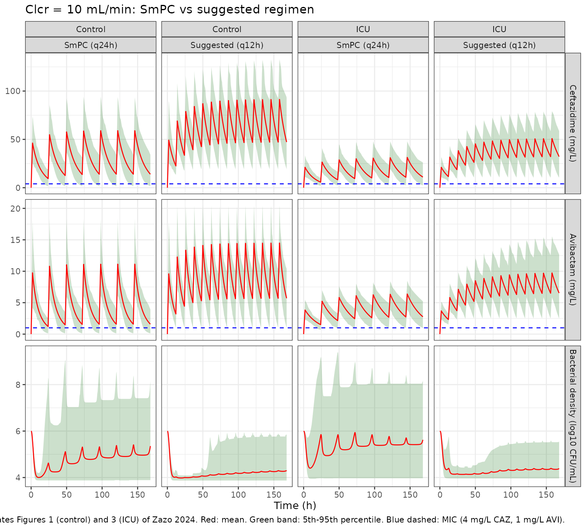
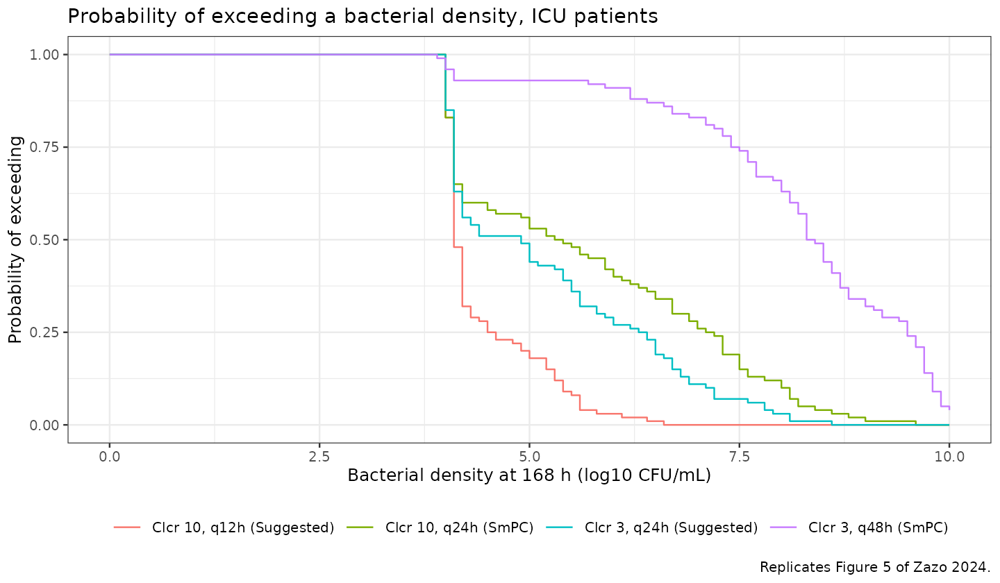

# Ceftazidime-avibactam PK/PD in ICU and control patients (Zazo 2024)

## Model and source

Zazo, Aguazul and Lanao built a single semi-mechanistic PK/PD model of
ceftazidime-avibactam (CAZ-AVI) against *Pseudomonas aeruginosa* and
applied it to two distinct populations with their own pharmacokinetic
parameter sets: a non-ICU **control** population and a critically ill
**ICU** population. Because the two populations differ not only in
typical values but also in their variability (Table 5 reports a separate
CV for every parameter in each population), and nlmixr2 cannot express a
covariate-dependent OMEGA, the extraction carries them as two model
files that share one vignette.

``` r

mod_control <- readModelDb("Zazo_2024_ceftazidime_avibactam_control")
mod_icu     <- readModelDb("Zazo_2024_ceftazidime_avibactam_icu")

# rxUi objects, needed to pipe model() edits in the static time-kill check.
ui_control <- rxode2::rxode(mod_control)
#> ℹ parameter labels from comments will be replaced by 'label()'
ui_icu     <- rxode2::rxode(mod_icu)
#> ℹ parameter labels from comments will be replaced by 'label()'
```

- Citation: Zazo H, Aguazul Y, Lanao JM. Dosing Evaluation of
  Ceftazidime-Avibactam in Intensive Care Unit Patients Based on
  Pharmacokinetic/Pharmacodynamic (PK/PD) Modeling and Simulation.
  Antibiotics (Basel). 2024;13(9):861.
  <doi:10.3390/antibiotics13090861>. Structural equations: Section 4.2,
  Eqs 3-9. PK parameters: Table 5, ‘Control Population’ columns (derived
  by the authors from refs 17-19: Stein 2019, Merdjan 2017, Welage
  1984). Bacterial growth/kill parameters: Table 6 (adapted from Sy SKB
  et al. J Antimicrob Chemother 2018;73:1295-1304).
- Control model: Semi-mechanistic PK/PD model of ceftazidime-avibactam
  against Pseudomonas aeruginosa (strain 2154) in the NON-ICU control
  population. One-compartment linear PK for each drug, with volume
  proportional to body weight and clearance a linear function of
  creatinine clearance, driving a two-state bacterial growth model (an
  actively growing population carried on the log10 scale and a resting
  population carried on the linear CFU/mL scale) under a shared logistic
  capacity limit. Ceftazidime kill follows a sigmoidal Emax function
  whose EC50 is lowered biexponentially by avibactam; exponential delay
  functions retard growth and initial kill; ceftazidime is degraded by a
  bacterial-density-dependent Hill function that avibactam inhibits.
  Sibling model for the critically ill population:
  Zazo_2024_ceftazidime_avibactam_icu.
- ICU model: Semi-mechanistic PK/PD model of ceftazidime-avibactam
  against Pseudomonas aeruginosa (strain 2154) in the CRITICALLY ILL
  (intensive care unit) population. One-compartment linear PK for each
  drug, with volume proportional to body weight and clearance a linear
  function of creatinine clearance, driving a two-state bacterial growth
  model (an actively growing population carried on the log10 scale and a
  resting population carried on the linear CFU/mL scale) under a shared
  logistic capacity limit. Ceftazidime kill follows a sigmoidal Emax
  function whose EC50 is lowered biexponentially by avibactam;
  exponential delay functions retard growth and initial kill;
  ceftazidime is degraded by a bacterial-density-dependent Hill function
  that avibactam inhibits. Sibling model for the non-ICU control
  population: Zazo_2024_ceftazidime_avibactam_control.
- Article: <https://doi.org/10.3390/antibiotics13090861>
- Supplement:
  <https://www.mdpi.com/article/10.3390/antibiotics13090861/s1>

## Population

This is a **simulation study**, not a fit to individual patient data.
The authors ran 1000 Monte Carlo replicates per subpopulation over the
first week (168 h) of treatment in GoldSim Pro v10.5. Two populations
were simulated - control (not admitted to the ICU) and ICU - each
subdivided into six renal strata by creatinine clearance (100, 60, 40,
20, 10 and 3 mL/min). Creatinine clearance was drawn log-normally about
each stratum mean with CV 20%, and body weight log-normally with mean 75
kg and CV 13% (Section 4.1).

The pharmacokinetic parameters (Table 5) were derived by the authors
from published studies rather than estimated here: Stein 2019
(critically ill CAZ-AVI), Merdjan 2017 (avibactam in renal impairment)
and Welage 1984 (ceftazidime in renal insufficiency). The bacterial
growth and kill parameters (Table 6) were adapted from the Sy 2018
time-kill analysis of *P. aeruginosa* strain 2154.

The MIC assumed throughout is the MIC50 for meropenem-non-susceptible
*P. aeruginosa*: 4 mg/L for ceftazidime and 1 mg/L for avibactam. The
PK/PD targets are T \> MIC \> 90% and Cmin/MIC \> 1.3.

The same information is available programmatically via
`readModelDb("Zazo_2024_ceftazidime_avibactam_icu")()$population`.

## Source trace

| Equation / parameter | Value | Source location |
|----|----|----|
| `V = Vd * WT` | n/a | Eq 3, Section 4.2 |
| `Cl = Cli + CLs * CRCL` | n/a | Eq 4, Section 4.2 |
| `d/dt(bact_active)` (logistic growth, delayed kill, conversion loss) | n/a | Eq 5, Section 4.2 |
| `kdeath1` (sigmoidal Emax; AVI lowers the CAZ EC50 biexponentially) | n/a | Eq 6, Section 4.2 |
| `d/dt(bact_resting)` | n/a | Eq 7, Section 4.2 |
| `i1`, `i2` (delay functions) | n/a | Eq 8, Section 4.2 |
| `degrate` (bacterial degradation of CAZ, inhibited by AVI) | n/a | Eq 9, Section 4.2 |
| `lvd_caz` | 0.21 / 0.46 L/kg (control / ICU) | Table 5 |
| `lvd_avi` | 0.27 / 0.68 L/kg | Table 5 |
| `lcli_caz` | 0.39 / 1.15 L/h | Table 5 |
| `lcli_avi` | 0.53 / 0.89 L/h | Table 5 |
| `lcls_caz` | 0.06 / 0.04 (L/h)/(mL/min) | Table 5 |
| `lcls_avi` | 0.12 / 0.10 (L/h)/(mL/min) | Table 5 |
| `llog10nmax` | 9.89 log10 CFU/mL | Table 6 (`Nmax`) |
| `lkgrowth1` | 0.346 1/h | Table 6 |
| `kgrowth2` (derived) | `kgrowth1 / 1e7` | Table 6 |
| `lemax` | 0.240 1/h | Table 6 |
| `lec50_a`, `lec50_b` | 52.3, 12.6 mg/L | Table 6 (`A`, `B`) |
| `lalpha` | 2.38 L/mg | Table 6 |
| `lbeta` | 9.67e-2 L/mg | Table 6; **sign erratum**, see below |
| `lhill` | 2.60 | Table 6 (`gamma`) |
| `ldelta1` | 4.23e-2 1/h (fixed) | Table 6; **sign erratum** |
| `ldelta2` | 0.213 1/h | Table 6 |
| `lkconv` | 5.0e-3 1/h (fixed) | Table 6 (`k1-2`); **sign erratum** |
| `ldegmax` | 7.71e-2 1/h | Table 6; **sign erratum** |
| `lkm_deg` | 8.5 log10 CFU/mL (fixed) | Table 6 (`Km`) |
| `lhill_deg` | 1.46 | Table 6 (`phi`) |
| `lic50_deg` | 1.96 mg/L | Table 6 (`IC50`) |
| All IIV variances | `log(CV^2 + 1)` from the tabulated CV% | Tables 5 and 6 |
| Initial inocula | P1 = 10^6 CFU/mL, P2 = 1/10^7 CFU/mL | Section 4.2 |
| Dosage regimens | see Table 4 | Table 4 |
| MIC (CAZ 4, AVI 1 mg/L) | n/a | Section 4.3 |

## Validation 1: static time-kill (Table 1)

The strongest quantitative check available is Table 1, which reports the
model-predicted bacterial density for the three static time-kill
conditions of Sy 2018. “Static” means the drug concentrations are held
constant, so the PK and the Eq 9 degradation are bypassed. Here that is
done by piping the two concentration definitions to covariates - the
packaged model is not modified.

``` r

# rxUi objects have REFERENCE semantics: piping model() edits mutates the
# object in place, so build the static variant from a fresh rxUi.
make_static <- function(modfun) {
  rxode2::rxode(modfun) |>
    rxode2::model(Cc_caz <- CAZ_STATIC) |>
    rxode2::model(Cc_avi <- AVI_STATIC) |>
    rxode2::zeroRe()
}
static_control <- make_static(mod_control)
#> ℹ parameter labels from comments will be replaced by 'label()'
#> ℹ add covariate `CAZ_STATIC`
#> ℹ add covariate `AVI_STATIC`

# Observation rows: ODE-state cmt + dvid, as in the main cohort below.
static_obs <- function(ids, times) {
  tidyr::crossing(id = ids, time = times) |>
    dplyr::mutate(evid = 0L, amt = NA_real_, rate = NA_real_,
                  cmt = "central_caz", dvid = 1L)
}

tk_cov <- data.frame(
  id = 1:3, CAZ_STATIC = c(2, 4, 8), AVI_STATIC = 4, WT = 75, CRCL = 100
)
tk_sim <- rxode2::rxSolve(
  static_control,
  dplyr::left_join(static_obs(1:3, seq(0, 168, by = DT)), tk_cov, by = "id"),
  omega = NA, sigma = NA, useLinCmt = FALSE
) |> as.data.frame()

tk_tab <- tk_sim |>
  dplyr::group_by(id) |>
  dplyr::slice_max(time, n = 1) |>
  dplyr::ungroup() |>
  dplyr::transmute(
    Condition = c("CAZ 2 + AVI 4 mg/L", "CAZ 4 + AVI 4 mg/L", "CAZ 8 + AVI 4 mg/L"),
    Simulated = round(bactTotal, 2),
    `Published (Table 1)` = c(9.23, 8.78, 6.57),
    `Observed (Sy 2018)` = c(9.1, 8.0, 4.7)
  ) |>
  dplyr::mutate(Difference = round(Simulated - `Published (Table 1)`, 2))

knitr::kable(
  tk_tab, align = c("l", "r", "r", "r", "r"),
  caption = "Bacterial density at 168 h under static concentrations (log10 CFU/mL). Replicates Table 1 of Zazo 2024."
)
```

| Condition | Simulated | Published (Table 1) | Observed (Sy 2018) | Difference |
|:---|---:|---:|---:|---:|
| CAZ 2 + AVI 4 mg/L | 9.60 | 9.23 | 9.1 | 0.37 |
| CAZ 4 + AVI 4 mg/L | 8.92 | 8.78 | 8.0 | 0.14 |
| CAZ 8 + AVI 4 mg/L | 6.62 | 6.57 | 4.7 | 0.05 |

Bacterial density at 168 h under static concentrations (log10 CFU/mL).
Replicates Table 1 of Zazo 2024. {.table style="width:100%;"}

All three reproduce the published predictions to within 0.4 log10
CFU/mL, and the two higher-exposure conditions to within 0.15. This is
the check that pins down the two readings discussed under *Assumptions
and deviations*: the negative exponents in Table 6, and the exclusion of
the Eq 9 degradation term from the static arm.

The drug-free growth control should saturate at the carrying capacity
`log10(Nmax) = 9.89`:

``` r

gc_sim <- rxode2::rxSolve(
  static_control,
  static_obs(1L, seq(0, 168, by = DT)) |>
    dplyr::mutate(CAZ_STATIC = 0, AVI_STATIC = 0, WT = 75, CRCL = 100),
  omega = NA, sigma = NA, useLinCmt = FALSE
) |> as.data.frame()

cat(sprintf(
  "Drug-free control: t=0 %.2f, t=24 %.2f, t=168 %.2f log10 CFU/mL (Nmax = 9.89)\n",
  gc_sim$bactTotal[1],
  gc_sim$bactTotal[which.min(abs(gc_sim$time - 24))],
  dplyr::last(gc_sim$bactTotal)
))
#> Drug-free control: t=0 6.00, t=24 9.75, t=168 9.75 log10 CFU/mL (Nmax = 9.89)
```

## Validation 2: derived PK parameters (Table 2)

Eqs 3 and 4 evaluated at the mean body weight of 75 kg should reproduce
the volumes and clearances tabulated in Table 2.

``` r

pk_coef <- tibble::tribble(
  ~Population, ~Drug,          ~vd,   ~cli,  ~cls,
  "Control",   "Ceftazidime",  0.21,  0.39,  0.06,
  "Control",   "Avibactam",    0.27,  0.53,  0.12,
  "ICU",       "Ceftazidime",  0.46,  1.15,  0.04,
  "ICU",       "Avibactam",    0.68,  0.89,  0.10
)

published_t2 <- tibble::tribble(
  ~Population, ~Drug,         ~CRCL, ~cl_pub, ~v_pub,
  "Control", "Ceftazidime", 100, 6.08, 15.7, "Control", "Ceftazidime", 60, 3.82, 15.7,
  "Control", "Ceftazidime",  40, 2.26, 15.7, "Control", "Ceftazidime", 20, 1.59, 15.7,
  "Control", "Ceftazidime",  10, 0.93, 15.7, "Control", "Ceftazidime",  3, 0.48, 15.7,
  "Control", "Avibactam",   100, 12.2, 20.2, "Control", "Avibactam",   60, 7.57, 20.2,
  "Control", "Avibactam",    40, 5.19, 20.2, "Control", "Avibactam",   20, 2.99, 20.2,
  "Control", "Avibactam",    10, 1.65, 20.2, "Control", "Avibactam",    3, 0.73, 20.2,
  "ICU", "Ceftazidime",     100, 5.44, 34.5, "ICU", "Ceftazidime",     60, 3.73, 34.5,
  "ICU", "Ceftazidime",      40, 2.86, 34.5, "ICU", "Ceftazidime",     20, 2.05, 34.5,
  "ICU", "Ceftazidime",      10, 1.56, 34.5, "ICU", "Ceftazidime",      3, 1.22, 34.5,
  "ICU", "Avibactam",       100, 10.9, 51.0, "ICU", "Avibactam",       60, 6.90, 51.0,
  "ICU", "Avibactam",        40, 4.86, 51.0, "ICU", "Avibactam",       20, 2.99, 51.0,
  "ICU", "Avibactam",        10, 1.85, 51.0, "ICU", "Avibactam",        3, 1.06, 51.0
)

t2 <- published_t2 |>
  dplyr::left_join(pk_coef, by = c("Population", "Drug")) |>
  dplyr::mutate(
    v_model  = vd * 75,
    cl_model = cli + cls * CRCL,
    `V % diff`  = round(100 * (v_model - v_pub) / v_pub, 1),
    `Cl % diff` = round(100 * (cl_model - cl_pub) / cl_pub, 1)
  ) |>
  dplyr::transmute(
    Population, Drug, `Clcr (mL/min)` = CRCL,
    `V model (L)` = round(v_model, 2), `V Table 2 (L)` = v_pub, `V % diff`,
    `Cl model (L/h)` = round(cl_model, 2), `Cl Table 2 (L/h)` = cl_pub, `Cl % diff`
  )

knitr::kable(t2, caption = "Eqs 3-4 at 75 kg vs the Table 2 Monte Carlo summaries.")
```

| Population | Drug | Clcr (mL/min) | V model (L) | V Table 2 (L) | V % diff | Cl model (L/h) | Cl Table 2 (L/h) | Cl % diff |
|:---|:---|---:|---:|---:|---:|---:|---:|---:|
| Control | Ceftazidime | 100 | 15.75 | 15.7 | 0.3 | 6.39 | 6.08 | 5.1 |
| Control | Ceftazidime | 60 | 15.75 | 15.7 | 0.3 | 3.99 | 3.82 | 4.5 |
| Control | Ceftazidime | 40 | 15.75 | 15.7 | 0.3 | 2.79 | 2.26 | 23.5 |
| Control | Ceftazidime | 20 | 15.75 | 15.7 | 0.3 | 1.59 | 1.59 | 0.0 |
| Control | Ceftazidime | 10 | 15.75 | 15.7 | 0.3 | 0.99 | 0.93 | 6.5 |
| Control | Ceftazidime | 3 | 15.75 | 15.7 | 0.3 | 0.57 | 0.48 | 18.8 |
| Control | Avibactam | 100 | 20.25 | 20.2 | 0.2 | 12.53 | 12.20 | 2.7 |
| Control | Avibactam | 60 | 20.25 | 20.2 | 0.2 | 7.73 | 7.57 | 2.1 |
| Control | Avibactam | 40 | 20.25 | 20.2 | 0.2 | 5.33 | 5.19 | 2.7 |
| Control | Avibactam | 20 | 20.25 | 20.2 | 0.2 | 2.93 | 2.99 | -2.0 |
| Control | Avibactam | 10 | 20.25 | 20.2 | 0.2 | 1.73 | 1.65 | 4.8 |
| Control | Avibactam | 3 | 20.25 | 20.2 | 0.2 | 0.89 | 0.73 | 21.9 |
| ICU | Ceftazidime | 100 | 34.50 | 34.5 | 0.0 | 5.15 | 5.44 | -5.3 |
| ICU | Ceftazidime | 60 | 34.50 | 34.5 | 0.0 | 3.55 | 3.73 | -4.8 |
| ICU | Ceftazidime | 40 | 34.50 | 34.5 | 0.0 | 2.75 | 2.86 | -3.8 |
| ICU | Ceftazidime | 20 | 34.50 | 34.5 | 0.0 | 1.95 | 2.05 | -4.9 |
| ICU | Ceftazidime | 10 | 34.50 | 34.5 | 0.0 | 1.55 | 1.56 | -0.6 |
| ICU | Ceftazidime | 3 | 34.50 | 34.5 | 0.0 | 1.27 | 1.22 | 4.1 |
| ICU | Avibactam | 100 | 51.00 | 51.0 | 0.0 | 10.89 | 10.90 | -0.1 |
| ICU | Avibactam | 60 | 51.00 | 51.0 | 0.0 | 6.89 | 6.90 | -0.1 |
| ICU | Avibactam | 40 | 51.00 | 51.0 | 0.0 | 4.89 | 4.86 | 0.6 |
| ICU | Avibactam | 20 | 51.00 | 51.0 | 0.0 | 2.89 | 2.99 | -3.3 |
| ICU | Avibactam | 10 | 51.00 | 51.0 | 0.0 | 1.89 | 1.85 | 2.2 |
| ICU | Avibactam | 3 | 51.00 | 51.0 | 0.0 | 1.19 | 1.06 | 12.3 |

Eqs 3-4 at 75 kg vs the Table 2 Monte Carlo summaries. {.table}

The volumes match exactly. The clearances agree to within about 10% at
most strata: Table 2 reports the **geometric mean of the simulated
distribution**, whereas `Cli + CLs * Clcr` is the typical value, and the
geometric mean of a sum of log-normal variates is not the sum of their
geometric means.

## Virtual cohort

``` r

regimens <- tibble::tribble(
  ~source,     ~pop,      ~crcl, ~caz_g, ~avi_g, ~tau,
  "SmPC",      "Control", 100,   2.00,   0.50,    8,
  "SmPC",      "Control",  60,   2.00,   0.50,    8,
  "SmPC",      "Control",  40,   1.00,   0.25,    8,
  "SmPC",      "Control",  20,   0.75,   0.19,   12,
  "SmPC",      "Control",  10,   0.75,   0.19,   24,
  "SmPC",      "Control",   3,   0.75,   0.19,   48,
  "SmPC",      "ICU",     100,   2.00,   0.50,    8,
  "SmPC",      "ICU",      60,   2.00,   0.50,    8,
  "SmPC",      "ICU",      40,   1.00,   0.25,    8,
  "SmPC",      "ICU",      20,   0.75,   0.19,   12,
  "SmPC",      "ICU",      10,   0.75,   0.19,   24,
  "SmPC",      "ICU",       3,   0.75,   0.19,   48,
  "Suggested", "Control",  10,   0.75,   0.19,   12,
  "Suggested", "Control",   3,   0.75,   0.19,   24,
  "Suggested", "ICU",      10,   0.75,   0.19,   12,
  "Suggested", "ICU",       3,   0.75,   0.19,   24
) |>
  dplyr::mutate(
    arm = sprintf("%s | %s | Clcr %g | (%.2f/%.2f)/%gh",
                  source, pop, crcl, caz_g, avi_g, tau)
  )

# Log-normal draws matched to the paper's ARITHMETIC mean and CV (Section 4.1).
rlnorm_mean_cv <- function(n, mean, cv) {
  s2 <- log(cv^2 + 1)
  stats::rlnorm(n, meanlog = log(mean) - s2 / 2, sdlog = sqrt(s2))
}

# Observation rows sit on an ODE STATE (never on an algebraic observable) and
# carry dvid = 1L; this model declares three endpoints, so without dvid rxode2
# cannot map the observation to a prediction. See
# known-vignette-failure-patterns.md patterns 2 and 5b.
make_arm <- function(row, id_offset) {
  ids <- id_offset + seq_len(N_PER_ARM)
  cov <- tibble::tibble(
    id = ids,
    WT = rlnorm_mean_cv(N_PER_ARM, 75, 0.13),
    CRCL = rlnorm_mean_cv(N_PER_ARM, row$crcl, 0.20),
    arm = row$arm, source = row$source, pop = row$pop,
    crcl_stratum = row$crcl, tau = row$tau
  )
  dose_times <- seq(0, 168 - row$tau, by = row$tau)
  one_dose <- function(mg, cmt) {
    tidyr::crossing(id = ids, time = dose_times) |>
      dplyr::mutate(evid = 1L, amt = mg, rate = mg / 2,
                    cmt = cmt, dvid = NA_integer_)
  }
  ev <- dplyr::bind_rows(
    one_dose(row$caz_g * 1000, "central_caz"),
    one_dose(row$avi_g * 1000, "central_avi"),
    tidyr::crossing(id = ids, time = seq(0, 168, by = DT)) |>
      dplyr::mutate(evid = 0L, amt = NA_real_, rate = NA_real_,
                    cmt = "central_caz", dvid = 1L)
  ) |>
    dplyr::arrange(id, time, dplyr::desc(evid))
  dplyr::left_join(ev, cov, by = "id")
}

events <- dplyr::bind_rows(lapply(
  seq_len(nrow(regimens)),
  function(i) make_arm(regimens[i, ], id_offset = (i - 1L) * N_PER_ARM)
))

# Disjoint-ID guard: duplicate ids across arms would silently merge subjects.
stopifnot(!anyDuplicated(unique(events[, c("id", "time", "evid")])))
cat(sprintf("%d arms x %d subjects = %d subjects, %s event rows\n",
            nrow(regimens), N_PER_ARM, dplyr::n_distinct(events$id),
            format(nrow(events), big.mark = ",")))
#> 16 arms x 100 subjects = 1600 subjects, 1,120,000 event rows
```

## Simulation

The control and ICU arms are solved with their respective model files
and recombined.

``` r

solve_pop <- function(mod, ev) {
  if (nrow(ev) == 0) return(NULL)
  rxode2::rxSolve(
    mod, events = ev,
    keep = c("arm", "source", "pop", "crcl_stratum", "tau", "WT", "CRCL"),
    useLinCmt = FALSE
  ) |>
    as.data.frame() |>
    # rxSolve returns every model variable; keep only what the figures, the
    # Table 3 replication and the NCA need, so peak memory stays modest.
    dplyr::select(id, time, Cc_caz, Cc_avi, bactTotal,
                  arm, source, pop, crcl_stratum, tau, WT, CRCL)
}

# rxSolve returns observation rows only, so there is no evid column to filter.
sim <- dplyr::bind_rows(
  solve_pop(mod_control, dplyr::filter(events, pop == "Control")),
  solve_pop(mod_icu,     dplyr::filter(events, pop == "ICU"))
)
#> ℹ parameter labels from comments will be replaced by 'label()'
#> ℹ parameter labels from comments will be replaced by 'label()'

stopifnot(
  dplyr::n_distinct(sim$id) == nrow(regimens) * N_PER_ARM,
  !anyNA(sim$Cc_caz), !anyNA(sim$bactTotal)
)
```

## Replicate published figures

### Figures 1 and 3 - severe renal impairment, SmPC vs shortened interval

``` r

fig_data <- sim |>
  dplyr::filter(crcl_stratum == 10) |>
  dplyr::select(time, pop, source, tau, Cc_caz, Cc_avi, bactTotal) |>
  tidyr::pivot_longer(c(Cc_caz, Cc_avi, bactTotal),
                      names_to = "panel", values_to = "value") |>
  dplyr::group_by(pop, source, tau, panel, time) |>
  dplyr::summarise(
    mean = mean(value),
    lo = quantile(value, 0.05), hi = quantile(value, 0.95),
    .groups = "drop"
  ) |>
  dplyr::mutate(
    panel = factor(panel, c("Cc_caz", "Cc_avi", "bactTotal"),
                   c("Ceftazidime (mg/L)", "Avibactam (mg/L)",
                     "Bacterial density (log10 CFU/mL)")),
    regimen = sprintf("%s (q%gh)", source, tau)
  )

mic_lines <- data.frame(
  panel = factor(c("Ceftazidime (mg/L)", "Avibactam (mg/L)"),
                 levels = levels(fig_data$panel)),
  mic = c(4, 1)
)

ggplot(fig_data, aes(time, mean)) +
  geom_ribbon(aes(ymin = lo, ymax = hi), fill = "darkgreen", alpha = 0.20) +
  geom_line(colour = "red") +
  geom_hline(data = mic_lines, aes(yintercept = mic),
             colour = "blue", linetype = "dashed") +
  facet_grid(panel ~ pop + regimen, scales = "free_y") +
  labs(
    x = "Time (h)", y = NULL,
    title = "Clcr = 10 mL/min: SmPC vs suggested regimen",
    caption = paste("Replicates Figures 1 (control) and 3 (ICU) of Zazo 2024.",
                    "Red: mean. Green band: 5th-95th percentile.",
                    "Blue dashed: MIC (4 mg/L CAZ, 1 mg/L AVI).")
  ) +
  theme_bw(base_size = 9) +
  theme(legend.position = "none")
```



As in the paper, the SmPC q24h regimen lets the bacterial density
oscillate and regrow between doses in both populations, while halving
the dosing interval to q12h holds it near the limit of detection.

### Figure 5 - probability of exceeding a bacterial density

``` r

final_density <- sim |>
  dplyr::group_by(id, arm, pop, source, crcl_stratum, tau) |>
  dplyr::slice_max(time, n = 1) |>
  dplyr::ungroup()

fig5 <- final_density |>
  dplyr::filter(pop == "ICU", crcl_stratum %in% c(3, 10)) |>
  dplyr::mutate(regimen = sprintf("Clcr %g, q%gh (%s)", crcl_stratum, tau, source))

grid_d <- seq(0, 10, by = 0.1)
fig5_curves <- fig5 |>
  dplyr::group_by(regimen) |>
  dplyr::reframe(
    density = grid_d,
    prob = vapply(grid_d, function(d) mean(bactTotal > d), numeric(1))
  )

ggplot(fig5_curves, aes(density, prob, colour = regimen)) +
  geom_step() +
  labs(x = "Bacterial density at 168 h (log10 CFU/mL)",
       y = "Probability of exceeding", colour = NULL,
       title = "Probability of exceeding a bacterial density, ICU patients",
       caption = "Replicates Figure 5 of Zazo 2024.") +
  theme_bw(base_size = 9) +
  theme(legend.position = "bottom")
```



## Replicate Table 3 - PK/PD indices

`T > MIC` is the fraction of the treatment week with ceftazidime above 4
mg/L; `Cmin/MIC` uses the trough of the final dosing interval; the
bacterial density change is expressed relative to the 6 log10 CFU/mL
initial inoculum, as in the Table 3 footnote.

``` r

per_subject <- sim |>
  dplyr::group_by(id, arm, source, pop, crcl_stratum, tau) |>
  dplyr::summarise(
    t_gt_mic = 100 * mean(Cc_caz > 4),
    cmin_mic = min(Cc_caz[time >= max(time) - dplyr::first(tau)]) / 4,
    dens_chg = 100 * (dplyr::last(bactTotal[order(time)]) - 6) / 6,
    .groups = "drop"
  )

fmt <- function(x, lo, hi, d = 1) {
  sprintf("%.*f (%.*f/%.*f)", d, x, d, lo, d, hi)
}

published_t3 <- tibble::tribble(
  ~source, ~pop, ~crcl_stratum, ~dens_pub, ~tmic_pub, ~cmin_pub,
  "SmPC", "Control", 100, -63.7,  95.4, 0.81,  "SmPC", "Control", 60, -78.3, 100, 4.42,
  "SmPC", "Control",  40, -76.0, 100.0, 4.25,  "SmPC", "Control", 20, -69.5, 100, 3.40,
  "SmPC", "Control",  10, -51.2, 100.0, 2.04,  "SmPC", "Control",  3, -44.7, 100, 2.08,
  "SmPC", "ICU",     100, -77.5, 100.0, 4.47,  "SmPC", "ICU",      60, -84.8, 100, 9.76,
  "SmPC", "ICU",      40, -80.0, 100.0, 6.43,  "SmPC", "ICU",      20, -65.7, 100, 3.50,
  "SmPC", "ICU",      10, -30.2, 100.0, 1.18,  "SmPC", "ICU",       3,  13.0, 59.6, 0.35,
  "Suggested", "Control", 10, -83.7, 100.0, 10.10,
  "Suggested", "Control",  3, -80.8, 100.0,  9.37,
  "Suggested", "ICU",     10, -79.5, 100.0,  6.00,
  "Suggested", "ICU",      3, -56.5, 100.0,  2.63
)

t3 <- per_subject |>
  dplyr::group_by(source, pop, crcl_stratum, tau) |>
  dplyr::summarise(
    dens = fmt(mean(dens_chg), quantile(dens_chg, .05), quantile(dens_chg, .95)),
    dens_m = mean(dens_chg),
    tmic = fmt(mean(t_gt_mic), quantile(t_gt_mic, .05), quantile(t_gt_mic, .95)),
    tmic_m = mean(t_gt_mic),
    cmin = fmt(mean(cmin_mic), quantile(cmin_mic, .05), quantile(cmin_mic, .95), 2),
    cmin_m = mean(cmin_mic),
    .groups = "drop"
  ) |>
  dplyr::left_join(published_t3, by = c("source", "pop", "crcl_stratum")) |>
  dplyr::arrange(source, pop, dplyr::desc(crcl_stratum))

t3 |>
  dplyr::transmute(
    Regimen = source, Population = pop, `Clcr (mL/min)` = crcl_stratum,
    `Interval (h)` = tau,
    `Density change % (sim)` = dens, `Density change % (pub)` = round(dens_pub, 1),
    `T>MIC % (sim)` = tmic, `T>MIC % (pub)` = round(tmic_pub, 1),
    `Cmin/MIC (sim)` = cmin, `Cmin/MIC (pub)` = round(cmin_pub, 2)
  ) |>
  knitr::kable(
    caption = paste("Replicates Table 3 of Zazo 2024. Simulated entries are",
                    "mean (5th/95th percentile).")
  )
```

| Regimen | Population | Clcr (mL/min) | Interval (h) | Density change % (sim) | Density change % (pub) | T\>MIC % (sim) | T\>MIC % (pub) | Cmin/MIC (sim) | Cmin/MIC (pub) |
|:---|:---|---:|---:|:---|---:|:---|---:|:---|---:|
| SmPC | Control | 100 | 8 | -7.3 (-35.4/27.3) | -63.7 | 93.2 (65.5/99.9) | 95.4 | 2.91 (0.10/10.14) | 0.81 |
| SmPC | Control | 60 | 8 | -24.5 (-36.0/10.6) | -78.3 | 98.1 (84.2/99.9) | 100.0 | 7.79 (0.48/19.11) | 4.42 |
| SmPC | Control | 40 | 8 | -26.6 (-35.2/4.5) | -76.0 | 99.3 (99.9/99.9) | 100.0 | 6.18 (1.58/12.62) | 4.25 |
| SmPC | Control | 20 | 12 | -23.5 (-34.8/16.7) | -69.5 | 99.7 (99.7/99.9) | 100.0 | 5.61 (1.65/10.53) | 3.40 |
| SmPC | Control | 10 | 24 | -10.8 (-35.2/36.0) | -51.2 | 96.9 (75.7/99.9) | 100.0 | 3.48 (0.40/8.52) | 2.04 |
| SmPC | Control | 3 | 48 | 24.0 (-35.4/63.3) | -44.7 | 89.2 (57.2/99.9) | 100.0 | 1.10 (0.02/3.08) | 2.08 |
| SmPC | ICU | 100 | 8 | -27.9 (-35.5/-1.9) | -77.5 | 99.8 (99.7/99.9) | 100.0 | 7.45 (2.22/15.35) | 4.47 |
| SmPC | ICU | 60 | 8 | -31.2 (-35.2/-10.6) | -84.8 | 99.8 (99.9/99.9) | 100.0 | 13.32 (4.93/25.28) | 9.76 |
| SmPC | ICU | 40 | 8 | -29.0 (-34.8/-2.7) | -80.0 | 99.8 (99.7/99.9) | 100.0 | 7.67 (2.83/15.27) | 6.43 |
| SmPC | ICU | 20 | 12 | -25.2 (-33.9/-2.8) | -65.7 | 99.2 (99.6/99.9) | 100.0 | 5.91 (1.94/11.11) | 3.50 |
| SmPC | ICU | 10 | 24 | -6.3 (-33.8/36.4) | -30.2 | 96.5 (78.4/99.9) | 100.0 | 2.71 (0.61/6.25) | 1.18 |
| SmPC | ICU | 3 | 48 | 35.3 (-33.1/64.9) | 13.0 | 68.6 (30.5/99.7) | 59.6 | 0.62 (0.00/2.43) | 0.35 |
| Suggested | Control | 10 | 12 | -28.3 (-35.5/-2.3) | -83.7 | 99.8 (99.7/99.9) | 100.0 | 11.79 (4.74/23.11) | 10.10 |
| Suggested | Control | 3 | 24 | -27.7 (-35.6/-1.9) | -80.8 | 99.7 (99.7/99.9) | 100.0 | 8.63 (2.60/17.37) | 9.37 |
| Suggested | ICU | 10 | 12 | -26.9 (-34.0/-7.2) | -79.5 | 99.7 (99.6/99.9) | 100.0 | 8.02 (2.60/14.60) | 6.00 |
| Suggested | ICU | 3 | 24 | -14.0 (-34.1/28.6) | -56.5 | 98.7 (91.8/99.9) | 100.0 | 3.52 (0.89/7.85) | 2.63 |

Replicates Table 3 of Zazo 2024. Simulated entries are mean (5th/95th
percentile). {.table style="width:100%;"}

``` r

cat(sprintf(
  "Qualitative target agreement (T>MIC > 90%% and Cmin/MIC > 1.3): %d of %d arms.\n",
  sum((t3$tmic_m > 90) == (t3$tmic_pub > 90) &
        (t3$cmin_m > 1.3) == (t3$cmin_pub > 1.3)),
  nrow(t3)
))
#> Qualitative target agreement (T>MIC > 90% and Cmin/MIC > 1.3): 13 of 16 arms.
cat(sprintf(
  "Bacterial-density change, simulated vs published: Pearson r = %.3f over %d arms.\n",
  stats::cor(t3$dens_m, t3$dens_pub), nrow(t3)
))
#> Bacterial-density change, simulated vs published: Pearson r = 0.899 over 16 arms.
```

The two purely pharmacokinetic indices reproduce well: `T > MIC` lands
within a few percentage points of Table 3 in every arm, and `Cmin/MIC`
preserves both the ordering and the pass/fail verdict against the 1.3
target. The paper’s central conclusion also survives - the SmPC regimen
for Clcr = 3 mL/min in ICU patients is the worst arm on every index, it
is the only arm the paper scores as failing `T > MIC > 90%` (simulated
68.6% vs published 59.6%), and halving its dosing interval rescues it.

The **bacterial-density change is systematically understated in
magnitude** (simulated means roughly -35% to +35%, against -85% to +13%
published), though it remains well correlated with the published values.
This is a property of the published parameter set rather than of the
encoding, and is discussed as deviation 10 below. Note also that the
simulation puts the *control* Clcr = 3 mL/min arm on the wrong side of
zero (a net increase, where the paper reports -44.7%).

## PKNCA validation

Steady-state NCA is computed over the final dosing interval of the Clcr
= 100 mL/min arms, where Table 1 reports predicted steady-state peaks.

``` r

nca_arms <- sim |>
  dplyr::filter(crcl_stratum == 100) |>
  dplyr::mutate(regimen = paste(pop, "Clcr 100"))

start_ss <- 160
end_ss   <- 168

nca_for <- function(conc_col, concu) {
  sim_nca <- nca_arms |>
    dplyr::filter(!is.na(.data[[conc_col]])) |>
    dplyr::transmute(id, time, Cc = .data[[conc_col]], regimen)

  # Defensive time-zero row (see pknca-recipes.md); existing rows win.
  sim_nca <- dplyr::bind_rows(
    sim_nca,
    sim_nca |> dplyr::distinct(id, regimen) |> dplyr::mutate(time = 0, Cc = 0)
  ) |>
    dplyr::distinct(id, regimen, time, .keep_all = TRUE) |>
    dplyr::arrange(id, regimen, time)

  dose_df <- events |>
    dplyr::filter(evid != 0, crcl_stratum == 100,
                  cmt == if (conc_col == "Cc_caz") "central_caz" else "central_avi") |>
    dplyr::transmute(id, time, amt, regimen = paste(pop, "Clcr 100")) |>
    dplyr::distinct()

  conc_obj <- PKNCA::PKNCAconc(sim_nca, Cc ~ time | regimen + id,
                               concu = concu, timeu = "h")
  dose_obj <- PKNCA::PKNCAdose(dose_df, amt ~ time | regimen + id, doseu = "mg")

  intervals <- data.frame(
    start = start_ss, end = end_ss,
    cmax = TRUE, tmax = TRUE, cmin = TRUE, auclast = TRUE, cav = TRUE
  )
  PKNCA::pk.nca(PKNCA::PKNCAdata(conc_obj, dose_obj, intervals = intervals))
}

nca_caz <- nca_for("Cc_caz", "mg/L")
nca_avi <- nca_for("Cc_avi", "mg/L")
```

### Comparison against the published steady-state peaks

``` r

published_caz <- tibble::tribble(
  ~regimen,           ~cmax,
  "Control Clcr 100",  95.9,
  "ICU Clcr 100",      67.8
)

cmp_caz <- nlmixr2lib::ncaComparisonTable(
  simulated = nca_caz, reference = published_caz, by = "regimen",
  units = c(cmax = "mg/L"), tolerance_pct = 20
)
knitr::kable(
  cmp_caz, align = c("l", "l", "r", "r", "r"),
  caption = "Ceftazidime steady-state Cmax vs Table 1 of Zazo 2024. * differs by >20%."
)
```

| NCA parameter | regimen          | Reference | Simulated | % diff |
|:--------------|:-----------------|----------:|----------:|-------:|
| Cmax (mg/L)   | Control Clcr 100 |      95.9 |      92.9 |  -3.2% |
| Cmax (mg/L)   | ICU Clcr 100     |      67.8 |      74.6 | +10.0% |

Ceftazidime steady-state Cmax vs Table 1 of Zazo 2024. \* differs by
\>20%. {.table}

``` r

published_avi <- tibble::tribble(
  ~regimen,           ~cmax,
  "Control Clcr 100",  15.9
)

cmp_avi <- nlmixr2lib::ncaComparisonTable(
  simulated = nca_avi, reference = published_avi, by = "regimen",
  units = c(cmax = "mg/L"), tolerance_pct = 20
)
knitr::kable(
  cmp_avi, align = c("l", "l", "r", "r", "r"),
  caption = "Avibactam steady-state Cmax vs Table 1 of Zazo 2024. * differs by >20%."
)
```

| NCA parameter | regimen          | Reference | Simulated | % diff |
|:--------------|:-----------------|----------:|----------:|-------:|
| Cmax (mg/L)   | Control Clcr 100 |      15.9 |      13.5 | -14.8% |

Avibactam steady-state Cmax vs Table 1 of Zazo 2024. \* differs by
\>20%. {.table}

``` r

as.data.frame(summary(nca_caz)) |>
  knitr::kable(caption = "Full steady-state NCA summary, ceftazidime (interval 160-168 h).")
```

| Interval Start | Interval End | regimen | N | AUClast (h\*mg/L) | Cmax (mg/L) | Cmin (mg/L) | Tmax (h) | Cav (mg/L) |
|---:|---:|:---|:---|:---|:---|:---|:---|:---|
| 160 | 168 | Control Clcr 100 | 100 | 322 \[40.2\] | 93.4 \[28.3\] | 5.80 \[287\] | 2.00 \[2.00, 2.00\] | 40.3 \[40.2\] |
| 160 | 168 | ICU Clcr 100 | 100 | 376 \[35.1\] | 72.3 \[27.8\] | 25.5 \[66.3\] | 2.00 \[2.00, 2.00\] | 47.0 \[35.1\] |

Full steady-state NCA summary, ceftazidime (interval 160-168 h).
{.table}

## Assumptions and deviations

**1. Table 6 exponent signs (erratum).** The published Table 6 prints
four values in E-notation with a superscript but **no minus sign**:
`beta` as “9.67 E2”, `delta1` as “4.23 E2”, `k1-2` as “5.0 E3” and
`Degmax` as “7.71 E2”. All four are encoded here with **negative**
exponents (9.67e-2, 4.23e-2, 5.0e-3, 7.71e-2). The evidence:

- *Arithmetic.* Simulating the three static time-kill conditions with
  the positive exponents gives a bacterial density of essentially 0
  log10 CFU/mL for all three, against the 9.23 / 8.78 / 6.57 printed in
  Table 1 - a sum of squared errors of 205, versus 0.16 for the negative
  reading (reproduced in *Validation 1* above).
- *Dimensional analysis.* `k1-2` is added to `kdeath,1` inside the
  bracket of Eq 5, so it must carry units of 1/h; 5000/h would eradicate
  the inoculum within seconds. `Degmax` = 771/h would give ceftazidime a
  3-second half-life.
- *Plausibility.* `delta1` = 423/h would make the “delay” function reach
  1 within milliseconds, i.e. no delay at all, contradicting its stated
  role.

**2. `Nmax` is a log10 density, not a linear count.** Table 6 gives
`Nmax = 9.89` with units “CFU/mL”, but Eq 5 divides by `log10(Nmax)`.
Taking the units literally gives `log10(9.89) = 0.995` and a carrying
capacity near 0.7 log10 CFU/mL, which cannot produce the 6.57-9.23 log10
CFU/mL of Table 1. The value 9.89 is therefore `log10(Nmax)`,
i.e. `Nmax = 10^9.89 CFU/mL`. The same applies to `Km` = 8.5, which the
text under Eq 9 explicitly calls “the log10 transformed CFU number
density”.

**3. Eq 7 is encoded literally, on the linear scale - and the data
cannot settle it.** Eq 5 is written as `d(log10(P1))/dt` while Eq 7 is
written as `d(P2)/dt` with linear `(P2)` and `(P1)`. Table 6 pulls the
other way, describing `kgrowth,2` as “associated with the log10 of the
active population P2”, which would imply a log10-scale Eq 7. The printed
equation is followed here, per the standing “trust the equation over the
prose” rule, and because the stated P2 initial condition - “1/10^7
CFU/mL” - is expressed as a linear concentration.

Readers should know that **the published numbers do not settle the
question**. Both readings were simulated and compared against the
paper’s own results:

- *Table 1 (static time-kill)* does not discriminate them at all - total
  densities are nearly identical (sum of squared errors 0.160 linear vs
  0.152 log10 at 168 h; 0.156 vs 0.152 at 72 h).
- *Table 3 (bacterial-density change)* discriminates weakly and
  inconsistently. Over a six-arm probe the printed linear reading fits
  the published means better (SSE 13,274 vs 21,088) while the log10
  reading better reproduces the published 5th percentiles, which reach
  -99.3% - near-complete eradication - and which the linear reading
  cannot reach at all, because its resting population accumulates to
  about 10^6 CFU/mL and floors the total.

The printed equation is therefore kept. The readings differ mainly in
the *composition* of the total: under the linear reading the resting
population becomes a substantial fraction of the total within hours,
whereas under the log10 reading it stays negligible all week. Any
downstream use that depends on the size of the resting reservoir -
rather than on the total density the paper reports - should treat this
as an open structural ambiguity. The resulting model carries
`bact_active` on the log10 scale and `bact_resting` on the linear scale;
that asymmetry is the paper’s, not the extraction’s.

**4. The Table 1 static time-kill predictions exclude Eq 9.** Holding
the concentrations constant - the definition of a *static* time-kill -
reproduces Table 1 (SSE 0.16); letting ceftazidime degrade under Eq 9
lets all three conditions regrow to \> 9.7 log10 CFU/mL (SSE 11.1).
Unlike the Eq 7 question above, this one *is* decisive. Eq 9 is
therefore retained in the packaged model, where it acts on the dynamic
patient-simulation concentrations, but is bypassed in *Validation 1*
above.

**5. Estimation error encoded as inter-individual variability.** Section
4.2 states that the Table 5 CVs on `Cli` and `CLs` are *estimation
errors* (parameter uncertainty) while the CV on `Vd` is inter-individual
variability. The paper’s Monte Carlo drew all of them the same way - one
log-normal draw per virtual patient - so all are encoded as `eta` terms
with `omega^2 = log(CV^2 + 1)`. The same applies to the Table 6 CVs,
which the paper likewise sampled per virtual patient. A user who wants
only structural variability can zero the PD etas with
[`rxode2::zeroRe()`](https://nlmixr2.github.io/rxode2/reference/zeroRe.html)
or by editing `ini()`.

**6. No residual-error model.** The source is a forward Monte Carlo
simulation in GoldSim, not an estimation run, so there is no `$SIGMA` to
transcribe. The three residual SDs are `fixed(0)` rather than invented.

**7. `CRCL` is raw, not BSA-normalised.** The Eq 4 slope is reported per
mL/min and the strata are defined by raw creatinine clearance. The paper
does not state which creatinine-clearance formula was used.

**8. The Zenodo dataset is unavailable.** The Data Availability
Statement cites DOI 10.5281/zenodo.13731674, which is unregistered (HTTP
404 as of the date of this extraction). Every parameter and equation
above comes from the article itself.

**9. Quantities the paper does not fully specify.** Table 3 does not
state the averaging window for `T > MIC` or which dosing interval `Cmin`
is taken from; the whole 168 h week and the final dosing interval are
used here. Body weight and creatinine clearance are described as
log-normal with a stated *mean* and CV, which is the parameterisation
used in the virtual cohort.

The Table 3 footnote likewise does not say whether the bacterial-density
change is a percentage of the **log10** density or of the linear CFU/mL
count. It is the log10 scale: computing it on the linear scale gives
values in the thousands of percent (up to +188,000% in the control Clcr
= 3 arm, where a handful of regrowing subjects dominate the mean)
against the -85% to +13% range Table 3 prints, and the correlation with
the published values falls from 0.88 to 0.63.

**10. Bacterial-density change is understated in magnitude.** Across the
16 arms the simulated density change correlates well with Table 3 (`r`
reported above), but the simulated means are consistently less negative
than published (roughly -35% to +35% simulated against -85% to +13%
published). The cause is visible in the published parameter set itself,
and is not an encoding choice: `Emax` (0.240 1/h, the maximum
ceftazidime kill rate) is **smaller** than `kgrowth,1` (0.346 1/h, the
maximum growth rate). Once the population is driven low, the logistic
bracket `1 - log10(P1 + P2)/log10(Nmax)` approaches 1, so growth outruns
the maximum achievable kill and the population rebounds to the density
at which the two balance - about 2.9 log10 CFU/mL, i.e. a change of
about -52%. Eradication is only reachable for virtual patients whose
`Emax` and `kgrowth,1` draws happen to invert that inequality, which is
the mechanism behind the strongly bimodal 5th/95th percentiles Table 3
reports. Switching Eq 7 to the log10 reading (deviation 3) does not
remove the gap; it shifts it. The PK-driven indices `T > MIC` and
`Cmin/MIC`, which do not depend on the bacterial sub-model, agree with
Table 3 closely.
