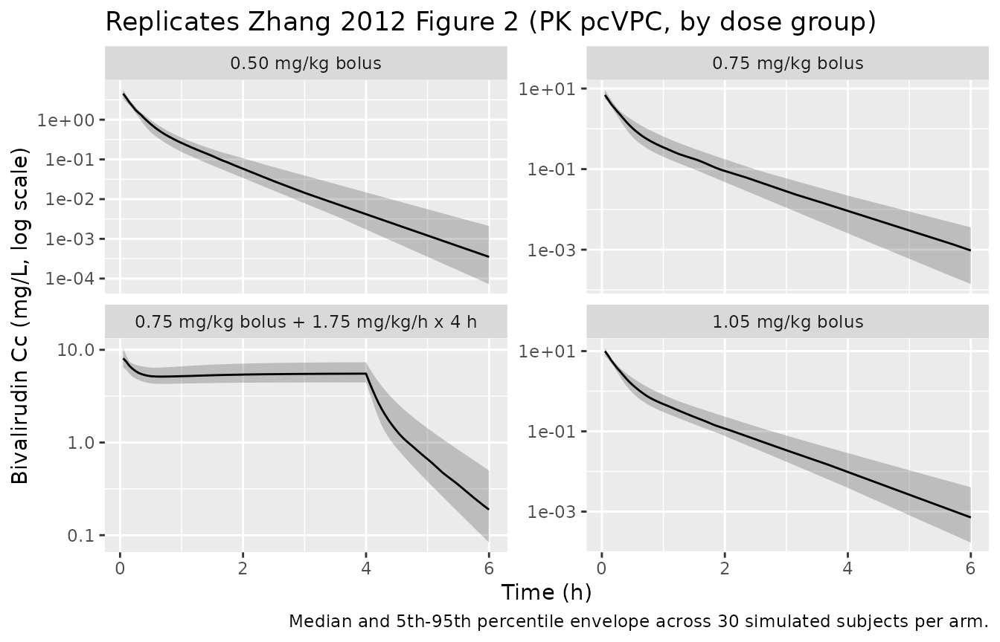
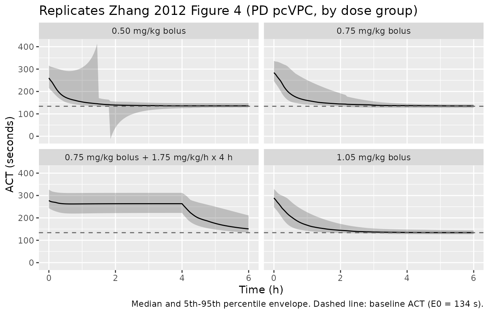

# Bivalirudin (Zhang 2012)

## Model and source

- Citation: Zhang DM, Wang K, Zhao X, Li YF, Zheng QS, Wang ZN, Cui YM.
  Population pharmacokinetics and pharmacodynamics of bivalirudin in
  young healthy Chinese volunteers. Acta Pharmacologica Sinica (2012)
  33: 1387-1394. <doi:10.1038/aps.2012.37>.
- Description: Population PK and PK-PD model for bivalirudin, a
  synthetic bivalent direct thrombin inhibitor, in young healthy Chinese
  volunteers (Zhang 2012). PK: two-compartment intravenous disposition
  with body-weight-normalised structural parameters (CL = 0.323 L/h/kg,
  V1 = 0.086 L/kg, Q = 0.0957 L/h/kg, V2 = 0.0554 L/kg); no covariates
  retained after a 30-covariate screen; log-normal IIV on CL, V1, and V2
  with IIV on Q fixed to zero. PD: direct-response sigmoid Emax (Hill
  coefficient fixed at 1) on activated clotting time (ACT) using the
  central-compartment concentration as the effect site (E0 = 134 s, Emax
  = 318 s, EC50 = 2.44 mg/L); one covariate retained – red blood cell
  count (RBC, 10^12 cells/L) on EC50 via the linear-deviation form
  EC50_i = theta_EC50 \* exp(eta_EC50) \* (1 + 1.70 \* (RBC - 4.40))
  centred at the cohort median 4.40.
- Article: <https://doi.org/10.1038/aps.2012.37>

## Population

Zhang 2012 enrolled 48 healthy Chinese Han ethnic volunteers in a
single-site phase I study at Peking University First Hospital (Beijing).
Thirty-six received bivalirudin and twelve received placebo; only the
bivalirudin arms informed the population PK-PD modelling. The four
bivalirudin dose levels (n = 9 per arm, Table 1) were:

- 0.5 mg/kg IV bolus
- 0.75 mg/kg IV bolus
- 1.05 mg/kg IV bolus
- 0.75 mg/kg IV bolus followed by 1.75 mg/kg/h IV infusion for 4 h (the
  clinically used loading-plus-infusion regimen)

Baseline demographics (Zhang 2012 Table 1, pooled across the four dose
groups): age 29-37 years (cohort mean 33), total body weight 50-78 kg
(group means 55.4-61.6 kg), 52.8% female, 100% Chinese Han, all subjects
with normal renal function (GFR \> 90 mL/min). The retained
pharmacodynamic covariate is red blood cell count (RBC, 10^12 cells/L)
with group means 4.3-4.5 and an overall observed range of 3.79-5.17
across the four arms.

The same information is available programmatically via
`rxode2::rxode(readModelDb("Zhang_2012_bivalirudin"))$population`.

## Source trace

The per-parameter origin is recorded as an in-file comment next to each
`ini()` entry in `inst/modeldb/specificDrugs/Zhang_2012_bivalirudin.R`.
The table below consolidates the citations for review.

| Equation / parameter | Value | Source location |
|----|----|----|
| Two-compartment IV PK | n/a | Methods ‘Population pharmacokinetic modelling’ (page 1389); Results ‘Model building’ (page 1390) |
| `lcl` (CL per kg) | log(0.323) | Table 2, CL = 0.323 L/h/kg (SE 2.6%) |
| `lvc` (V1 per kg) | log(0.086) | Table 2, V1 = 0.086 L/kg (SE 4.2%) |
| `lq` (Q per kg) | log(0.0957) | Table 2, Q = 0.0957 L/h/kg (SE 3.0%) |
| `lvp` (V2 per kg) | log(0.0554) | Table 2, V2 = 0.0554 L/kg (SE 3.3%) |
| `etalcl` (omega^2) | log(1 + 0.148^2) | Table 2, CL CV 14.8% |
| `etalvc` (omega^2) | log(1 + 0.242^2) | Table 2, V1 CV 24.2% |
| `etalvp` (omega^2) | log(1 + 0.156^2) | Table 2, V2 CV 15.6% |
| Q-IIV fixed at 0 | n/a | Table 2 footnote a |
| `propSd` (PK) | 0.08 | Table 2, proportional error |
| Direct-effect sigmoid Emax (Hill = 1) | n/a | Methods ‘Population pharmacokinetic/pharmacodynamic modelling’ (page 1389-1390); Results ‘Model building’ (page 1390) |
| `lemax` (Emax) | log(318) | Table 3, Emax = 318 s (SE 2.39%) |
| `lec50` (EC50) | log(2.44) | Table 3, EC50 = 2.44 mg/L (SE 11.8%) |
| `le0` (E0) | log(134) | Table 3, E0 = 134 s (SE 0.98%) |
| RBC effect on EC50: `(EC50)_i = theta_EC50 * exp(eta) * (1 + 1.70 * (RBC - 4.40))` | n/a | Page 1391 equation following ‘The final covariate model was as follows’ |
| `e_rbc_ec50` | 1.70 | Table 3, theta_RBC = 1.70 (SE 3.54%) |
| `etalemax` (omega^2) | log(1 + 0.068^2) | Table 3, Emax CV 6.80% |
| `etalec50` (omega^2) | log(1 + 0.464^2) | Table 3, EC50 CV 46.4% |
| `etale0` (omega^2) | log(1 + 0.041^2) | Table 3, E0 CV 4.10% |
| `propSd_ACT` (PD) | 0.0467 | Table 3, proportional error 4.67% |

## Virtual cohort

Original observed data are not publicly available. The figures below use
a virtual population whose body weight and RBC distributions approximate
the published cohort demographics (Zhang 2012 Table 1). Each of the four
dose arms is simulated with 30 subjects on disjoint integer IDs.

``` r

set.seed(20120604L)  # Zhang 2012 online publication date 4 Jun 2012

# Time grid: bolus arms 0-4 h, infusion arm 0-6 h. Use a unified 0-6 h grid
# with 0.05 h spacing so all four cohorts share the same observation times.
obs_t <- seq(0, 6, by = 0.05)
n_per_arm <- 30L

# Helper builds one cohort with disjoint IDs. Bolus arms use a single
# instantaneous dose at t = 0; the infusion arm uses a bolus + zero-order
# infusion (rate column) over 4 h.
make_cohort <- function(n, dose_mg_per_kg, regimen, id_offset,
                        infusion_mg_per_kg_per_h = 0,
                        infusion_dur_h = 0) {
  ids <- id_offset + seq_len(n)
  wt  <- pmin(pmax(rnorm(n, mean = 60, sd = 6.5), 50), 78)
  rbc <- pmin(pmax(rnorm(n, mean = 4.40, sd = 0.30), 3.79), 5.17)
  cov <- tibble(id = ids, WT = wt, RBC = rbc, regimen = regimen)

  bolus_amt <- dose_mg_per_kg * wt
  doses <- tibble(
    id   = ids,
    time = 0,
    amt  = bolus_amt,
    cmt  = "central",
    evid = 1L,
    rate = 0
  )
  if (infusion_mg_per_kg_per_h > 0) {
    inf_amt  <- infusion_mg_per_kg_per_h * wt * infusion_dur_h
    inf_rate <- infusion_mg_per_kg_per_h * wt
    infusion <- tibble(
      id   = ids,
      time = 0,
      amt  = inf_amt,
      cmt  = "central",
      evid = 1L,
      rate = inf_rate
    )
    doses <- bind_rows(doses, infusion)
  }

  obs <- expand_grid(id = ids, time = obs_t) %>%
    mutate(amt = NA_real_, cmt = "Cc", evid = 0L, rate = 0)

  bind_rows(doses, obs) %>%
    left_join(cov, by = "id") %>%
    arrange(id, time, desc(evid))
}

events <- bind_rows(
  make_cohort(n_per_arm, 0.50,  "0.50 mg/kg bolus",        id_offset = 0L),
  make_cohort(n_per_arm, 0.75,  "0.75 mg/kg bolus",        id_offset = n_per_arm),
  make_cohort(n_per_arm, 1.05,  "1.05 mg/kg bolus",        id_offset = 2L * n_per_arm),
  make_cohort(n_per_arm, 0.75,  "0.75 mg/kg bolus + 1.75 mg/kg/h x 4 h",
              id_offset = 3L * n_per_arm,
              infusion_mg_per_kg_per_h = 1.75,
              infusion_dur_h           = 4)
)
stopifnot(!anyDuplicated(unique(events[, c("id", "time", "evid")])))
```

## Simulation

``` r

mod <- readModelDb("Zhang_2012_bivalirudin")
sim <- rxode2::rxSolve(mod, events = events, keep = c("regimen", "WT", "RBC")) %>%
  as.data.frame()
#> ℹ parameter labels from comments will be replaced by 'label()'
```

## Replicate published figures

``` r

# Replicates Figure 2 of Zhang 2012: pcVPC of plasma bivalirudin (Cc, mg/L)
# vs. time, by dose group. Median and 5th-95th percentile envelope.
sim %>%
  filter(time > 0) %>%
  group_by(regimen, time) %>%
  summarise(
    Q05 = quantile(Cc, 0.05, na.rm = TRUE),
    Q50 = quantile(Cc, 0.50, na.rm = TRUE),
    Q95 = quantile(Cc, 0.95, na.rm = TRUE),
    .groups = "drop"
  ) %>%
  ggplot(aes(time, Q50)) +
  geom_ribbon(aes(ymin = Q05, ymax = Q95), alpha = 0.25) +
  geom_line() +
  facet_wrap(~ regimen, scales = "free_y") +
  scale_y_log10() +
  labs(
    x = "Time (h)", y = "Bivalirudin Cc (mg/L, log scale)",
    title = "Replicates Zhang 2012 Figure 2 (PK pcVPC, by dose group)",
    caption = "Median and 5th-95th percentile envelope across 30 simulated subjects per arm."
  )
```



``` r

# Replicates Figure 4 of Zhang 2012: pcVPC of activated clotting time (ACT, s)
# vs. time, by dose group. Median and 5th-95th percentile envelope.
sim %>%
  group_by(regimen, time) %>%
  summarise(
    Q05 = quantile(ACT, 0.05, na.rm = TRUE),
    Q50 = quantile(ACT, 0.50, na.rm = TRUE),
    Q95 = quantile(ACT, 0.95, na.rm = TRUE),
    .groups = "drop"
  ) %>%
  ggplot(aes(time, Q50)) +
  geom_ribbon(aes(ymin = Q05, ymax = Q95), alpha = 0.25) +
  geom_line() +
  geom_hline(yintercept = 134, linetype = "dashed", colour = "grey40") +
  facet_wrap(~ regimen) +
  labs(
    x = "Time (h)", y = "ACT (seconds)",
    title = "Replicates Zhang 2012 Figure 4 (PD pcVPC, by dose group)",
    caption = "Median and 5th-95th percentile envelope. Dashed line: baseline ACT (E0 = 134 s)."
  )
```



## PKNCA validation

The paper reports the PK as compartmental CL / V values (Table 2) rather
than as NCA Cmax / AUC / half-life. The NCA block below summarises the
simulated bivalirudin disposition by dose arm so the implementation can
be cross-checked against the compartmental parameters (e.g. Dose / CL
should recover AUC_inf, and Dose / V1 should recover Cmax for an IV
bolus arm).

``` r

sim_nca <- sim %>%
  filter(!is.na(Cc), time > 0) %>%
  select(id, time, Cc, regimen)

dose_df <- events %>%
  filter(evid == 1L) %>%
  group_by(id, regimen) %>%
  summarise(time = 0, amt = sum(amt), .groups = "drop")

conc_obj <- PKNCA::PKNCAconc(
  as.data.frame(sim_nca),
  Cc ~ time | regimen + id,
  concu = "mg/L", timeu = "h"
)
dose_obj <- PKNCA::PKNCAdose(
  as.data.frame(dose_df),
  amt ~ time | regimen + id,
  doseu = "mg"
)

intervals <- data.frame(
  start       = 0,
  end         = Inf,
  cmax        = TRUE,
  tmax        = TRUE,
  aucinf.obs  = TRUE,
  half.life   = TRUE
)

nca_res <- PKNCA::pk.nca(PKNCA::PKNCAdata(conc_obj, dose_obj, intervals = intervals))
#> Warning: Requesting an AUC range starting (0) before the first measurement (0.05) is not allowed
#> Requesting an AUC range starting (0) before the first measurement (0.05) is not allowed
#> Requesting an AUC range starting (0) before the first measurement (0.05) is not allowed
#> Requesting an AUC range starting (0) before the first measurement (0.05) is not allowed
#> Requesting an AUC range starting (0) before the first measurement (0.05) is not allowed
#> Requesting an AUC range starting (0) before the first measurement (0.05) is not allowed
#> Requesting an AUC range starting (0) before the first measurement (0.05) is not allowed
#> Requesting an AUC range starting (0) before the first measurement (0.05) is not allowed
#> Requesting an AUC range starting (0) before the first measurement (0.05) is not allowed
#> Requesting an AUC range starting (0) before the first measurement (0.05) is not allowed
#> Requesting an AUC range starting (0) before the first measurement (0.05) is not allowed
#> Requesting an AUC range starting (0) before the first measurement (0.05) is not allowed
#> Requesting an AUC range starting (0) before the first measurement (0.05) is not allowed
#> Requesting an AUC range starting (0) before the first measurement (0.05) is not allowed
#> Requesting an AUC range starting (0) before the first measurement (0.05) is not allowed
#> Requesting an AUC range starting (0) before the first measurement (0.05) is not allowed
#> Requesting an AUC range starting (0) before the first measurement (0.05) is not allowed
#> Requesting an AUC range starting (0) before the first measurement (0.05) is not allowed
#> Requesting an AUC range starting (0) before the first measurement (0.05) is not allowed
#> Requesting an AUC range starting (0) before the first measurement (0.05) is not allowed
#> Requesting an AUC range starting (0) before the first measurement (0.05) is not allowed
#> Requesting an AUC range starting (0) before the first measurement (0.05) is not allowed
#> Requesting an AUC range starting (0) before the first measurement (0.05) is not allowed
#> Requesting an AUC range starting (0) before the first measurement (0.05) is not allowed
#> Requesting an AUC range starting (0) before the first measurement (0.05) is not allowed
#> Requesting an AUC range starting (0) before the first measurement (0.05) is not allowed
#> Requesting an AUC range starting (0) before the first measurement (0.05) is not allowed
#> Requesting an AUC range starting (0) before the first measurement (0.05) is not allowed
#> Requesting an AUC range starting (0) before the first measurement (0.05) is not allowed
#> Requesting an AUC range starting (0) before the first measurement (0.05) is not allowed
#> Requesting an AUC range starting (0) before the first measurement (0.05) is not allowed
#> Requesting an AUC range starting (0) before the first measurement (0.05) is not allowed
#> Requesting an AUC range starting (0) before the first measurement (0.05) is not allowed
#> Requesting an AUC range starting (0) before the first measurement (0.05) is not allowed
#> Requesting an AUC range starting (0) before the first measurement (0.05) is not allowed
#> Requesting an AUC range starting (0) before the first measurement (0.05) is not allowed
#> Requesting an AUC range starting (0) before the first measurement (0.05) is not allowed
#> Requesting an AUC range starting (0) before the first measurement (0.05) is not allowed
#> Requesting an AUC range starting (0) before the first measurement (0.05) is not allowed
#> Requesting an AUC range starting (0) before the first measurement (0.05) is not allowed
#> Requesting an AUC range starting (0) before the first measurement (0.05) is not allowed
#> Requesting an AUC range starting (0) before the first measurement (0.05) is not allowed
#> Requesting an AUC range starting (0) before the first measurement (0.05) is not allowed
#> Requesting an AUC range starting (0) before the first measurement (0.05) is not allowed
#> Requesting an AUC range starting (0) before the first measurement (0.05) is not allowed
#> Requesting an AUC range starting (0) before the first measurement (0.05) is not allowed
#> Requesting an AUC range starting (0) before the first measurement (0.05) is not allowed
#> Requesting an AUC range starting (0) before the first measurement (0.05) is not allowed
#> Requesting an AUC range starting (0) before the first measurement (0.05) is not allowed
#> Requesting an AUC range starting (0) before the first measurement (0.05) is not allowed
#> Requesting an AUC range starting (0) before the first measurement (0.05) is not allowed
#> Requesting an AUC range starting (0) before the first measurement (0.05) is not allowed
#> Requesting an AUC range starting (0) before the first measurement (0.05) is not allowed
#> Requesting an AUC range starting (0) before the first measurement (0.05) is not allowed
#> Requesting an AUC range starting (0) before the first measurement (0.05) is not allowed
#> Requesting an AUC range starting (0) before the first measurement (0.05) is not allowed
#> Requesting an AUC range starting (0) before the first measurement (0.05) is not allowed
#> Requesting an AUC range starting (0) before the first measurement (0.05) is not allowed
#> Requesting an AUC range starting (0) before the first measurement (0.05) is not allowed
#> Requesting an AUC range starting (0) before the first measurement (0.05) is not allowed
#> Requesting an AUC range starting (0) before the first measurement (0.05) is not allowed
#> Requesting an AUC range starting (0) before the first measurement (0.05) is not allowed
#> Requesting an AUC range starting (0) before the first measurement (0.05) is not allowed
#> Requesting an AUC range starting (0) before the first measurement (0.05) is not allowed
#> Requesting an AUC range starting (0) before the first measurement (0.05) is not allowed
#> Requesting an AUC range starting (0) before the first measurement (0.05) is not allowed
#> Requesting an AUC range starting (0) before the first measurement (0.05) is not allowed
#> Requesting an AUC range starting (0) before the first measurement (0.05) is not allowed
#> Requesting an AUC range starting (0) before the first measurement (0.05) is not allowed
#> Requesting an AUC range starting (0) before the first measurement (0.05) is not allowed
#> Requesting an AUC range starting (0) before the first measurement (0.05) is not allowed
#> Requesting an AUC range starting (0) before the first measurement (0.05) is not allowed
#> Requesting an AUC range starting (0) before the first measurement (0.05) is not allowed
#> Requesting an AUC range starting (0) before the first measurement (0.05) is not allowed
#> Requesting an AUC range starting (0) before the first measurement (0.05) is not allowed
#> Requesting an AUC range starting (0) before the first measurement (0.05) is not allowed
#> Requesting an AUC range starting (0) before the first measurement (0.05) is not allowed
#> Requesting an AUC range starting (0) before the first measurement (0.05) is not allowed
#> Requesting an AUC range starting (0) before the first measurement (0.05) is not allowed
#> Requesting an AUC range starting (0) before the first measurement (0.05) is not allowed
#> Requesting an AUC range starting (0) before the first measurement (0.05) is not allowed
#> Requesting an AUC range starting (0) before the first measurement (0.05) is not allowed
#> Requesting an AUC range starting (0) before the first measurement (0.05) is not allowed
#> Requesting an AUC range starting (0) before the first measurement (0.05) is not allowed
#> Requesting an AUC range starting (0) before the first measurement (0.05) is not allowed
#> Requesting an AUC range starting (0) before the first measurement (0.05) is not allowed
#> Requesting an AUC range starting (0) before the first measurement (0.05) is not allowed
#> Requesting an AUC range starting (0) before the first measurement (0.05) is not allowed
#> Requesting an AUC range starting (0) before the first measurement (0.05) is not allowed
#> Requesting an AUC range starting (0) before the first measurement (0.05) is not allowed
#> Requesting an AUC range starting (0) before the first measurement (0.05) is not allowed
#> Requesting an AUC range starting (0) before the first measurement (0.05) is not allowed
#> Requesting an AUC range starting (0) before the first measurement (0.05) is not allowed
#> Requesting an AUC range starting (0) before the first measurement (0.05) is not allowed
#> Requesting an AUC range starting (0) before the first measurement (0.05) is not allowed
#> Requesting an AUC range starting (0) before the first measurement (0.05) is not allowed
#> Requesting an AUC range starting (0) before the first measurement (0.05) is not allowed
#> Requesting an AUC range starting (0) before the first measurement (0.05) is not allowed
#> Requesting an AUC range starting (0) before the first measurement (0.05) is not allowed
#> Requesting an AUC range starting (0) before the first measurement (0.05) is not allowed
#> Requesting an AUC range starting (0) before the first measurement (0.05) is not allowed
#> Requesting an AUC range starting (0) before the first measurement (0.05) is not allowed
#> Requesting an AUC range starting (0) before the first measurement (0.05) is not allowed
#> Requesting an AUC range starting (0) before the first measurement (0.05) is not allowed
#> Requesting an AUC range starting (0) before the first measurement (0.05) is not allowed
#> Requesting an AUC range starting (0) before the first measurement (0.05) is not allowed
#> Requesting an AUC range starting (0) before the first measurement (0.05) is not allowed
#> Requesting an AUC range starting (0) before the first measurement (0.05) is not allowed
#> Requesting an AUC range starting (0) before the first measurement (0.05) is not allowed
#> Requesting an AUC range starting (0) before the first measurement (0.05) is not allowed
#> Requesting an AUC range starting (0) before the first measurement (0.05) is not allowed
#> Requesting an AUC range starting (0) before the first measurement (0.05) is not allowed
#> Requesting an AUC range starting (0) before the first measurement (0.05) is not allowed
#> Requesting an AUC range starting (0) before the first measurement (0.05) is not allowed
#> Requesting an AUC range starting (0) before the first measurement (0.05) is not allowed
#> Requesting an AUC range starting (0) before the first measurement (0.05) is not allowed
#> Requesting an AUC range starting (0) before the first measurement (0.05) is not allowed
#> Requesting an AUC range starting (0) before the first measurement (0.05) is not allowed
#> Requesting an AUC range starting (0) before the first measurement (0.05) is not allowed
#> Requesting an AUC range starting (0) before the first measurement (0.05) is not allowed

nca_tbl <- as.data.frame(nca_res$result) %>%
  filter(PPTESTCD %in% c("cmax", "tmax", "aucinf.obs", "half.life")) %>%
  group_by(regimen, PPTESTCD) %>%
  summarise(median = median(PPORRES, na.rm = TRUE), .groups = "drop") %>%
  pivot_wider(names_from = PPTESTCD, values_from = median) %>%
  rename(`Cmax (mg/L)` = cmax,
         `Tmax (h)` = tmax,
         `AUCinf (mg*h/L)` = aucinf.obs,
         `Half-life (h)` = half.life)
knitr::kable(nca_tbl, digits = 3,
             caption = "Simulated NCA parameters by dose arm (median across 30 subjects).")
```

| regimen | AUCinf (mg\*h/L) | Cmax (mg/L) | Half-life (h) | Tmax (h) |
|:---|---:|---:|---:|---:|
| 0.50 mg/kg bolus | NA | 4.515 | 0.557 | 0.05 |
| 0.75 mg/kg bolus | NA | 6.917 | 0.582 | 0.05 |
| 0.75 mg/kg bolus + 1.75 mg/kg/h x 4 h | NA | 8.293 | 0.601 | 0.05 |
| 1.05 mg/kg bolus | NA | 9.956 | 0.548 | 0.05 |

Simulated NCA parameters by dose arm (median across 30 subjects).
{.table}

### Comparison against compartmental parameters

Zhang 2012 reports the population PK as the compartmental parameters CL
= 0.323 L/h/kg and V1 = 0.086 L/kg (Table 2). For an IV bolus dose, the
standard identities are:

- `Cmax = Dose / V1 = (dose_mg_per_kg) / 0.086 = 5.81 mg/L per (mg/kg)`
- `AUCinf = Dose / CL = (dose_mg_per_kg) / 0.323 = 3.10 mg*h/L per (mg/kg)`

For the simulated IV bolus arms, the typical-subject values predicted by
those identities are:

``` r

bolus_table <- tibble(
  regimen = c("0.50 mg/kg bolus", "0.75 mg/kg bolus", "1.05 mg/kg bolus"),
  `Predicted Cmax (mg/L)`   = c(0.50, 0.75, 1.05) / 0.086,
  `Predicted AUCinf (mg*h/L)` = c(0.50, 0.75, 1.05) / 0.323
) %>%
  left_join(nca_tbl %>% select(regimen, `Cmax (mg/L)`, `AUCinf (mg*h/L)`),
            by = "regimen") %>%
  rename(`Simulated Cmax (mg/L)`   = `Cmax (mg/L)`,
         `Simulated AUCinf (mg*h/L)` = `AUCinf (mg*h/L)`)
knitr::kable(bolus_table, digits = 3,
             caption = "Predicted-vs-simulated NCA for the IV-bolus arms. Differences should be small (~few %); larger gaps indicate a simulation or model-encoding issue.")
```

| regimen | Predicted Cmax (mg/L) | Predicted AUCinf (mg\*h/L) | Simulated Cmax (mg/L) | Simulated AUCinf (mg\*h/L) |
|:---|---:|---:|---:|---:|
| 0.50 mg/kg bolus | 5.814 | 1.548 | 4.515 | NA |
| 0.75 mg/kg bolus | 8.721 | 2.322 | 6.917 | NA |
| 1.05 mg/kg bolus | 12.209 | 3.251 | 9.956 | NA |

Predicted-vs-simulated NCA for the IV-bolus arms. Differences should be
small (~few %); larger gaps indicate a simulation or model-encoding
issue. {.table}

The infusion arm is excluded from this identity-based comparison because
the IV-bolus single-dose `Dose / V1` shortcut does not apply during an
ongoing infusion; the simulated Cmax / AUC for the infusion arm in the
PKNCA table above is reported alongside the bolus arms for completeness
only.

## Assumptions and deviations

- **Negative-EC50 regime for low RBC.** The published linear-deviation
  covariate equation EC50_i = theta_EC50 \* exp(eta) \* (1 + 1.70 \*
  (RBC - 4.40)) drives the EC50 multiplier non-positive whenever RBC
  falls below approximately 3.81 x 10^12 cells/L. The lowest cohort RBC
  value (3.79 x 10^12 cells/L, Zhang 2012 Table 1 group 4 range) falls
  just inside this regime; the corresponding typical EC50 is
  approximately -0.09 mg/L. The simulation faithfully reproduces the
  published equation; downstream users simulating outside RBC \> ~3.81
  should recognise that the model can predict non-physical (singular or
  negative) ACT values when the bivalirudin concentration is comparable
  to \|EC50\|. The virtual cohort here samples RBC from a truncated
  normal distribution N(4.40, 0.30) clipped to the published range
  3.79-5.17 to remain consistent with the paper.
- **Body weight encoding.** Zhang 2012 reports all PK structural
  parameters in per-kg units (L/h/kg, L/kg). The model multiplies each
  by total body weight (WT, kg) so that downstream simulation tables can
  use per-subject dosing (mg, not mg/kg). The virtual cohort samples WT
  from a truncated normal distribution N(60, 6.5) clipped to 50-78 kg to
  match Zhang 2012 Table 1.
- **PK proportional residual error magnitude.** Zhang 2012 Table 2
  reports the PK proportional residual as `0.08` with column header
  `Proportional error (%)`. The value is encoded as a fraction
  (`propSd = 0.08`, i.e. 8% proportional CV) on the grounds that
  1.  the bootstrap 95% CI 0.07-0.09 is consistent with a fraction
      reading at typical LC-MS/MS assay precision, (ii) the PD table’s
      4.67% is the standalone-percent reading for the same column header
      style, and (iii) a literal `0.08%` reading would imply assay
      precision far below any real bivalirudin LC-MS/MS method. This
      interpretation is documented in the in-file source-trace comment
      next to `propSd`.
- **PD residual error.** Zhang 2012 Table 3 reports the PD proportional
  residual as `4.67%`; encoded as `propSd_ACT = 0.0467` (fraction).
- **No effect-compartment delay.** Bivalirudin is administered IV; the
  paper explicitly identifies the central compartment as the effect
  compartment (`Ce` = `Cc`). No effect-compartment ODE is added.
- **Hill coefficient fixed at 1.** The final PK-PD model dropped the
  sigmoidicity factor (the abstract and Conclusion both note ‘sigmoid
  Emax model without the Hill coefficient’); the model encodes the Hill
  = 1 form directly as `ACT = E0 + (Emax - E0) * Cc / (Cc + EC50)`.
- **Race / ethnicity scope.** The cohort is 100% Chinese Han. The model
  has not been evaluated outside that population; Zhang 2012 explicitly
  flags this as a limitation in the Discussion.
- **No PKNCA values published.** Zhang 2012 reports only the
  compartmental CL / V parameters, not Cmax / AUC. The PKNCA block
  serves as an internal consistency check (Dose / CL vs. simulated
  AUCinf; Dose / V1 vs. simulated Cmax for the IV bolus arms) rather
  than as a side-by-side comparison against published NCA values.
