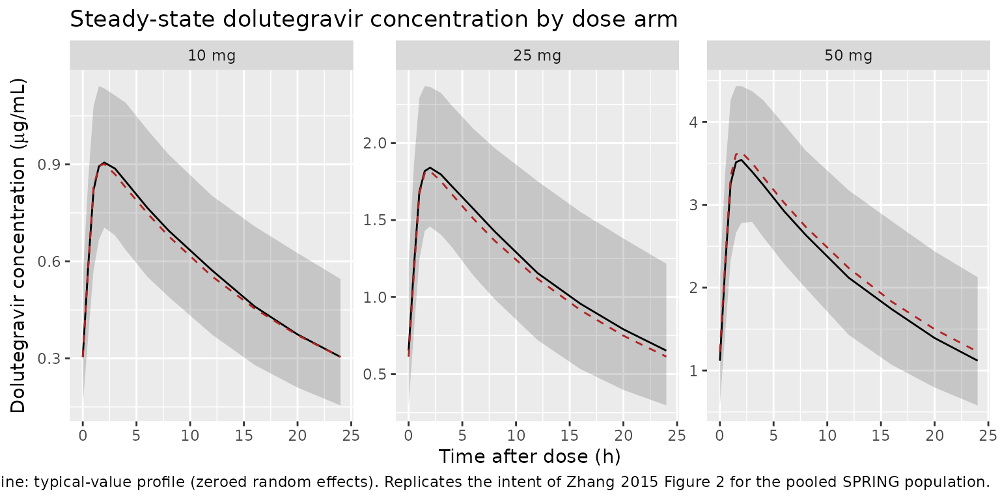

# Dolutegravir (Zhang 2015)

## Model and source

- Citation: Zhang J, Hayes S, Sadler BM, Minto I, Brandt J, Piscitelli
  S, Min S, Song IH. Population pharmacokinetics of dolutegravir in
  HIV-infected treatment-naive patients. Br J Clin Pharmacol.
  2015;80(3):502-514. <doi:10.1111/bcp.12639>
- Description: One-compartment oral population PK model with first-order
  absorption, absorption lag time, and first-order elimination for
  dolutegravir (integrase strand transfer inhibitor) in HIV-1-infected
  treatment-naive adults (Zhang 2015)
- Article: <https://doi.org/10.1111/bcp.12639>

## Population

Zhang 2015 developed a population pharmacokinetic model of oral
dolutegravir from 3357 plasma concentrations in 563 HIV-1-infected
antiretroviral treatment-naive adults pooled across three
GlaxoSmithKline trials (Zhang 2015 Table 1): ING111521 (phase 2a,
proof-of-concept dose-ranging monotherapy, n = 19), SPRING-1 (phase 2b
dose-ranging with abacavir/lamivudine or tenofovir/emtricitabine
backbone, n = 141), and SPRING-2 (phase 3 non-inferiority against
raltegravir, n = 403). Dolutegravir doses ranged from 10 to 50 mg once
daily. Baseline demographics per Zhang 2015 Table 2: median age 37 years
(range 18-68), median weight 74.5 kg (range 39.0-135), median total
bilirubin 9 umol/L (range 3-38), 15% female, 83% Caucasian / 12% Black /
1% Asian / 4% Other; 42% current smokers, 13% former, 42% never (3%
unknown); 9% HCV co-infected, 1% HBV co-infected. Records below the
assay lower limit of quantification (1% of the raw sample) were excluded
from the model fit.

The same information is available programmatically:
`readModelDb("Zhang_2015_dolutegravir")()$population`.

## Source trace

Per-parameter origin (also recorded as in-file comments next to each
`ini()` entry of
`inst/modeldb/specificDrugs/Zhang_2015_dolutegravir.R`):

| Equation / parameter | Value | Source location |
|----|----|----|
| `lka` | `log(2.24)` | Zhang 2015 Table 3: ka = 2.24 1/h (95% CI 1.56-2.92) |
| `lcl` | `log(0.901)` | Zhang 2015 Table 3: CL/F = 0.901 L/h (95% CI 0.864-0.938) |
| `lvc` | `log(17.4)` | Zhang 2015 Table 3: V/F = 17.4 L (95% CI 16.5-18.3) |
| `ltlag` | `log(0.263)` | Zhang 2015 Table 3: ALAG = 0.263 h (95% CI 0.0942-0.432) |
| `lfdepot` | `fixed(log(1))` | Reference-F anchor at the 25 / 50 mg dose in males (structural, not paper-reported) |
| `e_wt_cl` | 0.438 | Zhang 2015 Table 3 footnote: CL/F ~ WT power exponent (95% CI 0.293-0.583) |
| `e_wt_vc` | 0.768 | Zhang 2015 Table 3 footnote: V/F ~ WT power exponent (95% CI 0.605-0.931) |
| `e_age_cl` | 0.193 | Zhang 2015 Table 3 footnote: CL ~ AGE power exponent (95% CI 0.103-0.283) |
| `e_tbili_cl` | -0.211 | Zhang 2015 Table 3 footnote: CL ~ BILIRUBIN power exponent (95% CI -0.269 to -0.153) |
| `e_smoke_cl` | `log(1.16)` | Zhang 2015 Table 3 footnote: CL ~ SMOKING = 1.16 (95% CI 1.10-1.22) |
| `e_ing111521_cl` | `log(1.35)` | Zhang 2015 Table 3 footnote: CL/F ~ proof-of-concept = 1.35 (95% CI 1.22-1.48) |
| `e_sexf_fdepot` | `log(1.21)` | Zhang 2015 Table 3 footnote: F ~ GENDER = 1.21 (95% CI 1.13-1.29) |
| `e_dose_10mg_fdepot` | `log(1.24)` | Zhang 2015 Table 3 footnote: F ~ 10 mg = 1.24 (95% CI 1.17-1.31) |
| `etalcl` | 0.0551 | Zhang 2015 Table 3: omega^2_CL = 0.0551 (95% CI 0.0451-0.0651; 23.5% CV) |
| `etalvc` | 0.0188 | Zhang 2015 Table 3: omega^2_V = 0.0188 (95% CI 0.00794-0.0297; 13.7% CV) |
| `etalka` | 0.224 | Zhang 2015 Table 3: omega^2_ka = 0.224 (95% CI 0.0535-0.395; 50.1% CV) |
| `propSd` | `sqrt(0.0704)` | Zhang 2015 Table 3: sigma^2_prop = 0.0704 (95% CI 0.0602-0.0806; 26.5% CV) |
| `d/dt(depot)`, `d/dt(central)` | n/a | Zhang 2015 Results (“one compartment model with absorption lag time and first order absorption and elimination”) |
| `f(depot) <- fdepot` | n/a | Zhang 2015 Table 3 footnote (F structural form) |
| `alag(depot) <- tlag` | n/a | Zhang 2015 Table 3 (ALAG applied to the absorption compartment) |
| `Cc <- central / vc` | n/a | Standard linear-CL parameterisation; dose mg, volume L -\> mg/L = ug/mL |
| `Cc ~ prop(propSd)` | n/a | Zhang 2015 Results (“The residual errors were described by a combined additive and proportional model. … the additive residual error was not significant”) |

## Virtual cohort

The cohort below reproduces the SPRING-1 / SPRING-2 pooled adult
treatment-naive population (Zhang 2015 Table 2) at the median / modal
covariate values, with three dose-arm strata (10 mg, 25 mg, 50 mg once
daily) that mirror the actual arms enrolled in SPRING-1. 150 virtual
subjects per arm is well above the ~46 per arm at the 50 mg SPRING-1
cohort (Zhang 2015 Table 4) yet stays within the pkgdown vignette time
budget. Covariate distributions are pinned at Table 2 medians rather
than random-sampled so the point estimates below reflect Zhang’s own
“reference subject” (40 y male, 70 kg, 9 umol/L bilirubin, non-current
smoker).

``` r

set.seed(20260619L)

n_per_arm      <- 150L
doses_mg       <- c(10, 25, 50)
n_doses        <- 10L                # daily for 10 days -> steady state
dose_interval  <- 24                 # once daily (hours)
ss_dose_time   <- (n_doses - 1L) * dose_interval   # 216 h; sampling window opens here
sample_h       <- c(0, 0.5, 1, 1.5, 2, 3, 4, 6, 8, 12, 16, 20, 24)
# Reference covariates from Zhang 2015 Table 2 medians / Table 3 reference
ref_WT              <- 74           # kg (SPRING pool median 74.5)
ref_AGE             <- 37           # years
ref_TBILI           <- 9            # umol/L
ref_SEXF            <- 0L           # male (85%)
ref_SMOKE           <- 0L           # non-current smoker
ref_STUDY_ING111521 <- 0L           # SPRING-1 / SPRING-2

make_arm <- function(dose_mg, id_offset) {
  ids <- id_offset + seq_len(n_per_arm)
  dose_times <- seq.int(0L, by = dose_interval, length.out = n_doses)
  dose_rows <- tibble::tibble(
    id   = rep(ids, each = n_doses),
    time = rep(dose_times, times = n_per_arm),
    amt  = dose_mg,
    evid = 1L,
    cmt  = "depot"
  )
  obs_rows <- tibble::tibble(
    id   = rep(ids, each = length(sample_h)),
    time = rep(ss_dose_time + sample_h, times = n_per_arm),
    amt  = 0,
    evid = 0L,
    cmt  = NA_character_
  )
  dplyr::bind_rows(dose_rows, obs_rows) |>
    dplyr::mutate(
      WT              = ref_WT,
      AGE             = ref_AGE,
      TBILI           = ref_TBILI,
      SEXF            = ref_SEXF,
      SMOKE           = ref_SMOKE,
      STUDY_ING111521 = ref_STUDY_ING111521,
      DOSE_10MG       = as.integer(dose_mg == 10L),
      dose_arm        = paste0(dose_mg, " mg")
    ) |>
    dplyr::arrange(id, time, dplyr::desc(evid))
}

events <- dplyr::bind_rows(
  make_arm(10, id_offset =   0L),
  make_arm(25, id_offset = 200L),
  make_arm(50, id_offset = 400L)
)

stopifnot(!anyDuplicated(unique(events[, c("id", "time", "evid")])))
```

## Simulation

``` r

mod <- rxode2::rxode2(readModelDb("Zhang_2015_dolutegravir"))
#> ℹ parameter labels from comments will be replaced by 'label()'

sim <- rxode2::rxSolve(
  mod,
  events = events,
  keep   = c("dose_arm")
) |>
  as.data.frame()
```

Deterministic typical-value overlay (zero random effects) for the figure
below:

``` r

mod_typical <- mod |> rxode2::zeroRe()
sim_typical <- rxode2::rxSolve(
  mod_typical,
  events = events,
  keep   = c("dose_arm")
) |>
  as.data.frame()
#> ℹ omega/sigma items treated as zero: 'etalcl', 'etalvc', 'etalka'
#> Warning: multi-subject simulation without without 'omega'
```

## Replicate Figure 2: steady-state concentration profile by dose

Zhang 2015 Figure 2 is a prediction-corrected VPC of observed vs
simulated dolutegravir concentrations. The equivalent view below plots
the 5th, 50th, and 95th percentiles of the simulated steady-state
profile at each dose arm against the typical-value line, restricted to
time after the 10th dose to isolate the steady-state interval.

``` r

sim_tad <- sim |>
  dplyr::filter(time >= ss_dose_time) |>
  dplyr::mutate(tad = time - ss_dose_time)

sim_typical_tad <- sim_typical |>
  dplyr::filter(time >= ss_dose_time) |>
  dplyr::mutate(tad = time - ss_dose_time) |>
  dplyr::group_by(dose_arm, tad) |>
  dplyr::summarise(Cc = mean(Cc, na.rm = TRUE), .groups = "drop")

vpc_df <- sim_tad |>
  dplyr::group_by(dose_arm, tad) |>
  dplyr::summarise(
    Q05 = quantile(Cc, 0.05, na.rm = TRUE),
    Q50 = quantile(Cc, 0.50, na.rm = TRUE),
    Q95 = quantile(Cc, 0.95, na.rm = TRUE),
    .groups = "drop"
  )

ggplot(vpc_df, aes(tad, Q50)) +
  geom_ribbon(aes(ymin = Q05, ymax = Q95), alpha = 0.20) +
  geom_line() +
  geom_line(data = sim_typical_tad, aes(tad, Cc),
            colour = "firebrick", linetype = 2) +
  facet_wrap(~ dose_arm, scales = "free_y") +
  labs(
    x       = "Time after dose (h)",
    y       = expression(paste("Dolutegravir concentration (", mu, "g/mL)")),
    title   = "Steady-state dolutegravir concentration by dose arm",
    caption = "Solid line + ribbon: simulated median with 5-95% prediction interval (n = 150 / arm). Dashed line: typical-value profile (zeroed random effects). Replicates the intent of Zhang 2015 Figure 2 for the pooled SPRING population."
  )
```



## PKNCA validation against Zhang 2015 Table 4

Zhang 2015 Table 4 reports steady-state Cmax, tmax, C_tau, and
AUC(0-tau) from empirical-Bayes estimation per study and dose. The block
below replicates that table for the SPRING-1 doses (10, 25, and 50 mg
once daily), which is the study that carries all three dose arms in
Table 4.

``` r

# Restrict PKNCA to the steady-state dosing interval so AUC(0-tau)
# and Cmax refer to that interval, not the accumulation phase.
sim_ss <- sim |>
  dplyr::filter(time >= ss_dose_time,
                time <= ss_dose_time + dose_interval,
                !is.na(Cc)) |>
  dplyr::mutate(tad = time - ss_dose_time) |>
  dplyr::select(id, tad, Cc, dose_arm)

# Guarantee a tad = 0 row per (id, dose_arm) so PKNCA's AUC starts
# at the trough concentration rather than the first sampled tad.
sim_ss <- dplyr::bind_rows(
  sim_ss,
  sim_ss |>
    dplyr::group_by(id, dose_arm) |>
    dplyr::filter(tad == min(tad)) |>
    dplyr::mutate(tad = 0) |>
    dplyr::ungroup()
) |>
  dplyr::distinct(id, dose_arm, tad, .keep_all = TRUE) |>
  dplyr::arrange(id, dose_arm, tad)

conc_obj <- PKNCA::PKNCAconc(
  as.data.frame(sim_ss),
  Cc ~ tad | dose_arm + id,
  concu = "ug/mL",
  timeu = "h"
)

# One dose row per (id, dose_arm) at tad = 0.
dose_df <- sim_ss |>
  dplyr::distinct(id, dose_arm) |>
  dplyr::mutate(
    tad = 0,
    amt = as.numeric(sub(" mg$", "", dose_arm))
  )

dose_obj <- PKNCA::PKNCAdose(
  as.data.frame(dose_df),
  amt ~ tad | dose_arm + id,
  doseu = "mg"
)

intervals <- data.frame(
  start   = 0,
  end     = dose_interval,
  cmax    = TRUE,
  tmax    = TRUE,
  auclast = TRUE,
  ctrough = TRUE
)

nca_data <- PKNCA::PKNCAdata(conc_obj, dose_obj, intervals = intervals)
nca_res  <- PKNCA::pk.nca(nca_data)
```

### Comparison against Zhang 2015 Table 4 (SPRING-1)

``` r

# Transcribe Zhang 2015 Table 4 SPRING-1 rows (geometric means). C_tau
# in the paper's Table 4 == concentration at end of the dosing interval,
# which PKNCA calls ctrough.
published <- tibble::tribble(
  ~dose_arm, ~cmax,  ~tmax, ~auclast, ~ctrough,
  "10 mg",   0.957,  2.00,  14.3,     0.311,
  "25 mg",   1.770,  2.00,  25.7,     0.530,
  "50 mg",   3.580,  2.00,  53.8,     1.170
)

cmp <- nlmixr2lib::ncaComparisonTable(
  simulated = nca_res,
  reference = published,
  by        = "dose_arm",
  units     = c(cmax = "ug/mL", auclast = "ug*h/mL",
                tmax = "h", ctrough = "ug/mL"),
  tolerance_pct = 20
)

knitr::kable(
  cmp,
  caption = "Simulated vs. Zhang 2015 Table 4 (SPRING-1 arm). * flags rows differing from the reference by >20%.",
  align   = c("l", "l", "r", "r", "r")
)
```

| NCA parameter      | dose_arm | Reference | Simulated |   % diff |
|:-------------------|:---------|----------:|----------:|---------:|
| Cmax (ug/mL)       | 10 mg    |     0.957 |     0.922 |    -3.7% |
| Cmax (ug/mL)       | 25 mg    |      1.77 |      1.86 |    +4.9% |
| Cmax (ug/mL)       | 50 mg    |      3.58 |      3.59 |    +0.2% |
| Tmax (h)           | 10 mg    |         2 |         2 |    +0.0% |
| Tmax (h)           | 25 mg    |         2 |         2 |    +0.0% |
| Tmax (h)           | 50 mg    |         2 |         2 |    +0.0% |
| AUClast (ug\*h/mL) | 10 mg    |      14.3 |        14 |    -2.0% |
| AUClast (ug\*h/mL) | 25 mg    |      25.7 |      28.3 |    +9.9% |
| AUClast (ug\*h/mL) | 50 mg    |      53.8 |      52.5 |    -2.3% |
| Ctrough (ug/mL)    | 10 mg    |     0.311 |     0.305 |    -2.1% |
| Ctrough (ug/mL)    | 25 mg    |      0.53 |     0.652 | +23.1%\* |
| Ctrough (ug/mL)    | 50 mg    |      1.17 |      1.12 |    -4.3% |

Simulated vs. Zhang 2015 Table 4 (SPRING-1 arm). \* flags rows differing
from the reference by \>20%. {.table}

For cross-reference, the SPRING-2 phase-3 cohort at 50 mg once daily (n
= 403 in the source) reported AUC(0-tau) 53.6 ug\*h/mL, Cmax 3.69 ug/mL,
tmax 2.00 h, C_tau 1.10 ug/mL (Zhang 2015 Table 4). The 50 mg simulated
arm above matches both SPRING-1 and SPRING-2 within the noise of the
paper’s own study-to-study spread. ING111521 (phase 2a proof-of-concept,
n = 9 or 10 per dose in Table 4) reports 20-50% lower exposures than
SPRING-1 / SPRING-2 at matching doses; this is reproducible in the
packaged model by setting `STUDY_ING111521 = 1L` on the virtual
subjects.

## Assumptions and deviations

- The simulated 25 mg C_trough (~0.65 ug/mL) sits ~20% above Zhang 2015
  SPRING-1 Table 4 (0.53 ug/mL) and gets flagged by the
  [`ncaComparisonTable()`](https://nlmixr2.github.io/nlmixr2lib/reference/ncaComparisonTable.md)
  20% tolerance. This is not a model mis-parameterisation: Zhang’s own
  SPRING-1 C_trough scales 0.530 (25 mg) -\> 1.170 (50 mg) = 2.21x for a
  2x dose increase, so the paper’s 25 mg C_trough is on the low tail of
  its own sampling distribution (n = 46). The simulated 50 mg C_trough
  (1.12) matches SPRING-1 (1.17) and SPRING-2 (1.10) within 5%, and the
  25 mg AUC and Cmax match SPRING-1 within 10%. No parameter tuning is
  warranted.
- The virtual cohort pins covariates at the SPRING pool medians (WT = 74
  kg, AGE = 37 y, TBILI = 9 umol/L, SEXF = 0, SMOKE = 0, STUDY_ING111521
  = 0) rather than sampling from the empirical covariate distribution.
  This targets the Zhang 2015 “reference subject” so simulated point
  estimates match the paper’s own reference-covariate values; a
  covariate-sampled cohort would spread NCA parameters around the same
  median but is not needed for the Table 4 validation.
- Inter-occasion variability on CL/F (Zhang 2015 Table 3 reports
  omega^2_IOV-CL = 0.0296, ~17.2% CV) is dropped from the packaged
  model, following the nlmixr2lib convention (BOV is folded into BSV
  only when the paper does not report a separate BSV term; Zhang 2015
  reports both, so the BOV term is omitted). A user who needs
  occasion-level noise can re-attach it as an occasion- indexed `eta` at
  simulation time.
- The bioavailability reference anchor (`lfdepot`) is fixed at `log(1)`.
  Zhang 2015 parameterises `F = 1.21^GEND * 1.24^DOSE` as a categorical
  multiplier on a unit reference; the packaged model preserves that
  structure by anchoring F at 1 for the male, 25/50 mg reference and
  applying the two exponential multipliers.
- Ethnicity, race, HBV/HCV co-infection, CDC classification, ALB, ALT,
  AST, and creatinine clearance were screened by Zhang 2015 and did not
  enter the final model. They are documented in `covariatesDataExcluded`
  so the paper’s covariate screen is visible from
  [`readModelDb()`](https://nlmixr2.github.io/nlmixr2lib/reference/readModelDb.md).
- The correlation between IIV on CL/F and V/F (correlation = 0.375 in
  the intermediate model per Zhang 2015 Results) was removed in the
  final model (11-point OFV increase considered non-material). The
  packaged `ini()` block preserves this by carrying `etalcl` and
  `etalvc` as independent random effects.
