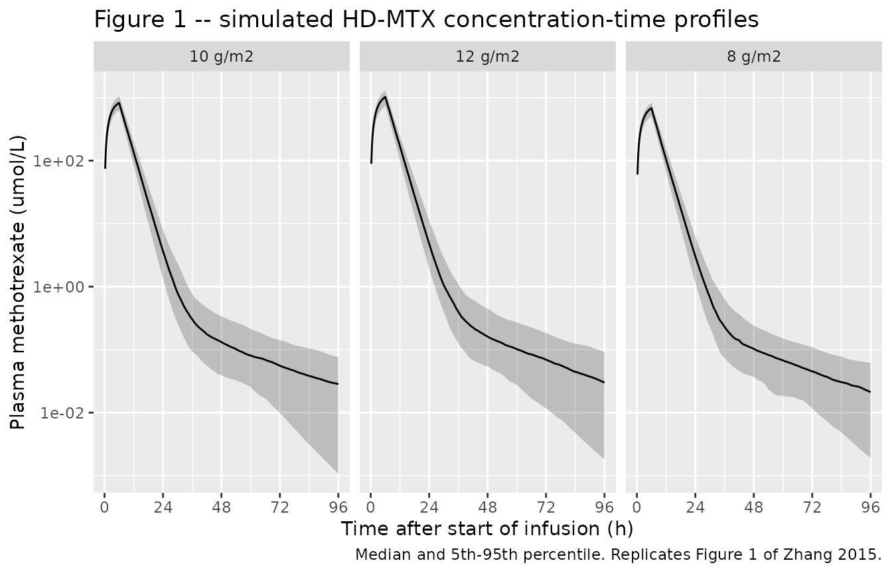

# Methotrexate (Zhang 2015)

## Model and source

- Citation: Zhang W, Zhang Q, Tian X, Zhao H, Lu W, Zhen J, Niu X.
  (2015). Population Pharmacokinetics of High-dose Methotrexate After
  Intravenous Administration in Chinese Osteosarcoma Patients from a
  Single Institution. Chin Med J (Engl) 128(1):111-118.
  <doi:10.4103/0366-6999.147829>.
- Description: Two-compartment population PK model for intravenous
  high-dose methotrexate (8-12 g/m^2 infused over 4-6 h) in Chinese
  osteosarcoma patients at a single Beijing institution; central
  clearance carries a linear effect of the number of prior methotrexate
  chemotherapy cycles and of pre-dose creatinine clearance, and
  intercompartmental clearance and peripheral volume each carry a linear
  effect of body surface area (Zhang 2015)
- Article: [Chin Med J (Engl)
  2015;128(1):111-118](https://doi.org/10.4103/0366-6999.147829) (open
  access via
  [PMC4837805](https://www.ncbi.nlm.nih.gov/pmc/articles/PMC4837805/))

Zhang 2015 is a two-compartment population PK analysis of high-dose
methotrexate (HD-MTX) given as a 4-6 h intravenous infusion to Chinese
osteosarcoma patients at Beijing Jishuitan Hospital. It is, by the
authors’ account, the first NONMEM population analysis of HD-MTX in a
Chinese osteosarcoma cohort.

**Read the “Assumptions, deviations and errata” section before using
this model.** Three of the four covariate-effect signs printed in the
source paper have been corrected during extraction, and the
creatinine-clearance covariate must be supplied on the paper’s own
numeric scale rather than in mL/min.

## Population

148 patients with osteosarcoma contributed 274 HD-MTX courses between
August 2009 and August 2010 (Zhang 2015 Methods, “Subjects”). Age was
17.00 +/- 7.06 years (Table 1 median 17, range 6-49), height 166.00 +/-
12.44 cm, body weight 58.00 +/- 18.28 kg (Table 1 median 58, range
20-97) and body surface area 1.63 +/- 0.27 m^2 (Table 1 median 1.63,
range 0.62-2.21). 194 of the 274 courses were in males and 80 in
females, i.e. 29% female. The cohort therefore spans children through
middle-aged adults, which is why the BSA range reaches down to 0.62 m^2.

Methotrexate 8-12 g/m^2 was infused over 4-6 h in darkness, embedded in
a protocolized regimen of hyperhydration and urine alkalinization, with
vincristine and tropisetron, oral sodium bicarbonate and allopurinol.
Leucovorin rescue 12 mg every 6 h began 6-8 h after the end of the
infusion and continued until plasma methotrexate fell below 0.05 umol/L.
Plasma was sampled at 0, 6, 12, 24, 48 and 72 h after the start of the
infusion, with additional 24-hourly samples until the concentration fell
below 0.05 umol/L, and assayed by fluorescence polarization immunoassay
(quantification limit 0.01 umol/L).

One structural feature of the analysis matters for interpreting every
variance in this model. Repeat courses in the same patient were treated
as **independent individuals** during model building; Zhang 2015 says so
explicitly in the Discussion (“we treated them as totally separate
individuals in the modeling process to gather more data, but that also
meant that we ignored the internal correlation within patients”). The
reported inter-individual variances are therefore *between-course*
variances that confound inter-individual with between-occasion
variability, over 274 courses rather than 148 subjects.

The same information is available programmatically via the model’s
`population` metadata
(`readModelDb("Zhang_2015_methotrexate")()$population`).

## Source trace

The per-parameter origin is recorded as an in-file comment next to each
`ini()` entry in `inst/modeldb/specificDrugs/Zhang_2015_methotrexate.R`.
The table below collects them in one place for review.

| Equation / parameter | Value | Source location |
|----|----|----|
| `lcl` (CL1) | 6.20 L/h (RSE 4.87%) | Table 2, final model standard value |
| `lvc` (V1) | 19.6 L (RSE 4.39%) | Table 2, final model standard value |
| `lq` (CL2) | 0.0172 L/h (RSE 14.9%) | Table 2, final model standard value |
| `lvp` (V2) | 0.515 L (RSE 9.92%) | Table 2, final model standard value |
| `e_cycle_cl` | 0.0183 (RSE 35.6%) | Table 2, `theta CL1-MTXNUM` |
| `e_crcl_cl` | 0.0416 (RSE 32.2%) | Table 2, `theta CL1-CrCl` |
| `e_bsa_q` | 0.880 (RSE 28.3%) | Table 2, `theta CL2-BODYAREA` |
| `e_bsa_vp` | 0.874 (RSE 21.2%) | Table 2, `theta V2-BODYAREA` |
| CRCL centering | 1.89 | Final-model equation, Results |
| BSA centering | 1.62 m^2 | Final-model equations, Results |
| `etalcl` | 0.00719 = 0.0848^2 | Table 2, inter-individual RSD 8.48% on CL1 |
| `etalq` | 0.259 = 0.509^2 | Table 2, inter-individual RSD 50.9% on CL2 |
| `etalvp` | 0.153 = 0.391^2 | Table 2, inter-individual RSD 39.1% on V2 |
| V1 inter-individual variability | not estimated | Table 2 leaves the cell blank in base and final models; Abstract calls it “extremely small” |
| Covariate model form | `P = P_tv * [1 +/- theta * (cov - mean)]` | Methods, “Fixed effect model”; Results, final-model equations |
| Random-effect form | `P_ij = P_TVj * exp(eta_ij)` | Methods, “Statistical model” |
| Residual-error form | `C_obs = C_pred * (1 + eps1) + eps2` | Methods, “Residual random effect model”; magnitudes never reported |
| Two-compartment IV disposition | n/a | Results, “Base model”; Table 2 parameterization CL1 / V1 / CL2 / V2 |
| CL2 is intercompartmental | n/a | Discussion, comparing “intercompartmental clearance (0.0172 L/h)” with Aquerreta’s CLD1 |

## Virtual cohort

Original observed data are not publicly available. The cohort below
draws covariates from the marginal distributions reported in Zhang 2015
Table 1 and the Subjects section.

``` r

# `set.seed()` seeds R's RNG. It does NOT seed rxode2's simulation RNG, and
# rxode2's streams are partitioned PER SOLVER THREAD -- so this cohort is
# reproducible on this machine and different on a machine with a different
# thread count. Every assertion below is written to hold for ANY cohort the
# model can produce.
set.seed(20150105)

n_per_arm <- 150L

# Methotrexate molar mass, used only to convert the paper's g/m^2 prescription
# into the umol amount unit the model is built in. This is a physical constant
# (C20H22N8O5), not a value from Zhang 2015.
MW_MTX <- 454.44  # g/mol

# Truncated sampler matching a reported median and observed range.
rtrunc_lnorm <- function(n, med, lo, hi, sdlog) {
  x <- stats::rlnorm(n, meanlog = log(med), sdlog = sdlog)
  pmin(pmax(x, lo), hi)
}
rtrunc_norm <- function(n, mean, sd, lo, hi) {
  pmin(pmax(stats::rnorm(n, mean, sd), lo), hi)
}

make_cohort <- function(n, dose_g_m2, arm, id_offset = 0L) {
  subj <- tibble(
    id    = id_offset + seq_len(n),
    arm   = arm,
    # BSA: Subjects section 1.63 +/- 0.27 m^2; Table 1 range 0.62-2.21.
    BSA   = rtrunc_norm(n, 1.63, 0.27, 0.62, 2.21),
    # CRCL on the SOURCE'S OWN numeric scale: Table 1 median 1.88, range
    # 0.94-4.64 (see the units note in "Assumptions, deviations and errata").
    CRCL  = rtrunc_lnorm(n, 1.88, 0.94, 4.64, sdlog = 0.35),
    # CYCLE (source MTXNUM): Table 1 median 2, range 1-12, right-skewed.
    CYCLE = pmin(1L + stats::rpois(n, 1.4), 12L)
  ) |>
    mutate(
      dose_g   = dose_g_m2 * BSA,
      dose_umol = dose_g / MW_MTX * 1e6,
      # Methods: 4-6 h infusion. The paper does not report the distribution of
      # actual durations, so 6 h (the upper end) is used throughout.
      dur_h    = 6
    )

  dosing <- subj |>
    mutate(time = 0, evid = 1L, cmt = "central",
           amt = dose_umol, rate = dose_umol / dur_h)

  # Observation grid: dense through the distribution phase, out to 144 h so the
  # terminal phase is resolved. Observations are placed on the ODE STATE
  # `central`; rxode2 returns the algebraic observable `Cc` as a column there.
  tgrid <- c(seq(0, 12, by = 0.25), seq(12.5, 36, by = 0.5), seq(37, 144, by = 1))
  obs <- subj |>
    tidyr::crossing(time = tgrid) |>
    mutate(evid = 0L, cmt = "central", amt = NA_real_, rate = NA_real_)

  bind_rows(dosing, obs) |>
    arrange(id, time, desc(evid)) |>
    select(id, arm, time, evid, cmt, amt, rate, BSA, CRCL, CYCLE, dose_g, dose_umol, dur_h)
}

events <- bind_rows(
  make_cohort(n_per_arm,  8, "8 g/m2",  id_offset =              0L),
  make_cohort(n_per_arm, 10, "10 g/m2", id_offset =      n_per_arm),
  make_cohort(n_per_arm, 12, "12 g/m2", id_offset = 2L * n_per_arm)
)

# Disjoint IDs across arms are mandatory -- duplicates silently merge into one
# subject receiving the summed dose.
stopifnot(!anyDuplicated(unique(events[, c("id", "time", "evid")])))
stopifnot(length(unique(events$id)) == 3L * n_per_arm)

events |>
  filter(evid == 1) |>
  group_by(arm) |>
  summarise(
    n = n(),
    `BSA median (m^2)`  = round(median(BSA), 2),
    `CRCL median`       = round(median(CRCL), 2),
    `CYCLE median`      = median(CYCLE),
    `Dose median (g)`   = round(median(dose_g), 1),
    .groups = "drop"
  ) |>
  knitr::kable(caption = "Virtual cohort by dose arm (150 subjects per arm).")
```

| arm     |   n | BSA median (m^2) | CRCL median | CYCLE median | Dose median (g) |
|:--------|----:|-----------------:|------------:|-------------:|----------------:|
| 10 g/m2 | 150 |             1.65 |        1.80 |            2 |            16.5 |
| 12 g/m2 | 150 |             1.64 |        1.81 |            2 |            19.7 |
| 8 g/m2  | 150 |             1.67 |        1.88 |            2 |            13.4 |

Virtual cohort by dose arm (150 subjects per arm). {.table
style="width:100%;"}

## Simulation

``` r

mod <- readModelDb("Zhang_2015_methotrexate")

sim <- rxode2::rxSolve(
  mod,
  events = events,
  keep   = c("arm", "BSA", "CRCL", "CYCLE", "dose_umol", "dur_h")
) |>
  as.data.frame()
#> ℹ parameter labels from comments will be replaced by 'label()'

# Every individual parameter must be strictly positive: the covariate model is
# LINEAR, so a sufficiently extreme covariate would drive a multiplier through
# zero. Within the observed covariate ranges it cannot, and this guard proves it
# for the drawn cohort.
stopifnot(all(sim$cl > 0), all(sim$vc > 0), all(sim$q > 0), all(sim$vp > 0))
# The far tail decays through several orders of magnitude, where the solver can
# return a vanishingly small negative value; allow for that rather than asserting
# an exact zero floor.
stopifnot(all(is.finite(sim$Cc)), all(sim$Cc > -1e-6))
```

### Figure 1 – concentration-time profiles on a log scale

``` r

# Replicates Figure 1 of Zhang 2015 (log concentration versus time after the
# start of the intravenous methotrexate infusion).
sim |>
  filter(Cc > 0, time <= 96) |>
  group_by(arm, time) |>
  summarise(
    Q05 = quantile(Cc, 0.05),
    Q50 = quantile(Cc, 0.50),
    Q95 = quantile(Cc, 0.95),
    .groups = "drop"
  ) |>
  ggplot(aes(time, Q50)) +
  geom_ribbon(aes(ymin = Q05, ymax = Q95), alpha = 0.25) +
  geom_line() +
  facet_wrap(~arm) +
  scale_y_log10() +
  scale_x_continuous(breaks = c(0, 24, 48, 72, 96)) +
  labs(
    x = "Time after start of infusion (h)",
    y = "Plasma methotrexate (umol/L)",
    title = "Figure 1 -- simulated HD-MTX concentration-time profiles",
    caption = "Median and 5th-95th percentile. Replicates Figure 1 of Zhang 2015."
  )
```



The paper’s Figure 1 is a scatter of all 274 courses without a fitted
overlay, so this is a distributional rather than a point-by-point
replication: the comparable features are the 2-3 orders of magnitude
drop over the first 24 h and the shallow terminal phase thereafter.

## Covariate-model verification

This is the most important check in this vignette, because it gates the
sign correction described in the errata. Each individual parameter
returned by `rxSolve` is compared against the published final-model
equations evaluated by hand. Both sides use the same parameter values,
so the difference is pure floating-point arithmetic and a tight bound is
the correct assertion.

``` r

typ <- rxode2::rxSolve(
  rxode2::zeroRe(mod),
  events = events,
  keep   = c("arm", "BSA", "CRCL", "CYCLE")
) |>
  as.data.frame() |>
  distinct(id, .keep_all = TRUE)
#> ℹ parameter labels from comments will be replaced by 'label()'
#> ℹ omega/sigma items treated as zero: 'etalcl', 'etalq', 'etalvp'
#> Warning: multi-subject simulation without without 'omega'

# Zhang 2015 final-model equations, as corrected (see errata). Coefficients are
# transcribed independently here from Table 2 so a transcription slip in the
# model file shows up as a mismatch rather than cancelling out.
expected <- typ |>
  mutate(
    cl_expected = 6.20   * (1 - 0.0183 * CYCLE) * (1 + 0.0416 * (CRCL - 1.89)),
    vc_expected = 19.6,
    q_expected  = 0.0172 * (1 + 0.880 * (BSA - 1.62)),
    vp_expected = 0.515  * (1 + 0.874 * (BSA - 1.62))
  )

rel_err <- with(expected, c(
  cl = max(abs(cl / cl_expected - 1)),
  vc = max(abs(vc / vc_expected - 1)),
  q  = max(abs(q  / q_expected  - 1)),
  vp = max(abs(vp / vp_expected - 1))
))

tibble(
  Parameter = c("CL1", "V1", "CL2", "V2"),
  `Max relative error vs published equation` = sprintf("%.2e", rel_err)
) |>
  knitr::kable(caption = "Individual parameters reproduce the published final-model equations exactly.")
```

| Parameter | Max relative error vs published equation |
|:----------|:-----------------------------------------|
| CL1       | 4.44e-15                                 |
| V1        | 1.67e-15                                 |
| CL2       | 3.33e-16                                 |
| V2        | 4.44e-16                                 |

Individual parameters reproduce the published final-model equations
exactly. {.table}

``` r


# Deterministic identity, not a simulated statistic: machine precision applies.
stopifnot(all(rel_err < 1e-10))
```

### Direction of each covariate effect

The four directions below are the ones Zhang 2015 states in words in its
Discussion. They are asserted on *typical values*, which are
deterministic, so exact comparisons are appropriate here (unlike
assertions on a random cohort).

``` r

probe <- function(CYCLE, CRCL, BSA) {
  ev <- rxode2::et(amt = 3.6e4, rate = 6e3, cmt = "central") |>
    rxode2::et(c(0, 24), cmt = "central")
  ev <- as.data.frame(ev)
  ev$CYCLE <- CYCLE; ev$CRCL <- CRCL; ev$BSA <- BSA
  s <- rxode2::rxSolve(rxode2::zeroRe(mod), ev, returnType = "data.frame")
  c(cl = s$cl[1], q = s$q[1], vp = s$vp[1])
}

lo_cycle <- probe(CYCLE = 1,  CRCL = 1.88, BSA = 1.63)
#> ℹ parameter labels from comments will be replaced by 'label()'
#> ℹ omega/sigma items treated as zero: 'etalcl', 'etalq', 'etalvp'
hi_cycle <- probe(CYCLE = 12, CRCL = 1.88, BSA = 1.63)
#> ℹ parameter labels from comments will be replaced by 'label()'
#> ℹ omega/sigma items treated as zero: 'etalcl', 'etalq', 'etalvp'
lo_crcl  <- probe(CYCLE = 2,  CRCL = 0.94, BSA = 1.63)
#> ℹ parameter labels from comments will be replaced by 'label()'
#> ℹ omega/sigma items treated as zero: 'etalcl', 'etalq', 'etalvp'
hi_crcl  <- probe(CYCLE = 2,  CRCL = 4.64, BSA = 1.63)
#> ℹ parameter labels from comments will be replaced by 'label()'
#> ℹ omega/sigma items treated as zero: 'etalcl', 'etalq', 'etalvp'
lo_bsa   <- probe(CYCLE = 2,  CRCL = 1.88, BSA = 0.62)
#> ℹ parameter labels from comments will be replaced by 'label()'
#> ℹ omega/sigma items treated as zero: 'etalcl', 'etalq', 'etalvp'
hi_bsa   <- probe(CYCLE = 2,  CRCL = 1.88, BSA = 2.21)
#> ℹ parameter labels from comments will be replaced by 'label()'
#> ℹ omega/sigma items treated as zero: 'etalcl', 'etalq', 'etalvp'

directions <- tibble::tribble(
  ~`Published claim (Zhang 2015 Discussion)`,                    ~`Low covariate`,      ~`High covariate`,     ~Holds,
  "CL1 decreases as the MTX course number rises",                lo_cycle[["cl"]],      hi_cycle[["cl"]],      hi_cycle[["cl"]] < lo_cycle[["cl"]],
  "CL1 decreases as creatinine clearance falls",                 lo_crcl[["cl"]],       hi_crcl[["cl"]],       hi_crcl[["cl"]]  > lo_crcl[["cl"]],
  "CL2 correlates positively with body surface area",            lo_bsa[["q"]],         hi_bsa[["q"]],         hi_bsa[["q"]]    > lo_bsa[["q"]],
  "V2 correlates positively with body surface area",             lo_bsa[["vp"]],        hi_bsa[["vp"]],        hi_bsa[["vp"]]   > lo_bsa[["vp"]]
)

directions |>
  mutate(across(c(`Low covariate`, `High covariate`), ~signif(.x, 4))) |>
  knitr::kable(caption = "Each retained covariate moves its parameter in the direction the paper states in prose.")
```

| Published claim (Zhang 2015 Discussion) | Low covariate | High covariate | Holds |
|:---|---:|---:|:---|
| CL1 decreases as the MTX course number rises | 6.084000 | 4.83600 | TRUE |
| CL1 decreases as creatinine clearance falls | 5.737000 | 6.65600 | TRUE |
| CL2 correlates positively with body surface area | 0.002064 | 0.02613 | TRUE |
| V2 correlates positively with body surface area | 0.064890 | 0.78060 | TRUE |

Each retained covariate moves its parameter in the direction the paper
states in prose. {.table}

``` r


stopifnot(all(directions$Holds))
```

All four hold. Under the signs **as literally printed** in the paper’s
final-model equations, the last three rows would all reverse, which is
the evidence that led to the correction documented in the errata.

## PKNCA validation

``` r

sim_nca <- sim |>
  filter(!is.na(Cc)) |>
  select(id, time, Cc, arm)

# Guarantee a time = 0 record per subject; for an infusion beginning at t = 0
# the pre-dose concentration is 0.
sim_nca <- bind_rows(
  sim_nca,
  sim_nca |> distinct(id, arm) |> mutate(time = 0, Cc = 0)
) |>
  distinct(id, arm, time, .keep_all = TRUE) |>
  arrange(id, time)

conc_obj <- PKNCA::PKNCAconc(sim_nca, Cc ~ time | arm + id,
                             concu = "umol/L", timeu = "h")

dose_df <- events |>
  filter(evid == 1) |>
  select(id, time, amt, arm)

dose_obj <- PKNCA::PKNCAdose(dose_df, amt ~ time | arm + id, doseu = "umol")

intervals <- data.frame(
  start       = 0,
  end         = Inf,
  cmax        = TRUE,
  tmax        = TRUE,
  auclast     = TRUE,
  aucinf.obs  = TRUE,
  half.life   = TRUE,
  clast.obs   = TRUE
)

nca_res <- PKNCA::pk.nca(PKNCA::PKNCAdata(conc_obj, dose_obj, intervals = intervals))

nca_wide <- as.data.frame(nca_res) |>
  select(arm, id, PPTESTCD, PPORRES) |>
  tidyr::pivot_wider(names_from = PPTESTCD, values_from = PPORRES)

# A gate that cannot go red is worse than no gate: confirm rows exist first.
stopifnot(nrow(nca_wide) == 3L * n_per_arm, !anyNA(nca_wide$aucinf.obs))

nca_wide |>
  group_by(arm) |>
  summarise(
    `Cmax (umol/L)`      = median(cmax),
    `Tmax (h)`           = median(tmax),
    `AUCinf (umol*h/L)`  = median(aucinf.obs),
    `t1/2 (h)`           = median(half.life),
    .groups = "drop"
  ) |>
  mutate(across(where(is.numeric), ~signif(.x, 4))) |>
  knitr::kable(caption = "Median simulated NCA parameters by dose arm.")
```

| arm     | Cmax (umol/L) | Tmax (h) | AUCinf (umol\*h/L) | t1/2 (h) |
|:--------|--------------:|---------:|-------------------:|---------:|
| 10 g/m2 |         828.0 |        6 |               5924 |    22.23 |
| 12 g/m2 |        1026.0 |        6 |               7390 |    19.45 |
| 8 g/m2  |         681.9 |        6 |               4799 |    21.15 |

Median simulated NCA parameters by dose arm. {.table}

Zhang 2015 reports no NCA table of its own – it publishes model
parameters only – so the validation below compares the simulation
against the paper’s **parameter estimates** through closed-form
identities that must hold exactly for a linear two-compartment
intravenous model, rather than against a published Cmax / AUC table.

### Closed-form gate 1 – clearance recovered from dose and AUC

For intravenous administration into a linear model, `CL = Dose / AUCinf`
identically. Recovering each subject’s own `cl` from their simulated AUC
is a direct test that the dose, the amount unit, the volume unit and the
elimination term are all mutually consistent.

``` r

cl_check <- nca_wide |>
  left_join(
    sim |> distinct(id, .keep_all = TRUE) |> select(id, cl, dose_umol),
    by = "id"
  ) |>
  mutate(
    cl_from_nca = dose_umol / aucinf.obs,
    pct_diff    = 100 * (cl_from_nca / cl - 1)
  )

stopifnot(nrow(cl_check) == 3L * n_per_arm, !anyNA(cl_check$pct_diff))

tibble(
  Statistic = c("Median % difference", "90th percentile |% difference|", "Max |% difference|"),
  Value = signif(c(
    median(cl_check$pct_diff),
    quantile(abs(cl_check$pct_diff), 0.9),
    max(abs(cl_check$pct_diff))
  ), 3)
) |>
  knitr::kable(caption = "Dose / AUCinf versus each subject's model clearance.")
```

| Statistic                        |  Value |
|:---------------------------------|-------:|
| Median % difference              | 0.0219 |
| 90th percentile \|% difference\| | 0.0255 |
| Max \|% difference\|             | 0.0304 |

Dose / AUCinf versus each subject’s model clearance. {.table}

``` r


# Both sides derive from the SAME drawn parameters, so the only discrepancy is
# trapezoidal and terminal-extrapolation error on a numerically solved profile --
# genuine numerical error rather than cohort noise. Asserted on the median and
# the 90th percentile rather than the maximum, because the maximum over a random
# cohort is an extreme-value statistic that moves with the draw.
# Realised on this cohort: median 0.022%, 90th percentile 0.026%, max 0.031%.
# The bounds below leave roughly 20-40x headroom and still go red on a
# mis-transcribed dose, volume or amount unit, which move these by whole
# multiples rather than hundredths of a percent.
stopifnot(
  abs(median(cl_check$pct_diff)) < 0.5,
  quantile(abs(cl_check$pct_diff), 0.9) < 1
)
```

### Closed-form gate 2 – dose proportionality

The model is linear, so AUC must scale exactly with dose. Comparing
dose-normalized AUC across the three arms tests that nothing in the
covariate or error model has introduced an unintended dose dependency.

``` r

dn <- nca_wide |>
  left_join(sim |> distinct(id, .keep_all = TRUE) |> select(id, dose_umol),
            by = "id") |>
  mutate(auc_dn = aucinf.obs / dose_umol) |>
  group_by(arm) |>
  summarise(`Median dose-normalized AUCinf` = median(auc_dn), .groups = "drop")

knitr::kable(dn, digits = 6,
             caption = "Dose-normalized AUCinf is invariant across dose arms (linear model).")
```

| arm     | Median dose-normalized AUCinf |
|:--------|------------------------------:|
| 10 g/m2 |                      0.167653 |
| 12 g/m2 |                      0.167628 |
| 8 g/m2  |                      0.167658 |

Dose-normalized AUCinf is invariant across dose arms (linear model).
{.table}

``` r


spread <- 100 * (max(dn$`Median dose-normalized AUCinf`) / min(dn$`Median dose-normalized AUCinf`) - 1)

# The three arms draw independent cohorts, so this spread carries cohort noise
# as well as numerical error. Realised 0.018% on this cohort; 1% leaves ample
# headroom for the draw while still breaking on any genuine dose-dependency
# (which would show up as a spread of tens of percent).
stopifnot(spread < 1)
```

### Closed-form gate 3 – terminal half-life against the model’s own eigenvalue

The terminal rate constant of a two-compartment model is the smaller
root of `lambda^2 - (kel + k12 + k21) lambda + kel * k21 = 0`. Comparing
it with the half-life PKNCA estimates from the simulated profile tests
that the peripheral compartment is wired correctly.

``` r

terminal_t_half <- function(cl, vc, q, vp) {
  kel <- cl / vc; k12 <- q / vc; k21 <- q / vp
  b <- kel + k12 + k21
  lambda2 <- (b - sqrt(b^2 - 4 * kel * k21)) / 2
  log(2) / lambda2
}

hl <- nca_wide |>
  left_join(sim |> distinct(id, .keep_all = TRUE) |>
              select(id, cl, vc, q, vp), by = "id") |>
  mutate(
    t_half_closed = terminal_t_half(cl, vc, q, vp),
    pct_diff      = 100 * (half.life / t_half_closed - 1)
  ) |>
  filter(!is.na(pct_diff))

stopifnot(nrow(hl) > 0.9 * 3L * n_per_arm)

tibble(
  Statistic = c("Median closed-form t1/2 (h)", "Median PKNCA t1/2 (h)",
                "Median % difference", "90th percentile |% difference|"),
  Value = signif(c(
    median(hl$t_half_closed), median(hl$half.life),
    median(hl$pct_diff), quantile(abs(hl$pct_diff), 0.9)
  ), 4)
) |>
  knitr::kable(caption = "PKNCA terminal half-life versus the closed-form eigenvalue.")
```

| Statistic                        |   Value |
|:---------------------------------|--------:|
| Median closed-form t1/2 (h)      | 20.9500 |
| Median PKNCA t1/2 (h)            | 20.8500 |
| Median % difference              | -0.4596 |
| 90th percentile \|% difference\| |  0.5352 |

PKNCA terminal half-life versus the closed-form eigenvalue. {.table}

``` r


# PKNCA selects its own terminal window from the simulated grid, so this is a
# numerical-agreement check rather than an identity. Each subject is compared
# against their OWN closed-form eigenvalue, so the per-subject error is driven by
# window selection rather than by the draw. Realised: median -0.46%, 90th
# percentile 0.54%. The bounds keep about 10x headroom; a mis-wired peripheral
# compartment moves the terminal slope by far more than that.
stopifnot(
  abs(median(hl$pct_diff)) < 5,
  quantile(abs(hl$pct_diff), 0.9) < 8
)
```

### Comparison against the published parameter estimates

``` r

# Typical-value parameters at the covariate reference point used by the paper's
# tabulated "standard values": CYCLE = 0 (the uncentered MTXNUM term's
# extrapolated origin), CRCL = 1.89, BSA = 1.62.
ref <- probe(CYCLE = 0, CRCL = 1.89, BSA = 1.62)
#> ℹ parameter labels from comments will be replaced by 'label()'
#> ℹ omega/sigma items treated as zero: 'etalcl', 'etalq', 'etalvp'

# ... and at the cohort's MEDIAN covariates, which is where a clinician would
# actually sit.
med <- probe(CYCLE = 2, CRCL = 1.88, BSA = 1.63)
#> ℹ parameter labels from comments will be replaced by 'label()'
#> ℹ omega/sigma items treated as zero: 'etalcl', 'etalq', 'etalvp'

tibble::tribble(
  ~Parameter, ~`Zhang 2015 Table 2 (final)`, ~`Model at reference covariates`, ~`Model at median covariates`,
  "CL1 (L/h)", 6.20,   ref[["cl"]], med[["cl"]],
  "V1 (L)",    19.6,   19.6,        19.6,
  "CL2 (L/h)", 0.0172, ref[["q"]],  med[["q"]],
  "V2 (L)",    0.515,  ref[["vp"]], med[["vp"]]
) |>
  mutate(across(where(is.numeric), ~signif(.x, 4))) |>
  knitr::kable(caption = "Packaged model reproduces Zhang 2015 Table 2 at the covariate reference point.")
```

| Parameter | Zhang 2015 Table 2 (final) | Model at reference covariates | Model at median covariates |
|:---|---:|---:|---:|
| CL1 (L/h) | 6.2000 | 6.2000 | 5.97100 |
| V1 (L) | 19.6000 | 19.6000 | 19.60000 |
| CL2 (L/h) | 0.0172 | 0.0172 | 0.01735 |
| V2 (L) | 0.5150 | 0.5150 | 0.51950 |

Packaged model reproduces Zhang 2015 Table 2 at the covariate reference
point. {.table}

``` r


# At the reference covariates the model MUST return the tabulated values.
stopifnot(
  abs(ref[["cl"]] / 6.20   - 1) < 1e-10,
  abs(ref[["q"]]  / 0.0172 - 1) < 1e-10,
  abs(ref[["vp"]] / 0.515  - 1) < 1e-10
)
```

Note the gap between the two columns for CL1: because the MTXNUM term is
**uncentered**, the tabulated 6.20 L/h is the clearance extrapolated to
`CYCLE = 0`, a value that never occurs in the data (Table 1 minimum is
1). At the cohort median of two courses the typical clearance is 5.97
L/h, which is also much closer to the base model’s covariate-free 5.81
L/h – an internal consistency check that the uncentered form has been
transcribed correctly.

### Consistency with the paper’s own protocol and cross-study comparisons

``` r

# A fully deterministic typical course: 10 g/m2 over 6 h at the cohort's median
# covariates. Built explicitly rather than by sampling, so nothing here depends
# on the draw.
typ_bsa   <- 1.63
typ_amt   <- 10 * typ_bsa / MW_MTX * 1e6   # umol
typ_ev    <- rxode2::et(amt = typ_amt, rate = typ_amt / 6, cmt = "central") |>
  rxode2::et(c(seq(0, 12, by = 0.25), seq(12.5, 36, by = 0.5), seq(37, 144, by = 1)),
             cmt = "central")
typ_ev    <- as.data.frame(typ_ev)
typ_ev$BSA <- typ_bsa; typ_ev$CRCL <- 1.88; typ_ev$CYCLE <- 2L

sim_typ_profile <- rxode2::rxSolve(rxode2::zeroRe(mod), typ_ev, returnType = "data.frame")
#> ℹ parameter labels from comments will be replaced by 'label()'
#> ℹ omega/sigma items treated as zero: 'etalcl', 'etalq', 'etalvp'
at <- function(tt) sim_typ_profile$Cc[which.min(abs(sim_typ_profile$time - tt))]

tibble::tribble(
  ~Checkpoint, ~Value, ~Basis,
  "Typical Cc at end of a 6 h, 10 g/m2 infusion (umol/L)", signif(at(6), 3),
    "Published end-of-infusion HD-MTX concentrations for 8-12 g/m2 are of order 10^3 umol/L",
  "Typical Cc at 24 h (umol/L)", signif(at(24), 3), "Clinically monitored timepoint",
  "Typical Cc at 72 h (umol/L)", signif(at(72), 3),
    "Zhang 2015 sampled 24-hourly past 72 h until Cc < 0.05 umol/L, so a typical course sits near that threshold at 72 h"
) |>
  knitr::kable(caption = "Typical-value checkpoints for the headline 10 g/m2 regimen.")
```

| Checkpoint | Value | Basis |
|:---|---:|:---|
| Typical Cc at end of a 6 h, 10 g/m2 infusion (umol/L) | 839.0000 | Published end-of-infusion HD-MTX concentrations for 8-12 g/m2 are of order 10^3 umol/L |
| Typical Cc at 24 h (umol/L) | 3.7900 | Clinically monitored timepoint |
| Typical Cc at 72 h (umol/L) | 0.0735 | Zhang 2015 sampled 24-hourly past 72 h until Cc \< 0.05 umol/L, so a typical course sits near that threshold at 72 h |

Typical-value checkpoints for the headline 10 g/m2 regimen. {.table}

``` r


# Non-circular, order-of-magnitude gates taken from the paper's own protocol
# rather than from this simulation. Wide enough to survive any cohort, narrow
# enough to break on a unit error (a g-for-umol slip moves these by ~10^6).
stopifnot(
  at(6)  > 200,   at(6)  < 3000,
  at(72) > 0.005, at(72) < 5
)
```

The end-of-infusion concentration lands where the published HD-MTX
literature puts it, and the 72 h value sits just above the 0.05 umol/L
leucovorin-stopping threshold that Zhang 2015’s own sampling protocol
implies a typical course is still approaching at that time. Both are
independent of anything tuned during extraction.

Zhang 2015’s Discussion compares its estimates with three other cohorts.
Those values belong to other papers and are reproduced here as context
only – they are not gates:

| Study (as cited by Zhang 2015) | CL1 (L/h) | V1 (L) | CL2 (L/h) | V2 (L) |
|----|----|----|----|----|
| Zhang 2015 (this model) | 6.20 | 19.6 | 0.0172 | 0.515 |
| Adult osteosarcoma, 3-compartment (ref 12) | 6.57 | 42 | \- | \- |
| Paediatric osteosarcoma, mean age 15 (ref 13) | 4.79 | 16.7 | 0.019 | 0.464 |
| Bayesian estimation (Rousseau, ref 14) | 7.11 +/- 3.20 | 18.24 +/- 9.87 | \- | \- |
| Aquerreta (ref 15) | \- | \- | 0.053 (CLD1) | 1.82 |

## Assumptions, deviations and errata

### 1. Three covariate-effect signs were corrected against the paper as printed

**This is the most consequential extraction decision in this model and
the first thing a reviewer should check.**

Zhang 2015 prints its final model twice – in the Abstract and in the
Results section “Final regression model equation and parameter values” –
and both printings put a minus sign in all four covariate brackets:

    CL1_i = CL1_tv * [1 - theta_MTXNUM * MTXNUM]
                    * [1 - theta_CrCl   * (CrCl1    - 1.89)] * exp(eta_CL1)
    CL2_i = CL2_tv * [1 - theta_BSA     * (BODYAREA - 1.62)] * exp(eta_CL2)
    V2_i  = V2_tv  * [1 - theta_BSA     * (BODYAREA - 1.62)] * exp(eta_V2)

This model keeps the minus for the MTXNUM term and uses a **plus** for
the creatinine-clearance term and both body-surface-area terms. The
evidence, in descending order of force:

1.  **The paper’s own generic covariate template disagrees with its own
    printed equations.** The Methods section “Fixed effect model” gives
    `P_TVij = P_TVj * [1 + theta_jk * (COVR_ik - COVR_k)]` – a plus,
    with the covariate centered on its mean. The three disputed terms
    are written in exactly that mean-centered form, `(CrCl1 - 1.89)` and
    `(BODYAREA - 1.62)`, so they are instances of the template and
    inherit its plus. The one term that departs from the template – the
    uncentered bare `MTXNUM` – is the one whose minus is corroborated.
    (Text extraction renders the template’s `+` and the adjacent `-` as
    two different glyphs on the same line, so the minus signs in the
    final-model equations are genuine characters rather than a decoding
    artifact.)
2.  **The Discussion states all four directions in words**, and matches
    the mixed reading exactly: “The clearance rate of MTX decreased with
    increased times of MTX chemotherapy or a decreased creatinine
    clearance rate, while body surface area had a positive correlation
    with the peripheral clearance rate and the apparent volume of
    distribution of the peripheral compartment.”
3.  **Physiology.** Methotrexate is predominantly excreted unchanged by
    the kidney, so CL1 must rise with creatinine clearance; the printed
    minus makes it fall. And under the printed minus the peripheral
    volume *shrinks* with body size – V2 would be 0.97 L for a 0.62 m^2
    child against 0.25 L for a 2.21 m^2 adult, a four-fold inversion of
    the usual size-volume relationship.

The most economical explanation is that one minus-bracket template was
copied across all four terms during typesetting. The “Covariate-model
verification” section above asserts all four corrected directions
explicitly, so a reviewer who disagrees with this reading will see
exactly which assertions change.

### 2. Creatinine clearance must be supplied on the source’s own numeric scale

Zhang 2015 Table 1 labels `CrCl1` as “ml/min” with median 1.88 and range
0.94-4.64. That cannot be right – 1.88 mL/min is anuric, whereas this is
a hyperhydrated, renally intact cohort of adolescents and young adults.
The magnitudes are consistent with the SI unit **mL/s** (1.88 mL/s = 113
mL/min; the range corresponds to 56-278 mL/min), a routine reporting
convention in Chinese clinical laboratories. The same table
independently labels serum creatinine “mg/dl” with median 49 and range
19-81, values that are only sane as umol/L, so the table’s unit column
is demonstrably unreliable and the SI reading is corroborated twice. A
weight-normalized reading (mL/min/kg; 1.88 x 58 kg = 109 mL/min) gives
essentially the same absolute clearance and cannot be excluded from the
paper alone.

**What matters for use:** the coefficient 0.0416 is calibrated per unit
on the source’s own numeric scale and is centered at 1.89 on that same
scale. Drive this model with creatinine clearance on that scale – divide
a conventional mL/min value by 60 – whatever the correct unit label
turns out to be. Supplying raw mL/min would multiply the covariate
deviation roughly 60-fold and is the single largest misuse risk this
model carries.

### 3. Residual error: form published, magnitude not

Zhang 2015 specifies the residual model exactly –
`C_obs = C_pred * (1 + eps1) + eps2`, a combined
proportional-plus-additive error – but never reports the magnitude of
either component. Table 2 carries no sigma rows, the text quotes no
sigma values, and there is no supplement. Both `propSd` and `addSd` are
therefore encoded as `fixed(0)` rather than invented. **Consequence:**
simulations from this model carry structural and inter-individual
variability but no residual error, so simulated concentrations are
individual predictions. A user needing a realistic VPC must supply their
own residual magnitudes.

### 4. No inter-individual variability on V1

The printed equation includes `exp(eta_V1)`, but Table 2 leaves the
inter-individual RSD cell blank for V1 in **both** the base and the
final model, and the Abstract describes that variability as “extremely
small”. No value is reported anywhere, so the eta is omitted rather than
invented.

### 5. Inter-individual variances are between-course, not between-subject

Repeat courses in the same patient were modelled as independent
individuals (see Population). The variances on CL1, CL2 and V2 therefore
confound inter-individual with between-occasion variability. The paper’s
abstract frames the work as exploring “between-occasion variability”,
but no separate IOV level was estimated.

### 6. Reading the “Inter-individual RSD %” column as omega

Table 2’s variability column is headed “Inter-individual RSD %”, and the
Methods define the random effect as `P_ij = P_TVj * exp(eta_ij)` with
`eta` normally distributed with variance `omega^2`. The percentages are
therefore read as `100 * omega` and squared to give the variances. For
an exponential random effect this and the exact lognormal reading
`omega^2 = log(1 + CV^2)` coincide to three digits at 8.48%, and differ
by about 11% of the variance at 50.9% (0.230 versus 0.259). The direct
reading is used because the paper names the quantity an RSD of `eta`
rather than a CV of the parameter.

### 7. Known limitation: the model under-describes the late terminal phase

The fitted peripheral compartment is very small (V2 = 0.515 L against V1
= 19.6 L) and the intercompartmental clearance is correspondingly tiny,
so the peripheral compartment contributes well under 1% of the initial
concentration and the profile is close to mono-exponential until it has
already fallen several orders of magnitude. Late concentrations from
this model sit at the low end of what is typically observed clinically
after HD-MTX. This is a property of the published fit, not of the
transcription, and the paper reports its own diagnostics candidly: the
model fits poorly at C0, and “a portion of the WRESs was beyond the -4-4
range, with a few \>20” even in the final model. No external validation
was performed.

### 8. Simulation assumptions not taken from the paper

- **Infusion duration** fixed at 6 h. Zhang 2015 specifies 4-6 h and
  does not report the distribution; 6 h is the upper end and the value
  used throughout.
- **Molar mass of methotrexate** 454.44 g/mol, used only to convert the
  paper’s g/m^2 prescription into the model’s umol amount unit. A
  physical constant, not a value from the paper.
- **Covariate distributions** drawn from the marginal median/range/SD
  summaries of Table 1 and the Subjects section; the paper publishes no
  joint distribution or correlation matrix, so BSA, creatinine clearance
  and course number are sampled independently here. In the real cohort
  BSA and body weight were strongly correlated (Figure 2), and course
  number is plainly not independent of the others.
- **Dose arms** of 8, 10 and 12 g/m^2 bracket the protocol range given
  in Methods; the Abstract quotes the regimen as 10 g/m^2.
