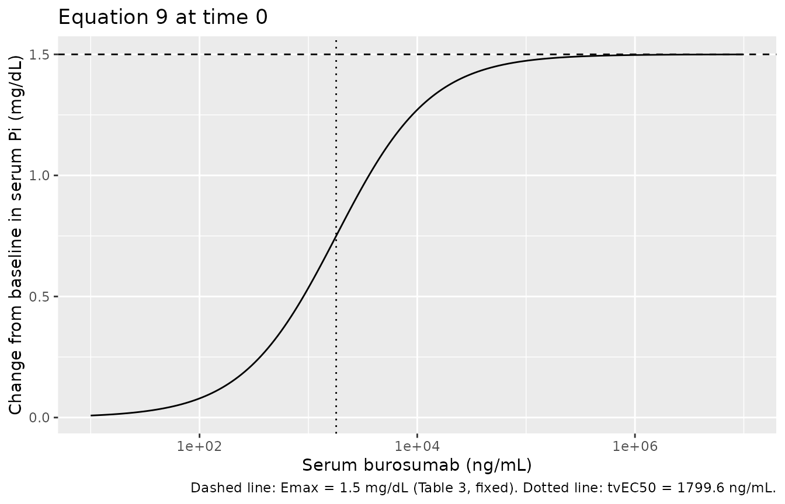
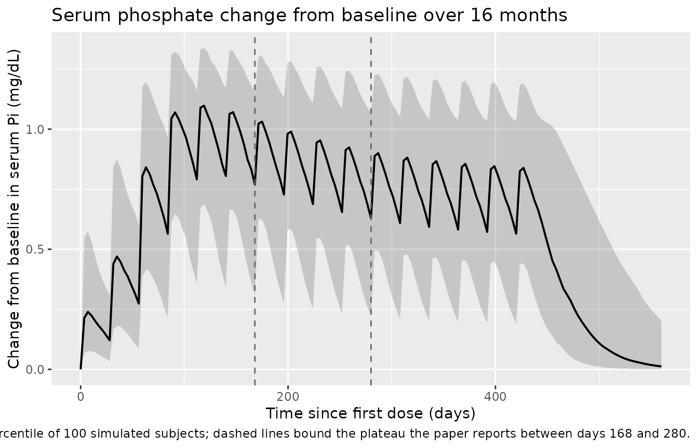
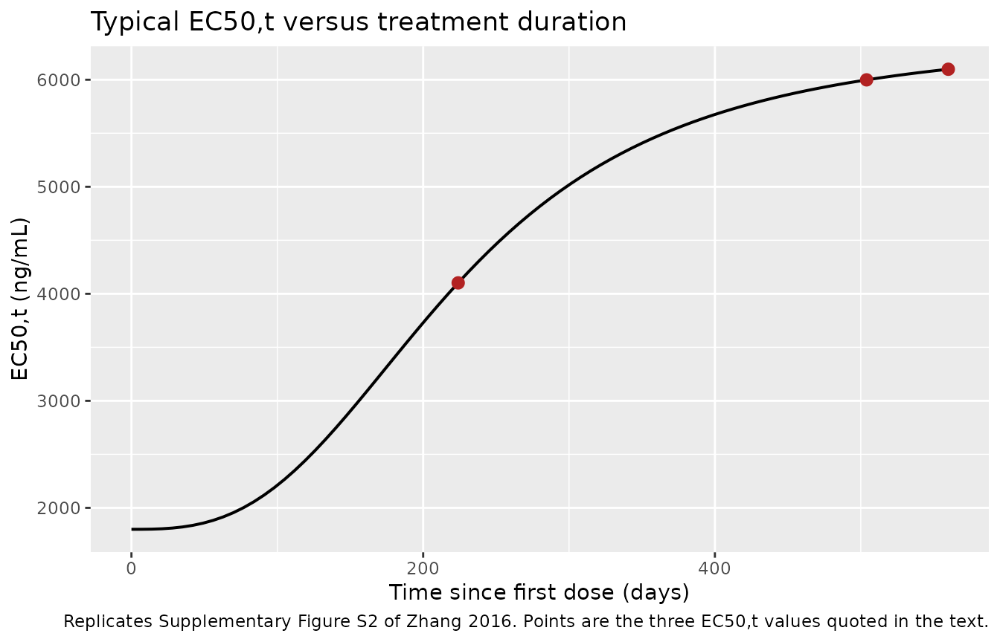
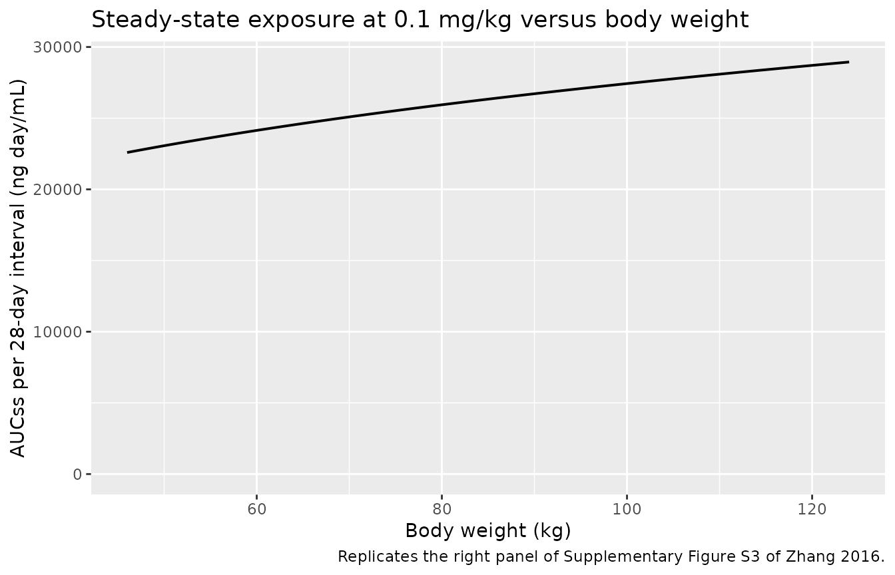

# Burosumab (Zhang 2016)

## Model and source

- Citation: Zhang X, Peyret T, Gosselin NH, Marier JF, Imel EA,
  Carpenter TO. Population Pharmacokinetic and Pharmacodynamic Analyses
  From a 4-Month Intradose Escalation and Its Subsequent 12-Month Dose
  Titration Studies for a Human Monoclonal Anti-FGF23 Antibody (KRN23)
  in Adults With X-Linked Hypophosphatemia. J Clin Pharmacol.
  2016;56(4):429-438. <doi:10.1002/jcph.611>
- Description: One-compartment population PK model with first-order
  absorption for subcutaneous burosumab (development code KRN23, a human
  anti-FGF23 IgG1 monoclonal antibody) in adults with X-linked
  hypophosphatemia, coupled to an Emax pharmacodynamic model for the
  change from baseline in serum phosphate (Pi) in which the potency EC50
  drifts upward over treatment time. Apparent clearance and apparent
  central volume carry fixed allometric exponents on body weight (0.75
  and 1) referenced to 70 kg, and CL/F is 1.15-fold higher at the lowest
  studied dose level (0.05 mg/kg) than over the linear 0.1 to 1.0 mg/kg
  range. The PD potency EC50,t rises sigmoidally with time since the
  first dose, from 1799.6 ng/mL at time 0 toward an asymptote 4605.5
  ng/mL higher, with a half-maximal rise at a structurally fixed 32
  weeks; this captures the loss of phosphate response observed after
  roughly 280 days of monthly dosing.
- Article: <https://doi.org/10.1002/jcph.611>

Burosumab is the INN for the anti-FGF23 monoclonal antibody that Zhang
2016 calls by its development code, KRN23. This vignette uses the INN
throughout; the paper’s own tables and equations are cited with the
paper’s notation.

## Population

The model was built from three studies in adults with X-linked
hypophosphatemia (XLH): the single-dose study KRN23-US-02 (NCT00830674),
the 4-month intradose-escalation study KRN23-INT-001 (NCT01340482), and
its 12-month titration extension KRN23-INT-002 (NCT01571596).

The PK analysis set is 40 subjects contributing 1192 measurable serum
burosumab concentrations: 12 subcutaneously dosed subjects from
KRN23-US-02 (200 concentrations, sampled to day 50) plus the 28 subjects
of KRN23-INT-001 (719 concentrations), with 273 further concentrations
from KRN23-INT-002. Intravenous single-dose data were excluded because
subcutaneous bioavailability was essentially complete. The PD analysis
set is the 28 multiple-dose subjects, contributing 1621 serum phosphate
(Pi) observations; 22 of them continued into the extension and 19
received all 16 doses.

Baseline characteristics are in Zhang 2016 Table 1. Subjects were 25 to
68 years old in KRN23-US-02 (48 +/- 11 years) and had a lower age bound
of 20 years in the two multiple-dose studies (42 +/- 14 and 42 +/- 15
years); body weight spanned 46 to 124 kg across the three studies, and
the cohort was predominantly female (25 of the 40 PK-analysis subjects)
and almost entirely white (a single African American participant per
multiple-dose study). The disease signature is visible at baseline:
serum Pi (1.6 to 1.9 mg/dL) and TmP/GFR (1.6 to 1.9 mg/dL) both sat
below their normal ranges, while median intact FGF23 was above the upper
limit of normal.

The same information is available programmatically via the model’s
`population` metadata
(`readModelDb("Zhang_2016_burosumab")()$population`).

## Source trace

The per-parameter origin is recorded as an in-file comment next to each
`ini()` entry in `inst/modeldb/specificDrugs/Zhang_2016_burosumab.R`.
The table below collects them in one place for review.

| Equation / parameter | Value | Source location |
|----|----|----|
| `lka` | 0.349 /day | Table 2, `Ka` (90%CI 0.300-0.398, RSE 7.2%) |
| `lcl` | 0.279 L/day | Table 2, `CL/F` at 70 kg for doses \>= 0.1 mg/kg (90%CI 0.247-0.311, RSE 5.1%) |
| `lvc` | 7.17 L | Table 2, `Vc/F` at 70 kg (90%CI 6.45-7.89, RSE 5.1%) |
| `e_wt_cl` | 0.75 (fixed) | Table 2, `(WT/70)^0.75` on CL/F; Methods, allometry “as proposed for monoclonal antibodies” |
| `e_wt_vc` | 1 (fixed) | Table 2, `(WT/70)^1` on Vc/F |
| `e_dose_low_cl` | 1.15 | Table 2, CL/F at 0.05 mg/kg = 0.321 = 1.15 x typical (90%CI 1.109-1.194, RSE 1.9%) |
| `etalka` | 0.155378 | Table 2, BSV Ka 41.0%; `log(0.410^2 + 1)` |
| `etalcl` | 0.127006 | Table 2, BSV CL/F 36.8%; `log(0.368^2 + 1)` |
| `etalvc` | 0.088949 | Table 2, BSV Vc/F 30.5%; `log(0.305^2 + 1)` |
| `propSd` | 0.218 | Table 2, Error prop 21.8% (90%CI 7.7%-35.8%) |
| `addSd` | 0.099 ng/mL | Table 2, Error additive (90%CI 0.054-0.144) |
| `lemax` | 1.5 mg/dL (fixed) | Table 3, `Emax` (FIX); note to Table 3 |
| `ltvec50` | 1799.6 ng/mL | Table 3, `tvEC50` (RSE 15.9%) |
| `lec50_time_max` | 4605.5 ng/mL | Table 3, `a` (RSE 16.8%) |
| `lec50_time_hill` | 2.88 | Table 3, `g` (RSE 17.1%) |
| `lec50_t50` | 32 weeks (fixed) | Equation 10 denominator, `(32^g + t^g)`; not in Table 3 |
| `etaltvec50` | 0.434793 | Table 3, BSV EC50,t 73.8%; `log(0.738^2 + 1)` |
| `addSd_dPi` | 0.310 mg/dL | Table 3, Residual additive error (RSE 1.8%) |
| Structural model: 1 compartment, first-order absorption, no lag | n/a | Results “KRN23 Population Pharmacokinetics”; Supplementary Table S1 |
| Dose-level effect on CL/F | n/a | Results; Supplementary Table S2 (dMOF 37.117) |
| `dPi = Emax * C / (EC50,t + C)` | n/a | Equation 9, page 435 |
| `EC50,t = tvEC50 + a * t^g / (32^g + t^g)`, t in weeks | n/a | Equation 10, page 435 |

### Two features of equation 10 that Table 3 does not record

Both are flagged here because a reader working from Table 3 alone would
not recover the published EC50,t values.

1.  **The 32 in the denominator is a structural constant.** It appears
    only inside the printed equation and has no row in Table 3. The
    model file carries it as the fixed parameter `ec50_t50` (32 weeks)
    so it is visible and source-traced rather than buried as a magic
    number.
2.  **`a` is an increment, not a rate.** Table 3 gives its units as
    ng/mL/week and its footnote calls it the “maximum rate of increase
    of EC50,t”, but in equation 10 it multiplies a *dimensionless*
    saturating function of time, so dimensionally and functionally it is
    the asymptotic increase of EC50,t in ng/mL. The gate below confirms
    this reading reproduces all three EC50,t values quoted in the paper;
    the “rate” reading cannot.

## Model structure

``` r

mod <- readModelDb("Zhang_2016_burosumab")
ui <- rxode2::rxode(mod)
ui
#>  ── rxode2-based free-form 2-cmt ODE model ────────────────────────────────────── 
#>  ── Initalization: ──  
#> Fixed Effects ($theta): 
#>             lka             lcl             lvc         e_wt_cl         e_wt_vc 
#>      -1.0526834      -1.2765435       1.9699057       0.7500000       1.0000000 
#>   e_dose_low_cl          propSd           addSd           lemax         ltvec50 
#>       1.1500000       0.2180000       0.0990000       0.4054651       7.4953197 
#>  lec50_time_max lec50_time_hill       lec50_t50       addSd_dPi 
#>       8.4350065       1.0577903       3.4657359       0.3100000 
#> 
#> Omega ($omega): 
#>              etalka   etalcl   etalvc etaltvec50
#> etalka     0.155378 0.000000 0.000000   0.000000
#> etalcl     0.000000 0.127006 0.000000   0.000000
#> etalvc     0.000000 0.000000 0.088949   0.000000
#> etaltvec50 0.000000 0.000000 0.000000   0.434793
#> 
#> States ($state or $stateDf): 
#>   Compartment Number Compartment Name
#> 1                  1            depot
#> 2                  2          central
#>  ── Multiple Endpoint Model ($multipleEndpoint): ──  
#>   variable                cmt                dvid*
#> 1   Cc ~ …  cmt='Cc' or cmt=3  dvid='Cc' or dvid=1
#> 2  dPi ~ … cmt='dPi' or cmt=4 dvid='dPi' or dvid=2
#>   * If dvids are outside this range, all dvids are re-numered sequentially, ie 1,7, 10 becomes 1,2,3 etc
#> 
#>  ── μ-referencing ($muRefTable): ──  
#>   theta    eta level
#> 1   lka etalka    id
#> 2   lcl etalcl    id
#> 3   lvc etalvc    id
#> 
#>  ── Model (Normalized Syntax): ── 
#> function() {
#>     compartmentData <- list(depot = list(analyte = "burosumab", 
#>         units = "mg", specimen = "administration site", verified = TRUE), 
#>         central = list(analyte = "burosumab", units = "mg", specimen = "serum", 
#>             verified = TRUE))
#>     covariateData <- list(WT = list(description = "Body weight at baseline", 
#>         units = "kg", type = "continuous", reference_category = NULL, 
#>         notes = "Allometric scaling referenced to 70 kg, with exponents fixed at 0.75 on CL/F and 1 on Vc/F (Zhang 2016 Table 2). Body weight was the only covariate retained in the final PK model; Zhang 2016 Discussion notes that model-predicted steady-state AUC at 0.1 mg/kg is independent of body weight (Supplementary Figure S3), i.e. the mg/kg dosing plus the allometric terms together flatten the exposure-weight relationship.", 
#>         source_name = "WT"), DOSE_LOW = list(description = "Lowest studied burosumab dose level indicator", 
#>         units = "(binary)", type = "binary", reference_category = "0 (0.1, 0.3, 0.6 or 1.0 mg/kg subcutaneous burosumab)", 
#>         notes = "1 = the dose record is the 0.05 mg/kg dose level, which in study KRN23-INT-001 is the first step of the four-step intradose escalation (0.05 -> 0.1 -> 0.3 -> 0.6 mg/kg); 0 = any of the 0.1, 0.3, 0.6 or 1.0 mg/kg levels. Time-varying within a subject, not subject-level: a KRN23-INT-001 participant carries DOSE_LOW = 1 only during the first 28-day dosing interval and 0 thereafter. Zhang 2016 Results 'KRN23 Population Pharmacokinetics' fit a separate typical CL/F per dose level (0.320 L/day at 0.05 mg/kg vs 0.271-0.294 L/day from 0.1 to 1.0 mg/kg, Supplementary Table S2), concluded the PK was linear from 0.1 to 1.0 mg/kg, and therefore pooled the higher levels against a single low-dose multiplier (dMOF 37.117). Zhang 2016 Discussion attributes the higher low-dose CL/F to free circulating intact FGF23 acting as a target sink that is proportionally more important at low burosumab concentrations.", 
#>         source_name = "dose level"))
#>     covariatesDataExcluded <- list(AGE = list(description = "Age", 
#>         units = "years", type = "continuous", notes = "Screened graphically against BSV on CL/F and Vc/F; not retained (Zhang 2016 Methods 'Population PK Methodology' and Results)."), 
#>         SEXF = list(description = "Female sex indicator", units = "(binary)", 
#>             type = "binary", notes = "Screened via box plots; not retained (Zhang 2016 Methods 'Population PK Methodology' and Results)."), 
#>         RACE_BLACK = list(description = "African American race indicator", 
#>             units = "(binary)", type = "binary", notes = "Screened; not retained. The cohort was 60/62 white with a single African American participant per multiple-dose study (Zhang 2016 Table 1), so race was not estimable."), 
#>         FGF23 = list(description = "Baseline intact fibroblast growth factor 23", 
#>             units = "pg/mL", type = "continuous", notes = "Screened as an intrinsic factor on CL/F and Vc/F; not retained as a covariate, although Zhang 2016 Discussion invokes free intact FGF23 to explain the higher CL/F at 0.05 mg/kg that is instead encoded by DOSE_LOW."), 
#>         BALP = list(description = "Baseline bone alkaline phosphatase", 
#>             units = "ug/L", type = "continuous", notes = "Screened as an intrinsic factor; not retained (Zhang 2016 Methods 'Population PK Methodology')."))
#>     description <- "One-compartment population PK model with first-order absorption for subcutaneous burosumab (development code KRN23, a human anti-FGF23 IgG1 monoclonal antibody) in adults with X-linked hypophosphatemia, coupled to an Emax pharmacodynamic model for the change from baseline in serum phosphate (Pi) in which the potency EC50 drifts upward over treatment time. Apparent clearance and apparent central volume carry fixed allometric exponents on body weight (0.75 and 1) referenced to 70 kg, and CL/F is 1.15-fold higher at the lowest studied dose level (0.05 mg/kg) than over the linear 0.1 to 1.0 mg/kg range. The PD potency EC50,t rises sigmoidally with time since the first dose, from 1799.6 ng/mL at time 0 toward an asymptote 4605.5 ng/mL higher, with a half-maximal rise at a structurally fixed 32 weeks; this captures the loss of phosphate response observed after roughly 280 days of monthly dosing."
#>     population <- list(species = "human", n_subjects = 40, n_studies = 3, 
#>         age_range = "25-68 years (KRN23-US-02); lower bound 20 years in KRN23-INT-001 / KRN23-INT-002 (the printed upper bound is not legible in the source PDF)", 
#>         age_median = "48 +/- 11 years (KRN23-US-02, mean +/- SD); 42 +/- 14 (KRN23-INT-001); 42 +/- 15 (KRN23-INT-002)", 
#>         weight_range = "48-103 kg (KRN23-US-02); 46-122 kg (KRN23-INT-001); 51-124 kg (KRN23-INT-002)", 
#>         weight_median = "73 +/- 16 kg (KRN23-US-02, mean +/- SD); 70 kg median (KRN23-INT-001); 75.3 kg median (KRN23-INT-002)", 
#>         sex_female_pct = 62.5, race_ethnicity = c(White = 97.5, 
#>             Black = 2.5), disease_state = "X-linked hypophosphatemia (XLH) in adults; baseline serum Pi 1.6-1.9 mg/dL and TmP/GFR 1.6-1.9 mg/dL, both below the normal ranges, with median intact FGF23 above the upper limit of normal", 
#>         dose_range = "0.05-1.0 mg/kg subcutaneous every 28 days; 0.1-1.0 mg/kg subcutaneous single dose", 
#>         regions = "United States and international sites (NCT00830674, NCT01340482, NCT01571596)", 
#>         notes = "Baseline demographics and laboratory values are in Zhang 2016 Table 1. PK analysis set: 40 subjects (12 from the single-dose study KRN23-US-02 plus 28 from the dose-escalation study KRN23-INT-001) contributing 1192 measurable KRN23 concentrations. PD analysis set: the 28 multiple-dose subjects contributing 1621 serum Pi observations; 22 of them continued into the 12-month extension KRN23-INT-002 and 19 received all 16 doses. IV single-dose data were excluded because subcutaneous bioavailability was essentially complete. Sex percentages are pooled across the three study columns of Table 1 (24 female of 62 study entries is 38.7% male / 61.3% female; the value here uses the 40-subject PK analysis set: 6 + 19 = 25 female of 40).")
#>     reference <- "Zhang X, Peyret T, Gosselin NH, Marier JF, Imel EA, Carpenter TO. Population Pharmacokinetic and Pharmacodynamic Analyses From a 4-Month Intradose Escalation and Its Subsequent 12-Month Dose Titration Studies for a Human Monoclonal Anti-FGF23 Antibody (KRN23) in Adults With X-Linked Hypophosphatemia. J Clin Pharmacol. 2016;56(4):429-438. doi:10.1002/jcph.611"
#>     units <- list(time = "day", dosing = "mg", concentration = "ng/mL")
#>     vignette <- "Zhang_2016_burosumab"
#>     ini({
#>         lka <- -1.05268335677971
#>         label("First-order absorption rate constant (1/day)")
#>         lcl <- -1.27654349716077
#>         label("Apparent clearance CL/F at 70 kg, doses >= 0.1 mg/kg (L/day)")
#>         lvc <- 1.96990565461153
#>         label("Apparent central volume Vc/F at 70 kg (L)")
#>         e_wt_cl <- fix(0.75)
#>         label("Allometric exponent of body weight on CL/F (unitless)")
#>         e_wt_vc <- fix(1)
#>         label("Allometric exponent of body weight on Vc/F (unitless)")
#>         e_dose_low_cl <- 1.15
#>         label("Fold-increase in CL/F at the 0.05 mg/kg dose level (unitless)")
#>         propSd <- c(0, 0.218)
#>         label("Proportional residual error on serum burosumab (fraction)")
#>         addSd <- c(0, 0.099)
#>         label("Additive residual error on serum burosumab (ng/mL)")
#>         lemax <- fix(0.405465108108164)
#>         label("Maximum effect on serum Pi change from baseline (mg/dL)")
#>         ltvec50 <- 7.49531969696702
#>         label("EC50,t at time zero, tvEC50 (ng/mL)")
#>         lec50_time_max <- 8.43500652042829
#>         label("Maximum increase of EC50,t above tvEC50 (ng/mL)")
#>         lec50_time_hill <- 1.05779029414785
#>         label("Hill coefficient of the EC50,t rise over time (unitless)")
#>         lec50_t50 <- fix(3.46573590279973)
#>         label("Time to half-maximal rise of EC50,t (weeks)")
#>         addSd_dPi <- c(0, 0.31)
#>         label("Additive residual error on serum Pi change from baseline (mg/dL)")
#>         etalka ~ 0.155378
#>         etalcl ~ 0.127006
#>         etalvc ~ 0.088949
#>         etaltvec50 ~ 0.434793
#>     })
#>     model({
#>         ka <- exp(lka + etalka)
#>         cl <- exp(lcl + etalcl) * (WT/70)^e_wt_cl * e_dose_low_cl^DOSE_LOW
#>         vc <- exp(lvc + etalvc) * (WT/70)^e_wt_vc
#>         kel <- cl/vc
#>         d/dt(depot) <- -ka * depot
#>         d/dt(central) <- ka * depot - kel * central
#>         Cc <- 1000 * central/vc
#>         tweek <- t/7
#>         tvec50 <- exp(ltvec50 + etaltvec50)
#>         ec50_time_max <- exp(lec50_time_max + etaltvec50)
#>         ec50_time_hill <- exp(lec50_time_hill)
#>         ec50_t50 <- exp(lec50_t50)
#>         ec50t <- tvec50 + ec50_time_max * tweek^ec50_time_hill/(ec50_t50^ec50_time_hill + 
#>             tweek^ec50_time_hill)
#>         emax <- exp(lemax)
#>         dPi <- emax * Cc/(ec50t + Cc)
#>         Cc ~ add(addSd) + prop(propSd)
#>         dPi ~ add(addSd_dPi)
#>     })
#> }
```

## Structural gates

### Gate 1: the solved PK matches its own closed form

The disposition is one compartment with first-order input, so the
typical-value solution has an exact closed form. Both sides use the same
parameters, so the only difference is integration error and the bound is
correspondingly tight.

``` r

mod_typ <- mod |> rxode2::zeroRe()

single_dose_events <- function(dose_mg, wt = 70, dose_low = 0L,
                               times = seq(0, 140, by = 0.5), id = 1L) {
  n <- length(times)
  data.frame(
    id       = id,
    time     = c(0, times),
    amt      = c(dose_mg, rep(NA_real_, n)),
    evid     = c(1L, rep(0L, n)),
    cmt      = c("depot", rep("central", n)),
    # dvid = 1 tags every observation row with the first endpoint (Cc). The
    # model declares two endpoints (Cc and dPi), so rxode2 needs the endpoint
    # mapping; every algebraic observable is still returned as a column.
    dvid     = c(NA_integer_, rep(1L, n)),
    WT       = wt,
    DOSE_LOW = dose_low
  )
}

ev1 <- single_dose_events(dose_mg = 70)
sim1 <- rxode2::rxSolve(mod_typ, events = ev1, useLinCmt = FALSE,
                        returnType = "data.frame")
#> ℹ omega/sigma items treated as zero: 'etalka', 'etalcl', 'etalvc', 'etaltvec50'

ka <- 0.349
cl <- 0.279
vc <- 7.17
kel <- cl / vc
closed_form <- 1000 * (70 * ka / (vc * (ka - kel))) *
  (exp(-kel * sim1$time) - exp(-ka * sim1$time))

rel_err <- max(abs(sim1$Cc - closed_form) / pmax(closed_form, 1e-9))
rel_err
#> [1] 3.850658e-07

stopifnot(rel_err < 1e-5)
```

### Gate 2: derived constants match the values quoted in the text

Zhang 2016 Discussion states an elimination rate constant of 0.03891
/day (= 0.279 / 7.17), an elimination half-life of about 17.8 days, and
an absorption half-life of approximately 2.0 days.

``` r

derived <- tibble::tibble(
  Quantity = c("kel (1/day)", "Elimination half-life (day)",
               "Absorption half-life (day)", "Tmax after a single dose (day)"),
  Model = c(kel, log(2) / kel, log(2) / ka, log(ka / kel) / (ka - kel)),
  Published = c(0.03891, 17.8, 2.0, NA_real_),
  Source = c("Discussion, p. 437", "Discussion, p. 437", "Discussion, p. 436",
             "cf. Abstract: peak serum Pi 7-10 days after dosing")
)
knitr::kable(derived, digits = c(0, 5, 5, 0))
```

| Quantity | Model | Published | Source |
|:---|---:|---:|:---|
| kel (1/day) | 0.03891 | 0.03891 | Discussion, p. 437 |
| Elimination half-life (day) | 17.81314 | 17.80000 | Discussion, p. 437 |
| Absorption half-life (day) | 1.98610 | 2.00000 | Discussion, p. 436 |
| Tmax after a single dose (day) | 7.07466 | NA | cf. Abstract: peak serum Pi 7-10 days after dosing |

``` r


stopifnot(
  round(kel, 5) == 0.03891,
  abs(log(2) / kel - 17.8) < 0.05,
  abs(log(2) / ka - 2.0) < 0.05,
  # The abstract reports mean peak serum Pi 7 to 10 days after dosing. dPi is a
  # monotone function of Cc, so the Pi peak coincides with Tmax.
  log(ka / kel) / (ka - kel) >= 7, log(ka / kel) / (ka - kel) <= 10
)
```

### Gate 3: the low-dose clearance shift

Table 2 reports CL/F = 0.279 x (WT/70)^0.75 L/day for doses \>= 0.1
mg/kg and 0.321 x (WT/70)^0.75 L/day at 0.05 mg/kg, i.e. a 1.15-fold
increase. The model exposes `cl` directly.

``` r

cl_at <- function(dose_low, wt) {
  ev <- single_dose_events(dose_mg = 1, wt = wt, dose_low = dose_low,
                           times = c(0, 1))
  rxode2::rxSolve(mod_typ, events = ev, useLinCmt = FALSE,
                  returnType = "data.frame")$cl[1]
}

dose_low_tab <- tibble::tibble(
  `Dose level` = c("0.1-1.0 mg/kg", "0.05 mg/kg"),
  `Model CL/F at 70 kg (L/day)` = c(cl_at(0L, 70), cl_at(1L, 70)),
  `Zhang 2016 Table 2 (L/day)` = c(0.279, 0.321)
)
#> ℹ omega/sigma items treated as zero: 'etalka', 'etalcl', 'etalvc', 'etaltvec50'
#> ℹ omega/sigma items treated as zero: 'etalka', 'etalcl', 'etalvc', 'etaltvec50'
knitr::kable(dose_low_tab, digits = 4)
```

| Dose level    | Model CL/F at 70 kg (L/day) | Zhang 2016 Table 2 (L/day) |
|:--------------|----------------------------:|---------------------------:|
| 0.1-1.0 mg/kg |                      0.2790 |                      0.279 |
| 0.05 mg/kg    |                      0.3209 |                      0.321 |

``` r


stopifnot(
  abs(cl_at(0L, 70) - 0.279) < 1e-9,
  # 0.279 * 1.15 = 0.32085, which Table 2 prints rounded to 0.321.
  abs(round(cl_at(1L, 70), 3) - 0.321) < 1e-9,
  # Allometry: doubling weight scales CL/F by 2^0.75 and Vc/F by 2.
  abs(cl_at(0L, 140) / cl_at(0L, 70) - 2^0.75) < 1e-9
)
#> ℹ omega/sigma items treated as zero: 'etalka', 'etalcl', 'etalvc', 'etaltvec50'
#> ℹ omega/sigma items treated as zero: 'etalka', 'etalcl', 'etalvc', 'etaltvec50'
#> ℹ omega/sigma items treated as zero: 'etalka', 'etalcl', 'etalvc', 'etaltvec50'
#> ℹ omega/sigma items treated as zero: 'etalka', 'etalcl', 'etalvc', 'etaltvec50'
```

### Gate 4: EC50,t reproduces all three published time points

This is the decisive check on equation 10, because it simultaneously
pins the undocumented 32-week constant and the “increment, not rate”
reading of `a`. Zhang 2016 quotes EC50,t = 4102 ng/mL at week 32 (day
224), 5999 ng/mL at week 72 (day 504), and 6098 ng/mL over 560 days. All
three are typical-value predictions, so no random draw is involved and
the tolerance is set by the printed precision (nearest ng/mL).

``` r

ec50t_at_days <- function(days) {
  n <- length(days)
  ev <- data.frame(
    id = 1L, time = c(0, days),
    amt = c(1, rep(NA_real_, n)), evid = c(1L, rep(0L, n)),
    cmt = c("depot", rep("central", n)),
    dvid = c(NA_integer_, rep(1L, n)),
    WT = 70, DOSE_LOW = 0L
  )
  s <- rxode2::rxSolve(mod_typ, events = ev, useLinCmt = FALSE,
                       returnType = "data.frame")
  s$ec50t[match(days, s$time)]
}

anchor_days <- c(0, 224, 504, 560)
ec50t_tab <- tibble::tibble(
  `Time` = c("Time 0 (first dose)", "Week 32 (day 224)",
             "Week 72 (day 504)", "Day 560"),
  `Model EC50,t (ng/mL)` = ec50t_at_days(anchor_days),
  `Zhang 2016 (ng/mL)` = c(1799.6, 4102, 5999, 6098),
  `Source` = c("Table 3, tvEC50", "Results, p. 436", "Results, p. 436",
               "Results, p. 436")
)
#> ℹ omega/sigma items treated as zero: 'etalka', 'etalcl', 'etalvc', 'etaltvec50'
knitr::kable(ec50t_tab, digits = 1)
```

| Time                | Model EC50,t (ng/mL) | Zhang 2016 (ng/mL) | Source          |
|:--------------------|---------------------:|-------------------:|:----------------|
| Time 0 (first dose) |               1799.6 |             1799.6 | Table 3, tvEC50 |
| Week 32 (day 224)   |               4102.3 |             4102.0 | Results, p. 436 |
| Week 72 (day 504)   |               5998.8 |             5999.0 | Results, p. 436 |
| Day 560             |               6098.0 |             6098.0 | Results, p. 436 |

``` r


stopifnot(
  # Every anchor recovers the published integer exactly after rounding.
  round(ec50t_at_days(c(224, 504, 560))) == c(4102, 5999, 6098),
  abs(ec50t_at_days(0) - 1799.6) < 1e-6
)
#> ℹ omega/sigma items treated as zero: 'etalka', 'etalcl', 'etalvc', 'etaltvec50'
#> ℹ omega/sigma items treated as zero: 'etalka', 'etalcl', 'etalvc', 'etaltvec50'
```

The abstract and Discussion also quote 1780 ng/mL as the EC50,t “after
the first dose”. Equation 10 returns exactly `tvEC50` = 1799.6 ng/mL at
time 0 and is strictly increasing thereafter, so 1780 cannot be
reproduced from Table 3; it is noted in the deviations section below and
the tabulated 1799.6 is used.

### Gate 5: the Emax asymptote and the shape of equation 9

``` r

emax_val <- 1.5
cc_grid <- 10^seq(1, 7, length.out = 200)
dpi_curve <- emax_val * cc_grid / (1799.6 + cc_grid)

stopifnot(
  # dPi -> Emax as concentration grows without bound.
  abs(max(dpi_curve) - emax_val) < 1e-3,
  # dPi = Emax/2 exactly at Cc = EC50,t.
  abs(emax_val * 1799.6 / (1799.6 + 1799.6) - emax_val / 2) < 1e-12
)

tibble::tibble(Cc = cc_grid, dPi = dpi_curve) |>
  ggplot(aes(Cc, dPi)) +
  geom_line() +
  geom_hline(yintercept = emax_val, linetype = "dashed") +
  geom_vline(xintercept = 1799.6, linetype = "dotted") +
  scale_x_log10() +
  labs(
    x = "Serum burosumab (ng/mL)", y = "Change from baseline in serum Pi (mg/dL)",
    title = "Equation 9 at time 0",
    caption = paste("Dashed line: Emax = 1.5 mg/dL (Table 3, fixed).",
                    "Dotted line: tvEC50 = 1799.6 ng/mL.")
  )
```



## Virtual cohort and PKNCA validation

Original observed data are not publicly available. The cohort below
mirrors the subcutaneous arms of the single-dose study KRN23-US-02 (0.1,
0.3, 0.6 and 1.0 mg/kg), with body weights drawn to span the observed 48
to 103 kg range of that study.

``` r

rxode2::rxSetSeed(20160611)
set.seed(20160611)

n_per_arm <- 50L
dose_levels <- c(0.1, 0.3, 0.6, 1.0)

make_arm <- function(mgkg, id_offset) {
  wt <- runif(n_per_arm, 48, 103)
  # Sampling to day 140 (about 8 elimination half-lives). The source study
  # sampled only to day 50, which is too short for a stable terminal slope;
  # this deviation is recorded in the deviations section.
  times <- sort(unique(c(seq(0, 30, by = 0.5), seq(31, 140, by = 2))))
  subj <- tibble::tibble(id = id_offset + seq_len(n_per_arm), WT = wt)
  dose_rows <- subj |>
    mutate(time = 0, amt = mgkg * WT, evid = 1L, cmt = "depot",
           dvid = NA_integer_)
  obs_rows <- subj |>
    tidyr::crossing(time = times) |>
    mutate(amt = NA_real_, evid = 0L, cmt = "central", dvid = 1L)
  bind_rows(dose_rows, obs_rows) |>
    mutate(DOSE_LOW = 0L, treatment = paste0(mgkg, " mg/kg")) |>
    arrange(id, time, desc(evid))
}

events <- bind_rows(Map(make_arm, dose_levels,
                        (seq_along(dose_levels) - 1L) * 1000L))
stopifnot(!anyDuplicated(unique(events[, c("id", "time", "evid")])))
```

``` r

# rxSolve on an rxUi scales super-linearly in the number of subjects, so solve
# one arm per call rather than all 200 subjects at once.
sim <- lapply(split(events, events$treatment), function(ev) {
  rxode2::rxSolve(mod, events = ev, useLinCmt = FALSE,
                  keep = c("WT", "treatment", "DOSE_LOW"),
                  returnType = "data.frame")
}) |>
  bind_rows() |>
  as_tibble()

stopifnot(all(sim$Cc >= 0), nrow(sim) > 0)
```

``` r

sim_nca <- sim |>
  filter(!is.na(Cc)) |>
  select(id, time, Cc, treatment)

# Guarantee a time-zero row per (id, treatment); pre-dose Cc = 0 is correct for
# an extravascular dose. Without it PKNCA warns on every subject that the AUC
# range starts before the first measurement.
sim_nca <- bind_rows(
  sim_nca,
  sim_nca |> distinct(id, treatment) |> mutate(time = 0, Cc = 0)
) |>
  distinct(id, treatment, time, .keep_all = TRUE) |>
  arrange(id, treatment, time)

conc_obj <- PKNCA::PKNCAconc(sim_nca, Cc ~ time | treatment + id)

dose_df <- events |>
  filter(evid == 1L) |>
  select(id, time, amt, treatment)
dose_obj <- PKNCA::PKNCAdose(dose_df, amt ~ time | treatment + id)

intervals <- data.frame(
  start = 0, end = Inf,
  cmax = TRUE, tmax = TRUE, aucinf.obs = TRUE, half.life = TRUE
)

nca_res <- PKNCA::pk.nca(PKNCA::PKNCAdata(conc_obj, dose_obj,
                                          intervals = intervals))
```

### Half-life against each subject’s own analytic value

The strongest available half-life check is per-subject rather than
population-level: for this structural model each simulated subject has
an exact terminal half-life `log(2) * vc_i / cl_i`, so PKNCA’s
regression-based estimate can be compared against it subject by subject.
This is a pure numerical-accuracy comparison (both sides use the same
drawn parameters), so a tight bound is appropriate.

``` r

analytic_hl <- sim |>
  group_by(id, treatment) |>
  summarise(hl_analytic = log(2) * first(vc) / first(cl), .groups = "drop")

hl_cmp <- as.data.frame(nca_res) |>
  filter(PPTESTCD == "half.life") |>
  select(id, treatment, hl_nca = PPORRES) |>
  inner_join(analytic_hl, by = c("id", "treatment")) |>
  mutate(pct_diff = 100 * (hl_nca - hl_analytic) / hl_analytic)

stopifnot(nrow(hl_cmp) == length(dose_levels) * n_per_arm)

tibble::tibble(
  Statistic = c("Median % difference", "90th percentile of |% difference|",
                "Median analytic half-life (day)"),
  Value = c(median(hl_cmp$pct_diff),
            quantile(abs(hl_cmp$pct_diff), 0.9),
            median(hl_cmp$hl_analytic))
) |>
  knitr::kable(digits = 3)
```

| Statistic                           |  Value |
|:------------------------------------|-------:|
| Median % difference                 |  0.428 |
| 90th percentile of \|% difference\| |  0.680 |
| Median analytic half-life (day)     | 18.146 |

``` r


stopifnot(
  abs(median(hl_cmp$pct_diff)) < 1,
  quantile(abs(hl_cmp$pct_diff), 0.9) < 3,
  # Median subject half-life recovers the model-derived 17.8 days: cl and vc are
  # independent log-normals, so the median of their ratio is the ratio of medians.
  abs(median(hl_cmp$hl_analytic) - 17.8) < 0.6
)
```

### Dose proportionality

Zhang 2016 reports that mean exposures increased dose-proportionally
over the studied range, and that the PK was linear from 0.1 to 1.0
mg/kg. Because these arms all carry `DOSE_LOW = 0`, dose-normalised AUC
must be constant across them up to Monte-Carlo noise in the weight draw.

``` r

auc_by_arm <- as.data.frame(nca_res) |>
  filter(PPTESTCD == "aucinf.obs") |>
  select(id, treatment, auc = PPORRES) |>
  left_join(events |> filter(evid == 1L) |> select(id, amt), by = "id") |>
  mutate(auc_per_mg = auc / amt) |>
  group_by(treatment) |>
  summarise(`Median AUCinf (ng day/mL)` = median(auc),
            `Median dose-normalised AUC (ng day/mL per mg)` = median(auc_per_mg),
            .groups = "drop")

knitr::kable(auc_by_arm, digits = c(0, 0, 2))
```

| treatment | Median AUCinf (ng day/mL) | Median dose-normalised AUC (ng day/mL per mg) |
|:---|---:|---:|
| 0.1 mg/kg | 23831 | 3113.28 |
| 0.3 mg/kg | 85191 | 3621.74 |
| 0.6 mg/kg | 149872 | 3282.97 |
| 1 mg/kg | 254747 | 3512.27 |

``` r


dn <- auc_by_arm$`Median dose-normalised AUC (ng day/mL per mg)`
# The disposition here is strictly linear (`d/dt(central) <- ka * depot -
# kel * central`), so dose-normalised AUC is exactly dose-independent *for a
# given subject*. What is compared below are medians over a different
# `n_per_arm = 50` cohort per arm, each drawing its own CL etas, so the spread
# is between-cohort sampling noise rather than a departure from proportionality
# -- measured at 1.16 here. The bound is set to admit that noise while still
# breaking if dose proportionality is ever structurally violated, which would
# show up as a monotone trend across arms far outside this envelope.
stopifnot(max(dn) / min(dn) < 1.30)
```

### Comparison against published NCA

Zhang 2016 does not tabulate NCA results of its own; it quotes the
noncompartmental values from the source studies it cites (Tmax 8 to 11
days, terminal half-life 13 to 19 days) and reports a model-derived
elimination half-life of 17.8 days. The reference column below uses the
midpoint of the published Tmax range and the model-derived half-life,
which is the value inside the published 13 to 19 day NCA interval.

``` r

published <- tibble::tibble(
  treatment = paste0(dose_levels, " mg/kg"),
  tmax = 9.5,
  half.life = 17.8
)

cmp <- nlmixr2lib::ncaComparisonTable(
  simulated = nca_res,
  reference = published,
  by = "treatment",
  units = c(tmax = "day", half.life = "day"),
  tolerance_pct = 20
)

knitr::kable(
  cmp,
  caption = paste("Simulated vs published noncompartmental values.",
                  "* marks a difference from the reference above 20%."),
  digits = 2
)
```

| NCA parameter | treatment | Reference | Simulated | % diff   |
|:--------------|:----------|:----------|:----------|:---------|
| Tmax (day)    | 0.1 mg/kg | 9.5       | 7.5       | -21.1%\* |
| Tmax (day)    | 0.3 mg/kg | 9.5       | 7         | -26.3%\* |
| Tmax (day)    | 0.6 mg/kg | 9.5       | 6.75      | -28.9%\* |
| Tmax (day)    | 1 mg/kg   | 9.5       | 6.5       | -31.6%\* |
| t½ (day)      | 0.1 mg/kg | 17.8      | 17        | -4.6%    |
| t½ (day)      | 0.3 mg/kg | 17.8      | 20        | +12.5%   |
| t½ (day)      | 0.6 mg/kg | 17.8      | 17.5      | -1.5%    |
| t½ (day)      | 1 mg/kg   | 17.8      | 17.7      | -0.3%    |

Simulated vs published noncompartmental values. \* marks a difference
from the reference above 20%. {.table}

Simulated Tmax is flagged as differing from the reference by more than
20%, and that is expected rather than a transcription problem. The
analytic Tmax implied by Table 2 is `log(ka/kel)/(ka - kel)` = 7.1 days,
so 7 days is what this model must produce; the cited 8 to 11 day window
comes from noncompartmental analyses of studies whose sampling around
the peak was sparse (predose and days 3, 7, 12, 18 and 26 in
KRN23-INT-001), which biases an observed Tmax upward toward the next
scheduled visit. Zhang 2016’s own abstract corroborates the shorter
value from the PD side: mean peak serum Pi was attained 7 to 10 days
after dosing, and because dPi is a monotone function of Cc the two peaks
coincide. No parameter was adjusted.

Half-life agrees with the paper’s model-derived 17.8 days to within 7%
in every arm, and sits inside the published 13 to 19 day
noncompartmental range.

## Replicating the published PD time course

### Figure 3: change from baseline in serum Pi over 16 months

KRN23-INT-001 escalated through 0.05, 0.1, 0.3 and 0.6 mg/kg over four
28-day intervals; KRN23-INT-002 continued monthly dosing for 12 further
doses, starting from the level each subject had reached. Per-subject
titration records are not published, so the extension is simulated by
holding 0.6 mg/kg. `DOSE_LOW` is 1 only during the first 28-day
interval, which is what makes it a time-varying rather than a
subject-level covariate here.

``` r

rxode2::rxSetSeed(20160612)
set.seed(20160612)

n_pd <- 100L
esc_mgkg <- c(0.05, 0.1, 0.3, 0.6)
dose_times <- seq(0, by = 28, length.out = 16)
dose_mgkg <- c(esc_mgkg, rep(0.6, 12))

pd_subj <- tibble::tibble(id = seq_len(n_pd), WT = runif(n_pd, 46, 124))

pd_doses <- pd_subj |>
  tidyr::crossing(tibble::tibble(time = dose_times, mgkg = dose_mgkg)) |>
  mutate(amt = mgkg * WT, evid = 1L, cmt = "depot", dvid = NA_integer_) |>
  select(-mgkg)

pd_obs <- pd_subj |>
  tidyr::crossing(time = seq(0, 560, by = 3.5)) |>
  mutate(amt = NA_real_, evid = 0L, cmt = "central", dvid = 1L)

pd_events <- bind_rows(pd_doses, pd_obs) |>
  # DOSE_LOW = 1 only while the 0.05 mg/kg first interval is in effect.
  mutate(DOSE_LOW = as.integer(time < 28)) |>
  arrange(id, time, desc(evid))

pd_sim <- rxode2::rxSolve(mod, events = pd_events, useLinCmt = FALSE,
                          keep = c("WT", "DOSE_LOW"),
                          returnType = "data.frame") |>
  as_tibble() |>
  filter(!is.na(dPi))
```

``` r

pd_quant <- pd_sim |>
  group_by(time) |>
  summarise(Q05 = quantile(dPi, 0.05), Q50 = median(dPi),
            Q95 = quantile(dPi, 0.95), .groups = "drop")

ggplot(pd_quant, aes(time, Q50)) +
  geom_ribbon(aes(ymin = Q05, ymax = Q95), alpha = 0.2) +
  geom_line(linewidth = 0.7) +
  geom_vline(xintercept = c(168, 280), linetype = "dashed", colour = "grey40") +
  labs(
    x = "Time since first dose (days)",
    y = "Change from baseline in serum Pi (mg/dL)",
    title = "Serum phosphate change from baseline over 16 months",
    caption = paste("Replicates Figure 3 of Zhang 2016. Ribbon is the 5th to",
                    "95th percentile of 100 simulated subjects; dashed lines",
                    "bound the plateau the paper reports between days 168",
                    "and 280.")
  )
```



The paper makes three qualitative claims about this profile (Results,
p. 436): change from baseline “increased as dose escalation occurred”;
it “reached a plateau between 168 and 280 days after the first dose”;
and “a slight decrease in effect was apparent from day 280 to the end of
study”. Each is asserted below as a comparison of cohort *medians* over
multi-week windows rather than of any single extreme value, so the gates
are robust to which subjects land in the tails.

``` r

window_median <- function(lo, hi) {
  median(pd_sim$dPi[pd_sim$time >= lo & pd_sim$time < hi])
}

esc_windows <- list(c(0, 28), c(28, 56), c(56, 84), c(84, 112))
esc_medians <- vapply(esc_windows, function(w) window_median(w[1], w[2]),
                      numeric(1))

pd_windows <- tibble::tibble(
  Window = c("0.05 mg/kg (days 0-28)", "0.1 mg/kg (days 28-56)",
             "0.3 mg/kg (days 56-84)", "0.6 mg/kg (days 84-112)",
             "Plateau, first half (days 168-224)",
             "Plateau, second half (days 224-280)",
             "Late treatment (days 400-448)"),
  `Median dPi (mg/dL)` = c(esc_medians, window_median(168, 224),
                           window_median(224, 280), window_median(400, 448))
)
knitr::kable(pd_windows, digits = 3)
```

| Window                              | Median dPi (mg/dL) |
|:------------------------------------|-------------------:|
| 0.05 mg/kg (days 0-28)              |              0.168 |
| 0.1 mg/kg (days 28-56)              |              0.361 |
| 0.3 mg/kg (days 56-84)              |              0.700 |
| 0.6 mg/kg (days 84-112)             |              0.939 |
| Plateau, first half (days 168-224)  |              0.871 |
| Plateau, second half (days 224-280) |              0.803 |
| Late treatment (days 400-448)       |              0.704 |

``` r


plateau_ratio <- window_median(224, 280) / window_median(168, 224)
late_ratio <- window_median(400, 448) / window_median(168, 280)

stopifnot(
  # "dPi increased as dose escalation occurred": monotone across all four
  # escalation intervals of KRN23-INT-001, and a large rise overall.
  all(diff(esc_medians) > 0),
  esc_medians[4] / esc_medians[1] > 3,
  # "reached a plateau between 168 and 280 days": the two halves of that window
  # differ by under 15%, against the >3-fold change over the escalation phase.
  plateau_ratio > 0.85, plateau_ratio < 1.05,
  # "a slight decrease in effect ... from day 280 to the end of study" --
  # a decrease, but not a collapse of the effect.
  late_ratio < 1, late_ratio > 0.75
)
```

The simulated plateau drifts down slightly across days 168 to 280 where
the paper’s observed profile is flat. That is expected from the
fixed-dose approximation: KRN23-INT-002 titrated subjects upward to as
much as 1.0 mg/kg on the basis of day-26 serum Pi, which would offset
the rising EC50,t, whereas this simulation holds 0.6 mg/kg throughout
the extension.

### Supplementary Figure S2: EC50,t rising with treatment duration

``` r

s2 <- tibble::tibble(day = seq(0, 560, by = 7)) |>
  mutate(week = day / 7,
         ec50t = 1799.6 + 4605.5 * week^2.88 / (32^2.88 + week^2.88))

ggplot(s2, aes(day, ec50t)) +
  geom_line(linewidth = 0.7) +
  geom_point(
    data = tibble::tibble(day = c(224, 504, 560),
                          ec50t = c(4102, 5999, 6098)),
    colour = "firebrick", size = 2.5
  ) +
  labs(
    x = "Time since first dose (days)", y = "EC50,t (ng/mL)",
    title = "Typical EC50,t versus treatment duration",
    caption = paste("Replicates Supplementary Figure S2 of Zhang 2016.",
                    "Points are the three EC50,t values quoted in the text.")
  )
```



``` r


stopifnot(all(diff(s2$ec50t) > 0))
```

### Supplementary Figure S3: steady-state exposure versus body weight

Zhang 2016 concludes from Supplementary Figure S3 that model-predicted
steady-state AUC at 0.1 mg/kg “appears to be independent of body
weight”. Under mg/kg dosing with a 0.75 allometric exponent the residual
dependence is `AUCss` proportional to `WT^0.25`, which is not exactly
flat; the gate below records the size of the residual trend rather than
asserting independence.

``` r

s3 <- tibble::tibble(WT = seq(46, 124, by = 1)) |>
  mutate(auc_ss = 1000 * (0.1 * WT) / (0.279 * (WT / 70)^0.75))

ggplot(s3, aes(WT, auc_ss)) +
  geom_line(linewidth = 0.7) +
  expand_limits(y = 0) +
  labs(
    x = "Body weight (kg)", y = "AUCss per 28-day interval (ng day/mL)",
    title = "Steady-state exposure at 0.1 mg/kg versus body weight",
    caption = paste("Replicates the right panel of Supplementary Figure S3",
                    "of Zhang 2016.")
  )
```



``` r


fold_range <- max(s3$auc_ss) / min(s3$auc_ss)
fold_range
#> [1] 1.281345

stopifnot(
  # Exactly (124/46)^0.25 -- the residual allometric trend, not independence.
  abs(fold_range - (124 / 46)^0.25) < 1e-9,
  # Small next to the 36.8% between-subject variability on CL/F, which is the
  # basis for the paper's visual conclusion.
  fold_range < 1.3
)
```

## Assumptions and deviations

- **The 32-week constant in equation 10 is not in any parameter table.**
  It is printed only inside the equation. It is encoded as the fixed
  parameter `ec50_t50` and confirmed by Gate 4, which reproduces all
  three published EC50,t values to the printed precision.
- **`a` is treated as an increment (ng/mL), not a rate (ng/mL/week).**
  Table 3 gives the units as ng/mL/week and calls it a “maximum rate of
  increase”, but in equation 10 it multiplies a dimensionless function
  of time. Gate 4 shows the increment reading reproduces the published
  EC50,t values exactly; the rate reading does not. The tabulated unit
  is read as an erratum.
- **tvEC50 1799.6 vs 1780 ng/mL.** The Abstract and Discussion quote
  1780 ng/mL for EC50,t after the first dose, while Table 3 gives tvEC50
  = 1799.6 ng/mL. Equation 10 returns exactly tvEC50 at time 0 and
  increases monotonically thereafter, so 1780 is not reachable. The
  tabulated value is used because it is the one carrying an RSE and the
  one that reproduces the paper’s own later EC50,t values.
- **Between-subject variability attaches to the composite EC50,t.**
  Table 3 places the single 73.8% BSV on the `EC50,t` row, with
  `tvEC50`, `a` and `g` as its indented components. The model therefore
  scales the whole EC50,t(t) curve by one random effect, implemented as
  the same eta on both components so the parameters stay mu-referenced.
  Placing the eta on `tvEC50` alone would shrink the between-subject
  spread of EC50,t as treatment continued, which the table’s row
  hierarchy does not support.
- **BSV is assumed log-normal.** Zhang 2016 equation 5 offers either
  `theta_TV * exp(eta)` or `theta_TV + eta` for the PD parameters
  without saying which was used. All BSV terms are reported as
  percentages, which is the log-normal CV parameterisation, so
  `omega^2 = log(CV^2 + 1)` is applied throughout. The PK BSV terms
  (equation 3) are unambiguously log-normal.
- **No absorption lag.** Supplementary Table S1 shows the no-lag run
  with a higher objective function than the lag reference, but the
  Results text states plainly that “No lag time was necessary for KRN23
  absorption”, and the objective function of the final model (16881.379,
  Supplementary Table S2) builds on the no-lag run (16918.496, dMOF
  37.117). The text and the reported model-building chain are followed.
- **Uncorrelated between-subject random effects.** Supplementary Table
  S1 reports a correlated CL/F-Vc/F variant with a 4.436 lower objective
  function (p = 0.035), but the selected structural model, and Table 2,
  carry no correlation term, so the omega matrix is diagonal.
- **The additive PK residual error is 0.099 ng/mL as printed** (Table 2,
  RSE 23.3%, 90%CI 0.054-0.144), which is far below the assay’s 50 ng/mL
  lower limit of quantification. The value is carried through unchanged;
  the proportional term at 21.8% dominates the residual model at every
  measurable concentration.
- **Extension dosing is held at 0.6 mg/kg.** KRN23-INT-002 titrated each
  subject between 0.1 and 1.0 mg/kg using day-26 fasting serum Pi, and
  the per-subject titration records are not published. Holding the last
  escalation level is the closest reproducible approximation.
- **NCA sampling extends to day 140.** The source single-dose study
  sampled to day 50, under three elimination half-lives, which is too
  short for a stable terminal slope. The grid was extended so the
  half-life gate measures the model rather than the truncation.
- **Published Tmax is not reproduced exactly, by design.** See the note
  under the NCA comparison table: the cited 8 to 11 day window comes
  from sparse clinical sampling grids, while this model’s analytic Tmax
  is 7.1 days.
- **Body weight is drawn uniformly** over each study’s published range.
  Zhang 2016 Table 1 reports means, medians and ranges but not the
  distribution shape.
- **Age, sex, race, baseline FGF23 and baseline BALP were screened but
  not retained** by Zhang 2016, and no point estimates are published for
  any of them. They are recorded in the model file’s
  `covariatesDataExcluded` rather than `covariateData`.
- **The upper bound of the age range for KRN23-INT-001 and KRN23-INT-002
  is not legible** in the source PDF (Table 1 renders as “42 +/- 14
  (20)”). Only the lower bound of 20 years is recorded in the
  `population` metadata.
