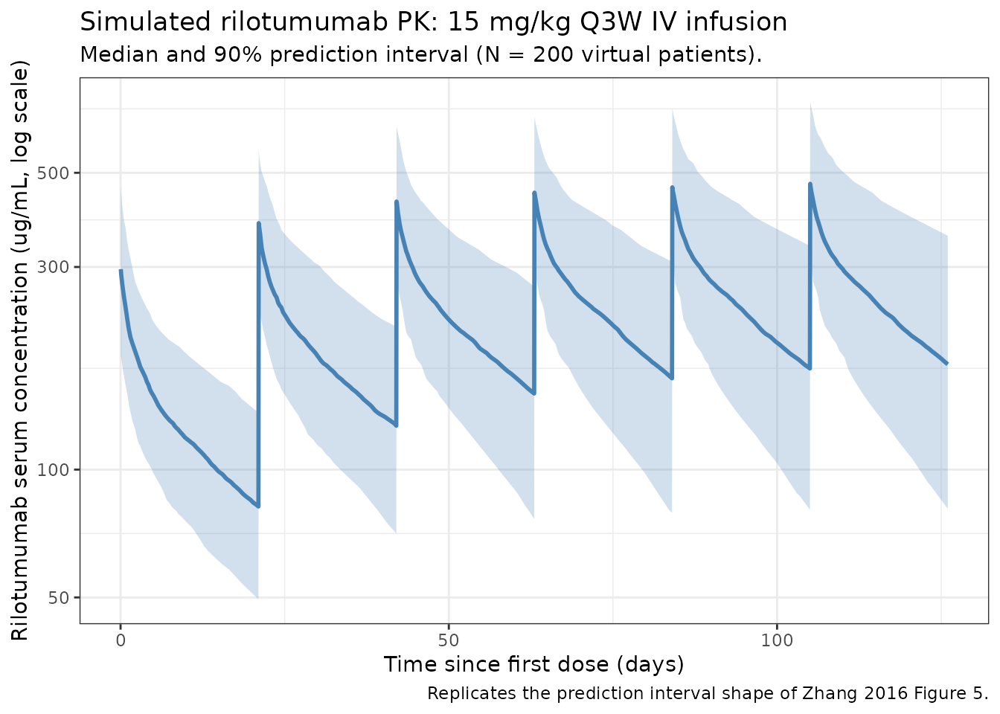

# Rilotumumab (Zhang 2016)

## Model and source

- Citation: Zhang Y, Kondragunta V, Han T-H, Dimopoulos M, Padval M,
  Klempner SJ, Wagner AD, Kallinteris NL, Doi T, Ohtsu A, et al.
  Assessment of pharmacokinetic interaction between rilotumumab and
  epirubicin, cisplatin and capecitabine (ECX) in a Phase 3 study in
  gastric cancer. *Br J Clin Pharmacol.* 2017;83(5):1048-1055.
  <doi:%5B10.1111/bcp.13179>\](<https://doi.org/10.1111/bcp.13179>).
- Upstream popPK source (parameters inherited from): Zhu M, Doshi S,
  Gisleskog PO, Oliner KS, Perez Ruixo JJ, Loh E, Perez-Ruixo JJ.
  Population pharmacokinetics of rilotumumab, a fully human monoclonal
  antibody against hepatocyte growth factor, in cancer patients. *J
  Pharm Sci.* 2014;103(1):328-336.
  <doi:%5B10.1002/jps.23763>\](<https://doi.org/10.1002/jps.23763>).
- Modality: Fully human IgG2 monoclonal antibody against hepatocyte
  growth factor (HGF). IV infusion.

Rilotumumab neutralises HGF and thereby blocks its binding to the MET
receptor (Zhang 2016, Introduction). Zhang 2016 is a Phase 3
(NCT00719550) DDI assessment that pairs rilotumumab with the epirubicin
/ cisplatin / capecitabine (ECX) regimen in MET-positive gastric / GEJ
adenocarcinoma and uses the previously developed Zhu 2014 popPK model to
perform an external prediction-corrected visual predictive check on
rilotumumab serum concentrations from the Phase 3 cohort. The conclusion
was no ECX-rilotumumab PK interaction. **Zhang 2016 reports the Zhu 2014
final- model typical-value point estimates and IIV %CV verbatim but does
not reproduce the covariate equations or the residual error model** –
those live in Zhu 2014. The Zhang 2016 model file therefore encodes only
the structural two-compartment skeleton and the four IIV terms; the
upstream `Zhu_2014_rilotumumab` extraction (ingestion task 127) will
carry the full covariate model and residual error specification.

Structure: linear two-compartment IV model with first-order elimination
from the central compartment, parameterised by `CL`, `Vc`, `Q`, and `Vp`
(Zhang 2016, Methods page 1050).

## Population

The Phase 3 cohort that informed the rilotumumab serum concentrations
used for the external VPC (Zhang 2016, Results page 1050):

- **N = 279** patients with measured rilotumumab concentrations (53 with
  intensive PK sampling, 226 with sparse PK sampling).
- **1460 serum concentration records** included in the population PK
  evaluation (34 excluded as outliers or below quantitation).
- Age 19-85 years (median 59).
- Body weight 39-120 kg (median 69 kg).
- Disease: unresectable, locally advanced or metastatic MET-positive
  gastric or GEJ adenocarcinoma (tumour membrane staining \>= 25% by
  central immunohistochemistry).
- Treatment: rilotumumab 15 mg/kg IV every 3 weeks in combination with
  epirubicin 50 mg/m^2 IV bolus Q3W, cisplatin 60 mg/m^2 IV infusion
  Q3W, and capecitabine 625 mg/m^2 orally twice daily.

The Zhu 2014 estimation dataset (the source of the structural parameter
values themselves) pooled seven Phase 1 and Phase 2 studies; the Phase 3
ranges above fall within the Zhu 2014 covariate ranges (Zhang 2016,
Results page 1050).

The same metadata is available programmatically via
`readModelDb("Zhang_2016_rilotumumab")()$meta$population`.

## Source trace

The per-parameter origin is recorded as an in-file comment next to each
`ini()` entry in `inst/modeldb/specificDrugs/Zhang_2016_rilotumumab.R`.
The table below collects them in one place for review.

| Parameter / equation | Value | Source |
|----|----|----|
| Structural model | 2-compartment IV | Zhang 2016 Methods, p1050 (“base model was a two-compartment model”) |
| `lcl` (CL, L/day) | log(0.184) | Zhang 2016 Results, p1053 (CL 0.184 L/day, RSE 2.5%) |
| `lvc` (Vc, L) | log(3.56) | Zhang 2016 Results, p1053 (V1 = Vc 3.56 L, RSE 1.5%) |
| `lq` (Q, L/day) | log(0.833) | Zhang 2016 Results, p1053 (Q 0.833 L/day, RSE 12.3%) |
| `lvp` (Vp, L) | log(2.50) | Zhang 2016 Results, p1053 (Vp 2.50 L, RSE 6.8%) |
| `etalcl` (omega^2) | 0.0851 | Zhang 2016 Results, p1053 (CL CV 29.8%; omega^2 = log(1 + CV^2)) |
| `etalvc` (omega^2) | 0.0385 | Zhang 2016 Results, p1053 (Vc CV 19.8%) |
| `etalq` (omega^2) | 0.4082 | Zhang 2016 Results, p1053 (Q CV 71.0%) |
| `etalvp` (omega^2) | 0.1303 | Zhang 2016 Results, p1053 (Vp CV 37.3%; the source labels this V2) |
| Covariates: WT, AGE | not encoded | Zhang 2016 Results, p1053 (“Body weight and age are the significant covariates … and were included in the final model”); coefficients not reported in Zhang 2016 |
| Residual error | not encoded | Zhang 2016 does not report the residual error model |

ODEs: standard 2-compartment IV
(`dC1/dt = -kel * C1 - k12 * C1 + k21 * C2`,
`dC2/dt = k12 * C1 - k21 * C2`) with `kel = CL/Vc`, `k12 = Q/Vc`,
`k21 = Q/Vp` (Zhang 2016 Methods, page 1050).

## Virtual cohort

Original observed data are not publicly available. The simulations below
use a virtual cohort whose body-weight distribution approximates the
Phase 3 cohort summary (median 69 kg, range 39-120 kg; Zhang 2016 page
1050). Body weight enters the simulation only through the per- subject
mg/kg dose computation, since the model file does not encode the Zhu
2014 weight covariate effect on CL or Vc.

``` r

set.seed(2016)
n_subj <- 200

cohort <- tibble(
  ID = seq_len(n_subj),
  WT = pmin(pmax(rlnorm(n_subj, log(69), 0.21), 39), 120)
)

summary(cohort$WT)
#>    Min. 1st Qu.  Median    Mean 3rd Qu.    Max. 
#>   39.00   59.72   68.83   70.92   79.90  120.00
```

The Q3W rilotumumab dosing regimen (15 mg/kg IV) is simulated over six
cycles (~3.5 months), spanning the cycles 1-7 PK sampling window of the
study (Zhang 2016, Methods page 1050).

``` r

infusion_h    <- 1            # not stated in Zhang 2016; see Assumptions
dose_interval_d <- 21
n_doses         <- 6
dose_times_d    <- seq(0, by = dose_interval_d, length.out = n_doses)
obs_times_d     <- sort(unique(c(
  dose_times_d,
  dose_times_d + infusion_h / 24,                          # end-of-infusion
  dose_times_d + 2 / 24,                                   # 2h post-start (cycle 1 IPK)
  dose_times_d + 24 / 24,                                  # 24h post-start (cycle 1 IPK)
  seq(0, dose_interval_d * n_doses, by = 0.25)             # dense grid for plots
)))

events <- cohort |>
  dplyr::mutate(amt_mg = WT * 15) |>
  tidyr::crossing(TIME = dose_times_d) |>
  dplyr::mutate(EVID = 1, CMT = "central", DUR = infusion_h / 24,
                AMT = amt_mg, DV = NA_real_) |>
  dplyr::bind_rows(
    cohort |>
      tidyr::crossing(TIME = obs_times_d) |>
      dplyr::mutate(EVID = 0, CMT = "central", DUR = NA_real_,
                    AMT = NA_real_, DV = NA_real_)
  ) |>
  dplyr::arrange(ID, TIME, dplyr::desc(EVID)) |>
  dplyr::rename(id = ID) |>
  as.data.frame()
```

## Simulation

``` r

mod <- readModelDb("Zhang_2016_rilotumumab")
sim <- rxode2::rxSolve(mod, events = events, returnType = "data.frame")
```

## Concentration-time profile and VPC-style summary

Zhang 2016 Figure 5 shows observed rilotumumab concentrations overlaid
with the 95% prediction interval and median from the Zhu 2014 model. The
figure below reproduces the **median and 5-95% prediction interval**
from the packaged model at the Phase 3 cohort’s typical body weight,
analogous to the shaded bands of the paper’s prediction-corrected VPC.

``` r

sim_summary <- sim |>
  dplyr::filter(time > 0, !is.na(Cc)) |>
  dplyr::group_by(time) |>
  dplyr::summarise(
    median = stats::median(Cc, na.rm = TRUE),
    lo     = stats::quantile(Cc, 0.05, na.rm = TRUE),
    hi     = stats::quantile(Cc, 0.95, na.rm = TRUE),
    .groups = "drop"
  )

ggplot(sim_summary, aes(time, median)) +
  geom_ribbon(aes(ymin = lo, ymax = hi), alpha = 0.25, fill = "steelblue") +
  geom_line(linewidth = 1, colour = "steelblue") +
  scale_y_log10() +
  labs(
    x = "Time since first dose (days)",
    y = "Rilotumumab serum concentration (ug/mL, log scale)",
    title = "Simulated rilotumumab PK: 15 mg/kg Q3W IV infusion",
    subtitle = paste0("Median and 90% prediction interval (N = ", n_subj,
                      " virtual patients)."),
    caption = "Replicates the prediction interval shape of Zhang 2016 Figure 5."
  ) +
  theme_bw()
```



## PKNCA validation

Zhang 2016 does not report tabulated NCA parameters for rilotumumab
(only ECX NCA metrics, which are out of scope for this rilotumumab
model). The PKNCA block below therefore runs a **within-simulation
consistency check** rather than a side-by-side comparison: it confirms
that the packaged model produces the expected steady-state behaviour for
a Q3W IV mAb (terminal half-life consistent with `0.693 * Vp / Q` ~ 2 d
and `0.693 / (CL/(Vc+Vp))` ~ 23 d two-phase decay, accumulation factor
at steady state ~ 1 / (1 - exp(-kel_eff \* tau))).

``` r

# Use the 6th (final) dosing interval as the steady-state approximation.
interval_start <- dose_times_d[n_doses]
interval_end   <- interval_start + dose_interval_d

sim_nca <- sim |>
  dplyr::filter(!is.na(Cc),
                time >= interval_start,
                time <= interval_end) |>
  dplyr::mutate(time_rel = time - interval_start,
                treatment = "15 mg/kg Q3W") |>
  dplyr::select(id, treatment, time_rel, Cc)

conc_obj <- PKNCA::PKNCAconc(sim_nca, Cc ~ time_rel | treatment + id)

dose_df <- events |>
  dplyr::filter(EVID == 1, TIME == interval_start) |>
  dplyr::transmute(
    id = id,
    treatment = "15 mg/kg Q3W",
    time_rel = 0,
    amt = AMT
  )

dose_obj <- PKNCA::PKNCAdose(dose_df, amt ~ time_rel | treatment + id)

intervals <- data.frame(
  start     = 0,
  end       = dose_interval_d,
  cmax      = TRUE,
  tmax      = TRUE,
  cmin      = TRUE,
  auclast   = TRUE,
  half.life = TRUE
)

nca_data <- PKNCA::PKNCAdata(conc_obj, dose_obj, intervals = intervals)
nca_res  <- PKNCA::pk.nca(nca_data)
knitr::kable(
  summary(nca_res),
  caption = "Simulated rilotumumab NCA parameters over the 6th (steady-state) dosing interval at 15 mg/kg Q3W."
)
```

| start | end | treatment | N | auclast | cmax | cmin | tmax | half.life |
|---:|---:|:---|:---|:---|:---|:---|:---|:---|
| 0 | 21 | 15 mg/kg Q3W | 200 | 5450 \[34.8\] | 472 \[28.0\] | 170 \[44.3\] | 0.0417 \[0.0417, 0.0417\] | 24.8 \[7.91\] |

Simulated rilotumumab NCA parameters over the 6th (steady-state) dosing
interval at 15 mg/kg Q3W. {.table}

## Assumptions and deviations

- **Body weight covariate effect on CL and Vc is not encoded.** Zhang
  2016 names body weight as a retained covariate in the Zhu 2014 final
  model but does not publish the covariate equation or the exponent
  estimates. The model file therefore produces CL and Vc predictions
  identical to the typical Zhu 2014 reference subject; the body weight
  column in the virtual cohort is used only to compute the per-subject
  mg/kg dose. The full covariate model lives in the upstream Zhu 2014
  extraction (ingestion task 127).
- **Age covariate effect is not encoded.** Same rationale as for weight.
- **Residual error model is not encoded.** Zhang 2016 does not report
  the form (additive / proportional / combined) or magnitude of the
  rilotumumab residual error. Population predictions in Zhang 2016
  Figure 5 were generated with the Zhu 2014 residual error; that value
  belongs in the Zhu_2014_rilotumumab extraction.
- **Off-diagonal IIV correlations are not encoded.** Zhang 2016 reports
  the four IIVs as %CV without an off-diagonal covariance matrix; the
  etas are therefore treated as independent. Any CL-Vc correlation block
  reported by Zhu 2014 should be added when that extraction is built.
- **Infusion duration assumed 1 hour for the validation simulation.**
  Zhang 2016 confirms an IV infusion regimen (PK samples were collected
  at “pre-dose, end of infusion (EOI), 2, 24, 168 and 336 h after start
  of infusion at cycle 1”) but does not state the infusion duration in
  the on-disk source. A 1-hour infusion is used here for the validation
  plot; the typical infusion duration for rilotumumab in Phase 1 / 2 / 3
  trials should be verified against Zhu 2014 (or the protocol) when that
  extraction is built. The choice affects only the shape of the earliest
  post-infusion samples; AUC and steady-state Cmin / Cmax are
  unaffected.

## Errata

The following minor notation slips were observed in the Zhang 2016
source while extracting the model. They do not change any numeric value
but are recorded here so a reader inspecting the paper alongside this
model file is not surprised.

- The Zhang 2016 Results section “Population PK results of rilotumumab”
  (page 1053) describes the structural model as \> “parameterized by
  systemic clearance (CL), central volume of \> distribution (V1),
  intercompartmental clearance (Q) and peripheral \> volume of
  distribution (Vp)” and immediately afterward writes \>
  “interindividual variabilities were 29.8%, 19.8%, 71.0% and 37.3% \>
  for the model parameters CL, **Vc**, Q and **V2**, respectively.” The
  central volume is therefore called both V1 (in the typical-value list)
  and Vc (in the IIV list), and the peripheral volume is called both Vp
  (typical-value list) and V2 (IIV list). The four typical values and
  the four %CVs map unambiguously by position to CL, Vc, Q, and Vp.
- No published erratum or corrigendum was located on the journal landing
  page or via PubMed for this paper as of extraction (PMID 27966237).

## Notes on use

This packaged model reproduces the structural two-compartment skeleton
and the four IIV terms reported in Zhang 2016 verbatim. It is suitable
for:

- Simulating typical-subject rilotumumab serum concentration profiles
  under Q3W IV dosing.
- Sampling random etas to generate VPC-style prediction intervals
  comparable to Zhang 2016 Figure 5.

It is **not** suitable for:

- Refitting against new data (no residual error model encoded).
- Covariate-stratified predictions by body weight or age (covariate
  equations not encoded; use the Zhu 2014 extraction when available).

The Zhu_2014_rilotumumab extraction (ingestion task 127) is the
canonical source for the full popPK model including covariates and
residual error.
