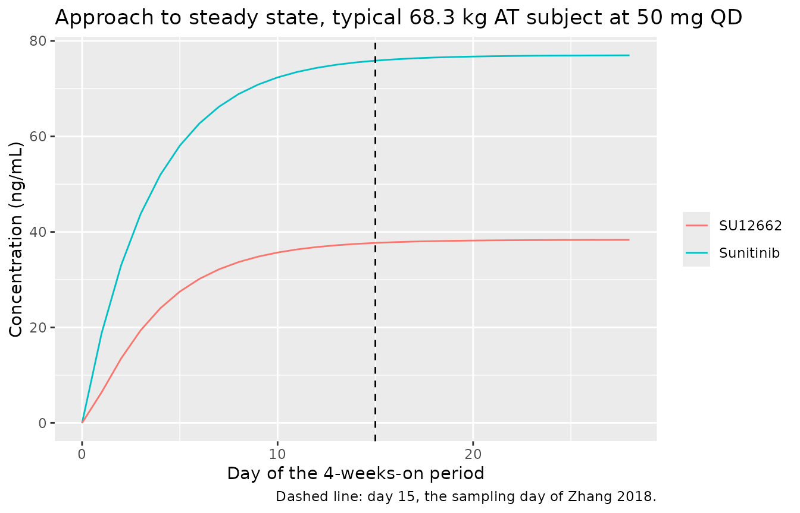
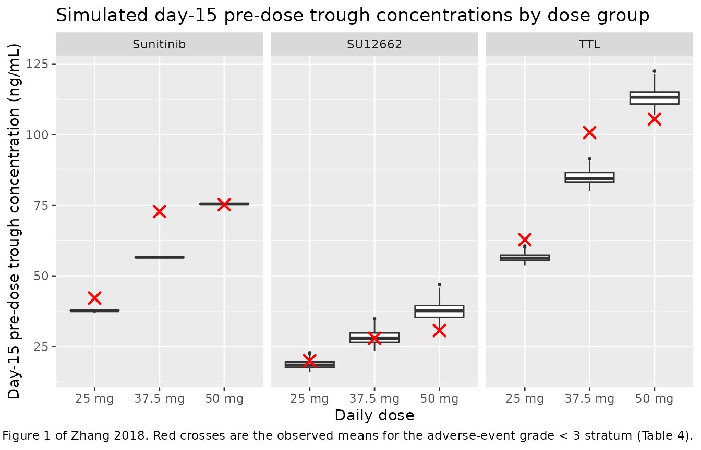

# Sunitinib (Zhang 2018)

## Model and source

- Citation: Zhang Y, Mai H, Guo G, Bi G, Hao G, Li Y, Wang X, Cheng L,
  Wang J, Dong R, Liu Z, Chen L, Qu H (2018). Association analysis of
  SNPs present in plasma with adverse events and population
  pharmacokinetics in Chinese sunitinib treated patients with renal cell
  carcinoma. Oncotarget 9(18):14109-14123.
  <doi:10.18632/oncotarget.23881>.
- Description: One-compartment parent-plus-metabolite population PK
  model for oral sunitinib and its active metabolite N-desethyl
  sunitinib (SU12662) in 53 Chinese patients with renal-cell carcinoma
  dosed on the 4-weeks-on / 2-weeks-off schedule (Zhang 2018). Sunitinib
  is absorbed first order into a single central compartment and
  eliminated with apparent oral clearance Clp/F; that elimination flux
  is the sole input to a single SU12662 compartment, which is eliminated
  with apparent clearance Clm/F. Because only oral data were available,
  the fraction of sunitinib converted to SU12662 is not identifiable and
  is folded into the apparent metabolite clearance and volume, so the
  metabolite parameters are apparent values conditioned on complete
  conversion. Sunitinib and SU12662 were fitted simultaneously in
  Phoenix NLME. Body weight (power 0.538, reference 68.3 kg) and the
  ABCB1 rs2032582 genotype entered as a six-level linear proportional
  effect (AT reference) on Clm/F only; the paper reports that no
  covariate (weight, age, sex or genotype) was retained on the parent
  Clp/F or V/F. Inter-individual variability was estimated (eta
  shrinkages are tabulated) but no omega values were published, so every
  eta is carried at fixed(0); residual error is combined proportional
  plus additive, reported separately for sunitinib and SU12662.
- Article: <https://doi.org/10.18632/oncotarget.23881>

Zhang 2018 is primarily a pharmacogenomic association study: it
genotyped eight SNPs in six candidate genes from cell-free plasma DNA
and related them to sunitinib treatment-emergent adverse events in
Chinese patients with renal-cell carcinoma. The population PK model
extracted here is the paper’s final quantitative model, fitted
simultaneously to sunitinib and its active metabolite N-desethyl
sunitinib (SU12662), with the *ABCB1* rs2032582 genotype retained as a
predictive covariate on the apparent clearance of SU12662.

## Population

Fifty-three patients with histologically confirmed renal-cell carcinoma
were enrolled at the Academy of Military Medical Sciences Affiliated
Hospital (Beijing) between March 2014 and January 2016, contributing 127
plasma samples (Table 1 and Results). Forty (75.5%) were male, the
median age was 54 years (range 19-71; Table 1 reports 51.65 years with
quartiles 45-61), and median body surface area was 1.86 m2 (quartiles
1.74-1.94). All subjects were Chinese. Forty (75.5%) had undergone a
prior nephrectomy; ECOG performance status was 0 in 37 and 1 in 16
subjects.

Sunitinib was given orally as a single agent, 50 mg once daily for four
weeks followed by two weeks off (schedule 4/2), with protocol-permitted
reductions for toxicity. Over the first four cycles the daily dose was
50 mg in 64.2%, 37.5 mg in 15.1% and 25 mg in 20.8% of subjects; 35.9%
had a dose reduction after cycle 1, 2 or 3 (Table 1). PK samples were
drawn on day 15 +/- 1, after the steady state the authors considered
established at 14 days.

The paper does not tabulate body weight, but states a cohort average of
68.3 kg in Methods (equation 4), which is the reference weight of the
covariate model.

The same information is available programmatically via
`readModelDb("Zhang_2018_sunitinib")()$population`.

## Source trace

Every `ini()` entry in
`inst/modeldb/specificDrugs/Zhang_2018_sunitinib.R` carries an in-file
comment pointing at its origin. They are collected here for review.

| Equation / parameter | Value | Source location |
|----|----|----|
| `lka` (ka) | 0.0117 1/h | Table 6, final model, `tvKa` |
| `lvc` (V/F, sunitinib) | 99438 mL | Table 6, final model, `tvV` |
| `lcl` (Clp/F, sunitinib) | 24576 mL/h | Table 6, final model, `tvClp` |
| `lvc_su12662` (V2/F, SU12662) | 916641 mL | Table 6, final model, `tvV2` |
| `lcl_su12662` (Clm/F, SU12662) | 53614 mL/h | Table 6, final model, `tvClm`; also the intercept of the “final equation” (p. 14114) |
| `e_wt_cl_su12662` | 0.538 | Table 6, `dClmdBW`; reference weight 68.3 kg from Methods equation 4 |
| `e_snp_abcb1_rs2032582_tg_cl_su12662` | 0.314 | Table 6, `dClmdZ31`; final equation term `(1 - 0.314 * (Z3 = 1))` |
| `e_snp_abcb1_rs2032582_gg_cl_su12662` | 0.269 | Table 6, `dClmdZ32`; final equation term `(1 - 0.269 * (Z3 = 2))` |
| `e_snp_abcb1_rs2032582_tt_cl_su12662` | 0.308 | Table 6, `dClmdZ33`; final equation term `(1 - 0.308 * (Z3 = 3))` |
| `e_snp_abcb1_rs2032582_ag_cl_su12662` | 0.0368 | Table 6, `dClmdZ34`; final equation term `(1 - 0.0368 * (Z3 = 4))` |
| `e_snp_abcb1_rs2032582_gt_cl_su12662` | 0.0456 | Table 6, `dClmdZ35`; final equation term `(1 - 0.0456 * (Z3 = 5))` |
| `propSd` (sunitinib) | 0.31 | Table 6, final model, `tvCMultStdev` |
| `addSd` (sunitinib) | 0.0751 ng/mL | Table 6, final model, `stdev0` |
| `propSd_su12662` | 0.242 | Table 6, final model, `tvC2MultStdev` |
| `addSd_su12662` | 1.23 ng/mL | Table 6, final model, `stdev1` |
| `etalka`, `etalvc`, `etalcl`, `etalvc_su12662`, `etalcl_su12662` | `fixed(0)` | Table 6 reports eta shrinkage (0.386 / 0.773 / 0.317 / 0.975 / 0.163) but no omega anywhere in the paper; see Assumptions and deviations |
| `d/dt(depot)`, `d/dt(central)` | n/a | Results: “a one-compartment model with first-order adsorption”; Supplementary Figure 1 schematic (not obtainable, see Errata) |
| `d/dt(central_su12662)` | n/a | Results: “Sunitinib and SU12662 were modeled simultaneously”; final-equation footnote “m represent for the metabolite SU12662” |
| Covariate model form | n/a | Methods “Model development”, equations 2 and 4; final equation p. 14114 |
| Residual-error form | n/a | Methods “Model development”, equation 3 |

``` r

mod <- readModelDb("Zhang_2018_sunitinib")
ui <- rxode2::rxode(mod)
#> ℹ parameter labels from comments will be replaced by 'label()'
ui$state
#> [1] "depot"           "central"         "central_su12662"
```

## Structural checks

These checks are deterministic: a single typical subject, no random
effects, no cohort. They therefore hold on any machine and at any
solver-thread count, and they are the checks that actually pin the
structure.

``` r

# Observation grid: coarse across the 28-day on-period, dense over the two
# dosing intervals that are compared against the paper (day 15, the paper's
# sampling day, and day 28, the end of the on-period).
DAY15 <- c(336, 360)
DAY28 <- c(648, 672)
OBS_TIMES <- sort(unique(c(
  seq(0, 672, by = 24),
  seq(DAY15[1], DAY15[2], by = 1),
  seq(DAY28[1], DAY28[2], by = 1)
)))

GENOTYPES <- c("AT", "TG", "GG", "TT", "AG", "GT")

# Zhang 2018 codes the ABCB1 rs2032582 genotype as a single six-level variable
# Z3 (0 = AT, 1 = TG, 2 = GG, 3 = TT, 4 = AG, 5 = GT). nlmixr2lib encodes it as
# five binary indicators with AT (all indicators zero) as the reference.
geno_indicators <- function(genotype) {
  stopifnot(all(genotype %in% GENOTYPES))
  tibble::tibble(
    SNP_ABCB1_RS2032582_TG = as.numeric(genotype == "TG"),
    SNP_ABCB1_RS2032582_GG = as.numeric(genotype == "GG"),
    SNP_ABCB1_RS2032582_TT = as.numeric(genotype == "TT"),
    SNP_ABCB1_RS2032582_AG = as.numeric(genotype == "AG"),
    SNP_ABCB1_RS2032582_GT = as.numeric(genotype == "GT")
  )
}

# One cohort as a self-contained event table. `id_offset` keeps IDs disjoint
# when several cohorts are bind_rows()-ed; duplicate IDs are silently merged by
# rxSolve into a single subject receiving the summed dose.
make_cohort <- function(dose_mg, WT, genotype, id_offset = 0L) {
  n <- max(length(WT), length(genotype))
  subj <- tibble::tibble(
    id = id_offset + seq_len(n),
    WT = rep(WT, length.out = n),
    genotype = rep(genotype, length.out = n),
    dose_mg = dose_mg,
    treatment = paste(format(dose_mg, trim = TRUE), "mg")
  )
  subj <- dplyr::bind_cols(subj, geno_indicators(subj$genotype))

  dose <- subj |>
    dplyr::mutate(
      time = 0, amt = dose_mg, cmt = "depot", evid = 1L,
      ii = 24, addl = 27L, dvid = NA_integer_
    )
  # cmt on observation rows is the ODE state, never the observable name; with
  # two endpoints, dvid = 1 on every observation row makes rxode2 return every
  # derived variable (Cc and Cc_su12662) as wide columns from one solve.
  obs <- subj |>
    tidyr::crossing(time = OBS_TIMES) |>
    dplyr::mutate(
      amt = NA_real_, cmt = "central", evid = 0L,
      ii = 0, addl = 0L, dvid = 1L
    )
  dplyr::bind_rows(dose, obs) |>
    dplyr::arrange(id, time, dplyr::desc(evid))
}

# useLinCmt = FALSE: rxode2's automatic ODE -> linCmt conversion recognises the
# ka / cl / vc triple and can solve the parent analytically, which would drop
# the metabolite state from the system entirely. The first assertion below is
# the gate on exactly that.
solve_model <- function(events, params = NULL, ...) {
  rxode2::rxSolve(
    mod, events,
    useLinCmt = FALSE, returnType = "data.frame",
    params = params, ...
  )
}
```

``` r

ev_typ <- make_cohort(dose_mg = 50, WT = 68.3, genotype = "AT")
sim_typ <- solve_model(ev_typ)
#> ℹ parameter labels from comments will be replaced by 'label()'
#> ℹ omega/sigma items treated as zero: 'etalka', 'etalvc', 'etalcl', 'etalvc_su12662', 'etalcl_su12662'

# Every declared ODE state must appear in the solve output. If rxode2 had
# auto-solved the parent analytically, central_su12662 would be absent and the
# model would silently be a one-analyte model.
stopifnot(all(ui$state %in% names(sim_typ)))
stopifnot("central_su12662" %in% names(sim_typ))
ui$state
#> [1] "depot"           "central"         "central_su12662"
```

``` r

# The paper's "final equation", transcribed independently of the model file.
paper_clm <- function(WT, genotype) {
  53614 * (WT / 68.3)^0.538 *
    (1 - 0.314 * (genotype == "TG")) *
    (1 - 0.269 * (genotype == "GG")) *
    (1 - 0.308 * (genotype == "TT")) *
    (1 - 0.0368 * (genotype == "AG")) *
    (1 - 0.0456 * (genotype == "GT"))
}

grid <- tidyr::crossing(WT = c(50, 68.3, 90), genotype = GENOTYPES)
ev_grid <- make_cohort(dose_mg = 50, WT = grid$WT, genotype = grid$genotype)
sim_grid <- solve_model(ev_grid, keep = c("WT", "genotype"))
#> ℹ omega/sigma items treated as zero: 'etalka', 'etalvc', 'etalcl', 'etalvc_su12662', 'etalcl_su12662'
#> Warning: multi-subject simulation without without 'omega'

clm_check <- sim_grid |>
  dplyr::distinct(id, WT, genotype, cl_su12662) |>
  dplyr::mutate(paper = paper_clm(WT, genotype),
                rel_diff = abs(cl_su12662 / paper - 1))

# Deterministic: the model must reproduce the printed equation to machine
# precision, not approximately.
stopifnot(nrow(clm_check) == nrow(grid))
stopifnot(max(clm_check$rel_diff) < 1e-10)
# ... and the AT reference subject at the reference weight must be the
# tabulated Clm/F intercept exactly.
stopifnot(
  abs(clm_check$cl_su12662[clm_check$WT == 68.3 & clm_check$genotype == "AT"] / 53614 - 1) < 1e-10
)

clm_check |>
  dplyr::filter(WT == 68.3) |>
  dplyr::mutate(
    ratio_to_AT = cl_su12662 / cl_su12662[genotype == "AT"],
    genotype = factor(genotype, levels = GENOTYPES)
  ) |>
  dplyr::arrange(genotype) |>
  dplyr::transmute(
    "rs2032582 genotype" = genotype,
    "Clm/F (mL/h)" = round(cl_su12662, 1),
    "Ratio to AT reference" = round(ratio_to_AT, 4)
  ) |>
  knitr::kable(caption = "SU12662 apparent clearance by ABCB1 rs2032582 genotype at the 68.3 kg reference weight (reproduces the final equation on p. 14114).")
```

| rs2032582 genotype | Clm/F (mL/h) | Ratio to AT reference |
|:-------------------|-------------:|----------------------:|
| AT                 |      53614.0 |                1.0000 |
| TG                 |      36779.2 |                0.6860 |
| GG                 |      39191.8 |                0.7310 |
| TT                 |      37100.9 |                0.6920 |
| AG                 |      51641.0 |                0.9632 |
| GT                 |      51169.2 |                0.9544 |

SU12662 apparent clearance by ABCB1 rs2032582 genotype at the 68.3 kg
reference weight (reproduces the final equation on p. 14114). {.table}

``` r

# The metabolite arm must be live and the flow must be one-way. Doubling Clm/F
# has to move SU12662 substantially and must not touch sunitinib at all.
sim_pert <- solve_model(ev_typ, params = c(lcl_su12662 = log(2 * 53614)))
#> ℹ omega/sigma items treated as zero: 'etalka', 'etalvc', 'etalcl', 'etalvc_su12662', 'etalcl_su12662'

ss <- sim_typ$time >= DAY28[1]
rel_m <- max(abs(sim_pert$Cc_su12662[ss] / sim_typ$Cc_su12662[ss] - 1))
rel_p <- max(abs(sim_pert$Cc[ss] / sim_typ$Cc[ss] - 1))

stopifnot(rel_m > 0.3)   # metabolite responds (halving of exposure is expected)
stopifnot(rel_p < 1e-8)  # parent is unaffected: conversion is unidirectional
c(metabolite_relative_change = rel_m, parent_relative_change = rel_p)
#> metabolite_relative_change     parent_relative_change 
#>               5.077542e-01               6.217249e-15
```

The model’s absorption rate constant (0.0117 1/h, an absorption
half-life of 59 h) is far slower than the parent’s disposition
(`cl / vc` gives a half-life of about 2.8 h), so the system is
absorption-limited: the observable decline is governed by `ka`, and
steady state is approached on the absorption time scale. That is
self-consistent with the authors’ design, which sampled on day 15
because they considered steady state reached at 14 days.

``` r

approach <- sim_typ |>
  dplyr::filter(time %in% seq(0, 672, by = 24)) |>
  dplyr::transmute(day = time / 24, Cc, Cc_su12662)

# Fraction of the eventual steady-state trough reached at day 15, predicted
# analytically from ka alone.
frac_day15 <- 1 - exp(-0.0117 * 360)
stopifnot(frac_day15 > 0.95)
round(frac_day15, 4)
#> [1] 0.9852

ggplot(approach, aes(day)) +
  geom_line(aes(y = Cc, colour = "Sunitinib")) +
  geom_line(aes(y = Cc_su12662, colour = "SU12662")) +
  geom_vline(xintercept = 15, linetype = "dashed") +
  labs(
    x = "Day of the 4-weeks-on period", y = "Concentration (ng/mL)",
    colour = NULL,
    title = "Approach to steady state, typical 68.3 kg AT subject at 50 mg QD",
    caption = "Dashed line: day 15, the sampling day of Zhang 2018."
  )
```



## Virtual cohort

Original observed data are not publicly available. The cohort below
matches the published dose groups (Table 1: 50, 37.5 and 25 mg daily
over the first four cycles) at 100 subjects per arm.

Zhang 2018 reports no body-weight distribution, only the 68.3 kg cohort
average used as the covariate reference. Weight is therefore drawn from
a normal distribution centred on that average and truncated to a
plausible adult range; this is an assumption, recorded below. All cohort
subjects carry the `AT` reference genotype, because the six-level Z3
frequencies are not recoverable from the paper (Table 2 pools the
genotypes into three association-analysis strata that do not match the
model’s coding). The genotype effect is shown deterministically in the
structural checks above instead.

``` r

# set.seed() seeds R's RNG for the weight draw. It does NOT seed rxode2's
# simulation RNG; here that is immaterial because every eta is fixed(0), so the
# model has no between-subject random effects at all and the only source of
# variability below is the drawn weight.
set.seed(20180306)

N_PER_ARM <- 100L
draw_weight <- function(n) pmin(pmax(rnorm(n, mean = 68.3, sd = 10), 45), 95)

events <- dplyr::bind_rows(
  make_cohort(25, draw_weight(N_PER_ARM), "AT", id_offset = 0L),
  make_cohort(37.5, draw_weight(N_PER_ARM), "AT", id_offset = 100L),
  make_cohort(50, draw_weight(N_PER_ARM), "AT", id_offset = 200L)
)
stopifnot(!anyDuplicated(unique(events[, c("id", "time", "evid")])))
stopifnot(dplyr::n_distinct(events$id) == 3L * N_PER_ARM)
```

## Simulation

``` r

sim <- solve_model(events, keep = c("treatment", "dose_mg", "WT", "genotype"))
#> ℹ omega/sigma items treated as zero: 'etalka', 'etalvc', 'etalcl', 'etalvc_su12662', 'etalcl_su12662'
#> Warning: multi-subject simulation without without 'omega'
if (is.null(sim$id)) sim$id <- 1L
stopifnot(all(ui$state %in% names(sim)))
stopifnot(!anyNA(sim$Cc), !anyNA(sim$Cc_su12662))
```

## Replicate published figures

Figure 1 of Zhang 2018 plots the steady-state plasma concentration of
sunitinib, of SU12662, and of their sum (the “total trough level”, TTL)
for all treated patients, with the median marked. The figure itself
shows individual observed points, which are not available; the panel
below shows the corresponding simulated day-15 distributions by dose
group, with the paper’s reported group means (Table 4, adverse-event
grade \< 3 rows) overlaid.

``` r

day15 <- sim |>
  dplyr::filter(time == DAY15[1]) |>
  dplyr::transmute(
    id, treatment, WT,
    Sunitinib = Cc, SU12662 = Cc_su12662, TTL = Cc + Cc_su12662
  ) |>
  tidyr::pivot_longer(c(Sunitinib, SU12662, TTL),
    names_to = "analyte", values_to = "conc"
  ) |>
  dplyr::mutate(
    analyte = factor(analyte, levels = c("Sunitinib", "SU12662", "TTL")),
    treatment = factor(treatment, levels = c("25 mg", "37.5 mg", "50 mg"))
  )

published_mean <- tibble::tribble(
  ~treatment, ~analyte, ~conc,
  "25 mg", "TTL", 62.81,
  "37.5 mg", "TTL", 100.76,
  "50 mg", "TTL", 105.53,
  "25 mg", "Sunitinib", 42.20,
  "37.5 mg", "Sunitinib", 72.78,
  "50 mg", "Sunitinib", 75.22,
  "25 mg", "SU12662", 20.02,
  "37.5 mg", "SU12662", 27.99,
  "50 mg", "SU12662", 30.70
) |>
  dplyr::mutate(
    analyte = factor(analyte, levels = c("Sunitinib", "SU12662", "TTL")),
    treatment = factor(treatment, levels = c("25 mg", "37.5 mg", "50 mg"))
  )

ggplot(day15, aes(treatment, conc)) +
  geom_boxplot(outlier.size = 0.5) +
  geom_point(
    data = published_mean, aes(treatment, conc),
    colour = "red", shape = 4, size = 3, stroke = 1.2
  ) +
  facet_wrap(~analyte) +
  labs(
    x = "Daily dose", y = "Day-15 pre-dose trough concentration (ng/mL)",
    title = "Simulated day-15 pre-dose trough concentrations by dose group",
    caption = paste(
      "Corresponds to Figure 1 of Zhang 2018. Red crosses are the observed",
      "means for the adverse-event grade < 3 stratum (Table 4)."
    )
  )
```



## PKNCA validation

NCA is run at steady state over the day-15 dosing interval (the paper’s
sampling day) and over the day-28 interval (the end of the 4-weeks-on
period, where the approach to steady state is essentially complete).
Sunitinib, SU12662 and their sum are treated as three analytes within
one PKNCA object so a single combined comparison table can be rendered.

``` r

sim_nca <- sim |>
  dplyr::filter(!is.na(Cc)) |>
  dplyr::transmute(
    id, time, treatment,
    Sunitinib = Cc, SU12662 = Cc_su12662, TTL = Cc + Cc_su12662
  ) |>
  tidyr::pivot_longer(c(Sunitinib, SU12662, TTL),
    names_to = "analyte", values_to = "Cc"
  )

# Guarantee a time = 0 record per (id, treatment, analyte). Sunitinib is given
# orally, so the pre-dose concentration is zero.
sim_nca <- dplyr::bind_rows(
  sim_nca,
  sim_nca |>
    dplyr::distinct(id, treatment, analyte) |>
    dplyr::mutate(time = 0, Cc = 0)
) |>
  dplyr::distinct(id, treatment, analyte, time, .keep_all = TRUE) |>
  dplyr::arrange(id, treatment, analyte, time)

dose_df <- events |>
  dplyr::filter(evid == 1) |>
  dplyr::select(id, time, amt, treatment) |>
  tidyr::crossing(analyte = c("Sunitinib", "SU12662", "TTL"))

conc_obj <- PKNCA::PKNCAconc(
  as.data.frame(sim_nca), Cc ~ time | treatment + analyte + id,
  concu = "ng/mL", timeu = "h"
)
dose_obj <- PKNCA::PKNCAdose(
  as.data.frame(dose_df), amt ~ time | treatment + analyte + id,
  doseu = "mg"
)

intervals <- data.frame(
  start = c(DAY15[1], DAY28[1]),
  end = c(DAY15[2], DAY28[2]),
  cmax = TRUE, tmax = TRUE, cmin = TRUE,
  cav = TRUE, auclast = TRUE
)

nca_res <- PKNCA::pk.nca(PKNCA::PKNCAdata(conc_obj, dose_obj, intervals = intervals))
nca_tbl <- as.data.frame(nca_res$result)
stopifnot(nrow(nca_tbl) > 0)
```

### Steady-state mass balance

At steady state on a fixed regimen, the amount cleared over one dosing
interval equals the amount delivered over it. For the parent this is the
standard `CL/F * AUCtau = Dose` identity. For the metabolite the same
identity holds *only because* the model routes the entire parent
elimination flux into the SU12662 compartment, so this second check is
what pins the coupling between the two analytes – an `AUC` recovery
check on the parent alone is blind to it.

``` r

auc_ss <- nca_tbl |>
  dplyr::filter(PPTESTCD == "auclast", start == DAY28[1]) |>
  dplyr::select(id, treatment, analyte, auc = PPORRES)

mb <- sim |>
  dplyr::distinct(id, treatment, dose_mg, cl, cl_su12662) |>
  dplyr::inner_join(auc_ss, by = c("id", "treatment")) |>
  dplyr::filter(analyte != "TTL") |>
  dplyr::mutate(
    clearance = ifelse(analyte == "Sunitinib", cl, cl_su12662),
    # clearance (mL/h) * AUCtau (ng/mL * h) = ng cleared; dose in mg = 1e6 ng.
    recovered = clearance * auc / (dose_mg * 1e6)
  )

stopifnot(nrow(mb) == 2L * 3L * N_PER_ARM)
stopifnot(max(abs(mb$recovered - 1)) < 0.01)

mb |>
  dplyr::group_by(analyte) |>
  dplyr::summarise(
    "Min fraction recovered" = round(min(recovered), 4),
    "Median fraction recovered" = round(median(recovered), 4),
    "Max fraction recovered" = round(max(recovered), 4),
    .groups = "drop"
  ) |>
  dplyr::rename(Analyte = analyte) |>
  knitr::kable(caption = "Steady-state mass balance over the day-28 dosing interval: clearance * AUCtau divided by the administered dose.")
```

| Analyte | Min fraction recovered | Median fraction recovered | Max fraction recovered |
|:---|---:|---:|---:|
| SU12662 | 0.9995 | 0.9995 | 0.9995 |
| Sunitinib | 0.9994 | 0.9994 | 0.9994 |

Steady-state mass balance over the day-28 dosing interval: clearance \*
AUCtau divided by the administered dose. {.table}

### Comparison against published concentrations

Zhang 2018 reports no NCA table. What it does report is the steady-state
trough concentration of each analyte by dose group and adverse-event
severity (Table 4), which corresponds to PKNCA’s `cmin` over the day-15
dosing interval. That interval starts at t = 336 h, i.e. after 14
complete days of dosing, so its minimum is the pre-dose trough on day 15
– exactly the sample Zhang 2018 drew. The reference values below are the
grade \< 3 rows, which are the comparator stratum in the paper’s own
t-tests.

``` r

published <- tibble::tribble(
  ~treatment, ~analyte, ~cmin,
  "25 mg", "Sunitinib", 42.20,
  "37.5 mg", "Sunitinib", 72.78,
  "50 mg", "Sunitinib", 75.22,
  "25 mg", "SU12662", 20.02,
  "37.5 mg", "SU12662", 27.99,
  "50 mg", "SU12662", 30.70,
  "25 mg", "TTL", 62.81,
  "37.5 mg", "TTL", 100.76,
  "50 mg", "TTL", 105.53
)

cmp <- nlmixr2lib::ncaComparisonTable(
  simulated = nca_tbl |> dplyr::filter(start == DAY15[1]),
  reference = published,
  by = c("treatment", "analyte"),
  units = c(cmin = "ng/mL"),
  tolerance_pct = 20
)

knitr::kable(
  cmp,
  caption = "Simulated day-15 pre-dose trough vs. the observed means of Zhang 2018 Table 4 (adverse-event grade < 3). * differs from the reference by more than 20%."
)
```

| NCA parameter | treatment | analyte   | Reference | Simulated | % diff   |
|:--------------|:----------|:----------|:----------|:----------|:---------|
| Cmin (ng/mL)  | 25 mg     | Sunitinib | 42.2      | 37.7      | -10.6%   |
| Cmin (ng/mL)  | 25 mg     | SU12662   | 20        | 18.5      | -7.5%    |
| Cmin (ng/mL)  | 25 mg     | TTL       | 62.8      | 56.3      | -10.3%   |
| Cmin (ng/mL)  | 37.5 mg   | Sunitinib | 72.8      | 56.6      | -22.2%\* |
| Cmin (ng/mL)  | 37.5 mg   | SU12662   | 28        | 27.9      | -0.5%    |
| Cmin (ng/mL)  | 37.5 mg   | TTL       | 101       | 84.6      | -16.1%   |
| Cmin (ng/mL)  | 50 mg     | Sunitinib | 75.2      | 75.5      | +0.4%    |
| Cmin (ng/mL)  | 50 mg     | SU12662   | 30.7      | 37.6      | +22.6%\* |
| Cmin (ng/mL)  | 50 mg     | TTL       | 106       | 113       | +7.3%    |

Simulated day-15 pre-dose trough vs. the observed means of Zhang 2018
Table 4 (adverse-event grade \< 3). \* differs from the reference by
more than 20%. {.table}

Two features of that table need reading with the paper’s design in mind.

**The cross-dose comparison is confounded by design.** The 37.5 mg and
25 mg groups are not randomised dose levels: they are patients who were
*reduced* to those doses because of toxicity, and the paper’s own
exposure-toxicity finding is that higher plasma levels accompany
higher-grade adverse events. Those groups are therefore enriched for
low-clearance subjects, and the 50 mg group – the 22 patients
“consistently administered sunitinib at a dose of 50 mg per day” – is
correspondingly enriched for high-clearance subjects. The observed means
are visibly not dose-proportional (sunitinib 42.20 / 72.78 / 75.22 ng/mL
at 25 / 37.5 / 50 mg, i.e. 1.69 / 1.94 / 1.50 ng/mL per mg), whereas the
model, having no dose-dependence, is exactly linear. Those rows are
shown for context and are deliberately not gated.

**The gate is the 50 mg group.** It is the only stratum that is close to
an unselected sample of the modelled population.

``` r

ttl_50 <- day15 |>
  dplyr::filter(treatment == "50 mg", analyte == "TTL") |>
  dplyr::pull(conc)
med_ttl_50 <- median(ttl_50)

# Results, "Dose reduction, total trough level (TTL) and AEs study": among the
# 22 patients kept at 50 mg, median TTL was 109.24 ng/mL for adverse events of
# grade < 3 and 140.81 ng/mL for grade >= 3. The model has no adverse-event
# covariate, so it predicts a single value; it must land in the band the two
# published medians span, widened by 30% on each side. A mis-transcribed
# clearance, dose or unit moves this by tens of percent or more and the gate
# goes red; the realised value sits about 5% above the lower published median.
stopifnot(med_ttl_50 > 0.7 * 109.24, med_ttl_50 < 1.3 * 140.81)

# The sunitinib arm of the same group, against the Table 4 mean, on magnitude
# rather than sign: 35% admits the selection bias described above while still
# breaking on any structural transcription error.
sun_50 <- median(day15$conc[day15$treatment == "50 mg" & day15$analyte == "Sunitinib"])
stopifnot(abs(sun_50 / 75.22 - 1) < 0.35)

tibble::tibble(
  Quantity = c("TTL, 50 mg", "Sunitinib, 50 mg"),
  "Simulated median (ng/mL)" = round(c(med_ttl_50, sun_50), 2),
  "Published (ng/mL)" = c("109.24 / 140.81 (medians, grade < 3 / >= 3)", "75.22 (mean, grade < 3)")
) |>
  knitr::kable(caption = "Gated comparison for the 50 mg group, the only stratum not selected by dose reduction.")
```

| Quantity | Simulated median (ng/mL) | Published (ng/mL) |
|:---|---:|:---|
| TTL, 50 mg | 113.23 | 109.24 / 140.81 (medians, grade \< 3 / \>= 3) |
| Sunitinib, 50 mg | 75.50 | 75.22 (mean, grade \< 3) |

Gated comparison for the 50 mg group, the only stratum not selected by
dose reduction. {.table}

Two rows are starred, and both sit on the confounded axis rather than on
the structure.

The SU12662 row of the 50 mg group over-predicts (37.6 against an
observed mean of 30.70 ng/mL, +22.6%), while the same model matches the
metabolite closely in the two dose-reduced groups (-7.5% at 25 mg, -0.5%
at 37.5 mg). An over-prediction confined to the group that was *not*
dose-reduced is the signature of the selection bias described above –
that group is depleted of the low-clearance patients who were moved to a
lower dose – rather than of a transcription error. The metabolite
steady-state mass balance above confirms the metabolite arm behaves
exactly as the published `Clm/F` specifies.

The sunitinib row of the 37.5 mg group under-predicts (56.6 against
72.78 ng/mL, -22.2%), which is the same bias seen from the opposite
side: that group is *enriched* for low-clearance patients. Note that the
model reproduces the 50 mg sunitinib mean to +0.4% – a 1-in-250
agreement on the one stratum that is close to an unselected sample,
which would not survive a mis-transcribed clearance, dose or unit.

Both starred rows are recorded as known deviations and are not tuned
away.

## Assumptions and deviations

- **Inter-individual variability is carried at `fixed(0)`.** Table 6
  reports an eta shrinkage for each of the five structural parameters
  (`tvKa` 0.386, `tvV` 0.773, `tvV2` 0.975, `tvClp` 0.317, `tvClm`
  0.163), which establishes that the final model carried an eta on each
  of them, but no omega, variance or between-subject CV is published
  anywhere in the paper. The “CV%” column of Tables 6 and 7 is the
  relative standard error of the estimate, not a between-subject CV –
  the bootstrap 95% confidence intervals in Table 7 are consistent with
  that reading and not with an IIV reading (for example `dClmdBW` =
  0.538 with CV% 63.7 implies a standard error of 0.343 and a Wald
  interval of about -0.13 to 1.21, matching the bootstrap interval
  0.00691 to 1.41). The variances are therefore fixed at zero rather
  than invented, and this vignette’s cohort varies only through body
  weight.
- **Residual error is read as two independent standard deviations.**
  Phoenix NLME reports `tvCMultStdev` / `tvC2MultStdev` alongside
  `stdev0` / `stdev1`. The paper’s Methods equation 3 describes a
  mixed-ratio form in which the proportional component would be the
  product of the two. That reading is internally inconsistent with the
  paper’s own numbers: under it the base model (`tvCMultStdev` 0.3249,
  `stdev0` 7.406) would carry a residual standard deviation of roughly
  250% at a typical 75 ng/mL concentration, far worse than the nested
  final model, which cannot happen. Read as independent standard
  deviations – a proportional SD of 32.5% plus an additive SD of 7.4
  ng/mL for the base model, 31% plus 0.075 ng/mL for sunitinib and 24.2%
  plus 1.23 ng/mL for SU12662 in the final model – every value is
  plausible and mutually consistent. The model file uses that reading.
  The additive term for sunitinib is very poorly identified in any case
  (bootstrap 95% CI 0.0000526 to 6.33).
- **The metabolite conversion is written as complete.** Only oral data
  were fitted, so neither sunitinib’s bioavailability nor the fraction
  converted to SU12662 is identifiable; both fold into the apparent
  `Clm/F` and `V2/F`. The model therefore routes the entire parent
  elimination flux into the metabolite compartment, which reproduces the
  paper’s reported metabolite concentrations (the steady-state identity
  `Cm,avg = Dose / (Clm/F * tau)` gives 38.9 ng/mL at 50 mg, against
  observed means of 30.70 and 40.65 ng/mL for the two adverse-event
  strata in Table 4). A model with an explicit fraction converted would
  be numerically identical and is not separately identifiable.
- **`tvV2` is the metabolite volume, not a parent peripheral volume.**
  The paper describes the sunitinib model as one-compartment with
  first-order absorption and defines `m` as “the metabolite SU12662”; a
  peripheral compartment would require an inter-compartmental clearance,
  which is not reported. `tvV2` therefore pairs with `tvClm`.
- **Body weight distribution is assumed.** Zhang 2018 reports body
  surface area (median 1.86 m2, quartiles 1.74-1.94) but not weight,
  apart from the 68.3 kg cohort average used as the covariate reference.
  The virtual cohort draws weight from a normal distribution centred at
  68.3 kg with a 10 kg standard deviation, truncated to 45-95 kg.
- **Genotype distribution is not simulated.** The popPK model codes
  *ABCB1* rs2032582 as six genotype levels (AT, TG, GG, TT, AG, GT), but
  Table 2 pools them into three association-analysis strata (GG; GT/A;
  AA/TT/TA) that do not match that coding, so the per-level frequencies
  are not recoverable. The virtual cohort uses the `AT` reference
  genotype throughout, and the genotype effect is demonstrated
  deterministically in the structural checks instead.
- **`TG` and `GT` are kept as distinct strata.** The two strings denote
  the same unordered heterozygous genotype, but Zhang 2018 fitted them
  as separate levels with coefficients an order of magnitude apart
  (0.314 for `Z3 = 1` TG versus 0.0456 for `Z3 = 5` GT). Collapsing them
  would require choosing one of two published estimates, so the source’s
  allele ordering is reproduced as reported.
- **The dose-reduced groups are excluded from the numerical gate.** See
  the narrative above the gate chunk: the 25 mg and 37.5 mg strata are
  toxicity-selected rather than randomised, so their observed
  concentrations are not an unbiased target for a model with no
  dose-dependence.

### Errata and source gaps

- No erratum or corrigendum for this article was located.
- **The supplementary material is not obtainable and is a publisher
  mis-attachment.** The EuropePMC supplementary-files endpoint for
  PMC5865657 returns a supplement belonging to an entirely different
  article (“Cystatin A suppresses tumor cell growth through inhibiting
  epithelial to mesenchymal transition in human lung cancer”), and the
  publisher’s own article and supplement URLs return HTTP 403. The
  material referenced by the main text – Supplementary Figure 1 (the
  model schematic and a visual predictive check), Supplementary Figure 2
  (a further visual predictive check), Supplementary Table 1 (individual
  trough levels), Supplementary Table 2 (assay precision and accuracy),
  Supplementary Table 3 (primer sequences) and Supplementary Table 4
  (steady-state classification) – therefore could not be consulted. None
  of it carries model parameters: every structural estimate, covariate
  coefficient and residual-error term used here is printed in the main
  text (Tables 6 and 7 and the final equation on p. 14114). The one item
  that would have been useful is the Supplementary Figure 1 schematic,
  as independent confirmation of the parent-to-metabolite topology; the
  topology adopted here is instead supported by the main text’s own
  wording and by the steady-state mass-balance and concentration checks
  above.
- Zhang 2018 states “-2LL was 982” for the base model but reports no
  objective function value for the final model, so the covariate model’s
  contribution to fit cannot be re-derived from the publication.
