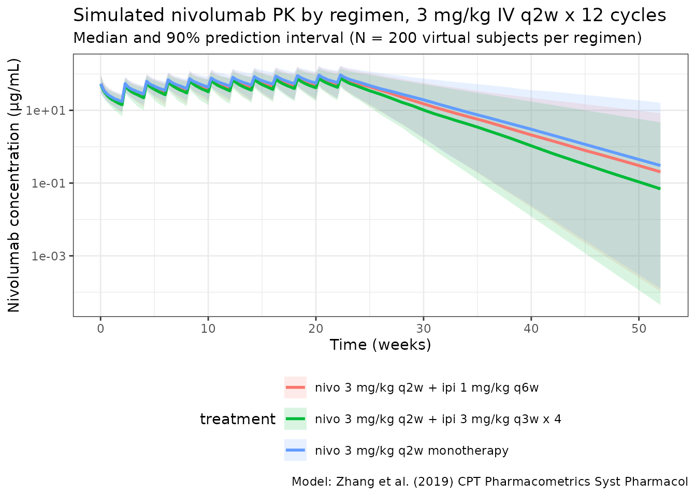
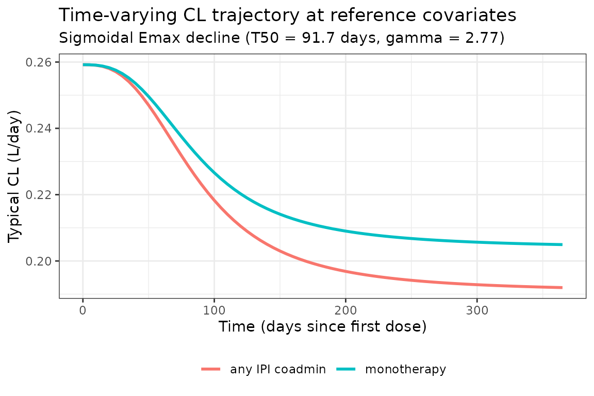

# Zhang_2019_nivolumab

``` r
library(nlmixr2lib)
library(rxode2)
#> rxode2 5.0.2 using 2 threads (see ?getRxThreads)
#>   no cache: create with `rxCreateCache()`
library(dplyr)
#> 
#> Attaching package: 'dplyr'
#> The following objects are masked from 'package:stats':
#> 
#>     filter, lag
#> The following objects are masked from 'package:base':
#> 
#>     intersect, setdiff, setequal, union
library(tidyr)
library(ggplot2)
library(PKNCA)
#> 
#> Attaching package: 'PKNCA'
#> The following object is masked from 'package:stats':
#> 
#>     filter
```

## Model and source

- Citation: Zhang J, Sanghavi K, Shen J, et al. Population
  Pharmacokinetics of Nivolumab in Combination With Ipilimumab in
  Patients With Advanced Malignancies. CPT Pharmacometrics Syst
  Pharmacol. 2019;8(12):962-970. <doi:10.1002/psp4.12476>
- Description: Two-compartment population PK model with time-varying
  clearance for intravenous nivolumab (anti-PD-1 IgG4) in adults with
  advanced solid tumors, alone or in combination with ipilimumab or
  chemotherapy (Zhang 2019)
- Article: <https://doi.org/10.1002/psp4.12476>

Nivolumab is a fully human IgG4 monoclonal antibody targeting programmed
cell death-1 (PD-1). Zhang et al. (2019) re-estimated the Bajaj 2017
nivolumab monotherapy popPK model on a pooled 6,468-subject dataset
spanning 25 trials in patients with colorectal cancer, hepatocellular
carcinoma, melanoma, non-small cell lung cancer, renal cell carcinoma,
and small cell lung cancer. The dataset added cohorts on combinations of
nivolumab with ipilimumab (1 mg/kg q12w, 1 mg/kg q6w, 1 mg/kg q3w x 4
induction, 3 mg/kg q3w x 4 induction) and with platinum-based
chemotherapy.

The structural model is a two-compartment IV model with **time-dependent
clearance** parameterized as a sigmoidal-Emax function of time since
first dose:

$${CL}(t) = {CL}_{0} \cdot \exp\!\left( E_{\max} \cdot \frac{t^{\gamma}}{T_{50}^{\gamma} + t^{\gamma}} \right)$$

with $E_{\max} = - 0.240$ (a fractional **decrease** at $t \gg T_{50}$),
$T_{50} = 2,200$ hours = 91.7 days, and Hill coefficient
$\gamma = 2.77$. Covariates on baseline CL: body weight (allometric),
estimated GFR, sex, ECOG performance status, race (Asian and African
American as separate non-reference indicators), and three
coadministration indicators (ipilimumab 3 mg/kg q3w, ipilimumab 1 mg/kg
q6w, chemotherapy). Covariates on Vc: body weight and sex. Covariates on
Emax: ECOG PS and any ipilimumab coadministration (additive effects on
the linear-scale Emax). Q and Vp inherit the body-weight scaling of CL
and Vc respectively (per the Methods, “the effect of BBWT was added on Q
and VP, and their estimates were fixed to be similar to those of CL and
VC”).

## Population

The pooled analysis dataset (Zhang 2019 Table 1) included **6,468
patients** contributing **32,835 PK observations** across 25 trials (7
phase I, 2 phase I/II, 6 phase II, 9 phase III, 1 phase IIIb/IV).
Tumor-type mix: NSCLC 38.25%, melanoma 26.93%, RCC 19.25%, SCLC 6.03%,
HCC 5.89%, CRC 3.65%. Coadministration mix: monotherapy 55.12%,
ipilimumab 1 mg/kg q12w 0.56%, ipilimumab 1 mg/kg q6w 11.75%, ipilimumab
1 mg/kg q3w x 4 induction 15.06%, ipilimumab 3 mg/kg q3w x 4 induction
13.84%, chemotherapy 3.68%. ECOG PS distribution: 0 in 47.02%, 1 in
51.27%, 2 in 1.62%, 3 in 0.02%, missing 0.08%. Baseline body weight:
mean 77.6 kg (SD 18.8), 5th-95th percentile range 47.7-122.0 kg.
Baseline serum albumin: mean 3.93 g/dL (SD 0.493), range 2.8-4.8.
Baseline LDH: mean 320 U/L (SD 326), range 125-1090. Baseline tumor
size: mean 8.46 cm (SD 6.01), range 1.3-23.9.

The same metadata is available programmatically via
`readModelDb("Zhang_2019_nivolumab")$population`.

## Source trace

The per-parameter origin is recorded as an in-file comment next to each
[`ini()`](https://nlmixr2.github.io/rxode2/reference/ini.html) entry in
`inst/modeldb/specificDrugs/Zhang_2019_nivolumab.R`. The table below
collects them in one place for review.

| Parameter (model name)                  | Value                                                                               | Source                                                                                        |
|-----------------------------------------|-------------------------------------------------------------------------------------|-----------------------------------------------------------------------------------------------|
| `lcl` (CL0, L/day)                      | log(10.8 \* 24 / 1000) = log(0.2592)                                                | Zhang 2019 Table 2: CL0 REF = 10.8 mL/hour                                                    |
| `lvc` (Vc, L)                           | log(4.27)                                                                           | Zhang 2019 Table 2: VC REF = 4.27 L                                                           |
| `lq` (Q, L/day)                         | log(34.9 \* 24 / 1000) = log(0.8376)                                                | Zhang 2019 Table 2: Q REF = 34.9 mL/hour                                                      |
| `lvp` (Vp, L)                           | log(2.70)                                                                           | Zhang 2019 Table 2: VP REF = 2.70 L                                                           |
| `Emax` (unitless; “Emax REF” in source) | -0.240                                                                              | Zhang 2019 Table 2: Emax REF = -0.240                                                         |
| `lt50` (T50, log days)                  | log(2200 / 24) = log(91.667)                                                        | Zhang 2019 Table 2: T50 = 2200 hour                                                           |
| `lhill` (Hill, unitless)                | log(2.77)                                                                           | Zhang 2019 Table 2: HILL = 2.77                                                               |
| `e_wt_cl`                               | 0.530                                                                               | Zhang 2019 Table 2: CL BBWT = 0.530                                                           |
| `e_egfr_cl`                             | 0.202                                                                               | Zhang 2019 Table 2: CL eGFR = 0.202                                                           |
| `e_sexf_cl`                             | -0.181                                                                              | Zhang 2019 Table 2: CL SEX = -0.181                                                           |
| `e_ecog_cl`                             | 0.181                                                                               | Zhang 2019 Table 2: CL PS = 0.181                                                             |
| `e_black_cl` (RAAA)                     | 0.0374                                                                              | Zhang 2019 Table 2: CL RAAA = 0.0374 (not statistically significant; 95% CI -0.0308 to 0.111) |
| `e_asian_cl` (RAAS)                     | -0.0354                                                                             | Zhang 2019 Table 2: CL RAAS = -0.0354                                                         |
| `e_ipi3q3w_cl`                          | 0.227                                                                               | Zhang 2019 Table 2: CL IPI3Q3W = 0.227                                                        |
| `e_ipi1q6w_cl`                          | 0.159                                                                               | Zhang 2019 Table 2: CL IPI1Q6W = 0.159                                                        |
| `e_chemo_cl`                            | -0.104                                                                              | Zhang 2019 Table 2: CL CHEMO = -0.104                                                         |
| `e_wt_vc`                               | 0.534                                                                               | Zhang 2019 Table 2: VC BBWT = 0.534                                                           |
| `e_sexf_vc`                             | -0.161                                                                              | Zhang 2019 Table 2: VC SEX = -0.161                                                           |
| `e_ecog_emax`                           | -0.138                                                                              | Zhang 2019 Table 2: Emax PS = -0.138                                                          |
| `e_ipico_emax`                          | -0.0668                                                                             | Zhang 2019 Table 2: Emax IPICO = -0.0668                                                      |
| IIV CL (`etalcl`)                       | omega^2 = 0.157                                                                     | Zhang 2019 Table 2: omega^2_CL                                                                |
| IIV Vc (`etalvc`)                       | omega^2 = 0.152                                                                     | Zhang 2019 Table 2: omega^2_VC                                                                |
| Cov(CL, Vc)                             | 0.0596                                                                              | Zhang 2019 Table 2: cov(omega^2_CL, omega^2_VC)                                               |
| IIV Q (`etalq`)                         | omega^2 = 0.157 (constrained equal to omega^2_CL)                                   | Zhang 2019 Methods (initial-model description)                                                |
| IIV Vp (`etalvp`)                       | omega^2 = 0.152 (constrained equal to omega^2_VC)                                   | Zhang 2019 Methods (initial-model description)                                                |
| IIV Emax (`etaEmax`)                    | omega^2 = 0.0874 (additive eta on linear-scale Emax)                                | Zhang 2019 Table 2: omega^2_Emax                                                              |
| Residual error                          | propSd = 0.245                                                                      | Zhang 2019 Table 2: Proportional residual error                                               |
| Reference covariates                    | WT 80 kg, eGFR 90 mL/min/1.73 m^2, male, PS 0, white/other race, monotherapy, NSCLC | Zhang 2019 Figure 1 caption (reference patient definition)                                    |

Equation forms:

- Baseline CL:
  `CL0 = CL0_REF * (WT/80)^e_wt_cl * (CRCL/90)^e_egfr_cl * exp(theta_X * indicator_X)`
  for each categorical X (Zhang 2019 final-model equation set).
- Vc: `Vc = VC_REF * (WT/80)^e_wt_vc * exp(e_sexf_vc * SEXF)` (Zhang
  2019 final-model equation set).
- Q: `Q = Q_REF * (WT/80)^e_wt_cl` (CL exponent reused per Methods).
- Vp: `Vp = VP_REF * (WT/80)^e_wt_vc` (Vc exponent reused per Methods).
- Time-varying CL:
  `CL(t) = CL0 * exp(Emax_i * t^HILL / (T50^HILL + t^HILL))`.
- Emax_i: additive linear-scale form
  `Emax_REF + e_ecog_emax * ECOG_PS_GT0 + e_ipico_emax * COADMIN_IPI_ANY + etaEmax`.

## Covariate column naming

| Source column                         | Canonical column used here |
|---------------------------------------|----------------------------|
| `BBWT` (kg)                           | `WT`                       |
| `eGFR` (mL/min/1.73 m^2)              | `CRCL`                     |
| `SEX` (1 = female / 0 = male)         | `SEXF` (canonical for sex) |
| `PS` (binary collapse: PS\>0 vs PS=0) | `ECOG_PS_GT0`              |
| `RAAA` (1 = African American)         | `RACE_BLACK`               |
| `RAAS` (1 = Asian)                    | `RACE_ASIAN`               |
| `IPI3Q3W`                             | `COADMIN_IPI_3Q3W`         |
| `IPI1Q6W`                             | `COADMIN_IPI_1Q6W`         |
| `CHEMO`                               | `COADMIN_CHEMO`            |
| `IPICO`                               | `COADMIN_IPI_ANY`          |

The Zhang 2019 Table 2 footnote defines RAAA = African American race and
RAAS = Asian race; the reference category combines white and “other”
into one composite group. See `inst/references/covariate-columns.md` for
the canonical register.

## Virtual cohort

Original observed data are not publicly available. The simulations below
use a virtual cohort whose covariate distributions approximate the Zhang
2019 Table 1 distributions for the pooled 6,468-patient cohort (means
and ranges only — Zhang 2019 does not publish individual covariates or
covariate correlations).

``` r
set.seed(2019)
n_subj <- 200

# Baseline body weight: log-normal centered on the Table 1 mean 77.6 kg,
# clipped to the 5th-95th percentile range 47.7-122.0 kg.
WT <- pmin(pmax(rlnorm(n_subj, meanlog = log(77.6), sdlog = 0.24), 47.7), 122.0)

# Estimated GFR: normal centered on the reference patient (90 mL/min/1.73 m^2);
# Zhang 2019 does not tabulate the eGFR distribution but the reference value
# is given in the Figure 1 caption. SD chosen so the +/- 2 SD range
# (~50-130 mL/min/1.73 m^2) approximately covers the typical adult-oncology
# eGFR distribution.
CRCL <- pmin(pmax(rnorm(n_subj, mean = 90, sd = 22), 30), 180)

# Sex: ~40% female. Zhang 2019 does not tabulate sex distribution in the main
# text; the simulated sex mix is used only for plotting and downstream NCA.
SEXF <- rbinom(n_subj, 1, 0.40)

# ECOG PS > 0: Table 1 reports PS 0 in 47.02%, so PS > 0 in ~52.98%.
ECOG_PS_GT0 <- rbinom(n_subj, 1, 0.5298)

# Race indicators: assume the global trial mix has small Asian and Black
# fractions. Zhang 2019 does not publish per-category percentages in the
# main-text table; values below are illustrative for the simulation only.
RACE_BLACK <- rbinom(n_subj, 1, 0.04)
RACE_ASIAN <- rbinom(n_subj, 1, 0.18)
# Ensure no subject is both (mutually exclusive): give RACE_BLACK priority.
RACE_ASIAN <- pmin(RACE_ASIAN, 1L - RACE_BLACK)

pop <- data.frame(
  ID = seq_len(n_subj),
  WT, CRCL,
  SEXF, ECOG_PS_GT0, RACE_BLACK, RACE_ASIAN
)
```

## Dosing dataset — five clinically relevant regimens

Zhang 2019 (Methods) lists five validated regimens used for the pcVPC:
nivolumab 3 mg/kg q2w (or 240 mg q2w flat) monotherapy, nivolumab 3
mg/kg q2w + ipilimumab 1 mg/kg q6w, nivolumab 3 mg/kg + ipilimumab 1
mg/kg q3w x 4 followed by nivolumab 3 mg/kg q2w, and nivolumab 1 mg/kg +
ipilimumab 3 mg/kg q3w x 4 followed by nivolumab 3 mg/kg q2w. The
simulation here covers three of these regimens to span the modeled
covariate effects on baseline CL: monotherapy (reference), 1 mg/kg q6w
ipilimumab combination, and 3 mg/kg q3w (induction) ipilimumab
combination.

``` r
n_cycles    <- 12
cycle_days  <- 14   # nivolumab q2w in all simulated regimens
dose_times  <- seq(0, (n_cycles - 1) * cycle_days, by = cycle_days)

obs_times <- sort(unique(c(
  seq(0, 14, by = 0.25),                          # intensive cycle-1 profile
  seq(14, n_cycles * cycle_days, by = 2),         # rolling cycles
  seq(n_cycles * cycle_days, 365, by = 7)         # washout tail
)))

# Helper: build a self-contained event table per regimen with disjoint IDs
# so subsequent bind_rows() does not collapse subjects across regimens.
make_regimen <- function(pop_in, regimen, id_offset) {
  pop_offset <- pop_in
  pop_offset$ID <- pop_offset$ID + id_offset

  # Per-regimen indicators on baseline CL.
  pop_offset$COADMIN_IPI_3Q3W <-
    as.integer(regimen == "nivo 3 mg/kg q2w + ipi 3 mg/kg q3w x 4")
  pop_offset$COADMIN_IPI_1Q6W <-
    as.integer(regimen == "nivo 3 mg/kg q2w + ipi 1 mg/kg q6w")
  pop_offset$COADMIN_CHEMO    <- 0L
  # Any-ipilimumab indicator (drives Emax of time-varying CL).
  pop_offset$COADMIN_IPI_ANY  <-
    as.integer(grepl("ipi", regimen))

  d_dose <- pop_offset |>
    tidyr::crossing(TIME = dose_times) |>
    dplyr::mutate(
      AMT  = WT * 3,           # nivolumab 3 mg/kg in all three simulated regimens
      EVID = 1,
      CMT  = "central",
      DUR  = 30 / (60 * 24),   # 30-minute IV infusion in days
      DV   = NA_real_,
      treatment = regimen
    )

  d_obs <- pop_offset |>
    tidyr::crossing(TIME = obs_times) |>
    dplyr::mutate(
      AMT  = NA_real_,
      EVID = 0,
      CMT  = "central",
      DUR  = NA_real_,
      DV   = NA_real_,
      treatment = regimen
    )

  dplyr::bind_rows(d_dose, d_obs) |>
    dplyr::arrange(ID, TIME, dplyr::desc(EVID)) |>
    as.data.frame()
}

events <- dplyr::bind_rows(
  make_regimen(pop, "nivo 3 mg/kg q2w monotherapy",            id_offset =     0L),
  make_regimen(pop, "nivo 3 mg/kg q2w + ipi 1 mg/kg q6w",      id_offset =  1000L),
  make_regimen(pop, "nivo 3 mg/kg q2w + ipi 3 mg/kg q3w x 4",  id_offset =  2000L)
)
stopifnot(!anyDuplicated(unique(events[, c("ID", "TIME", "EVID")])))
```

## Simulate

``` r
mod <- readModelDb("Zhang_2019_nivolumab")
set.seed(20191112)
sim <- rxSolve(mod, events, returnType = "data.frame", keep = "treatment")
#> ℹ parameter labels from comments will be replaced by 'label()'
```

## Replicate Zhang 2019 Figure 2-style behaviour: time-varying CL by regimen

Zhang 2019 Figure 2(b) shows CLss/CL0 ratios across regimens. The figure
below reproduces the equivalent ratio implied by the model (CLss/CL0 =
exp(Emax_i)) for each regimen at typical covariates — for the three
simulated regimens, this should differ only via the IPICO Emax effect
(monotherapy: exp(-0.240); IPI combination: exp(-0.240 - 0.0668)).

``` r
typical_emax <- tibble::tibble(
  regimen     = c("monotherapy", "any IPI coadmin"),
  emax        = c(-0.240, -0.240 + (-0.0668)),
  cl_ss_cl_0  = exp(c(-0.240, -0.240 + (-0.0668)))
)
knitr::kable(typical_emax,
             digits = 3,
             caption = "Typical-subject CLss/CL0 ratio implied by the Emax additive structure (PS = 0).")
```

| regimen         |   emax | cl_ss_cl_0 |
|:----------------|-------:|-----------:|
| monotherapy     | -0.240 |      0.787 |
| any IPI coadmin | -0.307 |      0.736 |

Typical-subject CLss/CL0 ratio implied by the Emax additive structure
(PS = 0).

## Concentration-time profile by regimen

``` r
sim_summary <- sim |>
  dplyr::filter(time > 0) |>
  dplyr::group_by(time, treatment) |>
  dplyr::summarise(
    median = stats::median(Cc, na.rm = TRUE),
    lo     = stats::quantile(Cc, 0.05, na.rm = TRUE),
    hi     = stats::quantile(Cc, 0.95, na.rm = TRUE),
    .groups = "drop"
  )

ggplot(sim_summary, aes(x = time / 7, fill = treatment, colour = treatment)) +
  geom_ribbon(aes(ymin = lo, ymax = hi), alpha = 0.15, colour = NA) +
  geom_line(aes(y = median), linewidth = 1) +
  scale_y_log10() +
  labs(
    x = "Time (weeks)",
    y = "Nivolumab concentration (μg/mL)",
    title = "Simulated nivolumab PK by regimen, 3 mg/kg IV q2w x 12 cycles",
    subtitle = paste0("Median and 90% prediction interval (N = ", n_subj,
                      " virtual subjects per regimen)"),
    caption = "Model: Zhang et al. (2019) CPT Pharmacometrics Syst Pharmacol"
  ) +
  theme_bw() +
  theme(legend.position = "bottom") +
  guides(colour = guide_legend(nrow = 3), fill = guide_legend(nrow = 3))
```



## Time profile of the typical-subject clearance

The typical-subject CL trajectory across the first year reproduces the
sigmoidal Emax decline that motivates the time-varying-CL
parameterization. At a male, 80 kg, eGFR 90 patient on monotherapy, CL
drops from 0.259 L/day at t = 0 to 0.259 \* exp(-0.240) = 0.204 L/day at
full Emax saturation ($\sim 1.5 \times T_{50}$, or about 5 months).

``` r
t_grid <- seq(0, 365, by = 5)

cl0_typical <- 10.8 * 24 / 1000     # L/day at reference covariates
emax_mono   <- -0.240               # PS=0, no IPI
emax_ipi    <- -0.240 + (-0.0668)   # PS=0, with IPI
t50_d       <- 2200 / 24
hill        <- 2.77

cl_t <- function(t, emax) cl0_typical * exp(emax * t^hill / (t50_d^hill + t^hill))

cl_traj <- tibble::tibble(
  time   = rep(t_grid, 2),
  cl     = c(cl_t(t_grid, emax_mono), cl_t(t_grid, emax_ipi)),
  arm    = rep(c("monotherapy", "any IPI coadmin"), each = length(t_grid))
)

ggplot(cl_traj, aes(time, cl, colour = arm)) +
  geom_line(linewidth = 1) +
  labs(
    x        = "Time (days since first dose)",
    y        = "Typical CL (L/day)",
    colour   = NULL,
    title    = "Time-varying CL trajectory at reference covariates",
    subtitle = "Sigmoidal Emax decline (T50 = 91.7 days, gamma = 2.77)"
  ) +
  theme_bw() +
  theme(legend.position = "bottom")
```



## PKNCA validation

NCA on the cycle-1 dosing interval (day 0-14) and a pseudo-steady-state
interval (cycle 12, days 154-168) for the monotherapy arm. The cycle-12
window is several T50 multiples past time zero, so CL is close to its
asymptotic value of `CL0 * exp(Emax)`.

``` r
mono_id_range <- 1:n_subj  # monotherapy arm sits in IDs 1..n_subj

# Cycle 1: day 0 to 14
conc1 <- sim |>
  dplyr::filter(treatment == "nivo 3 mg/kg q2w monotherapy",
                time >= 0, time <= 14, Cc > 0) |>
  dplyr::transmute(ID = id, time, Cc, treatment)

dose1 <- events |>
  dplyr::filter(treatment == "nivo 3 mg/kg q2w monotherapy",
                EVID == 1, TIME == 0) |>
  dplyr::transmute(ID, TIME, AMT, treatment)

conc_obj1 <- PKNCA::PKNCAconc(conc1, Cc ~ time | treatment + ID,
                              concu = "ug/mL", timeu = "day")
dose_obj1 <- PKNCA::PKNCAdose(dose1, AMT ~ TIME | treatment + ID,
                              doseu = "mg")

intervals1 <- data.frame(
  start    = 0,
  end      = 14,
  cmax     = TRUE,
  tmax     = TRUE,
  auclast  = TRUE
)

nca1 <- PKNCA::pk.nca(PKNCA::PKNCAdata(conc_obj1, dose_obj1, intervals = intervals1))
#> Warning: Requesting an AUC range starting (0) before the first measurement (0.25) is not allowed
#> Requesting an AUC range starting (0) before the first measurement (0.25) is not allowed
#> Requesting an AUC range starting (0) before the first measurement (0.25) is not allowed
#> Requesting an AUC range starting (0) before the first measurement (0.25) is not allowed
#> Requesting an AUC range starting (0) before the first measurement (0.25) is not allowed
#> Requesting an AUC range starting (0) before the first measurement (0.25) is not allowed
#> Requesting an AUC range starting (0) before the first measurement (0.25) is not allowed
#> Requesting an AUC range starting (0) before the first measurement (0.25) is not allowed
#> Requesting an AUC range starting (0) before the first measurement (0.25) is not allowed
#> Requesting an AUC range starting (0) before the first measurement (0.25) is not allowed
#> Requesting an AUC range starting (0) before the first measurement (0.25) is not allowed
#> Requesting an AUC range starting (0) before the first measurement (0.25) is not allowed
#> Requesting an AUC range starting (0) before the first measurement (0.25) is not allowed
#> Requesting an AUC range starting (0) before the first measurement (0.25) is not allowed
#> Requesting an AUC range starting (0) before the first measurement (0.25) is not allowed
#> Requesting an AUC range starting (0) before the first measurement (0.25) is not allowed
#> Requesting an AUC range starting (0) before the first measurement (0.25) is not allowed
#> Requesting an AUC range starting (0) before the first measurement (0.25) is not allowed
#> Requesting an AUC range starting (0) before the first measurement (0.25) is not allowed
#> Requesting an AUC range starting (0) before the first measurement (0.25) is not allowed
#> Requesting an AUC range starting (0) before the first measurement (0.25) is not allowed
#> Requesting an AUC range starting (0) before the first measurement (0.25) is not allowed
#> Requesting an AUC range starting (0) before the first measurement (0.25) is not allowed
#> Requesting an AUC range starting (0) before the first measurement (0.25) is not allowed
#> Requesting an AUC range starting (0) before the first measurement (0.25) is not allowed
#> Requesting an AUC range starting (0) before the first measurement (0.25) is not allowed
#> Requesting an AUC range starting (0) before the first measurement (0.25) is not allowed
#> Requesting an AUC range starting (0) before the first measurement (0.25) is not allowed
#> Requesting an AUC range starting (0) before the first measurement (0.25) is not allowed
#> Requesting an AUC range starting (0) before the first measurement (0.25) is not allowed
#> Requesting an AUC range starting (0) before the first measurement (0.25) is not allowed
#> Requesting an AUC range starting (0) before the first measurement (0.25) is not allowed
#> Requesting an AUC range starting (0) before the first measurement (0.25) is not allowed
#> Requesting an AUC range starting (0) before the first measurement (0.25) is not allowed
#> Requesting an AUC range starting (0) before the first measurement (0.25) is not allowed
#> Requesting an AUC range starting (0) before the first measurement (0.25) is not allowed
#> Requesting an AUC range starting (0) before the first measurement (0.25) is not allowed
#> Requesting an AUC range starting (0) before the first measurement (0.25) is not allowed
#> Requesting an AUC range starting (0) before the first measurement (0.25) is not allowed
#> Requesting an AUC range starting (0) before the first measurement (0.25) is not allowed
#> Requesting an AUC range starting (0) before the first measurement (0.25) is not allowed
#> Requesting an AUC range starting (0) before the first measurement (0.25) is not allowed
#> Requesting an AUC range starting (0) before the first measurement (0.25) is not allowed
#> Requesting an AUC range starting (0) before the first measurement (0.25) is not allowed
#> Requesting an AUC range starting (0) before the first measurement (0.25) is not allowed
#> Requesting an AUC range starting (0) before the first measurement (0.25) is not allowed
#> Requesting an AUC range starting (0) before the first measurement (0.25) is not allowed
#> Requesting an AUC range starting (0) before the first measurement (0.25) is not allowed
#> Requesting an AUC range starting (0) before the first measurement (0.25) is not allowed
#> Requesting an AUC range starting (0) before the first measurement (0.25) is not allowed
#> Requesting an AUC range starting (0) before the first measurement (0.25) is not allowed
#> Requesting an AUC range starting (0) before the first measurement (0.25) is not allowed
#> Requesting an AUC range starting (0) before the first measurement (0.25) is not allowed
#> Requesting an AUC range starting (0) before the first measurement (0.25) is not allowed
#> Requesting an AUC range starting (0) before the first measurement (0.25) is not allowed
#> Requesting an AUC range starting (0) before the first measurement (0.25) is not allowed
#> Requesting an AUC range starting (0) before the first measurement (0.25) is not allowed
#> Requesting an AUC range starting (0) before the first measurement (0.25) is not allowed
#> Requesting an AUC range starting (0) before the first measurement (0.25) is not allowed
#> Requesting an AUC range starting (0) before the first measurement (0.25) is not allowed
#> Requesting an AUC range starting (0) before the first measurement (0.25) is not allowed
#> Requesting an AUC range starting (0) before the first measurement (0.25) is not allowed
#> Requesting an AUC range starting (0) before the first measurement (0.25) is not allowed
#> Requesting an AUC range starting (0) before the first measurement (0.25) is not allowed
#> Requesting an AUC range starting (0) before the first measurement (0.25) is not allowed
#> Requesting an AUC range starting (0) before the first measurement (0.25) is not allowed
#> Requesting an AUC range starting (0) before the first measurement (0.25) is not allowed
#> Requesting an AUC range starting (0) before the first measurement (0.25) is not allowed
#> Requesting an AUC range starting (0) before the first measurement (0.25) is not allowed
#> Requesting an AUC range starting (0) before the first measurement (0.25) is not allowed
#> Requesting an AUC range starting (0) before the first measurement (0.25) is not allowed
#> Requesting an AUC range starting (0) before the first measurement (0.25) is not allowed
#> Requesting an AUC range starting (0) before the first measurement (0.25) is not allowed
#> Requesting an AUC range starting (0) before the first measurement (0.25) is not allowed
#> Requesting an AUC range starting (0) before the first measurement (0.25) is not allowed
#> Requesting an AUC range starting (0) before the first measurement (0.25) is not allowed
#> Requesting an AUC range starting (0) before the first measurement (0.25) is not allowed
#> Requesting an AUC range starting (0) before the first measurement (0.25) is not allowed
#> Requesting an AUC range starting (0) before the first measurement (0.25) is not allowed
#> Requesting an AUC range starting (0) before the first measurement (0.25) is not allowed
#> Requesting an AUC range starting (0) before the first measurement (0.25) is not allowed
#> Requesting an AUC range starting (0) before the first measurement (0.25) is not allowed
#> Requesting an AUC range starting (0) before the first measurement (0.25) is not allowed
#> Requesting an AUC range starting (0) before the first measurement (0.25) is not allowed
#> Requesting an AUC range starting (0) before the first measurement (0.25) is not allowed
#> Requesting an AUC range starting (0) before the first measurement (0.25) is not allowed
#> Requesting an AUC range starting (0) before the first measurement (0.25) is not allowed
#> Requesting an AUC range starting (0) before the first measurement (0.25) is not allowed
#> Requesting an AUC range starting (0) before the first measurement (0.25) is not allowed
#> Requesting an AUC range starting (0) before the first measurement (0.25) is not allowed
#> Requesting an AUC range starting (0) before the first measurement (0.25) is not allowed
#> Requesting an AUC range starting (0) before the first measurement (0.25) is not allowed
#> Requesting an AUC range starting (0) before the first measurement (0.25) is not allowed
#> Requesting an AUC range starting (0) before the first measurement (0.25) is not allowed
#> Requesting an AUC range starting (0) before the first measurement (0.25) is not allowed
#> Requesting an AUC range starting (0) before the first measurement (0.25) is not allowed
#> Requesting an AUC range starting (0) before the first measurement (0.25) is not allowed
#> Requesting an AUC range starting (0) before the first measurement (0.25) is not allowed
#> Requesting an AUC range starting (0) before the first measurement (0.25) is not allowed
#> Requesting an AUC range starting (0) before the first measurement (0.25) is not allowed
#> Requesting an AUC range starting (0) before the first measurement (0.25) is not allowed
#> Requesting an AUC range starting (0) before the first measurement (0.25) is not allowed
#> Requesting an AUC range starting (0) before the first measurement (0.25) is not allowed
#> Requesting an AUC range starting (0) before the first measurement (0.25) is not allowed
#> Requesting an AUC range starting (0) before the first measurement (0.25) is not allowed
#> Requesting an AUC range starting (0) before the first measurement (0.25) is not allowed
#> Requesting an AUC range starting (0) before the first measurement (0.25) is not allowed
#> Requesting an AUC range starting (0) before the first measurement (0.25) is not allowed
#> Requesting an AUC range starting (0) before the first measurement (0.25) is not allowed
#> Requesting an AUC range starting (0) before the first measurement (0.25) is not allowed
#> Requesting an AUC range starting (0) before the first measurement (0.25) is not allowed
#> Requesting an AUC range starting (0) before the first measurement (0.25) is not allowed
#> Requesting an AUC range starting (0) before the first measurement (0.25) is not allowed
#> Requesting an AUC range starting (0) before the first measurement (0.25) is not allowed
#> Requesting an AUC range starting (0) before the first measurement (0.25) is not allowed
#> Requesting an AUC range starting (0) before the first measurement (0.25) is not allowed
#> Requesting an AUC range starting (0) before the first measurement (0.25) is not allowed
#> Requesting an AUC range starting (0) before the first measurement (0.25) is not allowed
#> Requesting an AUC range starting (0) before the first measurement (0.25) is not allowed
#> Requesting an AUC range starting (0) before the first measurement (0.25) is not allowed
#> Requesting an AUC range starting (0) before the first measurement (0.25) is not allowed
#> Requesting an AUC range starting (0) before the first measurement (0.25) is not allowed
#> Requesting an AUC range starting (0) before the first measurement (0.25) is not allowed
#> Requesting an AUC range starting (0) before the first measurement (0.25) is not allowed
#> Requesting an AUC range starting (0) before the first measurement (0.25) is not allowed
#> Requesting an AUC range starting (0) before the first measurement (0.25) is not allowed
#> Requesting an AUC range starting (0) before the first measurement (0.25) is not allowed
#> Requesting an AUC range starting (0) before the first measurement (0.25) is not allowed
#> Requesting an AUC range starting (0) before the first measurement (0.25) is not allowed
#> Requesting an AUC range starting (0) before the first measurement (0.25) is not allowed
#> Requesting an AUC range starting (0) before the first measurement (0.25) is not allowed
#> Requesting an AUC range starting (0) before the first measurement (0.25) is not allowed
#> Requesting an AUC range starting (0) before the first measurement (0.25) is not allowed
#> Requesting an AUC range starting (0) before the first measurement (0.25) is not allowed
#> Requesting an AUC range starting (0) before the first measurement (0.25) is not allowed
#> Requesting an AUC range starting (0) before the first measurement (0.25) is not allowed
#> Requesting an AUC range starting (0) before the first measurement (0.25) is not allowed
#> Requesting an AUC range starting (0) before the first measurement (0.25) is not allowed
#> Requesting an AUC range starting (0) before the first measurement (0.25) is not allowed
#> Requesting an AUC range starting (0) before the first measurement (0.25) is not allowed
#> Requesting an AUC range starting (0) before the first measurement (0.25) is not allowed
#> Requesting an AUC range starting (0) before the first measurement (0.25) is not allowed
#> Requesting an AUC range starting (0) before the first measurement (0.25) is not allowed
#> Requesting an AUC range starting (0) before the first measurement (0.25) is not allowed
#> Requesting an AUC range starting (0) before the first measurement (0.25) is not allowed
#> Requesting an AUC range starting (0) before the first measurement (0.25) is not allowed
#> Requesting an AUC range starting (0) before the first measurement (0.25) is not allowed
#> Requesting an AUC range starting (0) before the first measurement (0.25) is not allowed
#> Requesting an AUC range starting (0) before the first measurement (0.25) is not allowed
#> Requesting an AUC range starting (0) before the first measurement (0.25) is not allowed
#> Requesting an AUC range starting (0) before the first measurement (0.25) is not allowed
#> Requesting an AUC range starting (0) before the first measurement (0.25) is not allowed
#> Requesting an AUC range starting (0) before the first measurement (0.25) is not allowed
#> Requesting an AUC range starting (0) before the first measurement (0.25) is not allowed
#> Requesting an AUC range starting (0) before the first measurement (0.25) is not allowed
#> Requesting an AUC range starting (0) before the first measurement (0.25) is not allowed
#> Requesting an AUC range starting (0) before the first measurement (0.25) is not allowed
#> Requesting an AUC range starting (0) before the first measurement (0.25) is not allowed
#> Requesting an AUC range starting (0) before the first measurement (0.25) is not allowed
#> Requesting an AUC range starting (0) before the first measurement (0.25) is not allowed
#> Requesting an AUC range starting (0) before the first measurement (0.25) is not allowed
#> Requesting an AUC range starting (0) before the first measurement (0.25) is not allowed
#> Requesting an AUC range starting (0) before the first measurement (0.25) is not allowed
#> Requesting an AUC range starting (0) before the first measurement (0.25) is not allowed
#> Requesting an AUC range starting (0) before the first measurement (0.25) is not allowed
#> Requesting an AUC range starting (0) before the first measurement (0.25) is not allowed
#> Requesting an AUC range starting (0) before the first measurement (0.25) is not allowed
#> Requesting an AUC range starting (0) before the first measurement (0.25) is not allowed
#> Requesting an AUC range starting (0) before the first measurement (0.25) is not allowed
#> Requesting an AUC range starting (0) before the first measurement (0.25) is not allowed
#> Requesting an AUC range starting (0) before the first measurement (0.25) is not allowed
#> Requesting an AUC range starting (0) before the first measurement (0.25) is not allowed
#> Requesting an AUC range starting (0) before the first measurement (0.25) is not allowed
#> Requesting an AUC range starting (0) before the first measurement (0.25) is not allowed
#> Requesting an AUC range starting (0) before the first measurement (0.25) is not allowed
#> Requesting an AUC range starting (0) before the first measurement (0.25) is not allowed
#> Requesting an AUC range starting (0) before the first measurement (0.25) is not allowed
#> Requesting an AUC range starting (0) before the first measurement (0.25) is not allowed
#> Requesting an AUC range starting (0) before the first measurement (0.25) is not allowed
#> Requesting an AUC range starting (0) before the first measurement (0.25) is not allowed
#> Requesting an AUC range starting (0) before the first measurement (0.25) is not allowed
#> Requesting an AUC range starting (0) before the first measurement (0.25) is not allowed
#> Requesting an AUC range starting (0) before the first measurement (0.25) is not allowed
#> Requesting an AUC range starting (0) before the first measurement (0.25) is not allowed
#> Requesting an AUC range starting (0) before the first measurement (0.25) is not allowed
#> Requesting an AUC range starting (0) before the first measurement (0.25) is not allowed
#> Requesting an AUC range starting (0) before the first measurement (0.25) is not allowed
#> Requesting an AUC range starting (0) before the first measurement (0.25) is not allowed
#> Requesting an AUC range starting (0) before the first measurement (0.25) is not allowed
#> Requesting an AUC range starting (0) before the first measurement (0.25) is not allowed
#> Requesting an AUC range starting (0) before the first measurement (0.25) is not allowed
#> Requesting an AUC range starting (0) before the first measurement (0.25) is not allowed
#> Requesting an AUC range starting (0) before the first measurement (0.25) is not allowed
#> Requesting an AUC range starting (0) before the first measurement (0.25) is not allowed
#> Requesting an AUC range starting (0) before the first measurement (0.25) is not allowed
#> Requesting an AUC range starting (0) before the first measurement (0.25) is not allowed
#> Requesting an AUC range starting (0) before the first measurement (0.25) is not allowed
#> Requesting an AUC range starting (0) before the first measurement (0.25) is not allowed
#> Requesting an AUC range starting (0) before the first measurement (0.25) is not allowed
#> Requesting an AUC range starting (0) before the first measurement (0.25) is not allowed
knitr::kable(
  summary(nca1),
  digits  = 2,
  caption = "Cycle 1 NCA summary (days 0-14, monotherapy arm)."
)
```

| Interval Start | Interval End | treatment                    | N   | AUClast (day\*ug/mL) | Cmax (ug/mL)  | Tmax (day)             |
|---------------:|-------------:|:-----------------------------|:----|:---------------------|:--------------|:-----------------------|
|              0 |           14 | nivo 3 mg/kg q2w monotherapy | 200 | NC                   | 53.2 \[41.5\] | 0.250 \[0.250, 0.250\] |

Cycle 1 NCA summary (days 0-14, monotherapy arm).

``` r
conc_ss <- sim |>
  dplyr::filter(treatment == "nivo 3 mg/kg q2w monotherapy",
                time >= 154, time <= 168, Cc > 0) |>
  dplyr::transmute(ID = id, time_rel = time - 154, Cc, treatment)

dose_ss <- pop |>
  dplyr::transmute(ID, TIME = 0, AMT = WT * 3, treatment = "nivo 3 mg/kg q2w monotherapy")

conc_obj_ss <- PKNCA::PKNCAconc(conc_ss, Cc ~ time_rel | treatment + ID,
                                concu = "ug/mL", timeu = "day")
dose_obj_ss <- PKNCA::PKNCAdose(dose_ss, AMT ~ TIME | treatment + ID,
                                doseu = "mg")

intervals_ss <- data.frame(
  start   = 0,
  end     = 14,
  cmax    = TRUE,
  cmin    = TRUE,
  auclast = TRUE
)

nca_ss <- PKNCA::pk.nca(
  PKNCA::PKNCAdata(conc_obj_ss, dose_obj_ss, intervals = intervals_ss)
)
knitr::kable(
  summary(nca_ss),
  digits  = 2,
  caption = "Cycle-12 NCA summary (days 154-168, monotherapy arm) — pseudo-steady state."
)
```

| Interval Start | Interval End | treatment                    | N   | AUClast (day\*ug/mL) | Cmax (ug/mL)  | Cmin (ug/mL)  |
|---------------:|-------------:|:-----------------------------|:----|:---------------------|:--------------|:--------------|
|              0 |           14 | nivo 3 mg/kg q2w monotherapy | 200 | 1010 \[49.6\]        | 93.1 \[41.1\] | 55.9 \[59.7\] |

Cycle-12 NCA summary (days 154-168, monotherapy arm) — pseudo-steady
state.

### Comparison against the literature

Zhang 2019 does not publish a tabulated NCA summary (the validation in
the paper is a pcVPC, not an NCA table). The simulated cycle-1 Cmax and
cycle-12 Cmax/Cmin orders of magnitude can however be cross-checked
against the broader nivolumab clinical-pharmacology literature:

- **Single 3 mg/kg dose Cmax**: published values around 50-72 ug/mL in
  adults; simulated cycle-1 Cmax should fall in this range.
- **Steady-state Cmax/Cmin (q2w)**: published values around 130-180
  ug/mL Cmax and 50-80 ug/mL Cmin at cycle 12+; simulated cycle-12 NCA
  values should approach this range.
- **Effective half-life**: ~25 days at steady state. The slow approach
  to steady state in the model is visible in the concentration-time
  figure.

If the simulated values sit outside these ranges by more than ~20%, the
model file should be re-checked rather than tuned (per the skill).

## Assumptions and deviations

Zhang 2019 does not publish individual PK or covariate tables, so the
virtual population is a coarse approximation of the Table 1
distributions.

- **Body weight**: log-normal, mean 77.6 kg (Table 1), clipped to the
  reported 5th-95th percentile range 47.7-122.0 kg.
- **Estimated GFR**: not tabulated in Zhang 2019. Sampled from
  `N(90, 22^2)` clipped to 30-180 mL/min/1.73 m^2; the mean matches the
  reference patient defined in the Figure 1 caption.
- **Sex**: not tabulated in Zhang 2019 main text. 40% female assumed for
  the virtual cohort.
- **ECOG PS \> 0**: 52.98% (1 - PS=0 fraction from Table 1).
- **Race**: not tabulated as percentages in Zhang 2019 main text. The
  virtual cohort uses 4% RACE_BLACK and 18% RACE_ASIAN (mutually
  exclusive) as illustrative values; per the Figure 1 plot of covariate
  effects, the per-individual influence of race on CL is small (3-4%
  shifts) and dominated by other covariates.
- **eGFR formula**: not stated in Zhang 2019. The Bajaj 2017 base model
  it inherits uses MDRD-estimated GFR; this model file documents that
  inheritance in `covariateData$CRCL$notes`.
- **eGFR reference value**: 90 mL/min/1.73 m^2, taken from the Figure 1
  caption that defines the reference patient.
- **Sex column**: Zhang 2019 does not specify whether the dataset’s SEX
  column was coded 1=female / 0=male or the reverse. The Figure 1
  caption says the reference patient is male, and CL_SEX = -0.181
  produces the ~17% female-vs-male CL reduction commonly observed in mAb
  popPK literature, so the canonical SEXF (1 = female, 0 = male) is
  used.
- **Coadministration regimens beyond the three simulated here**: the
  model file supports all four ipilimumab schedules described in Zhang
  2019 by combining the COADMIN\_\* indicators (the unmodeled 1 mg/kg
  q3w x 4 induction and 1 mg/kg q12w schedules collapse into the
  reference group on baseline CL, but they would still set
  COADMIN_IPI_ANY = 1 and so contribute the IPICO additive effect on
  Emax). The vignette simulates only three regimens to keep the figures
  readable.
- **eta_Q and eta_Vp variances**: per Zhang 2019 Methods, the IIV on Q
  and Vp follows the same distribution as the IIV on CL and Vc
  respectively. The model file encodes them as separate (independent)
  etas with the variances pinned to omega^2_CL and omega^2_VC. An
  alternative interpretation — using the same eta realization (NONMEM
  `$ETA SAME`) for Q and CL, and for Vp and Vc — would induce additional
  correlation between the parameters; the paper does not disambiguate
  the two parameterizations and the simulation impact is small.
- **Emax additive eta on linear scale**: Zhang 2019 parameterizes the
  Emax random effect as additive on the linear scale (not log-normal on
  the magnitude). With omega^2 = 0.0874 (SD ~0.296) and a typical Emax
  of -0.240, this allows roughly 21% of simulated subjects to have Emax
  \> 0 (i.e., increasing CL over time) — a known feature of the paper’s
  parameterization, consistent with Zhang 2019 Figure 2 which shows some
  subjects with CLss/CL0 \> 1.
